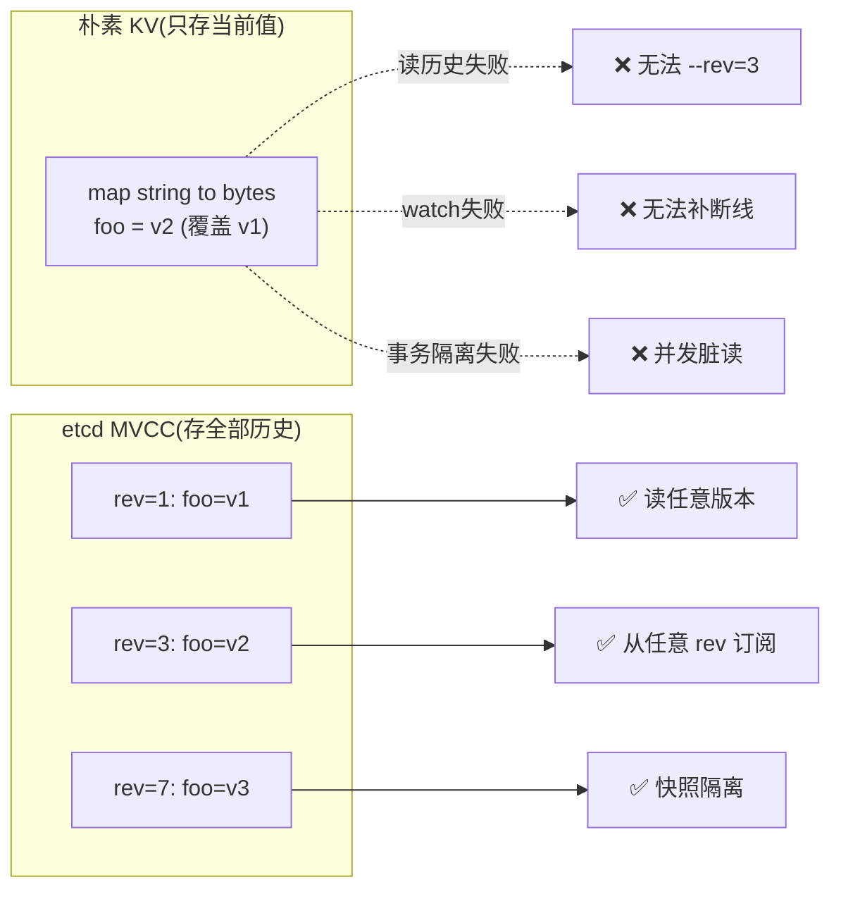

# 第十章 · revision 与 treeIndex/keyIndex

> 篇:P3 存储 mvcc:多版本的世界
> 主线呼应:前两章(P2-08 写路径、P2-09 读路径)我们看到,leader 把一条 `Put` propose 进 raft log、被多数派 commit、再经 `applyc` 通道交给应用层,`applierV3` 把它送进 mvcc。**问题是:mvcc 到底怎么存这些数据?**——这章给出答案的第一块骨架。etcd 不像普通 KV 那样只存"当前值",它**存全部历史**:每个 key 的每一次修改都留痕,并被打上一个**全局单调递增的 revision**。为了在这个"历史档案室"里按 key 快速翻到一个值,etcd 在内存里维护一棵 **treeIndex**(B-tree),每个 key 占一条 **keyIndex**,记录这个 key 从被创建、被改、被删、被重建的全部版本。本章只立数据结构骨架;下一章讲读写事务怎么用它,再后面讲 watch 怎么拿 revision 当游标。

## 核心问题

**etcd 不存"当前值",而存"全部历史"——为什么?怎么存?全局单调递增的 revision(main + sub)是什么,凭什么单调?treeIndex(内存 B-tree)怎么按 key 索引?每个 key 的一条 keyIndex(它的各代 generation、每个 revision)长什么样?tombstone(墓碑)怎么标记一个 key 的"生灭代"?**

读完本章你会明白:

1. 为什么 etcd 要 MVCC(多版本),不直接 key→当前 value——为了支持读历史版本、watch 从任意点订阅、事务快照隔离。
2. **revision 的 `Main` 和 `Sub` 两个字段**分别是什么:`Main` 是"事务号"(每个写事务 +1),`Sub` 是"事务内子序号"(同事务里第几次改,从 0 递增);为什么这套二元组能全局单调。
3. **treeIndex(内存 B-tree,只存 key→revision 列表)** 和 **backend bbolt(磁盘,存 revision→value)** 为什么必须分开:索引小放内存查得快,value 可能大放磁盘省内存,各取所长。
4. **keyIndex 的 generation(代)和 tombstone(墓碑)** 怎么表达"一个 key 的生灭史":删了再建就是新一代。

> **如果一读觉得太难**:先只记住三件事——① etcd 给每次修改发一个全局唯一、单调递增的 `revision`,这个 revision 同时是 value 在 bbolt 里的 key;② 内存里有一棵按 key 排序的 B-tree(`treeIndex`),每个 key 一条记录(`keyIndex`),只存这个 key 历次修改的 revision 列表,不存 value;③ 一个 key 被删除会在它的 `keyIndex` 末尾盖一个"墓碑",并另起一代(generation),表示"这个 key 的这一段生命结束了"。

---

## 10.1 一句话点破

> **etcd 给每一个写操作(更准确说,每一个写事务)发一个全局唯一、单调递增的 `revision`,把它当作 value 在磁盘(bbolt)里的主键;内存里维护一棵按 key 排序的 B-tree,每个 key 一条 `keyIndex`,只存这个 key 历次修改的 revision 列表(不存 value)。查一个 key 的值时,先在 B-tree 里按 key 找到它的 keyIndex、拿到该查的 revision,再去 bbolt 里用这个 revision 取出 value。索引小放内存,值可能大放磁盘,各取所长。**

这是结论,不是理由。本章倒过来拆:先看为什么不能只存"当前值",再看 revision 凭什么能当全局唯一主键,然后看 treeIndex / keyIndex 怎么组织一个 key 的多代历史,最后看 tombstone 怎么盖棺。

---

## 10.2 为什么不能只存"当前值":MVCC 是 etcd 的命门

假设 etcd 像普通 KV(`map[string][]byte`)那样,每次 `Put("foo", v2)` 直接覆盖 `foo` 的旧值 `v1`。听起来天经地义,但有三件事 etcd 根本做不到:

**第一,读历史版本。** Kubernetes 的 controller 经常要"我 30 秒前进来过,那时候这个 key 是什么值"——抱歉,被覆盖了,没了。`etcdctl get foo --rev=100` 这种"读某个历史版本"的功能,在覆盖式存储里**从原理上就做不出来**。对配置中心、审计场景,这是硬伤。

**第二,watch。** etcd 最杀手锏的能力是 watch:客户端说"从现在开始,`foo` 一旦变了就告诉我"。但如果存储只留当前值,你怎么知道"它从什么变成了什么"?朴素做法是加个 watcher 列表,`Put` 时遍历发通知——可如果客户端说"我想要从 **revision 1000** 开始的所有变更"(它在 1000 那个时刻断线重连,要补上这中间错过的),你一个覆盖式存储怎么补?它根本没存中间版本。

**第三,事务快照隔离。** etcd 支持 `Txn`:`if foo.value == "v1" then put foo "v2"`。这种"比较-然后-写"要可靠,读到的 `foo` 必须是某个一致时刻的快照,不能读到写了一半的状态。如果只有当前值,一个并发写就让你读到不一致中间态。

> **不这样会怎样**:朴素 `map[string][]byte`(只存当前值)→ 读不了历史、做不了 watch、做不出可靠事务。这三件事是 etcd 作为配置中心/协调服务的立身之本,缺一不可。

> **所以这样设计**:etcd 选择 **MVCC(Multi-Version Concurrency Control,多版本并发控制)**——**不覆盖,追加**。每次 `Put` 不动旧值,而是写一个**新版本**,旧的留着。一个 key 的多个版本按时间排列,要当前值就拿最新版本,要历史值就拿指定版本,要 watch 就订阅"从这个版本往后的所有新版本"。这一切的前提是:**给每个版本一个全局唯一、单调递增的编号——revision**。



这一节回答了"为什么不能只存当前值"。接下来的问题是:这些版本号(revision)具体长什么样,凭什么全局唯一且单调?

---

## 10.3 revision:全局唯一、单调的二元组(Main, Sub)

打开 `etcd/server/storage/mvcc/revision.go`,revision 的真身就两行字段([revision.go:35-42](../etcd/server/storage/mvcc/revision.go#L35-L42)):

```go
type Revision struct {
    // Main is the main revision of a set of changes that happen atomically.
    Main int64
    // Sub is the sub revision of a change in a set of changes that happen
    // atomically. Each change has different increasing sub revision in that set.
    Sub int64
}
```

就这两个 int64。注释里的关键词是 **"atomically"**(原子地)——它点破了 main 和 sub 的分工:

- **`Main`(主版本号)**:分配给一个**写事务**。每完成一个有修改的写事务,`Main + 1`。**同一个事务里改的所有 key 共享同一个 `Main`**——因为它们是原子生效的,要么一起看见,要么一起看不见。
- **`Sub`(子版本号)**:一个事务内部,第几次改。第一次改 `Sub=0`,第二次 `Sub=1`,第三次 `Sub=2`……因为一个 Txn 里可能 `Put("a",..)`、`Put("b",..)`、`Delete("c")` 一连串,每条改动需要不同的 revision 来唯一标识,就用 `Sub` 区分。

> **钉死这件事**:revision 不是"每次修改 +1"这么简单。准确的规则是——**每个写事务 `Main` 加 1;同一个事务内部的多次修改,`Main` 不变,`Sub` 从 0 递增**。这样 `(Main, Sub)` 这个二元组在整个集群的生命周期里全局唯一,且按字典序单调递增。

### 凭什么单调:看 put 怎么分配 revision

分配发生在写事务里。打开 `kvstore_txn.go` 的 `storeTxnWrite.put`([kvstore_txn.go:223-237](../etcd/server/storage/mvcc/kvstore_txn.go#L223-L237)),核心三行:

```go
func (tw *storeTxnWrite) put(key, value []byte, leaseID lease.LeaseID) {
    rev := tw.beginRev + 1                                    // ① 本事务要写的 Main = 开始时 revision + 1
    // ...
    idxRev := Revision{Main: rev, Sub: int64(len(tw.changes))}  // ② Sub = 本事务目前已累积的修改数
    ibytes = RevToBytes(idxRev, ibytes)
    // ...
    tw.tx.UnsafeSeqPut(schema.Key, ibytes, d)                  // ③ 把 value 用 revision 的字节编码当 key,写进 bbolt
    tw.s.kvindex.Put(key, idxRev)                              // ④ 在内存 treeIndex 里记一笔:key → 这个 revision
    tw.changes = append(tw.changes, kv)                        // ⑤ changes 多一条,下一次 put 的 Sub 自然 +1
    // ...
}
```

五步拆开看:

- **① `rev := tw.beginRev + 1`**:事务开始时记下 `beginRev = s.currentRev`([kvstore_txn.go:181](../etcd/server/storage/mvcc/kvstore_txn.go#L181));本事务写进去的所有 revision,`Main` 都是 `beginRev + 1`。
- **② `Sub = int64(len(tw.changes))`**:`tw.changes` 是这个事务已经做了多少次修改的计数器。第一次进来 `len=0`→`Sub=0`;第二次 `len=1`→`Sub=1`。**这就是 Sub 在事务内递增的来源**——不是单独维护一个计数器,而是直接复用 `changes` 切片的长度。
- **③ `UnsafeSeqPut`**:把序列化好的 `mvccpb.KeyValue` 写进 bbolt 的 `Key` bucket,**key 是 revision 的字节编码**。注意是 `SeqPut`(顺序写)——因为 revision 单调,bbolt 里这些 entry 天然按顺序追加,写极快。
- **④ `kvindex.Put`**:内存索引记一笔,等下细讲。
- **⑤ `tw.changes = append(...)`**:`Sub` 的"自增"就发生在这里——下次 `put` 进来,`len(tw.changes)` 已经大了 1。

而 `Main` 的"事务级 +1"发生在事务结束时的 `End()`([kvstore_txn.go:209-221](../etcd/server/storage/mvcc/kvstore_txn.go#L209-L221)):

```go
func (tw *storeTxnWrite) End() {
    // 只有当本事务真的修改了状态,才推进全局 currentRev
    if len(tw.changes) != 0 {
        tw.s.revMu.Lock()
        tw.s.currentRev++                    // ← 整个事务才 +1 一次
    }
    tw.tx.Unlock()
    if len(tw.changes) != 0 {
        tw.s.revMu.Unlock()
    }
    tw.s.mu.RUnlock()
}
```

> **钉死这件事**:看清楚了——`currentRev++` 在 `End()` 里**整个事务只发生一次**,不是每个 `put` 都加。这就是为什么说"`Main` 是事务号"。一个 `Txn(If..., Then: [Put a, Put b, Put c])` 这样的事务,`a/b/c` 三次修改的 revision 分别是 `(N, 0)`、`(N, 1)`、`(N, 2)`——共享 Main=N,Sub 区分。下一个事务才是 `(N+1, ...)`。

> **不这样会怎样**:如果每次 `Put`(每个 key 的每次修改)都让 `Main + 1`,那么一个包含 100 个 Put 的大事务会让 `Main` 跳 100——这本不是错,但 etcd 选了更语义干净的方案:**"Main = 事务边界"**,因为事务是原子单位,同一事务内的修改应当共享同一个时间戳。这让"读某个 revision 的快照"语义清晰:读 `Main=N` 就是读"事务 N 提交后的状态",不会读到一个事务改了一半。

### revision 怎么比大小

`Main + Sub` 这个二元组要全局单调,得有可靠的比较方法。`revision.go` 给了 `GreaterThan`([revision.go:44-52](../etcd/server/storage/mvcc/revision.go#L44-L52)):

```go
func (a Revision) GreaterThan(b Revision) bool {
    if a.Main > b.Main {
        return true
    }
    if a.Main < b.Main {
        return false
    }
    return a.Sub > b.Sub      // Main 相同时才比 Sub
}
```

就是字典序:**先比 Main,Main 相同时比 Sub**。这条比较逻辑贯穿整个 mvcc——keyIndex 往链上追加 revision 时要检查"新 revision 必须严格大于上一个"(下面 10.5 会看到),bbolt 里 revision 字节编码也是按这个字典序排(下面 10.4 讲字节编码)。

### revision 怎么变成 bbolt 里的 key:字节编码

revision 最终要当 bbolt 的 key,就得有序列化。看 `revision.go` 的常量定义([revision.go:22-33](../etcd/server/storage/mvcc/revision.go#L22-L33))和编码函数([revision.go:83-96](../etcd/server/storage/mvcc/revision.go#L83-L96)):

```go
const (
    // revBytesLen is the byte length of a normal revision.
    // First 8 bytes is the revision.main in big-endian format. The 9th byte
    // is a '_'. The last 8 bytes is the revision.sub in big-endian format.
    revBytesLen = 8 + 1 + 8
    // ...
    markedRevBytesLen = revBytesLen + 1
    markBytePosition  = markedRevBytesLen - 1
    markTombstone     byte = 't'
)

func BucketKeyToBytes(rev BucketKey, bytes []byte) []byte {
    binary.BigEndian.PutUint64(bytes, uint64(rev.Main))     // 前 8 字节: Main, 大端
    bytes[8] = '_'                                          // 第 9 字节: 分隔符 '_'
    binary.BigEndian.PutUint64(bytes[9:], uint64(rev.Sub))  // 后 8 字节: Sub, 大端
    if rev.tombstone {                                       // 墓碑额外多 1 字节 't'
        switch len(bytes) {
        case revBytesLen:
            bytes = append(bytes, markTombstone)
        case markedRevBytesLen:
            bytes[markBytePosition] = markTombstone
        }
    }
    return bytes
}
```

布局一目了然,画成框图:

```
普通 revision 的 17 字节(大端编码,天然字典序 = 数值序):
┌────────────────┬───┬────────────────┐
│   Main (8B)    │ _ │    Sub (8B)    │
│ 大端 uint64    │   │  大端 uint64   │
└────────────────┴───┴────────────────┘
 0              7   8 9             16
                  revBytesLen = 17

墓碑 revision 的 18 字节(尾部多一个 't'):
┌────────────────┬───┬────────────────┬───┐
│   Main (8B)    │ _ │    Sub (8B)    │ t │
└────────────────┴───┴────────────────┴───┘
 0              7   8 9             16  17
                  markedRevBytesLen = 18
```

这里有两个不显然的细节,是 etcd 源码的真实技巧:

1. **大端编码(BigEndian)**:为什么不用小端?因为 bbolt 是 B+tree,key 按字节字典序排。大端编码下,`uint64` 的**字节字典序正好等于数值序**(`0x00000001 < 0x00000002`);小端则不是(`0x01 00 00 00 00 00 00 00 > 0x02 00 00 00 00 00 00 00`)。用大端,bbolt 里 revision 自动按数值从小到大排,顺序扫描 = 时间扫描,天然契合 `UnsafeSeqPut`(顺序追加,极快)。

2. **`'_'` 分隔符**:`Main` 和 `Sub` 之间塞一个字节的 `'_'`(0x5f)。它不仅是可读性(调试时能看出"8 字节 _ 8 字节"的结构),更是一道**防御性断言**——`BytesToBucketKey` 反序列化时会检查 `bytes[8] != '_'` 就 panic([revision.go:102-104](../etcd/server/storage/mvcc/revision.go#L102-L104)),防止读到损坏或格式不对的数据。

> **钉死这件事**:revision 的字节编码是 etcd 多版本存储能高效运转的地基。**大端编码让"字节字典序 = 数值序"**,所以 bbolt 这棵 B+tree 里 revision 自动按时间排好序,`UnsafeSeqPut` 顺序追加、范围扫描都极快。如果当初用了小端,bbolt 里 revision 就乱序了,所有"按 revision 范围读"的操作(读历史、watch 补数据)都会失效。

---

## 10.4 treeIndex:内存里的 B-tree,只存 key→revision 索引

revision 有了,但还有一个问题:客户端来查 `get foo`,他只给了 key,没给 revision。你怎么从 bbolt 里(那里只有 revision→value)找出 `foo` 的当前值?

答案:**在内存里再建一层索引**——按 key 排序,告诉你每个 key 的当前 revision(以及全部历史 revision)。这就是 `treeIndex`。打开 `index.go`([index.go:39-52](../etcd/server/storage/mvcc/index.go#L39-L52)):

```go
type treeIndex struct {
    sync.RWMutex
    tree *btree.BTree[*keyIndex]      // google/btree 的泛型 B-tree
    lg   *zap.Logger
}

func newTreeIndex(lg *zap.Logger) index {
    return &treeIndex{
        tree: btree.New(32, func(aki *keyIndex, bki *keyIndex) bool {
            return aki.Less(bki)       // 按 key 字节序排
        }),
        lg: lg,
    }
}
```

几个要点:

- **B-tree,不是 map**。为什么不用 `map[string]*keyIndex`?因为 etcd 要支持 `Range(key, end)`——按 key 区间扫描。`map` 没顺序,区间扫得全扫一遍;B-tree 按 key 排好序,区间扫只需遍历一段。`treeIndex.Range` / `Revisions` 就是靠 B-tree 的 `AscendGreaterOrEqual` 走区间([index.go:95-107](../etcd/server/storage/mvcc/index.go#L95-L107))。
- **degree = 32**。B-tree 的度数,影响每个节点的扇出(子节点数)。度 32 是 etcd 在内存占用和树高度之间的经验取舍——一个节点能装几十个 key,百万 key 的树也就三四层,查找几次指针跳转就到位。
- **`keyIndex.Less` 按 key 字节序**([key_index.go:314-316](../etcd/server/storage/mvcc/key_index.go#L314-L316)):`bytes.Compare(ki.key, bki.key)`。所以 B-tree 里 key 是字典序排的,区间扫描自然按字典序返回。
- **`sync.RWMutex`**:读写锁。读(`Get`/`Range`)拿读锁,写(`Put`/`Tombstone`)拿写锁。注意 compaction 期间也短暂拿写锁([index.go:215](../etcd/server/storage/mvcc/index.go#L215))——这就是为什么 compaction 要分批做,不能长时间锁住索引(否则读写都卡,P3-13 详讲)。

### treeIndex 只存索引,不存 value

**这是 etcd 存储架构最关键的一条决策**。再看一眼 `treeIndex.Put`([index.go:54-66](../etcd/server/storage/mvcc/index.go#L54-L66)):

```go
func (ti *treeIndex) Put(key []byte, rev Revision) {
    keyi := &keyIndex{key: key}
    ti.Lock()
    defer ti.Unlock()
    okeyi, ok := ti.tree.Get(keyi)       // 找这个 key 已有的 keyIndex
    if !ok {
        keyi.put(ti.lg, rev.Main, rev.Sub)   // 新 key:建一条新 keyIndex,塞进树
        ti.tree.ReplaceOrInsert(keyi)
        return
    }
    okeyi.put(ti.lg, rev.Main, rev.Sub)      // 旧 key:在它的 keyIndex 上追加一个 revision
}
```

注意:**`Put` 只往 treeIndex 里塞了一个 `Revision`(一个 `{Main, Sub}` 二元组),没塞 value**。value 去哪了?在 10.3 节的 `storeTxnWrite.put` 里,`tw.tx.UnsafeSeqPut(schema.Key, ibytes, d)` 已经把 value 写进了 bbolt——以 revision 的字节编码为 key。所以:

```
查询 foo 当前值的完整路径:
 ┌─────────────────────────────────────────────────────────────┐
 │ ① treeIndex.Get("foo", atRev=currentRev)                     │
 │       ↓ 内存 B-tree 按 key 找到 keyIndex                       │
 │       ↓ 在 keyIndex 里走 generation/revision 链,找到 ≤ currentRev 的最新 revision
 │       ↓ 返回 revision = {Main:7, Sub:0}                       │
 │                                                               │
 │ ② 把 revision 序列化成 17 字节: \x00\x00...\x07_ \x00..\x00     │
 │       ↓                                                       │
 │ ③ bbolt.Get(Key_bucket, revBytes)                             │
 │       ↓ 磁盘 B+tree 按 revision 字节序找到 value                 │
 │       ↓ 反序列化 mvccpb.KeyValue                               │
 │ ④ 返回给客户端                                                  │
 └─────────────────────────────────────────────────────────────┘
```

> **不这样会怎样**:朴素做法是"key→value 全放内存 map"。但 etcd 一个 key 的 value 可以到 1.5MB(`MaxRequestBytes`),key 可能上百万。全塞内存——内存吃不下,且进程崩了数据全没(没持久化)。所以 etcd 把**索引(很小:一个 key 加几个 revision 号)放内存,值(可能很大)放磁盘 bbolt**。查一次 key 要两次跳转(内存拿 revision→磁盘拿 value),但内存命中率高、磁盘顺序读快,整体吞吐远好于"全内存"(放不下)或"全磁盘"(每次按 key 查 B+tree 要扫整棵树)。

> **所以这样设计**:**treeIndex 和 backend(bbolt)分工——treeIndex 负责"按 key 找 revision",backend 负责"按 revision 找 value"**。前者小而快,放内存;后者大而稳,放磁盘。这种"内存索引 + 磁盘值"的分离,是 LSM-tree(B-tree 也类似)的通用范式,etcd 把它做到了极致:索引极简(只存 revision 号),所以能撑住海量 key 的同时内存占用可控。

---

## 10.5 keyIndex:一个 key 的"生灭代"和版本链

`treeIndex` 里每个 key 占一个 `keyIndex`。这是 etcd 多版本存储最精巧的数据结构。打开 `key_index.go`([key_index.go:73-77](../etcd/server/storage/mvcc/key_index.go#L73-L77)):

```go
type keyIndex struct {
    key         []byte
    modified    Revision        // 这个 key 最后一次被修改的 revision
    generations []generation    // 一个或多个"代"
}
```

`generation`(代)的定义在文件末尾([key_index.go:346-350](../etcd/server/storage/mvcc/key_index.go#L346-L350)):

```go
type generation struct {
    ver     int64           // 这一代里 key 被改了几次
    created Revision        // 这一代是何时(哪个 revision)被创建的
    revs    []Revision      // 这一代里历次修改的 revision 列表
}
```

一个 keyIndex 为什么要有"多代"?**因为一个 key 会被删,删了又会被重新创建**。删一次,当前这一代结束,新建一个空 generation;再 `Put` 这个 key,这个 `Put` 进入新一代。这就是文件头注释里那个经典例子([key_index.go:27-47](../etcd/server/storage/mvcc/key_index.go#L27-L47)):

```
对 key "foo" 做这一串操作:
   put(1.0); put(2.0); tombstone(3.0); put(4.0); tombstone(5.0)

生成的 keyIndex:
   key:     "foo"
   modified: 5
   generations:
       {empty}              ← 当前空代(最后一次 tombstone 后的占位)
       {4.0, 5.0(t)}        ← 第二代:从重新 put 到再删
       {1.0, 2.0, 3.0(t)}   ← 第一代:从首次 put 到首次删
```

画成框图(本章最重要的那张图):

```
                  keyIndex(key = "foo", modified = {5,0})
   ┌──────────────────────────────────────────────────────────────────┐
   │                                                                  │
   │  generations[2]   generations[1]          generations[0]          │
   │  ┌──────────┐    ┌──────────────┐        ┌──────────────────┐    │
   │  │ (empty)  │    │ created=4.0  │        │ created=1.0      │    │
   │  │ ver=0    │    │ ver=2        │        │ ver=3            │    │
   │  │ revs=[]  │    │ revs=[4.0,   │        │ revs=[1.0, 2.0,  │    │
   │  │          │    │       5.0(t)]│        │       3.0(t)]    │    │
   │  └──────────┘    └──────────────┘        └──────────────────┘    │
   │   最新的空代       第二代                  第一代(最老)            │
   │   (key 当前        ↑ 最后一次              ↑ 第一次 put 开始       │
   │    不存在的        │ tombstone 5.0         │ 第一次 tombstone 3.0  │
   │    占位)          │ 收尾                  │ 收尾                  │
   └──────────────────────────────────────────────────────────────────┘
                      ↓ 每个 revision 指向 backend bbolt 里的 value:
   ┌──────────────────────────────────────────────────────────────────┐
   │  bbolt Key bucket(按 revision 字节序排):                          │
   │   rev=1.0 → "alice"   (一代第 1 版)                                │
   │   rev=2.0 → "bob"     (一代第 2 版)                                │
   │   rev=3.0 → tombstone (一代的墓碑, value 为空 KeyValue)           │
   │   rev=4.0 → "carol"   (二代第 1 版)                                │
   │   rev=5.0 → tombstone (二代的墓碑)                                 │
   └──────────────────────────────────────────────────────────────────┘
```

几个**不显然**的设计点,逐个拆:

### (1) generation 是"一个 key 的一段连续生命"

每一代 generation 代表"这个 key 从被(重新)创建,到被删除"这一整段。代与代之间隔着一次 tombstone(删除)。**为什么要把它们分成不同的代,而不是一条长长的 revision 链?**

因为"读某个历史时刻这个 key 的值"时,你得知道**那个时刻这个 key 到底存不存在**。如果都混在一条链里,你怎么区分"rev=2 时这个 key 存在(值是 bob)"和"rev=4 时这个 key 又被重新创建了"?分代之后,`findGeneration(rev)` 能直接告诉你在某个 revision 时这个 key 属于哪一代——如果落在两代之间的"空隙",说明那时 key 不存在,返回 `ErrRevisionNotFound`([key_index.go:291-312](../etcd/server/storage/mvcc/key_index.go#L291-L312))。

### (2) tombstone:盖一个墓碑,然后开新空代

看 `keyIndex.tombstone`([key_index.go:131-145](../etcd/server/storage/mvcc/key_index.go#L131-L145)):

```go
func (ki *keyIndex) tombstone(lg *zap.Logger, main int64, sub int64) error {
    if ki.isEmpty() {
        lg.Panic("'tombstone' got an unexpected empty keyIndex", ...)
    }
    if ki.generations[len(ki.generations)-1].isEmpty() {
        return ErrRevisionNotFound      // 已经是空代了, 不能再删(这个 key 当前不存在)
    }
    ki.put(lg, main, sub)                                      // ① 先把 tombstone revision 当普通版本追加
    ki.generations = append(ki.generations, generation{})      // ② 然后追加一个空代, 表示"上一代结束了"
    keysGauge.Dec()                                            // ③ 全局存活 key 计数 -1
    return nil
}
```

**关键两步**:先把墓碑 revision(比如 `{3,0}`)**当普通版本追加到当前 generation 末尾**(注意 tombstone revision 也会写进 bbolt,只是带 `markTombstone='t'` 标记,value 是空的 `KeyValue`);**然后再 append 一个空 generation**。这个空 generation 就是"这个 key 当前不存在"的标记,也是下次 `Put` 时新生命开始的地方。

> **钉死这件事**:tombstone 不是一个"特殊 flag",而是**一次有 revision 号的删除事件,被当作普通版本追加进 generation,然后再开一个空 generation 表示 key 已死**。这个设计的好处是:**删除和修改走完全一样的代码路径**(都分配 revision、都写 bbolt、都进 keyIndex),统一优雅;同时通过"空 generation"明确表达"当前 key 不存在"。

### (3) put 怎么维护单调性

`keyIndex.put`([key_index.go:80-103](../etcd/server/storage/mvcc/key_index.go#L80-L103))有一道**防御性断言**,守护 revision 的单调性:

```go
func (ki *keyIndex) put(lg *zap.Logger, main int64, sub int64) {
    rev := Revision{Main: main, Sub: sub}

    if !rev.GreaterThan(ki.modified) {                       // ← 新 revision 必须严格大于上一个
        lg.Panic(
            "'put' with an unexpected smaller revision",
            zap.Int64("given-revision-main", rev.Main),
            zap.Int64("given-revision-sub", rev.Sub),
            zap.Int64("modified-revision-main", ki.modified.Main),
            zap.Int64("modified-revision-sub", ki.modified.Sub),
        )
    }
    if len(ki.generations) == 0 {
        ki.generations = append(ki.generations, generation{})
    }
    g := &ki.generations[len(ki.generations)-1]              // 当前最新代
    if len(g.revs) == 0 {                                     // 这一代的第一个 revision = 创建时刻
        keysGauge.Inc()
        g.created = rev
    }
    g.revs = append(g.revs, rev)                              // 追加到代的 revision 列表
    g.ver++
    ki.modified = rev                                         // 更新 keyIndex 的 modified
}
```

**为什么这道断言很重要**:整个 mvcc 的正确性建立在"revision 全局单调"之上。如果某个 bug 让一个比之前还小的 revision 被塞进来,会导致 generation 里的 revision 链乱序,后续 `get`/`walk`/`compact` 全出错。所以源码在这里 `Panic`——宁可挂掉也不要静默地写坏数据。这道断言配合 10.3 节的"事务级 +1 + 事务内 Sub 递增"机制,共同保证了 revision 的全局单调。

> **钉死这件事**:etcd 在 revision 单调性上是**严格防御**的——`keyIndex.put` 的第一件事就是检查 `GreaterThan(ki.modified)`,违反就 `Panic`。这种"发现不变式被破坏立刻挂掉,而不是带着错误数据继续跑"的策略,是分布式存储的正确性底线(对比"静默写坏然后传染到整个集群"的灾难后果)。

### (4) get:在版本链里"往回走"找 ≤ atRev 的最新版

读一个 key 时,要拿"在某个 revision 时刻这个 key 的值"。看 `keyIndex.get`([key_index.go:149-167](../etcd/server/storage/mvcc/key_index.go#L149-L167)):

```go
func (ki *keyIndex) get(lg *zap.Logger, atRev int64) (modified, created Revision, ver int64, err error) {
    if ki.isEmpty() { lg.Panic(...) }
    g := ki.findGeneration(atRev)                        // ① 找到 atRev 所属的那一代
    if g.isEmpty() {
        return Revision{}, Revision{}, 0, ErrRevisionNotFound
    }

    n := g.walk(func(rev Revision) bool { return rev.Main > atRev })  // ② 从最新往最老走, 找到第一个 Main ≤ atRev
    if n != -1 {
        return g.revs[n], g.created, g.ver - int64(len(g.revs)-n-1), nil   // ③ 返回: 这个版本 + 这一代创建时 + 这是第几版
    }

    return Revision{}, Revision{}, 0, ErrRevisionNotFound
}
```

配合 `generation.walk`([key_index.go:359-368](../etcd/server/storage/mvcc/key_index.go#L359-L368)),它**从最新版本往最老走**:

```go
func (g *generation) walk(f func(rev Revision) bool) int {
    l := len(g.revs)
    for i := range g.revs {
        ok := f(g.revs[l-i-1])            // 从最后一个(revs[l-1])往前走
        if !ok {
            return l - i - 1              // 停在哪个位置
        }
    }
    return -1
}
```

所以 `get` 的语义是:**在 atRev 这个时刻,这个 key 最近一次被改成什么样了**。返回三个信息——这次修改的 revision(`modified`)、这一代是何时创建的(`created`,即 `CreateRevision`)、在这一代里这是第几个版本(`ver`,即 `Version`)。这三个字段正是 `etcdctl get foo` 返回的 `create_revision` / `mod_revision` / `version` 的来源。

> **技巧点睛**:`walk` 为什么**从后往前**走而不是从前往后?因为通常读的是较新的版本,从最新版本开始大概率立刻命中,平均复杂度接近 O(1);从前向后是 O(n)。这是一个微小但实在的优化,典型场景(读当前值)受益最大。

### (5) since:从某个 revision 起所有的变更(watch 要用)

`keyIndex.since`([key_index.go:172-210](../etcd/server/storage/mvcc/key_index.go#L172-L210))返回这个 key 从某个 revision 起的所有修改。这是 **watch 实现的地基**——客户端说"从 rev=1000 开始订阅 foo 的变更",mvcc 就是用 `since(1000)` 把这个 key 在这之后的全部 revision 拿出来,逐个转成事件推给 watcher。本章不展开 watch(P3-12 详讲),但你要记住:**watch 的"补历史"能力,底层就是 `keyIndex.since` 加 bbolt 的顺序扫描**。

---

## 10.6 tombstone 与 generation:用一张时序图收束

让我们把前面所有概念串起来,看一个完整的例子。客户端对 key `foo` 做五次操作:

```mermaid
sequenceDiagram
    participant C as Client
    participant TI as treeIndex(内存)
    participant KI as keyIndex for "foo"
    participant BB as bbolt(磁盘)
    Note over TI,KI: 初始: treeIndex 里没有 "foo"
    C->>TI: 1) Put(foo, "alice")   分配 rev=(2,0)
    TI->>KI: 新建 keyIndex, generations=[{created=2, revs=[2.0]}]
    TI->>BB: UnsafeSeqPut(rev_bytes(2,0), "alice")
    C->>TI: 2) Put(foo, "bob")     分配 rev=(4,0)
    TI->>KI: 在当前代追加 4.0; revs=[2.0, 4.0]
    TI->>BB: UnsafeSeqPut(rev_bytes(4,0), "bob")
    C->>TI: 3) Delete(foo)         分配 rev=(6,0), 这是 tombstone
    TI->>KI: put(6,0) 追加墓碑到当前代; 再 append 空代
    Note over KI: generations=[{empty}, {2.0,4.0,6.0(t)}]
    TI->>BB: UnsafeSeqPut(rev_bytes(6,0)+t, 空 KeyValue)
    C->>TI: 4) Put(foo, "carol")   分配 rev=(8,0)
    TI->>KI: 空代里 put(8,0); revs=[8.0], created=8
    Note over KI: generations=[{8.0}, {2.0,4.0,6.0(t)}]
    TI->>BB: UnsafeSeqPut(rev_bytes(8,0), "carol")
    Note over C,BB: 现在 Get(foo, atRev=8) 怎么走?
    C->>TI: Get(foo, atRev=8)
    TI->>KI: findGeneration(8) → 第二代(revs=[8.0])
    KI-->>TI: modified=8.0, created=8.0, ver=1
    TI->>BB: Get(rev_bytes(8,0))
    BB-->>TI: "carol"
    TI-->>C: foo="carol", mod_rev=8, create_rev=8, ver=1
```

这张图把本章所有概念一网打尽:revision 分配、treeIndex 查找、keyIndex 的多代结构、tombstone 的"追加墓碑+开新空代"、get 的"找代+walk 找版本"、最后去 bbolt 取 value。**一条查询要走内存 B-tree + keyIndex 版本链 + 磁盘 bbolt 三层**——但每层都极快(内存 B-tree 度 32、keyIndex 版本链通常很短、bbolt 按 revision 顺序排),所以整体仍然高效。

---

## 10.7 技巧精解:全局单调 revision + keyIndex 版本链

这一节我们把本章两条命脉单独拆透:① 为什么用"全局单调 revision"而不是"每个 key 一个计数器";② 为什么用"treeIndex 在内存 + value 在 bbolt"这种分离,而不是别的方案。

### 技巧一:全局 revision vs 每 key 计数器

etcd 给每个修改分配一个**全局**的 revision(跨所有 key 共享一个单调计数器),而不是"每个 key 自己一个版本号"。

> **不这样会怎样**:设想朴素方案——每个 key 维护自己的版本号,`Put("foo")` 让 foo 的版本 0→1→2...,`Put("bar")` 让 bar 的版本 0→1→2...。问题来了:
> - **watch 怎么做?** 客户端说"我要订阅从某时刻起所有 key 的变更"。但每个 key 的版本号各自独立,没有"全局时刻"概念——你不知道 foo 的 v3 和 bar 的 v5 谁先谁后,无法按一个统一的游标订阅跨 key 的事件。
> - **事务的原子性怎么表达?** 一个 `Txn(Then: [Put a, Put b, Put c])` 要么全生效要么全不生效。但每 key 计数器下,a 的版本 5、b 的版本 3、c 的版本 7——你怎么告诉读者"这三个是同一次原子修改"?无法。
> - **跨 key 的快照读怎么做?** "读 revision=N 时的整个 KV 状态"这种快照查询,需要所有 key 在某个统一时刻的对齐点。每 key 计数器没有这个对齐点。

> **所以这样设计**:用一个**全局单调递增的 `Main` revision 作为"事务号"**,所有 key 共享。同一个事务里改的所有 key,共享同一个 `Main`(表达"这是同一次原子修改");事务内部用 `Sub` 区分不同的 key 和操作。这样:
> - **watch 的游标天然就是 revision**:从 `Main=N` 开始订阅,就是"从事务 N 之后看所有变更",跨 key 也清晰。
> - **事务原子性自然表达**:同一个 `Main` 下的所有 revision 是一次原子修改,要么全看见要么全看不见。
> - **快照读清晰**:"读 `Main=N` 时的状态"就是"读事务 N 提交后的世界",每个 key 的 keyIndex 里找 `≤ N` 的最新版本,合起来就是那个时刻的全局快照。

这就是为什么 `Main` 一定是**全局**的——它是跨所有 key 的逻辑时钟,是 etcd MVCC、watch、事务三件事的共同基石。下面几章(P3-11 事务、P3-12 watch、P3-13 compaction)都会反复回到"revision 是全局的"这条性质。

### 技巧二:treeIndex(内存索引)vs backend(磁盘 value)分离

这个分离的精妙之处,要和两个反面方案对比才看得清。

**反面方案 A:全部塞内存(map[string]*KeyValue)**。
- 问题:etcd 一个 value 最大 1.5MB,百万 key 就是 TB 级,内存放不下。而且内存数据进程崩了就没了,要么丢数据,要么还得另写持久化——又绕回来了。
- 否决理由:**放不下 + 不持久**。

**反面方案 B:全部塞 bbolt,key→value 直接存**。
- 问题:bbolt 是 B+tree,按 key 排。`get foo` 直接 `bbolt.Get("foo")` 拿当前值,看似简单。但 etcd 要 MVCC——`foo` 有 100 个历史版本,你只能存成 `foo@v1`、`foo@v2`...`foo@v100`,key 里带版本。问题来了:
  - `get foo`(取当前值)要先找到 `foo@` 前缀里最大的那个——一次前缀扫描,贵。
  - `get foo --rev=50` 要找 `foo@v??` 里不超过 50 的最大版本——又一次扫描。
  - 区间 `Range("a", "z")` 要对每个 key 都做一遍上述扫描——爆炸。
- 否决理由:**多版本查询慢**。

> **所以这样设计**:**内存里建一棵按 key 排的 B-tree(treeIndex),每个 key 一条 keyIndex,只存这个 key 的 revision 列表(不存 value)**。因为 revision 列表很小(一个 key 通常改不了几次,几个 int64 而已),整棵 treeIndex 能塞下百万级 key 还只占几百 MB 内存。查询时:
> - `get foo`:treeIndex 里按 key O(log N) 找到 keyIndex,在 keyIndex 的版本链里 O(版本数) 找到当前 revision,再去 bbolt 按 revision O(log N) 取 value。**两次 O(log N),都极快**。
> - `get foo --rev=50`:同样的路径,只是 keyIndex.get 里多带个 `atRev=50` 参数,找到 `≤ 50` 的最新版本。
> - `Range("a","z")`:treeIndex.B-tree 的 `AscendGreaterOrEqual` 顺序遍历这一段 key,每个 key 走一遍上述流程。
>
> value 放 bbolt(磁盘),用 revision 当 key——revision 单调,bbolt 里自动按时间排好,追加写快、按 revision 范围读也快。

> **钉死这件事**:**"索引小放内存,value 大放磁盘"这个分离,是 etcd 同时做到"百万 key + 多版本 + 快查 + 低内存"的关键**。索引(treeIndex)小到能塞进内存,所以按 key 查极快;value 可能大,塞磁盘省内存,而用全局单调的 revision 当 bbolt 的 key,让磁盘上的 value 天然按时间顺序排,历史范围读也快。两者各取所长,缺一不可。

---

## 章末小结

这一章是第 3 篇(mvcc)的基础章,我们立起了多版本存储的**数据结构骨架**:revision、treeIndex、keyIndex、generation、tombstone。没有讲读写事务的完整流程(下一章 P3-11),没讲 watch(再下一章 P3-12),没讲 compaction(P3-13)——但它们全都建立在本章的这套数据结构上。revision 是后面一切的共同游标。

回扣全书二分法:这一章属于**应用层**(状态机应用层:把共识结果落地成可查、可订阅的多版本状态)。Raft(协议层)只管"这条 Put 被多数派 commit 了",它根本不知道这个 Put 要存成多版本、要带 revision、要能 watch——这些是 etcd 应用层(mvcc)的职责。apply 通道把已 commit 的 entry 交给 mvcc,mvcc 用本章这套数据结构把它落地成一个可查、可订阅的多版本 KV。**协议层管"达成一致",应用层管"一致之后怎么存成有用的东西"**——本章是应用层那一边的根基。

### 五个"为什么"清单

1. **为什么 etcd 不存"当前值",要存全部历史?** 为了支持读历史版本(`--rev=N`)、watch(从任意点订阅后续变更)、事务快照隔离。朴素覆盖式 KV 这三件都做不到,而这三件是 etcd 作为配置中心/协调服务的立身之本。

2. **revision 的 `Main` 和 `Sub` 分别是什么?凭什么全局单调?** `Main` 是事务号(每个有修改的写事务 `currentRev++` 一次,在 `storeTxnWrite.End()` 里),`Sub` 是事务内子序号(每次 `put`/`delete` 用 `len(tw.changes)` 当 Sub,自然递增)。同一个事务里所有修改共享同一个 `Main`,靠 `Sub` 区分。比较是字典序(先 Main 后 Sub)。这套机制加上 `keyIndex.put` 里"新 revision 必须 `GreaterThan(ki.modified)` 否则 Panic"的断言,共同保证全局单调。

3. **为什么 treeIndex 和 backend(bbolt)要分开?** treeIndex 是内存 B-tree,只存 key→revision 列表(小,百万 key 也只占几百 MB);backend 是 bbolt 磁盘 B+tree,存 revision→value(value 可能到 1.5MB)。索引小放内存查得快,value 大放磁盘省内存;revision 当 bbolt 的 key,大端编码让字节字典序 = 数值序,bbolt 里自动按时间排好。两者各取所长。

4. **keyIndex 的 generation(代)和 tombstone(墓碑)解决什么?** 一个 key 删了再建,是两段不同的生命。generation 把这两段分开记录,让"某个 revision 时刻这个 key 存不存在"可判定(落在两代之间就是不存在)。tombstone 是一次带 revision 号的删除事件:先当普通版本追加到当前代末尾,再 append 一个空 generation 表示"已死"。下次 `Put` 进的是新空代,代表新一段生命开始。

5. **revision 字节编码为什么用大端 + '_' 分隔符?** 大端编码让 `uint64` 的字节字典序 = 数值序,bbolt 这棵 B+tree 里 revision 自动按时间排好,`UnsafeSeqPut` 顺序追加、范围扫描都快。`'_'` 分隔符是一道防御性断言,反序列化时检查它能挡住格式损坏的数据(直接 Panic 不带病运行)。

### 想继续深入往哪钻

- **revision 分配的真实代码**:读 [`etcd/server/storage/mvcc/kvstore_txn.go`](../etcd/server/storage/mvcc/kvstore_txn.go) 的 `storeTxnWrite.put` / `delete` / `End`(行号见本章引用)。重点看 `idxRev := Revision{Main: rev, Sub: int64(len(tw.changes))}` 和 `End()` 里 `currentRev++`——`Main` 是事务级 +1、`Sub` 是事务内 +1 的真相就在这两处。
- **keyIndex 的 generation 逻辑**:`etcd/server/storage/mvcc/key_index.go` 文件头注释([第 27-72 行](../etcd/server/storage/mvcc/key_index.go#L27-L72))有一个完整的例子(创建/删除/压缩各种情况),值得逐行读。代码里 `findGeneration`、`walk`、`compact`、`doCompact` 把多代结构用到了极致。
- **treeIndex 的 B-tree**:etcd 用的是 `k8s.io/utils/third_party/forked/golang/btree`(从 google/btree fork),泛型版本。想深挖 B-tree 本身(为什么度选 32、节点分裂合并)可以读那个包的源码;本书第 4 篇讲 bbolt 的 B+tree 时会系统讲 B-tree 家族。
- **revision 的字节布局**:`etcd/server/storage/mvcc/revision.go` 整个文件不长,把 `BucketKeyToBytes`/`BytesToBucketKey`/`isTombstone` 读一遍,你会彻底明白"revision 怎么变成 bbolt 里的 key"。

### 引出下一章

我们立起了 revision、treeIndex、keyIndex 这套数据结构骨架,但还没讲**读写事务怎么用它**——`Put` 走的 `storeTxnWrite`、`Get` 走的 `storeTxnRead`、`Txn` 的 `If/Then/Else` 怎么落到这套结构上,backend 的 batch 事务怎么和 treeIndex 配合,读事务怎么拿一个一致的 revision 快照。下一章 **P3-11 kvstore 与事务**,我们把这套数据结构跑起来,看一次完整的读写事务全流程。

---
