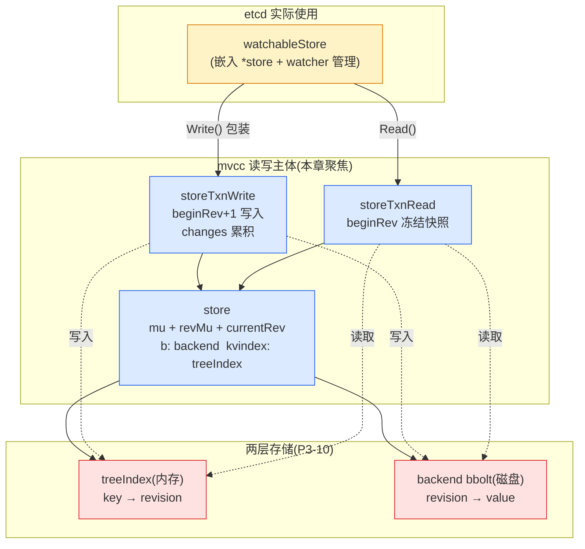
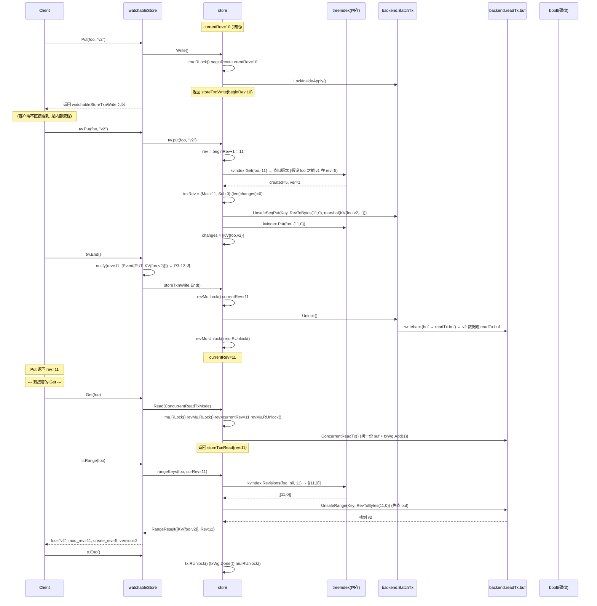

# 第十一章 · kvstore 与事务

> 篇:P3 存储 mvcc:多版本的世界
> 主线呼应:上一章(P3-10)立起了多版本存储的**数据结构骨架**——全局单调的 revision、内存里的 treeIndex、每个 key 的 keyIndex 版本链。但数据结构本身不会动,真正让它们跑起来的是**事务**。这一章回答:mvcc 的 `store` 怎么把 treeIndex(内存 revision 索引)和 backend(bbolt,revision→value)组合成一个可读可写的整体?写走 `TxnWrite`(批量),读走 `TxnRead`/view,一笔事务从开到提交究竟做了什么?读事务凭什么"冻结在一个旧 revision"上不被并发写干扰?——一句话,**treeIndex 存"哪个 revision 里有这个 key",backend 存"这个 revision 里 key 的值",revision 是两边唯一的桥;事务的快照隔离靠 beginRev 这个不变量**。watch(P3-12)、compaction(P3-13)都建在本章这套读写事务之上。

## 核心问题

**`store` / `watchableStore` 怎么把 treeIndex(内存 revision 索引,P3-10)和 backend(bbolt,revision→value)拼成一个可读写的事务?写走 `TxnWrite`、读走 `TxnRead`/view,怎么把 revision 对应的 value 存进 backend?事务的快照隔离(读冻结在某个 `beginRev` 视图)怎么实现,凭什么并发安全?**

读完本章你会明白:

1. `store` 的两把锁(`mu` 和 `revMu`)各管什么、怎么配合,凭什么写事务能安全推进 `currentRev`、读事务能稳定冻结在 `beginRev`。
2. **写事务 `storeTxnWrite` 的完整生命周期**:`beginRev` 在哪记、`Put`/`Delete` 怎么把 revision 分配出去并同步更新 treeIndex 和 backend、`End()` 怎么 `currentRev++` 并放锁;为什么说"写事务是批量的"。
3. **读事务 `storeTxnRead` 的快照隔离**:为什么在 `Read()` 时就把 `currentRev` 读出来当 `rev` 冻结、期间发生的并发写对它不可见;backend 的 `ConcurrentReadTx` 又怎么靠"快照拷一份 txReadBuffer + 引用一个 bolt 只读 Tx"做到无锁并发。
4. **treeIndex 和 backend 的读写配合**:写时 `kvindex.Put(key→newRev)` + `tx.UnsafeSeqPut(newRev→value)` 两步走、读时 `kvindex.Get(key, atRev)` 拿 revision 再去 backend 取 value 两步走;**revision 是两者唯一的桥**。

> **如果一读觉得太难**:先只记住三件事——① 一个 `storeTxnWrite` 打开时记下 `beginRev = currentRev`,本事务要写的所有 revision 的 `Main` 都是 `beginRev+1`,内部用 `Sub` 区分;② 写事务 `End()` 时若有改动,加锁 `currentRev++` 一次(整事务只 +1);③ 读事务打开时也读一次 `currentRev` 当作 `rev`,此后本读事务的所有 `Range` 都用这个固定 `rev` 去 treeIndex 取"那个时刻的版本"——这就是快照隔离。

---

## 11.1 一句话点破

> **`store` 把 treeIndex(内存 B-tree,key→revision)和 backend(bbolt,revision→value)拼成一个 KV:写事务在 treeIndex 里记一笔 `key→newRevision`、同时在 backend 里追加 `newRevision→value`;读事务在 treeIndex 里按 key 找到 `≤ beginRev` 的最新 revision、再去 backend 按 revision 取 value。revision 是内存和磁盘两边唯一的桥。读事务打开时就把全局 `currentRev` 读出来冻结成 `beginRev`,期间的并发写产生更高 revision 但对本读事务不可见——这就是 etcd 的快照隔离。**

这是结论,不是理由。本章倒过来拆:先看 `store` 结构和两把锁的分工,再看写事务的完整生命周期,然后看读事务怎么靠 `beginRev` 做快照,最后回到 treeIndex/backend 两层读写配合的完整流程图。

---

## 11.2 `store` 的骨架:两把锁分工,一个 `currentRev`

打开 `etcd/server/storage/mvcc/kvstore.go`,`store` 这个结构体([kvstore.go:53-82](../etcd/server/storage/mvcc/kvstore.go#L53-L82))就是 mvcc 的"主体"。它把 treeIndex 和 backend 焊在一起,靠两把锁管住并发:

```go
type store struct {
    ReadView             // 读视图(下面 11.5 讲)
    WriteView            // 写视图

    cfg StoreConfig

    // mu read locks for txns and write locks for non-txn store changes.
    mu sync.RWMutex

    b       backend.Backend   // 磁盘 backend(bbolt)
    kvindex index             // 内存 treeIndex

    le lease.Lessor

    // revMuLock protects currentRev and compactMainRev.
    // Locked at end of write txn and released after write txn unlock lock.
    // Locked before locking read txn and released after locking.
    revMu sync.RWMutex
    // currentRev is the revision of the last completed transaction.
    currentRev int64
    // compactMainRev is the main revision of the last compaction.
    compactMainRev int64

    fifoSched schedule.Scheduler
    // ...
}
```

这里有两个**不显然**的设计点,是理解整章并发安全的关键:

### (1) 为什么有两把锁:`mu` 和 `revMu`

`mu` 是一把读写锁,负责**事务边界**:每个读/写事务进入时拿 `mu.RLock()`、退出时 `mu.RUnlock()`;`Restore`/`Compact` 这种"非事务的全局变更"拿写锁 `mu.Lock()`,期间任何事务都进不来。

那为什么还要单独一把 `revMu` 保护 `currentRev` 和 `compactMainRev`?看 `currentRev` 这个字段的访问模式:

- **读** `currentRev`:每个读事务打开时读一次(`Read` 里),把它当 `rev` 冻结。
- **写** `currentRev`:每个写事务 `End()` 时 `currentRev++`。

如果都用 `mu` 锁,会出现什么问题?写事务 `End()` 既要 `currentRev++`、又要放 `mu.RUnlock()`——这两步必须按特定顺序,否则可能"新读者拿到的 `rev` 比写事务的还小(看不见刚写的)、或者比写事务的还大(看见还没真正提交的)"。etcd 的解法是**单独一把 `revMu`,且加锁顺序写死**。源码注释([kvstore.go:67-70](../etcd/server/storage/mvcc/kvstore.go#L67-L70))说得很清楚:

> Locked at end of write txn and released after write txn unlock lock.
> Locked before locking read txn and released after locking.

翻译成时序:

```
写事务 End():
    1. revMu.Lock()         ← 先锁 revMu
    2. currentRev++
    3. tx.Unlock()          ← 释放 backend batchTx
    4. revMu.Unlock()       ← 注意!在 mu.RUnlock() 之前
    5. mu.RUnlock()

读事务 Read():
    1. mu.RLock()           ← 先拿 mu 读锁
    2. revMu.RLock()
    3. rev = currentRev      ← 把当前 currentRev 读出来冻结
    4. revMu.RUnlock()
    ... 整个事务生命周期 rev 不变 ...
    End() 时:mu.RUnlock()
```

> **钉死这件事**:这套加锁顺序保证了一个关键不变量:**读到 `rev = currentRev` 那一刻,要么是写事务 `currentRev++` 之前(读者看到的是旧 rev,看不见这次写),要么是 `currentRev++` 之后(读者看到的是新 rev,但同时 backend batchTx 也已经 Unlock、写的数据已对读可见),不会出现"rev 已经加 1 但数据还没写完"的撕裂**。这就是 etcd 事务快照隔离的根基。

### (2) `currentRev` 初始值是 1,不是 0

看 `NewStore`([kvstore.go:104-105](../etcd/server/storage/mvcc/kvstore.go#L104-L105)):`currentRev: 1, compactMainRev: -1`。为什么 `currentRev` 从 1 起?

因为 revision `{Main:1, Sub:0}` 在 etcd 启动时被用作"恢复阶段扫描 bbolt 的起点"——`restore()`([kvstore.go:321-322](../etcd/server/storage/mvcc/kvstore.go#L321-L322))用 `RevToBytes(Revision{Main: 1}, min)` 当作最小 key 去 backend 范围读所有历史。`currentRev=1` 意味着"还没有任何写事务发生过";第一个写事务进来,它的 `Main` 就是 `1+1=2`。而 `compactMainRev=-1` 表示"还没压缩过"——`-1` 比任何合法 revision 都小,这样恢复期间的任何 revision 都不会被判定为"已被压缩"。

> **不这样会怎样**:如果 `currentRev` 从 0 起,第一个写事务 `Main=0+1=1`,和"扫描起点"撞了;`currentRev` 是 int64,不会和"空"混淆,但 etcd 选了 `1` 作为干净的初始边界,让"revision ≥ 1 才是合法写事务产生的"这条不变量直接成立。

### `store` 外面那层 `watchableStore`

etcd 实际用的不是裸 `store`,而是 `watchableStore`([watchable_store.go:56-76](../etcd/server/storage/mvcc/watchable_store.go#L56-L76))。它**组合(嵌入)了 `*store`**,再加一层 watcher 管理(`synced`/`unsynced` 两组 watcher、`victims` 等)。本章只讲读写事务,watcher 部分留给 P3-12,但你得知道:`watchableStore` 重写了 `Write()`([watchable_store_txn.go:54-56](../etcd/server/storage/mvcc/watchable_store_txn.go#L54-L56)):

```go
func (s *watchableStore) Write(trace *traceutil.Trace) TxnWrite {
    return &watchableStoreTxnWrite{s.store.Write(trace), s}
}
```

它把 `store.Write()` 产出的 `storeTxnWrite` 再包一层 `watchableStoreTxnWrite`,这层在 `End()` 时多做一件事:`s.notify(rev, evs)`——把本事务产生的 `changes` 转成事件推给订阅者([watchable_store_txn.go:22-47](../etcd/server/storage/mvcc/watchable_store_txn.go#L22-L47))。**注意 notify 发生在 `tw.TxnWrite.End()` 之前**——也就是说先把变更推给 watcher、再真正结束底层事务。这个顺序很关键,但本章不展开,记住"watchableStore 是 store 的薄包装,读写主体在 store"即可。



---

## 11.3 写事务:从 `beginRev` 到 `currentRev++`

写事务是 etcd 多版本存储的心脏。我们按"打开 → 操作 → 结束"三段拆。

### (1) 打开写事务:记下 `beginRev`

看 `store.Write`([kvstore_txn.go:174-185](../etcd/server/storage/mvcc/kvstore_txn.go#L174-L185)):

```go
func (s *store) Write(trace *traceutil.Trace) TxnWrite {
    s.mu.RLock()                                                  // ① 进入事务(拿 mu 读锁)
    tx := s.b.BatchTx()
    tx.LockInsideApply()                                          // ② 拿 backend batchTx 的锁
    tw := &storeTxnWrite{
        storeTxnCommon: storeTxnCommon{s, tx, 0, 0, trace},
        tx:             tx,
        beginRev:       s.currentRev,                            // ③ 冻结:本事务的"起点"
        changes:        make([]*mvccpb.KeyValue, 0, 4),
    }
    return newMetricsTxnWrite(tw)
}
```

三步都值得拆:

- **① `s.mu.RLock()`**:进入事务边界。多个写事务可以**并发**持有 `mu` 的读锁(因为 `mu` 是读写锁),所以 etcd 并不靠 `mu` 串行化写事务——它们靠的是 backend 的 `batchTx` 自带的 `sync.Mutex`(`tx.LockInsideApply()`)。`mu` 真正串行化的是"事务" vs "非事务的 store 变更"(`Restore`/`Compact` 拿 `mu` 写锁)。
- **② `tx.LockInsideApply()`**:`batchTx` 是 etcd backend 暴露的"批写事务"接口(P4-14 详讲),它的 `Lock()` 是普通 `sync.Mutex`。`LockInsideApply` 是个变体——多了一道"必须在 apply 协程里调用"的断言校验,防止把 backend 写事务从非 apply 路径打开造成死锁。**所有 mvcc 写事务都是在 raft apply 协程里发起的**(因为 apply 是把已 commit 的 entry 应用到状态机的唯一入口,P2-08 讲过),所以这里走 `LockInsideApply`。
- **③ `beginRev: s.currentRev`**:**整个事务最关键的一行**。注意这里**没有加 `revMu` 锁**!为什么安全?有两层保障:第一,`tx.LockInsideApply()` 是一道断言——它强制"本调用必须在 raft apply 协程里发生"([batch_tx.go:91-102](../etcd/server/storage/backend/batch_tx.go#L91-L102) 调 [`ValidateCalledInsideApply`](../etcd/server/storage/backend/verify.go#L31-L37),不在 apply 上下文会 Panic)。**所有 mvcc 写事务都从同一个 apply 协程发起**,apply 协程从 `applyc` 通道串行取出已 commit 的 entry 应用(P2-08 讲过),所以 `Write()` 和别的事务的 `End()` 在时间上**天然不会交错**——读到 `currentRev` 时,要么上一个事务已 `End()` 完(`mu.RUnlock()` 也放掉了)、要么还没开始 `End()`。第二,即便理论上有多事务并发持有 `mu.RLock()`,`End()` 里 `revMu.Lock()` 在 `currentRev++` 之前、`mu.RUnlock()` 之前——但本段强调第一层:**apply 协程单线程是根本保障,锁序是辅助护栏**。

> **钉死这件事**:`beginRev = s.currentRev` 这一行没有显式锁保护,但它是安全的——因为 etcd 的写事务**全部在单个 apply 协程上发起**(`LockInsideApply` 的断言强制这一点)。apply 协程从 `applyc` 通道串行消费已 commit 的 entry,所以前一个事务 `End()`(含 `currentRev++` 和 `mu.RUnlock()`)和后一个事务 `Write()`(含读 `currentRev`)在时间上绝不会交错。读到 `currentRev` 永远是某个**已经完整提交**的事务留下的稳定值。`revMu` 是为读事务打开时和写事务 `End()` 推进 `currentRev` 之间的并发安全准备的(11.4 详讲)。

### (2) `Put`:分配 revision、双写 treeIndex + backend

看 `storeTxnWrite.put`([kvstore_txn.go:223-291](../etcd/server/storage/mvcc/kvstore_txn.go#L223-L291)),这是写事务里最核心的一段。我们逐行拆(只保留主线):

```go
func (tw *storeTxnWrite) put(key, value []byte, leaseID lease.LeaseID) {
    rev := tw.beginRev + 1                                        // ① 本事务要写的 Main
    c := rev
    // ...

    // if the key exists before, use its previous created and
    // get its previous leaseID
    _, created, ver, err := tw.s.kvindex.Get(key, rev)           // ② 查内存索引:这个 key 之前创建过吗?
    if err == nil {
        c = created.Main                                          //    若创建过,沿用它的 CreateRevision
        // ...
    }
    ibytes := NewRevBytes()
    idxRev := Revision{Main: rev, Sub: int64(len(tw.changes))}    // ③ Sub = 本事务已累积修改数
    ibytes = RevToBytes(idxRev, ibytes)                           //    revision → 17 字节

    ver = ver + 1
    kv := &mvccpb.KeyValue{
        Key:            key,
        Value:          value,
        CreateRevision: c,                                        // ④ CreateRevision:沿用旧值或=本 rev
        ModRevision:    rev,
        Version:        ver,                                      //    Version:这是本代第几次改
        Lease:          int64(leaseID),
    }

    d, err := proto.Marshal(kv)
    // ...

    tw.tx.UnsafeSeqPut(schema.Key, ibytes, d)                    // ⑤ 写 backend: revision→value
    tw.s.kvindex.Put(key, idxRev)                                // ⑥ 写 treeIndex: key→revision
    tw.changes = append(tw.changes, kv)                          // ⑦ Sub 自增来源:changes 多一条
    // ...
}
```

七步拆开看:

- **① `rev := tw.beginRev + 1`**:本事务所有修改共享同一个 `Main`,等于 `beginRev + 1`。注意——**整个事务的 `rev` 是在第一次 `put` 进来就算好的,后面所有 `put` 都用它**,这就是为什么同一个事务里多次修改共享 `Main`。
- **② `tw.s.kvindex.Get(key, rev)`**:**这是事务"读己写"和"沿用旧 metadata"的关键**。`Get(key, atRev=rev)` 在内存 treeIndex 里走 keyIndex 版本链,找"≤ rev 的最新版本"。注意这里 `rev = beginRev+1`,而当前 treeIndex 里这个 key 的最新版本最多是 `beginRev`(本事务还没写),所以查到的就是"本事务开始前这个 key 是什么样"。拿到 `created`(这代是什么时候创建的,即 `CreateRevision`)和 `ver`(这是第几版),用来填新 `KeyValue` 的 `CreateRevision` 和 `Version`。
  - **如果 `err != nil`**(key 之前不存在,或被删了):`c` 保持 `rev`,即新创建的 `CreateRevision` = 本事务的 `ModRevision`。这正是 etcd API 语义里"新 key 的 `create_revision` == `mod_revision`"的来源。
  - **如果 `err == nil`**(key 之前就存在):`c = created.Main`,沿用旧 key 的创建时刻。`Version` 加 1。
- **③ `idxRev := Revision{Main: rev, Sub: int64(len(tw.changes))}`**:这是 **Sub 的来源**。`len(tw.changes)` 在第一次 `put` 时是 0、第二次是 1、第三次是 2……`Sub` 就这样从 0 递增。**etcd 不维护单独的 Sub 计数器,而是复用 `changes` 切片长度**——这是个干净的设计:Sub 本来就是"事务内修改序号",而 `changes` 也正好是"本事务至今做了几次修改",两者天然对应。
- **④ `KeyValue` 结构**:`mvccpb.KeyValue` 是 etcd API 返回的那个 proto 消息(`create_revision`/`mod_revision`/`version`/`lease`)。**注意它就是 backend 里存的东西**——序列化后的字节就是 bbolt Key bucket 里的 value。
- **⑤ `tw.tx.UnsafeSeqPut(schema.Key, ibytes, d)`**:写 backend。`UnsafeSeqPut` 是 `UnsafePut` 的"顺序追加"变体——它告诉 backend "我知道这个 key 比之前所有 key 都大,你按追加处理"(在 bbolt 里会把 bucket 的 `FillPercent` 调到 0.9 延迟页分裂,[batch_tx.go:158-162](../etcd/server/storage/backend/batch_tx.go#L158-L162))。因为 revision 单调,bbolt Key bucket 天然是追加写,这个 hint 让 B+tree 写极快。
  - **为什么叫 "Unsafe"**:`Unsafe*` 系列方法**不检查 bucket 是否存在、不负责并发安全**——并发安全由调用方(这里的 `tx.LockInsideApply`)保证。这是 backend 包的命名约定:Unsafe = 调用方负责加锁。P4-14 会详讲。
- **⑥ `tw.s.kvindex.Put(key, idxRev)`**:写内存 treeIndex。这一步把 `key→{Main=rev, Sub=...}` 记进 B-tree。**和 ⑤ 是两次独立的写**(一次磁盘、一次内存),但它们都在同一个 `tx.LockInsideApply()` 锁保护下,不会被别的事务插入——所以"索引和值"在事务边界内是一致的。
- **⑦ `tw.changes = append(tw.changes, kv)`**:`changes` 累积本事务所有改动。它的两个用途:① 下一次 `put` 的 `Sub` 自增(通过 `len(tw.changes)`);② 写事务 `End()` 时被 `watchableStoreTxnWrite.End()` 拿去转成 watch 事件(P3-12)。

> **钉死这件事**:看清楚了——**写事务里"内存索引"和"磁盘值"是两次独立写**,但它们在 `tx.LockInsideApply()` 保护下原子可见(后端 batch 提交时,buffer writeback 把待提交的写一次性刷给 readTx 见 11.4)。读事务要么看到两者都没写、要么看到两者都写完——**revision 是两边的唯一桥**,保证读时按 revision 跨层查找不会错位。

### (3) `Delete`:墓碑也是一次 revision

看 `storeTxnWrite.delete`([kvstore_txn.go:308-346](../etcd/server/storage/mvcc/kvstore_txn.go#L308-L346)):

```go
func (tw *storeTxnWrite) delete(key []byte) {
    ibytes := NewRevBytes()
    idxRev := newBucketKey(tw.beginRev+1, int64(len(tw.changes)), true)   // ← 注意 true:是墓碑
    ibytes = BucketKeyToBytes(idxRev, ibytes)

    kv := &mvccpb.KeyValue{Key: key}                                       // ← 只填 key, value 为空

    d, err := proto.Marshal(kv)
    // ...

    tw.tx.UnsafeSeqPut(schema.Key, ibytes, d)                             // ① backend 也写一条(墓碑)
    err = tw.s.kvindex.Tombstone(key, idxRev.Revision)                    // ② treeIndex 盖墓碑 + 开新空代
    // ...
    tw.changes = append(tw.changes, kv)
    // ... 解绑 lease ...
}
```

两个细节值得注意:

1. **墓碑也写进 backend**。`delete` 不是物理删除,而是**追加一条 value 为空、key 带 `markTombstone='t'` 标记的 KeyValue 进 bbolt**。为什么?因为 etcd 要支持"读历史":读 `--rev=某个被删之前的版本` 还能查到这个 key 当时的值;而"这个 key 在哪个 revision 被删了"也是历史的一部分,必须留痕。`revision.go` 的 `BucketKeyToBytes` 在 `tombstone=true` 时会多追加一个 `'t'` 字节([revision.go:83-96](../etcd/server/storage/mvcc/revision.go#L83-L96)),反序列化时 `isTombstone` 检查尾部字节([revision.go:120-122](../etcd/server/storage/mvcc/revision.go#L120-L122))——这就是 P3-10 讲过的"墓碑在字节布局上的标记"。
2. **`kvindex.Tombstone`** 调用的是 treeIndex 的方法,内部走到 `keyIndex.tombstone`(P3-10 详讲):先把墓碑 revision 当普通版本追加到当前 generation,再 append 一个空 generation 表示"这段生命结束"。所以 delete 和 put 走**完全相同的代码路径**(分配 revision、写 backend、写 treeIndex、追加 changes),只是 delete 的 revision 带 tombstone 标记、且 treeIndex 侧走 Tombstone 分支开新代。**统一优雅**。

### (4) `End()`:`currentRev++` 和放锁

看 `storeTxnWrite.End`([kvstore_txn.go:209-221](../etcd/server/storage/mvcc/kvstore_txn.go#L209-L221)):

```go
func (tw *storeTxnWrite) End() {
    // only update index if the txn modifies the mvcc state.
    if len(tw.changes) != 0 {
        // hold revMu lock to prevent new read txns from opening until writeback.
        tw.s.revMu.Lock()
        tw.s.currentRev++                    // ① Main 的事务级 +1 在这里发生
    }
    tw.tx.Unlock()                           // ② 释放 backend batchTx(触发 writeback!)
    if len(tw.changes) != 0 {
        tw.s.revMu.Unlock()
    }
    tw.s.mu.RUnlock()                        // ③ 释放 store 事务锁
}
```

四件事按严格顺序发生:

1. **`revMu.Lock()` + `currentRev++`**:只有本事务真的改了东西(`len(changes) != 0`),才推进 `currentRev`。一个 `Txn(If..., Then: [])` 空事务不会让 revision 前进——这是合理的,没有改东西就不该消耗 revision 号。
2. **`tw.tx.Unlock()`**:**这一步触发了 backend 的 writeback**。`batchTxBuffered.Unlock()`([batch_tx.go:308-340](../etcd/server/storage/backend/batch_tx.go#L308-L340))在 `pending != 0` 时,会调 `t.buf.writeback(&t.backend.readTx.buf)`——把本事务积攒在 `txWriteBuffer` 里的所有写,**合并进 `readTx.txReadBuffer`**,让后续读事务能看见(11.4 详讲)。这就是"backend buffer"的精髓:**写不直接落 bbolt,而是先攒在 buffer 里,Unlock 时把 buffer 合并到 read buffer,等攒够一批再真正 commit bbolt 事务**(P4-14 详讲)。
3. **`revMu.Unlock()`**:在 `tx.Unlock()` 之后。注意这个顺序很关键:writeback 完成后(currentRev 已经 +1、且新数据已经在 readTx.buf 里能被读到了)再放 `revMu`,这样在 `revMu.Unlock()` 之后打开的新读事务,读到的 `currentRev` 已经是新的,且能从 readTx.buf 读到新写的数据——**"revision 已推进" 和 "数据已可见" 这两件事在 `revMu.Unlock()` 那一刻同时为真**。
4. **`mu.RUnlock()`**:最后放 store 事务锁,本事务彻底结束。

> **钉死这件事**:`End()` 里三把锁的释放顺序 `tx.Unlock → revMu.Unlock → mu.RUnlock` 不是随便写的,而是**精心设计的不变量链**。它保证了:**任何打开的读事务,要么 `rev` 比本事务小(看不到本事务的写)、要么 `rev` 比本事务大(看到本事务的 writeback buffer)——绝不存在"rev 已经大了但数据还没可见"的中间态**。这就是 etcd MVCC 快照隔离的并发安全根基。

### (5) 写事务的"批量"性质

注意一个细节:写事务 `End()` 里 `tw.tx.Unlock()` **不强制 commit bbolt**。`batchTx.Unlock()`([batch_tx.go:109-114](../etcd/server/storage/backend/batch_tx.go#L109-L114))只在 `pending >= batchLimit` 时才真正 `commit(false)`——否则只是把 buffer writeback 给 readTx,bbolt 事务**继续保留**,等下一个写事务复用。backend 还有个**定时提交** goroutine(`batchInterval`,默认 100ms,[backend.go:443-457](../etcd/server/storage/backend/backend.go#L443-L457))周期性 commit。

**这就是"写事务是批量的"的真正含义**:每条 Put 不触发一次 bbolt commit,而是把若干写攒在一个 batch 里、一次 commit 提交一整批——把磁盘 IO 摊薄。**writeback buffer 让读事务在 batch 还没 commit 时就能看到这批写**,这就是 etcd 在"持久化延迟"和"读可见性"之间打的精巧补丁。P4-14 会专章拆透这个 batch 机制,本章你只需要知道:**写事务的 `End()` 不等于 bbolt commit**,但读已经能看到。

---

## 11.4 读事务:快照隔离靠 `beginRev` 冻结

读事务的设计比写事务更精巧——它要在并发写不停推进 `currentRev` 的同时,**让一个长读事务稳定地看同一个时刻的快照**。这是 etcd 支持可靠 `Txn`(`If foo.value == "v1"`)和读历史(`--rev=N`)的根基。

### (1) 打开读事务:读出 `currentRev` 当 `rev` 冻结

看 `store.Read`([kvstore_txn.go:46-64](../etcd/server/storage/mvcc/kvstore_txn.go#L46-L64)):

```go
func (s *store) Read(mode ReadTxMode, trace *traceutil.Trace) TxnRead {
    s.mu.RLock()
    s.revMu.RLock()
    // For read-only workloads, we use shared buffer by copying transaction read buffer
    // for higher concurrency with ongoing blocking writes.
    // For write/write-read transactions, we use the shared buffer
    // rather than duplicating transaction read buffer to avoid transaction overhead.
    var tx backend.ReadTx
    if mode == ConcurrentReadTxMode {
        tx = s.b.ConcurrentReadTx()                  // ① 快照模式:拷一份 readTx buffer + 引用 bolt 只读 Tx
    } else {
        tx = s.b.ReadTx()                            // ② 共享模式:直接用 readTx(共享 buffer)
    }

    tx.RLock() // RLock is no-op. concurrentReadTx does not need to be locked after it is created.
    firstRev, rev := s.compactMainRev, s.currentRev   // ③ 把 currentRev 读出来当 rev 冻结
    s.revMu.RUnlock()
    return newMetricsTxnRead(&storeTxnRead{storeTxnCommon{s, tx, firstRev, rev, trace}, tx})
}
```

三件事:

- **③ `firstRev, rev := s.compactMainRev, s.currentRev`**:**读事务打开的那一刻,就把 `currentRev` 读出来当 `rev`,此后整个事务生命周期都用这个 `rev`**。注意这步在 `revMu.RLock()` 保护下完成——保证读到的 `currentRev` 是某个写事务完整提交后的稳定值(不会读到 `currentRev++` 中间的脏值)。
- **① vs ② 两种读模式**:`ConcurrentReadTxMode`(默认,用于普通读)走 `ConcurrentReadTx()`——它**快照拷一份 `readTx.txReadBuffer`、再引用当前 batch 的 bolt 只读 Tx**;`SharedBufReadTxMode` 走 `ReadTx()`——直接共享 `readTx`(共享它的 buffer)。前者并发更好(各读事务有自己的 buffer 副本,互不干扰),后者开销小但会被写事务的 writeback 阻塞。下面 11.6 技巧精解会专门拆。
- **`tx.RLock()` 对 concurrentReadTx 是 no-op**:`concurrentReadTx` 在创建时已经"固定"了一个 read buffer 副本和 bolt Tx 引用,后续不再需要锁。而 `readTx` 的 `RLock` 是真锁(保护共享 buffer)。

> **钉死这件事**:读事务的快照隔离**不是靠某种 MVCC 可见性判断算法**(不像 PostgreSQL 那种 xmin/xmax),而是**最朴素的方案:打开时读一个固定 `rev`,之后所有查询都用这个 `rev`**。treeIndex 里每个 key 的 keyIndex 天然保留了全部历史版本,`get(key, atRev=N)` 总能找到"≤ N 的最新版本"。所以"快照读"在 etcd 里几乎免费——只要把 `rev` 冻结,剩下的就是 keyIndex 在版本链上往回走的 O(版本数) 操作。

### (2) `Range`:两层查找的完整流程

读事务的 `Range` 是两层查找的标准范式。看 `storeTxnCommon.rangeKeys`([kvstore_txn.go:73-152](../etcd/server/storage/mvcc/kvstore_txn.go#L73-L152),只保留主线):

```go
func (tr *storeTxnCommon) rangeKeys(ctx context.Context, key, end []byte, curRev int64, ro RangeOptions) (*RangeResult, error) {
    rev := ro.Rev
    if rev > curRev {
        return &RangeResult{KVs: nil, Count: -1, Rev: curRev}, ErrFutureRev      // ① 不能查未来
    }
    if rev <= 0 {
        rev = curRev                                                              // ② 默认查当前
    }
    if rev < tr.s.compactMainRev {
        return &RangeResult{KVs: nil, Count: -1, Rev: 0}, ErrCompacted           // ③ 不能查已被压缩的历史
    }
    // ...

    revpairs, total := tr.s.kvindex.Revisions(key, end, rev, int(ro.Limit), ro.WithTotalCount)  // ④ 内存索引拿 revision 列表
    // ...

    kvs := make([]*mvccpb.KeyValue, cappedEntriesCount)
    revBytes := NewRevBytes()
    for i, revpair := range revpairs[:len(kvs)] {
        // ...
        revBytes = RevToBytes(revpair, revBytes)
        _, vs := tr.tx.UnsafeRange(schema.Key, revBytes, nil, 0)                 // ⑤ 按 revision 去 backend 取 value
        if len(vs) != 1 {
            tr.s.lg.Fatal("range failed to find revision pair", ...)             //   revision 在索引里但 backend 找不到 → 致命错
        }
        kv := &mvccpb.KeyValue{}
        if err := proto.Unmarshal(vs[0], kv); err != nil { ... }
        kvs[i] = kv
    }
    // ...
    return &RangeResult{KVs: kvs, Count: total, Rev: curRev}, nil
}
```

五个关键点:

- **① ② ③ 三道 revision 校验**:查未来 revision 报 `ErrFutureRev`、查已被压缩的 revision 报 `ErrCompacted`、不指定就用 `curRev`(本事务冻结的 `rev`)。这三条构成了 etcd 读 API 的语义边界——`etcdctl get foo --rev=100` 如果 100 已被 compact 掉,你会拿到 `ErrCompacted`,这就是这里抛的。
- **④ `kvindex.Revisions(key, end, rev, limit, ...)`**:**第一层查找——内存 treeIndex**。B-tree 按 key 区间遍历,每个 key 的 keyIndex 上调 `get(atRev=rev)`,拿到这个 key 在 `≤ rev` 的最新 revision。返回一组 `(revision, totalCount)`。
- **⑤ `tx.UnsafeRange(schema.Key, revBytes, nil, 0)`**:**第二层查找——backend bbolt**。把 revision 序列化成 17 字节(`RevToBytes`),去 Key bucket 精确取 value。**注意 `limit=0`(单 key),因为 revision 是 bbolt 里全局唯一的,一次取一个**——这就是 P3-10 讲过的"backend 的 key 是 revision,所以 IsSafeRangeBucket,可以放心用 UnsafeRange"。
- **`Fatal` 而不是 error**:如果 treeIndex 说这个 revision 存在、但 backend 找不到——`tr.s.lg.Fatal(...)`。**这种不一致在 etcd 看来是不可恢复的数据损坏**,宁可挂掉也不能返回错误数据。这就是 P3-10 强调的"发现不变式被破坏立即挂掉,而不是带病运行"的策略,在读写配合这里又一次体现。
- **`Rev: curRev` 返回值**:Range 返回的 `Rev` 是**本事务的 `curRev`**(即打开时冻结的 `rev`),不是查到的 revision。客户端 `etcdctl get` 看到的 `revision:` 字段就是这个——它告诉你"这次读是基于哪个 revision 的快照"。

### (3) `End()`:无副作用

读事务 `End` 极简([kvstore_txn.go:161-164](../etcd/server/storage/mvcc/kvstore_txn.go#L161-L164)):

```go
func (tr *storeTxnRead) End() {
    tr.tx.RUnlock() // RUnlock signals the end of concurrentReadTx.
    tr.s.mu.RUnlock()
}
```

就是放两把锁。读事务不改任何状态,所以 End 无副作用——它存在的意义只是"事务边界",让读事务在生命周期内持有的资源(readTx 引用、mu 读锁)能被干净释放。

> **钉死这件事**:读事务 **不需要把读出来的 revision 显式 "unfreeze"**——因为 `rev` 就是个本地变量,事务结束自然消失。这种"零代价的快照"是 etcd MVCC 设计的最大红利之一:你可以开一个长读事务慢慢遍历一百万个 key,期间哪怕有十万个写事务把 `currentRev` 推到天上去,你的读事务看到的永远是它打开那一刻的快照,**读写不互相阻塞**。

---

## 11.5 `ReadView` / `WriteView`:一行 API 背后的事务

到目前为止,我们讲的 `Read`/`Write` 都是返回一个事务对象、要手动 `End()`。但 etcd 用户不会直接调 `store.Read()`——他们用 `ReadView`/`WriteView` 这种"一行 API"(对应 `etcdctl get/put`)。看 `kv_view.go`([kv_view.go:24-56](../etcd/server/storage/mvcc/kv_view.go#L24-L56)):

```go
type readView struct{ kv KV }

func (rv *readView) FirstRev() int64 {
    tr := rv.kv.Read(SharedBufReadTxMode, traceutil.TODO())
    defer tr.End()
    return tr.FirstRev()
}

func (rv *readView) Rev() int64 {
    tr := rv.kv.Read(SharedBufReadTxMode, traceutil.TODO())
    defer tr.End()
    return tr.Rev()
}

func (rv *readView) Range(ctx context.Context, key, end []byte, ro RangeOptions) (r *RangeResult, err error) {
    tr := rv.kv.Read(ConcurrentReadTxMode, traceutil.TODO())       // ← 注意:Range 走并发模式
    defer tr.End()
    return tr.Range(ctx, key, end, ro)
}

type writeView struct{ kv KV }

func (wv *writeView) Put(key, value []byte, lease lease.LeaseID) (rev int64) {
    tw := wv.kv.Write(traceutil.TODO())
    defer tw.End()
    return tw.Put(key, value, lease)
}
```

`readView`/`writeView` 就是**最薄的一层封装**:每次 API 调用 = 打开一个事务 + 执行一次操作 + 结束事务。这里有两个值得注意的点:

1. **`readView.Range` 走 `ConcurrentReadTxMode`**(快照模式),而 `FirstRev`/`Rev` 走 `SharedBufReadTxMode`(共享模式)。为什么?因为 `Range` 可能要扫很多 key、耗时较长,用快照模式(自己拷一份 buffer)就不阻塞写事务的 writeback;而 `FirstRev`/`Rev` 只读两个 int64,瞬间完成,用共享模式省一次拷贝。
2. **`writeView.Put` 每次开一个完整事务**:`defer tw.End()` 保证事务一定被结束。这意味着**每次 `etcdctl put` 都是独立一个写事务**(产生一个新 `Main` revision)。如果客户端用 `Txn(Then: [Put a, Put b, Put c])` 把多个 Put 打包,那才共享同一个事务(共享 `Main`、用 `Sub` 区分)。**这是 etcd API "事务是 revision 边界" 的工程体现**。

### `KV` 接口:把 `store` 抽象出来

`kv.go` 定义了 `KV` 接口([kv.go:114-136](../etcd/server/storage/mvcc/kv.go#L114-L136)),`store` 是它的实现。接口长这样(简化):

```go
type KV interface {
    ReadView
    WriteView

    Read(mode ReadTxMode, trace *traceutil.Trace) TxnRead
    Write(trace *traceutil.Trace) TxnWrite

    HashStorage() HashStorage
    Compact(trace *traceutil.Trace, rev int64) (<-chan struct{}, error)
    Commit()
    Restore(b backend.Backend) error
    Close() error
}
```

`KV` 把"事务能力"(`Read`/`Write`)和"非事务操作"(`Compact`/`Commit`/`Restore`)统一在一个接口里。上层(etcdserver)只依赖 `KV` 接口,不直接依赖 `store` 具体类型——这让 mvcc 的实现可以替换(测试时塞个 mock)。`WatchableKV` 进一步扩展了 `KV` 加上 `NewWatchStream()`,这正是 `watchableStore` 实现的接口([watchable_store.go:78](../etcd/server/storage/mvcc/watchable_store.go#L78)):`var _ WatchableKV = (*watchableStore)(nil)` 这条编译期断言强制 `watchableStore` 必须满足 `WatchableKV` 接口。

而 `TxnRead`/`TxnWrite` 接口([kv.go:62-92](../etcd/server/storage/mvcc/kv.go#L62-L92))定义了事务能力本身:`TxnRead` = `ReadView` + `End()`、`TxnWrite` = `TxnRead` + `WriteView` + `Changes()`。注意 **`TxnWrite` 嵌入了 `TxnRead`**——写事务也能读(`storeTxnWrite.Range` 在 [kvstore_txn.go:189-195](../etcd/server/storage/mvcc/kvstore_txn.go#L189-L195)),且写事务的读看见自己已写的改动(`rev = beginRev+1` 当 `len(changes)>0` 时)。

> **钉死这件事**:etcd 的事务接口设计遵循"**接口能力嵌入**"的 Go 风格——`TxnWrite` 嵌入 `TxnRead` 而不是另起一个并行接口,`WatchableKV` 嵌入 `KV` 加 watch 能力。这种"接口组合"让上层可以按需依赖最小接口(只需要读就依赖 `TxnRead`,需要写就依赖 `TxnWrite`),是 Go 习惯用法在系统软件里的体现。

---

## 11.6 技巧精解:两层读写配合 + 快照读隔离

这一节我们把本章两条命脉单独拆透:① treeIndex(内存 revision 索引)和 backend(bbolt revision→value)的读写配合;② 读事务的快照隔离凭什么并发安全。

### 技巧一:treeIndex 与 backend 的读写配合——revision 是唯一的桥

P3-10 立起了"索引在内存、值在磁盘"的分离,本章讲清楚了**读写时这两层怎么配合**。把读写流程画成一张完整图:

```
 写事务 put("foo", "v2"):
 ┌────────────────────────────────────────────────────────────────┐
 │ ① rev := beginRev + 1                                          │
 │ ② idxRev := {Main: rev, Sub: len(changes)}   ← 拼 revision    │
 │ ③ kv := KeyValue{Key:"foo", Value:"v2", ModRevision: rev, ...} │
 │ ④ 序列化 kv → d (protobuf bytes)                                │
 │                                                                │
 │ ⑤ tw.tx.UnsafeSeqPut(Key, RevToBytes(idxRev), d)              │ ← 写 backend
 │ ⑥ tw.s.kvindex.Put("foo", idxRev)                             │ ← 写 treeIndex
 │ ⑦ tw.changes = append(tw.changes, kv)                         │
 └────────────────────────────────────────────────────────────────┘
                            ↓ 两层并行更新, 同一 revision 桥接:

   内存 treeIndex                      backend bbolt (Key bucket)
   ┌──────────────────────┐            ┌──────────────────────────────┐
   │ B-tree                │            │ B+tree (按 key 字节字典序)    │
   │  "foo" → keyIndex     │            │   rev_bytes(N,0) → "v1"      │
   │           revs=[...,N]│─── 桥 ───→ │   rev_bytes(N+1,0) → "v2"  ★ │
   │                       │  revision  │   rev_bytes(N+5,0) → tomb... │
   └──────────────────────┘            └──────────────────────────────┘

 读事务 Range("foo"):
 ┌────────────────────────────────────────────────────────────────┐
 │ ① rev := 本事务冻结的 beginRev                                 │
 │ ② revpairs, _ := kvindex.Revisions("foo", nil, rev, ...)       │ ← 查 treeIndex
 │       ↓ B-tree 走 "foo" → keyIndex.get(atRev=rev) → revision   │
 │       ↓ 返回 [{Main: N+1, Sub: 0}]                              │
 │ ③ revBytes := RevToBytes(revpair)                              │
 │ ④ _, vs := tx.UnsafeRange(Key, revBytes, nil, 0)               │ ← 查 backend
 │       ↓ bbolt B+tree 按 revBytes 精确取一个                    │
 │       ↓ 返回 ["v2" 的 protobuf bytes]                           │
 │ ⑤ kv := Unmarshal(vs[0])                                       │
 └────────────────────────────────────────────────────────────────┘
```

**revision 是两层之间唯一的桥**:写时用同一个 `idxRev` 同时写两处,读时先在 treeIndex 查到 revision、再用这个 revision 去 backend 取 value。两层**不存在任何冗余关联**,只靠 revision 号对应。

> **不这样会怎样**:朴素方案有三种,每种都撞墙——
>
> - **方案 A:只存 backend `key→value`**(无内存索引)。`get foo` 可以 `bbolt.Get("foo")` 直接拿当前值。但 etcd 要 MVCC——同一个 `foo` 有 N 个历史版本,你只能存成 `foo@v1`、`foo@v2`、...、`foo@vN`,key 里得带版本。`get foo`(当前值)得扫一遍找前缀最大版本,慢;`get foo --rev=50` 得扫一遍找不超过 50 的最大版本,更慢;`Range("a","z")` 要对每个 key 都做一遍,爆炸。P3-10 的技巧精解已详述,这里复用结论。
> - **方案 B:treeIndex 直接存 value**(把 KeyValue 塞进 keyIndex)。etcd 一个 value 最大 1.5MB,百万 key 就是 TB 级,内存放不下;进程崩了内存数据全没。**放不下 + 不持久**,直接出局。
> - **方案 C:两套索引都建完整版本链**(treeIndex 有 revision 列表,backend 也按 key 建版本链)。冗余 + 一致性噩梦:两套版本链要保持同步,一处更新另一处也要更新,任何一处漏掉就数据错乱。
>
> **所以这样设计**:**treeIndex 只存 revision 号(几个 int64,极小),backend 只存 revision→value(按 revision 字节序追加)**。两层各司其职、各取所长:索引小(百万 key 也只占几百 MB)、查 key 快;value 大、放磁盘、按 revision 顺序追加写快、按 revision 精确取也快。**revision 作为唯一桥**,写入时一次分配(在 `put` 里算 `idxRev`)、同时写两处,读出时两层各查一次、用 revision 对接——简洁、正确、快。

> **钉死这件事**:这种"内存索引 + 磁盘值"的分离**不是 etcd 独创**,LSM-tree(LevelDB/RocksDB 的 memtable + sstable)、B-tree 数据库(PostgreSQL 的 buffer cache + heap)都用类似范式。etcd 的特别之处是**索引极简**——keyIndex 只存 revision 号链(不存 value、不存 metadata),让一棵 B-tree 撑住百万 key 还只占几百 MB 内存。这是 etcd 在"内存占用"和"查询效率"之间打的精准平衡。

### 技巧二:读事务的快照读隔离——`beginRev` 冻结 + backend 快照拷贝

etcd 的快照隔离有两层:**逻辑层**靠 `beginRev` 冻结一个 revision 视图,**物理层**靠 backend 的 `ConcurrentReadTx` 拷一份 readTx buffer。两层缺一不可。

#### 逻辑层:`beginRev` 冻结

读事务打开时把 `currentRev` 读出来当 `rev`,此后整个事务用这个 `rev`。这意味着:

- 期间任何并发写产生的更高 revision,对本读事务**不可见**——因为本读事务的 `Range` 都用 `atRev=beginRev`,treeIndex 的 `get(atRev=beginRev)` 只会返回 `≤ beginRev` 的最新版本,新写入的 revision 比 `beginRev` 大,根本进不到查询结果里。
- 期间任何并发写**不会改变本读事务已经读出的数据**——因为 revision 单调不可变(P3-10 讲过,revision 一旦分配就不会被复用、对应 value 在 backend 里永远追加不覆盖),本读事务第一次 Range 读到的 revision→value,后续再读同一个 key 拿到的还是同一个 revision、同一个 value。

> **不这样会怎样**:如果读事务不冻结 `rev`,而是每次 Range 都读最新的 `currentRev`——那一个长读事务在 `Range("a","z")` 扫到一半时,并发写改了 `key="m"`,扫到 m 时读到的就是改后的值、而 a-l 还是改前的值。**整个结果集是不同时刻的混合,不一致**。更糟糕的是 `Txn(If foo.value == "v1" then put bar "v2")` 这种条件事务:如果 `If` 读的 foo 是 v1、但 `Then` 执行前 foo 被并发改成 v2,这个条件事务就破坏了线性一致性。

#### 物理层:`ConcurrentReadTx` 拷一份 readTx buffer

光冻结 `rev` 还不够。考虑这个场景:读事务 T1 打开时 `rev=100`,期间写事务 T2 提交了 revision 101、102、103,**而且这些写已经 writeback 到 readTx.buf 了**(11.3 讲过,writeback 不等 commit)。T1 调 `Range("foo")`,treeIndex 查到 foo 的最新 revision 是 103(因为 treeIndex 是共享的、已经被 T2 更新),但 T1 想要的是 `≤ 100` 的版本——treeIndex 会正确地返回 `≤ 100` 的最新版本(假设是 95)。然后 T1 拿 revision 95 去 backend 取 value——**这时问题来了**:backend 的 readTx.buf 里现在混着 101/102/103 的数据,T1 要取的 95 也在里面,看似没问题。但 backend 的 `txWg` 机制(下面讲)保证 readTx 引用的 bolt Tx 不会被 batch commit 回滚——这就保证了 95 这个 value 在 T1 的整个生命周期里都稳定可读。

`ConcurrentReadTx`([backend.go:279-283](../etcd/server/storage/backend/backend.go#L279-L283))的创建过程浓缩了这一切:

```go
func (b *backend) ConcurrentReadTx() ReadTx {
    b.readTx.RLock()
    defer b.readTx.RUnlock()
    // prevent boltdb read Tx from been rolled back until store read txn is done.
    // Needs to be called when holding readTx.RLock().
    b.readTx.txWg.Add(1)                              // ① 阻止 batch commit 回滚 bolt Tx
    // ... (省略缓存判断, 主线就是拷一份 readTx.buf)
    buf = ... unsafeCopy() of b.readTx.buf            // ② 拷一份 readTx buffer
    // ...
}
```

两件事:

- **① `b.readTx.txWg.Add(1)`**:`txWg` 是个 `sync.WaitGroup`,backend 每次 batch commit 要回滚旧 bolt 只读 Tx、开新 Tx 之前,会等 `txWg` 归零。`ConcurrentReadTx` 创建时 `Add(1)`,`RUnlock()`(即 `concurrentReadTx.RUnlock()`,[read_tx.go:151](../etcd/server/storage/backend/read_tx.go#L151))时 `txWg.Done()`——这就保证了**本读事务引用的 bolt Tx 在事务结束前不会被回滚**。
- **② 拷一份 readTx buffer**:`unsafeCopy()`([tx_buffer.go:140-151](../etcd/server/storage/backend/tx_buffer.go#L140-L151))把 readTx.buf 里所有 bucket 的 used 数据深拷一份。此后本读事务对 buffer 的读访问,都是读自己这份**冻结的快照**——写事务后续 writeback 进 readTx.buf 的新数据,本读事务看不见(因为读的是自己的副本)。

> **钉死这件事**:这套机制让 etcd 的读事务**既快又隔离**:
> - **快**:ConcurrentReadTx 创建后 `RLock` 是 no-op,多个读事务可以完全并发,不互相阻塞、也不阻塞写事务的 writeback。
> - **隔离**:读事务持有自己的 buffer 副本 + 引用一个稳定的 bolt Tx,期间任何写都不会改变它能看到的数据。
> - **一致**:配合逻辑层的 `beginRev` 冻结,读事务看到的是"打开那一刻的 revision 视图 + 那一刻的 backend 数据"——一个完整的、一致的快照。

> **反面对比**:如果用普通 `readTx`(共享 buffer,不走 ConcurrentReadTx)做长读——读事务会被写事务的 writeback 阻塞(因为 writeback 要 `readTx.Lock()` 写锁,读要 `readTx.RLock()` 读锁,两者互斥);或者反过来,writeback 被频繁的读阻塞,写吞吐受损。**`ConcurrentReadTx` 通过"拷一份"避开了这个锁争用**——这就是为什么 `readView.Range` 默认走 `ConcurrentReadTxMode`。

---

## 11.7 一次完整的读写:把所有概念串起来

让我们用一张时序图,把 `Put("foo","v2")` 和紧接着的 `Get("foo")` 在 mvcc 内部的完整流程画出来。假设初始 `currentRev=10`:



这张图把本章所有概念一网打尽:写事务的 `beginRev` 冻结、revision 分配(`Main=beginRev+1`、`Sub=len(changes)`)、双写 treeIndex + backend、`End()` 的三把锁释放顺序、writeback buffer、读事务的 `rev` 冻结、两层查找(treeIndex → readTx.buf → bbolt)、`txWg` 保护 bolt Tx。**一条读写要穿越 store → treeIndex → backend.BatchTx → readTx.buf → bbolt 五层**,但每层都极快(内存 B-tree、buffer 命中、bbolt 顺序读),所以整体仍然高效。

---

## 章末小结

这一章把 P3-10 立起的数据结构骨架跑起来了。我们讲清了:

1. **`store` 的两把锁分工**:`mu` 锁事务边界、`revMu` 锁 `currentRev`,加锁顺序写死保证"读到的 rev 永远对应一个完整提交的快照"。
2. **写事务 `storeTxnWrite` 的完整生命周期**:`Write()` 记 `beginRev`、`put`/`delete` 分配 revision(`Main=beginRev+1`、`Sub=len(changes)`)双写 treeIndex 和 backend、`End()` 在 `revMu` 保护下 `currentRev++` 然后按序放三把锁。写事务是"批量的"——`tx.Unlock()` 不强制 bbolt commit,而是 writeback 给 readTx.buf 让读可见。
3. **读事务 `storeTxnRead` 的快照隔离**:打开时把 `currentRev` 读出当 `rev` 冻结,之后所有查询用这个 `rev`;backend 侧 `ConcurrentReadTx` 拷一份 readTx.buf + 引用一个被 `txWg` 保护的 bolt Tx,实现物理隔离。两层共同保证读事务看到的是"打开那一刻的完整一致快照"。
4. **treeIndex 与 backend 的读写配合**:写时用同一 revision 双写两处,读时先查 treeIndex 拿 revision、再查 backend 取 value,**revision 是唯一桥**。

回扣全书二分法:这一章属于**应用层**(状态机应用层)。Raft(协议层)只负责"这条 Put 被多数派 commit 了",它完全不知道这条 Put 要分配 revision、要双写 treeIndex 和 backend、要支持快照读——这些是 etcd 应用层(mvcc)的职责。apply 通道把已 commit 的 entry 交给 mvcc,mvcc 用本章这套事务机制把它落地成一个可查、可订阅的多版本 KV。**协议层管"达成一致",应用层管"一致之后怎么存成有用的东西"**——本章是应用层那一边的执行引擎。

### 五个"为什么"清单

1. **为什么 `store` 要两把锁(`mu` + `revMu`)而不是一把?** `mu` 是事务边界锁(读写锁,允许多事务并发),`revMu` 专门保护 `currentRev`/`compactMainRev`。两者分离 + 加锁顺序写死,才能保证"读者读到的 rev 永远对应一个完整提交的快照"——要么 rev 比当前写事务小(看不到这次写)、要么 rev 比它大(看到 writeback 的数据),不存在中间态。

2. **写事务的 `Main` 和 `Sub` 分别在哪里分配?** `Main` 在 `put`/`delete` 里通过 `rev := beginRev+1` 算出,**整个事务共享同一个 Main**;`Sub` 通过 `idxRev := Revision{Main: rev, Sub: int64(len(tw.changes))}` 算出,**复用 changes 切片长度,自然递增**。`Main` 的事务级 +1 发生在 `End()` 里的 `currentRev++`,整事务只 +1 一次。

3. **读事务的快照隔离是怎么做到的?** 逻辑层:打开时把 `currentRev` 读出当 `rev` 冻结,之后所有 `Range` 都用这个 `rev` 走 treeIndex,新写入的更高 revision 自然不可见;物理层:`ConcurrentReadTx` 拷一份 readTx.buf + 引用一个被 `txWg` 保护的 bolt Tx,写事务后续 writeback 不影响本读事务的 buffer 副本、batch commit 不会回滚本读事务引用的 bolt Tx。

4. **写事务的 `End()` 为什么 `tx.Unlock()` 不等于 bbolt commit?** 因为 backend 是**批事务**——`tx.Unlock()` 只在 `pending >= batchLimit` 时才真正 commit bbolt,否则只把 buffer writeback 给 readTx.buf 让读可见,bbolt 事务继续保留给下一个写事务复用。writeback 让"数据对读可见"和"数据持久化到 bbolt"解耦,etcd 用这个换吞吐(每条 Put 不触发一次 bbolt commit)。P4-14 会专章拆透。

5. **`watchableStore` 和 `store` 是什么关系?** `watchableStore` 嵌入 `*store` 组合,在它外面加了一层 watcher 管理(`synced`/`unsynced`/`victims`)。它重写了 `Write()`,返回 `watchableStoreTxnWrite` 包装,这层在 `End()` 时多做一件事:`notify(rev, events)` 把本事务的 changes 转成事件推给订阅者。**读写主体在 store,watcher 推送在 watchableStore**,这是 etcd 把"存储"和"watch"解耦的工程体现。watch 的细节在 P3-12 详讲。

### 想继续深入往哪钻

- **写事务的真实代码**:读 [`etcd/server/storage/mvcc/kvstore_txn.go`](../etcd/server/storage/mvcc/kvstore_txn.go) 的 `store.Write` / `put` / `delete` / `End`(行号见本章引用)。重点看 `idxRev := Revision{Main: rev, Sub: int64(len(tw.changes))}` 和 `End()` 里三把锁的释放顺序——revision 分配和并发安全的真相都在这两处。
- **读事务的快照机制**:读 [`etcd/server/storage/mvcc/kvstore_txn.go`](../etcd/server/storage/mvcc/kvstore_txn.go) 的 `Read` / `rangeKeys` / `storeTxnRead.End`,配合 [`etcd/server/storage/backend/read_tx.go`](../etcd/server/storage/backend/read_tx.go) 的 `concurrentReadTx.RUnlock`(`txWg.Done()`)和 [`etcd/server/storage/backend/backend.go`](../etcd/server/storage/backend/backend.go#L279-L340) 的 `ConcurrentReadTx` 创建过程——你会看到快照隔离的物理实现。
- **backend 的 buffer + writeback**:读 [`etcd/server/storage/backend/tx_buffer.go`](../etcd/server/storage/backend/tx_buffer.go) 的 `txReadBuffer.unsafeCopy` 和 `txWriteBuffer.writeback`,配合 [`etcd/server/storage/backend/batch_tx.go`](../etcd/server/storage/backend/batch_tx.go#L308-L340) 的 `batchTxBuffered.Unlock`——这是"写不直接落 bbolt、先攒 buffer、Unlock 时 writeback 给读、攒够一批再 commit"的完整机制。P4-14 会专章拆透。
- **两把锁的并发正确性**:etcd 源码里 `kvstore_test.go` 有大量并发读写测试,值得读;更系统地理解"加锁顺序保证不变量",可以看 [`etcd/server/storage/mvcc/kvstore.go`](../etcd/server/storage/mvcc/kvstore.go#L67-L70) 的注释和 `Restore`/`Compact` 怎么用 `mu` 写锁与事务互斥。
- **`watchableStoreTxnWrite.End`**:读 [`etcd/server/storage/mvcc/watchable_store_txn.go`](../etcd/server/storage/mvcc/watchable_store_txn.go) 的完整 57 行——这是"写事务结束 → 通知 watcher"的衔接点,`notify` 在 `TxnWrite.End()` 之前发生的顺序很关键,但细节留给 P3-12。

### 引出下一章

我们讲清了读写事务怎么把 revision/treeIndex/backend 跑起来,但一直回避了一件事:**写事务 `End()` 时产生的 `changes`,除了用于 `Sub` 自增,还被 `watchableStoreTxnWrite.End()` 拿去转成事件推给订阅者**。客户端 `watch foo` 是怎么订阅的?事件怎么从写事务推给 watcher?watcher 怎么处理"订阅时还没追上实时"和"已经追上实时"两种情况?下一章 **P3-12 watch:基于 revision 的事件推送**,我们钻进 `watchableStore` 的 watcher 那一层,看 etcd 最杀手锏的能力——watch——是怎么建立在 revision 这条全局单调游标上的。
