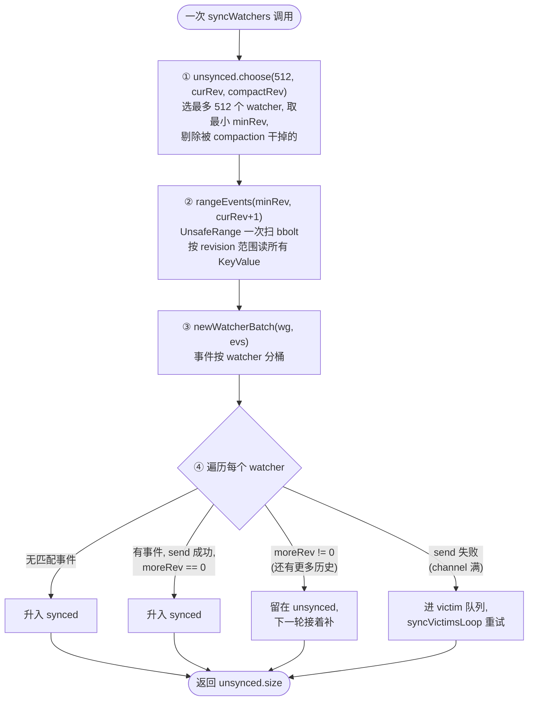
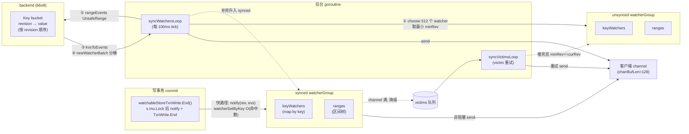

# 第十二章 · watch:基于 revision 的事件推送

> 篇:P3 存储 mvcc:多版本的世界
> 主线呼应:上一章(P3-11)我们看到一次写事务怎么走 `watchableStoreTxnWrite`,在 `End()` 里推进 `currentRev`、把 value 落进 bbolt。但 etcd 不是个"写进去就完事"的 KV,它最杀手锏的能力是 **watch**——客户端说"从 revision 1000 开始,`foo` 一旦变了就告诉我",etcd 就要把这段变更可靠地推过去。这一章回答的是:**写事务发生的那一刻,变更怎么从 `TxnWrite` 跑到正在 watch 的客户端?新连上的客户端要从 rev=1000 补历史,而当前已经 rev=10000 了,这条慢路径怎么走?凭什么断线重连不丢不重?** 答案的核心是两件事:把 watcher 按"追上实时 / 还在补历史"分成 `synced`/`unsynced` 两组走两条路,以及拿上一章立起来的 **revision 当 watch 的游标**。这一章属于应用层——mvcc 把共识结果落地成"可订阅的多版本状态",watch 是这套能力的出口。

## 核心问题

**watch 本质是"从某个 revision 开始订阅后续变更"。`watchableStore` 怎么把 watcher 按 synced(已追上实时)/unsynced(还在补历史)分两组?写事务提交时,变更事件怎么从 `notify` 直接推给 synced watcher(快路径,零额外 IO)?落后的 unsynced watcher 由后台 `syncWatchersLoop` 定期从 backend 补历史,补完升入 synced(慢路径)?凭什么 revision 能当 watch 的"游标",让客户端断线重连、etcd 重启都能精确断点续传,不丢一个事件也不重一个?**

读完本章你会明白:

1. watcher 的本质:一个三元组 `(key/range, minRev, 输出 channel)`——订阅"从 `minRev` 起,落在 `[key, end)` 区间内的所有变更事件"。
2. **synced/unsynced 分组**凭什么必要:追上实时的 watcher 走快路径(写事务 `notify` 直接内存推送,零额外 IO),落后的 watcher 走慢路径(`syncWatchersLoop` 定期从 backend 读历史补),两条路互不拖累。
3. **快路径**怎么走:`watchableStoreTxnWrite.End()` 在 `s.mu` 锁下调 `notify(rev, evs)`,`notify` 用 `watcherSetByKey` 把每个事件 O(1) 派给关注它的 synced watcher,watcher 非阻塞 `send` 进 channel;channel 满了的 watcher 降级为 victim,交给 `syncVictimsLoop` 重试。
4. **revision 作为 watch 游标**的真相:每个 watcher 带 `minRev`,每收到一批事件就推进到 `rev+1`;断线重连/etcd 重启靠 `minRev` 续上,从那个 revision 继续订阅,不丢不重;revision 单调保证事件全局有序。

> **如果一读觉得太难**:先只记住三件事——① watcher 就是"从某个 revision 起,某个 key/range 内的所有变更推给我",这个起始 revision 就是它的游标;② watcher 分两组:**synced**(追上实时,写事务直接推送)和 **unsynced**(落后,后台定期补历史),补完升入 synced;③ 客户端断线重连或 etcd 重启,都靠 watcher 上记着的 `minRev` 续上,revision 单调所以续得准、不丢不重。

---

## 12.1 一句话点破

> **watch 的本质是"从某个 revision 开始订阅后续变更"。etcd 把所有活跃 watcher 分成两组:synced(已经追上 store 当前 revision 的,后续新事件由写事务在提交时直接内存推送,零额外 IO)和 unsynced(订阅了一个旧 revision、要从历史补的,由后台 `syncWatchersLoop` 定期从 backend 顺序读补齐,补完升入 synced)。每个 watcher 都记着自己的 `minRev`——下一个想要的事件的起始 revision——每收一批事件就推进它。客户端断线重连、etcd 重启,都靠这个 `minRev` 续上,因为 revision 全局单调,续得准、不丢不重。**

这是结论,不是理由。本章倒过来拆:先看 watcher 长什么样、watch 这一动作的语义到底是什么;再看为什么不能"一个组搞定",必须分 synced/unsynced 两条路;然后分别钻进快路径(写事务→notify→synced watcher)和慢路径(syncWatchersLoop→backend 历史→升入 synced);最后把 revision 当游标这条线串起来,讲清断点续传凭什么可靠。

---

## 12.2 watcher 长什么样:一个带游标的订阅者

先把"watcher 是什么"立清楚。打开 `etcd/server/storage/mvcc/watchable_store.go` 的 `watcher` 结构([watchable_store.go:542-572](../etcd/server/storage/mvcc/watchable_store.go#L542-L572)):

```go
type watcher struct {
    key []byte       // 订阅的 key
    end []byte       // 订阅区间 [key, end); end == nil 表示只看单 key

    victim    bool   // channel 阻塞过, 进了 victim 队列
    compacted bool   // 因为订阅的 revision 已被 compaction 删掉而被取消
    restore   bool   // etcd 重启后从 synced 临时降到 unsynced 的标记

    startRev int64   // 客户端创建 watcher 时指定的起始 revision
    minRev   int64   // 下一个想要的事件的起始 revision (游标, 会推进)
    id       WatchID

    fcs []FilterFunc              // 过滤函数
    ch  chan<- WatchResponse      // 事件输出 channel (通常是 watchStream 共享的)
}
```

字段不少,但**核心就三个**:`key/end`(订阅范围)、`minRev`(游标)、`ch`(输出 channel)。其它字段都是状态机用的辅助标志。一句话定义 watcher:**它是一个订阅者,告诉 etcd"从 `minRev` 起,凡是有落在 `[key, end)` 区间内的变更事件,就通过 `ch` 推给我"**。

这里有几个**不显然**的细节,先点破,后面逐一拆:

1. **`minRev` 会变,`startRev` 不变**。`startRev` 是客户端创建时指定的"从哪开始",作为身份记录永远不动;`minRev` 是"游标",每收到一批事件就推进到 `下一个该看的 revision`。这条区分极其重要,是断点续传的根基(12.6 节详讲)。
2. **`ch` 是共享的**。一个客户端建一个 `watchStream`,在它上面可以开多个 watcher(每个 key/range 一个),所有 watcher 共享同一个 `ch`(`chanBufLen = 128`,[watchable_store.go:38](../etcd/server/storage/mvcc/watchable_store.go#L38))。所以推事件时要带 `WatchID` 区分([watcher.go:82-98](../etcd/server/storage/mvcc/watcher.go#L82-L98) 的 `WatchResponse`)。
3. **`key == nil && end == nil` 表示单 key watch,`end != nil` 表示 range watch**。range watch 在 `watcherGroup` 里走另一套数据结构(区间树),见 12.4 节。

> **钉死这件事**:watcher 的本质是一个**带 revision 游标的订阅者**。它的"位置"由 `minRev` 唯一确定——这就是下一个想要的事件从哪个 revision 开始算。后面一切机制(分组、快慢路径、断点续传)都围绕"怎么把事件按 revision 顺序、不丢不重地送到游标位置及之后"展开。

接下来我们看 watcher 怎么被创建,以及那个**关键的二选一分组**。

---

## 12.3 watch() 的二选一:进 synced 还是 unsynced

watch 这一动作的入口是 `watchableStore.watch`([watchable_store.go:128-158](../etcd/server/storage/mvcc/watchable_store.go#L128-L158))。它做三件事:构造 watcher、决定它进哪个组、返回一个 cancel 函数。最关键的就是"决定进哪个组"那几行:

```go
func (s *watchableStore) watch(key, end []byte, startRev int64, id WatchID, ch chan<- WatchResponse, fcs ...FilterFunc) (*watcher, cancelFunc) {
    wa := &watcher{
        key:      key,
        end:      end,
        startRev: startRev,
        minRev:   startRev,        // ① 初始 minRev = startRev
        id:       id,
        ch:       ch,
        fcs:      fcs,
    }

    s.mu.Lock()
    s.revMu.RLock()
    synced := startRev > s.store.currentRev || startRev == 0   // ② 二选一判据
    if synced {
        wa.minRev = s.store.currentRev + 1                     // ③ 对齐到"下一个将发生的 revision"
        if startRev > wa.minRev {
            wa.minRev = startRev
        }
        s.synced.add(wa)                                        // ④a 进 synced 组
    } else {
        slowWatcherGauge.Inc()
        s.unsynced.add(wa)                                      // ④b 进 unsynced 组
    }
    s.revMu.RUnlock()
    s.mu.Unlock()

    watcherGauge.Inc()
    return wa, func() { s.cancelWatcher(wa) }
}
```

逐句拆:

- **① 初始 `minRev = startRev`**。客户端创建 watcher 时给的"从哪开始"。
- **② `synced := startRev > currentRev || startRev == 0`**——**这是整章最核心的一行**。判据就两条:要么客户端显式说"我要从一个**未来**的 revision 开始看"(`startRev > currentRev`,即"我现在不想看历史,只想看从这里开始之后的新事件");要么 `startRev == 0`,表示"我不指定,从现在开始"(详见 `watcher.go` 里 `Watch` 的注释 [watcher.go:42-50](../etcd/server/storage/mvcc/watcher.go#L42-L50):`If "startRev" <=0, watch observes events after currentRev`)。两种情况都意味着"不用补历史",所以直接进 synced。
- **③ `wa.minRev = s.store.currentRev + 1`**。这条非常重要,容易被忽略——**对于 `startRev == 0` 的"从现在开始"的 watcher,它的 `minRev` 被对齐到 `currentRev + 1`**(也就是"下一个将发生的 revision"),不是它创建那一刻的 `currentRev`。这避免了"创建和首个事件之间 store 又推进了几格,游标没跟上"的小坑。如果 `startRev` 是显式的未来 revision(`startRev > currentRev`),保留它。
- **④a/④b 进对应组**。`s.synced.add(wa)` 或 `s.unsynced.add(wa)`,分发逻辑见 12.4 节。

> **不这样会怎样**:设想不分组的朴素方案——所有 watcher 都进一个集合,每次有新事件就遍历全部 watcher,对每个去检查"它要的 `startRev` 是不是已经被 compaction 删了"、"它的 `minRev` 是不是落后于当前、要不要补历史"。结果就是:**慢 watcher(订阅了旧 revision)和快 watcher(只想看新事件)混在一起,每条新事件都要为慢 watcher 做额外的历史检查,实时性被拖累;同时慢 watcher 又没法批量地从 backend 补历史,因为它没单独分组**。这就引出了 synced/unsynced 这条最重要的设计决策。

---

## 12.4 为什么要分 synced/unsynced 两组:两条路各走各的

这一节是本章的命脉。先把 `watchableStore` 的整体结构看一眼([watchable_store.go:56-76](../etcd/server/storage/mvcc/watchable_store.go#L56-L76)):

```go
type watchableStore struct {
    *store

    // mu protects watcher groups and batches. It should never be locked
    // before locking store.mu to avoid deadlock.
    mu sync.RWMutex

    // victims are watcher batches that were blocked on the watch channel
    victims      []watcherBatch
    victimc      chan struct{}

    // contains all unsynced watchers that needs to sync with events that have happened
    unsynced watcherGroup

    // contains all synced watchers that are in sync with the progress of the store.
    synced    watcherGroup

    stopc chan struct{}
    wg    sync.WaitGroup
}
```

三个 watcher 集合:`synced`(追上实时的)、`unsynced`(还要补历史的)、`victims`(channel 阻塞过,要先攒着事件重试的)。`victims` 是个边角快慢路径交错时的产物,12.5 节末尾会讲;主菜是 `synced` 和 `unsynced` 这两组。

这两组对应**两条完全不同的事件推送路径**:

| | **synced(快路径)** | **unsynced(慢路径)** |
|---|---|---|
| 触发方 | 写事务 `End()` 同步调 `notify` | 后台 `syncWatchersLoop` 每 100ms tick |
| 事件来源 | 写事务产生的 changes,已在内存 | 从 backend(bbolt)按 revision 范围读 |
| IO 开销 | **零额外 IO**(changes 是写事务本来就攒好的) | **要扫 bbolt**(`UnsafeRange` 按 revision 区间) |
| 推送时机 | 实时(写事务提交那一刻) | 100ms 一次的批量 |
| 推送方式 | 每个事件 O(1) 派给关注它的 watcher | 选最多 512 个 watcher,共享一次 backend 扫描 |
| 完成后 | 留在 synced,等下次写事务 | 补完升入 synced |

> **所以这样设计**:**synced 和 unsynced 分开,本质是为了"不让慢 watcher 拖累实时推送,也不让快 watcher 的频繁事件淹没慢 watcher 的批量补历史"**。快 watcher 需要的是低延迟(写事务一发生就推),慢 watcher 需要的是高吞吐(一次性补一大段历史,别一条条查)。这两种诉求在数据结构、调度时机、IO 模式上都截然不同——硬塞到一个集合里,两边都做不好。

接下来分别钻进两条路径的源码。

---

## 12.5 快路径:写事务 → notify → synced watcher

这是事件推送的主干道。当一次写事务 commit 时,变更怎么从 `TxnWrite` 跑到 synced watcher 的 channel?

### 12.5.1 入口:watchableStoreTxnWrite.End()

打开 `watchable_store_txn.go`,整个文件才 57 行,核心就一个 `End()`([watchable_store_txn.go:22-47](../etcd/server/storage/mvcc/watchable_store_txn.go#L22-L47)):

```go
func (tw *watchableStoreTxnWrite) End() {
    changes := tw.Changes()
    if len(changes) == 0 {
        tw.TxnWrite.End()
        return
    }

    rev := tw.Rev() + 1                                  // ① 这批 changes 对应的 revision = beginRev + 1
    evs := make([]*mvccpb.Event, len(changes))
    for i, change := range changes {
        evs[i] = &mvccpb.Event{Kv: changes[i]}
        if change.CreateRevision == 0 {                 // ② CreateRevision == 0 是删除事件
            evs[i].Type = mvccpb.Event_DELETE
            evs[i].Kv.ModRevision = rev
        } else {
            evs[i].Type = mvccpb.Event_PUT
        }
    }

    // end write txn under watchable store lock so the updates are visible
    // when asynchronous event posting checks the current store revision
    tw.s.mu.Lock()
    tw.s.notify(rev, evs)                                // ③ 通知 synced watcher
    tw.TxnWrite.End()                                    // ④ 真正 commit 写事务(currentRev++ 在这里发生)
    tw.s.mu.Unlock()
}
```

几个关键点:

- **`rev := tw.Rev() + 1`**:上一章 P3-10 讲过,`storeTxnWrite.Rev()` 返回 `beginRev`([kvstore_txn.go:187](../etcd/server/storage/mvcc/kvstore_txn.go#L187)),本事务所有修改的 `Main` 就是 `beginRev + 1`。所以这里的 `rev` 是这批 changes 对应的 revision。
- **`CreateRevision == 0` 判删除**:`mvccpb.KeyValue` 里,删除事件的 `CreateRevision` 是 0(因为这个 key 在这个 revision 已经不存在了),所以靠这个判 `Event_DELETE`。注意它顺手把 `Kv.ModRevision = rev` 设上,这样下游 watcher 拿到删除事件时能知道它发生在哪个 revision。
- **`tw.s.mu.Lock()` 包住 `notify` 和 `TxnWrite.End()`**——**这一段是整章最容易看漏、也是最重要的并发设计**。源码注释解释了为什么:"end write txn under watchable store lock so the updates are visible when asynchronous event posting checks the current store revision"。直译就是:**写事务的真正 commit(`TxnWrite.End()` 里 `currentRev++`)和 notify 必须在同一个 `s.mu` 锁下完成,这样异步的 `syncWatchersLoop` 要么看到"commit 前"(notify 还没发生,unsynced 不会想拿这批 changes),要么看到"commit 后"(notify 已发,事件已在 watcher channel 里)。不会有"currentRev 推进了,但事件还没派给 synced watcher"的中间态**。这条不变式保证了事件不丢。

> **钉死这件事**:`notify` 和 `currentRev++` 必须原子。`watchableStoreTxnWrite.End()` 用 `s.mu.Lock()` 把它们包起来,堵死了"游标推进但事件没派"的缝隙。这是 watch 不丢事件的根基。

### 12.5.2 notify:把事件 O(1) 派给关注它的 synced watcher

`notify` 在 [watchable_store.go:468-492](../etcd/server/storage/mvcc/watchable_store.go#L468-L492):

```go
func (s *watchableStore) notify(rev int64, evs []*mvccpb.Event) {
    victim := make(watcherBatch)
    for w, eb := range newWatcherBatch(&s.synced, evs) {        // ① 把事件按"哪个 watcher 关心"分桶
        if eb.revs != 1 {
            s.store.lg.Panic(
                "unexpected multiple revisions in watch notification",
                zap.Int("number-of-revisions", eb.revs),
            )
        }
        if w.send(WatchResponse{WatchID: w.id, Events: eb.evs, Revision: rev}) {   // ② 非阻塞 send
            pendingEventsGauge.Add(float64(len(eb.evs)))
        } else {
            // move slow watcher to victims
            w.victim = true
            victim[w] = eb
            s.synced.delete(w)                                  // ③ channel 满了, 降级
            slowWatcherGauge.Inc()
        }
        // always update minRev
        // in case 'send' returns true and watcher stays synced, this is needed for Restore when all watchers become unsynced
        // in case 'send' returns false, this is needed for syncWatchers
        w.minRev = rev + 1                                       // ④ 推进游标
    }
    s.addVictim(victim)
}
```

四步:

- **① `newWatcherBatch(&s.synced, evs)`**:这是关键。它不是"对每个事件扫所有 synced watcher",而是**反过来:对每个事件,用它的 key 去查"哪些 watcher 订阅了这个 key",然后按 watcher 分桶**。具体怎么查,12.5.3 讲 `watcherSetByKey`——核心是 O(匹配的 watcher 数),不是 O(synced watcher 总数)。这就是为什么百万 watcher 也扛得住:每条事件只触达"真正关心它的少数 watcher"。
- **② `w.send(...)` 是非阻塞的**:看 `watcher.send` 的尾部([watchable_store.go:613-619](../etcd/server/storage/mvcc/watchable_store.go#L613-L619)):
  ```go
  select {
  case w.ch <- wr:
      return true
  default:
      return false               // channel 满了, 立刻返回 false, 不阻塞
  }
  ```
  **watcher 的 channel 推不进去就立刻返回 false,绝不在 notify 路径上阻塞写事务**。这条是 watch 不会拖垮写吞吐的关键——下面详讲。
- **③ channel 满的 watcher 降级为 victim**:删出 synced,塞进 victim 队列,等 `syncVictimsLoop` 重试(12.5.4)。
- **④ `w.minRev = rev + 1`**:**游标推进**。不管 send 成功与否,游标都推进(因为 victim 的事件已经攒在 `victim[w] = eb` 里,由 victim 路径补推;send 成功的自然也推过去了)。

> **不这样会怎样(对 `send` 非阻塞)**:如果 `send` 是阻塞的(`w.ch <- wr` 不带 `default`),那么只要有一个 watcher 的客户端消费慢、channel 满,整个写事务就会被卡在 `notify` 里——**一个慢客户端拖垮整个 etcd 的写吞吐**。这在分布式系统里是绝对不能接受的故障模式。所以 etcd 选了"非阻塞 send + 降级 victim 重试"的策略:**写事务永远优先,慢客户端被隔离到 victim 路径,自己慢慢补**。

> **技巧点睛(对 `eb.revs != 1` 的 Panic)**:notify 期望"一次调用里的所有事件来自同一个 revision"(`eb.revs == 1`)。这是因为 notify 是单事务入口,一个事务的所有 changes 共享同一个 `Main`(P3-10 立的规矩),所以 revs 必然是 1。如果出现 `> 1`,说明 invariant 被破坏,直接 Panic——典型的 etcd 式"发现不变式破坏立刻挂,不带病运行"。

### 12.5.3 watcherSetByKey:key/range 双索引的 O(1) 派发

事件到 watcher 的派发,核心是 `watcherGroup`。打开 `watcher_group.go`,它的结构([watcher_group.go:149-156](../etcd/server/storage/mvcc/watcher_group.go#L149-L156)):

```go
type watcherGroup struct {
    // keyWatchers has the watchers that watch on a single key
    keyWatchers watcherSetByKey
    // ranges has the watchers that watch a range; it is sorted by interval
    ranges  adt.IntervalTree
    // watchers is the set of all watchers
    watchers watcherSet
}
```

**关键设计:单 key watcher 和 range watcher 走两套数据结构**。

- **单 key watcher**(创建时 `end == nil`)放进 `keyWatchers`,这是一个 `map[string]watcherSet`——按 key 直接查,拿一个 watcher 集合,O(1)。
- **range watcher**(创建时 `end != nil`)放进 `ranges`,这是一个**区间树(IntervalTree)**,按 `[key, end)` 区间排好。给定一个点 key,能快速查到所有包含这个 key 的区间——这种查询叫"stabbing query"。

派发的真相在 `watcherGroup.watcherSetByKey`([watcher_group.go:273-295](../etcd/server/storage/mvcc/watcher_group.go#L273-L295)):

```go
func (wg *watcherGroup) watcherSetByKey(key string) watcherSet {
    wkeys := wg.keyWatchers[key]
    wranges := wg.ranges.Stab(adt.NewStringAffinePoint(key))    // 区间树 stabbing 查询

    // zero-copy cases
    switch {
    case len(wranges) == 0:
        return wkeys                                              // 只看单 key 的, 直接返回 map 引用
    case len(wranges) == 0 && len(wkeys) == 0:
        return nil
    case len(wranges) == 1 && len(wkeys) == 0:
        return wranges[0].Val.(watcherSet)                        // 命中一个 range, 直接返回它的引用
    }

    // copy case: 既有单 key 又有 range 命中, 合并
    ret := make(watcherSet)
    ret.union(wg.keyWatchers[key])
    for _, item := range wranges {
        ret.union(item.Val.(watcherSet))
    }
    return ret
}
```

注意三种**零拷贝快路径**:如果只命中单 key watcher 或只命中一个 range watcher,直接返回内部 map 的引用,不分配新内存。只有同时命中多种时才合并出一个临时集合。这对常见的"单 key watch"场景是巨大的优化——`notify` 路径几乎零分配。

> **钉死这件事**:**watcherGroup 的双索引(单 key 用 map,range 用区间树)是 watch 性能的关键**。朴素做法是"每条事件遍历所有 synced watcher,看 key 落不落在它的区间里"——O(watcher 总数)。etcd 把这件事变成 O(命中的 watcher 数),撑住了海量 watcher(单节点数十万 watcher 是生产常态)。区间树(stabbing query O(log N + 命中数))是单 key map(O(1))的天然补全。

### 12.5.4 victim:channel 阻塞时的安全网

讲清楚快路径的尾巴。channel 满了的 watcher 进 victim 队列,由 `syncVictimsLoop` 照看([watchable_store.go:259-282](../etcd/server/storage/mvcc/watchable_store.go#L259-L282)):

```go
func (s *watchableStore) syncVictimsLoop() {
    defer s.wg.Done()

    for {
        for s.moveVictims() != 0 {
            // try to update all victim watchers
        }
        s.mu.RLock()
        isEmpty := len(s.victims) == 0
        s.mu.RUnlock()

        var tickc <-chan time.Time
        if !isEmpty {
            tickc = time.After(10 * time.Millisecond)            // 还有 victim, 10ms 后再试
        }

        select {
        case <-tickc:
        case <-s.victimc:                                         // notify 新增 victim 时立刻唤醒
        case <-s.stopc:
            return
        }
    }
}
```

victim 路径的作用:**把已经被 notify 算过、但没推成功的事件,在 watcher channel 有空位时重试**。这样即便一个 watcher 暂时阻塞,它的事件也不会丢——`minRev` 已经推进了(`notify` 里 `w.minRev = rev + 1`),事件本体被攒在 `victim[w]` 里,等客户端消费追上来、channel 有空位,`moveVictims` 把事件推过去([watchable_store.go:285-339](../etcd/server/storage/mvcc/watchable_store.go#L285-L339))。推完后,如果 watcher 的 `minRev <= curRev`,说明还有历史没补,降回 unsynced 走慢路径;否则升入 synced。

victim 是"快路径上的暂时性慢客户端"的安全网。它的设计哲学和 12.5.2 的非阻塞 send 一脉相承:**写事务永远不被慢客户端拖住,慢客户端的事务流攒在 victim 里慢慢追**。

---

## 12.6 慢路径:syncWatchersLoop 从 backend 补历史

快路径解决了"追上实时的 watcher",但还有一类 watcher:**订阅了一个旧 revision,需要从历史补**。比如客户端说"我要从 rev=1000 开始订阅",而当前 currentRev=10000。这种 watcher 在 `watch()` 里走 `else` 分支进了 unsynced(12.3),要靠后台 goroutine 把 rev=1000 到 currentRev 之间的所有相关变更补过去。

### 12.6.1 后台 goroutine 的启动

`watchableStore` 一被创建就启动两个后台 goroutine([watchable_store.go:84-90](../etcd/server/storage/mvcc/watchable_store.go#L84-L90)):

```go
func New(lg *zap.Logger, b backend.Backend, le lease.Lessor, cfg StoreConfig) WatchableKV {
    s := newWatchableStore(lg, b, le, cfg)
    s.wg.Add(2)
    go s.syncWatchersLoop()        // 慢路径: 给 unsynced watcher 补历史
    go s.syncVictimsLoop()         // victim 重试
    return s
}
```

`syncWatchersLoop` 的节奏由 `watchResyncPeriod = 100 * time.Millisecond` 控制([watchable_store.go:44](../etcd/server/storage/mvcc/watchable_store.go#L44))——每 100ms 检查一次有没有 unsynced watcher 要补。看主体([watchable_store.go:224-255](../etcd/server/storage/mvcc/watchable_store.go#L224-L255)):

```go
func (s *watchableStore) syncWatchersLoop() {
    defer s.wg.Done()

    delayTicker := time.NewTicker(watchResyncPeriod)
    defer delayTicker.Stop()

    for {
        s.mu.RLock()
        st := time.Now()
        lastUnsyncedWatchers := s.unsynced.size()
        s.mu.RUnlock()

        unsyncedWatchers := 0
        if lastUnsyncedWatchers > 0 {
            unsyncedWatchers = s.syncWatchers()                  // 实际补历史的函数
        }
        syncDuration := time.Since(st)

        delayTicker.Reset(watchResyncPeriod)
        // more work pending?
        if unsyncedWatchers != 0 && lastUnsyncedWatchers > unsyncedWatchers {
            // be fair to other store operations by yielding time taken
            delayTicker.Reset(syncDuration)                      // 还没补完, 缩短下一轮间隔
        }

        select {
        case <-delayTicker.C:
        case <-s.stopc:
            return
        }
    }
}
```

两个细节:

1. **自适应节奏**:如果一次 `syncWatchers` 补完还剩 unsynced watcher(`unsyncedWatchers != 0`),且本轮有进展(`lastUnsyncedWatchers > unsyncedWatchers`),下一轮的等待时间会被压缩成"上一轮耗时"而不是 100ms。这是一种"有活干就快点干"的自适应调度,避免大 backlog 时还在慢悠悠等 100ms。
2. **"be fair to other store operations"**:注释点出一个权衡——`syncWatchers` 要拿 `s.mu` 写锁,补历史时不能独占太久,要让出节奏给正常读写。

### 12.6.2 syncWatchers:补历史的核心

补历史的核心在 `syncWatchers`([watchable_store.go:346-414](../etcd/server/storage/mvcc/watchable_store.go#L346-L414))。源码注释把四步讲得很清楚:

```go
// syncWatchers syncs unsynced watchers by:
//  1. choose a set of watchers from the unsynced watcher group
//  2. iterate over the set to get the minimum revision and remove compacted watchers
//  3. use minimum revision to get all key-value pairs and send those events to watchers
//  4. remove synced watchers in set from unsynced group and move to synced group
func (s *watchableStore) syncWatchers() int {
    s.mu.Lock()
    defer s.mu.Unlock()

    if s.unsynced.size() == 0 {
        return 0
    }

    s.store.revMu.RLock()
    defer s.store.revMu.RUnlock()

    curRev := s.store.currentRev
    compactionRev := s.store.compactMainRev

    // ① 选最多 maxWatchersPerSync=512 个 watcher, 拿这批的最小 minRev
    wg, minRev := s.unsynced.choose(maxWatchersPerSync, curRev, compactionRev)
    // ② 用 [minRev, curRev+1) 范围扫一次 bbolt, 拿到这区间所有 KeyValue
    evs := rangeEvents(s.store.lg, s.store.b, minRev, curRev+1, wg)

    victims := make(watcherBatch)
    wb := newWatcherBatch(wg, evs)                                // ③ 把事件按 watcher 分桶
    for w := range wg.watchers {
        if w.minRev < compactionRev {
            // 游标已被 compaction 删了, 跳过 (下面单独处理)
            continue
        }
        w.minRev = max(curRev+1, w.minRev)

        eb, ok := wb[w]
        if !ok {
            // 这个 watcher 在 [minRev, curRev+1) 区间没有匹配事件, 直接升入 synced
            s.synced.add(w)
            s.unsynced.delete(w)
            continue
        }

        if eb.moreRev != 0 {
            w.minRev = eb.moreRev                                 // 还有更多事件, 留在 unsynced 接着补
        }

        if w.send(WatchResponse{WatchID: w.id, Events: eb.evs, Revision: curRev}) {
            pendingEventsGauge.Add(float64(len(eb.evs)))
        } else {
            w.victim = true
        }

        if w.victim {
            victims[w] = eb
        } else {
            if eb.moreRev != 0 {
                continue                                          // 留在 unsynced, 下一轮接着补
            }
            s.synced.add(w)                                       // 补完了, 升入 synced
        }
        s.unsynced.delete(w)
    }
    s.addVictim(victims)
    // ...
    return s.unsynced.size()
}
```

四步拆开:

- **① `choose(maxWatchersPerSync, curRev, compactionRev)`**:从 unsynced 选最多 512 个 watcher(`maxWatchersPerSync = 512`,[watchable_store.go:41](../etcd/server/storage/mvcc/watchable_store.go#L41))。`choose` 内部还做一件重要的事——**剔除被 compaction 干掉的 watcher**:如果 `w.minRev < compactionRev`(游标已经落在压缩过的历史区),给客户端发一个 `CompactRevision` 响应把它取消掉([watcher_group.go:255-264](../etcd/server/storage/mvcc/watcher_group.go#L255-L264))。这就是 P3-13 compaction 那章会详讲的"compaction 不能压掉 unsynced watcher 还需要的 revision"——压了就发 `CompactRevision`,让客户端自己决定是从新 revision 重 watch 还是放弃。
- **② `rangeEvents(..., minRev, curRev+1, wg)`**:**这是慢路径唯一一次 backend IO**。看它的实现([watchable_store.go:417-437](../etcd/server/storage/mvcc/watchable_store.go#L417-L437)):
  ```go
  func rangeEvents(lg *zap.Logger, b backend.Backend, minRev, maxRev int64, c contains) []*mvccpb.Event {
      // ...
      minBytes, maxBytes := NewRevBytes(), NewRevBytes()
      minBytes = RevToBytes(Revision{Main: minRev}, minBytes)
      maxBytes = RevToBytes(Revision{Main: maxRev}, maxBytes)

      tx := b.ReadTx()
      tx.RLock()
      // UnsafeRange returns keys and values. And in boltdb, keys are revisions.
      revs, vs := tx.UnsafeRange(schema.Key, minBytes, maxBytes, 0)    // 按 revision 范围扫 bbolt
      evs := kvsToEvents(lg, c, revs, vs)
      tx.RUnlock()
      return evs
  }
  ```
  就是上一章 P3-10 立的"bbolt 里 revision 当 key、大端编码天然按数值序"在这里发挥作用——一次 `UnsafeRange` 把 `[minRev, curRev+1)` 之间的所有 KeyValue 顺序读出来,极快。`contains` 接口让 `kvsToEvents` 用 `watcherGroup.contains(key)` 过滤,只留这一批 watcher 关心的 key 的事件。
- **③ `newWatcherBatch(wg, evs)`**:和 notify 一样,按 watcher 分桶。注意这里复用了快路径的 `newWatcherBatch` 函数([watcher_group.go:79-98](../etcd/server/storage/mvcc/watcher_group.go#L79-L98))——同一套"事件按 watcher 分桶"逻辑在两条路径上复用,代码统一。
- **④ 升入 synced 或留在 unsynced**:
  - 区间内没匹配事件 → 直接升 synced。
  - 有匹配事件且推成功且 `moreRev == 0`(事件都推完了) → 升 synced。
  - `moreRev != 0`(本批超过 `watchBatchMaxRevs = 1000` 个 revision,还有更多没读完) → 留 unsynced,下一轮接着补。
  - 推失败(channel 满) → 进 victim。

> **钉死这件事**:**慢路径的关键设计是"一次 backend 扫描补一批 watcher"**。朴素做法是"对每个 unsynced watcher 单独扫一次 bbolt 补它的历史"——N 个 watcher 扫 N 次 backend。etcd 选了"选最多 512 个 watcher,取它们的最小 `minRev`,一次范围扫描 `[minRev, curRev+1)` 把这段历史全读出来,再分桶派给各自关心的 watcher"。这样 N 个 watcher 共享一次 backend IO,摊销成本极低。这就是为什么 unsynced watcher 即使上千上万个,也能在几秒内全部补完升入 synced。



---

## 12.7 watcherGroup 内部:单 key + 区间树 + 全集

前面几节用了好几次 `watcherGroup.add`/`delete`/`choose`,这里把它的内部一次性讲清。看 `add`([watcher_group.go:167-185](../etcd/server/storage/mvcc/watcher_group.go#L167-L185)):

```go
// add puts a watcher in the group.
func (wg *watcherGroup) add(wa *watcher) {
    wg.watchers.add(wa)
    if wa.end == nil {
        wg.keyWatchers.add(wa)                                    // 单 key watcher: 进 map
        return
    }

    // interval already registered?
    ivl := adt.NewStringAffineInterval(string(wa.key), string(wa.end))
    if iv := wg.ranges.Find(ivl); iv != nil {
        iv.Val.(watcherSet).add(wa)                               // 同区间已有 watcher: 共享区间树节点
        return
    }

    // not registered, put in interval tree
    ws := make(watcherSet)
    ws.add(wa)
    wg.ranges.Insert(ivl, ws)                                     // 新区间: 插入区间树
}
```

三个集合分工:

- **`watchers`(全集)**:`map[*watcher]struct{}`,用于 `size()`、遍历所有 watcher。
- **`keyWatchers`(单 key)**:`map[string]watcherSet`,按 key 分桶。`watch(key="foo")` 把 watcher 放进 `keyWatchers["foo"]` 这个集合。
- **`ranges`(区间树)**:`adt.IntervalTree`,按 `[key, end)` 区间排。`watch(key="a", end="z")` 插一个区间 `[a, z)`。注意**同区间复用节点**:两个 watcher 都 watch `[a, z)`,区间树里只有一个节点,节点值是包含两个 watcher 的 `watcherSet`。

> **技巧点睛(区间复用)**:如果朴素地"每个 range watcher 一个区间树节点",海量同区间 watcher 会让区间树爆炸。etcd 让同区间的 watcher 共享一个节点(节点值是 watcherSet),区间树的大小只受"不同区间数"控制,常被压缩到极小。这是个微小但实在的内存优化。

`delete`([watcher_group.go:197-223](../etcd/server/storage/mvcc/watcher_group.go#L197-L223))走对应反向路径:从 `watchers` 删,根据 `end` 决定从 `keyWatchers` 还是 `ranges` 删。注意 `delete` 的返回值——`true` 表示"找到并删了",`false` 表示"这个 watcher 不在这个组里"。`cancelWatcher`([watchable_store.go:161-205](../etcd/server/storage/mvcc/watchable_store.go#L161-L205))就靠这个返回值判断"watcher 是在 synced 还是 unsynced"。

---

## 12.8 把两条路径画出来:全景

把 12.5 和 12.6 串成一张总图:



读这张图,记住三句话:

1. **写事务 commit 时,变更事件直接进 synced watcher 的 channel**——这是默认主路径,零额外 backend IO。
2. **channel 满的 watcher 暂时进 victim,由 syncVictimsLoop 重试**——慢客户端不拖累写事务。
3. **落后的 unsynced watcher 由 syncWatchersLoop 每 100ms 从 backend 批量补历史,补完升入 synced**——补历史是批量摊销,不爆炸。

---

## 12.9 技巧精解

这一节把本章两条命脉单独拆透:① synced/unsynced 分组凭什么必要;② revision 作为 watch 游标凭什么可靠。

### 技巧一:synced/unsynced 分组——两条路各走各的

这是本章最核心的设计。再把它和"不分组"的反面对比一遍,把妙处讲显形。

> **反面对比 A(不分组,所有 watcher 一锅炖,新事件遍历全体)**:
> 设想 etcd 把所有 watcher 放一个集合,每次写事务 commit,`notify` 遍历所有 watcher,对每个判断"它关心这个 key 吗?它的 `minRev` 满足吗?"。问题:
> - **慢 watcher 拖累实时推送**:订阅了旧 revision 的 watcher(比如要补 9000 格历史)和只想看新事件的 watcher 混在一起,每次新事件都要为它做额外检查,实时 watcher 的延迟被拉高。
> - **慢 watcher 永远补不完历史**:朴素 notify 路径只推"本次新事件",不会主动去 backend 扫历史。慢 watcher 的历史谁补?没有专门的路径。
>
> 结果:**慢 watcher 既拖累快 watcher,自己又补不完历史**——双输。

> **反面对比 B(不分组,所有 watcher 都走历史补)**:
> 设想每次有新事件,都从 backend 把这个 watcher 的 `minRev` 到 currentRev 之间的历史读一遍。问题:
> - **每条新事件都触发一次 backend 扫描**:写吞吐被 backend IO 拖垮。
> - **快 watcher 的低延迟诉求被牺牲**:本来写事务内存里就有 changes,直接派就完了,现在非要绕一圈 backend。
>
> 结果:**写吞吐崩盘,实时性反而更差**。

> **所以这样设计**:**把 watcher 按是否追上实时分两组,各自走最适合自己的路径**。
> - synced watcher 的诉求是"低延迟"——写事务内存里本来就有 changes,直接派,O(命中的 watcher 数),零额外 IO。
> - unsynced watcher 的诉求是"批量高吞吐补历史"——后台 goroutine 攒 100ms,选最多 512 个 watcher,**一次 backend 范围扫描**补它们所有人。
>
> 两条路互不干扰:实时推送永远不会因为"还要照顾慢 watcher"而绕 backend;慢 watcher 的批量补历史也不会因为"被新事件频繁打断"而做不下去。**这就是分组的意义——各走各的路,各取所长**。

辅助这条主设计的还有两个小技巧,值得单独点一下:

- **`choose(512, ...)` 批量上限**:为什么不一次补完所有 unsynced watcher?因为补历史要拿 `s.mu` 写锁,长时间独占会卡住读写。512 是经验阈值,在"补得够快"和"不卡别的操作"之间取的折中。
- **`watchBatchMaxRevs = 1000`**([watcher_group.go:28](../etcd/server/storage/mvcc/watcher_group.go#L28)):一个 watcher 一次最多收 1000 个不同 revision 的事件,超了就设 `moreRev` 留 unsynced 下一轮接着补。这避免一个订阅大区间的 watcher 一次收到十万事件把 channel 灌爆,把推送切成可控的批次。

### 技巧二:revision 作为 watch 游标——断点续传的根基

这是 etcd watch 区别于"时间戳订阅 / offset 订阅"的关键。每个 watcher 带 `minRev`,它是"下一个想要的事件从哪个 revision 开始算"。这条看似简单,带来的好处极深:

**好处一:断线重连精确续传**。客户端 watch 到 revision 5000 时网络断了,重连时告诉 etcd"从 5000 开始继续"。etcd 拿这个 5000 当 `startRev` 建 watcher——如果 5000 > currentRev,进 synced 等新事件;否则进 unsynced,从 5000 补到 currentRev 再升 synced。**因为 revision 单调(全局共享计数器,P3-10 立的规矩),5000 这个游标精确对应"客户端最后看到的下一个事件",不丢不重**。

**好处二:etcd 重启后 watcher 续命**。`watchableStore.Restore`([watchable_store.go:207-221](../etcd/server/storage/mvcc/watchable_store.go#L207-L221))有一个精妙设计:
```go
func (s *watchableStore) Restore(b backend.Backend) error {
    s.mu.Lock()
    defer s.mu.Unlock()
    err := s.store.Restore(b)
    if err != nil {
        return err
    }

    for wa := range s.synced.watchers {
        wa.restore = true                          // 标记: 这是从 synced 降下来的
        s.unsynced.add(wa)                         // 全部降级到 unsynced
    }
    s.synced = newWatcherGroup()                   // synced 清空
    return nil
}
```
etcd 重启(比如 leader 切换、从 snapshot 恢复)时,**所有原 synced watcher 全部降到 unsynced**——因为重启过程中可能错过事件,synced 的"实时推送"语义不再成立。降到 unsynced 后,`syncWatchersLoop` 会用 watcher 的 `minRev` 从 backend 把这段时间错过的事件补齐,补完再升回 synced。`restore = true` 标志配合 `chooseAll` 里那条 `if w.minRev > curRev` 的特殊处理([watcher_group.go:241-254](../etcd/server/storage/mvcc/watcher_group.go#L241-L254)),容忍"从 synced 降下来时 `minRev` 是个未来 revision"的暂时状态。**这一切的根基,就是 watcher 上记的 `minRev`——重启不丢 watcher 状态,不丢事件**。

> **反面对比(无 revision 游标,靠时间戳/offset)**:
> - **靠时间戳**:客户端说"从 2026-06-22 10:00:00 开始订阅"。问题:机器时钟可能不准(分布式系统的经典痛点)、时间戳精度不够(同一秒多个事件无法排序)、etcd 重启后怎么对齐时间戳?**根本无法精确续传**。
> - **靠"客户端已收到事件的 offset(第 N 个)"**:这个 offset 是每个 key 各自的,跨 key 没法用(上一章 P3-10 技巧精解就讲过"每 key 计数器"的三个死角:watch 跨 key 没游标、事务原子性无法表达、快照读没对齐点)。**全局 revision 才是唯一的解**。
>
> etcd 用**全局单调 revision** 当游标:它是事务号(同事务共享 Main,跨事务单调),天然有全局顺序,不依赖物理时钟,重启后从 bbolt 恢复 currentRev 即可继续。**这就是为什么 watch 的"断点续传"必须建立在 revision 之上——它是 P3-10 那套多版本骨架的自然延伸**。

> **钉死这件事**:**revision 是 watch 的游标,这条设计是 P3-10 "全局单调 revision"在 watch 场景的直接红利**。没有 P3-10 那套"每个写事务 +1、Sub 区分事务内、大端编码当 bbolt key"的根基,watch 的断点续传、慢路径补历史、etcd 重启续命全都做不出来。**P3-10 立骨架,P3-12 收果子**——这就是多版本存储"应用层"内部的传承。

---

## 12.10 配合 watcher.send 的过滤与校验

讲完主菜,补一个 watcher.send 里的细节([watchable_store.go:574-619](../etcd/server/storage/mvcc/watchable_store.go#L574-L619))。`send` 在把事件塞 channel 前,做两件事:

1. **过滤器应用**(`fcs`):watcher 创建时可带 `FilterFunc`,过滤掉不要的事件(比如"只看 value 变化超过某阈值的")。这里逐事件过滤,全被过滤掉就不发。
2. **不变式校验**(`verify.Verify`):检查 `Event.ModRevision >= w.startRev`。如果发现事件的 `ModRevision` 比 watcher 的 `startRev` 还小,说明 invariant 破坏(订阅了 revision 1000,结果推过来一个 revision 500 的事件?),报告详情。这是 watch 顺序正确性的运行时守护。

这两条不是 watch 的核心机制,但体现了 etcd "在关键路径上保留校验"的工程哲学——宁可多花点 CPU 做校验,也不让错误数据静默通过。

---

## 章末小结

这一章讲完了 watch 的事件推送机制。我们没有讲 gRPC 层的 watch stream(那是 etcdserver/api 层的事),也没讲 client 端怎么重连重 watch(那是 clientv3 的事)——本章只聚焦 mvcc 层:watcher 怎么组织、事件怎么从写事务推到 watcher、慢 watcher 怎么补历史、revision 怎么当游标。

回扣全书二分法:这一章属于**应用层**(状态机应用层:把共识结果落地成可订阅的多版本状态)。Raft(协议层)只管"这条 Put 被多数派 commit 了",它根本不知道这条 Put 要推给哪些 watcher、推得多快、怎么断点续传——这些是 etcd 应用层(mvcc)的职责。apply 通道把已 commit 的 entry 交给 mvcc,mvcc 走 `watchableStoreTxnWrite.End()` 把变更推给 synced watcher,**协议层管"达成一致",应用层管"一致之后怎么把变更可靠地推给订阅者"**——本章是应用层"对外输出"的那一面。

### 五个"为什么"清单

1. **watcher 的本质是什么?** 一个带 revision 游标的订阅者:`(key/range, minRev, ch)`。它告诉 etcd"从 `minRev` 起,凡是有落在 `[key, end)` 区间内的变更,就通过 `ch` 推给我"。`minRev` 是游标,会推进;`startRev` 是身份,不动。

2. **为什么要分 synced/unsynced 两组?** 两类 watcher 的诉求截然不同:synced(追上实时)需要低延迟,走快路径(写事务内存直接派,零额外 IO);unsynced(还在补历史)需要批量高吞吐,走慢路径(后台 goroutine 一次 backend 范围扫描补 512 个 watcher)。不分组的话,慢 watcher 拖累实时推送,快 watcher 又没法批量补历史,双输。

3. **快路径怎么做到不阻塞写事务?** `watcher.send` 是**非阻塞**的(`select` 带 `default`),channel 满立刻返回 false。满了的 watcher 进 victim 队列,由 `syncVictimsLoop` 重试。这样**一个慢客户端永远不会拖垮写吞吐**——它的事件被攒在 victim 里慢慢追。同时 `notify` 和 `currentRev++` 在同一个 `s.mu` 锁下原子完成,堵死"游标推进但事件没派"的缝隙,保证事件不丢。

4. **慢路径怎么补历史?** `syncWatchersLoop` 每 100ms tick 一次,`syncWatchers` 做四步:① `choose(512, ...)` 选最多 512 个 unsynced watcher,取最小 `minRev`,剔除被 compaction 干掉的;② `rangeEvents` 用 `[minRev, curRev+1)` 一次 `UnsafeRange` 扫 bbolt(得益于 P3-10 的"revision 大端编码当 bbolt key",范围扫描极快);③ `newWatcherBatch` 按 watcher 分桶;④ send 成功且无剩余的升入 synced,有剩余的留 unsynced 下轮接着补,channel 满的进 victim。**N 个 watcher 共享一次 backend IO**,这是慢路径扛得住海量 unsynced watcher 的关键。

5. **revision 凭什么当 watch 游标?** 它全局单调(P3-10:每个写事务 `Main + 1`,大端编码当 bbolt key 天然有序),不依赖物理时钟,跨 key 有统一顺序,重启后从 bbolt 恢复 currentRev 即可继续。客户端断线重连用 `startRev` 精确续传;etcd 重启时 `Restore` 把所有 synced watcher 降到 unsynced,靠 `minRev` 把错过的事件补齐再升回 synced。靠时间戳/每 key offset 都做不到这些。

### 想继续深入往哪钻

- **watch 的完整源码**:读 [`etcd/server/storage/mvcc/watchable_store.go`](../etcd/server/storage/mvcc/watchable_store.go) 全文(约 620 行),重点看 `notify`、`syncWatchers`、`rangeEvents`、`syncWatchersLoop`、`syncVictimsLoop`、`moveVictims` 这六个函数。它们覆盖了 watch 的全部主干。
- **watcherGroup 的双索引**:读 [`etcd/server/storage/mvcc/watcher_group.go`](../etcd/server/storage/mvcc/watcher_group.go) 全文(约 296 行),重点看 `add`/`delete`/`choose`/`chooseAll`/`watcherSetByKey`。区间树在 `go.etcd.io/etcd/pkg/v3/adt`(IntervalTree 实现),想深挖 stabbing query 的复杂度可以读那个包。
- **client 端 watch**:gRPC 层的 watch stream 在 `etcd/server/etcdserver/api/v3rpc/watch.go`,client 端重连重 watch 在 `etcd/client/v3/watch.go`。本书不展开,但理解了本章的 `minRev` 游标,client 端的"自动重连从最后收到的 revision 继续"就一目了然。
- **watch 的 victim 机制**:深入读 `syncVictimsLoop` 和 `moveVictims`([watchable_store.go:259-339](../etcd/server/storage/mvcc/watchable_store.go#L259-L339)),理解"慢客户端如何被隔离又不丢事件"。这条机制在生产环境(某个 watcher 突然卡住)非常重要。
- **etcd 的 issue #11906**:`chanBufLen = 128` 这个值([watchable_store.go:38](../etcd/server/storage/mvcc/watchable_store.go#L38))的注释指向 [issue 11906](https://github.com/etcd-io/etcd/issues/11906),讲了 channel buffer 大小选择的工程权衡,值得读。

### 引出下一章

我们讲完了 watch,但留下了一个钩子:**unsynced watcher 的 `minRev` 不能落在已被 compaction 删掉的历史区**——`chooseAll` 检查 `w.minRev < compactRev`,一旦发现就给客户端发 `CompactRevision` 响应把它取消。这意味着 compaction 不能"无脑压",必须照顾 watcher 的需要。下一章 **P3-13 compaction:压缩历史**,我们看 etcd 怎么把"无限增长的历史"收敛成"够用的近期历史",以及 compaction 的安全边界——压到哪、不能压到哪、怎么和 watcher 协调。revision 这条线继续贯穿,只是这一回它划出了一条"红线":**红线之前的 revision 被压掉,watcher 续不上只能报错重 watch;红线之后必须保留,watcher 才能续命**。

---
