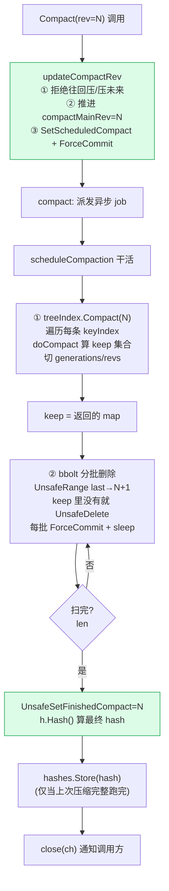

# 第十三章 · compaction:压缩历史

> 篇:P3 存储 mvcc:多版本的世界
> 主线呼应:前三章(P3-10 revision、P3-11 kvstore、P3-12 watch)我们看到,etcd 把每一次修改都留成一个版本,revision 全局单调递增,watch 用 revision 当游标从任意点订阅后续变更。**问题是:历史不能无限长。** 一个跑了三年的集群,revision 可能已经到几亿,bbolt 里的 Key bucket 塞满了每个 key 的每一个历史版本,内存里的 treeIndex 里每条 keyIndex 都拖着长长的 revision 链。重启时要把 bbolt 全量扫一遍重建 treeIndex,几亿条数据能卡几十分钟;watcher 要从某个老 revision 补历史,扫描代价也越来越高。**必须有人定期来"裁历史":把某个 revision 之前的旧版本删掉、把 keyIndex 的版本链收短——这一章讲的就是这个裁缝,compaction。** 但裁历史有风险:裁狠了,watcher 还想从被裁掉的 revision 补数据,直接断流;裁错了,正在进行的快照读读到一半状态。所以 compaction 的核心不是"怎么删",而是"**凭什么删了还安全**"。顺带,etcd 还用一次 compaction 的副产品——对所有存活版本算一个 hash——做跨副本的数据一致性校验,这是它发现静默数据损坏(磁盘 bit rot、bbolt 页损坏)的唯一手段。

## 核心问题

**历史不能无限长(revision 一直涨、bbolt 越来越大、重启重放慢)。compaction 怎么删掉某 revision 之前的旧版本、收缩 keyIndex?凭什么安全——压掉的边界不能让 watcher 断流、不能让正在进行的快照读失败?另外,定期 hash 校验数据一致性怎么做的、凭什么能发现静默损坏?**

读完本章你会明白:

1. compaction 压到 `compactMainRev` 这条边界:**每个 key 的每一段 generation 里,保留 `≤ compactMainRev` 的最大那个 revision**(供历史读 `--rev=compactMainRev`),其余更老的删掉;整段 generation 都老于边界就整段移除;全空了的 keyIndex 从 treeIndex 摘掉。
2. **凭什么压了还安全**:etcd 不是"猜 watcher 还需要哪个 revision"——而是**压完之后主动通知"minRev 落到 compactMainRev 之前的 watcher"重建**(`chooseAll` 发 `CompactRevision` 响应),客户端拿到后自己重新 watch;快照读如果请求的 revision < compactMainRev,直接报 `ErrCompacted` 让客户端重试当前值。**安全不是靠"不压",是靠"压完明确告诉所有受影响的人"**。
3. **hash 一致性校验**:每次 compaction 收尾时,对所有存活 revision(包括 keep 集合保留的那些)算一个 CRC32-Castagnoli,连 compactRevision 一起存下来;etcdserver 的 corruptionChecker 定期拉自己的 hash 和所有 peer 的 hash,**同 revision、同 compactRevision 下 hash 不同 → 数据损坏**。
4. compaction 是**分批 + 异步**的:默认每批删 1000 条(`CompactionBatchLimit`),批之间 `ForceCommit` 落盘并 `sleep 10ms`,把"一次大压缩"摊成"很多次小删除",避免长时间锁住 backend、卡读写。这是它能在生产环境在线跑而不抖动的工程手段。

> **如果一读觉得太难**:先只记住三件事——① compaction 压到一条 `compactMainRev` 边界,每个 key 在每段 generation 里只留 `≤ 边界` 的最新版本,其余老版本从 bbolt 删掉、keyIndex 收缩;② 压完之后,任何 minRev 落到边界之前的 watcher 会收到一个带 `CompactRevision` 的响应并被取消,客户端要自己重新 watch——这是 etcd"压了还安全"的核心机制(不是猜 watcher 需要什么,是主动通知);③ 每次 compaction 顺手算一个 hash,定期跨副本对比能发现静默数据损坏。

---

## 13.1 一句话点破

> **compaction 把"压到哪条 revision"这条边界(`compactMainRev`)向前推进一次:对每个 key 的每段 generation,只留 `≤ compactMainRev` 的最大那个 revision(供历史读),其余老版本连同对应的 bbolt value 一起删掉,keyIndex 的版本链收短。但真正让它"压了还安全"的不是删法,而是删完之后:任何 minRev 落到边界之前的 watcher 会收到一个 `CompactRevision` 响应被明确取消、快照读越界会拿到 `ErrCompacted`——etcd 不去猜谁还要历史,而是把"边界已经推进"这个事实大声广播给所有相关方。顺带,它对删剩的存活版本算一个 hash 存下来,供跨副本比对发现静默损坏。**

这是结论,不是理由。本章倒过来拆:先看为什么历史必须裁、不裁会怎样;再看 compaction 在 keyIndex 层怎么切版本链(用到上一章你已会的 generation/revision);然后看真正的命门——**安全边界**凭什么守得住;最后看 hash 校验和分批异步的工程手段。

---

## 13.2 为什么历史必须裁:不裁会怎样

假设 etcd 永不压缩。一个生产集群跑了三年,每天写 100 万次,revision 已经到 10 亿。后果:

**第一,bbolt 越来越大。** 每次 `Put` 都往 Key bucket 顺序追加一条 revision→value,旧版本永远不删。10 亿次写,哪怕每次 value 只有 100 字节,Key bucket 也膨胀到 100GB。而真正有用的只有"每个 key 的当前值 + 最近一小段历史"——99% 的磁盘空间被"再也不会有人读"的远古版本占着。更糟的是 bbolt 的 `Size()`(文件大小)只涨不缩,即使逻辑上删了 value,空闲页也只进 freelist 等 P4-16 详讲的回收,文件本身不会自动缩小。

**第二,重启重放慢得离谱。** etcd 启动要 `restore()`:把 bbolt 里 Key bucket 全量扫一遍、重建内存里的 treeIndex([kvstore.go:317-409](../etcd/server/storage/mvcc/kvstore.go#L317-L409))。10 亿条 revision,哪怕每条只花 1 微秒,重建就要 1000 秒——集群起不来,Kubernetes 控制平面瘫痪。

**第三,watch 补历史越来越贵。** P3-12 讲过,unsynced watcher 要从它的 `minRev` 扫到 `currentRev`。revision 越大、跨度越长,扫的范围越大。一个断线重连的客户端想补 10 分钟前的变更,可能要扫几百万条 revision。

> **不这样会怎样**:永不压缩 → 磁盘吃满、重启几分钟到几十分钟起不来、watch 补历史拖垮 backend。这三件事任何一件都足以让 etcd 退出生产环境。**compaction 不是"可选优化",是 etcd 长期运行的前提**。

> **所以这样设计**:etcd 提供 `Compact(rev)` 接口,把 `compactMainRev` 这条边界**向前推进**到 `rev`:边界之前的旧版本(除了每个 key 每段 generation 里必须留的那个)可以删掉。谁来调?两种来源——① 客户端主动 `etcdctl compact 1234` 或 gRPC `Compaction` RPC;② **auto-compaction**,配置 `--auto-compaction-retention=1h`(按时间,压到 1 小时前的 revision)或 `--auto-compaction-retention=1000`(按 revision 数,保留最近 1000 个),etcdserver 定期触发。本章不展开 auto-compaction 的调度策略(那是 etcdserver 层的事),只讲**一次 `Compact(rev)` 进来之后,mvcc 怎么安全地把它执行掉**。

---

## 13.3 Compact 的入口:推进一条边界 `compactMainRev`

客户端调 `Compact(rev)` 之后,gRPC 走到 etcdserver,最终调到 `store.Compact`([kvstore.go:272-284](../etcd/server/storage/mvcc/kvstore.go#L272-L284)):

```go
func (s *store) Compact(trace *traceutil.Trace, rev int64) (<-chan struct{}, error) {
    s.mu.Lock()
    prevCompactionCompleted := s.checkPrevCompactionCompleted()      // 上一次压缩是否跑完了
    ch, prevCompactRev, err := s.updateCompactRev(rev)               // ① 推进 compactMainRev
    trace.Step("check and update compact revision")
    if err != nil {
        s.mu.Unlock()
        return ch, err
    }
    s.mu.Unlock()

    return s.compact(trace, rev, prevCompactRev, prevCompactionCompleted), nil  // ② 异步干活
}
```

这里有两步,要分开看,因为它们一起构成了**安全边界**的第一道闸门。

### 第一步:`updateCompactRev`——先持久化"我要压到这里",再开干

打开 `updateCompactRev`([kvstore.go:197-222](../etcd/server/storage/mvcc/kvstore.go#L197-L222)):

```go
func (s *store) updateCompactRev(rev int64) (<-chan struct{}, int64, error) {
    s.revMu.Lock()
    if rev <= s.compactMainRev {                       // ← ① 拒绝"往回压"或"重复压"
        ch := make(chan struct{})
        f := schedule.NewJob("kvstore_updateCompactRev_compactBarrier", func(ctx context.Context) { s.compactBarrier(ctx, ch) })
        s.fifoSched.Schedule(f)
        s.revMu.Unlock()
        return ch, 0, ErrCompacted                     // 返回 ErrCompacted, 但 ch 会被 barrier 关掉
    }
    if rev > s.currentRev {                            // ← ② 拒绝"压到未来"
        s.revMu.Unlock()
        return nil, 0, ErrFutureRev
    }
    compactMainRev := s.compactMainRev
    s.compactMainRev = rev                             // ③ 内存里推进边界

    SetScheduledCompact(s.b.BatchTx(), rev)            // ④ 写进 bbolt meta: scheduledCompact = rev
    // ensure that desired compaction is persisted
    s.b.ForceCommit()                                  // ⑤ 强制落盘

    s.revMu.Unlock()

    return nil, compactMainRev, nil                    // 返回"上一次的 compactMainRev"给下一步用
}
```

这几步每一处都是安全设计:

- **① 拒绝往回压/重复压**:`rev <= s.compactMainRev` 直接返回 `ErrCompacted`。为什么不能往回压?因为一旦边界推进到 N,bbolt 里 `≤ N` 的旧版本(除保留的那一个)已经被删了,你不可能再"压回 N-1"——那些版本物理上不存在了。往回压是逻辑错误。注意这里**返回了一个 `ErrCompacted` 但同时 schedule 了一个 `compactBarrier` 去关掉 `ch`**——这是因为 `Compact` 的调用方(etcdserver)约定"无论成功失败都等 `ch` 关闭",所以即使拒绝也要把 `ch` 关掉,否则调用方永远阻塞。
- **② 拒绝压到未来**:`rev > s.currentRev` 返回 `ErrFutureRev`。你要压到 revision 1000,但当前才到 900——那些 revision 还不存在,压什么?同样是逻辑错误。
- **③ 先在内存推进 `compactMainRev`**:这一步之后,任何新的快照读(请求 revision < 新 compactMainRev)立刻会拿到 `ErrCompacted`(下面 13.4 讲),不用等真正的删除跑完。**边界先生效,删除异步进行**——这是关键解耦。
- **④ ⑤ 先持久化 `scheduledCompact`,再 `ForceCommit` 落盘**:为什么这么急着落盘?因为真正的删除(`scheduleCompaction`)是异步、可能被打断的(进程崩了、机器挂了)。如果崩在"内存边界已推进,但 meta 没落盘"之间,重启后 `restore()` 读到的 `compactMainRev` 还是老值,会把已经删掉的旧版本当成还活着——破坏一致性。所以 etcd 的策略是:**先把"我要压到 N"这件事持久化**,然后才开删;重启时 `restore()` 读 `scheduledCompact` 和 `finishedCompact`([kvstore.go:330-342](../etcd/server/storage/mvcc/kvstore.go#L330-L342)),如果 scheduled > finished,说明上次没删完,会把 `compactMainRev` 调到 `scheduledCompact`([kvstore.go:383-385](../etcd/server/storage/mvcc/kvstore.go#L383-L385)),重新跑一遍压缩——保证"边界推进了就一定删干净"。

> **钉死这件事**:compaction 的"安全"从 `updateCompactRev` 这一秒就开始了——**边界 `compactMainRev` 先持久化、先在内存生效,真正的删除异步在后面跑**。这意味着:`Compact(rev)` 返回成功之后,哪怕删除还没跑完,任何请求 `rev` 之前的 revision 的读/watch,立刻就会被拒绝(报 `ErrCompacted`)。**etcd 宁可让客户端立刻看到"已被压缩",也不让删除的异步性造成"读到本应已删的数据"**。

### 第二步:`compact`——异步把删除派发出去

`store.compact`([kvstore.go:234-260](../etcd/server/storage/mvcc/kvstore.go#L234-L260))把真正干活的 `scheduleCompaction` 包成一个 job,扔进 `fifoSched` 异步执行:

```go
func (s *store) compact(trace *traceutil.Trace, rev, prevCompactRev int64, prevCompactionCompleted bool) <-chan struct{} {
    ch := make(chan struct{})
    j := schedule.NewJob("kvstore_compact", func(ctx context.Context) {
        if ctx.Err() != nil {
            s.compactBarrier(ctx, ch)                  // 被取消(比如 restore):关 ch,不跑
            return
        }
        hash, err := s.scheduleCompaction(rev, prevCompactRev)   // ← 真正的删除 + 算 hash
        if err != nil {
            s.lg.Warn("Failed compaction", zap.Error(err))
            s.compactBarrier(context.TODO(), ch)
            return
        }
        // 只有上一次压缩完整跑完了, 这次算的 hash 才存(否则 hash 不全, 会误报损坏)
        if prevCompactionCompleted {
            s.hashes.Store(hash)
        } else {
            s.lg.Info("previous compaction was interrupted, skip storing compaction hash value")
        }
        close(ch)                                      // 通知调用方:这次压缩完成了
    })

    s.fifoSched.Schedule(j)
    trace.Step("schedule compaction")
    return ch
}
```

注意 `prevCompactionCompleted` 这条防御:**只有上一次压缩完整跑完了,这次算的 hash 才存进 `hashes` 缓存**。为什么?因为 hash 是"从上次 compactRevision 到这次 compactRevision 之间所有存活 revision 的指纹"。如果上一次压缩被打断(进程崩了重启),那次该删的没删完、该留的 keep 集合不准,这次算的 hash 会和"上一次完整跑完"的 peer 对不上——会误报损坏。所以 etcd 选择"被打断过就不存 hash",宁可少一个校验点,也不存一个会引发误报的值。这是分布式系统里"宁可漏报不可误报"的典型取舍(漏报只是少一次校验,误报会让运维误以为集群坏了)。这条逻辑的来源是 etcd issue #15919,源码注释里写得很清楚。

`Compact` 返回的 `ch` 会在压缩真正完成后被 `close`——调用方(etcdserver)据此知道"这次压缩彻底落地了",才给客户端返回成功。

---

## 13.4 在 keyIndex 层切版本链:`doCompact` 和 `compact`

边界推进完,异步任务 `scheduleCompaction` 开干。它分两阶段:**先压内存里的 treeIndex(收短 keyIndex 的版本链),再压磁盘上的 bbolt(删旧 value)**。两阶段共享同一个 `keep` 集合——"哪些 revision 要保留"——这是两层对齐的契约。

### treeIndex.Compact:遍历每条 keyIndex

入口 `treeIndex.Compact`([index.go:205-227](../etcd/server/storage/mvcc/index.go#L205-L227)):

```go
func (ti *treeIndex) Compact(rev int64) map[Revision]struct{} {
    available := make(map[Revision]struct{})
    ti.lg.Info("compact tree index", zap.Int64("revision", rev))
    ti.Lock()
    clone := ti.tree.Clone()                           // ← 克隆 B-tree, 遍历用克隆(不阻塞读写太久)
    ti.Unlock()

    clone.Ascend(func(keyi *keyIndex) bool {
        // Lock is needed here to prevent modification to the keyIndex while
        // compaction is going on or revision added to empty before deletion
        ti.Lock()                                      // ← 每条 keyIndex 单独加锁, 压完即释
        keyi.compact(ti.lg, rev, available)            // ← 压缩这一条
        if keyi.isEmpty() {
            _, ok := ti.tree.Delete(keyi)              // 全空了从真树摘掉
            if !ok {
                ti.lg.Panic("failed to delete during compaction")
            }
        }
        ti.Unlock()
        return true
    })
    return available                                   // keep 集合, 传给下一阶段
}
```

两个不显然的工程技巧:

1. **`ti.tree.Clone()` 再遍历**:`Clone()` 是 google/btree 的方法,做一个 B-tree 的浅拷贝(只拷贝节点指针,不拷 keyIndex 本身)。遍历用克隆、操作用原树,是为了**让遍历过程不被并发的 Put/Tombstone 干扰**(克隆是个稳定快照),同时真实删除走原树。Clone 的代价远低于全量复制。
2. **每条 keyIndex 单独加 `ti.Lock()`、压完立刻释**:为什么不一上来锁住整棵树压完再释?因为 treeIndex 是读写热点(`get`/`range` 拿读锁、`put`/`tombstone` 拿写锁),如果压缩几百万个 key 全程持写锁,所有读写全部阻塞——集群卡死。所以 etcd 选择**"压一条锁一条"**:每条 keyIndex 压缩时短暂持写锁(只够改这一条的 generation 切片),压完立刻释,让读写有机会插进来。代价是压缩整体慢一点,但不会卡住业务。这是"在线压缩"能跑得起来的关键。

### keyIndex.compact:切掉每段 generation 的前部

每条 keyIndex 的压缩在 `keyIndex.compact`([key_index.go:215-235](../etcd/server/storage/mvcc/key_index.go#L215-L235)):

```go
// compact compacts a keyIndex by removing the versions with smaller or equal
// revision than the given atRev except the largest one.
// If a generation becomes empty during compaction, it will be removed.
func (ki *keyIndex) compact(lg *zap.Logger, atRev int64, available map[Revision]struct{}) {
    if ki.isEmpty() {
        lg.Panic("'compact' got an unexpected empty keyIndex", zap.String("key", string(ki.key)))
    }

    genIdx, revIndex := ki.doCompact(atRev, available)   // ← 算出"保留到哪一代、代内保留哪个版本"

    g := &ki.generations[genIdx]
    if !g.isEmpty() {
        // remove the previous contents.
        if revIndex != -1 {
            g.revs = g.revs[revIndex:]                   // ← 切掉代内前部, 只留 [revIndex:]
        }
    }

    // remove the previous generations.
    ki.generations = ki.generations[genIdx:]             // ← 切掉更老的整代
}
```

核心在 `doCompact`([key_index.go:258-282](../etcd/server/storage/mvcc/key_index.go#L258-L282)):

```go
func (ki *keyIndex) doCompact(atRev int64, available map[Revision]struct{}) (genIdx int, revIndex int) {
    // walk until reaching the first revision smaller or equal to "atRev",
    // and add the revision to the available map
    f := func(rev Revision) bool {
        if rev.Main <= atRev {                           // ← 找到第一个 ≤ atRev 的版本, 加入 keep
            available[rev] = struct{}{}
            return false                                 // 停下
        }
        return true
    }

    genIdx, g := 0, &ki.generations[0]
    // find first generation includes atRev or created after atRev
    for genIdx < len(ki.generations)-1 {
        if tomb := g.revs[len(g.revs)-1].Main; tomb >= atRev {   // 这一代的 tombstone ≥ atRev → atRev 落在这一代
            break
        }
        genIdx++                                         // 否则跳到下一代
        g = &ki.generations[genIdx]
    }

    revIndex = g.walk(f)                                 // 在选中的代里 walk 找保留点
    return genIdx, revIndex
}
```

这套逻辑不显然,要结合 generation 的结构(上一章 P3-10 讲过)来读:

- **`generations[0]` 是最老的代**。`doCompact` 从老往新走,找到**第一个"tombstone ≥ atRev"的代**——也就是 `atRev` 落在它生命期内、或者它是 atRev 之后才出生的代。在这个代之前(`genIdx` 之前)的所有更老的代,**整段都要删掉**(它们的生命期完全在 atRev 之前,留着没用)。`compact` 里那句 `ki.generations = ki.generations[genIdx:]` 干的就是这件事。
- **在选中的代里**,`walk(f)` 从最新版本往最老走,找到**第一个 `Main ≤ atRev` 的版本**——也就是"在这个边界时刻或之前,这个 key 最后一次被改成什么样"。这个版本**必须保留**(它是 `get(foo, atRev=compactMainRev)` 的答案)。`compact` 里 `g.revs = g.revs[revIndex:]` 把这个版本之前的全切掉,只留它和它之后的。
- **`available[rev] = struct{}{}`**:把保留的这个 revision 写进 `keep` 集合(就是函数返回的那个 map),传给后面的 bbolt 删除阶段——告诉磁盘"这个 revision 别删,其它 ≤ compactMainRev 的全删"。

> **钉死这件事**:**compaction 不是"把 ≤ atRev 的全删掉",而是"每个 key 的每段 generation 里,只留 ≤ atRev 的那一个最大版本,其余更老的全删"**。为什么留一个?因为 compact 完之后,客户端可能还要 `get foo --rev=compactMainRev`(读"压缩边界那一刻这个 key 的值")——如果你把这条也删了,这个读就失败了。所以边界那条本身必须留。这一条保留的 revision 进 `keep` 集合,是"内存索引"和"磁盘 value"两层对齐的契约:磁盘删 value 时,凡是在 `keep` 里的 revision 一律不删。

用一个具体例子(沿用 P3-10 那个 `foo` 的 keyIndex)看压缩前后:

```
压缩前(keyIndex for "foo", 经历 put(1); put(2); tombstone(3); put(4); tombstone(5)):
                  keyIndex(key = "foo", modified = {5,0})
   ┌──────────────────────────────────────────────────────────────────┐
   │  generations[2]   generations[1]          generations[0]          │
   │  ┌──────────┐    ┌──────────────┐        ┌──────────────────┐    │
   │  │ (empty)  │    │ created=4.0  │        │ created=1.0      │    │
   │  │          │    │ revs=[4.0,   │        │ revs=[1.0, 2.0,  │    │
   │  │          │    │       5.0(t)]│        │       3.0(t)]    │    │
   │  └──────────┘    └──────────────┘        └──────────────────┘    │
   └──────────────────────────────────────────────────────────────────┘

compact(atRev=2):
   - doCompact: 从 generations[0] 走, tomb=3 ≥ 2 → 选中第 0 代
   - 第 0 代 walk: 从 3.0(t)→2.0→1.0 往回走, 第一个 Main≤2 的是 2.0
   - available += {2.0}; revIndex 指向 2.0
   - compact: g.revs = g.revs[revIndex:] = [2.0, 3.0(t)]   ← 1.0 被切掉
              generations 不变(还是从第 0 代起)
   - bbolt: 删 rev=1.0 的 value, 保留 rev=2.0(在 keep 里)

                  keyIndex(key = "foo", modified = {5,0})    压缩后
   ┌──────────────────────────────────────────────────────────────────┐
   │  generations[2]   generations[1]          generations[0]          │
   │  ┌──────────┐    ┌──────────────┐        ┌──────────────────┐    │
   │  │ (empty)  │    │ created=4.0  │        │ created=1.0      │    │
   │  │          │    │ revs=[4.0,   │        │ revs=[2.0, 3.0(t)]│   │
   │  │          │    │       5.0(t)]│        │  ↑ 1.0 已删       │    │
   │  └──────────┘    └──────────────┘        └──────────────────┘    │
   └──────────────────────────────────────────────────────────────────┘
   注: created 仍是 1.0(这条信息没丢, 它告诉读者"这代是 rev=1 时创建的")
       即使 rev=1.0 的 value 已从 bbolt 删掉, created 只是个 revision 号引用
```

这正好对应 `key_index.go` 文件头注释里 [key_index.go:49-55](../etcd/server/storage/mvcc/key_index.go#L49-L55) 那个经典示例。再极端一点,**compact(6)**(边界超过最后那次 tombstone 5)会怎样?注释里 [key_index.go:69-72](../etcd/server/storage/mvcc/key_index.go#L69-L72) 写的是 `{empty} -> key SHOULD be removed`——理想情况下,边界跨过这个 key 的全部生命期(连最后那个 tombstone 5.0 都 ≤ 6),整个 keyIndex 没有任何版本需要保留给历史读,`doCompact` + `compact` 之后 generations 收敛成只剩一个空代,`keyIndex.isEmpty()` 返回 true,`treeIndex.Compact` 里 `ti.tree.Delete(keyi)` 把它从 B-tree 摘掉。**注释用 "SHOULD be removed" 而非 "WILL be removed",是因为实际实现里 tombstone 的去留还要照顾 hash 跨版本兼容**——下一节会看到,新版本 etcd 的 compaction 不会立刻删掉"边界处的 tombstone",而是留到下一次压缩跨过它,这样新老版本算出的 hash 才一致。所以真实跑出来 compact(6) 之后 keyIndex 可能还挂着 `{5.0(t)}`(等下一轮再清),但语义上"这个 key 在边界时刻已不存在"是确定的。

---

## 13.5 bbolt 删除阶段:分批 + keep 集合对齐

treeIndex 压完、`keep` 集合拿到之后,`scheduleCompaction` 进入第二阶段——删 bbolt 里的旧 value([kvstore_compaction.go:28-100](../etcd/server/storage/mvcc/kvstore_compaction.go#L28-L100)):

```go
func (s *store) scheduleCompaction(compactMainRev, prevCompactRev int64) (KeyValueHash, error) {
    totalStart := time.Now()
    keep := s.kvindex.Compact(compactMainRev)          // ← 第一阶段: 压 treeIndex, 拿 keep

    // ... 计时 ...
    end := make([]byte, 8)
    binary.BigEndian.PutUint64(end, uint64(compactMainRev+1))   // 扫描上界 = compactMainRev+1

    batchNum := s.cfg.CompactionBatchLimit               // 默认 1000
    h := newKVHasher(prevCompactRev, compactMainRev, keep)  // ← 顺手建一个 hasher, 边删边算 hash
    last := make([]byte, 8+1+8)                          // 扫描游标, 从 0 开始
    for {
        var rev Revision
        start := time.Now()

        tx := s.b.BatchTx()
        tx.LockOutsideApply()
        keys, values := tx.UnsafeRange(schema.Key, last, end, int64(batchNum))   // 扫一批(≤ batchNum 条)
        for i := range keys {
            rev = BytesToRev(keys[i])
            if _, ok := keep[rev]; !ok {                // ← keep 集合里没有 → 删
                tx.UnsafeDelete(schema.Key, keys[i])
            }
            h.WriteKeyValue(keys[i], values[i])         // ← 无论删不删, 都喂给 hasher
        }

        if len(keys) < batchNum {                        // 这批不满 → 扫到头了
            UnsafeSetFinishedCompact(tx, compactMainRev) // ← 写 finishedCompact = compactMainRev
            tx.Unlock()
            hash := h.Hash()                             // ← 最终 hash
            // ... 日志 ...
            return hash, nil
        }

        tx.Unlock()
        last = RevToBytes(Revision{Main: rev.Main, Sub: rev.Sub + 1}, last)   // 游标前进
        s.b.ForceCommit()                                // ← 每批强制落盘
        // ... sleep CompactionSleepInterval(默认 10ms)或收到 stopc ...
    }
}
```

几个关键点:

- **扫描范围 `[0, compactMainRev+1)`**:用大端编码的 revision 当 bbolt key(上一章讲过,字节字典序 = 数值序),`UnsafeRange` 从 `last`(游标)扫到 `end`(compactMainRev+1),正好覆盖所有"可能要删"的旧版本(≤ compactMainRev 的)。比 compactMainRev 新的 revision 根本不在扫描范围里——它们当然不能删。
- **`keep` 集合是两层的契约**:treeIndex 阶段算出"哪些 revision 要保留",存进 `keep`;bbolt 阶段每扫到一条就查 `if _, ok := keep[rev]; !ok`——keep 里有就跳过,没有就 `UnsafeDelete`。**内存索引和磁盘 value 通过这个共享的 map 对齐**:内存里被切掉的 revision(没进 keep),磁盘上也删掉;内存里保留的那一个(进了 keep),磁盘上也留。两边绝不能错位,否则会出现"内存说有、磁盘没有"或反过来的脏数据。
- **分批**:每批最多 `CompactionBatchLimit`(默认 1000)条。批之间 `ForceCommit()` 把删除落盘,然后 `sleep CompactionSleepInterval`(默认 10ms)。**为什么分批 + sleep**?因为一次删几百万条 value 是个长事务,会让 bbolt 的写事务长时间持有锁,阻塞所有读写(`BatchTx().LockOutsideApply()` 期间,backend 的读写都得等)。分批把"一个 10 秒的大锁"拆成"1000 个 10 毫秒的小锁",中间 sleep 让业务读写有机会插进来。这是 etcd 能"在线压缩"而不卡集群的工程命门。
- **`UnsafeSetFinishedCompact`**:扫完最后一批(不满 batchNum 说明扫到头了),写一条 `finishedCompact = compactMainRev` 进 meta bucket。重启时 `restore()` 读这条([kvstore.go:330-341](../etcd/server/storage/mvcc/kvstore.go#L330-L341)),如果 `finishedCompact == scheduledCompact`,说明上次压缩干净跑完了;否则说明没跑完,要处理(见下面 `checkPrevCompactionCompleted`)。
- **边删边算 hash**:注意 `h.WriteKeyValue(keys[i], values[i])` 这一行——**每扫一条,无论删不删,都喂给 hasher**。所以最终的 hash 涵盖了"这次压缩扫到的所有 revision(从上次 compactRevision+1 到这次 compactMainRev)"的 key 和 value 字节。这个 hash 就是下一节一致性校验的输入。



---

## 13.6 安全边界:压了还凭什么不乱

到这里,压缩的机制讲完了。但本章真正的命门是:**这么删,凭什么不破坏 watch、不破坏正在进行的读?** 这才是 compaction 设计上最难、最容易翻车的地方。etcd 的答案不是"猜谁还需要历史然后小心避开",而是**"边界先持久化生效,删完之后明确通知所有受影响的人"**。下面分三条边界讲。

### 边界一:watcher 的 minRev 落到边界之前——主动通知重建

P3-12 讲过,每个 watcher 有个 `minRev`(它下一条要收的事件的 revision)。如果 `minRev < compactMainRev`,意味着这个 watcher 想从"已经被删掉的 revision"开始补——那些 value 物理上不存在了,补不了。etcd 怎么办?

打开 `watcherGroup.chooseAll`([watcher_group.go:241-270](../etcd/server/storage/mvcc/watcher_group.go#L241-L270))——这是 `syncWatchers` 每次跑时挑选 unsynced watcher 的核心:

```go
func (wg *watcherGroup) chooseAll(curRev, compactRev int64) int64 {
    minRev := int64(math.MaxInt64)
    for w := range wg.watchers {
        if w.minRev > curRev {
            // ... (异常处理: future revision watcher)
        }
        if w.minRev < compactRev {                      // ← 关键: watcher 落到压缩边界之前
            select {
            case w.ch <- WatchResponse{WatchID: w.id, CompactRevision: compactRev}:
                w.compacted = true                      // ← 标记"因压缩被取消"
                wg.delete(w)                            // ← 从 unsynced 摘掉
            default:
                // retry next time                       // watcher 的 channel 满了, 下次再试
            }
            continue
        }
        if minRev > w.minRev {
            minRev = w.minRev
        }
    }
    return minRev
}
```

这是 etcd 处理"watcher 被压缩越过"的标准动作:**给 watcher 的 channel 发一条 `WatchResponse{CompactRevision: compactRev}`,然后把这个 watcher 从 unsynced 组里删掉、标记 `compacted=true`**。客户端收到这条响应(里面带着 `CompactRevision`),知道"我想从那个 revision 开始补,但它已经被压缩了",于是**主动重新发起一次 watch**(从当前 revision 或更晚的 revision 开始)。

> **不这样会怎样**:朴素做法是"压缩时去查所有 watcher 的 minRev,如果有落进来的,就阻塞压缩等它们追上"。问题:
> - **阻塞压缩 = 集群永远压不动**。一个慢客户端、一个网络抖动的 watcher,会让整个集群的 bbolt 无限膨胀。
> - **或者"压缩时拒绝推进边界"**:同样,一个 watcher 卡住,全员陪着不能压缩。
> - **或者"假装没事,让 watcher 自己发现读不到"**:watcher 下次去 backend 扫历史事件时,扫到被删的 revision 拿到空,要么静默丢失事件、要么报一个模糊的错——客户端根本不知道发生了什么。
>
> etcd 选了**唯一干净的方案**:**压缩照常推进(不被任何 watcher 阻塞),但推进之后,主动通知所有 minRev 落进来的 watcher"你要的起点没了,这是新的 compactRevision,你自己决定怎么办"**。这是"边界广播"而非"边界协商"——压缩是集群全局的事,不能被单个 watcher 绑架;但受影响的人必须被告知。客户端拿到 `CompactRevision` 后,通常的策略是重新 watch(从当前 revision 起),或上报错误让上层处理。

注意 `default:` 分支——如果 watcher 的 channel 满了(客户端消费慢),这次先不发(`continue` 但没 delete),下次 `syncWatchers` 再试。这是"尽力通知,不丢不赖":不阻塞压缩,但也保证最终会通知到(只要客户端还在消费 channel)。

### 边界二:历史读请求的 revision 落到边界之前——直接报 `ErrCompacted`

客户端 `get foo --rev=50`,但 `compactMainRev` 已经是 100。50 < 100,这条 revision 的 value 早被删了。看 `hashByRev` 里的处理([kvstore.go:176-182](../etcd/server/storage/mvcc/kvstore.go#L176-L182),读路径的 range/get 同样走 `treeIndex.Get(atRev)`,内部 `findGeneration` 找不到会返回 `ErrRevisionNotFound`):

```go
if rev > 0 && rev < compactRev {
    s.mu.RUnlock()
    return KeyValueHash{}, 0, ErrCompacted       // ← 明确告诉客户端"这个 revision 已被压缩"
} else if rev > 0 && rev > currentRev {
    s.mu.RUnlock()
    return KeyValueHash{}, currentRev, ErrFutureRev
}
```

`ErrCompacted` 是个**明确的错误码**,客户端拿到它知道"我要的版本没了,得改用当前值或报错",而不是收到一个模糊的"not found"或空数据。这种"明确报错胜过静默返回错数据"的原则,和 P3-10 里 `keyIndex.put` 检测到 revision 倒退就 `Panic` 是一脉相承的——**etcd 宁可让调用方立刻看到明确的错误,也不让问题以脏数据的形式偷偷扩散**。

### 边界三:正在进行的快照读——靠 `compactMainRev` 快照时刻锁定

更微妙的情况:一个事务 `TxnRead` 开始时拿了 `beginRev = currentRev = 1000`,读了一半,这时另一个 goroutine 触发 `Compact(900)`。这个事务接下来的读会不会读到"本应已删"的数据?

答案是不会,因为:

1. **`TxnRead` 在 `beginRev` 上读**:`treeIndex.Get(key, atRev=beginRev)` 用的是事务开始时的 revision,不读"现在最新的 compactMainRev"。compactMainRev 推进到 900,不影响这个事务在 beginRev=1000 上读——1000 > 900,这个 revision 不在压缩范围 `[0, 900]` 内,根本不会被删。
2. **`compactMainRev` 的推进和 `beginRev` 的锁定都受 `revMu` 保护**:写事务 `End()` 时持 `revMu` 推进 `currentRev`([kvstore_txn.go:209-221](../etcd/server/storage/mvcc/kvstore_txn.go#L209-L221),P3-10 引用过),`updateCompactRev` 也持 `revMu` 推进 `compactMainRev`。两个推进互斥,不会出现"compact 推进了但 currentRev 还没更新"的窗口。
3. **真正可能冲突的是:事务 beginRev=800,然后 compact(900)**。这种情况下事务要读 rev=800 的数据,而 compact(900) 要删 ≤ 900 的旧版本。怎么办?看 `updateCompactRev` 的顺序——它**先 `s.compactMainRev = rev` 在内存生效**,此时如果有个 `beginRev=800` 的读事务还没读完,它内部调 `treeIndex.Get(key, 800)` 时,treeIndex 还没被压(压是异步的 `scheduleCompaction`)。但 `compactMainRev` 已经是 900 了——这意味着这个事务的 `atRev=800 < compactMainRev=900`,逻辑上它请求的 revision 已被"声明压缩"。etcd 的处理是:**读事务在 `treeIndex.Get` 里走 `findGeneration(800)`,只要 treeIndex 里 800 这条还没被异步压缩切掉,就能读到**。异步压缩和这个读事务之间靠 treeIndex 的 `RLock`(读)和 compact 的 `Lock`(写)互斥——compact 切 keyIndex 时持写锁,读事务读 keyIndex 时持读锁,两者串行。所以**最坏情况是这个读事务要么在压缩切这条 keyIndex 之前读完(拿到旧值,正确),要么在之后读(此时 800 已被切掉,`findGeneration` 返回 nil,报 `ErrRevisionNotFound`)**。两种结果都是"明确的",不会读到半切的状态。

> **钉死这件事**:compaction 的三条安全边界,共同体现一条原则——**"边界先持久化、先在内存生效,删除异步在后面跑;边界推进这件事对所有相关方大声广播(watcher 收 CompactRevision 响应、历史读收 ErrCompacted、快照读靠 revMu + treeIndex 锁串行)"**。etcd 从不试图"猜谁还需要历史然后避开",因为那种猜测在并发下永远算不准。它选了更可靠的:**让边界立刻可见,让每个受影响的调用方自己决定怎么办**。这是分布式系统里"显式优于隐式"的典范。

---

## 13.7 hash 一致性校验:发现静默损坏

到这里 compaction 本身讲完了。但 `scheduleCompaction` 收尾时算的那个 hash,有一个独立的重要用途——**跨副本数据一致性校验**。这是 etcd 检测静默数据损坏(磁盘 bit rot、bbolt 页损坏、内存翻转)的唯一主动手段。

### 为什么需要:Raft 只防"协议层"的错,防不了"存储层"的静默损坏

回想全书的二分法:Raft(协议层)保证"多数派一致的 entry 被 apply"。但 apply 之后呢?entry 写进 bbolt,bbolt 落在磁盘上。**这一段不在 Raft 的保护范围内**:

- 磁盘可能 **bit rot**(某个比特悄悄翻转,硬件老化、 cosmic ray);
- bbolt 的某个页可能因为内核 panic / 断电写了一半而损坏;
- 内存里的数据可能因为 ECC 失效翻转;
- 不同副本的 bbolt 可能因为各自的历史故障,悄悄分叉。

这些都不是 Raft 能发现的——Raft 只保证"apply 这条 entry 时多数派同意",不保证"apply 之后磁盘上的字节一直对"。如果静默损坏发生,你会发现:**读某个 key 拿到错的值,但 Raft 一切正常,leader 还在,集群还活**。这种"暗伤"最可怕,因为没人察觉,直到错误的值被业务用到、被复制到别的副本,才爆出来——往往已经晚了。

> **所以这样设计**:etcd 在每次 compaction 收尾时,对**这次压缩扫过的所有存活 revision**(从上次 compactRevision+1 到这次 compactMainRev)的 key 和 value 字节,算一个 CRC32 hash,连 compactRevision 和 revision 一起存进 `hashes` 缓存。然后 etcdserver 的 corruptionChecker 定期拉**自己的 hash** 和**所有 peer 的 hash**——**同 revision、同 compactRevision 下 hash 不同 → 数据损坏**。

### 怎么算:kvHasher

打开 `hash.go`([hash.go:42-94](../etcd/server/storage/mvcc/hash.go#L42-L94)),hash 的核心是 `kvHasher`:

```go
func newKVHasher(compactRev, rev int64, keep map[Revision]struct{}) kvHasher {
    h := crc32.New(crc32.MakeTable(crc32.Castagnoli))  // ← CRC32-C (Castagnoli)
    h.Write(schema.Key.Name())                          // 把 bucket 名字先喂进去
    return kvHasher{
        hash:            h,
        compactRevision: compactRev,
        revision:        rev,
        keep:            keep,
    }
}

func (h *kvHasher) WriteKeyValue(k, v []byte) {
    kr := BytesToRev(k)
    upper := Revision{Main: h.revision + 1}
    if !upper.GreaterThan(kr) {                         // 超过 revision 的不喂(只算 ≤ rev 的)
        return
    }

    isTombstone := BytesToBucketKey(k).tombstone

    lower := Revision{Main: h.compactRevision + 1}
    // skip revisions that are scheduled for deletion due to compacting
    if lower.GreaterThan(kr) && len(h.keep) > 0 {
        if _, ok := h.keep[kr]; !ok {                   // ≤ compactRevision 且不在 keep 的不喂
            return
        }
    }

    // 压缩边界正好是个 tombstone 时, 跳过它(为了兼容老版本)
    if kr.Main == h.compactRevision && isTombstone {
        return
    }

    h.hash.Write(k)
    h.hash.Write(v)
}
```

几个设计要点:

1. **CRC32-Castagnoli(CRC32-C)**:不是随便选的。Castagnoli 多项式(`0x1EDC6F41`)是 CRC32 家族里**错误检测率最高**的一个,被 iSCSI、SATA、ext4 硬件指令(Intel 的 `crc32` 指令)广泛采用——既快(有硬件加速),又对突发错误敏感。对一个"要发现字节翻转"的场景,CRC32-C 是工程上的最优选。
2. **喂进 hash 的范围精确控制**:`WriteKeyValue` 通过三条过滤,精确决定"这条 revision 喂不喂":
   - `upper.GreaterThan(kr)`:只喂 `≤ rev` 的(超过指定 revision 的不算);
   - `lower.GreaterThan(kr) && !keep[kr]`:小于 compactRevision 且不在 keep 集合的,跳过(这些是要被删的旧版本,且不会被保留);
   - `kr.Main == h.compactRevision && isTombstone`:边界正好是 tombstone 时跳过——这条是为**兼容老版本 etcd**(≤3.5.15 / ≤3.4.33)的 hash 计算,老版本会把这种 tombstone 删掉、新版本不删,为了两边算出一样的 hash,新版本在算 hash 时也跳过它。注释里 [hash.go:78-86](../etcd/server/storage/mvcc/hash.go#L78-L86) 写得很清楚:"ensure that both older and newer versions can always generate the same hash values"。**这是跨版本兼容性压倒"逻辑纯粹"的一个真实取舍**——hash 必须跨版本稳定,否则升级集群时会误报损坏。
3. **把 bucket 名字先喂进去**(`h.Write(schema.Key.Name())`):防止不同 bucket 的数据恰好算出同一个 hash(只算 key/value 字节的话,理论上两个不同 bucket 的同字节内容会撞)。喂个 bucket 名当 salt,把碰撞概率再压低。

### 怎么比对:corruptionChecker

etcdserver 里的 `corruptionChecker`([corrupt.go](../etcd/server/etcdserver/corrupt.go))定期(默认 1 小时)和启动时(`InitialCheck`)拉自己的 `HashByRev(0)`(0 表示"当前 revision"),再通过 gRPC 向所有 peer 拉同一个 revision 的 hash,然后比对。核心逻辑([corrupt.go:97-126](../etcd/server/etcdserver/corrupt.go#L97-L126)):

```go
h, _, err := cm.hasher.HashByRev(0)                   // 自己的 hash
peers := cm.hasher.PeerHashByRev(h.Revision)          // 所有 peer 的 hash
mismatch := 0
for _, p := range peers {
    if p.resp != nil {
        if h.Hash != p.resp.Hash {
            if h.CompactRevision == p.resp.CompactRevision {   // ← 关键: 必须 compactRevision 相同
                cm.lg.Warn("found different hash values from remote peer", fields...)
                mismatch++
            } else {
                cm.lg.Warn("found different compact revision values from remote peer", fields...)
            }
        }
    }
    // ... 处理 peer 返回 ErrFutureRev / ErrCompacted 等 ...
}
if mismatch > 0 {
    return fmt.Errorf("%s found data inconsistency with peers", cm.hasher.MemberID())
}
```

最关键的一行是 `if h.CompactRevision == p.resp.CompactRevision`——**只有在 compactRevision 相同的前提下,hash 不同才算损坏**。为什么?因为 compactRevision 不同,意味着两个副本压缩进度不同,它们看到的"存活 revision 集合"本来就不一样,hash 不同是正常的(一个压得多、一个压得少)。只有 compactRevision 相同(两边压缩到同一个边界)、revision 也相同(读到同一个时刻),hash 才应该一样——这时如果不一样,就一定是**有一边的存储静默损坏了**。

`HashByRev` 内部([hash.go:139-154](../etcd/server/storage/mvcc/hash.go#L139-L154))还有一层缓存优化:如果请求的 `rev` 正好是最近某次 compaction 存进 `hashes` 的 revision,直接返回缓存的 hash,不重算。因为 compaction 时已经算过一次了(而且那次是在一个一致的状态上算的),复用即可。`hashes` 缓存最多存 10 条([hash.go:30](../etcd/server/storage/mvcc/hash.go#L30)`hashStorageMaxSize = 10`),按 revision 排序,新的挤掉最老的。

> **钉死这件事**:hash 校验是 etcd **唯一主动发现存储层静默损坏**的机制。Raft 保护协议层(达成一致),bbolt 的 COW + meta 双缓冲保护事务层(原子提交,P4-16 详讲),但**apply 之后磁盘上的字节一直对不对,Raft 和 bbolt 都不管**——bit rot、页损坏、副本分叉这些"暗伤",只有靠周期性地"算一遍 hash 互相比"才能发现。etcd 选 CRC32-C(快且敏感)、精确控制喂入范围(只喂存活 revision)、跨版本兼容(老版本怎么算新版本也算出一样的)、且只在 compactRevision 对齐时才比 hash(避免误报)——这套组合让它在生产环境里能可靠地发现"绝大多数"静默损坏。发现之后怎么办?etcd 会报警并拒绝继续 serve(corruptionChecker 返回 error,etcdserver 进入异常态),让运维介入(通常是摘掉坏副本、从好副本重新同步)。

> **反面对比**:**不校验会怎样?** 静默损坏在磁盘上慢慢积累,Raft 一切正常、集群一切正常,直到某天客户端读某个 key 拿到错值——而这个错值可能已经被 Raft 复制到别的副本、被业务用到、写进了下游系统。等你发现,数据已经污染了一大片,且无法回溯"什么时候开始坏的"。etcd 的 hash 校验把"发现损坏"的时间窗口从"无限大(永远发现不了)"压缩到"最多一个校验周期(默认 1 小时)",这是它作为"事实来源"系统的底线保障。

---

## 13.8 技巧精解:compaction 的安全边界 + hash 校验

本章有两个最硬核的技巧,单独拆透。

### 技巧一:安全边界——"边界广播"而非"边界协商"

compaction 最大的设计风险,是"删多了"。一个 watcher 还想从被删的 revision 补数据、一个事务还想读已被删的版本——任何一处删错,就是数据错乱。朴素的设计会怎么想?"压缩前去查所有 watcher 的 minRev、所有进行中的事务的 beginRev,把它们还要用的 revision 找出来,压缩时避开这些。"——这叫"边界协商"。

> **反面对比(朴素协商)**:
> - **协商代价高**:每次压缩要遍历所有 watcher、所有活跃事务,集群大了(Watch 是 etcd 的杀手锏,几万个 watcher 很常见)这一遍扫描本身就是负担。
> - **TOCTOU 竞态**:协商完"这些 revision 安全可删",刚要删,一个新的 watcher 注册了想要其中一个 revision——你删都删了。要避免就得加锁,锁住 watcher 注册和压缩,又回到"互相阻塞"。
> - **被慢客户端绑架**:一个 watcher 网络抖动、channel 堆积,minRev 卡在很老的值——协商机制下,整个集群的压缩都得等它。一个慢客户端拖垮全集群的压缩,bbolt 无限膨胀。

etcd 选了完全不同的路:**"边界广播"**——压缩照常推进(只受 `rev <= compactMainRev` 和 `rev > currentRev` 两条硬约束),推进之后:

- **内存里 `compactMainRev` 立刻生效**,任何新的越界请求立刻被拒(`ErrCompacted`)。
- **watcher 的 `chooseAll` 在下次 `syncWatchers` 跑时,发现 minRev 落进来的,主动发 `CompactRevision` 响应并删掉这个 watcher**([watcher_group.go:255-263](../etcd/server/storage/mvcc/watcher_group.go#L255-L263))。客户端拿到响应自己重新 watch。
- **真正的删除异步进行**,分批 + sleep,不阻塞业务。

> **钉死这件事**:**compaction 的安全不靠"猜谁还需要历史",靠"边界推进这件事对所有受影响方明确广播"**。watcher 收 CompactRevision 自己重建、历史读收 ErrCompacted 自己重试、快照读靠 revMu + treeIndex 锁串行保证不读到半切状态。**边界是全局事实,广播给所有人,每个人自己决定怎么办**——这比"协商出一个所有人都同意的边界"在并发下可靠得多,也快得多(压缩不被任何单个 watcher/事务阻塞)。

这条原则的深层逻辑是:**在分布式并发系统里,"显式通知"比"隐式协商"可靠**。协商依赖"协商时刻和执行时刻之间状态不变",而并发让这个假设永远不成立;广播只依赖"通知最终送达",而通知的送达可以用 channel 满了重试(`default:` 分支)、用客户端重新连接来保证。这是 etcd 处理"压缩 vs watcher 冲突"这条普遍分布式难题的精彩一笔。

### 技巧二:hash 校验——跨版本兼容 + compactRevision 对齐

hash 校验的硬核技巧有两层。

**第一层:为什么用 CRC32-C 而不是 SHA/MD5?** 因为这里的目标是**检测损坏(检测字节翻转),不是防篡改**。损坏是随机的比特翻转,CRC32-C 对这类错误的检测率在工程上已经足够(漏检概率 `2^-32`,且 Castagnoli 多项式对突发错误的检测优于其它 CRC32 变体),而它**比加密 hash 快一个数量级**(还有 Intel 硬件指令加速)。对一个"每小时对所有数据算一次 hash"的场景,速度差异意味着 CPU 占用的天壤之别。加密 hash 的"防篡改"特性在这里是**过度设计**——攻击者要篡改 etcd 数据,得先攻破 root 权限改 bbolt 文件,那时 hash 校验根本不是安全边界(攻击者改完数据也能重算 hash)。所以 etcd 务实地选了 CRC32-C:**恰好够用,且快**。

**第二层:跨版本兼容为什么压倒"逻辑纯粹"?** 看 `WriteKeyValue` 里 [hash.go:78-86](../etcd/server/storage/mvcc/hash.go#L78-L86) 那段——压缩边界正好是 tombstone 时,跳过它不喂进 hash。逻辑上,tombstone 也是一条 revision,为什么不算?因为**老版本 etcd(≤3.5.15)的 compaction 会把这种边界 tombstone 删掉,新版本不删**——如果新版本算 hash 时把它算进去,和老版本算出来的 hash 就不一样。而 hash 比对是**跨副本**的,一个滚动升级中的集群,可能既有老版本副本又有新版本副本,如果它们对同一个状态算出不同的 hash,corruptionChecker 会立刻误报"数据损坏"——运维吓一跳,实际什么都没坏。

etcd 选了"在新版本里也跳过这条 tombstone",让新旧版本算出一样的 hash。代价是 hash 的逻辑变复杂了一点(多一条特判),收益是**滚动升级期间 hash 校验持续可用**。这是"跨版本兼容"压倒"代码纯粹"的真实工程取舍,源码注释把这条理由写得明明白白。

> **反面对比(不兼容)**:每次 etcd 升级,新版本算的 hash 都和老版本不一样,corruptionChecker 在升级期间持续误报。运维要么关掉校验(那还要它干嘛),要么每次升级都停机全集群一起升(违背滚动升级的初衷)。etcd 选择了"hash 跨版本稳定"这条不变式,哪怕代码丑一点——因为**一个会误报的校验机制比没有更糟**(狼来了三次之后没人信)。

> **钉死这件事**:hash 校验的两个技巧——**CRC32-C(够快够敏感)+ 跨版本兼容(算一样的 hash)**——共同让它成为生产环境里**可靠且持续可用**的损坏检测机制。快,所以能频繁跑(默认每小时一次)不拖性能;跨版本兼容,所以滚动升级期间不会误报。这两条缺一不可,共同把"发现静默损坏的时间窗口"压缩到可接受的范围。

---

## 13.9 章末小结

这一章是第 3 篇(mvcc)的收尾章。我们讲清了 etcd 怎么"裁历史":**compaction 把 `compactMainRev` 这条边界向前推进一次,每个 key 的每段 generation 里只留 ≤ 边界的最大那个 revision(供历史读),其余旧版本连同 bbolt value 一起删掉,keyIndex 收缩、bbolt 释放空间**。但本章真正的命门不是"怎么删",而是"**凭什么删了还安全**"——etcd 用"边界广播"取代"边界协商":watcher 收 CompactRevision 自己重建、历史读收 ErrCompacted 自己重试、快照读靠 revMu + treeIndex 锁串行,压缩本身不被任何单个 watcher/事务阻塞。顺带,每次 compaction 算的 hash,经 corruptionChecker 跨副本比对,是 etcd 发现存储层静默损坏的唯一主动手段——CRC32-C 够快够敏感、跨版本兼容保证滚动升级时不误报。

回扣全书二分法:这一章属于**应用层**(状态机应用层:把共识结果落地成可查、可订阅的多版本状态,并维护这个状态的"可承受"——不无限膨胀)。Raft(协议层)只管"这条 Put 被多数派 commit 了",它根本不知道这个 Put 的历史版本会在某天被压缩掉、不知道压缩时要通知哪些 watcher、不知道算 hash 要跨副本比——这些都是 etcd 应用层(mvcc)的职责。**协议层管"达成一致",应用层管"一致之后怎么把状态维护好(存、查、订阅、压缩、校验)"**——本章是应用层"维护状态"那一面的收尾。

### 五个"为什么"清单

1. **历史为什么必须裁?** revision 一直涨,bbolt 无限膨胀(磁盘吃满)、重启重放越来越慢(几亿条 rebuild treeIndex 要几十分钟)、watch 补历史越来越贵。compaction 是 etcd 长期运行的前提,不是可选优化。

2. **压缩到 `compactMainRev` 这条边界,每个 key 保留什么?** 每段 generation 里**保留 ≤ compactMainRev 的最大那个 revision**(供 `get foo --rev=compactMainRev` 读),更老的全删;整段 generation 都老于边界就整段移除;keyIndex 全空了从 treeIndex 摘掉。保留的 revision 进 `keep` 集合,是内存索引和 bbolt 删除两层对齐的契约。

3. **压了 watcher/历史读凭什么不乱?** etcd 不"协商"边界(那会被慢 watcher 绑架),而是"广播"边界:`compactMainRev` 先持久化先在内存生效,watcher 的 `chooseAll` 发现 minRev 落进来的主动发 `CompactRevision` 响应并取消、历史读收到 `ErrCompacted`、快照读靠 `revMu` + treeIndex 锁串行不读到半切状态。**边界是全局事实,广播给所有受影响方,每个人自己决定怎么办**。

4. **compaction 怎么不卡集群?** 分批 + 异步:默认每批删 1000 条(`CompactionBatchLimit`),批之间 `ForceCommit` 落盘并 `sleep 10ms`,把"一个 10 秒的大锁"拆成"1000 个 10 毫秒的小锁";treeIndex 层每条 keyIndex 单独加锁压完即释。在线压缩能跑起来的工程命门就是这两层分批。

5. **hash 校验凭什么发现静默损坏?** 每次 compaction 收尾对扫过的存活 revision 算 CRC32-C,etcdserver 的 corruptionChecker 定期拉自己和所有 peer 的 hash,**同 revision + 同 compactRevision 下 hash 不同 → 损坏**。CRC32-C 够快(硬件加速)够敏感(Castagnoli 对突发错误检测率高)、跨版本兼容(老版本怎么算新版本也算一样,滚动升级不误报)。这是 Raft(管协议层)+ bbolt COW(管事务层)之外的"存储层"损坏检测,把"发现静默损坏"的时间窗口从无限压缩到一个校验周期。

### 想继续深入往哪钻

- **compaction 的真实代码**:读 [`etcd/server/storage/mvcc/kvstore_compaction.go`](../etcd/server/storage/mvcc/kvstore_compaction.go)(整个文件就一个 `scheduleCompaction` 函数,100 行,是 compaction 的全部主干)、[`etcd/server/storage/mvcc/key_index.go`](../etcd/server/storage/mvcc/key_index.go) 的 `compact`/`doCompact`/`keep`([第 215-282 行](../etcd/server/storage/mvcc/key_index.go#L215-L282))。`key_index.go` 文件头注释([第 27-72 行](../etcd/server/storage/mvcc/key_index.go#L27-L72))的压缩例子值得逐行读,把各种 compact(atRev) 场景都列了。
- **安全边界**:读 [`etcd/server/storage/mvcc/watcher_group.go`](../etcd/server/storage/mvcc/watcher_group.go) 的 `chooseAll`([第 241-270 行](../etcd/server/storage/mvcc/watcher_group.go#L241-L270))——看 etcd 怎么对"minRev 落进压缩边界"的 watcher 发 `CompactRevision` 响应并取消。这是"边界广播"的核心代码。
- **hash 校验**:读 [`etcd/server/storage/mvcc/hash.go`](../etcd/server/storage/mvcc/hash.go)(整个文件 180 行,是 hash 的全部)+ [`etcd/server/etcdserver/corrupt.go`](../etcd/server/etcdserver/corrupt.go) 的 `InitialCheck`/`PeriodicCheck`([第 88-200 行](../etcd/server/etcdserver/corrupt.go#L88-L200))——看跨副本 hash 比对怎么只在 compactRevision 对齐时才判损坏。
- **重启恢复怎么处理"没压缩完"**:读 [`etcd/server/storage/mvcc/kvstore.go`](../etcd/server/storage/mvcc/kvstore.go) 的 `restore()`([第 317-409 行](../etcd/server/storage/mvcc/kvstore.go#L317-L409)),看它怎么读 `scheduledCompact`/`finishedCompact` 判断上次压缩是否完整,以及 `currentRev < scheduledCompact` 时怎么修正。这条逻辑关联到第 5 篇(P5-19 启动恢复)。
- **etcd 的 corrupt handling 设计**:etcd 发现 hash 不匹配之后会进入 `corrupt` 状态、拒绝 serve,这部分逻辑在 `etcdserver/corrupt.go` 后半段和 server.go 的启动流程里,第 5 篇(恢复)会系统讲。

### 引出下一章

第 3 篇到此结束。我们立起了 etcd 应用层的"多版本世界":revision 全局单调(P3-10)、kvstore 把索引放内存值放 bbolt(P3-11)、watch 用 revision 当游标订阅(P3-12)、compaction 压缩历史并校验一致性(本章)。但有一个底层角色,这四章一直在用却始终没展开——**backend 和 bbolt**。每次 `UnsafeSeqPut` 写进去的 value 到底存在什么文件里?`BatchTx` 攒批提交是怎么做到的?COW 事务凭什么写时还能并发读?compaction 删掉的页进了哪里、文件会不会缩?下一章 **P4-14 backend:批事务**,我们从 mvcc 的下一层钻进去,看 backend 怎么把 bbolt 的裸事务包成"攒批 + 缓冲"的高吞吐接口。第 4 篇(bbolt 底座)就此开始。
