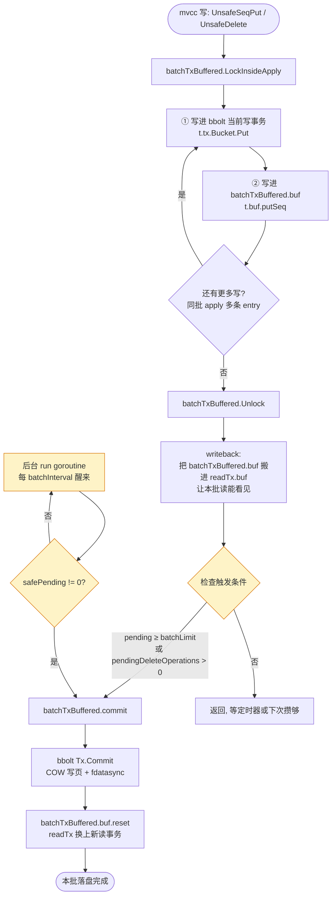

# 第十四篇 · backend:批事务

> 篇:P4 backend 与 bbolt · 存储底座
> 主线呼应:这一章是**应用层**的纵深。mvcc 把"一个 key 的多次修改"记成了 `revision → value` 的映射,`treeIndex` 在内存里按 key 排好序,而 `value` 要落到一个能持久化、能 range 扫、能崩溃恢复的真正存储里——这个存储是 bbolt。但 etcd 没有直接用 bbolt,中间套了一层 **backend**:它把 bbolt 的 `Tx` 包成 **batchTx(攒批提交)** 和 **readTx(只读)**,再用一个 **tx_buffer** 让"本批还没 commit 的写"也能被读看见。这一层是 etcd 写吞吐能起来的关键工程手段,也藏着一个保证线性一致的微妙技巧。

## 核心问题

**mvcc 的 value(revision → value)最终落在 bbolt。但 etcd 为什么不直接每次写都开一个 bbolt 事务,而要在中间套一层 backend,把 bbolt 的 Tx 包成 batchTx 攒批提交?readTx、tx_buffer 各干什么,tx_buffer 凭什么让"读"能看见"本批还没 commit 的写"?**

读完本章你会明白:

1. bbolt 的写事务(COW + `fdatasync`)为什么"重",backend 为什么靠"攒一批再 commit"能把这笔开销摊薄——这是 etcd 写吞吐的地基。
2. backend 的三件套:`batchTxBuffered`(攒写的批次)、`readTx`(只读)、`tx_buffer`(双缓冲),各自的职责与边界。
3. **触发一次 `commit` 的三个条件**(攒够 `batchLimit` / 到了 `batchInterval` / **本批有 delete**),尤其是第三个——为什么"delete 必须立即 commit",这是一个**曾经被踩破、后来才补上**的线性一致 bug。
4. `writeback` 和 `commit` 是**两件不同的事**:writeback 把写从 `batchTxBuffered.buf` 搬进 `readTx.buf`(让同批读看见),commit 才真正落 bbolt。混了就讲不清 tx_buffer。

> **如果一读觉得太难**:先只记住三件事——① bbolt 写事务很贵(COW + `fdatasync`),backend 攒一批摊薄它;② 写先进 buffer,读先查 buffer 再查 bbolt,所以同批里"刚 put 立刻 get"也能读到;③ delete 是特例,必须立即 commit,否则会破坏线性一致。这三个钉死了,再回头读细节。

---

## 14.1 一句话点破

> **backend 是 mvcc 和 bbolt 之间的"批事务适配层":它在写路径上把一组 mvcc 写攒成一个 bbolt 事务、一次 `Commit`,把 bbolt 每次写都要付出的 COW + `fdatasync` 代价摊薄到一批;又在读路径上用一个 `txReadBuffer` 缓冲"本批还没 commit 的写",让同一批里的"先 put 后 get"也能读到刚写的值——读不必等 commit,线性一致仍然成立。**

这是结论,不是理由。本章倒过来拆:先看 bbolt 一个写事务到底贵在哪(为什么要攒批),再看 backend 怎么攒、什么时候 commit、攒的写放在哪,然后看 tx_buffer 怎么让"未提交的写"被读看见,最后拆一个**曾经被踩破的线性一致 bug**——为什么 delete 不能攒。

---

## 14.2 bbolt 一个写事务为什么贵:不攒批会被它拖垮

在第 3 篇你已经知道,mvcc 每收到一条 raft apply 的 entry,就给受影响的 key 分配一个全局递增的 `revision`,把 value 通过 backend 写进 bbolt。一次 raft apply 通常是一批 entry(leader 把一段时间内 propose 的多条日志打包 commit,etcdserver 在 apply 通道里也是按批取出)。设想最朴素的做法:

> 每条 mvcc 写,开一个 bbolt 写事务,`Put`,然后 `Commit`。

这条路径上,bbolt 的 `Tx.Commit()`([bbolt/tx.go:530-572](../bbolt/tx.go#L530-L572))做了什么?简化示意(非源码逐字):

```go
// bbolt/tx.go (简化示意,只保留关键步骤)
func (tx *Tx) Commit() error {
    // ... 1. rebase / spill:把这一事务里改动过的 B+tree 节点(rebalance 后)
    //         从内存页复制成"新页"(COW:Copy-On-Write),挂到 dirty pages 列表
    // ... 2. 按页 ID 顺序,把 dirty pages 写回 db 文件(writeAt)
    for _, p := range pages {
        tx.db.ops.writeAt(buf, offset)
    }
    // ... 3. 写 meta 页(指向新的 root),再 fdatasync
    if !tx.db.NoSync {
        fdatasync(tx.db)   // ← 等磁盘真正落盘
    }
    // ... 4. 翻转 meta 页指针,事务可见
}
```

三件事叠在一起,每件都不便宜:

- **COW 复制页**:bbolt 是 Copy-On-Write 的 B+tree,写不改原页,而是把改动的节点复制成新页、改完在新页上挂子节点,最后原子翻转 meta 页指针(这套机制第 16 章详讲)。这意味着即使你只改一个 key,也要分配新页、改 B+tree 路径上的若干节点。每次写事务都做一遍这套事。
- **顺序写文件**:把 dirty pages `writeAt` 到 db 文件。
- **`fdatasync`**:这是最重的一步——`writeAt` 只是把数据交给操作系统的 page cache,真正落盘要靠 `fdatasync` 等磁盘确认。磁盘的 fsync 延迟通常在**毫秒级**(机械盘更慢),这是写路径上不可压缩的物理瓶颈。

> **不这样会怎样**:朴素地"每条 mvcc 写开一个 bbolt 事务并 commit",意味着每写一个 key 都付一次 COW + 一次 `fdatasync`。一条 raft apply 批次里有 10 条 entry,就 10 次 `fdatasync`——吞吐被磁盘的 fsync 速率直接卡死。etcd 标榜的"单节点几万 QPS"在这种朴素实现下根本不可能。

这就是 backend 存在的**根本动机**:

> **所以这样设计**:在 mvcc 和 bbolt 之间,加一层 backend。它把一段时间内(或一定数量内)的 mvcc 写,**攒到一个 bbolt 写事务里**,攒够或到点再 `Commit` 一次。10 条 entry 共享一次 COW + 一次 `fdatasync`,开销被摊薄成 1/10。这是 etcd 写吞吐能起来的**工程地基**——共识(Raft)管"不丢不乱",backend 管"在不丢不乱的前提下,够快"。

这句话点出了 backend 在全书二分法里的位置:**应用层**,服务"把共识结果落地成可查状态"这一面;而它的具体贡献,是让"落地"这件事在真实集群里**付得起钱**。

---

## 14.3 backend 的三件套:batchTxBuffered、readTx、tx_buffer

先看 backend 持有什么。摘自 [`backend.go:92-131`](../etcd/server/storage/backend/backend.go#L92-L131)(etcd 主仓,本地 @ `61d518f`):

```go
type backend struct {
    size        int64   // backend 文件已分配字节数(原子读写,必须 64 位对齐)
    sizeInUse   int64   // 实际在用的字节数
    commits     int64   // 自启动以来的 commit 次数
    openReadTxN int64   // 当前打开的读事务数

    mu    sync.RWMutex
    db    *bolt.DB       // 底层 bbolt 句柄

    batchInterval time.Duration
    batchLimit    int
    batchTx       *batchTxBuffered   // ← 写路径:攒批事务
    readTx        *readTx            // ← 读路径:只读事务

    txReadBufferCache txReadBufferCache  // ConcurrentReadTx 的读缓冲缓存(14.6 节)

    stopc chan struct{}
    donec chan struct{}
    // ...
}
```

backend 手里就两个 tx 句柄:一个写(`batchTx`,实际类型是 `batchTxBuffered`),一个读(`readTx`)。**全局只有这两个**(外加 `ConcurrentReadTx` 每次新建一个,14.6 节)。这和 bbolt "一个 db 上可以同时开很多事务"的能力相比,看起来很"抠"——这个抠是有意的:backend 把 bbolt 的事务管理权收归自己,mvcc 不直接碰 bbolt,只通过 backend 的两个句柄读写。

这两个句柄分别对应 mvcc 的两条路径:

- **写**:mvcc 的 `store.Write()` 拿到的是 `s.b.BatchTx()` 返回的 `batchTx`([kvstore_txn.go:174-185](../etcd/server/storage/mvcc/kvstore_txn.go#L174-L185)),调 `LockInsideApply()` 后用 `UnsafePut` / `UnsafeSeqPut` / `UnsafeDelete` 写。**这些写先进 `batchTxBuffered.buf`(一个 `txWriteBuffer`),同时也写到 bbolt 当前未 commit 的写事务里**,然后等攒批触发 commit。
- **读**:mvcc 的 `store.Read()` 拿到的是 `ConcurrentReadTx()`(主路径,非阻塞),读时**先查 buffer,未命中再查 bbolt**。

```
                  ┌─────────────────── backend (一个进程一份) ────────────────────┐
                  │                                                                  │
   mvcc 写路径 ──►│  batchTxBuffered                              readTx             │
                  │   ├ batchTx { tx *bolt.Tx, pending int }        ├ baseReadTx {    │
                  │   │   ↑ 当前未 commit 的                        │    buf txReadBuffer │ ← 同批写
                  │   │   bbolt 写事务                              │    tx  *bolt.Tx     │   writeback 进来
                  │   └ buf txWriteBuffer ──────────┐               │    txWg ...         │
                  │       (本批写也进这)             │               │  }                  │
                  │                                  └── writeback ──►│                    │
                  │                                                    └─ 读:先查 buf,    │
   mvcc 读路径 ──►│  ConcurrentReadTx (每次读新建)                        再查 bbolt Tx    │
                  │      (拷贝 readTx.buf 的快照)                                       │
                  └──────────────────────────────────────────────────────────────────┘
                                              ↓ Commit 时
                                     batchTxBuffered.buf.reset()
                                     batchTx.commit → bbolt Tx.Commit (fdatasync)
```

> **钉死这件事**:backend 的核心是**两个 tx 句柄 + 一个 buffer**。写进 `batchTxBuffered.buf`(让本批读能看见)+ 进 bbolt 当前写事务(等 commit 真正落盘);读从 `readTx.buf`(同批未提交的写)+ bbolt 当前读事务(已落盘的)。buffer 是"同批内可见性"的桥梁,bbolt Tx 是"跨批持久化"的底座。

下面把这三件套逐一拆开。

---

## 14.4 batchTxBuffered:怎么攒、什么时候 commit

先看写的核心,`batchTxBuffered`([batch_tx.go:290-306](../etcd/server/storage/backend/batch_tx.go#L290-L306)):

```go
type batchTx struct {
    sync.Mutex
    tx      *bolt.Tx    // 当前未 commit 的 bbolt 写事务
    backend *backend
    pending int          // 本批已经累计的写操作数(用于触发 batchLimit)
}

type batchTxBuffered struct {
    batchTx
    buf                     txWriteBuffer  // 本批写的内存缓冲(让读能看见未提交)
    pendingDeleteOperations int            // 本批的 delete 计数(触发"立即 commit",14.7 节)
}
```

注意名字里带 **Buffered** 的才是真正在用的那个(`backend.batchTx` 字段类型是 `*batchTxBuffered`)。它在 `batchTx` 之上多加了两样东西:`buf`(本批写的内存缓冲)、`pendingDeleteOperations`(delete 计数,后面会讲为什么单独数它)。

### 写是怎么进的

mvcc 的 put 调用的是 `batchTxBuffered.UnsafeSeqPut`([batch_tx.go:393-396](../etcd/server/storage/backend/batch_tx.go#L393-L396)):

```go
func (t *batchTxBuffered) UnsafeSeqPut(bucket Bucket, key []byte, value []byte) {
    t.batchTx.UnsafeSeqPut(bucket, key, value)  // ① 写进 bbolt 当前写事务(还没 commit)
    t.buf.putSeq(bucket, key, value)             // ② 同时记进内存 buffer(让本批读能看见)
}
```

**关键:一次写,落到两个地方**。① 进 bbolt 的写事务(`t.tx.Bucket(...).Put(...)`),但这个事务还没 `Commit`,所以**还没落盘**;② 进 `batchTxBuffered.buf`,一个内存里的 `txWriteBuffer`,供同批的读查到。

为什么必须同时进两处?因为这两处解决的是**两个不同的问题**:

- 进 bbolt 写事务:是为了**最终落盘**(攒够 commit 时,这些写一起 `fdatasync`)。
- 进 `buf`:是为了**同批可见性**(读先查 `readTx.buf`,而 `readTx.buf` 的内容是写路径在 `Unlock` 时从 `batchTxBuffered.buf` writeback 过来的,14.5 节详讲)。如果只进 bbolt 写事务,本批读就**读不到**(bbolt 的读事务看不到另一个未 commit 的写事务);如果只进 buf,commit 后这些写就**丢了**(buffer 会被 reset)。

### commit 的三个触发条件

什么时候把这攒的写真正 commit 进 bbolt(付出 COW + `fdatasync` 的代价)?有三个条件,**任何一个满足就 commit**:

```go
// 条件 ①:攒够条数(每次写操作完都检查)
// batch_tx.go:308-340 (batchTxBuffered.Unlock)
func (t *batchTxBuffered) Unlock() {
    if t.pending != 0 {
        t.backend.readTx.Lock()
        t.buf.writeback(&t.backend.readTx.buf)  // 先把 buf 搬给 readTx(让读看见)
        t.backend.readTx.Unlock()
        if t.pending >= t.backend.batchLimit || t.pendingDeleteOperations > 0 {
            t.commit(false)                      // 攒够或有 delete → commit
        }
    }
    t.batchTx.Unlock()
}
```

```go
// 条件 ②:定时到点(后台 goroutine)
// backend.go:441-457 (backend.run)
func (b *backend) run() {
    defer close(b.donec)
    t := time.NewTimer(b.batchInterval)
    defer t.Stop()
    for {
        select {
        case <-t.C:
        case <-b.stopc:
            b.batchTx.CommitAndStop()
            return
        }
        if b.batchTx.safePending() != 0 {
            b.batchTx.Commit()                  // 到点且确实有 pending → commit
        }
        t.Reset(b.batchInterval)
    }
}
```

```go
// 条件 ③:delete 立即提交(藏在条件 ① 的同一个 if 里)
// batch_tx.go:335
if t.pending >= t.backend.batchLimit || t.pendingDeleteOperations > 0 {
    t.commit(false)
}
```

翻译成话:

- **条件 ① 攒够条数**(`pending >= batchLimit`,默认 10000,见 [backend.go:35](../etcd/server/storage/backend/backend.go#L35)):写操作数累计到上限,本批"满了",立即 commit。这是"攒批"的主路径——平时一边写一边数,数够了就 flush。
- **条件 ② 定时到点**(`batchInterval`,默认 100ms,见 [backend.go:36](../etcd/server/storage/backend/backend.go#L36)):后台 `run` goroutine 拿着一个 100ms 的 timer,到点了如果 `safePending() != 0`(确实有攒着的写)就 commit。这是"兜底"——哪怕写很少、一直凑不满 10000,也不能让写一直不落盘(否则崩溃会丢更多、读会长时间看不到新值)。**100ms 是 etcd 在"吞吐"和"延迟"之间的工程权衡**:再短,`fdatasync` 太频繁;再长,一条写要等太久才能算"已持久化"。
- **条件 ③ 有 delete 立即提交**(`pendingDeleteOperations > 0`):这是**特例**,不是"攒批"逻辑,而是"保线性一致"逻辑。为什么 delete 不能攒?14.7 节单独拆——这是一个曾经被踩破的 bug。

三个条件合起来,把"什么时候 commit"刻画得很清楚:**正常情况靠条数或定时攒批,delete 是安全特例必须立刻提交**。



### commit 真正干了什么

[`batchTxBuffered.commit` / `unsafeCommit`](../etcd/server/storage/backend/batch_tx.go#L354-L386) 做三件事(简化示意):

```go
func (t *batchTxBuffered) commit(stop bool) {
    t.backend.readTx.Lock()      // 把 readTx 锁住(它正用着旧的 bbolt 读事务)
    t.unsafeCommit(stop)
    t.backend.readTx.Unlock()
}

func (t *batchTxBuffered) unsafeCommit(stop bool) {
    // 1. (可选)hook:pre-commit 钩子,defrag 等场景用
    if t.backend.hooks != nil { t.backend.hooks.OnPreCommitUnsafe(t) }

    // 2. 等 readTx 上所有正在进行的读用完旧 bbolt 读事务,然后 rollback 掉它
    if t.backend.readTx.tx != nil {
        go func(tx *bolt.Tx, wg *sync.WaitGroup) {
            wg.Wait()                        // 等所有用这个旧读事务的 ConcurrentReadTx 读完
            tx.Rollback()                    // 关掉旧读事务
        }(t.backend.readTx.tx, t.backend.readTx.txWg)
        t.backend.readTx.reset()             // readTx.buf 清空(因为要换新读事务了)
    }

    // 3. 真正 commit bbolt 写事务(COW + fdatasync),并开新的写事务和读事务
    t.batchTx.commit(stop)                   // → t.tx.Commit() 落盘 + 开新写事务
    t.pendingDeleteOperations = 0
    if !stop {
        t.backend.readTx.tx = t.backend.begin(false)  // 给 readTx 配新的 bbolt 读事务
    }
}
```

这里有一个细节值得停下来看:**为什么 commit 前要先 rollback 掉 `readTx.tx`?**

因为 bbolt 的写事务(`Begin(true)`)要拿 db 级的写锁(`db.rwlock`),而这个锁要求**所有读事务都结束**才能拿到——bbolt 是 COW + mmap 的设计,写事务提交时要翻转 meta 页指针,这期间旧 meta 页可能正被读事务引用(读事务在 commit 时持有对某个 meta 页的快照),所以必须等读事务结束。`txWg` 这个 `sync.WaitGroup` 就是用来"等所有用当前 readTx.tx 的 `ConcurrentReadTx` 读完"的——14.6 节会讲 `ConcurrentReadTx` 怎么用 `txWg` 保护自己。

> **钉死这件事**:commit 是 backend 里最"重"的一刻——它付出 bbolt 的 COW + `fdatasync`(物理开销),还要短暂锁住 readTx 并等所有在飞的 `ConcurrentReadTx` 读完(并发开销)。这就是为什么 commit 不能太频繁——每 commit 一次,都要让读"等一下"。攒批的价值,就是让这一次"等"摊到尽可能多的写上。

---

## 14.5 tx_buffer:让"读"看见"本批还没 commit 的写"

上一节你看到,写同时进了 bbolt 写事务(未 commit)和 `batchTxBuffered.buf`。现在的问题是:**本批的写还没 commit,读怎么办?**

设想一个朴素实现:**读只查 bbolt**。

mvcc 在一次 raft apply 批次里,可能先 put 一个 key、紧接着又 range 这个 key(比如 watch 的同步、lease 检查)。如果读只查 bbolt,而本批的 put 还没 commit(在攒批里),那这次 range 就**读不到刚 put 的值**——它会读到旧值,或者读不到。**这破坏了线性一致**:同一个 apply 批次内,"先 put 后 get"应该能读到刚写的值(它们都在同一个线性一致点上)。

> **不这样会怎样**:读只查 bbolt,本批未 commit 的写在读眼里"不存在"。同批内"刚 put 立刻 get"读到旧值,客户端看到的操作顺序和实际发生的顺序不一致——线性一致被破坏。这是 etcd 这种"强一致 KV"不能接受的。

这就是 tx_buffer 存在的**根本动机**:

> **所以这样设计**:在 readTx 里放一个 `txReadBuffer`,它的内容由写路径在 `Unlock` 时 writeback 过来(就是上一节 `batchTxBuffered.Unlock` 里的 `t.buf.writeback(&t.backend.readTx.buf)`)。读时**先查这个 buffer,命中就返回;未命中再查 bbolt**。这样本批还没 commit 的写,也能被本批的读看见——线性一致保住了,读还不必等 commit。

注意这件事**和 commit 没关系**:writeback 是 commit **之前**就发生的(见 `Unlock` 顺序:先 writeback 再判断要不要 commit)。也就是说,**只要一次写 `Unlock` 了,它的内容就已经在 `readTx.buf` 里,后面的读立刻能看见——哪怕这批写根本还没 commit 落盘**。

这看起来很反直觉:读到了"还没落盘"的写,这不是脏读吗?不是。要分清两件事:

1. **持久性(durability)**:这条写**最终会不会落盘**。bbolt 写事务还没 commit,确实还没落盘。但这条写来自 raft apply——raft 已经保证它被多数派确认、不会丢。就算这个节点崩了,重启后从 raft log 重新 apply,这条写还会回来。所以"没落盘"不等于"会丢"。
2. **可见性(visibility)**:这条写**现在能不能被读看见**。tx_buffer 解决的就是这个——它让同批写立刻对读可见。

etcd 的线性一致**是 raft 层保证的**(读走 ReadIndex 或 lease read,确保读到的是当前 leader 的最新 commit index 之后的状态),backend 的 tx_buffer 只是在工程上**让"本批 apply 内"的读写自洽**——apply 是单 goroutine 串行执行的(见第 8 章),本批内的写对后续读可见,是 apply 串行性的自然延伸。

### writeback 与 buffer 的真实流转

看 writeback 的真实代码,它比"把 buf 复制过去"复杂一点([tx_buffer.go:96-116](../etcd/server/storage/backend/tx_buffer.go#L96-L116)):

```go
func (txw *txWriteBuffer) writeback(txr *txReadBuffer) {
    for k, wb := range txw.buckets {              // 遍历写 buffer 的每个 bucket
        rb, ok := txr.buckets[k]
        if !ok {
            // readTx.buf 里没有这个 bucket:直接把整个 bucket 搬过去
            delete(txw.buckets, k)
            if seq, ok := txw.bucket2seq[k]; ok && !seq {
                wb.dedupe()                        // 非顺序 bucket 去重
            }
            txr.buckets[k] = wb
            continue
        }
        // readTx.buf 里已有这个 bucket:合并(merge),去重保留最新
        if seq, ok := txw.bucket2seq[k]; ok && !seq && wb.used > 1 {
            sort.Sort(wb)                          // 非 bucket 先排序
        }
        rb.merge(wb)
    }
    txw.reset()                                    // 写 buffer 清空(等下一批)
    txr.bufVersion++                               // 读 buffer 版本号 +1(14.6 用)
}
```

几个非显然的点:

- **不是简单覆盖,是合并**:readTx.buf 里可能已经有上一批 writeback 过来的写,新 writeback 进来的要 merge。对于"key 可能被多次写"的 bucket(非 seq),要排序 + 去重(`dedupe`),保留每个 key 最新的值——因为 `Key` bucket 的 key 是单调递增的 revision(见第 10 章),不会重复,所以 seq bucket 不用去重;非 seq 的 bucket(比如 meta)才需要。
- **写 buffer writeback 后立刻 reset**:本批写 writeback 完,`batchTxBuffered.buf` 就清空了,准备接下一批。这很关键——**写 buffer 是"当前批"的,读 buffer 是"累积的未落盘写"的**。
- **`bufVersion++`**:读 buffer 的版本号自增,后面 `ConcurrentReadTx` 会用它判断缓存是否过期(14.6)。

而真正 commit 时(条件触发),`unsafeCommit` 里会调 `t.backend.readTx.reset()`([batch_tx.go:377](../etcd/server/storage/backend/batch_tx.go#L377)),把 readTx.buf 也清空——因为这时这批写已经真正落 bbolt 了,buffer 里的"未提交写"已经成了"已提交写",读可以直接查 bbolt 读到,buffer 不需要再缓存它们。

所以一次写的完整生命周期是:

```
mvcc UnsafeSeqPut(k, v)
   │
   ├─► bbolt 写事务.Put(k, v)            [未 commit, 在内存里的 dirty page]
   └─► batchTxBuffered.buf.putSeq(k, v)   [本批写 buffer]
            │
            ▼  (Unlock 时)
       writeback → readTx.buf              [同批读可见]
            │
            ▼  (攒够 / 到点 / delete 触发)
       batchTx.commit → bbolt Tx.Commit    [COW + fdatasync, 真正落盘]
            │
            ▼
       readTx.reset()                      [buffer 清空, 这批写已成历史]
       readTx.tx = 新 bbolt 读事务          [现在读能直接从 bbolt 读到这批写]
```

> **钉死这件事**:**writeback 和 commit 是两件不同的事,不要混。** writeback 是把写从 `batchTxBuffered.buf` 搬到 `readTx.buf`,目的是**让同批读看见**(可见性);commit 是把写从 bbolt 写事务搬进 bbolt 文件(落盘),目的是**持久化 + 跨批可见**(持久性)。writeback 每次写 Unlock 都做,commit 只在三个触发条件满足时做。总纲里"buffer 在 commit 后如何 flush 进 bolt、丢弃"的说法要修正:**不是 commit 时 flush,是 commit 时丢弃(buffer 已经在 writeback 时让读看见了,commit 落盘后 buffer 反而要 reset 清空)**。

### 读怎么查 buffer

最后看读怎么"先查 buffer,未命中查 bbolt",摘自 [`baseReadTx.UnsafeRange`](../etcd/server/storage/backend/read_tx.go#L78-L122):

```go
func (baseReadTx *baseReadTx) UnsafeRange(bucketType Bucket, key, endKey []byte, limit int64) ([][]byte, [][]byte) {
    if endKey == nil { limit = 1 }                         // 单 key 读,限 1
    if limit <= 0       { limit = math.MaxInt64 }
    // ... 安全检查 ...

    keys, vals := baseReadTx.buf.Range(bucketType, key, endKey, limit)  // ① 先查 buffer
    if int64(len(keys)) == limit {
        return keys, vals                                  // buffer 里就够 limit,直接返回
    }

    // ② buffer 不够,再查 bbolt(注意:limit 减去 buffer 已找到的数量)
    bucket, ok := baseReadTx.buckets[bucketType.ID()]
    // ... 缓存 bucket ...
    c := bucket.Cursor()
    k2, v2 := unsafeRange(c, key, endKey, limit-int64(len(keys)))
    return append(k2, keys...), append(v2, vals...)        // 合并:bbolt 结果在前, buffer 在后
}
```

注意合并的顺序:`append(k2, keys...)`,bbolt 的结果**在前**,buffer 的**在后**。这看起来反直觉——buffer 里的是"更新"的写,为什么不放前面?因为 caller 会自己处理去重(mvcc 的 rangeKeys 会按 revision 合并),backend 这一层只负责"把两边的原始结果都给出来",不替上层做语义合并。`UnsafeForEach` 也类似,它用一个 `dups` map 跳过 buffer 和 bbolt 里都出现的 key([read_tx.go:54-76](../etcd/server/storage/backend/read_tx.go#L54-L76)),保证每个 key 只被访问一次。

> **钉死这件事**:tx_buffer 不是"缓存",它是**"未提交写的视图"**。它和 bbolt 读事务一起,拼出"当前应该能读到的全部数据":bbolt 里有"已 commit 的历史",buffer 里有"本批未 commit 的写",合起来就是 apply 串行执行到此刻的完整视图。读先查 buffer(快,纯内存),未命中再查 bbolt(mmap,也很快但要走 B+tree)——两段加起来,既看得见未提交,又不重复劳动。

---

## 14.6 ConcurrentReadTx:让读不被写堵住

到目前为止,readTx 看起来很美好——但它有一个工程问题:**writeback 和读都要动 `readTx.buf`,会打架**。

看 `Unlock` 里的 writeback([batch_tx.go:310](../etcd/server/storage/backend/batch_tx.go#L310)):

```go
t.backend.readTx.Lock()                 // 写锁!
t.buf.writeback(&t.backend.readTx.buf)
t.backend.readTx.Unlock()
```

writeback 拿的是 readTx 的**写锁**。而读(readTx.UnsafeRange)拿的是**读锁**(`readTx.RLock`)。这意味着:**每次写 Unlock(writeback)时,所有正在读的请求都要被阻塞**,等 writeback 完才能继续。对于"写很多"的 etcd 来说,这会让读的延迟尖刺很严重——每攒一批写,读就要卡一下。

etcd 早期确实是这样,后来引入了 `ConcurrentReadTx`([backend.go:279-352](../etcd/server/storage/backend/backend.go#L279-L352))解决这个问题,现在它是读的主路径(`ReadTx()` 接口注释里写得很明白:"It is replaced by ConcurrentReadTx in the main data path, see #10523")。

`ConcurrentReadTx` 的核心思想:**创建一个 ConcurrentReadTx 时,把当前 `readTx.buf` 的内容拷贝一份给自己用**,之后这个 ConcurrentReadTx 的读就**完全不需要再锁 readTx**——它有自己的 buf 快照,加上一个共享的 bbolt 读事务(靠 `txWg` 保护不被 commit 时 rollback 掉)。

```go
type concurrentReadTx struct {
    baseReadTx
}

func (rt *concurrentReadTx) Lock()   {}        // 啥也不做!
func (rt *concurrentReadTx) Unlock() {}

func (rt *concurrentReadTx) RLock()   {}       // 啥也不做!
func (rt *concurrentReadTx) RUnlock() { rt.txWg.Done() }   // 读完,通知 txWg
```

注意它的 `Lock`/`RLock` 是**空操作**——它不需要锁,因为它持有 buf 的快照。`RUnlock` 调 `txWg.Done()`,告诉 commit "我这个读用完旧 bbolt 读事务了,你可以 rollback 它了"。

但"每次读都拷贝整个 buf"开销不小(buf 可能有几千个 entry)。所以 etcd 又加了一个 `txReadBufferCache`([backend.go:86-90, 297-340](../etcd/server/storage/backend/backend.go#L86-L90))做优化:**如果上次拷贝后,buf 没变(`bufVersion` 没变),就直接复用缓存,不拷贝**。这是用版本号(`bufVersion`,writeback 时自增)做的一个读复制优化,大幅减少了高频读时的拷贝开销。

> **钉死这件事**:`ConcurrentReadTx` 的存在,是为了让读**不被 writeback 的写锁堵住**。它用"创建时拷贝 buf 快照 + 共享 bbolt 读事务(靠 txWg 保活)"换来了"读全程无锁"。配套的 `txReadBufferCache` 用 `bufVersion` 做版本号,避免高频读时反复拷贝。这是 etcd 在"读多写多"场景下,把读延迟做稳的关键工程手段——它和 tx_buffer 的"让读看见未提交写"是两件事,不要混:tx_buffer 解决"看见什么",ConcurrentReadTx 解决"怎么不被写挡"。

---

## 14.7 技巧精解:delete 必须立即 commit——一个被踩破的线性一致 bug

本章挑两个最硬核的技巧单独拆透。

### 技巧一:batch 攒批提交,摊薄 bbolt 的 COW + fdatasync

第一个技巧,是 backend 存在的核心理由——**攒批摊薄**。

**它解决什么问题**:bbolt 的每个写事务,Commit 时都要付出三笔开销:① COW 复制改动的 B+tree 页;② `writeAt` 把 dirty pages 写到 db 文件;③ `fdatasync` 等磁盘确认。其中 `fdatasync` 是**毫秒级**的物理瓶颈(机械盘更慢),不可压缩。如果每条 mvcc 写都开一个 bbolt 写事务并 commit,etcd 的写吞吐会被 `fdatasync` 的速率直接卡死——一条 put 要等一次磁盘 fsync,单节点 QPS 撑死几千,远不到 etcd 标榜的"几万 QPS"。

**用了什么手段**:在 mvcc 和 bbolt 之间加一层 `batchTxBuffered`。它持有**一个长期打开的 bbolt 写事务**,mvcc 的写(`UnsafePut` / `UnsafeSeqPut` / `UnsafeDelete`)都进这个事务,**但不立刻 commit**——而是攒着,直到三个条件之一满足(攒够 `batchLimit` 条 / 到了 `batchInterval` / 有 delete)才 commit 一次。一次 commit 把攒的写**一起**落盘,分摊 `fdatasync` 的开销。

来算笔账。假设 `batchLimit = 10000`、`fdatasync` 单次 2ms:

- 朴素实现:10000 条 put = 10000 次 `fdatasync` = 20 秒。
- 攒批实现:10000 条 put = 1 次 `fdatasync` = 2ms(外加写 dirty pages 的时间)。

**开销摊薄了 10000 倍**。这就是 backend 的核心价值。

**反面对比**:如果不用这个技巧,朴素地"每次写都 commit":

- 吞吐被 `fdatasync` 卡死,单节点写 QPS 上不去。
- 更糟的是,**每次 commit 都要短暂锁住 readTx 并等所有 ConcurrentReadTx 读完**(14.4 节),commit 越频繁,读被打断得越频繁。攒批让"打断读"的次数也减到 1/10000。

**这个手段妙在哪**:

1. **完全正确**:攒批不改写的语义——写的顺序还是 apply 的顺序(bbolt 写事务内的 `Put` 按调用顺序排),commit 是原子的(要么全进要么全不进)。线性一致不受影响。
2. **配合 raft apply 天然合适**:raft apply 本来就是按批来的(leader 一段时间内 propose 的多条日志打包),一个 apply 批次的写天然适合攒成一个 backend 批次。
3. **延迟可控**:`batchInterval = 100ms` 兜底,保证一条写最多等 100ms 就落盘——不会为了攒批把延迟拉到不可接受。

**为什么不更大**:把 `batchLimit` 调到 100000 不更好吗?不好。批越大,单次 commit 的 COW + 写 dirty pages 时间越长(一个事务改的页越多,rebalance/spill 越慢),读被锁住的时间也越长。10000 / 100ms 是 etcd 在吞吐、延迟、读被打断程度三者之间的工程权衡。

### 技巧二:delete 立即 commit,保线性一致

第二个技巧,藏在 `Unlock` 的触发条件里:

```go
// batch_tx.go:335
if t.pending >= t.backend.batchLimit || t.pendingDeleteOperations > 0 {
    t.commit(false)
}
```

为什么 delete 要单独触发 commit?要回到 tx_buffer 的设计:**tx_buffer 只缓冲"未提交的 put",不缓冲 delete**。看 `batchTxBuffered.UnsafeDelete`([batch_tx.go:398-401](../etcd/server/storage/backend/batch_tx.go#L398-L401)):

```go
func (t *batchTxBuffered) UnsafeDelete(bucketType Bucket, key []byte) {
    t.batchTx.UnsafeDelete(bucketType, key)    // 只进 bbolt 写事务
    t.pendingDeleteOperations++                 // 计数,不进 buf!
}
```

**delete 没有进 `buf`**(对比 put 的 `t.buf.putSeq(...)`)。为什么?因为 delete 的语义是"抹掉一个 key",在 buffer 里表达"抹掉"很麻烦——你得记一个 tombstone,读的时候判断"这个 key 在 buffer 里是被删的,别返回它",还要和 bbolt 里的存在状态合并。etcd 选择**不缓冲 delete**,让 delete 直接进 bbolt 写事务,然后**立刻 commit**,这样 delete 马上生效,读查 bbolt 就能看见"这个 key 没了"。

但这带来一个微妙的问题——这正是曾经被踩破的 bug。

设想**delete 不立即 commit**(早期版本就是这样),只跟着攒批:

1. apply 批次 1:put("foo", "v1")。进 bbolt 写事务 + 进 buf。**不 commit**(还没攒够)。
2. apply 批次 1 继续:delete("foo")。进 bbolt 写事务(同一个,因为没 commit)。**不 commit**。
3. apply 批次 2:range("foo")。读先查 buf——buf 里只有 put("foo","v1")(delete 没进 buf!),所以**读到 v1**。

但 apply 批次 2 应该读到什么?apply 是串行的,批次 1 的 delete 已经发生了,批次 2 的 range 应该**读不到 foo**。结果读到了 v1——**线性一致被破坏**。

> **不这样会怎样**:delete 不立即 commit,会破坏线性一致——因为 delete 没进 buf,本批读看不见 delete 的效果,只能看见之前 put 的效果,读到已被删的值。这是 etcd issue [#17119](https://github.com/etcd-io/etcd/pull/17119) 修复的 bug,代码注释里写得很清楚([batch_tx.go:319-335](../etcd/server/storage/backend/batch_tx.go#L319-L335)):"otherwise etcd might run into a situation that it haven't finished committing the data into backend storage ... when it applies next request. Accordingly, etcd may still read the stale data from bbolt when processing next request. So it breaks the linearizability."

**所以这样设计**:delete 单独计数,`pendingDeleteOperations > 0` 立刻触发 commit。commit 把 delete 真正落进 bbolt,同时 reset readTx.buf(把之前 put 的 v1 也一起落盘并清掉 buffer),下一个 apply 批次读时,buf 是空的,查 bbolt,foo 已经被删——读不到,正确。

**这个手段妙在哪**:

1. **用最小改动保线性一致**:不动 tx_buffer 的设计(不引入 tombstone),只多加一个 `pendingDeleteOperations` 计数,在 delete 发生时强制 commit。改动小,语义清晰。
2. **为什么 put 不用这样**:put 有 buf 缓冲,本批读能看见刚 put 的值(通过 writeback 到 readTx.buf),所以 put 攒批不破坏线性一致。delete 没有缓冲,只能靠"立即 commit 让 bbolt 看见"。
3. **代价可控**:delete 通常比 put 少(很多场景只增不改不删),强制 commit 的频率不高,对吞吐影响有限。

> **钉死这件事**:这个 bug 是 tx_buffer 设计的**固有代价**——buffer 只缓冲 put 不缓冲 delete,换来了 buffer 实现的简单(不用管 tombstone),代价是 delete 必须立即 commit。这是一个典型的工程权衡:**用"delete 立即 commit"这个小开销,换"buffer 不用处理 delete"这个大简化**。读懂这个权衡,你就读懂了 backend 在"正确性"和"工程简化"之间是怎么走的。

---

## 章末小结

这一章我们钻进了 backend——mvcc 和 bbolt 之间的**批事务适配层**。我们没有碰 bbolt 内部(B+tree 页、COW、mmap,那是下一章 P4-15 的主菜),而是把 bbolt 的 `Tx` 当黑盒,看 backend 怎么把它包成"攒批提交"的写路径和"buffer + bbolt"的读路径。

回到全书二分法:backend 服务**应用层**这一面——它不参与共识,只把 raft apply 出来的 mvcc 写"便宜地、正确地"落进 bbolt。共识(Raft)管"不丢不乱",backend 管"在不丢不乱的前提下,够快"。具体地说,backend 靠两件事把"够快"做出来:

1. **攒批摊薄**:把一组 mvcc 写攒成一个 bbolt 事务、一次 `fdatasync`,把 bbolt 写事务的 COW + `fdatasync` 开销摊薄到一批。
2. **tx_buffer 双缓冲**:让"本批还没 commit 的写"也能被本批读看见,读不必等 commit,线性一致仍成立。

### 五个"为什么"清单

1. **为什么不直接用 bbolt,要套一层 backend?** bbolt 每个写事务的 `Commit` 要付 COW + `fdatasync`(毫秒级磁盘瓶颈),每次 mvcc 写都 commit,吞吐被卡死。backend 攒一批再 commit,把这笔开销摊薄到一批——这是 etcd 写吞吐的地基。
2. **batchTxBuffered 为什么同时把写进 bbolt 写事务和 buf 两个地方?** 进 bbolt 写事务是为了**最终落盘**(commit 时 `fdatasync`);进 buf 是为了**同批读可见**(writeback 到 readTx.buf)。两处解决不同问题,缺一不可。
3. **commit 的三个触发条件各管什么?** ① `pending >= batchLimit`(攒够,主路径);② `batchInterval` 到点(兜底,保证写不会等太久);③ `pendingDeleteOperations > 0`(delete 特例,保线性一致)。
4. **tx_buffer 凭什么让读看见未提交写?** 写 `Unlock` 时 writeback 把 `batchTxBuffered.buf` 搬进 `readTx.buf`,读先查 buffer 再查 bbolt,合起来就是"apply 串行到此刻的完整视图"。writeback 每次 Unlock 都做,不用等 commit——可见性和持久性是两件事。
5. **delete 为什么必须立即 commit?** tx_buffer 只缓冲 put 不缓冲 delete(避免处理 tombstone),所以 delete 只能靠"立即 commit 让 bbolt 看见"来生效。不立即 commit,本批读看不见 delete、只看见之前的 put,读到已被删的值,线性一致被破坏(这是 etcd issue #17119 修复的 bug)。

### 想继续深入往哪钻

- 想看完整的攒批生命周期,读 [`backend.go:441-457`](../etcd/server/storage/backend/backend.go#L441-L457) 的 `run` goroutine,和 [`batch_tx.go:308-340`](../etcd/server/storage/backend/batch_tx.go#L308-L340) 的 `batchTxBuffered.Unlock`——把这两段和 14.4 节的流程图对着读,三个触发条件就活了。
- 想理解 delete 那个 bug 的来龙去脉,看 etcd PR [#17119](https://github.com/etcd-io/etcd/pull/17119) 的讨论,代码注释在 [`batch_tx.go:319-335`](../etcd/server/storage/backend/batch_tx.go#L319-L335)。
- 想看 tx_buffer 的合并/去重细节,读 [`tx_buffer.go`](../etcd/server/storage/backend/tx_buffer.go) 的 `writeback` / `merge` / `dedupe`,对照 14.5 节的代码。
- `ConcurrentReadTx` 的缓存优化(`txReadBufferCache` + `bufVersion`)在 [`backend.go:279-352`](../etcd/server/storage/backend/backend.go#L279-L352),值得单独读一遍——它用版本号避免高频拷贝,是个很干净的优化。
- 想理解 `fdatasync` 为什么这么慢、COW 具体怎么改页——这些是 bbolt 内部的事,下一章 P4-15 详讲。

### 引出下一章

这一章我们把 bbolt 的 `Tx` 当黑盒用了——"一个写事务 Commit 会付 COW + `fdatasync`"。但 bbolt 内部到底长什么样?它怎么把整个数据库放在一个文件里?B+tree 怎么组织?`fdatasync` 之前那些 dirty pages 是怎么来的?下一章 P4-15,我们钻进 bbolt 之一:**单文件 B+tree + mmap**——看这个存储底座的骨架。
