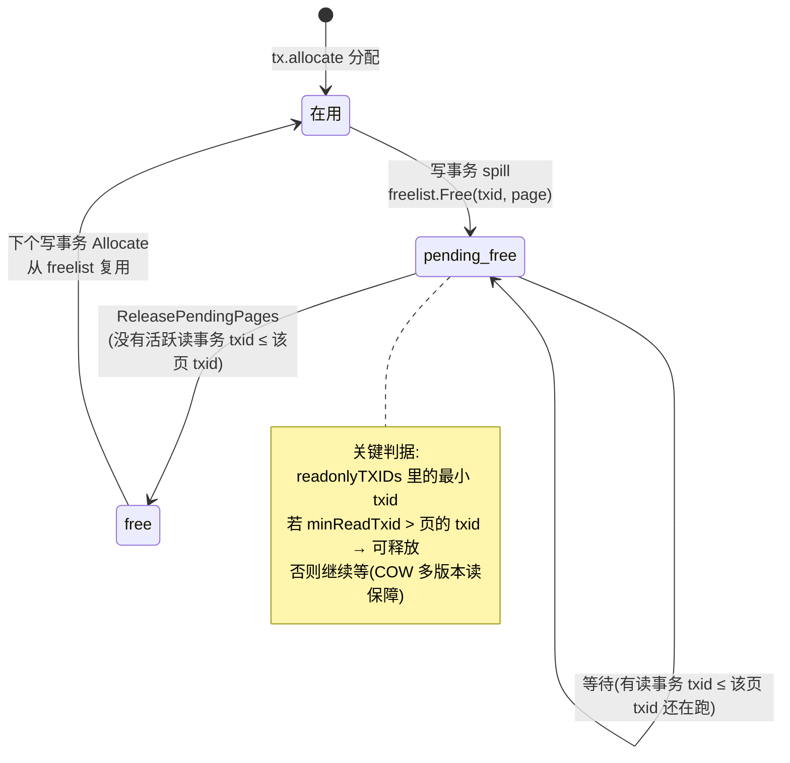

# 第十六篇 · bbolt 之二:COW 事务 + freelist

> 篇:P4 backend 与 bbolt · 存储底座
> 主线呼应:这一章继续钻**应用层**的纵深——bbolt 内部怎么把一个写事务安全地落到一个文件里,且不和读打架。上一章 P4-15 你已经看到 bbolt 把整个库放进一个文件,页是基本单位,B+tree 在定长页上组织,读路径靠 mmap 只读映射。但"读"那边再漂亮,绕不开一个更要命的问题:**写怎么办?** 写要改页,可读也正在用 mmap 看这些页——如果写直接覆盖原页,正在读的人就会看到"改了一半"的不一致数据,唯一的办法就是加锁串行化,可那样并发就没了。bbolt 的答案是 **Copy-On-Write(写时复制)+ meta 页双缓冲 + freelist 回收**。这一套机制是 bbolt 能做到"一个写事务和多个读事务并发而不锁读"的全部秘密,也是它崩溃一致性做得这么干净的地基。

## 核心问题

**bbolt 怎么让一个写事务和多个读事务并发而不加锁?Copy-On-Write(写不改原页、复制新页写)凭什么做到读写互不干扰?提交时怎么"原子翻转"让新视图对读者瞬间可见?freelist 又怎么回收 COW 产生的一大堆旧页?**

读完本章你会明白:

1. **COW** 凭什么让读写不锁并发:写事务复制新页去改,**原页一个字节都不动**,读事务靠 mmap 继续看原页,自然看到的是旧的一致视图。
2. **meta 页双缓冲 + txid 轮替**怎么做到"原子可见":bbolt 在文件头留两个 meta 页(meta0/meta1),写事务挑旧的那个写、txid+1、`fdatasync` 之后新内容才生效;读者每次选 txid 最大的有效 meta,提交前选到旧 meta(看旧视图),提交后选到新 meta(看新视图)——切换是一个 meta 指针的瞬间翻转。
3. **freelist** 怎么回收 COW 产生的旧页:被改过的原页不再被任何活跃的读 txid 引用时,进 freelist 复用;bbolt 有 array / hashmap 两种 freelist 实现,各有取舍。
4. 为什么"原地改页 + 加锁"这条路 bbolt 走不通,而 COW + 双缓冲这套看起来"浪费"的做法,反而是"快 + 崩溃一致 + 并发"三全的最优解。

> **如果一读觉得太难**:先只记住三件事——① 写不改原页,复制新页去改,所以读读旧页完全不受影响,这是 COW 并发不锁的根本;② 文件头有两个 meta 页,按 txid 奇偶轮替写,fsync 后原子切换,读者选 txid 最大的那个 meta;③ COW 产生的旧页靠 freelist 回收复用,不然文件会无限增长。这三条钉死了,再回头读细节。

---

## 16.1 一句话点破

> **bbolt 的写事务用 Copy-On-Write:改一个 key 时,它不去动那个 key 所在的原页,而是分配一个新页、把改动写进新页,B+tree 路径上涉及的节点也各复制一份新页。整个写事务期间,原页一个字节都不变——所以并发的读事务透过 mmap 看到的还是旧的一致视图,写读天然不打架。等这个写事务提交,它把"指向新 root"的那张新 meta 页写进文件头(两个 meta 页按 txid 奇偶轮替),`fdatasync` 落盘之后,下一个读事务打开时选 txid 最大的有效 meta,瞬间就看到了新视图。旧页不被任何活跃 txid 引用了,就进 freelist,等下次写事务复用。**

这是结论,不是理由。本章倒过来拆:先看"原地改页"为什么不行、COW 凭什么让读写不锁;再看写事务怎么收集脏页、怎么分配新页;然后看提交时 meta 双缓冲怎么原子翻转;最后看 freelist 怎么把 COW 产生的一堆旧页管起来。

---

## 16.2 为什么不能原地改页:COW 的根本动机

设想最朴素的写法:**写事务直接改 mmap 里的原页**。改一个 key "foo" 从 "v1" 到 "v2",这个 key 在某个 leaf 页里,你直接把那个 leaf 页里的 "v1" 改成 "v2"——看起来天经地义,有问题吗?有三个致命问题。

### 问题一:读会看到改一半的数据

bbolt 的 mmap 是**只读映射**(P4-15 讲过,`dataref` 字段注释明确写 "mmap'ed readonly, write throws SEGV",[db.go:127](../bbolt/db.go#L127)),但 mmap 的"只读"是针对 Go 代码直接写指针的保护——逻辑上,如果写事务真的去改这些页(比如绕过保护、用另一个可写映射),并发的读事务靠同一个 mmap 正在看这些页。改一个 B+tree 节点不是原子的:你可能要改页头的 count、改 inode 数组、甚至触发页分裂。一个读事务正读着这个页,刚读到 count=N,正要去读第 N 个 inode,这时写事务把 count 改成了 N+1、还挪动了 inode——读事务要么读到旧的 count 配新的 inode,要么反过来,数据彻底错乱。

> **不这样会怎样**:原地改页,读事务会看到"页头和页体不一致""count 和 inode 数组不匹配"的撕裂状态。B+tree 的不变式被破坏,读出来的数据可能完全是垃圾。要避免,只能在读写之间加锁——读时锁住页、写时等所有读退出。但这样一锁,bbolt 引以为傲的"读不阻塞、写不阻塞读"就全没了,高并发读的吞吐会塌掉。

### 问题二:崩溃恢复时数据可能半新半旧

如果写事务改了若干页(page A、page B、page C),写到一半进程崩了——A 改完了、B 改了一半、C 还没动。重启后,文件里是一个**部分更新**的状态:有些页是新值、有些是半新值、有些是旧值。没有任何办法判断哪些改是"完成的"、哪些是"未完成的",数据不一致,且无法修复。

### 问题三:多版本读做不到

etcd 的 mvcc 需要支持"读一个旧 revision"(P3-10 讲过),这意味着读事务要能访问"某个历史时刻"的数据。如果原地改页,旧值被覆盖了,根本无从读历史。bbolt 虽然不为 etcd 单独保留历史(那是 mvcc 的事),但它必须支持"一个长读事务在跑的同时,写事务继续推进"——这就要求读事务看到的视图在它整个生命周期里**不变**,而原地改页会直接破坏这一点。

> **所以这样设计**:Copy-On-Write。写事务**绝不改原页**,而是:① 找到要改的 key 所在的页 P;② 分配一个新页 P',把 P 的内容复制到 P';③ 在 P' 上做修改;④ 把 B+tree 路径上 P 的父节点也如法炮制(因为父节点指向 P 的指针要改成指向 P');⑤ 一路复制到 root。**整个写事务结束时,改动只存在于一批新分配的页里,原页一个字节没动**。

这就是 COW。它的代价是"改一个 key 可能要复制好几个页"(从 leaf 到 root 路径上的每个节点),但换来三个巨大好处:

1. **读不阻塞**:并发的读事务继续靠 mmap 看原页,原页没变,它看到的一直是旧的一致视图。
2. **崩溃安全**:写事务的改动全在新页里,提交前这些新页对读者不可见(读者还看旧 root),提交时只改一个 meta 页指针——要么这个 meta 写成功(改动全部生效),要么没写成功(改动全部不可见,等于这个事务没发生)。**事务的原子性,靠 meta 页这一处原子翻转来保证**,这是 bbolt 崩溃一致性的核心。
3. **MVCC 友好**:不同 txid 的读事务持有不同时刻的 meta 快照,各自看各自的 root,天然多版本。

> **钉死这件事**:bbolt 的 COW 不是性能优化,是**正确性必需**。没有 COW,读写必须加锁串行化,崩溃恢复无法做原子事务,长读事务期间没法让写推进。COW 用"多复制几个页"这个代价,换来了"读完全不阻塞写、写完全不阻塞读、事务原子可恢复"这三件事一起成立——这是 etcd 这种"读多写也不少、还要强一致"的系统能用 bbolt 当底座的根本原因。

下面拆 COW 在代码里怎么落地的。

---

## 16.3 写事务:从脏页到新 root 的全过程

一个 bbolt 写事务的生命周期,从 `Begin(true)` 开始,到 `Commit()` 结束。`Begin(true)` 会调 [`beginRWTx`](../bbolt/db.go#L839),它做的第一件事是拿 `db.rwlock`([db.go:847](../bbolt/db.go#L847))——这个锁保证**同一时刻只有一个写事务**。注意:这个锁只锁写写互斥,**不锁读写**。读事务走的是完全另一条路([`beginTx`](../bbolt/db.go#L792)),它只拿 `metalock` 和 `mmaplock` 的读锁,跟写事务的 `rwlock` 毫无关系。这是"写读不锁并发"的第一层——写写串行,读写自由。

`beginRWTx` 拿到写锁后,会调 [`tx.init(db)`](../bbolt/tx.go#L47),这一步对写事务有一个关键动作:

```go
// tx.go:47-65 (简化示意,保留关键步骤)
func (tx *Tx) init(db *DB) {
    tx.db = db
    tx.meta = &common.Meta{}
    db.meta().Copy(tx.meta)          // ① 把当前最新 meta 拷一份给自己
    // ...
    if tx.writable {
        tx.pages = make(map[common.Pgid]*common.Page)   // ② 给本事务的脏页缓存开 map
        tx.meta.IncTxid()                                 // ③ txid+1(还没写盘,只是内存)
    }
}
```

三件事:① 把当前 db 的最新 meta(`db.meta()`,即 txid 最大的有效 meta)**值拷贝**一份给本事务(`db.meta().Copy(tx.meta)`,见 [meta.go:37](../bbolt/internal/common/meta.go#L37) 的 `Meta.Copy`,是 `*dest = *m` 整体赋值);② 给本事务开一个 `pages` map,用来收集本事务"复制出来的新页";③ 把 meta 的 txid 加 1。

> **钉死这件事**:**`tx.meta` 是 db 当前 meta 的一份拷贝,不是引用。** 写事务后续的所有改动(分配新页、改 root、free 旧页)都记在这份拷贝上,**不碰 db.meta0 / db.meta1**。直到 `Commit` 的最后一步,这份 `tx.meta` 才写回文件——而且写回的位置是由 `tx.meta.txid % 2` 决定的另一个 meta 页。这就是 meta 双缓冲的核心:db 永远持有两个 meta 页(一新一旧),写事务在拷贝上干活,提交时原子替换那个旧的。

### 脏页怎么来的:rebalance + spill

写事务里调 `bucket.Put(k, v)` 时,改动先记在内存里的 node(`node.inodes` 数组),不立刻碰页。等 `Commit` 时,才会真正把这些内存里的改动**物化成新页**。看 [`Tx.Commit`](../bbolt/tx.go#L170):

```go
// tx.go:170-283 (简化示意,保留关键步骤)
func (tx *Tx) Commit() (err error) {
    // ① rebalance:对删过元素的节点重平衡
    tx.root.rebalance()

    // ② spill:把内存 node 写到新分配的页里(COW 的主战场)
    if err = tx.root.spill(); err != nil {
        return err
    }

    // ③ 更新本事务 meta 的 root 指针,指向 spill 出来的新 root
    tx.meta.RootBucket().SetRootPage(tx.root.RootPage())

    // ④ free 旧 freelist 页(commit 会写一份新的 freelist 出去)
    if tx.meta.Freelist() != common.PgidNoFreelist {
        tx.db.freelist.Free(tx.meta.Txid(), tx.db.page(tx.meta.Freelist()))  // tx.go:216
    }

    // ⑤(可选)commit freelist:把更新后的 freelist 写进新分配的页
    if !tx.db.NoFreelistSync {
        tx.commitFreelist()
    }

    // ⑥ 写所有脏页(包括 spill 出来的 B+tree 新页 + 新 freelist 页)
    tx.write()

    // ⑦ 写 meta 页(原子翻转的关键!单独一步,详见 16.4)
    tx.writeMeta()

    tx.close()
    return nil
}
```

COW 的真正魔法在 **② spill**。看 [`node.spill`](../bbolt/node.go#L295):

```go
// node.go:295-335 (简化示意)
func (n *node) spill() error {
    // 先递归 spill 子节点(从叶子到根的方向)
    for i := 0; i < len(n.children); i++ {
        n.children[i].spill()
    }
    // 把当前 node 按 pageSize 切成合适的页
    var nodes = n.split(uintptr(tx.db.pageSize))
    for _, node := range nodes {
        // 如果这个 node 原来就占着一个页(node.pgid > 0),把那个旧页 free 掉
        if node.pgid > 0 {
            tx.db.freelist.Free(tx.meta.Txid(), tx.page(node.pgid))   // ← 旧页进 freelist
            node.pgid = 0
        }
        // 分配新页(从 freelist 或文件末尾)
        p, err := tx.allocate(...)
        // 把 node 内容写进新页
        node.pgid = p.Id()
        node.write(p)         // ← node.write 把 inode 数组序列化进新页 p
        node.spilled = true
    }
}
```

读这段代码,注意 COW 的两个动作在这里同时发生:

1. **旧页进 freelist**:`tx.db.freelist.Free(tx.meta.Txid(), tx.page(node.pgid))`。原页(node.pgid 指向的那个页)不再被使用,但它**不能立刻被别人覆盖**——可能有别的读事务还持有这个 txid 之前的视图,正看着这个页。所以它先进"pending free"列表(16.5 详讲),等没有任何读事务还需要它时,才真正变成可复用的空闲页。
2. **分配新页 + 写新内容**:`tx.allocate(...)` 分配新页(优先从 freelist 拿,没有就从文件末尾扩展),`node.write(p)` 把 node 的内容序列化进这个新页。这个新页的页号,记在 `node.pgid` 上,后续父节点会更新指向这个新页号。

> **钉死这件事**:COW 在代码里就是 spill 这段——**每个被改动的 node,先 Free 掉它原来占的旧页(进 pending free),再 allocate 一个新页、把新内容写进去**。旧页和新页同时存在于文件里,直到本事务提交后、没有任何读事务还引用旧页了,旧页才会被复用。这就是"写不改原页"在源码层的落实。

注意 `tx.allocate` 分配的新页,**先放在 `tx.pages` 这个 map 里**(见 [`tx.allocate`](../bbolt/tx.go#L501) 的 `tx.pages[p.Id()] = p`),不直接写文件。它们在 `Commit` 的第 ⑥ 步 `tx.write()` 才真正 `writeAt` 落到文件。在那之前,这些新页是内存里的临时缓冲。这意味着:**即使写事务改了几千个 key,只要没 Commit,磁盘上的文件一个字节都没变**——并发的读事务看到的永远是旧视图。这就是 COW + 延迟写入带来的"事务未提交前对读不可见"。

---

## 16.4 meta 页双缓冲:原子翻转,读者瞬间切换

上一节你看到,写事务把所有改动都做进了新页,新页在 `Commit` 的 `tx.write()` 步骤落盘了。但**新页落盘 ≠ 对读者可见**——因为读者打开事务时,是从 `db.meta()` 拿 meta,根据 meta.root 找 B+tree 的 root。新页虽然写在文件里了,但如果 meta.root 还指向旧 root,读者就还是去读旧 root,看不到新页。

所以"提交"这件事,本质上就是**把 meta.root 指向新 root**,让读者下次能找到新页。但这一步必须**原子**——不能让读者读到"meta 改了一半"的状态。bbolt 的解法,是**两个 meta 页 + txid 轮替 + 单页 fdatasync**。

### 文件头的两个 meta 页

bbolt 文件的第 0、第 1 页,固定是两个 meta 页(meta0、meta1)。看 `db.init()`(新建库时)怎么初始化它们,[`db.go:646-688`](../bbolt/db.go#L646-L688)(简化示意):

```go
func (db *DB) init() error {
    buf := make([]byte, db.pageSize*4)
    for i := 0; i < 2; i++ {                   // 写两个 meta 页
        p := db.pageInBuffer(buf, common.Pgid(i))
        p.SetId(common.Pgid(i))
        p.SetFlags(common.MetaPageFlag)
        m := p.Meta()
        m.SetMagic(common.Magic)
        // ...
        m.SetRootBucket(common.NewInBucket(3, 0))
        m.SetFreelist(2)
        m.SetPgid(4)
        m.SetTxid(common.Txid(i))               // ← meta0 的 txid=0,meta1 的 txid=1
        m.SetChecksum(m.Sum64())
    }
    // ...
}
```

两个 meta 页,初始 txid 一个是 0、一个是 1。后面每开一个写事务,txid 都 +1。**关键在 [`Meta.Write`](../bbolt/internal/common/meta.go#L42-L58) 这一行**:

```go
// meta.go:50-51
// Page id is either going to be 0 or 1 which we can determine by the transaction ID.
p.id = Pgid(m.txid % 2)
```

**meta 页的页号(写到文件的位置),由 txid 的奇偶决定**。txid 是偶数 → 写到 page 0(meta0);txid 是奇数 → 写到 page 1(meta1)。这意味着:

- 当前 db 的最新 meta 是 txid=N(假设 N 偶数),那它在 page 0。
- 下一个写事务 txid 变成 N+1(奇数),它的 meta 会**写到 page 1**——正好是另一个 meta 页,**不覆盖当前在用的 page 0**。
- 写完 page 1、`fdatasync` 落盘后,db 的"最新 meta"就是 page 1 了(txid=N+1 > N)。下次 `db.meta()` 选 txid 最大的,自然选到 page 1。
- 再下一个写事务 txid=N+2(偶数),meta 写到 page 0,**不覆盖当前的 page 1**。

这就是**轮替**:两个 meta 页交替使用,永远不覆盖当前正在被读者引用的那个。

### 提交时的原子翻转

看 `Commit` 的最后一步 [`writeMeta`](../bbolt/tx.go#L595-L625):

```go
// tx.go:595-625 (简化示意)
func (tx *Tx) writeMeta() error {
    buf := make([]byte, tx.db.pageSize)
    p := tx.db.pageInBuffer(buf, 0)
    tx.meta.Write(p)                          // ← Write 内部按 txid%2 设 p.id

    tx.db.metalock.Lock()
    // 把 buf 写到文件 p.id 这页的位置(要么 page 0,要么 page 1)
    tx.db.ops.writeAt(buf, int64(p.Id())*int64(tx.db.pageSize))
    tx.db.metalock.Unlock()

    if !tx.db.NoSync {
        fdatasync(tx.db)                      // ← 关键!等这页真正落盘
    }
    return nil
}
```

整个提交的"原子性",落在 `writeAt` + `fdatasync` 这两步上。bbolt 写一个 meta 页,**就是一个单页(通常 4KB)的 writeAt + fdatasync**。操作系统对"单页写"的原子性有保证(磁盘扇区写入是原子的,4KB 对齐的页写在崩溃时要么完整、要么完全不可见)。

所以提交的语义是:

- 在 `fdatasync` 之前崩溃:新 meta 页没完整落盘,`db.meta()` 启动时校验它会失败(checksum 对不上),于是 `db.meta()` fallback 回退到旧 meta 页——**这个写事务等于没发生**,数据回到提交前。一致。
- 在 `fdatasync` 之后崩溃:新 meta 页完整落盘、checksum 有效、txid 更大,`db.meta()` 选到它——**这个写事务的全部改动生效**。而那些改动(新 B+tree 页、新 freelist 页)在 `tx.write()` 那一步已经先于 meta 页落盘了(`Commit` 里 `tx.write()` 在 `writeMeta()` 之前,且各自有 `fdatasync`)。所以新 meta 指向的所有新页都在磁盘上,数据完整。一致。

> **钉死这件事**:**bbolt 事务的原子性,本质上是"先写所有数据页并 fsync,再写一个 meta 页并 fsync"这个顺序保证的**。数据页先落盘,meta 页后落盘——meta 页一旦落盘成功,它指向的所有数据页必然已经在磁盘上(meta 写之前刚 fsync 过);meta 页没落盘成功,它指向的数据页虽然可能在磁盘上,但没人会去读它们(`db.meta()` 不选这个坏 meta)。崩溃恢复时,要么看到新 meta(完整生效),要么看到旧 meta(全部回退),绝不会看到半新半旧。这就是 meta 双缓冲 + 单页原子写换来的崩溃一致性。

### 读者怎么选 meta:txid 最大的有效那个

每个读事务打开时([`db.meta()`](../bbolt/db.go#L1141) 在 `tx.init` 里被调用):

```go
// db.go:1141-1162 (简化示意)
func (db *DB) meta() *common.Meta {
    metaA := db.meta0
    metaB := db.meta1
    if db.meta1.Txid() > db.meta0.Txid() {
        metaA = db.meta1
        metaB = db.meta0       // metaA 永远是 txid 大的,metaB 是小的
    }
    // 优先用 txid 大的,如果它 validate 失败(比如写一半崩了),回退到小的
    if err := metaA.Validate(); err == nil {
        return metaA
    } else if err := metaB.Validate(); err == nil {
        return metaB
    }
    panic("invalid meta pages")
}
```

读者每次都选 **txid 最大的、且 checksum 校验通过**的那个 meta 页。`Validate`([meta.go:25-34](../bbolt/internal/common/meta.go#L25-L34))检查 magic、version、checksum——如果这个 meta 页写一半崩了,checksum 必然对不上,Validate 失败,回退到另一个。这是双缓冲的容错:两个 meta 页,写一个的时候崩了,另一个还是好的。

但这里有一个微妙的问题:**`db.meta0` 和 `db.meta1` 是 mmap 进来的指针,它们指向的是文件里 page 0 和 page 1 的实时内容**。当一个写事务的 `writeMeta` 把新内容 `writeAt` 到 page 0(或 page 1)并 fsync 后,**mmap 里对应的字节也会变成新内容**(mmap 反映文件的最新状态)。这意味着:**一个读事务打开时拿到的 meta 拷贝(`db.meta().Copy(tx.meta)`),是它打开那一刻的最新 meta**。如果它打开在写事务提交之前,它拷走的是旧 meta(txid 较小);如果打开在提交之后,拷走的是新 meta(txid 较大)。**这个"打开时拷贝走一份"的动作,就是读事务固定视图的瞬间**——之后即使 db 的 meta 又被改了,读事务手里的 `tx.meta` 是值拷贝,不变,它继续看旧视图。

下面用一张 ASCII 图把 meta 轮替 + 读者持旧 meta 的全过程画出来,这是本章最值得停下来看的一张图。

### 配图:meta 页双缓冲 + txid 轮替

```
                  bbolt 文件(简化,页是基本单位)
  ┌────────┬────────┬────────┬────────┬────────┬────────┬────────┐
  │ page 0 │ page 1 │ page 2 │ page 3 │ page 4 │ page 5 │  ...   │
  │ meta0  │ meta1  │ freel- │  leaf  │  leaf  │ branch │        │
  │        │        │  ist   │  (新)  │  (新)  │ (新root)│       │
  └────────┴────────┴────────┴────────┴────────┴────────┴────────┘
       ↑        ↑
       │        │  这两页是 meta 双缓冲,永远在文件头

  场景:当前 db 最新 = meta1(txid=3, 奇数, root=page5)

  ┌─────────────────────────────────────────────────────────────────┐
  │ 写事务 W 打开(txid 变 4, 偶数, 它的 meta 会写到 page 0)       │
  │   - 拷走 meta1 内容 → tx.meta                                   │
  │   - tx.meta.txid = 3+1 = 4                                      │
  │   - spill 改了 key "foo", 分配 page6(新 leaf), free 旧 page4  │
  │   - tx.meta.root = page6                                        │
  │   - 写 page6 进文件(tx.write, fdatasync)                       │
  │   - writeMeta: p.id = 4 % 2 = 0 → 写 page 0(meta0)            │
  │     writeAt(buf, 0); fdatasync;  ← 原子翻转瞬间                 │
  │   - 现在文件里:meta0(txid=4, 新) > meta1(txid=3, 旧)         │
  └─────────────────────────────────────────────────────────────────┘

  并发的两个读事务 R1、R2(用 txid 标记它们持的视图):

     R1 在 W 提交前打开:
        db.meta() 选 meta1(txid=3) → 拷走 → R1.tx.meta = {txid:3, root:page5}
        R1 读 root=page5 的 B+tree,看到旧 foo="v1"
        (即使 W 后来写了 page0=新meta, R1 手里是值拷贝, 不变, 继续看 v1)

     R2 在 W 提交后打开:
        db.meta() 选 meta0(txid=4, 新) → 拷走 → R2.tx.meta = {txid:4, root:page6}
        R2 读 root=page6 的 B+tree,看到新 foo="v2"

  → R1 和 R2 同时存在, 一个看 v1 一个看 v2, 各自一致, 互不干扰, 谁也不锁谁
  → R1 关闭后, 它持有的 txid=3 视图没人用了, page4(旧 leaf)就可以进 freelist 复用
```

这张图把 COW + meta 双缓冲 + txid 轮替 + 读者持旧 meta 四件事一次性钉死了。**COW 让旧页字节不变(meta1 指向的 page5、page4 在 R1 活着期间绝不会被覆盖),meta 双缓冲让写事务永远有另一个 meta 页可写而不破坏当前生效的 meta,txid 轮替保证写事务永远不覆盖正在被读的 meta 页,读者打开瞬间值拷贝 meta 固定视图**——这四件事合起来,就是 bbolt 写读并发不锁的全部机制。

---

## 16.5 freelist:COW 旧页的回收站

COW 有一个直接的副作用:**每次写都会产生一批旧页**。改一个 leaf 节点,旧 leaf 页废弃、新 leaf 页诞生;改多了,从 leaf 到 root 路径上的每个节点都换新页。这些旧页占了文件空间,不回收的话文件会无限增长——你只改了一个 key,数据库文件可能涨几 MB,生产环境绝不能容忍这种放大。

bbolt 用 **freelist(空闲页表)** 来回收这些旧页。它干两件事:① 记录哪些页是空闲的、可以被下次写事务复用;② 写事务要分配新页时,优先从 freelist 拿,拿不到才从文件末尾扩展(扩展会让文件变大)。

### freelist 在哪、长什么样

先纠正一个常见误解:bbolt 的 freelist **不在顶层 `freelist.go` 文件**(这个 commit @`50f0b81` 里顶层根本没有 freelist.go),它在 [`bbolt/internal/freelist/`](../bbolt/internal/freelist/) 子包里。顶层 `db.go` 只是持有一个 `fl.Interface` 接口([db.go:137](../bbolt/db.go#L137)):

```go
type DB struct {
    // ...
    freelist     fl.Interface         // db.go:137
    freelistLoad sync.Once
    // ...
}
```

`db.Open` 时通过 [`db.loadFreelist()`](../bbolt/db.go#L422) 初始化:

```go
// db.go:422-427 (简化示意)
func (db *DB) loadFreelist() {
    db.freelistLoad.Do(func() {
        db.freelist = newFreelist(db.FreelistType)      // db.go:424
        if !db.hasSyncedFreelist() {
            db.freelist.Init(db.freepages())             // freelist 没同步过 → 全库扫描重建
        } else {
            db.freelist.Read(db.page(db.meta().Freelist()))   // 从 meta.freelist 指向的页读
        }
    })
}
```

注意 [`newFreelist`](../bbolt/db.go#L1314-L1319):它根据 `db.FreelistType` 决定用哪种实现(array 或 hashmap)。这是一个接口 + 两种实现的经典设计:

```go
// db.go:1314-1319
func newFreelist(freelistType FreelistType) fl.Interface {
    if freelistType == FreelistMapType {
        return fl.NewHashMapFreelist()
    }
    return fl.NewArrayFreelist()              // 默认 array
}
```

两种实现共享一份 [`shared`](../bbolt/internal/freelist/shared.go#L18) 嵌入结构,负责"pending free → free"的状态机;区别在"free 页怎么存",见 16.6 的技巧精解。

### 三种页状态:在用 / pending free / free

freelist 管理的页,有三类:

- **在用**:正在被某个 txid 的视图引用。
- **pending free**(待释放):写事务标记了"这个页我不要了",但**可能有别的读事务还引用它**(那个读事务的 txid 比当前写事务早),所以暂时不能复用,先放 pending 池。
- **free**(可复用):没有任何活跃读事务引用了,下次写事务分配新页时可以直接拿。

这套状态机的核心在 [`shared.Free`](../bbolt/internal/freelist/shared.go#L56-L87) 和 [`shared.release` / `releaseRange`](../bbolt/internal/freelist/shared.go#L160-L203)。看 `Free`:

```go
// shared.go:56-87 (简化示意)
func (t *shared) Free(txid common.Txid, p *common.Page) {
    if p.Id() <= 1 {
        panic("cannot free page 0 or 1")          // meta 页绝不能 free
    }
    // 把这个页(连同它的 overflow 页)加进 pending[txid] 列表
    txp := t.pending[txid]
    if txp == nil {
        txp = &txPending{}
        t.pending[txid] = txp
    }
    for id := p.Id(); id <= p.Id()+common.Pgid(p.Overflow()); id++ {
        txp.ids = append(txp.ids, id)             // 记进 pending
        t.cache[id] = struct{}{}                  // cache:这个页已经是"非在用"了
    }
}
```

注意 **Free 只是把页进 pending[txid],不是立刻进 free 池**。`txid` 是谁?是调 `Free` 的那个写事务的 txid(比如 `node.spill` 里 `tx.db.freelist.Free(tx.meta.Txid(), ...)`,见 [node.go:319](../bbolt/node.go#L319))。这个 pending 列表会**等一段时间**才挪进真正的 free 池——等多久?等到没有任何读事务的 txid 还可能引用这些页。

看 [`ReleasePendingPages`](../bbolt/internal/freelist/shared.go#L141-L158),它在每次开写事务时被调([db.go:870](../bbolt/db.go#L870) 的 `db.freelist.ReleasePendingPages()`):

```go
// shared.go:141-158 (简化示意)
func (t *shared) ReleasePendingPages() {
    // 找出当前所有活跃读事务里最小的 txid
    sort.Sort(txIDx(t.readonlyTXIDs))
    minid := common.Txid(math.MaxUint64)
    if len(t.readonlyTXIDs) > 0 {
        minid = t.readonlyTXIDs[0]                // 最早还在跑的读事务的 txid
    }
    if minid > 0 {
        t.release(minid - 1)                      // 释放所有 txid ≤ minid-1 的 pending
    }
    // ...
}
```

逻辑很直白:**只要还有读事务 txid=N 在跑,所有 txid ≤ N 的 pending 页都不能释放**(因为那个读事务可能还在看)。等到所有 txid ≤ N 的读事务都关了(最小活跃 txid 变成 N+1),那些 pending 页(对应 txid ≤ N 的写事务产生的旧页)才安全释放——因为没有任何活着的读事务还能引用它们了。

> **钉死这件事**:freelist 的 pending → free 转换,**判据是"有没有活跃读事务还可能引用这些页"**。这是 COW 多版本读的直接后果——一个 txid=3 的读事务可能还看着 txid=3 时分配的页,所以 txid ≤ 3 的写事务产生的旧页不能覆盖。bbolt 通过 `readonlyTXIDs` 列表追踪所有活跃读事务的 txid,在每次开新写事务时,把"确认没人再引用"的 pending 释放进 free 池。这就是 COW 不丢数据的并发保障——旧页的复用,严格晚于最后一个引用它的读事务关闭。

### freelist 怎么持久化:meta.freelist 指针

freelist 自己也要存盘,否则重启后不知道哪些页空闲。bbolt 的做法是:**把 freelist 序列化进一个专门的页**(meta.freelist 字段指向它)。看 `Commit` 里的 [`commitFreelist`](../bbolt/tx.go#L285-L298):

```go
// tx.go:285-298 (简化示意)
func (tx *Tx) commitFreelist() error {
    // 估个大小,分配一个(或几个,overflow)新页给 freelist
    p, err := tx.allocate((tx.db.freelist.EstimatedWritePageSize() / tx.db.pageSize) + 1)
    // 把 freelist 内容序列化进这个新页
    tx.db.freelist.Write(p)
    // meta.freelist 指向这个新页
    tx.meta.SetFreelist(p.Id())
    return nil
}
```

每次提交,freelist 都**重新写一份**到新分配的页里,旧的 freelist 页则被 Free 掉([tx.go:216](../bbolt/tx.go#L216),`Commit` 开头那一步)。meta.freelist 字段指向最新的那个。这样 freelist 和 B+tree 一样享受 COW + meta 双缓冲的保护——崩溃时要么看到新 freelist、要么看到旧的,一致。

> 一个优化点:bbolt 支持 `NoFreelistSync`([db.go:60](../bbolt/db.go#L60))——开了之后,freelist 不每次都同步到盘上,而是把 `meta.freelist` 设成一个特殊值 `PgidNoFreelist`([tx.go:226](../bbolt/tx.go#L226)),意思是"freelist 没同步,重启时全库扫描重建"。这换来了写吞吐的提升(省一次 freelist 页的 writeAt),代价是重启慢(要扫整个库找空闲页)。`loadFreelist` 里的 `if !db.hasSyncedFreelist() { db.freelist.Init(db.freepages()) }` 就是这个重建逻辑([db.go:425-427](../bbolt/db.go#L425-L427))。etcd 默认是开启 `NoFreelistSync` 的(为了写吞吐),重启时付一次扫描代价。

---

## 16.6 技巧精解:COW + meta 双缓冲的并发不锁,与 freelist 的两种实现

本章挑两个最硬核的技巧单独拆透。

### 技巧一:COW + meta 双缓冲,凭什么一个写事务能和一堆读事务并发而不锁

**它解决什么问题**:一个存储引擎要同时支持"一个写事务在改"+"多个读事务在读",还要保证读事务看到的是一致快照(不能看到改一半的数据)、写事务提交原子(要么全生效要么全不生效)、崩溃恢复一致。朴素做法是全局读写锁——写时排他、读时共享,但写会被读挡、读会被写挡,并发度极差。

**用了什么手段**:三件事叠起来,缺一不可。

1. **COW:写不改原页**。写事务里改任何 key,都走 `node.spill` —— 旧页进 pending free、新页分配出来写新内容(16.3)。原页字节在所有引用它的读事务关闭之前,绝不变化。这一条保证了"读读旧页,完全不受写影响"。
2. **meta 双缓冲 + txid 轮替**。文件头两个 meta 页(meta0/meta1),写事务的 meta 按 `txid % 2` 写到另一个 meta 页位置(`Meta.Write` 的 `p.id = Pgid(m.txid % 2)`,[meta.go:51](../bbolt/internal/common/meta.go#L51)),**永不覆盖当前生效的 meta 页**。这一条保证了"写 meta 时,即使写一半崩了,旧 meta 还在,读者能 fallback"。
3. **读事务打开瞬间值拷贝 meta,固定视图**。`tx.init` 里 `db.meta().Copy(tx.meta)`([tx.go:53](../bbolt/tx.go#L53)),`Copy` 是 `*dest = *m` 整体赋值([meta.go:37-39](../bbolt/internal/common/meta.go#L37-L39))。读事务手里这份 meta 是值拷贝,之后 db 的 meta 再变,读事务看的是旧的。这一条保证了"读事务整个生命周期内视图不变"。

来对照看真实源码,三件事怎么串起来。先看写事务怎么不和读事务抢锁——[`beginRWTx` 拿 `rwlock`](../bbolt/db.go#L847)(只锁写写),[`beginTx` 拿 `metalock` + `mmaplock.RLock`](../bbolt/db.go#L796-L801)(读锁,不互斥):

```go
// db.go:839-872 beginRWTx(简化示意)
func (db *DB) beginRWTx() (*Tx, error) {
    db.rwlock.Lock()              // ← 只锁写写,读事务根本不拿这个锁
    db.metalock.Lock()
    // ...
    t := &Tx{writable: true}
    t.init(db)
    db.rwtx = t
    db.freelist.ReleasePendingPages()
    return t, nil
}

// db.go:792-837 beginTx(简化示意)
func (db *DB) beginTx() (*Tx, error) {
    db.metalock.Lock()            // ← 只锁 meta 短暂访问
    db.mmaplock.RLock()           // ← mmap 读锁(防止 remap 时还有人读)
    // ...
    t := &Tx{}
    t.init(db)                    // ← 这里 db.meta().Copy(t.meta) 值拷贝走
    if db.freelist != nil {
        db.freelist.AddReadonlyTXID(t.meta.Txid())   // 把自己 txid 登记进 freelist
    }
    db.metalock.Unlock()
    return t, nil
}
```

读事务全程不碰 `rwlock`。写事务全程不阻塞读事务的 `beginTx`(除了极短的 `metalock` 临界区,那只是为了读 meta 指针)。**这就是"一个写事务和 N 个读事务并发而不锁读"在锁层面的落实**。

**反面对比**:如果不用 COW,朴素地"原地改页 + 读写锁":

```go
// 朴素实现(假设)
func (db *DB) beginRWTx() {
    db.rwLock.Lock()         // 写锁,所有读都要等写完
}
func (db *DB) beginTx() {
    db.rwLock.RLock()        // 读锁,写要等所有读完
}
```

这套锁的问题:① 写到来时,要等所有在跑的读退出——读越慢(比如 etcd 的 range 大查询),写被堵越久;② 读到来时,如果写正在改,读要等写完——写越久(大事务),读延迟尖刺越严重。bbolt 这种"配置中心、选主协调"场景,读 QPS 远高于写、且读对延迟敏感(lease 续期、watch 同步都靠快读),朴素读写锁会直接拖垮 etcd。COW + 双缓冲换来了"写完全不阻塞读的 begin、读完全不阻塞写的 begin",这是 etcd 高并发读延迟稳定的底层支撑。

**这个手段妙在哪**:

1. **不用读写锁,也能 MVCC**:每个读事务持一个 txid 快照,看到的就是那个 txid 时刻的数据库视图。多个不同 txid 的读事务并存,各自一致——这是 COW + meta 拷贝天然带来的多版本能力,不用额外实现。
2. **原子性靠单页写换**:整个事务的原子性,落在 `writeMeta` 那一次 4KB 单页 `writeAt + fdatasync` 上。操作系统对单页写的原子性保证,直接拿来当事务原子性用——不用 WAL(bbolt 本身没有 WAL,和 LevelDB 不一样)、不用 redo log,机制极简。
3. **崩溃恢复极干净**:重启时 `db.meta()` 选 txid 最大且 checksum 通过的 meta,要么是新 meta(事务生效)、要么是旧 meta(事务回退),两种情况都一致。不需要回放日志、不需要 redo/undo,打开即用。

**代价**:COW 要复制路径上的所有页,写放大比"原地改"高(改一个 key 可能复制 3~5 个页);所有读事务靠 mmap,长读事务会阻止 pending 页释放(积压导致文件变大)。这是 bbolt 为"读不阻塞写、写不阻塞读"付的代价,etcd 接受这个代价因为它的读远多于写、且读延迟敏感。

> **钉死这件事**:**bbolt 的"写读并发不锁"不是一句口号,是 COW(不改原页)+ meta 双缓冲(轮替写、原子翻转)+ 读事务值拷贝 meta(固定视图)三件事的乘积**。任何一件没做到,整套机制就崩。COW 保证旧页不变,双缓冲保证 meta 切换原子,值拷贝保证读事务视图稳定。这三件事是 bbolt 区别于"原地改 + 锁"流派(比如一些传统 RDBMS 的 buffer pool)的根本,也是它崩溃一致性做得这么干净的原因。

### 技巧二:freelist 的两种实现——array 与 hashmap

**它解决什么问题**:freelist 要支持两个高频操作——① **allocate(n)**:分配 n 个连续空闲页,返回起始 pgid;② **Free(p)**:回收一个页。这两个操作在每次写事务里都要做很多次(spill 时每个 node 都要 allocate 新页 + free 旧页),性能直接影响写吞吐。

**用了什么手段**:bbolt 提供两种 freelist 实现,共享 [`shared`](../bbolt/internal/freelist/shared.go#L18) 基类(管 pending 状态机和 cache),区别在"free 页怎么存":

- **array**(默认,[`array.go`](../bbolt/internal/freelist/array.go)):用一个**排序数组** `ids []Pgid` 存所有 free 页。
- **hashmap**([`hashmap.go`](../bbolt/internal/freelist/hashmap.go)):用**三个 map** + 一个计数,把"连续页段(span)"作为单位管理。

先看 array 的 `Allocate`([array.go:21-61](../bbolt/internal/freelist/array.go#L21-L61)):

```go
// array.go:21-61 (简化示意)
func (f *array) Allocate(txid common.Txid, n int) common.Pgid {
    if len(f.ids) == 0 {
        return 0
    }
    var initial, previd common.Pgid
    for i, id := range f.ids {                   // 线性扫描整个数组
        if previd == 0 || id-previd != 1 {
            initial = id                          // 不连续,重置起点
        }
        if (id-initial)+1 == common.Pgid(n) {     // 找到 n 个连续页
            // 从数组里删掉这 n 个页
            copy(f.ids[i-n+1:], f.ids[i+1:])
            f.ids = f.ids[:len(f.ids)-n]
            // ...
            f.allocs[initial] = txid
            return initial                        // 返回起始 pgid
        }
        previd = id
    }
    return 0
}
```

array 的 `Allocate` 是**线性扫描**——从头扫到尾,找第一段连续 n 个页。复杂度 O(N),N 是 free 页总数。对于 free 页很多的大库(碎片化严重),这个扫描会非常慢——这是 array 的硬伤([db.go:62-66](../bbolt/db.go#L62-L66) 的注释直说:"endures dramatic performance degradation if database is large and fragmentation in freelist is common")。

hashmap 的 `Allocate`([hashmap.go:61-106](../bbolt/internal/freelist/hashmap.go#L61-L106))用一个精巧的结构避开线性扫描:

```go
// hashMap 结构(hashmap.go:14-21)
type hashMap struct {
    *shared
    freePagesCount uint64                 // 空闲页总数
    freemaps       map[uint64]pidSet      // key=span 大小, value=该大小的所有起始 pgid 集合
    forwardMap     map[common.Pgid]uint64 // key=起始 pgid, value=span 大小
    backwardMap    map[common.Pgid]uint64 // key=结束 pgid, value=span 大小
}
```

核心是 `freemaps map[uint64]pidSet`——**按 span 大小分桶**。"我要 3 个连续页"→ 直接查 `freemaps[3]`,O(1) 拿到所有大小恰为 3 的 span;没有就查 `freemaps[4]`、`freemaps[5]`... 找一个更大的 span 切出来。看 `Allocate`:

```go
// hashmap.go:61-106 (简化示意)
func (f *hashMap) Allocate(txid common.Txid, n int) common.Pgid {
    // ① 精确大小匹配:freemaps[n] 里随便取一个
    if bm, ok := f.freemaps[uint64(n)]; ok {
        for pid := range bm {
            f.delSpan(pid, uint64(n))
            f.allocs[pid] = txid
            return pid                         // O(1)!
        }
    }
    // ② 没有精确的, 找更大的 span, 切出 n 个, 剩下的塞回去
    for size, bm := range f.freemaps {
        if size < uint64(n) {
            continue
        }
        for pid := range bm {
            f.delSpan(pid, size)
            f.allocs[pid] = txid
            remain := size - uint64(n)
            f.addSpan(pid+common.Pgid(n), remain)   // 剩余段塞回 freemaps
            return pid
        }
    }
    return 0
}
```

hashmap 的 `Allocate` 复杂度是 O(1)(精确匹配)或 O(桶数)(找更大 span,桶数远小于总页数)。对大库碎片化场景,hashmap 比 array 快得多。

那为什么默认还是 array?有两个微妙取舍:

- **array 保证返回最小 pgid**(线性扫描从最小开始),hashmap 用 map 遍历,顺序不确定([db.go:64-65](../bbolt/db.go#L64-L65) 注释:"doesn't guarantee that it offers the smallest page id available")。最小 pgid 倾向"复用文件头部、保持文件紧凑",hashmap 可能让文件尾部出现空洞。
- **array 实现简单**,小库(碎片少)性能足够,内存占用低(一个数组 vs 四个 map)。etcd 的库通常不大(GMB 级),array 默认够用。

> **钉死这件事**:freelist 的两种实现是**性能 vs 紧凑性**的取舍。array 简单但大库碎片化时慢(O(N) 扫描),hashmap 复杂但快(O(1) 桶查)——这是工程上典型的"数据结构换性能"。bbolt 把它做成接口 + 两种实现([freelist.go 的 Interface](../bbolt/internal/freelist/freelist.go#L19)),默认 array,允许通过 `Options.FreelistType` 切到 hashmap,这是把"不同工作负载用不同数据结构"的灵活性留给上层。etcd 默认用 array(库小够用),遇到大库碎片化可以切 hashmap。

**反面对比**:如果完全不回收 freelist(写只从文件末尾分配、不 free 旧页):

- 文件只增不减,改一个 key 数据库涨几 KB,长期跑下来文件可能是实际数据的几十倍。
- mmap 映射的范围越来越大,内存压力涨,page fault 变多。
- 重启后加载慢(要 mmap 更大范围)。

freelist 是 COW 代价的直接"对冲"——COW 产生旧页,freelist 回收复用,让文件的稳态大小只和数据量成正比、不和"历史写次数"成正比。没有 freelist,COW 根本不可用。

---

## 16.7 配图:freelist 的 pending → free 状态机

用一张 mermaid 把 freelist 的页状态机画清楚:



这张图把"为什么旧页不能立刻复用"钉死了——pending_free 的页要等到"没有读事务还可能看着它"才进 free,这是 COW 多版本读的并发安全保障。

---

## 章末小结

这一章我们钻完了 bbolt 的写事务——它是 bbolt 能在"一个写 + 多个读"并发下做到"读不阻塞写、写不阻塞读、原子可恢复"的全部秘密。回到全书二分法,这一章继续服务**应用层**这一面——COW + 双缓冲不参与共识,它只是让"共识结果落地成可查状态"这件事在并发下做得干净、快、稳。共识(Raft)管"不丢不乱",bbolt 的 COW 事务管"在不丢不乱的前提下,读写并发不打架"。

bbolt 的写事务机制可以浓缩成三句话:

1. **COW**:写不改原页,改路径上的每个节点都复制新页、旧页进 pending free。原页不变,读读旧页完全不受影响。
2. **meta 双缓冲 + txid 轮替**:两个 meta 页按 `txid % 2` 交替写,提交时先写所有数据页并 fsync,再写一个 meta 页并 fsync——单页原子写换事务原子性,崩溃要么全生效要么全回退。
3. **freelist**:COW 产生的旧页进 pending,等没有读事务引用时挪进 free,下次写事务复用。array / hashmap 两种实现,各有取舍。

### 五个"为什么"清单

1. **为什么不能原地改页,必须 COW?** 原地改会让并发的读事务看到"改一半"的撕裂数据,只能加锁串行化,读写互相阻塞。COW 不改原页,读读旧页完全不受写影响,这是 bbolt 读写并发不锁的根本。
2. **meta 为什么要有两页、按 txid 奇偶轮替?** 写 meta 时,如果只有一个 meta 页,写一半崩了这个 meta 就坏了,无法回退。两个 meta 页交替写,当前生效的那个永远不被覆盖,写新 meta 时崩了,`db.meta()` 还能 fallback 到旧 meta——双缓冲是崩溃容错。
3. **提交的原子性凭什么保证?** 顺序:先 `tx.write()` 写所有数据页 + fsync,再 `writeMeta()` 写一个 meta 页 + fsync。单页写是磁盘原子单位,要么完整落盘要么不可见。meta 落盘成功 → 它指向的数据页必然先落盘了 → 全部生效;meta 没落盘 → 数据页虽在盘上但无人引用 → 全部回退。一致。
4. **读事务怎么看固定的视图,不受后续写影响?** `tx.init` 时 `db.meta().Copy(tx.meta)` 是**值拷贝**(整个 Meta 结构体赋值),读事务手里的 meta 不变,它据此找到的 root 和 B+tree 视图不变。后续 db 的 meta 怎么变,跟这个读事务无关。
5. **freelist 为什么要有 pending → free 两步,不直接 free?** COW 让旧页在写事务提交后仍可能被老的读事务引用(那个读事务 txid 比写事务早,看着旧视图)。直接 free 复用,会覆盖正在被读的页。pending 状态等"没有活跃读事务 txid ≤ 该页 txid"时才转 free,保证旧页的复用严格晚于最后一个引用它的读事务关闭。

### 想继续深入往哪钻

- 想看 COW 在源码里怎么落地,读 [`node.spill`](../bbolt/node.go#L295) —— 每个 node 的 `Free(旧页) + allocate(新页) + write(新页)` 三步,就是 COW 的全部。再对照 [`tx.write`](../bbolt/tx.go#L520)(把脏页 `writeAt` 落盘)和 [`tx.writeMeta`](../bbolt/tx.go#L595)(写 meta 页 + fsync),整个提交的顺序就活了。
- 想理解 meta 双缓冲的轮替,重点看 [`Meta.Write`](../bbolt/internal/common/meta.go#L42-L58) 那一行 `p.id = Pgid(m.txid % 2)`,和 [`db.meta()`](../bbolt/db.go#L1141)(读者怎么选 txid 最大有效 meta)——这两段对着 16.4 的 ASCII 图读,双缓冲就通了。
- 想钻 freelist 的 pending → free 状态机,读 [`shared.Free`](../bbolt/internal/freelist/shared.go#L56) / [`shared.ReleasePendingPages`](../bbolt/internal/freelist/shared.go#L141) / [`shared.release`](../bbolt/internal/freelist/shared.go#L160) / [`shared.releaseRange`](../bbolt/internal/freelist/shared.go#L173),配 [`db.beginRWTx`](../bbolt/db.go#L839) 里的 `db.freelist.ReleasePendingPages()` 调用——这套状态机是 COW 多版本读的并发保障。
- 想看 array vs hashmap 的取舍,读 [`array.Allocate`](../bbolt/internal/freelist/array.go#L21)(线性扫描,O(N))和 [`hashMap.Allocate`](../bbolt/internal/freelist/hashmap.go#L61)(按 span 大小分桶,O(1))——对照 [db.go:62-67](../bbolt/db.go#L62-L67) 的注释,取舍就清楚了。
- 一个值得思考的延伸:bbolt 没有 WAL(它靠 meta 双缓冲 + 单页原子写换事务原子性),而 etcd 在 bbolt **之上**又有一层 WAL(给 Raft 日志用,P5-17 讲)。两套机制各管各的——bbolt 的 meta 双缓冲管 bbolt 事务的原子性,etcd 的 WAL 管 Raft 日志的持久化。不要混。

### 引出下一章

P4 这三章(backend 批事务 / bbolt B+tree+mmap / bbolt COW+freelist)把 etcd 的**存储底座**讲完了。从 mvcc 的 revision,到 backend 的攒批,再到 bbolt 的 COW 事务,一条写从 apply 落到磁盘的完整路径已经通透。但回到全书主线——共识(Raft)管"不丢不乱"——我们还有一件事没讲:**Raft 自己的日志怎么持久化?** 一个 propose 被 leader 接受、还没被多数派复制前,leader 崩了怎么办?Raft 的 entry 必须先落盘才能算数,这层持久化是 etcd-raft 之外、由 etcd 的 WAL 做的。下一章 P5-17,我们离开存储底座,进入第 5 篇:**WAL——Raft 日志的持久化**,看一条 Raft entry 怎么被编码、被预分配文件流水线写下去、崩溃后怎么 repair。
