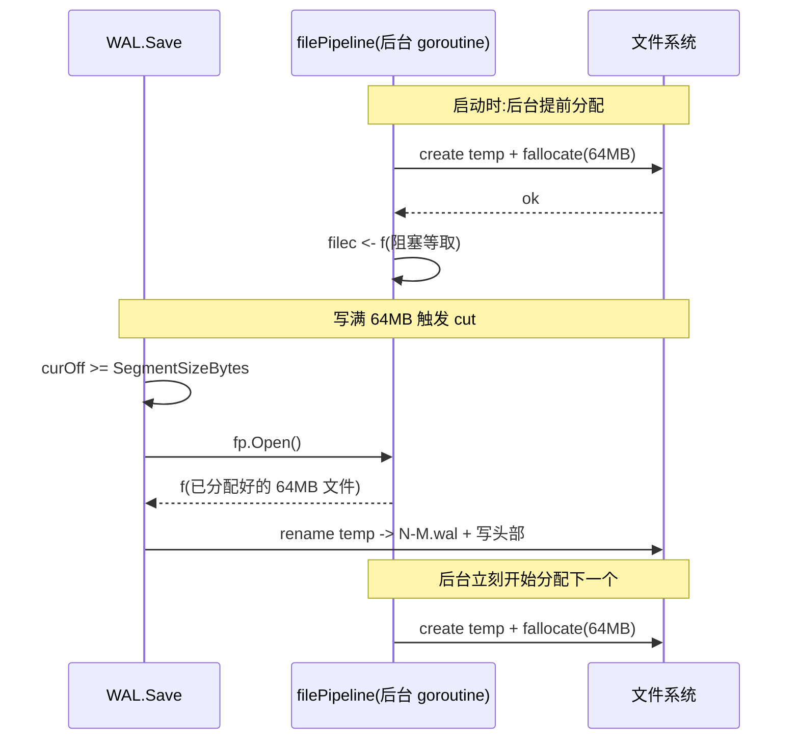

# 第十七章 · WAL:Raft 日志的持久化

> 篇:P5 不丢不乱:WAL、Snapshot 与恢复
> 主线呼应:前面四篇把一条 `Put` 讲到了 bbolt——共识过的写操作最终落进了单文件 B+tree。但这里有个被反复按下、却一直没正面回答的问题:**Raft 状态机自己不碰磁盘**(P1-06 讲过 `etcd-raft` 是纯状态机,`Step`/`Tick`/`Advance` 全在内存里算),那"已 commit 的 entry 不能丢""currentTerm/votedFor 必须持久化"这些 P1-05 立下的 safety 硬要求,谁来兑现?答案就是本章的主角——**WAL(Write-Ahead Log)**。它是 `etcd-raft` 协议层和真实磁盘之间那条桥,把"协议算完、状态机吐出 `Ready`"翻译成"字节落进文件、崩溃后还能读回来"。P0-01 里 `raftNode.start()` 循环那一行 `r.storage.Save(rd.HardState, rd.Entries)`([raft.go:256](../etcd/server/etcdserver/raft.go#L256)),落地的就是它。

## 核心问题

**`etcd-raft` 只管协议、不碰磁盘,那么 Raft 的日志、term、vote 谁来持久化?——etcd 的 WAL。WAL 把每一条 raft entry 和 HardState 以"带 CRC 的 record"追加写进分段的预分配文件,崩溃后靠 CRC 识别撕裂的尾巴、截断到上一个完整记录,保证重启时只重放完整数据。**

读完本章你会明白:

1. WAL 为什么是 `etcd-raft`(纯状态机)和磁盘之间的**必备桥梁**——它对应 P1-05 哪条 safety 要求。
2. 一条 WAL **record 怎么编码**(length 字段 + protobuf 的 type/crc/data + 8 字节对齐 padding),凭什么这么编。
3. **CRC 凭什么识别崩溃撕裂**——以及为什么 etcd 的 CRC 是**累积式**的、只覆盖 data。
4. 为什么要分 **segment**、为什么切下一段时要靠 **file_pipeline 后台预分配**文件,而不是现用现分配。
5. WAL 尾部写一半崩溃了,**repair** 怎么把它截断回最后一个完整 record。

> **如果一读觉得太难**:先只记住三件事——
> ① WAL 是个追加写的日志文件,raft 每产出一条 entry 或更新一次 term/vote,就追加一条 record;
> ② 每条 record 后面跟一个 CRC,重启读它时如果 CRC 对不上,说明上次崩溃写了一半,这里往后全丢掉;
> ③ 文件写到 64MB 就切下一个,下一个文件是后台提前 `fallocate` 好的,免得切换时卡顿。
> 这三件事撑起了"已 commit 的 entry 不丢"在工程上的落地。

---

## 17.1 一句话点破

> **WAL 是 etcd 把"`etcd-raft` 只算协议不碰磁盘"和"持久化是 Raft safety 硬要求"这两件事桥接起来的工程层。它把 raft 状态机吐出来的 `HardState`(term/vote/commit)和 `Entries`(日志条目)以 length-prefixed、CRC 校验、8 字节对齐的 record 顺序追加到磁盘文件上,并在文件写到 64MB 时切换到一个由后台 goroutine 预分配好的新 segment。重启时反着来:按 record 逐条 decode,CRC 一旦对不上就判定上次崩溃在尾部写了一半,从这里截断,只重放完整的部分。**

这是结论,不是理由。本章倒过来拆:先看为什么需要它,再看 record 怎么编码,再看 segment 和预分配,最后看崩溃修复。

---

## 17.2 为什么必须有一层 WAL:`etcd-raft` 不碰磁盘

回到第 1 篇立下的规矩。P1-05 讲 Raft 安全性时,有一条铁律:

> **`currentTerm`、`votedFor`、`log[]` 这三样必须持久化(响应 RPC 前先落盘),否则崩溃会丢已 commit 的数据,破坏 leader 完整性。**

这是 Raft 论文第 5 节白纸黑字写的、也是 etcd-raft 的 [`tla/`](../etcd-raft/tla) TLA+ 规约里要求的不变式。但你在 `etcd-raft` 仓里翻烂源码也找不到一处 `os.Create`、`file.Write`、`fsync`——它**就是一个纯状态机**:`Step` 收消息改状态、`Tick` 推进逻辑时钟、`Advance` 推进 commitIndex,所有的 entry/term/vote 都待在内存里的 `raftLog`(分 unstable/stable 两段)。它对外只有一个出口——`Ready` 结构体,把"要持久化的 entry""要发的消息""要 apply 的 entry""要存的 snapshot"打包交出来(P1-06 详讲)。

> **不这样会怎样**:如果协议层自己写盘,它就得绑定一个具体的 IO 实现——文件?裸设备?网络块设备?测试时怎么 mock?库就被焊死了。`etcd-raft` 之所以能被 etcd、TiKV(用 Rust 重写的 TiKV Raft 库)、CockroachDB、Hybrid Logic Clock 等等复用,正是因为它**只算协议、不碰 IO**,把"怎么落盘"的决定权留给上层。这是"库 + 应用"解耦的核心(第 6 章反复强调过)。

那"持久化是 safety 硬要求"谁来兑现?上层。在 etcd 里,这个上层就是 `server/storage/wal` 这一层。

看衔接的代码。`etcdserver/raft.go` 的 `raftNode.start()` 循环里,从 `Ready` channel 拿到一批就绪输出之后,会调([raft.go:256](../etcd/server/etcdserver/raft.go#L256)):

```go
// gofail: var raftBeforeSave struct{}
if err := r.storage.Save(rd.HardState, rd.Entries); err != nil {
    r.lg.Fatal("failed to save Raft hard state and entries", zap.Error(err))
}
```

这里的 `r.storage` 是 [`storage`](../etcd/server/storage/storage.go#L46-L53) 这个封装,它的 `Save` 方法直接转发给 [`w.Save`](../etcd/server/storage/wal/wal.go#L958)([storage.go:92-96](../etcd/server/storage/storage.go#L92-L96)):

```go
// Save function saves ents and state to the underlying stable storage.
// Save MUST block until st and ents are on stable storage.
Save(st *raftpb.HardState, ents []*raftpb.Entry) error
```

注意接口注释那句 **"Save MUST block until st and ents are on stable storage"**——"stable storage"就是"已经 fsync 到磁盘"。这句话是 P1-05 那条 Raft safety 要求的**工程合同**:`etcd-raft` 不管落盘,但它要求上层在"stable"之后才能算数,上层(etcd)用 WAL 兑现这个承诺。

> **钉死这件事**:WAL 不是 etcd 的"性能优化",是 **Raft safety 的工程落地**。没有它,`etcd-raft` 协议算得再对,一旦进程崩溃,内存里的 term/vote/log 全没,重启后可能用旧 term 重新投票、用旧 log 覆盖新数据——leader 完整性这条 safety 直接破产。

那 WAL 具体怎么把 `HardState` 和 `Entries` 落盘?它不是直接把 protobuf 二进制一股脑写进去,而是包成一条条**记录(record)**。这就引出 record 的编码问题。

---

## 17.3 record 的编码:length + protobuf(type/CRC/data)+ 8 字节对齐 padding

WAL 文件本质是一串**顺序追加的 record**。一条 record 的逻辑结构是 [`walpb.Record`](../etcd/server/storage/wal/walpb/record.pb.go#L26-L33) 这个 protobuf:

```go
type Record struct {
    Type *int64  `protobuf:"varint,1,opt,name=type"`  // 记录类型(MetadataType/EntryType/StateType/CrcType/SnapshotType)
    Crc  *uint32 `protobuf:"varint,2,opt,name=crc"`   // 这条记录的 CRC(只覆盖 Data)
    Data []byte  `protobuf:"bytes,3,opt,name=data"`  // 载荷(序列化后的 entry / hardstate / metadata / snapshot)
}
```

record 类型在 [wal.go:39-43](../etcd/server/storage/wal/wal.go#L39-L43) 定义成 5 种:

```go
const (
    MetadataType int64 = iota + 1   // 1:WAL 元信息(clusterID/nodeID 等),写在每个 segment 头部
    EntryType                        // 2:一条 raft 日志 entry
    StateType                        // 3:HardState(term/vote/commit)
    CrcType                          // 4:特殊的"重置 CRC"记录,不是数据
    SnapshotType                     // 5:snapshot 占位记录(snapshot 本体在 .snap 文件,这里只存 index/term)
)
```

但写进文件时,不是光写这个 protobuf——还要在外面套一层 **length 前缀 + 8 字节对齐 padding**。一条 record 在磁盘上的实际布局是:

```
 ┌────────────────┬────────────────────────────────────────────┬──────────┐
 │ length(8 字节) │   protobuf 序列化的 Record(type/crc/data)   │ padding  │
 │   (含 pad 信息) │                                            │(0~7 字节) │
 └────────────────┴────────────────────────────────────────────┴──────────┘
       ↑                          ↑                                    ↑
   little-endian           recBytes = len(proto)               padBytes 凑成
    uint64                                                    (recBytes+padBytes)
                                                             是 8 的倍数
```

**length 字段的精妙编码**:它不是单纯的"record 字节数",而是把 record 长度和 padding 长度**塞进同一个 uint64**(见 [encoder.go:100-108](../etcd/server/storage/wal/encoder.go#L100-L108)):

```go
func encodeFrameSize(dataBytes int) (lenField uint64, padBytes int) {
    lenField = uint64(dataBytes)
    // force 8 byte alignment so length never gets a torn write
    padBytes = (8 - (dataBytes % 8)) % 8
    if padBytes != 0 {
        lenField |= uint64(0x80|padBytes) << 56   // 把"有 padding"的标志位 + padBytes 塞进最高字节
    }
    return lenField, padBytes
}
```

也就是说,8 字节 length 字段的**低 56 位存 record 的字节数**(最多 2^56,够用了),**最高字节的最高位(MSb)是"是否有 padding"的标志位,高字节的低 3 位存 padding 字节数**(padding 最大 7,正好 3 位)。读回来在 [decoder.go:157-166](../etcd/server/storage/wal/decoder.go#L157-L166) 反解:

```go
func decodeFrameSize(lenField int64) (recBytes int64, padBytes int64) {
    // the record size is stored in the lower 56 bits of the 64-bit length
    recBytes = int64(uint64(lenField) & ^(uint64(0xff) << 56))
    // non-zero padding is indicated by set MSb / a negative length
    if lenField < 0 {  // MSb 置 1 时,有符号 int64 为负
        // padding is stored in lower 3 bits of length MSB
        padBytes = int64((uint64(lenField) >> 56) & 0x7)
    }
    return recBytes, padBytes
}
```

> **不这样会怎样**:为什么要费这个劲搞 8 字节对齐?注释里那行 **"force 8 byte alignment so length never gets a torn write"** 是答案。磁盘的一个扇区通常是 512 字节(或 4K),操作系统写一个 8 字节的 length 字段**可能因为断电而在写到一半时被打断**(torn write)——比如只写进了前 4 字节,后 4 字节还是旧的。如果 length 字段不对齐,你读到一半的 length 就会拿到一个完全错误的值,后面所有 record 全错位。把 length 强制对齐到 8 字节边界、并让 record 起点也落在 8 字节边界,加上后面 PageWriter 进一步按 4096 字节页对齐(见 17.4),torn write 顶多让"最后一条 record 的 data 部分撕裂",而 length 字段本身要么完整要么全 0(预分配的空洞),**不会被撕成半新的半旧的**。这是用对齐换来的崩溃隔离。

写一条 record 的完整路径在 [`encoder.encode`](../etcd/server/storage/wal/encoder.go#L66-L98)(简化示意,保留关键步骤):

```go
func (e *encoder) encode(rec *walpb.Record) error {
    // ...
    e.crc.Write(rec.Data)                       // ① 先把 data 喂给累积 CRC
    rec.Crc = new(e.crc.Sum32())                // ② 把当前累积 CRC 值写进 record.Crc 字段
    data := proto.Marshal(rec)                  // ③ 序列化整条 Record(type + crc + data)
    data, lenField := prepareDataWithPadding(data)  // ④ 算 padding,把 data 尾部补 0,生成 lenField
    return write(e.bw, e.uint64buf, data, lenField) // ⑤ 写 8 字节 lenField,再写 data+padding
}
```

注意第 ③ 步:序列化的是**整条 Record**,包括 `type`、`crc`、`data` 三个字段。`crc` 字段里存的是"截止到这条 record 的 data 为止的累积 CRC"——这点 17.4 单独拆。

读回来在 [`decoder.decodeRecord`](../etcd/server/storage/wal/decoder.go#L88-L155):先读 8 字节 length,反解出 recBytes 和 padBytes,再读 `recBytes+padBytes` 字节,`proto.Unmarshal` 出 Record,然后校验 CRC。任何一步对不上,这条 record 就判废。

---

## 17.4 CRC 凭什么识别崩溃撕裂——而且为什么是累积式

CRC 是 WAL 对抗崩溃撕裂的核心武器。但 etcd 的 CRC 设计有两个反直觉的地方,必须讲清,否则你会觉得"每条 record 自己算自己的 CRC 不就完了"。

### 17.4.1 CRC 只覆盖 data,不覆盖 type/crc/length

看 [encoder.go:74](../etcd/server/storage/wal/encoder.go#L74):

```go
e.crc.Write(rec.Data)        // 只喂 data
rec.Crc = new(e.crc.Sum32()) // 累积 CRC 存进 record.Crc 字段
```

读回来对应 [decoder.go:132-138](../etcd/server/storage/wal/decoder.go#L132-L138):

```go
// skip crc checking if the record type is CrcType
if rec.GetType() != CrcType {
    _, err := d.crc.Write(rec.Data)              // 同样只喂 data
    if err := rec.Validate(d.crc.Sum32()); err != nil {
        // ... CRC 对不上,报错 ...
    }
}
```

为什么不连 type、length 一起算进 CRC?

- **type 和 length 在读写流程里已经被独立校验了**:type 必须是已知的 5 种之一(`switch rec.GetType()` 里 default 分支会报 "unexpected block type"),length 已经靠 8 字节对齐隔离了 torn write。
- **CRC 自己不能算自己**:`rec.Crc` 字段是在算完 CRC 之后才填进去的,当然不能把它算进 CRC 范围。
- **省事**:data 通常是 record 的大头,算 data 已经足够覆盖载荷完整性。

那 length 字段本身被 torn write 怎么办?这正是 17.3 那个 8 字节对齐要解决的——length 字段要么完整、要么全 0(读到全 0 就当 EOF,见 17.6)。data 部分被撕裂则由 CRC 兜住。

### 17.4.2 CRC 是累积式的,不是每条独立

这是最容易看走眼的地方。看 [`crc.New`](../etcd/pkg/crc/crc.go#L35):

```go
// Modified by xiangli to take a prevcrc.
func New(prev uint32, tab *crc32.Table) hash.Hash32 { return &digest{prev, tab} }
```

注意它接受一个 `prev` 初值。`Write` 实现是 `crc32.Update(d.crc, d.tab, p)`——标准 CRC 库的 update 接口,它把已有 CRC 当作继续计算的起点。也就是说,decoder 里那个 `d.crc` 是**一条 record 接一条 record 累积着算的**,第 N 条 record 校验时的 `d.crc.Sum32()` 是"data[0] ++ data[1] ++ ... ++ data[N]"整体的 CRC,而不是第 N 条 data 单独的 CRC。

那问题来了:既然 decoder 是累积算的,encoder 写进 `rec.Crc` 字段的也得是累积值,否则对不上。看 encoder 那两行——`e.crc.Write(rec.Data)` 把 data 喂进**同一个累积 CRC 哈希**,然后 `e.crc.Sum32()` 就是截止当前 record 的累积 CRC,写进 `rec.Crc`。读写两边都用累积值,对得上。

> **不这样会怎样**:为什么不用每条 record 独立 CRC(只算 data[i])?朴素想法是"独立 CRC 更简单"。但累积 CRC 有一个独立 CRC 没有的能力——**它能防"中间插入/删除/篡改 record"**。如果有人(或者磁盘故障)在 WAL 中间插了一条伪造的 record,或丢了一条 record,独立 CRC 是查不出来的(每条都自洽);但累积 CRC 从被篡改点开始,后面所有 record 的累积值都会偏,decoder 会立刻在第一条 CRC 对不上的 record 处停下。这是个比"单条完整"更强的完整性保证——它把整个 WAL 变成一条**链式校验链**。

但累积 CRC 也带来一个工程麻烦:**跨 segment 时累积值怎么传?** 17.5 讲 segment 切换时会看到,etcd 的做法是在每个 segment 开头写一条 `CrcType` 记录,把"上一个 segment 结束时的累积 CRC"显式存进去,decoder 读到 `CrcType` 时用 `decoder.UpdateCRC(rec.GetCrc())` 重置 CRC 哈希的初值([decoder.go:205-207](../etcd/server/storage/wal/decoder.go#L205-L207)),从而跨文件衔接上这条链。

> **钉死这件事**:WAL 的 CRC 是**只覆盖 data、跨整条 WAL 累积**的链式 CRC。它既兜住了"record 的 data 被撕裂"的尾部崩溃,也兜住了"中间被插/删 record"的更隐蔽损坏。读 WAL 时,CRC 一对不上,从这条 record 往后全部丢弃(因为后续累积值都不可信)。

---

## 17.5 segment 分段:为什么 64MB 一段,而不是一个大文件

WAL 不是一个大文件长到天荒地老,而是被切成一个个 **segment(段)**,每段是一个独立的 `.wal` 文件。segment 大小是个导出变量([wal.go:55](../etcd/server/storage/wal/wal.go#L55)):

```go
// SegmentSizeBytes is the preallocated size of each wal segment file.
SegmentSizeBytes int64 = 64 * 1000 * 1000 // 64MB
```

注意这里是 `64 * 1000 * 1000`,不是 `64 * 1024 * 1024`——etcd 用的是 1000 进制的 64MB(对标网络/磁盘厂商的 MB),实际约 61 MiB。这是个历史选择,不影响逻辑,但读源码时别被绕进去。

segment 文件名长这样:`0000000000000000-0000000000000000.wal`,前 16 位十六进制是 **seq**(段的序号,从 0 递增),后 16 位是 **index**(这段开头存的第一个 raft entry 的 index)。命名和解析在 [util.go:102-112](../etcd/server/storage/wal/util.go#L102-L112):

```go
func walName(seq, index uint64) string {
    return fmt.Sprintf("%016x-%016x.wal", seq, index)
}
func parseWALName(str string) (seq, index uint64, err error) {
    // ...
    _, err = fmt.Sscanf(str, "%016x-%016x.wal", &seq, &index)
    return seq, index, err
}
```

切换 segment 的逻辑在 [`WAL.cut`](../etcd/server/storage/wal/wal.go#L748-L830),触发点是 `Save` 里发现当前文件 offset 超过 `SegmentSizeBytes`([wal.go:985-999](../etcd/server/storage/wal/wal.go#L985-L999)):

```go
curOff, err := w.tail().Seek(0, io.SeekCurrent)
if err != nil { return err }
if curOff < SegmentSizeBytes {
    if mustSync { return w.sync() }   // 还没满,只需 fsync
    return nil
}
return w.cut()   // 满了,切下一段
```

`cut()` 干几件事([wal.go:748-830](../etcd/server/storage/wal/wal.go#L748-L830),简化示意):

1. 把当前文件 truncate 到实际写入位置(预分配的 64MB 里有空闲尾巴,要切掉)、fsync;
2. 从 `filePipeline` 拿一个**已经预分配好**的新文件(见 17.6),rename 成正式的 `.wal` 文件名;
3. 往新文件头部写:① 一条 `CrcType` 记录,存"上一段结束时的累积 CRC",作为这段 CRC 链的起点;② 一条 `MetadataType` 记录(每个 segment 头都重复写元信息,这样单读一段也有上下文);③ 一条 `StateType` 记录(当前 HardState 快照,恢复时直接拿);
4. 重新建 encoder,CRC 用上段的累积值接上。

> **不这样会怎样**:为什么不干脆一个大文件追加到底?
> - **旧 segment 可以被回收/释放**:`ReleaseLockTo`([wal.go:867-908](../etcd/server/storage/wal/wal.go#L867-L908))在 snapshot 之后能释放旧 segment 的文件锁,snapshot 之前的旧 segment 也能整体删掉(配合 P5-18 的日志截断)。一个大文件要回收前半部分,要么重写要么靠 sparse file,都麻烦。
> - **读时可以按 index 跳到对应段**:`searchIndex`([util.go:41-53](../etcd/server/storage/wal/util.go#L41-L53))靠文件名里的 index 二分定位,恢复时不用从头扫整个 WAL。
> - **文件系统友好**:很多文件系统对超大文件的处理(备份、复制、删除)不如对中等大小文件顺手;64MB 是个工程上很舒服的尺寸(Kafka 的 segment 默认 1GB,etcd 更保守,因为它面向配置场景,日志量小)。
>
> 反面对比"无限大文件":每次 snapshot 之后要 truncate 文件头部、文件锁一直占着、跨节点拷贝 WAL 给新加入的 member 时一个文件扛到底——每一条都是工程麻烦。

那 64MB 这个数字怎么来的?够大(不会频繁切段)、够小(单段崩溃损失有限、文件操作快)。etcd 团队选它是个经验值,代码注释也明说"实际可能略大"——因为 `cut` 是在 `Save` 结束后判断的,可能写超过 64MB 一点点才切。

---

## 17.6 预分配文件流水线(file_pipeline):把抖动挪到后台

segment 切换有个隐形陷阱:`cut` 要从无到有创建一个 64MB 的新文件,这个动作在 Linux 上要调 `fallocate`(或者 `posix_fallocate`)给文件分配磁盘块。**磁盘块分配是慢操作**——文件系统要找空闲块、更新元数据、可能还要等磁盘 fsync 元数据。如果这个动作发生在 `Save` 的关键路径上,每次切段都会有一次明显的延迟尖刺。

etcd 的解法是 [`filePipeline`](../etcd/server/storage/wal/file_pipeline.go#L28-L41):一个**后台 goroutine**,在 WAL 还没切到下一段之前,就提前把下一个 64MB 文件 `fallocate` 好,放在 channel 里等 `cut` 来取。

```go
type filePipeline struct {
    lg     *zap.Logger
    dir    string
    size   int64           // = SegmentSizeBytes = 64MB
    count  int
    filec  chan *fileutil.LockedFile  // 无缓冲:预分配好的文件从这里交出去
    errc   chan error
    donec  chan struct{}
}
```

后台 goroutine `run`([file_pipeline.go:90-106](../etcd/server/storage/wal/file_pipeline.go#L90-L106))的逻辑非常简单:

```go
func (fp *filePipeline) run() {
    defer close(fp.errc)
    for {
        f, err := fp.alloc()         // ① 创建 + fallocate 一个 64MB 临时文件
        if err != nil { fp.errc <- err; return }
        select {
        case fp.filec <- f:           // ② 阻塞等 cut 来取(无缓冲 channel)
        case <-fp.donec:              // ③ WAL 关闭时退出
            os.Remove(f.Name()); f.Close(); return
        }
    }
}
```

`alloc`([file_pipeline.go:75-88](../etcd/server/storage/wal/file_pipeline.go#L75-L88))创建临时文件名(用 `count%2` 复用名字,避免堆积),调 `fileutil.Preallocate` 把 64MB 真正分配下去:

```go
func (fp *filePipeline) alloc() (f *fileutil.LockedFile, err error) {
    fpath := filepath.Join(fp.dir, fmt.Sprintf("%d.tmp", fp.count%2))
    if f, err = createNewWALFile[*fileutil.LockedFile](fpath, false); err != nil {
        return nil, err
    }
    if err = fileutil.Preallocate(f.File, fp.size, true); err != nil {  // 关键:提前分配
        // ...
    }
    fp.count++
    return f, nil
}
```

`cut` 要新文件时,直接从 channel 取([wal.go:766-769](../etcd/server/storage/wal/wal.go#L766-L769)):

```go
newTail, err := w.fp.Open()   // 阻塞等 filec,拿到一个已经分配好的文件
```

而 `fp.Open` 就是([file_pipeline.go:62-68](../etcd/server/storage/wal/file_pipeline.go#L62-L68)):

```go
func (fp *filePipeline) Open() (f *fileutil.LockedFile, err error) {
    select {
    case f = <-fp.filec:    // 拿预分配好的
    case err = <-fp.errc:   // 或者拿后台分配失败的错误
    }
    return f, err
}
```

注意 `filec` 是**无缓冲 channel**(`make(chan *fileutil.LockedFile)`)。这是刻意设计的:后台 goroutine 拿到 `filec <- f` 时会阻塞,直到 `cut` 取走。这保证了**任何时候最多只有一个预分配好的文件躺在那里等**——既避免了堆积浪费磁盘,又保证了 `cut` 来取时大概率立刻有(因为上一个文件被取走时,后台 goroutine 就立刻开始分配下一个了)。

> **不这样会怎样**:朴素的"用的时候才 fallocate"——每次 `cut` 触发,主写入路径阻塞在 `fallocate` 上几十到几百毫秒(取决于磁盘和文件系统)。这几十毫秒里,raft 的心跳、选举超时都可能在等。心跳延迟会让 follower 以为 leader 挂了发起选举;选举超时会让集群短暂脑裂选新主。**WAL 的延迟尖刺会直接传染到 raft 协议层的时序敏感逻辑**。
>
> 把分配挪到后台,`cut` 取的是"现成的"文件,几乎零等待。这是用"一个后台 goroutine + 一个 channel + 提前 64MB 磁盘空间"换来的写入平稳。它和 backend 的 batch 攒批(P4-14)、bbolt 的 mmap(P4-15)是同一类思路:**把不可避免的慢操作挪出关键路径**。

写到这里要提醒一个边界:`filePipeline` 只在 `cut` 切段时受益。平时每条 entry 的 `Save` 还是会走 `fdatasync`([wal.go:843-844](../etcd/server/storage/wal/wal.go#L843-L844))——这个 fsync 是**省不掉的**,因为 Raft 要求"持久化才能算数"。file_pipeline 优化的是"分配新文件"这次抖动,不是 fsync 本身。



---

## 17.7 fsync 的时机:`MustSync` 不盲目 fsync

`Save` 里有个细节值得点一句。每来一批就 fsync 太浪费(磁盘扛不住),一次都不 fsync 又违反 Raft safety。etcd 用 [`raft.MustSync`](../etcd-raft/rawnode.go#L191-L198) 决定到底要不要 fsync:

```go
func MustSync(st, prevst *pb.HardState, entsnum int) bool {
    // Persistent state on all servers:
    // (Updated on stable storage before responding to RPCs)
    // currentTerm
    // votedFor
    // log entries[]
    return entsnum != 0 || st.GetVote() != prevst.GetVote() || st.GetTerm() != prevst.GetTerm()
}
```

看注释,它正好对应 Raft 论文第 5 节那三样必须持久化的东西:**log entries、currentTerm、votedFor**。只有这三样里至少有一个变了,才真正 fsync;只有 commitIndex 变了(term/vote/entry 没变)不 fsync——因为 commitIndex 不是 Raft safety 要求的持久化项(它可以从 snapshot + log 重新推导)。

`Save` 里对应([wal.go:973-997](../etcd/server/storage/wal/wal.go#L973-L997),简化):

```go
mustSync := raft.MustSync(st, w.state, len(ents))

for i := range ents {
    if err := w.saveEntry(ents[i]); err != nil { return err }   // 先写所有 entry
}
if err := w.saveState(st); err != nil { return err }            // 再写 HardState

curOff, err := w.tail().Seek(0, io.SeekCurrent)
if curOff < SegmentSizeBytes {
    if mustSync { return w.sync() }   // 有 term/vote/entry 变化,fsync
    return nil                         // 只有 commit 变了,不 fsync
}
return w.cut()                         // 满了切下一段
```

> **钉死这件事**:这个 `MustSync` 函数不是 etcd 拍脑袋写的,它是 Raft 论文那段"Persistent state on all servers ... Updated on stable storage before responding to RPCs"的**直接代码翻译**。WAL 在工程上对 Raft safety 的兑现,精确到"哪些字段变了才必须 fsync"——多 fsync 浪费性能,少 fsync 破坏 safety,正好踩在这条线上。

还有个细节:写顺序是**先写 entries,再写 HardState**。为什么这么排?因为 Raft 要求"先持久化 entry,再持久化 commitIndex/term"。如果先写 HardState(里面带 commit=5)再写 entry,中途崩溃可能留下"commit=5 但 entry=4 还没落盘"的状态——重启后 commitIndex 推进到了 5,但 entry 5 不在,状态机一致性破坏。先 entry 后 state,即使崩在中间,最多是"entry 写进去了但 commitIndex 还是旧的",重启后重新走一遍 raft 流程,安全。

---

## 17.8 损坏修复(repair):截断到最后一个完整 record

讲完正常写入,看崩溃之后怎么办。崩溃可能发生在三种时刻:

1. **写 entry 数据写到一半**(data 撕裂):CRC 会校验失败,decoder 返回 `ErrCRCMismatch` 或 `io.ErrUnexpectedEOF`。
2. **写 length 字段到一半**(length 撕裂):因为 17.3 的 8 字节对齐,length 字段要么完整要么全 0;读到全 0 当 EOF 处理。
3. **写完 data 但没 fsync**:磁盘上还是预分配的 0,decoder 读到全 0 当 EOF。

前两种是 `io.ErrUnexpectedEOF`,decoder 会停下来。问题是停在哪里——etcd 的策略是:**截断到最后一个 CRC 校验通过的 record,把它后面的全部丢弃**。

看 [`Repair`](../etcd/server/storage/wal/repair.go#L32-L106)(简化示意):

```go
func Repair(lg *zap.Logger, dirpath string) bool {
    f, err := openLast(lg, dirpath)     // 只打开最后一个 segment
    // ...
    rec := &walpb.Record{}
    decoder := NewDecoder(fileutil.NewFileReader(f.File))
    for {
        lastOffset := decoder.LastOffset()    // ① 记住"下一条 record 开始的位置"
        err := decoder.Decode(rec)
        switch {
        case err == nil:
            continue                           // ② 这条 OK,继续
        case errors.Is(err, io.EOF):
            return true                        // ③ 正常 EOF,无需修复
        case errors.Is(err, io.ErrUnexpectedEOF):
            // ④ 撕裂!把损坏的尾巴备份,然后截断到 lastOffset
            bf, _ := createNewWALFile[*os.File](f.Name()+".broken", true)
            f.Seek(0, io.SeekStart); io.Copy(bf, f)   // 备份原文件
            f.Truncate(lastOffset)                    // 截断到最后一个完整 record 的末尾
            fileutil.Fsync(f.File)
            return true
        default:
            return false                        // 其他错误(如 CRC mismatch 不在 EOF 处),不修
        }
    }
}
```

关键点是 `decoder.LastOffset()`——它在成功 decode 一条 record 后,把 `lastValidOff` 推进到这条 record 的末尾([decoder.go:153](../etcd/server/storage/wal/decoder.go#L153)):`d.lastValidOff += frameSizeBytes + recBytes + padBytes`。Repair 在每次 decode 前记下这个 offset,decode 失败时就 truncate 回这个 offset——也就是"最后一个完整 record 的尾部",把它之后的所有半成品/0 字节全砍掉。

> **不这样会怎样**:如果不修,带着撕裂的尾巴重启,decoder 读到 CRC 错就 panic(看 17.9 的 `ReadAll`,write 模式下任何非 EOF 错误都直接返回错误),etcd 起不来。如果不修也不报错,半成品 record 会被当作合法数据重放进 raft 状态机——状态机被脏数据污染,后续 commit 全错。repair 把"可能损坏的尾巴"砍干净,只留确定完整的部分,这是用"少一两条 entry"换"状态机不被污染"——少的那一两条 entry,raft 重启后会从 leader 重新复制补回来(leader 完整性保证 leader 有它们)。

decoder 还有一个辅助判断 [`isTornEntry`](../etcd/server/storage/wal/decoder.go#L170-L203):把读到的 data 按 512 字节扇区切,如果**任意一个扇区全是 0**,就判定是 torn write(预分配的空洞没被实际数据覆盖)。这个判断让 decoder 在 unmarshal 失败时,能区分"这真的是撕裂"(返回 `io.ErrUnexpectedEOF`,可修复)和"数据真的坏了"(返回 CRC 错,不可修)——前者 repair 能处理,后者得人工介入。

还有一个细节在 `ReadAll` 里([wal.go:541-568](../etcd/server/storage/wal/wal.go#L541-L568)):write 模式下读到 EOF 后,会把 tail 文件从 `decoder.LastOffset()` 开始的所有字节**主动 zero 掉**(`fileutil.ZeroToEnd`)。原因是注释里说的:decoder 遇到 0 record 会返回 EOF,但这个 0 record 后面可能跟着上次没 sync 完的 torn write 残留——下次写新 record 覆盖一部分但不全部,会留下"半新半旧"导致下次 open 时 CRC 错。主动 zero 掉,保证下次写的起点是干净的。这是个非常细的工程坑,代码注释 [wal.go:556-567](../etcd/server/storage/wal/wal.go#L556-L567) 解释得很清楚。

---

## 17.9 启动重放(ReadAll):WAL 把磁盘交还给 raft

讲完写和修,看读。`ReadAll`([wal.go:471-594](../etcd/server/storage/wal/wal.go#L471-L594))是 etcd 启动恢复的核心(P5-19 会详讲整个恢复流程,这里只看它怎么把 record 还原成 raft 状态)。它就是个简单的循环,按 record 类型分发([wal.go:484-538](../etcd/server/storage/wal/wal.go#L484-L538),简化):

```go
for err = decoder.Decode(rec); err == nil; err = decoder.Decode(rec) {
    switch rec.GetType() {
    case EntryType:
        e := MustUnmarshalEntry(rec.Data)
        if e.GetIndex() > w.start.GetIndex() {
            ents = append(ents[:offset], e)   // 注意:可能覆盖未 commit 的 entry(Figure 7)
        }
    case StateType:
        state = MustUnmarshalState(rec.Data)
    case MetadataType:
        metadata = rec.Data
    case CrcType:
        // 校验累积 CRC,然后 UpdateCRC 衔接下一段
        decoder.UpdateCRC(rec.GetCrc())
    case SnapshotType:
        // 标记匹配的 snapshot(P5-18 详讲)
    }
}
```

注意 `EntryType` 那行 `ents = append(ents[:offset], e)`——它**可能覆盖**已有的 entry。这是对应 Raft 论文 Figure 7 的场景:leader 写了 entry 但没 commit 就崩了,新 leader 用不同的 entry 覆盖同一 index。重启时 WAL 里同一 index 可能有多条 entry(后写的盖前写的),`ReadAll` 忠实还原这个覆盖语义。代码注释 [wal.go:464-470](../etcd/server/storage/wal/wal.go#L464-L470) 明确写了这一点。

读出来的 `metadata`、`state`、`ents` 会被上层用来重建 raft 状态机——这正是 WAL 兑现"持久化 currentTerm/votedFor/log"的最终一步:**写时存,读时还原**。

---

## 17.10 技巧精解

这一章有两个最硬核的工程技巧,单独拆透。

### 技巧一:length 字段的 8 字节对齐 + padding 复合编码

**问题**:WAL 每条 record 前面有个 8 字节的 length 字段,告诉 decoder 后面 record 有多少字节。但崩溃可能让这个 8 字节写到一半被打断(torn write),读到错误的 length 会让后面所有 record 全错位。

**朴素做法**:`length = uint64(len(data))`,直接 little-endian 写 8 字节。问题:length 字段不对齐,可能 4 字节新、4 字节旧,decoder 读到一个完全错误的值。

**etcd 的做法**([encoder.go:100-108](../etcd/server/storage/wal/encoder.go#L100-L108)):把 record 强制**对齐到 8 字节边界**(data 后面补 padding),让 length 字段永远落在 8 的倍数地址上。然后把 length 和 padding 信息**塞进同一个 uint64**:

- 低 56 位:record 的字节数(最多 2^56,绰绰有余);
- 最高字节的 MSb:"是否有 padding"的标志位;
- 最高字节的低 3 位:padding 字节数(0~7)。

```go
lenField = uint64(dataBytes)
padBytes = (8 - (dataBytes % 8)) % 8
if padBytes != 0 {
    lenField |= uint64(0x80|padBytes) << 56
}
```

**妙处**:

1. **一个 uint64 同时存了 length 和 padding**,decoder 一次 8 字节读就能拿到两个信息,不用额外的字段。
2. **8 字节对齐 + PageWriter 进一步 4096 字节页对齐**([encoder.go:36](../etcd/server/storage/wal/encoder.go#L36) `walPageBytes = 8 * minSectorSize = 4096`)——磁盘写是按扇区(512B 或 4K)做的,torn write 的最小单位是扇区。把 record 起点对齐到扇区边界,torn write 最多损坏最后一条 record 的 data,**绝不会把 length 字段撕成半新半旧**(length 要么在扇区里完整,要么整个扇区是预分配的 0)。这是用对齐换来的"崩溃隔离"——崩溃的损坏范围被限制在"最后一条 record 的 data 内",由 CRC 兜底。
3. **MSb 作为有符号 int64 的负数标志**([decoder.go:161](../etcd/server/storage/wal/decoder.go#L161) `if lenField < 0`)——decoder 用 `int64` 读 length,MSb 置 1 时它就是负数,一行判断就知道有没有 padding,不用位运算。这是个很巧的"借符号位当标志位"的小聪明。

**反面对比**:不对齐 + length 单独存——每次 torn write 都可能撕到 length,decoder 读到一个看起来合法但完全错误的 length,后面所有 record 错位,而且因为 length 本身没 CRC(它在 CRC 范围外),错误会一路传播到文件尾,整个 segment 报废。etcd 这个设计把"length 被撕"这个故障模式从根上消掉了。

### 技巧二:file_pipeline 的无缓冲 channel 流水线

**问题**:`cut` 切 segment 时要创建一个新的 64MB 文件并 `fallocate`,这个操作在关键写入路径上,慢且抖动。

**朴素做法**:`cut` 时同步 `os.Create` + `fallocate`。每次切段卡几十到几百毫秒,raft 心跳/选举时序被抖动传染。

**etcd 的做法**([file_pipeline.go](../etcd/server/storage/wal/file_pipeline.go)):一个后台 goroutine,提前把下一个文件分配好,放在**无缓冲 channel** `filec` 里等 `cut` 来取。

```go
fp := &filePipeline{
    // ...
    filec: make(chan *fileutil.LockedFile),   // 无缓冲!
    // ...
}
go fp.run()

func (fp *filePipeline) run() {
    for {
        f, _ := fp.alloc()                    // 创建 + fallocate(慢)
        select {
        case fp.filec <- f:                   // 阻塞,等 cut 取走
        case <-fp.donec: return
        }
    }
}
```

**妙处**:

1. **无缓冲 channel 保证"最多一个预分配文件在等"**。如果用带缓冲 channel(`make(chan ..., 1)` 以上),后台可能预分配一堆文件占磁盘;无缓冲让后台"取走一个才分配下一个",磁盘占用可控(最多多 64MB)。
2. **后台 goroutine 在 `cut` 取走文件的瞬间立刻开始分配下一个**——这样下次 `cut` 触发时,新文件大概率已经分配好了,`fp.Open()` 几乎零等待。这是经典的**流水线预取**:把慢操作(分配)和快操作(写入)并行,隐藏延迟。
3. **`count%2` 复用临时文件名**([file_pipeline.go:77](../etcd/server/storage/wal/file_pipeline.go#L77))——避免临时文件堆积,永远只有 `0.tmp` 和 `1.tmp` 两个名字轮换。
4. **`donec` 优雅退出**——WAL 关闭时 `close(donec)`,后台 goroutine 把已经分配但没用上的文件 `os.Remove` 删掉再退出,不残留垃圾。

**反面对比**:朴素的"用时才分配"——每次切段在 `Save` 关键路径上阻塞 `fallocate`,这个延迟直接传导给 raft,可能让心跳超时、触发不必要的选举。file_pipeline 用"一个 goroutine + 一个无缓冲 channel + 提前 64MB 磁盘空间",把这次抖动彻底挪出关键路径。这是 etcd 在"稳定压倒一切"的共识系统里,典型的**用后台资源换前台平稳**的工程取舍——和 backend 的 batch 攒批(P4-14)、bbolt 的 mmap 只读映射(P4-15)是同一脉思路。

---

## 章末小结

这一章把"WAL 是什么、怎么编码、怎么分段、怎么预分配、怎么修复"讲完了。回到全书二分法:WAL 属于**一致性**这一面——它不在协议层(`etcd-raft` 还是纯状态机,不碰磁盘),也不在应用层(mvcc/bbolt/watch),它是协议层和应用层之间那条"把 raft 的 safety 要求落地到磁盘"的桥。具体说,它兑现的是 P1-05 那条 **"currentTerm/votedFor/log 必须持久化"** 的 Raft safety 要求——`storage.Save` 接口注释那句 **"MUST block until st and ents are on stable storage"** 就是这条要求的工程合同,WAL 是履约方。

WAL 不存"业务数据"(那是 mvcc/bbolt 的事),它存的是**让 raft 能在崩溃后重新站起来**的最小必需:entry(日志条目)、HardState(term/vote/commit)、metadata(cluster 信息)、snapshot 占位记录(snapshot 本体在 `.snap` 文件,WAL 里只存 index/term,作为 raft log 和 snapshot 的衔接点——P5-18 详讲)。所以你会看到,即使 mvcc/bbolt 那边的"当前值"全丢,WAL 还在,raft 就能重新选主、重放日志、把状态机重建起来。

### 五个"为什么"清单

1. **为什么 `etcd-raft` 不自己持久化,要单独弄一层 WAL?** 因为 `etcd-raft` 是个可复用的纯状态机库(被 TiKV/CockroachDB 共享),碰磁盘就被 IO 实现焊死。它只算协议、吐出 `Ready`,把"怎么落盘"的决定权留给上层。etcd 用 WAL 兑现这个决定权——同时兑现 P1-05 的持久化 safety 要求。
2. **为什么 record 要 length-prefixed + protobuf(type/crc/data)+ 8 字节对齐 padding?** length 让 decoder 知道一条 record 多长;protobuf 让 type/crc/data 紧凑编码且可扩展;8 字节对齐 padding 让 length 字段不会被 torn write 撕成半新半旧——崩溃的损坏被限制在"最后一条 record 的 data 内",由 CRC 兜底。
3. **为什么 CRC 是累积式的、只覆盖 data?** 累积式让"中间插/删 record"也能被查出来(独立 CRC 查不出),只覆盖 data 是因为 type/length 已被独立校验、crc 不能算自己。跨 segment 时用 `CrcType` 记录衔接累积值。
4. **为什么要分 segment,还要后台预分配下一个文件?** 分段让旧 segment 能被回收(配合 snapshot)、按 index 跳读、文件系统友好;预分配把"创建 64MB 新文件"的 fallocate 抖动挪到后台 goroutine,`cut` 取的是现成文件,写入路径平稳——否则切段的延迟会传染给 raft 心跳/选举时序。
5. **崩溃撕裂了 WAL 尾部怎么办?** `Repair` 截断到最后一个 CRC 校验通过的 record(`decoder.LastOffset()`),把它之后所有半成品/0 字节砍掉。decoder 还有 `isTornEntry` 按 512 字节扇区判断是否撕裂,区分"可修复的 EOF"和"不可修复的 CRC 错"。少的那几条 entry,raft 重启后从 leader 重新复制补回来——leader 完整性保证 leader 有它们。

### 想继续深入往哪钻

- 想看完整的 record 编解码细节,读 [`encoder.go`](../etcd/server/storage/wal/encoder.go) 全文(很短,140 行)和 [`decoder.go`](../etcd/server/storage/wal/decoder.go) 全文。`isTornEntry` 那段([decoder.go:170-203](../etcd/server/storage/wal/decoder.go#L170-L203))是 torn write 识别的精华。
- 想看 file_pipeline 的并发设计,读 [`file_pipeline.go`](../etcd/server/storage/wal/file_pipeline.go)(106 行,极简)。配合 [`file_pipeline_test.go`](../etcd/server/storage/wal/file_pipeline_test.go) 看它怎么被测。
- 想看 repair 的真实崩溃恢复测试,读 [`repair_test.go`](../etcd/server/storage/wal/repair_test.go),里面有故意注入撕裂的场景。
- 想理解 `MustSync` 为什么只看 term/vote/entry、不看 commit,对照 Raft 论文第 5 节"Persistent state on all servers"那段,以及 [`etcd-raft/rawnode.go:191-198`](../etcd-raft/rawnode.go#L191-L198) 的注释。
- 想看 WAL 端到端的性能基准,读 [`wal_bench_test.go`](../etcd/server/storage/wal/wal_bench_test.go),它测了不同 record 大小、不同 fsync 策略下的吞吐。
- 延伸对比:LevelDB 的 WAL(log file)也用 length-prefixed record,但没 segment 概念(它按 log number 滚动);Kafka 的 segment 默认 1GB,也用预分配,但它面向吞吐不面向共识,所以没有 CRC 链。etcd 的 WAL 设计是"共识级 WAL"的典型。

### 引出下一章

WAL 把 raft 的 entry/term/vote 持久化下来了,但有个新问题:**raft 日志不能无限长**。一条 `Put` 就是一条 entry,跑一年的集群,WAL 会涨到几十 GB——重启时 `ReadAll` 要把每条 entry 重放进 raft 状态机,慢得不可接受,而且大部分旧 entry 早已经被 mvcc apply、值已经落在 bbolt 里了,没必要再重放。Raft 的解法是 **snapshot**:定期把"当前状态机"整体存盘,然后把 snapshot 之前的 raft log 截断掉——这样 WAL 只保留 snapshot 之后的 entry,重启时先加载 snapshot 恢复状态机,再重放 WAL 里 snapshot 之后的少量 entry。下一章 P5-18,我们看 snapshot 怎么触发、存哪、怎么和 WAL/raft log 衔接,以及 follower 怎么靠 snapshot 追上一个落后很多的 leader。
