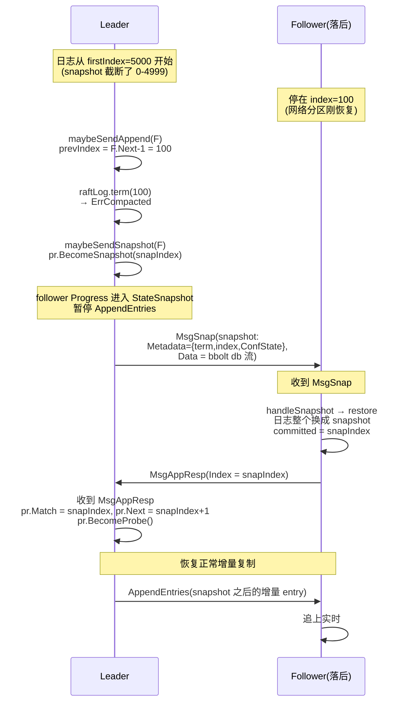

# 第十八章 · Snapshot 与日志截断

> 篇:P5 不丢不乱:WAL、Snapshot 与恢复
> 主线呼应:上一章(P5-17)我们把 WAL 讲透了——它把 `etcd-raft` 吐出来的 `HardState`(term/vote/commit)和 `Entries`(raft 日志)以带 CRC 的 record 追加写进分段的预分配文件,兑现了 P1-05 那条"currentTerm/votedFor/log 必须持久化"的 Raft safety 合同。但 WAL 留了一个口子没堵:**raft 日志会无限长**。一条 `Put` 就是一条 entry,跑一年的集群,WAL 会涨到几十 GB,重启时 `ReadAll` 要把每条 entry 都重放进 raft 状态机,慢得不可接受;而且 follower 一旦因为网络分区落后太多,leader 那边早已把旧 entry 截断掉了,follower 用 AppendEntries 永远也追不回来。本章的主角 **snapshot(快照)** 就是这两条隐患的解药。它属于**一致性**这一面——它不碰协议怎么达成一致(那是第 1 篇的事),它管的是"达成一致之后,日志和状态机怎么不无限膨胀、落后节点怎么追上"。

## 核心问题

**raft 日志不能无限长(WAL 越来越大、重启重放慢、follower 追不上)——怎么办?定期把"当前状态机的快照"存盘,把 snapshot 之前的 raft log entry 截断掉。snapshot 的触发条件是什么、截到哪(snapshot 的 index 之前的 entry 全可丢、对应 WAL segment 也可释放)?follower 落后太多,leader 怎么用 InstallSnapshot 把它追上,而不是一条一条 AppendEntries?**

读完本章你会明白:

1. **为什么必须截断 raft 日志**——不截断,WAL 爆盘、重启重放慢、落后 follower 永远追不上 leader;截断的依据是"snapshot 之前的 entry 已被状态机 apply,不再需要重放"。
2. **snapshot 的两层语义**:协议层(raftpb.Snapshot 的 Metadata:term/index/ConfState)和应用层(etcd 把 bbolt 的整个 db 文件当 Data,raftpb.Snapshot 只是个指针)。
3. **截断的边界**:raft log 截到 `compactIndex`(留 `SnapshotCatchUpEntries=5000` 条给慢 follower 兜底),WAL 释放 `ReleaseLockTo(index)` 之前的 segment(但保留最大的一个——给重启读 HardState 留个落点)。
4. **follower 落后到 leader 的 `firstIndex` 以下,leader 发 MsgSnap 把整个状态机快照传过去**(而非逐条 AppendEntries);follower 收到后 `restore`,日志被整个换成 snapshot。
5. **snapshot 的生成不阻塞写**:对 mvcc 取一个 revision 快照 + bbolt 的 `Snapshot()`(mmap 一致视图)异步算 hash,不锁正在进行的 raft 写。

> **如果一读觉得太难**:先只记住三件事——
> ① snapshot 是"状态机在某个 revision 的一张全景照",有了它,snapshot 之前的 raft entry 都可以丢(状态已经凝固在照片里了,不用重放);
> ② etcd 触发 snapshot 的默认阈值是每 apply 10000 条 entry(`SnapshotCount=10000`)触发一次,截断 raft log 时故意留 5000 条(`SnapshotCatchUpEntries`)给慢 follower 兜底;
> ③ follower 落后太多,leader 复制日志时发现 `pr.Next-1` 在已经截断的范围里(`term()` 返回 `ErrCompacted`),就改发 MsgSnap——把整张状态机快照传过去,follower 直接 `restore` 换日志。
> 这三件事把"日志怎么收敛"和"落后节点怎么追"两件事都堵上了。

---

## 18.1 一句话点破

> **snapshot 是一张"状态机在某个 revision 的全景照"。有了它,snapshot 之前的 raft entry 全部可以丢(状态已经凝固在照片里,不用再一条条重放);WAL 对应的旧 segment 也可以释放(给磁盘松绑)。etcd 每 apply 10000 条 entry 触发一次:取 mvcc 的当前 revision 做 snapshot 的逻辑元信息(raftpb.Snapshot.Metadata:term/index/ConfState),把整个 bbolt db 文件当 snapshot 的物理本体(.snap.db),分两路存盘。然后 raft log 截断到 `compactIndex = snapIndex - SnapshotCatchUpEntries`(故意留 5000 条给慢 follower),WAL 释放 `compactIndex` 之前的旧 segment(但保留最大的一个——重启时需要从里面读 HardState)。follower 落后到 leader 的 firstIndex 以下,leader 改发 MsgSnap 把整张照片传过去,follower 收到后 `restore` 把自己的日志整个换成 snapshot。**

这是结论,不是理由。本章倒过来拆:先看为什么必须截断,再看 snapshot 怎么生成、怎么存盘,再看 log 和 WAL 怎么跟着截,最后看 follower 怎么靠 snapshot 追上 leader。

---

## 18.2 为什么 raft 日志必须截断:三个不截断会撞的墙

P5-17 讲完 WAL,你可能有个直觉:raft 日志一条条追加写,简洁优美,CRC 兜底撕裂,看起来完美。但它有个致命缺陷——**它只会越来越长,从不缩短**。一个跑了一年的 etcd 集群,WAL 文件会涨到几十甚至上百 GB。这件事在三个地方同时塌方。

### 18.2.1 磁盘:WAL 爆盘

最直观的后果。每个 `Put`/`Delete`/`Txn` 都是一条 raft entry,每条 entry 都会被 P5-17 那套 record 编码追加进 WAL segment(每 64MB 切一段)。日志量与写入量成正比。Kubernetes 把 etcd 当唯一事实来源,event 雪崩、watch 风暴、controller 反复 reconcile 都会让 WAL 一天涨几个 GB。磁盘是有限的——任由 WAL 涨下去,总有一天写满磁盘,etcd 整个挂掉。

> **不这样会怎样**:不截断,磁盘早晚被 WAL 吃光,集群整体宕机。截断之后,旧 entry 已被 snapshot 凝固成状态,对应的旧 segment 可以删掉,磁盘占用稳定在"snapshot 之后那一小段"。

### 18.2.2 启动:重放慢到不可接受

第二个后果更隐蔽。P5-17 的 17.9 讲过,etcd 启动时 `ReadAll` 会把 WAL 里所有 entry 一条条 decode、重放进 raft 状态机。重放 1000 条 entry 是毫秒级,重放 1 亿条就是分钟级甚至小时级——而生产集群绝不允许这么长的启动窗口(配置中心每多宕机一分钟,Kubernetes 调度就瘫一分钟)。

但仔细想:WAL 里那些"很久以前的 entry",它们对应的状态机修改,**早就已经 apply 到 mvcc/bbolt 里了**——当前 bbolt 的 db 文件就是这些 entry 累积作用的最终结果。重放它们只是"重复 apply 一遍,得到和现在 bbolt 完全一样的状态"。**这是纯粹的浪费**。

> **所以这样设计**:把"当前状态机"整体存盘(snapshot),然后 snapshot 之前的 entry 全部丢掉——重启时先加载 snapshot(状态机直接恢复到 snapshot 那一刻),再只重放 snapshot 之后的少量 entry。重放量从"WAL 全长"降到"snapshot 到现在增量",启动从分钟级回到秒级。这是用"定期存一张大照片"换"启动不重放旧账"。下一章 P5-19 会详讲这两层联手恢复的完整流程。

### 18.2.3 follower:落后太多永远追不上

第三个后果最微妙,也最致命。看 P1-04 讲日志复制:leader 给 follower 发 AppendEntries,要先告诉 follower "prevLogIndex/prevLogTerm"(前一条 entry 的 index 和 term),follower 拿这个去自己日志里匹配,匹配上才追加新 entry。

问题:如果 follower 因为网络分区、GC 停顿、重启等原因落后了很久,比如 leader 已经写到 index=100000,而 follower 还停在 index=100。leader 想复制 index=101 开始的 entry,要先告诉 follower "prevLogIndex=100, prevLogTerm=..."。但**这个 prevLogIndex=100 的 entry 在 leader 那边可能早就被截断了**(假设 leader 在 index=5000 时做了一次 snapshot,截断后 leader 的日志从 index=5000 开始)。

如果 leader 不做任何额外处理,会发生什么?leader 调 `r.raftLog.term(100)` 去查 prevLogTerm,会拿到一个错误:`ErrCompacted`(见 [`log.go:398-400`](../etcd-raft/log.go#L398-L400))——这个 index 太旧,在 stable storage 里已经被压掉了。leader 现在有两个选择:

- **朴素选择**:让 follower 永远停留在 index=100,因为它够不着 leader 已经截断的部分 → 这个 follower **永远追不上**,等于永久掉队。
- **Raft 的选择**:leader 改发 **InstallSnapshot**——既然你已经够不着增量日志了,我直接把当前状态机整张照片传给你,你"原地满血复活"到 snapshot 那一刻,然后从 snapshot 之后继续增量追。

> **钉死这件事**:**snapshot 是日志复制协议的"兜底逃生通道"**。没有它,任何一个"落后超过 leader 保留窗口"的 follower 都会永久掉队,集群规模一旦扩张或网络抖动一次,就会有节点再也回不来。有了它,leader 检测到 follower 够不着就发 MsgSnap,一步把 follower 拉到 snapshot 这一刻,follower 接着增量追——落后再远也能追上。这是 snapshot 在协议层最不可替代的作用。

这三条压下来,"日志必须截断"已经不是优化,是 etcd 跑得起来的前提。那 snapshot 长什么样、怎么生成?

---

## 18.3 snapshot 的两层结构:协议层的 Metadata + 应用层的 bbolt db

讲生成之前,先把 snapshot 长什么样说清楚。etcd 的 snapshot 有**两层**,必须分清,否则后面讲 `MsgSnap` 传什么、`restore` 还原什么都会绕晕。

### 18.3.1 协议层:`raftpb.Snapshot` 只是元信息指针

先看 Raft 协议层的 snapshot 结构([`raft.pb.go`](../etcd-raft/raftpb/raft.pb.go)),protobuf 定义简化后是:

```go
type Snapshot struct {
    Data []byte              // 应用层 opaque 字节流(Raft 协议不解释)
    Metadata *SnapshotMetadata
}

type SnapshotMetadata struct {
    Index     *uint64        // 这张 snapshot 对应的最后一条 raft entry 的 index
    Term      *uint64        // 这条 entry 的 term
    ConfState *ConfState     // 集群成员配置(为了重启时重建 progress tracker)
}
```

注意 `Data` 是 `[]byte`——**Raft 协议层根本不知道里面装的是什么**。这是 Raft "复制日志 + 应用到状态机"模型的精髓:协议层只复制日志、只认 snapshot 的 Metadata(term/index/ConfState 是协议关心的);`Data` 是状态机的内部状态,协议层把它当不透明的字节流透传。这一点非常重要:`etcd-raft` 库不关心你的状态机是 KV、是图数据库、还是个状态机玩具,它只保证"snapshot 之前的 entry 已被这堆 `Data` 凝固"。

> **不这样会怎样**:如果协议层要解释 `Data`,就得绑死一种状态机实现——`etcd-raft` 就再也不能被 TiKV、CockroachDB 等复用。把 `Data` 留成 opaque 字节流,是"库 + 应用"解耦(P1-06 反复强调过)在 snapshot 这一面的延续。

那 etcd 的状态机是什么?mvcc + bbolt。所以 etcd 的 snapshot `Data`,本质就是 **bbolt 的整个 db 文件在某个 revision 的副本**。

### 18.3.2 应用层:etcd 把 bbolt db 文件当 snapshot 本体

但有个工程问题:bbolt db 文件可能几个 GB,直接塞进 `raftpb.Snapshot.Data` 这个 protobuf 字段里(`[]byte`),内存和序列化开销都受不了。etcd 的解法是**分离存盘**:

- snapshot 的**逻辑元信息**(`raftpb.Snapshot` 的 Metadata + 一点点 Data:把 v2 集群成员信息 `GetMembershipInfoInV2Format` 序列化成 `[]byte` 塞进 `Data`,为了向后兼容)单独存成一个 `.snap` 文件,带 CRC 校验。看 [`snapshotter.go:77-107`](../etcd/server/etcdserver/api/snap/snapshotter.go#L77-L107) 的 `save`:

```go
func (s *Snapshotter) save(snapshot *raftpb.Snapshot) error {
    fname := fmt.Sprintf("%016x-%016x%s", snapshot.Metadata.GetTerm(), snapshot.Metadata.GetIndex(), snapSuffix)
    b := pbutil.MustMarshalMessage(snapshot)              // 序列化 raftpb.Snapshot
    crc := crc32.Update(0, crcTable, b)                   // 算 CRC
    snap := snappb.Snapshot{Crc: &crc, Data: b}           // 套一层 snappb 外壳(带 CRC)
    d, err := proto.Marshal(&snap)
    // ...
    err = pioutil.WriteAndSyncFile(spath, d, 0o666)       // 写到 {term}-{index}.snap
    // ...
}
```

文件名 `000000000000000a-0000000000001388.snap` 就是 term=10、index=5000 的 snapshot。这套 `.snap` 文件就是 P5-17 提到的"WAL 里 SnapshotType record 指向的那个 snapshot 本体"——WAL 里只存 `{term, index, confState}` 三个字段(`walpb.Snapshot`,见 [storage.go:63-67](../etcd/server/storage/storage.go#L63-L67)),`.snap` 文件存完整 `raftpb.Snapshot`,真正的 bbolt db 副本在另一个 `.snap.db` 文件。

- snapshot 的**物理本体**(bbolt 的 db 文件副本)单独存成 `.snap.db` 文件,网络传输时**流式发送**(`io.Pipe` + `snapshot.WriteTo`),不一次性读进内存。看 [`snapshot_merge.go:32-57`](../etcd/server/etcdserver/snapshot_merge.go#L32-L57):

```go
func (s *EtcdServer) createMergedSnapshotMessage(m *raftpb.Message, snapt, snapi uint64, confState *raftpb.ConfState) *snap.Message {
    d := GetMembershipInfoInV2Format(lg, s.cluster)    // v2 成员信息(向后兼容)
    s.KV().Commit()                                     // 把 consistent_index 落盘
    dbsnap := s.be.Snapshot()                           // bbolt 的快照(COW,mmap 一致视图)
    rc := newSnapshotReaderCloser(lg, dbsnap)           // io.Pipe 流式读

    snapshot := &raftpb.Snapshot{
        Metadata: &raftpb.SnapshotMetadata{
            Index: &snapi, Term: &snapt,
            ConfState: proto.Clone(confState).(*raftpb.ConfState),
        },
        Data: d,                                        // v2 成员信息塞进 Data(小,向后兼容)
    }
    m.Snapshot = snapshot
    return snap.NewMessage(m, rc, dbsnap.Size())        // 消息 + 流式 db 读
}
```

这里有几个关键点:

- `s.be.Snapshot()` 调 bbolt 的 `Snapshot`——P4-16 讲过 bbolt 用 COW,这个调用拿到的是"当前 meta 页指向的一致视图",即使后续有写事务,这个快照看到的还是调用那一刻的状态。**这就是 snapshot 生成不阻塞正在进行的 raft 写的根本依据**(18.6 详讲)。
- `dbsnap.WriteTo(pw)` 在后台 goroutine 里把 db 一页页写出去,通过 `io.Pipe` 给网络层流式读——不一次性把几个 GB 读进内存。这是工程上对"protobuf `Data []byte` 装不下大状态"的标准解法。
- snapshot 的 Metadata 里塞了 `ConfState`(集群成员配置)——为了 follower 收到 snapshot 后能重建 progress tracker(P1-04 讲过 tracker 追踪每个 follower 的复制进度,snapshot 会把日志整个换掉,tracker 也得重置)。

> **钉死这件事**:etcd 的 snapshot 在**协议层**是 `raftpb.Snapshot`(Metadata + 小的 v2 Data),在**应用层**是 bbolt 的整个 db 文件副本。两者分两个文件存(`.snap` 和 `.snap.db`),网络传输时流式合并。Raft 协议层不碰 `Data` 内容,只看 Metadata 的 term/index/ConfState——这让 `etcd-raft` 库和具体状态机彻底解耦。

讲清结构,看生成。

---

## 18.4 snapshot 怎么触发:每 apply 10000 条 entry 存一张

snapshot 什么时候触发?答案藏在 etcdserver 的 apply 主循环里。P2-08 讲过,raft commit 的 entry 会被 apply 到 mvcc。每次 apply 完一批,etcdserver 会顺手检查一下"是不是该做 snapshot 了"——看 [`server.go:985`](../etcd/server/etcdserver/server.go#L985):

```go
s.snapshotIfNeededAndCompactRaftLog(ep)
```

这个函数([server.go:1204-1213](../etcd/server/etcdserver/server.go#L1204-L1213))干两件事:

```go
func (s *EtcdServer) snapshotIfNeededAndCompactRaftLog(ep *etcdProgress) {
    shouldSnapshotToDisk := s.shouldSnapshotToDisk(ep)
    shouldSnapshotToMemory := s.shouldSnapshotToMemory(ep)
    if !shouldSnapshotToDisk && !shouldSnapshotToMemory {
        return
    }
    s.snapshot(ep, shouldSnapshotToDisk)
    s.compactRaftLog(ep.appliedi)
}
```

触发条件是 [`shouldSnapshotToDisk`](../etcd/server/etcdserver/server.go#L1215-L1217):

```go
func (s *EtcdServer) shouldSnapshotToDisk(ep *etcdProgress) bool {
    return (s.forceDiskSnapshot && ep.appliedi != ep.diskSnapshotIndex) ||
        (ep.appliedi-ep.diskSnapshotIndex > s.Cfg.SnapshotCount)
}
```

`ep.appliedi` 是"已 apply 到 mvcc 的最后一条 entry 的 index",`ep.diskSnapshotIndex` 是"上次落盘 snapshot 对应的 index",`s.Cfg.SnapshotCount` 是阈值,**默认 10000**(见 [`server.go:78`](../etcd/server/etcdserver/server.go#L78) `DefaultSnapshotCount = 10000`)。

也就是:**自上次 snapshot 以来,又 apply 了超过 10000 条 entry,就触发下一次 snapshot**。比如上次 snapshot 在 index=5000,这次 apply 到了 index=15001,差值 10001 > 10000,触发。这是 etcd 最主要的触发路径。

> **不这样会怎样**:如果按"每条 entry 都 snapshot"——那 snapshot 太频繁,bbolt 拷贝 db 文件的开销会吃光吞吐。如果按"100 万条才 snapshot"——那 WAL 在两次 snapshot 之间会涨到几十万条,启动重放慢、follower 落后窗口大。10000 是个工程经验值,既让 WAL 不会太长,又让 snapshot 的拷贝开销不频繁到拖垮写。

还有一条"强制 snapshot"路径:`s.forceDiskSnapshot`(成员降级、版本降级时主动置位,见 [`ForceSnapshot`](../etcd/server/etcdserver/server.go#L1200-L1202))——这种情况下不管差多少条都立即 snapshot,因为集群配置变了,得把新配置凝固进 snapshot 的 ConfState。

还有一条**只在内存里做、不落盘**的 snapshot 路径([`shouldSnapshotToMemory`](../etcd/server/etcdserver/server.go#L1219-L1221),阈值 `memorySnapshotCount=100`)——这是给 raft `MemoryStorage` 留一份"内存 snapshot",让 leader 给落后 follower 发 MsgSnap 时能立刻拿到,不必等下一次落盘 snapshot。它不写 `.snap` 文件,只在 `MemoryStorage.snapshot` 字段里更新。

### 18.4.1 触发后:`snapshot` 函数干的三件事

触发后,调 [`s.snapshot(ep, shouldSnapshotToDisk)`](../etcd/server/etcdserver/server.go#L2072-L2126)(简化):

```go
func (s *EtcdServer) snapshot(ep *etcdProgress, toDisk bool) {
    d := GetMembershipInfoInV2Format(lg, s.cluster)       // ① v2 成员信息塞进 Data
    if toDisk {
        s.KV().Commit()                                   // ② 把 consistent_index 落盘(P4-14 讲过 batch)
    }

    // ③ 在 raft MemoryStorage 里创建 snapshot(取 appliedi 的 term/index)
    snap, err := s.r.raftStorage.CreateSnapshot(ep.appliedi, ep.confState, d)
    if err != nil {
        if errorspkg.Is(err, raft.ErrSnapOutOfDate) { return }  // 异步竞态:已经被更新的 snapshot 覆盖
        lg.Panic("failed to create snapshot", zap.Error(err))
    }
    ep.memorySnapshotIndex = ep.appliedi

    verifyConsistentIndexIsLatest(snap, s.consistIndex.ConsistentIndex())

    if toDisk {
        if err = s.r.storage.SaveSnap(snap); err != nil {   // ④ 落盘(.snap 文件 + WAL 的 SnapshotType record)
            lg.Panic("failed to save snapshot", zap.Error(err))
        }
        ep.diskSnapshotIndex = ep.appliedi
        if err = s.r.storage.Release(snap); err != nil {    // ⑤ 释放旧 WAL segment
            lg.Panic("failed to release wal", zap.Error(err))
        }
    }
}
```

这里每一步都值得拆:

**第 ③ 步 `CreateSnapshot`**——这是 `etcd-raft` 的 `MemoryStorage` 方法([storage.go:243-263](../etcd-raft/storage.go#L243-L263)):

```go
func (ms *MemoryStorage) CreateSnapshot(i uint64, cs *pb.ConfState, data []byte) (*pb.Snapshot, error) {
    ms.Lock()
    defer ms.Unlock()
    if i <= ms.snapshot.GetMetadata().GetIndex() {
        return nil, ErrSnapOutOfDate                         // 旧的 snapshot 请求,丢弃
    }
    offset := ms.ents[0].GetIndex()
    if i > ms.lastIndex() {
        getLogger().Panicf("snapshot %d is out of bound lastindex(%d)", i, ms.lastIndex())
    }
    ms.snapshot = pb.EnsureSnapshot(ms.snapshot)
    ms.snapshot.Metadata.Index = new(i)
    ms.snapshot.Metadata.Term = new(ms.ents[i-offset].GetTerm())   // 关键:term 从 ents[i-offset] 取
    if cs != nil {
        ms.snapshot.Metadata.ConfState = proto.Clone(cs).(*pb.ConfState)
    }
    ms.snapshot.Data = data
    return proto.Clone(ms.snapshot).(*pb.Snapshot), nil
}
```

注意 **`ms.snapshot.Metadata.Term = ms.ents[i-offset].GetTerm()`**——snapshot 的 term 不是"当前 term",而是 **index=i 那条 entry 自己的 term**。这条很重要:Raft 的 log matching property 要求"一条 entry 由 (term, index) 唯一标识",snapshot 也一样——它代表"log 在 (term=snapTerm, index=snapIndex) 这一刻的状态"。后面 follower `restore` 时,会把这条 (term, index) 当成"我的日志现在的最后一条",任何 prevLogTerm/prevLogIndex 匹配都以它为起点。

> **钉死这件事**:snapshot 的 (term, index) 来自被截断前那条 entry 自己——它不是凭空捏造的,它继承了 raft log 的"身份"。这一点保证了"snapshot 之后,follower 的日志身份和 leader 一致",后面 AppendEntries 的 log matching 才能继续。

**第 ④ 步 `SaveSnap`** 落盘(18.5 详讲),**第 ⑤ 步 `Release`** 释放旧 WAL(18.6 讲)。

讲完触发和生成,看 snapshot 怎么和 raft log 衔接——截断在哪。

---

## 18.5 截断到哪:raft log 截到 `compactIndex`,WAL 释放旧 segment

snapshot 生成完,接着是截断。看 [`compactRaftLog`](../etcd/server/etcdserver/server.go#L2128-L2159):

```go
func (s *EtcdServer) compactRaftLog(snapi uint64) {
    // 发送 snapshot 时暂停 compaction(给慢 follower 留追赶窗口)
    if s.inflightSnapshots.Load() != 0 {
        lg.Info("skip compaction since there is an inflight snapshot")
        return
    }

    compacti := uint64(1)
    if snapi > s.Cfg.SnapshotCatchUpEntries {
        compacti = snapi - s.Cfg.SnapshotCatchUpEntries    // 故意留 5000 条不截
    }
    err := s.r.raftStorage.Compact(compacti)
    if err != nil {
        if errorspkg.Is(err, raft.ErrCompacted) { return }
        lg.Panic("failed to compact", zap.Error(err))
    }
}
```

关键有两点。

### 18.5.1 截断边界:`compactIndex = snapIndex - SnapshotCatchUpEntries`

`SnapshotCatchUpEntries` 默认 **5000**(见 [`server.go:85`](../etcd/server/etcdserver/server.go#L85) `DefaultSnapshotCatchUpEntries uint64 = 5000`)。也就是:**snapshot 做在 index=15000,但 raft log 只截断到 index=10000,留 5000 条不截**。

> **不这样会怎样**:为什么要留 5000 条,而不是全截到 snapshot 的 index?考虑这个场景:leader 刚在 index=15000 做了 snapshot,raft log 现在从 15000 开始。这时一个 follower 网络分区恢复,它停在 index=14500。leader 看它的 `Next=14501`,想发 AppendEntries,prevLogIndex=14500——**这条 entry 在 leader 的 raft log 里还在**(从 15000 开始的 log 实际上保留了 14500,因为留了 5000 条),`term()` 调用能成功,follower 增量追上。
>
> 如果不留这 5000 条(直接截到 15000),leader 的 log 从 15000 开始,14500 那条 `term()` 返回 `ErrCompacted`,leader 只能走 MsgSnap——把整张状态机照片(可能几 GB)传给 follower。这比增量传几十条 entry 慢几个数量级。
>
> 注释 [`server.go:80-84`](../etcd/server/etcdserver/server.go#L80-L84) 写得明白:"We expect the follower has a millisecond level latency with the leader. The max throughput is around 10K. Keep a 5K entries is enough for helping follower to catch up."——5000 条 buffer 足以吸收"短暂网络抖动"这种最常见的落后场景,不必动不动就发重型 snapshot。

这是 snapshot 设计里非常关键的一个**冗余**:日志截断故意不截到头,留一段增量窗口给"轻微落后"的 follower。重型 snapshot 留给"严重落后"的 follower(18.7 详讲)。

### 18.5.2 截断实现:`MemoryStorage.Compact`

看 [`MemoryStorage.Compact`](../etcd-raft/storage.go#L268-L288):

```go
func (ms *MemoryStorage) Compact(compactIndex uint64) error {
    ms.Lock()
    defer ms.Unlock()
    offset := ms.ents[0].GetIndex()
    if compactIndex <= offset {
        return ErrCompacted                              // 已经截过了
    }
    if compactIndex > ms.lastIndex() {
        getLogger().Panicf("compact %d is out of bound lastindex(%d)", compactIndex, ms.lastIndex())
    }
    i := compactIndex - offset
    // NB: allocate a new slice instead of reusing the old ms.ents. Entries in
    // ms.ents are immutable, and can be referenced from outside MemoryStorage
    // through slices returned by ms.Entries().
    ents := make([]*pb.Entry, 1, uint64(len(ms.ents))-i)
    ents[0] = &pb.Entry{Index: new(ms.ents[i].GetIndex()), Term: new(ms.ents[i].GetTerm())}
    ents = append(ents, ms.ents[i+1:]...)
    ms.ents = ents
    return nil
}
```

注意 **截断后 `ents[0]` 是一条"占位 entry"**——它的 Index/Term 等于 compactIndex 那条 entry,但它**不是一条真正的日志条目**,它的作用是:**让 `ents[0]` 永远代表"截断点"**。这样 [`firstIndex()`](../etcd-raft/storage.go#L203-L205) 就是 `ents[0].Index + 1`(截断点的下一条),`term(i)` 对 `i < firstIndex()` 返回 `ErrCompacted`(已截断,够不着)。

这套"ents[0] 当 sentinel"的设计,让 raft log 的所有边界判断(能否 `term()`、能否 `slice()`)统一成"和 ents[0] 比位置"——简洁、不出错。

> **反面对比**:如果不留 sentinel,截断后 ents[0] 是第一条真实 entry,那"截断点"信息就丢了——`firstIndex()` 算不出来(只能用 ents[0].Index),`term(firstIndex-1)`(log matching 需要这条 term)也拿不到。Raft 协议里,leader 给 follower 发 AppendEntries 时需要 prevLogTerm = `term(prevLogIndex)`,而 prevLogIndex 可能正好是 `firstIndex - 1`(刚截断的边界)。sentinel 让这条 term 永远可查。

截断完 raft log(在 `MemoryStorage` 里),WAL 那边也要跟着释放旧 segment——不然磁盘还是没省下来。

### 18.5.3 WAL 释放旧 segment:`ReleaseLockTo` 保留最大的一个

`storage.Release`([storage.go:83-90](../etcd/server/storage/storage.go#L83-L90))干两件事:

```go
func (st *storage) Release(snap *raftpb.Snapshot) error {
    if err := st.w.ReleaseLockTo(snap.Metadata.GetIndex()); err != nil {
        return err
    }
    return st.s.ReleaseSnapDBs(snap)
}
```

`ReleaseSnapDBs` 删旧的 `.snap.db` 文件(那个 bbolt 副本),`ReleaseLockTo` 释放旧 WAL segment 的文件锁。看 [`WAL.ReleaseLockTo`](../etcd/server/storage/wal/wal.go#L863-L908),它的注释写得非常清楚:

```go
// ReleaseLockTo releases the locks, which has smaller index than the given index
// except the largest one among them.
// For example, if WAL is holding lock 1,2,3,4,5,6, ReleaseLockTo(4) will release
// lock 1,2 but keep 3. ReleaseLockTo(5) will release 1,2,3 but keep 4.
func (w *WAL) ReleaseLockTo(index uint64) error {
    // ... 遍历 w.locks(各 segment 的文件锁),按文件名里的 index 比较 ...
    var smaller int
    found := false
    for i, l := range w.locks {
        _, lockIndex, _ := parseWALName(filepath.Base(l.Name()))
        if lockIndex >= index {
            smaller = i - 1
            found = true
            break
        }
    }
    if !found {
        smaller = len(w.locks) - 1
    }
    if smaller <= 0 {
        return nil
    }
    for i := 0; i < smaller; i++ {
        if w.locks[i] == nil { continue }
        w.locks[i].Close()                                // 关闭旧 segment 的文件锁
    }
    w.locks = w.locks[smaller:]
    return nil
}
```

注意 **"except the largest one among them"**——保留 index 比给定值小的 segment 里**最大的那一个**。`ReleaseLockTo(4)` 在 lock 1,2,3,4,5,6 里,只释放 1,2,保留 3(3 是"index 比 4 小的里面最大的")。

> **不这样会怎样**:为什么要保留最大的一个不释放?看 P5-17 的 17.5:`cut` 切新 segment 时,会往新 segment 头部写一条 `StateType` 记录(当前 HardState),恢复时直接从最新 segment 头读 HardState,不用从头扫整个 WAL。如果释放了所有 index 比给定值小的 segment,最新保留的 segment 头可能没有 StateType 记录(它可能是在 snapshot 之后才切的,头部写的是 snapshot 之后的 HardState,没问题),但更保守的考虑是——**保留最大的旧 segment 作为"HardState 落点"的保险**。万一新 segment 头部的 StateType 因为某种原因不可读,还能从保留的旧 segment 尾部拿到最近一次完整的 HardState。这是用"多留一个 segment(64MB)"换"恢复时一定能找到 HardState"。

讲完截断,看 follower 怎么用 snapshot 追上 leader——这是 snapshot 在协议层最核心的应用场景。

---

## 18.6 follower 落后太多:leader 改发 MsgSnap(InstallSnapshot)

回到 18.2.3 那个场景:follower 停在 index=100,leader 日志从 index=5000 开始(snapshot 截断了)。leader 怎么发现、怎么处理?

### 18.6.1 发现:复制时 `term()` 返回 ErrCompacted

看 leader 复制日志的入口 [`maybeSendAppend`](../etcd-raft/raft.go#L618-L648):

```go
func (r *raft) maybeSendAppend(to uint64, sendIfEmpty bool) bool {
    pr := r.trk.Progress[to]
    if pr.IsPaused() {
        return false
    }

    prevIndex := pr.Next - 1
    prevTerm, err := r.raftLog.term(prevIndex)             // 查 follower 期望的下一条的前一条 term
    if err != nil {
        // The log probably got truncated at >= pr.Next, so we can't catch up the
        // follower log anymore. Send a snapshot instead.
        return r.maybeSendSnapshot(to, pr)                 // ← 够不着,改发 snapshot
    }
    // ... 否则正常发 AppendEntries ...
}
```

**关键判断在 `r.raftLog.term(prevIndex)`**。如果 `prevIndex < firstIndex`(follower 期望的 prevLogIndex 已经被 snapshot 截断了),`term()` 会返回 `ErrCompacted`(见 [`log.go:398-400`](../etcd-raft/log.go#L398-L400))。leader 一看这个错误,**立刻调 `maybeSendSnapshot` 改走 snapshot 路径**。

这就是"何时发 MsgSnap"的精确答案:**不是看 follower 落后多少条,而是看 leader 能不能给 follower 提供 prevLogTerm**。leader 给不了(因为那条 entry 已经截断),就只能发 snapshot。

### 18.6.2 发送:`maybeSendSnapshot` + `BecomeSnapshot`

看 [`maybeSendSnapshot`](../etcd-raft/raft.go#L666-L691):

```go
func (r *raft) maybeSendSnapshot(to uint64, pr *tracker.Progress) bool {
    if !pr.RecentActive {
        r.logger.Debugf("ignore sending snapshot to %x since it is not recently active", to)
        return false                                       // follower 不活跃,不发(避免无谓的大传输)
    }

    snapshot, err := r.raftLog.snapshot()
    if err != nil {
        if err == ErrSnapshotTemporarilyUnavailable { return false }
        panic(err)
    }
    if IsEmptySnap(snapshot) { panic("need non-empty snapshot") }
    sindex, sterm := snapshot.GetMetadata().GetIndex(), snapshot.GetMetadata().GetTerm()
    pr.BecomeSnapshot(sindex)                              // ← 把 follower 的 Progress 切到 StateSnapshot
    r.logger.Debugf("%x paused sending replication messages to %x [%s]", r.id, to, pr)

    r.send(&pb.Message{To: new(to), Type: pb.MsgSnap.Enum(), Snapshot: snapshot})
    return true
}
```

注意 **`pr.BecomeSnapshot(sindex)`**——把 follower 的 Progress 状态切到 `StateSnapshot`([progress.go:153-158](../etcd-raft/tracker/progress.go#L153-L158)):

```go
func (pr *Progress) BecomeSnapshot(snapshoti uint64) {
    pr.ResetState(StateSnapshot)
    pr.PendingSnapshot = snapshoti                        // 记录"正在传给它的 snapshot 的 index"
    pr.Next = snapshoti + 1                               // 期望 follower 下一条从 snapshot 之后开始
    pr.sentCommit = snapshoti
}
```

**进入 `StateSnapshot` 后,leader 暂停给这个 follower 发任何 AppendEntries**(`pr.IsPaused()` 在 StateSnapshot 下返回 true,`maybeSendAppend` 一进去就 return false)。这避免了"边传 snapshot 边传增量"的混乱——snapshot 没传完之前,增量 entry 发过去也没意义(follower 连 snapshot 都没收到,日志是空的)。

> **不这样会怎样**:如果不暂停,leader 一边传几 GB 的 snapshot,一边还在源源不断追加新的 AppendEntries——网络拥塞、follower 端日志序号混乱、snapshot 传到一半被增量 entry 覆盖……整个复制路径乱套。`StateSnapshot` 是个干净的"挂起增量,专心传 snapshot"的状态,传完再恢复增量。

### 18.6.3 follower 收到 MsgSnap:`restore` 把日志整个换成 snapshot

follower 这边的处理在 [`handleSnapshot`](../etcd-raft/raft.go#L1840-L1855):

```go
func (r *raft) handleSnapshot(m *pb.Message) {
    s := m.GetSnapshot()
    s = pb.EnsureSnapshot(s)
    sindex, sterm := s.GetMetadata().GetIndex(), s.GetMetadata().GetTerm()
    if r.restore(s) {                                       // 真正的还原
        r.logger.Infof("%x [commit: %d] restored snapshot [index: %d, term: %d]",
            r.id, r.raftLog.committed, sindex, sterm)
        // 关键:回 MsgAppResp,Index = lastIndex,告诉 leader "我现在的日志到这里了"
        r.send(&pb.Message{To: m.From, Type: pb.MsgAppResp.Enum(), Index: new(r.raftLog.lastIndex())})
    } else {
        // snapshot 比自己还旧(异步竞态),忽略,但仍回 MsgAppResp 报告当前 commit
        r.send(&pb.Message{To: m.From, Type: pb.MsgAppResp.Enum(), Index: new(r.raftLog.committed)})
    }
}
```

`r.restore(s)`([raft.go:1860-1942](../etcd-raft/raft.go#L1860-L1942))是核心,简化关键步骤:

```go
func (r *raft) restore(s *pb.Snapshot) bool {
    if s.GetMetadata().GetIndex() <= r.raftLog.committed {
        return false                                        // ① snapshot 比自己 commit 还旧,忽略
    }
    if r.state != StateFollower {
        // ② 防御:leader 不该收到 snapshot,收到说明出 bug,转 follower
        r.becomeFollower(r.Term+1, None)
        return false
    }
    // ③ 防御:自己不在 ConfState 里,忽略
    // ...

    // ④ 关键优化:如果自己日志已经包含 snapshot 的最后一条(term/index 匹配),
    //    说明只是落后一点,不用整个换日志,只 fast-forward commit
    id := entryID{term: s.GetMetadata().GetTerm(), index: s.GetMetadata().GetIndex()}
    if r.raftLog.matchTerm(id) {
        r.raftLog.commitTo(s.GetMetadata().GetIndex())
        return false
    }

    // ⑤ 真正还原:把日志整个换成 snapshot
    r.raftLog.restore(s)
    r.trk = tracker.MakeProgressTracker(...)               // ⑥ 重置 progress tracker
    cfg, trk, err := confchange.Restore(..., cs)           // 用 snapshot 的 ConfState 重建
    // ...
    return true
}
```

第 ④ 步是个重要优化:`matchTerm` 检查 follower 日志里有没有 (term=snapTerm, index=snapIndex) 这条 entry。如果有,说明 follower 其实只是 commit 落后了(日志本身是新的),不必整个换日志,只把 commitIndex 推到 snapIndex 就行。这避免了"网络抖动导致 leader 误判 follower 落后,发个 snapshot 把 follower 好好的日志覆盖掉"的浪费。

第 ⑤ 步 `r.raftLog.restore(s)`([log.go:466-470](../etcd-raft/log.go#L466-L470)):

```go
func (l *raftLog) restore(s *pb.Snapshot) {
    l.logger.Infof("log [%s] starts to restore snapshot [index: %d, term: %d]", l, s.GetMetadata().GetIndex(), s.GetMetadata().GetTerm())
    l.committed = s.GetMetadata().GetIndex()               // commit 推到 snapshot
    l.unstable.restore(s)                                   // 日志的 unstable 部分换成 snapshot
}
```

`unstable.restore`([log_unstable.go:192-198](../etcd-raft/log_unstable.go#L192-L198)):

```go
func (u *unstable) restore(s *pb.Snapshot) {
    u.offset = s.GetMetadata().GetIndex() + 1              // unstable 从 snapshot 之后开始
    u.offsetInProgress = u.offset
    u.entries = nil                                         // 旧的 unstable entries 全清
    u.snapshot = proto.Clone(s).(*pb.Snapshot)              // snapshot 成为新的"日志起点"
    u.snapshotInProgress = false
}
```

这一步之后,follower 的 raftLog **完全以 snapshot 为新起点**:`unstable.snapshot` 指向 leader 传来的 snapshot,`unstable.entries` 为空(等待 leader 后续 AppendEntries 填充),`committed = snapIndex`。

**最关键的一步是 follower 回 MsgAppResp**:`Index = r.raftLog.lastIndex()`(就是 snapIndex)。leader 收到这个 MsgAppResp,会 `maybeUpdate` 把 follower 的 `pr.Match` 更新到 snapIndex、`pr.Next` 更新到 snapIndex+1,然后 `pr.BecomeProbe()` 把 follower 从 `StateSnapshot` 切回正常复制状态——从此 leader 用 AppendEntries 给 follower 发 snapshot 之后的增量 entry,follower 追上实时。

### 18.6.4 snapshot 传输失败:`MsgSnapStatus` 让 leader 重试

网络传几 GB 的 snapshot 可能失败。etcd 用 `MsgSnapStatus` 反馈结果。看 leader 端处理([raft.go:1611-1628](../etcd-raft/raft.go#L1611-L1628)):

```go
case pb.MsgSnapStatus:
    if pr.State != tracker.StateSnapshot {
        return nil
    }
    if !m.GetReject() {
        pr.BecomeProbe()                                   // 成功,转 Probe 继续增量追
    } else {
        pr.PendingSnapshot = 0
        pr.BecomeProbe()                                   // 失败,也转 Probe,等下次心跳后再试
    }
    pr.MsgAppFlowPaused = true
```

无论成功失败,follower 都从 `StateSnapshot` 切回 `StateProbe`——成功了就接着增量追,失败了下次心跳再尝试发 snapshot。这是个干净的"snapshot 是一次性大动作,做完就回到正常复制状态"的设计。

讲完整个流程,用一个时序图把 leader 发 snapshot 到 follower 追上串起来。



---

## 18.7 snapshot 的两个衔接细节:WAL 写入顺序 + ApplySnapshot

到这里主流程讲完了。但 snapshot 和 WAL/raft log 的衔接还有两个工程细节,容易踩坑,单独点透。

### 18.7.1 snapshot 在 WAL 里的写入顺序:先 .snap 文件,后 WAL record

看 [`storage.SaveSnap`](../etcd/server/storage/storage.go#L59-L78):

```go
func (st *storage) SaveSnap(snap *raftpb.Snapshot) error {
    walsnap := walpb.Snapshot{
        Index:     snap.Metadata.Index,
        Term:      snap.Metadata.Term,
        ConfState: snap.Metadata.GetConfState(),
    }
    // save the snapshot file before writing the snapshot to the wal.
    // This makes it possible for the snapshot file to become orphaned, but prevents
    // a WAL snapshot entry from having no corresponding snapshot file.
    err := st.s.SaveSnap(snap)                              // ① 先写 .snap 文件
    if err != nil {
        return err
    }
    return st.w.SaveSnapshot(&walsnap)                      // ② 后写 WAL 的 SnapshotType record
}
```

注释那句"This makes it possible for the snapshot file to become orphaned, but prevents a WAL snapshot entry from having no corresponding snapshot file"是设计意图。两种崩溃时机:

- **① 写完 .snap 文件,还没写 WAL record,崩了**:重启时 `.snap` 文件在(孤儿),但 WAL 里没有对应的 SnapshotType record。P5-19 会详讲恢复流程——简单说,WAL 读出的 snapshot record 列表里没有这个 `.snap`,恢复时不会用它(读 WAL 的 `walSnaps` 列表,加载匹配的那个)。孤儿 `.snap` 文件浪费一点磁盘,但不破坏一致性。
- **② 先写 WAL record,还没写 .snap 文件,崩了**(假设反过来):WAL 里有个 SnapshotType record 指向 {term, index},但磁盘上没有对应的 `.snap` 文件。重启时按 WAL record 找 `.snap` 文件找不到,整个恢复流程崩——这是**致命的**。

所以 etcd 选了"先 .snap 后 WAL record":宁可孤儿(浪费),不可悬空(破坏恢复)。这是个典型的"崩溃安全顺序选择":两个相关写入,先写可独立存在的那个,后写依赖前者的那个。

再看 `WAL.SaveSnapshot`([wal.go:1002-1024](../etcd/server/storage/wal/wal.go#L1002-L1024)):

```go
func (w *WAL) SaveSnapshot(e *walpb.Snapshot) error {
    if err := walpb.ValidateSnapshotForWrite(e); err != nil { return err }
    b := pbutil.MustMarshalMessage(e)
    w.mu.Lock()
    defer w.mu.Unlock()

    rec := &walpb.Record{Type: new(SnapshotType), Data: b}
    if err := w.encoder.encode(rec); err != nil { return err }
    // update enti only when snapshot is ahead of last index
    if w.enti < e.GetIndex() {
        w.enti = e.GetIndex()                              // 更新"WAL 里最后一条 entry 的 index"
    }
    return w.sync()                                        // ← 立即 fsync!
}
```

两个细节:① `w.enti` 记录"WAL 里见过的最后一条 entry 的 index",snapshot 的 index 更新它,后面恢复时用它判断 raft log 的 lastIndex;② **`SaveSnapshot` 最后一定 `w.sync()`**——snapshot 是重大里程碑(之后旧 entry 要被截断),必须立即落盘,不能等下一次 batch。

### 18.7.2 `MemoryStorage.ApplySnapshot`:被 leader snapshot 覆盖

前面 18.6 讲的是 follower 的 raft 状态机收到 MsgSnap 后 `restore`,但 `restore` 只改了 `raftLog`(协议层)。真正的状态机(mvcc/bbolt)怎么被覆盖?这是 apply 流程干的,看 P2-08 的 apply 主循环:raft 的 `Ready` 里如果有 Snapshot,会通过 `applyc` 通道送给应用层,应用层调 [`applySnapshot`](../etcd/server/etcdserver/server.go#L995-L1138) 把 bbolt db 换成 snapshot 的 `.snap.db` 文件。这部分逻辑跨章,本章只点一下:`raftpb.Snapshot.Data` 流式落到 `.snap.db` 后,etcd 把 backend 切换到这个新 db,旧 db 丢掉。

`MemoryStorage` 自己也有个 `ApplySnapshot`([storage.go:218-237](../etcd-raft/storage.go#L218-L237))——这是协议层的"接受 snapshot 作为新日志起点":

```go
func (ms *MemoryStorage) ApplySnapshot(snap *pb.Snapshot) error {
    ms.Lock()
    defer ms.Unlock()
    snap = pb.EnsureSnapshot(snap)

    msIndex := ms.snapshot.GetMetadata().GetIndex()
    snapIndex := snap.GetMetadata().GetIndex()
    if msIndex != 0 && msIndex >= snapIndex {
        return ErrSnapOutOfDate                              // 旧 snapshot,拒绝
    }

    ms.snapshot = proto.Clone(snap).(*pb.Snapshot)
    ms.ents = []*pb.Entry{{Term: new(snap.GetMetadata().GetTerm()), Index: new(snap.GetMetadata().GetIndex())}}
    return nil
}
```

注意 **`ms.ents` 被换成只有一个 sentinel 的 slice**——它的 ents[0] 就是 snapshot 的 (term, index),和 18.5.2 讲的 Compact 后的形态一致。从这里开始,`MemoryStorage` 的 firstIndex 就是 `snapIndex+1`,lastIndex 就是 snapIndex——一切增量 entry 等待 leader 后续 AppendEntries 追加。

这就是"协议层和应用层对 snapshot 的双重接受":raft 状态机的 `restore`(协议层,改 raftLog)+ `MemoryStorage.ApplySnapshot`(协议层,改 ents)+ etcdserver 的 `applySnapshot`(应用层,换 bbolt db)。三层联动,follower 才算真正"满血复活"到 snapshot 那一刻。

---

## 18.8 技巧精解

这一章有两个最硬核的工程技巧,单独拆透。

### 技巧一:snapshot 与 raft log / WAL 的精确衔接——截到哪、留多少、凭什么

**问题**:snapshot 生成后,raft log 截到哪?WAL 释放哪些 segment?留给 follower 的增量窗口多大?这三个"边界"必须精确,否则要么浪费磁盘(snapshot 没截够),要么 follower 追不上(截得太狠),要么恢复时找不到 HardState(WAL 释放过头)。

**朴素做法**:snapshot 在 index=N,直接把 raft log 和 WAL 都截到 index=N。问题:follower 稍微落后一点(比如停在 N-100),leader 够不着 prevLogTerm,被迫发几 GB 的 snapshot——网络扛不住。

**etcd 的做法**:**三层不同边界,各司其职**。

| 层 | 截断/释放边界 | 凭什么 | 留多少 |
|---|---|---|---|
| raft log(MemoryStorage) | `compactIndex = snapIndex - 5000` | 给慢 follower 留增量窗口 | 留 5000 条(`SnapshotCatchUpEntries`) |
| WAL segment(`ReleaseLockTo`) | 释放 index < snapIndex 的 segment,**但保留最大的一个** | 给恢复时读 HardState 留落点 | 多留一个 64MB segment |
| snapshot 文件(`.snap` / `.snap.db`) | 永远保留最新的,旧的 `ReleaseSnapDBs` 删 | 恢复时需要最新的 snapshot | 只留最新的 |

这三个边界看着不同,其实有一条统一的设计哲学:**"截断是为了省资源(磁盘/内存),但永远要留够恢复和追赶所需的最小集合"**。

raft log 留 5000 条(`SnapshotCatchUpEntries`),代码注释 [`server.go:80-84`](../etcd/server/etcdserver/server.go#L80-L84) 解释:"We expect the follower has a millisecond level latency with the leader. The max throughput is around 10K. Keep a 5K entries is enough for helping follower to catch up."——这是基于"网络抖动导致的落后通常不超过 5000 条 entry"的工程经验。

WAL 保留最大的一个 segment,是为了让 `cut` 切新 segment 时头部写的 StateType 记录(P5-17 的 17.5 讲过)有备份——万一最新 segment 头不可读,还能从保留的旧 segment 拿 HardState。代价是多占 64MB 磁盘,换恢复的鲁棒性。

还有一个关键细节:**snapshot 的 (term, index) 继承自被截断的那条 entry**(`CreateSnapshot` 里 `Metadata.Term = ents[i-offset].GetTerm()`)。这条不变式保证了"snapshot 之后,leader 和 follower 的日志身份一致"——follower `restore` 后,它的 lastIndex=(snapTerm, snapIndex),和 leader 的"snapshot 截断点"身份完全相同,后续 AppendEntries 的 log matching 才能从 snapshot 之后无缝衔接。

```go
// CreateSnapshot 里,term 从 ents[i-offset] 取,不是用当前 term
ms.snapshot.Metadata.Term = new(ms.ents[i-offset].GetTerm())
```

**反面对比**:假设 snapshot 的 term 用"当前 term"而不是"那条 entry 的 term"——会发生什么?follower `restore` 后,lastIndex=(currentTerm, snapIndex)。但 leader 那边在 snapshot 截断点的 entry term 可能比 currentTerm 小(那条 entry 是几个 term 之前写的)。leader 给 follower 发 AppendEntries,prevLogTerm 用的是"那条 entry 的真实 term"(可能比 currentTerm 小),和 follower 的 lastIndex.term(=currentTerm)对不上——log matching 失败,follower 拒绝追加,leader 又得发 snapshot,死循环。**snapshot 的 (term, index) 必须是"被截断日志的身份",不能是"当前状态的身份"**——这是 Raft log matching property 在 snapshot 这一面的精确延续。

**还有个技巧**:follower 收到 MsgSnap 后,`restore` 之前的第 ④ 步 `matchTerm` 检查([raft.go:1911-1919](../etcd-raft/raft.go#L1911-L1919))——如果 follower 日志里已经有 (snapTerm, snapIndex) 这条 entry(只是 commit 落后了),**不整个换日志,只 fast-forward commit**。这是个非常聪明的优化:它避免了"网络抖动让 leader 误判 follower 落后,发个 snapshot 把 follower 完好的日志覆盖掉"的灾难。覆盖意味着 follower 已经 apply 的状态可能被一个旧 snapshot 覆盖——虽然 Raft 的 leader 完整性保证这不会丢已 commit 数据,但"白干一堆 apply 功"是实打实的浪费。`matchTerm` 这个检查用"和 snapshot 最后一条比对 term/index"就把这种浪费堵掉了。

### 技巧二:snapshot 的生成不阻塞写——靠 bbolt 的 COW 一致视图 + 异步

**问题**:生成 snapshot 要"对状态机取一个一致快照",但状态机(mvcc + bbolt)正在被 raft 的 apply 不断写入。朴素做法是"锁住状态机,拷贝,解锁"——但这会把 raft 写卡死几秒(几个 GB 的拷贝)。

**朴素做法**:`mu.Lock(); copyStateToSnapshot(); mu.Unlock()`。问题:拷贝几 GB 的 db 要几秒,这几秒里所有 raft 写都阻塞,leader 心跳超时,集群重新选举。这是把 snapshot 的成本直接砸在 raft 的时序敏感路径上。

**etcd 的做法**:用 bbolt 的 **COW(Copy-On-Write)+ mmap 一致视图**实现"无锁快照"。看 [`createMergedSnapshotMessage`](../etcd/server/etcdserver/snapshot_merge.go#L39):

```go
dbsnap := s.be.Snapshot()                                  // bbolt 的快照,不阻塞写
rc := newSnapshotReaderCloser(lg, dbsnap)                  // 后台 goroutine 流式读
```

`s.be.Snapshot()` 调 bbolt 的 `Snapshot`(P4-16 详讲)。bbolt 用 COW:写事务不改原页,复制新页写,提交时原子翻转 meta 页指针。`Snapshot()` 拿到的是"当前 meta 页指向的整棵 B+tree 的一致视图"——即使后续有写事务在改 B+tree(写新页、改 meta),这个 snapshot 看到的还是调用那一刻的状态(因为 meta 指针没翻,它指向旧页)。

> **凭什么不阻塞**:bbolt 的 COW 保证"读事务和写事务并发不锁"(P4-16 的核心技巧)。`Snapshot()` 本质是个"读事务 + 拿到 meta 页指针的副本",它不抢任何写锁。raft apply 继续往 bbolt 写新页、翻 meta,snapshot 安静地读它那一刻的旧 meta 指向的旧页——两者井水不犯河水。

然后 `newSnapshotReaderCloser` 用 `io.Pipe` 在后台 goroutine 里流式读 db:

```go
func newSnapshotReaderCloser(lg *zap.Logger, snapshot backend.Snapshot) io.ReadCloser {
    pr, pw := io.Pipe()
    go func() {
        n, err := snapshot.WriteTo(pw)                      // 后台 goroutine 把 db 一页页写进 pipe
        // ...
        pw.CloseWithError(err)
        err = snapshot.Close()
    }()
    return pr                                                // 主流程从 pipe 读,流式发送
}
```

网络层从 `pr` 读,后台 goroutine 往 `pw` 写——读和写**完全异步**,主流程的 raft 写路径一点不卡。

**和 mvcc 的 Hash 结合(P3-13)**:snapshot 还顺手算一个 hash 校验数据完整性。etcd 定期对 mvcc 算 hash(见 [`kvstore.go:156-165`](../etcd/server/storage/mvcc/kvstore.go#L156-L165) 的 `store.hash()`),它调 `s.b.ForceCommit()` 把 batch 里的写都落 bbolt,再算 `s.b.Hash(...)`——这个 hash 就是对"当前 bbolt 状态"的校验和。snapshot 时也可以算一个 hash 存进 snapshot 的 Metadata(或外部校验),恢复时重算 hash 比对,如果不一致说明磁盘有静默损坏(bit rot)。P3-13 详讲了这套 hash 机制,本章只点出:**snapshot 凝固的状态可以被 hash 校验,这是"snapshot 之前的 entry 已正确 apply"的独立证据**——不靠重放,靠哈希。

**反面对比**:朴素的"锁住拷贝"——snapshot 一次卡写几秒,集群抖动一次。etcd 用 COW 把"拷贝"变成"拿个指针 + 后台流式读",写路径零阻塞。这是 bbolt 的 COW 在 snapshot 这一面的红利——和它给读事务的红利(P4-16:读不阻塞写)是同一个机制,两个收益。这种"一个底层机制支撑多个上层场景"的设计,是优秀存储系统的标志。

---

## 章末小结

这一章把 snapshot 讲透了:它为什么必须(三个不截断会撞的墙)、长什么样(协议层 Metadata + 应用层 bbolt db)、怎么触发(每 apply 10000 条)、截到哪(raft log 留 5000 条、WAL 多留一个 segment)、follower 怎么靠它追上 leader(MsgSnap + restore)。回到全书二分法:snapshot 属于**一致性**这一面——它不在协议层(Raft 怎么达成一致是第 1 篇的事),也不在纯应用层(mvcc/bbolt 怎么存是第 3、4 篇的事),它是"协议层和应用层协作把日志和状态机收敛到有限大小"的工程层。具体说,它兑现的是"日志不能无限长"这条工程必需——没有 snapshot,WAL 爆盘、启动重放慢、落后 follower 永久掉队,etcd 跑不起来。

snapshot 把"snapshot 之前的 entry 已被状态机 apply、不再需要重放"这条逻辑事实,变成"可以把旧 entry 丢掉、把旧 WAL segment 释放"的工程动作。而它自己则成为新的"日志起点"——raft log 从 snapshot 之后开始,WAL 从 snapshot 对应的 segment 开始,启动恢复从 snapshot 加载状态机开始。下一章 P5-19 会把 WAL + snapshot 这两层联手恢复的完整流程串起来。

### 五个"为什么"清单

1. **为什么 raft 日志必须截断?** 三个后果:WAL 爆盘(磁盘有限)、启动重放慢(几十 GB 要重放几分钟)、落后 follower 永远追不上(leader 已截断的 entry 够不着)。snapshot 把"状态机在某 revision 的全景照"存下来,旧 entry 就不必再保留。
2. **snapshot 截到哪?为什么?** raft log 截到 `snapIndex - SnapshotCatchUpEntries`(留 5000 条给慢 follower 增量追);WAL 释放 index < snapIndex 的 segment(但保留最大的一个给恢复读 HardState);`.snap` / `.snap.db` 只留最新的。三层不同边界,统一哲学是"截断省资源但留够恢复和追赶所需"。
3. **follower 落后太多,leader 怎么发现、怎么处理?** leader 复制时 `raftLog.term(pr.Next-1)` 返回 `ErrCompacted`(prevLogIndex 已被截断),立刻改走 `maybeSendSnapshot`:把 follower 的 Progress 切到 `StateSnapshot`(暂停 AppendEntries),发 MsgSnap 把整张状态机快照传过去。follower `restore` 把日志整个换成 snapshot,回 MsgAppResp 报告 lastIndex,leader 接着增量追。
4. **snapshot 的 (term, index) 凭什么是"被截断那条 entry 的身份"而不是"当前 term"?** Raft 的 log matching property 要求 entry 由 (term, index) 唯一标识。snapshot 继承这个身份,follower `restore` 后它的 lastIndex 和 leader 的 snapshot 截断点身份一致,后续 AppendEntries 的 prevLogTerm 匹配才能从 snapshot 之后无缝衔接。用当前 term 会身份错位,follower 拒绝追加,死循环。
5. **生成 snapshot 为什么不阻塞 raft 写?** 靠 bbolt 的 COW:写事务不改原页(复制新页、提交时翻 meta 指针),`Snapshot()` 拿到的是"当前 meta 指向的旧页一致视图",不抢写锁。再用 `io.Pipe` 在后台 goroutine 流式读 db,主流程写路径零阻塞。这是 COW 在 snapshot 这一面的红利——和读事务不阻塞写(P4-16)是同一个机制。

### 想继续深入往哪钻

- 想看 snapshot 触发的完整代码路径,读 [`server.go:1204-1213`](../etcd/server/etcdserver/server.go#L1204-L1213)(`snapshotIfNeededAndCompactRaftLog`)、[`server.go:2072-2126`](../etcd/server/etcdserver/server.go#L2072-L2126)(`snapshot`)、[`server.go:2128-2159`](../etcd/server/etcdserver/server.go#L2128-L2159)(`compactRaftLog`)。
- 想看 InstallSnapshot 的协议层实现,读 [`raft.go:666-691`](../etcd-raft/raft.go#L666-L691)(`maybeSendSnapshot`)、[`raft.go:1840-1942`](../etcd-raft/raft.go#L1840-L1942)(`handleSnapshot` / `restore`)。配合 [`raft_test.go`](../etcd-raft/raft_test.go) 里 `TestRestore`、`TestSendSnapshot` 系列。
- 想看 snapshot 文件的存读,读 [`snapshotter.go`](../etcd/server/etcdserver/api/snap/snapshotter.go) 全文(很短),配合 [`snapshot_merge.go`](../etcd/server/etcdserver/snapshot_merge.go) 看 bbolt db 怎么流式合进 snapshot 消息。
- 想看 WAL 里 snapshot record 怎么和 .snap 文件衔接,读 [`wal.go:1002-1024`](../etcd/server/storage/wal/wal.go#L1002-L1024)(`SaveSnapshot`)、[`storage.go:59-90`](../etcd/server/storage/storage.go#L59-L90)(`SaveSnap` / `Release`),对照 P5-17 的 17.9 看 `ReadAll` 怎么把 SnapshotType record 读出来。
- 延伸对比:TiKV 的 Multi-Raft 每个 Region 都有自己的 raft log 和 snapshot,region 之间独立截断;CockroachDB 类似。单 Raft group 的 snapshot(Multi-Raft 之前)就是 etcd 这套。Raft 论文第 7 节讲 snapshot 的 log compaction,etcd 的实现是论文的直接落地。
- 想看 snapshot 在 TLA+ 规约里怎么建模,读 [`etcd-raft/tla/`](../etcd-raft/tla) 的 `Snapshot` 相关不变式。

### 引出下一章

讲完 WAL(P5-17)和 snapshot(本章),etcd 的两层持久化就齐了:**WAL 兜 raft 日志,snapshot 兜状态机**。但它们各自单独都不能完成恢复——WAL 重放需要 snapshot 提供起点(不然要从头重放几亿条 entry),snapshot 加载需要 WAL 补齐 snapshot 之后的增量(不然状态停在 snapshot 那一刻,丢掉之后的写)。下一章 P5-19,我们把这两层联起来,看 etcd 启动时怎么 `Recover`:读 WAL 拿到 snapshot record 列表 → 加载最新的 `.snap` 和 `.snap.db` → 用 walSnaps 匹配 → 从匹配点之后重放 WAL 的 entry → 重建 raft 状态机 → bootstrap cluster。两层各司其职,联手把状态恢复到最新一致——这是 etcd "崩溃不丢已 commit 数据"这条承诺的最终兑现。
