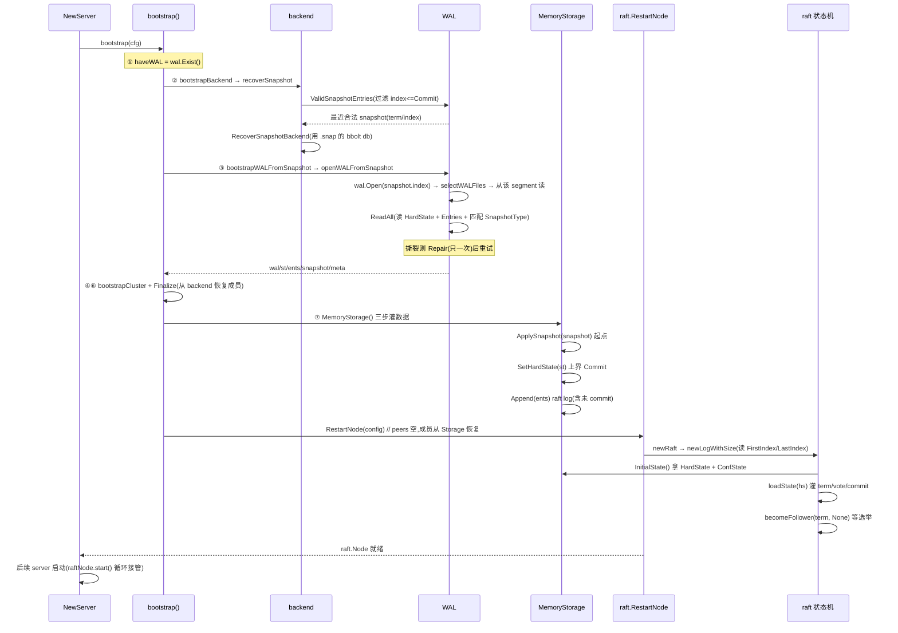

# 第十九章 · 启动恢复

> 篇:P5 不丢不乱:WAL、Snapshot 与恢复
> 主线呼应:前两章把 etcd 的两层持久化拆透了——P5-17 讲了 WAL 怎么把 raft 的 `HardState`(term/votedFor/commit)和 `Entries` 按 record 顺序追加进 64MB 的分段文件,P5-18 讲了 snapshot 怎么在某 revision 处给状态机拍一张完整快照、并用它的 `term/index` 截断旧 raft log。这一章回答一个一直被按下的问题:**进程崩溃了,重启那一刻,etcd 怎么靠这两层持久化联手把状态机恢复到最新一致?** 这不是"开机加载个文件"那么简单——它要同时回答两个对立的问题:**不能少**(少一条已 commit 的 entry 就是丢数据,违反 leader 完整性),**也不能多**(多 apply 一条没 commit 的 entry 就是状态机被脏数据污染,违反一致性)。WAL 给 raft 日志兜底,snapshot 给状态机兜底,两者靠 snapshot 的 `term/index` 衔接,共同把崩溃那一刻"已经达成共识、且只达成共识到那里"的状态精确重建。

## 核心问题

**etcd 崩溃重启,怎么把状态机恢复到"最新且一致"——读 snapshot 给状态机一个起点、读 WAL 重放 snapshot 之后的 raft entry、用 HardState.Commit 当 apply 的上界、重建 raft 状态机、bootstrap cluster 成员,最后启动 raft.Node?两层持久化(WAL 兜 raft 日志、snapshot 兜状态机)怎么分工配合,既不少 apply 一条已 commit 的 entry,也不多 apply 一条没 commit 的 entry?**

读完本章你会明白:

1. 为什么恢复必须**两层配合**——单靠 WAL(从头重放,慢且 WAL 早就被 snapshot 截断),或单靠 snapshot(丢掉 snapshot 之后的所有 entry),都不行。
2. snapshot 的 `metadata(term/index)` 是**两层衔接的唯一线索**——WAL 从这个 index 之后开始重放,既不重复也不漏。
3. 重放时 apply 的**上界是 `HardState.Commit`**——这是 Raft safety 在恢复期的工程兑现,多 apply 一条没 commit 的 entry 就可能被新 leader 覆盖,状态机就不一致了。
4. etcd 把启动恢复从 `NewServer` 抽到独立的 `bootstrap.go` 的工程理由——七步编排(backend → WAL → cluster → storage → raft)怎么把"WAL+snapshot 联手"翻译成"MemoryStorage 里一份完整的 raft 状态",再交给 `RestartNode` 让协议状态机重新站起来。

> **如果一读觉得太难**:先只记住三件事——
> ① snapshot 给状态机一个起点(某 revision 的完整快照),WAL 给 raft 一个续点(snapshot 的 term/index 之后的 entry),两者靠 snapshot 的 `term/index` 衔接;
> ② 重放时只 apply 那些 `index <= HardState.Commit` 的 entry,没 commit 的(可能只是被少数派复制)丢掉,因为它们可能被新 leader 覆盖;
> ③ 这套恢复流程在 etcd 主仓的 `server/etcdserver/bootstrap.go` 里,由 `bootstrap()` 函数编排,最终把数据灌进 `MemoryStorage`,再交给 `raft.RestartNode`。
> 这三件事撑起了"崩溃不丢已 commit 数据、也不让脏数据污染状态机"在工程上的落地。

---

## 19.1 一句话点破

> **启动恢复的本质,是把"WAL 兜 raft 日志、snapshot 兜状态机"这两层持久化,在崩溃那一刻的"已共识到这里"的精确边界,重新拼装成一份内存里的 raft 状态:snapshot 给状态机一个完整起点(某 revision 的快照,避免从空状态重放全部历史),WAL 从 snapshot 的 `term/index` 之后重放 entry 到最新;apply 的上界是 WAL 里最后一条 `HardState` 的 `Commit` 字段——没超过这条线的 entry,是新 leader 可能覆盖的"猜测",绝不能进状态机。两者靠 snapshot 的 `metadata(term/index)` 这个唯一坐标衔接,任何"少 apply 一条已 commit entry"或"多 apply 一条未 commit entry"都会破坏一致性。**

这是结论,不是理由。本章倒过来拆:先看为什么单层不够,再看两层怎么衔接,然后看 apply 上界为什么是 `HardState.Commit`,最后跟一遍 `bootstrap()` 的七步编排。

---

## 19.2 为什么单层持久化都不够

恢复的目标,是把进程在崩溃前那一瞬"已经达成共识的状态"在重启后**精确重建**。注意这两个词:**"已经达成共识"** 指 entry 被 majority 复制(可能已 commit,也可能只是被复制但 leader 还没标 commit),**"精确"** 指不能少也不能多。

先看两层各自单干为什么不行。

### 19.2.1 只有 WAL,没有 snapshot

假设我们激进一点,把 snapshot 整个去掉,只留 WAL。崩溃重启,要从最早的 WAL segment 一路重放到最新。这立刻撞上三个墙:

- **WAL 早就被截断了**。P5-18 讲过,snapshot 触发时会调 `ReleaseLockTo` 把 snapshot 之前的旧 WAL segment 删掉(或释放锁),只留 snapshot 之后的部分。所以"WAL 里有完整历史"是个错觉——只要集群跑过一次 snapshot(默认每 10000 条 entry 触发一次),早期 segment 就没了。从头重放?对不起,头已经没了。
- **就算 WAL 完整,重放也慢到不可接受**。一条 `Put` 就是一条 entry,跑一年的集群 WAL 可能几十 GB。`ReadAll` 要把每条 entry 反序列化、按 index 拼回 slice(`wal.go:489-501` 的 `ents = append(ents[:offset], e)`),内存和时间都顶不住。而大部分旧 entry 早已经被 apply、值已经落在 bbolt 里,根本没必要再重放。
- **WAL 重放出来的只是 raft 日志,不是状态机本身**。raft 日志是一串 `EntryType` 记录,要 apply 到 mvcc 才能变成"key→value"。从空 mvcc 重放全部历史,等于把过去一年的每次修改都重做一遍——慢,且 mvcc 的 compaction 早就把旧版本删了(你重放的 entry 可能引用已经不存在的 revision)。

> **不这样会怎样**:只有 WAL 没 snapshot,要么 WAL 被截断后根本恢复不了(丢数据),要么 WAL 没截断但重放慢到 etcd 起不来(可用性归零)。**snapshot 不是优化,是必需**——它给状态机一个"已经 apply 到这里"的完整起点,让 WAL 只需保留并重放 snapshot 之后的一小段。

### 19.2.2 只有 snapshot,没有 WAL

反过来,只留 snapshot、把 WAL 删掉呢?同样不行:

- **snapshot 是某一瞬间的状态机快照,它之后的所有 entry 都丢了**。snapshot 默认每 10000 条 entry 触发一次,意味着最近最多 10000 条 entry 还没被快照。这 10000 条里有已经 commit 但还没进入下一次 snapshot 的关键数据——比如刚刚 `Put` 进去的配置。WAL 没了,这些 entry 就永远丢了。
- **raft 的 `currentTerm`/`votedFor` 也没了**。snapshot 只存状态机数据(revision 之后的 mvcc 状态)和 `metadata(term/index)`,**不存** `currentTerm`/`votedFor`/`commit`。这三样是 P1-05 立下的 Raft safety 必须持久化项,全在 WAL 的 `StateType` 记录里。没有 WAL,重启后节点不知道自己是哪个 term、投过谁的票——它可能用旧 term 重新投票,破坏"一个 term 一个节点最多投一票"这条防同任期多主的铁律(P1-02 讲过)。

> **不这样会怎样**:只有 snapshot 没 WAL,snapshot 之后的所有 entry 永久丢失(数据丢),且 `currentTerm`/`votedFor` 没了,节点重启后可能破坏 Raft 选举 safety。**WAL 不是冗余,是 Raft safety 的工程落地**——它存的是"让 raft 能在崩溃后重新站起来"的最小必需。

所以恢复必须**两层配合**:snapshot 给状态机一个完整起点(已经是某 revision 的一致状态),WAL 给 raft 一个续点(snapshot 的 `term/index` 之后的 entry + 最新的 `HardState`)。这就引出下一节的核心问题:两层怎么衔接?

---

## 19.3 两层衔接的唯一线索:snapshot 的 `metadata(term/index)`

snapshot 和 WAL 是两个独立的东西:snapshot 本体是个 `.snap` 文件(存 mvcc 的 bbolt 快照 + `term/index/confState`),WAL 是一组 `.wal` segment 文件。它们怎么"衔接"?答案是 **snapshot 的 `metadata(term/index)` 这一对坐标**——它既是 raft log 里的一个位置(index,以及这个 index 对应的 term),也是状态机的一个 revision。

### 19.3.1 WAL 里也有一条 snapshot 记录

P5-17 讲 WAL 的 record 类型时,列过 5 种(`wal.go:39-43`):`MetadataType`、`EntryType`、`StateType`、`CrcType`、`SnapshotType`。其中 `SnapshotType` 这条记录**不存 snapshot 本体**(本体在 `.snap` 文件),只存一个 `walpb.Snapshot{Index, Term, ConfState}`——一个"raft log 在某个 index/term 处有一个 snapshot"的占位。

每次 etcd 存 snapshot 时,会做两件事:`storage.go` 的 `SaveSnap`([storage.go:60-78](../etcd/server/storage/storage.go#L60-L78))先调 `s.SaveDBFromSnap` 把 snapshot 本体写到 `.snap` 文件,再调 `w.SaveSnapshot(&walsnap)`([storage.go:77](../etcd/server/storage/storage.go#L77))把 `SnapshotType` 记录追加进 WAL。也就是说,**snapshot 的 `term/index` 这个坐标,在 WAL 里也有一条对应记录**。

这条 WAL 里的 snapshot 记录,是恢复时"两层衔接"的关键。重启读 WAL 时,decoder 会按顺序读出所有 record,包括这条 `SnapshotType` 记录。`ReadAll`([wal.go:524-533](../etcd/server/storage/wal/wal.go#L524-L533))里:

```go
case SnapshotType:
    var snap walpb.Snapshot
    pbutil.MustUnmarshalMessage(&snap, rec.Data)
    if snap.GetIndex() == w.start.GetIndex() {
        if snap.GetTerm() != w.start.GetTerm() {
            state.Reset()
            return nil, state, nil, ErrSnapshotMismatch
        }
        match = true
    }
```

`w.start` 是上层(`openWALFromSnapshot`)调用 `wal.Open` 时传入的 `walsnap`(即"我手上这个 snapshot 的 index/term"),decoder 读到一条 `SnapshotType` 记录时,要校验它和 `w.start` 是否匹配——index 必须相等、term 必须相等,否则报 `ErrSnapshotMismatch`。校验通过就置 `match = true`,表示"WAL 里确实找到了与这个 snapshot 对应的记录,衔接上了"。`ReadAll` 末尾([wal.go:571-573](../etcd/server/storage/wal/wal.go#L571-L573))还会检查这个 `match`,没匹配上就返回 `ErrSnapshotNotFound`——意思是"WAL 里根本没有你这个 snapshot 的记录,衔接失败"。

> **钉死这件事**:snapshot 和 WAL 的衔接,靠的是"两层都存了同一个 `term/index` 坐标"。snapshot 本体在 `.snap` 文件,WAL 里有一条 `SnapshotType` 记录标同一个坐标。恢复时,上层拿着 snapshot 的 `term/index` 去开 WAL,WAL 的 `ReadAll` 在读到对应 `SnapshotType` 记录时确认匹配,衔接才成立。

### 19.3.2 从 snapshot 的 index 之后开始重放

衔接上了,接着是重放。注意 `ReadAll` 处理 `EntryType` 时那行(`wal.go:486-501`,简化):

```go
case EntryType:
    e := MustUnmarshalEntry(rec.Data)
    if e.GetIndex() > w.start.GetIndex() {
        // ... 边界检查 ...
        offset := e.GetIndex() - w.start.GetIndex() - 1
        ents = append(ents[:offset], e)
    }
```

关键是那个 `if e.GetIndex() > w.start.GetIndex()`——**只收 index 严格大于 snapshot index 的 entry**。snapshot 之前的 entry 早就被截断了(P5-18 的 `ReleaseLockTo`),就算 WAL 里还残留(因为截断是按 segment 粒度,可能 snapshot 所在 segment 里还有更早的 entry),也直接跳过——它们的状态已经被 snapshot 完整覆盖,不需要重放。

`offset := e.GetIndex() - w.start.GetIndex() - 1` 这行把 entry 的全局 index 映射到 `ents` 这个 slice 的本地下标(0 起)。注意 `ents = append(ents[:offset], e)` 这个写法——它**不是简单的 append**,而是"在 offset 位置覆盖"。这正是 P5-17 末尾讲过的 Raft 论文 Figure 7 场景:leader 写了 entry 但没 commit 就崩了,新 leader 用不同的 entry 覆盖同一 index,WAL 里同一 index 可能有多条 entry,后写的盖前写的。`ReadAll` 忠实还原这个覆盖语义。

> **不这样会怎样**:如果重放时不过滤 `e.GetIndex() > w.start.GetIndex()`,会把 snapshot 之前已被截断的旧 entry 也读出来,它们和 snapshot 的状态冲突(状态机已经往前走了,你又把旧 entry apply 一遍,会把状态机往回拽)。这个过滤保证了:**重放只覆盖 snapshot 之后的 entry,snapshot 之前的所有事情已经被 snapshot 一笔兜底**。

衔接逻辑清楚了,接着是最关键的问题:重放出来的 entry,怎么知道哪些能 apply、哪些不能?

---

## 19.4 apply 的上界:`HardState.Commit`,为什么不能多 apply 一条

这是整个恢复流程里最容易被看走眼、也是最要命的一步。WAL 里读出来的 entry 列表 `ents`,里面**既有已 commit 的、也有没 commit 的**。恢复时只 apply 已 commit 的,没 commit 的丢掉(只留在 MemoryStorage 里给 raft 当 log 用,不进状态机)。

### 19.4.1 怎么区分已 commit 和没 commit

区分的依据,是 WAL 里读出来的最后一条 `HardState` 记录。`HardState`(`raftpb.HardState`)有三个字段:`Term`、`Vote`、`Commit`。其中 `Commit` 是"崩溃那一刻,raft 已经 commit 到哪个 index"。`ReadAll` 里([wal.go:504-505](../etcd/server/storage/wal/wal.go#L504-L505)):

```go
case StateType:
    state = MustUnmarshalState(rec.Data)
```

每读到一条 `StateType` 就覆盖 `state`——WAL 里同一个状态机可能有多个 `HardState` 记录(commit 单调推进,每次推进都写一条),`ReadAll` 取最后一条,也就是崩溃前最新的那个 `Commit`。

`ReadAll` 自己的 doc 注释([wal.go:469-470](../etcd/server/storage/wal/wal.go#L469-L470))明明白白写了这条规则:

```go
// ReadAll may return uncommitted yet entries, that are subject to be overridden.
// Do not apply entries that have index > state.commit, as they are subject to change.
```

翻译过来:"`ReadAll` 可能返回还没 commit 的 entry,它们可能被覆盖。**不要 apply 那些 `index > state.commit` 的 entry,因为它们可能变。**" 这条规则是 etcd 团队写给所有"上层用 WAL 恢复"的人的硬约束——它就是 Raft safety 在恢复期的工程合同。

### 19.4.2 为什么不能多 apply 一条没 commit 的 entry

这是本章的核心问题之一,值得单独拆。设想这样一个场景:

- 集群 3 节点(A、B、C),A 是 leader。
- A 收到客户端 `Put("x", "1")`,propose 成 entry 100,复制给 B,但还没收到 C 的确认(majority 没到,这 entry 没 commit)。这时 A 的 commit 还是 99。
- A 崩溃了。重启前,**entry 100 只在 A 和 B 的日志里,且没 commit**。
- C 当选新 leader(假设 C 的 log 是最新的——其实 C 的 log 比 A、B 短,但通过 PreVote 和选举限制,C 可能当选;或者 B 当选,B 的 log 有 entry 100 但 term 比 A 高)。

现在看两种恢复策略:

**错误策略(全量 apply)**:重启时把 WAL 里所有 entry 都 apply 到状态机,包括 entry 100。状态机里就有了 `x=1`。

**正确策略(只 apply 到 Commit=99)**:重启时只 apply 到 entry 99,entry 100 留在 raft log 里不 apply。状态机里没有 `x=1`。

为什么错误策略会出问题?因为 entry 100 **可能被新 leader 覆盖**。假设 C 当选新 leader(它的 log 没有 entry 100),C 收到客户端的新 `Put("x", "2")`,propose 成 entry 100'(同一 index,不同 term,不同 value),复制给多数派并 commit。这时 C 会发 AppendEntries 给 A 和 B,告诉它们"entry 100 的真正内容是 `x=2`"——Raft 的 log matching property 保证,A 和 B 必须把原来的 entry 100(`x=1`)覆盖成 entry 100'(`x=2`)。

如果 A 之前用错误策略 apply 了 entry 100(`x=1`),那 A 的状态机现在有 `x=1`;C 来覆盖时,A 要把 entry 100 改成 `x=2`,但 A 的状态机已经"apply 过" `x=1` 了——状态机没有"撤销"语义(mvcc 的 revision 是单调递增的,你不能把 revision 100 的值改掉)。A 就陷入了"状态机和 raft log 不一致"的死局。

正确策略就没这个问题:entry 100 留在 raft log 里,没 apply。C 来覆盖时,raft log 里的 entry 100 直接被覆盖成 entry 100',然后 apply entry 100',状态机干净地变成 `x=2`。

> **钉死这件事**:恢复时 apply 的上界是 `HardState.Commit`——这是崩溃前 raft 已经 commit 的位置。**没 commit 的 entry,只留在 raft log 里,不进状态机**。因为没 commit 的 entry 可能被新 leader 用同一 index 的不同 entry 覆盖(Raft 的 log matching + leader 完整性),状态机没有"撤销"语义,apply 了就收不回来。多 apply 一条没 commit 的 entry,等于把"可能被推翻的猜测"写进了状态机,违反一致性。

### 19.4.3 etcd 怎么兑现这条规则

etcd 主仓把"apply 上界 = Commit"这条规则,精确地拆成了**两个独立的动作**:

1. **重建 raft 状态机时,把 `HardState` 整个灌进 MemoryStorage**——包括 `Commit` 字段。这样 raft 状态机重启后,它的 `raftLog.committed` 就是崩溃前的值。
2. **状态机的 apply(把 entry 应用到 mvcc)走 raft 的正常 apply 流程**——raft 状态机自己保证只 apply 已 commit 的 entry(它会从 `raftLog.committed` 之后慢慢 apply,apply 完推进 `applied`)。恢复时**不**绕开 raft 自己 apply,而是让 raft 走正常流程。

换句话说,etcd 恢复时**不直接 apply WAL 里的 entry 到 mvcc**(那会绕过 raft 的 commit 检查),而是**把 WAL 的 entry 灌进 raft 的 MemoryStorage 当 log,把 `HardState`(含 Commit)灌进去当状态**,然后让 raft 状态机走正常的 apply 循环——raft 自己保证只 apply 到 Commit,不会越界。

这一步在 `bootstrappedWAL.MemoryStorage()`([bootstrap.go:701-713](../etcd/server/etcdserver/bootstrap.go#L701-L713))里三行搞定:

```go
func (wal *bootstrappedWAL) MemoryStorage() *raft.MemoryStorage {
    s := raft.NewMemoryStorage()
    if wal.snapshot != nil {
        s.ApplySnapshot(wal.snapshot)        // ① snapshot 给状态机一个起点
    }
    if wal.st != nil {
        s.SetHardState(wal.st)               // ② HardState(含 Commit)给 raft 一个 committed 上界
    }
    if len(wal.ents) != 0 {
        s.Append(wal.ents)                    // ③ WAL 的 entry 灌进 raft log(含已 commit 和未 commit)
    }
    return s
}
```

注意 `s.Append(wal.ents)` 这步——`wal.ents` 里**既有已 commit 也有没 commit 的 entry**(因为 `ReadAll` 不过滤),它们全部进 MemoryStorage 当 raft log。但 raft 状态机重启后,只会 apply 到 `Commit`(因为 `SetHardState` 设了这个上界),`Commit` 之后的 entry 留在 log 里不 apply,等新 leader 决定它们的命运。这就是 P5-18 末尾和 P5-17 末尾都埋过的伏笔——WAL 存"raft 知道的所有 entry",raft 状态机自己决定"apply 哪些"。

> **所以这样设计**:etcd 把"apply 上界"这件事交给 raft 状态机自己——它本来就是干这个的(P1-04 讲过 commitIndex 推进、P1-06 讲过 raft.Node 通过 `Ready.CommittedEntries` 只吐出已 commit 的)。恢复时不绕过 raft,而是把 WAL 的数据完整灌进 raft 的 MemoryStorage,让 raft 走正常流程。这保证了一致性:**只要 raft 状态机本身是对的(P1-05 的 leader 完整性),恢复后的 apply 就是对的**。

---

## 19.5 整体流程:跟一遍 `bootstrap()` 的七步编排

讲清楚两层衔接和 apply 上界,现在跟一遍 etcd 主仓的真实启动恢复代码。这套逻辑在新版本(commit `61d518f`)里**已经不在 `NewServer` 函数体内**,而被抽到了独立的 `server/etcdserver/bootstrap.go`,由 `NewServer` 调 `bootstrap(cfg)` 编排。这是为了把"启动时一次性的恢复"和"运行时的 server 逻辑"解耦——`bootstrap.go` 只管"把崩溃前的状态重建出来",`server.go` 只管"用重建好的状态跑起来"。

`bootstrap()`([bootstrap.go:53-130](../etcd/server/etcdserver/bootstrap.go#L53-L130))的七步(简化,保留关键调用):

```go
func bootstrap(cfg config.ServerConfig) (b *bootstrappedServer, err error) {
    // ...
    haveWAL := wal.Exist(cfg.WALDir())                              // ① 判断有没有 WAL(首次启动 vs 重启)
    backend, err := bootstrapBackend(cfg, haveWAL)                  // ② 恢复 backend(含 snapshot 选起点)
    var bwal *bootstrappedWAL
    if haveWAL {
        bwal = bootstrapWALFromSnapshot(cfg, backend.snapshot, ...) // ③ 读 WAL,拿到 st/ents/snapshot
    }
    cluster, err := bootstrapCluster(cfg, bwal, prt)                // ④ bootstrap cluster 成员
    s := bootstrapStorage(cfg, backend, bwal, cluster)              // ⑤ 包 storage
    if err = cluster.Finalize(cfg, s); err != nil { ... }           // ⑥ 从 backend 恢复 membership
    raft := bootstrapRaft(cfg, cluster, s.wal)                      // ⑦ 重建 raft(灌 MemoryStorage + RestartNode)
    return &bootstrappedServer{...}, nil
}
```

下面逐步拆。

### 19.5.1 步骤 ②:bootstrapBackend——选最近的合法 snapshot 起点

恢复的第一步不是直接读 WAL,而是先**选一个合法的 snapshot 起点**。这一步在 `bootstrapBackend` → `recoverSnapshot`([bootstrap.go:413-466](../etcd/server/etcdserver/bootstrap.go#L413-L466))里。`recoverSnapshot` 调 `wal.ValidSnapshotEntries`([wal.go:598-658](../etcd/server/storage/wal/wal.go#L598-L658))扫一遍 WAL 目录,找出所有"合法"的 snapshot 记录。

`ValidSnapshotEntries` 的关键逻辑在末尾([wal.go:648-656](../etcd/server/storage/wal/wal.go#L648-L656)):

```go
// filter out any snaps that are newer than the committed hardstate
n := 0
for _, s := range snaps {
    if s.GetIndex() <= state.GetCommit() {
        snaps[n] = s
        n++
    }
}
snaps = snaps[:n:n]
```

注意这条过滤:**只保留 `index <= state.Commit` 的 snapshot**。这又是 19.4 那条 safety 规则的延伸——snapshot 是状态机的快照,如果某个 snapshot 的 index 超过了 commit,意味着状态机 apply 到了一个没 commit 的位置(因为 snapshot 是 apply 后才拍的),违反一致性。这条过滤把"未来可能写入但没 commit 的 snapshot 记录"全筛掉,只留确定 commit 过的。

`recoverSnapshot` 拿到合法 snapshot 列表后,取**最后一个**(index 最大的,`idx := len(walSnaps) - 1`,[bootstrap.go:422](../etcd/server/etcdserver/bootstrap.go#L422))——也就是最近的那个。如果 WAL 里没有任何合法 snapshot,日志打 `"No snapshot found. Recovering WAL from scratch!"`([bootstrap.go:463](../etcd/server/etcdserver/bootstrap.go#L463)),从空状态开始。

> **钉死这件事**:`ValidSnapshotEntries` 的过滤 `s.GetIndex() <= state.GetCommit()` 是 19.4 那条"apply 上界 = Commit"规则在 snapshot 层面的兑现。snapshot 是状态机已 apply 到某 revision 的快照,它的 index 不能超过 raft 的 commit——否则状态机 apply 了没 commit 的 entry。这条过滤是"崩溃不污染状态机"的第一道闸。

拿到 snapshot 后,`recoverSnapshot` 还要做一件事:`RecoverSnapshotBackend`([backend.go:102-114](../etcd/server/storage/backend.go#L102-L114))——比较当前 backend 的 `consistentIndex` 和 snapshot 的 index,决定要不要用 snapshot 的 bbolt db 替换当前 backend。这步是把 snapshot 本体(那个 `.snap` 文件里的 bbolt db)恢复成当前 backend。具体细节属于 backend 的范畴(P4-14),这里只点一句:**snapshot 不只是 raft 层的 metadata,它还带着一份完整的 bbolt db,恢复时要把这份 db 落到 backend 目录**。

### 19.5.2 步骤 ③:bootstrapWALFromSnapshot——读 WAL

有了 snapshot 起点(`backend.snapshot`),接着读 WAL。这一步在 `bootstrapWALFromSnapshot`([bootstrap.go:576-623](../etcd/server/etcdserver/bootstrap.go#L576-L623))→ `openWALFromSnapshot`([bootstrap.go:628-664](../etcd/server/etcdserver/bootstrap.go#L628-L664))里。

`openWALFromSnapshot` 干三件事:

1. 把 snapshot 的 `term/index` 包成 `walpb.Snapshot`,调 `wal.Open(cfg.Logger, cfg.WALDir(), &walsnap)`([bootstrap.go:635](../etcd/server/etcdserver/bootstrap.go#L635))开 WAL。`wal.Open` 内部走 `openAtIndex`([wal.go:362-399](../etcd/server/storage/wal/wal.go#L362-L399))→ `selectWALFiles`([wal.go:401-417](../etcd/server/storage/wal/wal.go#L401-L417))→ `searchIndex`,用 snapshot 的 index 二分定位到**包含这个 index 的那个 segment**——这就是 19.3 说的"从 snapshot 的 index 之后开始读"。
2. 调 `w.ReadAll()`([bootstrap.go:642](../etcd/server/etcdserver/bootstrap.go#L642))把 WAL 里的 metadata/state/ents 全读出来(就是 P5-17 详讲、本章 19.3-19.4 复用的那个 `ReadAll`)。
3. 如果 `ReadAll` 返回 `io.ErrUnexpectedEOF`(WAL 尾部撕裂,见 P5-17 的 17.8),调一次 `wal.Repair` 修复后重试([bootstrap.go:644-655](../etcd/server/etcdserver/bootstrap.go#L644-L655))。**只修一次**(`repaired` 标志),修两次还不行就 `Fatal`——这是"宁可拒启动也不带病启动"。

注意 `openWALFromSnapshot` 的 retry 循环([bootstrap.go:633-655](../etcd/server/etcdserver/bootstrap.go#L633-L655)):

```go
repaired := false
for {
    w, err := wal.Open(cfg.Logger, cfg.WALDir(), &walsnap)
    // ...
    wmetadata, st, ents, err := w.ReadAll()
    if err != nil {
        w.Close()
        // we can only repair ErrUnexpectedEOF and we never repair twice.
        if repaired || !errors.Is(err, io.ErrUnexpectedEOF) {
            cfg.Logger.Fatal("failed to read WAL, cannot be repaired", zap.Error(err))
        }
        if !wal.Repair(cfg.Logger, cfg.WALDir()) {
            cfg.Logger.Fatal("failed to repair WAL", zap.Error(err))
        } else {
            cfg.Logger.Info("repaired WAL", zap.Error(err))
            repaired = true
        }
        continue
    }
    // ... 返回 ...
}
```

> **钉死这件事**:这里 P5-17 讲的 WAL repair 和本章的启动恢复终于接上了——P5-17 讲 repair 怎么截断撕裂的尾巴,本章讲启动时怎么发现撕裂并触发 repair。repair 只对 `io.ErrUnexpectedEOF`(尾部撕裂)有效,其他错误(如 CRC mismatch 在文件中间)直接 `Fatal`,不强行启动。这是"WAL 兜 raft 日志"这条线的最后一道工程保险。

`bootstrapWALFromSnapshot` 拿到 `wal/st/ents/snap/meta` 后,还有个 `--force-new-cluster` 的特殊分支([bootstrap.go:588-613](../etcd/server/etcdserver/bootstrap.go#L588-L613))——它会把 `bwal.st.Commit` 重置成 `max(oldCommitIndex, consistentIndex)`(`bwal.st.Commit = new(max(oldCommitIndex, consistentIndex))`,[bootstrap.go:600](../etcd/server/etcdserver/bootstrap.go#L600)),并丢弃未 commit 的 entry。这是个运维场景(用旧数据强制起新集群),不在常规恢复路径上,点一句即可。

### 19.5.3 步骤 ④⑥:bootstrapCluster 和 Finalize——成员恢复

`bootstrapCluster`([bootstrap.go:302-317](../etcd/server/etcdserver/bootstrap.go#L302-L317))是个分发器,根据"有没有 WAL"和"是不是新集群"走不同路径:

- 有 WAL → `bootstrapClusterWithWAL`([bootstrap.go:388-411](../etcd/server/etcdserver/bootstrap.go#L388-L411)):从 WAL 的 metadata 记录里恢复 `clusterID` 和 `nodeID`(`cl.SetID(meta.nodeID, meta.clusterID)`)。
- 没 WAL + 新集群 → `bootstrapNewClusterNoWAL`:从配置文件初始成员。
- 没 WAL + 加入已有集群 → `bootstrapExistingClusterNoWAL`:从远端拉成员列表。

成员的**完整恢复**在 `cluster.Finalize`([bootstrap.go:468-483](../etcd/server/etcdserver/bootstrap.go#L468-L483))里,关键是 `c.cl.Recover(api.UpdateCapability)`([bootstrap.go:474](../etcd/server/etcdserver/bootstrap.go#L474))——这一步从 backend(mvcc 的 membership bucket)读出所有 member、learner 信息,把 `RaftCluster` 重建起来。注意:**成员信息存在 backend 里,不在 WAL 里**(WAL 只有 clusterID/nodeID),所以成员恢复依赖 backend 已经恢复(步骤 ②③ 已经把 backend 准备好)。

> 这是 P5 篇"两层持久化"的一个延伸:**raft 日志在 WAL,状态机在 backend,snapshot 兜两边**——成员信息属于状态机(membership 是 etcd 应用层维护的),所以靠 backend 恢复;snapshot 触发时也会把当时的 membership bake 进 snapshot 的 `ConfState`(raft 层用)。成员变更的协议细节(怎么安全增删节点)是 P6-21 的事,本章点一句:启动时 cluster 成员的恢复,走"从 backend 读 membership"这条路径。

### 19.5.4 步骤 ⑦:bootstrapRaft——灌 MemoryStorage + RestartNode

这是恢复的收尾,把前面准备好的 snapshot/HardState/ents 灌进 raft 的 MemoryStorage,然后启动 raft.Node。

`bootstrapRaft`([bootstrap.go:490-502](../etcd/server/etcdserver/bootstrap.go#L490-L502))根据有没有 WAL 分发:

```go
func bootstrapRaft(cfg config.ServerConfig, cluster *bootstrappedCluster, bwal *bootstrappedWAL) *bootstrappedRaft {
    switch {
    case !bwal.haveWAL && !cfg.NewCluster:
        return bootstrapRaftFromCluster(cfg, cluster.cl, nil, bwal)
    case !bwal.haveWAL && cfg.NewCluster:
        return bootstrapRaftFromCluster(cfg, cluster.cl, cluster.cl.MemberIDs(), bwal)
    case bwal.haveWAL:
        return bootstrapRaftFromWAL(cfg, bwal)
    }
    // ...
}
```

有 WAL 走 `bootstrapRaftFromWAL`([bootstrap.go:530-552](../etcd/server/etcdserver/bootstrap.go#L530-L552)),核心是调 `bwal.MemoryStorage()`(就是 19.4.3 那段三行代码)拿到灌好的 MemoryStorage,然后传给 `raftConfig(cfg, id, s)` 构造 raft 的 `Config`。

最后 `bootstrappedRaft.newRaftNode`([bootstrap.go:554-574](../etcd/server/etcdserver/bootstrap.go#L554-L574))启动 raft.Node:

```go
func (b *bootstrappedRaft) newRaftNode(ss *snap.Snapshotter, wal *wal.WAL, cl *membership.RaftCluster) *raftNode {
    var n raft.Node
    if len(b.peers) == 0 {
        n = raft.RestartNode(b.config)        // 有 WAL:重启场景,不带 peers
    } else {
        n = raft.StartNode(b.config, b.peers) // 新建集群:带初始 peers
    }
    // ...
}
```

**有 WAL 重启时,`peers` 为空,走 `raft.RestartNode`**([node.go:281-289](../etcd-raft/node.go#L281-L289))——它和 `StartNode` 的区别,doc 注释([node.go:277-279](../etcd-raft/node.go#L277-L279))写得很清楚:

```go
// RestartNode is similar to StartNode but does not take a list of peers.
// The current membership of the cluster will be restored from the Storage.
// If the caller has an existing state machine, pass in the last log index that
// has been applied to it; otherwise use zero.
```

——"**不传 peers,当前集群成员从 Storage 恢复**"。这里的 `Storage` 就是前面灌好的 MemoryStorage:它的 snapshot 里有 `ConfState`(成员配置),`InitialState()`([storage.go:129-134](../etcd-raft/storage.go#L129-L134))会把 `ConfState` 返给 raft 状态机。

`RestartNode` 内部调 `NewRawNode`([rawnode.go:51](../etcd-raft/rawnode.go#L51))→ `newRaft`([raft.go:439](../etcd-raft/raft.go#L439))。`newRaft` 干几件关键的事:

```go
func newRaft(c *Config) *raft {
    // ...
    raftlog := newLogWithSize(c.Storage, c.Logger, ...)   // ① 从 MemoryStorage 读 firstIndex/lastIndex
    hs, cs, err := c.Storage.InitialState()               // ② 拿 HardState + ConfState
    // ...
    if !IsEmptyHardState(hs) {
        r.loadState(hs)                                    // ③ 把 HardState(term/vote/commit)灌进 raft
    }
    // ...
    r.becomeFollower(r.Term, None)                        // ④ 重启后从 follower 开始(等选举)
}
```

`newLogWithSize` 会调 `storage.FirstIndex()` / `LastIndex()`([storage.go:196-205](../etcd-raft/storage.go#L196-L205)),这两个值由 MemoryStorage 里的 `ents` 和 `snapshot.Metadata.Index` 推导——也就是说,**前面 `ApplySnapshot` + `Append` 灌进来的数据,在这里被 raft 状态机读出来,变成 raftLog 的边界**。`loadState` 把 `HardState` 的 `Term`/`Vote`/`Commit` 灌进 raft 的 `currentTerm`/`votedFor`/`raftLog.committed`。

至此,**崩溃前的 raft 状态(raft log 范围 + term + vote + commit)在内存里完整重建**。`becomeFollower(r.Term, None)` 让节点以 follower 身份启动,等待心跳超时后发起选举——raft 协议接管,后面的故事回到 P1 篇(选举、复制、apply)。

下面这张时序图把整个恢复流程串起来:



---

## 19.6 技巧精解

这一章有两个最硬核的工程技巧,单独拆透。

### 技巧一:两层持久化的分工衔接——snapshot 的 `term/index` 是唯一坐标

**问题**:etcd 有两层持久化——WAL 兜 raft 日志,snapshot 兜状态机。它们是两个独立的东西(WAL 是 `.wal` segment 文件序列,snapshot 是 `.snap` 文件 + WAL 里一条占位记录)。崩溃恢复时,怎么保证两层**既不重复也不漏**地衔接?

**朴素做法 1(只有 WAL 无 snapshot)**:从头重放整个 WAL。撞墙:① WAL 早被 snapshot 截断(`ReleaseLockTo` 删了旧 segment),头没了;② 就算完整,重放几十 GB 历史慢到不可接受;③ WAL 只是 raft 日志,重放出来的还要重新 apply 到 mvcc,而 mvcc 早 compact 了旧版本。

**朴素做法 2(只有 snapshot 无 WAL)**:直接用 snapshot 恢复状态机。撞墙:① snapshot 之后的所有 entry 全丢(snapshot 每 10000 条触发一次,最近的写都没了);② raft 的 `currentTerm`/`votedFor`/`commit` 全没(它们存在 WAL 的 `StateType` 记录),重启破坏 Raft 选举 safety。

**etcd 的做法**:两层配合,靠 snapshot 的 `metadata(term/index)` 这一对坐标衔接。

- snapshot 本体(`.snap` 文件)给状态机一个完整起点——某 revision 的 bbolt db 快照,apply 它等于一次性把状态机推进到这个 revision,不用从头重放。
- WAL 从 snapshot 的 `index` 之后开始读(`selectWALFiles` 用 `searchIndex` 二分定位到包含这个 index 的 segment),只重放 snapshot 之后的 entry。
- 两层都存了同一个坐标:snapshot 文件存 `metadata(term/index)`,WAL 里有一条 `SnapshotType` 记录存同一个 `term/index`。`ReadAll` 读到 `SnapshotType` 时校验它和上层传入的 `w.start` 匹配(index 相等 + term 相等),`match = true` 才算衔接成功。

源码上看,这个衔接有三处独立校验:

1. `wal.Open` 的 `selectWALFiles`([wal.go:401-417](../etcd/server/storage/wal/wal.go#L401-L417))用 snapshot 的 index 定位 segment——保证从正确位置开始读。
2. `ReadAll` 的 `SnapshotType` 分支([wal.go:524-533](../etcd/server/storage/wal/wal.go#L524-L533))校验 WAL 里的 snapshot 记录和 `w.start` 匹配——保证两层坐标一致。
3. `ReadAll` 的 `EntryType` 分支([wal.go:486-501](../etcd/server/storage/wal/wal.go#L486-L501))用 `e.GetIndex() > w.start.GetIndex()` 过滤——保证只收 snapshot 之后的 entry,不重复不漏。

加上 `ValidSnapshotEntries`([wal.go:648-656](../etcd/server/storage/wal/wal.go#L648-L656))在最外层筛选合法 snapshot(`index <= state.Commit`),整个衔接是**多道独立校验**层层把关:选合法 snapshot → 用 snapshot 开 WAL → WAL 里校验 snapshot 记录匹配 → 只收 snapshot 之后的 entry。

**妙处**:

1. **衔接信息极简**:不需要"哪个 entry 已经 apply 了"这种细粒度追踪,只需要 snapshot 的 `term/index` 一个坐标。snapshot 的语义就是"状态机已经 apply 到这个 index 了",WAL 里这个 index 之前的 entry 都已经被 snapshot 覆盖,直接跳过。
2. **两层完全解耦**:snapshot 的生成(P5-18)和 WAL 的写入(P5-17)是独立的两条路径,恢复时靠一个坐标衔接,互不干扰。snapshot 可以独立触发(每 10000 条 entry),WAL 可以独立截断(`ReleaseLockTo`),只要它们对齐这个坐标就行。
3. **覆盖语义天然处理 Figure 7**:`ents = append(ents[:offset], e)` 这个"在 offset 处覆盖"的写法,天然处理了"同一 index 多条 entry 后写盖前写"的场景(Raft 论文 Figure 7),不需要额外的去重逻辑。

**反面对比**:如果两层不靠坐标衔接——比如 WAL 自己从头读、snapshot 自己独立恢复——两层可能不一致(WAL 读到 entry 100 但 snapshot 已经覆盖到 200,你 apply 了 100 就把状态机往回拽)。etcd 这个设计把"两层衔接"压缩成"一个坐标 + 多道校验",任何不一致都会被 `ErrSnapshotMismatch` 或 `ErrSnapshotNotFound` 抓住,不会让脏数据进状态机。

### 技巧二:apply 上界 = `HardState.Commit`——把 safety 交给 raft 自己

**问题**:WAL 读出来的 `ents` 里既有已 commit 也有没 commit 的 entry(因为 `ReadAll` 不过滤,见 [wal.go:469-470](../etcd/server/storage/wal/wal.go#L469-L470) 的注释)。恢复时怎么保证"只 apply 已 commit 的、不 apply 没 commit 的"?

**朴素做法**:在 etcd 应用层写一段逻辑——遍历 `ents`,对每条 entry 检查 `entry.Index <= HardState.Commit`,满足才 apply 到 mvcc。撞墙:① 这等于在应用层重新实现一遍 raft 的 commit 检查,和 raft 状态机本身的 `raftLog.applied`/`committed` 重复;② 维护两套"哪些已 apply"的状态,容易不一致;③ raft 状态机本来就有这个能力(P1-04 讲过 commitIndex 推进、P1-06 讲过 `Ready.CommittedEntries` 只吐已 commit 的),绕过它等于浪费。

**etcd 的做法**:**不在应用层 apply,而是把 WAL 的数据完整灌进 raft 的 MemoryStorage,让 raft 自己走正常 apply 流程**。

具体三步([bootstrap.go:701-713](../etcd/server/etcdserver/bootstrap.go#L701-L713)):

```go
func (wal *bootstrappedWAL) MemoryStorage() *raft.MemoryStorage {
    s := raft.NewMemoryStorage()
    if wal.snapshot != nil {
        s.ApplySnapshot(wal.snapshot)        // snapshot 给状态机一个 apply 起点
    }
    if wal.st != nil {
        s.SetHardState(wal.st)               // HardState 给 raft 一个 committed 上界
    }
    if len(wal.ents) != 0 {
        s.Append(wal.ents)                   // ents 全部进 raft log(含未 commit)
    }
    return s
}
```

注意 `s.Append(wal.ents)` 这步——**未 commit 的 entry 也进了 MemoryStorage**,它们躺在 raft log 里,但 `raftLog.committed = wal.st.Commit`(`SetHardState` 设的),所以 raft 状态机只会 apply 到 `Commit`,不会越界 apply 未 commit 的 entry。

`newRaft` 里 `r.loadState(hs)`([raft.go:481-483](../etcd-raft/raft.go#L481-L483))把 `hs.Commit` 灌进 `r.raftLog.committed`,raft 状态机重启后 `committed` 就是崩溃前的值。后续 raft.Node 的 `Ready.CommittedEntries`(P1-06 讲过)只吐 `(applied, committed]` 这个区间的 entry,应用层 apply 这些就对了。

**妙处**:

1. **复用 raft 的 commit 判断**:不在应用层重复实现一遍,raft 状态机本来就有"只 apply 已 commit"的能力(P1-04 的 commitIndex 推进 + leader 完整性)。恢复时只要把数据灌进去,raft 自己保证 apply 上界正确。
2. **未 commit 的 entry 留在 log 里给 raft 用**:raft 重启后可能要继续复制这些 entry(如果它们确实被多数派复制了,新 leader 可以接着 commit;如果没被多数派复制,新 leader 会覆盖)。把它们留在 MemoryStorage 里,raft 状态机就有完整的 log 信息做决策。
3. **状态机的 apply 走正常流程**:恢复后,raft.Node 通过 `raftNode.start()` 循环(P0-01 讲过)拿 `Ready.CommittedEntries`,经 `applyc` 送到 mvcc apply——这条路径和正常运行时完全一样,没有"恢复时绕过 raft 直接 apply"这种特殊路径。代码路径统一,bug 面积小。

**反面对比**:如果在应用层自己 apply——比如写一个 `for _, e := range ents { if e.Index <= st.Commit { apply(e) } }`——会撞三个墙:① 要自己维护"apply 到哪了"的状态(`applied` 指针),和 raft 的 `raftLog.applied` 重复;② raft 状态机重启时 `applied` 默认是 `Commit`(因为它以为状态机已经 apply 到这里了),应用层再 apply 一遍会重复;③ apply 完后 raft 还要走自己的 apply 流程(`Ready.CommittedEntries`),两套 apply 路径打架。etcd 把 safety 交给 raft 状态机,应用层只负责"灌数据 + 让 raft 跑",干净利落。

> **钉死这件事**:`HardState.Commit` 既是"崩溃前 raft 已经 commit 到哪里"的记录,也是"恢复后状态机已经 apply 到哪里"的起点(snapshot 的 index 通常等于或接近这个 Commit)。把它原封不动灌进 MemoryStorage,让 raft 状态机自己用——这是 etcd 把 Raft safety 在恢复期兑现的工程手法。多 apply 一条没 commit 的 entry,等于把"可能被新 leader 推翻的猜测"写进了状态机,违反一致性;少 apply 一条已 commit 的 entry,等于丢了 leader 完整性保证的数据。`HardState.Commit` 这条线,正好踩在"不多不少"的精确边界上。

---

## 章末小结

这一章把"崩溃后怎么恢复到一致状态"讲完了。回到全书二分法:启动恢复属于**一致性**这一面——它不在协议层(协议状态机 `etcd-raft` 自己不碰磁盘,启动时它只是被 `RestartNode` 重新构造),也不在应用层(mvcc/bbolt/watch 的运行时逻辑),它是"把协议层和应用层的崩溃前状态,靠 WAL + snapshot 两层持久化在重启时精确重建"的工程桥。具体说,它兑现的是 P1-05 立下的那条 **"currentTerm/votedFor/log 必须持久化,崩溃不丢已 commit 数据"** 的 Raft safety 要求——P5-17 讲 WAL 怎么存,P5-18 讲 snapshot 怎么截断,本章讲重启时怎么把它们联手读回来。

整套恢复的核心,是**一个坐标 + 一条上界**:

- **坐标**:snapshot 的 `metadata(term/index)`——两层持久化靠它衔接,snapshot 给状态机一个完整起点,WAL 从这个 index 之后重放,既不重复也不漏。
- **上界**:`HardState.Commit`——重放时 raft 状态机只 apply 到这里,没 commit 的 entry 留在 log 里不 apply,等新 leader 决定它们的命运。

这两条合起来,保证了恢复"不少一条已 commit 的 entry,也不多 apply 一条没 commit的 entry"——这就是一致性在恢复期的精确含义。

### 五个"为什么"清单

1. **为什么恢复必须两层配合,单层不行?** 只有 WAL 没 snapshot:WAL 早被 snapshot 截断(头没了),就算完整重放几十 GB 也慢到不可接受,且重放出来的还要重新 apply 到 mvcc(旧版本早被 compact)。只有 snapshot 没 WAL:snapshot 之后的 entry 全丢,且 raft 的 `currentTerm`/`votedFor`/`commit` 全没,重启破坏 Raft 选举 safety。snapshot 给状态机一个起点,WAL 给 raft 一个续点,缺一不可。
2. **两层怎么衔接,凭什么不冲突?** 靠 snapshot 的 `metadata(term/index)` 这一对坐标。snapshot 本体在 `.snap` 文件,WAL 里有一条 `SnapshotType` 记录存同一个坐标。`ReadAll` 读到这条记录时校验匹配(`match = true`),衔接才成立;重放时 `e.GetIndex() > w.start.GetIndex()` 只收 snapshot 之后的 entry,不重复不漏。
3. **重放时 apply 的上界为什么是 `HardState.Commit`?** 因为没 commit 的 entry 可能被新 leader 用同一 index 的不同 entry 覆盖(Raft log matching + leader 完整性),状态机没有"撤销"语义,apply 了就收不回来。`HardState.Commit` 是崩溃前 raft 已经 commit 的位置,apply 到这里正好——少一条会丢已 commit 数据(违反 leader 完整性),多一条会 apply 未 commit 数据(违反一致性)。
4. **etcd 怎么兑现"apply 上界 = Commit"这条规则?** 不在应用层自己 apply,而是把 WAL 的 snapshot/HardState/ents 灌进 raft 的 MemoryStorage(`ApplySnapshot` + `SetHardState` + `Append`),让 raft 状态机走正常 apply 流程。raft 自己保证只 apply 到 `Commit`(`raftLog.committed`),未 commit 的留在 log 里给 raft 决策。复用 raft 的 commit 判断,不在应用层重复实现。
5. **启动恢复的代码在哪,为什么从 `NewServer` 抽到 `bootstrap.go`?** 在 `server/etcdserver/bootstrap.go`,由 `NewServer` 调 `bootstrap(cfg)` 编排七步(backend → WAL → cluster → storage → raft)。抽出来的工程理由:把"启动时一次性的恢复"和"运行时的 server 逻辑"解耦,`bootstrap.go` 只管"重建崩溃前状态",`server.go` 只管"用重建好的状态跑起来",职责清晰。`bootstrap()` 末尾把灌好的 MemoryStorage 交给 `raft.RestartNode`,后者从 Storage 恢复成员(`InitialState` 拿 `ConfState`),节点以 follower 身份启动等选举——raft 协议接管,回到 P1 篇。

### 想继续深入往哪钻

- 想看完整的恢复编排,读 [`server/etcdserver/bootstrap.go`](../etcd/server/etcdserver/bootstrap.go) 全文(700+ 行,但结构清晰,七步分工明确)。重点是 `bootstrap()`(L53)、`recoverSnapshot`(L413)、`openWALFromSnapshot`(L628)、`bootstrappedWAL.MemoryStorage()`(L701)。
- 想看 snapshot 选起点的过滤逻辑,读 [`wal.ValidSnapshotEntries`](../etcd/server/storage/wal/wal.go#L598-L658),特别是末尾 `s.GetIndex() <= state.GetCommit()` 那条过滤——它是 19.4 safety 规则在 snapshot 层的兑现。
- 想看 raft 状态机怎么消费灌进来的数据,读 [`etcd-raft/raft.go`](../etcd-raft/raft.go) 的 `newRaft`(L439),特别是 `newLogWithSize`(从 Storage 读 firstIndex/lastIndex)和 `loadState`(灌 HardState)。配合 [`etcd-raft/storage.go`](../etcd-raft/storage.go) 的 `MemoryStorage.ApplySnapshot`/`SetHardState`/`Append`(L218/L137/L293)看灌入端。
- 想理解 `--force-new-cluster` 的特殊路径,读 [`bootstrapWALFromSnapshot`](../etcd/server/etcdserver/bootstrap.go#L576-L623) 的 `ForceNewCluster` 分支(L588-613),它把 `Commit` 重置成 `max(oldCommit, consistentIndex)` 并强制 commit 配置变更 entry——用旧数据强制起新集群的运维场景。
- 延伸对比:LevelDB 的恢复也是"log + snapshot(snapshot 在 LevelDB 里是 MANIFEST)",但它没有多数派共识,所以恢复只要"重放 log 到最新",不需要"apply 上界 = commit"这种 safety 约束。etcd 的恢复是"共识级恢复"的典型——多了"apply 上界"这条 raft safety 的工程兑现。CockroachDB 用同样的 etcd-raft 库,它的恢复也是这套思路(只是状态机不是 KV 而是 SQL 层)。

### 引出下一章

P5 篇到这里收尾:WAL(P5-17)兜 raft 日志,snapshot(P5-18)兜状态机,启动恢复(P5-19)联手两层把崩溃前的状态精确重建。讲完了"不丢不乱",下一章进入 P6 篇——**lease:给 key 续命**。一条 `Put` 可以带 TTL,靠 lease 实现:lease 有到期时间,客户端定期 `KeepAlive` 续约,lease 过期时挂在它名下的 key 被回收。lease 和 key 解耦(一个 lease 续命一批 key,省开销),过期回收靠 Lessor 后台扫描。我们从 lease 怎么把"TTL 这个看似简单的功能"在共识系统里做对讲起。
