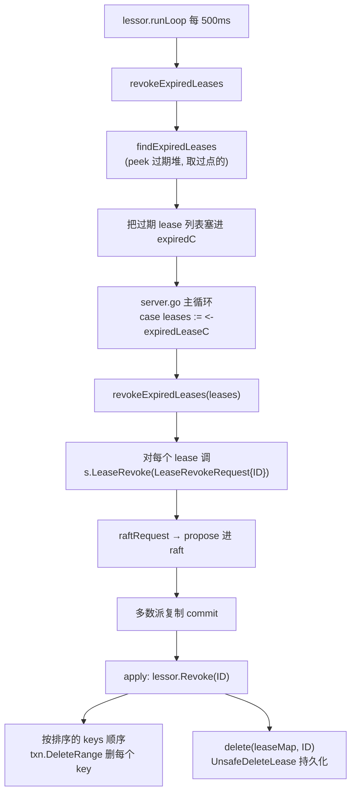
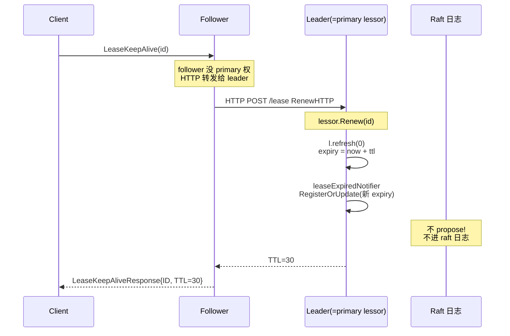

# 第二十章 · lease:给 key 续命

> 篇:P6 lease 与成员变更
> 主线呼应:前面五章不丢不乱(WAL/Snapshot/恢复)讲的是"机器挂了,数据怎么不丢";这一章换一个角度——"客户端挂了,它写的 key 怎么自动消失"。一条 `Put` 在 etcd 里默认是永久存的(除非被显式 `Delete`),但很多场景要求 key **自带到期时间**:服务注册、分布式锁、选主、临时配置。etcd 不是给每个 key 塞一个 TTL 定时器(那会爆炸),而是把 TTL 抽成一个独立的对象——**lease(租约)**,让一个 lease 给一批 key 续命,客户端只续 lease 就行,lease 一过期,挂它名下的 key 一起回收。这一章服务二分法的**应用层**那一面:它是 etcd 状态机之上的一个特性,不属于 Raft 协议本身。

## 核心问题

**`Put` 带 TTL 怎么实现?为什么 etcd 不给每个 key 各自带一个 TTL,而是把 TTL 做成独立的 lease,让 lease 和 key 解耦——一个 lease 给一批 key 续命?客户端 `KeepAlive` 续约怎么工作,为什么续约**不走 raft**?lease 过期后,挂在它名下的 key 怎么被回收——为什么回收要走 raft(共识删除),而不是本地直接删?**

读完本章你会明白:

1. **lease↔key 解耦**这个设计动机:它不是为 TTL 而 TTL,而是为服务发现/分布式锁/选主场景设计的(一个会话/实例 = 一个 lease,挂一批 key),凭什么能省掉海量 KeepAlive 流量和海量定时器。
2. **`Lease` 结构体**长什么样:`ID`/`ttl`/`remainingTTL`/`expiry`/`itemSet`/`revokec` 这几个字段各自管什么,为什么 expiry 和 itemSet 要用两把锁分别保护。
3. **grant/revoke/KeepAlive** 三条路径各自怎么走,**哪条走 raft、哪条不走 raft**,凭什么这样切。
4. **过期回收的完整链路**:`runLoop` 每 500ms 跑一次 → 从最小堆 `leaseExpiredNotifier` 取堆顶 → 过期 lease 经 `expiredC` 交给 etcdserver → etcdserver propose 一条 `LeaseRevoke` 进 raft → 多数派 commit → apply 时调 `lessor.Revoke` 真正删 key。凭什么回收要走 raft。
5. **lease↔key 反向索引**怎么维护:`itemMap`(key→leaseID)和 `Lease.itemSet`(lease→keys)双向维护,Put 时 attach、覆盖时 detach 老 lease、Revoke 时按排序的 keys 顺序删。

> **如果一读觉得太难**:先只记住三件事——① lease 是一个独立对象,一个 lease 可以给一批 key 续命,客户端 KeepAlive 续 lease 就等于给所有 key 续命;② 续约(`KeepAlive`)不走 raft(本地刷新 expiry 即可),但授予(`Grant`)、撤销(`Revoke`)、过期回收都必须走 raft;③ 过期回收不能本地直接删,必须 propose 一条删除进 raft,否则多副本不一致。

---

## 20.1 一句话点破

> **lease 是一个独立于 key 的"续命数据结构":一个 lease 有 ID 和到期时间,可以把任意多个 key 挂在它名下;客户端只要持续 KeepAlive 这个 lease,所有挂在上面的 key 就一直活着;客户端一旦不再续约,lease 过期,这些 key 被 etcd 自动回收。续约不走 raft(本地刷 expiry 就够),但授予、撤销、过期回收都必须走 raft——因为这三者都改变"集群共识意义上的状态",本地改会让多副本分叉。**

这是结论,不是理由。本章倒过来拆:先看"每 key 一个 TTL"的朴素方案为什么不行,再看 lease 和 key 解耦凭什么救场,然后逐条拆 grant/revoke/KeepAlive 三条路径,最后讲过期回收为什么必须走 raft。

---

## 20.2 朴素方案为什么不行:每 key 一个 TTL

假设你用 etcd 做服务发现。每个服务实例启动时往 etcd 注册自己:写一个 key 比如 `/services/payment/instance-1`,值为实例地址。实例宕机时,这个 key 应该自动消失——否则服务调用方会拿到一个已经死掉的实例地址。

最直观的设计是:**给每个 key 自带一个 TTL 字段**(像 Redis 的 `SET key value EX 60`)。客户端每隔一段时间(比如 TTL/3)对每个 key 发一次"续命"请求,etcd 收到就把 TTL 重置;客户端不再续命,等 TTL 倒计时归零,key 自动被删。

> **不这样会怎样**:这个朴素方案在 etcd 的规模下会撞三堵墙——

**第一堵墙:KeepAlive 流量爆炸。** 一个 Kubernetes 集群里,etcd 可能存着几十万个 key(每个 Pod 一条、每个 Service 一条、每个 Endpoint 一条……)。如果每个 key 都要单独续命,假设 TTL 是 30 秒、续命间隔是 10 秒,那光是续命请求就是 `N / 10` QPS——几十万 key 意味着每秒几万次续命 RPC,绝大多数还都是无意义的(同一个 Pod 注册的 `/pod/xxx`、`/endpoints/xxx`、`/service/xxx` 这些 key,生命周期完全一样,本该一起续)。

**第二堵墙:定时器爆炸。** 每个带 TTL 的 key 都需要一个定时器到期检查。Go runtime 一个 timer 大概几百字节,几十万个 timer 就是上百 MB 的额外开销,而且 runtime 调度 timer 本身也有成本。

**第三堵墙——也是真正致命的:语义错位。** 现实里,"一批 key 的生命周期是绑定的"。一个服务实例注册时通常写多个 key:自己的地址、健康状态、元数据、所在的 endpoint 列表……这些 key 的 TTL 应该完全一致——实例活着就都活着,实例挂了就一起消失。朴素方案把 TTL 钉死在每个 key 上,意味着客户端要对这一批 key 分别维护 TTL、分别续命,任何一个漏续了都会出现"实例还活着但某个 key 已经没了"这种诡异状态。

> **所以这样设计**:把 TTL 从 key 上**抽出来**,做成一个独立的、可被多个 key 共享的对象——这就是 **lease(租约)**。客户端不再对每个 key 续命,而是先申请一个 lease(Grant),再把 key 写到这个 lease 名下(`Put` 时带 `lease=ID`),之后只对这个 lease 续命(KeepAlive)。一个 lease 给一批 key 续命,lease 过期,这批 key 一起回收。

这就是 lease 和 key **解耦**的核心动机:不是为 TTL 而 TTL,而是为"一批 key 共享同一生命周期"这个真实场景设计的。

---

## 20.3 lease↔key 解耦:凭什么救场

我们先看解耦后的数据结构,再看它怎么省掉前面三堵墙。

### 20.3.1 `Lease` 结构体:一个续命对象

[`etcd/server/lease/lease.go`](../etcd/server/lease/lease.go) 里 [`Lease` 结构体](../etcd/server/lease/lease.go#L27-L40)(本地 clone @ `61d518f`)长这样:

```go
type Lease struct {
    ID           LeaseID
    ttl          int64 // time to live of the lease in seconds
    remainingTTL int64 // remaining time to live in seconds, if zero valued it is considered unset and the full ttl should be used
    // expiryMu protects concurrent accesses to expiry
    expiryMu sync.RWMutex
    // expiry is time when lease should expire. no expiration when expiry.IsZero() is true
    expiry time.Time

    // mu protects concurrent accesses to itemSet
    mu      sync.RWMutex
    itemSet map[LeaseItem]struct{}
    revokec chan struct{}
}
```

逐个字段拆:

- **`ID`**:lease 的全局唯一标识,一个 `int64`。客户端后续 `KeepAlive` 时就靠它指认。
- **`ttl`**:授予的存活时间(秒),比如 30。这是个**配置值**,不会随时间流逝而变。
- **`remainingTTL`**:剩余 TTL,用于 leader 切换时**保留进度**(后面 20.6 会讲)。
- **`expiry`**:具体的**到期时刻**(一个绝对时间 `time.Time`)——`time.Now() + ttl`。这才是真正用来判断过期的字段。注意它用 `expiryMu` 单独保护,不和 `itemSet` 共用锁。
- **`itemSet`**:挂在这个 lease 名下的所有 key 的集合(`map[LeaseItem]struct{}`)。`LeaseItem` 就是个 `{Key string}` 的小结构体。这是 **lease → keys** 的正向索引。
- **`revokec`**:一个 channel,在 lease 被 revoke 时关闭,用来通知正在等待的 `Renew`(20.5 详讲)。

> **钉死这件事**:`Lease` 里最关键的字段是 `itemSet`——它让"一个 lease 给一批 key 续命"成为可能。如果 `Lease` 不存这个集合,lease 过期时 etcd 就无从知道该删哪些 key。这个集合就是 lease↔key 反向索引的"一半"。

> **为什么 expiry 和 itemSet 各用一把锁**:`Lease` 给 `expiry` 配了 `expiryMu`,`itemSet` 配了 `mu`——为什么不用一把大锁?因为读 `expiry`(判断是否过期)和读 `itemSet`(列出挂载的 keys)是两条几乎不相交的访问路径,前者在 `runLoop` 里高频被读,后者在 `Keys()`/`Attach`/`Detach` 时才被读。用一把锁会让这两条路径互相阻塞;两把细粒度锁让它们并发。这是 Go 并发编程里"锁拆分"的典型实践——按访问路径切,不按对象整体切。

### 20.3.2b `remainingTTL`:跨 leader 切换保留进度

字段里有个看着多余的 `remainingTTL`,初看会疑惑——`ttl` 不就是存活时间吗,为什么还要个 `remainingTTL`?答案是:**为了 leader 切换时不丢失 lease 的过期进度**。

考虑场景:lease A 的 `ttl=300s`(5 分钟),客户端一直 KeepAlive 续着。如果在第 280 秒时 leader 挂了,新 leader 上任——它怎么知道 lease A 还剩 20 秒?如果它不知道,只能悲观地把 expiry 重置成 `now + 300s`(完整 TTL),那 lease A 就白捡了 280 秒寿命,而且这 280 秒里即便客户端早死了,key 也不会被回收。

`remainingTTL` 就是来堵这个漏洞的。leader 会周期性地(默认每 5 分钟)把 lease 的剩余 TTL 通过 `LeaseCheckpoint` 这条 raft entry 持久化下来([`scheduleCheckpointIfNeeded`](../etcd/server/lease/lessor.go#L753-L770)、[`findDueScheduledCheckpoints`](../etcd/server/lease/lessor.go#L772-L806))。新 leader [`Promote`](../etcd/server/lease/lessor.go#L480-L532) 时,从持久化的 `remainingTTL` 重建 expiry,lease 的过期进度就不会因为 leader 切换而丢失。v3.6 起 checkpoint 默认开启(`checkpointPersist=true`),老版本只有长 TTL 的 lease 才会被 checkpoint。

> **钉死这件事**:`remainingTTL` 不是 `ttl` 的重复,它是 lease 在"共识层持久化的进度快照"。续约时不写它(续约不走 raft),checkpoint 时才写——这是 lease 在"高效续约"和"leader 切换不丢进度"之间的折中:不能每次续约都 raft(太贵),也不能完全不持久化进度(切换会丢失),折中是低频 checkpoint。

### 20.3.2 lease↔key 反向索引:双向维护

光 `Lease.itemSet`(lease→keys)还不够。考虑 `Put` 一个 key 时,etcd 还需要查"这个 key 当前挂在哪个 lease 上"——比如覆盖写时要把 key 从旧 lease 摘下来挂到新 lease。所以 lessor 还维护另一个方向 [`lessor.itemMap`](../etcd/server/lease/lessor.go#L155)(`map[LeaseItem]LeaseID`):

```go
type lessor struct {
    mu sync.RWMutex
    // ...
    leaseMap             map[LeaseID]*Lease       // leaseID → Lease
    leaseExpiredNotifier *LeaseExpiredNotifier    // 过期最小堆(20.4 详讲)
    leaseCheckpointHeap  LeaseQueue               // checkpoint 最小堆
    itemMap              map[LeaseItem]LeaseID    // key → leaseID  (反向)
    // ...
}
```

两个方向,两份索引:

```
   lessor (primary = raft leader)
   ┌──────────────────────────────────────────────────────────────────┐
   │                                                                  │
   │  leaseMap: leaseID ──► Lease                                     │
   │                                                                  │
   │      ┌─── Lease(id=A, ttl=30) ──────────────────────┐            │
   │      │   expiry = 14:23:15                           │            │
   │      │   itemSet = { "/svc/pay/i1",                  │            │
   │      │               "/svc/pay/i1/status",           │            │
   │      │               "/ep/pay/i1" }                  │            │
   │      └───────────────────────────────────────────────┘            │
   │                                                                  │
   │  itemMap: LeaseItem(key) ──► leaseID   (反向, 覆盖写时用)        │
   │      "/svc/pay/i1"        ──► A                                  │
   │      "/svc/pay/i1/status" ──► A                                  │
   │      "/ep/pay/i1"         ──► A                                  │
   │                                                                  │
   │  leaseExpiredNotifier: 最小堆, 堆顶 = 最快到期的 lease           │
   │      堆: [Lease(A, expiry=14:23:15), Lease(B, ...), ...]         │
   └──────────────────────────────────────────────────────────────────┘
                    ▲                                  │
                    │ Attach(key→A)                    │ 过期堆 peek
                    │ Put 时调                          │ runLoop 每 500ms
                    │                                  ▼
   mvcc put 路径                              找到过期 lease
   (kvstore_txn.go:285)                       → expiredC → revoke
```

> **为什么必须双向**:正向(`leaseMap` + `itemSet`)回答"这个 lease 挂了哪些 key"——过期回收时要靠它知道删谁;反向(`itemMap`)回答"这个 key 挂在哪个 lease"——覆盖写、删除时要靠它把 key 从旧 lease 摘下来。两个方向都不可省。

### 20.3.3 attach 的时机:Put 写 mvcc 时顺带 attach

那么 key 是什么时候被挂到 lease 上的?不在 `Put` RPC 层,而在 mvcc 写事务里。客户端 `Put` 时带 `lease=ID`,这条 `Put` 进 raft、apply 到 mvcc,在 [`kvstore_txn.go` 的 `put` 函数](../etcd/server/storage/mvcc/kvstore_txn.go#L223-L291) 里写完 key 之后:

```go
// (简化示意,非源码原文;摘自 kvstore_txn.go 的 put 末尾)
if oldLease != lease.NoLease {
    // 把 key 从旧 lease 摘下来
    tw.s.le.Detach(oldLease, []lease.LeaseItem{{Key: string(key)}})
}
if leaseID != lease.NoLease {
    // 把 key 挂到新 lease 上
    tw.s.le.Attach(leaseID, []lease.LeaseItem{{Key: string(key)}})
}
```

注意 attach/detach 是**在 apply 路径里、和写 mvcc 同一个事务上下文**做的。这点很重要——它保证了"key 存在"和"key 挂在 lease 上"这两件事原子,不会出现 key 已经写进去了但 attach 没做这种半成品状态。`Attach` 函数本身在 [`lessor.go`](../etcd/server/lease/lessor.go#L555-L571):同时往 `Lease.itemSet` 和 `lessor.itemMap` 里塞。

### 20.3.4 解耦后,三堵墙都没了

回到 20.2 的三堵墙,解耦之后:

- **KeepAlive 流量**:一个服务实例的所有 key(N 个)共享一个 lease,客户端只 KeepAlive 这一个 lease,**N 次 → 1 次**。
- **定时器**:一个 lease 只在 lessor 的**一个最小堆**里占一个条目(20.4 详讲),不是每个 key 一个 timer。
- **语义错位**:一批 key 的生命周期天然绑定——挂在同一个 lease 上,一损俱损、一荣俱荣,客户端不需要单独维护。

> **钉死这件事**:lease 和 key 解耦,不是"为了优雅"的工程美学,是真实场景(服务发现/分布式锁/选主)的硬需求。一个会话(一个客户端连接、一个服务实例、一把锁的持有者)= 一个 lease;这个会话的所有 key 都挂在这个 lease 上;会话挂了 lease 过期→所有 key 一起被回收。这是 etcd 区别于普通"每 key 自带 TTL"的 KV(如 Redis)的关键设计。

---

## 20.4 过期检测:一个最小堆搞定所有 lease

lease 多了之后,怎么高效检测哪些过期了?朴素做法是每个 lease 一个 timer,到期回调——前面说过会爆炸。etcd 的做法是:**用一个最小堆**,堆顶永远是"最快到期的那个 lease",后台 goroutine 周期性检查堆顶。

### 20.4.1 `LeaseExpiredNotifier`:map + 最小堆

[`lease_queue.go`](../etcd/server/lease/lease_queue.go) 里定义了 [`LeaseExpiredNotifier`](../etcd/server/lease/lease_queue.go#L63-L66):

```go
type LeaseExpiredNotifier struct {
    m     map[LeaseID]*LeaseWithTime
    queue LeaseQueue
}
```

它是一个 **map + 最小堆**的组合:

- `queue` 是按 `time` 字段(到期时刻)排序的最小堆,堆顶是 `time` 最早(最快到期)的 [`LeaseWithTime`](../etcd/server/lease/lease_queue.go#L25-L29)。
- `m` 是 `LeaseID → *LeaseWithTime` 的 map,作用是**支持 O(log N) 的更新**——`RegisterOrUpdate` 时如果 lease 已在堆里,直接拿到它在堆里的指针,改 `time`,再 `heap.Fix` 调整位置。

`LeaseQueue` 的堆操作是 Go 标准库的 [`container/heap`](../etcd/server/lease/lease_queue.go#L33-L59) 标准实现:`Less` 比较的是 `time.Before`,`Push`/`Pop` 维护 `index` 字段以支持 `heap.Fix`。

> **技巧点睛**:光用堆(不用 map)的话,更新一个已存在 lease 的到期时间需要 O(N) 扫一遍堆找到它;光用 map(不用堆)的话,每次找最快到期的需要 O(N) 全扫。**map + 堆**把"按 ID 更新"和"取堆顶"都做到对数级。这是用空间换时间的经典组合,LevelDB 的 LRUCache 也是类似的 hash + 双向链表。

### 20.4.2 `runLoop`:500ms 一轮的过期扫描

lessor 启动时开一个后台 goroutine [`runLoop`](../etcd/server/lease/lessor.go#L620-L636):

```go
func (le *lessor) runLoop() {
    defer close(le.doneC)

    delayTicker := time.NewTicker(500 * time.Millisecond)
    defer delayTicker.Stop()

    for {
        le.revokeExpiredLeases()
        le.checkpointScheduledLeases()

        select {
        case <-delayTicker.C:
        case <-le.stopC:
            return
        }
    }
}
```

每 500ms 干两件事:① 找过期的 lease 喂给 `expiredC`(20.5 详讲);② 把到点的 checkpoint 喂给 checkpointer(20.6 略讲,属持久化与恢复范畴)。

[`revokeExpiredLeases`](../etcd/server/lease/lessor.go#L640-L663) 内部调 [`findExpiredLeases`](../etcd/server/lease/lessor.go#L728-L751),后者循环调 [`expireExists`](../etcd/server/lease/lessor.go#L700-L724)——`expireExists` 就是 peek 堆顶,看是不是过点了:

```go
func (le *lessor) expireExists() (l *Lease, next bool) {
    if le.leaseExpiredNotifier.Len() == 0 {
        return nil, false
    }
    item := le.leaseExpiredNotifier.Peek()
    l = le.leaseMap[item.id]
    if l == nil {
        le.leaseExpiredNotifier.Unregister() // 这个 lease 已被 revoke,弹出
        return nil, true
    }
    now := time.Now()
    if now.Before(item.time) /* item.time: 到期时刻 */ {
        return nil, false  // 堆顶还没到点,后面更不可能,本轮结束
    }
    // 到点了:重新插入,把下次检查时间设为"现在 + retry 间隔"
    item.time = now.Add(le.expiredLeaseRetryInterval)
    le.leaseExpiredNotifier.RegisterOrUpdate(item)
    return l, false
}
```

这里有个**精妙的处理**:lease 过点之后,`expireExists` 不是直接 pop 掉,而是**把它重新插回堆,但下次到期时间设为"现在 + `expiredLeaseRetryInterval`(默认 3s)"**。为什么?因为"过点"不等于"已经回收"——后面 20.5 会讲,过点的 lease 要被 etcdserver propose 一条 `LeaseRevoke` 进 raft,这中间有网络/磁盘延迟,可能失败。设一个 retry 间隔,意味着如果回收失败,3 秒后还会再次被检出、再次尝试 propose。

> **钉死这件事**:`expireExists` 只 peek + 改到期时间、不真删——真正的删除(revoke)发生在 etcdserver 那边 propose 完 `LeaseRevoke` 并 apply 之后。这种"检测层只负责挑出来、回收层负责真正删"的切分,让过期检测和 raft 回收解耦:即使回收暂时失败,下一轮检测还会再把它捞出来。

注意一个**反向操作**:`Demote`(lessor 从 primary 降级时)会把所有 lease 的 expiry 设成 `forever`,并清空 `leaseExpiredNotifier`(见 [`Demote`](../etcd/server/lease/lessor.go#L534-L550))。为什么——因为只有 **primary lessor**(也就是 raft leader)才负责过期检测和回收,follower 的 lessor 不应该触发 revoke(它没资格 propose)。下面 20.5 就讲这个"primary lessor"的概念。

---

## 20.5 三条路径:grant / revoke / KeepAlive 各走各的路

lease 的生命周期有三条核心路径——授予、撤销、续约。它们**走的路完全不同**,这是本章最反直觉、也最关键的一点。先把结论摆出来:

| 操作 | 谁发起 | 走不走 raft | 为什么 |
|------|--------|-------------|--------|
| **Grant(授予)** | 客户端 `LeaseGrant` | **走 raft** | lease 是否存在是集群共识状态,每个副本都得知道 |
| **Revoke(撤销)** | 客户端 `LeaseRevoke` 或过期回收 | **走 raft** | 撤销 = 删一批 key,删 key 必须共识(否则多副本不一致) |
| **KeepAlive(续约)** | 客户端 `LeaseKeepAlive` | **不走 raft** | 续约只是 leader 本地刷新 expiry,不影响已 commit 的状态 |

下面逐条拆,每条都讲清"凭什么这么走"。

### 20.5.1 Grant:走 raft,lease 是否存在是共识状态

客户端调 [`LeaseGrant(LeaseGrantRequest{ID, TTL})`](../etcd/server/etcdserver/v3_server.go#L434-L456):

```go
func (s *EtcdServer) LeaseGrant(ctx context.Context, r *pb.LeaseGrantRequest) (*pb.LeaseGrantResponse, error) {
    for r.ID == int64(lease.NoLease) {
        r.ID = int64(s.reqIDGen.Next() & ((1 << 63) - 1))  // 没给 ID 就分配一个
    }
    // ...
    resp, err := s.raftRequest(ctx, &pb.InternalRaftRequest{LeaseGrant: r})  // ← 进 raft!
    // ...
}
```

关键是 `s.raftRequest`——这条 `LeaseGrant` 被 propose 进 raft 日志,经多数派复制、commit,然后 apply 时才真正调 [`lessor.Grant`](../etcd/server/lease/lessor.go#L281-L324) 在 `leaseMap` 里建一个 `Lease` 对象。也就是说,**lease 是否存在**这件事,和 key 是否存在一样,是集群共识的一部分——所有副本都得一致地认为"这个 lease 存在、TTL 是 30"。

> **不这样会怎样**:如果 Grant 不走 raft、只在本地建 lease,那 leader 切换后新 leader 根本不知道旧 leader 发过哪些 lease,会有两种灾难:① 客户端 `KeepAlive` 一个 lease,新 leader 说"没这个 lease"——但其实这个 lease 还没过期;② 一个 lease 已经被 revoke 了,但新 leader 不知道,还会继续把它当活的。Grant 走 raft,意味着每个副本都持久化了"哪些 lease 存在",leader 切换后状态一致。

[`Grant` 在 lessor 里的实现](../etcd/server/lease/lessor.go#L281-L324) 有个细节值得注意:

```go
if le.isPrimary() {
    l.refresh(0)                          // primary: 立刻算出 expiry
} else {
    l.forever()                           // 非 primary: expiry 设为 forever,不参与过期判定
}
le.leaseMap[id] = l
l.persistTo(le.b)                         // 持久化到 backend(bbolt)
if le.isPrimary() {
    item := &LeaseWithTime{id: l.ID, time: l.expiry}
    le.leaseExpiredNotifier.RegisterOrUpdate(item)  // 塞进过期堆
    le.scheduleCheckpointIfNeeded(l)
}
```

非 primary(follower)的 lessor 在 Grant 时把 `expiry` 设成 `forever`(`time.Time{}` 零值),不塞过期堆。这呼应了 20.6 要讲的——只有 primary 才管过期检测。注意 `l.persistTo(le.b)` 把 lease 序列化进 backend,这是 lease 跨重启不丢的兜底(详细属于 P5-19 启动恢复范畴)。

Grant 完成后,apply 路径返回 `LeaseGrantResponse{ID, TTL}` 给客户端。客户端拿到 lease ID,就可以用它来写带 lease 的 key 了——`Put(key, value, lease=ID)`。这条 `Put` 又是一条 raft entry,apply 到 mvcc 时(20.3.3 的 attach 逻辑)把 key 挂到 lease 上。**一次"注册一个带 TTL 的 key"实际上产生了两条 raft entry**(一条 LeaseGrant、一条带 lease 的 Put)——这是初学者常忽略的细节。

### 20.5.2 Revoke:走 raft,因为删 key 必须共识

撤销有两种触发方式:① 客户端主动调 `LeaseRevoke`;② 后台 `runLoop` 检测到 lease 过期,自动触发 revoke。两条路殊途同归,最后都调 [`EtcdServer.LeaseRevoke`](../etcd/server/etcdserver/v3_server.go#L470-L486):

```go
func (s *EtcdServer) LeaseRevoke(ctx context.Context, r *pb.LeaseRevokeRequest) (*pb.LeaseRevokeResponse, error) {
    // ...
    resp, err := s.raftRequest(ctx, &pb.InternalRaftRequest{LeaseRevoke: r})  // ← 进 raft!
    // ...
}
```

又是 `raftRequest`!过期回收的具体链路是:



[`revokeExpiredLeases` 在 server.go 里](../etcd/server/etcdserver/server.go#L858-L903):

```go
func (s *EtcdServer) revokeExpiredLeases(leases []*lease.Lease) {
    s.GoAttach(func() {
        // 先确认自己还是 leader(避免在 raft loop 阻塞时误判)
        if !s.ensureLeadership() {
            lg.Warn("Ignore the lease revoking request because current member isn't a leader", ...)
            return
        }
        // 并发 propose 多条 revoke 提速
        c := make(chan struct{}, maxPendingRevokes)
        for _, curLease := range leases {
            select {
            case c <- struct{}{}:
            case <-s.stopping:
                return
            }
            f := func(lid int64) {
                s.GoAttach(func() {
                    ctx := s.authStore.WithRoot(s.ctx)
                    _, lerr := s.LeaseRevoke(ctx, &pb.LeaseRevokeRequest{ID: lid})
                    // ...
                    <-c
                })
            }
            f(int64(curLease.ID))
        }
    })
}
```

注意两个细节:① **`ensureLeadership`**——propose 之前再确认一次自己还是 leader,防止"raft loop 阻塞 → raft 层已经换主了但 lessor 还以为自己是 primary"的窗口(源码注释专门提到 [etcd issue #15247](https://github.com/etcd-io/etcd/issues/15247));② **并发 propose**(`maxPendingRevokes` 信号量),一次回收一批过期 lease 而不是串行,提高吞吐。

> **不这样会怎样(本技巧精解的另一面,详见 20.7)**:如果回收**不走 raft**,leader 直接在本地 `DeleteRange` 删 key,那 follower 上的 key 还在——多副本立刻不一致,etcd 的线性一致性和多数派共识全都白费了。这正是为什么 revoke 必须走 raft。

### 20.5.3 KeepAlive:不走 raft,本地刷新 expiry 就够

续约就完全不一样了。客户端 [`LeaseKeepAlive` 流式 RPC](../etcd/server/etcdserver/api/v3rpc/lease.go#L111-L158) 收到一个 keepalive 请求后,调 [`EtcdServer.LeaseRenew`](../etcd/server/etcdserver/v3_server.go#L488-L560):

```go
func (s *EtcdServer) LeaseRenew(ctx context.Context, id lease.LeaseID) (int64, error) {
    // ...
    if s.isLeader() {
        if !s.ensureLeadership() {
            return -1, lease.ErrNotPrimary
        }
        // (FastLeaseKeepAlive 优化:lease 可能还在 propose 中,等一下 applied index)
        // ...
        ttl, err := s.lessor.Renew(id)   // ← 本地 Renew!
        if err == nil {
            return ttl, nil
        }
        // ...
    }
    // follower 走 HTTP 转发给 leader
    for cctx.Err() == nil {
        leader, _ := s.waitLeader(cctx)
        for _, url := range leader.PeerURLs {
            ttl, err := leasehttp.RenewHTTP(cctx, id, url+leasehttp.LeasePrefix, s.peerRt)
            // ...
        }
    }
    // ...
}
```

注意源码里那条关键注释:**"renewals don't go through raft; forward to leader manually"**([v3_server.go:540](../etcd/server/etcdserver/v3_server.go#L540))。续约**完全绕开 raft**,follower 收到 KeepAlive 就走 HTTP 转发给 leader,leader 在本地直接 [`lessor.Renew`](../etcd/server/lease/lessor.go#L396-L456):

```go
func (le *lessor) Renew(id LeaseID) (int64, error) {
    le.mu.RLock()
    if !le.isPrimary() {
        le.mu.RUnlock()
        return -1, ErrNotPrimary
    }
    // ...
    l := le.leaseMap[id]
    if l == nil { /* ... */ }
    // ...
    le.mu.RUnlock()
    // ...
    le.mu.Lock()
    l = le.leaseMap[id]
    if l == nil { /* ... */ }
    l.refresh(0)                                       // ← 本地刷新 expiry!
    item := &LeaseWithTime{id: l.ID, time: l.expiry}
    le.leaseExpiredNotifier.RegisterOrUpdate(item)      // ← 重插过期堆
    le.mu.Unlock()
    leaseRenewed.Inc()
    return l.ttl, nil
}
```

`l.refresh(0)` 就是把 `expiry` 改成 `time.Now() + ttl`([`Lease.refresh`](../etcd/server/lease/lease.go#L84-L89))。没有 propose、没有 raft 日志、没有多数派复制——纯本地内存操作,毫秒级返回。

> **凭什么不走 raft也安全?** 这是 lease 设计最巧妙的地方。仔细想:续约改变的是**到期时间 `expiry`**,这个字段只在 **primary lessor**(leader)上才用来驱动过期检测;follower 的 lessor 把 expiry 全部设成 `forever`([`Demote`](../etcd/server/lease/lessor.go#L534-L550)),根本不参与过期判定。所以 expiry 在 follower 上是什么值**完全无所谓**——它不影响集群任何已 commit 的状态,只影响 leader 本地"何时把这个 lease 标记为过期"。

> 换句话说:续约是个**纯性能优化**操作——它只是让 leader 不要急着把这个 lease 当过期的。它不改变"这个 lease 存不存在""key 存不存在"这些共识状态。所以续约可以安全地不走 raft,省掉每秒成千上万次 propose。如果 lease 因为没续上而过期了,后续的 revoke **会**走 raft 把 key 删掉——共识状态最终被一致地改变,只是走了一条"过期 → revoke → raft"的间接路径,而不是"每次续约都 raft"的直接路径。

> **钉死这件事**:Grant/Revoke 走 raft(改变共识状态),KeepAlive 不走 raft(只刷 leader 本地的 expiry)。这个切分是 lease 能高效工作的根本——它把"高频的续命"和"低频的状态改变"彻底分开,高频的续命不浪费 raft 一点吞吐。

KeepAlive 的端到端时序(注意它和 Put 完全不同,根本不进 raft 日志):



对比一下 `LeaseGrant` 的时序——Grant 要走完整的 raft propose→多数派复制→commit→apply 链路,KeepAlive 这条路完全绕开了。这就是为什么 etcd 能扛住几十万 lease 同时续约:续约不碰 raft,leader 单机内存操作,毫秒级。

### 20.5.4 一个真实场景:Kubernetes 服务发现

把前面三条路径串起来,看一个 Kubernetes 里的真实流程。一个 Pod 启动时,kubelet/endpoint-controller 会往 etcd 写:

- `/registry/pods/<ns>/<pod-name>`——Pod 对象本身
- `/registry/endpoints/<ns>/<svc>` 下的某个条目——这个 Pod 作为某个 Service 的 endpoint
- 可能还有 `/registry/leases/<ns>/<controller>`——某个控制器持有 lease 做 leader election

这些 key 里,有的直接挂在 lease 上(比如 leader election 的 lease),有的虽然不挂 lease 但和某个 lease 的生命周期强相关。Pod 被删除时,对应的 lease(如果有)不再被续约,过期 → revoke → 一批 key 一起被删,watch 这些 key 的组件(比如 kube-proxy)立刻收到删除事件,从 iptables/IPVS 规则里摘掉这个 endpoint。整个过程不需要任何组件显式调 `Delete`——**lease 的过期回收机制自动完成了清理**。这是 etcd lease 设计真正发挥威力的场景。

---

## 20.6 primary lessor:只有 leader 才管过期

20.5 反复提到一个概念:**primary lessor**。只有 primary lessor 才跑 `runLoop`、才检测过期、才 `Renew`,follower 的 lessor 是"静默"的。这个机制靠 [`isPrimary`](../etcd/server/lease/lessor.go#L263-L265) 和 `demotec` channel 实现:

```go
// in etcd, raft leader is the primary. Thus there might be two primary
// leaders at the same time (raft allows concurrent leader but with different term)
// for at most a leader election timeout.
// The old primary leader cannot affect the correctness since its proposal has a
// smaller term and will not be committed.
func (le *lessor) isPrimary() bool {
    return le.demotec != nil
}
```

[`Promote(extend)`](../etcd/server/lease/lessor.go#L480-L532) 在节点成为 raft leader 时被调用:建一个 `demotec` channel(`isPrimary()` 从此返回 true),然后**把所有 lease 的 expiry 刷新一遍**(加 `extend`),重新塞进过期堆。为什么 Promote 要刷新所有 lease 的 expiry?因为新 leader 不知道旧 leader 上每个 lease 的 expiry 实时值(续约没走 raft,leader 之间不共享),只能从持久化的 `remainingTTL`(20.7 详讲)重新算一个保守估计——`extend` 这个参数就是给点缓冲(默认是选举超时),保证新 leader 不会立刻把所有 lease 当过期的。

`Promote` 里还有一段**避免 revoke 风暴**的精妙逻辑:如果 lease 数量超过 `leaseRevokeRate`(默认 1000/s),会按时间窗口把到期时间错峰推开,避免新 leader 一上任就触发雪崩式的 revoke。

> **不这样会怎样**:如果 follower 也跑过期检测,那它检测到过期后想 revoke,但没资格 propose——要么死等 leader,要么瞎 propose 引发混乱。让"过期检测"和"raft leader"绑定,保证只有有 propose 权的节点才触发回收,逻辑干净。代价是 leader 切换的瞬间(`Promote` 那一刻)会有最多一个选举超时的窗口,旧 leader 还以为自己是 primary——但旧 leader 此时 propose 会被新 leader 的更高 term 拒绝(源码注释明说"its proposal has a smaller term and will not be committed"),所以是安全的。

源码注释里有一条很诚实的备注([lessor.go 的 TODO](../etcd/server/lease/lessor.go#L259-L262)):理论上存在一个极小的窗口——raft follower 在 raft 层已经升级为 leader,但 lessor 还没收到 `Promote` 通知的瞬间,它可能短暂地被当成 primary。但这个窗口通常只有几毫秒(Go 调度的粒度),且 lease 对时序不敏感,实际不会出问题。这是 etcd 工程上"实用主义"的体现——不为了消灭理论上极小概率的窗口而引入复杂的一致性协议。

### 20.6b `Renew` 和 `Revoke` 的竞态:revokec 的作用

20.5.3 的 `Renew` 代码里有一段容易被忽略的逻辑,涉及 `revokec` channel:

```go
// (简化示意,摘自 lessor.go 的 Renew)
le.mu.RUnlock()
if l.expired() {
    select {
    // 过期 lease 可能正在被 revoke(等待 raft commit)
    case <-l.revokec:
        return -1, ErrLeaseNotFound      // revoke 完成,lease 真没了
    case <-demotec:
        return -1, ErrNotPrimary         // 自己被降级,让客户端换 leader 重试
    case <-le.stopC:
        return -1, ErrNotPrimary
    }
}
```

这段处理一个微妙的竞态:**客户端续约时,lease 恰好刚过点、正在被 revoke**。`l.expired()` 返回 true,但 lease 还没从 `leaseMap` 删掉(因为删发生在 raft apply 之后,有时间差)。这时 `Renew` 不能假装续约成功(那会骗客户端说 key 还活着),也不能立刻报错(因为 revoke 可能最终失败,lease 还能救回来)。所以它**等 `revokec`**——`revokec` 在 [`Revoke`](../etcd/server/lease/lessor.go#L335) 开头 `defer close(l.revokec)` 关闭,revoke 完成 = channel 关闭 = Renew 收到信号返回 `ErrLeaseNotFound`。

> **钉死这件事**:`revokec` channel 解决的是"续约"和"撤销"之间的竞态——两者都不走 raft 的同步(续约完全不走,Revoke 走 raft 但 Renew 不能等 raft),用 channel 这种轻量的同步原语把两者协调起来。这是 Go channel 在分布式状态管理里的典型用法:**用 channel 表达"某个异步事件的完成",比加锁等待 raft 优雅得多**。

---

## 20.7 技巧精解

本章挑两个最硬核的技巧单独拆透:① **lease↔key 解耦 + 续约不走 raft**;② **过期回收必须走 raft**。这两个是 lease 设计的两根支柱,而且互为镜像——一个把高频操作(续约)从 raft 里摘出来,一个把低频但关键的操作(回收)塞回 raft。

### 20.7.1 lease↔key 解耦 + 续约不走 raft

**问题**:服务发现场景下,N 个 key 共享一个生命周期,怎么避免 N 个 KeepAlive 流量 + N 个定时器,而且续约高频不能拖垮 raft?

**etcd 的解法**:

1. **lease 独立对象,`Lease.itemSet` 存挂载的 key 集合**。N 个 key 挂在一个 lease 上,客户端只 KeepAlive 这个 lease 一次。Put 时 attach([`kvstore_txn.go:285`](../etcd/server/storage/mvcc/kvstore_txn.go#L285)),Revoke 时 [`l.Keys()`](../etcd/server/lease/lease.go#L106-L114) 拿出整个集合批量删。
2. **过期检测用 map + 最小堆**([`LeaseExpiredNotifier`](../etcd/server/lease/lease_queue.go#L63-L66)),所有 lease 共用一个堆,N 个 lease 占 N 个堆条目,后台一个 goroutine 周期 peek,不是 N 个 timer。
3. **续约绕开 raft**([`v3_server.go:540`](../etcd/server/etcdserver/v3_server.go#L540)),follower 走 HTTP 转发给 leader,leader 本地 [`l.refresh(0)`](../etcd/server/lease/lease.go#L84-L89) 刷新 expiry,毫秒级返回,不进 raft 日志、不需要多数派。

**为什么 sound(为什么这样不会出正确性问题)**:

续约改的 `expiry` 字段只在 primary lessor(raft leader)上被 `runLoop` 用来检测过期;follower 的 `expiry` 都是 `forever`(`Demote` 时设的),根本不被读。所以 expiry 在 follower 上是什么值,对共识状态毫无影响——它只影响 leader 本地一个"何时把 lease 标记过期"的判定,而这个判定后续触发的 revoke 会走 raft,共识状态最终一致。

**反面对比**:如果续约也走 raft——

- 一个服务实例每 10 秒续一次,N 个 key = 每 10 秒 N 条 propose,raft 吞吐被续命请求吃光。
- raft 日志膨胀(WAL 文件疯狂增长),compaction 跟不上。
- 多数派复制每次续命的延迟(几十毫秒)叠加到 KeepAlive 上,续约不再"毫秒级"。

如果**根本不让续约**(lease 一旦 Grant 就固定 TTL,到期必死)——那客户端就没法表达"我的 key 应该活到我主动退出为止"这个语义,服务发现基本没法用。

> **钉死这件事**:"续约不走 raft"是 lease 设计最反直觉、也最精彩的一笔。它把"会话活性"这个高频信号留在 leader 本地,把"key 真正消失"这个低频但关键的状态改变交给 raft——既保住了 raft 的吞吐,又保住了多副本一致性。

### 20.7.2 过期回收必须走 raft

**问题**:leader 检测到一个 lease 过期了,为什么不能直接在本地 mvcc 里 `DeleteRange` 删掉挂载的 key,而要绕一大圈 propose 一条 `LeaseRevoke` 进 raft?

**etcd 的解法**(完整链路见 20.5.2 的流程图):leader 的 lessor `runLoop` 检出过期 lease → `expiredC` → etcdserver 主循环 → `revokeExpiredLeases` → `s.LeaseRevoke` → `raftRequest` → propose `LeaseRevoke` → 多数派 commit → apply 时调 [`lessor.Revoke`](../etcd/server/lease/lessor.go#L326-L365):

```go
func (le *lessor) Revoke(id LeaseID) error {
    le.mu.Lock()
    l := le.leaseMap[id]
    if l == nil { /* ... */ }
    defer close(l.revokec)
    le.mu.Unlock()

    if le.rd == nil { return nil }
    txn := le.rd()

    // sort keys so deletes are in same order among all members,
    // otherwise the backend hashes will be different
    keys := l.Keys()
    sort.StringSlice(keys).Sort()
    for _, key := range keys {
        txn.DeleteRange([]byte(key), nil)   // ← 在 mvcc 事务里删每个 key
    }

    le.mu.Lock()
    defer le.mu.Unlock()
    delete(le.leaseMap, l.ID)
    // lease 删除要和 key 删除在同一个 backend 事务里,
    // 否则可能"key 删了但 lease 没删"或反过来
    schema.UnsafeDeleteLease(le.b.BatchTx(), &leasepb.Lease{ID: int64(l.ID)})
    txn.End()
    leaseRevoked.Inc()
    return nil
}
```

注意三个细节:

1. **`sort.StringSlice(keys).Sort()`**:删 key 前先排序,注释明说"otherwise the backend hashes will be different"。不同副本如果按不同顺序删同一批 key,bbolt 的页结构可能不同,导致 hash 校验不一致——这是 etcd 跨副本一致性检查的一个细节。
2. **lease 删除和 key 删除在同一个 backend 事务**:源码注释明说"lease deletion needs to be in the same backend transaction with the kv deletion. Or we might end up with not executing the revoke or not deleting the keys if etcdserver fails in between."。这是原子性的要求——要么都成功,要么都不做,不能半成品。
3. **`defer close(l.revokec)`**:revoke 完成后关闭 `revokec`,通知正在等待的 `Renew`(20.5.3 那个 `case <-l.revokec` 分支)——如果有人在 renew 一个正在被 revoke 的 lease,让他立刻拿到 `ErrLeaseNotFound`。

**为什么 sound(为什么必须走 raft)**:

`DeleteRange` 改的是 mvcc 存储,而 mvcc 是**所有副本共识维护**的状态——任何对 mvcc 的写都必须经过 raft(P2-08 写路径全流程讲过)。如果 leader 本地直接删、不走 raft,那 follower 的 mvcc 里这些 key 还在,多副本立刻不一致,线性一致读就崩了(读 follower 会读到本该已删除的 key)。

把过期回收包成一条 `LeaseRevoke` raft entry,效果和客户端主动调 `LeaseRevoke` 一模一样——都是"一条删除操作进 raft,多数派 commit,所有副本 apply 时一致删除"。过期检测只是个**触发器**,真正的删除还是走共识路径。

**反面对比**:如果回收**不走 raft**(leader 本地删)——

- leader 删了 key,follower 还存着 → 多副本不一致。
- leader 切换后,新 leader 不知道哪些 key 被旧 leader 本地删了 → 状态混乱。
- 读 follower 会读到本该消失的 key → 线性一致性被破坏。

这就是为什么 etcd 哪怕多花一次 raft 往返,也要让过期回收走共识路径:**正确性 > 延迟**。

> **钉死这件事**:lease 的过期回收,本质上是"leader 检测到一个事件(lease 过期)→ 把这个事件翻译成一条 raft entry(LeaseRevoke)→ 经共识应用到所有副本"。这个模式在 etcd 里反复出现——比如成员变更(P6-21)也是 leader 检测到配置变化 → propose 一条 ConfChange。凡是改变共识状态的,都必须走 raft,无一例外。

---

## 章末小结

这一章服务二分法的**应用层**那一面:lease 是 etcd 状态机之上的一个特性,不属于 Raft 协议本身。它站在 mvcc(已 commit 的状态)和 raft(propose 通道)之间,把"key 的生命周期管理"做成一个独立子系统。lease 的精妙之处在于它把操作切成两类——**走 raft 的低频操作**(Grant/Revoke/过期回收,改变共识状态)和**不走 raft 的高频操作**(KeepAlive,只刷 leader 本地 expiry)——既享受了 raft 的多副本一致性,又没让高频续命拖垮 raft 吞吐。

我们立起了五样东西:

1. **lease↔key 解耦的动机**:为服务发现/分布式锁/选主场景设计(一个会话 = 一个 lease,挂一批 key),不是为了 TTL 而 TTL。
2. **`Lease` 结构体**:`ID`/`ttl`/`remainingTTL`/`expiry`/`itemSet`/`revokec`,以及 lessor 维护的 `leaseMap` + `itemMap` 双向索引。
3. **过期检测**:map + 最小堆(`LeaseExpiredNotifier`),`runLoop` 每 500ms peek 堆顶,过点 lease 经 `expiredC` 交给 etcdserver。
4. **三条路径**的走法:Grant/Revoke 走 raft,KeepAlive 不走 raft(本地刷新 expiry + follower 走 HTTP 转发)。
5. **过期回收链路**:lessor 检出过期 → expiredC → etcdserver → `s.LeaseRevoke` → raft propose → apply 时 `lessor.Revoke` 真正删 key。

### 五个"为什么"清单

1. **为什么把 TTL 做成独立的 lease,而不是每 key 自带 TTL?** 三堵墙:KeepAlive 流量爆炸、定时器爆炸、语义错位(一批 key 共享生命周期却被强行拆开)。lease 抽象让 N 个 key 共享一个续命对象,N 次续命变 1 次。
2. **为什么 KeepAlive 续约不走 raft?** 续约只改 leader 本地的 `expiry`,这个字段 follower 上都是 `forever`、根本不被读。不改共识状态,就没必要走 raft——这是把高频操作从 raft 里摘出来的关键。
3. **为什么 Grant/Revoke 必须走 raft?** Grant 决定"lease 是否存在"(共识状态),Revoke 决定"哪些 key 被删"(改 mvcc)。两者都改变共识状态,本地改会让多副本分叉,必须经多数派一致。
4. **为什么过期检测用 map + 最小堆,而不是每个 lease 一个 timer?** 几十万个 timer 内存爆炸、调度成本高;一个堆 + 一个后台 goroutine,所有 lease 共享,内存 O(N)、检测 O(log N)。
5. **为什么 `Promote` 要刷新所有 lease 的 expiry?** 新 leader 不知道旧 leader 上每个 lease 的实时 expiry(续约没走 raft,不共享),只能从持久化的 `remainingTTL` 保守重算,加 `extend` 缓冲避免误判过期。同时按 `leaseRevokeRate` 错峰,防 revoke 风暴。

### 想继续深入往哪钻

- **lease 的持久化与恢复**:`Lease.persistTo` / `initAndRecover` / `Recover` 是 lease 跨重启不丢的关键,但这属于 P5-19(启动恢复)的范畴,本章不展开。`remainingTTL` 字段就是为跨 leader 切换保留进度而存在的——`Promote` 时基于它重算 expiry。
- **lease checkpoint**:[`scheduleCheckpointIfNeeded`](../etcd/server/lease/lessor.go#L753-L770) 和 [`findDueScheduledCheckpoints`](../etcd/server/lease/lessor.go#L772-L806) 定期把 lease 的剩余 TTL 写进 raft(`LeaseCheckpoint` entry),目的是让长 TTL 的 lease 在 leader 切换时不会"重置回完整 TTL",减小窗口。v3.6 起默认开启。
- **lease 与 watch 的协同**:lease revoke 时删 key,这条删除会像普通 `Delete` 一样被 watch 推给订阅者——客户端通过 watch 感知到 key 消失。这是服务发现里"实例下线通知"的实现基础。
- **真实源码**:本章引用的核心文件都在 etcd 主仓——`server/lease/lease.go`(Lease 结构体)、`server/lease/lessor.go`(Lessor 接口与实现)、`server/lease/lease_queue.go`(过期堆)、`server/etcdserver/v3_server.go`(`LeaseGrant`/`LeaseRevoke`/`LeaseRenew`)、`server/etcdserver/server.go`(`revokeExpiredLeases`)、`server/etcdserver/api/v3rpc/lease.go`(gRPC KeepAlive)、`server/storage/mvcc/kvstore_txn.go`(attach 时机)。所有行号均经 Grep/Read 核实,本地 clone @ `61d518f`。

### 引出下一章

lease 把 key 的生命周期管起来了,但还有一个问题没碰:**集群本身怎么增删节点?** 加一台 etcd、踢一台坏掉的 etcd,这种成员变更怎么安全地做——不能让两个不相交的多数派同时存在(否则脑裂)。成员变更的安全性问题,比 lease 复杂得多,它直接动的是 Raft 的 quorum 配置。下一章 P6-21,我们讲成员变更与 cluster。
