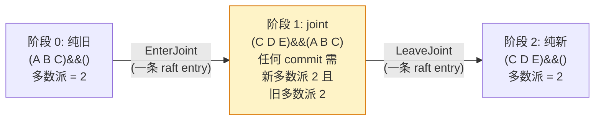

# 第二十一章 · 成员变更与 cluster

> 篇:P6 lease 与成员变更
> 主线呼应:上一章 lease 管的是"key 的生命周期"——客户端挂了,key 自动消失。这一章换一个更敏感的对象——**集群节点本身的生命周期**。加一台 etcd(扩容)、踢一台坏掉的 etcd(缩容)、把 leader 平滑让位给另一个节点,这些动作都直接动的是 Raft 的多数派配置。而多数派配置一动,就碰到了共识算法最锋利的边界:**绝不能让两个不相交的多数派同时存在,否则脑裂**。这一章服务二分法的**协议层**那一面:成员变更是 Raft 协议的一部分(它改变"多数派"这个定义本身),源码主体在 `etcd-raft` 仓的 `confchange/` 和 `quorum/`。

## 核心问题

**怎么安全地增删节点?Raft 的多数派是"N/2+1",但 N 是会变的——从 3 节点加到 5 节点那一刻,旧多数派(2 个)和新多数派(3 个)凭什么不会同时出现两个不相交的?单步成员变更(每次只增删一个节点)凭什么安全?Joint Consensus 两阶段又解决什么,凭什么安全?leader 怎么平滑交班给指定节点,既不丢已提交数据也不让集群短暂不可用?**

读完本章你会明白:

1. **成员变更为什么是共识问题里最锋利的一块**:配置本身是 raft 复制的状态,但改配置等于改"多数派"的定义——这一动作有自指的危险,处理不慎会脑裂。
2. **单步成员变更凭什么安全**:每次只增删一个节点,旧配置(⌊N/2⌋+1)和新配置(⌊(N±1)/2⌋+1)的任意两个多数派**必有交集**(鸽巢原理,P0-01 1.5/1.9 已证),所以一次 entry commit 即可切换。
3. **Joint Consensus 两阶段凭什么安全**:进入 joint 配置后,任何决策(包括 leave)需要旧**和**新两套配置**各自**多数派同意——双重多数派保证旧、新都不会单方面形成矛盾决策。
4. **leader transfer 怎么平滑交班**:leader 发 `MsgTimeoutNow` 让 transferee 立刻发起选举(绕过 PreVote),但在此之前先把它的日志追平;一个 electionTimeout 内交不出去就放弃。
5. **etcd 的 `Cluster` 怎么把这一切包成 API**:`AddMember`/`RemoveMember`/`PromoteMember` 怎么最终都变成一条 `ConfChange` 走 raft propose→commit→apply,以及 `StrictReconfigCheck` 在 propose 前怎么预检防脑裂。

> **如果一读觉得太难**:先只记住三件事——① 成员变更之所以敏感,是因为它改的是"多数派"本身的定义,改不好就脑裂;② **单步变更**(每次只增删一个)安全,因为旧新多数派必有交集,一条 raft entry 搞定;**Joint Consensus 两阶段**(进 joint → leave)用于一次性改多个或原子切配置,要求旧新两套多数派都同意才放行;③ 成员变更本身也是 raft entry,走 propose→commit→apply,和一条 `Put` 在共识路径上没有本质区别。

---

## 21.1 一句话点破

> **成员变更的危险在于:它改变的是"多数派"这个定义本身。从 3 节点扩到 5 节点的那一刻,旧配置的多数派是 2 个,新配置的多数派是 3 个,如果切换不当,可能出现两个不相交的多数派各自通过矛盾的决策——脑裂。Raft 给两条解:单步变更(每次只动一个节点,旧新多数派必有交集,所以一条 entry 切换就够)和 Joint Consensus 两阶段(进 joint 配置 → leave,要求旧新两套多数派各自同意)。无论哪条,变更本身都是一条 raft entry,走 propose→commit→apply,和一条 `Put` 走的是同一条共识路径——只是这条 entry 改的是"集群长什么样"。**

这是结论,不是理由。本章倒过来拆:先看"为什么不能直接从旧配置跳到新配置",再看单步变更凭什么救场,Joint Consensus 又凭什么,然后看 etcd 怎么把这一切包成 `Cluster.AddMember`,最后讲 leader transfer 的平滑交班。

---

## 21.2 为什么不能直接从旧配置跳到新配置

假设集群是 3 节点(A、B、C),你要扩成 5 节点(加 D、E)。最朴素的思路:leader 直接发一条"从现在起配置是 (A B C D E)"的消息给所有人,收到就生效。

> **不这样会怎样**:这个朴素方案会撞上一个致命问题——**不同节点切换配置的时刻不同,会出现两个不相交的多数派并存**。具体推演:

3 节点时多数派是 2 个,5 节点时多数派是 3 个。设想切换瞬间,A、B 先收到新配置,把"自己已经是 5 节点"当真;C 还停留在旧配置,认为"集群还是 3 节点"。

- 旧配置视角(C 和某个还没切换的节点):只要凑够 2 个就能 commit 一条 entry。
- 新配置视角(A、B、D、E 中凑 3 个):只要凑够 3 个就能 commit 另一条 entry。

最坏情况:C 和 D(假设 D 已切换但还没和 A/B 通信)凑成旧多数派 2 个 commit 了一条 entry X;同时 A、B、E 凑成新多数派 3 个 commit 了另一条 entry Y。**X 和 Y 可能矛盾**(都把自己当合法的 commit),但它们的通过集 `{C,D}` 和 `{A,B,E}` **不相交**——没有共同节点来"作证"哪个该作废。

这就是脑裂。P0-01 的 1.5 节我们用鸽巢原理证过:**任意两个多数派必有交集**——但这条性质只对**同一个 N**成立。一旦 N 在切换中(3 和 5 混杂),旧多数派(2 个,基于 N=3)和新多数派(3 个,基于 N=5)就可能不相交。成员变更的安全性,本质就是要堵这个"跨 N 的不相交"。

> **钉死这件事**:成员变更之所以是共识算法里最锋利的一块,不是因为它"更复杂",而是因为它**自指**——它改的是"多数派"本身的定义。Raft 平时靠"任意两个多数派必有交集"防脑裂,但变更瞬间这条性质会失效,必须用额外机制补上。

Raft 给了两条补法。下面分别拆。

---

## 21.3 单步成员变更:每次只动一个节点

第一条解,**单步成员变更**(single membership change):**每次只增删一个节点**(加一个或删一个,不一次改多个)。

### 21.3.1 凭什么安全:旧新多数派必有交集

这条解的安全性,靠的是一条关键的鸽巢推论:

> **N 个节点的过半子集(≥⌊N/2⌋+1)和 (N+1) 个节点的过半子集(≥⌊(N+1)/2⌋+1)必有交集。**

证明(P0-01 1.9 鸽巢的扩展):设旧多数派 A(|A| ≥ ⌊N/2⌋+1)和新多数派 B(|B| ≥ ⌊(N+1)/2⌋+1)。若 A、B 不相交,则 |A∪B| = |A|+|B| ≥ ⌊N/2⌋+1 + ⌊(N+1)/2⌋+1。分奇偶讨论:

- N 偶数:N=2k,则 ⌊N/2⌋+1 = k+1,⌊(N+1)/2⌋+1 = k+1,和为 2k+2 = N+2 > N+1,矛盾。
- N 奇数:N=2k+1,则 ⌊N/2⌋+1 = k+1,⌊(N+1)/2⌋+1 = k+2,和为 2k+3 = N+2 > N+1,矛盾。

故旧、新多数派必有交集。同理,N → N-1(删一个)也成立。∎

这条性质带来的直接后果:**任何时候,旧配置下的多数派和新配置下的多数派必然至少共享一个节点**。这个共同节点不会同时同意两个互相矛盾的决策(它一次只投一种票),所以**不可能同时存在两个不相交的、各自合法的多数派**——脑裂被堵死了。

> **打个比方**:旧议会 3 席过半是 2,新议会 4 席过半是 3。任何"旧议会 2 人通过"和"新议会 3 人通过"的组合,必然有至少一个人同时坐在两边——这个人不会对同一件事投两种相反的票,所以两个议会不可能各自通过矛盾决议。这就是单步变更能"一步到位"的数学根基。

### 21.3.2 源码:`Changer.Simple` 强制对称差 ≤ 1

这条"每次只动一个"的约束,在 etcd-raft 源码里被**硬性强制**。看 [`confchange/confchange.go`](../etcd-raft/confchange/confchange.go) 的 `Changer.Simple`(本地 clone @ `39eb80a`):

```go
// Simple carries out a series of configuration changes that (in aggregate)
// mutates the incoming majority config Voters[0] by at most one. This method
// will return an error if that is not the case, if the resulting quorum is
// zero, or if the configuration is in a joint state.
func (c Changer) Simple(ccs ...*pb.ConfChangeSingle) (tracker.Config, tracker.ProgressMap, error) {
    cfg, trk, err := c.checkAndCopy()
    if err != nil {
        return c.err(err)
    }
    if joint(cfg) {
        err := errors.New("can't apply simple config change in joint config")
        return c.err(err)
    }
    if err := c.apply(&cfg, trk, ccs...); err != nil {
        return c.err(err)
    }
    if n := symdiff(incoming(c.Tracker.Voters), incoming(cfg.Voters)); n > 1 {
        return tracker.Config{}, nil, errors.New("more than one voter changed without entering joint config")
    }

    return checkAndReturn(cfg, trk)
}
```

([confchange.go:128-145](../etcd-raft/confchange/confchange.go#L128-L145))

最后那个 [`symdiff`](../etcd-raft/confchange/confchange.go#L384-L398) 检查就是命门——它计算旧 Voters 和新 Voters 的**对称差**(一边有另一边没有的节点总数),如果超过 1,直接返回 `"more than one voter changed without entering joint config"` 错误。也就是说,你想用 `Simple` 一次改两个节点,源码层面就拒绝你,逼你走 Joint Consensus。

> **钉死这件事**:`Changer.Simple` 末尾的 `symdiff(...) > 1` 拒绝,不是"风格约束",是**安全性约束**——它把"单步变更必有交集"这条数学保证硬编码进了协议库。任何绕过 Simple 一次性改两个节点的尝试,在 etcd-raft 这里就被挡住了。

### 21.3.3 单步变更的流程:一条 entry 搞定

因为旧新多数派必有交集,单步变更**不需要两阶段**,一条 raft entry 就够:

1. leader propose 一条 `ConfChange` entry(比如 `ConfChangeAddNode` 加 D,或 `ConfChangeRemoveNode` 删 C)。
2. 这条 entry 像 `Put` 一样,被多数派复制、commit。
3. commit 后 apply 时,leader 调 `applyConfChange` 把配置从旧切到新。

切换的时机是安全的:**entry 被 commit 时,它用的是旧配置的多数派**;apply 之后用的是新配置的多数派;而旧新多数派必有交集,所以不存在"commit 用旧多数派、后续决策用新多数派、两者不相交"的窗口。

注意一个细节:这条 `ConfChange` entry 本身是在**旧配置**下被 commit 的——也就是说,在 D 真正成为 voter 之前,它必须先把日志追平(leader 会先把 D 当 learner 复制日志,或者 D 通过 snapshot + 追日志追上)。这就是为什么 etcd 推荐"先加 learner 让它追日志,再 promote 成 voter"——避免新加的 voter 一上来就拖慢多数派。

> **不这样会怎样(反面对比一次性改多个)**:如果你一次性把 (A B C) 改成 (A B D E F)(换了俩、加了俩),`symdiff = 4`,旧新多数派可能不相交——比如旧多数派 {B,C} 和新多数派 {D,E,F} 没有交集。这时如果切换瞬间 C 还停在旧配置、D/E/F 已切到新配置,就可能各自 commit 矛盾的 entry,脑裂。所以一次性改多个**必须**走 Joint Consensus 两阶段(下一节)。

---

## 21.4 Joint Consensus 两阶段:用双重多数派兜底

第二条解,**Joint Consensus**(联合共识,Raft 论文 4.3 节,etcd-raft 用 `ConfChangeV2` 表达):用于一次性改多个节点,或任何单步变更不够安全的场景。

### 21.4.1 核心思想:旧新各自都要过半

Joint Consensus 把配置变更拆成两个阶段:

1. **进入 joint 配置**(`C_{old,new}`):集群同时保留两套多数派配置——**outgoing(旧)** 和 **incoming(新)**。在这个阶段,任何决策(commit、选举)**必须同时得到旧配置的多数派和新配置的多数派同意**——是"且",不是"或"。
2. **leave joint 配置**(`C_{new}`):joint 配置下的 entry(也就是"leave 这件事"本身)被 commit 后,集群切到纯新配置,outgoing 被丢弃。

> **凭什么安全**:joint 阶段的"双重多数派"保证——旧配置不会单方面形成矛盾决策(因为任何 commit 都得过新多数派),新配置也不会(因为任何 commit 都得过旧多数派)。两个配置都被绑住了,谁也不能擅自行动。leave 这条 entry 本身也在 joint 下 commit,意味着旧新两套都同意"切换到纯新配置",切换是安全的。

用一张图把两阶段画清楚(以 (A B C) → (C D E) 为例,一次换俩):



阶段 1(joint)的关键:任何决策(包括 leave 那条 entry)都要**同时**满足 {C,D,E} 里过半(2 个)**和** {A,B,C} 里过半(2 个)。注意 C 同时在两边——这个交集节点是安全的锚点。但即便没有交集(比如 (A B) → (C D) 这种极端换血),双重多数派仍然保证旧、新都不能单方面通过矛盾决策:旧多数派 {A} 想通过什么,得新多数派 {C,D} 里至少一个同意才行,反之亦然。

### 21.4.2 源码:`JointConfig.CommittedIndex` 取两个多数派的最小

这个"双重多数派"在 etcd-raft 源码里是怎么算的?看 [`quorum/joint.go`](../etcd-raft/quorum/joint.go):

```go
// JointConfig is a configuration of two groups of (possibly overlapping)
// majority configurations. Decisions require the support of both majorities.
type JointConfig [2]MajorityConfig

// CommittedIndex returns the largest committed index for the given joint
// quorum. An index is jointly committed if it is committed in both constituent
// majorities.
func (c JointConfig) CommittedIndex(l AckedIndexer) Index {
    idx0 := c[0].CommittedIndex(l)
    idx1 := c[1].CommittedIndex(l)
    if idx0 < idx1 {
        return idx0
    }
    return idx1
}
```

([joint.go:17-19, 49-56](../etcd-raft/quorum/joint.go#L17-L56))

`JointConfig` 是个 `[2]MajorityConfig` 数组——`[0]` 是 incoming(新),`[1]` 是 outgoing(旧)。`CommittedIndex` 取两个各自多数派 commitIndex 的**最小值**:一条 entry 要被 joint 认为 committed,必须**同时**在两个 MajorityConfig 里都达到多数。这就是"双重多数派"在代码里的直接体现。

再看 [`VoteResult`](../etcd-raft/quorum/joint.go#L58-L75):

```go
func (c JointConfig) VoteResult(votes map[uint64]bool) VoteResult {
    r1 := c[0].VoteResult(votes)
    r2 := c[1].VoteResult(votes)

    if r1 == r2 {
        // If they agree, return the agreed state.
        return r1
    }
    if r1 == VoteLost || r2 == VoteLost {
        // If either config has lost, loss is the only possible outcome.
        return VoteLost
    }
    // One side won, the other one is pending, so the whole outcome is.
    return VotePending
}
```

选举投票也一样:joint 配置下,一个 candidate 要当选,**两套多数派都必须投给他**——只要有一套还没达到多数(`VotePending`),整体就是 `VotePending`(还没选上);只要有一套明确反对(`VoteLost`),整体就 `VoteLost`(选不上)。这保证 joint 阶段选出的 leader 对旧、新两套配置都是合法的。

> **钉死这件事**:`JointConfig` 用"取最小"实现 commit 的双重多数派、用"两套都赢才算赢"实现选举的双重多数派。这两段代码加起来不到 30 行,却是 Joint Consensus 安全性的全部——它们保证 joint 阶段没有任何一方(旧或新)能单方面做出有约束力的决策。

### 21.4.3 源码:`EnterJoint` 怎么搭出联合配置

那"进入 joint"这个动作在代码里怎么做?看 [`Changer.EnterJoint`](../etcd-raft/confchange/confchange.go#L51-L78):

```go
// EnterJoint verifies that the outgoing (=right) majority config of the joint
// config is empty and initializes it with a copy of the incoming (=left)
// majority config. That is, it transitions from
//
//	(1 2 3)&&()
//
// to
//
//	(1 2 3)&&(1 2 3).
//
// The supplied changes are then applied to the incoming majority config,
// resulting in a joint configuration that in terms of the Raft thesis[1]
// (Section 4.3) corresponds to `C_{new,old}`.
func (c Changer) EnterJoint(autoLeave bool, ccs ...*pb.ConfChangeSingle) (tracker.Config, tracker.ProgressMap, error) {
    cfg, trk, err := c.checkAndCopy()
    if err != nil {
        return c.err(err)
    }
    if joint(cfg) {
        err := errors.New("config is already joint")
        return c.err(err)
    }
    if len(incoming(cfg.Voters)) == 0 {
        err := errors.New("can't make a zero-voter config joint")
        return c.err(err)
    }
    // Clear the outgoing config.
    *outgoingPtr(&cfg.Voters) = quorum.MajorityConfig{}
    // Copy incoming to outgoing.
    for id := range incoming(cfg.Voters) {
        outgoing(cfg.Voters)[id] = struct{}{}
    }

    if err := c.apply(&cfg, trk, ccs...); err != nil {
        return c.err(err)
    }
    cfg.AutoLeave = autoLeave
    return checkAndReturn(cfg, trk)
}
```

([confchange.go:51-L78](../etcd-raft/confchange/confchange.go#L51-L78))

注释把动作讲得很清楚:从 `(1 2 3)&&()`(纯旧配置,outgoing 空)过渡到 `(1 2 3)&&(1 2 3)`(把当前 incoming 复制一份到 outgoing,作为 joint 里的"旧"那一半),然后再把用户要做的变更(`ccs...`)apply 到 incoming(变成新那一半)。最终结果是 `(新)&&(旧)` 这种 `C_{new,old}` 形态。

注意一个边界保护:开头 `if joint(cfg)` 检查——**如果当前已经是 joint 状态,拒绝再次 EnterJoint**。这是为了防止"joint 套 joint"这种协议库不支持的状态。

### 21.4.4 源码:`LeaveJoint` 怎么切到纯新

leave 的逻辑看 [`Changer.LeaveJoint`](../etcd-raft/confchange/confchange.go#L94-L121):

```go
// LeaveJoint transitions out of a joint configuration. ...
// the incoming config is promoted as the sole decision maker. In the
// notation of the Raft thesis[1] (Section 4.3), this method transitions from
// `C_{new,old}` into `C_new`.
func (c Changer) LeaveJoint() (tracker.Config, tracker.ProgressMap, error) {
    cfg, trk, err := c.checkAndCopy()
    if err != nil {
        return c.err(err)
    }
    if !joint(cfg) {
        err := errors.New("can't leave a non-joint config")
        return c.err(err)
    }
    for id := range cfg.LearnersNext {
        nilAwareAdd(&cfg.Learners, id)
        trk[id].IsLearner = true
    }
    cfg.LearnersNext = nil

    for id := range outgoing(cfg.Voters) {
        _, isVoter := incoming(cfg.Voters)[id]
        _, isLearner := cfg.Learners[id]

        if !isVoter && !isLearner {
            delete(trk, id)
        }
    }
    *outgoingPtr(&cfg.Voters) = nil
    cfg.AutoLeave = false

    return checkAndReturn(cfg, trk)
}
```

([confchange.go:94-L121](../etcd-raft/confchange/confchange.go#L94-L121))

LeaveJoint 干三件事:① 把 `LearnersNext`(joint 期间暂存的、要等 leave 才转正的 learner)挪到 `Learners`;② 清掉 outgoing 配置(`*outgoingPtr(&cfg.Voters) = nil`);③ 把 outgoing 里那些既不在新 incoming 也不是 learner 的节点,从 ProgressMap 里彻底删除(它们的复制进度不再被追踪)。leave 之后,集群只剩 incoming 这一套多数派,Joint Consensus 结束。

### 21.4.5 `ConfChangeV2` 怎么区分单步和 joint

etcd-raft 用 `ConfChangeV2` 这一个统一的协议消息,表达"单步"和"joint"两种语义。看 `applyConfChange` 在 raft.go 里怎么分发([raft.go:1951-1971](../etcd-raft/raft.go#L1951-L1971)):

```go
func (r *raft) applyConfChange(cc *pb.ConfChangeV2) *pb.ConfState {
    cfg, trk, err := func() (tracker.Config, tracker.ProgressMap, error) {
        changer := confchange.Changer{
            Tracker:   r.trk,
            LastIndex: r.raftLog.lastIndex(),
        }
        if cc.LeaveJoint() {
            return changer.LeaveJoint()
        } else if autoLeave, ok := cc.EnterJoint(); ok {
            return changer.EnterJoint(autoLeave, cc.Changes...)
        }
        return changer.Simple(cc.Changes...)
    }()
    // ...
    return r.switchToConfig(cfg, trk)
}
```

分发逻辑:

- `cc.LeaveJoint()` 返回 true(即 `Changes` 为空且当前是 joint)→ 走 `LeaveJoint`。
- `cc.EnterJoint()` 返回 ok(即 `Changes` 非空,显式要求进 joint)→ 走 `EnterJoint`。
- 否则(单步变更,`Changes` 只有一个且不要求 joint)→ 走 `Simple`。

也就是说,**同一个 `ConfChangeV2` 消息,根据其 `Changes` 字段的内容,自动走三条不同的路**。etcd 上层用 `ConfChange`(老协议,单步)或 `ConfChangeV2`(新协议,可单步可 joint)来 propose,底层统一到 `ConfChangeV2` 处理。

### 21.4.6 `AutoLeave`:进 joint 后自动 leave

注意 `EnterJoint` 有个 `autoLeave` 参数。如果它为 true,raft 会在 joint entry 被 apply 之后**自动 propose 一条 LeaveJoint**——上层不需要显式发第二条。这是 etcd 默认行为:`ConfChangeV2` 默认 `AutoLeave=true`,意味着用户一次 `MemberAdd` 调用,底层走"进 joint →(自动)leave joint"完整两阶段,对上层透明。

如果 `AutoLeave=false`,上层必须自己监控 joint 状态、在合适时机显式 propose 一条 leave。这用于上层想对两阶段做更精细控制的场景(比如等新节点都健康了再 leave)。etcd 默认不暴露这个旋钮,走 AutoLeave 路径。

---

## 21.5 上层保险:`Changer` 的 propose 时校验 + `StrictReconfigCheck`

光有协议层的对称差检查还不够,etcd 在上层还有两道保险,防止"理论上 raft 能接受、但实际会引发问题"的成员变更。

### 21.5.1 propose 时:不能在 unapplied conf change 期间再 propose

第一道:raft 状态机在 propose 一条新的 `ConfChange` 时,会检查"上一条 conf change 是否已 apply"。看 [`raft.go` stepLeader 对 MsgProp 的处理](../etcd-raft/raft.go#L1325-L1346):

```go
if cc != nil {
    alreadyPending := r.pendingConfIndex > r.raftLog.applied
    alreadyJoint := len(r.trk.Config.Voters[1]) > 0
    wantsLeaveJoint := len(cc.AsV2().Changes) == 0

    var failedCheck string
    if alreadyPending {
        failedCheck = fmt.Sprintf("possible unapplied conf change at index %d (applied to %d)", r.pendingConfIndex, r.raftLog.applied)
    } else if alreadyJoint && !wantsLeaveJoint {
        failedCheck = "must transition out of joint config first"
    } else if !alreadyJoint && wantsLeaveJoint {
        failedCheck = "not in joint state; refusing empty conf change"
    }

    if failedCheck != "" && !r.disableConfChangeValidation {
        r.logger.Infof("%x ignoring conf change %s at config %s: %s", r.id, DescribeConfChange(cc), r.trk.Config, failedCheck)
        m.GetEntries()[i] = &pb.Entry{Type: pb.EntryNormal.Enum()}
    } else {
        r.pendingConfIndex = r.raftLog.lastIndex() + uint64(i) + 1
        traceChangeConfEvent(cc, r)
    }
}
```

三条检查:

1. **`alreadyPending`**(`r.pendingConfIndex > r.raftLog.applied`):上一条 conf change 还没 apply,不能 propose 新的。为什么?因为如果两条 conf change 同时在 unapplied 队列里,apply 顺序可能让配置变更的语义混乱(比如先加 D 再删 D,apply 顺序错了就炸)。`pendingConfIndex` 记录"最近一条 conf change 的 index",apply 到这个 index 之后才允许下一条。
2. **`alreadyJoint && !wantsLeaveJoint`**:已经在 joint 状态了,新的变更又不是 leave——拒绝。joint 状态下不能叠加新的 joint,必须先 leave。
3. **`!alreadyJoint && wantsLeaveJoint`**:不在 joint 状态,新变更却是 leave(空 Changes)——拒绝。没进 joint 谈何 leave。

> **不这样会怎样(第一条)**:如果允许在 unapplied conf change 期间再 propose 新的,可能出现这种情况——第一条 ConfChangeAdd(D)和第二条 ConfChangeRemove(D)都在队列里,apply 时如果顺序处理,D 先加后删看起来没问题,但如果第一条还没 apply、第二条先 apply 了(比如第一条因为某些原因延迟),状态就乱了。`pendingConfIndex` 这条检查确保"一次只有一条 conf change 在路上"。

注意被拒绝时不是返回错误,而是把这条 entry **降级成 `EntryNormal`**(`m.GetEntries()[i] = &pb.Entry{Type: pb.EntryNormal.Enum()}`)——entry 还是被 append、被 commit,只是它不再是 conf change,apply 时当普通 entry 跳过。这是为了不阻塞 raft log 的复制(返回错误会让 leader 误以为 propose 失败)。

### 21.5.2 apply 路径:`hasUnappliedConfChanges` 阻止竞选

第二道保险更微妙。看 [`raft.go` 的 campaign 入口](../etcd-raft/raft.go#L983-L986):

```go
if r.hasUnappliedConfChanges() {
    r.logger.Warningf("%x cannot campaign at term %d since there are still pending configuration changes to apply", r.id, r.Term)
    return
}
```

`hasUnappliedConfChanges`([raft.go:995-1021](../etcd-raft/raft.go#L995-L1021))扫描 applied+1 到 committed 之间的所有 entry,看有没有 `EntryConfChange` 或 `EntryConfChangeV2`。如果有,**这个节点不能发起竞选**。

> **不这样会怎样**:设想 5 节点集群,leader propose 了一条 ConfChange 把配置从 (A B C D E) 改成 (A B C)(缩容)。这条 entry 已 commit 但还没 apply。这时如果某个节点的选举超时到了,它发起竞选,按当前(可能还没切到新配置)的 voters 算多数派——它可能拿到 3 票(按旧 5 节点)当选,但 apply 之后配置其实是 3 节点,它的"3 票当选"在新配置下可能不合法(比如拿到的是 D、E 的票,但 D、E 已经不在新配置里)。`hasUnappliedConfChanges` 这个检查堵住这个窗口:有未 apply 的 conf change 时,谁都不许竞选,等 apply 完再说。

---

## 21.6 etcdserver:把 raft 成员变更包成 `Cluster` API

讲完了协议层(etcd-raft 的 confchange/quorum),看 etcd 怎么把它包成用户能用的 `etcdctl member add/remove`。这一层在 etcd 主仓的 `server/etcdserver/api/membership/` 和 `server/etcdserver/server.go`。

### 21.6.1 `RaftCluster`:成员的内存 + 持久化视图

[`api/membership/cluster.go`](../etcd/server/etcdserver/api/membership/cluster.go) 定义了 [`RaftCluster`](../etcd/server/etcdserver/api/membership/cluster.go#L43-L61):

```go
// RaftCluster is a list of Members that belong to the same raft cluster
type RaftCluster struct {
    lg *zap.Logger

    localID types.ID
    cid     types.ID

    be MembershipBackend

    sync.Mutex // guards the fields below
    version    *semver.Version
    members    map[types.ID]*Member
    // removed contains the ids of removed members in the cluster.
    // removed id cannot be reused.
    removed map[types.ID]bool

    downgradeInfo  *serverversion.DowngradeInfo
    maxLearners    int
    versionChanged *notify.Notifier
}
```

`RaftCluster` 维护两份信息:① `members`(当前所有成员,包括 voter 和 learner);② `removed`(已删除的成员 ID,不可复用——防止"删了再加回来"造成的日志混乱)。`localID` 是自己的 ID,`cid` 是集群 ID。这些信息通过 `be`(MembershipBackend,底层是 bbolt)持久化,跨重启不丢。

> **钉死这件事**:`removed` 这个字段看着多余,其实是个安全锚——一个成员被删后,它的 ID 永远不能复用。为什么?因为如果删了 C 再加回 C,新 C 可能通过 snapshot + 追日志重建状态,但它和"旧 C"是两个不同的节点(中间可能换过机器),日志历史不连续。禁止 ID 复用,强制每次加节点用新 ID,避免这种混乱。

### 21.6.2 `AddMember`:成员变更走完整 raft 路径

用户调 `etcdctl member add` 最终走到 [`EtcdServer.AddMember`](../etcd/server/etcdserver/server.go#L1370-L1396):

```go
func (s *EtcdServer) AddMember(ctx context.Context, memb membership.Member) ([]*membership.Member, error) {
    if err := s.checkMembershipOperationPermission(ctx); err != nil {
        return nil, err
    }

    b, err := json.Marshal(memb)
    if err != nil {
        return nil, err
    }

    // by default StrictReconfigCheck is enabled; reject new members if unhealthy.
    if err := s.mayAddMember(memb); err != nil {
        return nil, err
    }

    cc := raftpb.ConfChange{
        Type:    raftpb.ConfChangeAddNode.Enum(),
        NodeId:  new(uint64(memb.ID)),
        Context: b,
    }
    if memb.IsLearner {
        cc.Type = raftpb.ConfChangeAddLearnerNode.Enum()
    }

    return s.configure(ctx, &cc)
}
```

注意三件事:

1. **`mayAddMember` 预检**:在 propose 之前,先检查"现在加这个成员安不安全"。这是 `StrictReconfigCheck` 的体现,下一小节讲。
2. **构造 `ConfChange`**:把成员信息(包括 PeerURLs、IsLearner)序列化进 `Context`,类型是 `ConfChangeAddNode`(加 voter)或 `ConfChangeAddLearnerNode`(加 learner)。
3. **`s.configure(ctx, &cc)`**:统一的入口,负责 propose + 等 apply。

`configure`([server.go:1743-L1780](../etcd/server/etcdserver/server.go#L1743-L1780)) 的核心是:

```go
func (s *EtcdServer) configure(ctx context.Context, cc *raftpb.ConfChange) ([]*membership.Member, error) {
    cc.Id = new(s.reqIDGen.Next())
    ch := s.w.Register(cc.GetId())

    start := time.Now()
    if err := s.r.ProposeConfChange(ctx, cc); err != nil {
        s.w.Trigger(cc.GetId(), nil)
        return nil, err
    }

    select {
    case x := <-ch:
        // ...
        resp := x.(*confChangeResponse)
        // etcdserver need to ensure the raft has already been notified
        // or advanced before it responds to the client.
        <-resp.raftAdvanceC
        // ...
        return resp.membs, resp.err
    case <-ctx.Done():
        // ...
    }
}
```

它注册一个等待(`s.w.Register`),propose 一条 ConfChange,然后**阻塞等 apply 完成**——等到 apply 路径把结果塞进 `ch`,而且还要等 `<-resp.raftAdvanceC`(确保 raft 状态机已经被 `Advance` 推进,见 [issue #15528](https://github.com/etcd-io/etcd/issues/15528) 的修复)。这和写路径(P2-08)"等 apply 才返回"是同一个模式——成员变更也要等到 apply,保证客户端看到"成功"时,集群配置真的已经变了。

### 21.6.3 apply 路径:调 raft + 更新 Cluster

ConfChange 被 commit 后,在 apply 循环里被处理。看 [`applyConfChange` 在 server.go](../etcd/server/etcdserver/server.go#L1994-L2069):

```go
func (s *EtcdServer) applyConfChange(cc *raftpb.ConfChange, ep *etcdProgress, shouldApplyV3 membership.ShouldApplyV3) (bool, error) {
    // ...
    if shouldApplyV3 {
        ep.confState = s.r.ApplyConfChange(cc)   // ← 调 raft 库应用配置变更
    }
    s.beHooks.SetConfState(ep.confState)
    switch cc.GetType() {
    case raftpb.ConfChangeAddNode, raftpb.ConfChangeAddLearnerNode:
        confChangeContext := new(membership.ConfigChangeContext)
        if err := json.Unmarshal(cc.Context, confChangeContext); err != nil {
            lg.Panic("failed to unmarshal member", zap.Error(err))
        }
        // ...
        if confChangeContext.IsPromote {
            s.cluster.PromoteMember(confChangeContext.Member.ID, shouldApplyV3)
        } else {
            s.cluster.AddMember(&confChangeContext.Member, shouldApplyV3)
            if confChangeContext.Member.ID != s.MemberID() {
                s.r.transport.AddPeer(confChangeContext.Member.ID, confChangeContext.PeerURLs)
            }
        }

    case raftpb.ConfChangeRemoveNode:
        id := types.ID(cc.GetNodeId())
        s.cluster.RemoveMember(id, shouldApplyV3)
        if id == s.MemberID() {
            return true, nil   // removedSelf = true
        }
        s.r.transport.RemovePeer(id)
    // ...
    }
    return false, nil
}
```

apply 时干两件事:① 调 `s.r.ApplyConfChange(cc)`——这是 etcd-raft 库的接口,内部就是 21.4.5 那个 `applyConfChange` 分发到 Simple/EnterJoint/LeaveJoint,把 raft 的 `ProgressTracker` 配置切到新状态;② 更新 `RaftCluster` 的成员视图(`AddMember`/`RemoveMember`/`PromoteMember`)+ 网络层 transport(加/删 peer 连接)。

注意 `removedSelf` 这个返回值——如果删的是自己(`id == s.MemberID()`),apply 路径返回 true,上层会据此让这个节点优雅退出(它已经不在集群里了,后续 raft 消息它都不该参与)。

> **钉死这件事**:成员变更的 apply 路径,把"协议层配置切换"(raft 的 ProgressTracker)和"应用层成员视图"(Cluster.members)+ "网络层连接管理"(transport)三件事**原子地**绑在一起。这是因为 ConfChange 是一条 raft entry,apply 是单线程串行的——要么三件都做,要么都不做,不会出现"raft 配置切了但 Cluster 没更新"或"Cluster 更新了但 transport 还连着旧 peer"这种半成品。

### 21.6.4 `StrictReconfigCheck`:propose 前的预检

回到 `mayAddMember`。这是 etcd 在 raft 协议库之外,加的一道**工程层**保险——不是 raft 要求的,而是 etcd 为了避免"加一个还没启动的成员导致 quorum 不足"这种实际故障,加的预检。看 [`server.go:1398-L1427`](../etcd/server/etcdserver/server.go#L1398-L1427):

```go
func (s *EtcdServer) mayAddMember(memb membership.Member) error {
    lg := s.Logger()
    if !s.Cfg.StrictReconfigCheck {
        return nil
    }

    // protect quorum when adding voting member
    if !memb.IsLearner && !s.cluster.IsReadyToAddVotingMember() {
        // ...
        return errors.ErrNotEnoughStartedMembers
    }

    // Treat the new member as unavailable when checking quorum safety.
    if !isConnectedToQuorumAfterAddingNewMemberSince(s.r.transport, time.Now().Add(-HealthInterval), s.MemberID(), s.cluster.VotingMembers()) {
        // ...
        return errors.ErrUnhealthy
    }

    return nil
}
```

两条检查:① `IsReadyToAddVotingMember`——当前启动的成员数是否够(避免在 quorum 已经紧张时再加一个拖累);② `isConnectedToQuorum`——leader 自己是否还能联系多数派(避免在分区时 propose 成员变更)。

> **不这样会怎样**:如果没这个预检,可能出现"3 节点里已经挂了 1 个,这时用户调 member add 加第 4 个"——单步变更理论上 raft 能接受(旧 3 多数派 2,新 4 多数派 3,有交集),但如果新加的节点还没启动,实际能投票的就剩 2 个老节点 + 0 个新节点,新配置下要 3 票才能 commit,但只能拿到 2 票——集群卡死。`StrictReconfigCheck` 在 propose 前就拦住这种"理论安全、实际危险"的操作。

类似的,删除成员有 `mayRemoveMember` 检查,看 [`cluster.go` 的 `IsReadyToRemoveVotingMember`](../etcd/server/etcdserver/api/membership/cluster.go#L660-L687):它算"删完之后还启动着的成员数是否 ≥ 新 quorum",不够就拒绝。这防止用户误操作"把多数派里的节点删到 quorum 凑不齐"。

---

## 21.7 leader transfer:平滑交班,不丢数据不停服

成员变更之外,还有一个常和它一起用的操作——**leader transfer**(领导者转让):把 leader 角色主动让给指定节点。常见场景:① 优雅停机——leader 要下线,先把 leader 让出去,避免一次选举抖动;② 负载均衡——把 leader 集中到性能更好的节点;③ 成员变更配合——删 leader 之前先 transfer。

### 21.7.1 核心挑战:不能丢已提交数据

leader transfer 最大的风险:新 leader 必须拥有所有已 commit 的日志(leader 完整性,P1-05 讲过)。如果 transferee(被转让的节点)日志落后,直接让它当 leader,它会丢已 commit 的数据。

Raft 的解法:**在转让之前,leader 先把 transferee 的日志追平**。

看 [`raft.go` stepLeader 对 `MsgTransferLeader` 的处理](../etcd-raft/raft.go#L1636-L1667):

```go
case pb.MsgTransferLeader:
    if pr.IsLearner {
        r.logger.Debugf("%x is learner. Ignored transferring leadership", r.id)
        return nil
    }
    leadTransferee := m.GetFrom()
    lastLeadTransferee := r.leadTransferee
    if lastLeadTransferee != None {
        if lastLeadTransferee == leadTransferee {
            // 同一个 transfer 在进行中, 忽略重复请求
            return nil
        }
        r.abortLeaderTransfer()
        // 放弃上一个 transfer, 启动新的
    }
    if leadTransferee == r.id {
        // 自己转给自己, 忽略
        return nil
    }
    // Transfer leadership to third party.
    r.logger.Infof("%x [term %d] starts to transfer leadership to %x", r.id, r.Term, leadTransferee)
    // Transfer leadership should be finished in one electionTimeout, so reset r.electionElapsed.
    r.electionElapsed = 0
    r.leadTransferee = leadTransferee
    if pr.Match == r.raftLog.lastIndex() {
        // transferee 日志已追平, 立刻发 TimeoutNow
        r.sendTimeoutNow(leadTransferee)
    } else {
        // 否则先发 Append 把它追平
        r.sendAppend(leadTransferee)
    }
```

([raft.go:1636-L1667](../etcd-raft/raft.go#L1636-L1667))

逻辑分两支:

- **transferee 日志已追平**(`pr.Match == r.raftLog.lastIndex()`):立刻发 `MsgTimeoutNow`,让它马上竞选。
- **transferee 日志落后**:调 `sendAppend` 先把它的日志追平。追平的标志是后续收到它的 `MsgAppResp` 报告 Match = lastIndex,那时再发 TimeoutNow([raft.go:1574-1575](../etcd-raft/raft.go#L1574-L1575),在处理 MsgAppResp 的分支里)。

### 21.7.2 `MsgTimeoutNow`:让 transferee 立刻竞选

`MsgTimeoutNow` 是 leader transfer 的关键消息。看 transferee 收到它怎么处理([raft.go:1758-L1763](../etcd-raft/raft.go#L1758-L1763)):

```go
case pb.MsgTimeoutNow:
    r.logger.Infof("%x [term %d] received MsgTimeoutNow from %x and starts an election to get leadership.", r.id, r.Term, m.GetFrom())
    // Leadership transfers never use pre-vote even if r.preVote is true; we
    // know we are not recovering from a partition so there is no need for the
    // extra round trip.
    r.hup(campaignTransfer)
```

关键注释:**"Leadership transfers never use pre-vote even if r.preVote is true"**。transferee 收到 TimeoutNow 后,直接发起**正式选举**(`campaignTransfer`),不走 PreVote(P1-03 讲过 PreVote 是防分区节点用高 term 打断集群,但 leader transfer 是 leader 主动发起、transferee 一定是健康的,所以不需要 PreVote 那一轮额外确认)。

> **钉死这件事**:`MsgTimeoutNow` 绕过 PreVote 是一个刻意的优化——它利用了"leader transfer 是 leader 主动触发"这个前提。如果是普通选举,PreVote 是必须的(防分区节点);但 transfer 场景下,leader 已经确认 transferee 健康(否则不会发 TimeoutNow),再走 PreVote 就是多余的一轮往返。这是 raft 里"根据场景调整协议流程"的一个典型例子——同一套安全性,不同路径有不同的效率权衡。

### 21.7.3 超时放弃:一个 electionTimeout 内交不出去就算了

leader transfer 有个硬性时间窗口。看 [`raft.go` 的 tickHeartbeat](../etcd-raft/raft.go#L873-L876):

```go
// If current leader cannot transfer leadership in electionTimeout, it becomes leader again.
if r.state == StateLeader && r.leadTransferee != None {
    r.abortLeaderTransfer()
}
```

每次 heartbeat tick(默认 100ms 一次,累积到 electionTimeout 默认 1s),如果 leader 发现自己还在 transfer 状态(`leadTransferee != None`),就放弃(`abortLeaderTransfer` 把 `leadTransferee` 设回 `None`)。

> **不这样会怎样**:如果 transferee 一直追不上日志(比如它网络很差、或者日志差太多),leader 会一直阻塞在 transfer 状态——这期间 leader **拒绝所有新的 propose**([raft.go:1304-L1307](../etcd-raft/raft.go#L1304-L1307),`if r.leadTransferee != None { return ErrProposalDropped }`)。集群就不可写了。设一个 electionTimeout 的上限,保证"transfer 失败就放弃,恢复 leader 正常工作",不会因为一次 transfer 卡死整个集群。

注意放弃之后 leader 不会主动通知 transferee"别选了"——transferee 如果已经发起了选举(收到了 TimeoutNow),它可能会选上。这没问题:如果它选上了,说明它的日志已经追平(否则不会拿到多数派票),它当 leader 是安全的;如果它没选上,leader 还是原来的,集群继续工作。这就是为什么 transfer 超时放弃是安全的——最坏情况是 transferee 选上了(合法),或者没选上(也合法)。

### 21.7.4 etcdserver 层:`TransferLeadership` 等 transferee 当选

etcd 把 raft 的 transfer 包了一层,看 [`server.go` 的 `transferLeadership`](../etcd/server/etcdserver/server.go#L1249-L1267)(简化):

```go
s.r.TransferLeadership(ctx, lead, transferee)
for s.Lead() != transferee {
    select {
    case <-ctx.Done(): // time out
        return errors.ErrTimeoutLeaderTransfer
    case <-time.After(interval):
    }
}
```

[`node.TransferLeadership`](../etcd-raft/node.go#L601-L608) 只是往 `recvc` channel 塞一条 `MsgTransferLeader` 消息(注意 `From=transferee, To=lead`——模拟 transferee 发给 leader 的请求),真正的逻辑在 raft 状态机里(21.7.1)。etcdserver 层塞完消息后**轮询 `s.Lead()`,等 transferee 真的成为 leader 才返回**——给用户一个同步的"transfer 完成"语义。

---

## 21.8 技巧精解

本章挑两个最硬核的技巧单独拆透:① **单步成员变更的安全性**(鸽巢保证旧新多数派必有交集);② **Joint Consensus 双重多数派**(`JointConfig` 取两个 MajorityConfig 的最小 commitIndex)。这两个互为补充——单步变更用数学保证省掉两阶段,Joint Consensus 用两阶段兜底数学保证失效的场景。

### 21.8.1 单步成员变更的安全性:鸽巢保证旧新多数派必有交集

**问题**:从 N 节点扩到 N+1(或缩到 N-1),怎么保证切换瞬间不会出现两个不相交的多数派各自 commit 矛盾的 entry?

**Raft/etcd 的解法**:**限制每次只增删一个节点**。这样旧配置(N 个,多数派 ⌊N/2⌋+1)和新配置(N±1 个,多数派 ⌊(N±1)/2⌋+1)的任意两个多数派**必有交集**(鸽巢),不可能不相交,所以不会脑裂。变更只需要一条 raft entry(在旧配置下 commit,apply 后切到新配置)。

**源码佐证**:这个"每次只动一个"的约束,在 etcd-raft 里被硬编码。看 [`Changer.Simple`](../etcd-raft/confchange/confchange.go#L128-L145) 末尾:

```go
if n := symdiff(incoming(c.Tracker.Voters), incoming(cfg.Voters)); n > 1 {
    return tracker.Config{}, nil, errors.New("more than one voter changed without entering joint config")
}
```

`symdiff` 计算旧新 Voters 的对称差(一边有另一边没有的节点总数)。超过 1 就报错——你想用 `Simple` 一次改两个,源码拒绝你,逼你走 Joint Consensus。

**为什么 sound(鸽巢证明)**:

设旧多数派 A(|A| ≥ ⌊N/2⌋+1),新多数派 B(|B| ≥ ⌊(N+1)/2⌋+1)。若 A、B 不相交,|A∪B| = |A|+|B|。

- N=2k 偶:|A|+|B| ≥ (k+1)+(k+1) = 2k+2 = N+2,但 A∪B 最多 N+1 个元素,矛盾。
- N=2k+1 奇:|A|+|B| ≥ (k+1)+(k+2) = 2k+3 = N+2,同样矛盾。

故 A、B 必有交集。这个交集节点同时属于旧新两个多数派,它不会对同一件事投两种票,所以两个多数派不可能各自通过矛盾的决策——脑裂被堵死。∎

**反面对比(一次性改多个)**:

如果允许一次性把 (A B C) 改成 (A B D E F)(symdiff=4),旧多数派 {B,C}(2 个)和新多数派 {D,E,F}(3 个)**可能不相交**。切换瞬间如果 C 还停在旧配置、D/E/F 已切新配置,就可能各自 commit 矛盾 entry——脑裂。这就是为什么"一次性改多个必须走 Joint Consensus 两阶段"(下一技巧)。

> **钉死这件事**:单步成员变更的安全性,完全建立在"旧新多数派必有交集"这条鸽巢推论上。这条推论只对 N → N±1 成立(改一个节点),改多个就不成立——所以 `Changer.Simple` 的 `symdiff > 1` 拒绝不是风格约束,是数学约束。Raft 把"数学上什么时候单步安全"硬编码进了协议库,不留给用户犯错的空间。

### 21.8.2 Joint Consensus 双重多数派:`JointConfig` 取最小 commitIndex

**问题**:一次性改多个节点(单步数学不成立),怎么安全切换?

**Raft/etcd 的解法**:Joint Consensus 两阶段——先进入 joint 配置(任何决策需要旧**和**新两套配置**各自**多数派同意),在 joint 下 commit 变更 entry,再 leave 到纯新配置。

**源码佐证**:这个"双重多数派"在 etcd-raft 里用一个 `[2]MajorityConfig` 数组表达,commit 时取两个的最小值。看 [`quorum/joint.go`](../etcd-raft/quorum/joint.go#L17-L56):

```go
// JointConfig is a configuration of two groups of (possibly overlapping)
// majority configurations. Decisions require the support of both majorities.
type JointConfig [2]MajorityConfig

// CommittedIndex returns the largest committed index for the given joint
// quorum. An index is jointly committed if it is committed in both constituent
// majorities.
func (c JointConfig) CommittedIndex(l AckedIndexer) Index {
    idx0 := c[0].CommittedIndex(l)
    idx1 := c[1].CommittedIndex(l)
    if idx0 < idx1 {
        return idx0
    }
    return idx1
}
```

`c[0]` 是 incoming(新),`c[1]` 是 outgoing(旧)。一条 entry 要被 joint 认为 committed,必须在 `c[0]` 和 `c[1]` 里**各自**达到多数——代码用"取两个 commitIndex 的最小值"实现:joint 的 commitIndex 就是两个配置各自 commitIndex 的较小者,任何超过这个较小者的 entry 都不算 committed。

选举投票也一样,看 [`JointConfig.VoteResult`](../etcd-raft/quorum/joint.go#L58-L75):

```go
func (c JointConfig) VoteResult(votes map[uint64]bool) VoteResult {
    r1 := c[0].VoteResult(votes)
    r2 := c[1].VoteResult(votes)

    if r1 == r2 {
        return r1
    }
    if r1 == VoteLost || r2 == VoteLost {
        return VoteLost
    }
    return VotePending
}
```

两套都赢才赢(`r1 == r2 == VoteWon`),任一输就输(`VoteLost`),否则 pending。这保证 joint 阶段选出的 leader 对旧、新两套配置都是合法的。

**为什么 sound(双重多数派如何防脑裂)**:

joint 阶段,任何 commit(包括 leave 那条 entry)都要旧、新两套各自多数同意。设想旧配置想单方面 commit 一条矛盾 entry X——它过得了旧多数派,但过不了新多数派(新多数派没同意),所以 X 不会被 commit。反之新配置想单方面 commit Y——过不了旧多数派。两套配置互相绑住,谁也不能擅自行动。

leave 这条 entry 也在 joint 下 commit,意味着旧、新两套都同意"切换到纯新配置"——切换是双方共识,不是单方面决定。切换之后(outgoing 被丢弃),只剩新配置一套多数派,后续决策都按新配置走,回到了"普通 raft"的安全状态。

**反面对比(直接从旧跳新)**:

如果不用 Joint Consensus,直接从旧配置跳到新配置——切换瞬间不同节点切换时刻不同,可能出现 P0-01 1.5 节证过的"跨 N 的不相交多数派"问题(旧 3 节点多数派 2 个、新 5 节点多数派 3 个,可能不相交)。Joint Consensus 用"joint 阶段两套都要同意"这个更强的条件,把切换瞬间的脑裂窗口堵死——切换不是"跳",是"先双轨并行(joint),再确认无误后切单轨(leave)"。

> **钉死这件事**:Joint Consensus 的安全性,全部浓缩在 `JointConfig.CommittedIndex` 那 7 行代码(取两个 MajorityConfig 的最小 commitIndex)和 `VoteResult` 那十几行(两套都赢才赢)里。双重多数派这个概念听起来抽象,落到代码就是"取最小"和"两套都同意"——这是 raft 把抽象安全性变成可执行代码的典范。

---

## 章末小结

这一章服务二分法的**协议层**那一面:成员变更是 Raft 协议的一部分(它改变"多数派"这个定义本身),源码主体在 `etcd-raft` 的 `confchange/` 和 `quorum/`。它的敏感性在于**自指**——改的是多数派本身,处理不慎会脑裂。Raft 给了两条解,etcd 都实现了:

1. **单步成员变更**(每次只增删一个):靠鸽巢保证旧新多数派必有交集,一条 raft entry 搞定。
2. **Joint Consensus 两阶段**(进 joint → leave):用双重多数派(旧、新各自都要过半)兜底,用于一次性改多个或原子切配置。

加上 leader transfer(平滑交班)和 etcdserver 的 `Cluster` 封装(AddMember/RemoveMember/PromoteMember + StrictReconfigCheck 预检),就构成了 etcd 成员管理的完整图景。所有这些操作——加节点、删节点、转 learner、交班——最终都变成一条 raft entry,走 propose→commit→apply,和一条 `Put` 在共识路径上没有本质区别。成员变更是共识协议里最锋利的一块,但它的锋利都被协议库(etcd-raft)和上层(etcdserver)用数学保证 + 工程预检层层兜住了。

### 五个"为什么"清单

1. **为什么成员变更不能直接从旧配置跳到新配置?** 不同节点切换时刻不同,会出现旧多数派(基于 N)和新多数派(基于 N±k)不相交的窗口——两个不相交多数派各自 commit 矛盾 entry = 脑裂。P0-01 的鸽巢证明只对同一个 N 成立,跨 N 会失效。
2. **为什么单步变更(每次只动一个节点)安全?** N 和 N±1 的过半子集必有交集(鸽巢扩展,21.3.1 已证)。旧新多数派的交集节点不会同时同意矛盾决策,所以不会脑裂。变更只需一条 raft entry(旧配置下 commit,apply 后切新)。`Changer.Simple` 的 `symdiff > 1` 检查把这条数学约束硬编码。
3. **为什么 Joint Consensus 要两阶段?** 单步数学不成立的场景(一次改多个),用 joint 配置的"双重多数派"兜底:任何 commit 需要旧**和**新两套配置各自多数同意(`JointConfig.CommittedIndex` 取两个的最小值)。leave 也在 joint 下 commit,意味着旧新都同意切换。两阶段保证切换不是"跳",是"先双轨并行(joint)再确认切单轨(leave)"。
4. **为什么 leader transfer 要先把 transferee 日志追平?** 新 leader 必须有所有已 commit 日志(leader 完整性)。transferee 落后时,leader 先 `sendAppend` 追平,Match 等于 lastIndex 后才发 `MsgTimeoutNow` 让它竞选。一个 electionTimeout 内追不平就放弃(`abortLeaderTransfer`),避免 leader 长期拒绝 propose 卡死集群。
5. **为什么 etcd 要在 raft 之外加 `StrictReconfigCheck`?** raft 协议本身只保证"数学上安全",但实际操作中"加一个还没启动的节点"会让新配置的 quorum 永远凑不齐(理论安全、实际卡死)。`mayAddMember`/`mayRemoveMember` 在 propose 前预检"启动成员数是否够""leader 是否还能联系多数派",拦住这种工程层故障。

### 想继续深入往哪钻

- **`ConfChangeV2` 协议消息**:etcd-raft 把单步和 joint 统一到一个 `ConfChangeV2` 消息里,通过 `Changes` 字段的内容自动分发(Simple/EnterJoint/LeaveJoint)。想看完整的协议消息定义,读 [`raftpb/raft.proto`](../etcd-raft/raftpb/raft.proto) 里 `ConfChangeV2` 和 `ConfChangeSingle` 的定义。
- **`confchange/restore.go`**:本章只讲了运行时的成员变更,没讲启动恢复时怎么从持久化的 `ConfState` 重建配置。[`Restore`](../etcd-raft/confchange/restore.go#L119-L155) 函数把一个 `ConfState` 翻译成一串 `ConfChangeSingle` 操作,逐一 apply 重建 `ProgressTracker`——这属于 P5-19(启动恢复)的范畴。
- **TLA+ 规约**:`etcd-raft/tla/` 里有 Raft 的形式化规约,其中包含成员变更(Joint Consensus)的安全性证明。这是工业级共识算法怎么被数学证明对的范本,P7-22 会详讲。
- **真实源码**:本章引用的核心文件——`etcd-raft` 仓的 `confchange/confchange.go`(Changer:Simple/EnterJoint/LeaveJoint)、`confchange/restore.go`(恢复重建)、`quorum/majority.go`(MajorityConfig 的 CommittedIndex/VoteResult)、`quorum/joint.go`(JointConfig 双重多数派)、`raft.go`(applyConfChange 分发、MsgTransferLeader/MsgTimeoutNow、pendingConfIndex 校验、hasUnappliedConfChanges);etcd 主仓的 `server/etcdserver/api/membership/cluster.go`(RaftCluster、AddMember/RemoveMember/PromoteMember、IsReadyToAdd/Remove)、`server/etcdserver/server.go`(AddMember/RemoveMember/configure/applyConfChange/mayAddMember/transferLeadership)、`etcd-raft/node.go`(ProposeConfChange/ApplyConfChange/TransferLeadership)。所有行号均经 Grep/Read 核实,etcd-raft @ `39eb80a`、etcd 主仓 @ `61d518f`。
- **Multi-Raft**:本章讲的是单 raft 组的成员变更。TiKV/CockroachDB 用 Multi-Raft(一个集群跑成千上万个 raft 组),每个 raft 组独立做成员变更(region 调度),这涉及更复杂的跨组协调。附录 B 会点一下。

### 引出下一章

成员变更是共识协议里最锋利的一块,但它的锋利都被数学(鸽巢、双重多数派)和工程(StrictReconfigCheck、pendingConfIndex)兜住了。讲到这里,一条 `Put` 从客户端到多数派共识、到 mvcc 存储、到 watch 推送、到 lease 续命、到故障恢复、到成员变更——整条旅程的每一个驿站我们都拆过了。最后一章 P7-22,我们退一步,把全书收束成几条贯穿的权衡哲学(共识换一致、多数派换可用、COW 换并发、batch 换吞吐),并看看 `etcd-raft/tla/` 的 TLA+ 形式化规约怎么从数学上证明 Raft 是对的——不只靠测试,靠证明。
