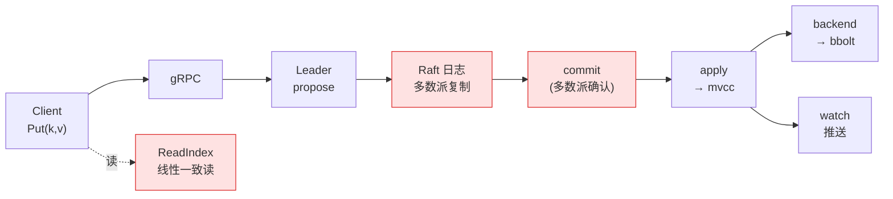
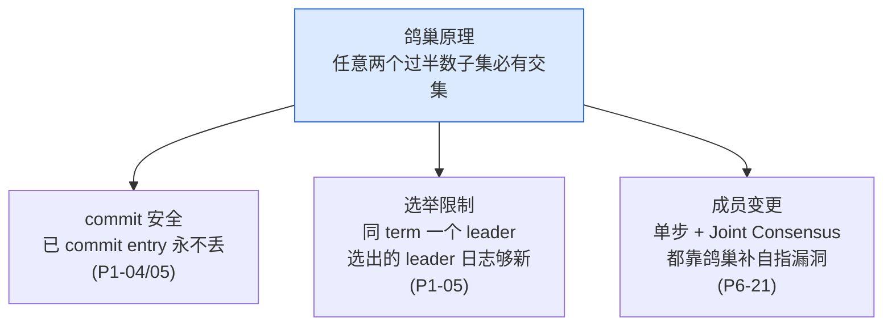
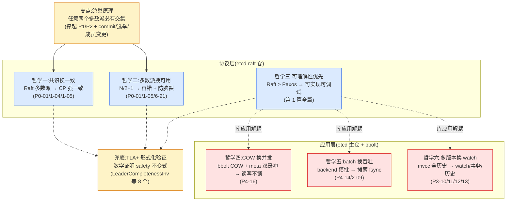

# 第二十二章 · 共识 vs 性能:etcd 的权衡哲学

> 篇:P7 收尾
> 主线呼应:这是全书的**最后一章**,也是**收束章**。前 21 章我们把一条 `Put` 从客户端走到多数派共识、走到 mvcc 多版本存储、走到 watch 推送、走到 lease 续命,又拆了故障时怎么不丢不乱、成员怎么安全增删。每一个驿站、每一个机制,etcd 都做了一个**取舍**:用某样代价,换某样更重要的东西。这一章不引入任何新机制,只把前 21 章的机制收束成几条**贯穿全书的权衡哲学**,再回到全书最开始那条数学——"任意两个多数派必有交集"——看它凭什么同时撑起 commit、选举、成员变更三件事,最后钻进 `etcd-raft/tla/` 的 TLA+ 形式化规约,看工业级共识算法怎么被**数学证明对**,而不只靠测试。读完这一章,你该能把整本书合上,用自己的话讲清 etcd 在每个设计点上做了什么取舍、为什么这些取舍是"对的"。

## 核心问题

**etcd 在每一个设计点上都做了取舍——用共识换一致、用多数派换可用、用可理解性换可维护性、用 COW 换并发、用 batch 换吞吐、用多版本换 watch。这些取舍的共同模式是什么?凭什么说它们是"对的"?**

读完本章你会明白:

1. etcd 的所有机制可以收束成**六条权衡哲学**,每条都是"用 X 换 Y,代价是 Z"的统一句式,且每条都对应前 21 章具体的源码佐证。
2. **多数派这条数学**("任意两个多数派必有交集")是全书所有"确认"类机制的地基——commit(P1-04)、选举限制(P1-05)、成员变更(P6-21)共用同一条鸽巢原理。
3. 工业级共识算法的正确性**不能只靠测试**,etcd-raft 用 **TLA+ 形式化规约 + TLC model checker** 在数学上证明 Raft 的核心 safety 不变式(如 `LeaderCompletenessInv`:已 commit 的 entry 在所有更高 term 的 leader 里都还在)。
4. etcd 4.0 把 raft 拆成独立仓 `etcd-io/raft`、bbolt 也独立,这个"协议层/应用层/底座"的**三仓切分**本身就是一条工程哲学——库与应用解耦,让同一个共识库被 Kubernetes、TiKV、CockroachDB 共享。

---

## 22.1 一句话点破

> **etcd 是一台"取舍机器"。它的每一个机制,都是在"正确性"和"性能/可用性/工程简化"之间找平衡,而平衡的支点永远是那一条数学——"任意两个多数派必有交集"。共识换一致是这条数学的直接应用,COW、batch、多版本是它落地的工程手段,TLA+ 是给它兜底的数学证明。读懂这条主线,前 21 章的零散机制就连成了一张网。**

这是结论,不是理由。本章倒过来拆:先一条一条过六条权衡哲学(每条配前 21 章的源码佐证),再把多数派这条数学升华一次(看它怎么同时撑起三件事),接着讲三仓切分的工程哲学,最后钻进 TLA+ 规约看形式化验证怎么给共识算法兜底。

---

## 22.2 从一条旅程说起:每个驿站都是一个取舍

在拆哲学之前,先把一条 `Put` 的旅程快速回放一遍,但这次换一个视角——不再看"它怎么走",而是看**每个驿站上 etcd 付了什么代价、换了什么**。



红底的三个驿站(`Raft 多数派复制`、`commit`、`ReadIndex`)是**付共识代价**的地方;其余驿站是**付落地代价**的地方。整条旅程上,etcd 一共做了至少六个非平凡的取舍。下面一条一条拆。

---

## 22.3 哲学一:共识换一致(用 Raft 多数派,换强一致 CP)

**这条哲学对应 P0-01(CAP)、P1-04(commit)、P1-05(safety)。**

这是全书最根本的一条取舍,也是 etcd 这个系统存在的理由。

**问题**:一条写操作,怎么保证它一旦返回客户端"成功",就绝对不会丢、绝对不会和其他副本冲突?

**不这样会怎样**:如果不要共识——单机存,宕机即丢(可用性硬伤);朴素多副本各写各的,网络分区时脑裂(正确性硬伤,见 P0-01 1.4 节)。这两条路在生产系统里都走不通。

**所以这样设计**:etcd 用 Raft。每条写必须经 leader propose、复制到**多数派**、被多数派确认后才算 `commit`,commit 之后才 apply、才返回客户端成功。这意味着:

- 一条写操作的延迟 = leader 处理 + 多数派往返 RTT + 持久化 WAL 的 `fdatasync`。**这是共识的代价,逃不掉**。
- 代价换来的是**线性一致性**(linearizability):客户端看到"成功"的操作,一定已经被多数派确认,不会丢、不会乱。

**源码佐证**:回到全书第一章 1.8 节那段 [`raftNode.start()`](../etcd/server/etcdserver/raft.go#L174) 循环——一条 `Put` 进来,要等它走完 `propose → 多数派复制 → commit → apply` 全程,客户端才能拿到响应。P2-08 讲过,etcdserver 的 `Propose` 不是 commit 就返回,而是**等 apply 才返回**——这是把"线性一致"推到极致:客户端拿到成功时,数据已经落在 mvcc 里、能被线性一致读看见了。

> **钉死这件事**:etcd 选了 CP 角(P0-01 1.6 节)。它用"写必须过多数派"这个延迟代价,换"已返回成功的写绝不丢、绝不冲突"这个正确性保证。**共识换一致,这是 etcd 的立身之本。**

**代价的另一面**:分区时少数派那一边凑不到多数派,**不可写**(P0-01 1.6 节)。这是 CP 的必然代价——宁可拒绝服务,也不让数据不一致。对一个配置中心、Kubernetes 的事实来源,这个取舍是对的:数据错了比暂时不可用严重得多。

---

## 22.4 哲学二:多数派换可用(用 N/2+1,换容错 + 防脑裂)

**这条哲学对应 P0-01 1.5/1.9、P1-05(选举限制)、P6-21(成员变更)。**

共识换一致回答了"要不要多数派";这条哲学回答"**多数派为什么是过半数(N/2+1)**,而不是别的阈值"。

**问题**:判定一个决策(commit、选举、配置变更)生效,需要多少节点同意?

**不这样会怎样**(P0-01 1.9 节的反面对比):
- 阈值 = 全部(N):任意一个节点故障就卡死,毫无容错。
- 阈值 = 固定少数(如 1):可能有两个不相交的少数派各自通过矛盾的决策,脑裂。
- 阈值 = 刚好一半(N 偶数时):两个恰好各占一半的子集不相交,仍可能矛盾。

**所以这样设计**:**严格过半数**(N/2+1)。它是在数学上**唯一**满足下面这条性质的阈值:

> **任意两个过半数子集,必有至少一个公共节点**(鸽巢原理,P0-01 1.9 节有完整证明)。

这条性质是全书所有"确认"类机制的地基。我们会在 22.7 节把它升华一次——它同时撑起了 commit 安全、选举限制、成员变更三件事。

**源码佐证**:etcd-raft 仓的 TLA+ 规约 [`etcdraft.tla`](../etcd-raft/tla/etcdraft.tla#L153-L155) 把这条数学写成了规约的一句话:

```tla
\* The set of all quorums. This just calculates simple majorities, but the only
\* important property is that every quorum overlaps with every other.
Quorum(c) == {i \in SUBSET(c) : Cardinality(i) * 2 > Cardinality(c)}
```

第 154 行的注释一语道破:**唯一重要的性质是"每个 quorum 互相相交"(overlap)**。这正是 P0-01 1.9 节那条鸽巢原理的 TLA+ 表达。注意这个定义对**任意配置 c** 成立——包括成员变更过程中的 joint config(联合配置),这一点我们在 P6-21 讲 Joint Consensus 时见过:双重多数派(旧配置过半 + 新配置过半)依然各自满足 `Cardinality * 2 > Cardinality(c)`,所以"任意两个双重多数派必有交集"成立,脑裂被堵死。

> **钉死这件事**:"过半数"不是拍脑袋的数字,是集合论的必然。3 节点容忍 1 故障、5 节点容忍 2 故障——**奇数节点是最经济的部署**(偶数 N 和 N-1 容错能力一样,却多一台机器成本)。这是为什么生产环境 etcd 几乎总是 3 或 5 节点。

---

## 22.5 哲学三:Raft 的可理解性优先(选 Raft 而非 Paxos)

**这条哲学对应第 1 篇全篇(P1-02 ~ P1-06)。**

这条哲学不在某一个机制上,而在"为什么是 Raft"这个元选择上。

**问题**:共识算法的事实标准,在 Raft 之前是 Paxos。Paxos 更早、更通用、数学上更优雅。为什么 etcd(以及 TiKV、CockroachDB)都选了 Raft?

**不这样会怎样**:Paxos 极难理解,实现极易出错。一个难理解、难实现、难调试的算法,即使数学上再优雅,在工程上也是负担——工程师实现时会引入微妙的 bug,这些 bug 在生产环境的罕见故障组合下才会暴露,极难复现和定位。Raft 论文的标题就是 *"In Search of an Understandable Consensus Algorithm"*——它把"可理解性"当成**一等设计目标**,而不仅是性能或通用性。

**所以这样设计**:Raft 用三个**直观的概念**,把共识拆成相对独立的三块:

- **term(任期)**(P1-02):一个单调递增的逻辑时钟。每次选举 term 加 1。"一个 term 一个节点最多投一票"这条规则,直接堵住"同一任期选出两个 leader"。
- **leader**(P1-03):所有写都经 leader 排序,日志天然有序,避免了多主冲突。
- **log matching**(P1-04):`(term, index)` 唯一标识一条 entry,prevLogTerm 匹配则此前所有 entry 都一致(归纳法)。

这三个概念让人能**在脑子里放映**一次选举、一次日志复制的全过程——这是 Paxos 做不到的。可理解性带来三个直接好处:

1. **实现正确**:etcd-raft、TiKV 的 raft-rs、CockroachDB 都基于 Raft,实现互相印证,bug 更少。
2. **调试可行**:leader 挂了、日志不一致、选举卡住——这些故障在 Raft 的概念框架里有清晰的定位方法(term 落后?日志冲突?凑不到多数派?)。
3. **形式化验证可行**:正是因为 Raft 可理解,它才能被写成 TLA+ 规约并穷举验证(见 22.9 节)。Paxos 也有 TLA+ 规约,但 Raft 的规约更接近实现、更易对照。

> **钉死这件事**:Raft 的胜利不是性能胜利(Raft 和 Paxos 性能相当),是**可理解性胜利**。etcd 选 Raft,等于选了"能被正确实现、能被调试、能被形式化验证"这条路。这是工程上更重要的属性。Raft 论文里那句"understandable",比任何 benchmark 都值钱。

**代价**:Raft 把"三个子问题(选主、复制、安全)"拆开,换来可理解性,但也引入了一些 Paxos 没有的边界情况——最著名的就是 **Figure 8 陷阱**(P1-04):旧 term 的 entry 即便被多数派持有,也不能直接 commit,必须靠一条当前 term 的 entry(新 leader 的 noop)"间接"提交。这是 Raft 为可理解性付的一个小代价:规则更直观,但有一条不那么直观的安全边界,得靠 P1-04 那样专门讲透。

---

## 22.6 哲学四:COW 换并发(用 Copy-On-Write,换读写不锁)

**这条哲学对应 P4-16(bbolt COW + meta 双缓冲)。**

前面三条哲学都在协议层(Raft);从这条开始,我们进入应用层。

**问题**:共识结果(commit 的 entry)要落地成可查的 KV 存储。这个存储要同时支持高并发读写——一边 apply 新 commit 写入,一边响应客户端读请求。怎么让读写不互相阻塞?

**不这样会怎样**(P4-16 的反面对比):朴素方案是加锁——写时锁住整个库,读等写完。但这意味着**每次写都阻塞所有读**,在读多写少的 etcd 场景下(配置中心读远多于写),读延迟会被写拖垮。另一种方案是 MVCC 多版本,但实现复杂、内存开销大。

**所以这样设计**:bbolt 用 **Copy-On-Write(COW)+ meta 页双缓冲**:

- **COW**:写事务不改原页,而是复制路径上的每个 B+tree 节点(从叶子到根),在新页上改。原页不变,正在读旧页的读事务完全不受影响。
- **meta 双缓冲**:两个 meta 页按 `txid % 2` 交替写。提交时先写所有数据页并 `fsync`,再写一个 meta 页并 `fsync`——单页原子写换事务原子性。读事务开始时拷贝一份 meta 页指针,整个读事务期间"看"到的是固定的快照视图。

**源码佐证**:P4-16 的小结把这条哲学说得很直白——"**COW 用'多复制几个页'这个代价,换来了'读完全不阻塞写、写完全不阻塞读、事务原子可恢复'这三件事一起成立**。"

**代价是写放大**:改一个 key 可能要复制 3~5 个 B+tree 页(叶子 → 分支 → 根)。这是 bbolt 为"读写并发不锁"付的代价。etcd 接受这个代价,因为:

- etcd 的**读远多于写**(配置中心典型负载),读延迟敏感,COW 让读完全不阻塞,收益巨大。
- 写放大换来的磁盘开销,在 etcd 的数据规模(典型几 GB)下可接受;靠 backend 的 batch 攒批(见 22.7 节)进一步摊薄单次写的 COW + fsync 开销。

> **钉死这件事**:bbolt 的"读写并发不锁"不是一句口号,是 **COW(不改原页)+ meta 双缓冲(轮替写、原子翻转)+ 读事务值拷贝 meta(固定视图)** 三件事的乘积。这三件事缺一不可,联手让"写时不锁读、读时不锁写、崩溃可恢复"同时成立。这是 etcd 存储底座最精妙的一笔。

---

## 22.7 哲学五:batch 换吞吐(用攒批提交,换写吞吐)

**这条哲学对应 P4-14(backend 批事务)、P2-09(batch apply)。**

COW 解决了"读写并发不锁",但 COW + fsync 的单次开销不小(复制页 + 写脏页 + fsync 等磁盘)。如果每条 raft entry apply 都单独开一个 bbolt 写事务、单独 fsync,写吞吐会被磁盘 IO 拖垮。

**问题**:怎么把 COW + fsync 的开销摊薄?

**不这样会怎样**(P4-14 的反面对比):每次写一个 bbolt 事务,每次 fsync——单条写延迟 = COW 复制 + 全部脏页写盘 + fsync 的 fsync 延迟。在高写入率下,磁盘成为瓶颈,raft apply 跟不上 commit,leader 的 `committedEntries` 队列堆积,整个集群反压。

**所以这样设计**:backend 在 bbolt 之上套了一层 `batchTx`——**攒一批写、一次 commit、一次 fsync**。攒批的触发有三个条件(P4-14):

- **批大小到上限**(`batchLimit`,默认 10000):攒够了就 commit。
- **定时器到期**(`batchInterval`,默认 100ms):防止攒批周期太长让写延迟过高。
- **delete 操作**:delete 立即 commit(因为 tx_buffer 不缓冲 delete,避免处理 tombstone 的复杂性——这是 backend 在"正确性"和"工程简化"之间的一个精妙权衡)。

**源码佐证**:P4-14 的小结有一句漂亮的概括——"**共识(Raft)管'不丢不乱',backend 管'在不丢不乱的前提下,够快'**。"

**代价是延迟波动**:批是攒的,一条写在批里要等批 commit 才算"落盘"。100ms 的 `batchInterval` 意味着一条写最坏要等 100ms 才落盘——这是 etcd 在吞吐和延迟之间的工程权衡(P4-14 详细讨论过)。批越大,吞吐越高,但单次 commit 时间越长,期间读被锁住的时间也越长(虽然 COW 让读不阻塞写,但 commit 翻转 meta 那一刻有极短的临界区)。10000 / 100ms 是 etcd 实测后的甜点。

**batch 在 raft apply 层也有**:P2-09 讲过,etcdserver 不是 apply 一条 entry 就唤醒一次,而是攒一批已 commit 的 entry 一起 apply(P2-07 的 `applyc` 通道就是批量的)。这和 backend 的 batch 是同一个哲学在两个层级的体现——**raft apply 批量喂给 mvcc,mvcc 批量写进 bbolt**,两层攒批叠加,把单条写的均摊开销压到最低。

> **钉死这件事**:batch 不是免费的午餐。它用"延迟波动(攒批周期)"和"批内可见性复杂性(tx_buffer 让未 commit 的写在批内可见)"换吞吐。这两个代价都被 tx_buffer 和 raft 的线性一致保证兜住了——读到的写虽然可能还没落盘,但 raft 已经保证它不会丢(P4-14 小结:"持久性 raft 已保证,可见性 tx_buffer 解决")。

---

## 22.8 哲学六:多版本换 watch/历史(用 mvcc 存全部历史,换 watch/快照读/历史查询)

**这条哲学对应 P3-10(revision)、P3-11(kvstore)、P3-12(watch)、P3-13(compaction)。**

前五条哲学都在"怎么让写又快又对";这一条转向"怎么让读、watch、事务这些高级特性成为可能"。

**问题**:一个 KV 存储,存"当前值"就够了,为什么要存"全部历史"?

**不这样会怎样**:如果只存当前值(key → value),那:

- **watch 没法做**:watch 要推送"每次变更",但旧值已经被覆盖,没法回放。
- **事务的快照隔离没法做**:事务要在某个一致的 revision 上读,但只有当前值就没法固定快照。
- **历史查询没法做**:没法回答"这个 key 在 5 分钟前的值是什么"。

这三件事是 etcd 作为配置中心/协调服务的**立身之本**(P3-10 小结)。Kubernetes 依赖 watch 维持集群状态、依赖事务做并发安全的更新、依赖历史做调试和审计。不要这些特性,etcd 就退化成一个普通的强一致 KV,失去了它的核心价值。

**所以这样设计**:etcd 用 **MVCC(多版本并发控制)**——每次修改分配一个全局单调递增的 `revision`,存"一个 key 的所有版本",而不是只存当前值。

- **treeIndex**(内存里的 B-tree,索引 key):每个 key 一条 `keyIndex`,记录它的各代 generation、每个 revision(P3-10)。
- **backend(bbolt,磁盘)**:存 revision → value 的映射(P3-11)。
- **revision 是全局单调的**:`main revision` 跨所有 key 共享,是 MVCC、watch、事务的共同游标(P3-10 小结:"`Main` 一定是全局的——它是跨所有 key 的逻辑时钟")。

有了多版本,三件事自然成立:

- **watch**:本质是"从某个 revision 开始订阅后续变更"(P3-12)。revision 是游标,新写产生新 revision,watcher 按 revision 顺序推送。
- **事务快照读**:事务在某个 revision 上读,看到的是那个时刻的一致快照。
- **历史查询**:给定一个 revision,能读到那个时刻的值。

**源码佐证**:P3-12 的小结点破了 watch 的本质——"**watcher 的本质是一个带 revision 游标的订阅者**。" revision 这个游标把 mvcc 的多版本存储和 watch 的事件推送干净地切开。

**代价是空间**:存全部历史意味着磁盘占用持续增长。etcd 用 **compaction**(P3-13)收敛——删掉某个 revision 之前的旧版本、收缩 keyIndex。compaction 有安全边界:不能压掉活跃 watcher 还需要的 revision(P3-13 小结)。这是多版本哲学的闭环:**存历史换特性,compaction 收空间代价**。

> **钉死这件事**:多版本不是 etcd 的一个"功能",是它的**架构基础**。revision 这条全局单调的逻辑时钟,把 MVCC、watch、事务三件事统一起来。这是 etcd 区别于"普通强一致 KV"的根本,也是它配得上 Kubernetes 事实来源这个角色的原因。

---

## 22.9 quorum 的数学收束:一条鸽巢,撑起三件事

讲完六条哲学,我们回到全书最开始那条数学,把它升华最后一次。因为这条数学太重要——它不是只支撑了 commit,而是同时撑起了**全书所有"确认"类机制**。

回顾 P0-01 1.9 节的命题:

> **在一个 N 个节点的集群里,任意两个过半数子集(各自 ≥ ⌊N/2⌋+1)必有至少一个公共节点。**

证明是简单的鸽巢(P0-01 1.9 节)。但这同一条数学,在前 21 章里**至少撑起了三件不同的事**:

### 撑起 commit 安全(P1-04)

一条 entry 被多数派复制后,leader 才 commit 它。之后任何新的"多数派决策"(比如选新 leader 时的投票多数派),必然包含至少一个见过这条 entry 的节点——因为两个多数派必有交集,这个交集节点见过已 commit 的 entry。这个交集节点不会投票给一个日志更落后的 candidate(选举限制,P1-05),所以新 leader 一定有这条 entry。于是:**已 commit 的 entry 永不丢**(leader 完整性,P1-05 的核心结论)。

### 撑起选举限制(P1-05)

candidate 拉票时,投票者只有觉得"candidate 的日志至少和我一样新"(`isUpToDate`)才投。一个 candidate 要拿到多数派票,意味着**多数派里每个节点都认可它日志够新**。结合鸽巢,任何两个选举多数派有交集——这保证了"同一 term 不会选出两个 leader"(因为交集节点只能投一票),也间接保证了"选出的 leader 有所有已 commit 的 entry"。

### 撑起成员变更(P6-21)

成员变更最锋利的地方在于**自指**——它改的是"多数派"本身的定义。P6-21 的小结点破:Raft 平时靠"任意两个多数派必有交集"防脑裂,但变更瞬间这条性质会失效(从旧配置切到新配置,两个不相交的配置可能各自形成多数派)。Raft 的两套解都靠鸽巢补上:

- **单步变更**(每次只增删一个节点):旧配置和新生成的配置(差一个节点)的任意两个多数派必有交集——鸽巢保证。
- **Joint Consensus**(两阶段):变更期间用**双重多数派**(旧配置过半 + 新配置过半都要满足),任意两个双重多数派依然有交集——因为双重多数派是两个普通多数派的交集,鸽巢性质传递成立。



> **钉死这件事**:前 21 章你看 Raft 到处用"多数派"——commit 要多数派、选举要多数派、成员变更要保持多数派交集——可能觉得是三件不相干的事。其实它们**共用同一条鸽巢原理**。这是 Raft 设计最优雅的地方:一条简单的数学,反复在不同场景下兜底。TLA+ 规约把这条数学写成了第 155 行的一句话(`Quorum(c) == ...`),它就是整个共识算法安全性的数学根基。

---

## 22.10 三仓切分:库与应用解耦的工程哲学

讲完协议层的数学,我们看一个工程层面的取舍——etcd 的**三仓切分**。这不是某一行代码的技巧,而是一个架构层面的哲学。

etcd 跨三个源码仓库(全书反复强调):

- [`etcd-io/raft`](../etcd-raft/)(即本书的 `etcd-raft` 仓):Raft 共识协议的**纯状态机**实现。它不知道磁盘、不知道网络、不知道 KV 是什么——只管"达成一致"。
- [`etcd-io/etcd`](../etcd/)(主仓):etcdserver,gRPC API、apply 流程、mvcc、WAL、lease、watch。它把 raft 库包成一个 KV 存储。
- [`etcd-io/bbolt`](../bbolt/):底层 B+tree 存储。被 etcd 的 mvcc/backend 用,也被别的项目(CNCF 生态里的几个)用。

**这个切分本身就是一条哲学**:把"协议"和"应用"切开,让协议成为**可复用的库**。

**问题**:为什么要把 raft 单独拆成一个仓,而不是焊在 etcdserver 里?

**不这样会怎样**:如果 raft 和 etcdserver 焊死——raft 直接调 etcdserver 的存储、直接发网络消息——那 raft 就成了 etcd 的私有部件,别的项目想用共识算法,要么自己重新实现一遍,要么把整个 etcd 拖进来。这会**扼杀复用**:Kubernetes、TiKV、CockroachDB 都需要共识算法,但它们各自有不同的存储、不同的网络层、不同的状态机语义,不可能共用一个"焊死"的 raft。

**所以这样设计**:etcd-raft 是一个**纯状态机库**。它的核心是 `raft.go` 里的 `Step`/`Tick`/`Advance`——纯函数式的状态转换(给一个输入消息,产出新的状态 + 一批输出消息)。所有 IO(磁盘、网络)都由上层负责。上层通过 `Node`/`RawNode` 的 channel 接口(`Ready`/`Advance` 推拉模型,P1-06)拿到状态机的输出,自己决定怎么持久化、怎么发消息、怎么 apply。

这个设计让 etcd-raft 成为**共识算法的事实标准库**:

- **etcd** 用它,apply 到 mvcc/bbolt。
- **TiKV** 用它(的 Rust 移植版 raft-rs),apply 到 RocksDB,还扩展成 Multi-Raft(几千个 raft group 分片数据)。
- **CockroachDB** 用它(的 Go 版),apply 到自己的存储层,也扩展成 Multi-Raft。

三个系统的存储、网络、状态机语义完全不同,但**共用同一个共识算法**——因为 raft 库不假设这些。这就是"库与应用解耦"的力量。

**源码佐证**:P1-06 讲过,etcd-raft 的 `Node` 接口用 `Ready`/`Advance` 推拉模型——状态机把"待持久化日志、待发消息、待 apply entry、待存 snapshot"打包成一个 `Ready`,经 channel 交出来;上层处理完调 `Advance` 推进。这一个接口设计,让 raft 库能被嵌进任何应用。P0-01 1.8 节那段 [`raftNode.start()`](../etcd/server/etcdserver/raft.go#L174) 循环,就是 etcdserver 消费 raft 库的 `Ready` 的地方——它做的事(WAL 持久化、发消息、apply 到 mvcc)是 etcd 特有的,但 raft 库本身不知道这些。

**代价**:解耦意味着上层要做更多胶水工作——把 raft 库的 `Ready` 翻译成 WAL 写入、网络发送、mvcc apply。etcdserver 的 `raft.go` 就是这层胶水。这比"焊死"多一点代码,但换来的是**协议库的极致复用**。这笔交易非常划算:多写几百行胶水,换一个被整个 CNCF 生态共享的共识库。

> **钉死这件事**:etcd 的三仓切分,是"协议层 vs 应用层"二分法在工程上的落地。它把共识算法做成可复用的库,让 raft 成为分布式系统的公共基础设施。这条哲学——**把通用的抽成库、把特定的留在应用**——是 etcd 留给开源社区最重要的架构遗产之一。

---

## 22.11 技巧精解:TLA+ 形式化验证——共识算法怎么被数学证明对

讲完了哲学和工程,我们钻进本章最硬核的技巧:**TLA+ 形式化验证**。这是工业级共识算法区别于"玩具实现"的关键防线。

### 为什么测试不够

共识算法的正确性,**不能只靠测试**。这是本节要钉死的第一件事。

测试的本质是**枚举输入**:你写一些测试用例(3 节点集群,leader 挂了,看是否重新选举),跑一遍,看结果对不对。但共识算法的正确性涉及**任意故障组合**:

- 任意时刻任意节点崩溃
- 网络任意分区、任意延迟、任意丢消息
- 故障恢复的任意时序

这些组合的数量是**天文数字**。一个 5 节点集群,运行 10 步,可能的状态空间就超过 10^10。测试只能覆盖其中极小的一部分。一个 safety bug 可能在 99.99% 的故障组合下都不触发,只在某个特定的罕见组合下才暴露——这种 bug 在生产环境的罕见故障下才会出现,极难复现、极难定位。

Raft 的每一条规则(term 单调、一个 term 一票、log matching、选举限制、只 commit 当前 term entry)都是为了堵住某个具体的正确性漏洞。这些规则在测试覆盖的常见路径下看起来都对,但**在罕见的故障组合下会不会被绕过**?测试回答不了。数学可以。

### TLA+ 是什么

**TLA+(Temporal Logic of Actions)** 是 Leslie Lamport(Paxos 之父)发明的一种形式化规约语言。它的核心思想极简:**用一个数学公式描述系统的所有可能行为,然后用 model checker(TLC)穷举所有可达状态,验证某些不变式在所有状态下都成立**。

TLA+ 描述一个系统,分三部分:

1. **状态变量**:系统的全部状态(比如每个节点的 `currentTerm`、`state`、`votedFor`、`log`、`commitIndex`)。
2. **Init 谓词**:初始状态。
3. **Next 谓词**:状态转移——从一个状态到下一个状态,可能发生哪些动作(Timeout、RequestVote、BecomeLeader、ClientRequest、...)。

然后你声明一些**不变式(Invariant)**——在**所有可达状态**下都必须成立的性质。TLC model checker 从 Init 出发,穷举所有可能的状态转移,对每个可达状态检查所有不变式。如果某个不变式被违反,TLC 给出一条反例(从 Init 到违反状态的完整状态序列),帮你定位 bug。

### etcd-raft 的 TLA+ 规约长什么样

etcd-raft 仓的 [`tla/`](../etcd-raft/tla/) 目录就是它的 TLA+ 规约。核心文件 [`etcdraft.tla`](../etcd-raft/tla/etcdraft.tla)(约 927 行)完整规约了 etcd-raft 的行为,包括成员变更(etcd 相对经典 Raft 的扩展)。我们看几个关键片段。

**状态变量**(每个节点一份):

```tla
\* 节点的 term 号(etcdraft.tla:84)
VARIABLE currentTerm
\* 节点状态:Follower / Candidate / Leader(etcdraft.tla:87)
VARIABLE state
\* 本 term 投了谁,Nil 表示没投(etcdraft.tla:92)
VARIABLE votedFor
\* 日志(etcdraft.tla:100)
VARIABLE log
\* 可 apply 到哪(etcdraft.tla:104)
VARIABLE commitIndex
```

**初始状态**([etcdraft.tla:262](../etcd-raft/tla/etcdraft.tla#L262)):

```tla
Init == /\ InitMessageVars
        /\ InitServerVars
        /\ InitCandidateVars
        /\ InitLeaderVars
        /\ InitLogVars
        /\ InitConfigVars
        /\ InitDurableState
```

**状态转移 Next**([etcdraft.tla:736-738](../etcd-raft/tla/etcdraft.tla#L736-L738),注释 735 标注"最悲观网络模型"):

```tla
Next == NextAsync \/ NextCrash \/ NextUnreliable
```

`NextAsync` 是核心异步行为(选举、复制、commit、apply),`NextCrash` 允许任意节点崩溃重启,`NextUnreliable` 是最悲观的网络(消息可丢、可重发)。这个 `Next` 刻画的是**最坏情况下的系统行为**——TLC 会在这个最坏模型下穷举所有可达状态,验证不变式都不被违反。这比任何测试都狠。

**核心安全不变式**——这是最关键的部分。规约声明了 8 个安全不变式([MCetcdraft.cfg:61-69](../etcd-raft/tla/MCetcdraft.cfg#L61-L69) 全部启用),我们看最硬核的几个。

**LeaderCompletenessInv**(已 commit 的 entry 在所有更高 term 的 leader 里都还在,[etcdraft.tla:859-869](../etcd-raft/tla/etcdraft.tla#L859-L869)):

```tla
LeaderCompletenessInv ==
    \A i \in Server :
        LET committed == Committed(i) IN
        \A idx \in 1..Len(committed) :
            LET entry == log[i][idx] IN
            \* if the entry is committed
            \A l \in CurrentLeaders :
                \* all leaders with higher-numbered terms
                currentTerm[l] > entry.term =>
                \* have the entry at the same log position
                log[l][idx] = entry
```

读法:对任意节点 i,看它认为"已 committed"的每条 entry;这条 entry 的 term 是 `entry.term`;那么**任何 term 比 `entry.term` 更高的 leader l,它的 log 在同样的 index 上必须有这条 entry**。

这就是 P1-05 讲的"leader 完整性"的**数学化身**——一条 entry 一旦被 commit,在任何后续 term 的 leader 的 log 里都还在,不会被覆盖、不会丢。前 21 章我们反复说"已 commit 永不丢",这条不变式就是它的形式化定义。TLC 穷举所有可达状态(包括各种崩溃、分区、选举组合),验证这条不变式**永远成立**——这就是"数学证明 Raft 对"的含义。

> **钉死这件事**:`LeaderCompletenessInv` 这 11 行 TLA+,就是 Raft 论文 Figure 3 的 Leader Completeness 性质的形式化表达。它不是测试,是**数学断言**:在所有可达状态下,这条性质都成立。如果 etcd-raft 的实现违反了它,TLC 会找出一条反例状态序列,告诉你"在 term X、节点 Y 崩溃、网络分区 Z 的情况下,这条已 commit 的 entry 丢了"。

**LogMatchingInv**(相同 (index, term) 决定相同日志前缀,[etcdraft.tla:808-812](../etcd-raft/tla/etcdraft.tla#L808-L812)):

```tla
LogMatchingInv ==
    \A i, j \in Server :
        \A n \in 1..Min(Len(log[i]), Len(log[j])) :
            log[i][n].term = log[j][n].term =>
            SubSeq(log[i], 1, n) = SubSeq(log[j], 1, n)
```

这就是 P1-04 讲的 log matching property——两个节点在某个 index 上 term 相同,则此前所有 entry 都相同(归纳法)。这是日志一致性的根基。

**MoreThanOneLeaderInv**(同 term 至多一个 leader,[etcdraft.tla:792-797](../etcd-raft/tla/etcdraft.tla#L792-L797)):

```tla
MoreThanOneLeaderInv ==
    \A i, j \in Server :
        (state[i] = Leader /\ state[j] = Leader) => i = j
```

同一时刻最多一个 leader。这就是 P1-02 讲的"一个 term 一个 leader"的反向保证——防脑裂。

> **一个值得讲的反例——投票唯一性怎么保证**:你可能注意到,8 个不变式里**没有**一个直接叫"votedFor 唯一性"(每个 term 一个节点最多投一票)的不变式。这背后有个故事。规约文件 [etcdraft.tla:820-834](../etcd-raft/tla/etcdraft.tla#L820-L834) 行有一段被注释掉的 `VotesGrantedInv`,作者注释里明确说它会**被违反**,并给了一个 A/B/C 三节点的反例。原因是:etcd-raft 在相同 term 下**不重置** `votedFor`(这是一个实现选择,见 P1-02 的讨论),这会让一个看似自然的"投过票就必有日志"的不变式失效。于是 etcd 的 TLA+ 规约**主动放弃**了对投票行为的这个特定不变式,转而依靠 `HandleRequestVoteRequest`(第 508 行的前置条件 `votedFor[i] \in {Nil, j}`,即"要么没投、要么投的就是你")和 `Timeout`(第 296 行自投一票时设 `votedFor = i`)的**前置条件**来隐式保证投票安全,再用 `MoreThanOneLeaderInv` 从结果端验证"同 term 一个 leader"。

>
> 这个细节非常珍贵:它揭示了形式化验证的**工程现实**——不是你想验什么就能验什么,规约要和实现的选择对齐。etcd 的 TLA+ 规约诚实地标注了"这个不变式不成立"并给出反例,而不是粉饰。这是严肃工程的态度。

### 怎么跑:TLC model checker

规约写好,要跑起来。`tla/` 目录有两个脚本:

- [`validate-model.sh`](../etcd-raft/tla/validate-model.sh):跑 TLC model checker,**穷举状态空间**验证所有不变式。命令是 `./validate-model.sh -s MCetcdraft.tla -c MCetcdraft.cfg`。这是纯数学证明——从 Init 出发,遍历所有可达状态(在 `MCetcdraft.cfg` 限定的状态空间内),对每个状态检查 8 个不变式。
- [`validate.sh`](../etcd-raft/tla/validate.sh):跑**trace validation**——把真实 etcd 跑出来的执行日志(ndjson 格式,仓里有 1.8MB 的 [`example.ndjson`](../etcd-raft/tla/example.ndjson) 示例)喂回 TLA+ 规约,验证**真实实现的行为**符合规约。这是"实现一致性"验证——规约对了还不够,实现也得跟着规约走。

这两个脚本对应形式化方法的**两道防线**:

1. **第一道(模型检验)**:规约本身对不对?TLC 穷举证明,在所有可达状态下,safety 不变式都成立。这证明**算法**是对的。
2. **第二道(trace validation)**:实现符不符合规约?把真实日志反演回规约,验证实现没有偏离算法。这证明**实现**是对的。

README 里说得很清楚([tla/README.md:21-23](../etcd-raft/tla/README.md#L21-L23)):实现的正确性由两个因素保证——算法本身的正确性(model checking),以及实现对算法规约的 adherence(trace validation)。两道防线缺一不可。

### 模型检验的工程现实:状态空间爆炸

TLA+ 这么强,为什么不验一个 100 节点的集群?**状态空间爆炸**。

TLC 是穷举所有可达状态。状态数量随节点数 N **指数增长**。看 [`MCetcdraft.cfg`](../etcd-raft/tla/MCetcdraft.cfg) 的配置:

```
CONSTANTS
    InitServer  = {s1, s2, s3}     \* 初始集群:3 节点
    Server      = {s1, s2, s3, s4} \* 总服务器池:4 节点(1 个待加入,验证成员变更)
    ReconfigurationLimit    = 2
    MaxTermLimit            = 10
    RequestLimit            = 5
```

([MCetcdraft.cfg:24-29](../etcd-raft/tla/MCetcdraft.cfg#L24-L29))

只验 **4 节点**(初始 3 个 + 1 个待加入,验证成员变更)、**term 上限 10**、**最多 5 条 client 请求**、**最多 2 次成员变更**。即便如此,这个模型跑完也要**数小时**(README 明确说 "at least hours, depending on how confident we need")。100 节点?状态空间比宇宙原子还多,不可能穷举。

那 4 节点够吗?**够**——因为 Raft 的安全性是**对称的**:3 节点的脑裂场景和 100 节点的脑裂场景,在 quorum 数学上没有本质区别(都是"两个多数派有没有交集")。验 4 节点(覆盖了从 3 到 4 的成员变更、各种 quorum 组合)已经能抓出绝大多数 safety bug。这是形式化验证的工程智慧:**用有限的模型,验证本质上对称的性质**。

另一个细节:[`MCetcdraft.cfg:58-59`](../etcd-raft/tla/MCetcdraft.cfg#L58-L59) 写了 `CHECK_DEADLOCK FALSE`——禁用死锁检查。原因是 `MCTimeout`([MCetcdraft.tla:66-79](../etcd-raft/tla/MCetcdraft.tla#L66-L79))为了剪枝状态空间,限制了"同时成为 candidate 的节点数 < 1",这会人为制造一些"看起来像死锁"的状态(所有节点都在等,但 MCTimeout 不让它们都变成 candidate)。这些是模型剪枝的副作用,不是真死锁,所以关掉死锁检查。这是形式化方法在工程上的妥协:**为了状态空间可承受,在规约上做一些剪枝,代价是关掉某些检查**。规约的注释诚实标注了这一点。

### 反面对比:只靠测试会怎样

如果 etcd 只靠测试,不靠 TLA+,会怎样?

历史上有过教训。早期的一些 Raft 实现(不点名)在生产环境遇到过罕见的"已 commit 数据丢失"bug——只在特定的故障组合(leader 崩溃 + 部分分区 + 选举时序)下触发,测试覆盖率再高也测不到。这些 bug 后来被发现违反的正是 `LeaderCompletenessInv` 这类不变式——而 TLA+ 本可以在设计阶段就抓出来。

> **钉死这件事**:共识算法的正确性,**测试是必要条件,不是充分条件**。测试覆盖常见路径,TLA+ 覆盖所有路径(在有限模型内)。etcd-raft 用 TLA+ 规约 + TLC model checker + trace validation,给共识算法上了**三重保险**:算法对(model checking)、实现对(trace validation)、测试全(datadriven 测试,见附录 B)。这是工业级共识系统和"玩具 raft 实现"的根本区别。**当一个系统说自己是"强一致"的,它背后该有形式化验证撑着,否则"强一致"只是口号。**

### 为什么 Rust/Go 程序员该关心 TLA+

你可能会想:我是写 Go 的,TLA+ 是另一门语言,跟我有什么关系?

关系在于:**TLA+ 教你怎么想"不变式"**。即使你不写 TLA+ 规约,你在写并发代码、协议代码时,也应该有"不变式思维"——这段代码在**所有可能的交错执行**下,什么性质必须始终成立?

- 写 bbolt 的 COW 事务时:"读事务看到的 meta 页在整个事务期间不变"——这是一个不变式,COW + meta 双缓冲保证它。
- 写 raft 的选举时:"同一 term 最多一个 leader"——这是一个不变式,term 单调 + 一个 term 一票保证它。
- 写 mvcc 的 revision 时:"revision 全局单调递增"——这是一个不变式,apply 串行 + main revision 自增保证它。

TLA+ 就是把这种"不变式思维"发挥到极致,用数学语言写下来,用工具自动验证。学 TLA+ 的最大收获,不是学会一门新语言,而是**学会用不变式的方式思考系统设计**。这是任何严肃系统设计师都该有的思维。

---

## 22.12 六条哲学的一张总图

把六条哲学收束成一张图,看清它们落在"协议层 vs 应用层"二分法的哪一面:



这张图把全书 21 章的机制压成了**一个支点(鸽巢)+ 六条哲学 + 一个兜底(TLA+)**。协议层三条哲学都立在鸽巢原理上;应用层三条哲学是协议层安全之后的工程落地;TLA+ 在数学上给整个协议层兜底。

---

## 22.13 全书的一句话收束

写到这里,一本《etcd 设计与实现深入浅出:一条 Put 如何被多数派共识》就要合上了。

如果让你用一句话概括这本书讲了什么,那应该是全书第一句话的回响:

> **一条 `Put` 请求,如何跨多节点达成"多数派共识、不丢不乱",再被应用到带版本的存储、推给所有 watcher——共识(Raft)保证安全,工程优化保证它在真实集群里够快够活。**

拆开这句话,每一个分句都对应着前 21 章的机制:

- "跨多节点达成共识"——Raft 的选主、复制、commit(P1-02 ~ P1-04)。
- "多数派"——鸽巢原理撑起的安全地基(P0-01 1.9 节)。
- "不丢"——持久化 + leader 完整性 + unstable/stable 分离(P1-05、P5-17)。
- "不乱"——log matching + 线性一致读(P1-04、P2-09)。
- "应用到带版本的存储"——mvcc + bbolt COW(P3、P4)。
- "推给所有 watcher"——watch 的 revision 游标 + synced/unsynced 分组(P3-12)。
- "够快"——batch 攒批 + pipeline propose + ReadIndex(P2-09、P4-14)。
- "够活"——lease 续命 + 成员变更 + 崩溃恢复(P6、P5)。

而所有这些机制,背后只有两条主线:

1. **协议层(Raft)**管"不丢不乱",立在那条鸽巢原理上。
2. **应用层(mvcc/bbolt/watch/lease)**管"落地成有用的状态",在协议层安全的前提下做到快、并发、可订阅。

读完这本书,你该能在脑子里放映出一条 `Put` 的完整旅程,也能讲清每一个驿站上 etcd 做了什么取舍、为什么这些取舍是对的。更重要的是,你拿到的不只是"etcd 怎么实现",而是一套**分布式系统设计的思维方式**——用多数派数学防脑裂、用 COW 换并发、用 batch 换吞吐、用形式化验证兜底。这套思维方式,不只适用于 etcd,也适用于任何你要设计或理解的分布式系统。

---

## 章末小结

这是全书的**收束章**,我们没有引入任何新机制,只把前 21 章的机制收束成了:

1. **六条权衡哲学**:共识换一致、多数派换可用、可理解性优先、COW 换并发、batch 换吞吐、多版本换 watch。每条都是"用 X 换 Y,代价是 Z"的统一句式。
2. **一条数学支点**:鸽巢原理("任意两个多数派必有交集")同时撑起 commit 安全、选举限制、成员变更——全书所有"确认"类机制的地基。
3. **一条工程哲学**:三仓切分(协议层/应用层/底座),把 raft 做成可复用的库,是 etcd 留给开源社区的架构遗产。
4. **一道数学兜底**:TLA+ 形式化验证,用 TLC model checker 穷举状态空间证明 safety 不变式(`LeaderCompletenessInv` 等 8 个),共识算法的正确性不只靠测试,靠证明。

### 五个"为什么"清单

1. **为什么 etcd 用共识(Raft)而不是朴素多副本?** 朴素多副本各写各的,网络分区时脑裂。共识用"多数派确认"堵住脑裂,代价是写延迟(必须过多数派)。这是 CP 的立身之本(P0-01、22.3)。
2. **为什么判定阈值是过半数(N/2+1),不是别的?** 鸽巢原理:任意两个过半数子集必有交集,这是唯一兼顾"防脑裂"和"容错"的阈值。全部同意无容错,少数派同意会矛盾,刚一半仍可能分裂(22.4、22.9)。
3. **为什么选 Raft 而不是 Paxos?** 可理解性。Raft 用 term/leader/log matching 三个直观概念把共识拆开,能被正确实现、调试、形式化验证。Paxos 更通用但极难理解,工程负担重。Raft 的胜利是可理解性胜利(22.5)。
4. **为什么 bbolt 要用 COW,而不是原地改页加锁?** COW 用"多复制几个页"的代价,换"读完全不阻塞写、写完全不阻塞读、事务原子可恢复"三件事一起成立。在读多写少的 etcd 场景,这个取舍是对的(22.6、P4-16)。
5. **为什么共识算法的正确性要靠 TLA+,不能只靠测试?** 测试只能覆盖有限的故障组合,共识算法的 safety bug 可能在罕见故障组合下才暴露。TLA+ 穷举所有可达状态(在有限模型内)证明不变式永远成立,这是数学证明,不是经验验证(22.11)。

### 想继续深入往哪钻

- **TLA+ 规约**:直接读 [`etcd-raft/tla/etcdraft.tla`](../etcd-raft/tla/etcdraft.tla),从 `Quorum`(155 行)和 `LeaderCompletenessInv`(859 行)开始。配 [`tla/README.md`](../etcd-raft/tla/README.md) 讲怎么跑 TLC。想系统学 TLA+,读 Lamport 的 [*Specifying Systems*](https://lamport.azurewebsites.net/tla/book.html) 或 [learntla.com](https://learntla.com)。
- **Multi-Raft**:etcd 是单 raft group(一个集群一个共识)。TiKV/CockroachDB 把数据分片,每片一个 raft group,几千个 group 共享同一批节点,是共识算法的高阶应用。可延伸读 TiKV 的文档。
- **与 ZAB / Paxos 对照**:Zookeeper 用 ZAB(Zookeeper Atomic Broadcast,本质也是多数派共识),Paxos 是 Raft 的前辈。附录 B 会有对照。
- **Raft 论文重读**:带着前 21 章的理解重读 *"In Search of an Understandable Consensus Algorithm"*,你会发现每个图、每个证明都对应书里讲的某个机制。
- **etcd 源码**:附录 B 给三仓阅读地图。建议顺序:`etcd-raft/raft.go`(状态机)→ `etcd-raft/node.go`(驱动)→ `etcd/server/etcdserver/raft.go`(衔接)→ `etcd/server/etcdserver/applier.go`(apply)→ `etcd/server/storage/mvcc/`(存储)→ `bbolt/db.go`(底座)。

### 全书收束

> **etcd 用一条鸽巢原理(任意两个多数派必有交集)撑起共识的安全性,用六条权衡哲学(共识换一致、多数派换可用、可理解性优先、COW 换并发、batch 换吞吐、多版本换 watch)在安全的前提下做到快、并发、可订阅,用 TLA+ 形式化验证给这一切兜底。这就是一条 Put 如何被多数派共识——不只是一段代码的实现,而是一整套分布式系统设计的思维方式。**

全书 22 章到此结束。附录 A 会给一张全景图(一条 Put 的端到端时序总图),附录 B 会给源码阅读路线与延伸(Zookeeper/Paxos 对照、Multi-Raft 延伸)。谢谢你读到这儿——希望这本书让你从"读过 etcd 源码却一知半解",变成"能在脑子里放映一条 Put 全过程、能讲清每个取舍为什么对"的人。
