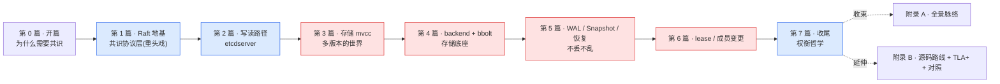

# 《etcd 设计与实现深入浅出:一条 Put 如何被多数派共识》—— 目录与导读

> 一本写给"用过 etcd(或 Kubernetes)、甚至翻过源码,却总觉得一知半解"的人的小书。
>
> **一句话主旨**:一条 `Put` 请求,如何跨多节点达成"多数派共识、不丢不乱",再被应用到带多版本的存储、推给所有 watcher——共识(Raft)保证安全,工程优化保证它在真实集群里够快够活。
>
> **二分法**(迷路时回到它):**共识协议层**(Raft:让多数派对日志顺序达成一致、leader 主导复制) vs **状态机应用层**(mvcc/bbolt/watch:把共识结果落地成可查、可订阅的多版本状态)。
>
> **基调**:直球讲透为主,比喻只在反直觉处点睛——延续《LevelDB》。Raft 共识的反直觉处(多数派、term、选举)可适度点睛,其余直球。

每章一行:**一句话钩子** —— 技巧标签 —— 二分法归属(`协议` / `应用` / `衔接` / `一致性` / `收束`)。

---

## 全书结构总览

旅程:从"单机为什么不够、多副本怎么一致",到"Raft 怎么用多数派达成共识",到"etcdserver 怎么驱动 raft 并 apply",到"mvcc 怎么存多版本、bbolt 是什么底座",到"崩溃了怎么不丢不乱",到"key 怎么续命、节点怎么增删"。每篇都是这条路上的一个驿站——读完你能在脑子里放映出一条 Put 的端到端全过程,以及一次 leader 选举的全过程。

---

## 第 0 篇 · 开篇:为什么需要共识

- [P0-01 · 第一性原理:为什么需要共识](P0-01-第一性原理-为什么需要共识.md) —— 单机宕机即不可用、数据一份不安全;多副本又带来新麻烦:副本间怎么一致、谁是最新。脑裂与多数派、CAP 与线性一致、Raft 一句话(选主 + 复制日志 + 多数派 commit)。 —— 共识 vs 可用的根本张力 —— `总览`

## 第 1 篇 · Raft 地基:共识协议层 ⚠️ 全书重头戏

> 源码主体在 `etcd-raft` 仓。Raft 是 etcd 的灵魂,这一篇五张是全书最硬核的部分,**建议顺序读**(term → 选举 → 复制 → 安全 → 驱动)。

- [P1-02 · Raft 状态机与 term](P1-02-Raft状态机与term.md) —— 三角色(Follower/Candidate/Leader)、term 单调递增、为什么"一个 term 一个节点最多投一票"。 —— term 作为逻辑时钟 —— `协议`
- [P1-03 · Leader 选举](P1-03-Leader选举.md) —— heartbeat、随机选举超时(为什么随机)、PreVote(防分区节点用高 term 打断集群)、checkQuorum。 —— PreVote 防惊群 + 随机超时 —— `协议`
- [P1-04 · 日志复制与 commit](P1-04-日志复制与commit.md) —— AppendEntries、log matching、commitIndex;为什么只能 commit 当前 term 的 entry(Figure 8 陷阱);ProgressTracker + inflights 追复制进度。 —— Figure 8 + inflights 环形窗口 —— `协议`
- [P1-05 · 安全性与持久化](P1-05-安全性与持久化.md) —— 选举限制(选出的 leader 必有所有已提交 entry)、leader 完整性、必须持久化 currentTerm/votedFor/log。 —— 选举限制→leader 完整性 + unstable/stable 分离 —— `协议`
- [P1-06 · etcd raft 驱动模型:Node 与 Ready](P1-06-etcd-raft驱动模型-Node与Ready.md) —— raft.go 纯状态机(Step/Tick/Advance),Node/RawNode 用 channel 把输出(Ready)批量交给上层。库与应用解耦的典范。 —— Ready/Advance 推拉 + channel 解耦 —— `协议`

## 第 2 篇 · 写读路径:etcdserver

> Raft 达成共识后,谁把它应用成 KV?etcdserver 驱动 raft + apply。源码在 etcd 主仓。

- [P2-07 · etcdserver 架构与 gRPC 入口](P2-07-etcdserver架构与gRPC入口.md) —— 一条 Put 怎么从 gRPC 进来;EtcdServer 的两条主通道(raft 通道发 propose、apply 通道收已 commit 的 entry)。 —— etcdserver 与 raft.Node 的衔接 —— `衔接`
- [P2-08 · 写路径全流程](P2-08-写路径全流程.md) —— Put → 序列化 → Propose 进 raft log → 多数派复制 commit → apply → mvcc → 返回客户端。 —— 等到 apply 才返回(线性一致) —— `衔接`
- [P2-09 · 线性一致读与吞吐优化](P2-09-线性一致读与吞吐优化.md) —— 读也要线性一致:ReadIndex、lease-based read;以及 pipeline propose、batch apply 提升吞吐。 —— ReadIndex 正确性 + lease read 取舍 —— `衔接`

## 第 3 篇 · 存储 mvcc:多版本的世界

> apply 把 entry 落到 mvcc。etcd 不存"当前值",存"全部历史"。

- [P3-10 · revision 与 treeIndex/keyIndex](P3-10-revision与treeIndex-keyIndex.md) —— 每次修改分配全局单调 revision;treeIndex(B-tree)按 key 索引,每个 key 一条 keyIndex(各代 generation)。 —— 全局 revision + 版本链 —— `应用`
- [P3-11 · kvstore 与事务](P3-11-kvstore与事务.md) —— 写走 TxnWrite(批量)、读走 TxnRead;treeIndex 存 revision、backend(bbolt)存 value,各取所长。 —— 索引在内存 + 值在 bolt —— `应用`
- [P3-12 · watch:基于 revision 的事件推送](P3-12-watch-基于revision的事件推送.md) —— watch 本质是"从某 revision 订阅后续变更";watcher_group 按 synced/unsynced 分组;revision 是 watch 的游标。 —— synced/unsynced 分组 —— `应用`
- [P3-13 · compaction:压缩历史](P3-13-compaction-压缩历史.md) —— 历史不能无限长,compaction 删旧版本、收缩 keyIndex;定期 hash 校验一致性。 —— compaction 安全边界 + hash —— `应用`

## 第 4 篇 · backend 与 bbolt:存储底座

> mvcc 的 value 最终落在 bbolt。backend 做批事务,bbolt 是单文件 B+tree。

- [P4-14 · backend:批事务](P4-14-backend-批事务.md) —— batch_tx 攒一批写一次 commit、read_tx、tx_buffer 缓冲未提交写。 —— batch 攒批提交 —— `应用`
- [P4-15 · bbolt 之一:单文件 B+tree + mmap](P4-15-bbolt之一-单文件B+tree与mmap.md) —— 整库一个文件、定长页、B+tree(branch/leaf)、mmap 只读映射。 —— 单文件 + 定长页 + mmap —— `应用`
- [P4-16 · bbolt 之二:COW 事务 + freelist](P4-16-bbolt之二-COW事务与freelist.md) —— Copy-On-Write 写事务不改原页、提交时翻转 meta 页指针;freelist 回收空闲页;写与读并发靠旧 meta 页。 —— COW + meta 双缓冲原子提交 —— `应用`

## 第 5 篇 · 不丢不乱:WAL、Snapshot 与恢复

> Raft entry 要持久化(否则崩溃丢已 commit 数据);日志不能无限长,靠 snapshot 截断。

- [P5-17 · WAL:Raft 日志的持久化](P5-17-WAL-Raft日志的持久化.md) —— etcd-raft 只管协议不碰磁盘,持久化由 storage/wal 做;record 格式、预分配文件流水线、损坏修复。 —— record 编码 + 预分配 + repair —— `一致性`
- [P5-18 · Snapshot 与日志截断](P5-18-Snapshot与日志截断.md) —— 日志太长,定期存状态机快照、截断旧日志;截到哪、follower 怎么用 snapshot 追上。 —— snapshot 与 log 衔接 —— `一致性`
- [P5-19 · 启动恢复](P5-19-启动恢复.md) —— 启动怎么 Recover:读 WAL 重放、加载 snapshot、重建 raft 状态、bootstrap cluster。 —— 两层持久化分工 —— `一致性`

## 第 6 篇 · lease 与成员变更

- [P6-20 · lease:给 key 续命](P6-20-lease-给key续命.md) —— Put 带 TTL 靠 lease;Lessor 管理、lease 与 key 反向索引、续约 KeepAlive、过期回收。 —— lease 与 key 解耦 + 续约 —— `应用`
- [P6-21 · 成员变更与 cluster](P6-21-成员变更与cluster.md) —— 怎么安全增删节点(不能让两个不相交多数派并存):单步成员变更、Joint Consensus 两阶段、leader transfer。 —— 成员变更安全性 + Joint Consensus —— `协议`

## 第 7 篇 · 收尾:权衡哲学

- [P7-22 · 共识 vs 性能:etcd 的权衡哲学](P7-22-共识vs性能-etcd的权衡哲学.md) —— 共识换一致、多数派换可用、COW 换并发、batch 换吞吐;quorum 的数学(N/2+1 为什么够);etcd-raft/tla 的 TLA+ 怎么证明 Raft 对。 —— TLA+ 形式化验证 —— `收束`

## 附录

- **附录 A · 全景脉络** —— 全书收束成几条贯穿哲学 + 协议层/应用层全景图 + 一条 Put 的端到端时序总图。
- **附录 B · 源码阅读路线与延伸** —— 三仓阅读地图、`etcd-raft/testdata`(datadriven 测试)与 `tla/`(TLA+)怎么用、与 Zookeeper(ZAB)/Paxos 对照、与 Multi-Raft(TiKV/CockroachDB)的延伸。

---

## 推荐阅读路线

**主线(推荐)**:P0-01 → 第 1 篇全(P1-02~06,Raft 地基,顺序读)→ 第 2 篇(P2-07~09)→ 第 3 篇(P3-10~13)→ 第 4 篇(P4-14~16)→ 第 5 篇(P5-17~19)→ 第 6 篇(P6-20~21)→ 第 7 篇(P7-22)→ 附录 A。这是"一条 Put 的共识之旅 + 故障恢复"的完整旅程,章节按依赖精心排序,顺着读最省力。

按目标速查:

| 你的目标 | 读这几章 |
|------|------|
| 只想懂 Raft 共识本身 | P0-01 → P1-02 → P1-03 → P1-04 → P1-05 |
| 只想懂"一条 Put 怎么落盘、怎么返回" | P2-07 → P2-08 → P3-10 → P3-11 |
| 只想懂读一致性(线性一致读) | P1-05 → P2-09 |
| 只想懂 watch 是怎么实现的 | P3-10 → P3-12 |
| 只想懂底层存储 bbolt | P4-15 → P4-16 |
| 只想懂崩溃恢复 | P5-17 → P5-18 → P5-19 |
| 只想懂成员变更/扩缩容 | P1-05 → P6-21 |
| 想读 etcd 源码 | 附录 B(三仓阅读地图)+ 跟着本书章节逐个啃源码 |

> 一个提醒:第 1 篇五章(term→选举→复制→安全→驱动)有强顺序依赖,选举依赖 term、复制依赖选举、安全依赖复制、驱动是封装,**不要跳着读这一篇**;第 3、4、5 篇也有顺序(mvcc→backend/bbolt→WAL/恢复)。

---

## 配套文件

- [全书规划-总纲](全书规划-总纲.md) —— 主线、二分法、分篇分章、三仓源码策略、写作约定、Go 技巧侧重。
- [_章节写作提示词](_章节写作提示词.md) —— 写作执行手册(铁律、四段式、技巧精解、自检清单、附 22 章清单与并行分组)。
- 源码(本地 clone,跨三仓):`../etcd/`(主仓)、`../etcd-raft/`(@`39eb80a`)、`../bbolt/`(@`50f0b81`)。本书所有源码引用均经 Grep/Read 核实行号,钉死在各仓 commit。

---

> 这本书讲的不是"etcd 的 API 怎么用",而是"它凭什么这么设计、源码里那些 channel 驱动、`Ready`/`Advance`、`ProgressTracker`、revision 版本链、bbolt COW 到底在干什么"。读完,你该能在脑子里放映出一条 Put 的端到端全过程——从 gRPC 到 leader propose、到多数派复制 commit、到 apply 落 mvcc、到推给 watcher——以及故障时怎么重新选主、怎么恢复一致。
