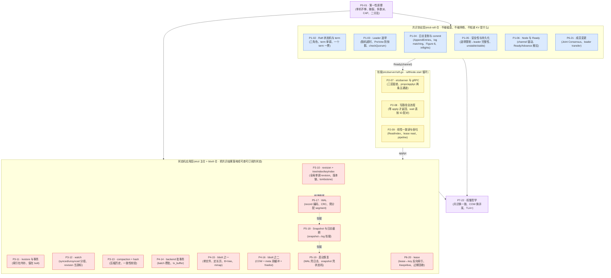
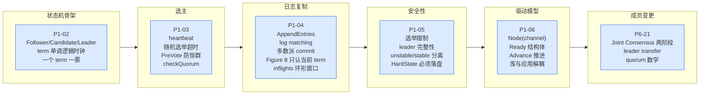
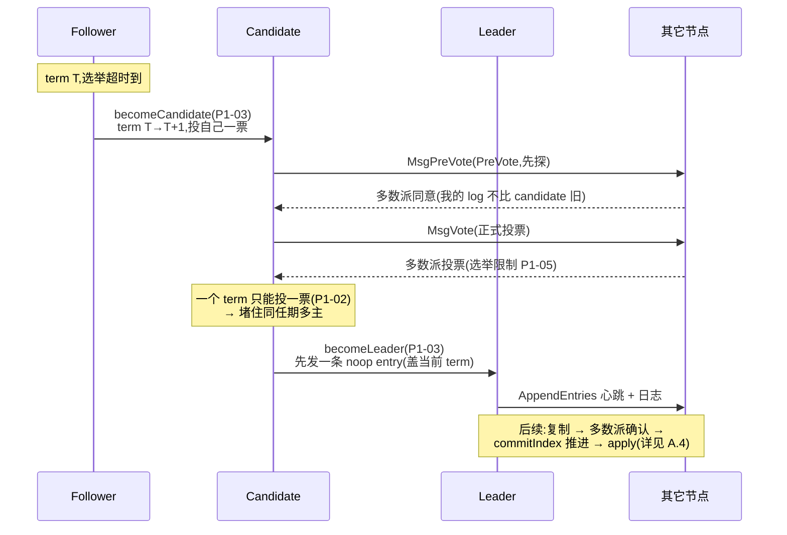
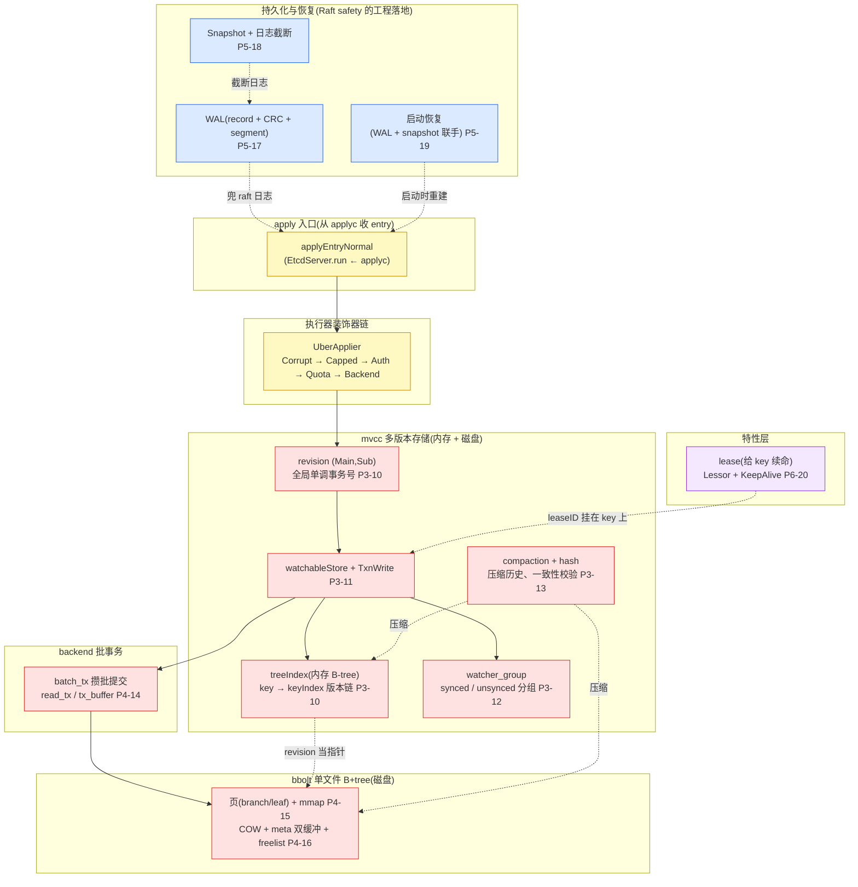
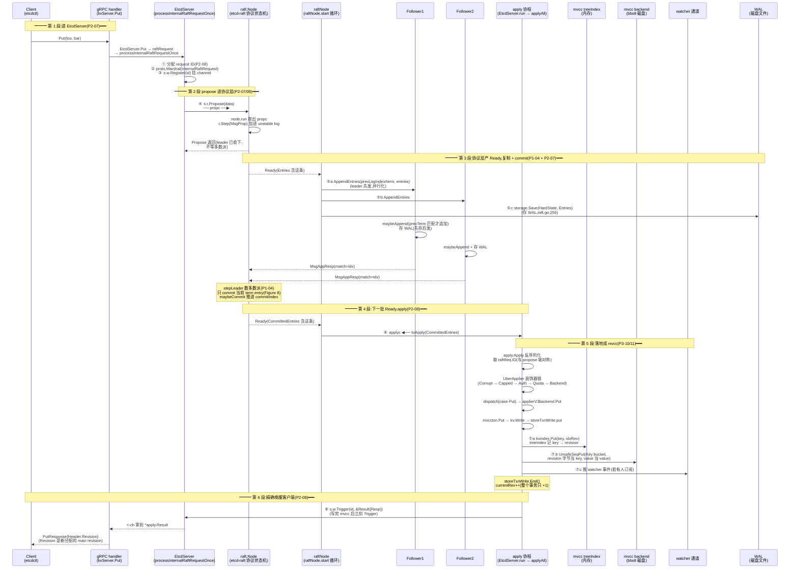
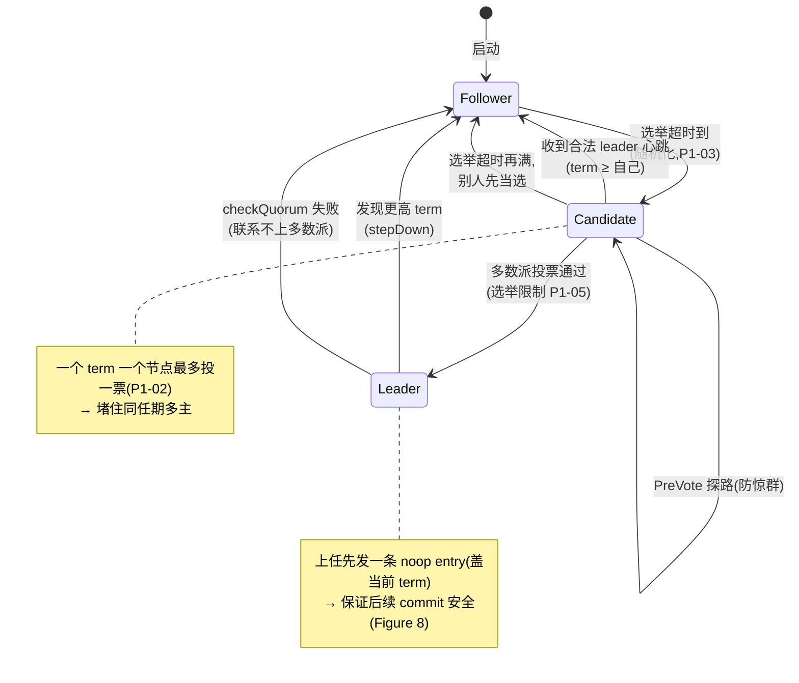
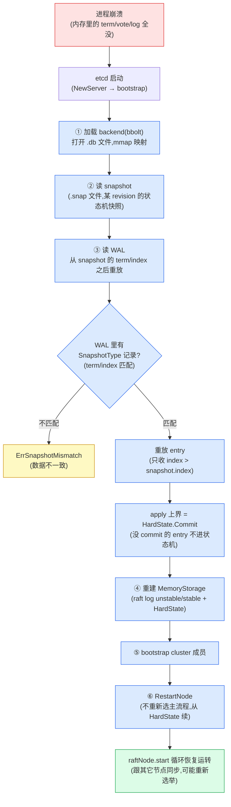

# 附录 A · 全景脉络

> 篇:附录
> 主线呼应:正文 22 章把一条 `Put` 的共识之旅从头到尾拆透了——为什么需要共识,Raft 凭什么达成一致,etcdserver 怎么衔接协议层和应用层,mvcc 怎么存多版本,bbolt 是什么底座,崩溃了怎么不丢不乱,lease 怎么续命,成员怎么安全增删。这张附录不再展开任何新机制,而是把读完这本书该带走的全景画成几张图:**协议层 vs 应用层的全景架构、一条 Put 的端到端时序总图、故障恢复全景**。它是一张"按图索骥"的地图——任何一张图上的一根箭头、一个方框,你都能回到对应的正文章节查到细节。读完正文再翻这张附录,你该能在脑子里放映出一条 Put 的全过程和一次 leader 选举的全过程;没读过正文的人,光看这几张图也能知道 etcd "大概在做什么、靠什么保证不丢不乱"。

---

## A.1 全书二分法再回顾:协议层 vs 应用层

正文的每一章结尾都回到这条二分法。这里把它最后一次、也是最完整地画出来——把全书 22 章的机制,按"协议层 / 应用层"两面,以及它们之间的衔接点,铺成一张全景。



这张图回答两个问题:**全书 22 章分别在二分法的哪一面?它们之间靠什么衔接?** 对应 P0-01(二分法总览)与第 1、2、3 篇的逐章拆解。

三个要点:

1. **协议层在最左**——`etcd-raft` 仓,六章(P1-02~06 + P6-21)。它们只算协议状态机、产 `Ready`,不碰磁盘、不碰网络、不知道 KV 是什么。P0-01 的 1.8 节把这一层用一个 `select` 循环(raftNode.start)衔接到了右边。
2. **应用层在最右**——etcd 主仓加 bbolt 仓,十一章。它们把共识结果落地成可查可订阅的状态,并为 Raft safety 的硬要求(持久化、崩溃恢复)兜底。
3. **中间衔接层是全书枢纽**——三章 P2-07/08/09。P2-07 立起 `EtcdServer` 三层套娃与 `propc`/`applyc` 两条主通道;P2-08 跟着一条 Put 跑完写路径,讲透"等 apply 才返回"为什么是线性一致的命脉;P2-09 处理读路径——线性一致读比线性一致写更难,要 ReadIndex 或 lease read 才能不读旧 leader 的旧数据。

> 这张图就是全书的骨架。任何时刻迷路,回到这张图,先问"我关心的机制在协议层还是应用层",再顺着 `Ready` → `applyc` 这条主线找到它的位置。

---

## A.2 协议层全景:Raft 的六块拼图

把协议层单独拉出来,看清 Raft 这台机器的内部构造。它由六块组成:状态机与 term、leader 选举、日志复制与 commit、安全性、驱动模型、成员变更。前五块在第 1 篇顺序拆透,成员变更在第 6 篇。



协议层这六块,本质都在回答一个问题:**怎么让一群可能故障、消息可能乱序丢失的机器,对日志顺序达成一致?** 答案是 Raft 的几条规则,每一条都不是多余的,而是为了堵住一个具体的正确性漏洞。

| 机制 | 章节 | 凭什么这么设计(不这条会破坏什么) |
|------|------|----------------------------------|
| term 单调 + 一个 term 一票 | P1-02 | 堵住"同一任期多个 leader"(脑裂) |
| 随机选举超时 | P1-03 | 防多个 candidate 同时抢票,活锁 |
| PreVote | P1-03 | 防网络分区节点用高 term 打断正常集群(惊群) |
| checkQuorum | P1-03 | leader 主动确认还能联系多数派,防租约过期仍自称 leader |
| log matching(prevLogIndex/term) | P1-04 | 凭 prev 对得上,之前全一致(归纳不变式) |
| 只 commit 当前 term entry(Figure 8) | P1-04 | 防 commit 旧 term entry 导致丢已提交数据 |
| 选举限制(candidate log 至少一样新) | P1-05 | 保证选出的 leader 拥有所有已 commit entry |
| leader 完整性 | P1-05 | 已 commit 的 entry 永不丢失(由选举限制 + log matching 推出) |
| unstable/stable 分离 | P1-05 | 没持久化的 entry 单独放,持久化后才并进 stable(崩溃一致) |
| Ready/Advance 推拉 | P1-06 | 协议层只产指令,上层异步消费,库可复用 |
| Joint Consensus 两阶段 | P6-21 | 成员变更时,旧新配置的多数派必有交集,不脑裂 |

这张表是协议层六章的"为什么清单"——每读一条规则,对照它"不这条会破坏什么"。Raft 论文的伟大之处,正是把"安全共识"拆成了这几条**可独立理解**的规则;`etcd-raft/tla/` 仓里的 TLA+ 规约,就是把这几条写成数学不变式,数学上证明它们合起来真的安全(P7-22 讲)。



这张图回答:**一次 leader 选举的全过程是什么?** 对应 P1-02(term)、P1-03(选举)、P1-05(选举限制)三章。关键点在于"一个 term 一个节点最多投一票"这条铁律——它是 term 作为逻辑时钟的命门,堵住了同任期多主。PreVote 只是前置的一道"试探",防止网络分区里的节点用陈旧的高 term 打断正在正常工作的集群(惊群)。

---

## A.3 应用层全景:把共识结果落地的十一块

应用层把协议层吐出的 entry 字节流,落地成可查、可订阅、不丢不乱的状态。它由十一块组成,按数据流方向自上而下排列。



这张图回答:**协议层吐出的 entry 字节流,应用层怎么落地?** 对应第 3、4、5、6 篇十一章。

关键的数据流是:**apply 协程从 `applyc` 取出 entry → 反序列化 → UberApplier 装饰器链过鉴权/配额/损坏检查 → dispatch 到 `applierV3backend.Put` → 开 mvcc 写事务 → 给 key 分配全局单调 revision → treeIndex 记一笔(key → revision)、backend(bbolt)记一笔(revision → value)**。读反过来:先在 treeIndex 按 key 查到 revision,再去 bbolt 用 revision 取 value。索引在内存(查得快),值在磁盘(省内存),各取所长。

这十一块里有四个关键不变式,是应用层的命脉:

1. **revision 全局单调**(P3-10):每个写事务 `Main + 1`,事务内多次修改 `Sub` 从 0 递增。`(Main, Sub)` 在整个集群生命周期里全局唯一、按字典序单调。这是 mvcc、watch、事务隔离的根基。
2. **treeIndex 只存指针**(P3-10/P3-11):内存 B-tree 不存 value,只存 key → revision 列表。值全在 bbolt。这让索引小、查得快,且 revision 是 mvcc/bbolt/watch 的公共游标。
3. **bbolt COW + meta 双缓冲**(P4-16):写事务不改原页,复制新页写,提交时原子翻转 meta 页指针。读写并发靠"写时读者用旧 meta 页"——读事务从不阻塞写事务,写事务也不阻塞读事务。
4. **WAL + snapshot 联手恢复**(P5-17/18/19):WAL 兜 raft 日志(`HardState` + `Entries`),snapshot 兜状态机(某 revision 的 bbolt 快照)。两者靠 snapshot 的 `metadata(term/index)` 衔接——WAL 从这个 index 之后开始重放,apply 的上界是 `HardState.Commit`。少一条 entry 丢数据,多一条 entry 污染状态机,两层联手精确重建崩溃那一刻的共识状态。

```
应用层的数据结构布局(三处关键):

① treeIndex 里一个 keyIndex(key="foo")的版本链(P3-10):
┌─ generation 1 (创建)
│   revision {main=5,  sub=0} → value@backend
│   revision {main=8,  sub=0} → value@backend   (覆盖)
│   revision {main=12, sub=0, tombstone}          ← 删除,generation 结束
└─
┌─ generation 2 (重建)
│   revision {main=20, sub=0} → value@backend
└─
(整个 B-tree 按 key 排序,每个叶子指向一个 keyIndex)

② revision 在 bbolt 里的 key 编码(P3-10):
┌────────────────┬───┬────────────────┐
│   Main (8B)    │ _ │    Sub (8B)    │   大端编码,天然字典序 = 数值序
└────────────────┴───┴────────────────┘
   0            7   8 9             16   共 17 字节
(墓碑多一个 't' 字节,共 18 字节)

③ bbolt 的页布局 + meta 双缓冲(P4-15/16):
meta page 0 ──┐              meta page 1 ──┐
(txid=42,     │              (txid=41,     │  ← 旧 meta,读者还在用
 root=freelist│              root=...     │
 root=data)   │              ...)         │
              ▼                           ▼
   ┌─────────────────┐         ┌─────────────────┐
   │ 新写的 data 页   │         │ 旧 data 页       │  ← COW:不改原页,复制新页写
   │ (commit 后翻转  │         │ (还没被回收)     │
   │  meta 指针到这里)│         │                  │
   └─────────────────┘         └─────────────────┘
(写事务提交:meta 0 的 txid+1 并指向新页,读者用旧 meta 1 看到旧快照)
```

这三张小框图是应用层最核心的三个数据结构。treeIndex 的版本链解释了"读历史、watch、事务隔离"凭什么能做;revision 的字节编码解释了 bbolt 里这些 entry 为什么天然按顺序追加(顺序写,快);bbolt 的 COW + meta 双缓冲解释了读写并发凭什么不锁。

---

## A.4 一条 Put 的端到端时序总图(本附录核心)

这一节是附录 A 的核心——把分散在 P2-07、P2-08、P1-04、P3-10/11、P5-17 的"一条 Put 的旅程",画成一张完整的大时序图。这张图上每一个箭头都标注了对应的正文章节,读者可以"按图索骥"回查。



这张图回答:**一条 Put 从客户端发出,到收到"成功"响应,完整经过哪些步骤?** 它把全书二分法的每一面、每一条 channel、每一个协程,都钉在这条旅程上。对应章节:P2-07(EtcdServer 架构与 gRPC 入口)、P2-08(写路径全流程)、P1-04(日志复制与 commit)、P1-05(安全性)、P3-10/11(mvcc 落地)、P5-17(WAL 持久化)、P3-12(watch 推送)。

这张图上最关键的六件事,正是正文反复强调的:

1. **三条 channel + wait 表把四个协程串起来**:`propc`(客户端协程 → raft 协程)、`readyc`(raft 协程 → raftNode 协程)、`applyc`(raftNode 协程 → apply 协程)三条 channel,加上 wait 表(apply 协程 → 客户端协程,按 request ID 精确唤醒)。客户端协程从 ④ 之后挂在 `<-ch` 上睡觉,直到 ⑧ 被精确唤醒——中间跨多少协程、多少网络往返,它都不感知。

2. **propose 不等多数派,但等 leader 的 r.Step 接受**(P2-08 8.4 节精确化):`s.r.Propose` 用 `wait=true`,投递 `MsgProp` 到 `propc` 后,等 `node.run` 调 `r.Step` 处理完回送 err 才返回。这一步同步(纳秒级),让客户端知道"leader 是否收下",并天然形成背压;但它不等多数派复制——那一步是后面异步的。

3. **leader 先发后存,follower 先存后发**(P2-07 7.5 节):这是 Raft 论文 10.2.1 的并行化技巧。leader 先把 AppendEntries 发出去(follower 收到后开始写自己的 WAL),然后 leader 才写自己的 WAL——两边磁盘写并行,总延迟 ≈ max 而非 sum。follower 反过来,因为 follower 发的是"我收到了"的响应——必须先落盘才能认,否则响应发出去了却没真存,leader 据 commit 后 follower 崩溃,已 commit 日志丢失,破坏 leader 完整性。

4. **commit 只认当前 term entry**(P1-04 的 Figure 8):`maybeCommit` 传的不是光杆 index,而是 `entryID{term: r.Term, index: ...}`——term 必须是当前 leader 的 term。这堵住了"leader 试图 commit 旧 term entry 导致丢已提交数据"的反例,P1-04 配了 5 节点时序拆透。

5. **等 apply 才返回,是线性一致的命脉**(P2-08 8.8 节):commit 是协议层概念(多数派日志里有),apply 是应用层概念(mvcc 里生效)。读走应用层,所以"客户端看到成功"必须对齐 apply 进度——否则客户端写完立刻读,读不到自己的写,违反线性一致。apply 完成的时刻 = mvcc 里有这条写的最早时刻,等它就够了。

6. **request ID 把发起与完成精确配对**(P2-08 8.9 节):propose 端用 `r.ID`(0 则 `r.Header.ID`)在 wait 表注册 channel,apply 端用同一套规则从字节反序列化取出 ID 去 wait 表唤醒。两端取法对称、字面一致——这是工程纪律。没有 wait 表,要么焊死协议层和应用层,要么牺牲性能。它是异步解耦的核心抽象。

> 一条 Put 的旅程,浓缩成六段:**进 EtcdServer → propose 进协议层 → 协议层产 Ready 复制 + commit → 下一批 Ready apply → 落地成 mvcc → 精确唤醒客户端**。任何一段读不懂,回到这张图找到对应箭头,翻那一章。

---

## A.5 故障恢复全景:leader 挂了 / 节点崩溃了怎么办

正文把"正常路径"拆透了。附录 A 再补一张"故障路径"的全景——它回答读者最关心的两个故障场景:**leader 挂了重新选举怎么不丢数据?节点崩溃了重启怎么恢复一致?**

### A.5.1 leader 挂了:重新选举的全景



这张图回答:**leader 挂了重新选举,凭什么不丢已 commit 数据?** 对应 P1-02(term)、P1-03(选举)、P1-05(选举限制→leader 完整性)三章。

关键的两条 safety 保证:

1. **选举限制**(P1-05):candidate 的 log 必须至少和投票者一样新,投票者才投。这保证选出的 leader 一定拥有所有已 commit 的 entry。为什么?已 commit 的 entry 必在多数派节点上(P1-04),而新 leader 的多数派投票集和"已 commit entry 所在的多数派集"必有交集(鸽巢,A.1 的协议层全景表里第 10 行),那个交集节点一定见过这条 entry——所以新 leader 的 log 不会缺它。
2. **Figure 8 只 commit 当前 term**(P1-04):新 leader 上任后,先发一条 noop entry(打上自己 term),等这条 noop 被多数派复制后才推进 commitIndex。这避免了"试图 commit 旧 term entry 导致丢已提交数据"的反例。新 leader 不直接 commit 它上任前那些"看似已多数派确认但没被旧 leader 标 commit"的 entry,而是等自己的 noop entry commit 后,间接把前面的 entry 也带过 commit 线。

这两条合起来,就是 Raft 的"**leader 完整性**"——已 commit 的 entry 永不丢失。它是 Raft safety 的核心,也是为什么 leader 挂了重选不会丢数据。

### A.5.2 节点崩溃重启:两层持久化联手恢复



这张图回答:**节点崩溃后重启,怎么恢复到一致状态——既不少 apply 一条已 commit entry,也不多 apply 一条没 commit entry?** 对应 P5-17(WAL)、P5-18(snapshot)、P5-19(启动恢复)三章。

关键的四点:

1. **两层持久化分工**(P5-19 19.2 节):单靠 WAL 不行(WAL 早被 snapshot 截断,从头重放也慢),单靠 snapshot 也不行(snapshot 之后的所有 entry 和 `currentTerm`/`votedFor` 都没了)。必须两层配合:snapshot 给状态机一个完整起点,WAL 给 raft 一个续点。
2. **两层衔接的唯一线索**(P5-19 19.3 节):snapshot 的 `metadata(term/index)` 这对坐标。snapshot 本体在 `.snap` 文件,WAL 里也有一条 `SnapshotType` 记录标同一个坐标。恢复时,上层拿着 snapshot 的 `term/index` 去开 WAL,`ReadAll` 在读到对应 `SnapshotType` 记录时确认匹配,衔接才成立——没匹配上就报 `ErrSnapshotNotFound`。
3. **重放只收 index > snapshot.index 的 entry**(P5-19 19.3.2 节):snapshot 之前的 entry 早就被截断了,就算 WAL 里还残留(因为截断按 segment 粒度),也直接跳过——它们的状态已经被 snapshot 完整覆盖。
4. **apply 上界是 HardState.Commit**(P5-19 19.4 节):WAL 里读出来的 entry 列表,既有已 commit 的、也有没 commit 的(只是被复制)。恢复时只 apply 已 commit 的,没 commit 的只留在 MemoryStorage 里给 raft 当 log 用,不进状态机。多 apply 一条没 commit 的 entry,它可能被新 leader 覆盖,状态机就不一致了。

> 把这两张故障图(P0-01 没单独画,A.5.1 和 A.5.2 是正文头一次系统画出来)和 A.4 的正常时序图对照看:正常路径走 apply 写 mvcc,故障路径靠 WAL + snapshot 重建。两条路径共享同一套数据结构(revision、treeIndex、bbolt、HardState),只是方向相反——正常路径往里写,故障路径从持久化里读回来。这是 etcd "不丢不乱" 的工程兑现。

---

## A.6 把全景收束成几条贯穿哲学

正文 P7-22 单辟一章讲 etcd 的权衡哲学(共识换一致、多数派换可用、COW 换并发、batch 换吞吐、TLA+ 形式化验证)。附录 A 不重复那条线,只把这几张全景图背后反复出现的几条**设计取向**,用一句话点出来,作为地图的图例:

- **协议层纯库化,应用层工程化**:`etcd-raft` 是纯状态机(`Step`/`Tick`/`Advance`),不碰磁盘、网络、KV——这是它能被 Kubernetes/TiKV/CockroachDB 共享的根本。etcd 主仓负责所有脏活累活(WAL、transport、mvcc、lease)。两层靠 `Ready`/`Advance` 推拉 + channel 解耦衔接。这是"库 + 应用"解耦的典范,也是全书二分法的工程体现。
- **多数派是地基,quorum 数学贯穿全书**:"任意两个多数派必有交集"这条鸽巢(见 P0-01 1.9 节证明),是 commit(要多数派复制)、选举(要多数派投票)、成员变更(旧新配置多数派必有交集)三处的共同根基。N/2+1 不是拍脑袋,是集合论的必然。
- **异步 + channel + 精确唤醒**:`propc`/`readyc`/`applyc` 三条 channel 把四个协程串起来,wait 表用 request ID 把发起和完成精确配对。发起方挂起让出协程,完成方异步唤醒——这是 etcd 能在 apply 慢(bbolt 写盘)时仍保持 raft 心跳不断的根本。
- **持久化是 Raft safety 的工程合同**:`etcd-raft` 不碰磁盘,但 Raft 要求 `currentTerm`/`votedFor`/`log[]` 必须在响应 RPC 前落盘。etcd 用 WAL + snapshot 兑现这条要求。Save MUST block until on stable storage——这是接口注释里的工程合同。
- **MVCC 让"读历史、watch、事务隔离"成为可能**:etcd 不存"当前值",存"全部历史",每次修改分配全局单调 revision。索引在内存(treeIndex),值在磁盘(bbolt),各取所长。watch 本质就是"从某个 revision 订阅后续变更",revision 是 mvcc/bbolt/watch 的公共游标。
- **COW 换并发,batch 换吞吐**:bbolt 用 Copy-On-Write + meta 页双缓冲,写事务不阻塞读事务;backend 用 batch 攒批提交,削 bbolt 的 COW 开销;WAL 用预分配 segment,免运行时 fallocate 抖动。这些是 etcd 在真实集群里够快的工程手段。

这几条取向,合起来就是 etcd 的"**共识换不丢不乱,工程优化换够快够活**"。每一条都是正文某个章节的硬核技巧,附录只是把它们标在地图上。

---

## A.7 一句话总结这本书

> **etcd = Raft(共识)+ mvcc(多版本存储)+ watch/lease(特性)+ bbolt(底座)+ WAL(兜底)。一条 Put 的旅程,从 gRPC 到多数派共识、到落地成可查可订阅的状态,由协议层和应用层两层协作完成;两层靠 `Ready`/`Advance` 推拉 + `propc`/`applyc` 两条 channel + wait 表按 ID 精确配对衔接。共识保证不丢不乱,工程优化保证够快够活。**

读完这本书,你该能在脑子里放映出:

- 一条 Put 的端到端全过程(A.4 那张时序图的四个协程、三条 channel + wait 表、八跳)。
- 一次 leader 选举的全过程(A.5.1 那张状态图的 Follower → Candidate → Leader,以及 PreVote、选举限制、Figure 8 三条 safety)。
- 一次崩溃恢复的全过程(A.5.2 那张流程图的 WAL + snapshot 联手,HardState.Commit 当 apply 上界)。
- 协议层六章和应用层十一章,各自落在全景(A.1)的哪个位置,以及它们凭什么这么设计。

这些就是读完这本书该带走的全部。

---

## A.8 接下来往哪走

附录 A 是全书的"地图"。想继续往深处钻,有两条路:

1. **附录 B · 源码阅读路线与延伸**:给三仓(etcd / etcd-raft / bbolt)的阅读地图,讲 `etcd-raft/testdata/`(datadriven 测试)和 `tla/`(TLA+ 形式化规约)怎么佐证 Raft 正确,以及 etcd 和 Zookeeper(ZAB)/Paxos 的对照、和 Multi-Raft(TiKV/CockroachDB)的延伸。
2. **重读某一章**:拿附录 A 的某张图作为导航,回到对应正文章节,把它读透。最值得重读的:P2-08(写路径,串起协议层和应用层)、P1-04(commit + Figure 8,Raft 最微妙的安全点)、P1-05(选举限制→leader 完整性,safety 的核心因果链)、P3-10(revision 版本链,mvcc 的骨架)、P5-19(启动恢复,两层持久化的联手)。

> 如果一张图没看明白,回到对应的正文章节——那张图上的每一个箭头,在那里都有四段式拆解。如果一张图全看明白了,恭喜你,你已经能在脑子里放映 etcd 了。
