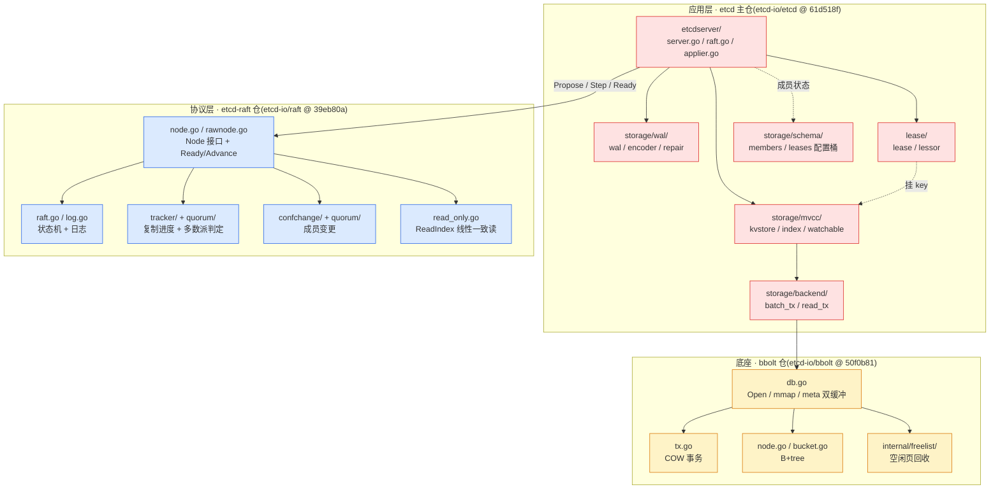

# 附录 B · 源码阅读路线与延伸

> 篇:附录
> 衔接:附录 A 把全书收束成"协议层 vs 应用层"的全景图。读到这里,你已经能在脑子里放映出一条 Put 的端到端全过程。但一本书只能带你走到门口——真正想把它内化成自己的东西,得自己钻源码、跑测试、横向对照其他系统。这个附录就是为你准备的"出门地图":一张三仓阅读路线、两个用来验证 Raft 的利器(testdata 与 TLA+)、和两张把 Raft 放进共识算法家族里的对照表。

## 这个附录要回答什么

附录 A 给的是"全景脉络"——本书讲了什么。附录 B 给的是"怎么往下走":

1. **三仓阅读地图**:etcd 跨三个仓库,源码量大(主仓 1100 多个 .go 文件),从哪读起、按什么顺序、每个文件回答什么问题。
2. **etcd-raft 的 testdata(datadriven 测试)与 tla/(TLA+)**:这俩是理解/验证 Raft 的两个利器——一个把协议状态机的行为做成可复现的"剧本",一个把协议规约做成可被数学证明的模型。本书正文不展开它们的用法,这里讲。
3. **与 Zookeeper(ZAB)/ Paxos 的对照**:Raft 不是唯一的共识算法。Zookeeper 的 ZAB 和经典 Paxos 是它的两个"亲戚",弄清它们的异同,你会更明白 Raft 为什么是"可理解性优先"的选择。
4. **与 Multi-Raft(TiKV / CockroachDB)的延伸**:etcd 是单 raft group(一个集群一个 raft)。当你想存"海量数据"而不仅仅是"小而关键"的元数据时,业界走的是 Multi-Raft。给一个延伸方向。

这个附录不展开 etcd 内部新机制(那是正文 21 章的事),也不做哲学升华(那是 P7-22)。它是一张路线图。

---

## B.1 三仓阅读地图

### 为什么要"三仓"

本书源码策略(总纲第五节)钉死的是:etcd 的源码不是一坨,而是**三个独立演进、各自发版的仓库**:

| 仓 | 路径(本书引用) | commit | 角色 | 二分法归属 |
|----|----------------|--------|------|-----------|
| `etcd-io/raft` | `../etcd-raft/` | `39eb80a` | Raft 协议库(纯状态机) | 协议层 |
| `etcd-io/etcd` | `../etcd/` | `61d518f` | etcdserver 应用层(apply、mvcc、backend、WAL、lease、成员) | 应用层 + 衔接 |
| `etcd-io/bbolt` | `../bbolt/` | `50f0b81` | 底层 B+tree 存储 | 应用层底座 |

这个切分不是工程上的偷懒,而是**有意的解耦**:`etcd-raft` 是一个"纯协议库",它**不碰磁盘、不碰网络、不知道 KV 是什么**,只产出"要持久化什么、要发什么消息、可以 apply 什么"的指令(`Ready`)。这种切分让 `etcd-raft` 成了一个被广泛复用的底层库——TiKV、CockroachDB、TiDB、Hexagon、Loki……全都直接 `import` 它。本书第 6 章(P1-06)讲的 `Ready`/`Advance` 推拉模型,就是这个解耦的核心机制。

读 etcd 源码,首要任务就是**分清你在哪个仓**。尤其这两个同名文件极易混淆:

- `../etcd-raft/raft.go`(2162 行):**协议状态机本身**——三个角色、term、选举、日志复制。本书第 1 篇五章的主角。
- `../etcd/server/etcdserver/raft.go`:**etcdserver 对协议库的封装**——`raftNode.start()` 那个 `select` 循环就在这里,它是协议层和应用层的衔接点。

读到任何 `raft.go`,先问:是**协议状态机**还是**应用层封装**?

### 三仓依赖关系图



一条数据自上而下的流向:客户端 → etcdserver 的 gRPC → `Propose` 进 `Node` → `raft.go` 状态机达成共识 → `Ready` 吐回 etcdserver → apply 到 mvcc → 落到 backend → 最终在 bbolt 的 B+tree 上。阅读时,顺这条流向走最不容易迷路。

### 推荐阅读顺序

下面给一条"读完本书 21 章后,继续深入源码"的推荐顺序。每个文件标清**读它回答什么问题**、**对应本书第几章**、**仓**。

| 序 | 文件 | 读它回答什么 | 本书章节 |
|----|------|------------|---------|
| 1 | `../etcd-raft/raft.go` | 协议状态机三角色怎么转换、term 怎么递进、leader 怎么选、日志怎么复制 | P1-02 ~ P1-05 |
| 2 | `../etcd-raft/log.go` + `log_unstable.go` | raft 日志的 unstable/stable 分离、commitIndex 怎么推进 | P1-04, P1-05 |
| 3 | `../etcd-raft/node.go` + `rawnode.go` | `Ready`/`Advance` 推拉模型、channel 怎么解耦状态机与 IO | P1-06 |
| 4 | `../etcd/server/etcdserver/raft.go` | **协议层与应用层怎么衔接**——`raftNode.start()` 那个 select 循环 | P2-07, P2-08 |
| 5 | `../etcd/server/etcdserver/server.go` | EtcdServer 怎么处理 gRPC、怎么驱动 raft、apply 入口 | P2-07, P2-08 |
| 6 | `../etcd/server/etcdserver/applier.go` | 已 commit 的 entry 怎么 apply 成 mvcc 的写 | P2-08 |
| 7 | `../etcd/server/storage/mvcc/kvstore.go` | 多版本存储的骨架、revision 怎么分配 | P3-11 |
| 8 | `../etcd/server/storage/mvcc/index.go` + `key_index.go` | treeIndex 的 B-tree、一个 key 的版本链 | P3-10 |
| 9 | `../etcd/server/storage/mvcc/watchable_store.go` | watch 的 synced/unsynced 分组、事件推送 | P3-12 |
| 10 | `../etcd/server/storage/backend/backend.go` + `batch_tx.go` | 批事务怎么攒批提交、read_tx 怎么并发读 | P4-14 |
| 11 | `../bbolt/db.go` | bbolt 的 Open、mmap、meta 页双缓冲 | P4-15 |
| 12 | `../bbolt/tx.go` + `../bbolt/internal/freelist/` | COW 事务、freelist 空闲页回收 | P4-16 |
| 13 | `../etcd/server/storage/wal/wal.go` | Raft 日志怎么持久化、启动怎么重放 | P5-17, P5-19 |
| 14 | `../etcd/server/storage/wal/repair.go` | WAL 损坏怎么修复 | P5-17 |
| 15 | `../etcd-raft/tracker/` | ProgressTracker + inflights 怎么追复制进度、控流水线 | P1-04 |
| 16 | `../etcd-raft/quorum/` | 多数派判定怎么做、Joint Consensus 的 quorum 交集 | P1-04, P6-21 |
| 17 | `../etcd-raft/confchange/` | 成员变更(单步 + Joint Consensus 两阶段) | P6-21 |
| 18 | `../etcd-raft/read_only.go` | ReadIndex 线性一致读 | P2-09 |
| 19 | `../etcd/server/lease/lease.go` + `lessor.go` | lease 怎么续命、过期怎么回收 key | P6-20 |
| 20 | `../etcd-raft/tla/` + `testdata/` | 用 TLA+ 和 datadriven 验证协议 | 本附录 B.2 |

**为什么是这个顺序**:前三步是"协议状态机 → 驱动模型",把协议层读透;第 4~6 步是"衔接点",这是理解 etcd 全貌的关键一跳;第 7~12 步是"应用层落地",从 mvcc 一路下钻到 bbolt;第 13~14 步是"持久化与恢复",兜底不丢;第 15~19 步是"协议层的进阶专题"(复制进度、成员变更、读一致、lease);第 20 步是"验证工具",留到 B.2 讲。

**一个提醒**:读 `etcd-raft` 仓的文件时,随时配 `testdata/` 里对应的测试剧本看(见 B.2),比起单步调试,这常常更省力。

---

## B.2 验证 Raft 的两个利器:testdata 与 TLA+

正文 P7-22 点到了 TLA+ 形式化验证,但没展开"具体怎么用"。这里补全。`etcd-raft` 仓里有两个容易被忽略、但对理解 Raft 极有帮助的目录:`testdata/` 和 `tla/`。

### B.2.1 `testdata/`:可读的协议剧本(datadriven 测试)

#### 它是什么

[`testdata/`](../etcd-raft/testdata/) 下有 28 个 `.txt` 文件,每个文件是一段**可读的协议交互剧本**:左边是"你给协议状态机下达的命令",右边是"协议状态机期望产生的输出"。这是 CockroachDB 团队发明并推广的 **datadriven 测试**模式——用纯文本脚本驱动测试,而不是手写一堆 Go 测试用例。

驱动它的入口在 [`../etcd-raft/interaction_test.go:26-38`](../etcd-raft/interaction_test.go#L26-L38):

```go
func TestInteraction(t *testing.T) {
    // NB: if this test fails, run `go test ./raft -rewrite` and inspect the
    // diff. Only commit the changes if you understand what caused them and if
    // they are desired.
    datadriven.Walk(t, "testdata", func(t *testing.T, path string) {
        env := rafttest.NewInteractionEnv(&rafttest.InteractionOpts{
            SetRandomizedElectionTimeout: raft.SetRandomizedElectionTimeout,
        })
        datadriven.RunTest(t, path, func(t *testing.T, d *datadriven.TestData) string {
            return env.Handle(t, *d)
        })
    })
}
```

`datadriven.Walk` 遍历 `testdata/` 下每个 `.txt`,`datadriven.RunTest` 把每个文件里的命令一条条喂给 `env.Handle`,把返回值跟文件里 `----` 下面写的"期望输出"逐字符对比。**不一致就 fail**。

#### 一个剧本长什么样

以 [`testdata/campaign.txt`](../etcd-raft/testdata/campaign.txt) 为例(节选):

```
log-level info
----
ok

add-nodes 3 voters=(1,2,3) index=2
----
INFO 1 switched to configuration voters=(1 2 3)
INFO 1 became follower at term 0
INFO newRaft 1 [peers: [1,2,3], term: 0, commit: 2, applied: 2, lastindex: 2, lastterm: 1]
INFO 2 switched to configuration voters=(1 2 3)
INFO 2 became follower at term 0
...

campaign 1
----
INFO 1 is starting a new election at term 0
INFO 1 became candidate at term 1
INFO 1 [logterm: 1, index: 2] sent MsgVote request to 2 at term 1
INFO 1 [logterm: 1, index: 2] sent MsgVote request to 3 at term 1

stabilize
----
> 1 handling Ready
  Ready MustSync=true:
  Lead:0 State:StateCandidate
  HardState Term:1 Vote:1 Commit:2
  Messages:
  1->2 MsgVote Term:1 Log:1/2
  ...
```

每一段的格式是:

```
<命令> <参数>
----
<期望输出>
```

- `add-nodes 3 voters=(1,2,3) index=2`:创建一个 3 节点集群,初始日志推进到 index 2。
- `campaign 1`:让节点 1 发起选举。
- `stabilize`:让协议跑完所有待处理消息,直到稳定。

`----` 下面是协议状态机吐出的日志(角色转换、消息发送、`Ready` 内容)。读这些剧本,等于**跟着协议走一遍**,比断点调试直观得多。

#### 怎么用

1. **跑全部**:在 `etcd-raft` 仓根目录,`go test ./ -run TestInteraction -v`。
2. **跑单个剧本**:`go test ./ -run TestInteraction -v -datadriven_test_case=campaign`(或用 `go test -run TestInteraction/testdata/campaign.txt` 的过滤形式,取决于 Go 版本)。
3. **看某个剧本怎么演进某条协议路径**:直接读 `.txt` 文件,跟着 `INFO` 日志读,不需要运行。

#### 28 个剧本分别覆盖什么

按主题分一下,方便按需查阅:

| 主题 | 剧本文件(`testdata/`) |
|------|----------------------|
| **选举与 PreVote** | `campaign.txt`、`prevote.txt`、`prevote_checkquorum.txt`、`checkquorum.txt`、`forget_leader*.txt`(3 个)、`single_node.txt`、`campaign_learner_must_vote.txt` |
| **日志复制与探测** | `probe_and_replicate.txt`、`replicate_pause.txt`、`lagging_commit.txt`、`heartbeat_resp_recovers_from_probing.txt` |
| **快照** | `snapshot_succeed_via_app_resp.txt`、`snapshot_succeed_via_app_resp_behind.txt`、`slow_follower_after_compaction.txt` |
| **成员变更(单步 v1)** | `confchange_v1_add_single.txt`、`confchange_v1_remove_leader.txt`、`confchange_v1_remove_leader_stepdown.txt`、`confchange_disable_validation.txt` |
| **成员变更(Joint Consensus v2)** | `confchange_v2_add_single_auto.txt`、`confchange_v2_add_single_explicit.txt`、`confchange_v2_add_double_auto.txt`、`confchange_v2_add_double_implicit.txt`、`confchange_v2_replace_leader.txt`、`confchange_v2_replace_leader_stepdown.txt` |
| **异步存储写入** | `async_storage_writes.txt`、`async_storage_writes_append_aba_race.txt` |

这些剧本就是 `etcd-raft` 的"集成测试"——它把协议各种边界情况(PreVote 防分区扰动、Joint Consensus 两阶段、ABA race)都做成了可复现的快照。**改协议代码时,跑这 28 个剧本就能知道有没有改坏什么**。

> **延伸**:除了 `testdata/` 根目录,`etcd-raft/confchange/testdata/`(成员变更专题)和 `etcd-raft/quorum/testdata/`(多数派判定专题)也有各自的 datadriven 测试,格式一样,驱动入口分别在 `confchange/datadriven_test.go` 和 `quorum/datadriven_test.go`。

### B.2.2 `tla/`:TLA+ 形式化规约

#### 它是什么

[`../etcd-raft/tla/`](../etcd-raft/tla/) 下有 etcd-raft 团队为协议写的 **TLA+ 规约**——一种用数学描述系统行为的语言,可以被 **TLC 模型检查器**自动验证(穷举状态空间,证明规约满足某些不变式,比如"任意时刻最多一个 leader")。这是工业级共识算法的标准做法:Raft 论文作者 Ongaro 和 Oki 就是用 TLA+ 证明 Raft 的(经典 Raft 的 TLA+ 规约在 Raft 论文附录里)。

目录里的关键文件:

| 文件 | 用途 |
|------|------|
| [`etcdraft.tla`](../etcd-raft/tla/etcdraft.tla) | TLA+ 规约本体——用数学描述 etcd-raft 的核心算法(含成员重配置,区别于经典 Raft) |
| [`etcdraft.cfg`](../etcd-raft/tla/etcdraft.cfg) | TLC 模型配置(常量、不变式) |
| [`MCetcdraft.tla`](../etcd-raft/tla/MCetcdraft.tla) + [`MCetcdraft.cfg`](../etcd-raft/tla/MCetcdraft.cfg) | **M**odel **C**hecking 入口——把 `etcdraft.tla` 实例化成一个可被 TLC 检查的具体模型(限定节点数、初始状态) |
| [`Traceetcdraft.tla`](../etcd-raft/tla/Traceetcdraft.tla) + [`Traceetcdraft.cfg`](../etcd-raft/tla/Traceetcdraft.cfg) | **Trace validation** 入口——用规约反向验证"实现是否遵循模型" |
| [`example.ndjson`](../etcd-raft/tla/example.ndjson) | 一份示例 trace(运行时收集的事件流) |
| [`validate-model.sh`](../etcd-raft/tla/validate-model.sh) | 跑模型检查的脚本 |
| [`validate.sh`](../etcd-raft/tla/validate.sh) | 跑 trace validation 的脚本 |
| [`README.md`](../etcd-raft/tla/README.md) | 用法说明 |

#### 两个用途:正向验证(模型对不对)和反向验证(实现对不对)

`tla/README.md` 开篇就把 TLA+ 的**双重用途**讲清楚了:

> 1. **算法本身的正确性**:用 TLC 模型检查器穷举规约的状态空间,证明它满足某些不变式(如"两个 leader 不能在同一 term 同时存在")。
> 2. **实现是否遵循算法**:用规约反向校验**实际代码跑出的 trace** 是否在模型里有对应的合法路径。如果 trace 走到的状态模型容纳不了,要么模型错了(得改模型),要么实现错了(得改代码)。

第一种是**正向**:证明"算法设计是对的"。第二种是**反向**:证明"代码实现没跑偏"。这俩是工业级共识系统的两道保险——光测不够(TLA+ 证明的是所有可能状态,测试只覆盖到跑到过的状态);光 TLA+ 也不够(规约对不等于实现对)。

#### 怎么用

**正向:模型检查(验证算法)**

准备 `tla2tools.jar`(TLA+ 工具包)和 `CommunityModules-deps.jar`(社区模块,因为 `etcdraft.tla` 用了 `SequencesExt`、`FiniteSetsExt`、`BagsExt`)。在 `tla/` 目录下跑:

```console
java -XX:+UseParallelGC -cp tla2tools.jar:CommunityModules-deps.jar tlc2.TLC \
    -config MCetcdraft.cfg MCetcdraft.tla -lncheck final -fpmem 0.9
```

或者用脚本:

```console
./validate-model.sh -s ./MCetcdraft.tla -c ./MCetcdraft.cfg
```

`README.md` 直言:这一步要**跑足够久**(几小时起,取决于要多少置信度)不出错。模型检查是穷举状态空间,小集群(3~5 节点、限定 term 范围)是可穷举的,但它仍然比单元测试慢得多——因为它覆盖的是**所有**可达状态。

**反向:Trace validation(验证实现)**

步骤是:

1. 用 `-tags=with_tla` 编译应用,让协议代码在状态转换点(`SendAppendEntries`、`BecomeLeader` 等)埋点输出 trace(NDJSON 格式)。`etcd-raft` 仓里的 [`state_trace.go`](../etcd-raft/state_trace.go) / [`state_trace_nop.go`](../etcd-raft/state_trace_nop.go) 就是埋点开关。
2. 把所有节点的 trace 收集到同一个文件(必须在同一台机器跑,以保留因果顺序)。
3. 用 `Traceetcdraft.tla` 校验:

```console
./validate.sh -s ./Traceetcdraft.tla -c ./Traceetcdraft.cfg /path/to/traces/*.ndjson
```

`validate.sh` 默认用全部 CPU 核并行校验。`README.md` 提醒:trace 文件很大时校验会慢(几千条 trace 要几分钟,且非线性),可以用 `MAX_TRACE` 环境变量限制每个文件校验前 N 条。

#### 为什么要懂它

正文 P7-22 讲了 TLA+ 是怎么佐证 Raft safety 的。这里补的"怎么用"是落地操作。对你(读者)的价值是:

- **改协议时**(比如想优化 Figure 8 那条 commit 限制,或者调整 PreVote 规则),**先用 TLA+ 跑一遍模型检查**,确认改完不变式还成立,再动 Go 代码。这是工业级共识库的标准流程。
- **追查诡异 bug 时**,trace validation 能告诉你"这条 trace 是不是协议模型允许的",帮你区分"是协议设计漏了"还是"是代码实现错了"。

> **钉死这件事**:`etcd-raft` 的 TLA+ 规约覆盖了**经典 Raft 之外**的成员重配置行为(目录 README 原话:"including the distinctive behaviors like membership reconfiguration, that differentiate it from the classic Raft algorithm")。所以这个规约不是 Raft 论文附录那版的简单复制,而是 etcd-raft 实际实现的镜像——它证明的是 etcd-raft 这个具体库对,不只是 Raft 算法对。

---

## B.3 Raft 的两个"亲戚":ZAB 与 Paxos

Raft 不是唯一的共识算法。在 Raft 之前,Paxos 是事实标准;和 Raft 同时代,Zookeeper 用的是 ZAB。理解它们的异同,你会更明白 Raft 凭什么是"可理解性优先"的选择,以及为什么 etcd、TiKV、CockroachDB 都选了 Raft 而不是另外两个。

### B.3.1 Raft vs ZAB(Zookeeper)

ZAB(ZooKeeper Atomic Broadcast)是 Zookeeper 自己设计的共识协议,2008 年公开,比 Raft(2014)早 6 年。它和 Raft **形似**:都是 leader-based、都靠多数派 commit、都有 term-like 的单调编号。**细节不同**。

| 维度 | Raft(etcd-raft) | ZAB(Zookeeper) |
|------|------------------|-----------------|
| **协议定位** | 共识(对单条日志顺序达成一致) | 原子广播(主备间顺序传递消息序列) |
| **任期编号** | `term`,单调递增的整数 | `epoch`(ZXID 高 32 位),单调递增 |
| **事务 ID** | `(term, index)` 二元组定位一条日志 | `ZXID`(`epoch` 高 32 位 + `counter` 低 32 位)全局唯一递增 |
| **选主时的"谁更优"判定** | candidate 的日志必须**至少和投票者一样新**(`logterm` 大,或同 `logterm` 下 `index` 大) | 比较 ZXID——谁的 ZXID 大谁优先(ZAB 的"选主数据库一致性"原则) |
| **leader 上任后的同步** | leader 主动追每个 follower 到匹配点,然后才开始接新写 | leader 发 `NEWLEADER` + `NEWFOLLOWER` 提议,follower 确认后才正式对外服务 |
| **写路径** | leader 追加日志 → 多数派复制 → commit → apply | leader 直接生成 ZXID → 发 PROPOSAL → 多数派 ACK → leader COMMIT → follower apply |
| **客户端身份** | 不需要 ZXID 这种"全局事务号",靠 `(term, index)` 就够 | ZXID 是 Zookeeper 一等公民,客户端能用它做顺序保证 |
| **恢复** | 重放 WAL,日志在 term 内有序 | 重放事务日志,leader 用最新 epoch 重新同步 |

**为什么本质是同一类**:Raft 和 ZAB 都是"leader 主导 + 复制日志 + 多数派 commit",它们都属于 **leader-based 共识**。Raft 论文里没少引用 ZAB 做对照——Diego Ongaro 在博士论文里把 ZAB 归为"和 Raft 同一家族"的算法。两者的差异主要在**术语和工程细节**(ZXID 打包 epoch/counter、选主判定的具体公式、leader 同步的具体握手),而不是**核心思想**。

**为什么 Zookeeper 选 ZAB 而不是 Paxos**:2008 年 Paxos 还没有广为接受的"工程友好版"(Multi-Paxos 的工程实现细节是出了名的模糊)。Zookeeper 团队需要一个能支撑"顺序写 + 快照读"的原子广播协议,Paxos 那种通用的"对单条 value 达成一致"不直接对应他们的需求。ZAB 是为 Zookeeper 量身定做的——它把"主备顺序广播"作为一等抽象,直接对应 Zookeeper 的 znode 写模型。

**对你读 etcd 的价值**:理解 ZAB,你会发现 etcd-raft 里的 `term`、选举限制、leader 同步这些机制不是 Raft 独创,而是 leader-based 共识的**通用套路**。Raft 的贡献不在于发明这些套路,而在于**把它们讲清楚**。

### B.3.2 Raft vs Paxos(及 Multi-Paxos)

Paxos 是 Leslie Lamport 1989/1998 年提出的共识算法,是所有现代共识协议的祖宗。Raft 论文标题就叫 *"In Search of an Understandable Consensus Algorithm"*——它明确是冲着"把 Paxos 讲清楚"去的。

| 维度 | Paxos(单值) | Multi-Paxos | Raft |
|------|-------------|-------------|------|
| **达成共识的对象** | 单条 value | 一串 value(日志) | 一串 value(日志) |
| **角色** | Proposer / Acceptor / Learner | 同 Paxos,通常工程上合到一起 | Leader / Follower / Candidate(更少角色) |
| **leader 概念** | 不强制(任何 Proposer 都能发起 prepare) | 有"稳定 leader"优化,但算法本身不强依赖 | **强制**:所有写经 leader,选主是协议一等公民 |
| **编号(term/round)** | proposal number(可由节点 ID + 计数器拼成) | 同 Paxos | `term` 整数,单调递增 |
| **两阶段** | prepare(promise) + accept(accepted) | 同 Paxos,稳定 leader 下省略 prepare | 没有两阶段——leader 直接 append + 复制 |
| **日志结构** | 无(单值协议) | 由应用决定,Multi-Paxos 不规定日志怎么组织 | **规定**:严格有序、log matching(`prevLogIndex`/`prevLogTerm`) |
| **可理解性** | 极难(论文以晦涩著称) | 更难(工程实现细节模糊,各家实现都不一样) | **可理解性是第一目标**——论文本身做了对比实验 |
| **被复用的库** | 几乎没有现成的"Paxos 库" | 同上,各家自研 | `etcd-raft` 被 TiKV / CockroachDB / Hexagon 等广泛复用 |

**为什么 Raft 是"可理解性优先"**:Paxos 的核心问题不是它**错**,而是它**难懂**。Lamport 自己写 *The Part-Time Parliament*(用寓言讲 Paxos)被同行当小说看;后来写 *Paxos Made Simple*,标题起得谦虚,内容仍然让大多数工程师望而却步。Raft 论文做了一个实验:把学生分成两组,一组教 Paxos,一组教 Raft,Raft 组的测验成绩显著更好。这种**可理解性**带来了三个工业后果:

1. **实现多**:因为能看懂,所以敢实现。etcd、TiKV、CockroachDB、Consul(Raft 库不同但思路一致)都实现了自己的 Raft,而不是自己的 Paxos。
2. **库复用**:`etcd-raft` 作为独立库被广泛 import,而 Paxos 没有等价物。
3. **bug 少**:能看懂意味着能审计。Raft 的每一条规则(term、log matching、选举限制、Figure 8)都有明确的"safety 理由",能被 TLA+ 验证(见 B.2)。Paxos 的工程实现里,各家对"模糊细节"的不同解读,常常埋下隐藏 bug。

**Multi-Paxos 是 Raft 的"母问题"**:从纯数学上,Raft 可以看作 Multi-Paxos 的一个**特化**:稳定 leader + 强制有序日志 + 显式选主 + log matching。Raft 没有引入新数学,只是把 Multi-Paxos 里那些"等价但难懂"的设计选择换成了"等价但直观"的。Raft 论文自己也明说了这点——它不是替代 Paxos 的数学,而是替代 Paxos 的**教学**。

**对你读 etcd 的价值**:理解 Paxos,你会更明白 Raft 的每一个"看起来多余"的设计都不是多余的——它是在把 Paxos 里隐式的选择**显式化**。比如 Raft 强制"所有写经 leader",Multi-Paxos 也有"稳定 leader"优化但**不强制**——一旦优化失效(leader 抖动),Multi-Paxos 退化回 prepare 两阶段,正确但慢且复杂;Raft 直接拒绝非 leader 写,简化了协议但要求集群必须先选出 leader。

### B.3.3 三者关系的直觉

```
           共识算法家族
          /
    leader-based  ──────────── 无 leader
        /                            \
   Raft  ──  ZAB                  Paxos(原始)
   (2014)   (2008)                  │
                                   Multi-Paxos
                                   (工程化,稳定 leader 优化)
```

- **Raft 和 ZAB** 是 leader-based 共识的两条独立演化路线,殊途同归。
- **Multi-Paxos** 是 Paxos 的工程化版本,带"稳定 leader"优化——但 leader 不是强制的,退化路径复杂。
- **Raft** 可以看作 Multi-Paxos 的**可理解性重构**:把"稳定 leader"从优化变成强制,把两阶段简化成一阶段,把日志结构从"应用自定义"变成"协议规定"。

这就是为什么业界在 2014 年之后新写的共识系统,几乎都选 Raft 而不是 Paxos:**不是为了更强的算法,而是为了更易实现、更易审计、更易复用的算法**。共识算法的"对"已经被 Paxos 证明几十年了,Raft 解决的是"能不能让普通人也写对一个"。

---

## B.4 延伸:Multi-Raft(TiKV / CockroachDB)

本书讲的 etcd 是**单 raft group**:一个 etcd 集群 = 一个 raft 实例 = 一条共享日志。所有 key 都在这一个 raft group 里,所有写都串行经过这一条日志。这对 etcd 的定位(配置中心、选主协调、Kubernetes 的事实来源)是合适的——这种数据**小而关键**,一个 raft group 的吞吐(单 leader 复制 + 单 bbolt 写)足够了,且单 group 保证了强一致的全局顺序。

但当你想用共识算法支撑**海量数据**(比如一个 PB 级的分布式 KV,或一个全球级的 SQL 数据库)时,单 raft group 就不够了:

- **吞吐瓶颈**:所有写经一个 leader,leader 的网络/CPU 就是天花板。
- **存储瓶颈**:一个 bbolt/B-tree 存不下 PB。
- **扩展性**:加节点不能横向分担写负载(加节点只是加副本,不是加写能力)。

业界解法是 **Multi-Raft**:把数据切成海量小分片(叫 region / range / shard),每个分片**各自一个 raft group**,所有 raft group 共享同一批节点和传输层。

### B.4.1 谁在用 Multi-Raft

| 系统 | 分片名 | 典型分片大小 | Multi-Raft 实现 |
|------|--------|------------|----------------|
| **TiKV**(PingCAP,TiDB 的存储层) | region | 96MB | 自研,基于 `raft-rs`(Rust 版 Raft,移植自 `etcd-raft`) |
| **CockroachDB** | range | 512MB | 自研,直接用 Go 的 `etcd-raft` 库 |
| **YugaByte DB** | tablet | 类似 | 基于 Raft |
| **TiDB SQL 层** | — | — | 不直接跑 raft,把读写发给 TiKV |

`etcd-raft` 之所以被设计成"纯协议库"(见 B.1),正是为了被这些系统复用——CockroachDB 直接 `import "go.etcd.io/raft/v3"`,在自己的 transport/storage 上跑成百上千个 raft group。

### B.4.2 Multi-Raft 相对单 raft 的扩展

| 维度 | 单 raft(etcd) | Multi-Raft(TiKV / CockroachDB) |
|------|---------------|--------------------------------|
| **raft group 数量** | 1 个 | 海量(TiKV 一个节点上几万个 region 各一个 raft group) |
| **leader 分布** | 集群唯一一个 leader | 每个 region 一个 leader,分散在不同节点上(负载均衡) |
| **写吞吐** | 受限于单 leader | 横向扩展——加节点就能加写能力 |
| **数据规模** | GB 级别(etcd 官方建议单集群 < 8GB) | PB 级别 |
| **传输层复用** | 一条 TCP | 所有 raft group 共享一批 TCP 连接,**批量**打包多个 region 的 raft 消息 |
| **存储复用** | 一个 bbolt | 一个 RocksDB(每个 region 是 RocksDB 里的一组 key 范围) |
| **snapshot** | 整个状态机快照 | 单 region 级别快照(小得多,调度灵活) |
| **调度** | 不需要(只有一个 group) | PD(PingCAP Placement Driver)/ CockroachDB 调度器负责 region 分裂/合并/迁移/leader 均衡 |
| **跨 region 事务** | 不需要 | 需要(Percolator / CockroachDB 的时钟模型),比 raft 本身复杂得多 |

### B.4.3 为什么 etcd 适合"小而关键",不适合海量数据

理解了 Multi-Raft,你就明白 etcd 的设计取舍了:

1. **单 raft group 保证全局强一致顺序**:所有写串行经过一条日志,revision 全局单调(本书 P3-10)。这换来的是**极简的语义**——任何读都线性一致,任何写都有全局唯一 revision,跨 key 的事务靠 CAS 就能做。Multi-Raft 想做跨 region 事务,要引入 Percolator 这种复杂的两阶段协调。
2. **单 bbolt 的 COW 事务模型**:bbolt 用单文件 B+tree + COW + meta 双缓冲(本书 P4-15/P4-16),写吞吐受限于单文件的写并发。这对"每秒几千次写"的元数据场景绰绰有余,但对"每秒几百万次写"的数据存储就是瓶颈。Multi-Raft 系统用 RocksDB / Pebble 这种 LSM-tree,本质是用写放大换写吞吐。
3. **单 leader 的网络模型**:etcd 所有写都经一个 leader,加副本只是加冗余不增加写能力。Multi-Raft 把 leader 分散到所有节点,加节点 = 加写能力。

> **钉死这件事**:etcd 的"单 raft group + bbolt"是为**小而关键的数据**(配置、元数据、选主)优化的——这种数据**写量小、强一致要求高、全局顺序重要**。TiKV/CockroachDB 的"Multi-Raft + LSM-tree"是为**海量数据**优化的——这种数据**写量大、可横向切分、跨分片事务可承受协调开销**。两种设计各有所长,**没有谁替代谁**。事实上,Kubernetes 用 etcd 存集群状态,而 TiDB 用 TiKV 存业务数据——它们在同一套生产环境里**共存**,各管一段。

### B.4.4 想深入 Multi-Raft 往哪钻

如果你读完了本书,对 Raft 协议本身已经掌握,想继续深入 Multi-Raft,推荐路径:

1. **CockroachDB 的 raft 实现**(Go,直接用 `etcd-raft`):CockroachDB 的 [`pkg/storage/`](https://github.com/cockroachdb/cockroach/tree/master/pkg/storage) 下有完整的 Multi-Raft 实现,包括 region 分裂/合并、leader 均衡、跨 region 快照。它把 `etcd-raft` 当作"单个 raft group 的库",在上面叠了一层"store → stores → raft 状态机池"的调度。读它,你会看到"`etcd-raft` 库被嵌进真实系统"的样子。
2. **TiKV 的 raft-rs**(Rust):[`tikv/raft-rs`](https://github.com/tikv/raft-rs) 是 `etcd-raft` 的 Rust 移植,API 和 `etcd-raft` 几乎一一对应。读它的好处是 Rust 的类型系统让 raft 状态机的状态转换更显式。TiKV 本身(`tikv/tikv`)在上面叠了 region 调度、RocksDB 集成、PD 协调。
3. **Raft 论文第 6 节 + Diego Ongaro 的博士论文**(*Consensus: Bridging Theory and Practice*):Raft 论文正文只讲单 raft,Ongaro 的博士论文详细讨论了 Multi-Raft、成员变更、snapshot 优化、线性一致读的工程化。这是 Raft 的"完整版"。
4. **Google Spanner 的 Paxos**:Spanner 用的是 Multi-Paxos(每个 tablet group 一个 Paxos),不是 Raft。读 Spanner 论文能看到"Multi-Raft 想解决的同样问题,Paxos 家族是怎么解的",以及 TrueTime(原子钟)怎么让跨分片事务变得更简单——这是 Raft 家族做不到的(Raft 假设只有逻辑时钟)。

---

## 附录结语:读到这里,你该能做什么

全书 21 章正文 + 附录 A 的全景图 + 这个附录的路线图,合起来给你的,是四样东西:

1. **能在脑子里放映出一条 Put 的端到端全过程**:从 gRPC 到 leader propose、到多数派复制 commit、到 apply 落 mvcc、到推给 watcher。
2. **能独立读 etcd 三仓源码**:按 B.1 的顺序,从 `etcd-raft/raft.go` 一路读到 `bbolt/tx.go`,不迷路、不混淆同名文件。
3. **能用 datadriven 测试和 TLA+ 验证协议**(B.2):改协议时先跑模型,出问题时用 trace validation 区分设计 bug 还是实现 bug。
4. **能把 Raft 放进共识算法家族**(B.3、B.4):知道 ZAB、Paxos、Multi-Raft 各自的位置,知道为什么 etcd 选单 Raft、TiKV 选 Multi-Raft,知道它们各适合什么场景。

读完一本书,真正的检验不是"记住了多少 etcd 的内部细节",而是**下次遇到一个新的分布式系统,你能不能用这套框架(共识层 vs 应用层、多数派数学、term/选举/复制/安全的四块、库与驱动的解耦)去拆解它**。Raft 是共识问题的一个答案,etcd 是 Raft 的一个应用——理解了"答案为什么是这个"和"应用为什么这么搭",你就拿到了拆解任何分布式系统的钥匙。

往哪走,看你想解决什么问题:

- 想做**配置中心 / 协调服务**:你已经能读 etcd 源码、改 etcd 行为了。
- 想做**分布式 KV / 数据库**:去读 TiKV、CockroachDB,本书给你的 raft 地基是它们的前提。
- 想做**共识协议本身**:去读 Ongaro 博士论文、Paxos Made Simple、TLA+ 规约,本书给你的是入门。
- 想做**存储引擎**:去读 LevelDB(本书姊妹篇)、RocksDB、Pebble,本书的 bbolt 两章是引子。

无论走哪条,这本书的目标是:**让你不再觉得 etcd / Raft / 分布式共识是"黑盒"**。它从来不是黑盒——它是一群人在 2013-2014 年为了"把共识讲清楚"而做的工程努力,源码全开、规约全开、测试剧本全开。剩下的,就是你自己钻进去。

---

> **配套文件**:
> - [全书规划-总纲](全书规划-总纲.md) —— 主线、二分法、分篇分章、三仓源码策略。
> - [目录与导读](目录与导读.md) —— 22 章 + 附录的速查与推荐阅读路线。
> - [_章节写作提示词](_章节写作提示词.md) —— 写作执行手册。
> - [附录 A · 全景脉络](附录A-全景脉络.md) —— 全书收束成几条贯穿哲学 + 协议层/应用层全景图。
> - 源码(本地 clone,跨三仓):`../etcd/`(主仓 @`61d518f`)、`../etcd-raft/`(@`39eb80a`)、`../bbolt/`(@`50f0b81`)。本附录所有源码引用均经 Grep/Read 核实行号,钉死在各仓 commit。
