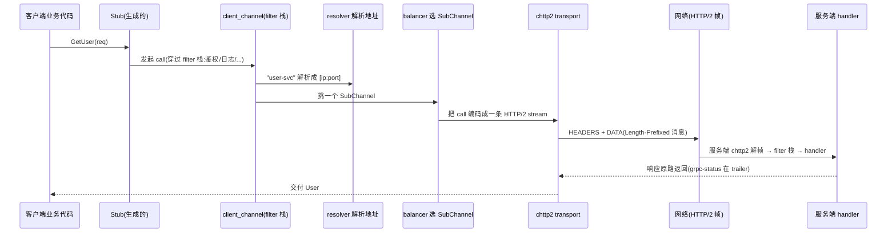

# 第 0 篇 · 第 1 章 · 第一性原理:为什么需要 gRPC

> **核心问题**:远程调用 `client.GetUser(req)` 看起来和本地调用 `user.get(req)` 一模一样,可它们**根本不是一回事**。那么,让一次跨网络、跨语言的方法调用既"像本地一样自然"、又"不假装网络不存在",到底需要解决什么?gRPC 凭什么用"IDL 契约 + HTTP/2 流 + protobuf 编码"这套,成了跨语言 RPC 的事实标准?又为什么 gRPC 要大费周章地**自己用 C 实现一整套 HTTP/2**,而不是复用现成的?

> **读完本章你会明白**:
> 1. 为什么"把远程调用伪装成本地调用"是个**诱人却致命的陷阱**——以及 gRPC 怎么从陷阱里爬出来。
> 2. gRPC 的"三件套"各回答了哪个根本问题,为什么偏偏是这三件、缺一不可;以及 gRPC 为什么基于 HTTP/2、为什么选 protobuf。
> 3. 为什么"**流**"是 gRPC 的第一性概念,全书 23 章都围绕它展开。
> 4. 为什么 gRPC C++ core 要**自己实现 HTTP/2(chttp2)** 而不是复用语言库——这是本书选 C++ core 作源码的根。
> 5. 一次 gRPC 调用从客户端到服务端再回来,要穿过哪两层、各自由哪些源码模块拼成。
> 6. gRPC core 正在经历一场怎样的架构演进(callback → Promise),为什么这场演进本身就是理解 gRPC 的钥匙。

> **如果一读觉得太难**:先只记住三件事——① 远程调用和本地调用不是一回事,网络有八条"必错"的谬误;② gRPC 用"**契约(protobuf)换跨语言**、**流(HTTP/2)换高并发与背压**、**二进制编码换省带宽**"三件套回答;③ 全书一句话主线:**把一次方法调用,变成 HTTP/2 上的一条可控的流**。

---

## 〇、一句话点破

> **gRPC 做的事,本质上是一句话:它不再假装"远程调用和本地调用一样",而是老老实实地把一次跨网络、跨语言的方法调用,做成 HTTP/2 上的一条可控的"流"。**

这是结论,不是理由。本章倒过来拆:先讲清楚"为什么远程调用和本地调用根本不是一回事",再讲"为什么'假装一样'会出事",然后讲 gRPC 用什么三件套把这件事做对、做得成了标准,最后讲它为什么连 HTTP/2 都要自己实现。

---

## 一、远程调用,和本地调用根本不是一回事

### 一个看似无害的等号

很多教程会用这样的代码引入 RPC:

```cpp
// 看起来,这两行"差不多"
User user = localStore.GetUser(req);     // 本地调用
User user = remoteStub.GetUser(req);     // 远程调用?
```

两行长得几乎一样,以至于有人会想:那我把"调远程"也写成函数调用的样子,程序员就感觉不到"远程"的存在了嘛。这正是 RPC 这个名字(`Remote Procedure Call`,远程过程调用)最初许下的美好诺言——**位置透明性**(location transparency):调用者不需要、也不应该知道,被调用的代码跑在本机还是另一台机器上。

听起来很美。但它藏着一个致命的前提:**它假设"远程"和"本地"除了位置不同、其余都一样**。这个假设,在真实世界里几乎每一条都不成立。

### 不这样想会怎样:网络的"八条谬误"

1994 年前后,Sun 公司的 Peter Deutsch 等人总结了一份著名的清单,**"分布式计算的八条谬误"**(The Eight Fallacies of Distributed Computing)。它的意思不是"这八句话是对的",恰恰相反——**它说的是:绝大多数程序员在写分布式程序时,会不自觉地假设这八件事成立,而这八条假设全都是错的**:

1. 网络是可靠的(The network is reliable)。
2. 延迟为零(Latency is zero)。
3. 带宽是无限的(Bandwidth is infinite)。
4. 网络是安全的(The network is secure)。
5. 拓扑不会改变(Topology doesn't change)。
6. 管理员只有一个(There is one administrator)。
7. 传输成本为零(Transport cost is zero)。
8. 网络是同构的(The network is homogeneous)。

> **不这样会怎样**:把远程调用当本地调用,等于默认了这八条。于是你会看到:本地调用 `GetUser` 要么成功返回、要么抛个明确的异常(空指针、越界),**它不可能"调了一半卡住"**——因为本地内存访问要么读到、要么读到错的,不会"正在读"。可远程调用呢?请求可能**在网络里丢了**(谬误 1)、可能**卡在中间设备的缓冲队列里 30 秒**(谬误 2)、可能**对方其实已经处理完了、只是响应没回来**(这就是"不知道到底成功没有"的噩梦)。本地调用没有这些状态,远程调用全是这些状态。

一条本地的 `return user;` 是一个原子的事实。一次远程的 `return user;` 背后,是一段跨越了进程边界、网卡、网线、交换机、负载均衡器、对方内核、对方线程的漫长旅程,**这段旅程上任何一环都可能失败,而且失败的方式远比"成功/失败"两种丰富得多**。

### 举一个让你后背发凉的例子

设想一个支付系统:用户点"付款",前端调后端的 `pay(orderId)`。如果是本地调用,`pay` 返回了就是成功了,抛异常了就是失败了,清清楚楚。可如果是远程调用(前端→后端,或后端→支付网关),真实情况是:

- 请求发出去了,**网络抖了一下,3 秒后才到**——前端以为卡死了,用户又点了一次(重复支付?)。
- 请求到了,网关**扣款成功了**,但响应回来的路上**丢了**——前端收到超时,以为失败,可钱其实已经扣了。
- 网关**处理到一半崩了**——这笔到底算成功还是失败?没人知道。

这些都是"部分成功"的中间态,本地调用里根本不存在。**而这,就是分布式系统难做的根**。

### 所以 gRPC 一上来就承认:这是两件事

gRPC 没有去维护"位置透明性"那个美丽的幻觉。它的整个设计,都建立在**"远程调用和本地调用根本不是一回事,我们偏要把这个差异暴露出来、管理好"**这个前提上:

- 因为网络可能丢、可能慢、可能"成功了但你不知道"——所以 gRPC 给每次调用配了**显式的状态码(`grpc-status`)、超时(deadline)、重试(retry)**,而不是像本地调用那样"调就完了"。
- 因为网络两端可能是不同语言写的——所以 gRPC 要一份**语言无关的契约(IDL)**,而不是假设两边都用同一种语言的对象。
- 因为一条网络连接很贵、却要扛住海量并发调用——所以 gRPC 把每次调用建模成**一条"流"**,而不是每次一个连接。

> **钉死这件事**:理解 gRPC 的起点,不是"它有哪些 API",而是**它放弃了"位置透明性"这个理想,转而把网络的真面目当作一等公民来对待**。后面所有的机制——契约、流、流控、重试、keepalive、负载均衡——都是"认真对待网络"的产物。

---

## 二、RPC 的初心,与"伪装成本地"的陷阱

### 1984 年,一个美好的理想

"远程过程调用"这个词,正式提出是 1984 年 Andrew Birrell 和 Bruce Nelson 的经典论文《Implementing Remote Procedure Calls》。它的理想堪称程序员之梦:

> 让调用另一台机器上的代码,**和调用本机的一个函数,在语法上没有任何区别**。

程序员写 `result = server.compute(input)`,至于 `server` 在隔壁机房还是隔壁机房的对岸,编译器和运行时帮你抹平。这就是"位置透明性"。

这个理想驱动了之后几十年的 RPC 系统:Sun RPC、DCOM、CORBA、Java RMI……它们都试图让远程调用"看起来像本地调用"。

### 可是,1994 年有人戳破了它

1994 年(顺带一提,和"八条谬误"同年),Jim Waldo 等人写了一篇短而尖锐的论文《A Note on Distributed Computing》。它的核心论点一句话就能说清:

> **本地调用和远程调用,有着根本不同的失败模式;因此,"让它们看起来一样"不是便利,而是陷阱。**

为什么?因为一次本地函数调用,**它的失败是"完全失败"或"完全成功"**:要么函数跑完返回了(成功),要么抛异常了(失败),要么进程崩了(你也跟着没了)。它**不存在"部分成功"**——不会出现"函数执行了一半,然后既不返回也不报错,卡在那里"。

但一次远程调用,**满地都是"部分成功"的中间态**:

- 请求发出去了,对方**收到没有**?你不知道(可能还在路上)。
- 对方收到了,**处理了没有**?你不知道(可能正在处理)。
- 对方处理完了,**结果回来了没有**?你不知道(响应可能丢了)。
- 对方处理到一半**崩了**,这算成功还是失败?你不知道。

> **不这样会怎样**:如果你把远程调用伪装成本地调用,程序员就会用本地调用的心智模型去写它——`result = server.compute(input); use(result);`。一旦发生上面任何一种"部分成功",本地心智模型就**完全失效**:既没有返回值可用、也没有异常可 catch,程序卡死或者拿脏数据往下跑。这种 bug 极难复现、极难排查,因为它的根因(网络的不确定性)被"看起来一样"的语法**精心掩盖**了。Waldo 那篇论文的犀利之处在于:**掩盖差异,不是降低复杂度,而是把复杂度藏到更难发现的地方。**

### 所以,现代 RPC 选择"显式"

Waldo 那篇论文的结论,深刻影响了之后所有的 RPC 设计,包括 gRPC:

> **与其假装远程调用和本地一样,不如让"这是一次跨网络调用"这件事,在代码里显式可见、可管理。**

gRPC 把这句话落到了三个具体的设计上,这就是它的"三件套":

1. **显式的契约**:用一份独立的、语言无关的接口描述(IDL,`.proto`),明明白白告诉你"这是远程接口",而不是偷偷藏在一个本地对象背后。
2. **显式的异步**:把每次调用做成一条"流",流天然是异步的、可取消的、可背压的——你随时知道"这次调用进行到哪了、要不要继续等"。
3. **显式的失败语义**:统一的 `grpc-status` 状态码、deadline、retry——让"部分成功"这种网络特有的失败,被显式建模,而不是被吞掉。

> **钉死这件事**:gRPC 不是"让远程调用更像本地调用"的工具,**恰恰相反,它是"让远程调用不再假装成本地调用"的工具**。这句话是全书一切设计的总开关。

---

## 三、gRPC 的三件套:各回答一个根本问题

那么,gRPC 具体怎么"认真对待网络"?答案是三件套,每一件各对应一个根本问题。在拆每件之前,先讲一段历史——因为它解释了"为什么是这三件"。

### 一段绕不开的历史:从 Stubby 到 gRPC

gRPC 不是凭空发明的。早在 2001 年,Google 内部就有一套 RPC 框架叫 **Stubby**——在 Google 海量服务之间,它每天处理**上百亿次调用**,是 Google 内部的事实基础设施。但 Stubby 是个**私有协议**(自有的二进制格式、自有传输),走不出 Google。

2015 年,Google 把 Stubby 的理念**重新实现并开源**,这就是 gRPC。但这次开源不是简单"换个皮",而是做了一个关键决策:**建立在公开的互联网标准之上,而不是再造私有协议**。具体说,gRPC 选了三个公开标准:HTTP/2(传输)、protobuf(编码)、IDL(接口描述)。这个决策,是 gRPC 能走出 Google、成为跨语言 RPC 事实标准的根——后面每件套都和它有关。

### 第一件:IDL 契约(protobuf)——回答"跨语言怎么办"

网络两端,很可能一台是 Java 写的订单服务,一台是 Go 写的用户服务,一台是 Python 写的推荐模型。它们**没有共同的对象模型,甚至没有共同的类型系统**。怎么让它们互相调用?

gRPC 的回答:**先让所有人就一份"语言无关的契约"达成一致**。这份契约用 protobuf 的 `.proto` 写:

```protobuf
service UserService {
  rpc GetUser(GetUserRequest) returns (User);            // 一次调用
  rpc StreamUpdates(WatchRequest) returns (stream User); // 服务端流
}

message GetUserRequest { string user_id = 1; }
message User { string user_id = 1; string name = 2; }
```

注意 `user_id = 1` 里的那个 `1`——它是**字段号**,不是字段名。这是 protobuf 能做到"前后兼容"的根:加字段不影响老代码,因为定位字段靠的是数字编号,而不是名字或位置(本书 P1-02 会拆透)。

> **不这样会怎样**:如果没有语言无关的契约,跨语言调用就只能靠"双方约定好一个 JSON 的字段名"这种**口头协议**。口头协议会腐烂——今天叫 `userId`,明天有人写成 `user_id`,后天有人多塞了个 `user_id` 还少塞了 `name`,而且没有类型检查,错了运行时才炸。契约把这种"口头约定"变成了**编译期就能查错的、版本化的、机器可读的合同**。gRPC 的 `.proto` 配合 protoc 代码生成,让 N 种语言拿到的是**类型安全**的 stub,而不是裸字符串解析。

### 第二件:HTTP/2 传输——回答"高并发与背压怎么办"

网络连接是宝贵的:建一条 TCP 连接要三次握手、TLS 要好几轮往返、内核要维护状态。如果像老式 HTTP/1.1 那样"每次调用开一条连接、调完关掉",在海量并发下连接数会爆炸,而且每条连接都在排队,慢的调用会堵死快的(队头阻塞)。

gRPC 的回答:**用 HTTP/2,把一次调用变成一条"流"(stream)**。HTTP/2 允许在**同一条 TCP 连接上,同时跑成千上万条流**,每条流是一个独立的调用,互不阻塞:

```
   一条 TCP 连接
   ┌──────────────────────────────────────────────┐
   │ stream 1 (GetUser)    ▓▓▓▓▓▓ 请求/响应        │
   │ stream 3 (GetOrder)   ▓▓▓▓▓▓▓▓▓▓              │  ← 同一条连接,
   │ stream 5 (Update)     ▓▓                      │     海量并发调用,
   │ stream 7 (Stream)     ▓▓▓▓▓▓▓▓▓▓▓▓▓▓▓▓...      │     互不阻塞
   └──────────────────────────────────────────────┘
```

而且,流天生带来三个本地调用没有的能力:**背压**(消费者处理不过来,可以让生产者慢点发)、**流式**(大数据分批发)、**取消**(关掉一条流不影响同连接的其他流)。

> **为什么是 HTTP/2,而不是 HTTP/1.1 或 HTTP/3**:
> - **不用 HTTP/1.1**:HTTP/1.1 是"一个请求独占一条连接"的语义(一个连接同一时刻只能处理一个请求-响应),海量并发要么开海量连接(连接数爆炸),要么排队(队头阻塞)。它撑不住"百万 QPS、需要背压"。
> - **不用私有 TCP 协议**(像早期 Thrift/Dubbo 的自有协议):性能可以很好,但**生态割裂**——每种 RPC 一个协议、一套工具、一个监控,无法互通、无法复用现成的网络基础设施(代理、负载均衡、网关)。
> - **为什么不是 HTTP/3(QUIC)**:gRPC 诞生时(2015)HTTP/2 刚随 gRPC 同年标准化(RFC 7540),HTTP/3 还很早。HTTP/3 基于 UDP/QUIC,理论上更适合(连接迁移、无队头阻塞),但 gRPC 选了当时成熟、生态完善的 HTTP/2。**HTTP/2 是"公开标准 + 成熟生态"的甜点**,让 gRPC 白嫖了一套现成的多路复用 + 流控,又能穿过任何 HTTP 中间设施。

### 第三件:protobuf 编码——回答"序列化怎么又快又省"

跨网络,就得把内存里的对象变成字节流发过去,对方再变回来——这叫序列化/反序列化。JSON 是文本,人能读,但**大、且解析慢**(要逐字符分析引号、冒号、转义)。

gRPC 的回答:用 **protobuf 的二进制编码**。它用变长整数(varint)、字段标签(tag)、紧凑的 wire format,把每个字段压到**最少字节**,而且解析是**定长的、无需回溯的**(本书 P1-03 拆透)。更重要的是,它**天生前后兼容**:加字段不破坏老代码,因为靠字段号定位、靠 unknown fields 透传不认识的字段。

> **为什么 protobuf 而不是 JSON 或 Thrift**:
> - **不用 JSON**:JSON 是文本,体积大(字段名重复出现、用文本表示数字)、解析慢(逐字符、要处理转义和引号)、没有类型(全靠口头约定,错了运行时炸)。protobuf 二进制 + 字段号,小一个数量级、快几倍、且有编译期类型检查。
> - **不用 Thrift**:Thrift 也是二进制 + IDL,很优秀。但 gRPC 选 protobuf,是因为 protobuf 和 gRPC 都出自 Google、深度集成,且 protobuf 的 `oneof`/`map`/`Any`、 editions 体系更完善。**这不是 protobuf 绝对比 Thrift 强,而是生态与工具链的选择**。

> **钉死这件事**:三件套各管一段——**契约管跨语言、流管高并发与背压、二进制编码管省带宽**。它们是 gRPC 的三个支柱,缺任何一个,gRPC 都不成其为 gRPC。全书 23 章,本质上就是这三件套的展开:第 1 篇拆契约、第 2 篇拆流(HTTP/2)、第 3~6 篇拆"怎么把流治理得生产可用"。

---

## 四、为什么"流"是 gRPC 的第一性概念

三件套里,最值得单独拎出来、当作全书主线的,是"**流**"。因为它是 gRPC 区别于"老式请求-响应 RPC"的根本。

### 四种调用模式,本质都是流

gRPC 定义了四种调用模式,听起来是四个不同的东西:

| 模式 | 客户端发 | 服务端回 | 例子 |
|------|---------|---------|------|
| Unary(一元) | 1 个请求 | 1 个响应 | `GetUser` |
| Server streaming(服务端流) | 1 个请求 | N 个响应 | 订阅股价推送 |
| Client streaming(客户端流) | N 个请求 | 1 个响应 | 上传一批日志 |
| Bidirectional streaming(双向流) | N 个请求 | N 个响应 | 实时聊天 |

但如果你看 gRPC 的底层,这四种**根本就是同一种东西**:它们都是 HTTP/2 上的一条流。区别只在于——

> **Unary,就是"只有一进一出"的流;双向流,就是"可以进很多、出很多"的流。它们的载体,是同一条 stream。**

这是 gRPC 设计上一个极漂亮的统一:它没有为"一元调用"和"流式调用"造两套不同的传输机制,而是**让一切都是流**,一元调用只是流的一个特例。

> **不这样会怎样**:如果像 HTTP/1.1 那样为"一问一答"专门设计协议,那流式调用就得另起炉灶(另造一套协议、一套客户端、一套服务端、一套负载均衡)。gRPC 的"一切皆流"让这四种模式**共享同一套传输、流控、负载均衡、重试机制**——维护一套,服务四种。这是工程上的巨大简化。

### 流,带来了本地调用没有的三样东西

也正因为底层是流,gRPC 天然拥有本地调用(以及老式请求-响应 RPC)给不了的三样东西:

1. **多路复用**:一条连接跑海量调用,省连接、省握手。
2. **背压**:消费者跟不上,能让生产者慢下来,而不是 OOM。
3. **可取消**:一条流可以随时关掉(取消),而且**精准**——只关这一条,别的调用不受影响。

> **钉死这件事**:**全书一句话主线——把一次方法调用,变成 HTTP/2 上的一条可控的流。** 任何一处看不懂 gRPC 的某个机制,回到这句问:"这是在把方法调用编码成网络上流动的字节(协议层),还是在把网络字节变回可调用、可治理的方法(框架层)?"这就是本书的**二分法**。

---

## 五、为什么 gRPC 要自己用 C 实现整套 HTTP/2(本书选 C++ core 的根)

你可能会有个疑问:gRPC 不是有 Java 版、Go 版、Python 版吗?为什么这本书偏偏要拿 **C++ core**(`grpc/grpc` 的 C 实现)来讲?这个选择背后,藏着一个 gRPC 设计上很重要的事实。

### grpc-go / grpc-java 复用了语言库的 HTTP/2

gRPC 的各种语言实现,处理 HTTP/2 的方式并不一样:

- **grpc-go**:直接用 Go 标准库 `golang.org/x/net/http2` 的 HTTP/2 实现。也就是说,gRPC **没有自己实现 HTTP/2**,它把帧的收发、HPACK、流控都交给了 Go 库。
- **grpc-java**:用 Netty(Java 的高性能网络库),Netty 自带 HTTP/2 支持。同样,gRPC **没有自己实现 HTTP/2**。

这意味着什么?意味着在这些实现里,**HPACK 的动态表、flow control 的 window、帧的编解码,真身都不在 gRPC 的代码里**——在语言库 / Netty 里。你读 grpc-go 源码,想搞懂"HPACK 怎么压缩头部",得跳到 Go 标准库去读,而那不是 gRPC 的代码。

### gRPC C++ core:自己用 C 写了一整套 HTTP/2(chttp2)

而 gRPC 的 **C++ core**(`grpc/grpc`,也叫 gRPC core,其实是 C/C++ 实现)走的是另一条路:**它自己用 C 实现了一整套 HTTP/2**,内部叫 **chttp2**("c http2" 的缩写)。在 `src/core/ext/transport/chttp2/transport/` 下,你能找到:

- `chttp2_transport.cc` —— transport 主体;
- `hpack_encoder.cc` / `hpack_parser.cc` + `hpack_*_table.cc` —— HPACK 编码器/解码器 + 静态/动态表(本书 P2-07 的主角);
- `flow_control.cc` —— HTTP/2 流控 + gRPC BDP 估计(本书 P2-09);
- `parsing.cc` / `writing.cc` —— 帧的读/写状态机;
- `frame_data.cc` / `frame_settings.cc` / `frame_ping.cc` / `frame_goaway.cc` / `frame_window_update.cc` —— HTTP/2 各种帧的处理。

> **不这样会怎样**:如果讲 gRPC 用 grpc-go,讲到 HPACK 和流控时,会发现"真身不在 gRPC 代码里",精解协议层时无处下手、只能泛泛而谈。而用 C++ core,**HPACK 动态表怎么更新、flow control window 怎么给信用、BDP 怎么估计,全在 gRPC 自己的源码里**,可以逐行讲透。**这就是本书选 C++ core 的根**:协议层招牌,只有它讲得透。

这也是 gRPC core 的一个设计哲学:**它要在任何语言里都能用**(C++ core 被各种语言封装,比如 Python 的 grpcio 就是包了 C++ core),所以它**必须自己实现 HTTP/2**,不能依赖任何特定语言的库。这种"自带协议栈"的设计,反而让它成了研究 HTTP/2 在 RPC 里怎么落地的最佳标本。

> **钉死这件事**:本书选 C++ core,不是因为别的实现不好,而是因为**只有它把 HTTP/2/HPACK/flow control 写在自己的源码里**,本书才能把协议层招牌讲到源码级。这和《TiKV》选 Rust 主仓(因为它把 multi-raft/Percolator 写在自己源码里)是同一个道理。

---

## 六、一次 gRPC 调用的完整旅程(全书地图)

把前面讲的拼起来,一次 `remoteStub.GetUser(req)` 从客户端到服务端再回来,在 gRPC core 里的完整旅程是这样的。**这张图就是全书的地图**,每个箭头都是后面某一章的主角:



对应章节:
- **Stub** 怎么从 `.proto` 生成出来 → P1-04;
- **filter 栈** 怎么不侵入业务地织入鉴权/日志(`src/core/call/call_filters.cc`、`src/core/ext/filters/`)→ P3-11;
- **resolver** 怎么把名字变地址(`src/core/resolver/`)→ P4-13;
- **balancer** 怎么挑 SubChannel(`src/core/load_balancing/`、`src/core/client_channel/`)→ P4-15;
- **chttp2 transport** 怎么把 call 变成 HTTP/2 stream、HPACK 怎么压头部、flow control 怎么背压(`src/core/ext/transport/chttp2/transport/`)→ 第 2 篇五章。

> **钉死这件事**:读这本书,就是跟着这条旅程,一站一站走完。每到一个驿站,搞懂"它解决什么问题、用了什么技巧",合上书你就能在脑子里放映出这张图的全过程。

---

## 七、一个绕不开的背景:gRPC 正在换骨架

最后,必须诚实地交代一件事——它不影响你理解 gRPC 的"为什么",但**严重影响你读源码**:

> **gRPC C++ core 正处于一场大规模架构演进中:从"经典架构"(callback + completion queue + filter stack)迁移到"新架构"(Promise-based + call spine + filter fusion)。**

你在源码里会同时看到两套东西:

- **经典形态**:completion queue(所有异步操作排队出口)、`StartBatch` 批量操作、`grpc_call`、以及带 `*_legacy` 后缀的文件(如 `retry_filter_legacy_call_data.cc`、`chaotic_good_legacy/`)。这是绝大多数现存代码、博客、文档的形态。
- **新形态**:`src/core/call/call_spine.cc`(call 的主干,用 promise 编排)、`filter_fusion.h`(把多个 filter 在编译期融合成一条流水线)、`http2_client_transport.cc`(Promise 版的 HTTP/2 transport)、`load_balanced_call_destination.cc`、以及全新的 transport `chaotic_good/`。

为什么要有这场演进?因为经典架构的 callback + completion queue,在面对"一条调用要穿过十几个 filter、每步都可能异步"时,会把代码写成层层嵌套的回调(callback hell),且难组合、难推理。新的 Promise 模型把这些异步步骤变成可组合的、线性的 promise 链,大幅降低了复杂度。

> **本书的态度**:① **以新版源码结构为准**(`src/core/` 已经扁平化重构,老的 `src/core/lib/` 层级不再适用——大量旧博客的路径已经过时);② **经典架构作为背景讲清**(它是现存代码的主流形态,且能帮你看懂"新架构为什么要这么改");③ 涉及 legacy 的地方,诚实标注。这场演进本身就是理解 gRPC 设计哲学的绝佳教材——它回答了"当一套异步模型扛不住复杂度时,该怎么换骨架"。

---

## 八、技巧精解:两个第一性洞察

本章是概念定调章。有两个最硬核的第一性洞察值得单独钉死。

### 洞察一:HTTP/2 的 stream,如何从根本上消除 HTTP/1.1 的队头阻塞

HTTP/1.1 的模型是"一问一答":客户端发一个完整请求,服务端回一个完整响应,这条往返**独占**了这条连接,直到响应回来。如果客户端要同时发起 1000 个调用,朴素做法只有两个选择:

- **串行**:一个一个来,第 2 个等第 1 个回来才发——延迟叠加,灾难。
- **并行**:开 1000 条连接——每条连接三次握手 + TLS 握手,内核连接数爆炸,且**慢的那个调用还是会拖累同连接的其他调用**(队头阻塞)。

HTTP/2 的核心发明,是在一条连接里引入了多条**并发的"流"**,每条流有一个唯一的 ID。一个调用 = 一条流。这些流**分时复用同一条连接的字节流**,各自独立推进:

```
   HTTP/1.1:每个调用独占一条连接,或挤一条连接排队
   请求1 ─────────响应1┐
                       │  连接1(慢请求1堵死请求2)
   请求2 ─(等)─────────响应2┘

   HTTP/2:一条连接,多条并发流,互不阻塞
   连接(唯一)┬─ stream1 ▓▓▓ 响应1
              ├─ stream3 ▓▓▓▓▓▓ 响应3
              └─ stream5 ▓▓ 响应5
```

> **不这么设计会怎样**:如果没有"流"这个抽象,gRPC 要么承受 HTTP/1.1 的队头阻塞(海量调用互相拖累),要么自己去发明一套"连接内多路复用"的私有协议(那就失去了 HTTP/2 公开标准的生态红利)。HTTP/2 的 stream 让 gRPC **白嫖了一套成熟的多路复用 + 流控**,而不用自己造。这就是 gRPC 选 HTTP/2 的根本原因——不是因为它新潮,而是因为"流"这个抽象,恰好是 RPC 最需要的。

### 洞察二:HPACK 凭什么把每次调用重复的头部压到几乎零字节

每次 gRPC 调用,都要发一批 HTTP 头部(`:path`、`content-type`、`te: trailers`、`:authority`……)。这些头部**每次调用都几乎一样**,如果每次都全文发送,海量调用下,头部开销会吃掉可观带宽。HPACK(HTTP/2 的头部压缩,RFC 7541)用**三重压缩**解决:

- **静态表**:HTTP/2 预定义了 61 个最常用的头部(如 `:method: GET`、`content-type`),发个索引号(1 字节)就代表整条头部,根本不用发文本。
- **动态表**:本次连接里**学到的**头部(比如客户端发过一次的 `:path: /UserService/GetUser`),存进动态表,下次同连接再发同样的,也只发索引号。于是**同连接的重复调用,头部几乎零字节**。
- **Huffman 编码**:实在要发的文本,用 Huffman 编码(高频字符短编码)再压一道。

> **不这么设计会怎样**:如果像 HTTP/1.1 那样每次全文发头部,100 万次调用就发 100 万次重复的 `:path`/`content-type`,带宽浪费惊人。HPACK 的动态表,让"同连接重复头部"这个 RPC 的典型场景,压缩比达到极致。这是 gRPC 能在 HTTP/2 上做到高吞吐的关键之一,本书 P2-07 会拆到源码级(静态表 61 项、动态表的环形缓冲、Huffman 的解码状态机)。

---

## 九、章末小结

### 回扣主线

本章是全书唯一的"纯概念章"。它立起了全书最重要的三个东西:

1. **主线**:**把一次方法调用,变成 HTTP/2 上的一条可控的流。**
2. **二分法**:**协议层**(把调用编码成网络上流动的字节)vs **框架层**(把网络字节变回可调用、可治理的方法)。
3. **总开关**:**gRPC 不假装远程调用是本地调用,而是把网络的真面目当作一等公民对待。**

后续 22 章,都是这三个东西的展开。

### 五个为什么

1. **为什么远程调用不能直接当本地调用?**——因为网络有"八条谬误",远程调用满地都是"部分成功"的中间态,本地心智模型完全失效(Waldo 的位置透明性陷阱)。
2. **为什么 gRPC 基于 HTTP/2 而非再造私有协议?**——HTTP/2 的"流"恰好是 RPC 最需要的(多路复用 + 流控),且是公开标准换生态通用,能穿过任何 HTTP 设施;这是 Stubby→gRPC 开源时的关键决策。
3. **为什么 gRPC 选 protobuf 而非 JSON/Thrift?**——protobuf 二进制 + 字段号,比 JSON 小一个数量级、快几倍、有编译期类型检查、天生前后兼容。
4. **为什么本书选 C++ core 作源码?**——只有 C++ core 自己实现了 HTTP/2/HPACK/flow control(chttp2),协议层招牌才讲得透;grpc-go/grpc-java 复用语言库,讲不透。
5. **为什么 gRPC core 在搞 Promise 重构?**——因为经典 callback + completion queue 在复杂 filter 链下变成回调地狱,Promise 让异步步骤线性可组合。

### 想继续深入往哪钻

- 想看 gRPC 官方对"为什么"的论述:读 gRPC 官方文档的 "Motivation" 和 "Core concepts"。
- 想理解 HTTP/2 的流到底怎么工作:直接读 RFC 7540(HTTP/2)的 Section 5(Streams),本书第 2 篇会逐条拆。
- 想理解 HPACK:读 RFC 7541,本书 P2-07 拆到源码级。
- 想看源码地图:读本书《附录 A · 源码全景路线图》(全书成稿后)。
- 想动手感受"流":用 `grpcurl` 或写一个 server-streaming 的 demo,抓包看一条连接上的多条 stream。

### 引出下一章

我们搞清楚了"为什么需要 gRPC"和"它把方法调用变成了流",也明白了为什么本书选 C++ core。那么,这份"跨语言的契约"具体是怎么写、怎么保证前后兼容、怎么变出五种语言 stub 的?下一章 P1-02,我们从 gRPC 三件套的第一件——**IDL 契约(protobuf `.proto`)**——开始,拆它"用字段号而非字段名定位"这个设计的根。

> **下一章**:[P1-02 · IDL 与 .proto:语言无关的契约](P1-02-IDL与proto-语言无关的契约.md)
