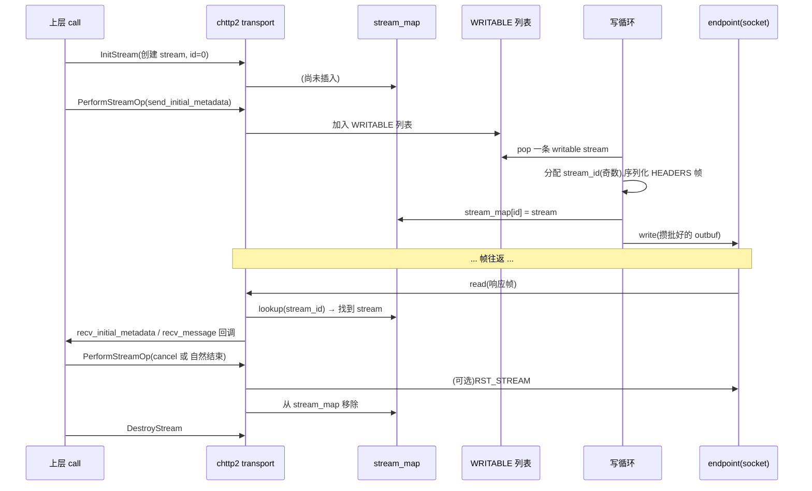

# 第 2 篇 · 第 6 章 · chttp2 transport 全貌:一条流的一生

> **核心问题**:HTTP/2 协议规定了"一条连接可以跑成千上万条流",但**谁来记录哪条流是哪个状态?谁来把多条流的数据攒成一批发出去(省系统调用)?一条流从生到死,在 transport 里走了哪些列表?** 本章钻进 [`chttp2_transport.cc`](../grpc/src/core/ext/transport/chttp2/transport/chttp2_transport.cc)(3801 行的经典版主体),跟着一条 stream 从 init 到 destroy,看 transport 怎么在一条 TCP 上调度出海量并发。并对照 [`http2_client_transport.cc`](../grpc/src/core/ext/transport/chttp2/transport/http2_client_transport.cc) / [`http2_server_transport.cc`](../grpc/src/core/ext/transport/chttp2/transport/http2_server_transport.cc)(Promise 版)——这是引出 gRPC 架构演进的最佳位置。

> **读完本章你会明白**:
> 1. 一个 TCP 连接怎么同时承载成千上万个并发调用——靠 `stream_map`(花名册)记录每条流,靠 `stream_lists`(多个链表)分类调度。
> 2. 一次写循环怎么把多条流的数据**攒成一批发出去**(省 `write` 系统调用),攒批的上限(`target_write_size`)怎么动态决定。
> 3. 一条 stream 从 InitStream 到 DestroyStream 的完整生命周期,以及在哪些"流列表"里进进出出。
> 4. gRPC 正在把 transport 从经典 `chttp2_transport` 迁到 Promise 版 `http2_client_transport` / `http2_server_transport`——为什么要迁、迁了什么、留下了什么 legacy,以及怎么从源码认出两者。

> **如果一读觉得太难**:先只记住三件事——① 一个连接的 transport 持有一张 `stream_map`,stream_id 查找返回 stream 对象;② 多条待发数据的流被挂在 `WRITABLE` 列表上,写循环逐条从里面取出来,把数据攒进 `outbuf` 一次性 `write` 出去(攒批省系统调用);③ 经典版用 callback + completion queue,Promise 版用 promise 编排,两者并存是 gRPC 的"换骨架"现场。

---

## 〇、一句话点破

> **transport 干的事,本质是三件:① 给每条 stream 发身份证(stream_map)、② 给 stream 排班(stream_lists)、③ 把排好班的数据攒成一车皮发出去(write loop)。这三件加上 frame 的解析/序列化,就是"一条 TCP 上调度出海量并发"的全部魔法。**

这是结论,不是理由。本章倒过来拆:先讲"transport 这个抽象到底要解决什么",再钻进 chttp2 的结构体看它怎么记 stream、怎么排班,然后跟着一次写循环看攒批,最后讲 stream 的生命周期和正在发生的"换骨架"。

---

## 一、transport 是干什么的:从 socket 字节到 RPC 调用

HTTP/2 协议讲的是"帧的格式、流的语义、流控的规则"——这些是**静态规范**。但谁来**执行**这些规范?谁来在 socket 上读字节、解帧、按 stream_id 分发、维护每条流的状态、把要发的帧攒起来写回 socket?这就是 **transport** 的职责。

在 gRPC core 的层次里,transport 是**协议层和框架层之间的桥**。它的位置是:

```
   框架层(call / filter stack)  ──┐
                                   │  调用接口:InitStream / PerformStreamOp / DestroyStream
   ────────────────────────────────┼──
   transport                       │  把"对一条流的操作"翻译成"对 HTTP/2 帧的操作"
   ────────────────────────────────┼──
   协议层(HTTP/2 帧的解析/序列化)  │  parsing.cc / writing.cc / frame_*.cc
   ────────────────────────────────┼──
   endpoint(socket 抽象)           │  read / write 字节
                                   │
   网络(TCP + TLS)               ─┘
```

transport 向上提供一组面向"流"的接口(`InitStream` 创建一条流、`PerformStreamOp` 在流上执行操作(发初始元数据/发消息/收消息/收 trailer)、`DestroyStream` 销毁流);向下调用 endpoint 的 read/write 收发字节。中间这一段,就是 HTTP/2 协议落地的地方。

> **不这样会怎样**:如果没有 transport 这一层抽象,上层 call 要直接面对 socket 字节——每发一个请求都得自己拼 HEADERS 帧、塞 DATA 帧、算流控、解 HPACK。这条链上有十几个状态机(帧解析、HPACK、流控、stream 状态),每个 call 都各跑一套,代码无法复用。transport 把这些状态机**集中在一个连接上**,让 N 条流共享一套协议实现。这是 chttp2 存在的根——它是"**协议状态的容器**"。

---

## 二、chttp2 的结构体:一个连接的所有家当

要看 transport 怎么调度流,先看它的"家当"——一个 `grpc_chttp2_transport` 结构体里挂了多少东西。这个结构体定义在 [`internal.h`](../grpc/src/core/ext/transport/chttp2/transport/internal.h#L240-L634)(注意:不在 `chttp2_transport.h`,那是经典 gRPC 的一个怪异安排),挑最关键的几个字段:

| 字段 | 行号 | 干什么 |
|---|---|---|
| `ep` | 316 | `OrphanablePtr<grpc_endpoint>`,底层 socket 抽象 |
| `peer_string` | 319 | 对端地址(日志/诊断用) |
| `combiner` | 332 | 经典版的"逻辑串行化"机制(work-stealing 的 lock) |
| `stream_map` | 352 | `absl::flat_hash_map<uint32_t, grpc_chttp2_stream*>`,**stream 花名册** |
| `lists[STREAM_LIST_COUNT]` | 349 | 流列表数组(writable/writing/stalled_by_transport/...) |
| `read_buffer` | 385 | 入站字节缓冲 |
| `outbuf` | 410 | **本次要发的攒批缓冲** |
| `qbuf` | 415 | 下次要发的排队帧(settings ack / ping ack / rst_stream) |
| `hpack_compressor` | 412 | HPACK 编码器(本连接的动态表在这) |
| `hpack_parser` | 457 | HPACK 解码器 |
| `deframe_state` | 478 | 读侧字节级状态机 |
| `settings` | 426 | `Http2SettingsManager` |
| `flow_control` | 471 | `chttp2::TransportFlowControl`(连接级流控 + BDP) |
| `write_state` | 575 | IDLE / WRITING / WRITING_WITH_MORE |
| `keepalive_*` | 527-548 | 经典版内嵌的 keepalive 状态机 |

这个结构体是 chttp2 的"中央仪表盘"。注意几件事:

1. **HPACK 编解码器是连接级的**(`hpack_compressor` / `hpack_parser`)。这意味着动态表**在一条连接上共享**——同一连接的多次调用复用同一张动态表,这正是 HPACK"同连接重复头部几乎零字节"的根(P2-07 会拆透)。
2. **流控也是连接级的**(`flow_control`)。连接级 window 在 transport 上,流级 window 在每条 stream 上(stream 字段里)——双层流控的物理形态。
3. **经典版用 `combiner` 串行化逻辑**(行 332)。这是经典 gRPC 的核心锁机制——它不是传统的 mutex,而是一个 work-stealing 的串行化器:同一个 combiner 上的闭包**保证逻辑上串行执行**,避免数据竞争。Promise 版不需要这个(后面讲)。
4. **`outbuf` 和 `qbuf` 分两块**。`outbuf` 是"本次写循环要发出去的字节",`qbuf` 是"来不及发、留到下次的排队帧"(主要是 ack 类小帧)。这种分离是攒批策略的一部分。

### stream 表(`stream_map`):一个连接的花名册

`stream_map` 是 transport 的核心——一个 `flat_hash_map<uint32_t, grpc_chttp2_stream*>`,把 stream_id 映射到 stream 对象。每收到一个帧,先从帧头取出 stream_id,再 `stream_map.find(id)` 查到这条流,然后把帧交给这条流处理。

查找函数是 inline 的 [`grpc_chttp2_parsing_lookup_stream`](../grpc/src/core/ext/transport/chttp2/transport/internal.h#L834-L839):

```cpp
// (简化示意,非源码原文)
static inline grpc_chttp2_stream* grpc_chttp2_parsing_lookup_stream(
    grpc_chttp2_transport* t, uint32_t id) {
  auto it = t->stream_map.find(id);
  if (it == t->stream_map.end()) return nullptr;
  return it->second;
}
```

这个函数在一帧帧解析时被频繁调用——每收到一个 DATA 帧都要查一次"这条流还在吗"。O(1) 的哈希查找是必须的:一个连接上跑上万条流,如果用线性扫,单是分发帧就吃光 CPU。

> **不这样会怎样**:如果没有 stream_map,transport 要维护"哪些流还活着"就得每次线性扫所有 stream——O(N) 查找在 N=10000 时直接拖垮吞吐。flat_hash_map 的 O(1) 查找让"一帧分发回它所属的流"几乎零开销。**这是海量并发在协议层的物理基础**。

---

## 三、stream 的结构体:一条流的所有状态

stream 本身也是一个结构体 `grpc_chttp2_stream`,定义在 [`internal.h`](../grpc/src/core/ext/transport/chttp2/transport/internal.h#L643-L780)。挑关键字段:

| 字段 | 行号 | 干什么 |
|---|---|---|
| `t` | 648 | 所属 transport(反向指针) |
| `id` | 658 | HTTP/2 stream id(0 = 还没分配) |
| `links[STREAM_LIST_COUNT]` | 655 | 链表节点(用于挂到多个流列表) |
| `included` | 708 | `BitSet<STREAM_LIST_COUNT>`,标记在哪些列表里 |
| `send_initial_metadata` | 661 | 待发的初始元数据(请求/响应头) |
| `send_trailing_metadata` | 663 | 待发的尾元数据(trailer) |
| `recv_initial_metadata` | 678 | 接收的初始元数据槽 |
| `recv_message` | 681 | 接收的消息槽 |
| `recv_trailing_metadata` | 685 | 接收的 trailer 槽 |
| `flow_control` | 727 | `chttp2::StreamFlowControl`(流级流控) |
| `flow_controlled_buffer` | 729 | 待发的字节缓冲(应用层数据) |

两个细节值得点出来:

1. **`links[STREAM_LIST_COUNT]` 是一个链表节点数组 + `included` 是位图**。这意味着同一条 stream **可以同时挂在多个流列表上**,每个列表用一个 `links[i]` 节点。这是侵入式链表(intrusive list)的经典手法——避免为每个列表单独分配节点,空间紧凑、cache 友好。
2. **流级流控(`flow_control`)在 stream 上,连接级流控在 transport 上**。这是双层流控的物理形态——发送一个 DATA 帧要同时扣两层 window。

### 流列表:stream 的"排班表"

stream 不是孤零零待在 stream_map 里——它在**多个流列表之间流动**,每个列表表示"这条流处于什么调度状态"。流列表的枚举定义在 [`internal.h`](../grpc/src/core/ext/transport/chttp2/transport/internal.h#L103-L116):

```
GRPC_CHTTP2_LIST_WRITABLE,                 // 可写(有数据要发)
GRPC_CHTTP2_LIST_WRITING,                  // 正在写(本次写循环选中了)
GRPC_CHTTP2_LIST_STALLED_BY_TRANSPORT,     // 被连接级流控卡住
GRPC_CHTTP2_LIST_STALLED_BY_STREAM,        // 被流级流控卡住
GRPC_CHTTP2_LIST_WAITING_FOR_CONCURRENCY   // 等并发额度(超过 MAX_CONCURRENT_STREAMS)
```

这几条列表就是 stream 的"排班表"。一个 stream 进入 `WRITABLE`,表示"我有数据想发";写循环来取它时,把它移到 `WRITING`;如果发送时撞上流控 window=0,移到 `STALLED_BY_*`;`WAITING_FOR_CONCURRENCY` 是因为 gRPC 有时会在 stream 创建后等连接的并发额度(超过 MAX_CONCURRENT_STREAMS 的话)。

这些列表的操作函数都在 [`stream_lists.cc`](../grpc/src/core/ext/transport/chttp2/transport/stream_lists.cc)(253 行)里。它们是侵入式链表的特化 wrapper:

- [`grpc_chttp2_list_add_writable_stream`](../grpc/src/core/ext/transport/chttp2/transport/stream_lists.cc#L171-L179):加入 WRITABLE 列表
- [`grpc_chttp2_list_pop_writable_stream`](../grpc/src/core/ext/transport/chttp2/transport/stream_lists.cc#L181-L184):写循环从这里取
- [`grpc_chttp2_list_add_writing_stream`](../grpc/src/core/ext/transport/chttp2/transport/stream_lists.cc#L191-L203):写循环选中后转入
- [`grpc_chttp2_list_add_stalled_by_transport`](../grpc/src/core/ext/transport/chttp2/transport/stream_lists.cc#L220-L253):被连接级流控卡住
- [`grpc_chttp2_list_add_waiting_for_concurrency`](../grpc/src/core/ext/transport/chttp2/transport/stream_lists.cc#L205-L208):等并发额度

底层是 `stream_list_add_tail` / `add_head` / `pop` / `remove`(行 51-167),通用的侵入式链表原语。

> **不这样会怎样**:如果只有一个"待发流"列表,transport 就无法区分"卡在流控的"和"等并发额度的",恢复时无法精准唤醒。多列表让 transport 知道**每条流为什么没在发**,从而在 window 更新 / 并发额度释放时,精准地把对应的流唤醒。这是海量并发下"调度正确性"的根。

---

## 四、一次写循环:把多条流的数据攒成一批发出去

这是本章最核心的一节。HTTP/2 的多路复用让"一条连接跑海量流"成为可能,但**每条流发一帧就 `write` 一次**会害死性能——`write` 是系统调用,内核切换开销大。chttp2 的写循环干的事,就是**把多条流的数据攒成一批发出去**——一次 `write` 系统调用打包发 N 条流的帧。

### 写循环的主入口:`grpc_chttp2_begin_write`

写循环的主入口在 [`writing.cc`](../grpc/src/core/ext/transport/chttp2/transport/writing.cc#L682-L770),叫 `grpc_chttp2_begin_write`。它的核心是一个 `WriteContext` 对象(行 260-391),持有 `target_write_size_`(行 382,本次写循环的攒批上限)。流程长这样(简化示意):

```cpp
// grpc_chttp2_begin_write(writing.cc:682-770,简化示意,非源码原文)
void grpc_chttp2_begin_write(grpc_chttp2_transport* t) {
  WriteContext ctx(t);
  ctx.FlushSettings();          // 先 flush 排队的 SETTINGS 帧
  ctx.FlushPingAcks();          // flush 排队的 PING ACK
  ctx.FlushQueuedBuffers();     // 把 qbuf 的排队帧合并进 outbuf
  ctx.EnactHpackSettings();     // 应用 HPACK 表 size 变更

  // 连接级 window > 0 时,把被 transport 流控卡住的流恢复
  if (t->flow_control.remote_window() > 0) {
    ctx.UpdateStreamsNoLongerStalled();
  }

  // ★ 关键:逐流攒批,直到攒够 target_write_size
  while (grpc_chttp2_stream* s = ctx.NextStream()) {
    StreamWriteContext stream_ctx(&ctx, s);
    stream_ctx.FlushInitialMetadata();   // 发 HEADERS(初始元数据)
    stream_ctx.FlushWindowUpdates();     // 发 WINDOW_UPDATE
    stream_ctx.FlushData();              // ★ 按 FC 窗口切 DATA 帧
    stream_ctx.FlushTrailingMetadata();  // 发 trailer
    grpc_chttp2_list_add_writing_stream(t, s);  // 标记本次选中
  }

  ctx.FlushWindowUpdates();
  maybe_initiate_ping(t);

  // 触发真正的 endpoint write
  ... write_action_begin_locked(t);
}
```

注意这个 `while (NextStream())`——它是攒批的核心。`NextStream()` 在 [`writing.cc`](../grpc/src/core/ext/transport/chttp2/transport/writing.cc#L343-L355):

```cpp
// NextStream(writing.cc:343-355,简化示意)
grpc_chttp2_stream* NextStream() {
  if (result_.partial) return nullptr;              // 已经攒够了
  grpc_chttp2_stream* s;
  if (!grpc_chttp2_list_pop_writable_stream(t_, &s)) return nullptr;
  ...
  if (CommittedBytes() >= target_write_size_) {     // 超过攒批上限就停
    result_.partial = true;
    return nullptr;
  }
  return s;
}
```

`target_write_size_` 是攒批的灵魂——它告诉 `NextStream()`"攒够这个字节数就别再贪了,把当前这批发出去"。这个值的动态决定由 `Chttp2WriteSizePolicy` 给出,这是 gRPC 的"写大小策略"——它会根据网络情况、压测反馈动态调整每次攒多少。这是 P2-09 流控章会拆的东西,这里先知道"攒批上限是动态的"。

### 攒批的实际效果

来看个具体例子。假设有 1000 条流同时有数据要发,每条流想发 100 字节:

- **没有攒批**(朴素实现):1000 次 `write` 系统调用,每次发 100 字节。1000 次用户态-内核态切换。
- **有攒批**:写循环逐条取这 1000 条流,把每条的 DATA 帧序列化进 `outbuf`,凑到 `target_write_size`(可能几 KB 到几十 KB)就停,**1 次 `write` 把这一批全发出去**。剩下的留到下次写循环。

这个差距在高 QPS 下是天壤之别。系统调用是用户态-内核态切换 + 数据拷贝,在百万 QPS 下,光 `write` 这一项的开销就能让 CPU 跑满。攒批把 N 次系统调用压缩成 1 次,**这是 gRPC 在 HTTP/2 上做到高吞吐的关键技巧之一**。

> **钉死这件事**:写循环攒批不是优化,是**必需**——HTTP/2 多路复用让一条连接跑海量流,如果不攒批,每条流每帧都 `write` 一次,系统调用开销会吃光 CPU。攒批把"每流一次 write"压缩成"每批一次 write",**这是 HTTP/2 多路复用性能红利能兑现的前提**。

### 真正发包:`write_action`

攒好批后,`grpc_chttp2_begin_write` 把字节都堆进 `outbuf`,然后触发 `write_action`——这是经典版真正调 `endpoint->write` 的地方,在 [`chttp2_transport.cc`](../grpc/src/core/ext/transport/chttp2/transport/chttp2_transport.cc#L1214-L1301):

```cpp
// write_action(chttp2_transport.cc:1214 附近,简化示意)
static void write_action(grpc_chttp2_transport* t) {
  ...
  // ★ 真正的 endpoint write:把 outbuf 一次性发出去
  grpc_endpoint_write(
      t->ep.get(),
      t->outbuf.c_slice_buffer(),
      grpc_core::InitTransportClosure<write_action_end>(...),
      std::move(args));
}
```

`grpc_endpoint_write` 是 gRPC 对 socket write 的抽象(底层可能是 TCP socket、TLS、inproc 等不同 endpoint 实现)。它**异步**返回——内核收下字节后回调 `write_action_end`(行 1304),后者在 [`chttp2_transport.cc`](../grpc/src/core/ext/transport/chttp2/transport/chttp2_transport.cc#L1316) 收尾,可能再次触发 `write_action_begin_locked`(行 1195)形成写循环。

经典版的"写循环"就是这样:`begin_write` 攒批 → `write_action` 发包 → `write_action_end` 收尾 → 还有数据要发?→ 再 `begin_write`。这是一个 closure 链:

```
   write_action_begin_locked ──→ begin_write (攒批到 outbuf)
        ↓
   write_action ──→ endpoint_write(异步)
        ↓
   write_action_end ──→ write_action_end_locked
        ↓
   还有数据? ──→ 再 begin_write(写循环)
```

这条 closure 链是经典版"写循环"的物理形态——它不是一个 `while` 循环,而是一串闭包,每个闭包触发下一个。这是经典 gRPC 异步模型的核心(callback + completion queue),也是 Promise 重构要解决的痛点(下面第五节讲)。

---

## 五、读侧:parsing.cc 的字节级状态机

写侧讲了,读侧简单点一下。读侧的主入口是 [`grpc_chttp2_perform_read`](../grpc/src/core/ext/transport/chttp2/transport/parsing.cc#L215-L481),它是一个**字节级状态机 + switch fallthrough**——不是一个高级的"读帧循环",而是逐字节吃掉字节流。

它分三阶段:

1. **吃掉客户端 connection preface**(24 字节 magic):逐字节匹配 `PRI * HTTP/2.0\r\n\r\nSM\r\n\r\n`,状态 `GRPC_DTS_CLIENT_PREFIX_0..23`(行 228-271)。
2. **拼出 9 字节帧头**:状态 `GRPC_DTS_FH_0..8`(行 278-344),每来一个字节塞进 `incoming_frame_size / type / flags / stream_id`。
3. **处理帧体**:帧头完整后转 `GRPC_DTS_FRAME`,调 `parse_frame_slice`(行 102)分发到各 frame_*.cc 的 parser。

帧类型分发在 [`parsing.cc`](../grpc/src/core/ext/transport/chttp2/transport/parsing.cc#L461-L481):

```cpp
// 帧类型分发(parsing.cc:461-481,简化示意)
switch (t->deframe_state.incoming_frame_type) {
  case GRPC_CHTTP2_FRAME_DATA:
    init_data_frame_parser(...);          break;     // frame_data.cc
  case GRPC_CHTTP2_FRAME_HEADER:
    init_header_frame_parser(...);        break;     // HEADERS,触发 HPACK
  case GRPC_CHTTP2_FRAME_RST_STREAM:
    init_rst_stream_parser(...);          break;
  case GRPC_CHTTP2_FRAME_SETTINGS:
    init_settings_parser(...);            break;
  case GRPC_CHTTP2_FRAME_WINDOW_UPDATE:
    init_window_update_parser(...);       break;
  case GRPC_CHTTP2_FRAME_PING:
    init_ping_parser(...);                break;
  case GRPC_CHTTP2_FRAME_GOAWAY:
    init_goaway_parser(...);              break;
  case GRPC_CHTTP2_FRAME_SECURITY:                                    // gRPC 扩展
    init_security_frame_parser(...);      break;
  ...
}
```

注意几件事:

- **逐字节状态机而非"读完整帧再处理"**。这让 chttp2 可以处理"半帧到达"的情况——TCP 是字节流,一次 read 可能只读到帧的一部分,状态机记住"我读到第几个字节"等下次续上。这是流式协议解析的标准手法。
- **DATA 和 HEADERS 都触发 HPACK**:HEADERS 帧的 payload 是 HPACK 编码的头部块,`init_header_frame_parser` 会启动 `hpack_parser` 解码。这是 P2-07 的入口。
- **每种帧有独立的 parser 对象**:transport 上挂了 N 个 parser(data_parser / header_parser / settings_parser / ping_parser / goaway_parser / rst_stream_parser / window_update_parser),按当前帧类型激活对应的那个。

---

## 六、stream 的生命周期:从 InitStream 到 DestroyStream

把前面的拼起来,看一条 stream 从生到死在 transport 里走了哪些路。

### 创建:`InitStream`

[`grpc_chttp2_transport::InitStream`](../grpc/src/core/ext/transport/chttp2/transport/chttp2_transport.cc#L1052) 是经典版的 stream 创建入口。它干的事:① 分配 `grpc_chttp2_stream` 结构体、② 初始化字段(包括 `flow_control`、各种 metadata 槽、流列表节点)③ (可选)加入 `WAITING_FOR_CONCURRENCY` 列表(如果并发已满)。

注意创建时 `id = 0`——stream 此时**还没拿到 HTTP/2 stream id**。stream id 是在**第一次发 HEADERS 帧**时分配的(客户端发起新流,递增分配奇数 id),分配后插入 `stream_map`,从此这条流有了"身份证"。

### 操作:`PerformStreamOp`

[`grpc_chttp2_transport::PerformStreamOp`](../grpc/src/core/ext/transport/chttp2/transport/chttp2_transport.cc#L1912) 是上层对一条流发起操作的入口。一次 gRPC 调用的所有动作(发初始元数据、发消息、收消息、收 trailer、取消)都通过这个函数下达到 transport:

- **send_initial_metadata**:transport 把元数据塞进 stream 的 `send_initial_metadata`,标记 stream 进 WRITABLE 列表(下次写循环会发 HEADERS 帧)。
- **send_message**:把消息体塞进 `flow_controlled_buffer`(待发字节),标记进 WRITABLE。
- **recv_***:在 stream 的接收槽位上挂一个回调,等对应帧到达时唤醒。
- **cancel**:发 RST_STREAM 帧,把 stream 标记关闭。

`PerformStreamOp` 不直接发包——它只是**修改 stream 状态、把 stream 挂进对应的流列表**,真正的发包留到下次写循环。这是经典版的"批量异步"模型:操作排队、写循环统一处理。

### 销毁:`DestroyStream`

[`grpc_chttp2_transport::DestroyStream`](../grpc/src/core/ext/transport/chttp2/transport/chttp2_transport.cc#L1064) 是销毁入口。它干的事:① 从所有流列表移除 stream、② 从 `stream_map` 移除、③ 释放资源。stream 的真正关闭(发 RST_STREAM 或双方都发 END_STREAM)由 `grpc_chttp2_mark_stream_closed` 处理([`internal.h`](../grpc/src/core/ext/transport/chttp2/transport/internal.h#L873))。

### 一条流的完整时间线



---

## 七、正在发生的"换骨架":经典 chttp2 vs Promise 版 transport

本章是引出 gRPC 架构演进的最佳位置。读者已经看到经典 `chttp2_transport` 用 closure 链(`write_action_begin_locked` → `write_action` → `write_action_end_locked` → 再 `begin_write`)实现写循环,这种**回调嵌套的异步模型**,正是 gRPC core 正在大规模重构的对象。

### 经典版:callback + closure 链

经典版的写循环长这样(简化):

```cpp
// 经典版:写循环是一条 closure 链(简化示意)
void write_action_begin_locked(t) {
  grpc_chttp2_begin_write(t);              // 攒批到 outbuf
  write_action(t);                          // 触发发包
}
void write_action(t) {
  grpc_endpoint_write(t->ep, t->outbuf,
      InitTransportClosure<write_action_end>(...), ...);  // 异步
}
void write_action_end_locked(t) {
  // 收尾,清 outbuf
  if (还有数据要发) write_action_begin_locked(t);   // 写循环
}
```

这条链的特点:**每一步都是 closure(闭包),通过 completion queue 异步触发下一步**。它解决了"写是异步的"这个问题,但代价是**逻辑被切碎成一串闭包**,调试、推理、组合都难。gRPC 的 filter stack 里这种 closure 链层层嵌套,就形成了"callback hell"。

### Promise 版:线性 promise 链

Promise 版的 transport 完全重写了这条链。它不再用 closure,而是用**Promise**——一种"未来会产出值的对象",可以用 `Loop`、`Race`、`Seq` 这些组合子线性编排。Promise 版 client transport 在 [`http2_client_transport.cc`](../grpc/src/core/ext/transport/chttp2/transport/http2_client_transport.cc)(2152 行),server 在 [`http2_server_transport.cc`](../grpc/src/core/ext/transport/chttp2/transport/http2_server_transport.cc)(2185 行)。

Promise 版的几个关键入口:

- client: `ReadLoop`(行 727,读循环用 promise 编排)、`ReadAndProcessOneFrame`(行 659)、`EndpointWrite`(行 842)、`FlowControlPeriodicUpdateLoop`(行 740)
- server: `ReadLoop`(行 803)、`SerializeAndWrite`(行 266)、`MultiplexerLoop`(行 994)

注意 `SerializeAndWrite` 这个名字——它把"序列化"和"发包"合成一个 promise,这是 Promise 版线性化的体现:**不再有 closure 链的"先序列化、回调里发包、回调里收尾"**,而是一条 promise 链:序列化 → 发包 → 收尾,代码读起来像同步代码。

### 两者并存的证据:experiment flag

读者会问:既然 Promise 版这么好,经典版怎么还没删?答案在 [`http2_transport.h`](../grpc/src/core/ext/transport/chttp2/transport/http2_transport.h#L44-L76):

```cpp
// Experimental … Moving chttp2 to promises …
// TODO: Update the experimental status … when CHTTP2 is deleted.
... ShouldEnablePh2Client/Server ...
```

这段注释直接说出了状态:**CHTTP2 还没删,Promise 版(PH2)还在 experiment flag(`IsPh2ClientEnabled` / `IsPh2ServerEnabled`)后面**。这意味着生产环境默认还是经典版,但 Promise 版已经能跑了,正在逐步替换。

更重要的一个事实:**Promise 版 client/server transport 不 include 经典版的 `chttp2_transport.h`**——它是**独立重写**,只共享 `flow_control.h`、`frame.h`、`http2_settings.h` 这些无状态工具头。换句话说,gRPC 在 chttp2 目录里**平行维护了两套 transport 实现**。这是大规模重构的典型形态:新实现先平行存在,验证稳定后,再 flip flag 切默认,最后删旧实现。

### 各自的"攒批"

经典版的攒批在 `writing.cc` 的 `WriteContext`(`outbuf` + `target_write_size`)。Promise 版的攒批换了载体——它在 [`write_cycle.h`](../grpc/src/core/ext/transport/chttp2/transport/write_cycle.h) / [`write_cycle.cc`](../grpc/src/core/ext/transport/chttp2/transport/write_cycle.cc) 里,叫 `WriteBufferTracker`,把帧分两类攒批:`regular_frames_` 和 `urgent_frames_`(行 189/193,`absl::InlinedVector`)。

为什么要分两类?因为有些帧必须立刻发(PING ACK、SETTINGS ACK、RST_STREAM),有些可以攒(DATA、HEADERS)。经典版也有类似区分(`qbuf` vs `outbuf`),Promise 版把它显式建模成两类帧的列表,语义更清晰。`SerializeRegularFrames` / `SerializeUrgentFrames`(行 150-158)分别序列化。

### keepalive 也分两套

读者可能没注意到,连 keepalive 都分两套。经典版的 keepalive **内嵌在 `chttp2_transport` 上**——字段在 [`internal.h`](../grpc/src/core/ext/transport/chttp2/transport/internal.h#L527-L548)(`keepalive_state` 枚举、`keepalive_ping_timer_handle`、`keepalive_time`、`keepalive_timeout`),逻辑直接写在 [`chttp2_transport.cc`](../grpc/src/core/ext/transport/chttp2/transport/chttp2_transport.cc) 里(closure + timer)。

Promise 版的 keepalive 是独立的 [`KeepaliveManager`](../grpc/src/core/ext/transport/chttp2/transport/keepalive.cc#L42-L104),用 promise 组合(`Loop(Sleep(keepalive_time) → MaybeSendKeepAlivePing)`、`Race(WaitForData(), Sleep(timeout))`)。它通过 `KeepAliveInterface` 接口被 transport 持有,组合而非内嵌。**Promise 版的 keepalive 与经典版无任何代码复用**——是纯 promise 重写。

> **钉死这件事**:**chttp2 目录里平行存在两套 transport 实现——经典版 `chttp2_transport`(callback + closure 链)与 Promise 版 `http2_client_transport` / `http2_server_transport`(promise 编排)**。Promise 版不 include 经典版,独立重写,只共享无状态工具头。这是 gRPC core 正在发生的"换骨架"现场,本书第 3 篇(call spine / filter fusion)会拆透 Promise 模型。本章后续章节以经典版为主线讲协议机制(它是生产默认、现存代码主流),在合适处点出 Promise 版的差异。

---

## 八、技巧精解:侵入式链表节点数组 + 攒批动态上限

本章挑两个最硬核的技巧单独拆透。

### 技巧一:`links[STREAM_LIST_COUNT]` + `included` 位图——侵入式链表的多列表优化

回头看 stream 结构体里这两个字段:

```cpp
// internal.h:655, 708(简化示意)
grpc_chttp2_stream_link links[STREAM_LIST_COUNT];
BitSet<STREAM_LIST_COUNT> included;
```

这是个非常巧的设计。要理解它的妙处,先看朴素方案:

**朴素方案**:每个流列表用一个 `std::list<grpc_chttp2_stream*>`。stream 要进列表,就 `list.push_back(stream_ptr)`;要出列表,就线性扫 list 找到再 erase。

朴素方案的墙:**erase 一个 stream 要 O(N) 线性扫 list**。一个连接上跑上万条流,如果某条流要从 WRITABLE 列表移除(比如被流控卡住),光这个操作就是 O(10000)——直接拖垮吞吐。更糟的是,一条 stream 可能同时在多个列表里,每次状态变化要在多个 list 里分别扫。

**chttp2 的方案**:每个 stream **预存所有列表的节点**(`links[N]`)和一个**位图标记自己在哪些列表**(`included`)。

- **进列表**:`links[i].next = list[i].head; ...; included.Set(i)`。O(1)。
- **出列表**:根据 `links[i]` 直接拿前驱后继,把它们互连,O(1);`included.Clear(i)`。

这是侵入式链表(intrusive list)的标准手法——**节点数据预存在对象里**,不需要每次 `new` 一个节点,也不需要线性扫找。代价是 stream 结构体大了点(每个 list 占两个指针),但相比 O(1) 查找/移除的收益,完全值得。

`included` 位图还有个额外好处:**O(1) 判断 "这条 stream 在不在这个列表里"**——`if (stream.included.IsSet(WRITABLE))`,这对状态机的判断至关重要。比如销毁 stream 时,要把它从所有列表移除,有了位图只要遍历 5 个 bit,每个 set 的 bit 对应的 list O(1) 移除。

> **不这样会怎样**:如果用 `std::list<stream*>`,海量并发下一个 stream 的列表操作就是 O(N),CPU 直接被列表操作吃光。`links[N]` + 位图让**所有列表操作 O(1)**,这是 chttp2 能扛住"一条连接上万条流"的物理基础之一。

### 技巧二:`target_write_size`——攒批上限的动态决定

攒批的灵魂是 `target_write_size`——"攒够这个字节就发出去"。这个值不是写死的,而是由 `Chttp2WriteSizePolicy` 动态决定。它的核心逻辑(在 [`write_size_policy.cc`](../grpc/src/core/ext/transport/chttp2/transport/write_size_policy.cc))是:

- **攒太少**(每次发几百字节):系统调用太频繁,CPU 跑满。
- **攒太多**(每次发几 MB):延迟上升(数据在 outbuf 等很久才发),且一旦连接断了损失大。

gRPC 的策略是**根据网络反馈动态调整**:如果上次写循环攒够很快就发了(网络顺畅),把 `target_write_size` 调大;如果上次写得很慢(网络拥塞),调小。这是 P2-09 流控章会拆透的东西——它是 gRPC 在 HTTP/2 流控之上叠的第二层自适应(第一层是 BDP 估计,第三层是 ping 限速)。

这个动态上限的存在,让 chttp2 在不同网络环境下都能找到"延迟 vs 吞吐"的甜点——这是一个**协议内置的自适应工程**,而不是让用户手调参数。

> **钉死这件事**:写循环攒批的两大技巧——**侵入式链表节点数组让流列表操作 O(1)**、**动态 `target_write_size` 让攒批自适应网络**——组合起来,让 chttp2 在海量并发下既快(省系统调用)又稳(自适应背压)。这是 gRPC 在 HTTP/2 协议机制之上加的工程巧思,本书后续会一层层拆透。

---

## 九、章末小结

### 回扣主线

本章拆的是 chttp2 transport——**协议层与框架层之间的桥**。它向上提供面向流的接口(InitStream / PerformStreamOp / DestroyStream),向下调用 endpoint 收发字节,中间维护 HTTP/2 协议状态。从二分法看,它是**协议层和框架层的衔接点**:它把"对一条流的操作"(框架层)翻译成"对 HTTP/2 帧的操作"(协议层)。

回到全书主线:**把一次方法调用变成 HTTP/2 上的一条可控的流**。本章拆的是"**这条流在 transport 里的一生**"——从 InitStream 拿身份证(stream_map)、在流列表间排班(stream_lists)、被写循环选中攒批发出去(write_action)、最后 DestroyStream 销毁。下一章 P2-07 会钻进这条流最硬的子模块——HPACK 头部压缩。

### 五个为什么

1. **为什么一个 TCP 连接能跑成千上万个并发调用?**——靠 `stream_map` 给每条流发身份证(O(1) 查找)、靠多个流列表分类调度、靠写循环攒批把系统调用压缩到最小。
2. **为什么要把多条流的数据攒成一批发出去?**——`write` 是系统调用,每帧都 write 会让 CPU 跑满。攒批把"每流一次 write"压缩成"每批一次 write",这是 HTTP/2 多路复用性能红利能兑现的前提。
3. **为什么 stream 要预存 N 个链表节点(`links[N]`)?**——侵入式链表手法,让所有列表操作(进/出/查)都 O(1)。朴素 `std::list` 在海量并发下会让列表操作变 O(N),拖垮吞吐。
4. **为什么攒批上限(`target_write_size`)要动态?**——攒太少系统调用频繁,攒太多延迟上升。动态调整让 chttp2 在不同网络下都找到延迟 vs 吞吐的甜点。
5. **为什么 gRPC 平行维护经典 chttp2 和 Promise 版 transport?**——经典版是 callback + closure 链,在复杂 filter 栈下变成 callback hell。Promise 版用 promise 编排让异步代码线性化。新实现先平行存在(experiment flag 后),验证稳定后再 flip 默认,最后删旧实现——这是大规模重构的标准节奏。

### 想继续深入往哪钻

- **想看 transport 结构体**:`grpc_chttp2_transport` 在 [`internal.h:240-634`](../grpc/src/core/ext/transport/chttp2/transport/internal.h#L240-L634),挑你最关心的字段读。
- **想看写循环**:`grpc_chttp2_begin_write` 在 [`writing.cc:682-770`](../grpc/src/core/ext/transport/chttp2/transport/writing.cc#L682-L770),配套 `WriteContext` 类(行 260-391)。
- **想看读循环**:`grpc_chttp2_perform_read` 在 [`parsing.cc:215`](../grpc/src/core/ext/transport/chttp2/transport/parsing.cc#L215),字节级状态机。
- **想看 stream 生命周期**:`InitStream` / `DestroyStream` / `PerformStreamOp` 都在 [`chttp2_transport.cc`](../grpc/src/core/ext/transport/chttp2/transport/chttp2_transport.cc)(行 1052 / 1064 / 1912)。
- **想看 Promise 版怎么写**:[`http2_client_transport.cc`](../grpc/src/core/ext/transport/chttp2/transport/http2_client_transport.cc)(`ReadLoop` / `EndpointWrite` / `SerializeAndWrite`),与经典版对照读。
- **想看流列表原语**:[`stream_lists.cc`](../grpc/src/core/ext/transport/chttp2/transport/stream_lists.cc)(253 行,侵入式链表 wrapper)。
- **想看 channelz 里的 transport 视图**:本书 P6-20 会讲 channelz 怎么把 transport 做成诊断树。

### 引出下一章

我们搞清楚了 transport 怎么管理成千上万条流。但还有一块最硬的没拆:**HTTP/2 帧里那些重复的头部(`:path` / `content-type` / `te: trailers` ...),是怎么被 HPACK 压到几乎零字节的?** HPACK 是 gRPC 在 HTTP/2 上做到高吞吐的关键,也是协议层最硬、最值得拆到源码级的招牌。下一章 P2-07,我们钻进 [`hpack_encoder.cc`](../grpc/src/core/ext/transport/chttp2/transport/hpack_encoder.cc) + [`hpack_parser.cc`](../grpc/src/core/ext/transport/chttp2/transport/hpack_parser.cc),拆透静态表 + 动态表环形缓冲 + Huffman 多级查表三重压缩。

> **下一章**:[P2-07 · HPACK:头部压缩的招牌](P2-07-HPACK-头部压缩的招牌.md)
