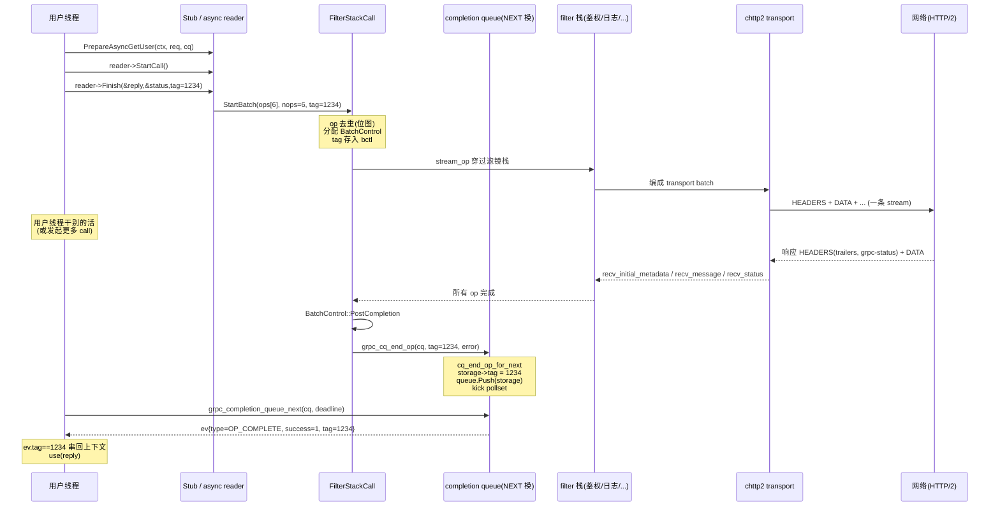

# 第 3 篇 · 第 10 章 · call 与 completion queue:经典异步模型

> **核心问题**:第 2 篇五章拆完了"一条流在 HTTP/2 transport 里的一生"——现在,这条流怎么变成程序员手里的"一次调用"?gRPC core 给了一个看起来很奇怪的抽象:**所有异步操作(一次 unary 调用、一次 streaming 收到消息、一次 cancel 完成)都通过一个叫 completion queue(完成队列,CQ)的东西投递给用户**。用户从一个 CQ 上 `poll`,就能拿到任意 call 的完成事件。这个设计为什么?一个线程 poll 一个 CQ,凭什么能服务海量并发调用,而不需要"一个调用一线程"?callback API 又是怎么从这套 sync/async 演进出来的?这一章拆 gRPC core 的招牌异步机制——completion queue,以及它和 `grpc_call`、三模 API 的关系。这一章也是后续 Promise 重构的伏笔:你会看到 CQ + callback 模型在"复杂 filter 链"下到底撞上了什么墙。

> **读完本章你会明白**:
> 1. 为什么所有异步操作的完成都要从 completion queue 这一个出口投递——它把"哪个 call 先完成"的多路复用,从用户代码里收回到 gRPC core。
> 2. 一个线程 poll 一个 CQ 怎么服务海量并发调用:Next 取任意事件、Pluck 取指定 tag,以及为什么两者不能混用。
> 3. sync / async / callback 三模 API 的取舍:sync 阻塞吃线程、async + CQ 反直觉但高效、callback 折中且是新方向。
> 4. 一次 `grpc_call_start_batch` 怎么把"一批 op"提交、怎么用 tag 在 CQ 上拿回完成通知,以及 callback API 里 `tag` 怎么悄悄变成了 `functor`。
> 5. 为什么 CQ + callback 这套优雅的模型,在面对"一条调用穿过十几个 filter、每步都异步"时,会变成 callback 地狱——这正是 P3-11/P3-12 Promise 重构的起点。

> **如果一读觉得太难**:先只记住三件事——① 所有异步操作的完成都从 completion queue 出口,一个线程 poll 一个 CQ 就能服务海量调用(多路复用,像 epoll 但作用在 call 上);② 三模 API 是 sync(阻塞)/ async(CQ + tag)/ callback(reactor 自动回调),各有用场;③ callback API 里 tag 不是用户给的 opaque 指针,而是 gRPC 内部的 `functor`(回调函数),CQ 把它"直接调度"而不是排队——这是 Promise 重构的过渡形态。

---

## 〇、一句话点破

> **completion queue 把"任意 call 的任意异步操作完成"统一成一个事件流,一个线程 poll 一个 CQ 就能服务海量并发调用;sync/async/callback 三模 API 是 gRPC 把"选择并发模型"交给用户的三个旋钮,callback 是 Promise 重构前的过渡形态。**

这是结论。本章倒过来拆:先讲"为什么所有异步完成都要走一个队列"(不这样会怎样),再拆 CQ 的三模 vtable(NEXT/PLUCK/CALLBACK 怎么各管一种并发模型),然后拆 `grpc_call_start_batch` 怎么把一批 op 提交、tag 怎么在 CQ 上闭环,最后点出"CQ + callback 在复杂 filter 链下难组合"——这是下一章 P3-11 filter fusion / P3-12 call spine 的动机。

本章服务的二分法是**框架层**——它定义"一次调用怎么被发起、怎么被驱动到完成"。它承接 P1-04 的三模 API 生成(那里点了 callback 是 Promise 前奏),也承接 P2-06 的 transport(那里 transport 是把字节编进 HTTP/2 帧,本章 call 是把"程序员的调用"装进帧之前的最后一层框架抽象)。

> **架构演进交代**:本章讲的 completion queue、`grpc_call_start_batch`、`grpc_cq_end_op` 都是**经典架构**的标志。在本 commit(2195e869),它们仍是 surface 层(`src/core/lib/surface/`、`src/cpp/`)唯一的事件投递机制——Promise 重构发生在更深的 transport/filter 层(P2-06 已见 `kPromiseBasedTransportFilter`),但 surface 层的 call+CQ 契约未变。本章会清楚标注经典 vs 新形态,并在结尾把"CQ 的难组合性"作为 Promise 重构的引子。

---

## 一、为什么所有异步完成都要走一个队列

### 从 P1-04 和 P2-06 接过来

P1-04 讲清了 stub 怎么从 `.proto` 生成出来、三模 API 怎么从一份 IDL 一次给齐;P2-06 讲清了一个 TCP 连接怎么同时跑成千上万条 stream。可这里有个看似简单的衔接问题:一个客户端线程发起了一万个并发调用(`stub->PrepareAsyncGetUser` 调了一万次),这一万个调用各自什么时候完成,线程怎么知道?

最朴素的答案:**每个调用一个线程,各自阻塞等自己的响应**。这就是 sync API 的做法。

```cpp
// sync API:每个调用独占一个线程,各自阻塞
for (int i = 0; i < 10000; ++i) {
  threads.emplace_back([&, i] {
    HelloReply reply;
    stub->GetUser(&ctx, requests[i], &reply);   // 阻塞到响应回来
    process(reply);
  });
}
```

这个写法在低并发下没问题,代码也直观。但**一万个并发调用 = 一万个线程**——每个线程占几 MB 栈(默认 8MB 在 64 位 Linux 上,实际预留),光栈空间就 80GB,直接把机器压爆;更别说线程切换、内核调度开销。

> **不这样会怎样**:sync API(一调用一线程)在高并发下有两个硬伤:① **线程数爆炸**:海量并发 = 海量线程,栈内存 + 切换开销压垮机器;② **阻塞即浪费**:一个线程调远程方法,99% 时间在等网络响应,这 99% 时间它什么也不干,纯占资源。本地调用阻塞没关系(等的是 CPU/内存,纳秒级),远程调用阻塞是灾难(等的是网络,毫秒级起步,10000 倍差距)。

### completion queue:把"哪个 call 先完成"的多路复用收回 core

gRPC core 的回答:**像 epoll 把"哪个 fd 就绪"的多路复用从用户代码收回到内核那样,把"哪个 call 先完成"的多路复用从用户代码收回到 gRPC core**。用户不再"一个调用一个线程各自等",而是"一个线程 poll 一个 completion queue,拿到任意 call 的任意完成事件"。

```
   sync 模型:一调用一线程,各自阻塞(线程爆炸)
   call1 ─[线程1]─阻塞─响应1
   call2 ─[线程2]─阻塞────响应2     ← 10000 个调用 = 10000 个线程
   call3 ─[线程3]─阻塞──响应3
   ...

   CQ 模型:一队列多路复用,一个线程 poll
                                    ┌─ call1 完成事件(tag=1) ─┐
   grpc_call_start_batch(callN, ...)│                          │
   grpc_call_start_batch(callM, ...)│   completion queue       │ poll
   grpc_call_start_batch(callK, ...)├─▶(任意 call 的完成事件)──┼──▶ 一个线程
       ...                          │                          │   处理后继续 poll
   (海量并发调用)                   └─ callK 完成事件(tag=9) ─┘
```

一个线程,一个 CQ,服务海量并发调用。线程永远在"poll → 处理 → poll"循环里,99% 等网络的时间不是它等,而是"core 帮它统一等"——某个 call 响应到了,core 把完成事件塞进 CQ,线程下次 poll 就拿到,处理完继续 poll。**线程数与并发数解耦**:1 个线程可以驱动 10000 个并发调用,这是 gRPC 在高并发下能撑住的根本。

> **钉死这件事**:completion queue 的本质是**把"等待"集中化**——把"每个调用各自等自己的响应"换成"core 统一收集所有完成事件,用户 poll 一个队列"。线程不再被"等网络"绑死,而是持续在"处理事件"上干活。这和 epoll(把"等 fd 就绪"集中化)、io_uring(把"等 IO 完成"集中化)是同一种思路:**异步多路复用换高并发**。

### 多路复用不是免费的:CQ 把"调用流程"撕成两半

但天下没有免费的午餐。CQ 这种"poll 拿任意事件"的模型,把原本"一条线的调用流程"撕成了两半:

- **发起阶段**:你 `start_batch` 提交一批 op,函数立刻返回,不阻塞。
- **完成阶段**:某个 op 完成时,你从 CQ poll 出来一个事件(tag),根据 tag 知道"是哪个 op 完成了",再去处理结果。

这两半之间的关联,完全靠你**提交时给的 tag**来串。代码长这样(P1-04 已见过,这里再贴一次):

```cpp
// async API:发起阶段(立刻返回)
auto reader = stub->PrepareAsyncGetUser(&ctx, req, cq);
reader->StartCall();
reader->Finish(&reply, &status, /*tag=*/(void*)1234);   // tag=1234 标识这次调用

// ... 干别的活,或发起更多调用 ...

// async API:完成阶段(从 CQ poll)
void* got_tag; bool ok;
cq->Next(&got_tag, &ok);                                  // 阻塞等任意完成事件
if (got_tag == (void*)1234 && ok) { use(reply); }         // 靠 tag 串回调用上下文
```

注意 `tag=(void*)1234` 这个细节——发起时你给的 tag,完成时原样回来,你**靠它知道"是哪次调用完成了"**。这是 async API 的核心契约:**tag 是用户在发起阶段埋下的"返回地址",完成阶段靠它串回调用上下文**。

> **不这样会怎样**:如果不把流程撕成两半(发起 + 完成),就回到 sync 模型(一调用一线程)。撕成两半的代价是:**代码不再"线性"**。sync 代码 `result = stub->GetUser(req); use(result);` 是一条线;async 代码的 `use(result)` 被挪到了"poll 到 tag=1234"的另一个地方,中间隔了"干别的活"。这种"流程被事件撕裂"的代码风格,是 async API 最让新手头疼的地方——它把"调用上下文"从栈帧(局部变量)挪到了"你自己在 tag 旁边维护的状态"里。后面会看到,这正是 callback 地狱的近亲,也是 Promise 重构要解决的痛点。

---

## 二、三模 CQ:NEXT、PLUCK、CALLBACK 怎么各管一种并发模型

理解了 CQ 是"多路复用 call 完成事件",接下来拆 gRPC core 怎么实现它。关键事实:**gRPC 不是一种 CQ,而是三种 CQ**,对应三种并发模型(NEXT/PLUCK/CALLBACK)。看 CQ 的核心定义 [`src/core/lib/surface/completion_queue.cc:410-431`](../grpc/src/core/lib/surface/completion_queue.cc#L410-L431):

```cpp
struct grpc_completion_queue {
  grpc_core::RefCount owning_refs;
  char padding_1[GPR_CACHELINE_SIZE];     // 缓存行填充,防 false sharing
  gpr_mu* mu;
  char padding_2[GPR_CACHELINE_SIZE];
  const cq_vtable* vtable;                // ← 三模分发的钥匙
  char padding_3[GPR_CACHELINE_SIZE];
  const cq_poller_vtable* poller_vtable;
  ...
};
```

注意三层 cache-line padding——CQ 是高频并发对象(海量 call 同时往里塞事件,多个线程同时 poll),字段被刻意隔离到不同缓存行,避免 false sharing。这本身就是个性能细节:gRPC core 在 CQ 这种热点对象上,做到了缓存行级别的隔离。

`vtable` 是理解整个 CQ 的钥匙。看 [`completion_queue.cc:264-278`](../grpc/src/core/lib/surface/completion_queue.cc#L264-L278):

```cpp
struct cq_vtable {
  grpc_cq_completion_type cq_completion_type;
  size_t data_size;
  void (*init)(...);
  void (*shutdown)(...);
  void (*destroy)(...);
  bool (*begin_op)(...);
  void (*end_op)(...);                // ← 把完成事件投递进 CQ
  grpc_event (*next)(...);            // ← NEXT 模的取事件入口
  grpc_event (*pluck)(...);           // ← PLUCK 模的取事件入口
};
```

每种 CQ 模式,提供一套自己的 `init / shutdown / end_op / next / pluck` 实现。三模的 vtable 实例化在 [`completion_queue.cc:484-499`](../grpc/src/core/lib/surface/completion_queue.cc#L484-L499):

```cpp
static const cq_vtable g_cq_vtable[] = {
  {GRPC_CQ_NEXT,     ..., cq_end_op_for_next,    cq_next,         nullptr},       // NEXT
  {GRPC_CQ_PLUCK,    ..., cq_end_op_for_pluck,   nullptr,         cq_pluck},      // PLUCK
  {GRPC_CQ_CALLBACK, ..., cq_end_op_for_callback, nullptr,         nullptr},       // CALLBACK
};
```

这张表有三个关键事实:

1. **三种 CQ 共享 vtable 形态,但 `end_op` 各有各的实现**(`cq_end_op_for_next` / `cq_end_op_for_pluck` / `cq_end_op_for_callback`)——投递事件的逻辑不同。
2. **NEXT 模只有 `next`,PLUCK 模只有 `pluck`,CALLBACK 模两者都没有**。CALLBACK 模的 next/pluck 是 `nullptr`,意思是**用户根本不能对 callback CQ 调 next/pluck**——因为它不是"队列"。
3. 工厂函数 [`grpc_completion_queue_create_internal`](../grpc/src/core/lib/surface/completion_queue.cc#L569-L613) 按 `completion_type` 从这张表取 vtable,一次性连续分配 `grpc_completion_queue + data + poller` 的内存。

> **钉死这件事**:gRPC core 用 vtable 把"三种并发模型"抽象成"三种 CQ"。这不是 if-else,而是**编译期固定 vtable + 运行时分发**。选哪种 CQ,就决定了"事件怎么投递、用户怎么取"——NEXT 给 next API、PLUCK 给 pluck API、CALLBACK 给 reactor API。一个 CQ 实例只能是一种模式,不能混。这和 P1-04 讲的"三模 API 用模板混入选 api_type"是同一套思路:**把并发模型选择前置到对象创建**。

### NEXT 模:`cq_next_data` 用无锁队列存事件

NEXT 模是最常见的 async API 形态。它的 per-CQ 数据结构 [`cq_next_data`](../grpc/src/core/lib/surface/completion_queue.cc#L312-L335):

```cpp
struct cq_next_data {
  CqEventQueue queue;                          // ← 真正的事件队列
  std::atomic<intptr_t> things_queued_ever{0}; // 快速判断"是否有事件"
  std::atomic<intptr_t> pending_events{1};     // 未完成事件计数,+1 若未 shutdown
  std::atomic<bool> shutdown_called{false};
};
```

核心是 `CqEventQueue queue`,内部是一个**无锁 MPSC 队列**(`MultiProducerSingleConsumerQueue`,多生产者单消费者)。[`CqEventQueue`](../grpc/src/core/lib/surface/completion_queue.cc#L286-L310) 在 MPSC 队列外加了一层 spinlock(`queue_lock_`),用于"多个消费者线程同时 poll 同一个 CQ"时串行化 Pop——因为 MPSC 本身只支持单消费者。

> **钉死这件事**:NEXT 模的事件存储用**无锁 MPSC 队列**——这是"多生产者(海量 call 同时完成)单消费者(通常一个线程 poll)"场景的标准选择。无锁让它在高频入队时没有锁竞争,这是 CQ 能扛住海量并发完成事件的物理基础之一。如果一个 CQ 被多个线程同时 poll(NEXT 支持这种用法),外层 spinlock 串行化 Pop——多消费者是 NEXT 模的可选能力,不是必须。

NEXT 模的取事件入口是 `grpc_completion_queue_next`,它 vtable 分发到 `cq_next` ([`completion_queue.cc:994-1114`](../grpc/src/core/lib/surface/completion_queue.cc#L994-L1114))。核心循环:

```cpp
// (cq_next 核心循环,简化示意)
for (;;) {
  grpc_cq_completion* c = cqd->queue.Pop();   // 取任意一个事件,不挑 tag
  if (c != nullptr) {
    ret.type = GRPC_OP_COMPLETE;
    ret.success = (c->next & 1u) != 0;         // 低位编码 success
    ret.tag = c->tag;                          // 透传用户的 tag
    c->done(c->done_arg, c);                   // 释放 storage
    return ret;
  }
  // 队列空:若未到 deadline 且未 shutdown,pollset 上阻塞推进 I/O
  if (cqd->pending_events.load() == 0) return SHUTDOWN;
  cq->poller_vtable->work(...);                // ← 阻塞在 pollset 上,推进网络 I/O
}
```

关键点:**Next 取的是"任意一个完成事件",不挑 tag**。多个 call 同时完成时,Next 拿到队列里最早的那个。这适合"一个线程统一 drain 所有 call 的事件"的用法——这也是绝大多数 async 应用程序的形态。

`c->next & 1u` 这个位操作值得注意:`grpc_cq_completion` 的 `next` 字段低位被复用来存 success 标志(见 [`completion_queue.h:33-46`](../grpc/src/core/lib/surface/completion_queue.h#L33-L46))。链表节点的 next 指针末位通常空闲(指针都对齐),gRPC 把"成功/失败"塞进去,省了一个字段——这是个极小的性能优化,但在海量完成事件下积少成多。

### PLUCK 模:`cq_pluck_data` 用链表 + plucker 数组

PLUCK(pluck = 摘)模给"我想精确等某个特定 tag 完成"的场景。它的数据结构 [`cq_pluck_data`](../grpc/src/core/lib/surface/completion_queue.cc#L337-L376):

```cpp
struct cq_pluck_data {
  grpc_cq_completion completed_head;            // ← 侵入式链表头
  grpc_cq_completion* completed_tail;
  std::atomic<intptr_t> pending_events{1};
  std::atomic<intptr_t> things_queued_ever{0};
  std::atomic<bool> shutdown{false};
  std::atomic<bool> shutdown_called{false};
  int num_pluckers = 0;
  plucker pluckers[GRPC_MAX_COMPLETION_QUEUE_PLUCKERS];   // ← 等特定 tag 的线程
};
```

PLUCK 用侵入式链表(`completed_head/tail`)存事件。取事件入口 `grpc_completion_queue_pluck` 分发到 `cq_pluck` ([`completion_queue.cc:1234-1330`](../grpc/src/core/lib/surface/completion_queue.cc#L1234-L1330))。核心区别在它**遍历链表只摘 `c->tag == tag` 的那个**:

```cpp
// (cq_pluck 摘节点,简化示意,见 completion_queue.cc:1277-1293)
prev = &cqd->completed_head;
while ((c = reinterpret_cast<grpc_cq_completion*>(
            prev->next & ~uintptr_t{1})) != &cqd->completed_head) {
  if (GPR_LIKELY(c->tag == tag)) {              // ← 只摘匹配 tag 的节点
    prev->next = (prev->next & uintptr_t{1}) | (c->next & ~uintptr_t{1});
    ret.tag = c->tag;
    c->done(c->done_arg, c);
    goto done;
  }
  prev = c;
}
```

这里又看到 `prev->next & ~uintptr_t{1}` 这种位操作——摘节点时,既要保留低位 success 标志(`prev->next & uintptr_t{1}`),又要更新 next 指针(`c->next & ~uintptr_t{1}`),两者拼起来。

更妙的是 `plucker pluckers[]` 这个数组。当一个线程在 Pluck 等某个 tag 时,它把自己登记成 plucker(行 1300,`add_plucker`)。这样,`cq_end_op_for_pluck` 投递事件时,可以**精确 kick 唤醒在等这个 tag 的那个线程**([`completion_queue.cc:863-872`](../grpc/src/core/lib/surface/completion_queue.cc#L863-L872)):

```cpp
// (cq_end_op_for_pluck 找 plucker,简化示意)
grpc_pollset_worker* pluck_worker = nullptr;
for (int i = 0; i < cqd->num_pluckers; i++) {
  if (cqd->pluckers[i].tag == tag) {            // 找到在等这个 tag 的线程
    pluck_worker = *cqd->pluckers[i].worker;
    break;
  }
}
cq->poller_vtable->kick(POLLSET_FROM_CQ(cq), pluck_worker);   // 精确唤醒
```

这避免了"广播唤醒所有 pluck 线程,然后大部分发现不是自己的 tag 又睡回去"的惊群(thundering herd)开销。Pluck 适合"我知道我要等的就是这个 tag"的场景——比如服务端 async handler 里,一个调用一个线程在 Pluck 等它的下一步完成。但 plucker 数量有上限 `GRPC_MAX_COMPLETION_QUEUE_PLUCKERS`(避免被海量线程打爆)。

> **钉死这件事**:Next 和 Pluck 的本质区别——**Next 取任意事件**(配合"一个线程 drain 所有 call",海量并发通用),**Pluck 取指定 tag 的事件**(配合"一个 call 一个等待线程",精确)。Next 用无锁队列,Pluck 用链表 + plucker 数组。**两者不能混用**(C++ 封装的 `Pluck` 注释明写 `Must not be mixed with calls to Next`,见 `include/grpcpp/completion_queue.h:319`),因为一个 CQ 实例的 vtable 只支持一种取法。

### CALLBACK 模:`cq_callback_data` 根本不是队列

最反直觉的是 CALLBACK 模。它的数据结构 [`cq_callback_data`](../grpc/src/core/lib/surface/completion_queue.cc#L378-L405):

```cpp
struct cq_callback_data {
  explicit cq_callback_data(grpc_completion_queue_functor* shutdown_callback)
      : shutdown_callback(shutdown_callback),
        event_engine(grpc_event_engine::experimental::GetDefaultEventEngine()) {}
  std::atomic<intptr_t> pending_events{1};
  std::atomic<bool> shutdown_called{false};
  grpc_completion_queue_functor* shutdown_callback;
  std::shared_ptr<grpc_event_engine::experimental::EventEngine> event_engine;  // ← 不存事件!
};
```

注意两点:① **没有任何事件队列**(代码注释明写 `No actual completed events queue, unlike other types`);② **持有 `EventEngine`**(gRPC 的异步执行引擎,P2-06 提过)。它的 vtable `next/pluck` 都是 `nullptr`——用户根本不能 poll 它。

那事件怎么投递?看 `cq_end_op_for_callback` ([`completion_queue.cc:881-923`](../grpc/src/core/lib/surface/completion_queue.cc#L881-L923)):

```cpp
static void cq_end_op_for_callback(
    grpc_completion_queue* cq, void* tag, grpc_error_handle error, ...) {
  ...
  done(done_arg, storage);                     // 立即释放 storage(callback CQ 不需要它)

  auto* functor = static_cast<grpc_completion_queue_functor*>(tag);  // ← tag 是 functor!
  if (IsUseCallEventEngineInCompletionQueueEnabled()) {
    (*functor->functor_run)(functor, error.ok());                    // 同步调 functor_run
  } else {
    cqd->event_engine->Run([...] { (*functor->functor_run)(functor, ok); });  // 投到 EventEngine
  }
}
```

这是 callback API 最关键的设计:**在 callback CQ 里,`tag` 不是用户给的 opaque 指针,而是 `grpc_completion_queue_functor*`,它的 `functor_run` 函数指针就是回调本身**。投递事件 = 调 `functor_run`,用户根本不用 poll CQ——gRPC 直接帮你调回调。

> **钉死这件事**:CALLBACK 模根本不是"队列",而是"回调调度器"。它把 `tag` 复用成 `functor`(带 `functor_run` 函数指针的对象),投递完成事件 = 调 `functor_run`。用户不需要 poll,只需在 reactor(回调对象)的 `OnDone` 里写完成逻辑。这让 callback API 的代码风格**回到接近 sync 的线性**——发起时传 reactor,响应来时 gRPC 自动调 `reactor->OnDone`,不用手动 poll。这是 callback API 比 async API 好写的根。但它也是经典架构的最后一个形态——后面 Promise 重构会把它升级得更彻底。

### 三模的取舍

把三模放一起对比:

| 维度 | NEXT(async) | PLUCK(async 变体) | CALLBACK |
|------|------------|-------------------|----------|
| 数据结构 | 无锁 MPSC 队列 | 链表 + plucker 数组 | 无队列,持 EventEngine |
| 用户取事件 | `cq->Next(&tag, &ok)` | `cq->Pluck(tag)` | **不用 poll,gRPC 自动调 reactor** |
| 取什么 | 任意事件 | 指定 tag 的事件 | 不适用 |
| tag 是什么 | 用户给的 opaque 指针(串回上下文) | 同上 | **`functor*`,回调本身** |
| 适合 | 一个线程 drain 海量 call(主流) | 一个 call 一个等待线程 | 高并发 + 想要接近 sync 的代码风格 |
| 三模 API 对应 | async API(`PrepareAsyncXxx`) | async API 的 pluck 变体 | callback API(`stub->async()->Xxx`) |

> **不这样会怎样**:如果只有一种 CQ(比如统一用 NEXT),就没有 callback API 的"自动调 reactor"的便利,所有用户都得手写"poll → 根据 tag 分发 → 调对应 reactor"的样板代码。callback CQ 把这套样板收回到 core——用户只写 reactor 的 `OnDone`,gRPC 帮你调。三种 CQ 各自优化了一种并发模型,这是"把选择权交给用户"的体现(P1-04 已见这个哲学)。

### 三模的选型历史:sync → async → callback → Promise

把三模放在 gRPC 的演进时间线上看,会更清楚为什么会有三套而不是一套:

- **最早是 sync**:gRPC 初版只给 sync API,简单直观,`stub->GetUser()` 阻塞返回。问题是一调用一线程,撑不住高并发。
- **然后加 async(CQ + tag)**:为了高并发,gRPC 加了 async API,用户 poll CQ。这是经典异步模型的本体,一个线程服务海量调用。问题是代码反直觉(发起和完成被 poll 撕成两半,靠 tag 串)。
- **再然后加 callback(reactor)**:为了既高并发又好写,gRPC 加了 callback API。用户传 reactor,gRPC 自动调 `OnDone`。代码回到接近 sync 的线性,又不阻塞线程。
- **现在搞 Promise 重构**:callback API 好写,但 core 内部仍然是 closure + CQ,filter 链嵌套地狱。Promise 重构把 core 内部换成 promise 链,让"一条调用穿过十几个 filter"线性可组合(P3-11/P3-12)。

这条演进线的核心张力是**"对用户的简单" vs "core 内部的可组合性"**。sync 对用户最简单但 core 撑不住高并发;async 让 core 撑住了高并发但对用户反直觉;callback 兼顾两者但 core 内部仍是 closure 地狱;Promise 重构专治 core 内部的 closure 地狱,同时保持对用户的 API 不变。理解这条张力,你就理解了为什么 gRPC 要同时维护三套 API、又在内部搞大重构——不是冗余,是不同时期为不同矛盾找的解。

> **钉死这件事**:三模 API 不是"gRPC 给你三个差不多东西选一个",而是**三个时期为三个不同矛盾设计的解,叠加在一起**。sync 解决"简单"、async 解决"高并发"、callback 解决"高并发+好写"。它们对应的 CQ 三模(NEXT/PLUCK/CALLBACK)是 core 层对这些 API 的支撑。理解这条演进线,你就理解了 P3-11/P3-12 的 Promise 重构在解决什么——它不是"再加一种 API",而是"把 core 内部的 closure 地狱换成 promise 链",让所有三模 API 都受益。

---

## 三、grpc_call 的生命周期:StartBatch 怎么把一批 op 提交

理解了 CQ 三模,接下来拆 `grpc_call` 怎么用它。一次调用在 surface 层的生命周期,核心是 `grpc_call_start_batch` 这个函数——它把"一批 op"提交,完成时通过 CQ 通知。

### 一次 unary 调用的完整 batch 流程

经典 C API 下,一次 client unary 调用的完整流程,通常用**一个 batch 提交所有 op**(P1-04 讲过三模 API,这里是 core 层的落地):

```cpp
// (经典 client unary,简化示意)
grpc_op ops[6];
ops[0].op = GRPC_OP_SEND_INITIAL_METADATA;     // 发初始 metadata(:path, te: trailers, ...)
ops[1].op = GRPC_OP_SEND_MESSAGE;              // 发请求消息(Length-Prefixed-Message)
ops[2].op = GRPC_OP_SEND_CLOSE_FROM_CLIENT;    // half-close(表示客户端发完了)
ops[3].op = GRPC_OP_RECV_INITIAL_METADATA;     // 收服务端初始 metadata
ops[4].op = GRPC_OP_RECV_MESSAGE;              // 收响应消息
ops[5].op = GRPC_OP_RECV_STATUS_ON_CLIENT;     // 收 trailing metadata(grpc-status)
void* tag = (void*)1234;
grpc_call_start_batch(call, ops, 6, tag, nullptr);   // 一次性提交 6 个 op
// ... 干别的活 ...
void* got_tag; bool ok;
grpc_event ev = grpc_completion_queue_next(cq, ...);  // poll
if (ev.tag == tag && ev.success) { /* 用 reply */ }
```

`grpc_op_type` 的 8 个枚举定义在 [`grpc_types.h:268-303`](../grpc/include/grpc/impl/grpc_types.h#L268-L303):

```c
GRPC_OP_SEND_INITIAL_METADATA = 0,    // 客户端发初始 metadata(含 :path 等)
GRPC_OP_SEND_MESSAGE,                 // 发消息(Length-Prefixed-Message)
GRPC_OP_SEND_CLOSE_FROM_CLIENT,       // 客户端 half-close
GRPC_OP_SEND_STATUS_FROM_SERVER,      // 服务端发 status(trailing metadata)
GRPC_OP_RECV_INITIAL_METADATA,        // 收初始 metadata
GRPC_OP_RECV_MESSAGE,                 // 收消息
GRPC_OP_RECV_STATUS_ON_CLIENT,        // 客户端收 status
GRPC_OP_RECV_CLOSE_ON_SERVER          // 服务端收 half-close
```

这 8 个 op 是经典架构的"原语"——任何调用模式(unary/streaming)都靠这 8 个 op 的不同组合表达。注意客户端和服务端允许的 op 不同(校验逻辑在 `client_call.cc:65-98` 的 `ValidateClientBatch` 和 `server_call.cc:60-100` 的 `ValidateServerBatch`):客户端不能 `SEND_STATUS_FROM_SERVER`(那是服务端的事),服务端不能 `SEND_CLOSE_FROM_CLIENT`,违反返回 `GRPC_CALL_ERROR_NOT_ON_CLIENT` / `NOT_ON_SERVER`。**op 的方向性,天然编码了 client/server 的角色差异**。

### `grpc_call_start_batch`:C API 入口

C 入口 [`grpc_call_start_batch`](../grpc/src/core/lib/surface/call.cc#L505-L538) 是个薄壳:

```cpp
grpc_call_error grpc_call_start_batch(grpc_call* call, const grpc_op* ops,
                                      size_t nops, void* tag, void* reserved) {
  grpc_core::ExecCtx exec_ctx;
  grpc_core::Call* call_obj = grpc_core::Call::FromC(call);
  grpc_call_error err = call_obj->StartBatch(ops, nops, tag, /*is_notify_tag_closure=*/false);
  ...
  return err;
}
```

它把 `tag` 透传给 `call_obj->StartBatch`。**`tag` 是这批 op 的"完成通知地址"**——整批 op 全部完成后,gRPC 把"这批完成了"这个事件(带这个 tag)投递进 CQ。所以 tag 的粒度是**一批 op**,不是一个 op——一批里的 6 个 op 都完成了,才投一个事件。

> **重要纠正**:在本 commit(2195e869),[`call.cc`](../grpc/src/core/lib/surface/call.cc) 只是 C API 的薄包装(664 行),真正的 `StartBatch` 实现在 [`filter_stack_call.cc:740`](../grpc/src/core/lib/surface/filter_stack_call.cc#L740) 的 `FilterStackCall::StartBatch`。引用 StartBatch 实现时,务必指向 `filter_stack_call.cc`,不要写 `call.cc`。这是本 commit 的真实结构,老资料凭记忆容易写错。

### `FilterStackCall::StartBatch`:op 去重 + 翻译成 transport batch

真正的核心是 [`FilterStackCall::StartBatch`](../grpc/src/core/lib/surface/filter_stack_call.cc#L740) ([`filter_stack_call.cc:740-775`](../grpc/src/core/lib/surface/filter_stack_call.cc#L740-L775)):

```cpp
grpc_call_error FilterStackCall::StartBatch(const grpc_op* ops, size_t nops,
                                            void* notify_tag,
                                            bool is_notify_tag_closure) {
  ...
  // 1. op 去重:用位图 seen_ops 保证每个 op 类型只出现一次
  for (size_t i = 0; i < nops; i++) {
    if (seen_ops.IsSet(ops[i].op)) {
      return GRPC_CALL_ERROR_TOO_MANY_OPERATIONS;   // 同一 op 重复提交,报错
    }
    seen_ops.Set(ops[i].op);
  }
  // 2. 空 batch 立即完成(nops==0,只作 notify)
  if (nops == 0) {
    EndOpImmediately(cq_, notify_tag, ...);
    return GRPC_CALL_ERROR_NONE;
  }
  // 3. 分配/复用 BatchControl 对象
  BatchControl* bctl = ReuseOrAllocateBatchControl(ops);
  bctl->completion_data_.notify_tag.tag = notify_tag;
  bctl->completion_data_.notify_tag.is_closure = is_notify_tag_closure;
  // 4. 把 grpc_op 翻译成 transport batch(switch on op 类型)
  //    填充 stream_op 和 pending_ops 位掩码
  ...
}
```

几个关键点:

1. **op 去重**:`seen_ops` 是个位图,保证同一 batch 里每个 op 类型最多出现一次。如果你想 `SEND_MESSAGE` 两次,得提交两个 batch。这是经典 API 的约束。
2. **BatchControl 对象**:`bctl` 持有这批 op 的状态,包括 `notify_tag`(用户给的 tag)和 `pending_ops` 位掩码(还差哪些 op 没完成)。
3. **op 翻译**:`switch (ops[i].op)` 把每个 `grpc_op` 翻译成 `grpc_transport_stream_op_batch_payload` 里的对应字段——send_initial_metadata 指针、send_message byte_buffer、recv_message 接收槽等等。翻译完,这批 op 变成一个 transport 能理解的 `stream_op`,通过 filter 栈往下传(下一章 P3-11 拆 filter 栈)。

### `PostCompletion`:tag 进入 CQ 的闭环点

当这批 op 全部完成(transport 收到响应 / cancel / 错误),`BatchControl::PostCompletion` ([`filter_stack_call.cc:544-607`](../grpc/src/core/lib/surface/filter_stack_call.cc#L544-L607)) 被调,把 tag 投递进 CQ:

```cpp
void FilterStackCall::BatchControl::PostCompletion() {
  FilterStackCall* call = call_;
  grpc_error_handle error = batch_error_.get();
  ...
  if (completion_data_.notify_tag.is_closure) {
    // tag 是 closure(内部使用,直接调度,不经 CQ)
    GrpcClosure::Run(DEBUG_LOCATION,
        static_cast<grpc_closure*>(completion_data_.notify_tag.tag), error);
  } else {
    // tag 是用户给的,投递进 CQ
    grpc_cq_end_op(
        call->cq_, completion_data_.notify_tag.tag, error,
        [](void* user_data, grpc_cq_completion* /*storage*/) {
          BatchControl* bctl = static_cast<BatchControl*>(user_data);
          ...
        },
        this, &completion_data_.cq_completion);
  }
}
```

注意两条路径:

- **closure 路径**:`is_closure==true` 时,tag 不是给用户的,而是 gRPC 内部的 `grpc_closure*`。直接 `GrpcClosure::Run` 调度,不经 CQ。这是内部异步操作(transport 内部的回调)用的。
- **CQ 路径**:`is_closure==false` 时,tag 是用户给的,调 `grpc_cq_end_op` 投递进 CQ。`grpc_cq_end_op` 内部 vtable 分发到 `cq_end_op_for_next` / `for_pluck` / `for_callback`(本章第二节拆过)。

> **钉死这件事**:tag 的闭环路径是这样的——① 用户 `start_batch(call, ops, nops, tag, ...)`,tag 进 BatchControl;② op 全部完成,`PostCompletion` 调 `grpc_cq_end_op`;③ vtable 分发到对应模的 `cq_end_op_for_*`,tag 写入 `storage->tag`(NEXT/PLUCK)或当 functor 直接调(CALLBACK);④ 用户 `Next`/`Pluck` 取出事件,`ev.tag == tag` 串回调用上下文。这是经典异步模型的完整闭环,**tag 是这条闭环上的唯一线索**。

### 一次经典 unary 的完整时序

把这一节讲的所有环节串成一张时序图,这是理解经典异步模型的最好方式:



这张图的关键在于:**用户线程发起 batch 后立刻返回,干别的活(或发起更多调用);transport 在后台收字节、解帧、推进 filter;filter 全部完成后,tag 通过 CQ 回到用户线程**。用户线程从来没有"阻塞等网络"——它要么在 `Next` 上阻塞等"任意完成事件"(这是 productive 的阻塞,一次醒来能处理任意 call),要么在处理事件发起更多调用。这是 CQ 多路复用的完整画面。

> **钉死这件事**:经典 unary 的完整闭环 = **start_batch(带 tag)→ filter 栈 → transport → 网络 → 回程 → PostCompletion → CQ → Next**。tag 贯穿始终,是发起阶段和完成阶段唯一的关联线索。这张图里有一个细节值得注意:**filter 栈那一步是异步的**(FAULT_INJECTION 等会注入延迟、retry 会重发),所以"start_batch 到 tag 回来"之间可能隔很久(网络往返 + filter 延迟)。用户线程在这段时间干别的活,这就是异步多路复用的价值。

---

## 四、三模 API 怎么用 CQ:从用户代码到 core

理解了 CQ 三模和 call 的 batch 流程,把三模 API 的用户代码贴一遍,看它们怎么落到 core。P1-04 已贴过用户代码,这里聚焦"每模怎么用 CQ"。

### sync API:不直接碰 CQ

sync API 下,用户根本不碰 CQ——gRPC 在内部为 sync 调用开一个临时 CQ,阻塞 `Next` 等完成:

```cpp
// (sync API 用户代码)
::grpc::Status s = stub->GetUser(&ctx, req, &reply);   // 阻塞
```

内部实现大致是:sync stub 方法创建一个临时 CQ,提交 batch(用一个内部 closure 当 tag),然后 `cq->Next` 阻塞等那个 closure 完成,拿到 status 返回。**sync API 是"在 async API 上包一层阻塞"**——底层仍是 CQ,只是用户看不见。这也是为什么 sync 简单但吃线程:每个并发 sync 调用占一个线程,这个线程大半时间在 `Next` 上阻塞。

### async API(NEXT 模):用户 poll CQ

async API 下,用户自己创建 CQ、自己 poll:

```cpp
// (async API 用户代码,经典 NEXT 模)
grpc::CompletionQueue cq;
auto reader = stub->PrepareAsyncGetUser(&ctx, req, &cq);  // 关联到这个 CQ
reader->StartCall();
reader->Finish(&reply, &status, (void*)1234);              // tag=1234
// ... 发起更多调用 ...
void* got_tag; bool ok;
while (cq.Next(&got_tag, &ok)) {                            // poll 任意事件
  if (got_tag == (void*)1234) { /* 这次调用完成 */ }
}
```

一个线程一个 CQ,服务海量并发调用——这是 async API 的核心价值。C++ 封装的 `CompletionQueue::Next` 在 [`completion_queue_cc.cc:144-164`](../grpc/src/cpp/common/completion_queue_cc.cc#L144-L164) 的 `AsyncNextInternal`:

```cpp
CompletionQueue::NextStatus CompletionQueue::AsyncNextInternal(
    void** tag, bool* ok, gpr_timespec deadline) {
  for (;;) {
    auto ev = grpc_completion_queue_next(cq_, deadline, nullptr);   // 调 C 接口
    switch (ev.type) {
      case GRPC_QUEUE_TIMEOUT: return TIMEOUT;
      case GRPC_QUEUE_SHUTDOWN: return SHUTDOWN;
      case GRPC_OP_COMPLETE:
        auto core_cq_tag = static_cast<grpc::internal::CompletionQueueTag*>(ev.tag);
        *ok = ev.success != 0;
        *tag = core_cq_tag;
        if (core_cq_tag->FinalizeResult(tag, ok)) return GOT_EVENT;  // 多态 FinalizeResult
        break;  // FinalizeResult 返回 false,内部 tag 被吞,继续循环
    }
  }
}
```

注意 `FinalizeResult` 这一层多态——C++ 层的 tag 是 `CompletionQueueTag*`(带 `FinalizeResult` 虚函数),C core 层的 tag 是 `void*`。`FinalizeResult` 让 C++ 的不同 async reader(`ClientAsyncResponseReader`、`ClientAsyncReader` 等)各自把 `void* tag` 翻译回具体的"哪个 op 完成"。这是 C++ 模板在 C core 之上的封装层。

### callback API:用户不 poll,gRPC 自动调 reactor

callback API 下,用户传 reactor(回调对象),gRPC 自动在完成时调 `reactor->OnDone`:

```cpp
// (callback API 用户代码)
class MyReactor : public ::grpc::ClientUnaryReactor {
  void OnDone(const ::grpc::Status& s) override {
    if (s.ok()) { use(reply_); }
    delete this;
  }
  HelloReply reply_;
};
MyReactor* r = new MyReactor;
stub->async()->GetUser(&ctx, &req, r);   // 立刻返回,响应来时调 r->OnDone
```

底层用 callback CQ(`cq_callback_data`)。正如本章第二节拆的,callback CQ 的 `tag` 是 `functor*`,`cq_end_op_for_callback` 直接调 `functor_run`——这个 functor 内部最终触发 `reactor->OnDone`。**用户完全不用 poll**,代码风格回到接近 sync 的线性(发起 → 自动回调 → 处理),但又不阻塞线程。

> **钉死这件事**:三模 API 落到 core 的对应关系——sync 在 async 上包阻塞(临时 CQ + 阻塞 Next);async 用 NEXT CQ(用户 poll Next);callback 用 CALLBACK CQ(用户不 poll,core 自动调 functor)。**三模 API 的本质是"谁来驱动完成事件"的三种答案**——sync 是"我线程阻塞等"、async 是"我手动 poll"、callback 是"gRPC 自动调我"。callback 把驱动责任从用户挪到 gRPC,这是它比 async 好写的根。

### async API 最让新手困惑的地方:tag 是状态机的全部

async API 最大的学习门槛不是 API 本身,而是**调用上下文怎么在发起和完成之间传递**。sync API 里,调用上下文是栈帧(局部变量):

```cpp
// sync:调用上下文就是栈帧
HelloReply reply;                                          // 局部变量
::grpc::Status s = stub->GetUser(&ctx, req, &reply);       // 阻塞
use(reply);                                                // reply 还在栈上
```

但 async API 把发起和完成撕开了,完成时栈帧早就没了——`reply` 必须挪到堆上,靠 tag 串回。所以真实 async 代码长这样:

```cpp
// (async API 真实代码,简化示意)
struct GetUserCall {                          // ← 把调用上下文打包成一个对象
  HelloRequest req;
  HelloReply reply;
  ::grpc::ClientContext ctx;
  std::unique_ptr<::grpc::ClientAsyncResponseReader<HelloReply>> reader;
  ::grpc::Status status;
  int call_id;                                // ← 用 call_id 当 tag(或直接 this 当 tag)
};

void StartGetUser(::grpc::CompletionQueue* cq, int call_id) {
  auto* call = new GetUserCall;
  call->call_id = call_id;
  call->req.set_user_id("u1");
  call->reader = stub->PrepareAsyncGetUser(&call->ctx, call->req, cq);
  call->reader->StartCall();
  // 关键:用 call_id 当 tag(也可以直接用 call 指针当 tag)
  call->reader->Finish(&call->reply, &call->status, (void*)call_id);
}

void OnEvent(::grpc::CompletionQueue* cq) {
  void* got_tag; bool ok;
  cq->Next(&got_tag, &ok);
  int call_id = (int)(intptr_t)got_tag;       // 靠 tag 串回 call_id
  auto* call = FindCallById(call_id);         // 从某个表里查回调用上下文
  if (ok && call->status.ok()) {
    use(call->reply);
  }
  delete call;
}
```

注意 `GetUserCall` 这个结构——它把 sync API 里散落在栈帧的"req/reply/ctx/status"打包成一个堆对象,因为 async 完成时栈帧没了,这些状态得活到完成。**这是 async API 的隐藏成本:用户要自己设计"调用上下文对象"+ 一个 tag→上下文的映射**。一个常见做法是直接用对象指针当 tag(`(void*)call`),省去映射表。

> **不这样会怎样**:如果 async 用户不把状态打包成对象、不设计 tag→上下文的映射,完成时就不知道"这个 tag 对应哪次调用、它的 req/reply 在哪",代码就断了。这是 async API"反直觉"的根——它强迫用户从"栈式思维"(局部变量)切换到"堆式思维 + 事件驱动"(对象 + tag 映射)。callback API 把这层样板收回到 core:reactor 就是那个"调用上下文对象",gRPC 自动在完成时调 `reactor->OnDone`,用户不用手写 tag 映射。这也是 callback API 比 async API 好写的另一个维度。

### BatchControl 复用:避免每次 batch 都 new

补一个 [`filter_stack_call.cc`](../grpc/src/core/lib/surface/filter_stack_call.cc) 里的性能细节。`StartBatch` 分配的 `BatchControl` 对象不是每次都 new——它有复用机制([`filter_stack_call.cc`](../grpc/src/core/lib/surface/filter_stack_call.cc) 的 `ReuseOrAllocateBatchControl`)。如果一个 call 上前一批 op 已经完成(它的 BatchControl 释放了),下一批 op 可以复用那个 BatchControl 对象,避免堆分配。

这个细节在海量并发下很关键:每个 call 的生命周期内可能有多次 batch(比如 streaming 每条消息一批),如果每批都 new 一个 BatchControl,海量 call × 多次 batch = 海量堆分配,GC 压力大(gRPC 是 C++,没有 GC,但 malloc/free 的开销同样可观)。复用让 BatchControl 在 call 生命周期内循环使用,把分配次数压缩到最小。

> **钉死这件事**:BatchControl 复用是 gRPC core 在高频 batch 场景下的优化——把"每 batch 一次 new"压缩成"每 call 一次 new,后续复用"。这和 arena(P6-21 会拆)的"call 内内存一次性分配"是同一种思路:**减少堆分配次数**。这种细节在 CQ 这种高频路径上积少成多,是 gRPC core 性能的微观基础。

---

## 五、callback CQ 的内部:从 nexting 线程到 EventEngine

callback API 是 gRPC 较新的形态,也是 Promise 重构的过渡。它的内部实现值得单独看一下,因为它正处在又一次演进中。

### 旧的过渡实现:`CallbackAlternativeCQ` + nexting 线程

在本 commit,callback CQ 的 C++ 层有一个过渡实现 `CallbackAlternativeCQ`([`completion_queue_cc.cc:47-120`](../grpc/src/cpp/common/completion_queue_cc.cc#L47-L120))。它的做法很笨:内部开一组 **nexting_thread**(数量 = `cpu/2`,clamp 到 [2,16]),每个线程死循环调 `grpc_completion_queue_next` 拉事件,拿到后调 `functor->functor_run`:

```cpp
// (CallbackAlternativeCQ 的 nexting 线程,简化示意)
void NextingLoop() {
  for (;;) {
    void* tag; bool ok;
    auto ev = grpc_completion_queue_next(cq_, ...);     // 拉
    auto* functor = static_cast<grpc_completion_queue_functor*>(ev.tag);
    (*functor->functor_run)(functor, ev.success);        // 调回调
  }
}
```

这是个"用 nexting 线程模拟 callback"的实现——本质还是 NEXT CQ + tag,只是把"poll + 分发"这层样板代码挪到了 nexting 线程里。它有个开关:**当 `IsEventEngineCallbackCqEnabled()` 为真时直接 `Crash`**([`completion_queue_cc.cc:192-195`](../grpc/src/cpp/common/completion_queue_cc.cc#L192-L195))——这表示该路径正被新的 EventEngine 路径取代。

### 新的实现:直接用 EventEngine 调度

新的实现(本章第二节拆的 `cq_callback_data` + `cq_end_op_for_callback`)不再用 nexting 线程,而是**直接用 `EventEngine`**。`cq_callback_data` 持有 `std::shared_ptr<EventEngine>`,`cq_end_op_for_callback` 把 `functor_run` 投到 EventEngine 执行([`completion_queue.cc:910-922`](../grpc/src/core/lib/surface/completion_queue.cc#L910-L922)):

```cpp
if (IsUseCallEventEngineInCompletionQueueEnabled()) {
  (*functor->functor_run)(functor, error.ok());                    // 同步调
} else {
  cqd->event_engine->Run([...] { (*functor->functor_run)(functor, ok); });  // 投到 EventEngine
}
```

两个 experiment flag 控制这条演进(`experiments.yaml`):

- `event_engine_callback_cq`(expiry 2026/07/15):用 EventEngine 替代 CallbackAlternativeCQ。
- `use_call_event_engine_in_completion_queue`(expiry 2027/03/01):用 call event engine 在 CQ 里跑回调。

> **钉死这件事**:callback CQ 本身也在演进——从"nexting 线程模拟"过渡到"直接用 EventEngine 调度"。这条演进线和 P2-06 讲的 transport 层 Promise 重构是同一个大趋势:**gRPC core 正在用 EventEngine + Promise 替代"closure + CQ + nexting 线程"的经典异步栈**。本章讲的经典 CQ 模型仍是 surface 层的主流,但内部实现正在被 EventEngine 一点点蚕食。

---

## 六、技巧精解:CQ 事件队列与"一个线程服务海量调用"的多路复用

本章技巧精解,钉两件事:一是 CQ 怎么做到"一个线程服务海量调用"(多路复用的物理基础);二是 vtable 三模分发的设计(为什么不是 if-else)。

### 技巧一:CQ 的多路复用凭什么扛住海量并发

回头看 CQ 的核心问题:**一个线程 poll 一个 CQ,要服务一万个并发调用,每个调用都可能完成,这个线程凭什么不堵?**

答案在三个层次的工程:

**第一层:无锁 MPSC 队列**(NEXT 模)。海量 call 同时完成时,每个 call 都往 CQ 入队一个事件。如果入队有锁,海量 call 抢一把锁,锁竞争会吃光 CPU。gRPC 用 `MultiProducerSingleConsumerQueue`(无锁 MPSC),入队靠 CAS 原子操作,无锁——海量生产者(完成 call)不互相阻塞。这是 CQ 能扛住海量并发完成事件的**写入侧**基础。

**第二层:pollset 上阻塞推进 I/O**。Next 在队列空时,不是忙等(spin),而是调 `cq->poller_vtable->work(...)` 阻塞在 pollset 上。pollset 是 gRPC 的 I/O 多路复用抽象(底层是 epoll/kqueue/IOCP,平台相关)。线程阻塞在 pollset 上,等"任意 fd 就绪"(任意 socket 有数据)——一旦有数据,gRPC core 的 transport 解析帧、完成对应 call、把完成事件塞进 CQ 队列、唤醒 pollset 上阻塞的线程。线程醒来 Pop 队列拿到事件,处理,继续阻塞。**这是 CQ 把"等网络"和"处理事件"分离的机制**——线程不主动等网络,而是被"网络有事件"唤醒。

**第三层:线程数与并发数解耦**。因为多路复用,1 个线程能驱动 N 个并发调用。用户按 CPU 核数开线程(比如 8 核开 8 个 poll 线程),每个线程 poll 一个 CQ,8 个线程一起服务 10000 个并发调用。**线程数 ≈ CPU 核数,而不是 ≈ 并发数**。这是 sync 模型(1 调用 1 线程)做不到的。

#### 朴素地写会撞什么墙

朴素地写"一个调用一个线程各自等",会撞三堵墙:

1. **栈内存爆炸**:一万个线程 × 默认 8MB 栈 = 80GB,直接 OOM。即使手动调小栈(比如 256KB),一万个线程也要 2.5GB。
2. **上下文切换开销**:一万个线程在内核调度器里来回切,cache 颠簸,context switch 开销吃掉可观 CPU。线程数远超 CPU 核数时,切换开销可能比干活还多。
3. **唤醒惊群**:如果是"多线程等同一资源"(比如用条件变量 broadcast),唤醒时所有线程都被弄醒,大部分发现没自己的事又睡回去,纯浪费 CPU。

CQ 的多路复用,把这三堵墙都绕开了:① 8 个线程,每个栈 8MB 也才 64MB;② 线程数 = CPU 核数,切换开销最小;③ pollset 的唤醒是精确的(work 粒度,Pluck 模甚至精确到 tag)。

> **不这样会怎样**:sync 模型在一万并发下会 OOM 或被切换开销拖垮;CQ 的无锁 MPSC + pollset 多路复用让 8 个线程驱动一万个并发调用,CPU 利用率接近线性。这是 gRPC core 在高并发下能撑住的根本——和 epoll 让 nginx 用几个 worker 扛住 C10M 是同一种工程哲学:**异步多路复用换线程数压缩**。

### 技巧二:vtable 三模分发 vs if-else

回头看 CQ 怎么区分 NEXT/PLUCK/CALLBACK 三模——**vtable 分发,不是 if-else**。每个 CQ 实例创建时,根据 `completion_type` 从 `g_cq_vtable[]` 取一套 vtable,之后所有操作(`end_op`/`next`/`pluck`)都走 vtable 函数指针,没有运行时"判断是哪种 CQ"的分支。

#### 朴素地写会撞什么墙

朴素地写,会在每个操作里 if-else:

```cpp
// 朴素写法(示意,非源码原文)
void cq_end_op(grpc_completion_queue* cq, ...) {
  switch (cq->completion_type) {
    case GRPC_CQ_NEXT:     cq_end_op_for_next(cq, ...);     break;
    case GRPC_CQ_PLUCK:    cq_end_op_for_pluck(cq, ...);    break;
    case GRPC_CQ_CALLBACK: cq_end_op_for_callback(cq, ...); break;
  }
}
```

这个写法的问题:

1. **每次 end_op 都分支预测**:`cq_end_op` 是高频函数(海量 call 完成都调它),每次一个 switch,分支预测失败有惩罚。
2. **代码耦合**:加一种新模式,要改所有这种 switch。
3. **NEXT 模没有 pluck、CALLBACK 模没有 next/pluck 的约束,用 switch 表达不清楚**(得再加 if 防误调)。

#### vtable 妙在哪

gRPC 用 vtable:

1. **零分支分发**:`cq->vtable->end_op(cq, ...)` 是一次间接调用,编译器/ CPU 间接跳转预测做得好(现代 CPU 有 indirect branch predictor),比 switch 快。
2. **类型即契约**:CALLBACK 模的 vtable `next/pluck` 就是 `nullptr`,vtable 本身就编码了"这种 CQ 不支持 next/pluck"——不用运行时检查,用户调了就 crash(快速失败)。
3. **可扩展**:加新模式,加一行 vtable 实例化,不改分发代码。

这和 P1-04 讲的"method dispatch 两层路由用注册表 + 多态 handler 而非 switch"是同一种思想:**把分发逻辑从代码分支推到数据(vtable)驱动**。P3-11 的 filter stack(用数据驱动的责任链)、P4-15 的负载均衡(用数据驱动的 Picker)都是同一手法的不同应用。

> **钉死这件事**:CQ 的两个工程技巧——**无锁 MPSC 队列 + pollset 多路复用**(让一个线程服务海量调用)、**vtable 三模分发**(让分发零分支且类型安全)——组合起来,让 completion queue 成了 gRPC core 高并发的物理基础。但这个模型有一个先天限制:**它把"调用流程"撕成发起 + 完成两半,靠 tag 串**。下一节会看到,这个限制在"一条调用穿过十几个 filter"时会变成 callback 地狱——这正是 Promise 重构的动机。

---

## 七、章末小结:CQ 的优雅与它的天花板

### 回扣主线

本章拆的是 completion queue——**框架层的异步交付机制**。回到二分法,它是**框架层**的:协议层(HTTP/2 帧、HPACK、flow control)负责"字节怎么过线",框架层(call、CQ、filter、channel)负责"调用怎么发起、怎么治理、怎么交付完成"。CQ 是框架层里"交付完成"的那一环——它把任意 call 的任意异步完成,统一成一个事件流,让一个线程 poll 一个 CQ 就能服务海量并发调用。

回到全书主线:**把一次方法调用变成 HTTP/2 上的一条可控的流**。CQ 处于"流"(HTTP/2 stream,协议层)和"调用"(grpc_call,框架层)之间——transport 把字节编进 HTTP/2 帧(P2-06),filter 栈把调用织进横切关注点(P3-11),call 把程序员的 op 翻译成 transport batch(本章),CQ 把这些 batch 的完成事件交付给用户(本章)。下一章 P3-11 会拆 filter 栈,看一次调用怎么不侵入业务地穿过鉴权/日志/压缩这些横切 filter。

### CQ 的天花板:为什么需要 Promise 重构

CQ 这套模型很优雅,但它有一个先天限制,这个限制在"一条调用穿过十几个 filter、每步都异步"时会变成 callback 地狱。

回顾本章第三节:`grpc_call_start_batch` 把一批 op 提交,完成时一个 tag 投递回 CQ。这看起来很简洁——但前提是"这批 op 是一个原子单位"。真实情况是,一批 op 在 core 内部要穿过**一串 filter**(鉴权、压缩、限流、census、message_size...),每个 filter 都可能异步(比如 fault_injection filter 要注入延迟,得等一会儿才放行;retry filter 失败了要重发)。每个 filter 的"异步完成",在经典架构里都是**一个 closure**(回调)+ 一个 tag。

于是,一次 call 的内部流程,在经典架构里长这样(简化):

```
用户 start_batch(tag=T)
  → filter1.start_op(closure1)
    → filter1 异步完成 → 调 closure1
      → filter2.start_op(closure2)
        → filter2 异步完成 → 调 closure2
          → ... 十几层 ...
            → transport 发出 → 收到响应
          → ... 十几层回程 ...
      → closure2 回程
  → closure1 回程
→ 用户 tag=T 进 CQ
```

把这种嵌套写成伪代码,会更直观地看到"金字塔":

```cpp
// (经典架构 closure 嵌套,简化示意,非源码原文)
// 一个 filter 想在异步完成后继续往下传,得这样写:
void RbacFilter::StartOp(Call* call, Op* op, grpc_closure* next_closure) {
  // 鉴权(同步)
  if (!Authorize(call)) {
    FailCall(call);                  // 失败,直接结束
    return;
  }
  // 鉴权通过,继续下一层
  GRPC_CLOSURE_INIT(next_closure, OnRbacDone, this, nullptr);
  next_filter_->StartOp(call, op, next_closure);   // 往下传
}

// 一个异步 filter(比如 fault_injection 要注入延迟)更痛苦:
void FaultInjectionFilter::StartOp(Call* call, Op* op, grpc_closure* next_closure) {
  if (ShouldInjectDelay()) {
    // 注入延迟:开个 timer,timer 到了才往下传
    GRPC_CLOSURE_INIT(&my_done_closure_, OnDelayDone, this, nullptr);
    my_next_closure_ = next_closure;        // 记住"延迟完了该调谁"
    timer_.Start(delay_ms, &my_done_closure_);
  } else {
    next_filter_->StartOp(call, op, next_closure);
  }
}

// OnDelayDone:timer 到了,接着往下传
void FaultInjectionFilter::OnDelayDone(void* arg, grpc_error_handle error) {
  auto* self = static_cast<FaultInjectionFilter*>(arg);
  if (!error.ok()) {
    GRPC_CLOSURE_RUN(self->my_next_closure_, error);   // 失败,把错误往上传
    return;
  }
  // 成功,往下传
  self->next_filter_->StartOp(self->current_call_, self->current_op_,
                              self->my_next_closure_);
}
```

注意每层 filter 都要:**手写一个 `grpc_closure`、手写一个 done 回调、手动记住"我完了该调谁"**(`my_next_closure_` 字段)、手动处理成功/失败两条路径(`GRPC_CLOSURE_RUN` 传 error)。这只是单向(client→server)的一层 filter。回程(server→client 的 recv 路径)又是一套对称的 closure 嵌套。十几层 filter × 双向 = 几十个 closure + 几十个 done 回调 + 几十个"记住下一步"的字段。

这是经典架构的 **callback 地狱**:一次 call 内部,十几层 filter 各自一层 closure 嵌套,代码读起来是层层缩进的回调金字塔。每个 filter 作者都要手动管"我的异步完成怎么串到下一层",极易出错(漏调 closure、重复调、状态没清理)。而且这种嵌套结构**难组合**——想把"filter A 完成后再 filter B"这种顺序约束编码进去,得手动串 closure,代码复杂度爆炸。错误处理更痛苦——一个错误从最底层 transport 冒到最顶层 call,要经过十几层 closure 的 error 参数透传,任何一层忘了传或传错,错误就丢了。

> **钉死这件事**:CQ + closure 这套经典异步模型,在"一条调用穿过十几个 filter"时撞上了天花板——callback 地狱。每层 filter 一个 closure 嵌套,代码读不懂、难组合、易出错。**这正是 gRPC core 在搞 Promise 重构的根本动机**:用 Promise(可线性组合的异步原语)替代 closure(难组合的回调),把"十几层 filter 嵌套"变成"一条线性 promise 链"。同样是"延迟后往下传",promise 版长这样(P3-11 拆透):

```cpp
// (Promise 版 filter,简化示意,对比上面的 closure 版)
ArenaPromise<absl::Status> OnClientInitialMetadata(
    ClientMetadata& md, FaultInjectionFilter* filter) {
  return TrySeq(
      MaybeSleep(filter->delay_ms()),        // 注入延迟(一个 promise)
      filter->next_promise_factory());        // 延迟完了,接着下一层
}
```

一条 `TrySeq`(顺序组合子)就把"延迟 → 下一层"写成线性的一行,不需要手写 closure、不需要手记 next、错误自动短路(TrySeq 任一步失败就终止)。这就是 Promise 重构要换的骨架。P3-11 会拆 filter fusion(把多个 filter 在编译期融合成一条 promise 流水线),P3-12 会拆 call spine(call 主干的 promise 编排)——那两章是 Promise 重构的核心成果,本章是它们的"问题陈述"。

### 五个为什么

1. **为什么所有异步完成都要从 completion queue 出口?**——把"哪个 call 先完成"的多路复用从用户代码收回到 gRPC core,让一个线程 poll 一个 CQ 服务海量并发调用(像 epoll 把 fd 就绪多路复用收回内核)。线程数与并发数解耦,1 个线程驱动 10000 个并发调用。

2. **为什么有 NEXT/PLUCK/CALLBACK 三种 CQ?**——三种并发模型各有用场:NEXT 用无锁 MPSC 队列给"一个线程 drain 海量 call"(主流 async)、PLUCK 用链表 + plucker 数组给"精确等指定 tag"、CALLBACK 根本不是队列而是用 EventEngine 直接调 functor(callback API)。vtable 分发,一种 CQ 实例只支持一种取法,不能混。

3. **为什么 callback CQ 的 tag 不是 opaque 指针?**——因为 callback API 不让用户 poll,而是 gRPC 自动调 reactor。tag 被复用成 `grpc_completion_queue_functor*`(带 `functor_run` 函数指针),`cq_end_op_for_callback` 直接调 `functor_run` 触发 reactor 的 `OnDone`。这让 callback API 代码风格回到接近 sync 的线性。

4. **为什么一次 unary 用一个 batch 提交所有 op?**——经典 API 的 op 是原子单位,一个 batch 里的所有 op 全部完成才投一个 tag。这样用户用一次 `Next` 拿到整批完成,不用逐 op 等。但这也强制"同一 op 在一个 batch 里只能出现一次"(位图去重),想发多条消息得多次 batch。

5. **为什么 CQ + closure 经典模型需要被 Promise 替代?**——在"一条调用穿过十几个 filter、每步都异步"时,closure 嵌套变成 callback 地狱,代码读不懂、难组合、易出错。Promise 让异步步骤线性可组合(`Seq`/`TrySeq`/`Map` 组合子),把"十几层 closure 嵌套"压成"一条 promise 链"。这是 P3-11 filter fusion 和 P3-12 call spine 的动机。

### 想继续深入往哪钻

- **想看 CQ 核心**:[`src/core/lib/surface/completion_queue.cc`](../grpc/src/core/lib/surface/completion_queue.cc)(1449 行),重点看 `cq_vtable` 实例化(484-499)、`cq_end_op_for_next/pluck/callback`(755/825/881)、`cq_next`/`cq_pluck` 的取事件循环(994/1234)。
- **想看 CQ 的 C++ 封装**:[`src/cpp/common/completion_queue_cc.cc`](../grpc/src/cpp/common/completion_queue_cc.cc),重点看 `AsyncNextInternal`(144,`FinalizeResult` 多态)、`CallbackAlternativeCQ`(47,过渡实现)。
- **想看 grpc_call 的 StartBatch**:[`src/core/lib/surface/filter_stack_call.cc`](../grpc/src/core/lib/surface/filter_stack_call.cc),重点看 `StartBatch`(740,op 翻译)、`BatchControl::PostCompletion`(544,tag 投递)。
- **想看 op 类型定义**:[`include/grpc/impl/grpc_types.h:268-303`](../grpc/include/grpc/impl/grpc_types.h#L268-L303),8 个 `GRPC_OP_*` 枚举。
- **想看 experiment flag**:[`src/core/lib/experiments/experiments.yaml`](../grpc/src/core/lib/experiments/experiments.yaml),`event_engine_callback_cq`(98)、`use_call_event_engine_in_completion_queue`(449)。
- **想看 gRPC 官方对 CQ 的描述**:读官方文档的 "Completion Queue" 和 "Async API" 章节。

### 引出下一章

我们搞清楚了 completion queue 怎么把"任意 call 的完成"统一交付,也看到了 CQ + closure 经典模型在"复杂 filter 链"下的天花板。那么,这条 filter 链到底是什么?一次调用怎么不侵入业务地穿过鉴权、日志、压缩、限流、census 这些横切关注点?gRPC 又怎么用 Promise + filter fusion 把"十几层 callback 嵌套"压成"一条线性流水线"?下一章 P3-11,我们钻进 [`src/core/call/call_filters.cc`](../grpc/src/core/call/call_filters.cc)、[`src/core/call/filter_fusion.h`](../grpc/src/core/call/filter_fusion.h) 和 [`src/core/ext/filters/`](../grpc/src/core/ext/filters/),拆透 filter 责任链 + filter fusion 编译期融合——这是本书招牌章之一,也是 gRPC Promise 重构最硬核的成果。

> **下一章**:[P3-11 · filter stack:可插拔架构的灵魂](P3-11-filter-stack-可插拔架构的灵魂.md)
