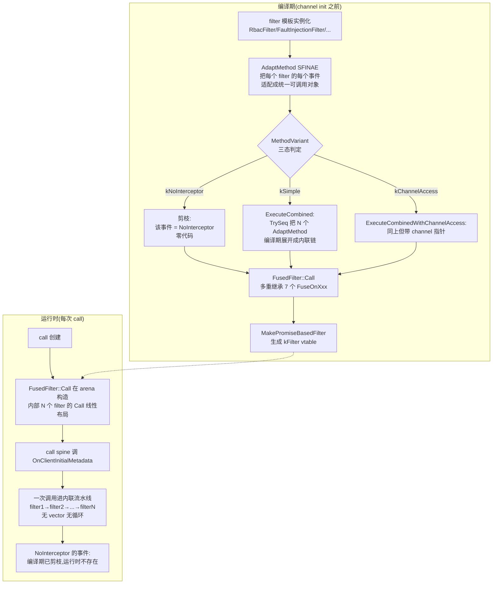

# 第 3 篇 · 第 11 章 · filter stack:可插拔架构的灵魂

> **核心问题**:第 10 章拆了 completion queue 怎么把"任意 call 的完成"统一交付,也看到了经典 closure + CQ 模型在"一条调用穿过十几个 filter"时会撞上 callback 地狱。那么,这"十几个 filter"到底是什么?一次 gRPC 调用,除了把请求发出去、把响应收回来,还要在中间干一堆"和业务无关但每次调用都得做"的事——**鉴权**(这个调用有没有权限)、**日志/埋点**(记录这次调用)、**压缩**(消息压一下省带宽)、**限流/熔断**(别打爆后端)、**消息大小校验**(别收超大消息)、**census 遥测**(上报指标)。这些横切关注点(cross-cutting concerns),怎么**不侵入业务代码**地织进每次调用?更关键的是,gRPC core 正在用一种叫 **filter fusion**(滤镜融合)的技术,把十几个 filter 在**编译期**融合成一条流水线,省掉层层回调的运行时开销——这是 gRPC Promise 重构最硬核的成果,也是 C++ 模板元编程在高性能网络框架里的招牌应用。这一章拆透 filter 责任链 + filter fusion 编译期融合。

> **读完本章你会明白**:
> 1. 为什么鉴权/日志/压缩这些横切关注点要用"责任链"(一串 filter)实现,而不是 if-else 散落各处——可插拔、有序、可独立演进,以及为什么这套思想在所有 RPC 框架里都通用。
> 2. 经典 filter 接口(`start_transport_stream_op_batch`,一个巨大的 batch op)和新 Promise filter 接口(7 个命名拦截点)的本质区别——为什么新接口能让 filter 代码从"闭包嵌套地狱"变成"声明式的几个方法"。
> 3. ★**filter fusion 怎么用 C++ 模板元编程,把 N 个 filter 在编译期融合成 1 条流水线**:SFINAE 签名适配(`AdaptMethod` 20+ 偏特化)+ `TrySeq` 编译期组合 + `NoInterceptor` 三态剪枝 + 多重继承组装,把"每次调用 N 层回调"压成"每次调用 1 个扁平状态机",且对 `NoInterceptor` 的事件**零运行时成本**。
> 4. 为什么 filter fusion 是"用编译期组合换运行时性能"的极致实践,以及它和 P1-04 的模板混入、P3-12 的 call spine 是同一套 C++ 模板哲学的不同应用。
> 5. 经典 filter stack(运行时遍历 vector)vs filter fusion(编译期融合)的真实性能差异在哪,以及为什么 gRPC 要"两套并行"维护(`CallFilters` 运行时栈 + `FusedFilter` 编译期融合)。

> **如果一读觉得太难**:先只记住三件事——① 一次调用穿过一串 filter,每个 filter 处理一类横切关注点(鉴权/日志/压缩...),用责任链而非 if-else 是为了可插拔可演进;② 新 Promise filter 只需声明 7 个命名拦截点(如 `OnClientInitialMetadata`),不关心的写 `NoInterceptor`,框架自动跳过;③ filter fusion 是招牌——它把这串 filter 在**编译期**用模板融合成一条流水线(`TrySeq` 串起来),`NoInterceptor` 的事件零成本,这是 gRPC 用 C++ 模板换性能的极致。看不懂 `AdaptMethod` 的 SFINAE 细节没关系,抓住"编译期把 N 个函数指针展开成一条内联链"这个目标就行。

---

## 〇、一句话点破

> **filter stack 用责任链把横切关注点织进每次调用,新 Promise 接口让每个 filter 只声明几个命名拦截点;filter fusion 再用 C++ 模板元编程,把这一串 filter 在编译期融合成一条流水线——N 层回调压成 1 个扁平状态机,NoInterceptor 的事件零成本。**

这是结论。本章倒过来拆:先讲为什么横切关注点要用责任链(不这样会怎样),再拆经典 batch filter 接口和它为什么难写,然后拆新 Promise filter 接口的 7 个命名拦截点(为什么这么设计),接着是招牌——filter fusion 怎么用 SFINAE + `TrySeq` + 多重继承在编译期融合,最后对比经典运行时栈(`CallFilters`)和编译期融合(`FusedFilter`)的差异。

本章服务的二分法是**框架层(招牌)**——filter stack 是框架层"可插拔架构"的灵魂。它承接 P3-10(call 把 op 翻译成 transport batch,batch 穿过 filter 栈),也承接 P2-06(transport 是 filter 栈的终点)。它给 P3-12 铺垫(call spine 怎么编排这条穿过滤镜栈的流)。

> **架构演进交代**:本章是全书"经典 → Promise"演进的核心展示场。经典 filter 接口(`start_transport_stream_op_batch`,见 [`channel_stack.h`](../grpc/src/core/lib/channel/channel_stack.h))仍存在于 `channel_idle`/`retry`/`client_channel` 的 legacy 路径;新 Promise filter 接口(`ImplementChannelFilter` + 7 个命名拦截点)是 `rbac`/`fault_injection`/`message_size`/`http`/`compression`/`auth` 等的形态。**filter fusion(`FusedFilter`)受 experiment `IsFuseFiltersEnabled()` 控制,已正式接入 channel init**,不是死代码。本章所有源码引用都是当前 master(2195e869)的真实状态。

---

## 一、横切关注点:为什么用责任链而非 if-else

### 从 P3-10 接过来:一次调用要干多少"和业务无关"的事

P3-10 讲了 `grpc_call_start_batch` 怎么把一批 op 提交、怎么穿过 filter 栈到 transport。但当时把"filter 栈"当黑盒跳过了。现在打开这个黑盒。

一次 gRPC 调用,从用户 `stub->GetUser(req)` 到 transport 把字节发出去,中间要做的事远不止"编码请求"。至少有这些:

| 横切关注点 | filter | 干什么 |
|-----------|--------|--------|
| 鉴权 | `RbacFilter` / `ClientAuthFilter` / `ServerAuthFilter` | 这个调用有没有权限?没权限直接拒绝 |
| 消息大小校验 | `ClientMessageSizeFilter` / `ServerMessageSizeFilter` | 消息别超过上限(防 DoS) |
| 压缩 | `ClientCompressionFilter` / `ServerCompressionFilter` | 消息压一下省带宽 |
| HTTP 语义 | `HttpClientFilter` / `HttpServerFilter` | 处理 HTTP/2 语义(`:path` → 方法名,`te: trailers` 等) |
| 故障注入 | `FaultInjectionFilter` | 按配置注入延迟/错误(测试用) |
| 遥测/埋点 | `ServerCallTracerFilter` / `ClientLoadReportingFilter` | 记录这次调用的指标 |
| 限流/访问控制 | `RbacFilter`(xDS 下发策略) | 别打爆后端 |

这些事**每次调用都得做**,而且**和业务逻辑无关**——不管你调的是 `GetUser` 还是 `PlaceOrder`,鉴权、日志、压缩都得跑一遍。如果把它们直接写进业务代码(`if (need_auth) check_auth(); if (need_log) log(); ...`),业务代码会被这些"非业务"逻辑淹没,而且每加一个横切关注点都要改所有业务代码。

> **不这样会怎样**:把横切关注点写进业务代码,有三个硬伤:① **业务代码被污染**——`GetUser` 的 handler 里一半是鉴权/日志/压缩,真正的业务逻辑被淹没;② **重复**——每个 handler 都要写一遍这些逻辑,改一处要改 N 处;③ **不可演进**——想加一个新的横切关注点(比如新加 census 遥测),要改所有 handler。这是软件工程里"散弹枪手术"(shotgun surgery)的反模式——一个变化点触发大量代码修改。

### 责任链:一串 filter,每个处理一类横切

gRPC(以及几乎所有 RPC 框架:Dubbo、Spring Cloud、Envoy)的答案是**责任链模式(chain of responsibility)**:把每个横切关注点封装成一个 **filter**(滤镜),一次调用穿过一串 filter,每个 filter 处理一类横切,处理完往下一个 filter 传。

```
   一次调用(client→server 方向)
   ┌─────────────────────────────────────────────────────┐
   │ call 进入                                            │
   │   ↓                                                  │
   │ RbacFilter(鉴权:没权限? 拒绝)                      │
   │   ↓                                                  │
   │ FaultInjectionFilter(故障注入:注入延迟/错误?)       │
   │   ↓                                                  │
   │ ClientMessageSizeFilter(消息太大? 拒绝)             │
   │   ↓                                                  │
   │ HttpClientFilter(HTTP 语义:解析 :path)              │
   │   ↓                                                  │
   │ ClientCompressionFilter(压缩消息)                   │
   │   ↓                                                  │
   │ transport(发字节)                                   │
   │   ↓ (回程反向)                                      │
   │ ClientCompressionFilter(解压)                       │
   │   ↓                                                  │
   │ ... 各 filter 回程处理 ...                           │
   │   ↓                                                  │
   │ call 完成(tag 进 CQ)                               │
   └─────────────────────────────────────────────────────┘
```

这种结构的好处:

1. **可插拔**:想加一个新横切关注点(比如新加 census),写一个新 filter,插进链里,业务代码一行不改。
2. **有序**:filter 的顺序在 channel 初始化时定好,保证"鉴权在压缩之前"这种语义约束。
3. **可独立演进**:每个 filter 独立实现、独立测试、独立配置,互不影响。
4. **双向**:同一串 filter,正向(client→server)和反向(server→client)各跑一遍——鉴权通常正向(请求来时鉴权),解压通常反向(响应回来时解压)。

> **钉死这件事**:filter 责任链是"横切关注点不污染业务"的标准解。它把"每次调用都要做的非业务事"封装成可插拔的 filter,一次调用穿过一串 filter。这和 Web 框架的中间件(middleware)、Envoy 的 filter chain、操作系统的协议栈(L4→L5→L6 层层处理)是同一种思想:**用一条可组合的处理链,把横切关注点和核心逻辑解耦**。

### 责任链的两条路径:经典 batch vs 新 Promise

但"责任链"只是个模式,具体怎么实现责任链,gRPC 有两套:

- **经典 batch filter**(`start_transport_stream_op_batch`):每个 filter 实现一个"接收 batch op"的方法,在里面处理完往下一个 filter 传。这是 legacy 形态,`channel_idle`/`retry`/`client_channel` 还在用。
- **新 Promise filter**(`ImplementChannelFilter` + 7 个命名拦截点):每个 filter 声明几个"我关心这个事件"的方法,框架自动把 filter 串成 promise 链。这是 `rbac`/`fault_injection`/`message_size`/`http`/`compression`/`auth` 的形态,也是 filter fusion 的基础。

这两套并存,是 gRPC 架构演进的现场。下面先拆经典 batch 为什么难写(铺垫 P3-10 的 callback 地狱),再拆新 Promise filter 怎么解决,最后拆 filter fusion 怎么把新 Promise filter 进一步压成编译期流水线。

---

## 二、经典 batch filter:一个巨大的 op,和它的 callback 地狱

### 经典 filter 接口:`start_transport_stream_op_batch`

先看经典 filter 的接口定义 [`channel_stack.h:97-100`](../grpc/src/core/lib/channel/channel_stack.h#L97-L100):

```cpp
struct grpc_channel_filter {
  void (*start_transport_stream_op_batch)(grpc_call_element* elem,
                                          grpc_transport_stream_op_batch* op);
  ...
};
```

每个经典 filter 是一个 `grpc_call_element`,提供一个 `start_transport_stream_op_batch` 函数指针。这个函数接收一个**巨大的 `grpc_transport_stream_op_batch`**——它是一个结构体,里面**同时**包含 send_initial_metadata 指针、send_message 指针、recv_initial_metadata 指针、recv_message 指针、recv_trailing_metadata 指针等(P3-10 讲的 8 个 `GRPC_OP_*` 翻译过来后的形态)。一个 filter 收到这个 batch,要从中挑出自己关心的字段处理,然后调 `grpc_call_next_filter` 把 batch 往下传。

一个经典 filter 的伪代码长这样:

```cpp
// (经典 batch filter,简化示意,非源码原文)
void RbacFilterStartBatch(grpc_call_element* elem,
                          grpc_transport_stream_op_batch* op) {
  RbacCallData* calld = static_cast<RbacCallData*>(elem->call_data);
  if (op->send_initial_metadata) {
    // 鉴权
    if (!Authorize(op->payload->send_initial_metadata)) {
      FailCall(op, PERMISSION_DENIED);    // 失败
      return;
    }
  }
  // 往下传
  grpc_call_next_filter(elem, op);
}
```

看起来还行。问题在于:**当 filter 需要异步时**(比如 fault_injection 要注入 100ms 延迟),它不能立刻 `grpc_call_next_filter`——得开个 timer,等 timer 到了再往下传。这时 batch 的"往下传"就变成了一个 closure 回调,P3-10 末尾贴的 callback 地狱就出现了:

```cpp
// (经典 batch filter 异步,简化示意,非源码原文)
void FaultInjectionFilterStartBatch(grpc_call_element* elem,
                                    grpc_transport_stream_op_batch* op) {
  FaultInjectionCallData* calld = static_cast<FaultInjectionCallData*>(elem->call_data);
  if (op->send_initial_metadata && ShouldInjectDelay()) {
    // 异步:记下当前 op,开 timer,timer 到了再往下传
    calld->next_closure = GRPC_CLOSURE_INIT(..., OnDelayDone, calld, ...);
    calld->saved_op = op;                  // 记住 batch
    grpc_timer_init(&calld->timer, delay_ms, &calld->next_closure);
    // 不调 grpc_call_next_filter,等 timer
  } else {
    grpc_call_next_filter(elem, op);       // 同步,立刻往下传
  }
}

void OnDelayDone(void* arg, grpc_error_handle error) {
  FaultInjectionCallData* calld = static_cast<FaultInjectionCallData*>(arg);
  if (!error.ok()) {
    // 失败:把 error 通过 batch 的 recv_trailing_metadata 往上传
    ...;
    return;
  }
  // timer 到了,接着往下传
  grpc_call_next_filter(calld->elem, calld->saved_op);
}
```

注意每个异步 filter 要:**手写一个 closure(`next_closure`)+ 手写一个 done 回调(`OnDelayDone`)+ 手动记住"我完了该调谁"+ 手动处理成功/失败两条路径**。P3-10 末尾已展示过这是十几层嵌套的金字塔。

> **不这样会怎样**:经典 batch filter 在异步场景下变成 callback 地狱——每层 filter 一个 closure 嵌套,代码读不懂、难组合、易出错(漏调 closure、重复调、error 透传错误)。一个 filter 作者要把一半精力花在"怎么串异步完成"的样板代码上,而不是"我的横切逻辑"本身。这就是为什么 gRPC 要搞 Promise 重构——把"异步完成怎么串"这件事从 filter 作者手里收回到框架。

---

## 三、新 Promise filter:7 个命名拦截点,声明式

### 新接口:`ImplementChannelFilter` + 内嵌 `Call`

新 Promise filter 接口完全重写了 filter 的形态。看 [`promise_based_filter.h:1187-1188`](../grpc/src/core/lib/promise_based_filter.h#L1187-L1188) 的 `ImplementChannelFilter`:

```cpp
// (简化示意,见 promise_based_filter.h)
template <typename Filter>
class ImplementChannelFilter {
  // 框架自动生成 MakeCallPromise,把 Filter::Call 的 7 个拦截点串成 promise 链
};
```

每个新 filter 继承 `ImplementChannelFilter<Self>`,提供**内嵌的 `class Call`**,在 `Call` 里声明"我关心哪些事件"。看真实的 [`RbacFilter`](../grpc/src/core/ext/filters/rbac/rbac_filter.h#L35-L64):

```cpp
class RbacFilter : public ImplementChannelFilter<RbacFilter> {
  ...
  class Call {
   public:
    // 关心 client→server 方向的初始 metadata:在这里鉴权
    absl::Status OnClientInitialMetadata(ClientMetadata& md, RbacFilter* filter);

    // 其余 6 个事件:不关心,写 NoInterceptor 占位
    static inline const NoInterceptor OnServerInitialMetadata;
    static inline const NoInterceptor OnServerTrailingMetadata;
    static inline const NoInterceptor OnClientToServerMessage;
    static inline const NoInterceptor OnClientToServerHalfClose;
    static inline const NoInterceptor OnServerToClientMessage;
    static inline const NoInterceptor OnFinalize;

    channelz::PropertyList ChannelzProperties() { return channelz::PropertyList(); }
  };
};
```

这就是一个完整的鉴权 filter。注意几个关键点:

1. **`Call` 内嵌类**:每个 filter 实例在每个 call 上有一个 `Call` 对象(arena 分配),承载这个 call 在这个 filter 上的状态。这是 per-call 的,不是 per-channel。
2. **7 个命名拦截点**:`OnClientInitialMetadata` / `OnServerInitialMetadata` / `OnClientToServerMessage` / `OnServerToClientMessage` / `OnClientToServerHalfClose` / `OnServerTrailingMetadata` / `OnFinalize`。每个拦截点对应一次 call 生命周期里的一个事件(P3-12 会把这些事件和 call 状态机串起来)。
3. **不关心的写 `NoInterceptor`**:RbacFilter 只关心 `OnClientInitialMetadata`(请求来时鉴权),其余 6 个全写 `static inline const NoInterceptor`。框架看到 `NoInterceptor`,对这个事件**完全跳过这个 filter**——零成本。
4. **`OnClientInitialMetadata` 是同步的**:返回 `absl::Status`,鉴权成功返回 `OkStatus`,失败返回错误。框架把这个同步方法包装成一个立即完成的 promise(`Immediate`)。

> **钉死这件事**:新 Promise filter 把 filter 作者的工作从"手写 closure 嵌套"变成"声明我关心哪几个事件"。鉴权 filter 只写一个 `OnClientInitialMetadata`,其余 6 个 `NoInterceptor` 占位——干净、声明式、没有样板代码。框架(`ImplementChannelFilter` + `MakePromiseBasedFilter`)负责把这些声明串成一条 promise 链。这是 filter 代码从"闭包地狱"到"几个方法声明"的根本转变。

### 7 个命名拦截点的方向性

这 7 个拦截点不是随便起的,它们精确对应一次 call 的 7 个事件,且天然带方向(完整契约在 [`call_filters.h:44-114`](../grpc/src/core/call/call_filters.h#L44-L114)):

| 拦截点 | 值类型 | 方向 | 典型用途 |
|--------|--------|------|---------|
| `OnClientInitialMetadata` | `ClientMetadata` | client→server | 鉴权、加 trace-id |
| `OnClientToServerMessage` | `Message` | client→server | 消息大小校验、压缩 |
| `OnClientToServerHalfClose` | (无值) | client→server | 客户端发完了的通知 |
| `OnServerInitialMetadata` | `ServerMetadata` | server→client | 服务端响应头 |
| `OnServerToClientMessage` | `Message` | server→client | 响应消息处理 |
| `OnServerTrailingMetadata` | `ServerMetadata` | server→client | trailing(grpc-status) |
| `OnFinalize` | `const grpc_call_final_info*` | (收尾,同步) | 收尾埋点、清理 |

方向性的意义:**同一串 filter,在 client→server 和 server→client 两个方向上执行顺序相反**。比如 filter 链是 `[A, B, C]`,client→server 方向是 `A→B→C`(请求出去时),server→client 方向是 `C→B→A`(响应回来时)。filter fusion 会显式处理这个反转(后面拆)。

### 异步 filter:返回 promise 而非 closure

新 Promise filter 怎么表达异步?看真实的 [`FaultInjectionFilter`](../grpc/src/core/ext/filters/fault_injection/fault_injection_filter.h#L84-L87):

```cpp
class FaultInjectionFilter : public ImplementChannelFilter<FaultInjectionFilter> {
  class Call {
    // 异步:返回 ArenaPromise<absl::Status>,不是同步的 absl::Status
    ArenaPromise<absl::Status> OnClientInitialMetadata(
        ClientMetadata& md, FaultInjectionFilter* filter);
    static inline const NoInterceptor OnServerInitialMetadata;
    ...
  };
};
```

`OnClientInitialMetadata` 返回 `ArenaPromise<absl::Status>`——一个 promise(未来会产出 `absl::Status` 的对象)。框架拿到这个 promise,poll 它直到完成。如果 fault_injection 配置了注入 100ms 延迟,这个 promise 内部就是一个"sleep 100ms 然后返回 Ok"的 promise(`Seq(Sleep(100ms), [] { return Ok; })`)。

对比经典 batch filter 的异步(第二节那段 `OnDelayDone` closure 噩梦):新 filter 只需返回一个 promise,不用手写 closure、不用手记 next、不用手处理 error 短路——promise 组合子(`TrySeq`/`Seq`/`Map`)自动处理这些。fault_injection 的 promise 内部展开长这样(P3-10 末尾贴过):

```cpp
// (fault_injection 的 OnClientInitialMetadata 内部,简化示意)
return TrySeq(
    MaybeSleep(filter->delay_ms()),        // 注入延迟(一个 promise)
    filter->next_promise_factory());        // 延迟完了,接着下一层
```

一行 `TrySeq`,把"延迟 → 下一层"写成线性的一句。错误自动短路(TrySeq 任一步失败就终止,不用手写 error 透传)。这是 Promise filter 相对经典 batch filter 的根本优势:**异步组合从手写 closure 变成声明式 promise 链**。

> **钉死这件事**:新 Promise filter 的 7 个命名拦截点 + NoInterceptor + 返回 promise,让 filter 作者彻底从 closure 嵌套中解放。同步拦截点返回 `Status`/`void`,异步的返回 `ArenaPromise<T>`,框架用 `AdaptMethod` 自动适配(下一节拆)。这是 gRPC filter 代码可读性、可维护性的质的飞跃——也是 filter fusion 能成立的前提(fusion 需要每个 filter 有统一的、可编译期组合的接口)。

---

## 四、★招牌:filter fusion 怎么把 N 个 filter 编译期融合成 1 条流水线

新 Promise filter 解决了"filter 代码好写"的问题。但还有一个性能问题:**即使每个 filter 都是 promise 化的,运行时仍然要"逐个 filter 调用"**。一串 10 个 filter,每次 call 要 10 次间接调用、10 次 promise 构造、10 次状态机推进。在海量并发下,这些间接调用的累积开销不小。

gRPC 的极致优化:**filter fusion**(滤镜融合)——用 C++ 模板元编程,把这 N 个 filter 在**编译期**融合成**一个**合成的 filter,运行时只有 1 次调用、1 个扁平的状态机。这是本章的招牌。

### 朴素方案:运行时遍历 filter 列表

先看朴素方案——`CallFilters` 类([`call_filters.h:1720`](../grpc/src/core/call/call_filters.h#L1720))就是这么做的。它内部用 `std::vector<Operator<T>>` 存每个事件的算子列表,运行时用 `OperationExecutor` 逐个跑:

```cpp
// (CallFilters 运行时遍历,简化示意,见 call_filters.h:1433-1555)
template <typename T>
class OperationExecutor {
  void InitStep() {
    while (ops_ < ops_end_) {            // ← 运行时循环,逐个 filter
      auto& op = *ops_;
      auto r = op.poll(op.promise_state, ...);
      if (auto* p = r.value_if_ready()) {
        ++ops_;                           // 这个 filter 完成,下一个
        ...
      } else {
        return Pending();                 // 这个 filter 还没完成,等
      }
    }
  }
  Operator<T>* ops_;
  Operator<T>* ops_end_;
};
```

每次 call 的每个事件,`OperationExecutor` 要在 vector 上**运行时遍历**,逐个 filter 调 `poll`。即使某个 filter 是 `NoInterceptor`(不关心这个事件),它也在 vector 里占一个位置(虽然 poll 是空操作)。

> **不这样会怎样**:运行时遍历的问题——① **间接调用开销**:每个 filter 的 poll 是函数指针调用,无法内联,分支预测器也帮不上忙;② **NoInterceptor 仍有成本**:即使 filter 不关心这个事件,它仍占 vector 一个位置,遍历时仍要判一次;③ **状态机无法跨 filter 优化**:每个 filter 一个独立的小状态机,编译器无法跨 filter 做状态合并。在海量并发(百万 QPS)下,这些开销累积。

### filter fusion 的核心思路:编译期把 N 个 filter 展开成 1 个

filter fusion 的思路是:**既然这一串 filter 在 channel 初始化时就定好了(运行时不变),为什么不在编译期就把它们融合成一个大 filter?** 融合后,运行时只有 1 个 filter(这个合成的 `FusedFilter`),它的每个拦截点内部,把 N 个原 filter 的对应方法**内联**串成一条链。

```
   朴素方案(运行时遍历):              filter fusion(编译期融合):
   call 进入                            call 进入
     ↓                                    ↓
     [filter1, filter2, ..., filterN]     FusedFilter(内部已内联 N 个)
       运行时循环逐个调:                    每个 OnClientInitialMetadata:
       for f in filters:                     TrySeq(filter1.OnXxx,
         f.OnClientInitialMetadata(md)              filter2.OnXxx,
       (10 次间接调用 + vector 遍历)                 ...,
                                            filterN.OnXxx)
                                            (1 次调用,内部全内联)
```

这要求 C++ 模板能在编译期:① 把 N 个 filter 的某个拦截点的方法拿出来;② 把它们用 `TrySeq` 串成一条;③ 处理"有些 filter 是 NoInterceptor"的情况(跳过);④ 处理方向(server→client 要反序)。这是个重型模板元编程工程,主角是 [`filter_fusion.h`](../grpc/src/core/call/filter_fusion.h)(1230 行,纯头文件,Copyright 2025)。

### 技巧一:`AdaptMethod` —— 把异构签名统一化

第一个难关:**N 个 filter 的同一个拦截点,签名可能各不相同**。比如 `OnClientInitialMetadata`:

- `RbacFilter::Call`:`absl::Status OnClientInitialMetadata(ClientMetadata&, RbacFilter*)`(同步,带 channel 指针)
- `FaultInjectionFilter::Call`:`ArenaPromise<absl::Status> OnClientInitialMetadata(ClientMetadata&, FaultInjectionFilter*)`(异步,带 channel 指针)
- `ClientMessageSizeFilter::Call`:`void OnClientInitialMetadata(ClientMetadata&, ClientMessageSizeFilter*)`(同步 void,带 channel 指针)
- 不关心的 filter:`static inline const NoInterceptor OnClientInitialMetadata`(不拦截)

要把这四种签名统一成"一个可调用对象,接收 `Hdl<T>`,返回某种能 poll 的东西",需要 SFINAE 挑选正确的适配逻辑。这就是 `AdaptMethod`([`filter_fusion.h:80-88`](../grpc/src/core/call/filter_fusion.h#L80-L88))的主模板 + 约 20 个偏特化(行 84~529)。

看几个关键偏特化:

```cpp
// (AdaptMethod 偏特化,简化示意,见 filter_fusion.h:84-529)

// 偏特化 1:NoInterceptor —— 不拦截,直接透传,零成本
template <typename T, const NoInterceptor* method>
class AdaptMethod<T, const NoInterceptor*, method> {
 public:
  auto operator()(Hdl<T> x) {
    return Immediate(ServerMetadataOrHandle<T>::Ok(std::move(x)));  // 立即放行
  }
};

// 偏特化 2:void f(T&) —— 同步,无返回值,调完放行
template <typename T, typename A, typename Call, void (Call::*method)(A)>
class AdaptMethod<T, void (Call::*)(A), method, ...> {
 public:
  auto operator()(Hdl<T> x) {
    (call_->*method)(*x);                          // 调 filter 的方法
    return Immediate(ServerMetadataOrHandle<T>::Ok(std::move(x)));  // 放行
  }
};

// 偏特化 3:Status f(T&) —— 同步,返回 Status,失败则短路
// (省略,逻辑类似但检查 Status)

// 偏特化 4:Promise f(T&) —— 异步,返回 promise,用 Map 包装
// (filter_fusion.h:464-513,这是支持异步 filter 的关键)
```

`AdaptMethod` 的作用:**把任意签名的 filter 方法,统一适配成 `operator()(Hdl<T>)` 返回 `Immediate(...) | Map(promise,...)`**。这样,无论 filter 是同步还是异步、带不带 channel 指针、返回 Status 还是 void,都能被 `TrySeq` 统一组合。

### 技巧二:`ExecuteCombined` —— 用 `TrySeq` 把 N 个适配后的方法串成一条

第二个难关:**怎么把 N 个 `AdaptMethod` 串成一条流水线?** 看 [`filter_fusion.h:766-782`](../grpc/src/core/call/filter_fusion.h#L766-L782) 的 `ExecuteCombined`:

```cpp
template <typename Call, typename T, auto filter_method_0,
          auto... filter_methods, size_t I0, size_t... Is>
auto ExecuteCombined(Call* call, Hdl<T> hdl,
                     Valuelist<filter_method_0, filter_methods...>,
                     std::index_sequence<I0, Is...>) {
  return TrySeq(AdaptMethod<T, decltype(filter_method_0), filter_method_0>(
                    call->template fused_child<I0>())(std::move(hdl)),
                AdaptMethod<T, decltype(filter_methods), filter_methods>(
                    call->template fused_child<Is>())...);
}
```

这一段是 filter fusion 的**字面实现**。逐字读:

1. **`auto filter_method_0, auto... filter_methods`**:这是**非类型模板参数包**,携带 N 个"成员方法指针"(编译期常量)。每个 filter 的 `OnClientInitialMetadata` 方法指针,在类型系统里被携带。
2. **`Valuelist<...>` + `std::index_sequence<I0, Is...>`**:两套索引,一套是方法指针,一套是 filter 在融合链里的位置 `0,1,2,...,N-1`。
3. **`TrySeq(AdaptMethod<..., filter_method_0>(call->fused_child<I0>())(hdl), AdaptMethod<..., filter_methods>(call->fused_child<Is>())...)`**:把 N 个 `AdaptMethod` 对象,用 `TrySeq` 串起来。每个 `AdaptMethod` 用 `fused_child<I>()` 取出第 I 个 filter 的 `Call` 对象(下一节拆 `CallWrapper` 怎么布局这些)。
4. **`TrySeq`** 是 gRPC promise 库的短路顺序组合子([`try_seq.h:254`](../grpc/src/core/lib/promise/try_seq.h#L254)):前一个完成且成功,才把值传给下一个;任一失败,整条短路终止。

**编译后**:`TrySeq(a, b, c, ..., n)` 会被编译器展开成一个**内联的状态机**,每个 `AdaptMethod::operator()` 被内联,`TrySeq` 的状态推进也被内联。于是 N 个 filter 变成 1 个**扁平的、无虚函数调用的状态机**——这就是"把 N 层压成 1 条"的字面含义。

> **钉死这件事**:filter fusion 的核心机制是 `ExecuteCombined` 用 `TrySeq` + 非类型模板参数包 + `index_sequence`,在编译期把 N 个 `AdaptMethod` 串成一条内联流水线。这不是运行时遍历,而是**编译期展开**——编译器把 N 个 filter 的方法直接内联进一个合成的方法体。`TrySeq` 任一失败短路,对应"鉴权失败就不压缩、不日志了"的语义。

### 技巧三:`NoInterceptor` 三态剪枝——零成本跳过

第三个难关:**很多 filter 对某个事件是 `NoInterceptor`(不关心)。** 比如 RbacFilter 只关心 `OnClientInitialMetadata`,其余 6 个事件全 NoInterceptor。朴素方案里,NoInterceptor 仍占 vector 一个位置,运行时仍要判一次。filter fusion 要做到 **NoInterceptor 的事件完全零成本**。

看 [`filter_fusion.h:51-66`](../grpc/src/core/call/filter_fusion.h#L51-L66) 的 `MethodVariant` 三态:

```cpp
enum class MethodVariant {
  kNoInterceptor,    // 所有 filter 都是 NoInterceptor
  kSimple,           // 有拦截,但不需 channel 指针
  kChannelAccess,    // 有拦截,且需 channel 指针
};

template <typename... Ts>
constexpr MethodVariant MethodVariantForFilters() {
  if constexpr (AllNoInterceptor<Ts...>) {
    return MethodVariant::kNoInterceptor;        // ← 关键:全是 NoInterceptor
  } else if constexpr (!AnyMethodHasChannelAccess<Ts...>) {
    return MethodVariant::kSimple;
  } else {
    return MethodVariant::kChannelAccess;
  }
}
```

`AllNoInterceptor<Ts...>`([`filter_fusion.h:47-49`](../grpc/src/core/call/filter_fusion.h#L47-L49))是个 fold 表达式,编译期判断"这 N 个 filter 的这个事件是不是全是 NoInterceptor"。如果是,**整个事件在融合后的 filter 里直接是 `static inline const NoInterceptor`——零代码、零运行时成本**。

这是 filter fusion 相对 `CallFilters`(运行时栈)的核心性能优势:`CallFilters` 每个 event 总要遍历 vector(即使全是 NoInterceptor),fusion 在全是 NoInterceptor 时**编译期剪枝成空**。

`GRPC_FUSE_METHOD` 宏([`filter_fusion.h:911-942`](../grpc/src/core/call/filter_fusion.h#L911-L942))为每个事件名一次性生成三个偏特化类(对应三种 `MethodVariant`),编译期自动选对的那一个。它在 [`filter_fusion.h:1008-1012`](../grpc/src/core/call/filter_fusion.h#L1008-L1012) 被实例化 5 次:

```cpp
GRPC_FUSE_METHOD(OnClientInitialMetadata, ClientMetadataHandle, true);   // forward
GRPC_FUSE_METHOD(OnServerInitialMetadata, ServerMetadataHandle, false);  // reverse
GRPC_FUSE_METHOD(OnClientToServerMessage, MessageHandle, true);          // forward
GRPC_FUSE_METHOD(OnServerToClientMessage, MessageHandle, false);         // reverse
GRPC_FUSE_METHOD(OnFinalize, const grpc_call_final_info*, true);
```

第三个参数 `true`/`false` 是**方向标志**:`true`(client→server)用正序,`false`(server→client)用 `ReverseFilterMethods`([`filter_fusion.h:725-737`](../grpc/src/core/call/filter_fusion.h#L725-L737))反转 filter 顺序。这处理了第三节讲的"双向执行顺序相反"。

### 技巧四:`FusedFilter` —— 多重继承组装 7 个融合后的事件

最后一个难关:**7 个事件各自融合后,怎么组装成一个完整的 filter?** 看 [`filter_fusion.h:1132-1217`](../grpc/src/core/call/filter_fusion.h#L1132-L1217) 的 `FusedFilter`:

```cpp
template <FilterEndpoint ep, uint8_t kFlags, typename... Filters>
class FusedFilter : public ImplementChannelFilter<FusedFilter<ep, kFlags, Filters...>> {
  ...
  class Call : public FuseOnClientInitialMetadata<FusedFilter, Filters...>,
               public FuseOnServerInitialMetadata<FusedFilter, Filters...>,
               public FuseOnClientToServerMessage<FusedFilter, Filters...>,
               public FuseOnServerToClientMessage<FusedFilter, Filters...>,
               public FuseOnServerTrailingMetadata<FusedFilter, Filters...>,
               public FuseOnClientToServerHalfClose<FusedFilter, Filters...>,
               public FuseOnFinalize<FusedFilter, Filters...> {
    ...
  };
};
```

`FusedFilter::Call` **多重继承** 7 个 `FuseOnXxx`——每个 `FuseOnXxx` 已经把"该事件跨 N 个 filter"融成单个方法。所以融合后的 `Call` 看起来就是一个普通 promise filter 的 `Call`,但其每个方法体内联了整条流水线。`ImplementChannelFilter` 的 `MakePromiseBasedFilter` 能直接把它包成标准 vtable 注册进 channel——对 `CallFilters`(如果不 fusion)或直接对 call spine(P3-12)而言,它就是**一个** filter,但内部跑了 N 个。

`TypeName()`([`filter_fusion.h:1138-1142`](../grpc/src/core/call/filter_fusion.h#L1138-L1142))把所有 filter 名用 `+` 拼接,比如 `"message_size+http+compression"`,便于在 channelz 里看到这条融合链。

### `CallWrapper`:递归继承布局 N 个 filter 的 Call

N 个 filter 的 `Call` 对象怎么在 `FusedFilter::Call` 里布局?看 [`filter_fusion.h:1014-1128`](../grpc/src/core/call/filter_fusion.h#L1014-L1128) 的 `CallWrapper`,用**递归继承**:

```cpp
// (CallWrapper 递归继承,简化示意)
template <typename Typelist>
class CallWrapper;

template <typename Filter0, typename... Filters>
class CallWrapper<Typelist<Filter0, Filters...>>
    : public CallWrapper<Typelist<Filters...>> {        // ← 递归继承
  ...
  grpc_core::ManualConstructor<typename Filter0::Call> call_;  // 第 0 个 filter 的 Call
};

// 终止条件:空 list
template <>
class CallWrapper<Typelist<>> {};
```

递归继承让 `CallWrapper<Typelist<F0, F1, F2>>` 继承 `CallWrapper<Typelist<F1, F2>>`,后者又继承 `CallWrapper<Typelist<F2>>`,层层展开,每一层持有一个 `ManualConstructor<FilterN::Call>`。这样 N 个 filter 的 `Call` 对象被线性布局在 `FusedFilter::Call` 的内存里。`fused_child<I>()`([`filter_fusion.h:1175-1180`](../grpc/src/core/call/filter_fusion.h#L1175-L1180))用 `TypesFromIdx` 从 `Typelist` 取第 I 个类型,`reinterpret_cast` 到对应的 `CallWrapper` 偏移,拿到第 I 个 `Call*`。

`ManualConstructor` 的作用:延迟构造。filter 的 `Call` 不一定有默认构造函数,`ManualConstructor` 让 fusion 在 channel init 时只分配内存,在 call 实际创建时再 placement new 构造。这是 arena 友好的设计——所有 `Call` 对象在 arena 上连续布局,一次分配。

> **钉死这件事**:filter fusion 不是单一技巧,而是 **(SFINAE 签名适配) × (`TrySeq` 编译期组合) × (`NoInterceptor` 三态剪枝) × (多重继承 + 递归布局)** 的组合工程。它的产物 `FusedFilter` 看起来是个普通 filter,但内部把 N 个 filter 融成 1 条内联流水线,`NoInterceptor` 的事件完全剪枝。这是 C++ 模板元编程在高性能网络框架里的招牌应用——**用编译期计算换运行时性能**。

### fusion 的工作流:编译期发生什么,运行时发生什么

把 filter fusion 的完整工作流画出来,会看到"编译期"和"运行时"的清晰分工:



这张图的关键对比:**编译期做了所有"组合"工作**(SFINAE 适配、TrySeq 展开、剪枝、多重继承),运行时只剩"调用一个扁平方法"。这就是"用编译期计算换运行时性能"的画面——编译期复杂度高(模板展开、编译慢),但运行时只有内联代码,没有调度开销。

> **钉死这件事**:filter fusion 的工作流是**编译期重、运行时轻**——编译期把 N 个 filter 的每个事件,通过 SFINAE 适配 + TrySeq 展开 + 三态剪枝,融成 FusedFilter::Call 的 7 个内联方法;运行时每次 call 只是调用这些扁平方法,NoInterceptor 的事件连调用都没有。这种"编译期做掉所有调度"的哲学,和 LevelDB 的"编译期固定比较器"、Tokio 的"编译期生成 task 类型"是同一种高性能系统设计思路。

### fusion 为什么 sound:不会改变 filter 语义

filter fusion 把 N 个 filter 融成 1 个,会不会改变 filter 的语义?比如鉴权失败时,融合后还能正确短路吗?能。看 fusion 为什么 sound:

1. **`TrySeq` 短路语义保证顺序不变**:融合后的 `TrySeq(filter1.OnXxx, filter2.OnXxx, ...)`,filter1 失败(return 非 Ok),TrySeq 立即终止,不会调 filter2。这和"逐个 filter 跑,某个失败就停"的语义完全一致。所以"鉴权失败就不压缩、不日志了"的语义在融合后保持。
2. **方向反转由 `ForwardOrReverse` 保证**:`true`(client→server)正序、`false`(server→client)用 `ReverseFilterMethods` 反转。融合后的两条方向链,顺序和未融合时逐个跑一致。
3. **`AdaptMethod` 保持每个 filter 的副作用**:无论 filter 方法是同步 void(调完放行)、同步 Status(失败短路)、还是异步 promise(poll 到完成),`AdaptMethod` 都正确包装,保证 filter 的副作用(改 metadata、拒绝、注入延迟)原样发生。
4. **`NoInterceptor` 的剪枝不影响正确性**:NoInterceptor 本来就是"这个 filter 对这个事件不做任何事",剪成零成本和不调用是等价的。

所以 filter fusion 是**语义保持的编译期优化**——融合前后,一次 call 穿过 filter 栈的行为(顺序、短路、副作用)完全一致,只是运行时更高效。这是它能正式接入 channel init(受 experiment 控制但默认开)的前提。

> **钉死这件事**:filter fusion 是 sound 的——`TrySeq` 短路保证顺序与失败语义、`ForwardOrReverse` 保证双向、`AdaptMethod` 保持每个 filter 的副作用、`NoInterceptor` 剪枝等价于不调用。融合前后行为一致,只是运行时从 vector 遍历变成内联链。这种"语义保持的编译期优化"是高性能系统设计的金标准——它让 filter 作者写声明式代码,编译器产出最优机器码,两者解耦。

---

## 五、filter fusion 怎么接入 channel init

光有 `FusedFilter` 模板还不够,得让 channel 在初始化时真的"用融合版而非逐个 filter"。看 [`fused_filters.cc`](../grpc/src/core/filter/fused_filters.cc) 怎么把 fusion 实例化并注册。

### 已注册的融合组合

[`fused_filters.cc:41-105`](../grpc/src/core/filter/fused_filters.cc#L41-L105) 定义了一组 `FusedFilter<...>` 类型别名,把常见的 filter 组合预融合好:

```cpp
// (fused_filters.cc 真实代码,简化)
using FusedClientSubchannelMinimalHttp2StackFilter = FusedFilter<
    FilterEndpoint::kClient,
    kFilterExaminesServerInitialMetadata | kFilterExaminesInboundMessages |
        kFilterExaminesOutboundMessages,
    ClientMessageSizeFilter, HttpClientFilter, ClientCompressionFilter>;   // 3 个

using FusedClientSubchannelMinimalHttp2StackFilterExtendedV3 = FusedFilter<
    FilterEndpoint::kClient, ...,
    ClientAuthorityFilter, ClientAuthFilter, ClientLoadReportingFilter,
    ClientMessageSizeFilter, HttpClientFilter, ClientCompressionFilter>;   // 6 个

using FusedServerChannelMinimalHttp2StackFilter = FusedFilter<
    FilterEndpoint::kServer, ...,
    ServerMessageSizeFilter, HttpServerFilter,
    ServerCompressionFilter, ServerCallTracerFilter>;                      // 4 个
```

这些是"最常见的 filter 组合"——客户端 subchannel 的最小 HTTP/2 栈(MessageSize + Http + Compression)、服务端最小栈(MessageSize + Http + Compression + CallTracer)等。预融合好,channel init 时如果能匹配上,就用融合版,否则用逐个 filter 的 `CallFilters` 栈。

注册在 [`fused_filters.cc:108-143`](../grpc/src/core/filter/fused_filters.cc#L108-L143),受 `IsFuseFiltersEnabled()` experiment 控制:

```cpp
// (fused_filters.cc 注册,简化示意)
void RegisterFusedFilters(CoreConfiguration::Builder* builder) {
  if (!IsFuseFiltersEnabled()) return;        // experiment flag 关了就不融合
  builder->channel_init()->RegisterFusedFilter(
      GRPC_CLIENT_SUBCHANNEL, &FusedClientSubchannelMinimalHttp2StackFilter::kFilter);
  builder->channel_init()->RegisterFusedFilter(
      GRPC_SERVER_CHANNEL, &FusedServerChannelMinimalHttp2StackFilter::kFilter);
  ...
}
```

`RegisterFusedFilter` 告诉 channel init:"如果这个 channel type 的 filter 栈里,正好有这一串 filter 连续出现,把它们替换成这个 FusedFilter"。这是 fusion 的实际接入点。

> **钉死这件事**:filter fusion 已正式接入 channel init(受 `IsFuseFiltersEnabled()` 控制,默认开),不是死代码或实验残骸。它预融合了客户端和服务端最常见的 HTTP/2 栈组合(MessageSize + Http + Compression + ...),channel init 时匹配上就用融合版。这是 gRPC core 在"代码可读性"(新 Promise filter)之上,又叠加的一层"运行时性能"(编译期融合)优化。

---

## 六、技巧精解:filter fusion 编译期合并的三个层次

本章技巧精解,把 filter fusion 的机制拆到三层——它不是单一技巧,而是 SFINAE 适配 + `TrySeq` 编译期组合 + 三态剪枝的组合。每一层都有反面对比。

### 第一层:SFINAE 签名适配(`AdaptMethod`)vs 运行时类型判断

回头看 `AdaptMethod` 的 20+ 偏特化——它们的作用是把 N 个 filter 的异构签名(同步 void / 同步 Status / 异步 promise / NoInterceptor / 带 channel 指针 / 不带)**统一化**。

#### 朴素地写会撞什么墙

朴素地写,会在运行时判断 filter 的方法签名:

```cpp
// 朴素写法(示意,非源码原文)
Poll<Result> CallNextFilter(FilterList& filters, size_t idx, Hdl<T> hdl) {
  auto& filter = filters[idx];
  if (filter.method_type == kSyncVoid) {
    filter.call_void(hdl);
    return Immediate(Ok(hdl));
  } else if (filter.method_type == kSyncStatus) {
    auto s = filter.call_status(hdl);
    if (!s.ok()) return Failure(s);
    return Immediate(Ok(hdl));
  } else if (filter.method_type == kAsyncPromise) {
    return filter.call_promise(hdl);    // 返回 promise,异步
  } else if (filter.method_type == kNoInterceptor) {
    return Immediate(Ok(hdl));
  }
  ...
}
```

这个写法每次调用都要走一遍 `method_type` 判断(分支预测失败惩罚),而且无法内联(函数指针调用)。更糟的是,filter 的实际方法是 `Call::OnXxx`,签名是编译期固定的(类型里写死了),运行时判断完全多余——编译期就能定。

#### `AdaptMethod` 妙在哪

`AdaptMethod` 用 SFINAE,在**编译期**根据 filter 类型挑出正确的偏特化。编译后,每个 `AdaptMethod` 就是一个**内联的、类型确定的**调用——没有运行时判断,没有函数指针,完全内联。这是 SFINAE 在高性能代码里的标准应用:**把运行时分支推到编译期**。

### 第二层:`TrySeq` 编译期组合 vs 运行时 vector 遍历

第二层是把 N 个 `AdaptMethod` 串起来。

#### 朴素地写:运行时 vector 遍历

`CallFilters` 就是这么做的(本章第四节贴过):用 `std::vector<Operator<T>>` 存每个事件,`OperationExecutor` 运行时 `while` 循环逐个跑。每次调用,每个事件,N 次间接调用 + vector 遍历。

#### fusion 妙在哪

fusion 用 `TrySeq` + `index_sequence`,在**编译期**把 N 个 `AdaptMethod` 展开成 `TrySeq(a, b, c, ..., n)`。编译器把 `TrySeq` 展开成一个状态机,每个 `AdaptMethod` 内联进去。运行时是**一个**扁平状态机,没有 vector,没有循环,没有间接调用。

举个具体例子:3 个 filter `[MessageSize, Http, Compression]` 的 `OnClientInitialMetadata`,fusion 后编译器看到的大致是:

```cpp
// (fusion 展开后的等价代码,简化示意)
Poll<ServerMetadataOrHandle<ClientMetadataHandle>>
FusedFilterCall::OnClientInitialMetadata(ClientMetadataHandle hdl) {
  // MessageSize.OnClientInitialMetadata 内联(假设它是 void f(ClientMetadata&))
  message_size_call_.OnClientInitialMetadata(*hdl);
  // 如果失败... (假设它是 Status)
  // Http.OnClientInitialMetadata 内联
  http_call_.OnClientInitialMetadata(*hdl);
  // Compression.OnClientInitialMetadata 内联
  compression_call_.OnClientInitialMetadata(*hdl);
  return Immediate(Ok(std::move(hdl)));
}
```

3 个 filter 的方法,直接内联成一个方法体。**没有 vector,没有循环,没有间接调用**——这就是"把 N 层压成 1 条"的编译器视角。

### 第三层:`NoInterceptor` 三态剪枝 vs 运行时空操作

第三层是 NoInterceptor 的处理。

#### 朴素地写:运行时空操作

`CallFilters` 里,即使 filter 是 NoInterceptor,它也在 vector 里占位,`OperationExecutor` 遍历到它时调一个空 poll(立即返回)。空操作也有成本:函数调用 + 判断 + vector 迭代器推进。海量并发下累积。

#### fusion 妙在哪

fusion 的 `MethodVariant::kNoInterceptor` 三态剪枝——如果一个事件的 N 个 filter 全是 NoInterceptor,**编译期就把这个事件剪成 `static inline const NoInterceptor`**。运行时这个事件在 `FusedFilter` 里根本不存在,零成本。比如 RbacFilter + MessageSize + Http 的组合,`OnServerToClientMessage` 如果这三个都不关心,fusion 后这个事件就是空的——没有任何调用,没有任何判断。

> **钉死这件事**:filter fusion 的三层技巧——**SFINAE 签名适配把运行时分支推到编译期、`TrySeq` 编译期组合把 vector 遍历压成内联链、`NoInterceptor` 三态剪枝把空操作剪成零成本**——每一层都是"用编译期计算换运行时性能"。组合起来,让一串 filter 在融合后,运行时只有一个扁平状态机,NoInterceptor 的事件完全消失。这是 C++ 模板元编程在高性能网络框架里的极致实践,也是 gRPC core 用 C++ 的理由之一——grpc-go/grpc-java 的泛型/反射做不到这种编译期融合(它们靠 JIT 或运行时优化逼近)。

### fusion 的代价:编译时间和代码膨胀

filter fusion 不是免费的。它的代价是:

1. **编译时间**:模板元编程编译期计算多,fusion 头文件 1230 行全是模板,实例化 `FusedFilter<...>` 会展开大量代码,拖慢编译。
2. **代码膨胀**:每种 filter 组合都是一个独立的 `FusedFilter` 特化,二进制体积增大。
3. **调试难**:融合后的调用栈是扁平的,但源码是模板展开的,debugger 单步跳的是模板内部,不是 filter 业务逻辑。

gRPC 接受这些代价,因为:① filter 组合在 channel init 时定好,数量有限(预定义几种);② 性能收益在海量并发下显著;③ fusion 受 experiment flag 控制,可关闭回退到 `CallFilters`。这是工程上的权衡:**编译期复杂度换运行时性能,且保留可回退的运行时路径**。

---

## 七、经典 vs Promise vs fusion:三层对照

把本章讲的 filter 三种形态放一起对照,这是全书"经典 → Promise 演进"在 filter 层的完整画面:

| 维度 | 经典 batch filter | 新 Promise filter | filter fusion |
|------|------------------|-------------------|---------------|
| 接口 | `start_transport_stream_op_batch` | `ImplementChannelFilter` + 7 拦截点 | 同 Promise,fusion 是 channel init 优化 |
| 异步模型 | closure + 回调嵌套 | `ArenaPromise<T>` + `Poll<T>` | 同 Promise,fusion 不改语义 |
| 关心的事件 | filter 自己从 batch 里挑 | 声明拦截点,其余 `NoInterceptor` | 同 Promise |
| 执行调度 | `channel_stack.cc` 逐 element 遍历 | `CallFilters` 运行时 vector 遍历 | `FusedFilter` 编译期内联链 |
| NoInterceptor 成本 | filter 仍被调(自己判) | vector 占位 + 空 poll | **编译期剪枝,零成本** |
| 代码可读性 | 闭包地狱 | 声明式,干净 | 同 Promise(fusion 不改源码) |
| 运行时性能 | 最差(closure 间接调用多) | 中等(vector 遍历) | **最好(编译期内联)** |
| 谁在用 | `channel_idle`/`retry`/`client_channel`(legacy) | `rbac`/`fault_injection`/`message_size`/`http`/`compression`/`auth` | 这些 Promise filter 的预定义组合 |
| 编译时间 | 快 | 中等 | **慢(模板展开)** |

三层是**叠加演进**的关系:经典 batch → 新 Promise(代码好写)→ filter fusion(性能好)。新 Promise filter 是基础,fusion 是它的编译期优化。经典 batch 是 legacy,正在被迁移。

> **钉死这件事**:filter 的三种形态不是"gRPC 给你三种选",而是**演进的三个阶段叠加**:经典 batch 是过去(闭包地狱)、新 Promise 是现在(声明式)、filter fusion 是未来(编译期融合)。目前 `rbac`/`message_size`/`http` 等已完成 Promise 化且进入 fusion;`channel_idle`/`retry`/`client_channel` 仍是 legacy batch。gRPC 正在逐步把后者也迁过来。这个演进现场,是理解 gRPC 架构哲学的最好教材。

---

## 八、章末小结

### 回扣主线

本章拆的是 filter stack——**框架层可插拔架构的灵魂**。回到二分法,它是**框架层(招牌)**:协议层(HTTP/2 帧)负责字节过线,框架层(call/filter/channel)负责调用怎么发起、怎么治理。filter stack 是框架层里"横切关注点"的那一环——它把鉴权/日志/压缩/限流这些每次调用都要做的非业务事,封装成可插拔的 filter,让业务代码干净。

回到全书主线:**把一次方法调用变成 HTTP/2 上的一条可控的流**。filter stack 处于"call"(P3-10)和"transport"(P2-06)之间——call 把 op 翻译成 batch,batch 穿过 filter 栈(filter 处理横切),最后到 transport 编成 HTTP/2 帧。下一章 P3-12 会拆 call spine——它是 call 的主干,把这条穿过滤镜栈的流编排成线性可组合的 promise 链,本章的 filter fusion 是 call spine 内部的核心机制。

### filter fusion 的位置:Promise 重构的核心成果

本章是全书"经典 → Promise 演进"的核心展示场。filter 的三种形态——经典 batch(闭包地狱)→ 新 Promise(声明式)→ filter fusion(编译期融合)——是 gRPC 处理"异步复杂度"的方法论演进。filter fusion 用 C++ 模板元编程,把 N 个 filter 在编译期融合成 1 条流水线,NoInterceptor 的事件零成本——这是 Promise 重构在性能维度的核心成果。

P3-10 末尾提出的"CQ + closure 经典模型的 callback 地狱天花板",在本章被新 Promise filter + filter fusion 解决了:filter 作者从手写闭包嵌套变成声明几个方法;运行时从 vector 遍历变成编译期内联链。P3-12 的 call spine 会把这些融合后的 filter 串进 call 的主干,完成"一次调用 = 一条线性 promise 流"的图景。

### 五个为什么

1. **为什么横切关注点用责任链而非 if-else?**——可插拔(加横切不改业务)、有序(filter 顺序在 channel init 定)、可独立演进(每个 filter 独立实现测试)、双向(同一串 filter 正反各跑一遍)。if-else 会污染业务代码、重复、不可演进(散弹枪手术反模式)。

2. **为什么经典 batch filter 在异步时变成 callback 地狱?**——每个异步 filter 要手写 closure + done 回调 + 记住 next + 处理成功/失败两条路径。十几层 filter 嵌套成金字塔,代码读不懂、难组合、易出错。这是 gRPC 搞 Promise 重构的直接动机。

3. **为什么新 Promise filter 用 7 个命名拦截点?**——每个拦截点对应一次 call 生命周期的一个事件(OnClientInitialMetadata 等),天然带方向。filter 只声明关心的几个,其余 `NoInterceptor` 占位。框架(ImplementChannelFilter + MakePromiseBasedFilter)自动串成 promise 链。这让 filter 代码从"闭包地狱"变成"几个方法声明"。

4. **★为什么 filter fusion 能把 N 个 filter 编译期融合成 1 条?**——三层技巧叠加:① `AdaptMethod` SFINAE 把异构签名统一成可调用对象;② `ExecuteCombined` 用 `TrySeq` + 非类型模板参数包 + `index_sequence` 在编译期把 N 个 `AdaptMethod` 串成内联链;③ `MethodVariant` 三态剪枝把全 NoInterceptor 的事件剪成零成本。产物 `FusedFilter::Call` 多重继承 7 个融合事件,是个普通 filter 但内部跑了 N 个。

5. **为什么 gRPC 平行维护经典 batch、新 Promise、fusion 三套?**——演进的三个阶段叠加:经典 batch 是过去(legacy,channel_idle/retry 还在用)、新 Promise 是现在(rbac/message_size/http 已迁移)、fusion 是未来(编译期优化,已接入 channel init)。三者并存是大规模重构的标准形态——新实现先平行存在,验证稳定后 flip 默认,最后删旧实现。

### 想继续深入往哪钻

- **想看 filter fusion 核心**:[`src/core/call/filter_fusion.h`](../grpc/src/core/call/filter_fusion.h)(1230 行,纯头文件),重点看 `AdaptMethod`(80-529)、`ExecuteCombined`(766-782)、`MethodVariant`(51-66)、`GRPC_FUSE_METHOD`(911-942)、`FusedFilter`(1132-1217)。
- **想看 fusion 怎么接入 channel**:[`src/core/filter/fused_filters.cc`](../grpc/src/core/filter/fused_filters.cc),看预融合组合(41-105)和 `RegisterFusedFilters`(108-143,受 `IsFuseFiltersEnabled()` 控制)。
- **想看运行时 filter 栈(对照)**:[`src/core/call/call_filters.h`](../grpc/src/core/call/call_filters.h)(2186 行),重点看 `CallFilters` 类(1720)、`OperationExecutor`(1433)、`AddOpImpl`(396-1062,运行时版 SFINAE 适配,和 `AdaptMethod` 镜像)。
- **想看新 filter 怎么写**:读 [`src/core/ext/filters/rbac/rbac_filter.h`](../grpc/src/core/ext/filters/rbac/rbac_filter.h)(最简单的鉴权 filter,只一个 OnClientInitialMetadata)、[`src/core/ext/filters/fault_injection/fault_injection_filter.h`](../grpc/src/core/ext/filters/fault_injection/fault_injection_filter.h)(异步 filter,返回 ArenaPromise)、[`src/core/ext/filters/message_size/message_size_filter.h`](../grpc/src/core/ext/filters/message_size/message_size_filter.h)(双向都拦)。
- **想看 7 拦截点契约**:[`src/core/call/call_filters.h:44-114`](../grpc/src/core/call/call_filters.h#L44-L114),框架对每个拦截点的所有合法签名变体的精确文档。
- **想看 legacy 标注**:[`src/core/ext/filters/channel_idle/legacy_channel_idle_filter.cc`](../grpc/src/core/ext/filters/channel_idle/legacy_channel_idle_filter.cc)、[`src/core/client_channel/retry_filter_legacy_call_data.cc`](../grpc/src/core/client_channel/retry_filter_legacy_call_data.cc)——这些是还没迁到 Promise 的经典 batch filter。
- **想看 promise 组合子**:[`src/core/lib/promise/try_seq.h`](../grpc/src/core/lib/promise/try_seq.h)(`TrySeq`)、[`seq.h`](../grpc/src/core/lib/promise/seq.h)(`Seq`)、[`race.h`](../grpc/src/core/lib/promise/race.h)(`Race`)、[`map.h`](../grpc/src/core/lib/promise/map.h)(`Map`)——P3-12 会拆这些组合子怎么编 call spine。

### 引出下一章

我们搞清楚了 filter stack 怎么把横切关注点织进每次调用,也看到了 filter fusion 怎么用 C++ 模板把 N 个 filter 编译期融合成 1 条流水线。那么,这条穿过滤镜栈的流,谁在主干上把它编排起来?一次 call 从"用户 start_batch"到"transport 收发完成"的完整生命周期,怎么被组织成一条线性可组合的 promise 链?unary / server-streaming / client-streaming / bidi-streaming 四种调用模式,在 core 层为什么"本质都是流"?下一章 P3-12,我们钻进 [`src/core/call/call_spine.cc`](../grpc/src/core/call/call_spine.cc) / `client_call.cc` / `server_call.cc` / `metadata_batch.cc`,拆 call spine 的 promise 编排——它是本章 filter fusion 的"宿主",也是一次调用的主干。

> **下一章**:[P3-12 · 四种调用模式与流状态机](P3-12-四种调用模式与流状态机.md)
