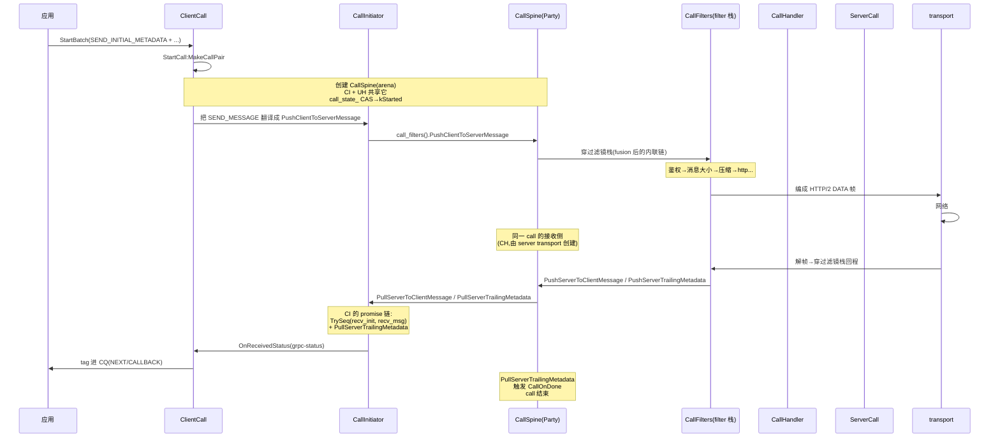

# 第 3 篇 · 第 12 章 · 四种调用模式与流状态机

> **核心问题**:第 11 章拆了 filter stack 怎么把横切关注点织进每次调用、filter fusion 怎么把 N 个 filter 编译期融合成 1 条流水线。那么,这条穿过滤镜栈的流,谁在主干上把它编排起来?gRPC 定义了四种调用模式——unary(一问一答)、server-streaming(一问多答)、client-streaming(多问一答)、bidi-streaming(双向流),它们为什么"本质都是流"?一次 call 从"用户 start_batch"到"transport 收发完成"的完整生命周期,在新的 Promise 架构里怎么被组织成一条线性可组合的 promise 链?这一章拆 call spine——call 的主干,它承接 P3-11 的 filter fusion,把一次调用编排成 promise 链;同时拆 metadata_batch,看一次调用的一批 header 怎么打包传输;最后讲清四种模式的本质——**它们不是 core 层的四种状态机,而是应用层对"何时发 SEND_MESSAGE / SEND_CLOSE / RECV_MESSAGE"的约定**。

> **读完本章你会明白**:
> 1. 为什么 unary / server-streaming / client-streaming / bidi-streaming **本质都是流**——它们在 core 层是同一种东西(一条 stream + 一串 op),区别只在应用层发了几个 SEND_MESSAGE / RECV_MESSAGE。这是 gRPC"一切皆流"统一的落地。
> 2. call spine(`CallSpine`)作为 call 的主干,怎么用 Push/Pull 原语 + Party(执行容器)把一次调用编排起来;它自己**不是状态机**,而是给上层提供组合 promise 的原语。
> 3. 一次 call 的"推进顺序"(send-metadata → send-message → recv-message → recv-status)不是硬编码的状态机,而是用 `Seq`/`TrySeq`/`ForEach`/`If` 组合子编码进 promise 链的偏序——这是经典 closure 嵌套的 Promise 版解法。
> 4. metadata_batch 怎么用 `PackedTable`(编译期按 trait 索引的紧凑表)+ `UnknownMap` 把一批 header 打包,避免逐个字符串处理;它和 HPACK(P2-07)通过 trait 的 `CompressionTraits` 接口。
> 5. 新版 `ClientCall` / `ServerCall` 怎么在内部把经典 `StartBatch` 的 op 翻译成 promise 链,让新旧 API 表面兼容、内部已重写为 promise。

> **如果一读觉得太难**:先只记住三件事——① 四种调用模式在 core 层是同一种东西(一条 stream + 一串 op),区别只在应用层发了几条消息,core 不区分;② call spine 是 call 的主干,它提供 Push/Pull 原语(推消息/拉消息),上层用 `Seq`/`TrySeq`/`ForEach` 把这些原语组合成 promise 链,编码出"send 先于 recv、status 最后"这种顺序;③ metadata_batch 把一批 header 打包成编译期固定的紧凑表(按 trait 索引),不是逐个字符串处理——这是它和 HPACK 高效对接的基础。

---

## 〇、一句话点破

> **四种调用模式本质都是流——core 层不区分 unary/streaming,只认一串 op;call spine 用 Push/Pull 原语 + promise 组合子(Seq/TrySeq/ForEach/If)把这条流编排成线性可组合的 promise 链,顺序由组合子的偏序编码,不是硬编码状态机。**

这是结论。本章倒过来拆:先讲四种模式为什么本质都是流(不这样会怎样),再拆 call spine 的结构和 Push/Pull 原语,然后拆 ClientCall/ServerCall 怎么把经典 StartBatch 的 op 翻译成 promise 链,接着拆 metadata_batch 的打包机制,最后用 ForwardCall 这段真实代码示范"promise 组合子怎么编码 call 的双向流"。

本章服务的二分法是**框架层**——它是 call 生命周期的主干。它承接 P3-10(call/CQ 把 op 提交)、P3-11(filter fusion 把横切织进调用),把"一次调用穿过滤镜栈、到 transport"的完整流编排起来。本章也是第 3 篇的收尾,把 call/CQ/filter/call_spine 拼成一次调用的完整画面,引出第 4 篇(客户端治理:调用怎么发出去、发去哪)。

> **架构演进交代**:本章的 call spine、ClientCall、ServerCall 都是**新 Promise 架构**的产物(`src/core/call/` 下)。它们在内部用 promise 编排,但**对外的 C/C++ API 仍是经典 StartBatch**(`grpc_call_start_batch`)——也就是说,用户代码不变,内部已重写为 promise。这是 gRPC"换骨架但不换 API"的重构策略。本章会清楚标注经典 vs 新形态:经典 StartBatch(8 个 GRPC_OP_*)是 surface API,call spine/Promise 编排是 core 内部。

---

## 一、四种调用模式为什么本质都是流

### 从 P0-01 接过来:一切皆流

P0-01 讲过 gRPC 的四种调用模式:

| 模式 | 客户端发 | 服务端回 | 例子 |
|------|---------|---------|------|
| Unary(一元) | 1 个请求 | 1 个响应 | `GetUser` |
| Server streaming(服务端流) | 1 个请求 | N 个响应 | 订阅股价推送 |
| Client streaming(客户端流) | N 个请求 | 1 个响应 | 上传一批日志 |
| Bidirectional streaming(双向流) | N 个请求 | N 个响应 | 实时聊天 |

P0-01 点过一句"它们本质都是 HTTP/2 上的一条流"。这一章把这个"本质"拆到源码级。

### core 层完全不区分四种模式

先看一个反直觉的事实:**在 `src/core/call/` 下 grep `NORMAL_RPC` / `CLIENT_STREAMING` / `SERVER_STREAMING` / `BIDI_STREAMING`,0 匹配**。这四个标识符**只出现在 C++ API 层**(`include/grpcpp/impl/rpc_method.h:31-37`):

```cpp
class RpcMethod {
 public:
  enum RpcType {
    NORMAL_RPC = 0,        // unary
    CLIENT_STREAMING,      // 多请求一响应
    SERVER_STREAMING,      // 一请求多响应
    BIDI_STREAMING,        // 双向
    SESSION_RPC            // 实验:session
  };
};
```

这个 enum 是 C++ API 层给"生成 stub 时标记方法类型"用的(protoc 生成 stub 时,每个方法带一个 RpcType,stub 据此选对应的 reader/writer 类)。但**core 层(call_spine / client_call / server_call)对这个 enum 完全无感**——它只认一串 `grpc_op`(P3-10 讲的 8 个 GRPC_OP_*),不关心"这是 unary 还是 streaming"。

那四种模式在 core 层怎么表达?答案:**靠应用层发了几个 SEND_MESSAGE / RECV_MESSAGE**。

```
   Unary:          Client streaming:     Server streaming:     Bidi streaming:
   SEND_INITIAL_METADATA (1次)            SEND_INITIAL_METADATA (1次)          同左
   SEND_MESSAGE (1次)                     SEND_MESSAGE (N次)                   SEND_MESSAGE (N次)
   SEND_CLOSE_FROM_CLIENT (1次)           SEND_CLOSE_FROM_CLIENT (1次)         SEND_CLOSE_FROM_CLIENT (1次)
   RECV_INITIAL_METADATA (0或1次)         RECV_INITIAL_METADATA                RECV_INITIAL_METADATA
   RECV_MESSAGE (1次)                     RECV_MESSAGE (1次,汇总响应)         RECV_MESSAGE (N次)
   RECV_STATUS_ON_CLIENT (1次)            RECV_STATUS_ON_CLIENT                RECV_STATUS_ON_CLIENT
```

四种模式的差异,纯粹是 SEND_MESSAGE / RECV_MESSAGE 的次数差异。core 提供的是**无差别的 SEND/RECV 原语**,应用层按模式约定发几次。unary = 1 个 SEND_MESSAGE + 1 个 RECV_MESSAGE;bidi = N 个 SEND_MESSAGE + N 个 RECV_MESSAGE。**core 不维护"我现在是 unary 还是 streaming"的状态,只看到一串 op**。

> **不这样会怎样**:如果 core 层为四种模式各写一套状态机(unary 状态机 / server-streaming 状态机 / ...),会有四个问题:① **代码重复**:四个状态机大量逻辑相同(都要 send initial metadata、都要 recv status),只是消息次数不同,重复写四遍;② **难扩展**:加第五种模式(比如 session rpc)要新写一套状态机;③ **传输层割裂**:HTTP/2 stream 本身是无模式的(就是双向字节流),core 强行区分模式会和 transport 语义脱节;④ **filter 难写**:filter 不知道当前是哪种模式(rbac 鉴权对四种模式都一样),模式区分对 filter 是噪音。gRPC 的"core 无模式"设计让这四个问题都消失——一套 op 原语服务四种模式,filter 一套逻辑通吃,transport 一条 stream 通吃。

### "一切皆流"的工程红利

这种"core 无模式、一切皆流"的统一,带来三个工程红利:

1. **一套传输服务四种模式**:HTTP/2 stream 本身就是双向字节流,unary 只是"一进一出"的 stream,bidi 是"多进多出"的 stream。transport 不为 unary 特殊优化,也不为 bidi 特殊处理——一条 stream 承载所有。
2. **一套 filter 服务四种模式**:P3-11 讲的 filter stack,对四种模式跑同一套逻辑(rbac 鉴权不区分模式、message_size 校验不区分模式)。filter 作者不用为每种模式写一遍。
3. **一套流控服务四种模式**:HTTP/2 的 flow control(P2-09)对一条 stream 给信用,不管这条 stream 上跑的是 unary 还是 bidi。背压、取消、多路复用,四种模式共享。

> **钉死这件事**:四种调用模式不是 core 层的四种状态机,而是**应用层对"发几条消息"的约定**。core 提供无差别的 SEND/RECV 原语,一套原语 + 一条 stream 服务四种模式。这是 gRPC"一切皆流"统一的落地——它让传输、filter、流控都只需要一套实现,大幅降低系统复杂度。理解这一点,你就理解了为什么 gRPC 能用同一套基础设施支撑从简单 unary 到复杂双向流的全部场景。

---

## 二、call spine:call 的主干(Push/Pull 原语 + Party)

### CallSpine 是什么

core 层"无模式",那它怎么编排一次调用?主角是 **CallSpine**——call 的主干。看 [`call_spine.h:48`](../grpc/src/core/call/call_spine.h#L48) 的类定义:

```cpp
// The common middle part of a call - a reference is held by each of
// CallInitiator and CallHandler - which provide interfaces that are appropriate
// for each side of a call.
// Hosts context, call filters, and the arena.
class CallSpine final : public Party, public channelz::DataSource {
```

几个关键事实:

1. **它是 call 的"common middle part"(公共中间部分)**:由 `CallInitiator`(发起侧,通常是 client)和 `CallHandler`(接收侧,通常是 server)各持一个引用。它托管 context、call filters(P3-11 的 CallFilters)和 arena。
2. **继承自 `Party`**:`Party` 是 gRPC promise 体系的执行容器([`party.h:159`](../grpc/src/core/lib/promise/party.h#L159)),一个 Party 可以 spawn 多个 promise 并发跑(最多 `kMaxParticipants=16` 个参与者)。call spine 是个 Party,意味着它能在内部并发跑多条 promise(比如"发消息"和"收消息"两条 promise 并发)。
3. **继承自 `channelz::DataSource`**:它把自己挂进 channelz 诊断树(P6-20 会讲),便于运行时观测。
4. **在 arena 上构造**:见 `Create()`([`call_spine.h:50-56`](../grpc/src/core/call/call_spine.h#L50-L56)),`arena_ptr->New<CallSpine>(...)`——call spine 和 call 的其他状态一起在 arena 上连续布局,P6-21 会拆 arena。

### CallSpine 提供 Push/Pull 原语,不自己编排状态机

一个**容易写错的关键点**:CallSpine **自己不直接编排** send-metadata → send-message → recv-message → recv-status 这条固定状态机。它提供的是一组 **Push/Pull 原语**([`call_spine.h:87-154`](../grpc/src/core/call/call_spine.h#L87-L154)):

| 方法 | 行号 | 作用 |
|------|------|------|
| `PullServerInitialMetadata()` | L87-91 | 返回 promise,poll 出 server 的初始 metadata |
| `PullServerTrailingMetadata()` | L93-102 | poll 出 trailing metadata(= status),触发 CallOnDone |
| `PushClientToServerMessage(msg)` | L104-109 | client→server 推一条消息 |
| `PullClientToServerMessage()` | L111-115 | server 端拉 client 来的消息 |
| `PushServerToClientMessage(msg)` | L117-122 | server→client 推一条消息 |
| `PullServerToClientMessage()` | L124-128 | client 端拉 server 来的消息 |
| `PushServerTrailingMetadata(md)` | L130-135 | 推结束 status |
| `FinishSends()` | L137-141 | client 端 half-close(= SEND_CLOSE_FROM_CLIENT) |
| `PullClientInitialMetadata()` | L143-147 | server 拉 client 的初始 metadata |
| `PushServerInitialMetadata(md)` | L149-154 | server 推初始 metadata |

注意这些方法**几乎全是薄包装**,直接转发给 `call_filters_`:

```cpp
// (call_spine.h:108,简化示意)
PushStatus PushClientToServerMessage(MessageHandle message) {
  return call_filters().PushClientToServerMessage(std::move(message));
}
```

所以真正的"消息管道"实现在 `CallFilters`(P3-11 讲过),CallSpine 是个**门面(facade)+ Party 容器**——它提供 Push/Pull 原语,但"怎么组合这些原语成一条完整的 call 流",留给上层(ClientCall / ServerCall / ForwardCall)用 promise 组合子拼。

> **钉死这件事**:CallSpine 不是状态机,它是 **Push/Pull 原语的集合 + Party 执行容器**。它不硬编码"send 先于 recv、status 最后"这种顺序,而是把这些原语交给上层,让上层用 `Seq`/`TrySeq`/`ForEach`/`If` 组合子编码出顺序。这是 Promise 架构的核心设计:**顺序由组合子的偏序表达,不是显式状态机枚举**。这种设计让 call 的编排极其灵活——想加一步(比如"鉴权后再发消息")?在 promise 链里插一个 TrySeq 就行,不用改状态机。

### 三个句柄类:CallInitiator / CallHandler / UnstartedCallHandler

CallSpine 还通过三个"句柄类"暴露不同生命周期阶段的接口:

- **`CallInitiator`**([`call_spine.h:375-512`](../grpc/src/core/call/call_spine.h#L375-L512)):发起侧接口(通常是 client)。提供 `PushMessage` / `PullMessage` / `PullServerTrailingMetadata` / `Cancel` / `SpawnCancel` 等。
- **`CallHandler`**([`call_spine.h:514-611`](../grpc/src/core/call/call_spine.h#L514-L611)):接收侧接口(通常是 server)。提供 `PullClientInitialMetadata` / `PushServerInitialMetadata` / `PushServerTrailingMetadata` / `PushMessage` / `PullMessage` / `WasCancelled`。
- **`UnstartedCallHandler`**([`call_spine.h:613-675`](../grpc/src/core/call/call_spine.h#L613-L675)):尚未 StartCall 之前的句柄,主要给 `AddCallStack` / `StartCall` 用。

工厂函数 `MakeCallPair`([`call_spine.cc:80-88`](../grpc/src/core/call/call_spine.cc#L80-L88))一次返回 `{CallInitiator, UnstartedCallHandler}`:

```cpp
CallInitiatorAndHandler MakeCallPair(
    ClientMetadataHandle client_initial_metadata, RefCountedPtr<Arena> arena) {
  auto spine = CallSpine::Create(std::move(client_initial_metadata), std::move(arena));
  return {CallInitiator(spine), UnstartedCallHandler(spine)};
}
```

`MakeCallPair` 造一对:发起侧拿到 CallInitiator(可以推消息、拉响应、取消),接收侧拿到 UnstartedCallHandler(还没 start,等 StartCall 后变成 CallHandler)。**这两个句柄共享同一个 CallSpine**,通过它通信。

> **钉死这件事**:call spine 用"一对句柄共享一个主干"的设计——CallInitiator(发起侧)和 CallHandler(接收侧)各持 CallSpine 的引用,通过 Push/Pull 原语双向通信。这比经典架构的"一个 grpc_call 对象 + batch op"更清晰:发起和接收的职责被句柄类型分开,类型系统帮你约束"client 不能 PushServerTrailingMetadata"(那个方法不在 CallInitiator 上)。

### 一次 call 的完整生命周期(新版 Promise 内部)

把 call spine 的 Push/Pull 原语和 ClientCall/ServerCall 的 promise 编排串起来,一次 call 从发起到结束的完整生命周期(新版 Promise 内部):



这张图的关键:**ClientCall 把经典 op 翻译成对 call spine 的 Push/Pull,call spine 把这些原语交给 CallFilters(filter 栈,fusion 后是内联链),filter 栈处理完到 transport**。整个过程是 promise 链驱动的——Party(CallSpine)spawn 多条 promise 并发跑(发送链 + 接收链),由 `Seq`/`TrySeq`/`AllOk` 编码顺序和并发关系。应用看到的仍是经典 StartBatch,内部已完全是 promise。

> **钉死这件事**:新版 call 的完整生命周期 = **ClientCall.StartBatch(翻译 op)→ MakeCallPair(创建 CallSpine)→ Push/Pull 原语 → CallFilters(fusion 内联链)→ transport → 回程 → PullServerTrailingMetadata(CallOnDone,call 结束)**。整个过程在 Party 上用 promise 组合子编排,应用看到的 API 不变。这就是"换骨架不换 API"的落地——第 3 篇三章的所有机制(CQ/filter fusion/call spine)在这条生命周期里各司其职。

---

## 三、ClientCall:经典 StartBatch 内部翻译成 promise 链

理解了 call spine 提供 Push/Pull 原语,接下来看 `ClientCall` 怎么把**经典 StartBatch 的 op** 翻译成**调用 call spine 原语的 promise 链**。这是"新旧 API 兼容、内部已 Promise 化"的关键。

### ClientCall 的三态生命周期

先看 ClientCall 的生命周期状态机([`client_call.h:157-172`](../grpc/src/core/call/client_call.h#L157-L172)):

```cpp
// call_state_ is one of:
// 1. kUnstarted - call has not yet been started
// 2. pointer to an UnorderedStart - call has ops started, but no send initial metadata yet
// 3. kStarted - call has been started and call_initiator_ is ready
// 4. kCancelled - call was cancelled before starting
enum CallState : uintptr_t { kUnstarted = 0, kStarted = 1, kCancelled = 2 };
std::atomic<uintptr_t> call_state_{kUnstarted};
```

这是 client 侧的"开始前"状态机(不是 RPC 模式状态机)。注意第 2 个状态 `UnorderedStart`——应用可以在发 initial metadata **之前**就先提交 SEND_MESSAGE / RECV_MESSAGE(`UnorderedStart` 是个链表节点,这些"提前提交"的 op 挂在链上),等真正 StartCall(发 initial metadata)时再 flush。这支持了经典 API 的灵活性:用户可以先 `reader->StartCall()` 再 `reader->Finish()`,顺序不强制。

### StartCall:真正创建 CallSpine 的时刻

关键点:**ClientCall 构造时不创建 CallSpine,只在应用第一次 StartBatch 带 SEND_INITIAL_METADATA 时才创建**。看 [`ClientCall::StartCall`](../grpc/src/core/call/client_call.cc#L256-L280):

```cpp
Party::WakeupHold ClientCall::StartCall(const grpc_op& send_initial_metadata_op) {
  ...
  CToMetadata(..., send_initial_metadata_.get());
  PrepareOutgoingInitialMetadata(...);
  send_initial_metadata_->Set(WaitForReady(), ...);
  auto call = MakeCallPair(std::move(send_initial_metadata_), arena()->Ref());  // ← 创建 CallSpine
  started_call_initiator_ = std::move(call.initiator);
  Party::WakeupHold wakeup_hold{started_call_initiator_.party()};
  while (!StartCallMaybeUpdateState(cur_state, call.handler)) {}                // CAS 切到 kStarted
  return wakeup_hold;
}
```

`MakeCallPair` 造出 CallSpine + CallInitiator/Handler,然后 `StartCallMaybeUpdateState` 把 ClientCall 的状态 CAS 成 `kStarted`,把 handler 交给 `call_destination_->StartCall(handler)` 往下传给 channel/filter 栈,最终到 transport。

> **钉死这件事**:ClientCall 采用**延迟创建 CallSpine** 的策略——构造时只准备好 `send_initial_metadata_`,真正创建 CallSpine 是在应用第一次发 SEND_INITIAL_METADATA 时。这避免了对"创建了但从不 start"的 call 浪费 CallSpine 资源。`call_state_` 用 atomic + CAS 实现"开始前"的状态机,支持并发场景下的安全状态转换。

### CommitBatch:op 翻译成 promise 链的核心

最核心的是 `ClientCall::CommitBatch`([`client_call.cc:318-431`](../grpc/src/core/call/client_call.cc#L318-L431))——它把经典 StartBatch 的 op 数组翻译成 promise 链。看关键片段(L381-385):

```cpp
auto primary_ops = Map(
    AllOk<StatusFlag>(
        TrySeq(std::move(send_message), std::move(send_close_from_client)),       // 发送链
        TrySeq(std::move(recv_initial_metadata), std::move(recv_message))),       // 接收链
    [self = WeakRef()](StatusFlag x) { return x; });
```

这一段是 ClientCall 编排的核心,逐字读:

1. **`AllOk<StatusFlag>(...)`**:`AllOk` 是并发组合子([`all_ok.h:91`](../grpc/src/core/lib/promise/all_ok.h#L91)),把多个返回 StatusFlag 的 promise 并发跑,全部成功才算成功。
2. **`TrySeq(send_message, send_close_from_client)`**:发送链。`TrySeq` 是顺序组合(任一失败短路),保证 `send_close`(half-close)在 `send_message` 之后——客户端必须先发完消息再 half-close。
3. **`TrySeq(recv_initial_metadata, recv_message)`**:接收链。保证 `recv_message` 在 `recv_initial_metadata` 之后——必须先收初始 metadata 才能收消息体。
4. **发送链和接收链用 `AllOk` 并发**:发送和接收是两个独立方向,可以并发推进。这对应 HTTP/2 stream 的全双工特性(一条 stream 双向同时跑)。

RECV_STATUS_ON_CLIENT(trailing metadata)单独再挂(L390-426),因为它语义不同——status 是 call 结束的标志,要在所有消息收完后才到。

> **钉死这件事**:ClientCall::CommitBatch 用 `AllOk(TrySeq(send, close), TrySeq(recv_init, recv_msg))` 把经典 op 翻译成 promise 链。**发送方向内部顺序(send → close)、接收方向内部顺序(recv_init → recv_msg)由 TrySeq 编码,发送和接收两个方向由 AllOk 并发**。这就是"send-metadata → send-message → recv-message → recv-status"那种推进顺序在 promise 世界的真实写法——不是显式状态机枚举,而是 promise 组合子的偏序组合。这也是 unary 和 streaming 通用的:streaming 只是 send_message / recv_message 被调多次(`ForEach` 语义),编排逻辑不变。

### ServerCall 的编排

服务端类似,看 [`ServerCall::CommitBatch`](../grpc/src/core/call/server_call.cc#L119-L242) 的正常路径(L237-240):

```cpp
commit_with_send_ops(
    TrySeq(AllOk<StatusFlag>(std::move(send_initial_metadata),
                             std::move(send_message)),
           std::move(send_trailing_metadata)));   // trailing 最后发
```

`TrySeq(AllOk(send_init, send_msg), send_trailing)`——initial metadata 和 message 并发,但 trailing metadata(status)必须在它们之后。这保证了"status 是 call 的最后一步"的语义:客户端拿到 trailing metadata 就知道 call 结束了。

服务端还有个 trailers-only 短路路径(L195-203):当 batch 同时有 SEND_INITIAL_METADATA + SEND_STATUS_FROM_SERVER、且 initial metadata count==0、且没有 SEND_MESSAGE 时,直接发 trailing(典型场景是错误响应,没有消息体,只有 status)。这是个优化——避免为"只有 status 的错误响应"走完整的 initial+trailing 流程。

---

## 四、metadata_batch:一批 header 怎么打包

call spine 在 initial metadata 阶段要处理一批 header(`:path`、`:authority`、`content-type`、`te: trailers`、`grpc-timeout`、自定义 header...)。这些 header 怎么打包传输?主角是 **metadata_batch**。

### MetadataMap:编译期按 trait 索引的紧凑表

看 [`metadata_batch.h:1419`](../grpc/src/core/call/metadata_batch.h#L1419) 的核心模板:

```cpp
template <class Derived, typename... Traits>
class MetadataMap {
  ...
  PackedTable<Value<Traits>...> table_;          // 已知 trait 的紧凑表
  metadata_detail::UnknownMap unknown_;          // 未知 key/value
};
```

两个存储:

- **`PackedTable<Value<Traits>...>`**:一个位压缩表,每个已知 trait(如 `HttpPathMetadata`、`GrpcTimeoutMetadata`)一位标记是否 set + 一个内联存储位。这是"把多个 header 打包成一批"的核心——**不是链表也不是 map,而是编译期固定的、按 trait 索引的紧凑表**。trait 列表在模板参数里,编译期定死(`HttpPathMetadata, HttpAuthorityMetadata, ..., GrpcStatusMetadata, GrpcTimeoutMetadata, ...`,见 [`metadata_batch.h:1735-1761`](../grpc/src/core/call/metadata_batch.h#L1735-L1761))。
- **`UnknownMap`**:兜底,用 `std::vector<std::pair<Slice, Slice>>`([`metadata_batch.h:1238`](../grpc/src/core/call/metadata_batch.h#L1238))存没有对应 trait 的自定义 header。

### 怎么避免逐个处理 header

关键在 `Encode<Encoder>`([`metadata_batch.h:1452-1460`](../grpc/src/core/call/metadata_batch.h#L1452-L1460)):

```cpp
template <typename Encoder>
void Encode(Encoder* encoder) const {
  table_.template ForEachIn<metadata_detail::EncodeWrapper<Encoder>, Value<Traits>...>(
      metadata_detail::EncodeWrapper<Encoder>{encoder});
  for (const auto& unk : unknown_) encoder->Encode(unk.first, unk.second);
}
```

已知 trait 用 `PackedTable::ForEachIn` 按 trait 编译期分派——**只对 set 的字段调用对应的 `encoder->Encode(TraitType, value)`**。transport(如 HTTP2/HPACK)提供自己的 Encoder,直接拿到强类型的值,不用逐个字符串解析。未知 header 才走 `for` 循环。

> **不这样会怎样**:如果 metadata 用 `std::map<string, string>` 或链表存,每次编码都要遍历所有 key、逐个字符串比较、逐个序列化——在海量并发(每次 call 一批 header)下,字符串操作吃掉可观 CPU。`PackedTable` 把已知 trait 编译期固定,按位索引,O(1) 访问,无字符串比较。这是 gRPC 在 header 处理上的性能优化。

### 和 HPACK 的接口:trait 的 CompressionTraits

metadata_batch 不自己 HPACK 编码,它把"哪些字段可压、用什么策略压"以 trait 形式暴露给 transport。每个 trait 有个 `CompressionTraits` 字段,例如([`metadata_batch.h`](../grpc/src/core/call/metadata_batch.h)):

- `GrpcStatusMetadata`(L457):`using CompressionTraits = SmallIntegralValuesCompressor<16>;`——status code 是小整数,用 16 值压缩器。
- `TeMetadata`(L105):`using CompressionTraits = KnownValueCompressor<ValueType, kTrailers>;`——`te` 头只有 `trailers` 一个值,用已知值压缩器。
- `GrpcTraceBinMetadata`(L323):`using CompressionTraits = FrequentKeyWithNoValueCompressionCompressor;`——trace-id 频繁出现但不压值。

这些 `CompressionTraits` 由 transport 通过 `MetadataMap::StatefulCompressor<Factory>` 实例化成 HPACK 的状态ful 压缩器。**这就是 metadata_batch 与 HPACK(P2-07)的接口**——metadata_batch 把"哪些字段可压、用什么策略压"以 trait 形式暴露,HPACK encoder 据此压缩。

### ParsedMetadata:类型擦除的 memento

补一句 [`parsed_metadata.h:115`](../grpc/src/core/call/parsed_metadata.h#L115) 的 `ParsedMetadata`。它是个**类型擦除的 memento 容器**——HPACK 解码一次得到 memento(已 parse 的中间表示),可重复 set 到多个 MetadataMap,避免重复 parse。内部用 VTable + union 做类型擦除,支持四种构造方式(trait+trivial memento / trait+非 trivial / trait+Slice / FromSlicePair 未知 key/value)。`parsed_metadata.cc` 极薄(36 行),只提供 4 个小工具函数。

> **钉死这件事**:metadata_batch 的核心是 `PackedTable`(编译期按 trait 索引的紧凑表)+ `UnknownMap`(vector 兜底)。它不用字符串 map,而是把已知 header 编译期固定,O(1) 访问。和 HPACK 的接口是 trait 的 `CompressionTraits`——每个 trait 声明"我怎么压",transport 的 HPACK encoder 据此压缩。这是 metadata_batch 高效对接 HPACK 的基础,也是 P2-07 HPACK 能压到几乎零字节的协作方。

---

## 五、message 与 ArenaPromise:消息载体和 promise 的 arena 分配

### Message:带 flags 的字节流载体

call spine 推来推去的消息是什么?看 [`message.h:36-64`](../grpc/src/core/call/message.h#L36-L64):

```cpp
class Message {
 public:
  Message() = default;
  Message(SliceBuffer payload, uint32_t flags)
      : payload_(std::move(payload)), flags_(flags) {}
  uint32_t flags() const { return flags_; }
  uint32_t& mutable_flags() { return flags_; }
  SliceBuffer* payload() { return &payload_; }
  Arena::PoolPtr<Message> Clone() const { ... }
  ...
 private:
  SliceBuffer payload_;          // ← gRPC Length-Prefixed-Message 剥掉长度前缀后的纯 payload
  uint32_t flags_ = 0;           // ← 压缩位等标志
};
using MessageHandle = Arena::PoolPtr<Message>;
```

几个关键点:

1. **Message 就是 protobuf 消息体字节流的载体**:内部是一个 `SliceBuffer payload_`(P2-08 讲过,gRPC 的 Length-Prefixed-Message 是 1 字节压缩位 + 4 字节长度 + 消息体,Message 是剥掉 5 字节头后的纯 payload)。
2. **有 flags**:不是纯字节流。压缩位 `GRPC_WRITE_INTERNAL_COMPRESS = 0x80000000u`、`GRPC_WRITE_INTERNAL_TEST_ONLY_WAS_COMPRESSED = 0x40000000u`([`message.h:25-32`](../grpc/src/core/call/message.h#L25-L32))记录这条消息是否被压过。
3. **`MessageHandle = Arena::PoolPtr<Message>`**:arena 池化分配,不用手动释放。这和 CallSpine 一起在 arena 上,P6-21 会拆 arena。

### ArenaPromise:promise 的 arena 分配三档自适应

call spine 内部 spawn 的大量 promise,怎么分配?看 [`arena_promise.h:230`](../grpc/src/core/lib/promise/arena_promise.h#L230):

```cpp
// A promise for which the state memory is allocated from an arena.
template <typename T>
class ArenaPromise {
```

它是个类型擦除的 promise 包装器,`operator()` 返回 `Poll<T>`。和 `promise.h:34` 的 `Promise<T> = AnyInvocable<Poll<T>()>` 类似,但**状态存储用 arena 而非 heap**。

为什么用 arena 分配 promise?三个动机(本章第一节讲过 call spine 在 arena 上):

1. **生命周期与 call/arena 绑定,免显式释放**:arena 整批分配、整批回收,promise 析构只调 destructor 不 free 内存。
2. **三种分配策略自动选**([`arena_promise.h:184-217`](../grpc/src/core/lib/promise/arena_promise.h#L184-L217) `ChooseImplForCallable`):
   - callable `sizeof > sizeof(ArgType)`(ArgType = 一个指针大小)→ **AllocatedCallable**:在 arena 上 `New<Callable>`。
   - callable `sizeof <= sizeof(ArgType)` 且非空 → **Inlined**:直接就地构造在 `ArgType` 缓冲区里,**零分配**。
   - callable 是空类(`std::is_empty`,即无捕获的 lambda)→ **SharedCallable**:用全局共享实例,**完全省掉分配**。
3. **vtable 擦除**:`Vtable<T>` 四个函数指针 `poll_once / move / destroy / to_proto`,类型擦除统一接口。

> **钉死这件事**:ArenaPromise 的 arena 分配有三档自适应——大 callable 在 arena 上 new、小 callable 就地内联构造(零分配)、空 callable(无捕获 lambda)用全局共享实例(完全省分配)。这是 gRPC 在 promise 这种高频对象上的极致优化:**根据 callable 大小编译期选最优分配策略**。无捕获 lambda 共享实例这一档尤其巧妙——它利用"无捕获 lambda 无法区分实例"的特性,直接全局共享,完全省掉分配。这是 C++ 模板 + arena 的组合巧思。

---

## 六、技巧精解:ForwardCall 用组合子编码双向流

本章技巧精解,用 call_spine.cc 里**唯一一段非平凡 promise 编排**——`ForwardCall`,来示范"promise 组合子怎么把一条 call 的双向流编码成线性可组合的链"。这段代码完美呼应了 P3-10 末尾的"经典 closure 嵌套地狱",展示 Promise 版怎么把同样的逻辑写成一条线。

### ForwardCall 的角色:把 call 从 handler 转发到 initiator

`ForwardCall`([`call_spine.cc:26-78`](../grpc/src/core/call/call_spine.cc#L26-L78))的作用:把一个 CallHandler(接收侧)收到的 call,转发给一个 CallInitiator(发起侧)。典型场景是 retry filter——它收到一个 call(handler),要把它转发给真正下游的 transport(initiator)。这种"转发一条 call"的逻辑,在经典架构里是闭包嵌套地狱;在 Promise 架构里,是一段组合子链。

### 正向(client→server):ForEach 流式转发消息

看正向转发([`call_spine.cc:31-42`](../grpc/src/core/call/call_spine.cc#L31-L42)):

```cpp
call_handler.SpawnInfallible(
    "read_messages", [call_handler, call_initiator]() mutable {
      return Seq(
          ForEach(MessagesFrom(call_handler),                    // ← 流式拉 client 的消息
                  [call_initiator](MessageHandle msg) mutable {
                    call_initiator.SpawnPushMessage(std::move(msg));   // ← 每条推给下游
                    return Success{};
                  }),
          [call_initiator]() mutable { call_initiator.SpawnFinishSends(); });  // 消息发完,half-close
    });
```

逐行读:

1. **`call_handler.SpawnInfallible("read_messages", ...)`**:在 handler 的 Party 上 spawn 一个名为 "read_messages" 的 promise(必成功,infallible)。
2. **`ForEach(MessagesFrom(call_handler), lambda)`**:`ForEach` 是流式组合子([`for_each.h:113`](../grpc/src/core/lib/promise/for_each.h#L113)),对 `MessagesFrom(call_handler)` 这个"消息流"里的每条消息,调 lambda。这就是"流式转发消息"——handler 来一条,推给 initiator 一条,直到流结束。**unary 时只有 1 条,client-streaming 时 N 条,代码不变**——这正是第一节讲的"core 不区分模式"的体现。
3. **`Seq(ForEach(...), finish_lambda)`**:`Seq` 顺序组合,保证 `SpawnFinishSends`(half-close)在所有消息转发完之后——客户端发完了,得告诉下游"我没有更多消息了"。

### 反向(server→client):TrySeq + If 处理可选 metadata

反向更复杂,因为 server 的 initial metadata 是可选的(可能发、可能不发,trailers-only 响应就没有)。看 [`call_spine.cc:43-77`](../grpc/src/core/call/call_spine.cc#L43-L77):

```cpp
call_initiator.SpawnInfallible(
    "read_the_things", [...]() mutable {
      return Seq(
          call_initiator.CancelIfFails(TrySeq(                // ← CancelIfFails:失败就取消整条 call
              call_initiator.PullServerInitialMetadata(),     // ← 拉 server 初始 metadata
              [call_handler, call_initiator](std::optional<ServerMetadataHandle> md) mutable {
                const bool has_md = md.has_value();
                return If(has_md,                             // ← If:metadata 有没有?
                    [&call_handler, &call_initiator, md = std::move(md)]() mutable {
                      call_handler.SpawnPushServerInitialMetadata(std::move(*md));  // 有:推给 handler
                      return ForEach(MessagesFrom(call_initiator),                  // 然后流式转发消息
                                     [call_handler](MessageHandle msg) mutable {
                                       call_handler.SpawnPushMessage(std::move(msg));
                                       return Success{};
                                     });
                    },
                    []() -> StatusFlag { return Success{}; });  // 没有:什么都不做(trailers-only)
              })),
          call_initiator.PullServerTrailingMetadata(),         // ← 拉 trailing metadata(= status)
          [...](ServerMetadataHandle md) mutable {
            on_server_trailing_metadata_from_initiator(*md);
            call_handler.SpawnPushServerTrailingMetadata(std::move(md));   // 推 status 给 handler,call 结束
          });
    });
```

这段用到的组合子:

- **`TrySeq(PullServerInitialMetadata, lambda)`**:顺序拉 metadata 然后处理。TrySeq 任一失败短路。
- **`CancelIfFails(...)`**:包装整条,如果失败就取消整条 call(`CancelIfFails` 内部用 `Map` 检测失败,调 `Cancel()`,见 [`call_spine.h:166-174`](../grpc/src/core/call/call_spine.h#L166-L174))。
- **`If(has_md, then_lambda, else_lambda)`**:`If` 是条件组合子([`if.h:105`](../grpc/src/core/lib/promise/if.h#L105)),server initial metadata 有就推 + 转发消息,没有(trailers-only)就跳过。这优雅处理了"server 可能不发 initial metadata"的可选性。
- **`Seq(..., PullServerTrailingMetadata, ...)`**:trailing metadata 最后拉,拉到就推给 handler,call 结束。

### 对比经典 closure 版

对比 P3-10 末尾贴的经典 closure 版 ForwardCall(伪代码):那是一二十层闭包嵌套,每层手写 done 回调、手记 next、手处理 error。这里的 Promise 版,**同样的双向转发逻辑,用 `Seq`/`TrySeq`/`ForEach`/`If` 写成一条线**——读起来像同步代码,顺序由组合子偏序编码,错误自动短路,没有手写 closure。

> **钉死这件事**:ForwardCall 是 Promise 架构"线性可组合"的最佳示范——双向流式转发(正向 ForEach 消息 + half-close,反向 TrySeq 拉 metadata + If 处理可选 + ForEach 消息 + 拉 trailing)用 `Seq`/`TrySeq`/`ForEach`/`If` 写成一条线,对应经典 closure 版的一二十层嵌套。**这就是 Promise 重构的目标态**:异步逻辑从"闭包金字塔"变成"组合子链",可读、可组合、可推理。P3-10 末尾提的"CQ + closure 的 callback 地狱天花板",在这里被 promise 组合子彻底解决。

---

## 七、章末小结:一次调用的完整画面

### 回扣主线

本章拆的是 call spine——**框架层 call 生命周期的主干**。回到二分法,它是**框架层**:协议层(HTTP/2)负责字节过线,框架层(call/filter/channel)负责调用怎么发起、怎么编排。call spine 是框架层里"编排"的那一环——它把一次调用组织成 Push/Pull 原语 + promise 组合子的线性链。

回到全书主线:**把一次方法调用变成 HTTP/2 上的一条可控的流**。第 3 篇三章拼起来,一次调用的完整画面是:

- **P3-10 call/CQ**:用户 `start_batch` 提交 op,op 翻译成 transport batch,完成事件从 CQ 投递回用户。这是**经典 surface API**。
- **P3-11 filter stack**:batch 穿过一串 filter(鉴权/日志/压缩/...),每个 filter 处理一类横切;新架构 filter fusion 把 N 个 filter 编译期融合成 1 条流水线。这是**横切织入**。
- **P3-12 call spine**:新版 core 内部,用 Push/Pull 原语 + `Seq`/`TrySeq`/`ForEach`/`If` 组合子把整条流编排成线性 promise 链;metadata_batch 打包 header;四种模式"core 不区分、一切皆流"。这是**主干编排**。

三章合起来,回答了"一次方法调用怎么变成 HTTP/2 上的一条可控的流"在框架层的完整答案。第 4 篇会从框架层转到**治理层**:这条流怎么发出去、发去哪、失败了怎么办(resolver / SubChannel / balancer / retry)。

### Promise 重构:第 3 篇的收束

第 3 篇是全书"经典 → Promise 演进"的集中展示场:

- **P3-10** 提出问题:CQ + closure 经典模型在复杂 filter 链下撞上 callback 地狱天花板。
- **P3-11** 给出方案的一半:新 Promise filter(7 个命名拦截点)+ filter fusion(编译期融合)让 filter 代码从闭包地狱变成声明式 + 编译期内联。
- **P3-12** 给出方案的另一半:call spine 用 Push/Pull 原语 + promise 组合子把 call 主干编排成线性链,ForwardCall 这种"双向流式转发"的经典闭包噩梦变成一条组合子链。

三章形成"问题 → 方案"的完整叙事:**经典 callback/CQ 的难组合性,被 Promise 的线性可组合性解决**。filter fusion 是编译期极致优化,call spine 是主干编排,两者合起来是 gRPC core 新架构的核心。这是 gRPC 处理"异步复杂度"的方法论升级——从"手写闭包"到"声明式组合"。

### 五个为什么

1. **为什么四种调用模式在 core 层不区分?**——它们本质都是流(HTTP/2 stream + 一串 op),区别只在应用层发了几条 SEND_MESSAGE / RECV_MESSAGE。core 提供无差别原语,一套传输/filter/流控服务四种模式,避免代码重复、难扩展、传输割裂。这是"一切皆流"统一的落地。

2. **为什么 call spine 不是状态机?**——它提供 Push/Pull 原语 + Party 执行容器,顺序由上层用 `Seq`/`TrySeq`/`ForEach`/`If` 组合子的偏序编码。这种设计让 call 编排极其灵活——想加一步(鉴权后再发消息),在 promise 链插一个 TrySeq 就行,不用改状态机。这是 Promise 架构的核心哲学:**顺序由组合子表达,不是枚举**。

3. **为什么 ClientCall 延迟创建 CallSpine?**——构造时只准备 send_initial_metadata_,真正创建 CallSpine 是在应用第一次发 SEND_INITIAL_METADATA 时。避免对"创建了但从不 start"的 call 浪费 CallSpine 资源。call_state_ 用 atomic + CAS 实现"开始前"状态机,支持并发安全转换。

4. **为什么 metadata_batch 用 PackedTable 而非字符串 map?**——PackedTable 把已知 header(如 :path、grpc-timeout)编译期固定,按 trait 位索引,O(1) 访问无字符串比较;未知 header 才用 vector 兜底。在海量并发(每次 call 一批 header)下,避免字符串操作吃 CPU。和 HPACK 的接口是 trait 的 CompressionTraits——每个 trait 声明"我怎么压"。

5. **为什么 ArenaPromise 有三档分配策略?**——根据 callable 大小编译期选最优:大 callable 在 arena 上 new、小 callable 就地内联构造(零分配)、空 callable(无捕获 lambda)用全局共享实例(完全省分配)。这是 promise 这种高频对象上的极致优化,利用 C++ 模板 + arena 的组合,把分配次数压到最小。

### 想继续深入往哪钻

- **想看 call spine 主干**:[`src/core/call/call_spine.h`](../grpc/src/core/call/call_spine.h)(715 行)+ [`call_spine.cc`](../grpc/src/core/call/call_spine.cc)(91 行,极薄,主体在 .h)。重点看 `CallSpine` 类(48)、Push/Pull 原语(87-154)、`ForwardCall`(call_spine.cc:26-78,本章技巧精解的主角)、`MakeCallPair`(call_spine.cc:80-88)。
- **想看 ClientCall 怎么翻译 op**:[`src/core/call/client_call.cc`](../grpc/src/core/call/client_call.cc),重点看 `StartCall`(256,延迟创建 CallSpine)、`CommitBatch`(318,op 翻译成 promise 链,本章第三节)、`CancelWithError`(172,三态 CAS)。
- **想看 ServerCall**:[`src/core/call/server_call.cc`](../grpc/src/core/call/server_call.cc),重点看 `CommitBatch`(119,trailers-only 短路 + 正常路径)。
- **想看 metadata_batch**:[`src/core/call/metadata_batch.h`](../grpc/src/core/call/metadata_batch.h)(1768 行),重点看 `MetadataMap` 模板(1419)、`PackedTable` 用法、`Encode`(1452)、trait 列表(1735-1761,看 gRPC 定义了哪些已知 header)。[`parsed_metadata.h`](../grpc/src/core/call/parsed_metadata.h) 看 memento 类型擦除。
- **想看 Message**:[`src/core/call/message.h`](../grpc/src/core/call/message.h),看 `Message` 类(36)、flags(25-32)、`MessageHandle`(66)。
- **想看 promise 组合子**:[`src/core/lib/promise/`](../grpc/src/core/lib/promise/) 目录,重点:`poll.h`(`Poll<T>` 核心原语,53)、`seq.h`(`Seq`,99)、`try_seq.h`(`TrySeq`,254)、`for_each.h`(`ForEach`,113)、`if.h`(`If`,105)、`race.h`(`Race`,34)、`map.h`(`Map`,134)、`all_ok.h`(`AllOk`,91)、`arena_promise.h`(`ArenaPromise`,230,三档分配)。
- **想看 Party 执行容器**:[`src/core/lib/promise/party.h`](../grpc/src/core/lib/promise/party.h),看 Party 怎么 spawn 并发 promise、`kMaxParticipants`(155)。
- **想看经典 op 枚举(对照)**:[`include/grpc/impl/grpc_types.h:268-303`](../grpc/include/grpc/impl/grpc_types.h#L268-L303),8 个 `GRPC_OP_*`。
- **想看四种模式的 C++ API 表达**:[`include/grpcpp/impl/rpc_method.h:31-37`](../grpc/include/grpcpp/impl/rpc_method.h#L31-L37),`RpcType` enum。

### 引出下一篇

我们走完了第 3 篇(调用):P3-10 讲清了 call/CQ 经典异步模型、P3-11 讲清了 filter stack 责任链 + filter fusion 编译期融合、P3-12 讲清了 call spine 的 promise 编排和"一切皆流"。现在,一次调用在框架层的完整生命周期已经清楚了——从用户 start_batch,穿过 filter 栈(横切织入),到 call spine 编排成 promise 链,最后到 transport 编成 HTTP/2 帧。但是,这条流**发去哪**?多个后端实例,这次调用挑哪个?失败了怎么办?名字(`dns:///user-svc`)怎么变成地址?第 4 篇,我们进入**客户端治理**——这是微服务场景下 gRPC 的看家本领。下一章 P4-13,从 resolver 开始:`dns:///user-svc:8080` 怎么变成 `[ip:port]` 列表,名字服务怎么顺带下发 LB 策略和 retry 配置。

> **下一篇**:[P4-13 · Resolver:名字到地址](P4-13-Resolver-名字到地址.md)
