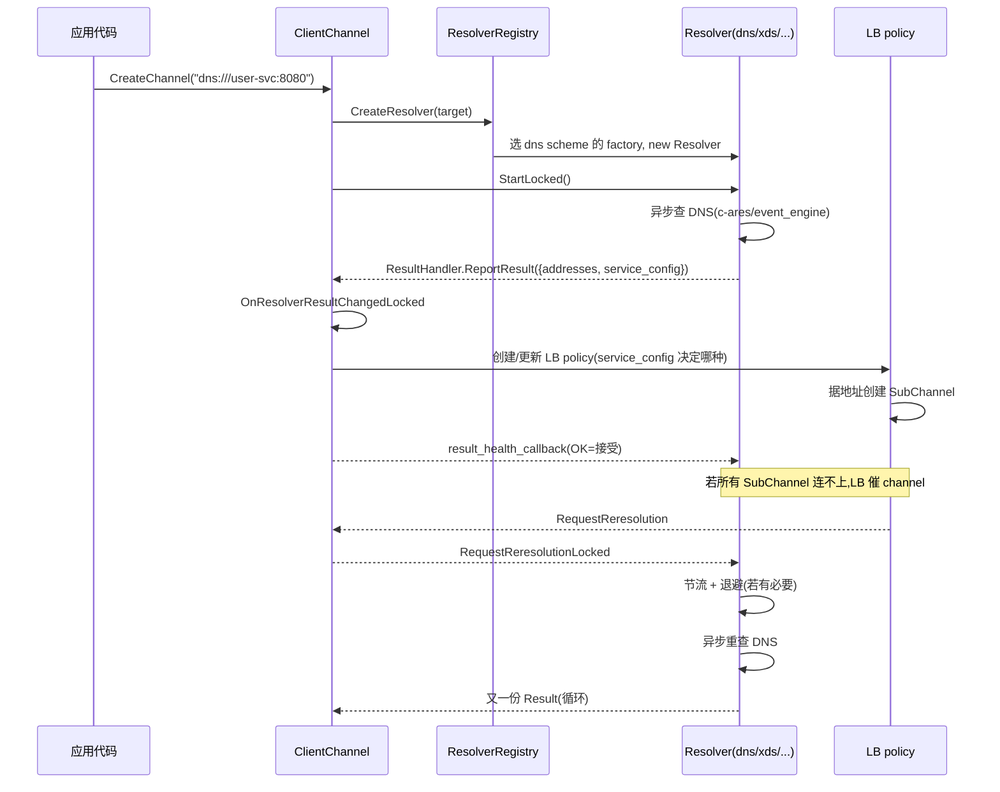

# 第 4 篇 · 第 13 章 · Resolver:名字到地址

> **核心问题**:你写下 `grpc.CreateChannel("dns:///user-svc:8080", ...)`,这个字符串里既没有 IP、也没有端口,gRPC 怎么把它变成一个能拨号的真实地址 `[ip:port]`?更关键的是——后端在不停滚动(扩容、缩容、灰度),客户端怎么在不重启进程的情况下,拿到最新的地址列表?还有一件很多人不知道的事:Resolver 还能顺手把"这次调用用什么负载均衡策略、什么时候重试、超时多少"这些**治理配置**一并下发。这一章讲清楚名字到地址的整条链路。

> **读完本章你会明白**:
> 1. `dns:///`、`xds:///`、`unix:`、`ipv4:` 这些 URI scheme 各自对应哪一类 Resolver,以及一个容易踩坑的事实——**1.83 里没有 passthrough 这个 scheme**,`unix:`/`ipv4:` 是同一个 `sockaddr_resolver` 在背后分身。
> 2. 为什么 Resolver 一定是**异步**的,而且 PollingResolver **不是定时轮询 DNS**(尽管名字里有 polling)——它是一套"一次性异步请求 + 节流 + 失败指数退避"的框架。
> 3. Service config 怎么搭着名字解析一起下发 LB 策略、retry 配置、timeout——这是 gRPC 治理的"控制面",也是微服务场景能动态调参的根。
> 4. channel 怎么订阅 Resolver 的结果,以及 LB policy 反过来怎么催 Resolver"再查一次"。

> **如果一读觉得太难**:先只记住三件事——① `target` 字符串靠 URI scheme 决定走哪个 Resolver;② Resolver 的核心动作是"把名字变成 EndpointAddresses 列表 + ServiceConfig",而且**异步**;③ DNS 在 C-core 默认走 c-ares,**默认不查 TXT**(service config 下发需要显式开启)。

---

## 〇、一句话点破

> **Resolver 是 gRPC 客户端治理链的入口:它把一个会变的字符串目标(`dns:///user-svc`),变成一份也会变的"地址清单 + 治理配置",并以异步、可重试、可订阅的方式交给下游。**

这是结论,不是理由。本章倒过来拆:先讲清"为什么要这么个东西",再讲 scheme 的选择(以及一些常见误解),然后看 PollingResolver 的异步骨架,最后讲 service config 怎么搭着下发。

---

## 一、为什么需要 Resolver:网络里没有"user-svc"这个名字

### 1.1 一个朴素的问题

写客户端代码时,你大概率不会硬编码 `10.0.3.42:8080`。原因很现实:

- **后端会动**:K8s 里 Pod 每次重启 IP 就变;服务扩容会加机器;灰度发布会切流量。
- **你不应该知道**:服务调用方关心的是"调 UserService",不是"调哪台机器"。把 IP 写死等于把"运维决策"焊进了代码。

所以 gRPC 让你写的是 `grpc.CreateChannel("user-svc:8080", ...)`,然后给你一个 Resolver 层,专门负责"把名字变地址"。这一层处理的就是:**名字(user-svc)→ 地址([ip:port, ip:port, ...])**。

### 1.2 不这样会怎样

> **不这样会怎样**:如果 gRPC 不提供 Resolver,你就只能自己在业务代码里:
> 1. 启动时 `getaddrinfo("user-svc")` 查一次 DNS,拿到一组 IP;
> 2. 把这组 IP 塞进某个客户端连接配置;
> 3. 监听 K8s API 的 Pod 变化,自己滚动更新连接;
> 4. 自己决定要不要缓存、缓存多久、查询超时多少;
> 5. 自己实现"DNS 查询失败时退避重试"。
>
> 这就是 Redis 客户端、MySQL 客户端那类"裸 TCP 库"的样子:服务发现是用户自己的事,每个项目各写一坨、各踩一堆坑(本地缓存不一致、查询打爆 DNS、退避同步重试风暴)。gRPC 把这些统统收进 Resolver,做成一个**可插拔的、有统一回灌接口**的子系统。

### 1.3 所以这样设计:Resolver 是个统一接口,换 scheme 等于换实现

gRPC 不绑死 DNS。它定义了一个抽象基类 `Resolver`(`src/core/resolver/resolver.h:49`),所有名字服务的实现(包括 DNS、xDS、Unix domain socket)都实现它。channel 只要拿到一个 `Resolver*` 就能用,根本不关心背后是 DNS 还是 xDS。

```cpp
// src/core/resolver/resolver.h:49
class Resolver : public InternallyRefCounted<Resolver> {
 public:
  struct Result {
    absl::StatusOr<EndpointAddressesList> addresses;            // 地址列表
    absl::StatusOr<RefCountedPtr<ServiceConfig>> service_config; // ★治理配置
    std::string resolution_note;
    ChannelArgs args;
    std::function<void(absl::Status)> result_health_callback;   // ★回灌:LB 收下了吗
  };
  class ResultHandler {
   public:
    virtual void ReportResult(Result result) = 0;               // 唯一结果出口
  };
  virtual void StartLocked() = 0;                               // 启动解析
  virtual void RequestReresolutionLocked() {}                   // 催"再查一次"
  virtual void ResetBackoffLocked() {}                          // 重置退避
  virtual void ShutdownLocked() = 0;
};
```

注意接口设计上的几个关键点:

1. **结果回灌是"推"模型**:`ResultHandler::ReportResult(Result)`。Resolver 拿到结果后主动推给 channel,而不是 channel 反复来 poll Resolver。这天然支持两种名字服务:
   - **pull-based**(DNS):Resolver 主动查一次、推一次。
   - **push-based**(xDS):Resolver 订阅了名字服务的推送,收到推送就 `ReportResult` 一次。这种 Resolver 甚至可以不实现 `RequestReresolutionLocked`(基类注释 `resolver.h:98-107` 明确说 push-based 可以 no-op)。
2. **有"反压"通道**:`result_health_callback`。channel(其实是 LB policy)处理完这个结果后,会回调告知 Resolver"我用上了"还是"我拒绝了"。如果是 polling-based 的 Resolver 收到"拒绝",它就知道结果有问题、要进退避重试。这是一条**闭环反馈**。
3. **所有 `Locked` 方法都在 `work_serializer` 里跑**:`work_serializer` 是 gRPC 自己实现的"逻辑单线程"——多个 channel 状态变更串行排进这个队列依次执行,避免多线程锁。Resolver 接口的设计前提就是这些方法都在同一个 work_serializer 里调,所以内部基本不需要锁。

> **钉死这件事**:Resolver 的接口形态(异步推送 + 反压回灌 + work_serializer 串行化)决定了它**永远不阻塞调用线程**——这是 gRPC 高并发的根。后面会看到,具体实现(PollingResolver)把这条原则贯彻到底。

---

## 二、URI scheme:你写的 `dns:///` 到底是哪个 Resolver

### 2.1 scheme 是怎么路由到 Resolver 的

你给 `grpc.CreateChannel` 的 target 字符串,gRPC 会先用 `URI::Parse` 解析成 URI,取它的 **scheme** 部分(`dns`、`xds`、`unix` 等),然后用这个 scheme 去 `ResolverRegistry` 里查对应的 `ResolverFactory`。逻辑在 `src/core/resolver/resolver_registry.cc:134-160`:

```cpp
// src/core/resolver/resolver_registry.cc(简化示意,非源码原文)
ResolverFactory* FindResolverFactory(const std::string& target, ...) {
  auto uri = URI::Parse(target);
  auto* factory = LookupByScheme(uri.scheme());          // 先按 scheme 查
  if (factory == nullptr) {                              // 查不到
    // 用 default_prefix 补上再试
    uri = URI::Parse(default_prefix + target);
    factory = LookupByScheme(uri.scheme());
  }
  return factory;
}
```

关键的一行是 `default_prefix`——它的默认值在 `resolver_registry.cc:66-69` 钉死了:

```cpp
// src/core/resolver/resolver_registry.cc:66
void ResolverRegistry::Builder::Reset() {
  state_.factories.clear();
  state_.default_prefix = "dns:///";
}
```

> **钉死这件事**:**默认前缀是 `dns:///`**。所以你写一个裸 target `"user-svc:8080"`,gRPC 会自动补成 `dns:///user-svc:8080`,走 DNS Resolver。这就是为什么大多数教程里 target 看起来没有 scheme、但其实背后走的是 DNS。

### 2.2 真实注册的 scheme 总表(逐个核实,有重要修正)

很多人(包括我写这本书之前的印象)以为 gRPC 内置了 `passthrough`、`uds`、`sockaddr` 等 scheme。我去 `src/core/plugin_registry/grpc_plugin_registry.cc:129-131` 和 `grpc_plugin_registry_extra.cc:42-62` 逐行核实了注册调用,并 grep 了每个 factory 的 `scheme()` 方法,**真实情况**是这样的:

| scheme 字符串 | 实现文件:行号 | 谁注册的 |
|---|---|---|
| `dns` | `dns/c_ares/dns_resolver_ares.cc:349`(三选一) | `RegisterDnsResolver`(`dns_resolver_plugin.cc:32`) |
| `ipv4` | `sockaddr/sockaddr_resolver.cc:114` | `RegisterSockaddrResolver`(`sockaddr_resolver.cc:184`) |
| `ipv6` | `sockaddr/sockaddr_resolver.cc:127` | 同上 |
| `unix` | `sockaddr/sockaddr_resolver.cc:141`(条件编译) | 同上 |
| `unix-abstract` | `sockaddr/sockaddr_resolver.cc:154`(条件编译) | 同上 |
| `vsock` | `sockaddr/sockaddr_resolver.cc:169`(条件编译) | 同上 |
| `xds` | `xds/xds_resolver.cc:1039` | `RegisterXdsResolver`(`xds_resolver.cc:1067`) |
| `google-c2p` | `google_c2p/google_c2p_resolver.cc:264` | `RegisterCloud2ProdResolver`(`google_c2p_resolver.cc:306`) |
| `google-c2p-experimental` | `google_c2p/google_c2p_resolver.cc:285` | 同上 |
| `fake` | `fake/fake_resolver.cc:234` | `RegisterFakeResolver`(`fake_resolver.cc:245`) |

三个必须钉死的修正:

1. **没有 `passthrough`**。全仓库 `src/core/resolver/` 下 grep `passthrough` **零命中**。早期博客或 grpc-java 文档里的 `passthrough:///` 在 C-core 不存在——裸 target 走的就是默认前缀 `dns:///`,无需一个专门的"透传"Resolver。
2. **`unix:`、`ipv4:`、`ipv6:`、`vsock:`、`unix-abstract:` 全是同一个 `sockaddr_resolver` 在背后分身**。`RegisterSockaddrResolver`(`sockaddr_resolver.cc:184-199`)一次性注册五个 factory,每个 `scheme()` 返回不同的字符串。`sockaddr` 本身不是 scheme,是"按地址族"一类 Resolver 的实现目录。
3. **`dns` 是三选一**:`c_ares`、`native`、`event_engine` 三套实现同名注册,由 `RegisterDnsResolver`(`dns_resolver_plugin.cc:32-67`)按编译开关和 channel arg(`GRPC_IOS_EVENT_ENGINE_CLIENT`、`IsEventEngineDnsEnabled()`、`ConfigVars::Get().DnsResolver()`)选一套。**同名只能注册一个**,重复注册会 `GRPC_CHECK` 失败。默认非 iOS 走 EventEngine。

### 2.3 各 scheme 的语义和典型场景

| scheme | 典型 target | 语义 | 用在哪 |
|---|---|---|---|
| `dns` | `dns:///user-svc:8080` | 查 A/AAAA/SRV/TXT 记录 | 最常见,K8s Service、consul DNS、原生 DNS 服务发现 |
| `dns` | `dns:///dns:///srv+_grpclb._tcp.user-svc` | 查 SRV 拿 grpclb balancer | 老 grpclb 场景 |
| `unix` | `unix:///var/run/foo.sock` | 一台机器内的 Unix domain socket | 本机 IPC,或 sidecar 注入 |
| `ipv4` | `ipv4:1.2.3.4:80,5.6.7.8:80` | 直接给地址(支持逗号多地址) | 测试、直连固定 IP |
| `ipv6` | `ipv6:[::1]:80` | 同上 IPv6 | 同上 |
| `xds` | `xds:///foo.ns.svc.cluster.local` | 走 xDS(Envoy/ISTIO)服务发现 | 服务网格、动态路由 |
| `google-c2p` | `google-c2p:///...` | Google Cloud C2P | GCP 专用 |
| `fake` | `fake:///...` | 测试用,可注入响应 | 单测 |

### 2.4 sockaddr_resolver:同步、一次性、无 service config

`ipv4`/`unix` 这类 Resolver 极其简单——它根本不是异步的。看 `sockaddr_resolver.cc:57-68`:

```cpp
// src/core/resolver/sockaddr/sockaddr_resolver.cc:57
void SockaddrResolver::StartLocked() {
  Result result;
  result.addresses = std::move(addresses_);   // 构造时已解析好
  result.args = std::move(channel_args_);
  result_handler_->ReportResult(std::move(result));  // 直接出结果
}
```

> **不这样会怎样**:Unix domain socket、固定 IP 这种场景,地址是写死的,**根本不需要异步、不需要重试、不需要订阅变更**。如果硬给它们套上 PollingResolver 的节流和退避框架,反而引入无意义的复杂度(还会让连接建立延迟 30 秒——PollingResolver 默认的 `min_time_between_resolutions`)。所以 sockaddr_resolver 直接绕过 PollingResolver,**构造时就把 URI 解析成 `EndpointAddresses` 列表存好,`StartLocked()` 一次性推出去**。
>
> 注意它**不下发 service config**(result 里没填 service_config 字段)。这也合理:本机 socket、固定 IP 这种场景,治理配置一般通过 channel arg 而非 DNS TXT 来传。

---

## 三、PollingResolver:不是"定时轮询",是"请求 + 节流 + 退避"

### 3.1 名字的陷阱

`PollingResolver`(`src/core/resolver/polling_resolver.h`)这个名字极容易误导。我一开始以为它是"每隔 N 秒主动查一次 DNS"的轮询器。读完源码才发现——**它根本不主动轮询**。文件头注释 `polling_resolver.h:40-42` 把这件事说得很直白:

```
// A base class for polling-based resolvers.
// Handles cooldown and backoff timers.
// Implementations need only to implement StartRequest().
```

它是个**基类**,处理的是"两次解析之间的节流(cooldown)"和"失败后的退避(backoff)"。具体发请求这件事(`StartRequest()`)交给子类。它**不会**自己定时去查——定时器的唯一作用是:

1. **节流**:用户(或 LB policy)反复催"再查一次"时,确保两次真实查询间隔不少于 `min_time_between_resolutions`(DNS 默认 30 秒)。
2. **退避**:上次查询失败后,等一个指数退避的时间再重试。

真正的"什么时候查"是**事件驱动**的——要么是 channel 启动时主动 `StartLocked()`,要么是 LB policy 发现所有后端都连不上时通过 `RequestReresolutionLocked()` 催一次。PollingResolver 只是给这些事件加了节流和退避的护栏。

> **钉死这件事**:**PollingResolver 不是定时轮询 DNS**。它是一个"被动响应再解析请求 + 节流 + 失败指数退避"的框架。子类只管发请求(`StartRequest()`),框架负责所有时序逻辑。这就是为什么"polling"在这里是"基于主动查询的解析器"的意思,和"定时 poll"无关。

### 3.2 异步不阻塞调用线程:跨线程结果靠 work_serializer 投递

DNS 查询是慢的——可能要几十毫秒甚至几秒,而且可能在 c-ares 内部用 socket 异步等待。Resolver 绝不能让调用线程(通常是发起 RPC 的业务线程)卡在这里。

PollingResolver 的设计:**查询在子类里完全异步**——子类的 `StartRequest()` 返回一个 `OrphanablePtr<Orphanable>`(可以理解为"可取消的请求句柄"),查询完成时子类在**任意线程**调用 `OnRequestComplete(Result)`。PollingResolver 收到后做的第一件事是把结果**投递回 work_serializer**:

```cpp
// src/core/resolver/polling_resolver.cc:140
void PollingResolver::OnRequestComplete(Result result) {
  Ref(DEBUG_LOCATION, "OnRequestComplete").release();
  work_serializer_->Run(                                    // ★关键:投递回 work_serializer
      [this, result]() mutable { OnRequestCompleteLocked(std::move(result)); });
}
```

> **不这样会怎样**:如果让子类(比如 c-ares 的回调)直接在 c-ares 工作线程里改 Resolver 的内部状态、调 channel 的更新逻辑,就会撞上两件事:① Resolver 的状态字段会被多线程并发访问,得加锁;② channel 那边的状态机(LB policy 切换、SubChannel 重建)也不在 c-ares 线程的"管辖范围"里,触发它们会造成调用链路跨线程跳跃、极难推理。
>
> 把结果通过 `work_serializer_->Run` 投递回去,本质是把"任意线程产生的结果"重新塞进那条**逻辑单线程**的队列,后续所有状态变更都在那里串行执行——**整个 Resolver 内部、以及 Resolver 到 channel 的所有路径,几乎不需要锁**。work_serializer 是 gRPC 这一类设计的中枢神经,SubChannel、LB policy 都遵循同样的规矩:状态变更统统进 work_serializer。

### 3.3 节流(cooldown):防"打爆 DNS"

后端连不上时,LB policy 会反复催 Resolver "再查一次"(`RequestReresolutionLocked`)。如果每次催都立刻查 DNS,客户端会瞬间打爆上游 DNS 服务器。PollingResolver 的护栏在 `MaybeStartResolvingLocked`(`polling_resolver.cc:210-238`):

```cpp
// src/core/resolver/polling_resolver.cc:210(简化示意)
void PollingResolver::MaybeStartResolvingLocked() {
  if (next_resolution_timer_handle_.has_value()) return;     // 已有定时器在等,直接 return
  if (last_resolution_timestamp_.has_value()) {
    const Timestamp earliest_next_resolution =
        *last_resolution_timestamp_ + min_time_between_resolutions_;
    const Duration time_until_next_resolution =
        earliest_next_resolution - Timestamp::Now();
    if (time_until_next_resolution > Duration::Zero()) {
      ScheduleNextResolutionTimer(time_until_next_resolution);  // 还没到时间,推迟
      return;
    }
  }
  StartResolvingLocked();                                     // 立刻查
}
```

逻辑很直白:**距上次真实查询不到 `min_time_between_resolutions`(DNS 默认 30 秒),就推迟到那个时刻再查**。这个值由 channel arg `GRPC_ARG_DNS_MIN_TIME_BETWEEN_RESOLUTIONS_MS` 控制。

### 3.4 反压回灌:result_health_callback

这是 PollingResolver 最巧妙的一环。查询完成、把结果推给 channel 后,PollingResolver **强制覆盖**了 result 里的 `result_health_callback` 字段(`polling_resolver.cc:167-172`):

```cpp
// src/core/resolver/polling_resolver.cc:167
GRPC_CHECK(result.result_health_callback == nullptr);
result.result_health_callback =
    [self = RefAsSubclass<PollingResolver>(
         DEBUG_LOCATION, "result_health_callback")](absl::Status status) {
      self->GetResultStatus(std::move(status));
    };
```

channel 处理完这个 result(把地址交给 LB、LB 试着建连)后,会调这个 callback,告知 Resolver"我用上了"(OK)或"我拒绝了"(非 OK)。GetResultStatus(`polling_resolver.cc:179-208`)根据这个反馈做不同的事:

- **OK**:`backoff_.Reset()` 重置退避;期间又来过 re-resolution 请求的话,触发下一次查询。
- **非 OK**:`backoff_.NextAttemptDelay()` 取下一个指数退避时长,`ScheduleNextResolutionTimer(delay)` 排个定时器。

> **所以这样设计**:channel 对 result 的"接受/拒绝"是一个真实的健康信号——channel 拒绝意味着"地址虽然解析出来了,但 LB 拿这些地址都连不上",这是上游服务真的有问题的信号。Resolver 应该据此退避重试,而不是把已经没用的结果反复重灌。这条**反压通道**让 Resolver 和 LB policy 形成闭环:LB 失败 → 告诉 Resolver → Resolver 退避 → 下次解析。

### 3.5 退避算法:与 SubChannel、retry 共用同一套 BackOff

DNS Resolver 的退避参数在 `dns/c_ares/dns_resolver_ares.cc:197-207` 钉死:

```cpp
// src/core/resolver/dns/c_ares/dns_resolver_ares.cc:200
BackOff::Options()
    .set_initial_backoff(Duration::Seconds(GRPC_DNS_INITIAL_CONNECT_BACKOFF_SECONDS))  // 1s
    .set_multiplier(GRPC_DNS_RECONNECT_BACKOFF_MULTIPLIER)    // 1.6
    .set_jitter(GRPC_DNS_RECONNECT_JITTER)                    // 0.2
    .set_max_backoff(Duration::Seconds(GRPC_DNS_RECONNECT_MAX_BACKOFF_SECONDS))  // 120s
```

算法和 SubChannel 退避、retry 退避**完全一样**(`src/core/util/backoff.cc:29-39` 的 `NextAttemptDelay`):首次 1s,之后每次 `×1.6` 上限 120s,再乘 `[0.8, 1.2)` 的均匀随机抖动。抖动是必须的——如果一堆客户端同时被 LB 告知"地址不行了",没有抖动会**同步退避、同步重试、二次雪崩**(thundering herd)。这套算法在 P4-14(SubChannel 退避)和 P4-16(retry 退避)还会再见面,gRPC 复用了同一个 `BackOff` 类。

---

## 四、DNS Resolver 的真身:c-ares 还是 EventEngine

`dns` 这套是绝大多数人会遇到的。1.83 里它有**三套实现**,运行时由 `RegisterDnsResolver`(`dns_resolver_plugin.cc:32-67`)按下面优先级挑一套:

1. iOS EventEngine(`GRPC_IOS_EVENT_ENGINE_CLIENT` 宏开启)
2. `IsEventEngineDnsEnabled()` 或 `ConfigVars::Get().DnsResolver() == "ares"` 之外的值 → EventEngine DNS
3. 否则 → c-ares

默认非 iOS 走 EventEngine DNS。但 c-ares 这条历史悠久、资料最多、行为最丰富,值得单独看看。

### 4.1 c-ares 怎么并发查三类记录

`AresClientChannelDNSResolver`(`dns_resolver_ares.cc:81`)继承自 PollingResolver,实现 `StartRequest()`(`dns_resolver_ares.cc:86`)。它内部用 `AresRequestWrapper`(`dns_resolver_ares.cc:89-185`)**并发**发起三类查询:

- **hostname** 查询(`dns_resolver_ares.cc:101-104`):`grpc_dns_lookup_hostname_ares(...)` 查 A/AAAA 记录。这是主路径。
- **SRV** 查询(`dns_resolver_ares.cc:111-116`):`grpc_dns_lookup_srv_ares(...)`,只在 `enable_srv_queries_`(默认 false)开启时查。SRV 用于 grpclb balancer 地址发现(老的 LB 服务发现机制)。
- **TXT** 查询(`dns_resolver_ares.cc:122-129`):`grpc_dns_lookup_txt_ares(...)`,**只在 `request_service_config_` 为 true 时查**。TXT 是 service config 的载体(下一节详述)。

三类查询并发发出,各自回调,等所有完成后再合结果。c-ares 自己负责把 socket 接到 EventEngine poller 上,完全异步。

### 4.2 ★一个关键的修正:service config 默认不从 DNS 来

很多人(我也是)以为"打开 DNS 解析就自动有 service config 下发"。读源码才知道**默认是关的**。看 `dns_resolver_ares.cc:208-211`:

```cpp
// src/core/resolver/dns/c_ares/dns_resolver_ares.cc:208
request_service_config_ = !args.GetBool(GRPC_ARG_SERVICE_CONFIG_DISABLE_RESOLUTION)
                              .value_or(true);   // ★默认 true = 禁用
```

**默认禁用**。你要在 channel arg 里显式设 `GRPC_ARG_SERVICE_CONFIG_DISABLE_RESOLUTION=false`,才会真的去查 TXT 记录。否则 `request_service_config_` 是 false,根本不发 TXT 查询。

> **钉死这件事**:**默认情况下 DNS Resolver 不查 TXT、不下发 service config**。要么用户显式开启 DNS TXT 查询,要么 service config 从 channel arg(`GRPC_ARG_SERVICE_CONFIG`)直接塞 JSON 进来,要么走 xDS(由 xds_resolver 通过 LDS/RDS 下发)。这是 service config 三条来源路径,不要混。

native DNS 路径(`dns/native/dns_resolver.cc:58`)更干脆——它**完全不解析 service_config**,只填 `result.addresses` 和 `result.args`(`dns/native/dns_resolver.cc:111-132`)。如果你跑在 native DNS 模式,DNS 这条路就只给你地址,治理配置必须从别处来。

---

## 五、Service config:搭着名字解析下发的"治理控制面"

### 5.1 它是什么

Service config 是 gRPC 治理的"控制面"——一份 JSON,描述这次调用的:

- **loadBalancingConfig**:用哪个 LB 策略,以及该策略的参数(比如 weighted_round_robin 的权重更新周期)。
- **methodConfig[]**:每个方法的 timeout、maxRequestMessageBytes、maxResponseMessageBytes、retry policy(P4-16 详述)。
- **retryThrottling**:节流全局参数(P4-16 详述)。

文件头注释 `src/core/service_config/service_config.h:29-51` 直接给了 JSON 结构样例:

```json
{
  "loadBalancingConfig": [{ "round_robin": {} }],
  "methodConfig": [
    {
      "name": [{ "service": "Foo", "method": "Bar" }],
      "waitForReady": true,
      "timeout": "1s",
      "maxRequestMessageBytes": 1024,
      "retryPolicy": {
        "maxAttempts": 4,
        "initialBackoff": "0.1s",
        "maxBackoff": "1s",
        "backoffMultiplier": 2,
        "retryableStatusCodes": ["UNAVAILABLE"]
      }
    }
  ]
}
```

### 5.2 三态语义:一个 StatusOr 的精妙用法

`Resolver::Result::service_config` 的类型是 `absl::StatusOr<RefCountedPtr<ServiceConfig>>`,默认 `nullptr`(`resolver.h:56`)。这**一个字段三种语义**:

| 状态 | 含义 | channel 怎么处理 |
|---|---|---|
| `nullptr`(默认) | Resolver 没下发 service config | channel 用自己的 `default_service_config_`(一般是 channel arg 里设的,或全默认) |
| 非 OK status | Resolver 解析 service config 失败(比如 DNS TXT 返回了非法 JSON) | channel 回退到上次成功的 `saved_service_config_`,或进 TRANSIENT_FAILURE |
| OK 且非空 | 有效的 ServiceConfig | channel 直接用 |

三种状态对应的 channel 处理逻辑在 `src/core/client_channel/client_channel.cc:1180-1213`。这种"用 `StatusOr<T>` + 默认 nullptr 表达三态"的用法在 gRPC 源码里很常见,值得记住。

### 5.3 三条来源路径

1. **DNS TXT 记录**(c-ares / event_engine 路径):DNS Resolver 在 TXT 记录里查到 service config JSON,用 `ChooseServiceConfig`(`dns_resolver_ares.cc:306-323`)按 client attribute(`GRPC_ARG_DNS_SERVICE_CONFIG_NAME`)挑出匹配的一条,`ServiceConfigImpl::Create` 解析。**默认禁用**,需显式 `GRPC_ARG_SERVICE_CONFIG_DISABLE_RESOLUTION=false`。
2. **channel arg `GRPC_ARG_SERVICE_CONFIG`**:用户在 channel args 里直接塞 service config JSON 字符串。适合本地配置场景。
3. **xDS**:`xds_resolver` 通过 LDS/RDS/CDS 从控制面(Envoy/Istio)动态下发。这是服务网格场景的主流方式(P6-22 详述)。

### 5.4 为什么把治理配置搭在 Resolver 上

> **不这样会怎样**:如果治理配置(LB 策略、retry 配置)只能在 channel 创建时静态传入(`grpc.CreateChannel` 的 channel args),那么运维想改"这个服务用 round_robin 还是 weighted_round_robin"、"这个方法的 timeout 从 1s 改成 500ms",就必须**重启所有客户端进程**。在微服务场景里这是灾难——一次配置滚动可能影响几十个服务、几千个实例。
>
> 把治理配置挂在 Resolver 上,就能让它**和地址一起、随名字解析的结果动态更新**:Resolver 推一份新 result,channel 看到新的 service_config,就 live 地重建 LB policy、更新 retry 配置——所有客户端都不重启。这就是为什么 gRPC 把 Resolver 设计成"异步推送 + 可订阅"——它不只是地址发现,是整个治理控制面的入口。

> **钉死这件事**:Resolver 一次推回的 `Result`,不只是地址,还有**整套治理配置**。这是 gRPC 微服务治理能"动态生效、无需重启"的根。

---

## 六、Resolver 怎么接入 channel

### 6.1 channel 创建时拉起 Resolver

`ClientChannel::CreateResolverLocked`(`src/core/client_channel/client_channel.cc:1035-1051`):

```cpp
// src/core/client_channel/client_channel.cc:1035(简化示意)
void ClientChannel::CreateResolverLocked() {
  ...
  resolver_ = CoreConfiguration::Get().resolver_registry().CreateResolver(
      uri_to_resolve_, channel_args_, /*pollset_set=*/nullptr, work_serializer_,
      std::make_unique<ResolverResultHandler>(
          WeakRefAsSubclass<ClientChannel>()));   // ★桥接器
  UpdateStateLocked(GRPC_CHANNEL_CONNECTING, ...);
  resolver_->StartLocked();
}
```

注意两件事:

1. **`pollset_set` 传的是 nullptr**(`client_channel.cc:1040`)。这是历史遗留参数——早期 Resolver 用 grpc poller,需要 pollset_set;新版全面切到 EventEngine,这个参数已经没用了。源码里它依然是接口签名的一部分,但实际创建 Resolver 时不传。
2. **`ResolverResultHandler` 是个桥接器**(`client_channel.cc:105-127`),持有 ClientChannel 的弱引用,`ReportResult` 直接调 `OnResolverResultChangedLocked`。这就是 Resolver 推结果回 channel 的入口。

### 6.2 处理结果:选 LB policy、更新 SubChannel

`OnResolverResultChangedLocked`(`client_channel.cc:1143-1281`)做四件事:

1. 处理 service_config(三态语义,见 5.2)。
2. 从 service_config 拿到 LB policy 配置,选/创建对应的 LB policy(`ChooseLbPolicy`,`client_channel.cc:1086-1099`)。
3. 把新地址列表交给 LB policy(`UpdateLocked`)。LB policy 据此创建/销毁 SubChannel(P4-14)。
4. 调用 result 的 `result_health_callback`(`client_channel.cc:1271-1272`)告知 Resolver"我用上了"——这就是反压闭环。

### 6.3 反向:LB policy 催 Resolver 再查

当 LB policy 发现所有 SubChannel 都连不上、或者 `RequestReresolutionLocked` 被显式调用,channel 会把请求转给 Resolver(`client_channel.cc:527-531`):

```cpp
// src/core/client_channel/client_channel.cc:527
if (client_channel_->resolver_ == nullptr) return;   // shutting down
...
client_channel_->resolver_->RequestReresolutionLocked();
```

这条路径**配合 PollingResolver 的节流**——LB 可以疯狂催,PollingResolver 会按 `min_time_between_resolutions` 节流到合理频率,不会打爆上游名字服务。

### 6.4 整条链路时序



---

## 七、技巧精解:Resolver 的两个第一性设计

本章没有像 HPACK 那样的复杂算法技巧,但有两个**架构层面的第一性设计**值得单独钉死——它们是整个 gRPC 治理链能成立的地基。

### 技巧一:work_serializer——靠"逻辑单线程"省掉几乎所有锁

Resolver 接口里所有 `Locked` 后缀的方法都要求在 `work_serializer` 里调。`work_serializer` 是 gRPC 自己实现的一个**逻辑串行化队列**(`src/core/lib/work_serializer/`):提交进来的 closure 一个一个执行,保证同一个 work_serializer 上的所有操作串行。

> **不这样会怎样**:Resolver、channel、LB policy、SubChannel 这一套子里的状态字段(`Resolver::next_resolution_timer_handle_`、`ClientChannel::lb_policy_`、`LoadBalancingPolicy::subchannels_` 等)会被多方访问:Resolver 工作线程、c-ares 回调线程、连接事件回调线程、应用线程。如果靠锁来保护,会有两个后果:
>
> 1. **锁竞争**:每个状态访问都要 lock/unlock,QPS 上去后锁本身成瓶颈。
> 2. **死锁风险**:跨多个子系统持有多个锁的顺序很难统一,gRPC 这么多状态字段几乎不可避免死锁。
>
> 把所有状态变更都投递进 work_serializer 串行执行,**所有"逻辑"在同一个上下文里发生**,字段访问天然无并发——这是 gRPC 治理子系统几乎不需要锁的根。代价是状态变更要排队(没有真并行),但这些操作都极轻(改个字段、塞个队列),串行完全够用。这是一种**用串行化换简单性**的设计权衡。

跨线程产生结果的入口(比如 `PollingResolver::OnRequestComplete`,`polling_resolver.cc:140`)做的第一件事就是 `work_serializer_->Run(...)`,把任意线程的结果重新塞回这条逻辑单线程。

### 技巧二:反压闭环——result_health_callback 的设计

前面 3.4 节已经讲过。这里强调的是**它为什么是一个"闭环"**:Resolver → channel(LB) → 反馈 → Resolver 退避。这种闭环让 Resolver 知道"我给的结果好不好用",而不是傻乎乎地把可能失效的地址反复灌进去。

反面对比:**很多老式服务发现客户端没有这条闭环**——它们只管定时 push 地址给客户端,不管客户端连不连得上。结果是 DNS 暂时返回了一组坏地址(比如已经下线的 IP),客户端反复尝试、反复失败,而 Resolver 还在按 30 秒节奏悠闲地重灌同样的坏地址。gRPC 的闭环让这种情况发生时 Resolver 立刻进入指数退避(1s → 1.6s → 2.56s → ... → 120s),而不是继续 30 秒一次的固定节奏,极大缩短了"坏地址被替换"的时间窗口。

闭环的实现极为精简:就是 PollingResolver 在 result 里塞一个 lambda(`polling_resolver.cc:168-172`),channel 用完结果后调它。这种**通过 callback 携带反向信号**的手法在 gRPC 里反复出现,P4-15 的 Picker::Pick 返回 PickResult(带 subchannel_call_tracker)也是同一思路。

---

## 八、章末小结

### 回扣主线

本章是第 4 篇(客户端治理)的第一章,讲的是治理链的**入口**:把一个会变的字符串目标,变成一份也会变的"地址清单 + 治理配置"。它服务二分法的**框架层(治理)**——Resolver 不直接碰协议(不编字节、不发 HTTP/2 帧),但它决定了"调用要发去哪、用什么策略发、失败怎么办"——这是"把网络字节变回可调用、可治理的方法"那一面。

P2 篇已经把 transport 建好(HTTP/2 流、HPACK、framing、flow control),本章在 transport 之上加了一层:"这次调用要发去哪"。后面 P4-14(SubChannel)讲"一个地址怎么变成一条可用的连接",P4-15(LB)讲"多个连接挑哪个",P4-16(retry)讲"失败了怎么办"——这四章一起构成完整的客户端治理链。

### 五个为什么

1. **为什么 Resolver 一定是异步的?**——名字解析可能很慢(几十毫秒到秒级)且需要异步等待(网络查询、xDS 长连接推送),阻塞调用线程(业务 RPC 线程)会让整个进程吞吐崩塌。所以 Resolver 用"推"模型(`ResultHandler::ReportResult`),所有跨线程结果通过 work_serializer 投递回逻辑单线程。
2. **为什么默认前缀是 `dns:///`,裸 target 也走 DNS?**——因为 DNS 是公网、K8s、consul 的通用名字服务,绝大多数场景就靠它。把默认设成 DNS 让用户写 `grpc.CreateChannel("user-svc:8080")` 就能直接跑,不强制写 scheme。
3. **为什么 PollingResolver 不是定时轮询 DNS?**——定时轮询既浪费(DNS 没变也查)、又不能及时(变了一秒内查不到)。事件驱动(启动时查、LB 催时查)+ 节流(两次至少隔 30 秒)+ 退避(失败指数退避)的组合,既及时又不过载。
4. **为什么 service config 搭在 Resolver 上而不是单独的 API?**——搭在 Resolver 上能让治理配置随名字解析**一起、动态地**更新——运维改 LB 策略、retry 配置、timeout,客户端不重启就生效。这是微服务治理"动态控制面"的根。
5. **为什么要有 result_health_callback 这条反压通道?**——Resolver 推的结果可能"解析成功但地址实际不可用"(比如 DNS 缓存了已下线的 IP)。没有反压,Resolver 会按固定节奏反复灌坏地址;有了反压,channel(其实 LB)告诉 Resolver"我用不上",Resolver 立刻进指数退避,缩短坏地址的存活窗口。

### 想继续深入往哪钻

- 想看 c-ares 怎么把 socket 接到 EventEngine:`src/core/resolver/dns/c_ares/grpc_ares_ev_driver_{posix,windows}.cc`。
- 想看 EventEngine DNS 实现:`src/core/resolver/dns/event_engine/`。
- 想看 xDS Resolver 怎么从 LDS/RDS 拿地址和路由:`src/core/ext/xds/xds_resolver.cc`。
- 想看 service config 解析的全套字段:`src/core/service_config/service_config.h` 文件头注释,以及 `src/core/client_channel/client_channel_service_config.cc`。
- 想动手感受:用 `GRPC_ARG_DNS_MIN_TIME_BETWEEN_RESOLUTIONS_MS=1000` 把节流调短,加 trace flag `GRPC_TRACE=resolver_refcount,dns_resolver`,看 Resolver 的解析节奏。
- 想理解 work_serializer 的实现:`src/core/lib/work_serializer/work_serializer.cc`。

### 引出下一章

Resolver 把名字变成了"一组 `EndpointAddresses`",但 channel 还不能直接发字节——它还需要把每个"地址"变成"一条活的连接"(TCP 三次握手、TLS 握手、HTTP/2 SETTINGS 协商、断线重连)。这件事就是 SubChannel 的活。下一章 P4-14,我们看一个后端地址怎么被抽象成可建连、可复用、可重连的 SubChannel,以及多个 channel 怎么通过一个全局连接池共享同一条后端连接、省下 TCP 握手和内核连接数。

> **下一章**:[P4-14 · SubChannel:一条后端连接](P4-14-SubChannel-一条后端连接.md)
