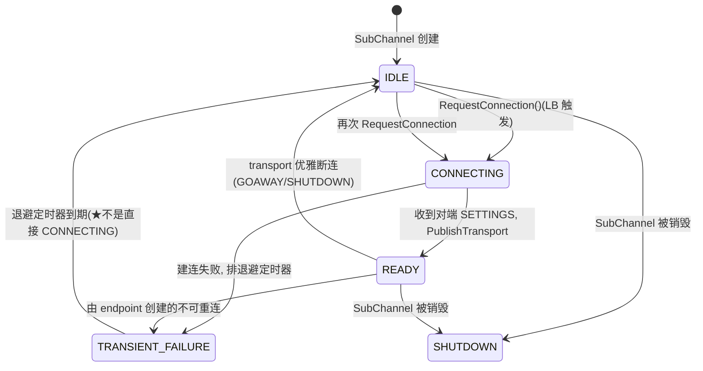

# 第 4 篇 · 第 14 章 · SubChannel:一条后端连接

> **核心问题**:上一章 Resolver 把名字变成了一个 `EndpointAddresses` 列表。但拿到一个 `ip:port` 离"能发字节"还差很远——TCP 三次握手没做、TLS 没做、HTTP/2 前置 SETTINGS 没交换、断线了怎么重连也不知道。SubChannel 就是把"一个地址"变成"一条活的、可复用的、可重连的连接"的抽象。更进一步,如果两个 channel 都连同一个后端,能不能共享一条 TCP 连接省下握手和内核连接数?SubChannel 复用池就是干这个的。

> **读完本章你会明白**:
> 1. 一个后端实例怎么被抽象成 SubChannel,以及它那套连接状态机(IDLE → CONNECTING → READY → TRANSIENT_FAILURE)——还有几个**容易踩坑的事实**:退避到期是回到 IDLE 而不是直接重连;建连"成功"的标志是收到对端 HTTP/2 SETTINGS 帧,不是 TCP 握手完成。
> 2. 多个 channel 怎么通过 **GlobalSubchannelPool** 共享同一条后端连接——核心是"存弱引用 + 强引用计数归零自动回收",以及一个非平凡的细节:复用的 key 不只是地址,还包括 channel args(但部分 args 被故意剥掉以放宽复用条件)。
> 3. 连接失败后怎么退避重连:指数退避(1s × 1.6,封顶 120s)+ ±20% 抖动,而且抖动是**乘性的不是加性的**。
> 4. 1.83 里其实有**两套** SubChannel 实现——`OldSubchannel`(默认)和 `NewSubchannel`(实验性,支持一个 SubChannel 多条连接做横向扩展),由 experiment 开关切换。

> **如果一读觉得太难**:先只记住三件事——① SubChannel = 一个后端地址 + 一条连接(可能没有)+ 一套状态机;② IDLE/CONNECTING/READY/TRANSIENT_FAILURE 四态,LB 策略据此挑后端;③ 两个 channel 默认会共享同一条后端连接(global pool 默认开)。

---

## 〇、一句话点破

> **SubChannel 是一个后端实例的客户端抽象:它把"一个 `ip:port`"封装成"一条可建、可断、可重连的连接",并对外暴露一套连接状态机,让负载均衡策略据此挑后端。它的复用池让多个 channel 默认共享同一条后端 TCP 连接,这是 gRPC 在连接数维度做"省"的关键设计。**

这是结论,不是理由。本章倒过来拆:先看 SubChannel 要解决什么(把地址变成可用连接),再看连接状态机的细节(以及几个反直觉的事实),然后看复用池的"弱引用 + 强引用计数"机制,最后看退避算法。

---

## 一、为什么需要 SubChannel:地址 ≠ 连接

### 1.1 一个 `ip:port` 离"能发字节"有多远

Resolver 给你一个 `EndpointAddresses`,内部是 `ip:port`。但你想用它发一条 gRPC 调用,中间还有一堆事要做:

1. **TCP 三次握手**——内核要给对端发 SYN、收 SYN-ACK、回 ACK,这一来一回至少一个 RTT。
2. **TLS 握手**(如果用 HTTPS)——1~2 个 RTT,加密参数协商、证书验证。
3. **HTTP/2 前置交换**——客户端和服务端互相发 SETTINGS 帧,协商流控窗口、HPACK 动态表大小、最大并发流等。
4. **失败重连**——网络抖动、对端重启、负载均衡器空闲超时,这些都会让连接挂掉,要能自动重连。
5. **状态暴露**——上层(LB policy)需要知道这条连接是 IDLE、CONNECTING、READY 还是挂了,才能决定要不要往这条连接上发调用。

这些事每一件都不简单。SubChannel 就是把它们**打包成一个抽象**:对 LB policy 来说,看到的是一个 `Subchannel*`,可以调它的 `RequestConnection()` 触发建连,可以 `WatchConnectivityState()` 订阅它的状态变化,可以在它 READY 之后用它发 call——所有建连、TLS、HTTP/2、重连的脏活都在 SubChannel 内部。

> **不这样会怎样**:如果让每个 LB policy 自己处理"地址 → 连接"的所有细节,那么 round_robin、weighted_round_robin、ring_hash 每个策略都要重复实现 TCP 握手、TLS、HTTP/2 SETTINGS、重连退避。这违反"分层"原则,代码重复且各处容易出 bug。把"一条后端连接"封装成 SubChannel,让所有 LB 策略共用同一套连接管理逻辑,是 gRPC 客户端治理能保持简洁的根。

### 1.2 SubChannel 与 connector、transport 的分工

SubChannel 自己不直接调 socket API 建连。它持有一个 `SubchannelConnector`(`src/core/client_channel/connector.h:38`),由后者负责实际建连。1.83 里 HTTP/2 场景的实现是 `Chttp2Connector`(`src/core/ext/transport/chttp2/client/chttp2_connector.cc`)。三方分工:

- **SubChannel**:管状态机、退避、复用、给 LB 暴露状态。**不碰具体协议。**
- **SubchannelConnector**:编排建连流程(取 endpoint → handshake → 创建 transport)。**不碰协议细节。**
- **handshaker registry**:真正调 TCP/SSL/http2 handshaker。这里才是 socket 和 TLS 真正发生的地方。
- **chttp2 transport**:建连成功后,所有字节级别的 HTTP/2 帧编解码都在这里(P2 篇的主角)。

接口定义(`connector.h:38-82`)极简:

```cpp
// src/core/client_channel/connector.h:38
class SubchannelConnector : public InternallyRefCounted<SubchannelConnector> {
 public:
  struct Args {
    grpc_resolved_address* address;        // 拨哪个地址
    grpc_pollset_set* interested_parties;
    Timestamp deadline;                    // 建连超时
    ChannelArgs channel_args;
  };
  struct Result {
    Transport* transport = nullptr;        // 建连成功后填 transport
    ChannelArgs channel_args;
    uint32_t max_concurrent_streams;
  };
  virtual void Connect(const Args& args, Result* result, grpc_closure* notify) = 0;
  virtual void Shutdown(grpc_error_handle error) = 0;
};
```

`Connect` 是异步的——发起后立刻返回,connector 在建连完成(成功或失败)后调度 `notify` closure。SubChannel 在这个 closure 里检查 `result->transport` 是不是 nullptr,据此切状态(下一节)。

---

## 二、连接状态机:四个状态,几个反直觉的事实

### 2.1 状态枚举与字段

SubChannel 的连接状态用 `grpc_connectivity_state` 表示,有五个值,但 SubChannel 只用四个(SHUTDOWN 是关闭时的终态)。状态字段在 `subchannel.h:412-420`:

```cpp
// src/core/client_channel/subchannel.h:412(OldSubchannel)
// Connectivity state tracking.
// Note that the connectivity state implies the state of the Subchannel object:
// - IDLE: no retry timer pending, can start a connection attempt at any time
// - CONNECTING: connection attempt in progress
// - READY: connection attempt succeeded, connected_subchannel_ created
// - TRANSIENT_FAILURE: connection attempt failed, retry timer pending
grpc_connectivity_state state_ ABSL_GUARDED_BY(mu_) = GRPC_CHANNEL_IDLE;
absl::Status status_ ABSL_GUARDED_BY(mu_);
```

注释本身就把状态语义钉死了。**初始状态是 IDLE**——这是另一个反直觉点:SubChannel 创建出来不会主动建连,要等 LB policy 显式调 `RequestConnection()`。

### 2.2 状态机图



### 2.3 状态切换的真实位置(逐行核实)

| 切换 | 行号 | 触发函数 | 何时发生 |
|------|------|---------|---------|
| →CONNECTING | `subchannel.cc:885` | `StartConnectingLocked` | LB 调 `RequestConnection`,且当前 IDLE |
| →TRANSIENT_FAILURE | `subchannel.cc:926` | `OnConnectingFinishedLocked` | 建连失败(`result->transport == nullptr` 或 `PublishTransport` 失败) |
| →READY | `subchannel.cc:1024` | `PublishTransportLocked` | 收到对端 SETTINGS,transport 拿到并发布 |
| →IDLE(从 TF) | `subchannel.cc:876` | `OnRetryTimerLocked` | 退避定时器到期 |
| →IDLE/TF(从 READY) | `subchannel.cc:543-545` | `ConnectedSubchannelStateWatcher::OnConnectivityStateChange` | transport 反向通知断连 |

### 2.4 ★反直觉事实一:退避到期回 IDLE,不是直接重连

这是 SubChannel 状态机里**最反直觉的一点**。看 `OnRetryTimerLocked`(`subchannel.cc:871-877`):

```cpp
// src/core/client_channel/subchannel.cc:871
void OldSubchannel::OnRetryTimerLocked() {
  if (shutdown_) return;
  GRPC_TRACE_LOG(subchannel, INFO)
      << "subchannel " << this << " " << key_.ToString()
      << ": backoff delay elapsed, reporting IDLE";
  SetConnectivityStateLocked(GRPC_CHANNEL_IDLE, absl::OkStatus());  // ★回 IDLE
}
```

退避定时器到期后,**只把状态设回 IDLE,不会自动重新 CONNECTING**。要等下一次 `RequestConnection()`(由 LB policy 主动触发,或被 client_channel 的"想连"逻辑触发)才会重新进入 CONNECTING。

> **不这样会怎样**:如果退避到期直接重连,那么 SubChannel 就完全自治了——它会无脑尝试重连,即使上层(LB policy)已经不想要这条连接(比如这个后端已经被剔除出地址列表)。把"是否重连"的决策权留给上层,让 SubChannel 只负责"我现在能不能连、连得怎么样",才符合分层原则。LB policy 看到这个 SubChannel 回到 IDLE 了,可以决定"继续催它连"(`RequestConnection`)或"放弃它"(销毁 SubChannel)。

这同时也解释了为什么"全 TF 的 channel 会持续停在一个失败状态"——SubChannel 自己不主动重连,只有 LB policy(或 client_channel)继续催,它才会再次尝试。这是 gRPC 故意把控制权放在策略层的设计。

### 2.5 ★反直觉事实二:建连"成功"= 收到对端 SETTINGS,不是 TCP 握手完成

很多人以为 SubChannel 进 READY 是 TCP 握手完成的那一刻。读完 `Chttp2Connector` 才知道**远不止**。`Chttp2Connector::Connect`(`chttp2_connector.cc:110-155`)的流程:

1. 取或创建 EventEngine endpoint(可能用 channel arg 里已有的,比如代理场景)。
2. 把目标地址塞进 channel args(`GRPC_ARG_TCP_HANDSHAKER_RESOLVED_ADDRESS`,`chttp2_connector.cc:142`)。
3. 创建 `HandshakeManager`,从 `handshaker_registry` 拉取所有 client 端 handshaker(TCP / SSL / http2 / ALTS 等)。
4. 调 `handshake_mgr_->DoHandshake(...)`(`chttp2_connector.cc:149`),异步开始握手。
5. 握手成功后,在 `OnHandshakeDone`(`chttp2_connector.cc:166`)里 `grpc_create_chttp2_transport(...)`(`chttp2_connector.cc:182`)真正创建 chttp2 transport。
6. 调 `grpc_chttp2_transport_start_reading(...)`,**注册一个回调等对端的 SETTINGS 帧**(`chttp2_connector.cc:186-192`):
   ```cpp
   grpc_chttp2_transport_start_reading(
       result_->transport, (*result)->read_buffer.c_slice_buffer(),
       [self = RefAsSubclass<Chttp2Connector>()](absl::StatusOr<uint32_t> max_concurrent_streams) {
         self->OnReceiveSettings(max_concurrent_streams);   // ★收到 SETTINGS 才算完成
       }, ...);
   ```
7. `OnReceiveSettings` 才会调度 `notify` closure,SubChannel 收到后 `PublishTransportLocked` → READY。

> **钉死这件事**:**SubChannel 进 READY 表示这条 HTTP/2 连接真的能用了**——不仅 TCP 握手完成、TLS 握手完成,而且收到了对端发来的 HTTP/2 SETTINGS 帧。这是一个保守但正确的判定:只有在 HTTP/2 协议层确认双向能通信之后,才告诉 LB"这条连接可以发调用"。如果只判 TCP 握手完成,会有"TCP 通了但 HTTP/2 协议层有兼容性问题"的窗口期,LB 真发 call 时才发现问题,体验更差。

### 2.6 RequestConnection 只在 IDLE 才生效

LB 想触发建连,调 `Subchannel::RequestConnection`。但 OldSubchannel 的实现(`subchannel.cc:779-784`)只在 IDLE 状态才启动:

```cpp
// src/core/client_channel/subchannel.cc:779
void OldSubchannel::RequestConnection() {
  MutexLock lock(&mu_);
  if (state_ == GRPC_CHANNEL_IDLE) {
    StartConnectingLocked();
  }
}
```

> **不这样会怎样**:如果允许在 CONNECTING 状态再次触发建连,会有两个建连同时在跑——既浪费资源,又可能让两条 transport 同时发布,行为难以预测。把"启动建连"限制在 IDLE 一次,后续状态切换由建连结果(成功进 READY、失败进 TF + 退避)驱动,状态机才确定。

### 2.7 StartConnectingLocked 的细节

`StartConnectingLocked`(`subchannel.cc:879-894`)的完整逻辑:

```cpp
// src/core/client_channel/subchannel.cc:879
void OldSubchannel::StartConnectingLocked() {
  const Timestamp now = Timestamp::Now();
  const Timestamp min_deadline = now + min_connect_timeout_;
  next_attempt_time_ = now + backoff_.NextAttemptDelay();    // ★算退避
  SetConnectivityStateLocked(GRPC_CHANNEL_CONNECTING, absl::OkStatus());
  SubchannelConnector::Args args;
  args.address = &address_for_connect_;
  args.interested_parties = pollset_set_;
  args.deadline = std::max(next_attempt_time_, min_deadline);  // 建连超时
  args.channel_args = args_;
  WeakRef(DEBUG_LOCATION, "Connect").release();   // ref 由回调持有
  connector_->Connect(args, &connecting_result_, &on_connecting_finished_);
}
```

注意两个关键点:

1. **`next_attempt_time_` 在 CONNECTING 阶段就算好了**——`backoff_.NextAttemptDelay()` 立刻算下一次退避时长。如果建连失败,`OnConnectingFinishedLocked`(`subchannel.cc:916-917`)用 `next_attempt_time_ - Now()` 作为退避定时器时长。这意味着如果建连花的时间已经超过了退避时长,**定时器一到期就立刻触发**(注释 `subchannel.cc:912-914` 明说了这一点)。
2. **`min_connect_timeout_` 和退避是两回事**——`min_connect_timeout_` 默认 20s(`GRPC_SUBCHANNEL_RECONNECT_MIN_TIMEOUT_SECONDS`),是**单次建连本身的超时**,不是退避。`args.deadline` 取退避时间和 min_connect_timeout 的较大值,保证建连有足够时间完成。

### 2.8 反向通知:transport 断连怎么告诉 SubChannel

SubChannel 进了 READY,但连接可能随时断(GOAWAY、网络中断、对端重启)。`PublishTransportLocked`(`subchannel.cc:948-1025`)在创建 transport 后,会注册一个 `ConnectedSubchannelStateWatcher`(`subchannel.cc:1019-1022`)订阅 transport 的状态变化:

```cpp
// src/core/client_channel/subchannel.cc:1019(简化示意)
connected_subchannel_->StartWatch(pollset_set_,
    MakeOrphanable<ConnectedSubchannelStateWatcher>(...));
SetConnectivityStateLocked(GRPC_CHANNEL_READY, absl::Status());  // 1024
```

transport 断连时,这个 watcher 被回调(`subchannel.cc:497-553`)。处理逻辑(`subchannel.cc:522-547`)区分两类断连:

- **优雅关闭**(transport 先报 TRANSIENT_FAILURE 再报 SHUTDOWN,典型是收到 GOAWAY):切到 IDLE。
- **非优雅断连**(直接 SHUTDOWN):同样切到 IDLE。
- **由 endpoint 创建的 SubChannel**(`created_from_endpoint_ == true`,比如代理场景):**永久停在 TRANSIENT_FAILURE,不重连**(`subchannel.cc:543-545`)。这类 SubChannel 没有重建连接的能力,因为 endpoint 不是它自己建的。
- 同时 `backoff_.Reset()`(`subchannel.cc:547`)——READY 后断连重置退避,下次连从 1s 开始。

> **钉死这件事**:SubChannel 状态变更有**两个方向**:① LB/上层催建连触发的"正向"切换(IDLE→CONNECTING→READY/TF);② transport 自己断连反向通知的"反向"切换(READY→IDLE/TF)。两条路径都通过 `SetConnectivityStateLocked` → `watcher_list_.NotifyLocked` 通知所有订阅者(LB policy)。这是观察者模式,SubChannel 不知道也不关心谁在订阅。

### 2.9 NewSubchannel:实验性的"一条 SubChannel 多连接"

1.83 里还有一套 `NewSubchannel`(`subchannel.h:444`)实现,由 experiment 开关 `IsSubchannelConnectionScalingEnabled()`(`src/core/lib/experiments/experiments.h:666-668`,**默认关闭**)切换。它的关键差异:

- **不显式存储状态,而是派生**:`ComputeConnectivityStateLocked`(`subchannel.cc:2045-2060`)根据 `connections_`、`connection_attempt_in_flight_`、`retry_timer_handle_` 现算状态。
- **支持一个 SubChannel 多条连接**(`std::vector<RefCountedPtr<ConnectedSubchannel>> connections_`,`subchannel.h:657`):有任意一条就 READY。这是"connection scaling"实验的初衷——当一个 SubChannel 对应的后端吞吐很高、单 TCP 连接成为瓶颈时,允许在同一个 SubChannel 上横向开多条连接提升吞吐。

因为默认关闭,本章其他内容都以 `OldSubchannel` 为准。但写书时必须诚实标注:1.83 有两套实现,NewSubchannel 是未来方向。

---

## 三、SubChannel 复用池:省 TCP 握手,省内核连接

### 3.1 为什么需要复用

设想一个场景:你的进程里有 5 个 channel(可能是连 5 个不同服务的客户端),每个 channel 都解析出后端 X 这个地址(比如一个共享的 cache 集群)。如果每个 channel 各自建一条到 X 的连接,就有 5 条 TCP 连接——5 次 TCP 握手、5 次 TLS 握手、5 个内核 socket、5 个 HTTP/2 连接的 SETTINGS 协商。在高密度服务部署里(一个 sidecar 可能开几十个 channel),这个开销会爆炸。

gRPC 的解决方案:**SubChannel 复用池**。两个 channel 要同一个后端(且 channel args 兼容),就拿到**同一个 SubChannel 对象**,共享一条 TCP 连接。

### 3.2 复用的 key:地址 + 部分 channel args

`SubchannelKey`(`subchannel_pool_interface.h:39-69`)的构造:

```cpp
// src/core/client_channel/subchannel_pool_interface.cc:37
SubchannelKey::SubchannelKey(const grpc_resolved_address& address,
                             const ChannelArgs& args)
    : address_(address), args_(args) {}
```

key = 地址(字节级 memcmp,`subchannel_pool_interface.cc:41-47`)+ channel args。

> **不这样会怎样**:如果 key 只用地址,那么"两个 channel 一个用 TLS、一个不用 TLS"会被强制共享一条连接——灾难。所以 channel args 必须进 key。但**不是所有 args 都进 key**——`MakeSubchannelArgs`(`subchannel.cc:133-158`)在算 key 之前会故意剥掉一批"不影响唯一性"的 args:
>
> ```cpp
> // src/core/client_channel/subchannel.cc:151-157
> .Remove(GRPC_ARG_HEALTH_CHECK_SERVICE_NAME)        // 健康检查服务名
> .Remove(GRPC_ARG_INHIBIT_HEALTH_CHECKING)
> .Remove(GRPC_ARG_MAX_CONNECTIONS_PER_SUBCHANNEL)
> .Remove(GRPC_ARG_MAX_CONNECTIONS_PER_SUBCHANNEL_CAP)
> .Remove(GRPC_ARG_CHANNELZ_CHANNEL_NODE)
> .RemoveAllKeysWithPrefix(GRPC_ARG_NO_SUBCHANNEL_PREFIX);  // "grpc.internal.no_subchannel."
> ```
>
> 为什么剥?因为"健康检查服务名"这种参数只影响 SubChannel 上的健康检查 stream(参 P5-18),不影响连接本身的建立与唯一性。如果让它进 key,两个用不同健康检查服务名的 channel 就不能复用同一 SubChannel,白白多建一条连接。所以 gRPC 故意把这类参数剥掉,**让复用条件比"完全相同的 args"更宽松**。这是工程上很实际的权衡:复用粒度太细省不了多少,复用粒度太粗会出错。

### 3.3 GlobalSubchannelPool:单例 + 弱引用 + 强引用计数

全局复用池 `GlobalSubchannelPool`(`global_subchannel_pool.h:35`)是个**进程级单例**:

```cpp
// src/core/client_channel/global_subchannel_pool.cc:29
RefCountedPtr<GlobalSubchannelPool> GlobalSubchannelPool::instance() {
  static GlobalSubchannelPool* p = new GlobalSubchannelPool();   // 进程级
  return p->RefAsSubclass<GlobalSubchannelPool>();
}
```

它的核心机制是 **"map 存弱引用(WeakRef),复用时尝试升强引用(RefIfNonZero)"**。这是整个复用池最巧妙的地方。注册逻辑(`global_subchannel_pool.cc:34-52`):

```cpp
// src/core/client_channel/global_subchannel_pool.cc:34
RefCountedPtr<Subchannel> GlobalSubchannelPool::RegisterSubchannel(
    const SubchannelKey& key, RefCountedPtr<Subchannel> constructed) {
  auto shard_index = ShardIndex(key);
  auto& write_shard = write_shards_[shard_index];
  auto& read_shard = read_shards_[shard_index];
  MutexLock lock(&write_shard.mu);
  auto* existing = write_shard.map.Lookup(key);
  if (existing != nullptr) {                                     // 已存在
    auto existing_ref = (*existing)->RefIfNonZero();             // ★尝试弱→强
    if (existing_ref != nullptr) return existing_ref;            // 别人还在用,直接复用
  }
  old_map1 = std::exchange(write_shard.map,
      write_shard.map.Add(key, constructed->WeakRef()));          // ★存 WeakRef
  MutexLock lock_read(&read_shard.mu);
  old_map2 = std::exchange(read_shard.map, write_shard.map);     // 同步到读分片
  return constructed;                                            // 自己是新注册者
}
```

逐行解释这套"弱引用 + RefIfNonZero"的精妙:

1. **map 存的是 WeakRef**——池本身不持有 SubChannel 的强引用,所以池的存在不影响 SubChannel 的生命周期。
2. **复用时 `RefIfNonZero`**——尝试把弱引用升级成强引用。如果 SubChannel 的强引用计数已经归零(没人用了),`RefIfNonZero` 返回 null,调用方就知道要新建。
3. **强引用归零自动回收**——SubChannel 的 `DualRefCounted` 机制保证最后一个 strong ref 释放时触发 `Orphaned()`,内部调 `UnregisterSubchannel`(`subchannel.cc:801-813`)把自己从池里移除。

> **钉死这件事**:这套机制做到了"在用就复用,没用就回收"。**复用池本身不持有 SubChannel 的生命周期**,生命周期完全由使用者(各个 channel)的 strong ref 决定。所有 channel 都不用某后端了,strong ref 归零,SubChannel 自动销毁并从池里移除——既不会泄漏(池不留旧 SubChannel),也不会误复用(已销毁的 SubChannel 不会被新调用方拿到)。

### 3.4 RefIfNonZero 处理的竞态

`RefIfNonZero` 不是普通的 `Ref`,它的存在是为了处理一个竞态:**weak ref 还在 map 里,但 strong ref 已经归零、SubChannel 正在被销毁**的窗口。在这个窗口里:

- 普通的 `Ref()` 会撞上"复活一个正在析构的对象"——UB。
- `RefIfNonZero()` 检查 strong count,如果已经是 0,返回 null,调用方就知道"这个 SubChannel 已经废了,我得新建一个"。

这就是为什么 `RegisterSubchannel` 在 line 44 也要先 `RefIfNonZero`——即使 `Lookup` 找到了 existing,也可能是这个竞态窗口里的废对象。`FindSubchannel`(`global_subchannel_pool.cc:71-81`)同样用 `RefIfNonZero` 收尾:

```cpp
// src/core/client_channel/global_subchannel_pool.cc:71
RefCountedPtr<Subchannel> GlobalSubchannelPool::FindSubchannel(
    const SubchannelKey& key) {
  ...
  read_shard.mu.Lock();
  auto map = read_shard.map;        // ★拷贝 AVL 树根
  read_shard.mu.Unlock();           // 立刻解锁
  auto* subchannel = map.Lookup(key);
  if (subchannel == nullptr) return nullptr;
  return (*subchannel)->RefIfNonZero();   // 处理竞态
}
```

### 3.5 读写分片 + AVL 树:降低锁争用

GlobalSubchannelPool 不是简单一个 `std::map`,它做了两个性能优化:

1. **分片(sharding)**:`kShards = 127`(`global_subchannel_pool.h:51`)个独立分片,按地址 hash 分配(`global_subchannel_pool.cc:83-86`)。多个 channel 并发访问不同地址时落到不同分片,锁不互相阻塞。
2. **读写分片分离**:`write_shards_` 和 `read_shards_` 各一份(`global_subchannel_pool.h:62-63`)。写时双锁,读时只锁 read 分片并**立刻拷贝 AVL 树根**就解锁(`FindSubchannel` 的 line 76-77)。AVL 树是 persistent(不可变快照语义),拷贝根节点很便宜,之后无锁查找。

> **所以这样设计**:SubChannel 查找是热路径(每次地址更新都可能查),必须快。读写分离 + AVL 不可变快照让"读"几乎无锁,"写"虽然双锁但写频率远低于读(只在 channel 第一次访问某后端时写)。这是经典的 RCU(Read-Copy-Update)思路在 gRPC 内部的一次落地。

### 3.6 LocalSubchannelPool:单 channel 内复用

另一套实现 `LocalSubchannelPool`(`local_subchannel_pool.cc`)极简:`std::map<SubchannelKey, Subchannel*> subchannel_map_`,存裸指针,**线程不安全**(注释 `local_subchannel_pool.h:44-45` 说只能在 work_serializer 里访问)。它只用于"同一 channel 内 resolver 更新时复用已建过的 SubChannel",**不支持跨 channel 共享**。

开关是 channel arg `GRPC_ARG_USE_LOCAL_SUBCHANNEL_POOL`。选择逻辑(`client_channel_filter.cc:1005-1011` / `client_channel.cc:575-581`,两处一致):

```cpp
// src/core/client_channel/client_channel_filter.cc:1005
RefCountedPtr<SubchannelPoolInterface> GetSubchannelPool(const ChannelArgs& args) {
  if (args.GetBool(GRPC_ARG_USE_LOCAL_SUBCHANNEL_POOL).value_or(false)) {
    return MakeRefCounted<LocalSubchannelPool>();
  }
  return GlobalSubchannelPool::instance();   // ★默认走全局池
}
```

> **钉死这件事**:**默认开 GlobalSubchannelPool**。注意 arg 名是"USE_LOCAL",**正向语义**——设 true 才关全局池。绝大多数场景应该用全局池;只有当你明确不希望和别的 channel 共享连接(比如测试、或某些隔离需求)时才设这个 arg 切到 local。

### 3.7 复用的完整入口

`OldSubchannel::Create`(`subchannel.cc:702-732`)是 LB policy 拿到地址后建 SubChannel 的入口。完整流程:

```cpp
// src/core/client_channel/subchannel.cc:702(简化示意)
RefCountedPtr<Subchannel> OldSubchannel::Create(...) {
  SubchannelKey key(address, args);                         // 算 key
  auto* subchannel_pool = args.GetObject<SubchannelPoolInterface>();
  RefCountedPtr<OldSubchannel> c =
      subchannel_pool->FindSubchannel(key)...;              // ★先查
  if (c != nullptr) return c;                               // 命中,直接复用
  c = MakeRefCounted<OldSubchannel>(std::move(key), ...);   // 没命中,新建
  if (c->created_from_endpoint_) {                          // endpoint 创建的不入池
    c->RequestConnection();
    return c;
  }
  RefCountedPtr<OldSubchannel> registered =
      subchannel_pool->RegisterSubchannel(c->key_, c)...;   // ★注册
  if (registered == c) c->subchannel_pool_ = subchannel_pool->Ref();
  return registered;                                         // 竞态时可能返回别人注册的
}
```

"两个 channel 用同一后端拿到同一 SubChannel"就是从这条路径发生的:每个 channel 在 LB policy 收到 resolver 结果、为新地址创建 SubChannel 时,都先 `FindSubchannel`,全局池的单例特性让两个 channel 命中同一条记录。

---

## 四、退避算法:与 Resolver、retry 共用同一套

### 4.1 退避参数

宏定义在 `subchannel.cc:77-81`:

```cpp
// src/core/client_channel/subchannel.cc:77
#define GRPC_SUBCHANNEL_INITIAL_CONNECT_BACKOFF_SECONDS 1          // 初始 1s
#define GRPC_SUBCHANNEL_RECONNECT_BACKOFF_MULTIPLIER 1.6           // 乘数 1.6
#define GRPC_SUBCHANNEL_RECONNECT_MIN_TIMEOUT_SECONDS 20           // min_connect_timeout 20s
#define GRPC_SUBCHANNEL_RECONNECT_MAX_BACKOFF_SECONDS 120          // 上限 120s
#define GRPC_SUBCHANNEL_RECONNECT_JITTER 0.2                       // 抖动 ±20%
```

三个值都能用 channel arg 覆盖(`subchannel.cc:619-633`):

- `GRPC_ARG_INITIAL_RECONNECT_BACKOFF_MS`
- `GRPC_ARG_MIN_RECONNECT_BACKOFF_MS`
- `GRPC_ARG_MAX_RECONNECT_BACKOFF_MS`

`min_connect_timeout` 是**建连本身的超时**,不是退避值——容易混淆,务必分清。

### 4.2 BackOff 算法(乘性抖动)

实现就是 P4-13 里见过的 `BackOff::NextAttemptDelay`(`src/core/util/backoff.cc:29-39`):

```cpp
// src/core/util/backoff.cc:29
Duration BackOff::NextAttemptDelay() {
  if (initial_) {
    initial_ = false;                    // 第一次直接用 initial_backoff
  } else {
    current_backoff_ *= options_.multiplier();  // 之后每次 ×1.6
  }
  current_backoff_ = std::min(current_backoff_, options_.max_backoff());  // 封顶 120s
  const double jitter =
      absl::Uniform(bitgen_, 1 - options_.jitter(), 1 + options_.jitter());  // [0.8, 1.2) 均匀
  return current_backoff_ * jitter;      // ★乘性抖动
}
```

具体来说:

| 第 N 次失败 | current_backoff(×1.6) | 实际延迟(乘 [0.8, 1.2) 抖动) |
|---|---|---|
| 1 | 1s(初始) | [0.8s, 1.2s) |
| 2 | 1.6s | [1.28s, 1.92s) |
| 3 | 2.56s | [2.05s, 3.07s) |
| 4 | 4.10s | [3.28s, 4.92s) |
| ... | ... | ... |
| 14 | 约 116s | [93s, 139s)(已封顶 120s 后实际 [96s, 144s),封顶生效) |

> **钉死这件事(三个易错点)**:
> 1. **抖动是乘性的**,不是加性的。即把 `current_backoff` 乘一个 `[0.8, 1.2)` 的随机数,不是加一个固定值。
> 2. **第一次失败用 initial_backoff,不乘 multiplier**——`initial_` 标志位确保首次直接用 1s,从第二次开始才 ×1.6。
> 3. **封顶 120s 的位置在 jitter 之前**——先 `min(current, max_backoff)` 再乘 jitter。所以理论上抖动后可能略超 120s(比如 120 × 1.19 = 142.8s)。

### 4.3 ResetBackoff:LB 可以强制重置

LB policy 可以调 `Subchannel::ResetBackoff`(`subchannel.cc:786-799`)强制重置退避——比如 LB 发现"地址列表变了,这个后端可能能连了",想立刻重试:

```cpp
// src/core/client_channel/subchannel.cc:786
void OldSubchannel::ResetBackoff() {
  auto self = WeakRef(DEBUG_LOCATION, "ResetBackoff");
  MutexLock lock(&mu_);
  backoff_.Reset();                                  // 复位
  if (state_ == GRPC_CHANNEL_TRANSIENT_FAILURE &&
      event_engine_->Cancel(retry_timer_handle_)) {  // 取消退避定时器
    OnRetryTimerLocked();                            // 立刻触发(进 IDLE)
  } else if (state_ == GRPC_CHANNEL_CONNECTING) {
    next_attempt_time_ = Timestamp::Now();           // 把建连 deadline 提到现在
  }
}
```

逻辑:正在退避(TF 状态)就立刻取消定时器、跳到 IDLE;正在建连(CONNECTING)就把 deadline 提到当前时刻(意思是"别等了,赶快给结果")。

> **所以这样设计**:退避是 SubChannel 自己的"自适应保护",但 LB policy 有时**比 SubChannel 更早知道情况变了**(比如 resolver 推了一份新地址列表)。ResetBackoff 让 LB 能 override SubChannel 的保守退避,加快恢复。这又是一条 LB → SubChannel 的控制通道,和 P4-13 里 channel → Resolver 的反馈是同一思路。

### 4.4 为什么必须抖动

> **不这样会怎样**:假设一个 K8s 集群里某个 service 有 100 个副本,Pod 同时启动。客户端的 SubChannel 同时建连失败(可能短暂 DNS 不通),同时进入退避。如果**没有抖动**,所有 100 个客户端会**在同一时刻**重试——所有重试撞上同一波短暂的故障,全部再次失败、再次同步退避,形成"thundering herd"效应。这就是为什么必须抖动:把重试时间打散,让恢复过程平滑。
>
> ±20% 的均匀抖动意味着重试时间散布在 ±20% 区间内,100 个客户端的重试时间会均匀散开,极大降低同步重试的概率。P4-16 讲 retry 时会再次遇到同样的设计。

---

## 五、SubChannel ↔ LB 的通知机制(watcher)

### 5.1 LB 怎么订阅 SubChannel 状态

LB policy 通过 `Subchannel::WatchConnectivityState`(`subchannel.h:163`)注册一个 `ConnectivityStateWatcherInterface`(`subchannel.h:76-91`):

```cpp
// src/core/client_channel/subchannel.h:76
class ConnectivityStateWatcherInterface
    : public RefCounted<ConnectivityStateWatcherInterface> {
 public:
  virtual void OnConnectivityStateChange(grpc_connectivity_state state,
                                         const absl::Status& status) = 0;
  virtual void OnKeepaliveUpdate(Duration keepalive_time) = 0;
  virtual uint32_t max_connections_per_subchannel() const = 0;
  virtual grpc_pollset_set* interested_parties() = 0;
};
```

注册时首次回调会**立刻投递当前状态**,然后加入 `watcher_list_`(`subchannel.cc:755-767`)。之后所有状态变更走 `SetConnectivityStateLocked` → `watcher_list_.NotifyLocked`(`subchannel.cc:863`)广播给所有 watcher。

### 5.2 桥接层:SubchannelWrapper 与 work_serializer

LB 策略拿到的其实不是裸 `Subchannel`,而是 `SubchannelInterface`(对外抽象)。`client_channel_filter.cc` 用 `SubchannelWrapper`(`client_channel_filter.h:145`)做适配,内部用 `WatcherWrapper`(`client_channel_filter.cc:548`)桥接两层 watcher。关键设计是**所有状态变更跳进 work_serializer** 再处理:

```cpp
// src/core/client_channel/client_channel_filter.cc:561
void OnConnectivityStateChange(grpc_connectivity_state state,
                               const absl::Status& status) override {
  auto self = RefAsSubclass<WatcherWrapper>();
  parent_->chand_->work_serializer_->Run(
      [self, state, status]() {
        self->ApplyUpdateInControlPlaneWorkSerializer(state, status);  // ★串行化
      });
}
```

> **钉死这件事**:SubChannel 内部的状态变更用的是 SubChannel 自己的 `mu_` 互斥锁(参 `SetConnectivityStateLocked` 的 `MutexLock`),但**通知到 LB policy 后**,处理是在 channel 的 work_serializer 里串行执行的。这是 gRPC 治理子系统贯穿一致的设计:**底层用细粒度锁保护数据结构,跨子系统通知通过 work_serializer 串行化以避免锁级联**。P4-13 已经讲过 work_serializer,P4-15 会看到 LB policy 的所有控制平面操作也都在 work_serializer 里。

---

## 六、SubChannel 上跑常驻 stream:subchannel_stream_client

最后简短介绍一个相关的子系统:`subchannel_stream_client`(`subchannel_stream_client.h/cc`)。它在 SubChannel 上**维护一条常驻的服务端流**,典型用途是健康检查(P5-18)。

机制(`subchannel_stream_client.cc:194-218`):

- 通过 `subchannel_->CreateCall(args, &error)`(`subchannel_stream_client.cc:203`)复用 SubChannel 的连接发流。
- 失败(非 UNIMPLEMENTED)按退避重试,退避参数和 SubChannel 退避完全一致(1s × 1.6,封顶 120s,±0.2 抖动,`subchannel_stream_client.cc:38-41`)。
- 收到过消息就重置退避(`subchannel_stream_client.cc:440-444`),否则按退避延迟重试。

它的存在解释了一个细节:**为什么 SubChannel 需要支持 `CreateCall`**(在 `connected_subchannel_` 上转发,`subchannel.cc:1028-1033`)——不只是业务调用要发,健康检查这类 SubChannel 自己的常驻流也需要。

---

## 七、技巧精解:复用池的"弱引用 + RefIfNonZero"和无锁查找

本章最硬核的两个技巧,都在 `GlobalSubchannelPool` 里。

### 技巧一:弱引用 + RefIfNonZero 实现自动回收

传统的对象池设计往往是这样:池持有对象的强引用,对象生命周期完全由池决定。这种设计在"对象永远不会失效"的场景(比如线程池)能用,但在 SubChannel 这种"对象可能因为后端下线而失效"的场景会出问题——池会持有已经没用的 SubChannel,要么泄漏,要么需要复杂的失效检测逻辑。

GlobalSubchannelPool 反过来:**池只持弱引用**,生命周期由使用者(strong ref)决定。

```
  SubChannel 生命周期对比
  
  传统对象池:                  gRPC GlobalSubchannelPool:
  
  池 ──strong──> SubChannel    使用者A ──strong──> SubChannel <──strong── 使用者B
                                  ↑                                ↓
                                  └──────── weak(池) ─────────────┘
                                  (池的存在不影响生命周期)
  
  生命周期:由池决定              生命周期:由使用者决定
  失效检测:池要主动做            失效检测:strong=0 自动销毁
```

> **不这么设计会怎样**:如果池持强引用,那 SubChannel 永远不会被销毁(只要池在)——但 LB policy 已经不再用它的后端了,这条 SubChannel 就成了**僵尸对象**,占着 TCP 连接和内存。要解决就得加"定期扫描 + 失效判断",代码复杂且容易出错。
>
> 弱引用 + 引用计数的方案让"在用就活着,没用就回收"成为自动行为,池本身几乎不参与生命周期管理。这是 C++ 引用计数 + 弱引用组合的经典用法,在 `std::shared_ptr` / `std::weak_ptr` 里也是同一思路。`DualRefCounted`(SubChannel 用的基类)在标准 shared_ptr 之上加了"强/弱分离"——`RefIfNonZero` 就是 `weak_ptr::lock()` 的等价物。

### 技巧二:读写分片 + AVL 不可变快照,实现近乎无锁的查找

查找是热路径(每次 resolver 更新都可能为每个地址查一次),必须快。但全局池是被多个 channel 共享的,简单的 `MutexLock + std::map::find` 在高并发下会成瓶颈。GlobalSubchannelPool 用两个手段压低锁开销:

1. **127 个分片**:按地址 hash 分配(`global_subchannel_pool.cc:83-86`),不同地址的访问落到不同分片,锁不互斥。
2. **读写分离 + AVL 不可变快照**:写时双锁(`write_shards_` 和 `read_shards_`),读时只锁 `read_shards_` 并**立刻拷贝 AVL 树根**就解锁(`FindSubchannel` 的 line 76-77)。

第二点是精髓。AVL 树在 gRPC 的实现里是 persistent(持久化)的——更新操作不修改原节点,而是创建新节点、新根,旧根仍指向旧结构。这意味着:

```cpp
// src/core/client_channel/global_subchannel_pool.cc:75
read_shard.mu.Lock();
auto map = read_shard.map;        // ★拷贝的是树根指针,不是整棵树
read_shard.mu.Unlock();           // 立刻解锁,后续查找无锁
auto* subchannel = map.Lookup(key);
```

拷贝 `read_shard.map` 只是一次指针赋值(代价极低),之后整段查找都不持有锁。即使另一个线程在改写 `read_shard.map`,我们手上的旧快照依然完整有效(它指向不可变的旧树)。

> **不这么设计会怎样**:如果用 `std::map` 且读时全程持锁,那么:
> - 多个 channel 并发 resolver 更新会争用同一把锁,QPS 上去后成瓶颈。
> - 锁内做 `map::find`(O(log n) 比较),持锁时间长,放大争用。
>
> 读写分离 + AVL 快照把"读"压成几乎无锁(只在拷贝树根的纳秒级窗口持锁),"写"频率远低于读(只在 channel 首次访问某后端时),整体吞吐极大提升。这是 **RCU(Read-Copy-Update)** 思路在 gRPC 内部的一次落地——读多写少的场景,用不可变数据结构 + 写时复制,把锁开销降到最低。Linux 内核里 RCU 是核心同步原语之一(参《Linux 同步原语》那本),这里 gRPC 在用户态用同样的思路解决类似问题。

---

## 八、章末小结

### 回扣主线

本章是第 4 篇(客户端治理)的第二章,讲的是治理链的**衔接层**:把 Resolver 给的"一个地址"变成"一条活的连接"。它服务二分法的**框架层(治理/衔接)**——SubChannel 自己不直接发字节(发字节是 transport 的活,P2 篇),但它管理着"这条连接建好了没、能不能用、断了怎么重连",这是 LB policy 决策的依据。

P4-13 给了地址,本章把地址变成可用连接;下一章 P4-15 讲"多个 SubChannel 摆在面前,这次调用挑哪个";再下一章 P4-16 讲"挑了发出去了,失败了怎么办"。四章构成完整的"找地址 → 建连接 → 挑后端 → 失败重试"治理链。

### 五个为什么

1. **为什么 SubChannel 退避到期回 IDLE 而不是直接重连?**——重连决策权留给上层(LB policy)。SubChannel 只暴露"我现在能不能连",由 LB policy 决定要不要催它重连。这符合分层原则,LB policy 可能已经不要这条连接了(后端被剔除出地址列表)。
2. **为什么建连"成功"的标志是收到对端 SETTINGS,不是 TCP 握手完成?**——TCP 通了不代表 HTTP/2 协议层可用(可能有协议兼容性问题)。在 HTTP/2 双向通信确认后才告诉 LB"能用",避免 LB 发 call 时才发现问题的尴尬窗口。
3. **为什么复用池用弱引用 + RefIfNonZero?**——让"在用就活、没用就回收"成为自动行为,池本身不参与生命周期管理。这避免了传统对象池的"僵尸对象"问题,代码极简。
4. **为什么复用的 key 要剥掉部分 channel args?**——健康检查服务名这类参数只影响 SubChannel 上的辅助流,不影响连接本身的唯一性。剥掉它们让复用条件比"完全相同 args"更宽松,实际能复用的场景更多。
5. **为什么退避必须加抖动?**——K8s 等场景下后端 Pod 同时启动、客户端同时建连失败,无抖动会同步重试形成 thundering herd。±20% 乘性抖动把重试时间打散,恢复平滑。

### 想继续深入往哪钻

- 想看 NewSubchannel 的多连接实现:`src/core/client_channel/subchannel.cc` 的 `NewSubchannel` 类(line 2045 起)。
- 想看 Chttp2Connector 完整建连流程:`src/core/ext/transport/chttp2/client/chttp2_connector.cc`。
- 想看 handshaker registry 怎么注册 TCP/SSL/http2 handshaker:`src/core/handshaker/` 和 `src/core/ext/transport/chttp2/client/secure/`。
- 想理解 DualRefCounted 的强/弱分离:`src/core/lib/ref_counted/ref_counted.h`(标准RefCounted)和 dualRefCounted 实现。
- 想动手感受:用 channel arg `GRPC_ARG_INITIAL_RECONNECT_BACKOFF_MS=100` 把退避调短,加 trace flag `GRPC_TRACE=subchannel`,看 SubChannel 的状态切换和退避时长。
- 想看 AVL 树的 persistent 实现:`src/core/lib/avl/`(gRPC 自己的 AVL)。

### 引出下一章

SubChannel 把每个后端地址变成了一条"可能可用"的连接,并通过状态机告诉 LB"我这条能不能用"。但 LB 还面对一个问题:Resolver 给了一组地址,组里多条 SubChannel 都 READY,这次具体调用挑哪一条?这就是负载均衡策略的活。下一章 P4-15,我们看 round_robin / pick_first / weighted_round_robin / ring_hash 各解决什么问题,以及一个 gRPC 在性能上的关键技巧——**Picker 的无锁 fast path**,让每次调用选后端这一步**只用一条原子指令、不加任何锁**。

> **下一章**:[P4-15 · 负载均衡:挑这条流去哪](P4-15-负载均衡-挑这条流去哪.md)
