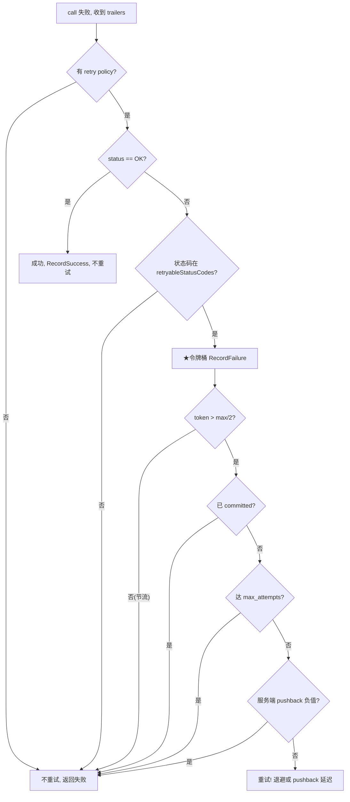

# 第 4 篇 · 第 16 章 · 重试与对冲(招牌章)

> **核心问题**:P4-15 选了 SubChannel,调用发出去了。但网络是不可靠的——这次调用可能因为后端短暂过载(UNAVAILABLE)、网络抖一下、连接重建中而失败。其中有些失败**值得重试**,但无节制重试会**放大流量打爆后端**,引发雪崩。gRPC 怎么决定"什么时候重试、怎么退避、怎么防雪崩"?还有一类特殊的"重试"——对冲(hedging),原请求还没取消就并发发第二个,用流量换尾延迟。本章拆透 gRPC 的重试机制,以及一个治理上的招牌技巧——**retry throttle 令牌桶:按成功率动态调重试比例,这是 gRPC 防"重试放大雪崩"的核心防线**。

> **读完本章你会明白**:
> 1. retry policy 怎么配(哪些状态码可重试、最大次数、退避+抖动),以及一个**反直觉的事实**——**没有任何状态码默认可重试**,UNAVAILABLE 也要在 service config 里显式写出来。
> 2. ★**retry throttle 令牌桶** 的全部真相:类名是 `RetryThrottler`(不是 RetryThrottleData),**per-channel**(不是 per-server map),用**毫 token(milli-token)**单位支持小数 ratio;按成功率动态加减 token,token 跌到半桶以下就拒绝重试——这是防雪崩的核心机制。
> 3. **transparent retry vs configurable retry** 的本质区别:前者建连前/发送前失败,对应用不可见、不计 max_attempts、立即重试;后者需要 retry policy、计 max_attempts、走退避。
> 4. 1.83 的真实状态:**重试主路径是新的 RetryInterceptor(Promise 形态)**,retry_filter.cc 是 legacy 壳;**hedging 尚未实现**(全是 TODO,只有 `perAttemptRecvTimeout` 预留接口)。

> **如果一读觉得太难**:先只记住三件事——① 失败了先看状态码在不在 retryableStatusCodes 里,再看令牌桶让不让重试,再看 max_attempts;② 令牌桶按成功率动态调,后端持续失败时自动降重试比例防雪崩;③ 退避必须加抖动,防同步重试风暴。

---

## 〇、一句话点破

> **gRPC 的重试是一道"该不该重试"的多重过滤:状态码可重试?令牌桶让不让重试?达到 max_attempts?已 commit?服务端 pushback?——任何一关不过就放弃。其中令牌桶是防雪崩的核心:它按成功率动态调重试比例,后端健康时给满配额,后端持续失败时自动收紧,从源头掐掉"重试放大流量"的雪崩。**

这是结论,不是理由。本章倒过来拆:先讲为什么要这套多重过滤,再看令牌桶的算法,然后看 transparent retry,最后看 hedging 的真实状态(可能反直觉)。

---

## 一、为什么重试这么难:雪崩陷阱

### 1.1 重试是双刃剑

重试听起来天经地义——网络抖了一下,重发一次就成了。但在分布式系统里,**无脑重试是灾难**。设想这个场景:

- 一个服务有 100 个客户端,每个客户端每秒发 100 次调用,QPS 共 10000。
- 后端因为某种原因(比如 GC、磁盘抖动)短暂变慢,错误率从 0.1% 飙到 50%。
- 客户端配置"失败就重试 3 次"。
- **结果**:原本 10000 QPS,50% 失败 × 重试 3 次 = 额外 15000 QPS 的重试流量,总流量变成 25000 QPS——**后端本来只是慢,现在被重试打死**。这就是雪崩。

更糟的是,雪崩会**级联**:后端 A 被重试打死 → 调用 A 的服务 B 也开始失败 → B 的客户端也开始重试 → B 也被打死 → 一路传上去,整个系统崩。这是分布式系统里最经典的故障模式之一。

> **不这样会怎样**:如果没有节流机制,只允许"失败就重试",那么任何短暂故障都会被重试放大成永久故障。这就是为什么 gRPC 的重试设计**不是"失败就重试"这么简单**——它必须有一道"该不该重试"的多重过滤,既允许合理的重试(短暂故障恢复),又能在后端真出问题时及时收手。

### 1.2 gRPC 的多重过滤设计

gRPC 的重试决策(`RetryState::ShouldRetry`,`retry_interceptor.cc:57-130`)是一道**多重过滤**,任何一关不过就放弃重试:



七道关:retry policy → 状态码可重试 → 令牌桶 → committed → max_attempts → 服务端 pushback。下面逐个拆。

---

## 二、Retry policy:第一道关

### 2.1 配置在 service config 里

retry policy 在 service config 的 `methodConfig` 里配(P4-13 讲过 service config)。JSON 结构(`retry_service_config.cc:117-131`):

```json
{
  "methodConfig": [
    {
      "name": [{ "service": "Foo", "method": "Bar" }],
      "retryPolicy": {
        "maxAttempts": 4,
        "initialBackoff": "0.1s",
        "maxBackoff": "1s",
        "backoffMultiplier": 2,
        "retryableStatusCodes": ["UNAVAILABLE"]
      }
    }
  ]
}
```

五个字段(`retry_service_config.h:54-91`):

- `maxAttempts`:最大尝试次数(含首次),硬上限 5(`MAX_MAX_RETRY_ATTEMPTS`,`retry_service_config.cc:39`)。
- `initialBackoff`:首次重试退避。
- `maxBackoff`:退避上限。
- `backoffMultiplier`:退避乘数。
- `retryableStatusCodes`:**哪些状态码可重试**——这是关键。

### 2.2 ★关键修正:没有任何默认可重试状态码

很多人以为 `UNAVAILABLE` 默认可重试。读 `retry_service_config.cc:196-212` 才知道——**不配 `retryableStatusCodes` 会直接报错**:

```cpp
// src/core/client_channel/retry_service_config.cc:196-212(简化示意)
if (retryable_status_codes_.Empty()) {
  if (hedging gate 开启 && perAttemptRecvTimeout 也未配) {
    errors->AddError("retryableStatusCodes must be non-empty ...");
  } else {
    errors->AddError("retryableStatusCodes must be non-empty");
  }
}
```

> **钉死这件事**:**没有任何状态码默认可重试**。你想重试 UNAVAILABLE,必须在 service config 里**显式写 `"retryableStatusCodes": ["UNAVAILABLE"]`**。这是 gRPC 的保守默认——避免用户没想清楚就开启重试,引发雪崩。

### 2.3 maxAttempts 硬上限 5

```cpp
// src/core/client_channel/retry_service_config.cc:139-145
if (max_attempts_ <= 1) {
  errors->AddError("must be at least 2");
} else if (max_attempts_ > MAX_MAX_RETRY_ATTEMPTS) {  // 5
  LOG(ERROR) << "service config: clamped retryPolicy.maxAttempts at "
             << MAX_MAX_RETRY_ATTEMPTS;
  max_attempts_ = MAX_MAX_RETRY_ATTEMPTS;   // ★硬 clamp 到 5
}
```

> **不这样会怎样**:如果不设硬上限,用户可能配 `maxAttempts: 100`,后端一旦故障,客户端会重试 100 次——这等同于"放任雪崩"。5 次是 gRPC 团队权衡后的上限,既给够恢复机会(短暂故障通常 1-2 次重试就过),又限制了放大倍数(最多 5x 流量)。

---

## 三、★Retry throttle 令牌桶:防雪崩的核心(本章招牌)

这是 gRPC 重试设计最精妙的一环,也是它区别于"朴素重试"的核心防线。

### 3.1 设计动机

maxAttempts 只能限制**单次调用的重试次数**(最多 5 次),但限制不了**整体重试比例**。设想:10000 QPS,50% 失败,maxAttempts=5——理论上额外 25000 QPS 重试流量,后端还是会被打死。maxAttempts 是"局部限流",我们需要的是"全局限流":**当后端持续失败时,自动降低所有客户端的重试比例,从源头掐掉放大流量**。

令牌桶就是干这个的。

### 3.2 RetryThrottler 类(精确源码事实)

文件 `retry_throttle.h:33-77`。先看类定义和字段:

```cpp
// src/core/client_channel/retry_throttle.h:33
class RetryThrottler final : public RefCounted<RetryThrottler> {
 public:
  static RefCountedPtr<RetryThrottler> Create(
      uintptr_t max_milli_tokens, uintptr_t milli_token_ratio,
      RefCountedPtr<RetryThrottler> previous);
  bool RecordFailure();          // ★返回 true 表示"还可以重试"
  void RecordSuccess();          // ★
  uintptr_t max_milli_tokens() const { return max_milli_tokens_; }
  uintptr_t milli_token_ratio() const { return milli_token_ratio_; }
  intptr_t milli_tokens() const {
    return milli_tokens_.load(std::memory_order_relaxed);
  }
  static absl::string_view ChannelArgName() {
    return "grpc.internal.retry_throttler";   // ★作为 channel arg 传递
  }
 private:
  const uintptr_t max_milli_tokens_;           // 桶容量上限(毫 token)
  const uintptr_t milli_token_ratio_;          // 每次成功加多少
  std::atomic<intptr_t> milli_tokens_;         // ★当前令牌(原子)
  std::atomic<RetryThrottler*> replacement_{nullptr};  // 配置更新链
};
```

三个必须钉死的修正(这些是我写书前自己的印象,源码核实后全部推翻):

1. **类名是 `RetryThrottler`**,不是 `RetryThrottleData`(老资料里这么叫)。
2. **方法是 `RecordFailure()` / `RecordSuccess()`**,不是 `IsRetryThrottling()` / `RecordSuccessOnFailure()`。
3. **per-channel,不是 per-server map**。一个 channel 一个实例,通过 channel arg `grpc.internal.retry_throttler` 传递。`RetryThrottlerChannelArgsUpdater`(`retry_throttle.h:81-89`)是 `ClientChannel` 的成员(`client_channel.h:216`),每次 service config 更新时调 `Update`(`retry_throttle.cc:128-144`)重建。

### 3.3 为什么用"毫 token"(milli-token)

字段名里到处是 `milli_` 前缀。原因是 service config 里的 `tokenRatio` 字段**支持小数**(比如 0.1,表示"成功 10 次才加回 1 个 token")。为了避免浮点运算,内部把所有 token 乘 1000 存储:

- `maxTokens: 10` 在内部存成 `max_milli_tokens_ = 10000`。
- `tokenRatio: 0.1` 在内部存成 `milli_token_ratio_ = 100`。

失败减 `1000`(即 1 token),成功加 `milli_token_ratio_`(可能是 100,即 0.1 token)。这样所有运算都是整数原子操作,无浮点误差。

### 3.4 ★令牌桶算法(逐字源码)

`RecordFailure`(`retry_throttle.cc:102-114`):

```cpp
// src/core/client_channel/retry_throttle.cc:102
bool RetryThrottler::RecordFailure() {
  RetryThrottler* throttle_data = this;
  GetReplacementThrottleDataIfNeeded(&throttle_data);
  // We decrement milli_tokens by 1000 (1 token) for each failure.
  const uintptr_t new_value = ClampedAdd<intptr_t>(
      throttle_data->milli_tokens_, -1000, 0,                    // ★减 1000(1 token)
      std::min<uintptr_t>(throttle_data->max_milli_tokens_,
                          std::numeric_limits<intptr_t>::max()));
  // Retries are allowed as long as the new value is above the threshold
  // (max_milli_tokens / 2).
  return new_value > throttle_data->max_milli_tokens_ / 2;        // ★大于半桶才能重试
}
```

`RecordSuccess`(`retry_throttle.cc:116-126`):

```cpp
// src/core/client_channel/retry_throttle.cc:116
void RetryThrottler::RecordSuccess() {
  RetryThrottler* throttle_data = this;
  GetReplacementThrottleDataIfNeeded(&throttle_data);
  // We increment milli_tokens by milli_token_ratio for each success.
  ClampedAdd<intptr_t>(
      throttle_data->milli_tokens_, throttle_data->milli_token_ratio_,  // ★加 ratio
      0, std::max<intptr_t>(0, std::min<uintptr_t>(throttle_data->max_milli_tokens_,
                                 std::numeric_limits<intptr_t>::max())));
}
```

算法本质:

- **初始**:`milli_tokens = max_milli_tokens`(满桶,`Create` 的 `initial_milli_tokens = max_milli_tokens`,`retry_throttle.cc:57`)。
- **每次失败**:`milli_tokens -= 1000`(减 1 token),下限 0。
- **每次成功**:`milli_tokens += milli_token_ratio_`(加 ratio,通常 < 1000)。
- **重试判定**:`RecordFailure()` 返回 `new_value > max_milli_tokens / 2`——**令牌跌到半桶以下就拒绝重试**。

### 3.5 动态性:怎么"按成功率"调

关键在 `milli_token_ratio_` 通常**小于 1000**。比如默认配置 `maxTokens: 10, tokenRatio: 0.1`(内部 `max_milli_tokens=10000, milli_token_ratio=100`)。这意味着:

- 失败 1 次:扣 1000 milli-token(1 token)。
- 成功 1 次:加 100 milli-token(0.1 token)。
- **失败扣的比成功加的多 10 倍**。

这是个**不对称**的设计——它的效果是:

- **后端健康**(成功率 100%):每次 +100,不消耗,桶保持满(10000)。所有重试请求都通过(`10000 > 5000`)。
- **后端开始故障**:每次失败 -1000,成功才 +100。假设错误率 50%,平均每次调用净变化 = 0.5×(-1000) + 0.5×(+100) = -450。桶持续下降。
- **桶跌破 5000(半桶)**:`RecordFailure` 返回 false,**后续重试被全部拒绝**。客户端只能"裸跑"一次 RPC,不再放大流量。
- **后端恢复**:成功率高了,每次净变化变正,桶缓慢回升。越过 5000 后重试配额恢复。

> **钉死这件事(令牌桶的精髓)**:**令牌桶按"实际成功率"动态调重试比例,而不是固定配额**。后端健康时给满配额(允许充分重试),后端持续故障时自动收紧(掐掉放大流量)。这是 gRPC 防"重试放大雪崩"的核心防线——它让重试机制**自适应**:短暂故障能恢复(满配额重试),持续故障不会雪崩(自动节流)。

### 3.6 反例:无令牌桶的雪崩

> **不这样会怎样**:回到 1.1 节的雪崩场景。如果没有令牌桶:
> - 100 个客户端,每个 QPS 100,后端错误率从 0.1% 飙到 50%。
> - 50% 失败 × maxAttempts 5 = 额外重试流量把后端从 10000 QPS 推到 25000 QPS。
> - 后端更慢,错误率更高,重试更多——正反馈,雪崩。
>
> 有了令牌桶:
> - 后端开始故障,客户端各自扣 token。失败比成功扣得多 10 倍,token 快速下降。
> - 几秒钟内所有客户端的 token 都跌破半桶,**重试被全局拒绝**。
> - 后端流量从 25000 QPS 回落到原本的 10000 QPS——后端有时间恢复。
> - 后端恢复后 token 缓慢回升,重试配额恢复。
>
> 令牌桶把"重试放大"这个正反馈循环,变成了"故障 → 自动节流 → 后端恢复 → 配额恢复"的负反馈循环。这是分布式系统稳定性设计的经典模式。

### 3.7 节流计数的精确顺序(设计要点)

`ShouldRetry`(`retry_interceptor.cc:84-95`)的注释明确强调了一个**顺序问题**:

```
// Note that it's important for this check to come after the status
// code check above, since we should only record failures whose statuses
// match the configured retryable status codes, so that we don't count
// things like failures due to malformed requests (INVALID_ARGUMENT).
// Conversely, it's important for this to come before the remaining
// checks, so that we don't fail to record failures due to other factors.
```

顺序是:**状态码可重试检查 → RecordFailure(节流计数)→ committed/max_attempts 检查**。

为什么这个顺序重要?

- **必须在状态码检查之后**:如果 INVALID_ARGUMENT(请求格式错)也计入节流,那客户端自己的坏请求会污染节流器——一堆坏请求把 token 耗光,正常的重试也被拒绝。所以只计"配置为可重试的状态码"的失败。
- **必须在其他检查之前**:即使最终因为 committed 或 max_attempts 放弃重试,这次"可重试状态码的失败"也要计入节流——因为它确实反映了后端健康状况。如果只计"实际触发了重试"的失败,会漏掉很多真实的故障信号。

> **钉死这件事**:节流计数的设计是**"只计可重试的失败,无论最终是否真重试"**——这是令牌桶准确反映后端健康的关键。这种"宁可多计不可少计"的保守策略,让令牌桶在后端真出问题时能快速反应。

### 3.8 原子更新:ClampedAdd 的 CAS 循环

令牌加减用的是 `ClampedAdd`(`retry_throttle.cc:32-41`):

```cpp
// src/core/client_channel/retry_throttle.cc:32
template <typename T>
T ClampedAdd(std::atomic<T>& value, T delta, T min, T max) {
  T prev_value = value.load(std::memory_order_relaxed);
  T new_value;
  do {
    new_value = Clamp(SaturatingAdd(prev_value, delta), min, max);
  } while (!value.compare_exchange_weak(prev_value, new_value,
                                        std::memory_order_relaxed));
  return new_value;
}
```

标准的 CAS(Compare-And-Swap)循环:

1. 读当前值 `prev_value`(relaxed,不需要 fence)。
2. 算新值 `new_value = Clamp(prev + delta, min, max)`。
3. CAS:如果 value 还是 prev_value,就更新成 new_value;否则重试。
4. `Clamp` 保证 token 不越界(< 0 或 > max)。

> **不这样会怎样**:如果用 `mutex` 保护 token 加减,在每条调用结束都要走一次锁——又是热路径锁竞争。CAS 循环是 lock-free 的,绝大多数情况下一次就成功(竞争不激烈时),比 mutex 快一个数量级。这和 P4-15 Picker 的 `fetch_add` 是同一思路:**热路径用原子操作,不用锁**。

### 3.9 配置更新的平滑过渡

`Create`(`retry_throttle.cc:49-72`)有一个细节:配置更新时(tokenRatio 变了),新 throttler 的初始 token 按**比例**换算:

```cpp
// src/core/client_channel/retry_throttle.cc:62-67
if (previous != nullptr) {
  double token_fraction = static_cast<double>(previous->milli_tokens_) /
                          static_cast<double>(previous->max_milli_tokens_);
  initial_milli_tokens =
      static_cast<uintptr_t>(token_fraction * max_milli_tokens);   // ★按比例换算
}
```

> **所以这样设计**:如果原来 token 是 30%(在节流中),换了新配置后初始 token 也是 30%(继续节流)。这避免了"换配置就重置 token"导致的瞬时重试洪水——运维改了 tokenRatio,客户端不会立刻从"严格节流"跳到"满配额重试"。旧 throttler 通过 `replacement_` 链(`GetReplacementThrottleDataIfNeeded`,`retry_throttle.cc:92-100`)被惰性替换——还在用旧 throttler 的调用会自动跳到新的。

---

## 四、退避 + 抖动:防同步重试风暴

### 4.1 算法(和 SubChannel、Resolver 共用同一套 BackOff)

retry 的退避用同一个 `BackOff` 类(`src/core/util/backoff.cc:29-39`,P4-13、P4-14 都见过)。jitter 在 `retry_filter.h:59` 钉死:

```cpp
// src/core/client_channel/retry_filter.h:59
static double BackoffJitter() { return 0.2; }   // 注释说"任意选的"
```

新路径 RetryInterceptor 也用 0.2(`retry_interceptor.cc:52`)。算法:`首次 initial_backoff;之后 current *= multiplier;封顶 max_backoff;再乘 [0.8, 1.2) 均匀随机`。

### 4.2 为什么必须抖动

> **不这样会怎样**:假设一个负载均衡器后面有 50 个后端实例,某个时刻负载均衡器短暂故障,所有客户端的调用同时失败。如果**没有抖动**,所有客户端会:
> - 同时收到失败 → 同时退避 `initial_backoff`(比如 100ms)→ 100ms 后**同时**重试 → 负载均衡器可能还没恢复 → 又同时失败 → 又同时退避 200ms → 又同时重试……
>
> 这就是 **thundering herd / 同步重试风暴**——所有客户端的重试节奏完全同步,每次重试撞同一波故障,放大效应极强。
>
> ±20% 抖动把重试时间打散:100ms 退避实际散布在 [80ms, 120ms),50 个客户端的重试时间均匀散开,负载均衡器收到的重试流量是平滑的而不是脉冲的。这是 P4-14(SubChannel 退避)、P4-13(Resolver 退避)反复见到的设计——**退避必须配抖动**。

### 4.3 服务端 pushback:让服务端主导退避

gRPC 允许服务端通过响应头 `grpc-retry-pushback-ms` **主导下次重试延迟**(`retry_interceptor.cc:111-125`):

```cpp
// src/core/client_channel/retry_interceptor.cc:111
const auto server_pushback = md.get(GrpcRetryPushbackMsMetadata());
if (server_pushback.has_value() && server_pushback < Duration::Zero()) {
  return std::nullopt;                    // ★负值:别重试
}
Duration next_attempt_timeout;
if (server_pushback.has_value()) {
  next_attempt_timeout = *server_pushback;
  retry_backoff_.Reset();                 // ★用 pushback,重置客户端退避序列
} else {
  next_attempt_timeout = retry_backoff_.NextAttemptDelay();
}
```

两种语义:

- **正值**:服务端说"我这边有事,过 N ms 再来"——客户端用这个值,不用客户端自己算的退避。
- **负值**:服务端说"别重试了,我处理不了"——客户端放弃重试。

> **所以这样设计**:服务端比客户端更知道自己有多忙。让服务端能主导退避节奏(或直接拒绝重试),让重试机制对后端更友好。这是一个**客户端 → 服务端**的反向控制通道,和令牌桶(客户端自适应)互补——令牌桶处理"客户端能观察到的故障",pushback 处理"服务端主动告知的故障"。

---

## 五、Transparent retry vs configurable retry

### 5.1 两类重试的本质区别

gRPC 区分两类重试:

| 维度 | transparent retry(透明重试) | configurable retry(可配置重试) |
|---|---|---|
| 触发条件 | 建连前/发送前失败(`kNotSentOnWire` / `kNotSeenByServer`) | 状态码 ∈ retryableStatusCodes |
| 需要 retry policy? | **不需要** | 需要 |
| 计入 max_attempts? | 不计入 | 计入 |
| 计入令牌桶? | 不计入 | 计入 |
| 退避 | **立即**重试,无退避 | 走 BackOff 退避 |
| 限制 | `kNotSeenByServer` 仅一次 | 受 maxAttempts=5 限制 |
| 对应用 | 不可见(透明) | 可见(消耗 attempt 配额) |

### 5.2 为什么 transparent retry 不计 max_attempts 和令牌桶

> **不这样会怎样**:设想调用在"建连中"失败了——TCP 握手没完成、字节根本没上线。这种失败**对服务端是不可见的**(服务端没收到任何请求),重试它**不可能造成重复执行**(服务端没执行过)。所以透明重试:
> - **不需要 retry policy**:它是"未发送"的语义性重试,不是"失败后是否值得重试"的策略判断。
> - **不计 max_attempts**:它没真正"消耗"一次尝试(服务端没看到)。
> - **不计令牌桶**:它不反映后端健康状况(后端根本没参与)。
> - **立即重试,无退避**:没必要等,反正没上线。
>
> 反过来,如果调用已经发到服务端、服务端开始处理了,这时失败**可能已经执行了部分逻辑**(比如已经扣了库存)。重试它**可能造成重复执行**——这就是"已 commit"的概念(下一节)。所以一旦"服务端看到了请求",后续重试必须走 configurable retry 的严格过滤。

### 5.3 ★重要事实:transparent retry 只在 legacy 路径实现

grep `transparent` / `kNotSentOnWire` / `GrpcStreamNetworkState` 在 `retry_interceptor.cc`(新主路径)**零命中**。transparent retry 的完整实现只在 `retry_filter_legacy_call_data.cc:1113-1158`:

```cpp
// src/core/client_channel/retry_filter_legacy_call_data.cc:1114(简化示意)
if (!is_lb_drop) {  // Never retry on LB drops.
  enum { kNoRetry, kTransparentRetry, kConfigurableRetry } retry = kNoRetry;
  if (stream_network_state.has_value() && !calld->retry_committed_) {
    if (*stream_network_state == GrpcStreamNetworkState::kNotSentOnWire) {
      retry = kTransparentRetry;                    // 未上线,透明重试
    } else if (*stream_network_state ==
                   GrpcStreamNetworkState::kNotSeenByServer &&
               !calld->sent_transparent_retry_not_seen_by_server_) {
      calld->sent_transparent_retry_not_seen_by_server_ = true;
      retry = kTransparentRetry;                    // 未被服务端看到,仅重试一次
    }
  }
  if (retry == kNoRetry &&
      call_attempt->ShouldRetry(status, server_pushback)) {
    retry = kConfigurableRetry;                     // 走 configurable
  }
  if (retry != kNoRetry) {
    if (retry == kTransparentRetry) {
      calld->AddClosureToStartTransparentRetry(&closures);   // 立即重试,无退避
    } else {
      calld->StartRetryTimer(server_pushback);                // 走退避
    }
  }
}
```

> **钉死这件事(架构演进现状)**:**1.83 里 transparent retry 只在 legacy 路径(LegacyCallData)实现,新主路径(RetryInterceptor)还没有 transparent retry 逻辑**。这是 gRPC 架构演进中的一个**功能缺口**——新 Promise 形态的重写还没追上经典形态的全部功能。写书时必须诚实标注这一点。在你能确认你的 gRPC 用哪条路径之前,**不要假设 transparent retry 一定生效**。

### 5.4 Commit 语义:什么时候"不能重试了"

调用一旦"commit",就不能再重试了——即使后续失败也不行。commit 的触发点(`retry_interceptor.cc:249` `ServerToClientGotInitialMetadata`):

```cpp
// 收到服务端 initial metadata 就 commit
Attempt::Commit(...)
```

> **钉死这件事(commit 的语义)**:**一旦收到服务端的 initial metadata(意味着服务端已经开始处理请求),调用就 commit**。之后的失败不再重试,因为服务端可能已经执行了部分逻辑,重试可能造成重复执行。这是分布式系统"恰好一次"语义的妥协——gRPC 提供"至少一次"(在 commit 前可重试),不保证"恰好一次"(commit 后失败就是失败)。
>
> 还有一个隐式 commit:缓冲的数据量超过 `per_rpc_retry_buffer_size_`(默认 256KiB,`retry_interceptor.cc:29`)。这是因为重试需要把已发的请求重新发一遍,如果请求体太大,缓冲代价太高,就强制 commit(发出去就发了,不再重试)。

---

## 六、Hedging 对冲:1.83 的真实状态(必须诚实)

任务里说"hedging 不取消原请求就并发发第二个"。我读完源码必须诚实修正:**hedging 在 1.83.0-dev 中尚未实现**。

### 6.1 全目录 grep 的决定性证据

`grep "hedging|Hedging|hedging_delay|hedgingDelay|nonFatalStatusCodes" 在 src/core/client_channel/` 的**全部命中都是注释或错误信息**,无任何实现代码:

- `retry_filter.cc:82`:`// TODO(roth): In subsequent PRs: - implement hedging`
- `retry_filter_legacy_call_data.cc:173,217,653,737,1543,1753`:全是 `// TODO(roth): When we implement hedging, ...` 或 `When implementing hedging`
- `client_channel_filter.cc:2257,2512`:`// TODO(roth): When we implement hedging support, ...`

**没有 `HedgingPolicy` 类、没有 `hedgingDelay` 字段、没有 `nonFatalStatusCodes` 字段、没有"并发发第二个 attempt"的代码**。

### 6.2 唯一的预留接口:perAttemptRecvTimeout

`RetryMethodConfig::per_attempt_recv_timeout_`(`retry_service_config.h:63,90`),JSON `perAttemptRecvTimeout`,加载时受 `GRPC_ARG_EXPERIMENTAL_ENABLE_HEDGING` gate(`retry_service_config.cc:126-128`)。

它的当前实现是**单 attempt 接收超时**(不是并发对冲):`retry_filter_legacy_call_data.cc:661-666` 在超时触发时:

```cpp
// src/core/client_channel/retry_filter_legacy_call_data.cc:661(简化示意)
if (call_attempt->ShouldRetry(/*status=*/std::nullopt, ...)) {
  call_attempt->Abandon();
  calld->StartRetryTimer(...);   // ★串行重试,不是并发
}
```

即"超时 → 取消当前 attempt → 退避后**串行**重试",**不是 hedging 的"不取消原请求、并发发第二个"**。`retry_filter_legacy_call_data.cc:653` 的 TODO 明确:`// TODO(roth): When implementing hedging, we should not cancel the [original]`。

> **钉死这件事(hedging 的真相)**:**hedging 在 1.83.0-dev 尚未实现**,全是 TODO。`perAttemptRecvTimeout` 是预留/半成品接口,而且**只在 legacy 路径生效**(新路径 RetryInterceptor grep 不到)。如果你看到 gRPC 文档讲 hedging,要知道那是**设计意图,不是当前实现**。这是写书必须诚实标注的——不能把"计划做的"写成"已经这么做"。

### 6.3 hedging 的设计意图(讲清原理,标注未实现)

虽然未实现,但设计意图值得讲——因为它代表了一类重要的尾延迟优化思路。

**hedging 的设计动机**:长尾问题。即使后端平均响应快,但偶尔有 1% 的请求慢(尾延迟高)。等它不如"在它还在跑时,并发发第二个,谁先回用谁"。

**正确实现应该的样子**(对照设计文档 A6):

- 配置 `hedgingPolicy: { maxAttempts: 3, hedgingDelay: "100ms", nonFatalStatusCodes: [...] }`。
- 发出 attempt 1;过 `hedgingDelay`(100ms)还没回,发 attempt 2(不取消 attempt 1);再过 100ms 还没回,发 attempt 3。
- 谁先成功就用谁的结果,其他的不取消(让它们跑完,结果丢弃)——也可以取消(取决于实现)。
- 用 `nonFatalStatusCodes` 判断"哪些失败可以继续 hedging"(不像 retry 要全部失败才重试)。

**代价**:hedging 把"1 次调用"变成"N 次调用",**流量放大 N 倍**。所以它只适合**尾延迟敏感、且后端能承受放大流量**的场景(比如 Google 内部的大规模存储查询)。对一般 RPC,hedging 不合适——retry + 令牌桶已经够。

> **钉死这件事**:hedging 是"用流量换尾延迟"的极致手段,代价是 N 倍流量。**gRPC 设计了它但还没实现**——这是写书时必须说清的。日常使用,retry policy + retry throttle 令牌桶已经覆盖绝大多数容错需求。

---

## 七、★新架构主路径:RetryInterceptor

任务说"retry_filter_legacy_call_data.cc 是 legacy,retry_interceptor.cc 可能是新形态——核实 retry 走经典还是新"。读完源码确认:**主路径是新的 RetryInterceptor**。

### 7.1 注册点

`client_channel.cc:936`:

```cpp
// src/core/client_channel/client_channel.cc:936
if (enable_retries_) builder_->Add<RetryInterceptor>(nullptr);
```

`RetryInterceptor` 注册进新的 FilterChain。而 `retry_filter.cc` 自己的 vtable(`retry_filter.cc:107-120`)全部委托给 `LegacyCallData`,是老 filter-stack 形态——**`retry_filter.cc` 这条路径全程走 LegacyCallData,本身不带任何重试决策逻辑**。

### 7.2 RetryState::ShouldRetry(新路径决策核心)

`retry_interceptor.h:30-57`:

```cpp
// src/core/client_channel/retry_interceptor.h:30
class RetryState {
 public:
  RetryState(const RetryMethodConfig* retry_policy,
             RefCountedPtr<RetryThrottler> retry_throttler);
  // if nullopt --> commit & don't retry
  // if duration --> retry after duration
  std::optional<Duration> ShouldRetry(
      const ServerMetadata& md, bool committed,
      absl::FunctionRef<std::string()> lazy_attempt_debug_string);
 private:
  const RetryMethodConfig* const retry_policy_;
  RefCountedPtr<RetryThrottler> retry_throttler_;
  int num_attempts_completed_ = 0;
  BackOff retry_backoff_;
};
```

返回 `optional<Duration>`:**nullopt = 提交不重试,duration = 延迟多久重试**。设计很优雅——把"是否重试"和"延迟多少"合并成一个返回值。完整实现就是前面 1.2 节那张流程图对应的 `retry_interceptor.cc:57-130`。

### 7.3 重试触发:用 Promise 的 Sleep

新路径用 Promise 的 `Sleep` 实现重试定时器(`retry_interceptor.cc:285-294`):

```cpp
// 简化示意,非源码原文
Map(Sleep(*delay), [] { call->StartAttempt(); });
```

`Sleep` 是 Promise 形态的延迟,不需要 EventEngine timer 句柄管理(对比 legacy 路径 `StartRetryTimer` 用 `event_engine_->RunAfter`,要管 timer handle 的取消)。这是 Promise 架构的一大优势——异步操作用组合子表达,资源管理自动。

### 7.4 新老路径的功能对照

| 功能 | RetryInterceptor(新,主) | LegacyCallData(legacy) |
|---|---|---|
| configurable retry | ✅ | ✅ |
| retry throttle 令牌桶 | ✅(`retry_interceptor.cc:91`) | ✅(`retry_filter_legacy_call_data.cc:564`) |
| 退避 + 抖动 | ✅ | ✅ |
| 服务端 pushback | ✅ | ✅ |
| **transparent retry** | ❌(未实现) | ✅(`retry_filter_legacy_call_data.cc:1113-1158`) |
| **perAttemptRecvTimeout** | ❌(未实现) | ✅(`retry_filter_legacy_call_data.cc:661-666`) |
| hedging | ❌(全是 TODO) | ❌(全是 TODO) |

> **钉死这件事**:新主路径 RetryInterceptor **缺 transparent retry 和 perAttemptRecvTimeout**——这是架构演进的现状。如果你的场景依赖 transparent retry(比如连接抖动频繁),要确认你用的是哪条路径。gRPC 团队在持续把 legacy 功能搬到新路径,但 1.83 时点还没搬完。

---

## 八、技巧精解:令牌桶——分布式系统的自适应节流范式

本章的核心技巧,值得单独钉死——它是分布式稳定性设计的经典范式。

### 技巧核心:用"不对称加减"实现自适应

令牌桶的精髓不在"有桶",而在**失败扣得多、成功加得少**的不对称。设想两种对称设计:

- **对称设计 A**(失败 -1, 成功 +1):后端故障时,失败和成功抵消,token 永远不降。**完全失去节流能力**。
- **对称设计 B**(失败 -1, 成功 0):成功不回血,token 单调下降,后端永远恢复不了。**过度保守**。

gRPC 的不对称(失败 -1 token, 成功 +0.1 token):

- 后端健康(成功率高):每次净变化 ≈ +0.1 - 0.001×失败率 ≈ +0.1,桶保持满。
- 后端故障 50%:每次净变化 ≈ 0.5×(-1) + 0.5×(+0.1) = -0.45,桶快速下降。
- 后端故障 90%:每次净变化 ≈ 0.9×(-1) + 0.1×(+0.1) = -0.89,桶暴跌。

> **不这样设计会怎样**:对称设计的两种都会出问题。**不对称**让令牌桶对"故障比例"敏感——错误率越高,token 跌得越快,节流越早触发;错误率低时,token 几乎不跌,不影响正常重试。这就是"按成功率动态调"的精确含义——不是显式算成功率,而是通过不对称加减让 token 自然反映成功率。
>
> 不对称的比例(tokenRatio)决定了敏感度。`tokenRatio: 0.1` 表示"成功 10 次才抵消 1 次失败",对错误率敏感度高(50% 错误率就让桶快速下降)。如果 `tokenRatio: 0.5`,敏感度低(需要 67% 错误率才开始净下降)。这是运维可以调的旋钮。

### 类比:令牌桶 vs 熔断器

令牌桶和经典的"熔断器"(circuit breaker,Hystrix 那套)都是分布式稳定性手段,但思路不同:

| 维度 | 令牌桶(retry throttle) | 熔断器(circuit breaker) |
|---|---|---|
| 决策粒度 | **概率性**(token > 半桶就允许,有概率通过) | **二值性**(开/关,要么全通要么全断) |
| 状态恢复 | 渐进(token 缓慢回升) | 突变(half-open 状态试探) |
| 适合 | RPC 重试节流 | 服务隔离 |
| 实现 | 客户端本地、无协调 | 客户端本地、无协调 |

令牌桶的"概率性"是它适合 RPC 场景的关键——它不会突然把所有重试都掐掉(造成"全或无"的体验),而是按 token 比例渐进收紧。token 在半桶附近时,大约一半的重试通过、一半被拒——流量平滑下降而不是断崖。

### 一句话总结

> **令牌桶是分布式系统"客户端侧自适应节流"的经典范式:用不对称加减让 token 自然反映成功率,用半桶阈值实现渐进节流。它不需要服务端协调、不需要显式算成功率、不需要分布式状态——每个客户端各自维护,效果却像全局协同。这是 gRPC 防"重试放大雪崩"的核心防线,也是 retry 设计区别于"朴素重试"的根本。**

---

## 九、章末小结

### 回扣主线

本章是第 4 篇(客户端治理)的第四章,讲的是治理链的**容错核心**:调用失败了怎么办。它服务二分法的**框架层(治理)**——retry 不碰协议层,但它决定"这次失败后要不要再试、怎么试、试到什么程度",这是治理的容错维度。

P4-13 找地址 → P4-14 建连接 → P4-15 挑后端 → 本章讲"挑了发出去了,失败了怎么办"。四章构成完整的客户端治理链:**找地址、建连接、挑后端、失败重试**。这是微服务场景下 gRPC 的看家本领。

### 五个为什么

1. **为什么重试要有多重过滤,而不是"失败就重试"?**——无脑重试会放大流量,把后端的短暂故障放大成永久故障(雪崩)。多重过滤(状态码、令牌桶、max_attempts、committed、pushback)既允许合理重试,又能在后端真出问题时及时收手。
2. **为什么令牌桶用不对称加减(失败扣 1,成功加 0.1)?**——对称加减要么失去节流能力(失败成功抵消),要么过度保守(成功不回血)。不对称让 token 自然反映成功率:错误率高时快速下降触发节流,错误率低时几乎不跌不影响正常重试。
3. **为什么没有任何状态码默认可重试?**——重试是双刃剑,默认开启会让用户没想清楚就引入雪崩风险。显式配置 `retryableStatusCodes` 强制用户思考"哪些失败值得重试"。
4. **为什么 transparent retry 不计 max_attempts 和令牌桶?**——它发生在"字节没上线"的阶段,服务端没参与,重试不可能造成重复执行,也不反映后端健康。所以它不需要 policy、不计配额、立即重试。
5. **为什么退避必须配抖动?**——无抖动会让所有客户端的重试节奏同步,每次重试撞同一波故障,放大效应强。±20% 抖动把重试时间打散,恢复平滑。P4-13、P4-14 反复见到同一设计。

### 想继续深入往哪钻

- 想看令牌桶的完整实现:`src/core/client_channel/retry_throttle.cc`(147 行,极简)。
- 想看新路径 RetryInterceptor 的完整决策:`src/core/client_channel/retry_interceptor.cc` 的 `RetryState::ShouldRetry`(:57-130)和 `Attempt` 类。
- 想看 legacy 路径的 transparent retry:`src/core/client_channel/retry_filter_legacy_call_data.cc:1113-1158`。
- 想看 service config 解析的完整字段:`src/core/client_channel/retry_service_config.cc`。
- 想看 BackOff 算法:`src/core/util/backoff.cc`(46 行,极简)。
- 想动手感受:写一份带 `retryPolicy` 的 service config JSON,加 trace flag `GRPC_TRACE=retry`,观察重试决策和退避时长。
- 想理解 Google A6 文档对 hedging 的设计:搜 "gRPC hedging design"(注意:实现尚未完成)。

### 第 4 篇收束

第 4 篇四章讲完了完整的客户端治理链:**Resolver 找地址(P4-13)→ SubChannel 建连接(P4-14)→ 负载均衡挑后端(P4-15)→ 失败重试(P4-16)**。这四章合起来,回答了"调用怎么发出去、发去哪、失败了怎么办"。

回扣二分法:这四章都服务**框架层(治理)**那一面——它们不碰协议(不编 HTTP/2 帧、不压头部、不发包),但它们决定了"调用怎么发起、怎么治理、怎么可用"。其中两个招牌技巧值得记住:**Picker 的无锁 fast path(P4-15)用一条原子指令挑后端**、**retry throttle 令牌桶(P4-16)用不对称加减自适应防雪崩**——这两个技巧是 gRPC 客户端能在百万 QPS 下治理本身不成为瓶颈、且故障不雪崩的根。

下一章 P5-17 进入第 5 篇(生产可用),讲 keepalive——TCP 半开、云负载均衡器空闲超时,会让连接"假活",gRPC 怎么用 keepalive ping 探测死连接,同时服务端怎么限速防客户端打爆。

> **下一章**:[P5-17 · keepalive:探测死连接](P5-17-keepalive-探测死连接.md)
