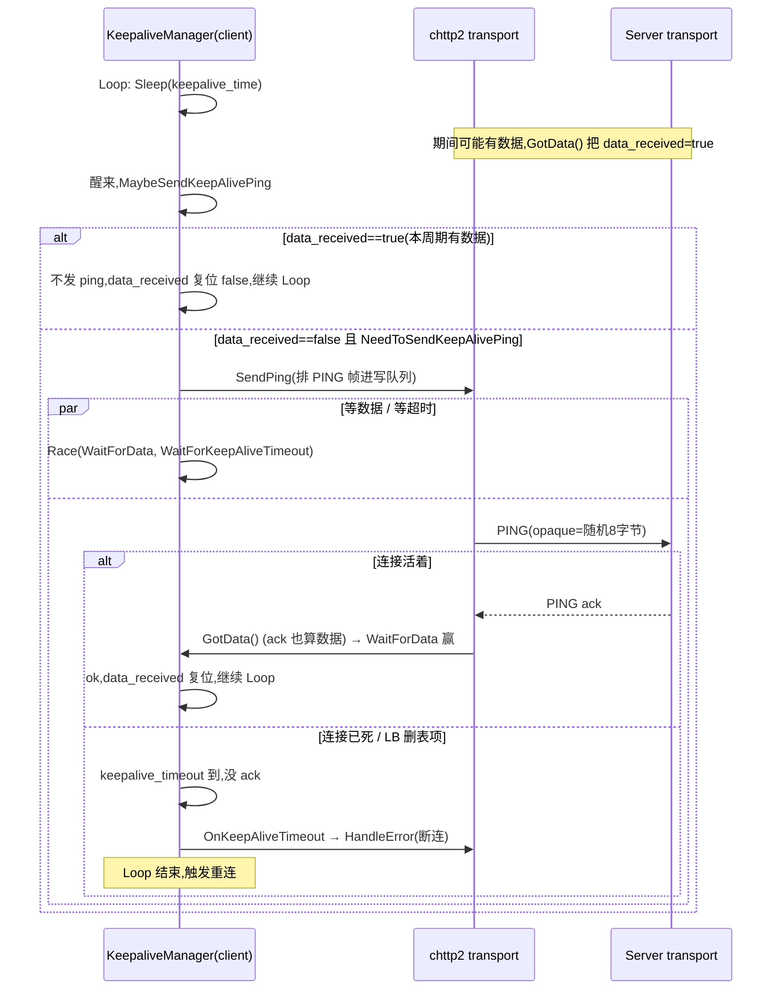

# 第 5 篇 · 第 17 章 · keepalive:探测死连接

> **核心问题**:一条 gRPC 连接,刚才能正常发请求,怎么过几分钟再发就卡半天、最后报个超时?TCP 内核层告诉你"连接还在",业务层却怎么也叫不醒对方——这种"**连接假活**"(half-open)是怎么产生的?gRPC 又怎么用 keepalive ping 把它揪出来?更微妙的是,既然 ping 能探活,服务端凭什么不能被一个手抖或恶意的客户端用海量 ping 打爆 CPU?这一章把"探活"和"防滥用"这对孪生问题一次讲透。

> **读完本章你会明白**:
> 1. 为什么光靠 TCP 层的 keepalive 不够,而要在 HTTP/2 应用层重新做一遍 keepalive ping/pong;云负载均衡器的"空闲超时"是怎么让连接"假活"的。
> 2. gRPC 的 keepalive 三个旋钮(`GRPC_ARG_KEEPALIVE_TIME_MS` / `GRPC_ARG_KEEPALIVE_TIMEOUT_MS` / `GRPC_ARG_KEEPALIVE_PERMIT_WITHOUT_CALLS`)各管什么、默认值为什么是那么奇怪的数字(2 小时 / 20 秒 / 关)。
> 3. 服务端怎么用 `Chttp2PingAbusePolicy`(strikes 三振出局)+ `Chttp2PingRatePolicy`(发端限速)两道闸,把恶意或失控的客户端直接 GOAWAY 掉——以及它为什么必须比"限制频率"做得更细。
> 4. 为什么 keepalive 在 gRPC 里默认是**客户端单向发起**,服务端默认不主动探活,以及 Promise 版 `KeepaliveManager` 是怎么用一个 `Loop` + `Race` 把"等数据 / 等超时 / 等 ack"三条异步线编织成一条不会卡死的探活环的。

> **如果一读觉得太难**:先只记住三件事——① keepalive ping 就是"喂?还在吗?"的应用层探活,默认 2 小时一次、20 秒没回就断;② 服务端对收到的 ping 有 strikes 机制,客户端 ping 太勤就直接 GOAWAY(ENHANCE_YOUR_CALM)断连;③ keepalive 默认只在有活跃调用时才发,要"连没调用也探"得双方都开 `permit_without_calls`。

---

## 〇、一句话点破

> **keepalive 是 gRPC 在 HTTP/2 应用层用 PING/pong 帧做的心跳:它每隔一段时间问一句"还在吗",超时没答就主动断掉这条已经"假活"的连接;但 ping 又是廉价的,所以服务端必须用 strikes 机制反制滥用——否则一个失控客户端能把服务端 CPU 打爆。**

这是结论,不是理由。本章倒过来拆:先讲清"假活"到底是怎么产生的、为什么 TCP keepalive 救不了你;再讲 gRPC 的 keepalive ping 怎么用 Promise 编织成一个不卡死的探活环;最后讲为什么这条环必须配两道反向的闸(abuse/rate policy),以及它和 P2-09 流控里 ping 限速的关系。

---

## 一、连接为什么会"假活"

### 一个让线上同学头皮发麻的场景

设想一个再普通不过的微服务部署:你的订单服务通过 gRPC 调用库存服务,中间隔了一层云厂商的 Network Load Balancer(NLB)。白天天天调用,好好的;凌晨流量低谷,几个小时没什么请求。早高峰第一波流量打过来,订单服务发现:库存服务的连接,内核告诉我"ESTABLISHED"啊,可发出去的请求**像石沉大海**,要等满 20 秒的 keepalive timeout(或者更糟,等到调用自己设的 deadline)才报错。

这就是"**连接假活**"(half-open connection):一端以为连接还在,另一端(或者中间的某个设备)**早就把它丢了**,只是没人通知这一端。

它有三种典型来源:

1. **TCP 半开**:对端进程崩了 / 机器掉了电 / 网线被拔了,但发出 RST/FIN 的那个包也丢了。这一端的内核还傻傻地维护着 TCP 状态机,以为连接健在。
2. **云负载均衡器 / NAT 的空闲超时**:这是生产里最常见的。AWS NLB 默认空闲超时 350 秒(可调到 10~3600 秒)、ELB 默认 60 秒、Kubernetes Service 的 conntrack 表项默认几小时无流量就回收。这些中间设备**不通知两端**就单方面把连接表项删了——它们不发 FIN,因为对它们来说这只是自己的一个表项,不是真正的连接。结果两端都以为连接在用,实际上中间的转发路径已经断了。
3. **内核 TCP keepalive 间隔太长**:Linux 默认的 TCP keepalive,空闲 **7200 秒(2 小时)**才开始探,每 75 秒探一次,探 9 次才认定连接死了——也就是说默认配置下,一条已经死了的连接,要 **2 小时 11 分 15 秒**内核才会告诉你"断了"。线上根本等不起。

> **不这样会怎样**:如果没有应用层 keepalive,客户端要么干等内核那 2 小时多的 TCP keepalive(业务早就超时了),要么靠每次业务调用失败 + 重试来"被动发现"连接死了。后者意味着每条死连接都得拿真实业务请求去"撞"一次、撞了再退避重连——延迟毛刺全部转嫁到真实用户身上。更要命的是,负载均衡器后面挂着的 N 个后端,如果同时被回收了大量连接,客户端会一次性发现"一堆后端都连不上",形成局部的连接重建风暴。

### 那为什么不用内核 TCP keepalive 就完事了

有人会问:这不就是 TCP keepalive 干的事吗(`setsockopt(SO_KEEPALIVE)`)?

确实,原理一样——都是"没数据时定时发个探针,等对方回"。但**用 TCP keepalone 救不了 gRPC 的场景**,原因有三:

1. **它探不到中间设备**:TCP keepalive 是端到端的 TCP 包,它确认的是"对端的 TCP 栈还在响应"。可 NLB 的空闲超时,删的是 NLB **自己**的连接表项——你的 TCP keepalive 包发出去,根本到不了对端(中间表项没了,直接丢),但你这一端的 TCP 栈却不知道,它会因为没收到对端的 keepalive ack 而触发重传……重传也丢……最后等到 TCP keepalive 计数耗尽。这条路径走完,耗时仍然是小时级的,且全程对应用不透明。
2. **它对 HTTP/2 的多路复用是浪费的**:一条 HTTP/2 连接上跑着成百上千条流。TCP keepalive 探的是"这条 TCP 连接活着",但 gRPC 真正想知道的是"这条 HTTP/2 连接还能不能正常传应用数据"——这俩不完全等价(比如对端 HTTP/2 层死锁了但 TCP 栈还活着,TCP keepalive 探不出来)。
3. **默认参数反人类**:上面说了,7200/75/9 这套默认值,在 RPC 场景里等于没用。改它要 root 改 `/proc/sys/net/ipv4/tcp_keepalive_*`(全局)或 `setsockopt`(每连接),前者影响整机所有连接,后者在容器 / 不透明调用栈里经常没法配。

> **所以这样设计**:gRPC 在 HTTP/2 应用层重新做一遍 keepalive——直接用 HTTP/2 协议自带的 PING/PONG(ACK)帧(`frame_ping.cc`)。这个帧穿的是 HTTP/2 的逻辑,经过 NLB 时和普通 DATA 帧一样会被转发(只要有数据流过,NLB 的空闲计时器就被重置),所以它能真正探到"这条端到端的 HTTP/2 通道是否还能传字节"。而且它是应用层语义,参数(发多勤、等多久)由 gRPC 的 channel arg 控制,精细到每条连接。

```
  没有 keepalive 时,死连接只能靠"撞"发现
  ┌────────┐                              ┌────────┐
  │ Client │ ── GetUser ──> [NLB 删表项] X │ Server │(以为连着)
  │        │ <─── 等 20s deadline ─────────│        │
  └────────┘                              └────────┘
   业务请求拿去"撞"死连接,延迟毛刺给用户

  有 keepalive 时,死连接被 ping 提前揪出来
  ┌────────┐  PING ──> [NLB 删表项] X  ──>  ┌────────┐
  │ Client │  等 20s 没 ack → 主动断 ──────>│ Server │
  └────────┘  触发重连,新连接接活           └────────┘
   死连接被定时探针提前发现,业务无感
```

> **钉死这件事**:keepalive 的本质,是把"连接是否还活着"这个判断,**从被动地等业务请求撞墙,变成主动地定时探针**。它不是为了"保活"而保活(虽然名字叫 keep-alive),而是为了**尽快发现已经死了的连接、抢在业务请求之前把它断掉重连**。这句话反过来理解就对了:**keepalive 的价值不在 ping 成功,而在 ping 失败时能多快地断连重连**。

---

## 二、keepalive 的三个旋钮

gRPC 把 keepalive 的行为压成三个 channel arg(定义在 [`include/grpc/impl/channel_arg_names.h:150-161`](../grpc/include/grpc/impl/channel_arg_names.h#L150-L161)):

| channel arg | 含义 | 默认值 |
|------|------|------|
| `grpc.keepalive_time_ms`(`GRPC_ARG_KEEPALIVE_TIME_MS`) | 多久没收到数据,就发一个 keepalive ping | 7200000(2 小时) |
| `grpc.keepalive_timeout_ms`(`GRPC_ARG_KEEPALIVE_TIMEOUT_MS`) | ping 发出后多久没收到 ack,就认定连接死了 | 20000(20 秒) |
| `grpc.keepalive_permit_without_calls`(`GRPC_ARG_KEEPALIVE_PERMIT_WITHOUT_CALLS`) | 没有活跃调用时,允不允许继续发 keepalive ping | 0(不允许) |

### 为什么默认 time 是 2 小时这么长

第一眼看到 `7200000ms = 2 小时`,你会觉得这默认值是不是写错了——线上哪有等 2 小时的?

它没写错,但**它不是为你的微服务场景设的默认值**。2 小时这个数字,是**故意对齐 Linux TCP keepalive 的默认空闲间隔**(7200 秒),意图是:在用户什么都没配的情况下,gRPC 的 keepalive 不会比内核 TCP keepalive 更激进,从而不引入额外的网络开销。换句话说,默认值是"**保守到等于没开**"。

要真正用起来,你得自己往下调。生产里常见的配置是:

```cpp
ChannelArguments args;
args.SetInt(GRPC_ARG_KEEPALIVE_TIME_MS, 30000);          // 30 秒无数据就 ping
args.SetInt(GRPC_ARG_KEEPALIVE_TIMEOUT_MS, 10000);       // 10 秒没 ack 就断
args.SetInt(GRPC_ARG_KEEPALIVE_PERMIT_WITHOUT_CALLS, 1); // 无调用也 ping
```

调到多勤才有用?**取决于你前面那层 LB 的空闲超时**。经验值:keepalive_time 要明显小于 LB 的空闲超时(NLB 默认 350 秒,那 keepalive_time 设 30~60 秒就有充分余量),保证在 LB 删表项之前就 ping 一下,把空闲计时器重置掉。

> **不这样会怎样**:如果你天真地以为"我开了 keepalive 就够了",但 `keepalive_time` 没改(还是 2 小时),而前面 NLB 是 350 秒超时——那你的 keepalive 根本来不及发(2 小时 >> 350 秒),NLB 早就把表项删了,你这条 keepalive 等于没开。**keepalive 的 time 必须显著小于链路上最短的那个空闲超时**,这是配 keepalive 的第一守则。

### permit_without_calls:无调用时还 ping 不 ping

第三个旋钮最微妙,它回答的是:**这条连接上现在一条活跃调用都没有,keepalive 还要不要继续 ping?**

默认是"不要"(0)。背后的考虑是:如果一条连接上没业务,那它"死"了也无伤大雅,等下次有调用时,建连 / 复用机制自然会处理。让它"无调用也持续 ping",意味着这条连接即便空闲也永远活着、永远占着资源——这违背了 HTTP/2 连接复用的初衷(连接是宝贵的、按需的)。

但有些场景你必须开它:

- **长连接池场景**:客户端想维持一个到后端的常驻连接池,即便此刻没调用,也希望连接别被中间设备超时掉,这样下一个调用能直接复用、不用重新建连 + TLS 握手。
- **server 主动 push / 双向流长连**:虽然技术上还有流在,但流可能长时间无数据(比如一个订阅流,服务端暂时没东西可推),这时也需要 keepalive 防止连接被 LB 干掉。

> **不这样会怎样**:`permit_without_calls` 不是开了就生效的——它有个**极易踩坑的前置条件**:**客户端和服务端都得开**,而且服务端还得额外允许。原因是:如果客户端单方面开了"无调用也 ping",而服务端默认配置不允许,那客户端这些 ping 就会被服务端的 abuse policy 当成"滥用"计数,几次 strike 后直接被 GOAWAY 掉(下一节详述)。所以这个旋钮实质上是个**双方协商的开关**,不是客户端单方能拍板的。生产里推 `permit_without_calls=1` 时,服务端必须同步配 `GRPC_ARG_HTTP2_MIN_RECV_PING_INTERVAL_WITHOUT_DATA_MS` 调宽,否则适得其反。

> **钉死这件事**:三个旋钮里,`time` 决定探多勤、`timeout` 决定等多久判死、`permit_without_calls` 决定空闲连接探不探。配 keepalive 的核心是:**time 要显著小于链路最短空闲超时;开 permit_without_calls 要客户端 + 服务端两边一起开**,否则要么来不及救、要么把自己送进 strikes 黑名单。

---

## 三、keepalive ping 的 Promise 环:`KeepaliveManager`

理解了"为什么"和"配什么",现在拆"怎么做到的"。gRPC 的 keepalive 实现,在源码里分两个版本:

- **经典架构**(`chttp2_transport.cc`):用一个三态状态机 `keepalive_state`(WAITING → PINGING → DYING)+ 定时器回调驱动,全锁保护。`chttp2_transport.cc:3332` 还能看到这段逻辑。
- **新 Promise 架构**(`keepalive.cc` / `keepalive.h`,2025 年新写):把整个探活环写成一个 `Loop` 里嵌 `Race` 的 Promise 组合,无显式状态机、无回调嵌套。

本章以**新版**为准,因为它最能体现 keepalive 的本质逻辑(经典版只是它的回调解构版本)。文件:[`src/core/ext/transport/chttp2/transport/keepalive.h`](../grpc/src/core/ext/transport/chttp2/transport/keepalive.h) 和 [`keepalive.cc`](../grpc/src/core/ext/transport/chttp2/transport/keepalive.cc)。

### 探活环的三条线

keepalive 这件事,本质上是三条异步线的赛跑:

1. **计时线**:睡 `keepalive_time` 这么久,看看这期间有没有数据来。
2. **数据线**:每收到一帧数据,标记"本周期收到过数据了"——那这一轮就不用 ping 了。
3. **超时线**:真发了 ping 之后,如果 `keepalive_timeout` 内没收到 ack,就判死、断连。

经典架构是把这三条线写成一堆带回调的定时器和状态机,互相通过 `keepalive_state` 字段协调。新 Promise 架构用 `Loop` + `Race` + `TrySeq` 把它们编织成一条线性的、可读的 promise 链。核心是 `KeepaliveManager::KeepaliveLoop`([`keepalive.cc:96-104`](../grpc/src/core/ext/transport/chttp2/transport/keepalive.cc#L96-L104)):

```cpp
Promise<absl::Status> KeepaliveManager::KeepaliveLoop() {
  keep_alive_spawned_ = true;
  return Loop([this]() {
    return TrySeq(
        Sleep(keepalive_time_), [this]() { return MaybeSendKeepAlivePing(); },
        []() -> LoopCtl<absl::Status> { return Continue(); });
  });
}
```

这一段翻译成人话就是:**死循环:睡一个 keepalive_time → 看看要不要发 ping → 继续**。`Loop` 是 gRPC promise 库的循环原语,`TrySeq` 是"按顺序执行,任一步失败就短路"的组合子,`Sleep` 是定时唤醒。整个循环跑在 transport 的 party(单线程执行器)上,所以 `KeepaliveManager` 的字段都不需要加锁。

### "要不要发 ping"的判断:`MaybeSendKeepAlivePing`

睡完一个周期,不是无脑就发 ping 的——有可能这期间正好有数据来,那这次 ping 就可以省掉。判断在 [`keepalive.cc:74-90`](../grpc/src/core/ext/transport/chttp2/transport/keepalive.cc#L74-L90):

```cpp
auto KeepaliveManager::MaybeSendKeepAlivePing() {
  return AssertResultType<absl::Status>(
      TrySeq(If(
                 NeedToSendKeepAlivePing(),
                 [this]() {
                   return If(
                       keepalive_timeout_ != Duration::Infinity(),
                       [this] { return TimeoutAndSendPing(); },
                       [this] { return SendPingAndWaitForAck(); });
                 },
                 []() { return Immediate(absl::OkStatus()); }),
             [this] {
               data_received_in_last_cycle_ = false;  // 关键:本周期标志复位
               return Immediate(absl::OkStatus());
             }));
}
```

判断要不要发,看 `NeedToSendKeepAlivePing`([`keepalive.h:119-122`](../grpc/src/core/ext/transport/chttp2/transport/keepalive.h#L119-L122)):

```cpp
bool NeedToSendKeepAlivePing() {
  return (!data_received_in_last_cycle_) &&
         (keep_alive_interface_->NeedToSendKeepAlivePing());
}
```

两个条件都满足才发:

1. **`data_received_in_last_cycle_ == false`**:本周期没收到任何数据。`GotData()`([`keepalive.h:53-65`](../grpc/src/core/ext/transport/chttp2/transport/keepalive.h#L53-L65))会在 transport 读到任何字节时被调用,把它置 true。这个标志在每轮循环结束时(`MaybeSendKeepAlivePing` 的尾巴)被复位回 false,准备下一轮。
2. **`keep_alive_interface_->NeedToSendKeepAlivePing()`**:这是问 transport 那一层"现在适合发 keepalive 吗"。在 client 端,它的实现是 [`http2_client_transport.cc:2120-2128`](../grpc/src/core/ext/transport/chttp2/transport/http2_client_transport.cc#L2120-L2128):

```cpp
bool Http2ClientTransport::KeepAliveInterfaceImpl::NeedToSendKeepAlivePing() {
  bool need_to_send_ping = false;
  {
    MutexLock lock(&transport_->transport_mutex_);
    need_to_send_ping = (transport_->keepalive_permit_without_calls_ ||
                         transport_->GetActiveStreamCountLocked() > 0);
  }
  return need_to_send_ping;
}
```

——即"`permit_without_calls` 开了,或者当前有活跃调用",才真发。这就是上一节讲的那条规则的代码出处。

> **不这样会怎样**:你可能会问,既然 `NeedToSendKeepAlivePing` 已经在 transport 层判了 permit / 有没有活跃流,为什么 `KeepaliveManager` 这层还要再判一个 `data_received_in_last_cycle_`?因为这两层判的是**不同维度**的事:transport 层判的是"**全局策略**允不允许发"(permit / 有没有流),`KeepaliveManager` 判的是"**这个周期有没有必要发**"(有数据来就不用发)。两层叠加,才能做到"该发的发、能省的省"——既不被 permit 卡死,也不白白发没必要的 ping。注释里特意点出:这样设计可能导致一次 ping 被推迟到约 `2 * keepalive_time` 才发,这是有意的省 ping 取舍。

### 真发 ping 时的"等数据 / 等超时"赛跑:`TimeoutAndSendPing`

如果决定要发,且 `keepalive_timeout_` 不是无穷(默认 20 秒),就进 [`TimeoutAndSendPing`](../grpc/src/core/ext/transport/chttp2/transport/keepalive.cc#L67-L73):

```cpp
auto KeepaliveManager::TimeoutAndSendPing() {
  return AllOk<absl::Status>(Race(WaitForData(), WaitForKeepAliveTimeout()),
                             SendPingAndWaitForAck());
}
```

这一行 Promise 把三件事并行起跑:

- `Race(WaitForData(), WaitForKeepAliveTimeout())`:**等数据**和**等超时**赛跑。谁先到谁赢。
  - `WaitForData`([`keepalive.h:98-110`](../grpc/src/core/ext/transport/chttp2/transport/keepalive.h#L98-L110))是个手写的 poll 闭包:如果 `data_received_in_last_cycle_` 已置 true 就立即返回 ok,否则挂起并存一个 waker,等 `GotData()` 唤醒。
  - `WaitForKeepAliveTimeout`([`keepalive.cc:42-66`](../grpc/src/core/ext/transport/chttp2/transport/keepalive.cc#L42-L66))睡 `keepalive_timeout`,醒来看 `data_received_in_last_cycle_`:有数据就 ok,没数据就把 `keep_alive_timeout_triggered_` 置 true(这是个"判死封印",保证后续 `WaitForData` 再也不会 resolve),然后回调 `OnKeepAliveTimeout` 让 transport 断连。
- `SendPingAndWaitForAck()`:实际把 ping 帧排进写队列,并等对应的 ack。

`AllOk` 把它俩"与"起来——任一失败(超时触发)整体就失败,进而让 `KeepaliveLoop` 整个 promise 结束(配合 transport 那边的错误处理,触发关连接)。

> **钉死这件事**:`Race` + `AllOk` 这套组合,是 Promise 架构把"两个异步事件谁先到"这个经典并发问题,写成一行声明式代码的范本。在经典架构里,这件事要靠手动维护 `keepalive_state` 状态机 + 定时器回调 + 状态转移,代码分支多、易错(忘记某个状态转移就死锁)。Promise 版本把"赛跑"直接变成 `Race`,把"都成功才算成功"变成 `AllOk`,逻辑意图一眼可读。这就是 gRPC 在搞的那场 callback → Promise 重构,在 keepalive 这个具体场景上落地的样子。

### 一个完整的探活周期

把上面的拼起来,一条 client 到 server 的连接上,keepalive 的完整生命周期是这样转的:



注意几个细节:① PING 的 ack 在 gRPC 里也走 `GotData()` 路径(因为 ack 也是字节流的一部分,frame_ping 收到 ack 时会触发数据通知),所以 `WaitForData` 能被 ack 唤醒;② 一旦 `keep_alive_timeout_triggered_` 被置 true,`GotData()` 会拒绝再设 `data_received_`([`keepalive.h:54-58`](../grpc/src/core/ext/transport/chttp2/transport/keepalive.h#L54-L58)),这是个"判死封印"——一旦决定判死,后续哪怕 ack 飘回来也救不了,保证 Loop 一定会结束;③ 整个 Loop 跑在 transport party 上,所以 `KeepaliveManager` 不加锁。

---

## 四、为什么服务端默认不主动探活

读到这里你可能有个疑问:keepalive 这么好,为什么不让服务端也主动 ping 客户端,双向探活?

事实是,**gRPC 默认就只让 client 主动 keepalive,server 端的 keepalive loop 默认是关的**。证据很直接:在新版 `Http2ServerTransport` 里,`MaybeSpawnKeepaliveLoop` 整个函数被注释掉了([`http2_server_transport.cc:1716-1720`](../grpc/src/core/ext/transport/chttp2/transport/http2_server_transport.cc#L1716-L1720)、[`http2_server_transport.h:534-542`](../grpc/src/core/ext/transport/chttp2/transport/http2_server_transport.h#L534-L542)、[`http2_server_transport.cc:2149`](../grpc/src/core/ext/transport/chttp2/transport/http2_server_transport.cc#L2149));而 client 端对应的 `MaybeSpawnKeepaliveLoop` 是激活的([`http2_client_transport.cc:2049-2056`](../grpc/src/core/ext/transport/chttp2/transport/http2_client_transport.cc#L2049-L2056))。

为什么这么设计?背后是个**责任归属**的取舍:

1. **谁更需要探活**:在 RPC 模型里,是 client 主动发起调用、client 需要可用连接、client 会在调用失败时受影响。Server 是被动接受连接的,一条死掉的 client 连接对 server 来说,最坏后果是占了一个文件描述符 + 一点内存,等下次写失败时自然就发现了。所以"探活的责任"在 client 更合理。
2. **N 票放大问题**:一个 server 可能挂着几万条 client 连接,如果每条都让 server 主动 ping,server 端的 ping 流量 + CPU 开销是 N 倍放大。反过来,每个 client 只需要 ping 自己那少数几条到后端的连接,放大系数小。
3. **协议不对称**:HTTP/2 的 PING 是双向的(任何一端都能发),但 gRPC 把"主动探活"这个语义默认只给了 client,把 server 的角色定为"被动响应 + 反制滥用"(下一节)。这是个明确的工程取舍,不是协议限制。

> **不这样会怎样**:如果 server 也默认主动 ping,在微服务网格里(一个 server 挂几千 client),ping 流量本身就成了不小的负担,而且每条连接两边都在 ping,白白翻倍。gRPC 把责任划给 client、让 server 专注"响应 + 反制",是个清晰的关注点分离。当然,如果你真有"server 端也想探活"的场景(比如 server push 模型),可以打开 server 的 keepalive,但默认是关的。

---

## 五、反制滥用:服务端的两道闸

讲完了 client 怎么 ping,现在反过来讲**最容易被忽略、却最关键的一半**:服务端怎么不被 ping 打爆。这是本章的重头戏,也是很多线上事故的根。

### 为什么"不限 ping"会出事

PING/pong 看起来人畜无害——8 字节 payload,echo 回来,能费几个 CPU?

费很多。设想一个攻击 / 失控场景:

- 一个手抖的程序员,把客户端 `keepalive_time_ms` 调成了 1 毫秒(本意是"1 秒",少写了单位)。
- 或者一个恶意的客户端,故意海量发 PING。

每收到一个 PING,服务端要做的事:① 中断通知 transport;② 解析帧头;③ 调 `ping_abuse_policy.ReceivedOnePing` 记一笔;④ 排一个 PONG(ack)进写队列;⑤ 唤醒写循环把它发出去。这一串在 server 端是每 ping 一次都跑一遍的。

更阴险的是,**PING 还能被当成隐蔽的带宽 / 连接探测信道**:攻击者可以通过 PING 的 RTT 探测 server 的负载、通过海量 PING 把 server 的写队列撑满、通过 PING 触发 server 端频繁的唤醒 / 上下文切换。RFC 9113 §6.7 明确把 PING 列为"**应当被限制频率**"的帧,就是为这个。

> **不这样会怎样**:如果服务端朴素地"来一个 PING 回一个 PONG",一个失控 / 恶意客户端就能用 PING 把服务端打爆——单连接 CPU 飙满、写队列堵塞、其他正常调用的 ack 被延后。这在多租户环境(比如共享的 gRPC 网关)是真实的安全问题。**keepalive 的滥用,是 gRPC 必须正面解决的工程问题,不是"谁会这么无聊"的假想敌**——CVE-2023-33953、CVE-2023-32732 都和这条攻击面有关。

### 第一道闸:`Chttp2PingAbusePolicy`(strikes 三振出局)

服务端在**收**到 PING 时,先过这道闸。实现:[`ping_abuse_policy.cc`](../grpc/src/core/ext/transport/chttp2/transport/ping_abuse_policy.cc)。

核心是 `ReceivedOnePing`([`ping_abuse_policy.cc:53-62`](../grpc/src/core/ext/transport/chttp2/transport/ping_abuse_policy.cc#L53-L62)):

```cpp
bool Chttp2PingAbusePolicy::ReceivedOnePing(bool transport_idle) {
  const Timestamp now = Timestamp::Now();
  const Timestamp next_allowed_ping =
      last_ping_recv_time_ + RecvPingIntervalWithoutData(transport_idle);
  last_ping_recv_time_ = now;
  if (next_allowed_ping <= now) return false;       // 没超速,放行
  // 收到 ping 太勤了:记一次 strike
  ++ping_strikes_;
  return ping_strikes_ > max_ping_strikes_ && max_ping_strikes_ != 0;
}
```

逻辑:

1. 算出"上一次 ping + 允许间隔"= 下一个允许的 ping 时刻。
2. 如果当前时刻 >= 这个时刻(没超速),strike 不增加,返回 false(放行)。
3. 如果当前时刻 < 这个时刻(超速了,即"too soon"),strike+1。如果 strike 超过 `max_ping_strikes_`(默认 2),返回 true——**该断连了**。

"允许间隔"`RecvPingIntervalWithoutData`([`ping_abuse_policy.cc:73-82`](../grpc/src/core/ext/transport/chttp2/transport/ping_abuse_policy.cc#L73-L82))有个精巧的双档:

```cpp
Duration Chttp2PingAbusePolicy::RecvPingIntervalWithoutData(
    bool transport_idle) const {
  if (transport_idle) {
    // 空闲连接:对齐 TCP keep-alive 的 2 小时
    return Duration::Hours(2);
  }
  return min_recv_ping_interval_without_data_;
}
```

- **transport_idle(无活跃流且 permit_without_calls=0)**:允许间隔拉到 **2 小时**。注释直接点出:这是对齐 RFC 1122 的 TCP keep-alive 默认值——空闲连接上,服务端只容忍 2 小时一次的 ping 量级。
- **非空闲**:用 channel arg `GRPC_ARG_HTTP2_MIN_RECV_PING_INTERVAL_WITHOUT_DATA_MS` 配置,默认 **5 分钟**(`g_default_min_recv_ping_interval_without_data = Duration::Minutes(5)`,[`ping_abuse_policy.cc:28`](../grpc/src/core/ext/transport/chttp2/transport/ping_abuse_policy.cc#L28))。

strike 计数能被**清零**:`ResetPingStrikes`([`ping_abuse_policy.cc:84-87`](../grpc/src/core/ext/transport/chttp2/transport/ping_abuse_policy.cc#L84-L87))。它什么时候被调?答案是**服务端发出一帧数据 / 收到一帧数据时**(`PingManager::ResetPingClock` 里的 `ping_abuse_policy_.ResetPingStrikes()`,[`ping_promise.h:212-217`](../grpc/src/core/ext/transport/chttp2/transport/ping_promise.h#L212-L217))。这背后的意图很妙:**strike 是"无数据时 ping 太勤"的惩罚,一旦有真实数据流动,就原谅之前的 strike**——因为"有数据流动"本身就说明这不是纯滥用,而是正常的 keepalive 穿插在业务里。

返回 true(该断)之后呢?在 [`frame_ping.cc:101-112`](../grpc/src/core/ext/transport/chttp2/transport/frame_ping.cc#L101-L112) 里:

```cpp
if (!t->is_client) {
  const bool transport_idle =
      t->keepalive_permit_without_calls == 0 && t->stream_map.empty();
  // ...
  if (t->ping_abuse_policy.ReceivedOnePing(transport_idle)) {
    grpc_chttp2_exceeded_ping_strikes(t);
  }
}
```

`grpc_chttp2_exceeded_ping_strikes`([`chttp2_transport.cc:2239-2251`](../grpc/src/core/ext/transport/chttp2/transport/chttp2_transport.cc#L2239-L2251))做的事是:

```cpp
send_goaway(t, grpc_error_set_int(GRPC_ERROR_CREATE("too_many_pings"),
                                  StatusIntProperty::kHttp2Error,
                                  Http2ErrorCode::kEnhanceYourCalm),
            /*immediate_disconnect_hint=*/true);
close_transport_locked(t, ... GRPC_STATUS_UNAVAILABLE);
```

——发 GOAWAY,带 `ENHANCE_YOUR_CALM` 这个 HTTP/2 错误码(RFC 9113 §7.2.3 专门为"对端行为不端"设的码),然后立刻关连接。这正是 RFC 9113 §7.2.3 推荐的"对过多 PING 的处罚"。

> **钉死这件事**:abuse policy 不是简单地"频率超过 X 就拒绝",而是**三振出局**——超速记一次 strike,连续超速累计到一定次数才断。配合"有数据流动就清零 strike",它精确地区分了"正常 keepalive 偶尔踩线"和"持续滥用"。这个容忍度设计,是为了不误伤正常的 keepalive(毕竟 keepalive 本身就是合法行为),同时坚决掐死真正的滥用。

### 第二道闸:`Chttp2PingRatePolicy`(发端限速)

abuse policy 是**收端**(server)的反制。还有一道闸在**发端**(client 自己也限速),叫 `Chttp2PingRatePolicy`([`ping_rate_policy.cc`](../grpc/src/core/ext/transport/chttp2/transport/ping_rate_policy.cc))。它管的是"我自己作为 client,允不允许自己发这么多 ping"。

`RequestSendPing`([`ping_rate_policy.cc:58-91`](../grpc/src/core/ext/transport/chttp2/transport/ping_rate_policy.cc#L58-L91))返回三种结果之一:

```cpp
RequestSendPingResult RequestSendPing(Duration next_allowed_ping_interval,
                                      size_t inflight_pings) const {
  if (max_inflight_pings_ > 0) {
    if (inflight_pings > max_inflight_pings_) return TooManyRecentPings{};
  }
  const Timestamp next_allowed_ping = last_ping_sent_time_ + next_allowed_ping_interval;
  const Timestamp now = Timestamp::Now();
  if (next_allowed_ping > now) return TooSoon{...};
  // 无数据时把 ping 节流到 1 分钟一道
  if (max_pings_without_data_sent_ != 0 && pings_before_data_sending_required_ == 0) {
    const Timestamp next_allowed_ping = last_ping_sent_time_ + kThrottleIntervalWithoutDataSent;
    if (next_allowed_ping > now) return TooSoon{...};
  }
  return SendGranted{};
}
```

三道关卡:

1. **`TooManyRecentPings`**:在飞的(inflight,已发未收 ack)ping 太多。经典版默认只允许 1 个在飞(老 gRPC 隐式规则),新版的 `multiping` experiment 打开后默认允许 100 个在飞([`ping_rate_policy.cc:46-49`](../grpc/src/core/ext/transport/chttp2/transport/ping_rate_policy.cc#L46-L49))。这是为了 BDP 估计等场景能并发 ping。
2. **`TooSoon`**:距离上次发 ping 太近(小于 `next_allowed_ping_interval`)。
3. **无数据时节流**:`kThrottleIntervalWithoutDataSent = Duration::Minutes(1)`([`ping_rate_policy.cc:32`](../grpc/src/core/ext/transport/chttp2/transport/ping_rate_policy.cc#L32))——如果发了一定数量的 ping(默认 `max_pings_without_data_sent_ = 2`)却没发任何 DATA/HEADERS,后续的 ping 被节流到 1 分钟一次。`pings_before_data_sending_required_` 每发一个 ping 减 1,发了数据后通过 `ResetPingsBeforeDataRequired` 复位([`ping_rate_policy.cc:104-106`](../grpc/src/core/ext/transport/chttp2/transport/ping_rate_policy.cc#L104-L106))。

> **不这样会怎样**:如果没有发端限速,即便服务端有 abuse policy,客户端也可能在"strike 累积到断连"之前已经发了大量 ping——这段时间内服务端 CPU 已经被打了一波。发端限速是"**先自省再出门**":client 自己先把自己的 ping 频率压下来,根本不让那么多 ping 出门,服务端那道闸就很少被触发。两道闸一前一后,**发端限速是默认防线,服务端 abuse 是兜底强制手段**。

### 和 P2-09 流控的关系

细心的读者会发现:这套 ping rate/abuse 的机制,在 P2-09 流量控制那章也会出现(它管 BDP 估计用的 ping)。这两处不冲突,是**同一套机制服务两个目的**:

- P2-09 视角:ping 是 BDP 估计的探针,限速是为了不让 BDP 探针本身淹没连接。
- 本章视角:ping 是 keepalive 的探针,限速 + abuse 是为了不让"探活"变成"攻击"。

底层用的是**同一批代码**(`Chttp2PingRatePolicy` / `Chttp2PingAbusePolicy` / `PingManager`),因为不管是 BDP ping 还是 keepalive ping,**对网络而言都是 PING 帧,必须共享同一套限速 / 反制规则**——否则一种用途绕开另一种的限制。这是 gRPC 把"ping 的治理"统一抽出来成独立 policy 类的设计动机。P2-09 讲协议层(window/BDP)时讲 ping 限速的协议层动机;本章讲应用层 keepalive 怎么**消费**这套已有限速,以及为什么 keepalive 必须服从它。

---

## 六、技巧精解:ping 滥用防护为什么必须是 strikes + 双档间隔

这一节单独拆透本章最硬的技巧——**为什么不朴素地"频率超限就断",而要搞 strikes + 双档间隔 + 数据清零这套组合**。这是设计上最容易被低估的精妙处。

### 朴素方案会撞什么墙

假设你是个新手机制设计者,面对"客户端 ping 太频繁怎么办",最朴素的方案是:

> **记录最近一段时间窗口内收到的 ping 数,超过阈值就 GOAWAY。**

听起来合理,撞上去试试:

**墙一:误伤正常 keepalive。** 假设你设"5 分钟内最多 3 个 ping,超了断"。一个正常的 client,配了 `keepalive_time=10s`(为了穿过 NLB 350s 超时),它每 10 秒 ping 一次,5 分钟内会发 30 个 ping——直接被你断连。可它根本没滥用,只是 keepalive 配得勤了点(完全合法)。朴素方案分不清"勤 keepalive"和"滥用"。

**墙二:空闲连接的合法 ping 也被卡。** 一个 client 开了 `permit_without_calls`,想维持空闲连接活着,它每隔几分钟 ping 一次。朴素方案的固定窗口 / 阈值,要么太严(误伤这种合法空闲 ping),要么太松(放掉真正的滥用)。

**墙三:瞬时毛刺直接断连,没有容忍。** 网络抖动 / 重传可能导致几个 ping 短时间内扎堆到达(不是因为 client 真的发了那么多,而是网络延迟波动让它们凑一起)。朴素方案一看"超阈值",直接 GOAWAY——可这只是一次毛刺,过会儿就正常了,断连代价巨大(要重连、要重新分配 stream、要重新跑 TLS 握手)。

### gRPC 的解法:三态判别

gRPC 的 `Chttp2PingAbusePolicy` 用三个精巧的设计一起破解这三堵墙:

**1. 双档间隔(transport_idle 区分)。** 不是一刀切的频率阈值,而是先看"这条连接现在闲不闲":

```cpp
Duration RecvPingIntervalWithoutData(bool transport_idle) const {
  if (transport_idle) return Duration::Hours(2);    // 空闲:2 小时一档
  return min_recv_ping_interval_without_data_;      // 非空闲:默认 5 分钟一档
}
```

`transport_idle` 在 `frame_ping.cc:103` 的定义是 `keepalive_permit_without_calls == 0 && stream_map.empty()`——即"既没开 permit,又没活跃流"。这种情况下的 ping,本来就不是为了业务,容忍度极低(2 小时一次才正常,因为对齐 TCP keepalive)。非空闲的 ping,容忍度宽一些(默认 5 分钟)。这破解了**墙二**:不同状态用不同尺度,空闲连接的合法 ping 不会被误伤,真正的滥用又能用 2 小时这把严格的尺子卡死。

**2. strikes 三振出局,而非一超即断。** 即便超速了,不是马上断,而是记一次 strike,连续 strike 超过 `max_ping_strikes_`(默认 2)才断。这破解了**墙三**:瞬时毛刺可能产生 1~2 次超速,但很难连续 3 次,所以毛刺被容忍,持续滥用才会被掐。

**3. 有数据流动就清零 strikes。** 这是 `ResetPingStrikes` 的作用——一旦服务端发出或收到真实数据,strike 计数归零。这破解了**墙一**:正常 keepalive(勤但穿插在业务里的 ping)会因为业务数据流动而不断清零 strike,永远不会累积到断连;只有那种**纯 ping 无数据**的真滥用,strike 才会一路累积到三振。

把三个机制叠起来,判别逻辑变成:

| 场景 | transport_idle | 超速? | 有数据清零? | 结果 |
|------|---|---|---|---|
| 正常 keepalive(穿插业务) | 否 | 偶尔 | 是 | strike 清零,永不断 |
| 勤 keepalive(纯探活,无业务) | 是 | 是 | 否 | strike 累积,三振断 |
| 失控 client(配错 time) | 否 | 是 | 否 | strike 累积,三振断 |
| 恶意 PING flood | 否 | 是 | 否 | strike 累积,三振断 |
| 网络毛刺(瞬时扎堆) | 否 | 偶尔 | 看后续 | 容忍 1~2 次,不断 |

这张表就是整个 abuse policy 的设计意图:**用"容忍度"区分状态,用"strike"过滤毛刺,用"数据清零"区分正常 keepalive 和纯滥用**。

> **钉死这件事**:这套设计的精妙之处,不在于"它限制了 ping"(那谁都做得出来),而在于**它在不误伤合法 keepalive 的前提下,精准识别出滥用**。这是分布式系统里一类经典难题——"如何区分正常的高频行为和恶意的高频行为"——的标准解法:**不是看频率本身,而是看频率 + 上下文(有没有数据) + 历史(连续性)**。gRPC 把这套判别逻辑压进一个不到 100 行的 `Chttp2PingAbusePolicy` 类,是"小代码解决大问题"的范例。

---

## 七、配置实战与坑

把上面的原理落到生产配置上。下面这张表是 keepalive 相关 channel arg 的全集(含 abuse/rate 那几条):

| arg | 谁用 | 默认 | 含义 |
|------|------|------|------|
| `grpc.keepalive_time_ms` | 双向 | 7200000(2h) | 多久无数据后 ping |
| `grpc.keepalive_timeout_ms` | 双向 | 20000(20s) | ping 后多久没 ack 判死 |
| `grpc.keepalive_permit_without_calls` | 双向 | 0 | 无活跃流时是否 ping |
| `grpc.http2.min_ping_interval_without_data_ms`(`GRPC_ARG_HTTP2_MIN_RECV_PING_INTERVAL_WITHOUT_DATA_MS`) | server 收 | 300000(5min) | server 容忍的 client ping 最小间隔(非空闲) |
| `grpc.http2.max_ping_strikes`(`GRPC_ARG_HTTP2_MAX_PING_STRIKES`) | server 收 | 2 | server 容忍的超速次数,0=无限 |
| `grpc.http2.max_pings_without_data`(`GRPC_ARG_HTTP2_MAX_PINGS_WITHOUT_DATA`) | client 发 | 2 | client 发多少 ping 后必须发数据 |
| `grpc.http2.max_inflight_pings`(`GRPC_ARG_HTTP2_MAX_INFLIGHT_PINGS`) | client 发 | 1 或 100(multiping) | client 允许同时在飞的 ping |

### 经典配置场景

**场景一:穿过云 LB 的常规微服务**。LB 空闲超时 350s,client 想保活:

```
client:
  keepalive_time_ms = 30000       // 30s,远小于 350s
  keepalive_timeout_ms = 10000    // 10s 判死
  keepalive_permit_without_calls = 0  // 不需要无调用 ping
server:
  // 默认即可,因为 client ping 间隔 30s 但有业务数据清零 strike
```

注意:这里 client ping 间隔 30s,而 server 默认 `min_recv_ping_interval = 5min`,看起来 client 必然超速——但只要有业务数据流动,strike 会被清零,所以不会断。**这就是 strike 清零机制的价值**:它让"勤 keepalive + 正常业务"能共存。

**场景二:长连接池 / 空闲保活**。client 要维持连接池,即便没业务也保活:

```
client:
  keepalive_time_ms = 60000
  keepalive_timeout_ms = 20000
  keepalive_permit_without_calls = 1   // 关键:无调用也 ping
server:
  GRPC_ARG_HTTP2_MIN_RECV_PING_INTERVAL_WITHOUT_DATA_MS = 10000  // 关键:放宽到 10s
  GRPC_ARG_HTTP2_MAX_PING_STRIKES = 5  // 可选:更宽容
```

**坑就在这里**:如果你只改了 client 的 `permit_without_calls=1`,没动 server 的 `min_recv_ping_interval`,client 每 60s ping 一次(无数据),server 默认 5min 才允许一次——直接超速。由于没有业务数据(这是空闲保活),strike 不会清零,几个周期后 client 被 GOAWAY。**两边的配置必须配对改**,这是 keepalive 最常见的线上坑。

**场景三:server 端也想要 keepalive**。默认 server 不 ping,真要开得改源码 / 等社区把 server 的 `MaybeSpawnKeepaliveLoop` 启用(当前是注释掉的)。绝大多数场景不需要——让 client 探就够了。

> **钉死这件事**:keepalive 的配置是个**两端协调**的事,不是 client 单方面能搞定的。生产事故里,一大半的 keepalive 问题都源于"client 改了、server 没改"或"改了 client 的 time 却忘了 permit 需要两边都开"。记住三个守则:① time 显著小于链路最短空闲超时;② permit_without_calls 两边一起开;③ 改 client ping 频率时同步检查 server 的 `min_recv_ping_interval`。

---

## 八、章末小结

### 回扣主线

keepalive 服务的是二分法的**框架层 / 可用**那一面——它不改变字节怎么编码过线(那是协议层的事),它管的是"**这条连接、这些字节赖以流动的管道,到底还通不通**"。和 P2-09 的流量控制(管"通的话别淹死")是一对孪生:P2-09 保证通的连接不被数据淹,keepalive 保证不通的连接被尽早发现。两者底层都依赖 HTTP/2 的 PING 帧,所以共享同一套 ping rate/abuse 限速机制——这是 gRPC 把 ping 治理统一抽出来的根。

### 五个为什么

1. **为什么不用内核 TCP keepalive,要在 HTTP/2 应用层重做一遍?**——TCP keepalive 探不到云 LB / NAT 的空闲超时(它们删的是自己的表项,不发 FIN),且默认 2 小时太长、改参数要么全局要么每连接 `setsockopt` 不灵活;HTTP/2 的 PING 帧是端到端应用层语义,穿过 LB 时和 DATA 一样会被转发,参数由 gRPC channel arg 精细控制。
2. **为什么 keepalive_time 默认是 2 小时?**——对齐 Linux TCP keepalive 的默认空闲间隔(7200s),意图是"用户不配时不要比内核更激进、不引入额外开销",等于"默认约等于没开",用户必须自己往下调。
3. **为什么 keepalive 默认只 client 主动 ping,server 不主动?**——责任归属取舍:client 主动发起调用、需要可用连接、调用失败时受损;server 被动接受连接,死连接最坏后果是占 fd。N 个 client 连一个 server,server 主动 ping 是 N 倍放大。gRPC 把"主动探活"语义默认只给 client,server 专注"响应 + 反制"。
4. **为什么 ping 必须限速防滥用?**——PING 帧廉价但触发服务端一串处理(中断 / 解析 / 排队 / 唤醒),失控或恶意 client 能用它打爆 server CPU,RFC 9113 §7.2.3 都专门设了 ENHANCE_YOUR_CALM 码;CVE-2023-33953 等真实漏洞都和这条攻击面有关。
5. **为什么 abuse 用 strikes + 双档间隔 + 数据清零,而不朴素地"频率超限就断"?**——朴素方案会误伤正常勤 keepalive、误伤空闲保活、误断瞬时毛刺;strikes(过滤毛刺)+ 双档间隔(区分空闲 / 非空闲)+ 数据清零(区分正常 keepalive 和纯滥用)三者叠加,才能在不误伤的前提下精准识别滥用。

### 想继续深入往哪钻

- 想看 Promise 版 keepalive 的完整实现:读 [`keepalive.cc`](../grpc/src/core/ext/transport/chttp2/transport/keepalive.cc)(106 行,极精简),配合 [`keepalive.h`](../grpc/src/core/ext/transport/chttp2/transport/keepalive.h) 的接口注释,看 `Loop`/`Race`/`TrySeq`/`AllOk` 怎么编织三条异步线。
- 想看经典架构的 keepalive 状态机:读 [`chttp2_transport.cc`](../grpc/src/core/ext/transport/chttp2/transport/chttp2_transport.cc) 里 `keepalive_state`(WAITING/PINGING/DYING)相关的代码(~L3300 附近),对照 Promise 版理解"为什么重构"。
- 想理解 PING 帧的协议细节:读 [`frame_ping.cc`](../grpc/src/core/ext/transport/chttp2/transport/frame_ping.cc)(legacy 版,处理收到的 PING),配合 RFC 9113 §6.7(PING 帧)和 §7.2.3(ENHANCE_YOUR_CALM)。
- 想看 ping rate/abuse policy 的完整逻辑:读 [`ping_abuse_policy.cc`](../grpc/src/core/ext/transport/chttp2/transport/ping_abuse_policy.cc)(< 100 行)和 [`ping_rate_policy.cc`](../grpc/src/core/ext/transport/chttp2/transport/ping_rate_policy.cc)。
- 想用 channelz 观测一条连接的 keepalive / ping 状态:`PingManager` 和 `Chttp2PingRatePolicy` 都暴露了 `ChannelzProperties()`(`ping_rate_policy.h:83-90`),P6-20 会讲怎么把它们捞出来。

### 引出下一章

keepalive 解决的是"连接活着吗"——它探的是 TCP/HTTP/2 通道本身。但"通道活着"和"上面的服务能接活"是两件事:一条连接好好的,可服务端进程在预热、依赖的数据库挂了、或者这个 service 实例已经过载,这时发业务请求照样失败。客户端怎么提前知道?下一章 P5-18,我们讲 gRPC 怎么用一条**独立的健康检查流**(out-of-band,复用 gRPC 自己传 `grpc.health.v1.Health` 状态)让 SubChannel 实时知道后端的真健康,以及怎么用 server reflection 在运行时反射服务定义、不用重新部署就能调试。

> **下一章**:[P5-18 · 健康检查与服务反射](P5-18-健康检查与服务反射.md)
