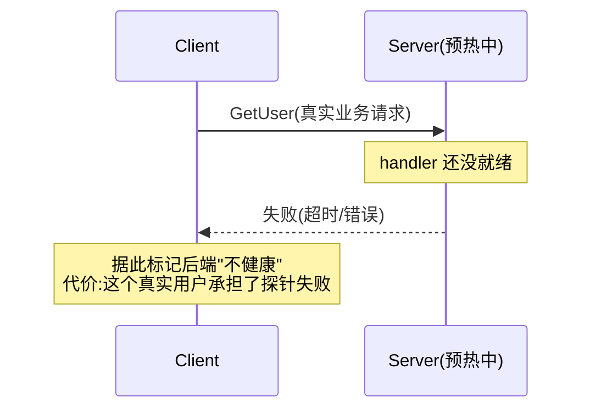
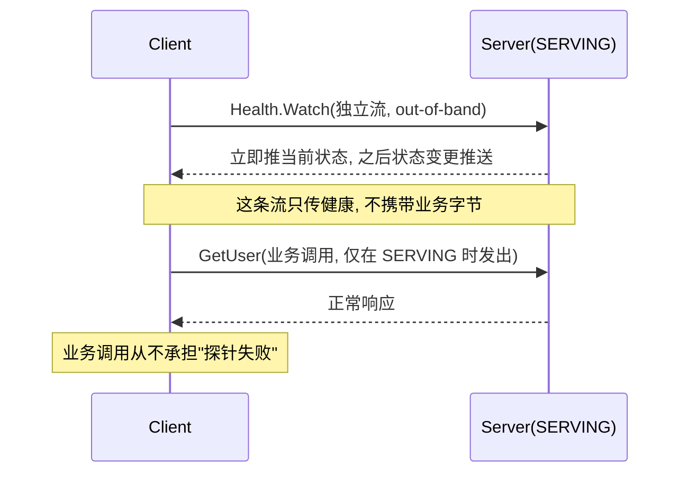

# 第 5 篇 · 第 18 章 · 健康检查与服务反射

> **核心问题**:你的客户端拿到一条 READY 的连接,可发请求过去照样失败——因为服务端进程正在预热、依赖的数据库挂了、或者这个 service 实例已经过载。**"连接活着"和"服务能接活"是两件事**,客户端怎么提前知道?反过来,你想用 `grpcurl` 调一个服务,手上只有地址、没有 `.proto`,能不能让服务端在运行时**自己把服务定义吐出来**、不用重新部署就能动态调用?这一章讲 gRPC 把"健康"和"反射"都做成**自己用 gRPC 流来传**的两件利器。

> **读完本章你会明白**:
> 1. 为什么 gRPC 不在连接层做健康检查,而要定义一个标准的 `grpc.health.v1.Health` 服务、让客户端用一条**业务流之外的健康流**(out-of-band)去探;SERVING / NOT_SERVING / UNKNOWN / SERVICE_UNKNOWN 四态各代表什么。
> 2. 为什么健康检查用 `Watch`(服务端流、状态变更推送)而不是 `Check`(轮询);服务端 `DefaultHealthCheckService` 怎么把状态变更推给一堆 watcher 而不爆 CPU。
> 3. 客户端怎么用 `SubchannelStreamClient` 在 SubChannel 上**维持一条常驻健康流**,失败带退避重试、UNIMPLEMENTED 永不重试,以及为什么这条流必须独立于业务调用。
> 4. server reflection(`grpc.reflection.v1`)怎么用一条双向流让你在运行时列出服务、按符号 / 文件名查 `.proto`,让 `grpcurl` 这类工具不用 `.proto` 也能调。

> **如果一读觉得太难**:先只记住三件事——① 健康检查是 gRPC 自己定义的一个标准 service(`grpc.health.v1.Health`),客户端在每条 SubChannel 上开一条 `Watch` 流拿状态;② LB 拿到的连接状态已经融合了健康(`MakeHealthCheckWatcher` 挂成 SubChannel 的 data watcher),所以"不健康"的后端不会被挑中;③ reflection 让服务端运行时把 `.proto` 定义吐出来,`grpcurl` 不带 proto 也能调。

---

## 〇、一句话点破

> **健康检查是 gRPC 复用自己(一条 server-streaming `Watch`)来传"ServingStatus"的应用层探针,它独立于业务流、专门告诉客户端"这个后端现在到底能不能接活";server reflection 则是复用一条双向流让服务端运行时把服务定义吐出来,换"不重新部署就能调试 / 动态调用"。两者都是"gRPC 用 gRPC 治理 gRPC"的范例。**

这是结论,不是理由。本章倒过来拆:先讲清"连接 READY ≠ 服务能接活"这件事,再讲 gRPC 怎么用一个标准 proto + 一条 out-of-band 流把健康探出来、怎么把它织进 SubChannel 让 LB 拿到的就是真健康;然后讲 reflection 的双向流怎么让你不带 `.proto` 也能调;最后技巧精解拆"为什么必须独立流"。

---

## 一、连接 READY 不等于服务能接活

### 一个让 LB 误判的典型场景

承接 P4-14 SubChannel。客户端通过 SubChannel 维护到后端的连接,连接状态机是 `IDLE → CONNECTING → READY → TRANSIENT_FAILURE`。当 SubChannel 进入 `READY`,意味着 TCP + TLS(如果有)+ HTTP/2 SETTINGS 协商都完成了——**通道层面,这条连接能用**。

于是 LB(P4-15)满心欢喜地把它放进了 picker 的可选列表,下次调用就挑它。可请求发过去,**失败了**。原因可能是:

1. **服务端还在预热**:进程刚起,HTTP/2 连接已经建好了,但业务 handler 还在加载模型 / 连数据库 / warm up 缓存。这时发请求,要么超时、要么报错。
2. **依赖挂了**:服务端的数据库 / 下游服务连不上,业务方法一调就失败。连接本身完全正常。
3. **过载 / 降级**:服务端实例自己主动标记"我现在不接活"(比如检测到 CPU 飙高、内存压力、队列堆积),希望 LB 别往这儿导流量。
4. **配置 / 部署的过渡态**:滚动发布时,新版本的实例起好了连接、但 schema 还没迁移完,业务方法暂时不可用。

这四种情况,**连接都是 READY 的,但服务其实接不了活**。

> **不这样会怎样**:如果客户端只信"连接 READY 就能用",这些场景下,每个发往"假 READY"后端的请求都会真的失败一次,然后 retry(P4-16)换一个后端重试。代价是:① 用户感知到延迟毛刺(失败 + 退避 + 重试);② 失败的请求可能已经触发了服务端的副作用(非幂等的);③ 如果一批后端同时进入"假 READY"(比如滚动发布时),retry 还会形成小型雪崩。**理想的解法是:在后端真正能接活之前,根本不让 LB 把流量导过去**——这需要一个比"连接 READY"更细粒度的信号。

### 答案:一个标准化的应用层健康信号

gRPC 的解法定义在 [`src/proto/grpc/health/v1/health.proto`](../grpc/src/proto/grpc/health/v1/health.proto)。它就是一个普通的 gRPC service:

```protobuf
service Health {
  rpc Check(HealthCheckRequest) returns (HealthCheckResponse);
  rpc Watch(HealthCheckRequest) returns (stream HealthCheckResponse);
}

message HealthCheckResponse {
  enum ServingStatus {
    UNKNOWN = 0;
    SERVING = 1;
    NOT_SERVING = 2;
    SERVICE_UNKNOWN = 3;  // Only used by Watch
  }
  ServingStatus status = 1;
}
```

注意几件事:

1. **它就是一个普通的 gRPC service**。不是新协议、不是新帧、不是 HTTP/2 层的新机制。客户端要查健康,就是调一次 `Health.Check` 或开一条 `Health.Watch` 流——和你调业务方法用的完全是同一套 gRPC 栈(filter / channel / chttp2 / HTTP/2 stream)。这是"gRPC 用 gRPC 治理自己"的优雅之处。
2. **状态粒度是 service 不是 server**。`HealthCheckRequest` 里有个 `service` 字段——一个 server 可以注册多个 service,每个 service 各有自己的健康状态。这让"server 进程活着,但其中某个 service 不可用"(比如某个依赖特定外部资源的 service)能被精确表达。
3. **四态而非两态**。直觉上健康就是"行 / 不行",但 proto 定义了四个枚举值,各有用途(下节拆)。

> **钉死这件事**:gRPC 的健康检查,本质是**把"服务能不能接活"这件事,从猜测和撞墙,变成一个标准化的、可被 LB 消费的应用层信号**。它和 P5-17 的 keepalive 是一对孪生:keepalive 探"通道活不活",健康检查探"通道活的前提下,服务活不活"。两者一前一后,把"连接可用"细分成两层。

---

## 二、四态语义与 Watch 优于 Check

### 四个状态各代表什么

`HealthCheckResponse.ServingStatus` 的四个值:

| 状态 | 含义 | 典型场景 |
|------|------|------|
| `UNKNOWN`(0) | 不知道 | 默认值;服务刚起还没报告状态 |
| `SERVING`(1) | 正常服务 | 一切就绪,可以接活 |
| `NOT_SERVING`(2) | 不服务 | 预热中 / 依赖挂 / 主动降级 / 关停中 |
| `SERVICE_UNKNOWN`(3) | 这个 service 不存在 | **只用于 Watch**:客户端 Watch 的 service 名字服务端没注册 |

前三个是 `Check` 和 `Watch` 都会返回的。第四个 `SERVICE_UNKNOWN` 是个细节设计:它**只用于 `Watch`**——当你 `Watch` 一个名字叫 `Foo` 的 service,而服务端根本没注册 `Foo` 时,服务端**不会**直接关流(那样客户端分不清"service 不存在"和"流断了"),而是先推一个 `SERVICE_UNKNOWN`,然后保持流开着;等服务端将来注册了 `Foo`,再推一个真实状态。proto 注释特意强调了这个语义([`health.proto:37`](../grpc/src/proto/grpc/health/v1/health.proto#L37))。

> **不这样会怎样**:如果 service 不存在时直接关流 / 报错,客户端就分不清"暂时不存在"和"永远不存在"。`SERVICE_UNKNOWN` + 保持流开着,让"未来 service 被注册"这个事件能被推到客户端——这是为动态服务发现预留的口子。

还有一个隐式的"状态":**整个 Health 服务本身不存在**(服务端没启用)。这时客户端 `Check` 会得到 `UNIMPLEMENTED`(这是 gRPC 标准状态码)。这个情况客户端的处理很关键——下文 `SubchannelStreamClient` 的注释明确说:**`UNIMPLEMENTED` 永不重试,其他状态(包括 OK)都要重试**(因为可能只是临时的连接抖动)。

### Watch(server-streaming)优于 Check(unary)

`Health` 同时提供了 `Check`(unary)和 `Watch`(server-streaming)。两者都能拿到状态,但**生产里几乎总是用 Watch**。原因:

- **Check 是轮询**:你得不停地调 `Check`,频率低了状态变更滞后,频率高了浪费请求。每次还是一个完整的 unary RPC 开销(HPACK 头部、新 stream、双向 metadata……)。
- **Watch 是推送**:开一条流,服务端在状态变化时主动推。状态没变时不产生任何流量。延迟极低(状态一变下一帧就推过来),空闲时几乎零开销(只是占着一个 stream id 和一点缓冲)。

> **所以这样设计**:gRPC 的健康流是 **server-streaming** 的——客户端发一个 `Watch` 请求,服务端**立刻推一个当前状态**,然后**每当状态变化推一个新的 `HealthCheckResponse`**,直到客户端主动关流或连接断开。这背后的设计动机和 P5-17 的 keepalive 一脉相承:**与其轮询,不如长连 + 推送**——HTTP/2 的多路复用让这条健康流和业务流共享一条 TCP 连接、互不干扰,健康流的成本被压到最低。

### 服务端怎么把状态推出去:`DefaultHealthCheckService`

服务端实现是 [`src/cpp/server/health/default_health_check_service.h`](../grpc/src/cpp/server/health/default_health_check_service.h)。核心是 `ServiceData`([`default_health_check_service.h:115-129`](../grpc/src/cpp/server/health/default_health_check_service.h#L115-L129)):

```cpp
class ServiceData {
 public:
  void SetServingStatus(ServingStatus status);
  ServingStatus GetServingStatus() const { return status_; }
  void AddWatch(RefCountedPtr<HealthCheckServiceImpl::WatchReactor> watcher);
  void RemoveWatch(HealthCheckServiceImpl::WatchReactor* watcher);
  bool Unused() const { return watchers_.empty() && status_ == NOT_FOUND; }
 private:
  ServingStatus status_ = NOT_FOUND;
  std::map<HealthCheckServiceImpl::WatchReactor*,
           RefCountedPtr<HealthCheckServiceImpl::WatchReactor>> watchers_;
};
```

每个 service 名字对应一个 `ServiceData`,里面存当前状态 + 一组 watcher。`SetServingStatus` 被业务代码主动调用(比如预热完成时 `SetServingStatus("Foo", SERVING)`)——它更新 `status_`,然后遍历 `watchers_` 把新状态推给每个 `WatchReactor`。`WatchReactor`([`default_health_check_service.h:51-76`](../grpc/src/cpp/server/health/default_health_check_service.h#L51-L76))继承自 `ServerWriteReactor<ByteBuffer>`,是 callback API 的服务端流处理器。

> **钉死这件事**:健康检查服务端实现的关键,不是"怎么判断服务健康"(那是业务自己决定的,通过主动调 `SetServingStatus` 上报),而是"怎么把一次状态变更**高效地**推给所有在 Watch 的客户端"。答案是经典的**观察者模式**:`ServiceData` 持有一组 watcher,状态一变遍历通知。每个 watcher 是一条流,变更触发一次 `SendHealth`。没有轮询、没有定时器、状态一变立刻推。注意 `write_pending_` 标志([`default_health_check_service.h:73`](../grpc/src/cpp/server/health/default_health_check_service.h#L73)):如果上一次写还没完成,新的状态变更会被合并(`pending_status_`),而不是排队发出——防止状态快速抖动时往流里塞一堆无意义的中间状态。

### 启用与上报

服务端默认**不**自动启用健康检查服务——你需要 `EnableDefaultHealthCheckService(true)`(`health_check_service.cc:30-32`),或者通过 server builder option 注册。启用后,gRPC 自动注册一个 `HealthCheckServiceImpl` 作为普通 service。然后你的业务代码在合适时机调:

```cpp
builder.AddListeningPort(...);
auto server = builder.BuildAndStart();
// 业务 warm up 完成后
DefaultHealthCheckService* hc = server->GetHealthCheckService();
hc->SetServingStatus("UserService", true);   // UserService 就绪
```

在 `BuildAndStart` 之前,所有 service 默认是 `NOT_SERVING`(没主动上报过)。所以**服务进程起来了、但 warm up 没完成**这个阶段,健康检查正确地返回 `NOT_SERVING`——LB 自然不会导流量过来。这是健康检查解决"假 READY"的核心价值。

---

## 三、客户端:SubchannelStreamClient 与 out-of-band 健康流

服务端实现了 `Health` service,客户端怎么消费?答案不是"业务代码手动调 `Health.Watch`",而是 gRPC 内部自动做:在每个 SubChannel 上,**内部维持一条**到 `/grpc.health.v1.Health/Watch` 的流,把收到的状态喂给 LB。这套机制的载体是 [`src/core/client_channel/subchannel_stream_client.h`](../grpc/src/core/client_channel/subchannel_stream_client.h) 和 [`src/core/load_balancing/health_check_client.cc`](../grpc/src/core/load_balancing/health_check_client.cc)。

### `SubchannelStreamClient`:常驻流 + 退避重试

`SubchannelStreamClient` 的头注释把它的设计意图说得很清楚([`subchannel_stream_client.h:52-60`](../grpc/src/core/client_channel/subchannel_stream_client.h#L52-L60)):

> Represents a streaming call on a subchannel that should be maintained open at all times. If the call fails with UNIMPLEMENTED, no further attempts are made. If the call fails with any other status (including OK), we retry the call with appropriate backoff. The backoff state is reset when we receive a message on a stream.

翻译过来,它维护一条"**应永远保持打开**"的流,失败处理规则极精确:

1. **失败 = `UNIMPLEMENTED`**:永不重试。因为 `UNIMPLEMENTED` 意味着服务端根本没启用 Health 服务——再试一万次也是这个结果。客户端应该认为"这个后端不支持健康检查",回退到"只信连接 READY"(P4-14 那套)。
2. **失败 = 其他任何状态(包括 OK)**:带退避重试。因为流断了可能是临时的(连接抖动、服务重启),`OK` 算"成功"是因为 gRPC 把"流正常结束"也当成"该重开一条"。
3. **收到一条消息就重置退避**:说明流是活的,后续重试不需要那么激进。

这套规则的精髓在于**区分"永久失败"和"临时失败"**——这是分布式系统重试设计的老话题(P4-16 transparent retry 也讲过),`SubchannelStreamClient` 把它精确地应用在健康流上。

> **不这样会怎样**:如果对所有失败都重试(包括 UNIMPLEMENTED),碰到一个不支持 Health 的服务端,客户端会陷入"开流 → UNIMPLEMENTED → 退避 → 再开流 → …"的无限循环,白白浪费 stream id 和 CPU。如果对所有失败都不重试,临时抖动就让健康流永久断了,后端状态过时。区分对待才对。

调用者通过实现 `CallEventHandler` 接口([`subchannel_stream_client.h:70-95`](../grpc/src/core/client_channel/subchannel_stream_client.h#L70-L95))来定制"这是条什么流"。健康检查的实现是 `HealthCheckClientImpl`(在 `health_check_client.cc`),它的 `GetPathLocked` 直接返回:

```cpp
Slice GetPathLocked() override {
  return Slice::FromStaticString("/grpc.health.v1.Health/Watch");  // 行 166-167
}
```

——就是把 `/grpc.health.v1.Health/Watch` 这条流挂在 SubChannel 对应的连接上。`RecvMessageReadyLocked`(行 197 附近)把收到的 `HealthCheckResponse` 反序列化,把状态报告给上层的 connectivity state watcher。

### `MakeHealthCheckWatcher`:把健康挂成 SubChannel 的 data watcher

LB 策略怎么消费这条健康流?入口是 [`MakeHealthCheckWatcher`](../grpc/src/core/load_balancing/health_check_client.h#L44-L48)(`health_check_client.h`):

```cpp
std::unique_ptr<SubchannelInterface::DataWatcherInterface>
MakeHealthCheckWatcher(
    std::shared_ptr<WorkSerializer> work_serializer, const ChannelArgs& args,
    std::unique_ptr<SubchannelInterface::ConnectivityStateWatcherInterface> watcher);
```

它返回一个 `DataWatcherInterface`。`SubchannelStreamClient` 注册自己到 SubChannel 用的就是 `subchannel->AddDataWatcher(...)`(`health_check_client.h` 头注释给的用法)。这背后的设计:

- SubChannel(P4-14)有一个 `AddDataWatcher` 机制,允许"关心 SubChannel 某类数据"的观察者挂上去。
- 健康检查挂成一个 data watcher,**它内部自己开一条 `Health.Watch` 流**(通过 `SubchannelStreamClient`),把流上收到的 `ServingStatus` 翻译成 connectivity state 事件,喂给 LB 策略注册的 `ConnectivityStateWatcherInterface`。
- LB 策略(P4-15)拿到的 connectivity state,**已经融合了健康状态**:一个后端连接 READY 但 Health 报 `NOT_SERVING`,LB 看到的状态是"不可用",picker 不会挑它。

> **钉死这件事**:`MakeHealthCheckWatcher` 的本质,是把"应用层健康信号"**嫁接进 SubChannel 的连接状态机**——LB 策略不用知道"健康"这回事,它只看 connectivity state(就像 P4-15 那样),但这个 state 已经被健康检查修正过了。这是个漂亮的**关注点分离**:健康检查的复杂性(开流、退避、状态翻译)被封在 watcher 内部,LB 策略只面对一个干净的"连这个后端可不可用"信号。

### 是否启用由 service config 决定

客户端默认会自动对**有 Health 服务的后端**做健康检查。具体启用与否,由 service config(从名字服务下发,P4-13)里的 `healthCheckConfig` 字段控制:

```json
{
  "healthCheckConfig": {
    "serviceName": "UserService"
  }
}
```

如果后端没启用 Health(返回 UNIMPLEMENTED),客户端按上面说的"永不重试",自动退化为"只看连接 READY"。这套机制对业务代码完全透明——你写 `stub->GetUser()`,中间 LB 自动用了健康检查,你不用关心。

---

## 四、server reflection:运行时反射服务定义

讲完健康检查,讲另一件"gRPC 用 gRPC 治理 gRPC"的利器:**server reflection**(服务反射)。它解决一个完全不同的问题:你手上没有 `.proto`,但想在运行时知道一个 server 提供哪些 service、每个 service 有哪些方法、消息长什么样——典型的场景是用 `grpcurl` 这类工具动态调用 / 调试。

### 为什么需要反射

正常调一个 gRPC 方法,你需要:① 编译期的 stub(由 protoc 从 `.proto` 生成);② 知道方法的路径(`/Package.Service/Method`)、请求 / 响应 message 的字段。这套编译期绑定保证了类型安全,但**牺牲了运行时的灵活性**——你想临时调一个方法,得先拿到 `.proto`、跑 protoc 生成 stub、编译进你的程序。

反射打破了这个限制:它定义一个标准的 `grpc.reflection.v1.ServerReflection` service,让 client 在运行时**问** server "你有哪些 service、某个 service 的 proto 长啥样",server 把序列化的 `FileDescriptorProto`(就是 `.proto` 编译后的描述符)吐回来。client 拿到描述符,配合动态消息 API(protobuf 的 `DynamicMessage`),就能在不预编译 stub 的情况下构造请求、解析响应。这就是 `grpcurl`、`grpcui`、Postman gRPC 这些工具的底层机制。

> **不这样会怎样**:没有反射,想临时调一个方法要么靠抓包 + 手算字节(几乎不可能,HPACK + framing + protobuf),要么预编译 stub(没法快速调试)。反射让"运行时自助式调用"成为可能,极大降低了 gRPC 的调试门槛——这和 REST 时代拿 `curl` + OpenAPI 文档就能调一个道理。

### 反射协议:一条双向流 + 五种请求

反射协议定义在 [`src/proto/grpc/reflection/v1/reflection.proto`](../grpc/src/proto/grpc/reflection/v1/reflection.proto)。它设计成**一条双向流**:

```protobuf
service ServerReflection {
  rpc ServerReflectionInfo(stream ServerReflectionRequest)
      returns (stream ServerReflectionResponse);
}
```

为什么是双向流而不是 unary?注释直接说了([`reflection.proto:32-34`](../grpc/src/proto/grpc/reflection/v1/reflection.proto#L32-L34)):"ensuring all related requests go to a single server"——把一组相关的反射查询复用到一条流上,免去反复开流的 HPACK / stream 开销。一条流上,客户端可以连续问多个问题。

`ServerReflectionRequest` 用 `oneof message_request` 表示五种查询之一([`reflection.proto:44-70`](../grpc/src/proto/grpc/reflection/v1/reflection.proto#L44-L70)):

| 字段 | 查什么 |
|------|------|
| `file_by_filename` | 按文件名查 `.proto`(如 `"user.proto"`) |
| `file_containing_symbol` | 按符号全名查(如 `"myapp.UserService"`) |
| `file_containing_extension` | 查某个 extension |
| `all_extension_numbers_of_type` | 查某个 message 类型的所有 extension number |
| `list_services` | 列出所有注册的 service 名字(参数是个占位 string) |

服务端用对应的 `ServerReflectionResponse.message_response` 回答([`reflection.proto:87-104`](../grpc/src/proto/grpc/reflection/v1/reflection.proto#L87-L104))——大多数查询返回 `FileDescriptorResponse`,里面装的是序列化的 `FileDescriptorProto`(`repeated bytes file_descriptor_proto = 1`)。

### 服务端实现:`ProtoServerReflectionBackend`

C++ 实现在 [`src/cpp/ext/proto_server_reflection.cc`](../grpc/src/cpp/ext/proto_server_reflection.cc)。核心是 `ProtoServerReflectionBackend`,它持有一个 protobuf 的 `DescriptorPool`(默认是 `generated_pool()`,即编译期生成的所有描述符的池):

```cpp
class ProtoServerReflectionBackend {
 public:
  ProtoServerReflectionBackend()
      : descriptor_pool_(protobuf::DescriptorPool::generated_pool()) {}
  // ...
};
```

主循环 `ServerReflectionInfo`([`proto_server_reflection.cc:36-`](../grpc/src/cpp/ext/proto_server_reflection.cc#L36))就是在一个 `while (stream->Read(&request))` 里按 `message_request_case()` 分发到各个处理函数:`kListServices` → `ListService`、`kFileContainingSymbol` → `GetFileContainingSymbol`、……。每个处理函数查 `descriptor_pool_`,把结果填进 `FileDescriptorResponse`。

以"按符号查"为例([`proto_server_reflection.cc:113-127`](../grpc/src/cpp/ext/proto_server_reflection.cc#L113-L127)):

```cpp
Status ProtoServerReflectionBackend::GetFileContainingSymbol(
    const std::string& symbol, Response* response) const {
  const protobuf::FileDescriptor* file_desc =
      descriptor_pool_->FindFileContainingSymbol(symbol);
  if (file_desc == nullptr) {
    return Status(StatusCode::NOT_FOUND, "Symbol not found.");
  }
  std::unordered_set<std::string> seen_files;
  FillFileDescriptorResponse(file_desc, response, &seen_files);
  return Status::OK;
}
```

`FillFileDescriptorResponse` 会把找到的 file descriptor 序列化进 response,顺便把**传递依赖**的其他 `.proto` 也一起带回来(`seen_files` 去重)——这样客户端一次查询就能拿到完整的依赖闭包,不用来回问。

### 启用:静态初始化自动注册

C++ 里启用反射极其简单——只要链接了 `proto_server_reflection_plugin.cc`,它在**静态初始化期**自动把插件注册进 `ServerBuilder`([`proto_server_reflection_plugin.cc:81-100`](../grpc/src/cpp/ext/proto_server_reflection_plugin.cc#L81-L100)):

```cpp
static std::unique_ptr<grpc::ServerBuilderPlugin> CreateProtoReflection() {
  return std::unique_ptr<grpc::ServerBuilderPlugin>(new ProtoServerReflectionPlugin());
}

void InitProtoReflectionServerBuilderPlugin() {
  static struct Initialize {
    Initialize() {
      grpc::ServerBuilder::InternalAddPluginFactory(&CreateProtoReflection);
    }
  } initializer;
}

struct StaticProtoReflectionPluginInitializer {
  StaticProtoReflectionPluginInitializer() {
    InitProtoReflectionServerBuilderPlugin();
  }
} static_proto_reflection_plugin_initializer;  // 静态对象,进程启动时构造
```

这个 `static_proto_reflection_plugin_initializer` 全局对象,在进程启动时构造,触发插件注册。`InitServer`([`proto_server_reflection_plugin.cc:44-52`](../grpc/src/cpp/ext/proto_server_reflection_plugin.cc#L44-L52))会同时注册两个版本的反射服务——`v1`(新)和 `v1alpha`(老,向后兼容):

```cpp
void ProtoServerReflectionPlugin::InitServer(grpc::ServerInitializer* si) {
  if (!grpc_core::ConfigVars::Get().CppExperimentalDisableReflection()) {
    si->RegisterService(reflection_service_v1_);
    si->RegisterService(reflection_service_v1alpha_);
  }
}
```

注册完之后,`Finish` 里调 `backend_->SetServiceList(si->GetServiceList())`——把 server 实际注册的所有 service 名字喂给 backend,这样 `list_services` 查询才能列出真实的 service 清单。

> **钉死这件事**:反射的优雅之处在于,它**完全复用 gRPC 自己**——反射服务是个普通的 gRPC service,反射请求 / 响应是普通的 protobuf 消息,反射流是普通的 HTTP/2 stream。gRPC 没有为反射发明任何新机制。这种"gRPC 用 gRPC 描述自己"的自举设计,和健康检查是一脉相承的——**gRPC 的治理工具,本身就用 gRPC 实现**。这是协议层自洽的体现。

### 一个 `grpcurl` 调试实例

实际用起来,反射让你不用带 `.proto` 就能调:

```bash
# 列出 server 上所有 service
grpcurl localhost:50051 list

# 查某个 service 的方法描述(自动走反射)
grpcurl localhost:50051 list myapp.UserService

# 调一个方法,请求 JSON 在命令行给(反射拿到的描述符让 grpcurl 能解析 JSON→protobuf)
grpcurl -d '{"user_id":"u123"}' localhost:50051 myapp.UserService/GetUser
```

背后每次 `grpcurl` 启动,先开一条 `ServerReflectionInfo` 流问"有哪些 service / 这个 service 长啥样",拿到 `FileDescriptorProto` 后在内存里构造动态 stub,再发真实的业务调用。整个过程不需要本地有任何 `.proto` 文件。

> **不这样会怎样**:没有反射,你排查一个线上 gRPC 问题,要么写个小程序预编译 stub 调试(慢),要么抓包手工解 HPACK + protobuf(几乎不可能)。有了反射 + `grpcurl`,调试 gRPC 的体验接近 `curl` 调 REST——这是 gRPC 在工程友好性上极其重要的一笔。

---

## 五、技巧精解:为什么健康流必须是 out-of-band 独立流

这一节单独拆透本章最硬的设计——**为什么健康检查要开一条独立的 `Health.Watch` 流,而不是靠"业务调用失败来推断健康"**。这是 out-of-band(带外)vs in-band(带内)的经典权衡,gRPC 选了前者,理由值得深挖。

### 朴素方案:用业务调用探健康会撞什么墙

假设你是个新框架设计者,面对"客户端怎么知道后端能不能接活",最朴素的方案是:

> **不用专门的 Health 服务,直接让客户端发业务请求,失败了就标记后端不健康,连续成功几次才恢复健康。**

这就是 in-band(带内探活):用真实的业务调用本身当探针。听起来省事——不用新开一条流,不用新协议,失败计数器搞定。撞上去试试:

**墙一:污染业务调用。** 你拿真实用户的请求当探针,意味着每个"探针请求"都是一个真实用户在承担"撞墙"的代价。即便有 retry(P4-16),首请求失败的延迟毛刺、可能已触发的副作用、用户体验受损,都落到了真实用户头上。**健康检查的全部价值,就是让"发现后端不健康"这件事发生在真实业务请求之前**——而 in-band 探活恰恰相反,它必须先让业务请求失败。

**墙二:状态信号被业务语义污染。** 业务调用失败的原因多种多样:参数错(客户端 bug)、超时(请求太大)、限流(后端策略)、真实的服务不可用……你怎么区分"这次失败代表后端不健康"和"这次失败只是这个请求的问题"?靠状态码?`UNAVAILABLE` 既可能是后端整体挂了、也可能是这个请求触发了某个超时。in-band 信号天然嘈杂,基于它的健康判断会反复抖动(把单个请求的失败放大成"后端不健康",或反过来)。

**墙三:空闲时无信号。** 如果一条连接上暂时没有业务调用,in-band 探活就完全没信号——你不知道这条空闲连接对应的后端是否还在健康。等下次有调用发出去撞墙,才发现"哦原来早就挂了",又把代价转嫁给用户。

**墙四:健康状态需要后端主动声明。** 很多场景下,健康不健康是后端**主动**知道的(预热完成、依赖检查失败、主动降级)。in-band 探活完全无法表达"后端主动声明我 ready 了 / 我降级了"——它只能等业务请求去被动撞。比如服务刚起,预热要 30 秒,这 30 秒里业务调用都会失败,in-band 探活会让 LB 在这 30 秒里不停往这个"伪不健康"后端导流量又 retry 走。Health 服务让后端在预热完成时主动 `SetServingStatus(SERVING)`,LB 立刻就知道——零代价。

### gRPC 的解法:out-of-band 独立流

gRPC 的选择是**完全独立的一条流**:

1. **流独立**:`SubchannelStreamClient` 在 SubChannel 上开一条**专用的** `/grpc.health.v1.Health/Watch` 流,这条流和业务调用共享 TCP 连接(HTTP/2 多路复用,P2-05),但**逻辑上完全分离**——它不携带任何业务字节,只传 `HealthCheckResponse`。
2. **信号纯净**:这条流只传健康状态(SERVING / NOT_SERVING / ...),不掺杂任何业务调用的成败。后端报告什么,客户端就收到什么。
3. **后端主动**:状态由后端业务代码通过 `SetServingStatus` 主动声明(或通过 LB 后面的健康检查代理被动产生),推送而非轮询。

in-band(朴素方案):用业务调用本身当探针,**真实用户承担撞墙代价**:



out-of-band(gRPC 的选择):独立健康流,**业务调用零代价**:



四个墙都被破解:① 业务调用不承担探针代价;② 信号纯净,只反映"服务能接活"这一个维度;③ 即便空闲也有信号(Watch 流常驻);④ 后端能主动声明。

> **钉死这件事**:out-of-band 的精髓是**关注点分离**——把"判断后端能不能接活"这件事从业务调用里彻底剥离出来,变成一条独立的、专门的健康信号通道。这是分布式系统设计里反复出现的智慧:**专用的控制通道比复用业务通道更可靠**(类比 SDN 的控制面 / 数据面分离、TCP 的带外 OOB 数据、HTTP 的 OPTIONS 预检)。gRPC 的 Health 服务,是这条原则在 RPC 健康检查上的落地。

### 代价与权衡

out-of-band 不是没代价:

- **多一条流**:每个 SubChannel 多占一个 stream id 和少量内存。但 HTTP/2 多路复用让这条流几乎零成本(没有新 TCP 连接、没有新 TLS 握手),代价可忽略。
- **依赖服务端实现 Health**:如果服务端没启用 Health 服务(返回 UNIMPLEMENTED),这套机制退化。`SubchannelStreamClient` 的 UNIMPLEMENTED 不重试规则就是为这种情况兜底——退回"只看连接 READY"。
- **后端需要主动上报状态**:业务代码得在合适的时机调 `SetServingStatus`。如果业务忘了调,默认是 `NOT_SERVING`,LB 永远不导流量——这是个"忘了配就完全不接活"的陷阱,要小心。

这三个代价和"业务调用零探针代价"的收益比起来,微不足道。这就是为什么 gRPC(以及所有成熟的 RPC 框架)都选 out-of-band 健康检查。

---

## 六、章末小结

### 回扣主线

健康检查和反射都服务二分法的**框架层 / 可用**那一面——它们不改变字节怎么编码过线(协议层),它们管的是"**框架怎么知道后端可用、怎么在运行时自助式调用**"。两者最优雅之处在于**完全复用 gRPC 自己**:Health 是个普通 service、反射是个普通 service,健康流和反射流都是普通 HTTP/2 stream,gRPC 没有为它们发明任何新机制。这是"gRPC 用 gRPC 治理 gRPC"的典范——协议层(自实现 HTTP/2)的扎实,让上层治理工具可以零特殊化地长出来。

### 五个为什么

1. **为什么连接 READY 不等于服务能接活?**——TCP/TLS/HTTP/2 协商完成只证明"通道能用",不证明"业务能处理请求":服务可能在预热、依赖挂了、过载、主动降级。需要比"连接 READY"更细粒度的应用层信号。
2. **为什么健康检查做成标准 gRPC service 而非新协议?**——复用 gRPC 自己(同一套 filter/channel/chttp2/stream),零新机制、跨语言、可被标准工具消费;且"gRPC 用 gRPC 治理自己"是协议层自洽的体现。
3. **为什么 Watch(server-streaming)优于 Check(unary 轮询)?**——轮询有"频率 vs 开销"两难;Watch 是长连 + 推送,状态没变时几乎零开销,变更极低延迟;HTTP/2 多路复用让健康流和业务流共享连接互不干扰。
4. **为什么健康流必须是 out-of-band 独立流,而非靠业务调用探?**——in-band 探活把"发现不健康"的代价转嫁给真实用户请求,信号被业务语义污染,空闲时无信号,后端无法主动声明;out-of-band 把健康判断彻底剥离成专用控制通道,关注点分离。
5. **为什么 reflection 用双向流而非 unary?**——把一组相关查询复用到一条流上(免反复开流),`oneof message_request` 一条流答多种问题;`FillFileDescriptorResponse` 顺带把传递依赖带回,一次查询拿完整闭包。

### 想继续深入往哪钻

- 想看健康检查的标准 proto:读 [`src/proto/grpc/health/v1/health.proto`](../grpc/src/proto/grpc/health/v1/health.proto)(注释极清晰,把 SERVICE_UNKNOWN 的语义、UNIMPLEMENTED 的客户端处理都说清了)。
- 想看服务端怎么管理 watcher、怎么合并快速状态变更:读 [`default_health_check_service.h`](../grpc/src/cpp/server/health/default_health_check_service.h) 和对应 `.cc`,关注 `ServiceData::SetServingStatus` 和 `WatchReactor::SendHealthLocked` 的 `write_pending_` 合并逻辑。
- 想看 out-of-band 健康流的精确失败处理:读 [`subchannel_stream_client.h`](../grpc/src/core/client_channel/subchannel_stream_client.h) 的类注释(把 UNIMPLEMENTED / 其他状态的差异说透了),以及 [`health_check_client.cc`](../grpc/src/core/load_balancing/health_check_client.cc) 里 `HealthCheckClientImpl` 的 `GetPathLocked`、`RecvMessageReadyLocked`。
- 想看反射的协议和实现:读 [`reflection.proto`](../grpc/src/proto/grpc/reflection/v1/reflection.proto) 和 [`proto_server_reflection.cc`](../grpc/src/cpp/ext/proto_server_reflection.cc) 的 `ServerReflectionInfo` 主循环 + 各 `Get*` 方法。
- 想动手:用 `grpcurl` 连一个开了反射的 server,跑 `list`、`describe`、调一个方法,观察反射请求和业务调用是如何复用同一连接的。

### 引出下一章

讲完了探活(keepalive)和探健康(健康检查),第 5 篇还剩最后一块拼图:**跨网络的认证与加密**。一条 gRPC 连接从客户端到服务端,中间穿过的可能是公网、可能是不可信的机房网络,怎么保证字节不被窃听、不被篡改、对端真的是它声称的那个?gRPC 怎么屏蔽"底层是 SSL、是 Google 的 ALTS、还是本地 unix socket"这些差异,让上层只面对一个统一的"安全连接"抽象?下一章 P5-19,我们拆 gRPC 的 tsi(Transport Security Interface)抽象、ALTS、以及 channel creds(连接级)vs call creds(调用级)两层分离的设计。

> **下一章**:[P5-19 · 安全:TLS / mTLS / ALTS / tsi](P5-19-安全-TLS-mTLS-ALTS-tsi.md)
