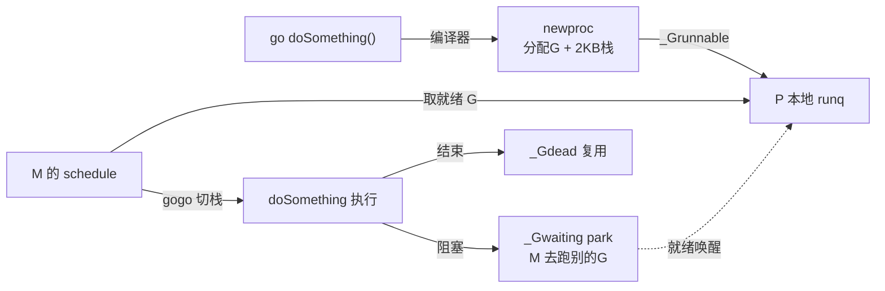

# 第一章 · 第一性原理:为什么 goroutine 这么便宜

> 篇:P0 开篇
> 主线呼应:这一章是全书的**总览与定调**。你能随手 `go func` 开成千上万个 goroutine,而同样的写法在 C/Java 里开上万个线程会让机器崩溃。这背后是 Go runtime 替你干的脏活。读懂这一章,你就拿到了全书剩余 20 章的钥匙:GMP 调度、并发 GC、TCMalloc 内存,都是为了让"goroutine 又多又便宜又不乱"而存在的。

## 核心问题

**为什么 Go 能让你随手开成千上万个 goroutine,而开同样多 OS 线程就崩?runtime 替你做了什么?**

读完本章你会明白:

1. OS 线程为什么贵(创建 / 切换 / 内存三项开销),开一万条为什么会崩。
2. goroutine 为什么便宜(2KB 初始栈、用户态切换、阻塞不占线程)。
3. Go runtime 替你干的**三件事**(调度 + GC + 内存),以及为什么没有它你就写不了 goroutine。
4. `go func` 一行背后发生了什么(newproc 创建 G → 入 runq → schedule 执行)。
5. 全书的二分法(调度执行 vs 阻塞唤醒)+ **双璧对照 Tokio**。

---

## 1.1 一句话点破

> **goroutine 便宜,是因为它不是 OS 线程,而是 runtime 管理的"用户态轻量线程":创建只分配一个 2KB 栈,切换只换几个寄存器(不进内核),阻塞了 runtime 会把线程让给别人用。这三件事——调度、GC、内存——全是 runtime 替你干的。**

这是结论,不是理由。本章倒过来拆:先看 OS 线程到底贵在哪,再看 goroutine 怎么把这三笔账省下来,最后看 runtime 在背后做了什么。

---

## 1.2 OS 线程为什么贵

OS 线程(`pthread` / Windows 线程)是内核对象。它贵在三个地方:

- **创建开销**:内核要分配 `task_struct`(Linux,几 KB)、分配栈(默认 1~8 MB)、建立页表映射。一次 `pthread_create` 是几十微秒到毫秒级的系统调用 + 内存分配。
- **切换开销**:线程切换要陷入内核态,保存/恢复寄存器、刷 TLB、破坏缓存。一次切换是微秒级,且随线程数增长抖动加剧。
- **内存开销**:每条线程默认栈 1~8 MB。开 10000 条线程,光栈就要 10~80 GB 内存——还没算内核结构。

> **不这样会怎样**:你在 Java/C 里 `new Thread().start()` 开 10000 个线程,机器大概率 OOM 或被调度抖动拖垮。所以传统并发模型要么用线程池(复用少量线程),要么用回调/异步(避免线程)。

结论:**OS 线程太贵,不能"一个并发单元配一条线程"**。goroutine 的存在,就是为了打破这个限制。

---

## 1.3 goroutine 为什么便宜:三笔账

goroutine 把 OS 线程那三笔开销,一笔一笔省了下来:

### 创建:只分配一个 2KB 栈 + 一个 G 结构

`go func` 不是创建线程,而是创建一个 **G(goroutine 的 runtime 表示)**:分配一个初始 **2KB** 的栈(远小于线程的 MB 级栈),加一个几百字节的 G 结构体。`newproc` 做完这两件事,就把 G 丢进运行队列,立即返回——**创建成本是微秒级、几百字节级**。开 10000 个 goroutine,栈只要 20 MB。

### 切换:用户态换栈,不进内核

goroutine 之间的切换(`mcall` / `gogo`)是 **runtime 在用户态完成的**:只换栈指针(SP)、保存/恢复几个寄存器,**不陷入内核、不刷 TLB**。一次 goroutine 切换是百纳秒级,比 OS 线程切换快一到两个数量级。

### 阻塞:park 这个 G,把线程让给别人

这是最关键的一笔。当一个 goroutine 阻塞(channel 等待、网络读、sleep),runtime 不会让那条 OS 线程傻等——它把这个 G 标记为 `_Gwaiting`(park 起来),**让那条线程去跑别的就绪 G**。阻塞不再等于"占着一条线程干等"。G 的状态机管着这一切:

```go
// src/runtime/runtime2.go —— G 的状态(节选,简化示意,#L37 起)
const (
    _Gidle = iota // 0  刚分配,尚未初始化
    _Grunnable    // 1  在运行队列上,等待被执行
    _Grunning     // 2  正在执行用户代码,栈被它持有,已绑定 M(通常也有 P)
    _Gsyscall     //    在系统调用中(可能已解绑 P)
    _Gwaiting     //    在等待(被 park:等 channel/网络/timer)
    _Gdead        //    已结束,可复用
)
```

> **钉死这件事**:G 的状态不只是"进度记录",它**像一把锁**:只有 `_Grunning` 的 G 才拥有自己的栈、才能执行用户代码。runtime 靠这套状态机,安全地在海量 G 之间调度、切换、阻塞、唤醒,而不会互相踩栈。(第 2 章会展开 G/M/P 结构和这套状态机的完整含义。)

> **不这样会怎样**:如果 goroutine 像线程一样"一个阻塞就占一条线程干等",那 10000 个 goroutine 里有一半在等 I/O,你就得准备 5000 条线程——又回到了线程模型的内存爆炸。

---

## 1.4 Go runtime 替你干的三件事

goroutine 能这么便宜,是因为有一个庞大的 **runtime** 在背后替你干脏活。核心是三件事:

1. **调度(scheduling)**:哪个 G 在哪条 OS 线程(M)上跑、什么时候切换、阻塞了怎么办、怎么在多条线程间负载均衡(work-stealing)——全是 runtime 的 GMP 调度器干的。你只管 `go func`,怎么跑 runtime 管。
2. **垃圾回收(GC)**:你不用手动 `free`,runtime 的并发 GC 在后台标记、清扫,还几乎不暂停你的程序(STW 最小化)。
3. **内存分配(memory)**:你 `make`/`new` 一个对象,runtime 用仿 TCMalloc 的分层分配器(mcache/mcentral/mheap)极快地给你一块,还顺带和 GC 协作。

> **不这样会怎样**:没有 runtime,你想用 goroutine 就得自己写:(a)一个用户态调度器,(b)一个并发垃圾回收器,(c)一个分层内存分配器。这三样每一个都是博士论文级的工程。runtime 把这三样打包进语言,你才得以"随手 go func"。

本书的 21 章,本质上就是逐一拆开这三件事:第 1 篇(调度)+ 第 2 篇(channel)讲"调度",第 3 篇(内存)+ 第 4 篇(GC)讲"内存与回收",第 5~7 篇讲支撑它们的栈、网络、原语。

---

## 1.5 `go func` 一行背后发生了什么

把前面的串起来,看一行 `go doSomething()` 的完整旅程:

1. **编译**:编译器把 `go doSomething()` 翻成对 [`newproc`](../go/src/runtime/proc.go#L5334) 的调用(本地 gitee 镜像 @ `6d1bcd10`)。`newproc` 分配一个 G、给它一个 2KB 栈、把入口设成 `doSomething`。
2. **入队**:新 G 状态置为 `_Grunnable`,塞进当前 P(处理器)的**本地运行队列**(`runq`)。这一步是无锁的、极快的。
3. **调度**:某条 OS 线程(M)的调度循环 [`schedule`](../go/src/runtime/proc.go#L4150) 从队列里取出一个就绪 G。
4. **切栈执行**:`gogo`(汇编)把栈切到这个 G 的栈、跳到它的入口,`doSomething` 开始跑。
5. **阻塞/结束**:如果 `doSomething` 里阻塞(channel/sleep),G 置 `_Gwaiting`,M 去跑别的 G;如果它结束,G 置 `_Gdead`,栈可复用。



这一张图,就是全书主线的缩影:创建 → 入队 → 调度 → 执行 → (阻塞/唤醒)/ 结束。后面 20 章,都在填这张图里的每一格。

---

## 1.6 立起全书二分法 + 双璧对照 Tokio

讲到这里,全书的二分法已经清晰,它和《Tokio》高度对称:

> **调度执行(GMP:让就绪的 G 跑起来、work-stealing 偷工作) vs 阻塞唤醒(netpoll/sysmon/timer/channel:让阻塞的 G 在就绪后被重新调度)。**

- **调度执行**:G/M/P 结构、`schedule`/`findRunnable`、work-stealing、异步抢占、syscall handoff、sysmon。
- **阻塞唤醒**:netpoll(网络就绪)、sysmon(长阻塞检测)、timer(定时)、channel(等待者唤醒)。

往后读任何一章,看不懂就回到这个二分法问:"这是在让就绪的 G 跑,还是在让阻塞的 G 就绪后被重新调度?"

**★ 双璧对照《Tokio》**:这本书和《Tokio》是一对——一个是**语言内置协程**(Go:编译器 + runtime 协作),一个是**库级异步**(Tokio:纯库 + 类型系统 + `Future`)。同样解决"少量线程驱动海量并发",姿势截然不同:

| 维度 | Go runtime | Tokio |
|---|---|---|
| 并发单元怎么造 | `go func`(语言关键字,创建 G) | `tokio::spawn`(库函数,创建 Task) |
| 调度器 | GMP + work-stealing(runtime 内置) | scheduler + work-stealing(库) |
| 阻塞怎么不占线程 | runtime 自动 park G + netpoll | `Future::poll` 返回 `Pending` + reactor 唤醒 |
| 内存安全靠什么 | 并发 GC(运行时回收) | ownership + `Pin`(编译期 + 类型) |
| "等待"怎么表达 | 阻塞式 API(channel/sleep 阻塞但 runtime 让出) | `async/await`(显式,编译成状态机) |

这两种设计没有绝对优劣,是两种哲学的极致。本书每个核心机制,都会和 Tokio 的对应物对读一次(标 ★ 的章),收尾章(P8-21)给一张总表,把两本书钉在一起。

---

## 1.7 技巧精解:用户态栈切换为什么这么快

这一章是定调章,我们把全书最根本的一个"便宜"立清楚:**goroutine 切换凭什么比线程切换快一到两个数量级**。答案在 `mcall`/`gogo` 这对汇编实现的**用户态栈切换**。

OS 线程切换的代价,大头不在"保存寄存器"(那部分两者差不多),而在**陷入内核态** + **刷 TLB** + **缓存失效**。内核态切换要走系统调用、切换地址空间上下文,这些是微秒级、且随核数/线程数抖动的开销。

goroutine 切换完全绕开这些:

- **不进内核**:`mcall`/`gogo` 是普通函数(汇编实现),在用户态直接改栈指针(SP)和指令指针(PC),没有系统调用。
- **不切地址空间**:所有 goroutine 共享进程的同一个地址空间(它们只是栈不同),切换不涉及页表/TLB。
- **只换栈 + 少量寄存器**:切换 = 保存当前几个寄存器到 G 结构、把 SP 指向目标 G 的栈、恢复目标 G 的寄存器、跳转。纳秒级。

> **反面对比**:如果 goroutine 切换走 OS 线程那一套(每次进内核、刷 TLB),那一个 Web 服务器每秒几十万次 G 切换,光切换开销就吃掉大半 CPU,goroutine 的"轻量"就成了空话。`mcall`/`gogo` 把切换留在用户态,是 goroutine 能做到"百万并发"的物理基础。(第 2 章会讲 G 结构怎么存栈指针,第 3 章 schedule 怎么驱动切换。)

---

## 章末小结

这一章是全书**总览与定调**,我们没有钻进任何子系统,但立起了贯穿全书的四样东西:

1. **goroutine 便宜的三个根**:2KB 栈、用户态切换、阻塞不占线程。
2. **runtime 的三件事**:调度 + GC + 内存——没有它就没有 goroutine。
3. **`go func` 的旅程**:newproc → runq → schedule → gogo → 执行 →(阻塞/唤醒)/ 结束。
4. **二分法 + 双璧对照**:调度执行 vs 阻塞唤醒;和 Tokio 是"语言内置 vs 库级"的调度双璧。

### 五个"为什么"清单

1. **OS 线程为什么贵?** 创建(内核结构 + MB 栈)、切换(进内核 + 刷 TLB)、内存(每条 MB 级栈)。开一万条就 OOM/抖动。
2. **goroutine 为什么便宜?** 2KB 初始栈、用户态 `mcall`/`gogo` 切换不进内核、阻塞 park 让出线程。
3. **G 的状态机为什么像锁?** 只有 `_Grunning` 的 G 拥有栈、能执行;runtime 靠它安全地在海量 G 间调度而不踩栈。
4. **runtime 干的三件事是什么?** 调度(谁在哪跑、阻塞咋办)、GC(自动回收)、内存(分层快分配)。缺一不可。
5. **和 Tokio 的根本区别?** Go 是语言内置协程(阻塞式 API + runtime 让出),Tokio 是库级异步(`async/await` + `Future` poll)。同目标,两哲学。

### 想继续深入往哪钻

- 本章点到的 `newproc`/`schedule`/`gogo` 详见第 2、3 章(P1-02 G/M/P 结构、P1-03 schedule)。
- 用户态栈切换的汇编 `mcall`/`gogo`,详见第 3 章 + `src/runtime/asm_amd64.s`。
- 想立刻看一眼真实的 G 状态机和结构,读 [`../go/src/runtime/runtime2.go`](../go/src/runtime/runtime2.go#L471) 的 `type g struct`(L471)和开头的状态常量(L37)。
- 想观测 runtime 运行,用 `GODEBUG=schedtrace=1000` 或 `go tool trace`(附录 B 详讲)。

### 引出下一章

我们立起了"goroutine 便宜"和"双璧对照"。但要真正理解 Go runtime,得钻进它的核心——**GMP 调度器**。G、M、P 这三个结构到底是什么、字段为什么这么排、全局状态怎么组织?下一章,我们从 `runtime2.go` 的三个核心结构体讲起,正式进入第 1 篇:GMP 调度器。
