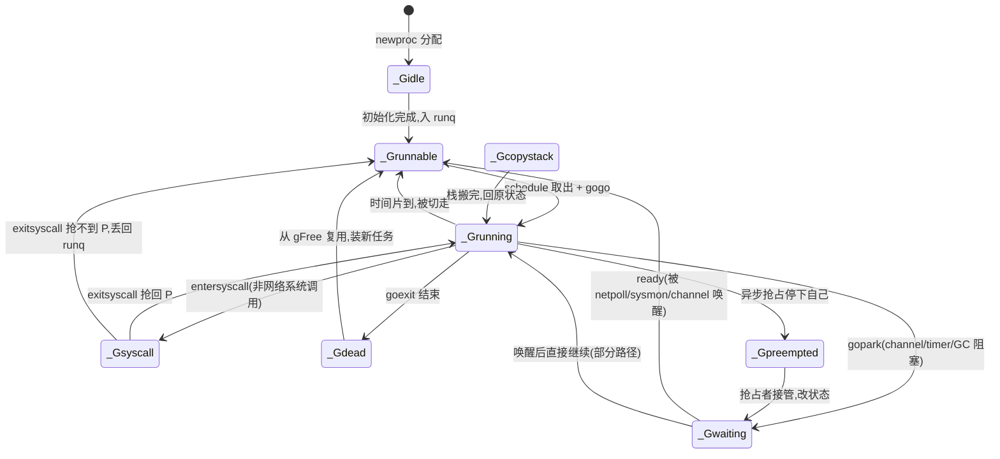

# 第二章 · G、M、P 结构与全局状态

> 篇:第 1 篇 · GMP 调度器(全书地基,重头戏)
> 主线呼应:上一章我们立起了全书第一性原理——"少量 M 驱动海量 G,阻塞不阻塞线程、GC 不打断业务",并把 `go func` 的一生拆成"newproc 创建 G → 入 runq → schedule 取出 → gogo 切栈执行 → 阻塞/唤醒/结束"。但那张图里的"G""M""P""runq""状态机"全是黑盒。这一章我们打开黑盒:把 `runtime2.go` 里三个核心结构体(`g`/`m`/`p`)的字段一个一个讲清,把全局的 `allgs`/`allm`/`allp`/`sched` 摆开,把 G 的状态机 `_Gidle/_Grunnable/_Grunning/_Gwaiting/_Gsyscall/...` 的流转画出来。这一章是后面 5 章(调度循环、work-stealing、抢占、handoff、sysmon)的地基,地基不稳,后面全是空中楼阁。

## 核心问题

**G(goroutine 任务)、M(OS 线程)、P(处理器:本地 runq+mcache+状态机)各自是什么、字段为什么这么排?全局的 `allgs`/`allm`/`allp`/`sched` 怎么组织?G 的状态机怎么流转?**

读完本章你会明白:

1. 三个核心结构体 `g`/`m`/`p` 的关键字段各是什么、为什么字段顺序这么排(缓存行、写屏障、归属关系)。
2. P 的本地 runq 为什么是无锁环形数组(256 槽)+ `runnext`,以及它和全局 runq(`sched.runq`)的分工。
3. G 的状态机有哪些状态、`_Gscan` 这一位是干什么的、为什么 status 像一把"锁住栈"的锁。
4. `guintptr`/`muintptr`/`puintptr` 这套"uintptr 伪装的指针"为什么存在(绕过写屏障)。
5. `allgs` 只增不减、`allm` 链表、`allp` 数组,这些全局结构怎么被 GC、调度器、tracer 安全遍历。

> 逃生阀:这一章字段密度很高,读到这里如果觉得"字段太多记不住",别慌——你不需要记住每个字段,只需要记住三件事:(a) G 存栈和调度上下文,(b) M 是 OS 线程 + 它的 g0 系统栈,(c) P 存本地 runq + mcache + 一堆 GC/缓存。其余字段是"为了让这三样协同且不撞墙"而长出来的。本章会按这个脉络归类讲。

---

## 2.1 一句话点破

> **G/M/P 是 runtime 把"少量 OS 线程驱动海量 goroutine"这件事拆成的三个角色:G 是一份任务(带自己的栈和状态),M 是干活的 OS 线程,P 是绑在 M 身上的"工作台"(本地任务队列 + 缓存 + 调度状态)。runtime 的全部巧思,都落在"字段怎么排、状态怎么转、谁锁谁"这三件事上——它决定了调度能不能无锁、GC 能不能安全扫栈、work-stealing 能不能不踩脚。**

这是结论,不是理由。本章倒过来拆:先看三个结构体各自的"角色定位",再逐组拆字段,再讲它们怎么靠 G 的状态机和 `_Gscan` 位协同,最后讲全局表怎么组织。

---

## 2.2 三个角色:为什么是 G、M、P 三件套

第一章我们已经说过,goroutine 便宜的根是"用户态切换 + 阻塞不占线程"。但具体到实现,你得回答两个问题:

1. **goroutine 的"身份"放哪?** 它有自己的栈、自己的执行位置(PC/SP)、自己的状态(在跑/在等/已死)。这些东西需要一个结构体来装——这就是 **`g`**。
2. **谁来执行它?** goroutine 不能凭空跑,最终要落到一条 OS 线程上执行。OS 线程就是 **`m`**。

> **不这样会怎样**:如果只用 G 和 M 两个结构,会发生什么?你有一万个 G、八个 M(八核)。每个 M 想找下一个 G 跑,得去一个**全局队列**里抢 G,八条线程抢一个全局锁,锁竞争会吃掉调度的大部分时间。更糟的是,内存分配也得有个全局锁,GC 的工作队列也得有全局锁——全是热点。

所以 runtime 在 G 和 M 之间,插了第三个角色 **`p`**(processor,处理器,但和 CPU 没关系,它是 runtime 自己的概念)。P 的本质是 **"绑在 M 身上的工作台"**:它持有

- 一个**本地 runq**(本地可运行 G 队列,无锁,M 用自己的 P 时完全不碰锁),
- 一个 **mcache**(本地内存缓存,小对象分配无锁),
- 一堆 **GC 工作状态**(`gcw`/`wbBuf`,写屏障缓冲区),
- 当前 P 的**调度状态**(`status`/`schedtick`)。

数量上,P 的个数 = `GOMAXPROCS`(默认 = CPU 核数),而 M 可以比 P 多(阻塞的 M 不持有 P,新 M 接手 P 继续干活)。这就是 GMP 的分工:

```
   G  ×  海量(成千上万)   —— 任务,各带自己的栈和状态
   M  ×  少量(≈核数 + 阻塞溢出) —— OS 线程,真正执行
   P  ×  GOMAXPROCS        —— 工作台,本地队列 + 缓存,数量锁死

   绑定关系:M 持有一个 P(执行用户代码时),P 的本地 runq 里排着一堆 G。
   M 跑完一个 G,从绑定的 P 的本地 runq 取下一个;P 空了去偷别人的(work-stealing)。
```

> 点一句比喻就够(不贯穿):G 是一份份待干的任务单,M 是干活的人,P 是人手边的工作台。人换班(M 切换)不影响任务单(G)和工作台(P),任务单排在工作台上,谁干活谁用自己的工作台。

> **钉死这件事**:P 是 GMP 性能的命门。没有 P,所有 M 抢一个全局队列,锁竞争会把"goroutine 便宜"打成空话。P 把"调度执行的本地状态"和"内存分配的本地缓存"都私有化,让正常路径几乎无锁。后面每一章,都是在"维护 P 这个工作台"——偷工作(work-stealing)、交接 P(syscall handoff)、按 P 抢占(异步抢占)。

---

## 2.3 `g` 结构:goroutine 的身份证

[`type g struct`](../go/src/runtime/runtime2.go#L471) 有几十个字段。我们按"它在解决什么问题"分组讲,不按声明顺序背字段。

### 2.3.1 栈:`stack` + `stackguard0/1`

```go
// src/runtime/runtime2.go#L479-L481(节选)
stack       stack   // offset known to runtime/cgo
stackguard0 uintptr // offset known to cmd/internal/obj/*
stackguard1 uintptr // offset known to cmd/internal/obj/*
```

[`stack`](../go/src/runtime/runtime2.go#L460) 就是 `{lo, hi uintptr}` 一对指针,圈出这块 G 的栈内存范围 `[lo, hi)`。goroutine 初始栈 2KB(见 [stack.go 的 `stackMin = 2048`](../go/src/runtime/stack.go#L78)),不够用时 runtime 会**翻倍拷贝**一个新栈(第 17 章详讲)。

`stackguard0` 是个**哨兵指针**,放在栈底附近(`stack.lo + stackGuard`)。每个函数的**序言(prologue)**——编译器在每个函数入口插的几条指令——会比较当前 SP 和 `stackguard0`:SP 跌破 `stackguard0` 就触发栈增长(调 `morestack`)。它还能被写成特殊值 [`stackPreempt = uintptrMask & -1314`](../go/src/runtime/stack.go#L133)(一个比任何真实 SP 都大的值),用来**触发抢占**(第 5 章详讲)。

> **所以这样设计**:`stackguard0` 把"栈检查"和"抢占检查"合并到**同一个比较**里——函数序言只需一条比较指令,既防栈溢出又响应抢占。这是编译器和 runtime 协作的典型:编译器知道字段偏移(offset known to cmd/internal/obj),runtime 负责往这个字段塞"栈哨兵"或"抢占请求"。

`stackguard1` 是给 **g0/系统栈**用的(在 `//go:systemstack` 标记的代码里检查的版本),普通 G 的 `stackguard1` 被写成 `~0` 以触发 `morestack` 并崩溃——这是调试手段。两套 guard 是因为同一个 M 上有两种栈:用户 G 的栈、和 g0 的系统栈(见 2.4.1)。

### 2.3.2 调度上下文:`sched gobuf`

```go
// src/runtime/runtime2.go#L486
sched     gobuf
```

[`gobuf`](../go/src/runtime/runtime2.go#L303) 存 goroutine 被**挂起瞬间**的寄存器快照:

```go
// src/runtime/runtime2.go#L303-L320(节选)
type gobuf struct {
    sp   uintptr
    pc   uintptr
    g    guintptr
    ctxt unsafe.Pointer
    lr   uintptr
    bp   uintptr
    ...
}
```

`sp`/`pc` 是切换时最关键的——`mcall`/`gogo` 这对汇编(第 3 章详讲)就是读写这几个字段来完成 goroutine 的"换栈换 PC"。`g` 字段是个 `guintptr`(见 2.5),刻意写成 uintptr 绕过写屏障,因为 `gobuf.g` 经常由汇编更新,汇编里没法插写屏障。

> **不这样会怎样**:如果 `gobuf` 里存的是真 `*g` 而非 `guintptr`,那汇编保存 `gobuf.g = gp` 时就会触发写屏障,而写屏障要求"当前有 P、GC 在并发标记"——但 goroutine 切换经常发生在"无 P"(比如系统调用里、sysmon 里)的窗口,这时候触发写屏障会和 GC 状态机打架(见 2.5 的 guintptr 注释原话)。所以这里**故意退化成 uintptr**。

### 2.3.3 当前 M、状态、goid

```go
// src/runtime/runtime2.go#L483-L507(节选)
_panic       *_panic
_defer       *_defer
m            *m      // current m
...
param        unsafe.Pointer
atomicstatus atomic.Uint32
stackLock    uint32
goid         uint64
schedlink    guintptr
waitsince    int64
waitreason   waitReason
```

- `m`:这个 G 当前**绑在哪条 M 上**。只有正在跑或马上要跑的 G 才有有效的 `m`。
- `atomicstatus`:G 的状态(见 2.6),原子读写,**像一把锁**(锁的是这个 G 的栈)。
- `goid`:goroutine 的 ID,就是 `runtime.Stack()` 打印的 `goroutine 18 [running]` 里的 18。注意它**不在用户 API 里直接暴露**(故意藏起来,避免用户依赖),但 runtime 到处用。
- `schedlink`:把 G 串成链表用的(全局 runq、gFree 链表都靠它),`guintptr` 类型,绕写屏障。
- `waitsince`/`waitreason`:G 阻塞时,记下"何时开始等""为什么等"(channel/sleep/GC...),给 `runtime.Stack` 的阻塞原因用。
- `_panic`/`_defer`:当前活跃的 panic/defer 链(panic/defer 是栈式的)。
- `param`:一个通用指针,用于唤醒时回传数据(channel 唤醒时回传 sudog 指针、GC 协助回传完成信号等),避免专门开字段。

### 2.3.4 抢占标志位一组

```go
// src/runtime/runtime2.go#L512-L514
preempt       bool
preemptStop   bool
preemptShrink bool
```

这三个 bool 配合 `stackguard0 = stackPreempt` 一起,表达不同种类的抢占请求(第 5 章详讲)。`preempt` 是普通抢占信号,`preemptStop` 表示要停在安全点(进 `_Gpreempted`),`preemptShrink` 表示顺便缩栈。

### 2.3.5 GC 与栈扫描相关一组

```go
// src/runtime/runtime2.go#L522-L528(节选)
gcscandone   bool
throwsplit   bool
activeStackChans bool
parkingOnChan atomic.Bool
...
gcAssistBytes int64   // src/runtime/runtime2.go#L591
```

- `gcscandone`:GC 扫这个 G 的栈时,扫完了置位(配合 `_Gscan` 位,见 2.6)。
- `activeStackChans`:有 channel 指着这个 G 的栈(等待接收/发送时,数据可能写到栈上)。栈拷贝时必须先拿这些 channel 的锁,否则会拷到不一致的数据(第 17 章详讲)。
- `gcAssistBytes`:这个 G 的"GC 协助信用",分配太快欠债了要帮 GC 干活(mark assist,第 15 章详讲)。

### 2.3.6 等待中的 sudog:`waiting`

```go
// src/runtime/runtime2.go#L561
waiting *sudog
```

一个 G 可能同时挂在多个等待队列上(select 多个 channel),所以它有一个 `waiting` 链表,串着它持有的所有 `sudog`(见 2.7)。这个字段在 GC 扫栈时很重要:sudog 的 `elem` 可能指向栈,GC 得跟着扫。

---

## 2.4 `m` 结构:OS 线程的 runtime 表示

[`type m struct`](../go/src/runtime/runtime2.go#L616) 比 `g` 简单,核心是"我是哪条 OS 线程、我当前在跑哪个 G、我绑了哪个 P"。

### 2.4.1 g0:每条 M 的"系统栈"

```go
// src/runtime/runtime2.go#L617-L619
g0      *g     // goroutine with scheduling stack
morebuf gobuf  // gobuf arg to morestack
```

`g0` 是每条 M 专属的一个特殊 G——它跑在**系统栈**(也叫 g0 栈,比较大)上,负责 runtime 自己的代码:`schedule`、`gogo` 切换、`morestack` 栈增长、信号处理、`mcall` 的落点。为什么需要 g0?因为用户 G 的栈很小(2KB 起步),runtime 的某些路径(调度、栈拷贝)需要的栈空间大,且不能在被切走的用户栈上跑——所以 runtime 干这些活时,会通过 `systemstack(fn)` 汇编切到 g0 的栈上执行,完事再切回来。

> **不这样会怎样**:如果调度循环 `schedule` 直接在用户 G 的栈上跑,那 `schedule` 本身就要消耗那个 G 的栈,而那个 G 可能只剩几百字节——一调 `schedule` 就栈溢出了。g0 给 runtime 一个稳定的大栈,把"runtime 自己的执行"和"用户 G 的执行"彻底分开。

`gsignal` 是另一条特殊 G,专门处理这条 M 上收到的信号(SIGURG 抢占、SIGPROF 性能采样等),它有自己的信号栈,避免在用户栈被打断时处理信号把栈搞乱。

### 2.4.2 curg、p、nextp、oldp:绑定的 G 和 P

```go
// src/runtime/runtime2.go#L629, L642-L645(节选)
curg       *g       // current running goroutine
p          puintptr // currently attached P
nextp      puintptr // next P to install
oldp       puintptr // P before syscall
```

- `curg`:这条 M **当前在跑哪个用户 G**(在 g0 上跑时 `curg` 是 nil)。
- `p`:这条 M 当前绑的 P(`puintptr` 绕写屏障)。注意注释 [runtime2.go#L636-L641](../go/src/runtime/runtime2.go#L636):非 nil 的 p 表示**独占**这个 P,**除非 `curg` 在 `_Gsyscall`**——系统调用时调度器可以改这个字段(handoff,第 6 章详讲)。同步点在 curg 的 `_Gscan` 位。
- `oldp`:进系统调用前绑的 P,出系统调用时如果抢不回 P,要靠它判断"我原来在哪个 P 上"(第 6 章)。
- `nextp`:`mnext` 调度准备阶段暂存下一个要装的 P。

### 2.4.3 自旋、阻塞、cgo 状态

```go
// src/runtime/runtime2.go#L647-L669(节选)
mallocing       int32
throwing        throwType
locks           int32
spinning        bool // m is out of work and is actively looking for work
blocked         bool // m is blocked on a note
incgo           bool // m is executing a cgo call
isextra         bool // m is an extra m
freeWait        atomic.Uint32
```

- `spinning`:这条 M 正在**自旋找活干**(本地空了在偷别人的)。这个状态全局要计数(`sched.nmspinning`),因为"自旋 M 太多浪费 CPU、太少反应慢"是个动态平衡(第 3 章 findRunnable 详讲)。
- `blocked`:这条 M 在 `note`(futex/semaphore)上睡着了,等被唤醒。
- `incgo`:正在执行 cgo 调用(这条 M 此刻不在 Go runtime 掌控中,GC/调度要特殊对待)。
- `locks`:当前持有的 runtime 锁数(>0 时不能抢占、不能缩栈,见 [`entersyscall` 注释](../go/src/runtime/proc.go))。

### 2.4.4 m 的体积:mPadded 凑齐 2048 字节

```go
// src/runtime/runtime2.go#L733-L741
type mPadded struct {
    m
    // Size the runtime.m structure so it fits in the 2048-byte size class, and
    // not in the next-smallest (1792-byte) size class. That leaves the 11 low
    // bits of muintptr values available for flags, as required by
    // lock_spinbit.go.
    _ [(1 - goarch.IsWasm) * (2048 - mallocHeaderSize - mRedZoneSize - unsafe.Sizeof(m{}))]byte
}
```

这是个非常 Go-specific 的技巧:`m` 实际用的是 `mPadded`,它**故意垫字节凑到 2048 字节**(精确卡在一个 malloc size class)。原因是 `muintptr` 在 [lock_spinbit.go 的 spinbit 锁](../go/src/runtime)里要借用**指针低 11 位**存标志位——而 2048 = 2^11,意味着任何 `*m` 的低 11 位都是 0(对象按 size class 对齐),可以安全借用。这是"内存分配对齐 + 位借用"的精妙协同。

---

## 2.5 `guintptr`/`muintptr`/`puintptr`:为什么要"假指针"

runtime 里到处是这种类型:

```go
// src/runtime/runtime2.go#L242
type guintptr uintptr
// src/runtime/runtime2.go#L269
type puintptr uintptr
// src/runtime/runtime2.go#L286
type muintptr uintptr
```

它们底层是 `uintptr`,不是 `unsafe.Pointer`。区别是:**GC 不追踪 uintptr**(它只把 unsafe.Pointer 当指针)。也就是说,一个 `guintptr` 字段存了一个 G 的地址,但 GC **看不见**这个引用。

为什么这么干?看 runtime 自己的注释 [runtime2.go#L198-L219](../go/src/runtime/runtime2.go#L198)(这是理解 Go runtime 的一段关键注释):

> The guintptr, muintptr, and puintptr are all used to bypass write barriers. It is particularly important to avoid write barriers when the current P has been released, because the GC thinks the world is stopped, and an unexpected write barrier would not be synchronized with the GC, which can lead to a half-executed write barrier that has marked the object but not queued it. If the GC skips the object and completes before the queuing can occur, it will incorrectly free the object.

翻译过来:写屏障只在"GC 正在并发标记 + 当前持有 P"时才能正确工作。但 runtime 有大量代码在**已经释放 P、或处于 STW 边界**的窗口里还要更新 G/M/P 指针。如果这些更新走真指针(触发写屏障),写屏障会以为"世界已停"却被擅自触发,产生"标记了一半没入队"的撕裂状态——GC 可能漏标、误回收活对象。

> **所以这样设计**:把这些"在不安全时刻会被写的指针字段"统一做成 `guintptr`/`muintptr`/`puintptr`,GC 完全跳过它们。这些被指向的对象靠**别的真指针**保活:
> - G 永远在 [`allgs`](../go/src/runtime/proc.go#L682) 里有真指针(所以 G 结构从不释放,见 2.8.1)。
> - P 永远在 [`allp`](../go/src/runtime/runtime2.go#L1419) 里有真指针。
> - M 永远在 [`allm`](../go/src/runtime/runtime2.go#L1403) 或 `freem` 里有真指针(M 会被释放,所以约束更严:不能跨越 safepoint 持有 `muintptr`)。

这是"为什么 Go runtime 能在 GC 眼皮底下安全调度"的地基之一。技巧精解会再展开(见 2.9)。

---

## 2.6 G 的状态机:为什么 status 像一把锁

[`runtime2.go#L17-L120`](../go/src/runtime/runtime2.go#L17) 开头那段注释是 Go runtime 最重要的一段:

> Beyond indicating the general state of a G, the G status acts like a lock on the goroutine's stack (and hence its ability to execute user code).

也就是说,G 的 `atomicstatus` 不只是"进度记录",它**是一把锁,锁住这个 G 的栈和"能否执行用户代码"**。状态常量:

```
_Gidle = 0            刚分配,未初始化
_Grunnable = 1        在 runq 上,等被执行。栈不归属任何人
_Grunning = 2         可能在跑用户代码。栈归这个 G。绑了 M(通常有 P)
_Gsyscall = 3         在系统调用。栈归这个 G。绑了 M,但可能没 P
_Gwaiting = 4         在 runtime 里阻塞(channel/timer/GC...)。栈不归属
_Gdead = 6            未使用(刚退出或刚从 freelist 拿出)。栈可能没分配
_Gcopystack = 8       栈正在被搬。栈归搬它的那个 G
_Gpreempted = 9       被异步抢占停下。像 _Gwaiting,但还没人负责唤醒它
_Gscan = 0x1000       一个标志位,叠加在上面任一状态上:GC 正在扫这个 G 的栈
```

> 注意中间有 `_Gmoribund_unused`(5)和 `_Genqueue_unused`(7)——历史上用过,现在硬编码在 gdb 脚本里所以留着。

### 2.6.1 状态流转



几个**关键不变式**(违反就 throw):

1. **只有 `_Grunning` / `_Gsyscall` 的 G,栈归它自己**(可以安全访问)。`_Gwaiting` / `_Grunnable` 的栈**不归属任何人**——这时候不能随便碰它的栈,因为它可能被搬走(`_Gcopystack`)。
2. **`_Gsyscall` 时栈归 G,但 P 不归它**(`m.p` 可能被 handoff 给别的 M)。代码里 `_Gsyscall` 状态下**禁止碰 `g.m.p`**(见 [runtime2.go#L50-L55 注释](../go/src/runtime/runtime2.go#L50))。
3. **`_Gwaiting` 的 G 一定登记在某个唤醒源上**(channel 的 sendq/recvq、timer 堆、netpoll 的 pollDesc...),否则它永远醒不来。注释 [runtime2.go#L57-L65](../go/src/runtime/runtime2.go#L57) 明说:它不在 runq 上,但"should be recorded somewhere so it can be ready()d"。

### 2.6.2 `_Gscan` 这一位:GC 扫栈的握手

`_Gscan = 0x1000` 是个叠加位。比如 `_Gscanrunning = _Gscan + _Grunning = 0x1002`,意思是"这个 G 正在跑,而且 GC 正在扫它的栈"。这套机制由四个函数维护(都在 [proc.go#L1216 起](../go/src/runtime/proc.go#L1216)):

- [`readgstatus`](../go/src/runtime/proc.go#L1220):原子读 status(但读到的是某个瞬时值,可能马上被改)。
- [`castogscanstatus`](../go/src/runtime/proc.go#L1258):CAS 把状态从普通态翻到 `_Gscan` 态——**像获取锁**。
- [`casfrom_Gscanstatus`](../go/src/runtime/proc.go#L1228):CAS 把状态从 `_Gscan` 态翻回普通态——**像释放锁**。
- [`casgstatus`](../go/src/runtime/proc.go#L1290):普通的非 scan 状态间转移(如果撞上 `_Gscan` 态会**自旋等** GC 扫完)。

> **所以这样设计**:GC 要扫一个 G 的栈,但这个 G 可能正在另一个核上跑用户代码,栈还在动。GC 不能直接读它的栈。怎么办?GC 用 `castogscanstatus` 把这个 G 的状态从 `_Grunning` CAS 成 `_Gscanrunning`,**这一刻起,这个 G "栈归 GC"**,GC 可以安全扫;扫完用 `casfrom_Gscanstatus` 翻回 `_Grunning`。这中间,G 那边如果自己要改状态(比如要进系统调用),会因为 `casgstatus` 撞上 scan 态而**自旋等待**(见 [proc.go#L1306-L1327](../go/src/runtime/proc.go#L1306))。**这就是"status 像锁"的字面含义**——一位 0x1000,就是一把"GC 借栈"的锁。

> **不这样会怎样**:如果 GC 扫栈不借锁,扫到一半 G 改了栈(写了个新指针),GC 可能漏掉这个新指针指向的活对象,把它当垃圾回收掉——程序崩溃、数据错乱。三色标记的"漏标"问题就这么来的(第 13 章详讲)。`_Gscan` 位是 GC 并发扫栈的握手协议。

---

## 2.7 `sudog`:G 在等待队列里的"替身"

[`type sudog struct`](../go/src/runtime/runtime2.go#L404) 的注释 [runtime2.go#L394-L403](../go/src/runtime/runtime2.go#L394) 解释了它为什么存在:

> sudog (pseudo-g) represents a g in a wait list, such as for sending/receiving on a channel.
> sudog is necessary because the g ↔ synchronization object relation is many-to-many.

也就是说,**G 和同步对象是 多对多 关系**:一个 G 可能同时在多个 channel 上等(`select`),一个 channel 可能被多个 G 等。直接把 `*g` 挂到 channel 的等待队列上,就没法表达"一个 G 在多处等"。所以引入 `sudog`——它是一个**一次性替身**:每次 G 要阻塞在一个同步对象上,就申请一个 sudog,挂在那个对象的等待队列上,sudog 里记着"我是哪个 G (`g *g`)、我等的数据放哪 (`elem`)、我等的是哪个 channel (`c`)"。

```go
// src/runtime/runtime2.go#L404-L446(节选)
type sudog struct {
    g *g
    next *sudog
    prev *sudog
    elem maybeTraceablePtr // data element (may point to stack)
    acquiretime int64
    releasetime int64
    ticket      uint32
    isSelect bool
    success bool
    waiters uint16
    parent   *sudog          // semaRoot binary tree
    waitlink *sudog          // g.waiting list or semaRoot
    waittail *sudog          // semaRoot
    c        maybeTraceableChan // channel
}
```

几个细节:

- `elem`:等待时要传/收的数据地址(往往是**栈上的一个变量**,比如 `ch <- x` 里 `x` 的地址)。所以它是 `maybeTraceablePtr`——一个"GC 有时追踪有时不追踪"的特殊指针类型([runtime2.go#L322-L374](../go/src/runtime/runtime2.go#L322)),因为栈拷贝时要暂时把它从 GC 视野里藏起来,免得 GC 跟着旧栈地址跑偏。
- `next/prev/waitlink/waittail`:sudog 同时可能挂在两个链表上——channel 的等待队列(双向链表,`next/prev`)、和 G 自己的 `waiting` 链表(单链表,`waitlink`)。两套链接字段,免得互相打架。
- `isSelect`:这个 sudog 是 `select` 的一部分,唤醒时要 CAS 抢赢(`g.selectDone`)——因为 select 可能有多个 case 同时就绪,只能唤醒一次(第 9 章详讲)。
- `parent`:信号量(semaRoot)用, sudog 在信号量里组织成一棵二叉树(不是 channel 那种链表)。

**sudog 用对象池复用**(P 有自己的 `sudogcache`,见 [p 的 `sudogcache`](../go/src/runtime/runtime2.go#L825));分配/归还走 [`acquireSudog`/`releaseSudog`](../go/src/runtime/proc.go),避免每次 channel 操作都 malloc。第 8 章会详讲 channel 怎么用它。

---

## 2.8 全局状态:`allgs`/`allm`/`allp`/`sched`

调度器不能只看每个 G/M/P,它得有"全局视角":哪些 G 存在(给 GC 扫栈、给 tracer 列出来)、哪些 P 空闲(给找活干的 M 分)、全局 runq(本地 runq 溢出时兜底)。

### 2.8.1 `allgs`:只增不减的 G 列表

```go
// src/runtime/proc.go#L674-L698
var (
    allglock mutex
    allgs    []*g
    allglen  uintptr
    allgptr  **g
)
```

[`allgadd`](../go/src/runtime/proc.go#L700) 是唯一的写入点(在 `newproc` 创建新 G 后调用)。注意:

- **`allgs` 永不缩**(G 结构从不释放,死了的 G 进 `gFree` 复用栈,但 `g` 结构留在 `allgs` 里)。这是故意的:GC、tracer、signal 处理可能在任意时刻遍历 `allgs`,如果释放 `g` 结构,持有 `*g` 的代码(use-after-free)就崩了。
- 因为只增不减,`allgs[0]` 的地址可能因为扩容而变,所以额外维护 `allgptr`(指向数组首元素)和 `allglen` 一对原子变量,让**无锁读者**也能安全读(读 `allglen` 再读 `allgptr`,见注释 [proc.go#L684-L697](../go/src/runtime/proc.go#L684))。

> **所以这样设计**:GC 扫描"所有 G 的栈"时,世界已停(STW),可以无锁遍历 `allgs`。tracer、`runtime.Stack()` 这种不能 STW 的,用原子 `allgptr`/`allglen` 读一个一致快照(可能漏掉刚加的,但不会读到半截)。这就是 [2.5 里](#25-guintptrmuintptrpuintptr为什么要假指针)说的"G 永远在 allgs 里有真指针保活"。

### 2.8.2 `allm`:M 的链表

```go
// src/runtime/runtime2.go#L1401-L1410
var (
    allm *m
    gomaxprocs    int32
    sched         schedt
    ...
)
```

[`allm`](../go/src/runtime/runtime2.go#L1403) 是个**单向链表**(通过 `m.alllink` 串),新 M 在 [`mcommoninit`](../go/src/runtime/proc.go#L1036-L1042) 里加进去:

```go
// src/runtime/proc.go#L1036-L1042(节选)
// Add to allm so garbage collector doesn't free g->m
mp.alllink = allm
// NumCgoCall and others iterate over allm w/o schedlock,
// so update atomically.
atomicstorep(unsafe.Pointer(&allm), unsafe.Pointer(mp))
```

注意 `atomicstorep`(原子写),因为 `NumCgoCall` 等地方**不加锁**遍历 `allm`(性能要求)。M 会死(`mexit` 时从 `allm` 摘下,见 [proc.go#L2047-L2055](../go/src/runtime/proc.go#L2047)),所以遍历 `allm` 要小心 M 正在退出——这也是 2.5 里强调的"不能跨 safepoint 持有 `muintptr`"。

### 2.8.3 `allp`:P 的数组

```go
// src/runtime/runtime2.go#L1412-L1449
var (
    allpLock mutex
    allp []*p          // len(allp) == gomaxprocs
    idlepMask pMask
    timerpMask pMask
)
```

`allp` 是个数组(不是链表),长度 = `gomaxprocs`。P 的 id 就是数组下标。数组比链表好处是**O(1) 按 id 访问**(work-stealing、timer 偷取时要随机选别的 P,用 id 直接索引)。

注释 [runtime2.go#L1417-L1419](../go/src/runtime/runtime2.go#L1417) 提醒:`len(allp)` 只在 **safe point**(`procresize`,即 `GOMAXPROCS` 改变时)会变,其余时刻**不可变**(下标稳定)。这让无锁的 work-stealing 可以放心地 `allp[randomid]`。

`idlepMask`/`timerpMask` 是两个**位掩码**,一位对应一个 P——快速回答"哪些 P 空闲""哪些 P 可能有 timer"。比遍历链表快得多,是 findRunnable 多级回退里的关键(第 3 章)。

### 2.8.4 `sched`:全局调度器状态

[`type schedt struct`](../go/src/runtime/runtime2.go#L932) 是一个**聚合的全局调度状态**([声明在 runtime2.go#L1408](../go/src/runtime/runtime2.go#L1408)),全局只有一个 `var sched schedt`。它的字段全是"全局视角"的调度数据:

```go
// src/runtime/runtime2.go#L932-L960(节选)
type schedt struct {
    goidgen    atomic.Uint64
    lastpoll   atomic.Int64  // 上次网络轮询时间
    lock mutex

    midle   listHeadManual  // 空闲 M 链表
    nmidle  int32           // 空闲 M 数
    nmidlelocked int32
    mnext   int64           // 已创建 M 数 + 下一个 M ID
    maxmcount int32         // M 上限(默认 10000)
    nmsys  int32            // 不计入死锁检测的系统 M 数

    pidle   puintptr         // 空闲 P 链表头
    npidle  atomic.Int32     // 空闲 P 数
    nmspinning atomic.Int32  // 自旋找活的 M 数
    needspinning atomic.Uint32

    runq gQueue              // 全局 runq(本地溢出兜底)
    ...
}
```

几个关键点:

- **`midle`/`pidle`**:空闲 M / 空闲 P 的链表。M 干完活没活就睡进 `midle`;P 被释(handoff 或 idle)就进 `pidle`,等有活干的 M 来领。
- **`nmspinning`**:正在自旋找活的 M 数。这是个**全局计数**——为什么重要?因为"启动几个自旋 M"是个平衡问题:自旋 M 太多烧 CPU,太少则新 G 来了反应慢。`sched.nmspinning` 让 findRunnable 能判断"还要不要继续自旋/要不要再唤醒一个 M"(第 3 章详讲)。
- **`runq gQueue`**:全局可运行队列。本地 runq 满了(>256)会半数倒进全局;本地空了也会从全局取。全局 runq 用 `gQueue`(见 2.8.5)实现,加 `sched.lock` 保护。
- **`goidgen`**:全局 goroutine ID 生成器。注意 P 有自己的 `goidcache`(本地缓存一批 id),避免每个 G 都来抢 `sched.goidgen` 的原子(又一个本地化设计)。

> **钉死这件事**:`sched` 是 GMP 的"中央账本"。但 GMP 的设计哲学是**尽量别用账本**——绝大多数调度操作发生在 P 的本地 runq(无锁),只有溢出、唤醒、STW 这种边界情况才碰 `sched.lock`。`sched` 字段虽多,但它在调度热路径上几乎不出现。

### 2.8.5 `gQueue`/`gList`:用 `schedlink` 串成的链表

```go
// src/runtime/proc.go#L7802-L7806
type gQueue struct {
    head guintptr
    tail guintptr
    size int32
}
```

[`gQueue`](../go/src/runtime/proc.go#L7802) 是个双向 G 链表(头尾指针 + size),用 G 的 `schedlink` 字段串(`gp.schedlink = next`)。全局 runq、GC 的 `gFree`、`runqputslow` 的批量转移都靠它。它**只通过 schedlink 串**,所以一个 G 同一时刻只能在一个 gQueue/gList 上。

---

## 2.9 技巧精解:三个最硬核的布局技巧

这一章我们挑三个最硬核的"布局/设计技巧",配源码 + 反面对比拆透。

### 技巧一:P 的本地 runq:无锁环形数组 + 偷一半

这是 GMP 性能的命门,我们提前在这里立它的"结构"部分(work-stealing 的算法在第 4 章详讲)。P 的本地 runq 是个**256 槽的环形数组**:

```go
// src/runtime/runtime2.go#L804-L820(节选)
// Queue of runnable goroutines. Accessed without lock.
runqhead uint32
runqtail uint32
runq     [256]guintptr
runnext  guintptr
```

注释明说 **"Accessed without lock"**。怎么做到无锁?关键是**单生产者单消费者**的内存序设计:

- **owner 端(本 P 自己)**:push(写 tail)和 pop(写 head)都由本 P 独占执行——`runqtail` 本 P 独占写,`runqhead` 本 P 用 CAS 写(因为别的 P 偷的时候也要 CAS 改 head)。
- **偷者(别的 P)**:从 head 端偷,用 CAS 推进 head(见 [`runqgrab` 的 `CasRel(&pp.runqhead, h, h+n)`](../go/src/runtime/proc.go#L7717))。

看 [`runqput`](../go/src/runtime/proc.go#L7529) 的核心:

```go
// src/runtime/proc.go#L7558-L7565(节选)
retry:
    h := atomic.LoadAcq(&pp.runqhead) // load-acquire,与消费者同步
    t := pp.runqtail                  // 本 P 独占,无需原子
    if t-h < uint32(len(pp.runq)) {
        pp.runq[t%uint32(len(pp.runq))].set(gp)
        atomic.StoreRel(&pp.runqtail, t+1) // store-release,让消费者看见新项
        return
    }
    if runqputslow(pp, gp, h, t) {     // 满了,搬一半去全局
        return
    }
    goto retry
```

注意三个内存序技巧:

1. **`pp.runqtail` 本 P 用普通写**(`pp.runqtail = t` 直写),只有**发布**时才 `StoreRel`(写 tail)。因为本 P 是 tail 的唯一写者,但要让别的 P 看见,得 release。
2. **`pp.runqhead` 用 `LoadAcq`**——因为别的 P(偷者)会 CAS 改 head,本 P 读 head 要 acquire 才能看见最新的。
3. **`runq[t%256].set(gp)` 先写槽位,再 StoreRel 推进 tail**——顺序不能反。release 写保证"消费者看到 tail 前进时,槽位数据已就绪"。

而 [`runqputslow`](../go/src/runtime/proc.go#L7575) 在本地满(256)时,**搬一半(128+1)去全局 runq**:

```go
// src/runtime/proc.go#L7575-L7589(节选)
var batch [len(pp.runq)/2 + 1]*g
n := t - h
n = n / 2
...
if !atomic.CasRel(&pp.runqhead, h, h+n) { // cas-release 提交消费
    return false
}
```

**为什么偷一半/搬一半,而不是一个?** 反面对比:如果只搬一个,本地 256 个 G 要搬 255 次才清空,每次都要碰全局 `sched.lock`——锁竞争爆炸。搬一半摊平负载:**一次锁操作处理 128 个 G**,把全局锁的均摊成本降到 1/128。

`runnext` 是另一个优化:它是"下一个优先跑的 G"。`go func` 创建的子 G 默认放 `runnext`(把原来的 runnext 挤进 runq),让"刚唤醒/刚创建的 G 优先跑",减少调度延迟(见 [p 字段注释 runtime2.go#L808-L820](../go/src/runtime/runtime2.go#L808))。

### 技巧二:`guintptr`/`muintptr`/`puintptr` 绕过写屏障

[2.5 节](#25-guintptrmuintptrpuintptr为什么要假指针)已经讲了动机,这里拆"为什么不这么写就撞墙"。反面对比:

> **朴素地写真指针会怎样**:假设 `g.schedlink` 写成 `*g` 而不是 `guintptr`。`runqput` 把 G 入全局 runq 时,执行 `gp.schedlink = next`,这是一次堆上写指针,触发写屏障。写屏障要求"GC 在并发标记且当前有 P"。但 `runqput` 可能在 `release()` 唤醒路径里被调用,而唤醒路径有时**已经释放了 P**(比如 syscall 出口)。这时候触发写屏障,GC 以为世界停了却被擅自标记,产生"标记了对象但没入队"的撕裂状态——下一轮 GC 可能漏标这个对象,把它当垃圾回收掉,程序崩溃。

所以这套"假 uintptr 指针"不是性能优化,**是正确性必需**。配套约束(注释 [runtime2.go#L213-L219](../go/src/runtime/runtime2.go#L213)):

- G、P 永远不释放(G 靠 `allgs`、P 靠 `allp`),所以 `guintptr`/`puintptr` 指向的对象**永远有效**,uintptr 化不会悬空。
- M 会释放,所以 `muintptr` 约束更严:**不能跨 safepoint 持有**(注释 [runtime2.go#L277-L286](../go/src/runtime/runtime2.go#L277))——否则 M 可能在你持有 `muintptr` 期间被 `mexit` 释放,你拿到的就是悬空指针。

这是一处典型的"GC 和调度器的紧耦合":调度器为了不破坏 GC,在指针表达上做了让步。

### 技巧三:G 的 status 当锁用——`_Gscan` 握手

[2.6.2 节](#262-_gscan-这一位gc-扫栈的握手)讲了机制,这里拆"为什么 sound"。GC 扫一个正在跑的 G 的栈,要解决的核心矛盾:

- G 在另一个核上跑,栈帧在动。
- GC 要读完整的栈(找所有根指针),读的时候栈不能动。

`_Gscan` 位的握手协议([`castogscanstatus` proc.go#L1258](../go/src/runtime/proc.go#L1258) + [`casfrom_Gscanstatus` proc.go#L1228](../go/src/runtime/proc.go#L1228))保证:

1. GC CAS 把 G 从 `_Grunning` 翻到 `_Gscanrunning`——**成功才扫**,失败重试。CAS 成功意味着 G 当前确实是 `_Grunning`,GC 拿到了"栈的租约"。
2. G 那边如果要改自己的状态(比如 `entersyscall` 要进 `_Gsyscall`),调 `casgstatus(_Grunning, _Gsyscall)`,CAS 会失败(因为现在是 `_Gscanrunning`),于是 [`casgstatus` 自旋等](../go/src/runtime/proc.go#L1306-L1327)——给 GC 时间扫完。
3. GC 扫完,`casfrom_Gscanstatus` 把状态翻回 `_Grunning`,G 那边的 `casgstatus` 才能成功。

> **反面对比**:如果不用 `_Gscan` 握手,GC 直接读 G 的栈,G 可能在 GC 读到一半时往栈上压了一个新指针——GC 漏掉这个指针指向的活对象,标记结束把它当垃圾回收——程序崩溃。`_Gscan` 位是"GC 借栈扫一眼"的并发安全握手,把"扫栈"这件本质串行的事,变成可以和"业务跑 G"并发的协议。这是 Go 能做到并发 GC 的根基之一(第 13、14 章会从三色标记和写屏障角度再拆)。

---

## 章末小结

这一章我们把 GMP 的三个核心结构体和全局状态摆开了。回到二分法,这一章**服务"调度执行"**(全书地基):G/M/P 的字段布局和状态机,定义了"调度执行"能怎么高效、怎么安全地进行。后面 5 章(调度循环、work-stealing、抢占、handoff、sysmon)每一个机制,都是基于这一章的结构在运转。

### 五个"为什么"清单

1. **为什么是 G/M/P 三件套,而不是 G/M 两件套?** 只有 G/M 时所有 M 抢一个全局 runq,锁竞争吃掉性能;P 把"本地队列 + 本地缓存"私有化,正常调度路径几乎无锁。P 的数量 = GOMAXPROCS,锁死;M 可多(阻塞溢出)。

2. **G 的 `atomicstatus` 为什么像一把锁?** 它不只记录状态,还**锁住 G 的栈和执行权**:只有特定状态的 G 才拥有自己的栈、能执行用户代码。`_Gscan` 位是一把"GC 借栈"的锁,让并发扫栈不漏标、不踩脚。

3. **P 的本地 runq 凭什么无锁?** 单生产者(owner P)单消费者(偷者 P 用 CAS)的内存序设计:tail 本 P 独占写、用 `StoreRel` 发布;head 用 `LoadAcq` 读、CAS 写。256 槽环形数组,满了搬一半去全局(均摊锁成本)。

4. **`guintptr`/`muintptr`/`puintptr` 为什么是 uintptr 不是真指针?** GC 不追踪 uintptr,这些字段在不安全时刻(STW 边界、无 P 窗口)被写时不触发写屏障,避免和 GC 状态机打架(撕裂 = 漏标 = 误回收)。靠 `allgs`/`allp`/`allm` 的真指针保活。

5. **`allgs` 为什么只增不减?** GC、tracer、signal 处理可能在任意时刻遍历 `allgs`,释放 G 结构会 use-after-free。死 G 进 `gFree` 复用栈,但结构留在 `allgs` 里,让任意遍历都安全。

### 想继续深入往哪钻

- **源码文件**:本章主战场是 [`../go/src/runtime/runtime2.go`](../go/src/runtime/runtime2.go)(结构体、状态常量、`guintptr` 等),全局状态在 [`../go/src/runtime/proc.go`](../go/src/runtime/proc.go) 的 `var allgs`/`var allm`/`var allp`/`var sched` 和 `gQueue`/`gList`。把这两个文件的"类型定义段"通读一遍,字段和注释的密度极高。
- **观测**:跑一个程序,`kill -USR1` 或在代码里调 `runtime.Stack(true)`,你会看到每个 G 的状态——`[running]`/`[runnable]`/`[chan receive]`/`[syscall]`,对应本章的状态机和 `waitreason`。`GODEBUG=schedtrace=1000` 打印 `SCHED` 行,能看到 `idleprocs`/`runqueue`(全局)/`runqsize`,对应 `sched.npidle`/`sched.runq`。
- **汇编预备**:本章点到了 `gobuf.sp/pc` 是 `mcall`/`gogo` 交换的字段,第 3 章会钻进 [`asm_amd64.s`](../go/src/runtime/asm_amd64.s) 逐行解释栈切换。
- **延伸阅读**:runtime 源码里 [`runtime2.go#L17-L120`](../go/src/runtime/runtime2.go#L17)(G 状态注释)和 [`runtime2.go#L198-L241`](../go/src/runtime/runtime2.go#L198)(guintptr 注释)是 Go runtime 设计哲学的两段圣经级注释,反复读。

### 引出下一章

我们打开了 GMP 三个结构体的黑盒,但还留了一个大问号:**M 怎么不断从队列里找下一个 G 来跑?** 找 G 的优先级是什么(本地 → 全局 → netpoll → 偷 → GC → park)?为什么这么排?下一章我们钻进 [`schedule`](../go/src/runtime/proc.go) 和 [`findRunnable`](../go/src/runtime/proc.go),讲清调度循环和多级回退——这是 GMP 的"发动机"。

---

> 全书定位:第 2 章 / 第 1 篇 GMP 调度器(全书地基)。源码版本 Go 1.27(本地 master @ `6d1bcd10`)。下一章:P1-03 调度循环 schedule 与 findRunnable。
