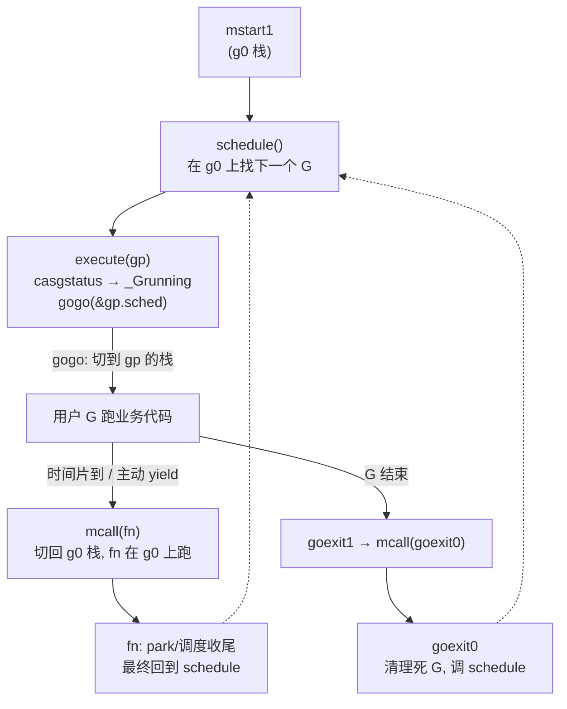

# 第三章 · 调度循环:schedule 与 findRunnable

> 篇:第 1 篇 · GMP 调度器(全书地基,重头戏)
> 主线呼应:上一章我们打开了 G/M/P 三个结构体的黑盒,把 G 的状态机、P 的本地 runq、`guintptr` 绕写屏障、`_Gscan` 当锁等技巧都立了起来。但一个新问号一直挂着——**M 到底怎么不断从队列里找下一个 G 来跑?** 一条 OS 线程被 `mstart` 拉起来后,它的"一生"几乎就是在一个死循环里:取一个就绪 G → 切栈去执行 → G 让出 → 回到循环。这个循环的入口是 [`schedule`](../go/src/runtime/proc.go#L4150),真正干"找活干"这件事的重活函数是 [`findRunnable`](../go/src/runtime/proc.go#L3404)。这一章我们钻进这两个函数,把 Go 调度器的"发动机"拆透——它**从哪里按什么顺序找 G,为什么是这个顺序**,以及它和 `mcall`/`gogo` 这对汇编怎么合力完成一次完整的栈切换。

## 核心问题

**M 怎么不断找下一个可跑的 G(`schedule` → `findRunnable`)?找 G 的优先级是什么(本地 runq → 全局 runq → netpoll → 偷别的 P → GC 空闲标记 → park M),为什么这么排?**

读完本章你会明白:

1. 一条 M 的调度循环长什么样:从 `mstart1` 进入 `schedule`,取 G、`execute`、`gogo` 切栈执行;G 让出后经 `mcall` 切回 g0,再回到 `schedule`——这是一个永不停转的圈。
2. `findRunnable` 的多级回退顺序,以及**每一级在解决什么"找不到 G"的情况**、为什么这个顺序 sound(不饿死 G、不让 M 空转、及时响应网络与 GC、不让自旋 M 烧 CPU)。
3. `schedule` 拿到 G 后怎么收尾:`resetspinning` / `wakep` / `execute`/`gogo` 这一套协同。
4. `mcall` / `gogo` 这对汇编逐行干了什么——怎么在 g0 系统栈和用户 G 栈之间换栈、换 PC、换 g 寄存器,为什么这一切是用户态的、纳秒级。
5. 自旋 M 的"delicate dance":一个 M 从 spinning 转 parking,为什么必须**先减 `nmspinning` 再复查所有工作源**(StoreLoad 屏障),否则会丢活。

> 逃生阀:`findRunnable` 全长 400 多行,有十几级回退和一堆注释。读到这里如果觉得"分支太多绕晕了",别慌——你只需要记住**主干五级**:本地 runq → 全局 runq → netpoll(非阻塞)→ 偷别的 P → park。其余分支(GC worker、trace reader、`schedtick%61==0` 的公平回访、自旋转 parking 的复查)都是为了让主干"不饿死、不空转、不丢活"而长出来的补丁。本章按主干讲透,补丁逐个点明它补的是哪条缝。

---

## 3.1 一句话点破

> **调度循环不是"取一个 G 跑完再取下一个"这么简单,而是一台在"尽快拿到就绪 G"和"不要让空闲 M 白占 CPU"两股力量间反复权衡的机器:能从本地拿就不碰全局锁,能从全局拿就不去偷,偷不到就在阻塞 netpoll 上赌一把,赌不到就把 P 让出来自己去睡觉。每一级回退都对应一种"前面这条路找不到 G"的具体失败,而顺序的选择直接决定了延迟、吞吐和公平性。**

这是结论,不是理由。本章倒过来拆:先看 M 的一生是不是真有个"循环",再看 `findRunnable` 一级一级往下走每级在防什么,然后看 `schedule` 怎么收尾、`mcall`/`gogo` 怎么把这一切缝合成一次栈切换,最后拆最硬的一个技巧——自旋转 parking 的"delicate dance"凭什么不丢活。

---

## 3.2 调度循环:M 的一生是一个 `schedule` 死圈

先把上一章立起的 G/M/P 串起来,看一条 M 从出生到死的形状。一条 OS 线程被 runtime 用 `newosproc` 拉起来后,入口汇编是 [`mstart`](../go/src/runtime/asm_amd64.s#L385)(它把 BP 置 0 防止栈回溯越界),然后 [`mstart0`](../go/src/runtime/proc.go#L1875) 调 [`mstart1`](../go/src/runtime/proc.go#L1917):

```go
// src/runtime/proc.go#L1930-L1955(节选)
gp.sched.g = guintptr(unsafe.Pointer(gp))   // gp 是这条 M 的 g0
gp.sched.pc = sys.GetCallerPC()             // 记下"调用 schedule 的返回地址"
gp.sched.sp = sys.GetCallerSP()             // 记下当前栈顶
...
if gp.m != &m0 {
    acquirep(gp.m.nextp.ptr())              // 接管一个 P
    gp.m.nextp = 0
}
schedule()                                   // 进入调度循环,永不返回(从 g0 的视角)
```

`mstart1` 的关键一句是给 **g0 的 `sched` 字段**塞了一对 `(pc, sp)`——记下"调用 `schedule()` 那一刻 g0 栈的位置"。这件事看起来不起眼,但它是后面 `goexit0` 能"返回 `mstart1` 让线程退出"的伏笔:当一个 G 跑完调 [`goexit1`](../go/src/runtime/proc.go#L4490),它会 `mcall(goexit0)` 切到 g0 跑 [`goexit0`](../go/src/runtime/proc.go#L4506),`goexit0` 在把死 G 清理完之后调 [`schedule()`](../go/src/runtime/proc.go#L4515) 重新找下一个 G。如果到了"该退出线程"的极端时刻,`gogo(&g0.sched)` 会跳回这个 `mstart1` 当初记下的 `(pc, sp)`,让 `mstart0` 走完收尾逻辑。

> **钉死这件事**:一条 M 的执行轨迹,从 g0 的视角看就是一个**永远不会自然返回的 `schedule()` 调用**。它在 g0 栈上反复调 `schedule` → `execute` → `gogo`(切到用户栈)→ 用户 G 让出 → `mcall`(切回 g0)→ 回到 `schedule`。M 真正"睡觉"靠的是 `stopm` 里的 `mPark`(futex/semaphore),那也是从 g0 上发起的——但醒来后又回到 `schedule`。这个圈,就是 GMP 的心跳。

把这个圈画出来:



`execute` → `gogo` 这一步,是循环里唯一一次"从 g0 跳到用户栈";`mcall` 是唯一一次"从用户栈跳回 g0"。其余所有动作(找 G、切状态、清理)都在 g0 上完成。这套"用户栈/g0 栈"的二分,是上一章 2.4.1 讲 g0 时埋的伏笔:runtime 自己的逻辑在 g0 上跑,有稳定的大栈;用户 G 用它自己那 2KB 起步的小栈跑业务。**两个栈的切换,就是调度循环的"心跳声"。**

> **不这样会怎样**:如果 `schedule` 不在 g0 上跑,而是在某个用户 G 的栈上跑,那这个 G 可能只剩几百字节栈空间,一进 `schedule`/`findRunnable`(里面要锁、要遍历、要分配)就栈溢出了。g0 给 runtime 一块稳定的大栈,把"runtime 自己的执行"和"用户 G 的执行"彻底分开——这是 `mcall`/`gogo` 存在的根本理由。

---

## 3.3 `schedule`:循环的外壳

[`schedule`](../go/src/runtime/proc.go#L4150) 本身很薄,它是循环的外壳,真正找活的重活在 [`findRunnable`](../go/src/runtime/proc.go#L3404) 里。我们先扫一遍 `schedule` 的骨架:

```go
// src/runtime/proc.go#L4150-L4246(节选)
func schedule() {
    mp := getg().m
    if mp.locks != 0 { throw("schedule: holding locks") }      // (1)
    if mp.lockedg != 0 { stoplockedm(); execute(mp.lockedg.ptr(), false) } // (2) LockOSThread
    if mp.incgo { throw("schedule: in cgo") }                  // (3)

top:
    pp := mp.p.ptr()
    pp.preempt = false                                          // (4) 清掉本 P 的抢占标志
    if mp.spinning && (pp.runnext != 0 || pp.runqhead != pp.runqtail) {
        throw("schedule: spinning with local work")             // (5)
    }
    gp, inheritTime, tryWakeP := findRunnable()                 // (6) 重头戏,会阻塞直到有活
    pp = mp.p.ptr()                                             // (7) 可能换了 P(findRunnable 内会 acquirep)
    mp.clearAllpSnapshot()                                      // (8) 释放 allp 快照给 GC
    gcController.releaseNextGCMarkWorker(pp)                    // (9)
    if mp.spinning { resetspinning() }                          // (10) 自旋 M 拿到活了,退自旋
    if sched.disable.user && !schedEnabled(gp) { ... goto top } // (11) 调度被禁用,延后再找
    if tryWakeP { wakep() }                                     // (12) GC worker/trace reader 要叫醒别的 P
    if gp.lockedm != 0 { startlockedm(gp); goto top }           // (13) G 锁定到别的 M
    execute(gp, inheritTime)                                    // (14) 真正切栈执行
}
```

逐条点这几行的"为什么":

- **(1)(3) 守门断言**:持有 runtime 锁时不该进调度(会和 STW/GC 状态机打架);在 cgo 调用里不该进调度(cgo 用的是 g0 栈,且 runtime 掌控不了那条 C 栈)。这两条都是"撞上就 `throw`"的硬约束,说明 `schedule` 只能在干净状态下被调用。

- **(2) `mp.lockedg`**:`runtime.LockOSThread()` 把某条 G 永久钉在当前 M 上。这种 M 进 `schedule` 时不能随便取别的 G,得去等它锁定的那个 G 可运行——[`stoplockedm`](../go/src/runtime/proc.go#L3265) 把它挂起,等那个 G 被人 `ready` 唤醒再用 `execute` 跑它。这是 GMP 主线之外的一个"钉子户"分支,绝大多数程序用不到。

- **(4) 清 `pp.preempt`**:上一章 2.3.4 提到 P 也有自己的 `preempt` 标志(sysmon 设置,要求这条 P 上的 G 进 `schedule` 时把自己停掉)。进 `schedule` 就把它清了——因为这轮要么换了 G 跑,要么 G 让出的原因就是这个标志,处理一次就够。

- **(5) 自旋 M 不该有本地活**:如果一个 M 标记自己是 spinning(正在偷活),那它**绝不该**本地 runq 里已经有活——否则它就是"假装找不到活"在偷,既烧 CPU 又抢别人的锁。撞上就 `throw`,说明调度器状态被破坏了。

- **(6) `findRunnable`**:**核心**,可能阻塞(最后会 `stopm` 睡眠)。这是本章 3.4 整节的主战场。

- **(7) 可能换了 P**:`findRunnable` 里有路径会 `releasep` + `pidleput`(把当前 P 还回去睡觉)再 `acquirep`(从 netpoll 醒来后领一个新 P),所以回来后要重新读 `mp.p.ptr()`。

- **(9) `releaseNextGCMarkWorker`**:GC 给本 P 预定了一个 mark worker,但 `findRunnable` 这次没选它(选了优先级更高的 trace reader 或别的),那就把预定的 worker 释放给别人。GC 工作和用户 G 抢同一个 P,这里是个协调点。

- **(10) `resetspinning`**:`findRunnable` 把自旋 M 退自旋的逻辑放在拿到 G 之后的 `schedule` 里。这背后是一段非常微妙的并发协议——**delicate dance**(见 3.6 技巧精解)。

- **(12) `tryWakeP`**:`findRunnable` 返回的 G 如果是 GC mark worker 或 trace reader 这类"特殊 G",它跑起来时往往意味着系统状态变了(标记开始、trace 上线),需要 `wakep()` 叫醒一个空闲 P 接力,避免这种特殊活被一个 P 卡死。

- **(14) `execute`**:`schedule` 的最后一行,也是切栈的扳机。`execute` 把 G 状态从 `_Grunnable` CAS 到 `_Grunning`,设好 `stackguard0`,最后调 `gogo(&gp.sched)` 一去不返。

`schedule` 看起来短,但它把"调度循环的安全门、状态协调、自旋协调、特殊 G 唤醒"全揽了下来,只把"怎么找 G"这件事外包给 `findRunnable`。这种分工本身是个技巧:**`findRunnable` 可以放心地阻塞、换 P、park M,而 `schedule` 保证回到它这里时 M 一定是干净的、能立刻 `execute` 的。**

---

## 3.4 `findRunnable`:多级回退,每一级堵一条缝

[`findRunnable`](../go/src/runtime/proc.go#L3404) 是这一章的主角。它有十几级回退,但主干清晰。我们按**源码顺序**逐级拆,每一级都问:它在解决什么"前面找不到 G"的失败?为什么这个顺序?

### 3.4.1 第 0 级:STW 与 safepoint

```go
// src/runtime/proc.go#L3417-L3424
pp := mp.p.ptr()
if sched.gcwaiting.Load() {
    gcstopm()        // 进 STW 等待,世界重启后返回
    goto top
}
if pp.runSafePointFn != 0 {
    runSafePointFn()
}
```

`findRunnable` 一进来先看全局 `sched.gcwaiting`——GC 在等"世界停止"时,所有进 `findRunnable` 的 M 都要进 [`gcstopm`](../go/src/runtime/proc.go#L3311) 把自己的 P 交出去睡到 GC 那边,等 GC 放行再回来。`runSafePointFn` 是一个 per-P 的 safepoint 回调(用于 `runtime.GC` 等需要"所有 P 到齐"的操作),有就执行掉。

> **为什么放最前面**:GC 的 STW 协议要求"所有 P 在某个时刻都停下了",如果 M 偷偷继续取用户 G 跑,STW 就永远等不齐。所以这是**正确性闸门**,优先级压倒一切找活逻辑。

### 3.4.2 第 1 级:trace reader 与 GC mark worker(系统性特殊活)

```go
// src/runtime/proc.go#L3432-L3453(节选)
if traceEnabled() || traceShuttingDown() {
    gp := traceReader()                // 取 trace 数据的专用 G
    if gp != nil { ...; return gp, false, true }   // tryWakeP=true
}
if gcBlackenEnabled != 0 {
    gp, tnow := gcController.findRunnableGCWorker(pp, now)
    if gp != nil { return gp, false, true }
}
```

注意这两级在本地 runq 之前。它们是**系统级特殊活**:

- **trace reader**:用户开了 `runtime/trace`,需要一个专门从每个 P 抓 trace 事件的 G。它对延迟敏感(慢了 trace 数据会被丢),所以优先级压过普通用户 G。
- **GC mark worker**:GC 并发标记阶段,要让 P 出一部分时间干标记(第 14 章详讲)。`gcController` 决定"这个 P 这轮该不该出 mark worker、出哪种(dedicated/fractional/idle)",要就给它一个。

> **不这样会怎样**:如果 GC mark worker 排在本地 runq 之后,那 GC 在压力峰值时永远抢不到 CPU,标记赶不上分配,只能靠 mark assist 把压力转嫁给分配者(第 15 章)——更糟的是可能逼出更长的 STW。把 GC worker 提前,是"GC 不能被业务彻底饿死"的最低保障。

### 3.4.3 第 2 级:每 61 次回访全局 runq——公平性兜底

```go
// src/runtime/proc.go#L3455-L3465
if pp.schedtick%61 == 0 && !sched.runq.empty() {
    lock(&sched.lock)
    gp := globrunqget()
    unlock(&sched.lock)
    if gp != nil { return gp, false, false }
}
```

这是整个 `findRunnable` 里最"反直觉"的一级:**本地 runq 还没看,就先去全局 runq 拿一个**。为什么?

注释原话([proc.go#L3455](../go/src/runtime/proc.go#L3455)):"Check the global runnable queue once in a while to ensure fairness. Otherwise two goroutines can completely occupy the local runqueue by constantly respawning each other."

考虑这个病态场景:P0 上有两个 G,A 跑完 `go B`,`B` 跑完 `go A`,无限互 spawn。它们俩会一直在 P0 的本地 runq 里来回弹(`runnext` 把新 G 顶出来,见 3.4.6),**永远不去全局 runq**。如果这时候全局 runq 里有个等了很久的 C,C 就被这两个本地玩家活活饿死。

`schedtick` 是 P 上"已经调度了多少个 G"的计数([`execute` 里 `mp.p.ptr().schedtick++`](../go/src/runtime/proc.go#L3365))。每调度 61 个 G,强制去全局 runq 拿一个——把这个魔数定为 61 不是随意的(详见 3.6.2 小技巧),核心是"大多数时候尊重本地优先(无锁、缓存好),但每隔固定次数给全局一次机会,防止局部玩家饿死全局"。

> **所以这样设计**:61 是个"低到几乎不影响本地优先的性能优势、高到足以避免饥饿"的经验值。它牺牲一点点本地性,换全局公平性——这是调度器里典型的"无锁快路径 + 周期性慢路径"折中。

### 3.4.4 第 3 级:本地 runq——快路径

```go
// src/runtime/proc.go#L3483-L3486
if gp, inheritTime := runqget(pp); gp != nil {
    return gp, inheritTime, false
}
```

[`runqget`](../go/src/runtime/proc.go#L7649) 是 P 取自己本地 runq 的唯一入口,它有两个内部源:

```go
// src/runtime/proc.go#L7649-L7670
func runqget(pp *p) (gp *g, inheritTime bool) {
    // 优先 runnext(上一个 G 用 go func 塞进来的"插队 G")
    next := pp.runnext
    if next != 0 && pp.runnext.cas(next, 0) {
        return next.ptr(), true          // inheritTime=true:和上一个 G 共享时间片
    }
    for {
        h := atomic.LoadAcq(&pp.runqhead)  // acquire:和偷者 CAS 推 head 同步
        t := pp.runqtail                   // 本 P 独占,普通读
        if t == h { return nil, false }
        gp := pp.runq[h%uint32(len(pp.runq))].ptr()
        if atomic.CasRel(&pp.runqhead, h, h+1) { // release:发布"消费完成"
            return gp, false
        }
    }
}
```

这一段是上一章 2.9 技巧一里讲过的**无锁环形 runq**的消费者端。关键两个内存序技巧:

1. **`runnext` 用 CAS 清零**:`runnext` 是"下一个优先跑的 G",可能被别的 P 在偷的时候也 CAS 改(把偷到的位置标记),所以本 P 用 `cas(next, 0)` 抢着清——抢到就是我的,抢不到说明被偷者拿走了,直接走 runq 主体。注释([proc.go#L7652](../go/src/runtime/proc.go#L7652))说得很清楚:"only the current P can set it to non-0"——本 P 是唯一写者,但偷者会 CAS 成 0,所以 CAS 失败 ≠ 本地还有这个 G。
2. **head 用 `LoadAcq`,推进用 `CasRel`**:`runqhead` 是本 P 和偷者共享的(偷者从 head 端偷,见 [`runqgrab`](../go/src/runtime/proc.go#L7713))。本 P 读 head 要 acquire(看见偷者推进的最新值),推进 head 要 release(让偷者看见"这个槽我消费完了")。

`inheritTime = true` 是 `runnext` 专属:从 `runnext` 取出来的 G **不递增 `schedtick`**,意味着它"继承"了上一个 G 的时间片。为什么?因为 `runnext` 通常是上一个 G 用 `go func` 创建的子 G(见 [`runqput` 的 next 分支](../go/src/runtime/proc.go#L7545)),让子 G 立刻接着跑能减少调度延迟(子 G 的栈/缓存还热)。但这也带来一个风险——两个 G 互相 `go` 对方会无限共享一个 `schedtick`,**永远不被时间片抢占**。所以才需要 sysmon 监控(第 7 章),靠"长时间运行"来兜底抢占。[runqput 的注释](../go/src/runtime/proc.go#L7530-L7540)明说:没有 sysmon 时强制 `next = false`,否则会饿死别人。

> **钉死这件事**:`runnext` 不是普通队列元素,它是**"插队槽"**——一个让"刚唤醒/刚创建的 G 立刻跑"的优化。它和 `runq` 主体共享一条本地队列语义,但用 inheritTime 和插队位置换了更好的缓存局部性和更低的调度延迟。

### 3.4.5 第 4 级:全局 runq——批量搬一批

```go
// src/runtime/proc.go#L3488-L3499
if !sched.runq.empty() {
    lock(&sched.lock)
    gp, q := globrunqgetbatch(int32(len(pp.runq)) / 2)   // 一次拿半批(~128)
    unlock(&sched.lock)
    if gp != nil {
        if runqputbatch(pp, &q); !q.empty() { throw(...) }
        return gp, false, false
    }
}
```

本地空了,去全局 runq 拿。但**不是拿一个,而是一次拿半批**(本地 runq 容量 256 的一半)。[`globrunqgetbatch`](../go/src/runtime/proc.go#L7344) 的批量数是 `min(n, size, size/gomaxprocs+1)`——既不超本地容量,也按 P 数分摊。

> **不这样会怎样**:如果每次只拿一个,那有 1000 个 G 排在全局 runq 时,本地 runq 空了就拿一个、跑完再拿一个——每个 G 都要进一次 `sched.lock`。在 P 多的机器上锁竞争会把调度器拖垮。批量拿一次性把锁成本摊到 128 个 G 上,均摊成本 1/128——和上一章 2.9 讲的"`runqputslow` 搬一半去全局"是对称的:入队批量、出队也批量,**全局锁只在批量边界出现**。

### 3.4.6 第 5 级:netpoll 非阻塞——网络就绪的快速通道

```go
// src/runtime/proc.go#L3501-L3525(节选)
// Poll network. This netpoll is only an optimization before we resort to stealing.
if netpollinited() && netpollAnyWaiters() && sched.lastpoll.Load() != 0 &&
   sched.pollingNet.Swap(1) == 0 {
    list, delta := netpoll(0)                // 非阻塞,timeout=0
    sched.pollingNet.Store(0)
    if !list.empty() {
        gp := list.pop()
        injectglist(&list)                   // 其余的灌进 runq
        netpollAdjustWaiters(delta)
        ...; return gp, false, false
    }
}
```

本地、全局都空了,先问一句"网络有没有就绪的"。`netpoll(0)` 是**非阻塞**的——立刻返回当前就绪的 G 列表,不等。

几个关键技巧:

- **`sched.pollingNet.Swap(1) == 0`**:这是个"自旋锁"标志,**保证全局只有一个 M 在做非阻塞 netpoll**。为什么要单线程化?注释([proc.go#L3508](../go/src/runtime/proc.go#L3508))原话:"We only poll from one thread at a time to avoid kernel contention on machines with many cores."——多核机器上多个 M 同时 `epoll_wait(0)` 会撞 epoll 内部锁,内核态抖动。所以用这个原子 swap 串行化非阻塞 netpoll,谁先抢到谁 poll,别人跳过。
- **拿到的就绪 G 立刻 pop 一个返回,其余 `injectglist` 灌进 runq**:`netpoll` 返回的是一个 G 链表(多个 socket 同时就绪),取第一个马上跑(它最热),其余塞回全局 runq 给别的 P。
- **注释明说"This netpoll is only an optimization"**:即使跳过这步,后面 3.4.9 的阻塞 netpoll 也会兜底。这一步只是"快速看一眼",省得直接去偷活。

> **所以这样设计**:网络就绪的 G 对延迟极敏感(用户在等响应),所以给它一个"快速通道":本地没活时优先问 netpoll。但又不能让所有 M 都来问(锁竞争),所以串行化。这种"快路径 + 兜底"的两段式,贯穿整个 findRunnable(非阻塞 netpoll 是优化,阻塞 netpoll 是兜底)。

### 3.4.7 第 6 级:work-stealing——偷别的 P 的一半

```go
// src/runtime/proc.go#L3527-L3553(节选)
// Spinning Ms: steal work from other Ps.
// Limit the number of spinning Ms to half the number of busy Ps.
if mp.spinning || 2*sched.nmspinning.Load() < gomaxprocs-sched.npidle.Load() {
    if !mp.spinning { mp.becomeSpinning() }
    gp, inheritTime, tnow, w, newWork := stealWork(now)
    if gp != nil { return gp, inheritTime, false }
    if newWork { goto top }
    ...
}
```

前五级都没找到,本地 P 真的"没活"了。这时候有两种姿势:

- **如果当前 M 已经在自旋,或者全局自旋 M 数 < (忙 P 数 / 2)**:继续进入 [`stealWork`](../go/src/runtime/proc.go#L3843),从别的 P 的本地 runq **偷一半**。

**为什么限制自旋 M 数到忙 P 的一半?** 注释([proc.go#L3529](../go/src/runtime/proc.go#L3529)):"prevent excessive CPU consumption when GOMAXPROCS>>1 but the program parallelism is low." 设想 64 核但程序只有 2 个并发 G——如果不限自旋,会有 32 个 M 在那儿烧 CPU 偷同一个活,纯属浪费。限制成"忙 P 数 / 2"是个经验上限:**忙的 P 越多,说明活越多,可以多放几个 M 偷;忙的 P 少,就别空转**。

`stealWork` 的算法(第 4 章详讲)核心是:**外层 4 轮**(`stealTries = 4`),内层按随机顺序遍历所有 P,逐个尝试 `runqsteal`;最后一轮(`stealTimersOrRunNextG = true`)才偷 `runnext` 和 timer——因为偷 `runnext` 是"抢别人刚插队的 G",代价大,放最后。

> **不这样会怎样**:如果偷活不限制自旋 M 数,空载时 64 核全在烧 CPU 偷空气,系统负载虚高、功耗爆炸,还和真正在干活的 M 抢缓存。`2*nmspinning < busy_P` 这个不等式,是把"找活的积极性"和"CPU 烧不起"做了个保守折中。

### 3.4.8 第 7 级:GC idle 标记——有空闲就帮 GC 干活

```go
// src/runtime/proc.go#L3555-L3574(节选)
if gcBlackenEnabled != 0 && gcShouldScheduleWorker(pp) &&
   gcController.addIdleMarkWorker() {
    node := (*gcBgMarkWorkerNode)(gcBgMarkWorkerPool.pop())
    if node != nil {
        pp.gcMarkWorkerMode = gcMarkWorkerIdleMode
        gp := node.gp.ptr()
        ...; return gp, false, false
    }
    gcController.removeIdleMarkWorker()
}
```

偷都偷不到了,但 GC 还在并发标记,这 P 手头又闲——那就**用 idle 优先级跑 mark worker**,帮 GC 加速标记。注意 `gcMarkWorkerIdleMode`:GC worker 有三种模式(dedicated/fractional/idle,第 14 章详讲),idle 模式是最低优先级——"反正没活干,顺便帮 GC 一下",一旦有用户 G 来了立刻让位。

> **所以这样设计**:并发 GC 的标记工作总量是固定的,要么 dedicated/fractional worker 在系统"忙"时干一部分,要么 idle worker 在系统"闲"时干剩下的。让 P 闲着烧空不如干 GC 活——把空闲 CPU 周期换成更短的 GC 周期。这是"work conservation"(工作守恒)原则的体现。

### 3.4.9 第 8 级:wasm / beforeIdle——平台特例

```go
// src/runtime/proc.go#L3576-L3592
gp, otherReady := beforeIdle(now, pollUntil)
if gp != nil { ...; return gp, false, false }
if otherReady { goto top }
```

`beforeIdle` 在大多数平台是个空 stub,只有 wasm 等单线程平台才有实义(wasm 没有多线程,需要 event loop 唤醒)。我们略过,知道"这是个平台钩子"即可。

### 3.4.10 第 9 级:放 P、park M——真的没活了,睡觉

到这里,P 的本地 runq 空、全局 runq 空、netpoll 没就绪、偷不到、GC idle 也排满了——**真的没活干**。这时候 M 不能继续自旋(浪费 CPU),得把 P 让出来睡觉:

```go
// src/runtime/proc.go#L3602-L3635(节选)
allpSnapshot := mp.snapshotAllp()              // 快照 allp,因为放 P 后不能安全访问
idlepMaskSnapshot := idlepMask
timerpMaskSnapshot := timerpMask

lock(&sched.lock)
if sched.gcwaiting.Load() || pp.runSafePointFn != 0 { unlock(&sched.lock); goto top }
if !sched.runq.empty() {                       // 再查一次全局,有就领回本地跑
    gp, q := globrunqgetbatch(...); ...; return gp, false, false
}
if !mp.spinning && sched.needspinning.Load() == 1 {  // needspinning:有人请求再加自旋
    mp.becomeSpinning(); unlock(&sched.lock); goto top
}
if releasep() != pp { throw("findRunnable: wrong p") }
now = pidleput(pp, now)                        // 把 P 还进空闲 P 池
unlock(&sched.lock)
```

放 P 之后,自旋 M 要走一段"delicate dance"(见 3.6 技巧精解),非自旋 M 直接进入阻塞 netpoll:

```go
// src/runtime/proc.go#L3747-L3812(节选)
if netpollinited() && (netpollAnyWaiters() || pollUntil != 0) &&
   sched.lastpoll.Swap(0) != 0 {
    ...
    delay := int64(-1)
    if pollUntil != 0 { delay = pollUntil - now; if delay < 0 { delay = 0 } }
    list, delta := netpoll(delay)              // 阻塞!timeout=下一个 timer 到期
    ...
    if pp == nil { injectglist(&list); ... }   // 没 P 抢,灌回全局
    else { acquirep(pp); ...; return gp, false, false }
}
stopm()                                         // 实在没活,M 进 mPark 睡眠
goto top
```

关键三件事:

1. **快照 `allp` / `idlepMask` / `timerpMask`**:放 P 之后,M 不再持有 P,**写屏障不能用了**(第 2 章 2.5 讲过),而且 `allp` 长度可能在 safepoint 变。所以放 P 前先快照一份,放 P 后的复查全用快照。注释([proc.go#L3594](../go/src/runtime/proc.go#L3594))解释得很清楚。
2. **阻塞 `netpoll(delay)`**:`delay` = 下一个 timer 的到期时间。M 在 epoll 上**阻塞**等待网络事件,**直到有事件或 timer 到期**。这步是整个 findRunnable 唯一一个真正"睡"的地方(前面 3.4.6 的 netpoll 是非阻塞)。一个 M 阻塞在 netpoll 上时,`sched.lastpoll` 被置 0(表示"有线程在 poll"),别的不敢重复 poll。
3. **`stopm()`**:网络也没活,**把 M 自己也睡了**(`mPark` → futex/semaphore)。睡醒后(有 P 来认领它)回到 `goto top` 重新找活。

> **钉死这件事**:`findRunnable` 的核心策略是**逐级让步**——能本地不全局、能非阻塞不阻塞、能自旋不睡眠。每一级的失败才往下走一级,最后实在没活才"放 P + park M"。这套顺序,让正常负载下 M **几乎不进睡眠**(本地 runq 命中率高),只有真正空载时才付出 park/wake 的代价。

---

## 3.5 `execute` / `gogo` / `mcall`:把循环缝起来的栈切换

`schedule` 拿到 G 之后,最后一行是 [`execute(gp, inheritTime)`](../go/src/runtime/proc.go#L3346):

```go
// src/runtime/proc.go#L3346-L3398(节选)
func execute(gp *g, inheritTime bool) {
    mp := getg().m
    mp.curg = gp               // M 现在跑这个 gp
    gp.m = mp
    casgstatus(gp, _Grunnable, _Grunning)   // 状态机:可运行 → 运行中
    gp.waitsince = 0
    gp.preempt = false
    gp.stackguard0 = gp.stack.lo + stackGuard   // 重设栈哨兵(防栈溢出 + 抢占)
    if !inheritTime { mp.p.ptr().schedtick++ }
    ...
    gogo(&gp.sched)            // 切栈!一去不返
}
```

`execute` 做两件事:**把状态机翻到 `_Grunning`(锁住 gp 的栈归它)**,然后调汇编 [`gogo`](../go/src/runtime/asm_amd64.s#L402)。`gogo` 是"跳板"——把控制权从 g0 栈切到 gp 的栈:

```asm
// src/runtime/asm_amd64.s#L402-L419
TEXT runtime·gogo(SB), NOSPLIT, $0-8
    MOVQ    buf+0(FP), BX              // BX = &gp.sched(gobuf 指针)
    MOVQ    gobuf_g(BX), DX            // DX = gp
    MOVQ    0(DX), CX                  // make sure g != nil(读一下,触发空指针检测)
    JMP     gogo<>(SB)

TEXT gogo<>(SB), NOSPLIT, $0
    get_tls(CX)                        // CX = TLS 槽地址(每线程一份,存当前 g)
    MOVQ    DX, g(CX)                  // TLS[g] = gp(更新"当前 g")
    MOVQ    DX, R14                    // R14 = gp(Go 内部 ABI 用 R14 当 g 寄存器)
    MOVQ    gobuf_sp(BX), SP           // SP = gp 当初挂起时的栈顶 ★
    MOVQ    gobuf_ctxt(BX), DX         // 恢复 ctxt(channel 传的上下文)
    MOVQ    gobuf_bp(BX), BP           // 恢复帧指针
    MOVQ    $0, gobuf_sp(BX)           // 清掉 gobuf.sp(帮 GC,见下)
    MOVQ    $0, gobuf_ctxt(BX)
    MOVQ    $0, gobuf_bp(BX)
    MOVQ    gobuf_pc(BX), BX           // BX = gp 当初挂起时的 PC
    JMP     BX                         // 跳到 gp 的代码 ★
```

逐行解读这段汇编:

1. **`gogo(SB)` 是 ABI 入口**:`buf+0(FP)` 是 Go 调用约定的参数(参数在 frame pointer 上方),取出 `&gp.sched` 到 BX。
2. **读 `gobuf_g`、解引用验非 nil**:`MOVQ 0(DX), CX` 这步看起来"没用",其实是在强制访问 gp 的内存——如果 gp 是空指针,这里就会触发段错误,比"等会儿在别处莫名其妙崩溃"好排查。
3. **`gogo<>` 是去 ABI 化的内部实现**:`get_tls(CX)` 取 TLS(thread-local storage)槽,把 `g(CX)`(当前线程的"当前 g")更新成 gp。同时 `MOVQ DX, R14`——Go 内部 ABI 把 **R14 寄存器专门用作 g 寄存器**,任何代码随时 `R14` 就能拿到当前 g(比每次查 TLS 快)。这两步是"声明:M 现在的身份变成 gp 了"。
4. **`MOVQ gobuf_sp(BX), SP`**:把 SP 指针换成 gp 当初挂起时的栈顶——**这是栈切换的物理动作**。从这行往后,CPU 在 gp 的栈上运行,不再是 g0 的栈。
5. **恢复 ctxt/bp**:`ctxt` 是个通用上下文指针(比如 channel 唤醒时传数据);`bp` 是帧指针(支持栈回溯)。
6. **清零 gobuf 的 sp/ctxt/bp**:不是必须,但注释明说"help garbage collector"——清掉这些字段,GC 不会把它们误当作活指针追踪(gp 本身在 `allgs` 里有真指针保活,gobuf 里的临时副本没必要再追踪)。
7. **`MOVQ gobuf_pc(BX), BX; JMP BX`**:取出 gp 当初挂起的 PC(返回地址),**直接跳过去**。这一跳,gp 就从它上次挂起的地方继续执行,好像"什么都没发生过"。

切换前后栈的样子:

```
  g0 栈(系统栈,大)             用户 G(gp)的栈
  ┌───────────────┐            ┌───────────────┐
  │ schedule()    │            │               │ ← gp.sched.sp
  │ execute()     │            │  gp 挂起前的  │
  │ gogo()  ←──┐  │            │  栈帧和局部变量│
  │            │  │            │               │
  └────────────┼──┘            └───────────────┘
               │
               └── JMP 后 PC 跳到 gobuf_pc
                   SP 跳到 gp.sched.sp
                   R14/TLS[g] = gp
                   (g0 栈"冻结"在调用 gogo 的状态)
```

`mcall` 是反方向——**从用户 G 切回 g0**。它的典型调用场景:用户 G 跑完了调 `goexit1` → `mcall(goexit0)`,或者 G 要 park 让出(`gopark`)、要进系统调用(`entersyscall`)。看 [`mcall`](../go/src/runtime/asm_amd64.s#L425):

```asm
// src/runtime/asm_amd64.s#L425-L470(节选,去掉 runtimesecret 分支)
TEXT runtime·mcall<ABIInternal>(SB), NOSPLIT, $0-8
    MOVQ    AX, DX                      // DX = fn(参数在 AX,Go ABI)

    // 保存当前 g 的状态到 g.sched(给将来 gogo 用)
    MOVQ    SP, BX                      // BX = 当前 SP
    MOVQ    8(BX), BX                   // BX = 调用者的返回地址(mcall 的 caller PC)
    MOVQ    BX, (g_sched+gobuf_pc)(R14) // g.sched.pc = 返回地址
    LEAQ    fn+0(FP), BX                // BX = mcall 调用者的 SP
    MOVQ    BX, (g_sched+gobuf_sp)(R14) // g.sched.sp = 调用者 SP
    MOVQ    (BP), BX                    // BX = 调用者的 BP(解引用帧指针)
    MOVQ    BX, (g_sched+gobuf_bp)(R14) // g.sched.bp = 调用者 BP

    // 切到 g0 栈
    MOVQ    g_m(R14), BX                // BX = g.m
    MOVQ    m_g0(BX), SI                // SI = g.m.g0
    CMPQ    SI, R14                     // sanity: g == g0 则 badmcall
    JNE     goodm
    JMP     runtime·badmcall(SB)
goodm:
    MOVQ    R14, AX                     // AX = 当前 g(作为 fn 的参数)
    MOVQ    SI, R14                     // R14 = g0
    get_tls(CX)
    MOVQ    R14, g(CX)                  // TLS[g] = g0
    MOVQ    (g_sched+gobuf_sp)(R14), SP // SP = g0.sched.sp ★
    MOVQ    $0, BP                      // 清帧指针(caller 可能在别的 M 上)
    PUSHQ   AX                          // 给 fn 的参数留 spill 槽
    MOVQ    0(DX), R12                  // R12 = fn 的实际函数指针
    CALL    R12                         // fn(g) ★
    ...
```

逐段看 `mcall`:

1. **保存当前 g 状态到 `g.sched`**:和 `gogo` 是镜像——`gogo` 从 `g.sched` 读 sp/pc/bp 恢复,`mcall` 把当前的 sp/pc/bp 写进 `g.sched`。注意 `mcall` 把**调用者的返回地址**(`MOVQ 8(BX), BX`)存进 pc——这样将来 `gogo(&g.sched)` 跳回来时,会从"调用 mcall 之后那条指令"继续,对调用者而言 mcall 像"正常返回了"。
2. **切换到 g0**:`g_m(R14)` 拿到当前 g 的 m,`m_g0` 拿到这条 M 的 g0。sanity 检查"当前 g 不能已经是 g0"(否则 `badmcall`)。
3. **更新身份**:`R14 = g0`、`TLS[g] = g0`。从这行起,当前 g 是 g0。
4. **`MOVQ g0.sched.sp, SP`**:把 SP 切到 g0 的栈——**这是切回 g0 的物理动作**。g0 的 `sched.sp` 是 `mstart1` 当初记下的(3.2 节讲过),或者是上次 `mcall` 调用时更新的。
5. **`PUSHQ AX` 留 spill 槽 + `CALL R12` 调 fn**:在 g0 栈上调用传入的函数(`goexit0`、`park_m`、`entersyscall` 等),参数是当前 g 的指针(AX)。

`mcall` 的契约很硬:**fn 必须不返回**。它要么调 `gogo(&g.sched)` 把别的 g 切上去继续跑,要么调 `schedule()` 重新找活。`mcall` 后面紧跟的指令(`badmcall2`)是"fn 居然返回了"的崩溃路径——这是个 invariant 检查。

> **钉死这件事**:`gogo` 和 `mcall` 是 Go 调度器的"心脏起搏器"。`schedule` → `execute` → `gogo` 把控制权从 g0 交给用户 G;用户 G 让出 → `mcall` 把控制权从用户 G 收回 g0 → 回到 `schedule`。这一对汇编,**用纯用户态的几条 mov/jmp 指令完成了"换栈换 PC 换 g 身份"**,没有系统调用、没有内核参与——这是上一章 1.7 节立起的"goroutine 切换比线程切换快一到两个数量级"的物理基础。

---

## 3.6 技巧精解:两个最硬核的并发协议

这一章最硬核的两个技巧不是单行汇编,而是两段**并发协议**——`mcall`/`gogo` 的镜像保存/恢复,和自旋转 parking 的 "delicate dance"。前者是"换栈"为什么 sound,后者是"调度器怎么不丢活"。

### 技巧一:`mcall`/`gogo` 镜像——凭什么换栈不踩脚

栈切换这件事本质危险:你在一个栈上跑得好好的,突然把 SP 换到另一个栈——如果切换前后寄存器/栈内容不一致,要么数据错乱要么栈损坏。Go 用一个**镜像式 save/restore** 把这件事做 sound:

**`mcall` 写入端**(用户 G → g0):

```
当前 g.sched.sp   ← 调用者 SP(含返回地址 + 局部变量)
当前 g.sched.pc   ← 调用者的返回地址(mcall 之后那条指令)
当前 g.sched.bp   ← 调用者的帧指针
当前 g.sched.g    ← 当前 g 自己(guintptr,汇编读不到 R14 时备用)
```

**`gogo` 读出端**(g0 → 用户 G):

```
SP = gobuf.sp     → 恢复调用者 SP
PC = gobuf.pc     → JMP 到调用者返回地址
BP = gobuf.bp     → 恢复帧指针
TLS[g]/R14 = g    → 更新当前 g 身份
```

两边字段一一对应,且**全部走 `g.sched` 字段中转**,没有跨寄存器的隐式传递。这种"经内存中转的镜像式切换"有几个好处:

1. **可重入、可中断**:状态全在 `g.sched` 内存里,不依赖某个寄存器的瞬时值。GC 扫栈、信号打断都不会破坏这套契约(因为状态在内存,不在寄存器)。
2. **跨栈调用 sound**:`mcall` 调用 fn 时,fn 在 g0 栈上跑,但它操作的"那个 g"是 `mcall` 保存进 `g.sched` 的——fn(`goexit0`/`park_m`)能安全地改这个 g 的状态(改 atomicstatus、清理 defer),因为这些操作不依赖那个 g 的栈(它的栈已经"冻结"了,状态在 `g.sched` 里)。
3. **GC 友好**:`gogo` 切完后清掉 `gobuf.sp/ctxt/bp`(`MOVQ $0, ...`),不是必须,是"帮 GC 不误追踪临时副本";`g.sched.g` 用 `guintptr`(第 2 章 2.5),汇编写它不触发写屏障。

> **反面对比**:朴素地换栈会怎样?假设"直接 `mov sp, new_sp; jmp fn`",不保存任何东西——那 fn 一返回就完蛋:返回地址在旧栈上,SP 已经换了,RET 弹出的是新栈上的垃圾。要么 fn 永不返回(`mcall` 的契约),要么必须先存好返回地址。`mcall`/`gogo` 用"`g.sched` 中转 + 函数永不返回"两个约定,把换栈做到 sound。

### 技巧二:delicate dance——自旋转 parking 凭什么不丢活

`findRunnable` 末尾自旋 M 转 parking 那段,源码里挂了 Go runtime 最长的一段注释之一([proc.go#L3637-L3672](../go/src/runtime/proc.go#L3637)),标题就是 **"Delicate dance"**。我们拆这段为什么 sound。

**问题**:一个自旋 M 决定睡觉(它偷不到活,本地也没活)。它要先减 `sched.nmspinning`(告诉全局"少了一个自旋 M"),再 `stopm` 睡。但这两个动作之间有个窗口——别的线程可能正好在这个窗口里往 runq 加了新 G。问题在于:**新 G 来了,谁来唤醒一个 M 跑它?** 答案是"看到 `nmspinning > 0` 就不叫醒新 M,因为有自旋 M 自己会偷到"。但**如果这个自旋 M 已经决定睡觉、还没来得及减 nmspinning**,新 G 的提交者看到 nmspinning>0 就不叫醒任何 M,而这个自旋 M 又要睡了——**新 G 就永远没人跑**。

```go
// src/runtime/proc.go#L3673-L3740(节选)
wasSpinning := mp.spinning
if mp.spinning {
    mp.spinning = false
    if sched.nmspinning.Add(-1) < 0 { throw(...) }   // ★ 先减 nmspinning

    // 然后再查所有工作源(此时全局看不到我在自旋了,有人提交新活会叫醒 M)
    lock(&sched.lock)
    if !sched.runq.empty() {                          // (A) 全局 runq
        pp, _ := pidlegetSpinning(0)
        if pp != nil {
            gp, q := globrunqgetbatch(...)
            ...; acquirep(pp); mp.becomeSpinning()
            return gp, false, false
        }
    }
    unlock(&sched.lock)

    pp := checkRunqsNoP(allpSnapshot, idlepMaskSnapshot)  // (B) 别的 P 的本地 runq
    if pp != nil { acquirep(pp); mp.becomeSpinning(); goto top }

    pp, gp := checkIdleGCNoP()                             // (C) idle GC work
    if pp != nil { acquirep(pp); mp.becomeSpinning(); ...; return gp, false, false }

    pollUntil = checkTimersNoP(allpSnapshot, timerpMaskSnapshot, pollUntil)  // (D) timer
}
```

**关键**:**先减 `nmspinning`,再复查**。这顺序不能反:

> **不这样会怎样**(注释 [proc.go#L3640](../go/src/runtime/proc.go#L3640) 原话):"If we do it the other way around, another thread can submit work after we've checked all sources but before we drop nmspinning; as a result nobody will unpark a thread to run the work."

反过来的顺序是:**先查所有源(没活)→ 再减 nmspinning**。但这两步之间,别的线程可能往 runq 加了一个 G——加 G 的逻辑看到"还有自旋 M",**不叫醒新 M**(它指望自旋 M 偷到)。而自旋 M 这边已经查完没活,正要去减 nmspinning 然后睡觉——这个新 G 就被漏了,没人跑。

正确的顺序是:**先减 nmspinning,再查**。这样:

- 别的线程在我减 nmspinning 之后加 G,它会看到 nmspinning 已经是 0(或更小),**会叫醒一个新 M** 跑这个 G。我没漏。
- 我自己减完之后复查,如果我自己在新查的过程中找到了活(A/B/C/D 任何一个),重新 `becomeSpinning()` 把 nmspinning 加回来。

减和查之间还有一个**隐式的 StoreLoad 屏障**(`nmspinning.Add(-1)` 是 atomic store,后续 `lock(&sched.lock)` 等操作是 load)——保证"减"对别的线程可见后,我读到的 runq 状态是减之后的。Go 的 atomic 操作在 x86 上自带这个语义(x86 内存模型天然 acq/rel),在弱内存架构上 runtime 会显式插屏障。

> **钉死这件事**:"delicate dance" 是个**经典的"丢活"并发陷阱**。它揭示了一个调度器的核心不变式:**任何决定睡觉的 M,必须在它"看起来还醒着"的状态消失之后,再复查一遍所有工作源**。否则它睡觉和它复查之间的窗口,会被新提交的工作利用"还有自旋 M"的错觉溜走。这个不变式,Go runtime 用"先减计数再复查 + StoreLoad"两个手段共同保证。

还有个配套机制——`sched.needspinning`([proc.go#L3625](../go/src/runtime/proc.go#L3625)):当一个非自旋 M 也准备睡觉时,如果 `needspinning == 1`,它**不能睡,要转成自旋**。这是另一种竞态的兜底:某个线程预判"马上有活",先置 `needspinning`,让即将睡觉的 M 改主意。

---

## 章末小结

这一章把 GMP 的"发动机"拆透了。回到二分法,这一章服务**调度执行**:它讲清了"一个就绪的 G 怎么被 M 取出来跑"的完整路径,以及"找不到就绪 G 时 M 怎么逐级让步"。下一章 work-stealing 是 `findRunnable` 第 6 级的展开;第 5 章异步抢占是"`stackguard0 = stackPreempt` 让 G 进 `schedule`"的展开;第 6 章 syscall handoff 是"阻塞系统调用里 P 怎么不浪费"——它们都是这一章立的这个循环的延伸。

### 五个"为什么"清单

1. **为什么 `findRunnable` 要本地 runq → 全局 runq → netpoll → 偷 → GC idle → park 这么多级,而不是简单"取一个"?** 每一级堵一条缝:本地 runq 无锁最快(命中率高);全局 runq 是兜底且要批量(均摊锁);netpoll 快路径低延迟;偷活做负载均衡;GC idle 用空闲周期换短 GC;park 是空载时省 CPU。每级的失败才往下走,正常负载下几乎不进慢路径。

2. **为什么 `schedtick%61 == 0` 时要先去全局 runq 拿,哪怕本地 runq 有活?** 防止"两个 G 在本地 runq 互相 spawn 把全局 runq 饿死"。61 是"低到几乎不影响本地优先、高到足以反饥饿"的经验值,本质是周期性公平回访。

3. **为什么自旋 M 数被限制到"忙 P 数 / 2"?** 自旋 M 烧 CPU 偷活,在低并行度程序里会爆炸(64 核只跑 2 个 G,32 个 M 在烧 CPU 偷空气)。限制成忙 P 数 / 2,把"找活的积极性"和"CPU 烧不起"做了保守折中。

4. **`mcall`/`gogo` 凭什么换栈 sound?** 镜像式 save/restore:状态全在 `g.sched` 内存里(sp/pc/bp/g),不依赖瞬时寄存器;`mcall` 的契约是 fn 永不返回(要么 `gogo` 切别的 g,要么 `schedule`);切完清 `gobuf` 字段帮 GC。GC、信号、跨栈调用都不会破坏这套契约。

5. **"delicate dance" 凭什么不丢活?** 自旋 M 转 parking 时**先减 `nmspinning` 再复查所有工作源**(StoreLoad 屏障)。反过来的顺序会让"提交新活"和"我决定睡觉"撞窗口,新活没人跑。配套的 `needspinning` 兜底另一种竞态。

### 想继续深入往哪钻

- **源码文件**:本章主战场 [`../go/src/runtime/proc.go`](../go/src/runtime/proc.go) 的 `schedule`@4150 / `findRunnable`@3404 / `execute`@3346 / `runqget`@7649 / `stopm`@3007 / `resetspinning`@4036 / `mstart1`@1917 / `goexit0`@4506;汇编 [`../go/src/runtime/asm_amd64.s`](../go/src/runtime/asm_amd64.s) 的 `mstart`@385 / `gogo`@402 / `mcall`@425 / `goexit`@1263。把 `findRunnable` 从头到尾通读一遍,重点看每级回退上面的注释——那是 Go runtime 工程师留下的"为什么这么排"的直接证词。
- **观测调度循环**:`GODEBUG=schedtrace=1000` 打印的 `SCHED` 行里能看到 `idleprocs`(空闲 P,对应 `sched.npidle`)、`runqueue`(全局 runq 大小)、`runqsize`;每个 P 行的 `schedtick` 对应本章 `schedtick%61` 的那个计数。`go tool trace` 打开 trace 文件,能看到每次 `schedule` 取了哪个 G、`gogo`/`mcall` 切换的精确时刻。
- **delicate dance**:[proc.go#L3637-L3672](../go/src/runtime/proc.go#L3637) 那段注释是 Go runtime 史诗级注释之一,反复读,配合 [issue 43997](https://go.dev/issue/43997)(注释里引用的)理解"为什么每个转 parking 的自旋 M 都要复查,不能只让最后一个复查"。
- **延伸阅读**:Dmitry Vyukov 的 scheduler 设计文档([go.dev/s/design](https://go.dev/s/design) 里的 "Go scheduler"),是 GMP 设计的原始提案;`runtime/test/` 下有些针对 work-stealing 和 spinning 平衡的测试用例。

### 引出下一章

我们讲透了 `findRunnable` 的多级回退,但第 6 级 work-stealing(`stealWork`/`runqsteal`/`runqgrab`)只是一笔带过。**空闲的 P 怎么从别的 P 偷一半 runq?无锁环形 runq 凭什么能让两个 P 同时读写而不踩脚?为什么偷一半而不是偷一个?** 下一章我们钻进 `runqsteal`,把 work-stealing 这门"偷工作的艺术"拆透,并和 Tokio 的 work-stealing 做双璧对照——它们都偷一半,但实现细节和锁策略截然不同。

---

> 全书定位:第 3 章 / 第 1 篇 GMP 调度器(全书地基)。源码版本 Go 1.27(本地 master @ `6d1bcd10`,Version 常量见 `src/internal/goversion/goversion.go`)。下一章:P1-04 work-stealing。
