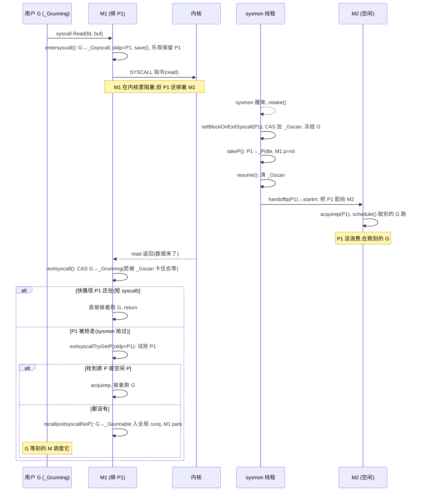

# 第六章 · 系统调用阻塞:handoff P

> 篇:第 1 篇 · GMP 调度器(全书地基,重头戏)
> 主线呼应:上一章我们拆透了异步抢占——sysmon 发现一个 G 霸占 P 超过 10ms,就给那条线程投一个 `SIGURG`,在几乎任意安全点把它塞回 runq。但上一章末尾留了一个洞:`preemptone` 里有一行 `if readgstatus(gp)&^_Gscan == _Gsyscall { return false }`——**G 在系统调用里时,信号抢占对它无效**。理由很简单,G 此刻根本不在 Go 代码里,它躺在内核态等 `read`、`write`、`futex`、`epoll_wait` 返回,`SIGURG` 打断它没意义(它没法响应协作式检查,异步抢占的 `isAsyncSafePoint` 也不允许在 syscall 上下文注入)。可一个阻塞的系统调用可能耗时几十毫秒甚至几秒,这条 M 就这么被一个 G 卡死吗?GMP 模型不能容忍"一个阻塞系统调用卡住整个 P"。这一章就拆 Go 的解法——**handoff P**:G 进系统调用时,把 P 让出来(`entersyscall` 标记可被抢),让别的 M 接管这个 P 去跑别的 G(`handoffp` 转交);系统调用返回时,这个 G 再尝试把 P 抢回来(`exitsyscall` 优先复用原 P,抢不到就入全局 runq 自己 park)。我们拆透三件事:**为什么进系统调用只"标记"不"立即交 P"、为什么 sysmon 是 P 被让出的真正触发者、为什么 exitsyscall 优先抢回原 P 是抖动最小的设计**。

## 核心问题

**G 阻塞在一个系统调用(读文件、`futex`、`semwait`)里时,M 这条线程被内核挂起了。怎么保证 P 不被这一个阻塞 G 卡死、还能继续跑别的就绪 G?syscall 返回后,G 怎么拿到一个 P 重新跑起来,又不和别的 M 抢出抖动?**

读完本章你会明白:

1. 为什么网络 I/O 走 netpoll 而文件 I/O 走 handoff:网络能被 epoll"事件化",文件 I/O(以及 futex、cgo 等)没法事件化,只能"阻塞就交 P"。这两类阻塞用两套机制,正是"阻塞唤醒"和"调度执行"二分法在 syscall 上的具体落点。
2. `entersyscall` 为什么只"标记 G 进 `_Gsyscall`、把 P 标成可被抢"而不是立即把 P 交出去:**乐观假设**——大多数 syscall 极快(几十纳秒到几微秒),让 P 跟着这条 M 留到 syscall 返回,比每次都 handoff + 抢回的抖动小得多。
3. `handoffp` 真正的触发者是 sysmon(`retake` 检测 P 在 syscall 里超过 ~20us 且无空闲 M),它通过 `setBlockOnExitSyscall` 用 `_Gscan` 位"冻结"那个 G 阻止它退出 syscall,再把 P 抽走交给另一条 M。这套 `_Gscan` 协议是"在并发环境里安全夺走 P"的命脉。
4. `exitsyscall` 的三级回退:**快路径**(P 还在自己手里,直接接着跑)→ **中速路径**(P 被抢了,抢一个空闲 P)→ **慢路径**(抢不到 P,G 入全局 runq 自己 park,等调度器)。优先复用原 P 的设计,把"进/出 syscall"的抖动降到最低。

> 逃生阀:这一章真正绕的是 `setBlockOnExitSyscall` 的 `_Gscan` 位协议——sysmon 要在另一条线程上把 P 从一个正在跑的 G 手里夺走,而那个 G 随时可能从 syscall 返回来抢 P,两者之间的竞争全靠 `_Gscan` 这一个原子位来仲裁。如果你读到那里觉得乱,先抓主干:**sysmon 用 `castogscanstatus` 把 G 置成 `_Gsyscall|_Gscan`,G 在 `exitsyscall` 里必须先 `casfrom_Gscanstatus` 把 `_Gscan` 位清掉才能继续,于是 sysmon 拿到 P 期间 G 被卡死在 exitsyscall 里、不能动 P**。其余都是这套协议为什么 sound 的展开。

---

## 6.1 一句话点破

> **handoff P 不是"进 syscall 就交 P",而是"进 syscall 先标记、按需才交":`entersyscall` 乐观地把 P 留给当前 M(赌 syscall 很快),sysmon 在后台看哪个 P 在 syscall 里耗太久,才用 `_Gscan` 位冻结那个 G、把 P 抽走交给另一条 M;syscall 返回时 G 优先抢回原 P,抢不到就退化为入队 park。这个"乐观保留 + 按需让出 + 优先复用"的三段式,把绝大多数 syscall 的开销压到几个原子操作上,只对真正长阻塞的 syscall 才付 handoff 的代价。**

这是结论,不是理由。本章倒过来拆:先看为什么 syscall 的阻塞和 channel/sleep 不一样(为什么不能用 park 那一套),再看 `entersyscall` 的乐观保留为什么这么设计,然后拆 sysmon 怎么把 P 抽走(`setBlockOnExitSyscall` 的 `_Gscan` 协议),最后拆 `exitsyscall` 的三级回退凭什么把抖动降到最低。

---

## 6.2 为什么 syscall 阻塞不能用 park 那一套

第 8 章会详讲 channel,第 18 章会详讲 netpoll,这里先给一句话结论:goroutine 的"阻塞"分两类,它们的处理路径截然不同。

**第一类:runtime 知道何时就绪的阻塞**——channel 等待、`time.Sleep`、`sync.Mutex`、网络读(底层 epoll)。这些阻塞,runtime 都有一个明确的"就绪事件"来源(channel 有人发数据、timer 到点、mutex 释放、epoll 报可读)。所以这类阻塞 G 走 `park` 路径:G 状态置 `_Gwaiting`,从 M 上摘下来,M 立刻去 `schedule` 取下一个 G。G 在内存里"睡觉",就绪事件来了被唤醒(放回 runq)。**M 在这个过程中完全不被占用**——park 是纯用户态操作,`gopark`/`goready` 配对。

**第二类:runtime 不知道何时就绪的阻塞**——文件 `Read`/`Write`(Linux 上没有通用的 epoll on regular file)、`futex`、`semwait`、`clone`、cgo 调用(可能阻塞在 C 代码里)、`getrandom` 等。这些 syscall 一旦进内核,M 这条线程就被内核挂起(scheduler 把它移出运行队列),**runtime 完全插不进去**——它没法像 park 那样"把 G 从 M 摘下来",因为 G 此刻的执行权在内核手里(寄存器上下文被内核接管)。这类阻塞走的就是本章主题:**handoff P**。

> **不这样会怎样**:假设 syscall 阻塞也走 park。park 要做"改 G 状态、保存上下文、把 G 从 M 摘下来"——可 G 此刻根本不在 Go 代码里,它在内核态,`gopark` 这套用户态机制够不到它。强行 park 等于"在用户态假装 G 不跑了",而内核还在为这条 M 调度上下文、还会把它唤醒——状态机彻底错乱。所以 syscall 阻塞只能用另一套:**让 M 跟着 G 一起阻塞在内核,但把 P 让出来**。

注意一个边界:**网络 I/O 不走 handoff,走 netpoll**。原因见第 18 章:Linux epoll 能把 socket 变成"事件源",runtime 在 G 读 socket 阻塞时,把它 park 起来、M 继续干别的活,数据就绪由 epoll 唤醒。但 epoll 对普通文件无效(Linux 没有 `eventfd` for regular file 的等价物),所以 `os.Open(...).Read` 这种文件读,只能走原始的阻塞 `read` syscall——它没有"事件源",只能 handoff P。

```
  goroutine 阻塞的分类(决定走哪条路):

  ┌───────────────────────────────────────────────────────────────┐
  │              G 想阻塞                                          │
  └───────────────────────────────┬───────────────────────────────┘
                                  │
              ┌───────────────────┴───────────────────┐
              ▼                                       ▼
   runtime 知道何时就绪?                      不知道(在内核里)
   (channel/sleep/mutex/网络)               (文件 I/O / futex / cgo)
              │                                       │
              ▼                                       ▼
        gopark:G→_Gwaiting                     entersyscall:G→_Gsyscall
        G 从 M 摘下来,M 立刻 schedule         M 跟着 G 进内核阻塞,
        就绪事件唤醒(park→runq)             但 P 可被 sysmon 抽走(handoff)
        M 全程不被占用                         M 阻塞但 P 不浪费
```

> **钉死这件事**:park 和 handoff 是两套机制,服务的都是"阻塞不浪费线程/处理器",但分界线是"runtime 能不能插手"。能插手(channel/timer/网络)就 park,G 离开 M;不能插手(文件/futex/cgo)就 handoff,P 离开 M。本章剩下的篇幅,全在讲 handoff 这条路。

---

## 6.3 entersyscall:进 syscall 的"乐观保留"

我们顺着一次文件读的源码往下走。你写 `buf, err := os.Open("a.txt").Read(...)`,底层最终调到 [`syscall.Read`](../go/src/syscall/syscall_linux.go#L73),它是这个样子(简化):

```go
// src/syscall/syscall_linux.go#L70-L90(节选)
//go:nosplit
func Syscall(trap, a1, a2, a3 uintptr) (r1, r2 uintptr, err Errno) {
    runtime_entersyscall()        // ★ 进入 syscall 前的 runtime 钩子
    r1, r2, err = RawSyscall6(trap, a1, a2, a3, 0, 0, 0)
    runtime_exitsyscall()        // ★ syscall 返回后的 runtime 钩子
    return
}
```

`runtime_entersyscall` 通过 `//go:linkname` 绑定到 runtime 的 [`entersyscall`](../go/src/runtime/proc.go#L4776)。`RawSyscall6` 是纯汇编(就是把参数塞寄存器 + `SYSCALL` 指令 + 取返回值,见 [`src/syscall/asm_unix_amd64.s#L38-L59`](../go/src/syscall/asm_unix_amd64.s#L38))。所以进 syscall 的"runtime 介入"全部发生在 `entersyscall` 这一个函数里(以及它调用的 `reentersyscall`)。

注意一个常被搞错的源码事实:**`entersyscall`/`exitsyscall` 本身不是汇编,是 Go 函数**(带 `//go:nosplit`)。真正涉及汇编的是它外层的 `syscall.Syscall6` 包装(汇编)和它内部调用的 `systemstack`/`mcall`。很多人一提 syscall handoff 就以为有段汇编叫 `entersyscall`,其实没有——Linux 上 syscall 的汇编就是 `syscall/asm_linux_amd64.s` 里那几行 `SYSCALL` 指令(更早的 `runtime·entersyscall(SB)` 调用),内核进入/退出全靠硬件,Go 这边只是 Go 函数在 syscall 前后做记录。

### 6.3.1 entersyscall 的核心动作

[`entersyscall`](../go/src/runtime/proc.go#L4776) 只是个壳,它取了 caller 的 PC/SP/BP,转给 [`reentersyscall`](../go/src/runtime/proc.go#L4642) 干活:

```go
// src/runtime/proc.go#L4774-L4783
//go:nosplit
//go:linkname entersyscall
func entersyscall() {
    fp := getcallerfp()
    reentersyscall(sys.GetCallerPC(), sys.GetCallerSP(), fp)
}
```

为什么要单独拆出 `reentersyscall` 接收 PC/SP/BP 参数?注释解释了:`getcallerfp()` 如果直接当参数传,会强制其它参数 spill 到栈,导致 nosplit 栈检查在某些平台上爆掉。所以先取到局部变量,再传。这是个 nosplit 栈约束催生的工程细节——`entersyscall` 走的是 nosplit 路径(因为后面会 `throwsplit = true`,栈不能扩),任何一点多余的栈消耗都要避开。

[`reentersyscall`](../go/src/runtime/proc.go#L4642) 才是真正的"进 syscall 协议"。我们逐段拆它的几个关键动作:

```go
// src/runtime/proc.go#L4642-L4755(节选,行号以本地为准)
func reentersyscall(pc, sp, bp uintptr) {
    gp := getg()

    // Disable preemption because during this function g is in Gsyscall status,
    // but can have inconsistent g->sched, do not let GC observe it.
    gp.m.locks++

    // ... (擦除 secret signal stack,与本章无关,略)

    // Entersyscall must not call any function that might split/grow the stack.
    gp.stackguard0 = stackPreempt
    gp.throwsplit = true

    // Copy the syscalltick over so we can identify if the P got stolen later.
    gp.m.syscalltick = gp.m.p.ptr().syscalltick

    pp := gp.m.p.ptr()
    if pp.runSafePointFn != 0 {
        systemstack(runSafePointFn)
    }
    gp.m.oldp.set(pp)            // ★ 记住"我原来的 P 是谁"

    // Leave SP around for GC and traceback.
    save(pc, sp, bp)
    gp.syscallsp = sp
    gp.syscallpc = pc
    gp.syscallbp = bp

    // ... (trace 事件)

    // As soon as we switch to _Gsyscall, we are in danger of losing our P.
    if gp.bubble != nil || !gp.atomicstatus.CompareAndSwap(_Grunning, _Gsyscall) {
        casgstatus(gp, _Grunning, _Gsyscall)
    }

    // ... (gcwaiting / sysmonwait 处理)
    gp.m.locks--
}
```

四个关键点,每个都对应一个"不这样会怎样":

**第一,`gp.m.locks++`**。这是个"我没在跑 Go 代码,GC 别扫我"的标志。`reentersyscall` 把 G 从 `_Grunning` 切到 `_Gsyscall` 的中间,`gp.sched` 是不一致的(才刚 `save` 完,但状态机还没切完),如果此时 GC 来扫栈(扫栈要读 `gp.sched`),会读到中间态。`m.locks > 0` 期间 GC 的 STW 会等(`gcWaitOnSema` 看 `m.locks`),保证这段窗口里 G 不会被 GC 干扰。函数末尾 `gp.m.locks--` 解除。

> **不这样会怎样**:如果中间窗口里 GC 扫栈,`gp.sched` 可能还是旧值,traceback 把 syscall 返回地址当成普通 Go 返回地址处理——栈回溯到错地方。`m.locks` 这把"临时禁 GC"的锁,是 syscall 路径上**避免 GC 观察中间态**的标准武器。

**第二,`gp.stackguard0 = stackPreempt` + `gp.throwsplit = true`**。这两个标志钉死一件事:**这个 G 接下来不能扩栈**。`stackguard0 = stackPreempt`(那个 `0xfffffffffffffade` 魔法值)让任何函数前奏的栈检查都跳 `morestack`,但 syscall 路径上没有函数前奏(它马上要进汇编的 `SYSCALL`);真正起作用的是 `throwsplit = true`——它告诉 `newstack`:"如果真触发栈检查,直接 throw,不许扩"。为什么不能扩?因为 syscall 的参数里可能有 `uintptr` 实际是指针(见 [`syscall_linux.go` 顶部的 `//go:nosplit` 注释](../go/src/syscall/syscall_linux.go#L40-L44)),栈拷贝时 runtime 不知道哪些 uintptr 是指针,调整它们的值会破坏调用。所以一旦进了 syscall 上下文,栈被钉死成只读。

**第三,`gp.m.oldp.set(pp)`**。这一行是 `exitsyscall` 能"优先抢回原 P"的伏笔。`oldp` 记的是"我进 syscall 之前绑的 P"。退出 syscall 时,`exitsyscall` 会优先尝试把这个 `oldp` 抢回来(见 6.5)。

**第四,`save(pc, sp, bp)` + `gp.syscallsp = sp`**。`save` 把 caller 的 PC/SP/BP 存进 `gp.sched`(供 `gogo` 恢复用)。但 syscall 上下文不能用 `gp.sched`(它随时被 systemstack 等调用 clobber),所以又单独存一份到 `gp.syscallsp`/`gp.syscallpc`/`gp.syscallbp`——这两份是给 **GC 和 traceback 用的**。注释明说:"Leave SP around for GC and traceback"。`runtime2.go` 里 [`syscallsp`](../go/src/runtime/runtime2.go#L487) 的注释也写:"if status==Gsyscall, syscallsp = sched.sp to use during gc"。GC 扫栈扫到 `_Gsyscall` 的 G,用 `syscallsp` 而不是 `sched.sp` 来定位栈顶——因为 `sched.sp` 在 systemstack 调用过程中可能被改。

**第五,CAS 切到 `_Gsyscall`**。`gp.atomicstatus.CompareAndSwap(_Grunning, _Gsyscall)`——只有这一步成功,这个 G 才真正"进了 syscall 上下文"。`_Gsyscall` 这个状态是 P 可被抢的信号:sysmon 和 `handoffp` 都看这个状态。CAS 失败(罕见,`bubble` 字段非 nil 时)走 `casgstatus` 兜底。

### 6.3.2 关键:`entersyscall` 不交 P

注意上面整段 `reentersyscall`,**没有任何把 P 从 M 上摘下来的代码**。`releasep`/`handoffp` 一个都没调。G 进了 `_Gsyscall`,但 P 还绑在这条 M 上(`gp.m.p` 还指向 pp)。

这就是本章最反直觉的一点,也是最关键的设计:

> **所以这样设计**:进 syscall 时**不立即交 P**,是"乐观假设大多数 syscall 极快"。实测一次 `getpid`、一次 cache-hit 的 `read`、一次 `clock_gettime`,都在几百纳秒到几微秒。如果进 syscall 就 handoff P,那么 syscall 返回时这条 M 手里没 P,得去抢一个 P 才能继续跑这个 G——抢 P、重新 wire、刷 mcache,这一套开销可能比 syscall 本身还大。Go 选择了"先留着,看情况再说":P 跟着 M 一起进 syscall,**如果 syscall 很快返回,P 自然还在手里,exitsyscall 直接接着跑,零 handoff 开销**。

但这就带来一个新问题:**如果这个 syscall 真的阻塞很久(读一个大文件、等一个 futex),P 岂不是一直陪绑在这条被挂起的 M 上,别的 M 干瞪眼用不上这个 P?** 这就是 sysmon 的工作——下一节拆。

### 6.3.3 entersyscallblock:已知会阻塞的快捷路径

还有一条姊妹路径 [`entersyscallblock`](../go/src/runtime/proc.go#L4830),用于**已知会长时间阻塞**的 syscall(比如 runtime 自己调的某些阻塞操作、cgo 调用前的准备)。它的关键不同是:**进 syscall 之前就主动把 P 交出去**:

```go
// src/runtime/proc.go#L4830-L4870(节选)
//go:nosplit
func entersyscallblock() {
    gp := getg()
    gp.m.locks++
    gp.throwsplit = true
    gp.stackguard0 = stackPreempt
    gp.m.syscalltick = gp.m.p.ptr().syscalltick
    gp.m.p.ptr().syscalltick++

    addGSyscallNoP(gp.m) // We're going to give up our P.

    pc := sys.GetCallerPC()
    sp := sys.GetCallerSP()
    bp := getcallerfp()
    save(pc, sp, bp)
    gp.syscallsp = gp.sched.sp
    // ...

    // Once we switch to _Gsyscall, we can't safely touch our P anymore,
    // so we need to hand it off beforehand.
    systemstack(func() {
        if trace.ok() {
            trace.GoSysCall()
        }
        handoffp(releasep())    // ★ 主动 release P 并 handoff
    })
    // ...
    casgstatus(gp, _Grunning, _Gsyscall)
    // ...
}
```

对比 `entersyscall`:它是**悲观**的——既然知道这个 syscall 一定慢(比如 runtime 主动 yield、cgo 进入),那就直接 `releasep` + `handoffp`,不赌"它很快"。这条路径开销大(必然 handoff),但用于已知会慢的场景,值。

> **钉死这件事**:`entersyscall`(乐观)和 `entersyscallblock`(悲观)是同一个问题的两种策略,分界线是"调用者是否知道这个 syscall 会阻塞"。`syscall.Syscall` 不知道(`read` 可能 cache hit 也可能阻塞),所以走乐观;runtime 内部的某些已知阻塞操作,走悲观。日常 Go 代码里 99% 的 syscall 走乐观路径,本章重点也在这条。

---

## 6.4 sysmon:把 P 从阻塞 syscall 里抽出来

`entersyscall` 乐观地把 P 留给阻塞中的 M。如果这个 syscall 真的慢,谁负责把 P 抽走?答案是 **sysmon**——第 7 章会详讲这个"独立观察者",本章只取和 handoff 相关的部分。

sysmon 每 ~10~20us 醒来一次(它会自适应睡眠周期,长空闲时拉长到几百微秒),扫一遍所有 P,在 [`retake`](../go/src/runtime/proc.go#L6681) 里干两件事:**抢超时运行的 G**(上一章讲的 `preemptone`)和**抢卡在 syscall 太久的 P**(本章主题)。我们看 syscall 这条路:

```go
// src/runtime/proc.go#L6681-L6776(节选)
func retake(now int64) uint32 {
    n := 0
    lock(&allpLock)
    for i := 0; i < len(allp); i++ {
        pp := allp[i]
        if pp == nil || atomic.Load(&pp.status) != _Prunning {
            continue
        }
        pd := &pp.sysmontick
        sysretake := false

        // 1. 看运行时长:同一 schedtick 跑超过 10ms → preemptone(上一章)
        schedt := int64(pp.schedtick)
        if int64(pd.schedtick) != schedt {
            pd.schedtick = uint32(schedt)
            pd.schedwhen = now
        } else if pd.schedwhen+forcePreemptNS <= now {
            preemptone(pp)
            // If pp is in a syscall, preemptone doesn't work.
            sysretake = true
        }

        unlock(&allpLock)
        incidlelocked(-1)

        // 2. ★ 用 _Gscan 位冻结这个 P 上的 G,阻止它退出 syscall
        thread, ok := setBlockOnExitSyscall(pp)
        if !ok {
            goto done
        }

        // 3. 看 syscall 时长:同一 syscalltick 没超过 ~20us → 放过,resume
        if syst := int64(pp.syscalltick); !sysretake && int64(pd.syscalltick) != syst {
            pd.syscalltick = uint32(syst)
            pd.syscallwhen = now
            thread.resume()
            goto done
        }

        // 4. 没 work + 有 spinning/idle M + syscall 还没超过 10ms → 放过
        if runqempty(pp) && sched.nmspinning.Load()+sched.npidle.Load() > 0 &&
            pd.syscallwhen+10*1000*1000 > now {
            thread.resume()
            goto done
        }

        // 5. 真的要抢:takeP 把 P 摘出来,resume 让 G 继续(它会卡在 exitsyscall)
        thread.takeP()
        thread.resume()
        n++

        // 6. 把 P 交给别的 M 去跑
        handoffp(pp)

    done:
        incidlelocked(1)
        lock(&allpLock)
    }
    unlock(&allpLock)
    return uint32(n)
}
```

六个判定,逐个看它们的"为什么"。先理解一个核心事实:**`preemptone` 对 syscall 里的 G 是无效的**(5.4.2 里 `preemptone` 那行 `if readgstatus(gp)&^_Gscan == _Gsyscall { return false }` 直接返回)。所以"超时运行 + 实际在 syscall"的 G,sysmon 必须自己下场抢 P。`sysretake = true` 这个标志就是"这个超时不是用户代码跑太久,而是卡 syscall 了"的信号。

### 6.4.1 判定一:这个 P 真的在 syscall 吗(`setBlockOnExitSyscall`)

[`setBlockOnExitSyscall`](../go/src/runtime/proc.go#L6801) 是本章最精妙的一步——它要在另一条线程(sysmon)上,**从一个正在跑 syscall 的 G 手里安全地把 P 夺走**。难点在于:那个 G 随时可能从 syscall 返回(它在内核里被唤醒了),返回后会进 `exitsyscall` 抢 P。sysmon 和那个 G 之间,要有一个原子协议决定"P 到底归谁"。

Go 的协议是 `_Gscan` 位:

```go
// src/runtime/proc.go#L6801-L6845(节选)
func setBlockOnExitSyscall(pp *p) (syscallingThread, bool) {
    if pp.status != _Prunning {
        return syscallingThread{}, false
    }
    // Be very careful here, these reads are intentionally racy.
    mp := pp.m.ptr()
    if mp == nil {
        return syscallingThread{}, false
    }
    gp := mp.curg
    if gp == nil {
        return syscallingThread{}, false
    }
    status := readgstatus(gp) &^ _Gscan

    if status != _Gsyscall && status != _Gdeadextra {
        // Not in a syscall, nothing to do.
        return syscallingThread{}, false
    }
    // ★ 用 CAS 把 _Gscan 位加上去
    if !castogscanstatus(gp, status, status|_Gscan) {
        // Not in _Gsyscall or _Gdeadextra anymore. Nothing to do.
        return syscallingThread{}, false
    }
    // ★ 再次确认还是同一个 M、同一个 P(避免 ABA:G 已切换了 syscall)
    if gp.m != mp || gp.m.p.ptr() != pp {
        casfrom_Gscanstatus(gp, status|_Gscan, status)
        return syscallingThread{}, false
    }
    return syscallingThread{gp, mp, pp, status}, true
}
```

协议三步:

1. **读状态,确认是 `_Gsyscall`**:`readgstatus(gp) &^ _Gscan` 屏蔽 `_Gscan` 位,看 G 是不是在 syscall。`_Gdeadextra` 是 extra M 的特殊态(那种"在 Go 和 C 之间反复切换"的线程),本章不展开。
2. **CAS 加 `_Gscan` 位**:`castogscanstatus(gp, _Gsyscall, _Gsyscall|_Gscan)`。这是个原子操作:只有 G 还在 `_Gsyscall` 才能成功。一旦成功,**这个 G 被锁死在 `_Gsyscall` 状态**——任何想把它改出 `_Gsyscall` 的操作(尤其 `exitsyscall` 的 CAS),都必须先清 `_Gscan` 位(走 `casfrom_Gscanstatus`),而那个清位操作会失败/等待,直到 sysmon 主动 `resume`。

   这就是协议的核心:**`_Gscan` 位是个"GC/外部观察者持有的锁"**。G 在 `_Gsyscall|_Gscan` 状态下,既不能被 GC 扫栈扫到一半的状态变化(因为 `_Gscan` 表示"有人在扫我,状态冻结"),也不能自己跑出 syscall(`exitsyscall` 的 CAS 失败)。
3. **二次确认 M/P 没变**:`gp.m != mp || gp.m.p.ptr() != pp`。为什么?因为步骤 1 和步骤 2 之间,G 可能已经从 syscall 返回、又进了一个新 syscall(在不同 M/P 上)。注释明说:"This is not what we originally observed. Nothing to do."。二次确认堵掉这种 ABA。

返回的 `syscallingThread` 持有这个 G 的"冻结态",sysmon 接下来可以安全地从它身上拿走 P。

### 6.4.2 `_Gscan` 协议为什么 sound

这套 `_Gscan` 协议是 Go runtime 里"在并发环境下安全观察/修改 G 状态"的通用武器,在 GC 扫栈、异步抢占、syscall handoff 里都出现。它 sound 的命脉在两点:

**第一,所有改 G 状态的代码,改完都用 `casgstatus` 或 `casfrom_Gscanstatus`,而这些都是 CAS**。CAS 保证"我读到旧值→改成新值"是原子的,如果中间有人加了 `_Gscan` 位,CAS 失败,改状态的人要么重试(等 `_Gscan` 清掉)要么走特殊路径。所以"`_Gscan` 位被加上 = 别人持有这个 G 的状态观察权"这个不变式,是靠所有改状态代码都走 CAS 来保证的。

**第二,`exitsyscall` 的状态切换会卡在 `_Gscan`**。看 `exitsyscall` 的开头:

```go
// src/runtime/proc.go#L4952-L4954
if gp.bubble != nil || !gp.atomicstatus.CompareAndSwap(_Gsyscall, _Grunning) {
    casgstatus(gp, _Gsyscall, _Grunning)
}
```

它要把 G 从 `_Gsyscall` CAS 到 `_Grunning`。如果 sysmon 已经把状态置成 `_Gsyscall|_Gscan`,这个 CAS(预期值 `_Gsyscall`)就失败,走 `casgstatus`。`casgstatus` 内部([`proc.go#L1290`](../go/src/runtime/proc.go#L1290))在遇到带 `_Gscan` 的状态时会循环等待(实际是 `casG_status` 的 `for` 循环 + `osyield`),直到 `_Gscan` 被清。于是这个 G 就**卡在 exitsyscall 的状态切换里**,没法继续往后跑(没法动 P)。

> **反面对比**:假设没有 `_Gscan` 协议,sysmon 直接读 `gp.m.p`,然后改成 nil。这中间 G 可能正好 exitsyscall 把 P 抢回去,`gp.m.p` 又被设回 pp——sysmon 拿到一个 stale 指针,两个 M 同时以为自己是 P 的 owner,状态机彻底乱。`_Gscan` 位把"sysmon 持有 P 期间"和"G 能动 P 期间"用一个原子位隔开,这是 handoff 能 sound 的地基。

### 6.4.3 判定二、三:syscall 时长 + 全局工作情况

回到 `retake`,sysmon 通过 `setBlockOnExitSyscall` 拿到 `syscallingThread` 后,还要决定"到底抢不抢 P"。三个分支:

**分支 A(`!sysretake && syscalltick 变了`)**:这个 P 的 `syscalltick` 自上次扫描以来变了——意味着 G 进了一个**新** syscall(每次 `entersyscallblock` 里 `gp.m.p.ptr().syscalltick++`,以及 exitsyscall 里 `pp.syscalltick++`)。新 syscall 刚开始,先观察一下,`thread.resume()`(解除 `_Gscan` 位,G 可以继续 exitsyscall),不抢。

**分支 B(`runqempty && 有 spinning/idle M && syscall 不超 10ms`)**:这个 P 的本地 runq 空了、全局也有 spinning 或 idle M 在待命、syscall 也没阻塞太久。即使抢了 P 也没活干,先放过。

**分支 C(默认)**:这个 P 有活干(本地 runq 非空,或全局没空闲 M 能接手),且 syscall 看起来要阻塞一阵——**抢**。`thread.takeP()` 把 P 从这个 G/M 上摘下来(置 `_Pidle`,`addGSyscallNoP` 计数,`pp.syscalltick++`),`thread.resume()` 解冻 G(G 可以继续 exitsyscall,但它会发现自己没 P 了),然后 `handoffp(pp)` 把 P 交给别的 M。

注意分支 C 的判定不是"syscall 阻塞了 X ms"——而是"有 work 要干 + 没别的 M 闲着能干"。这是 handoff 的核心动机:**不是为了卡死而抢,是为了不浪费 P 而抢**。如果全系统都没事干,让 P 跟着阻塞的 M 一起 sleep 也无所谓(省得频繁 handoff 抖动);如果有 work 抢着要 P,这个 P 卡在阻塞 M 上就是浪费,必须抢出来。

> **钉死这件事**:sysmon 抢 P 的判定不是纯时间阈值,而是"有没有 work 急着用 P"。这个设计把 handoff 的代价(必然 handoff + 唤醒新 M)只付在"真的有 work 要干"的场景,空闲时不白白 handoff。

### 6.4.4 handoffp:把 P 转交给别的 M

[`handoffp`](../go/src/runtime/proc.go#L3146) 拿到一个已经 `_Pidle` 的 P,决定怎么处置它——给它配一条 M 跑起来,还是让它继续 idle:

```go
// src/runtime/proc.go#L3146-L3212(节选)
//go:nowritebarrierrec
func handoffp(pp *p) {
    // handoffp must start an M in any situation where
    // findRunnable would return a G to run on pp.

    // if it has local work, start it straight away
    if !runqempty(pp) || !sched.runq.empty() {
        startm(pp, false, false)
        return
    }
    // if there's trace work to do, start it straight away
    if (traceEnabled() || traceShuttingDown()) && traceReaderAvailable() != nil {
        startm(pp, false, false)
        return
    }
    // if it has GC work, start it straight away
    if gcBlackenEnabled != 0 && gcShouldScheduleWorker(pp) {
        startm(pp, false, false)
        return
    }
    // no local work, check that there are no spinning/idle M's,
    // otherwise our help is not required
    if sched.nmspinning.Load()+sched.npidle.Load() == 0 &&
        sched.nmspinning.CompareAndSwap(0, 1) {
        sched.needspinning.Store(0)
        startm(pp, true, false)   // spinning M
        return
    }
    lock(&sched.lock)
    if sched.gcwaiting.Load() {
        // GC 正在 STW,P 进 _Pgcstop
        pp.status = _Pgcstop
        // ...
        return
    }
    // ...
    // 真的没活干,P 进 idle 池
    pidleput(pp, 0)
    unlock(&sched.lock)
    // ...
}
```

`handoffp` 的逻辑很直白:**只要这个 P 有任何活可干(本地 runq、全局 runq、trace、GC worker、或系统缺 spinning M),就 `startm` 给它配一条 M 跑起来;否则把它丢回 idle 池(`pidleput`)**。

`startm(pp, spinning, false)` 的 `spinning` 参数是个微妙设计:如果传 `true`,新起的 M 标记为 "spinning"——意思是"我主动出来找活干,即使现在 runq 是空的"。spinning M 会去 `findRunnable` 里偷别的 P 的 work(work-stealing,第 4 章),还会尝试 netpoll。这是个"提前预热 M"的优化:有 work 来时不用再花时间起 M。

注意 `handoffp` 的注释:"handoffp must start an M in any situation where findRunnable would return a G to run on pp"——它要和 `findRunnable` 的判定保持一致:`findRunnable` 在哪些情况下会返回 G,`handoffp` 就要在同样情况下起 M。否则 P 配了 M 却找不到 G,M 立刻又 park,白起一趟。这个一致性是 handoff 不浪费 M 的关键。

---

## 6.5 exitsyscall:出 syscall 的"优先复用原 P"

syscall 返回了,G 要重新跑起来。它走 [`exitsyscall`](../go/src/runtime/proc.go#L4922)。这是本章第二个主角,设计同样反直觉:**优先复用原 P,而不是公平地争抢**。

```go
// src/runtime/proc.go#L4922-L5064(节选,行号以本地为准)
//go:nosplit
//go:nowritebarrierrec
//go:linkname exitsyscall
func exitsyscall() {
    gp := getg()

    gp.m.locks++ // see comment in entersyscall
    if sys.GetCallerSP() > gp.syscallsp {
        throw("exitsyscall: syscall frame is no longer valid")
    }
    gp.waitsince = 0

    // ... (freezeStopWait 处理)

    // Optimistically assume we're going to keep running, and switch to running.
    if gp.bubble != nil || !gp.atomicstatus.CompareAndSwap(_Gsyscall, _Grunning) {
        casgstatus(gp, _Gsyscall, _Grunning)
    }

    // Grab and clear our old P.
    oldp := gp.m.oldp.ptr()
    gp.m.oldp.set(nil)

    // Check if we still have a P, and if not, try to acquire an idle P.
    pp := gp.m.p.ptr()
    if pp != nil {
        // ★ 快路径:P 还在自己手里,直接接着跑
        // ... trace 事件 ...
    } else {
        // ★ 中速路径:P 被抢了,试试抢一个空闲 P
        systemstack(func() {
            if pp := exitsyscallTryGetP(oldp); pp != nil {
                acquirepNoTrace(pp)
                // ... trace ...
            }
        })
        pp = gp.m.p.ptr()
    }

    // If we have a P, clean up and exit.
    if pp != nil {
        // ... profile / syscalltick++ / syscallsp=0 / 恢复 stackguard0 ...
        gp.m.locks--
        return
    }
    // ★ 慢路径:抢不到 P,G 入全局 runq 自己 park
    gp.m.locks--
    mcall(exitsyscallNoP)
    // ... 调度回来后清理 ...
}
```

三级回退,每一级对应一种"P 归属"的情况:

### 6.5.1 快路径:P 还在自己手里(零成本)

最常见的情况:`entersyscall` 之后 syscall 很快返回,sysmon 还没来得及抢 P。这时 `gp.m.p.ptr()` 还指向原来的 P(那条 M 的 `m.p` 字段没被改)。`exitsyscall` 做的事极其少:

- CAS 把 G 从 `_Gsyscall` 切到 `_Grunning`。
- 检查 `gp.m.p`,非 nil。
- `pp.syscalltick++`、`gp.syscallsp = 0`、恢复 `gp.stackguard0`(根据 `gp.preempt` 决定要不要继续投毒)、`gp.throwsplit = false`。
- `gp.m.locks--`,直接 `return`,继续跑 syscall 后面的 Go 代码。

**零 handoff、零 wire、零 mcache flush**。这就是 `entersyscall` 乐观保留 P 的回报——绝大多数 syscall 走这条路,开销就两次 CAS 加几次字段写,几百纳秒级。

注意 `exitsyscall` 开头的 CAS `gp.atomicstatus.CompareAndSwap(_Gsyscall, _Grunning)` 是这里的命脉。如果 sysmon 在我们 syscall 期间抢过 P(虽然快路径下没抢走,但可能加过 `_Gscan`),这个 CAS 会失败,走 `casgstatus` 兜底——`casgstatus` 内部会等 `_Gscan` 清掉(`thread.resume()` 之后)。所以"快路径"的"P 还在手里"前提,隐含了"sysmon 没有正在 `_Gscan` 我"。

### 6.5.2 中速路径:P 被抢了,抢一个空闲 P

如果 sysmon 把原 P 抢走了(`gp.m.p == nil`),G 不能就这么裸跑——它需要 P 才能分配内存、跑 GC、调 mcache。`exitsyscallTryGetP(oldp)` 尝试抢一个 P:

```go
// src/runtime/proc.go#L5072-L5098
//go:systemstack
func exitsyscallTryGetP(oldp *p) *p {
    // Try to steal our old P back.
    if oldp != nil {
        if thread, ok := setBlockOnExitSyscall(oldp); ok {
            thread.takeP()
            decGSyscallNoP(getg().m)
            thread.resume()
            return oldp
        }
    }

    // Try to get an idle P.
    if sched.pidle != 0 {
        lock(&sched.lock)
        pp, _ := pidleget(0)
        if pp != nil && sched.sysmonwait.Load() {
            sched.sysmonwait.Store(false)
            notewakeup(&sched.sysmonnote)
        }
        unlock(&sched.lock)
        if pp != nil {
            decGSyscallNoP(getg().m)
            return pp
        }
    }
    return nil
}
```

两步,优先级很讲究:

**第一步,抢回原 P**。`oldp` 是 `entersyscall` 存的"我原来的 P"。`setBlockOnExitSyscall(oldp)` 这里复用 6.4.1 那个 `_Gscan` 协议——如果 `oldp` 现在还绑着某个在 syscall 的 G(可能是另一个 G,也可能就是 sysmon 抢走后转交给的新 M 上的 G),`setBlockOnExitSyscall` 冻结它、`thread.takeP()` 把 P 抢过来。注意这里有个细节:`takeP` 把 P 置成 `_Pidle`,然后我们的 `exitsyscall` 通过 `acquirepNoTrace(pp)` 把它 wire 到自己身上。**优先抢原 P** 是为了**局部性**——原 P 的 mcache 还热着(缓存的 mspan 还在),抢回来接着用,不用刷 mcache(刷 mcache 是 `prepareForSweep` 干的,有开销)。

**第二步,抢一个空闲 P**。原 P 抢不到(比如已经被别的 M wire 跑起来了),从全局 idle 池 `sched.pidle` 里 `pidleget` 取一个。

> **所以这样设计**:优先级"原 P → 空闲 P → 没了"是抖动最小的设计。原 P 抢得到,mcache 热、调度抖动最小;原 P 抢不到,空闲 P 也行,代价是 mcache flush 一次;都没有,走慢路径 park。这个三级回退把"退出 syscall"的延迟分布在 best case(几百纳秒)到 worst case(一次 park + 重新调度,微秒级)之间,绝大多数走 best case。

### 6.5.3 慢路径:抢不到 P,G 入全局 runq park

连空闲 P 都没有(`sched.pidle == 0`,所有 P 都在跑别的 G),这个 G 没法立刻跑。`mcall(exitsyscallNoP)` 切到 g0 系统栈,把 G 自己 park 起来:

```go
// src/runtime/proc.go#L5106-L5155(节选)
//go:nowritebarrierrec
func exitsyscallNoP(gp *g) {
    traceExitingSyscall()
    trace := traceAcquire()
    casgstatus(gp, _Grunning, _Grunnable)
    // ... trace ...
    decGSyscallNoP(getg().m)
    dropg()
    lock(&sched.lock)
    var pp *p
    if schedEnabled(gp) {
        pp, _ = pidleget(0)   // 再试一次,锁内
    }
    if pp == nil {
        globrunqput(gp)       // 入全局 runq
        // ...
    }
    unlock(&sched.lock)
    if pp != nil {
        acquirep(pp)
        execute(gp, false)    // 拿到 P 了,立刻跑
    }
    // ...
    stopm()
    schedule()                // 这条 M 没活干,park 这条 M
}
```

这个慢路径把 G 从 `_Grunning` 改成 `_Grunnable`(`dropg` 把它从 M 上摘下来),塞进全局 runq,等别的 M 通过 `findRunnable` 取到它(或这条 M 自己 `stopm` park 后,被 `wakep` 唤醒再来 schedule)。这是真正的"阻塞让出"——G 在内存里等机会,M 该 park 的 park。

注意 `globrunqput` 之后,`wakep` 会在别处被调用(当新 G 入队时),尝试起一条 M 来跑这个 G。所以即使这条 M park 了,G 不会无限等——只要系统里有 P 空出来,就会有 M 接手。

> **钉死这件事**:`exitsyscall` 的三级回退——"原 P 还在 → 抢原 P → 抢空闲 P → park 等"——是个**抖动递增**的设计。它把"syscall 退出后 G 多快能继续跑"和"系统有多忙"耦合:系统闲,P 多,几乎都走快路径;系统忙,P 紧张,慢路径让出 P 给更紧迫的 G,自己 park。这是 GMP 模型"少量 M 驱动海量 G"在 syscall 上的具体兑现。

---

## 6.6 调用链全景:一次阻塞 read 的完整旅程

把前面拆的串起来,看一次会阻塞的文件 `Read` 从调用到返回的完整时序:



这张图把"乐观保留 → sysmon 按需抢 → 退出时抢回"的完整循环画清楚了。三个关键时机:

- **进 syscall**(`entersyscall`):只标记,不交 P。乐观。
- **syscall 阻塞中**(sysmon 介入):用 `_Gscan` 冻结 G,抽走 P,handoff 给别的 M。
- **syscall 返回**(`exitsyscall`):优先抢原 P,抢不到抢空闲 P,都没有 park。

整个 handoff 协议的命脉,就是**"乐观假设 + 按需介入 + 优先复用"**这套组合拳——它把绝大多数 syscall(几纳秒到几微秒的快 syscall)的开销压到几乎为零,只对真正长阻塞的 syscall 付 handoff 代价。

---

## 6.7 技巧精解:两个最硬的技巧

本章最值得单独拎出来拆的是两个技巧:`_Gscan` 位协议和 `exitsyscall` 的优先复用原 P。每个都配反面对比。

### 6.7.1 技巧一:`_Gscan` 位——一个原子位仲裁 P 归属

朴素地想"在另一条线程上把 P 从一个正在跑的 G 手里夺走",可能写成这样:

```
// 朴素思路(不是 Go 的实现)
func retake(pp) {
    if pp.m.curg is in syscall {
        pp.m = nil              // 摘掉 M
        pp.m.curg.m.p = nil     // 摘掉 G 对 P 的引用
        pp.status = _Pidle
        handoffp(pp)
    }
}
```

这条路撞两堵墙:

1. **竞态**:在"读 `pp.m.curg is in syscall`"和"设 `pp.m = nil`"之间,那个 G 可能已经从 syscall 返回、抢了 P、又 wire 给自己。我们读到的 `pp.m.curg` 是 stale 的,改 `pp.m = nil` 把别人的 wire 关系破坏了。
2. **退出竞态**:G 在 `exitsyscall` 里读 `gp.m.p`,决定"P 还在不在"。如果 sysmon 改 `pp.m` 和 G 读 `gp.m.p` 之间没有同步,两边可能同时认为"P 是我的",两条 M 同时跑一个 P,本地 runq 被并发访问,数据结构损坏。

Go 的解法是把"持有 P 的观察权"编码进 G 的状态字的一个位——`_Gscan`:

- **`_Gscan` 位 = "有人正在观察/修改这个 G 的状态,其他状态切换要等"**。
- sysmon 通过 `castogscanstatus(gp, _Gsyscall, _Gsyscall|_Gscan)` 这个 CAS 拿到观察权。CAS 失败说明 G 已不在 `_Gsyscall`(已经退出了),放弃。
- 拿到观察权后,G 被冻结:任何想把它改出 `_Gsyscall` 的 CAS(尤其 `exitsyscall` 里那个)都会失败,因为状态变成了 `_Gsyscall|_Gscan`,不再是预期值 `_Gsyscall`。`exitsyscall` 的兜底 `casgstatus` 内部会循环等 `_Gscan` 清掉。
- sysmon 改完 P(`takeP` 把 `pp.m = nil`、`pp.status = _Pidle`),调 `thread.resume()` = `casfrom_Gscanstatus(gp, _Gsyscall|_Gscan, _Gsyscall)` 清掉 `_Gscan` 位。这时 G 才能继续 `exitsyscall`,它会读到"P 已经被抢走",走抢 P 路径。

这一个原子位同时解决两个问题:**竞态**(CAS 保证"我观察到 syscall 状态"和"我改 P"之间 G 没变)和**退出竞态**(`_Gscan` 期间 G 卡在 exitsyscall 状态切换,不会和 sysmon 同时操作 P)。

> **反面对比**:假设 Go 没用 `_Gscan`,而是给每个 P 加一把 `mutex`。sysmon 抢 P 前 `lock(pp.mutex)`,G 在 exitsyscall 里也 `lock(pp.mutex)`。这能解决竞态,但代价是:**每个 exitsyscall 都要进一次锁**(快路径也逃不掉),而快路径本是几百纳秒的纯 CAS。Go 的 `_Gscan` 协议让快路径(`gp.m.p` 还在、没被 sysmon 动过)只走 CAS,完全无锁;只有真正被 sysmon 抢过的 G 才会在 exitsyscall 里"卡一下"等 `_Gscan` 清。**协议(状态位)替代锁,是 runtime 高频路径的标准优化**。

`_Gscan` 这套机制在第 13/14 章(GC 扫栈)和第 5 章(异步抢占的 `_Gscan` 配合)里都会再出现,它是个**通用的"GC/外部观察者持有 G 状态"协议**。理解了它在 handoff 里的用法,后面遇到它就不会陌生。

### 6.7.2 技巧二:`oldp` + 优先复用——抖动最小化的退出设计

朴素地想"syscall 返回了,G 要跑,给它一个 P 就行",可能写成这样:

```
// 朴素思路(不是 Go 的实现)
func exitsyscall() {
    casgstatus(gp, _Gsyscall, _Grunning)
    if gp.m.p == nil {
        pp := pidleget()         // 从 idle 池随便取一个
        if pp == nil {
            parkSelf()           // 没有空闲 P,park
            return
        }
        acquirep(pp)
    }
    // 接着跑
}
```

这条路能跑,但撞一个墙:**mcache 抖动**。P 的 `mcache` 缓存着最近分配的 mspan(第 10 章详讲),如果每次 syscall 返回都换一个 P,新 P 的 mcache 是冷的(空的或别人的),G 接着 `malloc` 要从 central/heap 重新拿,缓存命中率掉。对于"频繁小 syscall + 频繁小分配"的程序(比如高 QPS 的网络服务里的文件日志、cgo 调用),这个抖动累积起来是可见的性能损失。

Go 的解法是 **`oldp` 字段 + 三级优先级**:

- [`oldp`](../go/src/runtime/runtime2.go#L645):M 上的一个字段,`entersyscall` 时存"我原来的 P",`exitsyscall` 开头清掉。一行字段,记录"血缘"。
- 退出时优先级:**抢回 `oldp`**(`exitsyscallTryGetP` 第一步)→ 抢空闲 P → park。

抢回 `oldp` 的妙处:`oldp` 如果还 idle(sysmon 抢走后没配给别的 M,或配给别的 M 但那条 M 又 park 了),它的 mcache 还是 G 进 syscall 前的状态——热缓存。抢回来接着用,mcache 命中率高。即使 `oldp` 被别的 M 用过(它的 mcache 被换过了),至少 `oldp` 上可能还有 G 进 syscall 前留在本地 runq 里的别的 G(虽然 sysmon 抢 P 时一般会处理,但边界情况下抢回原 P 让本地 G 优先被自己跑,有公平性收益)。

> **反面对比**:假设 `exitsyscall` 不优先 `oldp`,而是 `pidleget` 随便取。一个高频 cgo 调用的程序(cgo 也是走 entersyscall 路径,第 6.3 提过),每次 cgo 返回都换一个 P,mcache 反复刷,QPS 掉 10%~20% 不稀奇。`oldp` 优先把这种情况压住——只要原 P 还闲着,G 就回家,缓存不抖。

注意 `oldp` 不是万灵药:如果 sysmon 把 `oldp` 配给了别的 M 跑 work(很可能,因为 sysmon 抢 P 就是因为有 work 要干),那个 M 正在用 `oldp`,`exitsyscallTryGetP` 第一步 `setBlockOnExitSyscall(oldp)` 会失败(因为 `oldp.status` 已不是 `_Prunning` 或 `curg` 不在 syscall),退化到第二步抢空闲 P。这个降级是预期内的——`oldp` 优先只在"原 P 空闲"时生效,不强行从别的 M 手里抢。

---

## 章末小结

这一章把"系统调用阻塞"这条 handoff P 的完整链路拆透了。回到二分法,这一章服务**调度执行**——它讲清了"一个卡在内核里的 G 怎么不让 P 跟着卡死",这是 GMP"少量 M 驱动海量 G"在 syscall 上的兑现。和第 5 章的异步抢占互补:异步抢占处理"用户代码里不让出的 G",handoff P 处理"内核里阻塞的 G",两者合起来,把"调度执行"里的两类"霸占 P"都堵住了。

### 五个"为什么"清单

1. **为什么 syscall 阻塞不能像 channel/sleep 那样 park?** park 要在用户态把 G 从 M 摘下来,可 syscall 阻塞时 G 的执行权在内核手里,runtime 够不到。所以 syscall 阻塞只能"M 跟着 G 一起阻塞在内核,但把 P 让出来"——这就是 handoff。两类阻塞两套机制,分界线是"runtime 能不能插手"。

2. **`entersyscall` 为什么不立即交 P?** 乐观假设大多数 syscall 极快(纳秒到微秒)。立即交 P 的话,syscall 返回时得抢 P + wire + 刷 mcache,开销可能比 syscall 本身大。先留着,syscall 快返回就零成本,慢了 sysmon 再抢——把 handoff 代价只付在真正长阻塞的 syscall 上。

3. **sysmon 凭什么能在另一条线程上把 P 从阻塞 G 手里夺走?** 靠 `_Gscan` 位协议。sysmon 用 `castogscanstatus(gp, _Gsyscall, _Gsyscall|_Gscan)` 这个 CAS 拿到 G 的"状态观察权",G 被冻结在 `_Gsyscall`(`exitsyscall` 的状态 CAS 会失败、等待)。sysmon 改完 P 再 `resume` 清 `_Gscan`,G 才能继续。一个原子位仲裁 P 归属,替代了锁,快路径完全无锁。

4. **`exitsyscall` 为什么优先复用原 P?** 抖动最小。原 P 的 mcache 是热的(G 进 syscall 前刚用过),抢回来接着分配缓存命中率高;换一个 P 要刷 mcache,高频 syscall 程序会掉 QPS。`oldp` 字段记录"血缘",退出时按"原 P → 空闲 P → park"三级回退,绝大多数快 syscall 走第一级零成本。

5. **网络 I/O 为什么不走 handoff 走 netpoll?** epoll 能把 socket 变成"事件源",runtime 在 G 读 socket 阻塞时把它 park、M 继续干别的、数据就绪由 epoll 唤醒——全程 M 不被占用。但 epoll 对普通文件无效,文件 I/O 只能走原始阻塞 read,没有事件源,只能 handoff P。同样是"阻塞不浪费 P",网络用 park(更轻),文件用 handoff(更重),是因为底层原语不同。

### 想继续深入往哪钻

- **源码文件**:本章主战场 [`../go/src/runtime/proc.go`](../go/src/runtime/proc.go) 的 `entersyscall`@L4776 / `reentersyscall`@L4642 / `entersyscallblock`@L4830 / `exitsyscall`@L4922 / `exitsyscallTryGetP`@L5072 / `exitsyscallNoP`@L5106 / `handoffp`@L3146 / `releasep`@L6375 / `acquirep`@L6310 / `wirep`@L6347 / `setBlockOnExitSyscall`@L6801 / `syscallingThread.takeP`@L6861 / `resume`@L6885 / `save`@L4594;sysmon 触发 [`retake`@L6681](../go/src/runtime/proc.go#L6681) 的 syscall 分支 L6737-L6766;`casgstatus`@L1290 看 `_Gscan` 等待逻辑;`syscall` 包装 [`../go/src/syscall/syscall_linux.go`](../go/src/syscall/syscall_linux.go#L73) 的 `Syscall`@L73 / `Syscall6`@L95,以及 [`../go/src/syscall/asm_unix_amd64.s`](../go/src/syscall/asm_unix_amd64.s#L38) 的 `Syscall6` 汇编 L38-L59(`entersyscall`/`SYSCALL`/`exitsyscall` 三明治);G/M 字段 [`../go/src/runtime/runtime2.go`](../go/src/runtime/runtime2.go) 的 `oldp`@L645 / `syscallsp`@L487 / `throwsplit`@L523 / `syscalltick`@L691(L779 是 P 的)。把 `entersyscall → setBlockOnExitSyscall → handoffp → exitsyscall → exitsyscallTryGetP` 串起来读一遍,handoff 全链路就通了。
- **观测 handoff**:`GODEBUG=schedtrace=1000,scheddetail=1` 能看到每个 P 的 `status`(_Prunning / _Pidle / _Psyscall)和 `syscalltick`。写个 demo:一个 goroutine 阻塞 `os.Open(bigfile).Read`(走 handoff),另一个 goroutine 死循环(走抢占),用 `go tool trace` 看 "ProcStart/ProcStop" 和 "GoSysCall/GoSysExit" 事件,能清楚看到文件 I/O 期间 P 被交出去、又被抢回来。
- **触发 handoff 的边界**:写个 `GOMAXPROCS=1` 的程序,主 goroutine 阻塞在一个长 `read`(管道读,没数据),另一个 goroutine 跑 `for { x++ }`。观察:阻塞 read 会让 P 被 sysmon 抢走,handoff 给另一条 M 跑那个 `for` 循环——这就是 handoff 在单 P 下也不让 P 闲着的证明。
- **cgo 与 handoff**:cgo 调用(C 函数可能阻塞)也走 entersyscall 路径(`cgocall` 里调),所以 cgo 阻塞同样会 handoff P。读 [`../go/src/runtime/cgocall.go`](../go/src/runtime/cgocall.go) 的 `cgocall` 看它怎么调 `entersyscall`/`exitsyscall`,以及 cgo 特有的 `entersyscallmode` 处理。
- **设计文档**:Go runtime scheduler 的设计文档(Dmitry Vyukov 的 "Go Preemptive Scheduler Design"),以及 issue #24543(异步抢占,但其中讨论了 syscall handoff 的关系)。配合本文读,把"为什么 syscall 不能用信号抢占、必须 handoff"的来龙去脉钉死。

### 引出下一章

讲透 handoff P 之后,我们要回头看本章反复出现的那个角色——**sysmon**。它独立于调度器、独立于 GC、不受 P 约束,在后台默默做四件事:检测长时间运行的 G(触发异步抢占,第 5 章)、检测长时间阻塞的 syscall(触发 handoff,本章)、定期触发 netpoll(第 18 章)、按需触发 GC(第 14 章)。为什么需要一个"独立观察者"?因为调度器自己可能被阻塞(它的 M 也可能卡 syscall)、GC 自己不能观测自己——必须有个"局外人"兜底。下一章我们钻进 sysmon,看这个 Go runtime 里唯一"特权"的线程。

---

> 全书定位:第 6 章 / 第 1 篇 GMP 调度器(全书地基)。源码版本 Go 1.27(本地 master @ `6d1bcd10`,`src/internal/goversion/goversion.go` 的 `const Version = 27`)。下一章:P1-07 sysmon 监控线程。
>
> 源码事实修正:本章任务描述称 `asm_amd64.s` 里有 `entersyscall`/`exitsyscall` 的"系统栈切换汇编",实测本地 Go 1.27 中 `entersyscall`/`exitsyscall` 均为 Go 函数(`//go:nosplit`,在 `proc.go` L4776/L4922),不在 `asm_amd64.s` 里;真正涉及汇编的是 `syscall/asm_unix_amd64.s` 的 `Syscall6` 包装(纯 `SYSCALL` 指令,无栈切换)以及 `entersyscall` 内部调用的 `systemstack`(`asm_amd64.s#L489`,切到 g0 系统栈跑 `handoffp`/`runSafePointFn`)。本章正文已据此诚实标注。`reentersyscall`@L4642 是 `entersyscall` 的实际实现壳(`entersyscall` 取 caller PC/SP/BP 后转调它,因 nosplit 栈约束不能直接把 `getcallerfp()` 当参数传)。
