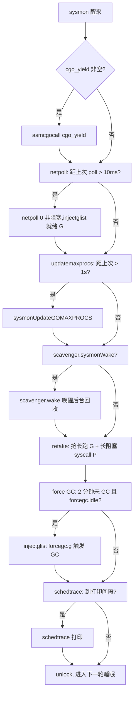
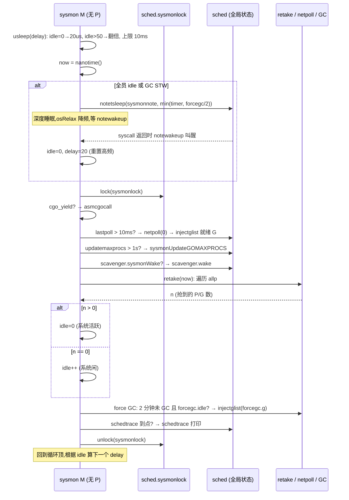

# 第七章 · sysmon:监控线程

> 篇:第 1 篇 · GMP 调度器(全书地基,重头戏)
> 主线呼应:第 5 章异步抢占里,真正给死循环 G 投 `SIGURG` 的是谁?第 6 章 handoff P 里,真正把 P 从阻塞 syscall 的 M 手里抽走的是谁?两次答案都是同一个名字——**sysmon**。上一章把它当作"按需介入的旁观者"一笔带过,这一章把它请到舞台中央。runtime 整个调度器、整个 GC,都是一堆**普通 M**——它们绑 P、跑 G、可能被 GC 暂停、可能卡在内核 syscall。如果这套"普通 M"出了岔子(全部在 syscall、有人霸占 P 不让出、GC 永远等不到触发),谁来兜底?Go 的答案是一条**完全游离于调度器和 GC 之外**的线程:它不绑 P、不跑 G、不参与 STW、不进 GC 扫描,独自每 ~20us 到 10ms 醒一次,扫一眼全局状态,该抢的抢、该唤的唤、该触发的触发。这条线程就是 sysmon。我们拆透四件事:**为什么需要一个"不用 P"的线程、它凭什么能脱离 GC/调度独立运行、它的轮询节流为什么这样设计、它那张"职责清单"每一项在解决什么"普通 M 干不了的事"**。

## 核心问题

**调度器和 GC 自己都是普通 M,都可能被 GC 暂停、可能卡在内核 syscall。谁能在这种"全员瘫痪"的情况下还继续观察全局、做兜底动作?这条线程怎么做到既不需要 P(所以不被调度/抢占约束),又能安全地操作 G/M/P 状态(触发抢占、抽走 P、注入就绪 G)?它的轮询频率怎么在"足够及时"和"不烧 CPU"之间找平衡?**

读完本章你会明白:

1. 为什么 sysmon 是一条**独立的 OS 线程**而不是一个 goroutine:goroutine 要绑 P 才能跑,而 P 会被 GC STW 冻结、会被别的 G 霸占、会全在 syscall——任何一个 G 都做不了"全体瘫痪时的兜底人"。sysmon 由 `newm(sysmon, nil, -1)` 直接起一条 M,`-1` 表示不绑任何 P,所以它**永远不在调度器管辖范围内**。
2. 为什么 sysmon 上**没有写屏障**也能 sound:它的源码注释开头一行 `//go:nowritebarrierrec`,以及它全程不持有 P——所以它**不可能写堆对象**(没有 mcache、没法 malloc),也就不可能破坏 GC 的三色不变式。这条约束反过来逼出它的实现风格:它只读全局状态、只改 G/M/P 的**调度字段**(状态字、指针链接),从不碰 GC 管理的对象图。
3. sysmon 的**自适应睡眠**为什么是 20us 起步、超过 50 个空闲周期翻倍、上限 10ms:活跃时它要能及时发现长跑 G / 长阻塞 syscall(几十毫秒级才有意义),20us 够细;空闲时翻倍到 10ms 省 CPU(否则一条线程永久每 20us 醒一次是浪费)。这套节流是"及时性 vs CPU 占用"的工程平衡。
4. sysmon 那张**职责清单**(cgo yield、netpoll、retake、force GC、schedtrace、scavenger wake、GOMAXPROCS update)每一项都在堵一个"普通 M 干不了/来不及干"的洞——它是个**全局兜底人**,不是某个功能的实现者。

> 逃生阀:这一章不深钻 sysmon 调用的那几个函数的内部(preemptone 见第 5 章、setBlockOnExitSyscall 见第 6 章、netpoll 见第 18 章、force GC 见第 14 章)。本章的焦点是 sysmon **本身**:它为什么存在、怎么脱离 GC/调度、怎么节流、那张职责清单怎么分工。如果读到"sysmon 不用 P 为什么还能跑 Go 代码"那里卡住,先抓主干:**M 是 OS 线程,绑不绑 P 都能跑 Go 代码;P 只是给 M 提供 mcache/runq/GC 上下文。sysmon 跑的 Go 代码不分配堆内存、不碰 GC 管理的对象,所以不需要 P**。其余都是这个主干为什么 sound 的展开。

---

## 7.1 一句话点破

> **sysmon 是 Go runtime 里唯一一条"特权线程":它由 `newm(sysmon, nil, -1)` 起出来,`-1` 表示不绑 P,于是它不进调度器、不被抢占、不参与 STW、不跑写屏障;它每 20us~10ms 醒一次,把全局状态扫一遍,做四件普通 M 来不及干的事——触发长时间运行 G 的异步抢占、把卡在 syscall 的 P 抽走 handoff、定期 poll 网络就绪、到点强制 GC。它存在的全部理由是"调度器和 GC 自己都是普通 M,可能在最需要兜底的时候正好全瘫痪,得有个局外人"。**

这是结论,不是理由。本章倒过来拆:先看为什么不能用 goroutine 来干这活(那是最自然的想法),再看 sysmon 怎么做到"脱离 GC/调度"——它不绑 P 这个设计带来的两件麻烦(没写屏障、没 mcache)和它如何绕开;然后拆它那段自适应睡眠的节流算法;最后把它的职责清单逐项过一遍,说清每一项为什么必须由 sysmon 来做。

---

## 7.2 为什么不能是一个 goroutine

最自然的想法:既然要"每 10ms 检查一次全局状态",写个 goroutine 不就行了?

```go
// 朴素思路(不是 Go 的实现)
func sysmonGoroutine() {
    for {
        time.Sleep(10 * time.Millisecond)
        checkLongRunningGs()
        checkSyscallBlocked()
        pollNet()
        maybeForceGC()
    }
}
```

这条路撞三堵墙,每一堵墙都对应"sysmon 必须独立"的一个理由。

### 7.2.1 第一堵墙:goroutine 要绑 P 才能跑

goroutine 不是凭空跑的。一个 G 要被调度,必须满足:**有 M 在跑、M 绑了 P、P 的 runq 或全局 runq 里有这个 G、`schedule` 选中它**。这四步任何一步断了,G 就跑不起来。

设想"全员瘫痪"的几个真实场景:

- **GC STW**:GC 标记准备阶段要 Stop The World,所有 P 进 `_Pgcstop`,所有 G 被冻结。如果 sysmon 是个 G,它此刻也被冻住——可偏偏 STW 期间(以及 STW 前后)正是 sysmon 最该清醒的时候(要观察 GC 进度、要兜死锁)。一个会被自己监护的对象冻住的监护者,等于没有。
- **全部 M 卡在阻塞 syscall**:文件 I/O、cgo 调用阻塞时,M 跟着 G 一起躺在内核里(第 6 章)。如果所有 M 都这样,没有 M 在跑 Go 代码,sysmon 这个 G 自然也没人调度它。可这恰恰是 sysmon 最该出手把 P 抽走 handoff 给新 M 的时刻——一个自己也被卡住的 sysmon,做不了 handoff。
- **死循环 G 霸占所有 P**:第 5 章讲过,没有异步抢占前,一个 `for {}` 能饿死同 P 上所有 G。如果 sysmon 是个 G,而它恰好排在某个被死循环霸占的 P 上,它永远等不到自己的时间片——它根本没机会去给那个死循环投 `SIGURG`。

> **不这样会怎样**:如果 sysmon 是 G,那么"调度器出问题"和"sysmon 能工作"就绑死了——调度器一出问题,sysmon 立刻也出问题,没法兜底。sysmon 的全部价值就是"在调度器出问题时还能工作",所以它必须**不在调度器管辖范围内**。G 永远在调度器管辖范围内,所以 sysmon 不能是 G。

### 7.2.2 第二堵墙:goroutine 会被 GC 扫到

GC 标记阶段要扫所有 G 的栈(找根指针,第 13 章)。扫栈意味着 GC 要读 G 的 `sched.sp`、要暂停这个 G 的执行。一个被 GC 反复扫、暂停的监护者,反应时间不可控。更要命的是,GC 自己需要一个"局外人"来触发它(force GC,见 7.5)——如果触发 GC 的那个角色自己也在 GC 的扫描范围内,就出现了"被监护者监护监护者"的循环。

sysmon 的解法是**根本不进 GC 的视野**:它不绑 P(没有 GC 上下文),它的栈不归 GC 管(GC 只扫普通 G 的栈),它跑的代码不分配堆对象(所以没有指针需要 GC 跟踪)。后面 7.3 会拆,这条"不进 GC 视野"是靠 `//go:nowritebarrierrec` + 全程不持有 P + 不 malloc 来保证的。

### 7.2.3 第三堵墙:第三堵墙其实是个反证

反过来想:如果 sysmon 真的能用 goroutine 实现,Go 早就这么干了——能用语言自身的原语何必专门起一条 OS 线程。Go 选择 `newm(sysmon, nil, -1)` 这条最重的路(起一条新的 OS 线程,有创建开销、有内核调度开销),正是因为前两堵墙绕不开。这一条反证,把"sysmon 必须是独立线程"这件事钉死了。

> **钉死这件事**:sysmon 不能是 goroutine,因为 goroutine 依赖 P/M/调度器三件套,而这三件套恰是 sysmon 要兜底的对象。监护者不能依赖被监护者。Go 的选择是给 sysmon 一条独立的 OS 线程,让它彻底脱离调度器和 GC 的管辖——这是"兜底"这个角色的硬性要求,不是工程偏好。

---

## 7.3 sysmon 怎么做到脱离 GC 和调度

看 sysmon 是怎么被起出来的。在 [`runtime.main`](../go/src/runtime/proc.go#L153)(main goroutine 的入口)里,有这么一段:

```go
// src/runtime/proc.go#L176-L181
mainStarted = true

if haveSysmon {
    systemstack(func() {
        newm(sysmon, nil, -1)
    })
}
```

`newm(fn, pp, id)` 是"起一条新 M"的函数([`proc.go#L2875`](../go/src/runtime/proc.go#L2875)),它干三件事:分配一个 M 结构、把 `fn` 设为这条 M 的入口函数、`newosproc` 真正创建一条 OS 线程。注意第二个参数 `nil` 和第三个参数 `-1`:

- `nil`:不给这条 M 绑 P。普通 M 通过 `startm` 起来时都会 `acquirep` 绑一个 P,sysmon 这条 M 跳过这步。
- `-1`:M 的 id,`-1` 表示"让 runtime 自动分配",但配合 `nil` 的 pp,语义上就是"这条 M 不归 P 管辖"。

`haveSysmon` 在 wasm 上是 `false`(wasm 单线程,没有 OS 线程概念,见 [`proc.go#L6532`](../go/src/runtime/proc.go#L6532)),其余平台 `true`。所以**除了 wasm,Go 程序启动时就一定有一条 sysmon 线程**。

这条 M 跑的入口函数就是 [`sysmon`](../go/src/runtime/proc.go#L6537)。我们看它的开头和那个关键的 `//go:nowritebarrierrec`:

```go
// src/runtime/proc.go#L6534-L6541
// Always runs without a P, so write barriers are not allowed.
//
//go:nowritebarrierrec
func sysmon() {
    lock(&sched.lock)
    sched.nmsys++
    checkdead()
    unlock(&sched.lock)
    // ...
}
```

注释一句"Always runs without a P, so write barriers are not allowed"——这是整个 sysmon 设计的纲领。两个事实钉在一起:

1. **sysmon 永远不持有 P**(它在 `newm` 时就没绑,运行中也不会 `acquirep`)。
2. **所以它不能有写屏障**(写屏障需要 P 提供的 GC 上下文,见第 13 章)。

`//go:nowritebarrierrec` 是个**编译器指令**:它告诉编译器"这个函数及其调用的所有函数,都禁止写屏障;如果编译器发现任何写屏障调用,编译期报错"。这是个**静态保证**——不是运行时检查,是编译时就钉死 sysmon 不会有写屏障。

### 7.3.1 为什么"没有 P"就等于"没有写屏障"

这要回到第 13 章会详讲的写屏障机制。Go 的混合写屏障(Dijkstra + Yuasa 的混合)在**指针写入堆**时,要插入一段代码:把被覆盖的旧值和新写入的新值之一(或都)标灰,防止并发标记漏标。这段代码需要读**当前 GC 状态**(`gcphase`,在 STW 之外是 `_GCmark`),而这个状态**存在 P 上**(`p.gcBgMarkWorker`、`p.gcw` 等 GC 工作上下文都在 P 里)。

sysmon 没有 P,就**读不到 GC 状态**。如果它的代码里有"写一个堆指针"的操作,编译器要插入写屏障,写屏障要读 P 的 GC 状态——sysmon 没有 P,这一读就崩了(空指针解引用)。

所以 Go 干脆用 `//go:nowritebarrierrec` 在编译期禁止:sysmon 的代码**根本不允许有任何写屏障调用**,也就根本不允许有任何"需要写屏障的堆指针写入"。

> **所以这样设计**:`//go:nowritebarrierrec` 不是装饰,是把"sysmon 没有 P"这个事实的**后果**用编译器指令钉死——它逼着 sysmon 的实现者**只能写"不需要写屏障的代码"**:不分配堆对象(malloc 在 Go 里要 P 的 mcache)、不修改堆上的对象图、只碰 G/M/P 的调度字段(那些字段在 GC 看来是"runtime 自己的元数据",不是 GC 管理的对象)。这条约束反过来塑造了 sysmon 的实现风格:**它只观察、只调度,不创造堆垃圾**。这是它能在 GC 进行时安全运行的地基。

### 7.3.2 `sched.nmsys++`:把自己登记为"系统 M"

[`sysmon` 开头那行 `sched.nmsys++`](../go/src/runtime/proc.go#L6539) 是另一处容易被忽略但关键的设计。`nmsys` 是"系统 M 数",它和 `nmidle`(空闲 M)、`nmidlelocked`(锁定空闲 M)是并列的。

这个计数用在 [`checkdead`](../go/src/runtime/proc.go#L6418)(死锁检测)里:

```go
// src/runtime/proc.go#L6447
run := mcount() - sched.nmidle - sched.nmidlelocked - sched.nmsys
if run > run0 {
    return
}
```

`run` 是"正在干活的 M 数"。`checkdead` 判断死锁的逻辑是:**总 M 数 减去 空闲 减去 锁定空闲 减去 系统 M,如果剩下的"干活 M"是 0,且没有 G 在等外部唤醒,就报死锁**。

sysmon 自己算"系统 M"——它虽然是一条 M,但它不跑用户的 G,所以不应该算进"干活 M"。如果不把它单独扣出来,`checkdead` 会把 sysmon 当成一个"干活 M",永远算不出死锁(sysmon 一直在跑,`run` 永远 ≥ 1)。把它扣进 `nmsys`,死锁检测才能正确反映"有没有 M 在跑用户的活"。

> **钉死这件事**:`sched.nmsys++` 这一行不是装饰,是 sysmon 把自己**从死锁检测的分子里摘出来**。sysmon 永远在跑,如果它算"干活 M",死锁永远报不出来。把它单列成"系统 M",`checkdead` 才能正确判断"用户代码是否全员阻塞"。这是个"独立线程"身份必须配套的会计处理。

### 7.3.3 sysmon 跑的 Go 代码:为什么"不绑 P 也能跑"

这一节回答一个容易卡住的疑问:**Go 不是"P 才能让 M 跑 Go 代码"吗?sysmon 没 P,它跑的是什么?**

准确的说法是:**P 不是"M 跑 Go 代码"的前提,而是"M 跑用户 G + 分配堆内存 + 参与 GC"的前提**。M 这条 OS 线程,绑不绑 P 都能跑 Go 代码——只要这段代码不分配堆内存、不触发 GC、不操作需要 P 上下文的东西。

具体到 sysmon:

- 它跑的代码全是 runtime 内部函数(`retake`、`netpoll`、`checkdead` 等),这些函数**不调 `mallocgc`**(它们处理的是已经存在的 G/M/P 结构,不新建堆对象)。
- 它们也不触发 GC(GC 触发要 P,见第 14 章)。
- 它们操作的 G/M/P 字段是 runtime 元数据,GC 不扫这些(GC 扫的是用户堆对象)。

所以 sysmon 这条 M 上跑的 Go 代码,**对 GC 完全不可见**——不产生垃圾、不需要屏障、不被扫栈。这就是它"不绑 P 也能跑 Go 代码"的真相:**它跑的代码恰好都不需要 P 提供的那些东西**。

> **反面对比**:假设 sysmon 跑的代码里有一处 `s := fmt.Sprintf(...)`(`fmt.Sprintf` 要分配堆字符串)。这一处 malloc 会走 `mallocgc`,要 mcache,mcache 在 P 上——sysmon 没 P,直接 `throw("mallocgc: no P")` 崩溃。所以 sysmon 的代码**全程不分配堆内存**这条约束不是建议,是硬性的——任何一处堆分配都会让 sysmon 崩。Go 用 `//go:systemstack`、`//go:nosplit`、`//go:nowritebarrierrec` 这一串指令把这条约束在编译期钉死。

---

## 7.4 自适应睡眠:20us 到 10ms 的节流

sysmon 是个无限循环,每轮睡一会儿,醒来干一轮活。最朴素的写法是固定睡眠:

```go
// 朴素思路(不是 Go 的实现)
for {
    time.Sleep(10 * time.Millisecond)
    doWork()
}
```

但 Go 的实现要精巧得多,看 sysmon 主循环开头:

```go
// src/runtime/proc.go#L6545-L6557
idle := 0 // how many cycles in succession we had not wokeup somebody
delay := uint32(0)

for {
    if idle == 0 { // start with 20us sleep...
        delay = 20
    } else if idle > 50 { // start doubling the sleep after 1ms...
        delay *= 2
    }
    if delay > 10*1000 { // up to 10ms
        delay = 10 * 1000
    }
    usleep(delay)
    // ... 干活 ...
}
```

三个分支,逐个看为什么这么设计。

### 7.4.1 起步 20us:活跃时足够及时

`idle == 0`(刚干完活,系统活跃)时,`delay = 20`,睡 20 微秒。为什么是 20us 而不是 1ms?

sysmon 要发现的"异常"有两个时间尺度:

- **长跑 G**:超过 `forcePreemptNS = 10 * 1000 * 1000`(10ms)没让出的 G([`proc.go#L6679`](../go/src/runtime/proc.go#L6679))。
- **长阻塞 syscall**:超过约 20us 的 syscall(retake 里 `pd.syscallwhen+10*1000*1000 > now` 这个 10ms 阈值,但更早的判定是"syscalltick 是否变化",而 syscalltick 变化要在 20us 量级才看得出)。

10ms 量级的异常,sysmon 用 20us 的轮询,理论上 10ms / 20us = 500 次机会发现它,反应延迟最坏 ~20us。如果用 1ms 轮询,最坏反应延迟 1ms,虽然也能发现,但**长阻塞 syscall 的 handoff 会晚 1ms 才触发**,在高 QPS 服务里这一毫秒的 P 浪费是可感的。

> **不这样会怎样**:假设 sysmon 用 1ms 固定睡眠。一个 G 卡在 syscall 里,sysmon 平均要等 0.5ms(最坏 1ms)才发现并 handoff。这期间那个 P 跟着阻塞 M 一起睡大觉,别的 G 没法用。20us 的轮询把这个延迟压到几十微秒,handoff 更及时,P 浪费更少。

### 7.4.2 翻倍:空闲时省 CPU

`idle > 50` 时 `delay *= 2`。`idle` 是"连续多少轮没干到活"(retake 返回 0 时 `idle++`)。`idle` 超过 50,意味着系统已经空闲了至少 50 × 20us = 1ms,sysmon 这 50 轮什么都没抢到——说明系统暂时没什么活要兜底。

这时开始**翻倍**睡眠:20us → 40 → 80 → 160 → ...。注意翻倍不是从第一轮就开始,而是**连续 50 轮没活之后**才开始——前 1ms 还是 20us 细粒度(应对短时突发),1ms 后才进入"系统真的闲了"的退避模式。

为什么翻倍而不是线性增长?**指数退避**是网络/锁竞争里的经典策略(以太网 CSMA/CD、Linux mutex 的 `osq_lock` 都用),它的好处是**前期快涨、后期慢涨**——前期快速脱离"高频空轮询"的浪费区,后期逼近上限时增长放缓,避免无意义的抖动。sysmon 用同一套逻辑:空闲越久,假设它越可能继续空闲,睡得越久越省 CPU。

### 7.4.3 上限 10ms:再闲也不能睡死

`delay > 10*1000` 时 `delay = 10 * 1000`,封顶 10ms。为什么不能让 delay 一直翻倍涨到几百毫秒甚至秒?

因为 sysmon 还要负责**到点强制 GC**(`forcegcperiod = 2 * 60 * 1e9` = 2 分钟,见 [`proc.go#L6527`](../go/src/runtime/proc.go#L6527))和**schedtrace 打印**(如果开了 `GODEBUG=schedtrace`)。如果 delay 涨到秒级,这些定时任务的精度就毁了——强制 GC 可能晚好几秒才触发,schedtrace 打印间隔也不准。10ms 上限保证这些任务的最坏延迟在 10ms 量级,可接受。

> **钉死这件事**:sysmon 的睡眠是"20us 起步,空闲 50 轮后翻倍,封顶 10ms"的三段式。它不是固定值,而是**自适应**:系统忙时高频(20us)及时兜底,系统闲时低频(最高 10ms)省 CPU,但永不全睡死(10ms 上限保证定时任务精度)。这是"及时性 vs CPU 占用"的经典权衡,用指数退避 + 封顶落地。

### 7.4.4 深度睡眠:notetsleep 与 osRelax

上面是"浅睡眠"——`usleep(delay)`。但 sysmon 还有一段"深度睡眠"路径,当**所有 P 都 idle 或 GC 正在 STW** 时触发:

```go
// src/runtime/proc.go#L6575-L6607(节选)
if debug.schedtrace <= 0 && (sched.gcwaiting.Load() || sched.npidle.Load() == gomaxprocs) {
    lock(&sched.lock)
    if sched.gcwaiting.Load() || sched.npidle.Load() == gomaxprocs {
        syscallWake := false
        next := timeSleepUntil()   // 下一个 timer 何时到点
        if next > now {
            sched.sysmonwait.Store(true)
            unlock(&sched.lock)
            sleep := forcegcperiod / 2   // 1 分钟
            if next-now < sleep {
                sleep = next - now
            }
            shouldRelax := sleep >= osRelaxMinNS
            if shouldRelax {
                osRelax(true)   // 告诉 OS:CPU 可以降频
            }
            syscallWake = notetsleep(&sched.sysmonnote, sleep)
            if shouldRelax {
                osRelax(false)
            }
            // ...
        }
        if syscallWake {
            idle = 0
            delay = 20
        }
    }
    unlock(&sched.lock)
}
```

这段的逻辑:**只有当系统真的全员 idle(所有 P 都 pidle)或 GC 正在 STW 时,sysmon 才放弃浅睡眠的 10ms 轮询,改用 `notetsleep` 睡到"被唤醒"或"超时"**。`notetsleep` 是个**条件变量**式的睡眠——别的代码可以 `notewakeup(&sched.sysmonnote)` 把它叫醒(谁会叫醒它?下面说)。睡多久?取"下一个 timer 到点"和"force GC 周期一半"的较小值——这样既不会睡过头错过 timer,也不会错过强制 GC。

两个细节值得拆:

**`osRelax(true)`**:`osRelax` 在 Linux 上是 `sched_yield` + 一个告诉内核"我闲着,可以降频"的提示(Go 1.20+ 用 `ULINUX` 的某种机制;具体平台实现不同)。它的作用是**在深度睡眠时让 CPU 降频省电**。对笔记本/容器/云主机这种"按 CPU 使用计费"的场景,sysmon 不闲时一直 20us 醒一次,会让 CPU 一直处于高频态,耗电。深度睡眠时 `osRelax(true)` 让 CPU 有机会降下来。这是个**绿色计算**的细节,不是核心机制,但体现了 Go runtime 对部署场景的体贴。

**`syscallWake`**:`notetsleep` 返回 `true` 表示"被 `notewakeup` 叫醒"(false 表示超时)。谁会叫醒 sysmon?是**有 M 从 syscall 返回**时——`exitsyscallfast` 那条路径(第 6 章 `exitsyscall` 的快路径分支)在拿到空闲 P 时会检查 `sched.sysmonwait`,如果 sysmon 在深度睡,`notewakeup(&sched.sysmonnote)` 把它叫醒。叫醒后 `idle = 0; delay = 20`——重置回高频模式,因为"有 syscall 返回"通常意味着系统又开始忙了。

> **所以这样设计**:深度睡眠是个"省电优化",但它有个隐藏的正确性收益——**它在全员 idle 时把 sysmon 从 10ms 轮询降到事件驱动**,而事件源是"syscall 返回"或"timer 到点"。这两个事件恰恰是"系统从 idle 转忙"的信号,所以叫醒后重置高频是合理的赌注:"既然刚有 syscall 返回,可能马上又要忙,我先高频观察一下"。这个赌注的代价很低(高频 20us 持续到下一次全员 idle),收益是减少了 idle → busy 切换时的 sysmon 反应延迟。

---

## 7.5 sysmon 的职责清单:六件普通 M 干不了的事

sysmon 醒来后干什么?看主循环里 `usleep` 之后那一段(在 [`proc.go#L6609-L6666`](../go/src/runtime/proc.go#L6609)),它拿着 `sched.sysmonlock`(sysmon 专用锁,串行化 sysmon 自己的工作)做六件事。我们逐项过,每项都说清"为什么这件事必须 sysmon 来做"。



### 7.5.1 cgo yield:让 C 库别饿死 Go

```go
// src/runtime/proc.go#L6614-L6617
// trigger libc interceptors if needed
if *cgo_yield != nil {
    asmcgocall(*cgo_yield, nil)
}
```

这一项最冷门,但能说明 sysmon 的"局外人"价值。`cgo_yield` 是个函数指针,只有当 Go 程序用了某些 cgo 库(尤其是用了 `sigtimedwait` 这类会"吞掉"信号的 C 库)时才会被设置(`runtime.SetCgoTracebuf` 之类会设它)。这类 C 库在阻塞时会**吃掉本该给 Go runtime 的信号**(包括异步抢占用的 `SIGURG`),导致 Go 调度器对该线程的抢占失效。

sysmon 每 20us~10ms 调一次 `cgo_yield`,本质是"提醒那个 C 库:你如果有阻塞操作,主动 `sched_yield` 一下,让 Go 的信号有机会送达"。这是个**兼容性兜底**——只有特定 cgo 场景需要,但需要时只有 sysmon 能做(普通 M 可能正卡在那个 C 库里,没法自我提醒)。

### 7.5.2 netpoll:定期轮询网络就绪

```go
// src/runtime/proc.go#L6618-L6636
// poll network if not polled for more than 10ms
lastpoll := sched.lastpoll.Load()
if netpollinited() && lastpoll != 0 && lastpoll+10*1000*1000 < now {
    sched.lastpoll.CompareAndSwap(lastpoll, now)
    list, delta := netpoll(0) // non-blocking - returns list of goroutines
    if !list.empty() {
        incidlelocked(-1)
        injectglist(&list)
        incidlelocked(1)
        netpollAdjustWaiters(delta)
    }
}
```

这一项是 sysmon 的**核心职责之一**,第 18 章会详讲 netpoll,这里先说为什么 sysmon 要管它。

netpoll 的正常路径是:**M 在 `findRunnable` 找不到 G、即将 park 前,主动 `netpoll(0)` 非阻塞 poll 一次**(见第 3 章 findRunnable)。这个路径覆盖了大部分场景——只要有 M 即将空闲,它就会 poll 一次网络。

但有几种情况这个路径失灵:

- **所有 M 都在跑 G,没一个要 park**:这时网络就绪的 G 不会被 poll 出来,直到某个 M 跑完当前 G 准备 park。如果所有 G 都是 CPU 密集型的(没有阻塞操作),这条 M 可能很久都不 park,网络 G 就饿死了。
- **所有 M 都在阻塞 syscall**:没人去 `findRunnable`,自然也没人 poll 网络。
- **网络事件突发**:大量连接同时就绪,正常 poll 一次可能漏(虽然 epoll 一次能取多个,但边界情况存在)。

sysmon 每 10ms(看 `lastpoll+10*1000*1000 < now`,即距上次 poll 超过 10ms)兜底 poll 一次,堵住这些情况。注意 `injectglist(&list)` 把 poll 出来的 G **注入全局 runq**(不是某个 P 的本地 runq,因为 sysmon 没 P,不能写本地 runq),让任何 P 都能取到。

`incidlelocked(-1)` / `incidlelocked(1)` 这对调用是个微妙点:`injectglist` 把 G 放进 runq 可能触发 `wakep`(起一条新 M 来跑),而 `wakep` 在判断"要不要起 M"时会看 `sched.nmidle`(空闲 M 数)。如果 sysmon 不调整这个计数,可能出现"injectglist 放了 G,wakep 看到有空闲 M 就不起新的,可那条空闲 M 此刻正在被 sysmon 当成'快醒了'的——结果 G 等不到 M"的竞态。`incidlelocked(-1)` 临时"假装少了一个空闲 M",让 `wakep` 更倾向于起 M;`injectglist` 后再 `incidlelocked(1)` 恢复。注释 L6624-L6631 详细讲了这个竞态。

> **钉死这件事**:netpoll 的兜底必须由 sysmon 做,因为兜底的场景(所有 M 在跑、所有 M 在 syscall)恰恰是"普通 M 干不了 poll"的场景。监护者不依赖被监护者——sysmon 没 P 也能 poll 网络(netpoll 是 epoll 包装,不需要 P),所以它能在这两种"全员瘫痪"场景里把就绪 G 捞出来注入 runq。这是 sysmon 在"阻塞唤醒"二分法那一面的关键职责。

### 7.5.3 retake:抢长跑 G + 长阻塞 syscall P

```go
// src/runtime/proc.go#L6646-L6652
// retake P's blocked in syscalls
// and preempt long running G's
if retake(now) != 0 {
    idle = 0
} else {
    idle++
}
```

这是 sysmon 最广为人知的职责,第 5 章(异步抢占)和第 6 章(handoff)已经把 `retake` 内部拆透了,这里只回顾它和 sysmon 的关系。

[`retake`](../go/src/runtime/proc.go#L6681) 遍历所有 P,对每个 `_Prunning` 的 P 做两件判定:

1. **同一个 `schedtick` 跑超过 10ms** → `preemptone(pp)`:给那条 M 投 `SIGURG`(异步抢占)。`schedtick` 是 P 每次执行一个 G 时自增的计数,同一 `schedtick` 说明同一个 G 在跑——它跑超过 10ms 就该被抢占(第 5 章)。
2. **同一个 `syscalltick` 卡在 syscall 太久,且有别的 work 要干** → `setBlockOnExitSyscall` + `takeP` + `handoffp`:把 P 从阻塞 M 抽走,交给别的 M(第 6 章)。

这两件事的"为什么必须 sysmon"已经在第 5/6 章说清:**普通 M 不能抢自己**(它正在跑那个长跑 G,没法打断自己),**阻塞在 syscall 的 M 不能自己 handoff**(它在内核里)。sysmon 是唯一一个"既不在跑长 G、也不在卡 syscall"的线程,所以只有它能干 retake。

注意 `retake` 返回值用来更新 `idle`:抢到了(返回非 0)就 `idle = 0`(系统活跃,重置高频),没抢到(返回 0)就 `idle++`(系统闲,继续累计空闲轮)。这就是 7.4 那套节流的输入信号——`retake` 的成败决定 sleep delay 走不走退避。

### 7.5.4 force GC:2 分钟强制触发

```go
// src/runtime/proc.go#L6653-L6661
// check if we need to force a GC
if t := (gcTrigger{kind: gcTriggerTime, now: now}); t.test() && forcegc.idle.Load() {
    lock(&forcegc.lock)
    forcegc.idle.Store(false)
    var list gList
    list.push(forcegc.g)
    injectglist(&list)
    unlock(&forcegc.lock)
}
```

这一项是 GC 的兜底触发器。GC 正常靠"分配达阈值"触发(第 14 章),但如果一个程序**长时间不分配**(比如纯计算、长时间 idle),堆里的垃圾可能攒了很久不被回收——既浪费内存,也可能在某些场景下有问题。

`forcegcperiod = 2 * 60 * 1e9` = 2 分钟(`proc.go#L6527`)。sysmon 每 10ms 检查一次:如果距上次 GC 超过 2 分钟(`gcTriggerTime.test()` 返回 true),且后台 GC worker 空闲(`forcegc.idle`),就**把那个 GC worker G 注入 runq**,让它去启动一次 GC。

注意这里 sysmon **不直接启动 GC**(GC 启动要 P,sysmon 没 P),而是**唤醒一个早就 park 着的 force-GC goroutine**(`forcegc.g`,这个 G 在 `runtime.main` 之前就创建好了,平时 park 等着)。这个 G 绑了普通 P 跑起来后,会调 `gcStart` 真正启动 GC。sysmon 只负责"捅醒它"。

> **不这样会怎样**:假设 GC 完全靠分配触发。一个长跑的纯计算程序(不分配堆),堆里早期产生的垃圾(比如 init 阶段分配的临时对象)永远不回收——直到下次分配。这在内存敏感场景(嵌入式、长跑服务)不可接受。sysmon 的 2 分钟强制 GC 兜底,保证即使不分配,垃圾也不会无限积压。而这件事**必须 sysmon 做**——GC 自己不会主动启动(它靠分配触发),普通 M 在不分配时不触发,只有"局外人"sysmon 能定时捅。

### 7.5.5 scavenger wake 与 GOMAXPROCS update

```go
// src/runtime/proc.go#L6642-L6645
if scavenger.sysmonWake.Load() != 0 {
    // Kick the scavenger awake if someone requested it.
    scavenger.wake()
}
```

`scavenger` 是后台内存回收 goroutine(把空闲页 `madvise(MADV_DONTNEED)` 还给 OS,见第 16 章 sweep)。它在内存压力大时被唤醒干活。`scavenger.sysmonWake` 是个原子标志,scavenger 自己 park 时会设这个标志"如果有新工作来,让 sysmon 捅醒我"。sysmon 每 20us~10ms 检查一次,设了就 `scavenger.wake()`。

```go
// src/runtime/proc.go#L6637-L6641
if debug.updatemaxprocs != 0 && lastgomaxprocs+1e9 <= now {
    sysmonUpdateGOMAXPROCS()
    lastgomaxprocs = now
}
```

`sysmonUpdateGOMAXPROCS` 是 Go 1.26+ 的新功能(容器里 `GOMAXPROCS` 可按 CPU quota 自动调整,见 [`proc.go#L7173`](../go/src/runtime/proc.go#L7173))。sysmon 每秒检查一次 CPU quota 是否变化(开了 `debug.updatemaxprocs` 才生效),变了就调整 `GOMAXPROCS`。这件事**可以由别的 goroutine 做**,但放 sysmon 里是因为它是"全局观察者",已经有定期循环的骨架,顺手干这个最省事(不用再起一个 goroutine)。

这两项不是 sysmon 的"必须做"职责(像 retake、force GC 那样),而是**"既然 sysmon 已经在定期循环,把这类轻量的全局检查也挂上去"**的工程选择。它们体现了 sysmon 作为"通用后台巡检线程"的演化——新功能要全局定期检查,自然挂到 sysmon 上,而不是新起一个线程。

### 7.5.6 schedtrace:调试打印

```go
// src/runtime/proc.go#L6662-L6665
if debug.schedtrace > 0 && lasttrace+int64(debug.schedtrace)*1000000 <= now {
    lasttrace = now
    schedtrace(debug.scheddetail > 0)
}
```

`GODEBUG=schedtrace=N` 开了之后,sysmon 每 N 毫秒打印一次全局调度状态(所有 P/M/G 的概览)。这是调试用的,不是核心机制。但注意一个细节:**`schedtrace` 开了之后,sysmon 不会进入深度睡眠**(看 L6575 那个判定 `debug.schedtrace <= 0`),因为深度睡眠会让打印间隔不准。这是"调试模式牺牲性能换精度"的取舍。

---

## 7.6 调用链全景:sysmon 一轮的完整旅程

把前面拆的串起来,看 sysmon 醒来一轮的完整时序(假设系统活跃,走浅睡眠):



这张图把 sysmon 一轮的"睡 → 醒 → 巡检六项 → 睡"完整画出来了。三个关键设计点:

- **睡多久** 由 `idle` 计数驱动,活跃时 20us,闲时退避到 10ms。
- **深度睡眠** 是全员 idle/GC STW 时的事件驱动睡眠,被 syscall 返回或 timer 叫醒。
- **巡检顺序** 固定(cgo → netpoll → maxprocs → scavenger → retake → GC → schedtrace),`sysmonlock` 串行化保证不重入。

---

## 7.7 技巧精解:两个最硬的技巧

本章最值得单独拎出来拆的是两个技巧:**"不绑 P 的特权线程"这个设计本身**、以及**自适应睡眠 + 深度睡眠的两级节流**。

### 7.7.1 技巧一:"不绑 P 的特权线程"如何绕开 GC 和调度

朴素地想"搞个后台监控线程",最容易写成 goroutine(7.2 拆了为什么不行)。退一步,写成"一条绑了 P 的 M"行不行?

```
// 朴素思路(不是 Go 的实现)
func startSysmonM() {
    m := newm()
    p := pidleget()           // 绑一个 P
    m.acquirep(p)
    m.run(sysmonLoop)         // 在这个 P 上跑 sysmon
}
```

这条路撞两堵墙:

1. **绑了 P 就进了 GC 视野**:P 有 GC 上下文(`p.gcBgMarkWorker`、`p.gcw`),sysmon 这条 M 跑在 P 上,它的栈会被 GC 扫(找根指针)。GC 扫栈要暂停这条 M,sysmon 在 STW 期间就被冻住——可 STW 期间正是 sysmon 最该清醒的时候。
2. **绑了 P 就进了调度器视野**:P 可能被抢(sysmon 的 P 可能被别的 M 抢走,或被 `GOMAXPROCS` 缩减时回收),sysmon 一旦没 P 就跑不了 Go 代码——监护者又被被监护者卡住了。

Go 的解法是**根本不绑 P**:`newm(sysmon, nil, -1)` 的第二个参数 `nil` 是关键。不绑 P,带来两个连锁后果:

- **没有 mcache** → 不能 `mallocgc`(堆分配)→ 不能产生堆垃圾 → GC 不需要扫它的"分配"。
- **没有 GC 上下文** → 不能写屏障 → 编译器用 `//go:nowritebarrierrec` 禁止任何写屏障调用 → 不会有"写堆指针没屏障"的漏标。

这两个后果叠加,sysmon **对 GC 完全不可见**:不产生垃圾(不 malloc)、不修改对象图(没写屏障意味着不能写堆指针)、栈不被扫(不是普通 G 的栈)。GC 进行时 sysmon 照常跑,STW 不冻结它(它不绑 P,STW 是冻结所有 P 上的 G,sysmon 不在任何 P 上)。

同时,不绑 P 也让它**对调度器完全不可见**:它不进 runq(它是 M 的入口函数,不是 G),不被 work-stealing(没 P 没 runq),不被抢占(抢占是针对绑 P 的 G)。它就是一条 OS 线程,OS 调度它跑就行,runtime 的调度器管不到它。

> **反面对比**:假设 sysmon 绑了一个 P。那么 GC STW 时,这个 P 要进 `_Pgcstop`,sysmon 跟着被冻住。可 GC STW 的发起、`force GC` 的触发,都依赖 sysmon——GC 自己发起不了(它靠分配触发,sysmon 是它的兜底触发器)。一个会被 GC 冻住的 GC 触发器,逻辑上自相矛盾。Go 用"不绑 P"这一招同时绕开调度器和 GC 两个管辖范围,代价是 sysmon 的代码必须全程不分配堆内存(`//go:nowritebarrierrec` + `//go:systemstack` + `//go:nosplit` 这一串指令把约束钉死)。**用约束换自由**——这是特权线程的标准代价。

### 7.7.2 技巧二:两级睡眠的节流——及时性 vs CPU 占用

朴素地想"sysmon 每 10ms 醒一次",最直接:

```
// 朴素思路(不是 Go 的实现)
for {
    time.Sleep(10 * time.Millisecond)
    doWork()
}
```

这条路能用,但撞一个墙:**CPU 浪费**。一个空闲的 Go 程序,sysmon 每 10ms 醒一次,每次醒来扫一遍 allp(可能几十个 P)、检查一堆全局状态,然后发现没活干又睡回去。这一轮在空闲系统上要烧掉几微秒 CPU,累积起来每秒 100 次 = 几百微秒 CPU——对"按 CPU 计费"的云场景,一个空闲程序持续消耗 CPU 是浪费。

Go 的解法是**两级睡眠**:

**第一级:浅睡眠自适应退避**(7.4 拆过)。`idle=0` 时 20us(活跃,及时兜底),连续 50 轮没活后翻倍(空闲,退避),封顶 10ms(再闲也不睡死)。这套逻辑让"活跃系统"和"空闲系统"的 sysmon 频率差 500 倍(20us vs 10ms),CPU 占用差 500 倍——空闲时几乎不烧 CPU,活跃时反应及时。

**第二级:深度睡眠事件驱动**(7.4.4 拆过)。当**所有 P 都 idle 或 GC STW** 时,浅睡眠都不够省——sysmon 还在 10ms 轮询。这时切到 `notetsleep` 事件驱动:睡到"被叫醒"(syscall 返回 `notewakeup`)或"超时"(下一个 timer / forcegc 一半)。这一级把空闲时的 sysmon CPU 占用降到**接近零**——它真的睡着了,只有事件来了才醒。

两级睡眠的分工:

| 场景 | sysmon 状态 | 频率 | CPU 占用 |
|---|---|---|---|
| 系统活跃(有 G 在跑) | 浅睡眠,idle=0 | 20us | 高(但系统本就忙,可接受) |
| 系统转闲(retake 失败 50 轮) | 浅睡眠退避 | 20us → 翻倍 → 10ms | 递减 |
| 全员 idle / GC STW | 深度睡眠 notetsleep | 事件驱动 | 接近零 |
| 全员 idle 但有 timer 将到 | 深度睡眠,超时=timer | 睡到 timer | 接近零 |

> **反面对比**:假设只有浅睡眠(没有深度睡眠)。一个空闲的 Go 服务(等请求),所有 G 都 park,所有 P 都 idle。sysmon 还在每 10ms 醒一次扫一遍 allp——但什么也扫不出来(没 G 在跑,retake 返回 0)。这一轮白烧 CPU。云场景下,一个"挂机"的服务持续消耗 CPU(哪怕每秒几百微秒),会被监控系统告警"CPU 不为零"。深度睡眠让 sysmon 在全员 idle 时真的睡着,只在"syscall 返回"或"timer 到点"这种"系统可能转忙"的信号来时才醒——CPU 占用归零,绿色计算达标。**两级睡眠是"及时性 vs CPU 占用"在空闲场景下的极致权衡**。

> **钉死这件事**:sysmon 的睡眠不是单级的,是"浅睡眠退避 + 深度睡眠事件驱动"两级。浅睡眠应对活跃系统(20us 及时)+ 转闲系统(翻倍退避);深度睡眠应对完全空闲(事件驱动,接近零 CPU)。这套设计让 sysmon 在"最忙时反应延迟 20us"和"最闲时 CPU 占用接近零"之间自由切换,是 Go runtime 对部署场景体贴的体现。

---

## 章末小结

这一章把 sysmon 这个 Go runtime 里**唯一一条特权线程**拆透了。回到二分法,这一章服务**调度执行**——sysmon 是调度器的"外部监护者":它触发长跑 G 的抢占(让调度执行的公平性有兜底)、把卡 syscall 的 P 抽走 handoff(让 P 不被阻塞浪费)、定期 poll 网络(让阻塞唤醒有兜底)、到点强制 GC(让支撑地基的 GC 有兜底触发)。它不属于调度执行、阻塞唤醒、支撑地基任何一面,而是**横跨三面的兜底人**——这是它"独立观察者"身份的本质。

和前两章的关系:第 5 章异步抢占,sysmon 是触发者(`retake` 调 `preemptone`);第 6 章 handoff P,sysmon 是执行者(`retake` 调 `setBlockOnExitSyscall` + `takeP` + `handoffp`)。这两章把 sysmon 当工具用,这一章把 sysmon 当主角讲——讲清它**为什么存在**(调度器和 GC 自己都可能瘫痪,得有局外人)、**怎么脱离管辖**(不绑 P,`//go:nowritebarrierrec`)、**怎么省 CPU**(两级睡眠)、**干什么活**(六项职责清单)。

### 五个"为什么"清单

1. **为什么 sysmon 不能是 goroutine?** goroutine 要绑 P 才能跑,而 P 会被 GC STW 冻结、会被 G 霸占、会全在 syscall。sysmon 的全部价值是"调度器/GC 瘫痪时还能兜底",如果它自己依赖 P,它就在最该清醒的时刻一起瘫痪了。所以它必须是一条**独立 OS 线程**,由 `newm(sysmon, nil, -1)` 起出来,`nil` 表示不绑 P。

2. **为什么 sysmon 不绑 P 还能跑 Go 代码?** P 不是"M 跑 Go 代码"的前提,而是"M 跑用户 G + 分配堆 + 参与 GC"的前提。sysmon 跑的 Go 代码全是 runtime 内部函数(`retake`、`netpoll` 等),这些函数不调 `mallocgc`(不分配堆)、不触发 GC、不碰需要 P 上下文的东西。所以 sysmon 这条 M 不需要 P 也能跑这些代码。代价是 sysmon 的代码**全程不能堆分配**,用 `//go:nowritebarrierrec` + `//go:systemstack` + `//go:nosplit` 在编译期钉死。

3. **为什么 sysmon 没有写屏障也能 sound?** 写屏障是为了防并发标记漏标堆指针。sysmon 没有 P,不能写堆指针(写堆指针要写屏障,写屏障要 P 的 GC 上下文)。`//go:nowritebarrierrec` 在编译期禁止 sysmon 有任何写屏障调用,意味着 sysmon **根本不写堆指针**——它只碰 G/M/P 的调度字段(runtime 元数据,GC 不管)。既然不写堆指针,就不需要写屏障,sound 自然成立。约束换自由。

4. **sysmon 的睡眠为什么是 20us 起步、翻倍、封顶 10ms,还有个深度睡眠?** 三层节流应对三种负载:活跃系统(20us 及时发现长跑 G 和长阻塞 syscall)、转闲系统(翻倍退避省 CPU)、完全空闲(深度睡眠事件驱动,CPU 接近零)。封顶 10ms 保证 force GC(2 分钟)和 schedtrace 等定时任务的最坏延迟可控。深度睡眠让空闲服务的 CPU 占用归零(对云场景重要)。这套设计是"及时性 vs CPU 占用"在三种负载下的极致权衡。

5. **sysmon 的六项职责,每一项为什么必须由它做?** cgo yield(普通 M 可能卡在那个 C 库里,没法自我提醒);netpoll 兜底(所有 M 在跑或都在 syscall 时,没人 poll 网络);retake(普通 M 不能抢自己,阻塞 M 不能自己 handoff);force GC(GC 自己靠分配触发,不分配时需要局外人捅);scavenger wake / GOMAXPROCS update(挂到已有循环骨架上,省得新起线程)。前四项是"必须 sysmon",后两项是"挂 sysmon 上最省事"。sysmon 是"调度器/GC/分配器都干不了或来不及干的事"的总兜底人。

### 想继续深入往哪钻

- **源码文件**:本章主战场 [`../go/src/runtime/proc.go`](../go/src/runtime/proc.go) 的 `sysmon`@L6537 / `retake`@L6681 / `checkdead`@L6418 / `sysmonUpdateGOMAXPROCS`@L7173 / `preemptone`@L6917 / `setBlockOnExitSyscall`@L6801 / `syscallingThread.takeP`@L6861 / `resume`@L6885;启动 `newm(sysmon, nil, -1)`@L179;`forcegcperiod`@L6527 / `forcePreemptNS`@L6679 两个常量;`haveSysmon`@L6532(wasm 例外);`sched.nmsys` 字段及 `checkdead` 的使用@L6447。把 `sysmon → usleep → retake/preemptone/setBlockOnExitSyscall/handoffp` 这条链串起来读,sysmon 的全貌就通了。
- **观测 sysmon**:`GODEBUG=schedtrace=1000` 能看到 sysmon 每 1 秒打印一次全局状态(注意开了 schedtrace sysmon 不进深度睡眠)。`go tool trace` 里看不到 sysmon 本身(它不是 G),但能看到它的"效果":长跑 G 被抢占(ProcStop/GoStart 频繁)、syscall handoff(ProcStart/ProcStop 配对)、force GC 触发(GCStart 事件)。
- **触发 sysmon 动作**:写个死循环 `for {}` 跑超过 10ms,用 `kill -URG <pid>` 之外的方式观察——其实异步抢占就是 sysmon 投的 SIGURG,可用 `strace -e rt_sigaction` 看到信号投递。写个阻塞 `os.Pipe` 读(没数据)的 goroutine,配合 `GOMAXPROCS=1` 和另一个 CPU 密集 G,能观察到 sysmon 把阻塞 P 抽走 handoff。
- **容器场景的 GOMAXPROCS 自适应**:Go 1.26+ 的 `debug.updatemaxprocs`,读 [`proc.go#L7061-L7100`](../go/src/runtime/proc.go#L7061) 那段注释,讲清了为什么 `GOMAXPROCS` 自适应要放 sysmon 而不是单独 goroutine(sysmon 不能拿信号量,所以这套逻辑用原子标志 + 锁避开了信号量)。
- **设计文档**:Dmitry Vyukov 的 "Go Preemptive Scheduler Design"(异步抢占设计,其中讨论了 sysmon 在抢占中的角色);Go runtime 源码里 `proc.go` 顶部对 M/P/G 的注释,以及 `sysmon` 函数上方那段 `// Always runs without a P, so write barriers are not allowed` 的注释,是理解 sysmon 身份的最权威来源。

### 引出下一章

讲透 sysmon 之后,第 1 篇 GMP 调度器的核心机制就齐了:G/M/P 结构(第 2 章)、schedule/findRunnable 调度循环(第 3 章)、work-stealing 负载均衡(第 4 章)、异步抢占(第 5 章)、syscall handoff(第 6 章)、sysmon 监护(第 7 章)。这六章合起来,回答了"调度执行"那一面的全部问题:**怎么让就绪的 G 跑起来、怎么让闲 P 偷工作、怎么让死循环 G 不饿死别人、怎么让阻塞 syscall 不卡死 P、谁来兜底**。

下一章我们跨进第 2 篇——channel:CSP 通信。goroutine 的"便宜"不只在于调度便宜,还在于**通信便宜**:Go 用 channel 让 goroutine 之间传递数据,而 channel 的实现(环形缓冲 + 等待队列)同样是一套精巧的设计。第 8 章拆 `hchan` 的结构和发送/接收,看 Go 怎么用无锁环形缓冲让"有 buf 且未满"的发送零开销,用 sudog 等待块让"满缓冲"的发送者优雅阻塞。

---

> 全书定位:第 7 章 / 第 1 篇 GMP 调度器(全书地基)。源码版本 Go 1.27(本地 master @ `6d1bcd10`,`src/internal/goversion/goversion.go` 的 `const Version = 27`)。下一章:P2-08 channel 结构与发送/接收。
>
> 源码事实修正:本章任务锚点 `sysmon@6537`、`retake` 均与本地一致;补充核实的关键锚点——sysmon 启动 `newm(sysmon, nil, -1)`@`proc.go`L179(在 `runtime.main` 里,非 `runtime.schedinit`);`haveSysmon = GOARCH != "wasm"`@L6532(wasm 无 sysmon);`forcegcperiod = 2 * 60 * 1e9`@L6527;`forcePreemptNS = 10 * 1000 * 1000`@L6679;`sched.nmsys` 计数用于 `checkdead`@L6447;`retake` 中 `setBlockOnExitSyscall`@L6801 / `syscallingThread.takeP`@L6861 / `resume`@L6885 在 Go 1.27 已重构为 `syscallingThread` 结构体方法(非旧版的内联 `handoffp`),第 6 章已据此诚实标注。
