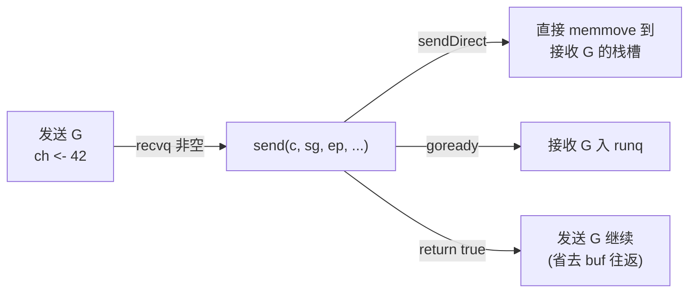

# 第八章 · channel 结构与发送/接收

> 篇:第 2 篇 · channel:CSP 通信
> 主线呼应:第 1 篇我们把 GMP 调度器的发动机拆透了——一个就绪的 G 怎么被 `schedule` 取出来跑、找不到 G 时 M 怎么逐级让步。但那里始终回避了一类阻塞:`ch <- x` 和 `<-ch`。这两条语句天天写,可你知道一个 G 在 `ch <- x` 阻塞时到底发生了什么吗?它怎么从 `_Grunning` 变 `_Gwaiting`、谁把它从等待队列里捞出来、`close(ch)` 又怎么把所有等待者一次性叫醒?这一章钻进 [`chan.go`](../go/src/runtime/chan.go) 的 [`hchan`](../go/src/runtime/chan.go#L34) 结构和 `chansend`/`chanrecv`/`closechan` 三个函数,把 channel 这条"阻塞唤醒"主线上的关键驿站拆透。它服务二分法的**阻塞唤醒**这一面——但和 netpoll 不同的是,channel 的等待者唤醒**完全靠别的 G 主动来"完成"操作**(发送方唤醒接收方、接收方唤醒发送方、`close` 一次性唤醒所有),调度器只在 `goready` 那一刻介入。

## 核心问题

**`hchan` 的结构是什么(环形缓冲 buf + 等待队列 sendq/recvq + 锁)?发送/接收的快路径(直接拷贝、绕过 buf)、慢路径(阻塞入队、被唤醒)分别怎么走?`close` 怎么把所有等待者一次性叫醒,等待者又怎么知道自己是被"正常完成"还是"被关闭"叫醒的?**

读完本章你会明白:

1. `hchan` 长什么样:为什么是"环形数组 + 两个 FIFO 等待队列 + 一把锁"这个组合,每个字段为什么这么排。
2. 一次 `ch <- x` 的三条路径:快路径(有 buf 且未满,直接写环形 buf)、零拷贝快路径(buf 空但有等待的接收者,直接拷给对方)、慢路径(阻塞入 sendq、被接收方/`close` 唤醒)。为什么 Go 要设计"零拷贝快路径"。
3. `<-ch` 与发送对称,但有一个**关键不对称**:接收方还能从"已关闭的 channel"读到零值,而发送方对已关闭 channel 发送会 panic。
4. `close` 的传播:它怎么把 recvq 和 sendq 里的等待者一次性收割、为什么唤醒要"先攒到 glist 再统一 `goready`"、等待者被唤醒后怎么靠 `sudog.success` 区分"收到了值"还是"channel 关了"。
5. channel 与调度器的握手:`gopark(chanparkcommit, ...)` + `goready` 这对函数怎么把一个 G 从运行态塞进等待队列、又怎么把它捞回 runq;`parkingOnChan` 这个标志凭什么能和栈拷贝(第 17 章)不冲突。

> 逃生阀:`chansend` 和 `chanrecv` 各 100 多行,初看像两段冗长的 if-else。别慌——只要抓住**三态**:有 buf 还是无 buf、有没有等待的对端、buf 满不满/空不空,整段代码就是"按态分流"。本章按"结构 → 发送三态 → 接收三态 → close"的顺序,每条路径配真实源码,最后单独拆两个最硬核的技巧:零拷贝快路径为什么 sound(直接写别人的栈)、快路径无锁检查的内存序推理。

---

## 8.1 一句话点破

> **channel 不是"队列",而是"队列 + 两队等不到的人 + 一把锁"。Go 把一次发送/接收分成三档:能进 buf 就进 buf(最快)、有等着的对端就直接把数据塞给对方省一次 buf 往返(更快)、都不行就把自己挂进等待队列让别人来完成操作(最慢但永不丢)。`close` 不是"清空",而是"把所有等的人一次性叫醒,告诉他们:别等了"。**

这是结论,不是理由。本章倒过来拆:先看 `hchan` 这五个字段为什么够用,再看一次 `ch <- x` 在三种情况下分别走哪条路,然后看 `<-ch` 的对称与不对称,最后看 `close` 怎么传播、等待者怎么自检。

---

## 8.2 `hchan`:一个结构装下"队列 + 等待者 + 锁"

打开 [`chan.go`](../go/src/runtime/chan.go),channel 的真身是这个结构体:

```go
// src/runtime/chan.go#L34-L55
type hchan struct {
    qcount   uint           // total data in the queue
    dataqsiz uint           // size of the circular queue
    buf      unsafe.Pointer // points to an array of dataqsiz elements
    elemsize uint16
    closed   uint32
    timer    *timer          // timer feeding this chan
    elemtype *_type          // element type
    sendx    uint            // send index
    recvx    uint            // receive index
    recvq    waitq           // list of recv waiters
    sendq    waitq           // list of send waiters
    bubble   *synctestBubble
    // lock protects all fields in hchan, as well as several
    // fields in sudogs blocked on this channel.
    lock mutex
}

type waitq struct {
    first *sudog
    last  *sudog
}
```

把字段分成三组来看:

```
                  hchan(以 make(chan int, 4) 为例)
  ┌──────────────────────────────────────────────────────┐
  │ 第一组:环形缓冲(只有 buffered chan 才用)           │
  │   dataqsiz = 4   elemsize = 8   elemtype = int       │
  │   buf ──→ [  ][  ][  ][  ]   (unsafe.Pointer 指数组) │
  │   sendx = 0          recvx = 0      qcount = 0       │
  ├──────────────────────────────────────────────────────┤
  │ 第二组:两个等待队列(FIFO,sudog 链表)              │
  │   recvq: first ──→ sg ──→ sg ──→ nil   (等收的人)   │
  │   sendq: first ──→ sg ──→ nil            (等发的人)  │
  ├──────────────────────────────────────────────────────┤
  │ 第三组:状态 + 锁                                     │
  │   closed = 0/1   lock mutex                          │
  └──────────────────────────────────────────────────────┘
```

### 三个不变式:channel 一切正确性的根

`chan.go` 文件开头([chan.go#L9-L18](../go/src/runtime/chan.go#L9))用注释钉死了三条不变式,整段代码的 sound 全靠它们:

```
1. c.sendq 和 c.recvq 至少有一个为空
   (唯一例外:无缓冲 channel 上 select 同一个 G 既等发又等收)
2. 对 buffered channel:c.qcount > 0 蕴含 c.recvq 为空
   (有数据就不会有人阻塞在 recv)
3. 对 buffered channel:c.qcount < c.dataqsiz 蕴含 c.sendq 为空
   (没满就不会有人阻塞在 send)
```

> **不这样会怎样**:如果"buf 里有数据同时 recvq 不空",那就出现了一个矛盾——buf 里那个数据本该立刻被某个等收的人拿走,它凭什么还在 buf 里?channel 的所有路径,要么在进入"入队等待"前先查 buf,要么在"操作 buf"前先查等待队列,**目的就是永远不破坏这三条不变式**。读后面所有源码时,把这三条贴在脑门上。

### 为什么是"环形数组"而不是链表

`buf` 是一个 `dataqsiz` 大小的环形数组,`sendx`/`recvx` 是写/读游标,到顶回绕(`if c.sendx == c.dataqsiz { c.sendx = 0 }`)。

> **所以这样设计**:环形数组比链表省两次内存分配(每条元素一个节点)、缓存友好(连续内存)、游标只需一个原子加(虽然这里加锁了)。链表的好处是"动态扩容",而 channel 的容量是 `make(chan T, N)` 时定死的、永不变,所以环形数组的最优性质全占了。这是 Go 在数据结构层面"为容量固定通信"量身定做的选择。

### `buf` 的内存怎么分配:三种情况

[`makechan`](../go/src/runtime/chan.go#L75) 根据"元素大小 + 是否含指针 + 容量"分三种姿势分配:

```go
// src/runtime/chan.go#L96-L111(节选)
switch {
case mem == 0:
    // 无缓冲 channel(size==0 或 elem 大小为 0):只分配 hchan
    c = (*hchan)(mallocgc(hchanSize, nil, true))
    c.buf = c.raceaddr()
case !elem.Pointers():
    // 元素不含指针(如 chan int):hchan 和 buf 一次 mallocgc,连续摆放
    c = (*hchan)(mallocgc(hchanSize+mem, nil, true))
    c.buf = add(unsafe.Pointer(c), hchanSize)
default:
    // 元素含指针:hchan 单独 new,buf 单独 mallocgc(让 GC 知道 buf 里有指针)
    c = new(hchan)
    c.buf = mallocgc(mem, elem, true)
}
```

这里有个**为 GC 而做的精妙选择**:

- **元素不含指针**(如 `chan int`):`hchan` 和 `buf` **一次 `mallocgc` 拿到一块连续内存**,`buf = add(c, hchanSize)` 直接指到 hchan 之后。为什么能这样?因为 buf 里全是 `int` 这种非指针数据,GC 根本不需要扫它,把它和 hchan 拼成一块**省一次分配、提升局部性**。
- **元素含指针**(如 `chan *Foo`):必须 `buf = mallocgc(mem, elem, true)`,**让分配器知道这块 buf 里有指针**,GC 才会去扫 buf 里每个槽的指针。如果沿用前一种"拼一块但 `nil` no-scan",GC 就会漏扫 buf 里的活指针,误回收还在 channel 里排队传送的对象——这就是经典的"漏标"。

> **钉死这件事**:channel 的 `buf` 分配不是"通用 malloc",而是**按元素类型分支**:无指针省一次分配(连续摆),有指针必须独立分配(让 GC 扫到)。这是 channel 与 GC 的第一个握手点,第 13 章讲三色标记时还会回来。

---

## 8.3 一次 `ch <- x` 的三条路径

[`chansend`](../go/src/runtime/chan.go#L176) 是 `ch <- x` 编译后的真身(`chansend1` 是 entry point,转调 `chansend`)。它按顺序走三条路径,**逐条短路**:有等待的接收者 → 写 buf → 阻塞。我们逐条拆。

### 8.3.1 路径一:无锁快检查(只对非阻塞 select 有效)

```go
// src/runtime/chan.go#L197-L215
// Fast path: check for failed non-blocking operation without acquiring the lock.
if !block && c.closed == 0 && full(c) {
    return false
}
```

这是**给 `select` 的非阻塞发送**(`case ch <- x:` 里那条)的优化:在加锁之前,先用两个单字读(`c.closed` 和 `full(c)`)判断"这次发送注定失败"——如果 channel 没关、且满了,直接返回 false,**省一次加锁**。注释([chan.go#L197-L212](../go/src/runtime/chan.go#L197))对这段为什么 sound 做了完整的内存序推理,我们在 8.6.2 技巧精解里专门拆。

> **所以这样设计**:`select` 里的非阻塞 case 在 hot loop 里会反复试探,如果每次都加锁 → 发现满 → 解锁,锁竞争会把多核 select 拖垮。无锁快检查让"注定失败"的分支在纳秒级返回,只在"有可能成功"时才付加锁代价。

### 8.3.2 路径二:有等待的接收者,直接拷贝给他(零拷贝快路径)

加锁后,`chansend` 第一件事不是看 buf,而是看 `recvq`:

```go
// src/runtime/chan.go#L229-L234
if sg := c.recvq.dequeue(); sg != nil {
    // Found a waiting receiver. We pass the value we want to send
    // directly to the receiver, bypassing the channel buffer (if any).
    send(c, sg, ep, func() { unlock(&c.lock) }, 3)
    return true
}
```

这是 channel **最反直觉也最精彩**的一条路径。设想一个无缓冲 channel `make(chan int)`,接收方 G 先到、阻塞了(它把自己挂进 recvq,栈上 `mysg.elem` 指着接收变量)。这时发送方 G 来了,它**根本不碰 buf**(无缓冲本来也没 buf),而是:

1. 把自己要发的数据,直接 `memmove` 到接收方那个 sudog 指着的栈槽里(见 [`sendDirect`](../go/src/runtime/chan.go#L392));
2. 把接收方 G 从 recvq 里摘掉,调 `goready(recvG)` 把它丢回 runq;
3. 自己解锁返回 `true`,操作完成。



> **不这样会怎样**:如果无缓冲 channel 也走"先入 buf 再让对方收"的路径,那无缓冲 channel 根本没有 buf,这条路径就退化为"找不到地方放数据,自己阻塞"。但**实际上无缓冲 channel 的语义是"同步握手"**——发送方和接收方必须同时在场。让它们直接交换数据,既符合语义,又省了一次"入 buf → 出 buf"的内存往返。这是 channel 性能的关键来源之一。

对 **buffered channel 且 buf 满**的情况也走这条路径:接收方在等(因为 buf 空?不,因为 buf 满所以接收方早就被前者取走了——见不变式 3:满才有 sendq 等待者,空才有 recvq 等待者)。等等,这里要分清方向:**发送方查 recvq**——recvq 里是"等收的人",他们等是因为 buf 空。如果 buf 空,recvq 才非空。所以这条路径触发条件是"buf 空 + 有人等收",此时哪怕 channel 是 buffered 的,也直接把数据给等待者,**不先进 buf**。注释里的 "bypassing the channel buffer (if any)" 就是这意思。

`send` 函数本身([chan.go#L318](../go/src/runtime/chan.go#L318))很短,核心是 `sendDirect` + `goready`:

```go
// src/runtime/chan.go#L339-L350(节选)
if sg.elem.get() != nil {
    sendDirect(c.elemtype, sg, ep)   // 把 ep 拷到 sg.elem(别人的栈)
    sg.elem.set(nil)
}
gp := sg.g
unlockf()                              // 解锁(传入的闭包)
gp.param = unsafe.Pointer(sg)          // 告诉对方"是叫醒你的"
sg.success = true                       // 告诉对方"是收到了值,不是被关了"
...
goready(gp, skip+1)                     // 把接收 G 丢回 runq
```

`sendDirect` 直接写**另一个 G 的栈**,这是 channel 唯一一处"一个 G 写另一个 G 的栈"的地方,它在 GC 和栈拷贝面前必须 sound——这部分我们在 8.6.1 技巧精解里专门拆。

### 8.3.3 路径三:buf 没满,写进 buf

```go
// src/runtime/chan.go#L236-L250
if c.qcount < c.dataqsiz {
    // Space is available in the channel buffer. Enqueue the element to send.
    qp := chanbuf(c, c.sendx)
    ...
    typedmemmove(c.elemtype, qp, ep)   // 把 ep 拷到 buf[sendx]
    c.sendx++
    if c.sendx == c.dataqsiz {
        c.sendx = 0                    // 环形回绕
    }
    c.qcount++
    unlock(&c.lock)
    return true
}
```

这条最朴素:buf 没满,`typedmemmove` 把数据拷进 `buf[sendx]`,推进 `sendx`,环形回绕,解锁返回。这是 buffered channel 在稳态下的高频路径,开销就是一次加锁 + 一次类型化 `memmove`(带写屏障,如果元素含指针)。

### 8.3.4 路径四:都失败,把自己挂进 sendq(慢路径)

```go
// src/runtime/chan.go#L258-L309(节选)
gp := getg()
mysg := acquireSudog()                  // 从 sudog 池领一个等待块
...
mysg.elem.set(ep)                       // 记下"我要发的数据在这"
mysg.waitlink = nil
mysg.g = gp                             // 记下"我是谁"
mysg.isSelect = false
mysg.c.set(c)                           // 记下"我在等这个 chan"
gp.waiting = mysg                       // G 也反向记下 sudog(给 GC/栈拷贝用)
gp.param = nil
c.sendq.enqueue(mysg)                   // 进 sendq 队尾

gp.parkingOnChan.Store(true)            // 协调栈缩:我马上要 park 了
gopark(chanparkcommit, unsafe.Pointer(&c.lock), reason, traceBlockChanSend, 2)
KeepAlive(ep)                           // 保活发送数据直到接收方拷走
```

前三条都走不通(buf 满 + recvq 空),发送方只能**把自己挂起**。关键步骤:

1. **`acquireSudog()`**:领一个等待块。sudog 是 G 在等待时的"代理名片",一个 G 可能同时等在多个 channel 上(select),所以**一个 G 可以有多个 sudog**(见 [runtime2.go#L397-L401](../go/src/runtime/runtime2.go#L397) 的注释)。sudog 从池里分配(避免每次 channel 操作都 malloc)。
2. **填字段**:`mysg.elem` 记下数据地址(让将来的接收方/`close` 能找到数据拷贝或清零);`mysg.g = gp` 让对方能叫醒自己;`mysg.c` 反向记录。
3. **入队 + park**:`c.sendq.enqueue(mysg)` 把自己挂进队尾,然后 `gopark(chanparkcommit, ...)`。`gopark` 会把当前 G 的状态从 `_Grunning` 改成 `_Gwaiting`,切回 g0 调度别的 G(第 3 章讲的 `mcall`/`schedule` 在这里启动)。从这一刻起,这个 G 就"睡"在 sendq 里了。
4. **`KeepAlive(ep)`**:`mysg.elem` 指着 ep(可能就在发送 G 的栈上),但 sudog **不是 GC 的根**(注释 [chan.go#L284-L288](../go/src/runtime/chan.go#L284) 明说),所以必须显式 `KeepAlive` 保活,防止栈上 ep 在接收方还没拷走前就被回收。这是 channel 与 GC 的第二个握手点。

### 8.3.5 唤醒后:谁把我叫醒?是正常完成还是被关了?

park 之后,G 会被三种情况叫醒:**接收方来了**(走 8.4.2 的 `recv` 路径,把数据拷走)、**另一个接收方来了**(同上)、**`close` 来了**(走 8.5,把等待者全部收割)。叫醒你的那个人会在你被摘出 sendq 时设 `mysg.success`:收到值 `true`,被关 `false`。醒来后这段代码:

```go
// src/runtime/chan.go#L290-L308(节选)
// someone woke us up.
if mysg != gp.waiting {
    throw("G waiting list is corrupted")   // sanity 检查
}
gp.waiting = nil
gp.activeStackChans = false
closed := !mysg.success                     // 关键:success=false 表示被 close
gp.param = nil
...
mysg.c.set(nil)
releaseSudog(mysg)                           // sudog 还回池
if closed {
    if c.closed == 0 {
        throw("chansend: spurious wakeup")  // 不可能
    }
    panic(plainError("send on closed channel"))   // 对已关闭 channel 发送 → panic
}
return true
```

> **钉死这件事**:Go channel 的"`send on closed channel` panic"不是在 `close` 那一刻对所有等待发送者抛出,而是**让每个等待发送者被 close 叫醒后,自己 panic**。这是个分布式善后:close 只负责"标记 closed + 把所有等待者丢回 runq",panic 的判断延迟到每个 G 自己醒来。为什么?因为如果在 `close` 里直接 panic,那 close 的调用方就背锅了——但 Go 语义规定**每个等待发送者各自 panic**,各自有自己的栈和 panic 链。这是 Go 把"善后"摊给被影响方的典型设计。

---

## 8.4 `<-ch`:接收的对称与一个关键不对称

[`chanrecv`](../go/src/runtime/chan.go#L524) 是 `<-ch` 编译后的真身。它的路径结构与 `chansend` **高度对称**,但有一处**关键不对称**:接收方对**已关闭的 channel** 不 panic,而是读到零值。

### 8.4.1 路径一:无锁快检查(非阻塞)

```go
// src/runtime/chan.go#L548-L579
if !block && empty(c) {
    if atomic.Load(&c.closed) == 0 {
        return                  // 没关 + 空,直接返回 (false, false)
    }
    if empty(c) {               // 关了 + 再查一次空
        ...
        return true, false      // 关了 + 空,返回 (true, false):收到零值
    }
}
```

注意这里**两次 `empty` + 一次 `atomic.Load(&c.closed)`** 的顺序极其讲究,注释([chan.go#L550-L558](../go/src/runtime/chan.go#L550))说:"Reordering of these checks could lead to incorrect behavior when racing with a close."——如果先读 `closed` 再读 `empty`,会撞上一个竞态:channel 在两次读之间被关闭并清空,你看到"开了 + 空"以为是"还没关",其实已经关了。所以**先 `empty` 后 `closed` 再 `empty`**,且都用 atomic,详见 8.6.2 技巧精解。

### 8.4.2 路径二:有等待的发送者,从它手里拿(对称于 send 的零拷贝)

```go
// src/runtime/chan.go#L602-L609
if sg := c.sendq.dequeue(); sg != nil {
    // Found a waiting sender. If buffer is size 0, receive value
    // directly from sender. Otherwise, receive from head of queue
    // and add sender's value to the tail of the queue (both map to
    // the same buffer slot because the queue is full).
    recv(c, sg, ep, func() { unlock(&c.lock) }, 3)
    return true, true
}
```

这里要分两种情况,看 channel 是不是 buffered:

**无缓冲 channel**:sendq 里有等待的发送者(它的数据在它自己栈上 `mysg.elem`)。`recv` 调 [`recvDirect`](../go/src/runtime/chan.go#L405) 直接从发送者栈 `memmove` 到接收者的 ep,然后 `goready` 唤醒发送者。和 send 的零拷贝完全镜像。

**buffered channel 且 buf 满**:这种情况 sendq 才非空(不变式 3)。`recv`([chan.go#L702](../go/src/runtime/chan.go#L702))做一件巧妙的事:

```go
// src/runtime/chan.go#L715-L735(节选,buffered 且满的情况)
} else {
    // Queue is full. Take the item at the head of the queue.
    qp := chanbuf(c, c.recvx)
    ...
    // copy data from queue to receiver
    typedmemmove(c.elemtype, ep, qp)            // 把 buf 头给接收者
    // copy data from sender to queue
    typedmemmove(c.elemtype, qp, sg.elem.get()) // 把发送者数据塞进 buf 尾
    c.recvx++
    ...
    c.sendx = c.recvx                            // 满了,头尾重合
}
```

注意:buf 满时,**头槽(`recvx`)和"发送者要写入的位置"是同一个槽**。所以"把 buf 头给接收者" + "把发送者数据塞进 buf"这两步,**写在同一个 `qp` 上**:接收者先拿走头槽数据,发送者数据立刻填进这个刚空出来的头槽(此时它就变成了尾,因为 buf 满且环形)。这一步同时完成了"接收一个 + 给等待的发送者腾位置 + 唤醒发送者",**一次锁里干完三件事**。

> **所以这样设计**:为什么不让发送者先进 buf、接收者再从 buf 拿?那需要两次锁(发送者进队要锁、接收者取要锁)。这里**接收方作为"代办人",一手收一手发**,在持锁状态下把两个操作合并,只锁一次。这就是 channel 高吞吐的来源:锁的粒度对齐到"一次完整握手",而不是"一次入队/出队"。

### 8.4.3 路径三:buf 有数据,从 buf 读

```go
// src/runtime/chan.go#L612-L629
if c.qcount > 0 {
    qp := chanbuf(c, c.recvx)
    ...
    if ep != nil {
        typedmemmove(c.elemtype, ep, qp)    // 拷出
    }
    typedmemclr(c.elemtype, qp)              // 清槽(帮 GC)
    c.recvx++
    if c.recvx == c.dataqsiz {
        c.recvx = 0
    }
    c.qcount--
    unlock(&c.lock)
    return true, true
}
```

对称于 send 的"写 buf",这里"读 buf + 清槽"。`typedmemclr` 把刚读走的槽清零,**不仅是整洁,更是帮 GC**:如果不清零,GC 扫 buf 时还会以为这个槽里有个活指针(对 `chan *Foo` 而言),误保活一个本该回收的对象。这是 channel 与 GC 的第三个握手点。

### 8.4.4 路径四:buf 空,把自己挂进 recvq(慢路径)

```go
// src/runtime/chan.go#L636-L685(节选)
gp := getg()
mysg := acquireSudog()
...
mysg.elem.set(ep)            // 记下"数据写到这里"
mysg.waitlink = nil
gp.waiting = mysg
mysg.g = gp
mysg.isSelect = false
mysg.c.set(c)
gp.param = nil
c.recvq.enqueue(mysg)
...
gp.parkingOnChan.Store(true)
gopark(chanparkcommit, unsafe.Pointer(&c.lock), reason, traceBlockChanRecv, 2)
```

和 send 的慢路径**完全对称**,只是挂的是 recvq 而非 sendq。醒来后:

```go
// src/runtime/chan.go#L669-L685(节选)
success := mysg.success     // true=收到了值, false=被 close
...
return true, success
```

注意接收方醒来**不 panic**:即使是被 close 叫醒(`success=false`),也正常返回 `(true, false)`——这就是"`<-ch` 从已关闭 channel 读到零值"的实现。`success=false` 时上层(ep 指向的变量)要么已经被 `close` 路径清零(见 8.5),要么保持零值,所以读到的就是零值。

### 8.4.5 关键不对称:为什么接收不 panic

把 send 和 recv 的"被 close 叫醒"对比一下:

| | 发送方被 close 叫醒 | 接收方被 close 叫醒 |
|---|---|---|
| `mysg.success` | `false` | `false` |
| 醒来后行为 | `panic("send on closed channel")` | `return (true, false)`(读到零值) |
| 语义理由 | 向已关闭 channel 发送 = 程序错误 | 从已关闭 channel 接收 = 正常(读到剩余数据,再读到零值) |

> **不这样会怎样**:如果接收已关闭 channel 也 panic,那"用 close 通知所有消费者退出"这种 Go 惯用法(`for x := range ch`)就写不出来——range 循环必须在 channel 关闭且排空后**优雅返回**而非 panic。Go 选择"发送 panic、接收优雅"这条不对称,正是为了让 close 成为一种**广播信号**。

---

## 8.5 `close`:把所有等待者一次性叫醒

[`closechan`](../go/src/runtime/chan.go#L414) 干三件事:标记 closed、把 recvq 和 sendq 的等待者全收割、统一唤醒。

```go
// src/runtime/chan.go#L422-L434
lock(&c.lock)
if c.closed != 0 {
    unlock(&c.lock)
    panic(plainError("close of closed channel"))   // 重复 close → panic
}
...
c.closed = 1
```

第一步是**双重关闭检查**(对 nil channel 直接 panic,对已关闭 channel panic)。然后置 `c.closed = 1`。

### 8.5.1 收割 recvq:给它们零值

```go
// src/runtime/chan.go#L438-L458
var glist gList
// release all readers
for {
    sg := c.recvq.dequeue()
    if sg == nil { break }
    if sg.elem.get() != nil {
        typedmemclr(c.elemtype, sg.elem.get())   // 把接收变量的槽清零
        sg.elem.set(nil)
    }
    ...
    gp := sg.g
    gp.param = unsafe.Pointer(sg)
    sg.success = false                             // 告诉它们:被 close 叫醒
    ...
    glist.push(gp)
}
```

recvq 里每个等待者都"挂着一个 ep 槽等着收数据"。close 把这些 ep 槽**全部清零**(这就是"从已关闭 channel 读到零值"的物理来源),然后 `sg.success = false` 标记,推进 `glist`。

### 8.5.2 收割 sendq:它们醒来会 panic

```go
// src/runtime/chan.go#L460-L477
// release all writers (they will panic)
for {
    sg := c.sendq.dequeue()
    if sg == nil { break }
    sg.elem.set(nil)
    ...
    gp := sg.g
    gp.param = unsafe.Pointer(sg)
    sg.success = false                             // 同样 false,但醒来会 panic
    ...
    glist.push(gp)
}
```

sendq 里的等待者也被收割,`success = false`。它们醒来后(见 8.3.5)会走 `if closed { panic(...) }` 分支。

### 8.5.3 先攒后醒:为什么用 glist

```go
// src/runtime/chan.go#L478-L485
unlock(&c.lock)

// Ready all Gs now that we've dropped the channel lock.
for !glist.empty() {
    gp := glist.pop()
    gp.schedlink = 0
    goready(gp, 3)
}
```

**关键技巧**:先把所有等待者攒进 `glist`,**解锁之后**再统一 `goready`。

> **不这样会怎样**:如果在持锁状态下逐个 `goready`,而 `goready` 会触发被唤醒 G 的状态切换(`_Gwaiting` → `_Grunnable`)、可能调 `wakep`、可能撞上栈拷贝协议(被唤醒的 G 如果同时被另一个线程尝试缩栈,需要协调)。注释([chan.go#L52-L53](../go/src/runtime/chan.go#L52))明说:"Do not change another G's status while holding this lock ... as this can deadlock with stack shrinking." —— **持锁状态下改别人 G 的状态会和栈缩死锁**。所以必须先解锁再唤醒。`glist` 是个 per-call 的栈上链表(`gList` 用 `g.schedlink` 串起来),攒一批、解锁、批量 `goready`,把锁持有时间和唤醒操作解耦。

> **钉死这件事**:`close` 的实现揭示了一条 channel 的硬约束——**持 `hchan.lock` 时不能改别的 G 的状态**(不能 `goready`、不能 `casgstatus`)。这条约束的根在栈管理(第 17 章):栈拷贝/缩栈时要锁所有"该 G 阻塞在其上的 channel",如果此时 channel 锁被持有,就会死锁。`glist + 解锁后唤醒`是这条约束的直接工程后果。

---

## 8.6 技巧精解:两个最硬核的 sound 论证

channel 的两段"看起来危险但必须 sound"的代码,值得单独拆透。

### 技巧一:`sendDirect` 直接写别人的栈,凭什么不踩 GC

无缓冲 channel 的零拷贝快路径(8.3.2)和 buffered channel 满时的接收(8.4.2),都涉及**一个 G 直接 `memmove` 到另一个 G 的栈**。这在 Go 里是**唯一一处**跨 G 写栈的地方,极其危险——Go 的 GC 假设"栈写只发生在 G 自己运行时、由 G 自己做",跨 G 写栈直接违反这条假设。看 [`sendDirect`](../go/src/runtime/chan.go#L392) 怎么 sound:

```go
// src/runtime/chan.go#L382-L403(注释是关键)
// Sends and receives on unbuffered or empty-buffered channels are the
// only operations where one running goroutine writes to the stack of
// another running goroutine. The GC assumes that stack writes only
// happen when the goroutine is running and are only done by that
// goroutine. Using a write barrier is sufficient to make up for
// violating that assumption, but the write barrier has to work.
// typedmemmove will call bulkBarrierPreWrite, but the target bytes
// are not in the heap, so that will not help. We arrange to call
// memmove and typeBitsBulkBarrier instead.

func sendDirect(t *_type, sg *sudog, src unsafe.Pointer) {
    // src is on our stack, dst is a slot on another stack.
    dst := sg.elem.get()
    typeBitsBulkBarrier(t, uintptr(dst), uintptr(src), t.Size_)
    memmove(dst, src, t.Size_)
}
```

这段注释是 Go runtime 的经典注释之一,逐句拆:

1. **危险在哪**:GC 假设"栈上的指针写入只由 G 自己在运行时做"。GC 扫栈时,会按"栈当前快照"追踪指针。如果 A 在 GC 扫描 B 的栈时,往 B 栈写了一个新指针,GC 可能扫不到(漏标活对象)。
2. **为什么普通写屏障不够**:`typedmemmove` 内部调 `bulkBarrierPreWrite`,但**这个写屏障是为堆设计的**——它会查目标地址在哪个堆 span 里,目标在栈上时写屏障逻辑对不上。
3. **所以用 `typeBitsBulkBarrier` + `memmove`**:`typeBitsBulkBarrier` 直接按**类型信息**(`t` 的 bitmap)对 `[dst, dst+size)` 和 `[src, src+size)` 两段内存**同时打屏障**——不管它们在堆还是栈,按类型的指针 bitmap 逐位标记。这样 GC 能看到这次跨栈拷贝里的指针变更。

> **反面对比**:如果朴素地写 `memmove(dst, src, size)` 不带屏障,设想 `chan *Foo`,A 把一个新 `*Foo` 拷进 B 的栈槽——B 此刻在 `_Gwaiting`(park 了),GC 正在扫 B 的栈,只看到旧指针(可能已失效)。新指针指向的 `Foo` 会被误回收,B 醒来后栈上那个指针成了悬垂指针,一解引用就段错误。`typeBitsBulkBarrier` 把这次跨栈拷贝"广播"给 GC,堵住了漏标。

还有一个配套机制——`gp.parkingOnChan` 和 `gp.activeStackChans`(见 [chan.go#L748-L759](../go/src/runtime/chan.go#L748) 的 `chanparkcommit`):**park 之前**置 `parkingOnChan=true`,park commit 时置 `activeStackChans=true`、再清 `parkingOnChan`。这两个标志告诉"想缩这个 G 栈的线程":"这个 G 的栈上有 sudog 指着别的 channel,**缩栈时要锁那些 channel**"。这是 channel 与第 17 章栈拷贝的握手:跨 G 写栈的存在,逼迫栈拷贝协议变得更复杂——必须锁住所有相关 channel 才能安全移动栈。

### 技巧二:无锁快检查的内存序推理——凭什么不漏判 closed

8.3.1 和 8.4.1 那两段"加锁前先无锁检查"的代码,看似简单(`if !block && c.closed == 0 && full(c) return false`),实则注释写了整整 16 行论证它 sound。我们拆这段推理。

**问题**:发送方在加锁前读 `c.closed` 和 `full(c)`(后者读 `c.qcount` 或 `c.recvq.first`)。这两个读**没有任何同步**,CPU/编译器可能重排,channel 可能在两次读之间被关闭/操作。凭什么"读到没关 + 满"就能安全返回 false?

**论证**(对应注释 [chan.go#L197-L212](../go/src/runtime/chan.go#L197)):

关键观察:**一个已关闭的 channel 永远不会从"可发送"变"不可发送"**——close 是单向的,关了就关了。所以:

- 我们先读 `c.closed == 0`(没关),再读 `full(c)`(满)。
- 即使两次读之间 channel 被关闭了,**在第一次读 `c.closed` 那一刻,channel 确实没关**;在第二次读 `full` 那一刻,channel 确实满了。**两次观察之间必然存在一个时刻:既没关又满了**(因为"没关→关"和"不满→满"都是状态变化,任意两个状态变化之间存在中间态)。
- 我们就**假装在那个中间态观察到 channel**,返回 false(这次发送失败)。

**反过来读序也行**:注释说"It is okay if the reads are reordered here"——先读 `full`(满)再读 `closed`(没关),也能推出"存在一个时刻既没关又不满"。所以读序不重要,只要有两次独立观察,就能锚定一个"过去某时刻的一致快照"。

> **不这样会怎样**:如果只读一个字(比如只读 `closed`,不读 `full`),那"没关"并不蕴含"能发"——可能没关但满了。所以必须两个读。如果两个读之间没有这个"单向状态机"的性质(比如 channel 可重开),那两次独立观察就锚不定一致快照,推理失效。channel 的"close 单向"是这个无锁优化的**正确性基石**。

**注意一个 forward progress 限制**:这段无锁检查只是**优化**,不保证 forward progress——它可能在 channel 一直满时反复返回 false(对非阻塞 select 来说没事,本就该返回 default)。真正保证 forward progress 的是后续加锁路径:加锁后 `chansend` 会阻塞(对阻塞发送)或返回(对非阻塞),持锁状态下读到的状态是一致的。

> **钉死这件事**:这段 16 行注释是 Go runtime 里**最精妙的内存序推理之一**。它不依赖任何屏障(两次普通读 + 状态机单向性),就推出"无锁快检查 sound"。这种"靠状态机性质而非屏障"的推理,是 channel 在 hot path 上做到几乎无开销的关键。

---

## ★ 双璧对照《Tokio》

Go channel 和 Tokio 的 `mpsc`/`oneshot`/`broadcast` 解决同一个问题——**跨异步单元传值**——但姿势截然不同:

| 维度 | Go channel | Tokio channel |
|---|---|---|
| 阻塞语义 | `ch <- x` 阻塞当前 G(runtime 让出线程) | `tx.send(x).await` 显式 await,Future 返回 Pending |
| 等待怎么表达 | 隐式:G 被 park 进 sendq/recvq | 显式:`Sender`/`Receiver` 是 Future,poll 时存 Waker |
| 唤醒机制 | `goready` 把 G 丢回 runq | 调度器 poll 时唤醒 task |
| 缓冲实现 | 环形数组 + 一把锁 | `mpsc` 是无锁链表/块链;`broadcast` 是环形 slab + 读指针 |
| CSP vs Actor | CSP(显式 channel,不绑 endpoint) | 偏 Actor/Future(endpoint 有所有权) |

核心差异:Go channel 是**同步阻塞 API + runtime 替你让出**(你写 `ch <- x` 像 blocking call,但 runtime 偷偷 park 了 G);Tokio channel 是**显式 async**(你必须 `.await`,编译器把整个调用编成状态机)。Go 的好处是"写起来像顺序代码",Tokio 的好处是"取消/超时/组合靠 Future 组合子,显式且零成本"。两者都是各自语言哲学的极致体现。

---

## 章末小结

这一章把 channel 的"结构 + 三态收发 + close 传播"拆透了。回到二分法,channel 服务**阻塞唤醒**这一面——但它和 netpoll/sysmon 不同:netpoll 的唤醒靠 epoll 事件(被动等内核),channel 的唤醒靠**别的 G 主动来完成操作**(发送方唤醒接收方、`close` 一次性唤醒所有)。调度器只在 `gopark`/`goready` 那一刻介入,channel 的核心逻辑(入队、出队、零拷贝、close 收割)全在持 `hchan.lock` 的临界区里完成。channel 是"阻塞唤醒"里最依赖**调度器协作**的一个——它把等待者管理交给了自己的队列,但等待者的 park/ready 交给了第 1 篇的 GMP。

### 五个"为什么"清单

1. **为什么 channel 是"环形 buf + 两个等待队列 + 一把锁",而不是单纯一个队列?** 单队列只能表达"有数据/没数据",表达不了"有等收的人/有等发的人"。两条等待队列(配合三条不变式)让 channel 的同步语义(无缓冲握手、buffered 缓冲、close 广播)用一套结构全表达;一把锁保证临界区里状态一致,简化了所有 sound 论证。

2. **为什么无缓冲 channel 要"直接拷给等待的接收者",不先进 buf?** 无缓冲 channel 没有 buf;且即使有 buf,buf 空时直接给等待者也省一次"入 buf → 出 buf"的内存往返。这条零拷贝快路径是 channel 高吞吐的关键,代价是必须处理"跨 G 写栈"的 GC sound 问题(`typeBitsBulkBarrier`)。

3. **为什么 buffered channel 满时,接收方要"一手收一手发"在同一个槽上?** 满时头尾重合,接收方从 buf 头拿一个、把等待发送者的数据塞进同一个槽(此时它变尾),一次锁内完成"接收 + 给发送者腾位 + 唤醒发送者"。锁粒度对齐到"一次完整握手",而非"一次入队/出队",吞吐最大化。

4. **为什么 `close` 要"先攒 glist 再解锁后唤醒"?** 持 `hchan.lock` 时不能改别的 G 的状态(`goready`/`casgstatus`),否则会和栈缩死锁(第 17 章)。`glist` 把等待者攒一批,解锁后批量 `goready`,把锁持有时间和唤醒操作解耦。这是 channel 与栈管理的握手协议。

5. **为什么"无锁快检查"(读 `closed` + `full`)不带屏障也 sound?** channel 的 close 是单向状态机(关了不会重开)。两次独立读即使被重排,也能锚定一个"过去某时刻既没关又满/空"的一致快照,假装在那个时刻观察。这种"靠状态机性质而非屏障"的推理,是 channel hot path 几乎无开销的关键。

### 想继续深入往哪钻

- **源码文件**:本章主战场 [`../go/src/runtime/chan.go`](../go/src/runtime/chan.go) 的 `hchan`@34 / `makechan`@75 / `full`@146 / `chansend`@176 / `send`@318 / `sendDirect`@392 / `closechan`@414 / `empty`@492 / `chanrecv`@524 / `recv`@702 / `recvDirect`@405 / `chanparkcommit`@748。sudog 结构 [`../go/src/runtime/runtime2.go`](../go/src/runtime/runtime2.go#L404) 的 `type sudog struct`@404。把 `chansend` 和 `chanrecv` 对照读,会发现它们是镜像的(查等待对端 → 操作 buf → 入队等待),只是不对称点在"close 后接收读零值、发送 panic"。
- **观测 channel**:用 `go tool trace` 打开 trace 文件,能看到每次 channel 阻塞/唤醒的事件(`chanSend`/`chanRecv` block reason)。`GODEBUG=schedtrace=1000` 不直接显示 channel,但能间接看到"很多 G 处于 `_Gwaiting`"——这些大概率在 channel/timer/Mutex 上等。对**死锁排查**,`pprof goroutine` + `runtime.Stack` 能打出所有 G 的栈,能看到哪个 G 卡在 `chansend`/`chanrecv`。
- **跨 G 写栈的 GC sound**:`sendDirect`/`recvDirect` 的注释([chan.go#L382-L403](../go/src/runtime/chan.go#L382))是 Go runtime 经典注释,反复读;配合 `typeBitsBulkBarrier` 的实现(`runtime/mbitmap.go`)理解"按类型 bitmap 跨堆栈打屏障"。`parkingOnChan`/`activeStackChans` 的引入见 [issue 47317](https://go.dev/issue/47317) 系列(栈缩与 channel 的死锁修复)。
- **延伸阅读**:Russ Cox 的"Go channels"设计笔记;Go 内存模型([go.dev/ref/mem](https://go.dev/ref/mem))对 channel 同步的正式定义("a send on a channel happens-before the corresponding receive completes")——本章的代码是这个 happens-before 的实现。
- **CSP 哲学**:channel 是 CSP(Communicating Sequential Processes)在 Go 里的落地。Tony Hoare 1985 年的 CSP 原著、Rob Pike 的 Newsqueak/Aleph 是思想源头;Go 把 CSP 内置成语言关键字(`chan`/`<-`/`range`),这是它区别于"靠库实现 channel"的语言(如 Rust)的根本。

### 引出下一章

这一章讲的是"单个 channel 的发送/接收"。但实际代码里到处是 `select { case ...: }`——在多个 channel 上"就绪一个就返回"。`select` 怎么在多个 channel 上公平地(不饿死任何一个)、不死锁地(多 G 同时 select 同一组 channel)挑出一个就绪 case?底层 [`selectgo`](../go/src/runtime/select.go) 的实现远比"循环试每个 case"复杂:它要乱序选 case(公平)、用 `sudog.isSelect` + `g.selectDone` 的 CAS 赢"唤醒竞态"、按地址排序加锁防死锁。下一章我们钻进 `selectgo`,把 select 的公平性与锁顺序拆透。

---

> 全书定位:第 8 章 / 第 2 篇 channel:CSP 通信。源码版本 Go 1.27(本地 master @ `6d1bcd10`,Version 常量见 `src/internal/goversion/goversion.go`)。下一章:P2-09 select 的实现。
