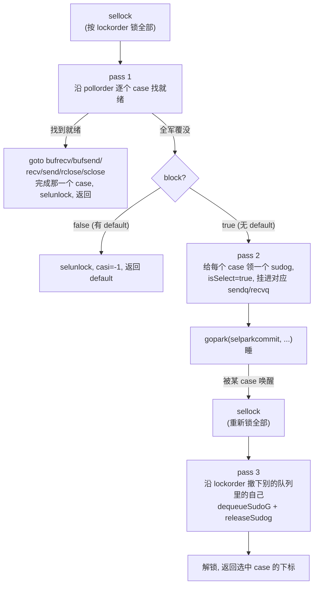
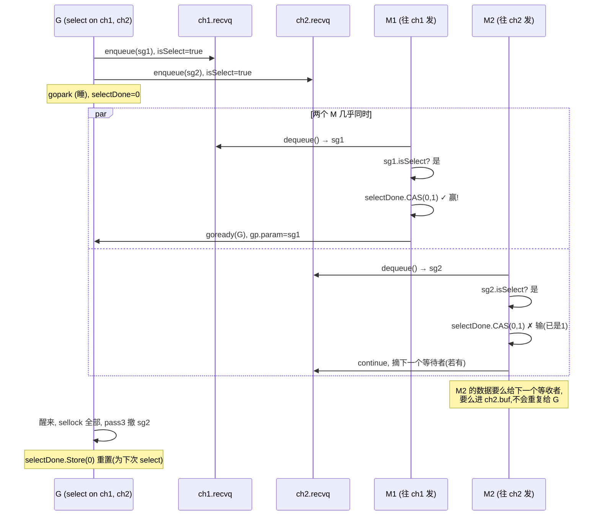

# 第九章 · select 的实现

> 篇:第 2 篇 · channel:CSP 通信
> 主线呼应:第 8 章我们把单个 channel 的发送/接收拆透了——环形 buf、两条等待队列、零拷贝快路径、`close` 的批量收割。但天天写的 Go 代码里,channel 极少单独出现,它几乎总是钻进一个 `select { case ...: }` 里:同时等好几个 channel,"谁先就绪就处理谁",再配一个 `default` 做非阻塞试探,或配一个 `time.After` 做超时。`select` 是 CSP 风格并发里"多路复用"的关键,可它底下的实现远比"循环试每个 case"复杂——它要在多个 channel 上**公平**地挑一个(不饿死任何一路)、在多个 goroutine 同时 select 同一组 channel 时**不死锁**、在多个 case 同时就绪时**恰好挑一个**完成、剩下的全部悄悄撤回。这一章钻进 [`select.go`](../go/src/runtime/select.go) 的 [`selectgo`](../go/src/runtime/select.go#L122),把 select 的三个招牌——**乱序轮询换公平、按地址排序加锁防死锁、`isSelect` + `selectDone` 的 CAS 赢"唤醒竞态"**——逐条拆透。它服务二分法的**调度执行**这一面(虽然 select 的结局是 park,但 selectgo 的核心是一场"持锁调度",主战场在加锁、轮询、入队、撤队的临界区编排上)。

## 核心问题

**`select` 怎么在多个 channel 上"公平地挑一个就绪 case 返回",同时保证多 goroutine 并发 select 同一组 channel 时不死锁、不重复唤醒、不漏接?nil channel 和 default 怎么处理?**

读完本章你会明白:

1. `selectgo` 的骨架:**乱序 pollorder**(Fisher-Yates 洗牌,**起点随机**)保证公平;**按 channel 地址排序 lockorder**(堆排序)保证加锁顺序一致、防死锁;两个数组各司其职。
2. select 的"三遍扫描":**pass 1**(持锁,按 pollorder 逐个 case 试就绪)→ **pass 2**(全军覆没就把自己挂进**每个** channel 的等待队列)→ park → 被**任意一个** case 唤醒 → **pass 3**(把自己从其余 channel 撤下来,这叫"select 的回滚")。
3. **唤醒竞态**:`select` 把同一个 G 的 sudog 挂进了多个 channel,于是**两个不同 channel 上的操作可能同时想唤醒它**。靠 `g.selectDone` 的 CAS(0→1)让"第一个赢的人"完成唤醒,"输的人"假装 dequeue 成功实则 `continue` 跳过——保证一个 select 只被完成一次。
4. nil channel 的处理:**pollorder 和 lockorder 都跳过 nil channel**(它永远不就绪),`default` 则是 `block=false` 时 pass 1 全空就立即返回 `casi = -1`。
5. **持锁协议**:`sellock`/`selunlock` 去重(同一 channel 出现多次只锁一次),`selparkcommit` 在 park 时**按 lockorder 逆序解锁所有 channel**——持锁期间不能改别的 G 的状态(第 8 章钉死的栈缩约束,这里同样适用)。

> 逃生阀:`selectgo` 是一个 420 行的大函数,中间一堆 `goto recv`/`bufsend`/`rclose` 看着眼晕。别慌——它的真实骨架只有**三遍扫描**和**四个出口 label**,所有 `goto` 都是"在 pass 1 找到就绪 case 后跳去执行对应的收/发动作"。抓住"pollorder 是公平的钥匙、lockorder 是不死锁的钥匙、selectDone CAS 是不重复唤醒的钥匙"这三把钥匙,整段代码就清楚了。

---

## 9.1 一句话点破

> **`select` 不是"挨个试 channel",而是"先把所有 case 洗牌(pollorder,起点随机),再按 channel 地址排成一条加锁序列(lockorder),然后持着这把组合锁,沿洗过的顺序逐个 case 找就绪——找到就立刻完成那一个、解锁、返回;一个都没有就把自己挂进每个 channel 的等待队列里睡,被任意一个唤醒后,再沿加锁序列把别的队列里的自己撤下来。公平性靠洗牌,无死锁靠统一加锁顺序,不重复唤醒靠 `selectDone` 的 CAS。**

这是结论,不是理由。本章倒过来拆:先看为什么"挨个试"会饿死某些 case,再看 pollorder 怎么用洗牌堵住这条;再看多 G 同时 select 同一组 channel 时,如果不统一加锁顺序会撞上什么死锁,lockorder 怎么解;最后看"把自己挂进多个队列"引发的唤醒竞态,`isSelect` + CAS 怎么让一个 select 恰好被完成一次。

---

## 9.2 `select` 编译成什么:`scase` 与 `selectgo` 的入场

写一行 `select { case ch1 <- x: ... case <-ch2: ... default: }`,编译器([`cmd/compile/internal/walk/select.go`](../go/src/cmd/compile/internal/walk/select.go))把它翻译成一个 [`scase`](../go/src/runtime/select.go#L20) 数组,再调用 [`selectgo`](../go/src/runtime/select.go#L122)。`scase` 极其简单:

```go
// src/runtime/select.go#L20-L23
// Select case descriptor.
// Known to compiler.
type scase struct {
    c    *hchan         // chan (nil 表示 default 或已被编译器剔除)
    elem unsafe.Pointer // data element
}
```

两个字段:一个指向 channel(`c == nil` 时表示这个 case 是 `default` 或被编译器优化掉),一个指向数据(`ch <- x` 时是 x 的地址,`<-ch` 时是接收变量的地址)。`selectgo` 的签名是这个样子的:

```go
// src/runtime/select.go#L122
func selectgo(cas0 *scase, order0 *uint16, pc0 *uintptr,
    nsends, nrecvs int, block bool) (int, bool)
```

逐个参数拆:

- **`cas0`**:指向一个 `[ncases]scase` 数组(在 G 的**栈**上),`selectgo` 内部用 `cas1 := (*[1 << 16]scase)(unsafe.Pointer(cas0))` 还原成切片。所有 case 都在这——前 `nsends` 个是发送 case,后 `nrecvs` 个是接收 case(顺序很重要,后面 `casi < nsends` 用来区分方向)。
- **`order0`**:指向一个 `[2*ncases]uint16` 数组(**同样在栈上**),被劈成两半:前半 `pollorder`、后半 `lockorder`。`selectgo` 不分配堆内存,两个 order 数组都用栈上的——这是 select 高频调用却不给 GC 添负担的关键。
- **`nsends, nrecvs`**:发送/接收 case 的数量(`default` 不算在内,用 `block` 参数表达:有 default → `block=false`,无 default → `block=true`)。
- **`block`**:`true` 表示"没有 default,可以 park";`false` 表示"有 default,pass 1 全空就返回 -1"。这就是 `default` 的全部实现。
- 返回值 `(int, bool)`:选中的 case 在 `scases` 里的下标 + 接收 case 是否真收到值。

> **钉死这件事**:编译器已经做了两层简化——`select` 只有 0 或 1 个 case + default 会被编译器直接翻成 `if/chanrecv` 等更简单的构造(注释 [select.go#L159-L165](../go/src/runtime/select.go#L159) 明说),根本不进 `selectgo`;只有 0 个 case 的 `select {}`(没有 default)被翻成 [`block()`](../go/src/runtime/select.go#L103),直接 `gopark` 永远睡下去。所以 `selectgo` 真正处理的是"2 个及以上 case 的多路复用"。

---

## 9.3 公平性:pollorder 与 Fisher-Yates 洗牌

### 不这样会怎样:挨个试会饿死

最朴素的 select 实现是"按源码顺序挨个试每个 case,谁先就绪就完成谁"。听起来对,但有个致命问题:**两个 case 同时就绪时,永远挑前面的那个**。设想:

```go
select {
case <-fastCh:    // 永远满,永远就绪
    handleFast()
case <-slowCh:    // 偶尔有数据
    handleSlow()
}
```

如果 select 每次都先试 `fastCh`,那 `slowCh` 的数据**永远不会被处理**——它被前面的兄弟饿死了。Go 语言规范明文规定 select 在多个 case 就绪时"伪随机选一个",就是为了堵这条饿死路径。

### 所以这样设计:起点随机的 pollorder

[`selectgo`](../go/src/runtime/select.go#L168) 在动手前先洗一遍牌:

```go
// src/runtime/select.go#L168-L195(节选)
// generate permuted order
norder := 0
for i := range scases {
    cas := &scases[i]

    // Omit cases without channels from the poll and lock orders.
    if cas.c == nil {
        cas.elem = nil // allow GC
        continue       // ← nil channel 跳过
    }
    ...
    j := cheaprandn(uint32(norder + 1))
    pollorder[norder] = pollorder[j]
    pollorder[j] = uint16(i)
    norder++
}
pollorder = pollorder[:norder]
```

这是一段教科书级的 **Fisher-Yates 洗牌**(原地、O(n)、等概率)。拆开看它怎么工作:

- 从左到右扫一遍 case 下标 `i`。
- 每来一个新的 `i`,产生一个随机位置 `j = cheaprandn(norder+1)`(范围 `[0, norder]`,**包含当前末尾**)。
- 把"已经在 pollorder[j] 的值"挪到"新末尾 pollorder[norder]",再把新来的 `i` 塞进 pollorder[j]。

走完一遍,`pollorder` 就是 `0..ncases-1`(跳过 nil channel)的一个**均匀随机排列**。`cheaprandn` 不是 `rand % n`,而是 Lemire 的快速取模([`rand.go#L319`](../go/src/runtime/rand.go#L319),`uint32((uint64(cheaprand()) * uint64(n)) >> 32)`)——一个 32×32→64 乘法加一次右移,既快又分布均匀。

**这份 pollorder 是 select 公平性的物理基础**:后面 pass 1 持锁后,**按 pollorder 的顺序**逐个 case 找就绪。每次进入 select,pollorder 都被重新洗一遍,于是"多个 case 同时就绪"时,谁排在前面是随机的——谁也不会被永远饿死。

> **反面对比**:如果 `selectgo` 按源码顺序固定挨个试,那 `select` 的语义就退化为"第一个就绪的优先",这违反 Go 规范。更隐蔽的是,即使没有"恶意常就绪"的 channel,**只要两个 case 经常同时就绪**(比如一个广播 channel + 一个数据 channel),固定顺序也会让其中一个长期占优,延迟统计出现难以解释的偏斜。洗牌把这种偏斜摊平了。

### nil channel:被 pollorder 直接跳过

注意上面循环里的 `if cas.c == nil { continue }`。这是 Go 里一个**惯用技巧的底层支持**:

```go
var ch chan int  // nil
select {
case ch <- 1:   // ch 是 nil,这个 case 永远不会被选中
    ...
case <-done:
    return
}
```

nil channel 的发送/接收会永远阻塞——但 select 把它**整个排除在 poll 和 lock 之外**(`pollorder` 不收它,`lockorder` 也不收它,加锁时根本不会碰 nil)。所以"用 nil channel 关掉某个 select 分支"这个惯用法,在 runtime 里就是"`cas.c == nil` 时跳过"。配合上把一个 channel 变量在 nil 和真实 channel 之间切换,可以动态开关 select 的某条分支——这是 Go 里的经典并发模式,代价为零(因为 runtime 直接跳过)。

---

## 9.4 不死锁:lockorder 与按地址排序

### 不这样会怎样:循环加锁撞死锁

公平性解决了,但还有一颗地雷:**多 G 同时 select 同一组 channel**。设想两个 G:

```go
// G1:
select {
case <-chA:
case <-chB:
}
// G2:
select {
case <-chB:
case <-chA:
}
```

注意 G1 源码顺序是 A 然后 B,G2 源码顺序是 B 然后 A。如果 `selectgo` 按**源码顺序**加锁——G1 先锁 A 再锁 B,G2 先锁 B 再锁 A——那经典 AB-BA 死锁就出现了:G1 拿着 A 等 B,G2 拿着 B 等 A,两个 G 永远睡死。这比饿死更致命:饿死只是慢,死锁是程序卡死。

### 所以这样设计:按 channel 地址排序加锁

`selectgo` 给"加锁顺序"立了一条**与源码无关的全局规则**——按 channel 的**内存地址**从小到大加锁。地址是 channel 的全局唯一标识,所有 G 对同一组 channel 排出来的顺序都一样,死锁就被堵死了。代码用**堆排序**(select.go 用的是堆排不是快排,因为堆排常数栈空间、最坏也是 O(n log n)):

```go
// src/runtime/select.go#L206-L240(节选)
// sort the cases by Hchan address to get the locking order.
// simple heap sort, to guarantee n log n time and constant stack footprint.
for i := range lockorder {
    j := i
    c := scases[pollorder[i]].c
    for j > 0 && scases[lockorder[(j-1)/2]].c.sortkey() < c.sortkey() {
        k := (j - 1) / 2
        lockorder[j] = lockorder[k]
        j = k
    }
    lockorder[j] = pollorder[i]
}
for i := len(lockorder) - 1; i >= 0; i-- {
    // ... 经典堆排的下沉调整 ...
}
```

`sortkey()` 就是 channel 的地址:

```go
// src/runtime/select.go#L545-L547
func (c *hchan) sortkey() uintptr {
    return uintptr(unsafe.Pointer(c))
}
```

> **钉死这件事**:**pollorder 管公平(随机洗牌),lockorder 管不死锁(地址排序)**——这两个数组承担完全不同的职责,却共用同一块 `order0` 内存。pollorder 在 pass 1 被用来"乱序找就绪 case",lockorder 在加锁、入队、撤队、解锁时被用来"按统一顺序操作 channel"。两套顺序互不干扰,这是 select 设计里最优雅的一处分工。

注释 [select.go#L207](../go/src/runtime/select.go#L207) 明说选堆排的两个理由:**n log n 最坏时间**(快排最坏 O(n²),select 可能有很多 case)、**常量栈深度**(`selectgo` 不能爆栈,`go:nosplit` 约束)。这是 runtime 为"select 的 case 数可以是 65536"留的余地。

### sellock:去重锁

排序之后,加锁还有一处去重——同一个 channel 可能在一个 select 里出现多次(`case ch <- 1: case <-ch:` 同时列),这时只能锁一次。[`sellock`](../go/src/runtime/select.go#L34) 写得很精巧:

```go
// src/runtime/select.go#L34-L43
func sellock(scases []scase, lockorder []uint16) {
    var c *hchan
    for _, o := range lockorder {
        c0 := scases[o].c
        if c0 != c {     // 和上一个不同才锁
            c = c0
            lock(&c.lock)
        }
    }
}
```

因为 lockorder 已经按地址排序,**同一个 channel 的多个 case 必然相邻**。所以"和上一个不同才锁"就能保证每个 channel 只锁一次。`selunlock`([select.go#L45](../go/src/runtime/select.go#L45))镜像地"和下一个不同才解锁",从尾到头逆序解锁(标准的多锁逆序释放)。`selunlock` 的注释([select.go#L46-L53](../go/src/runtime/select.go#L46))还警告了一处极隐蔽的 use-after-free:解锁最后一个锁之后**不能碰 `sel` 相关结构**,因为别的 M 一旦看到最后一个锁释放,可能立刻把当前 G 重新调度起来、当前 G 一跑就可能释放 `sel`——所以解锁循环里除了"该解锁"什么别的都不能干。这是无锁/GC 时代典型的"释放即别人可见"陷阱。

---

## 9.5 三遍扫描:selectgo 的主循环

锁都拿好了,进入 selectgo 的核心——三遍扫描。我们画一张全景图先建立直觉:



下面逐遍拆。

### 9.5.1 pass 1:持锁,沿 pollorder 找就绪 case

```go
// src/runtime/select.go#L264-L301(节选)
// pass 1 - look for something already waiting
for _, casei := range pollorder {
    casi = int(casei)
    cas = &scases[casi]
    c = cas.c

    if casi >= nsends {
        // 接收 case
        sg = c.sendq.dequeue()
        if sg != nil { goto recv }          // 有等待的发送者,直接收
        if c.qcount > 0 { goto bufrecv }    // buf 有数据,直接读
        if c.closed != 0 { goto rclose }    // 关了,读到零值
    } else {
        // 发送 case
        if c.closed != 0 { goto sclose }    // 关了, panic
        sg = c.recvq.dequeue()
        if sg != nil { goto send }          // 有等待的接收者,直接发
        if c.qcount < c.dataqsiz { goto bufsend } // buf 没满,直接写
    }
}
```

这一遍持着全部锁,**按 pollorder**(洗过的顺序)逐个 case 试。每个 case 复用了第 8 章那套收/发逻辑的"就绪判断"——本质上就是问"这个 channel 现在能不能立刻完成操作?"。注意判断顺序和 chansend/chanrecv 完全一致:

- 接收 case:先看 sendq(等着的发送者)→ buf(有数据)→ closed(关了)。这对应第 8 章 `chanrecv` 的三条快路径。
- 发送 case:先看 closed(关了直接 panic)→ recvq(等着的接收者)→ buf(没满)。这对应第 8 章 `chansend` 的三条快路径。

只要任意一个 case 命中,就 `goto` 到对应的 label 去执行收/发动作(`bufrecv`/`bufsend`/`recv`/`send` 都在函数末尾,核心是 `typedmemmove` + `selunlock` + 返回)。**这正是 select 的"快路径"**:大多数情况下,某个 channel 此刻就有就绪的数据/等待者,根本不用 park。

`dequeue` 在这里有个隐藏的副作用——它可能拿下一个**属于别的 select 的 sudog**,这是下一节"唤醒竞态"的入口,先记住。

### 9.5.2 没有 default 且 pass 1 全空:pass 2,把自己挂进每个 channel

如果 pass 1 一个都没中,而且 `block == false`(有 default),那就 `selunlock` + `casi = -1` 返回(走 default)。但如果 `block == true`(没有 default),select 必须等——这时进入 pass 2:

```go
// src/runtime/select.go#L309-L342(节选)
// pass 2 - enqueue on all chans
nextp = &gp.waiting
for _, casei := range lockorder {
    casi = int(casei)
    cas = &scases[casi]
    c = cas.c
    sg := acquireSudog()
    sg.g = gp
    sg.isSelect = true                      // ← 关键标记:我在 select 里
    sg.elem.set(cas.elem)
    sg.c.set(c)
    // Construct waiting list in lock order.
    *nextp = sg
    nextp = &sg.waitlink                    // ← gp.waiting 按 lockorder 串成链表

    if casi < nsends {
        c.sendq.enqueue(sg)
    } else {
        c.recvq.enqueue(sg)
    }
}
```

这一遍做的事听起来疯狂:**给 select 里的每个 case 都领一个 sudog,然后把这个 G 挂进每个 channel 的 sendq 或 recvq**。一个 select 有 10 个 case,这个 G 就同时在 10 个 channel 的等待队列里睡觉。

这里有两处关键设计:

1. **`sg.isSelect = true`**:这是 select 的"身份证"。它告诉 channel 的 `dequeue`(第 8 章):这个等待者是 select 挂进来的,**拿它时要做 CAS 竞赛**。下一节专门拆这个 CAS。
2. **`gp.waiting` 按 lockorder 串成链表**:注意遍历用的是 `lockorder`(不是 pollorder),所以 `gp.waiting` 这条 sudog 链是**按 channel 地址排序**的。为什么是 lockorder?因为 `selparkcommit`(马上要讲的解锁函数)要**逆序解锁所有 channel**——它扫 `gp.waiting` 这条链,相邻同 channel 的只解一次,必须靠排序去重。这就是 `gp.waiting` 按 lockorder 串的原因。

> **不这样会怎样**:如果只挂进一个 channel、其他的等它被唤醒后再补挂,那"挂进 A 之后、挂进 B 之前"这个窗口里,B 上来了一个就绪操作——它根本不知道有 G 在等 B,这个操作可能直接返回或丢数据。所以必须**原子地**把 sudog 挂进所有 channel——靠的就是"持全部锁 + 一次性 enqueue"。挂进动作本身在持锁临界区里完成,别的 G 进不来,这就堵住了"挂一半就丢操作"的竞态。

#### park 前后:selparkcommit 的解锁 + 栈缩握手

挂完之后,`selectgo` 调 `gopark` 睡下去:

```go
// src/runtime/select.go#L345-L352
gp.param = nil
gp.parkingOnChan.Store(true)
gopark(selparkcommit, nil, waitReason, traceBlockSelect, 1)
gp.activeStackChans = false
```

注意 `gopark` 的第一个参数 `selparkcommit`——它是 park 的"提交函数",在 G 真正切走前被调用,**返回 true 才允许 park**。看它干了什么:

```go
// src/runtime/select.go#L63-L101(节选)
func selparkcommit(gp *g, _ unsafe.Pointer) bool {
    // ... (栈缩握手: activeStackChans = true, parkingOnChan = false) ...
    gp.activeStackChans = true
    gp.parkingOnChan.Store(false)

    var lastc *hchan
    for sg := gp.waiting; sg != nil; sg = sg.waitlink {
        if sg.c.get() != lastc && lastc != nil {
            unlock(&lastc.lock)
        }
        lastc = sg.c.get()
    }
    if lastc != nil {
        unlock(&lastc.lock)
    }
    return true
}
```

`selparkcommit` 在 G 真正切走前,**沿 `gp.waiting`(按 lockorder 排好)逆序解锁所有 channel**。为什么是 park commit 里解锁、而不是 park 之前直接解?这是第 8 章钉死的那条约束的延续——**G 的状态切换(`_Grunning` → `_Gwaiting`)和 channel 锁的释放必须按一个特定顺序发生**,否则会和栈缩死锁。`selparkcommit` 的注释([select.go#L63-L83](../go/src/runtime/select.go#L63))讲清了这条顺序:

1. 先置 `activeStackChans = true`(告诉栈缩:"我的栈上有 sudog 指着 channel,缩栈时要锁那些 channel")。
2. 再清 `parkingOnChan = false`(告诉栈缩:"现在安全了,可以开始缩")。
3. **最后**才解锁——因为"一旦解锁,别的 G 就可能立刻来 ready 我、把我重新调度起来、我甚至可能在解锁可见之前就又开始跑"。所以解锁必须是 commit 的最后一步。

> **钉死这件事**:这是 select 和第 17 章栈管理的第二个握手点(第一个是 `sendDirect` 跨栈写)。select 把 sudog 撒进多个 channel 的队列,每个 sudog 的 `elem` 都指着当前 G 的栈。如果此刻有人想缩这个 G 的栈,而 sudog 还指着旧栈地址——栈一移动,sudog 的 `elem` 就成了悬垂指针。所以 `activeStackChans` + `parkingOnChan` 这对标志,是 select 在"挂进多队列 + 可能被缩栈"这个复合竞态下的安全带。

### 9.5.3 被唤醒:pass 3,把自己从别的队列撤下来

G 被 park 后,会被**任意一个**它挂着的 channel 上的操作唤醒(可能是某个发送方来了、某个接收方来了、某个 channel 被 close 了)。唤醒它的人会在它的 `gp.param` 里塞上"是哪个 sudog 赢了",然后把它丢回 runq。G 一醒过来,继续执行 `gopark` 之后的代码:

```go
// src/runtime/select.go#L354-L401(节选)
sellock(scases, lockorder)            // 重新锁全部

gp.selectDone.Store(0)                // 清 CAS 标志,准备下一次 select
sg = (*sudog)(gp.param)               // 谁把我叫醒的
gp.param = nil

// pass 3 - dequeue from unsuccessful chans
casi = -1
cas = nil
caseSuccess = false
sglist = gp.waiting
// 先清所有 elem (防止悬垂)
for sg1 := gp.waiting; sg1 != nil; sg1 = sg1.waitlink {
    sg1.isSelect = false
    sg1.elem.set(nil)
    sg1.c.set(nil)
}
gp.waiting = nil

for _, casei := range lockorder {
    k = &scases[casei]
    if sg == sglist {
        // 这个 sudog 是赢家,已经被唤醒方摘走了
        casi = int(casei)
        cas = k
        caseSuccess = sglist.success
    } else {
        // 这个 sudog 输了,我自己从队列里摘掉
        c = k.c
        if int(casei) < nsends {
            c.sendq.dequeueSudoG(sglist)
        } else {
            c.recvq.dequeueSudoG(sglist)
        }
    }
    sgnext = sglist.waitlink
    sglist.waitlink = nil
    releaseSudog(sglist)               // 还回池
    sglist = sgnext
}
```

这是 select 最精彩的一遍——**回滚**。G 醒来时,它身上挂着 N 个 sudog(挂进了 N 个 channel),但只有**一个**真的被完成了(赢家,`sg == sglist`),其余 N-1 个都还在各自 channel 的队列里睡觉。pass 3 沿 lockorder 扫一遍:

- 遇到赢家:记下 `casi`、`cas`、`caseSuccess`,**不再 dequeue**(唤醒方已经摘走了它)。
- 遇到输家:调 [`dequeueSudoG`](../go/src/runtime/select.go#L627) 把它从对应 channel 的等待队列里**精确摘除**(`dequeueSudoG` 按 sudog 指针摘,不是按 FIFO 摘——因为输家在队列中间任意位置)。

摘完之后,所有 sudog 都 `releaseSudog` 还回池,G 身上干干净净,`gp.waiting = nil`。

> **不这样会怎样**:如果醒来后不撤掉那些输家 sudog,它们会**永远留在那些 channel 的队列里**——下次别的 G 往这些 channel 发数据,会把数据发给一个**根本不在 select 里的幽灵 sudog**(它的 G 已经在处理别的 case 了),数据就这么静悄悄丢了。pass 3 的"撤队"是 select 正确性的命脉:一个 select 只能被完成一次,其余的 sudog 必须全部撤回。注释 [select.go#L361](../go/src/runtime/select.go#L361) 一句话点破:"otherwise they stack up on quiet channels"(否则它们会在安静的 channel 上堆积)。

#### `dequeueSudoG`:O(1) 精确摘除

注意 `dequeueSudoG` 和 `dequeue` 不同——`dequeue` 是 FIFO(摘队首),`dequeueSudoG` 是**按 sudog 指针摘任意位置**。看它:

```go
// src/runtime/select.go#L627-L659(节选)
func (q *waitq) dequeueSudoG(sgp *sudog) {
    x := sgp.prev
    y := sgp.next
    if x != nil {
        if y != nil {
            x.next = y
            y.prev = x
            return
        }
        x.next = nil
        q.last = x
        return
    }
    if y != nil {
        y.prev = nil
        q.first = y
        return
    }
    // x==y==nil: 要么队列只有它一个,要么它已经被摘了
    if q.first == sgp {
        q.first = nil
        q.last = nil
    }
}
```

普通的双向链表节点摘除。但最后一段 `x==y==nil` 的处理极重要——它**幂等**:"要么它是队列里唯一一个,要么它已经被别人摘过了"。后一种情况发生在:**唤醒方在摘赢家的同时,可能也顺手摘过某些输家**(比如 close 会 dequeue 整个队列)。所以 pass 3 摘输家时,必须容忍"已经被摘了"的情况,这就是 `dequeueSudoG` 设计成幂等的原因。这种"幂等摘除"是 select 在并发唤醒下不崩溃的另一根支柱。

---

## 9.6 技巧精解:唤醒竞态——`isSelect` + `selectDone` CAS

这一节拆 select 最反直觉、也最容易讲错的一个机制。我们把上一节的"赢家/输家"模型再深挖一层:G 把自己挂进了 N 个 channel,于是**这 N 个 channel 中的任意一个上的操作,都可能想唤醒它**。问题是:这些操作**可能同时发生**(在不同的 M 上),所以**可能同时来摘这个 G 的 sudog**。如果都成功,这个 G 会被唤醒多次、被完成多次——但 select 的语义是"恰好完成一次"。Go 怎么堵这条竞态?

### 不这样会怎样:被唤醒多次 = 被完成多次

设想 G 挂在 ch1 和 ch2 两个队列里。此刻,M1 上的 G' 往 ch1 发数据,M2 上的 G'' 也往 ch2 发数据。两个 M 都执行 `chansend`/`chanrecv` 的"零拷贝快路径"(第 8 章 8.3.2):都 `c.recvq.dequeue()` 拿到 G 的一个 sudog,都 `goready(G)`,都把数据拷到 G 的栈槽。结果:

- G 被唤醒两次(runq 里出现两次,或 `goready` 对一个非 `_Gwaiting` 的 G 操作出错)。
- G 的接收变量被写了两次——后一次覆盖前一次,前一个数据**丢了**。
- G 的 sudog 在两个 channel 的队列里状态错乱——pass 3 撤队时,可能撤了已被 close 摘掉的、或漏撤仍在的。

这是个真真切切的数据竞争 + 数据丢失。Go 必须保证"恰好一个赢家"。

### 所以这样设计:selectDone 的 CAS + dequeue 的"输了就 continue"

看 [`chan.go` 的 `dequeue`](../go/src/runtime/chan.go#L872)(第 8 章我们没展开这段,因为它是 select 专属):

```go
// src/runtime/chan.go#L872-L905(节选)
func (q *waitq) dequeue() *sudog {
    for {
        sgp := q.first
        if sgp == nil {
            return nil
        }
        // ... 链表操作:把 sgp 从队首摘下 ...
        sgp.next = nil // mark as removed (see dequeueSudoG)

        // if a goroutine was put on this queue because of a
        // select, there is a small window between the goroutine
        // being woken up by a different case and it grabbing the
        // channel locks. Once it has the lock
        // it removes itself from the queue, so we won't see it after that.
        // We use a flag in the G struct to tell us when someone
        // else has won the race to signal this goroutine but the goroutine
        // hasn't removed itself from the queue yet.
        if sgp.isSelect {
            if !sgp.g.selectDone.CompareAndSwap(0, 1) {
                // We lost the race to wake this goroutine.
                continue        // ← 假装没摘到,去摘下一个
            }
        }

        return sgp
    }
}
```

关键就两句:

1. **`if sgp.isSelect`**:这个 sudog 是 select 挂进来的,可能同时在别的 channel 队列里,所以"摘到它"不等于"能完成它"。
2. **`sgp.g.selectDone.CompareAndSwap(0, 1)`**:对**这个 G**(不是这个 sudog)的一个标志做 CAS。CAS 成功(0→1)表示"我赢了,我来唤醒这个 G";CAS 失败(已经是 1)表示"别的 channel 已经赢了这个 G,我输了",`continue` 去摘队列里的下一个等待者。

**`selectDone` 是 G 级别的(不是 sudog 级别)**,这是关键。因为一个 select 把**多个 sudog**挂进多个 channel,但**只对应一个 G**。所以"这个 select 是否已经被某个 channel 赢了"的状态,必须存在 G 上,让所有 channel 的 dequeue 都能看到同一个标志。`runtime2.go` 里这个字段:

```go
// src/runtime/runtime2.go#L566
selectDone      atomic.Uint32  // are we participating in a select
                               // and did someone win the race?
```

`atomic.Uint32` 保证 CAS 是原子的,多 M 同时 CAS 只有一个成功。

### 完整的唤醒竞态时序

把这套机制串成一个时序图:



**赢家**:`selectDone` CAS 成功的那个 M,正常完成收/发 + `goready`。

**输家**:CAS 失败,`continue` 去摘队列里下一个等待者(可能是另一个 G 的 sudog,也可能是 nil——那就走"进 buf"或"自己阻塞"的路径)。**输家不会唤醒这个 G**,所以这个 G 不会被完成两次。

> **钉死这件事**:这个 CAS 解决的是"同一个 G 的多个 sudog 同时被不同 M 摘到"的竞态。它保证**对一次 select,只有一个 channel 的操作能赢**。输家 M 不是"失败",而是**正常继续它的收/发操作**(给下一个等待者,或进 buf)——所以数据不会丢。这是 select 在多路复用下"恰好完成一次"的物理基础。

### 一个易错点:CAS 失败后,输家摘到的 sudog 怎么办?

注意输家 M `continue` 之后,**它已经把 sg1 从队列里摘下来了**(`sgp.next = nil` 标记已移除)。那这个 sg1 岂不是成了"孤儿"?

不会。因为:

1. sg1 已经被 M1(赢家)从队列视角"接管"——M1 会调 `goready(G)`、设 `G.param = sg1`、把数据拷到 sg1.elem 指的栈槽。
2. G 醒来后 pass 3 会扫 `gp.waiting`,**遇到 sg1(赢家)就跳过 dequeue**(因为 sg1 已被赢家摘走),只摘其他输家。
3. 输家 M2 摘下 sg1 又 `continue`,但它的 `continue` 是去**摘队列的下一个**——它不会把 sg1 重新挂回去,因为 sg1 已经"属于赢家那条线"了。

这里有个微妙之处:**输家 M2 摘 sg1 的瞬间,赢家 M1 可能还没把 sg1 从链表里彻底断开**。但 `dequeue` 在摘的时候已经做了 `sgp.next = nil`(select.go 之外的 chan.go dequeue),这正是注释里 "mark as removed (see dequeueSudoG)" 的含义——`dequeueSudoG` 看到 `x==y==nil` 就当它已经摘过了,幂等。这套"摘即标记 + 幂等摘除"的组合,让并发摘除不会撕裂链表。

---

## 9.7 技巧精解:持锁协议——为什么 pass 2 入队后不能立刻 gopark

这是 select 第二个最硬核的 sound 论证。我们把 pass 2 → park 的几行再放大看:

```go
// src/runtime/select.go#L309-L352(节选)
// pass 2 - enqueue on all chans
nextp = &gp.waiting
for _, casei := range lockorder {
    ...
    sg := acquireSudog()
    sg.g = gp
    sg.isSelect = true
    // No stack splits between assigning elem and enqueuing
    // sg on gp.waiting where copystack can find it.
    sg.elem.set(cas.elem)
    ...
    *nextp = sg
    nextp = &sg.waitlink
    if casi < nsends { c.sendq.enqueue(sg) } else { c.recvq.enqueue(sg) }
}

gp.param = nil
gp.parkingOnChan.Store(true)
gopark(selparkcommit, nil, waitReason, traceBlockSelect, 1)
```

这里有两处"看起来多此一举、实则 sound 的命脉"。

### 命脉一:`acquireSudog` 和 `gp.waiting` 之间不能栈分裂

注释 [select.go#L321-L322](../go/src/runtime/select.go#L321) 写得明明白白:"No stack splits between assigning elem and enqueuing sg on gp.waiting where copystack can find it." 拆开:

- `acquireSudog()` 可能触发分配,如果当前 G 的栈快满了,会触发**栈增长**(`copystack`,第 17 章)。
- 栈增长会扫描 `gp.waiting` 这条链上的 sudog,调整它们的 `elem` 指针(elem 指着当前栈,栈一搬,elem 得跟着改)。
- 如果"sg.elem 已赋值但 sg 还没挂进 `gp.waiting`"——栈增长扫不到这个 sg,它的 elem 就指向了**旧栈地址**,栈一搬就成了悬垂指针。

所以这段代码必须是"原子"的:赋 elem → 挂进 `gp.waiting`(`*nextp = sg`)→ 入 channel 队列,中间不能栈分裂。Go runtime 用 `go:nosplit` 和代码顺序保证这一点——`acquireSudog` 内部对栈分裂是安全的(它会把分配委托给能扩栈的路径),但 `sg.elem.set(cas.elem)` 之后的几行是"不可分割"的。

> **反面对比**:如果允许这段中间栈分裂,设想 `sg.elem = cas.elem` 之后栈满了、`copystack` 启动——`copystack` 扫 `gp.waiting`,但 sg 还没挂进去,扫不到。栈搬到新地址,`cas.elem`(在栈上)的新地址没人告诉 sg。sg.elem 仍指着旧栈(可能已被复用)。这个 G 一旦被唤醒,数据拷进的是旧栈地址——别的 G 的栈。这是"自引用结构 + 移动"的经典陷阱,Go 靠"赋值即挂链 + 禁止栈分裂"堵住它。第 17 章会把这条线索接到栈拷贝的完整协议上。

### 命脉二:`parkingOnChan` 与 `activeStackChans` 的双标志握手

```go
gp.parkingOnChan.Store(true)
gopark(selparkcommit, nil, ...)
gp.activeStackChans = false
```

这两个标志的协作,是 select/channel 和栈缩之间"谁先谁后"的协议。完整时序:

| 时刻 | 动作 | parkingOnChan | activeStackChans | 栈缩能否进行? |
|---|---|---|---|---|
| t1 | pass 2 开始,还没碰 park | false | false | 可以(没 sudog 在栈上) |
| t2 | 入队全部 sudog(elem 指着栈) | false | false | **危险!** sudog 已挂但标志未设 |
| t3 | `parkingOnChan.Store(true)` | true | false | **禁止**(看到 true 就等) |
| t4 | `gopark` → `selparkcommit`:置 `activeStackChans=true`,清 `parkingOnChan=false` | false | true | 可以(但缩时要锁所有 channel) |
| t5 | G 真正切走,睡在 select 上 | false | true | 可以(按 activeStackChans 协议锁 channel) |
| t6 | 被唤醒,gopark 返回,`activeStackChans=false` | false | false | 可以 |

**t2 是危险窗口**:sudog 已经挂进 channel 队列(elem 指着栈),但 `parkingOnChan` 还没置 true。如果此刻栈缩来了,它不知道有 sudog 指着栈,缩栈时不锁 channel,会撕裂 elem 指针。`parkingOnChan.Store(true)` 紧跟在入队循环后,目的就是**把这个窗口缩到最小**——但仍有一个窗口。

这个窗口怎么堵?答案在 `selparkcommit` 的注释 [select.go#L67-L73](../go/src/runtime/select.go#L67):"Set activeStackChans here instead of before we try parking because we could self-deadlock in stack growth on a channel lock." 也就是说,`activeStackChans` 不能在 park 之前置(会在自己扩栈时撞 channel 锁,自死锁),只能在 `selparkcommit` 里(已经切到系统栈,不会触发用户栈扩栈)置。而 `parkingOnChan` 是给"在 t2-t4 窗口里想缩栈的别的线程"看的——它告诉别的线程:"这个 G 正在准备 park,栈上有 sudog,先别缩,等我把 activeStackChans 设上。" 这是一套**双标志 + 窗口语义**的并发协议,设计极精巧。

> **钉死这件事**:`parkingOnChan` 是给别的线程看的("别缩我"),`activeStackChans` 是给 GC/栈缩的正式协议("我的栈上有 channel sudog,缩时要锁那些 channel")。前者覆盖"我正在进入 park"的过渡窗口,后者覆盖"我已经在 park"的稳态。两个标志的协作,是 select 在"挂进多队列 + 可能被缩栈"复合竞态下不崩栈的命脉。这条线索到第 17 章(可增长栈)会完整收束。

---

## 9.8 出口 label:就绪 case 的六种命运

把 pass 1 找到就绪 case 后的 `goto` 全部列出来,对应 select 完成一次操作的六种命运:

| label | 触发条件 | 干什么 | 是否解锁 |
|---|---|---|---|
| `bufrecv` | 接收 case,buf 有数据 | 从 buf 头读一个,typedmemmove 给接收变量,清槽 | `selunlock` |
| `bufsend` | 发送 case,buf 没满 | typedmemmove 把发送数据写进 buf 尾 | `selunlock` |
| `recv` | 接收 case,sendq 有等待者 | 调 `recv()`(第 8 章那个"一手收一手发"或零拷贝) | `recv` 内部解锁 |
| `send` | 发送 case,recvq 有等待者 | 调 `send()`(第 8 章零拷贝快路径) | `send` 内部解锁 |
| `rclose` | 接收 case,channel 已关 | 读到零值(typedmemclr 接收变量) | `selunlock` |
| `sclose` | 发送 case,channel 已关 | `panic("send on closed channel")` | `selunlock` 后 panic |

注意 `recv` 和 `send` 两个 label 复用了第 8 章的 `recv()`/`send()` 函数——它们传进去的解锁闭包是 `func() { selunlock(scases, lockorder) }`,所以 `recv`/`send` 内部完成零拷贝后,调这个闭包**一次性解锁所有 channel**(不是只解当前 channel)。这是 select 复用第 8 章代码的优雅之处:第 8 章的 `send`/`recv` 接受一个 `unlockf` 闭包,select 把"解全部锁"打包成闭包传进去,代码零修改复用。

`sclose` 是唯一会 panic 的出口——发送 case 撞上已关闭 channel,和第 8 章 `chansend` 一样 panic。但注意:select 的 `sclose` 在 `pass 1` 就检查 `if c.closed != 0 { goto sclose }`——**在尝试 recvq 之前**。为什么?因为对已关闭 channel 发送一定是 panic,没必要先去查 recvq。这是 select 把"快速失败"前置的优化。

---

## 9.9 `reflect.Select`:同一套机制的反射入口

[`reflect.Select`](../go/src/reflect/value.go)(以及 runtime 里的 [`reflect_rselect`](../go/src/runtime/select.go#L569))是 select 的反射版本——动态构造一组 case。它做的事是把 `[]reflect.SelectCase` 翻译成 `[]scase`,然后**调同一个 `selectgo`**。看 `reflect_rselect` 的核心:

```go
// src/runtime/select.go#L577-L616(节选)
for i, rc := range cases {
    var j int
    switch rc.dir {
    case selectDefault:
        dflt = i          // 记下 default 的位置
        continue
    case selectSend:
        j = nsends
        nsends++
    case selectRecv:
        nrecvs++
        j = len(cases) - nrecvs
    }
    sel[j] = scase{c: rc.ch, elem: rc.val}
    orig[j] = i           // 记下"新下标 → 原下标"的映射
}
...
chosen, recvOK := selectgo(&sel[0], &order[0], pc0, nsends, nrecvs, dflt == -1)
// Translate chosen back to caller's ordering.
if chosen < 0 {
    chosen = dflt
} else {
    chosen = orig[chosen]
}
```

反射版有两处和编译器版不同:

1. **`orig` 映射**:反射 case 的顺序是用户给的,但 `selectgo` 要求"发送在前、接收在后",所以 `reflect_rselect` 要重排,再用 `orig` 把选中的下标翻译回用户的顺序。
2. **`sel` 和 `order` 在堆上**:`reflect_rselect` 用 `make([]scase, ...)` 分配——因为反射是运行时的,没有编译期在栈上预留数组的便利。这是反射 select 比原生 select 多一点 GC 压力的根源(但只有反射版如此,原生 select 全在栈上)。

`dflt == -1` 作为 `block` 参数:有 default → `block=false`,无 default → `block=true`。和编译器版完全一致。所以 `reflect.Select` 和原生 `select` 走的是**同一条 `selectgo` 路径**,公平性、不死锁、唤醒竞态全部复用——这是 Go 把 select 的复杂度集中在一个函数里的好处。

---

## 章末小结

这一章把 `select` 拆透了。回到二分法,select 服务**调度执行**这一面——虽然它的结局往往是 park(把 G 挂进多个队列睡),但 `selectgo` 的核心是一场"持锁调度":加锁顺序、轮询顺序、入队、撤队、唤醒竞态的 CAS,全在持锁临界区和 park commit 的编排里。select 是 channel(第 8 章)和 GMP 调度器(第 1 篇)的交汇点:它复用了第 8 章的 `send`/`recv`/`dequeue`/`dequeueSudoG`,又依赖第 1 篇的 `gopark`/`goready`/`getg`,还和第 17 章的栈拷贝协议深度握手(`parkingOnChan`/`activeStackChans`)。理解了 select,你就理解了 Go 在"多路复用"这个经典并发问题上的全部工程取舍。

### 五个"为什么"清单

1. **为什么 select 要洗 pollorder,而不是按源码顺序挨个试?** 公平性。如果按源码顺序,多个 case 同时就绪时永远挑前面的,后面的 case 会被长期饿死(尤其是有"常就绪"的 channel 时)。Fisher-Yates 洗牌(`cheaprandn` 用 Lemire 取模)把每次 select 的轮询起点随机化,把"同时就绪"的偏斜摊平。这是 Go 规范"伪随机选一个"的物理实现。

2. **为什么 select 要按 channel 地址排序 lockorder,而不是按源码顺序加锁?** 防死锁。多 G 同时 select 同一组 channel 时,如果各自按源码顺序加锁,会出现 AB-BA 死锁(G1 锁 A→B,G2 锁 B→A)。按 channel 地址(全局唯一)排序,所有 G 对同一组 channel 的加锁顺序一致,循环等待图断开。这是经典的多锁"统一顺序"防死锁,用在 select 上。

3. **为什么 select 要"把自己挂进每个 channel 的队列",而不是只挂一个?** 原子性。如果只挂一个,挂的瞬间别的 channel 上来了就绪操作会丢(它不知道有 G 在等)。挂进每个 channel,且**在持全部锁的临界区里一次性挂完**,堵住了"挂一半就丢操作"的竞态。代价是 G 身上有 N 个 sudog,撤队时要 pass 3 精确摘除。

4. **为什么唤醒 select 的 G 要用 `selectDone` CAS?** 防重复唤醒。select 把 G 的多个 sudog 挂进多个 channel,这些 channel 上的操作可能**同时**(在不同 M 上)想唤醒这个 G。`selectDone` 是 G 级别的原子标志,第一个 CAS(0→1)成功的 M 赢、唤醒;其余的输、`continue` 摘下一个等待者。输家的数据不会丢(给下一个等待者或进 buf)。这是 select "恰好被完成一次"的命脉。

5. **为什么 pass 2 入队后不能立刻 gopark,中间还要 `parkingOnChan`/`activeStackChans`?** 防栈撕裂。入队后 sudog 的 elem 指着当前 G 的栈,此时若别的线程缩栈,elem 会成悬垂指针。`parkingOnChan` 覆盖"正在进入 park"的过渡窗口(给别的线程看),`activeStackChans` 覆盖"已经在 park"的稳态(给栈缩协议看)。双标志 + 窗口语义,是 select 和栈拷贝的握手协议(第 17 章收束)。

### 想继续深入往哪钻

- **源码文件**:本章主战场 [`../go/src/runtime/select.go`](../go/src/runtime/select.go) 的 `scase`@20 / `sellock`@34 / `selunlock`@45 / `selparkcommit`@63 / `block`@103 / `selectgo`@122 / `sortkey`@545 / `reflect_rselect`@569 / `dequeueSudoG`@627。配套 [`../go/src/runtime/chan.go`](../go/src/runtime/chan.go) 的 `dequeue`@872(`isSelect` + `selectDone` CAS 在这里)/ `send`@318 / `recv`@702(select 复用它们,传 `selunlock` 闭包)。结构体字段 [`../go/src/runtime/runtime2.go`](../go/src/runtime/runtime2.go#L566) 的 `g.selectDone`@566 / [`sudog.isSelect`](../go/src/runtime/runtime2.go#L427)@427。
- **观测 select**:用 `go tool trace` 打开 trace 文件,能看到每次 select 的 block/unblock 事件(`traceBlockSelect` 是 select 专属的 block reason,见 [select.go#L351](../go/src/runtime/select.go#L351))。对**死锁排查**,`pprof goroutine` + `runtime.Stack` 打出所有 G 的栈,卡在 `selectgo` + `gopark` 的 G 通常在等某个永远不就绪的 channel 组合。
- **公平性验证**:写一个 benchmark,让两个 channel 同时持续就绪,统计 select 选每个的频率——应该是约 50/50(伪随机)。如果你看到偏斜,大概率是 `cheaprand` 的种子没初始化好(早期 Go 版本的 fastrand 有这个问题,后来接入了运行时随机种子)。Lemire 取模([`rand.go#L319`](../go/src/runtime/rand.go#L319))的均匀性在 `cheaprandn` 注释里有论文链接。
- **栈握手协议**:`parkingOnChan`/`activeStackChans` 的引入见 [issue 47317](https://go.dev/issue/47317) 系列(修复 select/channel 与栈缩的死锁)。配合第 17 章(可增长栈)的 `copystack`/`shrinkstack`,能看到这条协议的全貌——栈缩时要锁所有"该 G 阻塞在其上的 channel",这正是 `activeStackChans` 的用途。
- **延伸阅读**:Go 内存模型([go.dev/ref/mem](https://go.dev/ref/mem))对 select 的 happens-before 定义("the selection of a case happens before the execution of that case")——本章是它的实现。Russ Cox 的 channel/select 设计笔记;Go 规范里 select 的"pseudo-random"选择语义(go.dev/ref/spec#Select_statements)。

### 引出下一章

第 2 篇(channel:CSP 通信)到这里就结束了。我们钻透了 channel 的结构(第 8 章)和 select 的多路复用(本章),把"阻塞唤醒"主线里依赖调度器协作最深的两个子系统拆透了。接下来第 3 篇换挡:进入**支撑地基**——内存分配。第 8、9 章里反复出现的 `makechan`/`acquireSudog`/`typedmemmove` 底下都藏着同一个庞然大物:Go 仿 TCMalloc 的分层分配器。一个 `make(chan int, 4)` 为什么能这么快?一个 sudog 从哪来(`acquireSudog`)、回到哪去(`releaseSudog`)?下一章我们从 `mspan`/`mcache`/`mcentral`/`mheap` 这套层级讲起,钻进 Go 内存分配的地基。

---

> 全书定位:第 9 章 / 第 2 篇 channel:CSP 通信。源码版本 Go 1.27(本地 master @ `6d1bcd10`,Version 常量 `27` 见 `src/internal/govversion/goversion.go`)。下一章:P3-10 mspan/mcache/mcentral/mheap。
