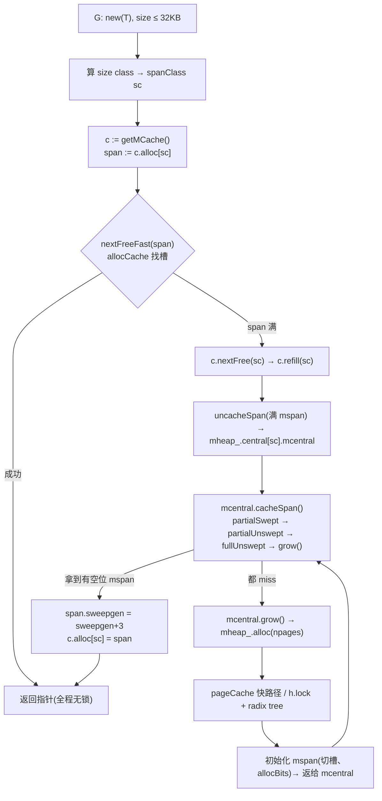

# 第十章 · mspan/mcache/mcentral/mheap 层级

> 篇:第 3 篇 · 内存分配
> 主线呼应:goroutine 之所以便宜,根之一是"给 G 分配栈、给业务对象分配堆"这件事,runtime 替你做到了纳秒级、几乎无锁。这一章立起内存分配器的四级骨架——mspan 是定长块、mcache 是 P 本地缓存、mcentral 是按 size class 的全局供货商、mheap 是页堆。读完这一章,你就拿到了第 11 章 `mallocgc` 三条道的全部名词:为什么 size class 是 67 个、为什么 mcache 无锁、为什么 mcentral 还要分 swept/unswept 两份、为什么大对象能绕过 mcache 直接进 mheap。整章不写分配流程,只写"仓库怎么摆、为什么这么摆"。

## 核心问题

**Go 的堆分配器凭什么能在多核机器上几乎无锁地飞起来?它为什么不像 glibc 的 ptmalloc 那样靠几把全局锁硬扛,而是摆成 mspan/mcache/mcentral/mheap 四层?每一层用的是什么锁、为什么这样切锁,凭什么 sound(不数据竞争、不双重分配、不丢块)?**

读完本章你会明白:

1. **mspan 是什么**:一个 mspan 是连续几页内存切成定长槽的"块",自带 size class、allocBits 位图、sweepgen;67 个 size class 是怎么定出来的,`spanClass` 这个 `uint8` 怎么同时编码 size class 和 noscan 两件事。
2. **mcache 是什么**:每个 P 私有的一个 mcache,缓存着 `_numSpanClasses = 136` 个 mspan(每个 size class × scan/noscan 各一),分配只在 P 本地的 mspan 上找槽,完全不进锁。它的无锁契约由 `sweepgen = mheap_.sweepgen + 3` 钉死。
3. **mcentral 是什么**:每个 size class 一个全局 mcentral,内含 `partial[2]/full[2]` 四个 spanSet(已清扫 / 未清扫,有空位 / 满);mcache 找不到槽时回退到 mcentral,mcentral 的锁只覆盖"一个 size class",锁粒度极细。
4. **mheap 是什么**:整个进程唯一的页堆,持有全局 `lock`、`pages pageAlloc`(radix-tree 页分配器)、`arenas` 二级映射;大对象和 mcentral 的 `grow()` 都找它拿连续页。
5. **为什么是四层而不是一层**:锁粒度逐级变粗(P 本地无锁 → 按 size class 加锁 → 全局锁),让 99% 的分配停在无锁的快路径上,锁竞争被挤到罕见的慢路径;这是 TCMalloc 思想的命脉,也是"少量 OS 线程高效驱动海量 G"在内存侧的物现。

> 逃生阀:本章会出现 size class、spanClass、sweepgen、spanSet、allocBits、pageCache、heapArena、radix tree 这些名词。看不懂某个细节时,回到这一句:四层结构的本质是**为最常见的分配留无锁快路径**(P 本地 mcache),其余三层(mcentral/mheap/OS)都是为了在快路径 miss 时补货,每一层补货的代价都比上一层高一个数量级。所有名词,都只是"怎么补货、补的时候怎么不和 GC 打架"的手段。

---

## 10.1 一句话点破

> **Go 的堆分配器像一座金字塔:塔尖是每个 P 私有的 mcache,99% 的分配在这里无锁完成;塔身是按 size class 切分的 mcentral,mcache miss 时才进它细粒度的锁;塔基是全局唯一的 mheap,管着所有页,锁最粗但访问最少;塔外是操作系统,只在 mheap 也不够时才 `mmap`。每一层都让上一层有得卖,每一层都更贵,于是贵的路径被挤到了罕见的角落。**

这是结论,不是理由。本章倒过来拆:先看为什么单一全局分配器不行,再一层一层往下立,最后看层与层之间用什么契约保证并发下 sound。

---

## 10.2 为什么不是单一全局分配器:锁竞争是地基的死敌

先立一个反面教材,这样后面每一层设计的动机才显形。

假设 Go 堆分配器像最朴素的实现那样,维护一份全局的 free list,所有 goroutine 分配都要先抢同一把锁。在一个 32 核、每核每秒上万次分配的服务上,这把锁会发生什么?

- **串行化**:所有分配挤成一队,CPU 核数再多也用不上,吞吐被锁的临界区拖成单核。
- **缓存行乒乓**:锁变量被一个核改完,另一个核的 L1 里那份拷贝立刻失效,跨核搬运缓存行的开销吃掉一大块性能。
- **调度的尾巴**:抢锁失败的核要么自旋烧 CPU,要么 park 让出 P,后者又把代价甩回给调度器。

这是 glibc 的 `ptmalloc` 在多核高并发下的通病(它后来引入 per-thread arena 缓解,但 Go 的设计更彻底)。

> **不这样会怎样**:如果 Go 堆用单一全局 free list,那一个 Web 服务每秒几十万次分配,锁竞争会让"goroutine 这么便宜"这个全书主线在内存侧破产——G 切换再快,只要分配要排队,G 就飞不起来。所以 Go 必须让**最常见的分配路径(P 本地)完全无锁**,锁只能出现在罕见的慢路径上。

怎么做到?靠分层缓存。下一节,我们从最小的"块"——mspan——开始,一层一层搭起这座金字塔。

---

## 10.3 mspan:堆的最小管理单元,定长块

### 提出问题:怎么把一堆字节变成"能快速切出定长对象的东西"

一次 `new(T)` 要的是一个 `sizeof(T)` 字节的块。堆是按"页"(8 KB)为单位从操作系统拿来的连续大块内存。中间的鸿沟是:怎么把一页或几页,切成一堆同样大小的对象槽,让分配只需"找到下一个空闲槽"?

朴素做法是 free list:每个 free 块串成链表,分配 = pop 链表头。这有两个问题:(1) 每个 size 都要一份链表,内存浪费在 `next` 指针上;(2) 链表节点散在堆各处,cache 不友好。Go 的解法是 **mspan**:把"连续 `npages` 页"看成一个整体,内部按 `elemsize` 切成定长槽,用一张位图(allocBits)记录哪些槽被用了,再用一个 64 位 cache(allocCache)加速"找下一个空闲槽"。

### mspan 的结构

[mspan 的定义](../go/src/runtime/mheap.go#L422-L516)(`type mspan struct` 在 [mheap.go:422](../go/src/runtime/mheap.go#L422))字段不少,挑关键的几组:

```go
// src/runtime/mheap.go —— L422-L516(节选,简化示意,非源码原文)
type mspan struct {
    next *mspan       // next/prev 把 mspan 串成双向链表(mSpanList 用)
    prev *mspan
    startAddr uintptr // 第一字节地址 = s.base()
    npages    uintptr // 跨多少页

    freeindex uint16  // 下一次从第几号槽开始找空闲
    nelems    uint16  // 这个 mspan 一共有多少槽
    allocCache uint64 // 64 位 cache,bit=1 表示对应槽空闲(allocBits 的窗口)

    allocBits  *gcBits // 完整的分配位图(每槽 1 bit)
    gcmarkBits *gcBits // GC 标记位图(GC 期间标活对象)
    sweepgen   uint32  // 清扫代际,见 10.5
    spanclass  spanClass // size class + noscan,一个 uint8
    needzero   uint8    // 首次使用前要不要清零
    elemsize   uintptr  // 每槽字节,由 sizeclass 算出
    limit      uintptr  // 数据末尾(大对象时收紧到对象边界)
}
```

这里有几个相互勾连的设计,逐个拆。

#### (1) `spanclass`:一个 `uint8` 同时编码 size class 和 noscan

这是 mspan 最节省的一笔。[`type spanClass uint8`](../go/src/runtime/mheap.go#L573-L578) 把 8 个 bit 拆成两半:

```go
// src/runtime/mheap.go —— L580-L592
func makeSpanClass(sizeclass uint8, noscan bool) spanClass {
    return spanClass(sizeclass<<1) | spanClass(bool2int(noscan))
}
func (sc spanClass) sizeclass() int8 { return int8(sc >> 1) }
func (sc spanClass) noscan() bool    { return sc&1 != 0 }
```

- **高 7 位是 size class**(0~67,但 0 留给大对象,所以小对象是 1~67)。
- **最低 1 位是 noscan**:为 1 表示这个 mspan 里的对象不含指针,GC 扫到它直接跳过整块。

于是总共有 [`numSpanClasses = gc.NumSizeClasses << 1 = 68 << 1 = 136`](../go/src/runtime/mheap.go#L576-L577) 种 spanClass(67 个小对象 class × 2 个 scan/noscan + 大对象 class 0 × 2)。这个 136 直接决定了 mcache 里 `alloc` 数组的大小(下面 10.4 讲)。

> **钉死这件事**:把 size class 和 noscan 揉进一个字节,不是省那几个字节的内存,是让 mspan 在所有热路径上只带一个 8 bit 的"身份证"——任何一段代码拿到 mspan 就能立刻知道"这块切多大、GC 要不要扫内部"。`spanclass` 是 mspan 被分发到不同 mcentral、被 GC 区别对待的唯一依据。

#### (2) `allocBits` + `allocCache`:位图找空闲槽,O(1) 一条指令

`allocBits` 是一张完整的位图:每槽 1 bit,bit=0 表示该槽空闲,bit=1 表示已分配(见 mspan 字段注释 [L441-L445](../go/src/runtime/mheap.go#L441-L445))。但要每次分配都去扫位图,太慢。Go 把位图"开一个 64 位的窗口"缓存在 `allocCache` 里:bit=1 表示空闲,找下一个空闲槽 = 找最低位的 1 = 一条 `TrailingZeros64`(编译成 `BSF`/`TZCNT` 指令)。

> **反面对比**:朴素做法是给每个 size class 维护一个 free list(链表),分配 = pop 头。但链表节点要存 `next` 指针(每槽多吃 8 字节)、节点散在堆上 cache 不友好、还要担心 ABA。mspan 的位图 + 64 位 cache 把这些一笔抹掉:槽本身就是数据,位图集中在一块连续内存里 cache 友好,找空闲槽是单指令。这个 cache 的无锁前提(`allocCache` 是 mspan 私有,而 mspan 此刻被某 P 的 mcache 独占)在 10.5 的 sweepgen 里钉死。

#### (3) `sweepgen`:并发清扫的代际契约

mspan 有一个 `sweepgen uint32` 字段([L502](../go/src/runtime/mheap.go#L502)),它的取值和 `mheap_.sweepgen` 之间的关系,决定了这个 mspan 此刻处于什么状态、谁能动它。mspan 字段注释里那五条([L494-L500](../go/src/runtime/mheap.go#L494-L500))是理解整章并发的钥匙:

```
if sweepgen == h->sweepgen - 2, span needs sweeping        // 待清扫
if sweepgen == h->sweepgen - 1, span is currently being swept // 正在清扫
if sweepgen == h->sweepgen,     span is swept and ready to use // 已清扫,可用
if sweepgen == h->sweepgen + 1, span was cached before sweep began and is still cached, and needs sweeping // 缓存态(跨了 GC 轮,要补清扫)
if sweepgen == h->sweepgen + 3, span was swept and then cached and is still cached // 缓存态(已清扫,安全)
h->sweepgen is incremented by 2 after every GC             // 每次 GC 后 +2
```

这段注释是全书最难的一段之一,这里先立一个最关键的取值:**`sweepgen == mheap_.sweepgen + 3` 表示"这个 mspan 被某个 P 的 mcache 缓存着,且已被清扫过"**。这个 `+3` 的状态,就是 10.5 要讲的"无锁访问 mspan"的契约。为什么是 +3 不是 +1?因为 +1 表示"缓存前还没清扫"(stale),+3 表示"先清扫再缓存"(fresh),两个状态在 uncacheSpan 时要区别对待(前者要补清扫,后者直接进 swept 列表)。这个细节留到 10.5 的技巧精解展开。

#### (4) mspan 怎么串起来:`next/prev` 和 `list`

mspan 自带 `next/prev` 双向链表指针([L424-L425](../go/src/runtime/mheap.go#L424-L425)),可以被串进 `mSpanList`(如 mheap 的某些链表)。但要注意:**mcentral 里的 mspan 不是用 `next/prev` 串的,而是放进 `spanSet`**(下面 10.6 讲)。`next/prev` 主要用于一些特定的链表(如 user arena)。这是一个常被老资料讲错的地方。

### size class 表:67 档是怎么定出来的

mspan 的 `elemsize` 由它的 size class 决定。size class 表是机器生成的,在 [`src/internal/runtime/gc/sizeclasses.go`](../go/src/internal/runtime/gc/sizeclasses.go#L6-L72)(文件头写着 `Code generated by mksizeclasses.go; DO NOT EDIT`)。摘前几行:

```
// class  bytes/obj  bytes/span  objects  tail waste  max waste  min align
//     1          8        8192     1024           0     87.50%          8
//     2         16        8192      512           0     43.75%         16
//     3         24        8192      341           8     29.24%          8
//     4         32        8192      256           0     21.88%         32
//     5         48        8192      170          32     31.52%         16
//   ...
//    67      32768       32768        1           0     12.50%       8192
```

几个关键数字(以本地 Go 1.27 为准):

- **67 个小对象 size class**(1~67),class 0 留给大对象(> 32 KB)。[`NumSizeClasses = 68`](../go/src/internal/runtime/gc/sizeclasses.go#L90)(含 class 0)。
- **`MaxSmallSize = 32768`**(32 KB),小对象与大对象的分水岭。
- **每档的 `bytes/span` 是 8 KB 的整数倍**(8192 = 一个 page),即一个 mspan 至少跨 1 页,大档可能跨多页(如 class 50 的 `bytes/span = 49152` 跨 6 页)。
- **`max waste` 列**:每档的最坏内部碎片。class 1 是 87.50%(一个 1 字节对象占 8 字节槽),class 18 降到 5.86%。整体平均碎片率被生成器(`mksizeclasses.go`)调到很低。

> **不这样会怎样**:如果 size class 切得太粗(比如只有 8/16/32/64...少数几档),一个 17 字节的对象要进 32 字节档,浪费 15 字节,碎片率爆炸。如果切得太细(每个字节一档),size class 表会有几万档,mcache 的 `alloc` 数组要几百 KB,内存和 cache 全废。67 档是 `mksizeclasses.go` 在"档数"和"max waste"之间算出来的工程甜点:档数够多让碎片可控,又够少让 mcache 的 136 个槽放得下、cache 友好。
>
> **钉死这件事**:读 runtime 源码,**永远以本地的 `sizeclasses.go` 为准**。老资料常写"tiny 是 8 字节、65 个 class",那是老版本;Go 1.27 上 tiny 是 16 字节(`TinySize = 16`、`TinySizeClass = 2`,见 [sizeclasses.go:94-95](../go/src/internal/runtime/gc/sizeclasses.go#L94-L95))、67 个小对象 class。

mspan 是"块",但它自己不主动分配——它只是仓库里的一个货架。下一个问题:谁来持有货架、谁来在货架上找槽?答案是 mcache。

---

## 10.4 mcache:P 私有的无锁缓存

### 提出问题:怎么让 99% 的分配完全不碰锁

mspan 解决了"一块内存怎么快速切出定长对象"。但还有个并发问题:多个 P 同时要分配同一 size class 的对象,如果它们共享同一个 mspan,对 `allocCache` 的读改写就要加锁。

解法是**让每个 P 各持一份**:`type p struct` 里有个字段 [`mcache *mcache`](../go/src/runtime/runtime2.go#L782)(紧挨着 [`pcache pageCache`](../go/src/runtime/runtime2.go#L783),后者是页缓存,10.7 讲)。这个 mcache 是 **P 私有**的,只有绑定了这个 P 的 M(进而它跑的 G)才会动它。于是对 mcache 内部字段的访问,**天然无锁**——因为同一时刻只有一个 P 在动它。

[mcache 的定义](../go/src/runtime/mcache.go#L20-L66)(`type mcache struct` 在 [mcache.go:20](../go/src/runtime/mcache.go#L20)):

```go
// src/runtime/mcache.go —— L14-L66(节选,简化示意,非源码原文)
// Per-thread (in Go, per-P) cache for small objects.
// No locking needed because it is per-thread (per-P).
type mcache struct {
    nextSample  int64   // 堆剖析采样倒计时
    scanAlloc   uintptr // 已分配的"含指针"字节数,给 GC 用

    tiny       uintptr  // 当前 tiny 块基址(tiny allocator 用,见第 11 章)
    tinyoffset uintptr
    tinyAllocs uintptr

    alloc [numSpanClasses]*mspan  // 136 个槽,每个 spanClass 一个 mspan

    reusableNoscan [numSpanClasses]gclinkptr  // noscan 对象的复用链(Go 1.27 新)

    stackcache [_NumStackOrders]stackfreelist // 栈分配用的本地缓存

    flushGen atomic.Uint32  // 上次 flush 时的 sweepgen,跨 GC 轮要 flush
}
```

注释那句 [`No locking needed because it is per-thread (per-P)`](../go/src/runtime/mcache.go#L14-L16) 是整章的灵魂。它的物理基础是 Go 调度器的一条铁律:**一个 mcache 在任一时刻只被一个 P 持有,而一个 P 在任一时刻只被一个 M(进而一个 G)执行**。所以 mcache 的字段访问,不需要任何同步原语。

### mcache 的核心:`alloc [numSpanClasses]*mspan`

这是 mcache 最热的字段,小对象分配几乎只动它。它是一个 **136 元素的指针数组**,每个 `spanClass`(0~135)对应一个 mspan 指针。一次小对象分配(简化):

1. 算出对象 size 落在哪个 size class,拼上 noscan 位得到 `spanClass sc`。
2. `span := c.alloc[sc]`——拿到 P 本地的那个 mspan。
3. `nextFreeFast(span)`——在 mspan 的 `allocCache` 里找空闲槽,无锁。

第 2、3 步全程只碰 P 自己的 mcache 和 mspan,没进任何锁。这是 Go 分配器快路径的物理基础。

### mcache 怎么来:`allocmcache` 和 P 的绑定

mcache 不是从 Go 堆分配的(否则鸡生蛋),而是从 mheap 的一个 fixalloc 池里拿([`allocmcache` 在 mcache.go:97](../go/src/runtime/mcache.go#L97)):

```go
// src/runtime/mcache.go —— L97-L111(简化)
func allocmcache() *mcache {
    var c *mcache
    systemstack(func() {
        lock(&mheap_.lock)
        c = (*mcache)(mheap_.cachealloc.alloc())  // 从 fixalloc 池拿
        c.flushGen.Store(mheap_.sweepgen)
        unlock(&mheap_.lock)
    })
    for i := range c.alloc {
        c.alloc[i] = &emptymspan   // 初始化成空 mspan
    }
    c.nextSample = nextSample()
    return c
}
```

注意三点:(1) 在 `systemstack`(系统栈)上做,避免用户栈增长时又触发堆分配;(2) 拿 mcache 这件事本身要进 `mheap_.lock`,但这是一次性的(每个 P 生命周期里就一次);(3) 初始化时所有 `alloc[i]` 都指向全局的 `emptymspan`([`var emptymspan mspan`](../go/src/runtime/mcache.go#L95))——一个"没有空闲槽"的占位 mspan,第一次分配就会触发 `nextFree`→`refill`,从 mcentral 拿真的 mspan。

> **钉死这件事**:mcache 是"P 本地"的,但它的**所有权属于 P 而非 M**。当 M 进入系统调用让出 P(`handoffp`,见第 6 章),新绑定的 M 接过这个 P,也就接过了它的 mcache。mcache 的内容在 P 的生命周期里持续累积局部性,这是 work-stealing 之外,Go 调度器在内存侧的另一个"局部性红利"。

### mcache miss 了怎么办:refill 回退到 mcentral

P 本地的 mspan 总会用完(`nextFreeFast` 返回 0,或整个 mspan 满了)。这时 [`refill`](../go/src/runtime/mcache.go#L160-L239) 登场:把满的 mspan 还给对应的 mcentral,再从 mcentral 拿一个有空闲槽的来。这是**快路径进慢路径**的衔接点,核心几行:

```go
// src/runtime/mcache.go —— L160-L205(简化,非源码原文)
func (c *mcache) refill(spc spanClass) {
    s := c.alloc[spc]
    if s.allocCount != s.nelems {
        throw("refill of span with free space remaining")  // 不变量:能进 refill 说明满
    }
    if s != &emptymspan {
        if s.sweepgen != mheap_.sweepgen+3 {
            throw("bad sweepgen in refill")                 // 不变量:cache 态必须是 +3
        }
        mheap_.central[spc].mcentral.uncacheSpan(s)         // 还给 mcentral
        // ... 统计 smallAllocCount / totalAlloc ...
    }
    s = mheap_.central[spc].mcentral.cacheSpan()            // 从 mcentral 拿新的
    if s == nil { throw("out of memory") }
    s.sweepgen = mheap_.sweepgen + 3                        // 标记成 cache 态
    s.allocCountBeforeCache = s.allocCount                  // 记账基准
    // 更新 heapLive(乐观预估整个 mspan 都会用掉)
    gcController.update(int64(s.npages*pageSize)-int64(usedBytes), int64(c.scanAlloc))
    c.alloc[spc] = s
}
```

这里有三个"为什么 sound"的关键点,每一个都钉死一条不变式:

1. **`throw("refill of span with free space remaining")`**:能进 `refill` 的前提是当前 mspan 满了(`allocCount == nelems`)。如果还有空闲槽却进来了,说明调用者(上层 `nextFree`)逻辑错了,直接 `throw` 崩溃,绝不能含糊地交还。
2. **`s.sweepgen != mheap_.sweepgen+3` 则 throw**:一个被 mcache 缓存的 mspan,其 sweepgen **必须**是 `mheap_.sweepgen + 3`(cache 态)。不是,说明并发清扫和缓存交接出了 race,崩溃。这是 10.5 要展开的核心契约。
3. **新拿来的 mspan 立刻置 `sweepgen = mheap_.sweepgen + 3`**:把它从 mcentral 的全局列表"私有化"给这个 P,从此这个 mspan 在 GC 的视角里"正在被缓存、不要并发清扫它"。同时 `gcController.update` 把整个 mspan 的字节数**乐观地**算进 `heapLive`(假设它会全用掉),这是 GC pacer 的输入(第 14 章展开)。

`refill` 把"满的还、空的拿"捆在一次调用里,锁的代价(mcentral 的锁)被摊平到"一整个 mspan 的对象数"(几十到上千个)。所以一次 refill 虽然进锁,但接下来的几十到上千次分配都无锁——这就是分层缓存的全部意义。

下面这张图把 mcache 在 P 上的位置和它的 136 个槽画出来:

```
                     一个 P(per-P,无锁访问)
   ┌─────────────────────────────────────────────────────────────────────┐
   │  type p struct {                                                    │
   │     id        int32                                                 │
   │     mcache    *mcache  ───────► ┌──────────────────────────────┐     │
   │     pcache    pageCache         │ type mcache struct {          │     │
   │     ...                         │   alloc [136]*mspan           │     │
   │                                 │   tiny, tinyoffset, tinyAllocs│     │
   │                                 │   flushGen ...                │     │
   │                                 │ }                             │     │
   │                                 └──────────────────────────────┘     │
   └─────────────────────────────────────────────────────────────────────┘
            alloc[0]=emptymspan   alloc[1]=emptymspan   ...   alloc[k]=正在用的 mspan
              ▲                                                     │
              │ G 分配时:c.alloc[sc] 拿这个 mspan,在 allocCache 找槽
              │ 满了 → refill() → 回退到 mcentral(下一节)
```

mcache 解决了"无锁快路径"。但 mcache 自己的 mspan 从哪来?从 mcentral。下一节。

---

## 10.5 mcentral:按 size class 切分的全局供货商

### 提出问题:mcache miss 时,怎么补货又不让锁变成全局瓶颈

mcache 是 P 私有的,但 mspan 本身是稀缺资源(整个堆的页就那么多)。多个 P 的 mcache 都要同一 size class 的 mspan,这些 mspan 必须放在一个全局可见的地方被调度。

朴素的解法是:一个全局的 mspan 池,所有 size class 共用一把锁。但这把锁会被所有 size class 的 refill 抢,竞争又回来了。Go 的解法是**按 size class 切锁**:每个 size class 一个独立的 mcentral,各自一把锁。于是 mcentral 之间的锁互不干扰,refill 一个 size class 的 mspan 不会阻塞 refilling 别的 size class 的 P。

[mcentral 的定义](../go/src/runtime/mcentral.go#L22-L46)(`type mcentral struct` 在 [mcentral.go:22](../go/src/runtime/mcentral.go#L22)):

```go
// src/runtime/mcentral.go —— L22-L46(节选,简化示意,非源码原文)
// Central list of free objects of a given size.
type mcentral struct {
    spanclass spanClass
    partial [2]spanSet // 有空闲对象的 mspan:已清扫 / 未清扫
    full    [2]spanSet // 满的 mspan:已清扫 / 未清扫
}
```

两个关键设计:

#### (1) `partial[2]/full[2]`:为什么是两份 × 两份

每个 mcentral 有四个 spanSet:`partial[0]/partial[1]`(有空闲槽的)和 `full[0]/full[1]`(满的)。每对的两个槽位在**每轮 GC 后互换角色**:一个是"本轮已清扫的"、一个是"上一轮留下未清扫的"。这是怎么实现的?看 [`partialSwept/partialUnswept`](../go/src/runtime/mcentral.go#L59-L79):

```go
// src/runtime/mcentral.go —— L59-L79
func (c *mcentral) partialUnswept(sweepgen uint32) *spanSet {
    return &c.partial[1-sweepgen/2%2]
}
func (c *mcentral) partialSwept(sweepgen uint32) *spanSet {
    return &c.partial[sweepgen/2%2]
}
```

`sweepgen` 每次 GC 后 +2,所以 `sweepgen/2%2` 在 0 和 1 之间交替。本轮"已清扫的"在 `partial[sweepgen/2%2]`,"未清扫的"(上一轮留下、还没被本轮回收的)在 `partial[1-sweepgen/2%2]`。两份槽位 + 一个单调递增的 sweepgen,实现了**无锁的角色互换**:不需要在 GC 边界把所有 mspan 搬一遍,只要改一下"哪个槽是 swept、哪个是 unswept"的解读就行。

> **不这样会怎样**:朴素做法是 GC 边界 STW 时,把所有 mspan 重新清扫、重新分类。这是早期 Go GC 的做法,STW 里有大量清扫工作。现在的设计把清扫摊到下一轮分配路径上(`cacheSpan` 里遇到 unswept 就顺手扫一下),STW 只需翻一个 bit(sweepgen += 2)。这是 Go GC STW 能压到亚毫秒的功臣之一(第 14 章展开)。

#### (2) `cacheSpan`:补货的多级回退

mcache refill 调的 [`mcentral.cacheSpan`](../go/src/runtime/mcentral.go#L82-L199) 是本章最值得读的函数之一。它的策略是**优先扫便宜的、再扫贵的、最后 grow**:

```go
// src/runtime/mcentral.go —— L82-L199(简化,非源码原文)
func (c *mcentral) cacheSpan() (s *mspan) {
    sg := mheap_.sweepgen
    // 第 1 级:已清扫 partial 里直接 pop 一个
    if s = c.partialSwept(sg).pop(); s != nil {
        goto havespan
    }
    // 第 2 级:未清扫 partial 里,逐个 tryAcquire 再 sweep
    for ; spanBudget >= 0; spanBudget-- {
        s = c.partialUnswept(sg).pop()
        if s == nil { break }
        if s, ok := sl.tryAcquire(s); ok {
            s.sweep(true)               // 顺手清扫
            goto havespan
        }
    }
    // 第 3 级:未清扫 full 里,扫一个看有没有空位
    for ; spanBudget >= 0; spanBudget-- {
        s = c.fullUnswept(sg).pop()
        if s == nil { break }
        if s, ok := sl.tryAcquire(s); ok {
            s.sweep(true)
            if freeIndex := s.nextFreeIndex(); freeIndex != s.nelems {
                s.freeindex = freeIndex
                goto havespan
            }
            c.fullSwept(sg).push(s.mspan)   // 扫完还是满,进 swept full
        }
    }
    // 第 4 级:都没有,向 mheap 要一个全新的 mspan
    s = c.grow()
    if s == nil { return nil }
havespan:
    // 初始化 allocCache,准备给 mcache 用
    return s
}
```

四级回退,每一级解决一个"上一级 miss"的情况:

| 级别 | 从哪拿 | 代价 | 为什么这样排 |
|---|---|---|---|
| 1 partialSwept | 已清扫、有空位 | 一次 pop,无清扫 | 最便宜,优先 |
| 2 partialUnswept | 未清扫、有空位 | 一次清扫 + pop | 顺手把清扫摊进分配路径(lazy sweep 思想) |
| 3 fullUnswept | 未清扫、可能满 | 清扫 + 查空位 | 兜底,避免 grow 浪费 |
| 4 grow | mheap 新 mspan | 走 mheap 全局锁 | 最贵,只在前面都 miss |

[`spanBudget := 100`](../go/src/runtime/mcentral.go#L107) 这个常量是关键的工程权衡:它在第 2、3 级限制"最多扫 100 个 mspan",超过就直接 grow。注释 [L98-L106](../go/src/runtime/mcentral.go#L98-L106) 写得明白:限制空间开销在 1%(扫 100 个还找不到几个空槽,不如直接 grow 一个满的)。这避免了"扫了几千个 mspan 才凑出一个空槽"的尾延迟。

#### (3) `uncacheSpan`:mcache 把 mspan 还回来

[`uncacheSpan`](../go/src/runtime/mcentral.go#L205-L248) 是 refill 的另一半——mcache 把满的(或 stale 的)mspan 还给 mcentral。它的逻辑短而精:

```go
// src/runtime/mcentral.go —— L205-L248(简化,非源码原文)
func (c *mcentral) uncacheSpan(s *mspan) {
    sg := mheap_.sweepgen
    stale := s.sweepgen == sg+1     // 缓存前还没清扫(stale)
    if stale {
        // mcache 在上一轮 GC 前就缓存了它,现在还回来,我们有责任清扫
        atomic.Store(&s.sweepgen, sg-1)  // 标记"待清扫、不可分配"
    } else {
        atomic.Store(&s.sweepgen, sg)    // 标记"已清扫、可分配"
    }
    if stale {
        ss := sweepLocked{s}
        ss.sweep(false)                  // 补清扫
    } else {
        if int(s.nelems)-int(s.allocCount) > 0 {
            c.partialSwept(sg).push(s)   // 有空位 → partial swept
        } else {
            c.fullSwept(sg).push(s)      // 满 → full swept
        }
    }
}
```

这里出现了 mspan 字段注释里那个 `+1` 状态:**`sweepgen == sg+1` 表示"这个 mspan 在上一轮 GC 前就被 mcache 缓存了,一直没被清扫过"**。还回来时要补一次清扫(`ss.sweep(false)`)。这是"缓存的 mspan 跨 GC 轮"的衔接机制——mcache 持有的 mspan 在 GC 期间不会被后台 sweeper 扫到(因为它不在 mcentral 的全局列表里),所以归还时由归还者负责清扫。

> **钉死这件事**:mcentral 的并发正确性建立在两个机制上:(1)**按 size class 切锁**(每 size class 一个 mcentral,refill 互不阻塞);(2)**sweepgen 的代际契约**(每个 mspan 用 sweepgen 标记自己处于"待扫/正扫/已扫/缓存态"哪个阶段,任何状态转换都 `atomic.Store`)。两者合起来,让 mcentral 既细粒度加锁,又能在并发清扫下不出 race。这是 Go 分配器能"无锁快路径 + 有锁慢路径"sound 的根基。

#### (4) spanSet:并发安全的 mspan 集合

mcentral 的 `partial/full` 不是普通切片,而是 [`spanSet`](../go/src/runtime/mspanset.go#L17-L52)——一个并发安全的两级结构。它有一个 `spine`(可增长的脊骨)+ 若干固定大小的 block,push/pop 用一个原子的 `index` 字段管理 head/tail,只有在 spine 要增长时才进 `spineLock`。这是 [spanSet 字段注释](../go/src/runtime/mspanset.go#L18-L33)里写的两级设计:"The spine can be accessed without locks, but adding a block or growing it requires taking the spine lock."。它让多数 push/pop 完全无锁,只有 spine 增长那一瞬进锁。这是 mcentral 锁粒度之外的另一层优化。

下面这张图把 mcentral 在 mheap 里的位置画出来(注意每个 mcentral 各自一把锁,且按 CacheLinePad 隔开):

```
                       mheap_(全局唯一)
   ┌─────────────────────────────────────────────────────────────────┐
   │  central [numSpanClasses=136]struct {                           │
   │      mcentral mcentral                                         │
   │      pad      [CacheLinePadSize - ...]byte   ◄── 每个 mcentral  │
   │  }                                独占一个缓存行,避免 false sharing │
   │                                                                │
   │   ┌──────────────┐  ┌──────────────┐        ┌──────────────┐    │
   │   │ mcentral{0}  │  │ mcentral{1}  │  ...   │ mcentral{135}│    │
   │   │ spanclass=0  │  │ spanclass=1  │        │ spanclass=135│    │
   │   │ partial[2]   │  │ partial[2]   │        │ partial[2]   │    │
   │   │ full[2]      │  │ full[2]      │        │ full[2]      │    │
   │   └──────────────┘  └──────────────┘        └──────────────┘    │
   │         ▲ 各自的 spanSet.spineLock(细粒度)                       │
   └─────────────────────────────────────────────────────────────────┘
            mcentral.grow() / mheap.alloc() 拿新 mspan
```

mcentral 解决了"按 size class 细粒度补货"。但 mcentral 的 mspan 从哪来?从 mheap。下一节。

---

## 10.6 mheap:页堆,全局唯一的页分配器

### 提出问题:谁来管"页"这个最小粒度

不管 mspan 切多细,它的物理来源都是**页**:连续 `npages` 个 8 KB 页。整进程的页是稀缺资源,必须由一个全局的页分配器统一管。这个角色就是 **mheap**,整进程唯一([`var mheap_ mheap`](../go/src/runtime/mheap.go#L264))。

[mheap 的定义](../go/src/runtime/mheap.go#L64-L262)(`type mheap struct` 在 [mheap.go:64](../go/src/runtime/mheap.go#L64))字段极多,挑最核心的几组:

```go
// src/runtime/mheap.go —— L64-L262(节选,简化示意,非源码原文)
type mheap struct {
    lock    mutex          // 全局堆锁(系统栈上获取!)
    pages   pageAlloc      // radix-tree 页分配器(核心)
    sweepgen uint32        // 全局清扫代际

    allspans []*mspan      // 所有 mspan 的清单(GC 遍历用)

    // heap arena 二级映射:地址 → heapArena 元数据
    arenas [1 << arenaL1Bits]*[1 << arenaL2Bits]*heapArena

    // 按 size class 切的 mcentral 数组(每个独占缓存行)
    central [numSpanClasses]struct {
        mcentral mcentral
        pad      [(cpu.CacheLinePadSize - unsafe.Sizeof(mcentral{})%cpu.CacheLinePadSize) % cpu.CacheLinePadSize]byte
    }

    // fixalloc 池:mspan / mcache 等结构体本身从这拿(不在 GC 堆里)
    spanalloc  fixalloc
    cachealloc fixalloc
    // ... 一堆 special* 的 fixalloc ...
}
```

几个关键设计,每个都对应一个"为什么这样"。

#### (1) `pages pageAlloc`:radix tree 页分配器

这是 mheap 的心脏,管着"哪些页空闲、哪些页已用"。它的实现是一个 **radix tree**(基数树),把整个堆地址空间按页建索引,树的叶节点是一个 bitmap,记录这一段页的空闲情况。分配 `npages` 个连续页 = 在 radix tree 里找一段连续的 `npages` 个 1(free)。

> **反面对比**:朴素做法是用一个全局的空闲页链表( buddy system 或 free list)。但 Go 堆可以到几百 GB,链表遍历是 O(空闲块数);而且找"连续 npages"在链表上要做区间合并,复杂。radix tree 把查找降到 O(log 页数)~O(1),且每个内部节点缓存了子树的"最大连续空闲段",剪枝极快。这是 Linux buddy(buddy allocator 也是按 2 的幂分组)之外,另一种大规模页管理的工程解。

`pageAlloc` 还有一个配套的 **per-P 页缓存** `pageCache`(下面 10.7 讲),让小页分配(单页或几页)也尽量不进 `mheap_.lock`。

#### (2) `arenas`:heap arena 二级映射

Go 堆可以非常大,给每页都建一张全局元数据表不现实。Go 的解法是 **heap arena**:把堆地址空间切成 64 MB(64 位非 Windows)一段的 arena([`heapArenaBytes = 1 << logHeapArenaBytes`](../go/src/runtime/malloc.go#L252),注释 [L240-L251](../go/src/runtime/malloc.go#L240-L251))。每个 arena 有一份 [`heapArena`](../go/src/runtime/mheap.go#L268-L282) 元数据,记录这 64 MB 里每一页属于哪个 mspan([`spans [pagesPerArena]*mspan`](../go/src/runtime/mheap.go#L282))。

[`arenas [1 << arenaL1Bits]*[1 << arenaL2Bits]*heapArena`](../go/src/runtime/mheap.go#L150) 是一个**两级映射**:给一个地址,先算它在哪个 arena,再 `arenas[l1][l2]` 拿到那个 arena 的元数据。在大多数 64 位平台 `arenaL1Bits = 0`,退化成单级映射(只有 `arenas[0]` 这一层);只有 64 位 Windows 因为 arena 小(4 MB)、地址空间大(48 bit)才用上两级([`arenaL1Bits = 6 * (_64bit * goos.IsWindows)`](../go/src/runtime/malloc.go#L279))。

> **钉死这件事**:任何指向堆的指针,要找到它属于哪个 mspan,走的就是这条 `arenas` 映射 → `heapArena.spans[页内偏移]`。GC 扫描、写屏障、free 检查,都靠这个 O(1) 的反查。这是 mheap 给整个 runtime 提供的"地址→span"基础设施,不只是分配器在用。

#### (3) `central [numSpanClasses]`:mcentral 数组,每个独占缓存行

mheap 持有所有 mcentral([`central [numSpanClasses]struct { mcentral mcentral; pad ... }`](../go/src/runtime/mheap.go#L211-L214))。注意那个 `pad`:`(cpu.CacheLinePadSize - unsafe.Sizeof(mcentral{})%cpu.CacheLinePadSize) % cpu.CacheLinePadSize`。它让**每个 mcentral 独占一个或多个缓存行**,避免多个 P 在不同 mcentral 上 refill 时,因为 mcentral 挨在一起而触发 false sharing(伪共享)。

> **不这样会怎样**:如果 mcentral 紧挨着排列、不加 pad,那 P1 refill size class 3、P2 refill size class 5,虽然锁不冲突,但两个 mcentral 在同一个缓存行上,P1 改 mcentral[3] 的 spanSet 会让 P2 的 L1 里那个缓存行失效。这就是 false sharing——锁没抢,缓存行却在跨核搬运。一个 `pad` 字段把这个坑堵死。这是"为并发结构布局"这条 Go runtime 招牌技巧的一个实例(第 2 章 G/M/P 布局里也有同款思路)。

#### (4) mheap.alloc:mheap 的入口

大对象(> 32 KB)和 mcentral 的 `grow()` 都调 [`mheap.alloc`](../go/src/runtime/mheap.go#L997-L1011):

```go
// src/runtime/mheap.go —— L997-L1011(简化)
func (h *mheap) alloc(npages uintptr, spanclass spanClass) *mspan {
    var s *mspan
    systemstack(func() {              // 必须在系统栈上,避免用户栈增长触发堆分配死锁
        if !isSweepDone() {
            h.reclaim(npages)         // 分配前先回收 npages 页(反堆膨胀)
        }
        s = h.allocSpan(npages, spanAllocHeap, spanclass)
    })
    return s
}
```

注释 [L998-L1000](../go/src/runtime/mheap.go#L998-L1000) 那句 "Don't do any operations that lock the heap on the G stack. It might trigger stack growth, and the stack growth code needs to be able to allocate heap." 是 `systemstack` 的动机:在 G 的用户栈上持有 `mheap_.lock`,如果栈增长触发新的堆分配(栈也在堆上),就会死锁。切到系统栈(固定大小、不增长)绕开这个死循环。

`allocSpan`([L1215](../go/src/runtime/mheap.go#L1215))内部有快路径:小页分配(< 16 页)优先走 **per-P 的 pageCache**(下一节),只在 cache miss 时才进 `h.lock`。这又一次体现"快路径无锁"的设计哲学。

---

## 10.7 三层之上的隐形层:per-P 的 pageCache

讲完 mspan/mcache/mcentral/mheap 四层,还有一个常被忽略、但极其关键的"隐形层":**每个 P 还有一个页缓存 `pageCache`**。

[type p struct 里的 `pcache pageCache`](../go/src/runtime/runtime2.go#L783) 紧挨着 `mcache`。[pageCache 的定义](../go/src/runtime/mpagecache.go#L18-L22):

```go
// src/runtime/mpagecache.go —— L14-L22
// pageCache represents a per-p cache of pages the allocator can
// allocate from without a lock.
type pageCache struct {
    base  uintptr // base address of the chunk
    cache uint64  // 64-bit bitmap representing free pages (1 means free)
    scav  uint64  // 64-bit bitmap representing scavenged pages
}
```

一个 pageCache 是**连续 64 页**(8 KB × 64 = 512 KB)的快照:64 个 bit,每个 bit 对应一页,1 = 空闲。[`pageCachePages = 64`](../go/src/runtime/mpagecache.go#L12)(`8 * unsafe.Sizeof(pageCache{}.cache)`)。单页分配([`pageCache.alloc`](../go/src/runtime/mpagecache.go#L37-L49)):

```go
// src/runtime/mpagecache.go —— L37-L49(简化)
func (c *pageCache) alloc(npages uintptr) (uintptr, uintptr) {
    if npages == 1 {
        i := uintptr(sys.TrailingZeros64(c.cache))  // 找最低位的 1
        c.cache &^= 1 << i                            // 标记成已用
        return c.base + i*pageSize, ...
    }
    return c.allocN(npages)
}
```

和 mspan 的 `allocCache` 异曲同工:64 位 bitmap + `TrailingZeros64` 找空闲,一条指令。区别是 mspan 的 cache 是"对象槽"级,pageCache 是"页"级。

`allocSpan`([mheap.go:1229-1250](../go/src/runtime/mheap.go#L1229-L1250))的快路径:

```go
// src/runtime/mheap.go —— L1229-L1250(简化)
pp := gp.m.p.ptr()
if !needPhysPageAlign && pp != nil && npages < pageCachePages/4 {  // < 16 页
    c := &pp.pcache
    if c.empty() {
        lock(&h.lock)
        *c = h.pages.allocToCache()   // 进锁,但一次拿 64 页
        unlock(&h.lock)
    }
    base, scav = c.alloc(npages)      // 多数情况无锁
    if base != 0 {
        s = h.tryAllocMSpan()         // mspan 结构体也走无锁池
        if s != nil { goto HaveSpan }
    }
}
// cache miss 才进 h.lock
```

> **钉死这件事**:pageCache 是 mcache 在"页级"的对偶。mcache 让对象分配无锁,pageCache 让小页分配(mcentral.grow 拿的新 mspan 通常就 1~8 页)也无锁。两者合起来,让 Go 堆分配在 P 本地有两级无锁缓存:**对象级(mcache.alloc)+ 页级(pp.pcache)**。这是为什么 Go 堆分配在多核下能几乎无锁飞起来的完整答案——不是只有 mcache 一层。

---

## 10.8 一张总图:四层(加 pageCache 隐形层)的全景

把前几节串起来,Go 堆分配的金字塔完整长这样:

```
                            ┌─────────────────────────────────────┐
   对象级无锁(99% 流量)   │  P.mcache.alloc[136]*mspan          │ ← 小对象快路径
   (P 私有,无锁)         │  P.mcache.tiny (tiny allocator)     │ ← 微小对象
                            └──────────────┬──────────────────────┘
                                           │ refill(miss)
                                           ▼
                            ┌─────────────────────────────────────┐
   按 size class 补货       │  mheap_.central[136].mcentral       │ ← 各自一把锁
   (细粒度锁)              │   partial[2]/full[2] spanSet        │
                            └──────────────┬──────────────────────┘
                                           │ grow()(都 miss)
                                           ▼
   页级无锁(小页)         │  P.pcache (per-P, 64 页 bitmap)     │ ← 单页/几页快路径
   (P 私有,无锁)         └──────────────┬──────────────────────┘
                                           │ cache miss
                                           ▼
                            ┌─────────────────────────────────────┐
   全局页堆(粗锁,罕见)   │  mheap_.pages (radix tree)          │ ← 大对象直接来这
   (全局锁)                │  mheap_.arenas (heap arena 二级映射)│
                            └──────────────┬──────────────────────┘
                                           │ heap 也不够
                                           ▼
                            ┌─────────────────────────────────────┐
   操作系统                 │  mmap / madvise (sysAlloc/sysMap)   │
                            └─────────────────────────────────────┘
```

自上而下:**锁粒度越来越粗、访问频率越来越低、单次代价越来越高**。99% 的分配停在第一层(P.mcache,无锁),少数 miss 进第二层(mcentral,细锁),极少数进第三层(mheap,粗锁),极极少数(堆不够大)才进操作系统。这就是 TCMalloc 思想在 Go 的完整物现。

用一次小对象分配把四层串起来(分配流程的完整版在第 11 章,这里只看骨架):



---

## 10.9 技巧精解:sweepgen——并发清扫与无锁访问 mspan 的契约

本章最硬核的技巧是 **sweepgen 的代际状态机**。它不是个简单的版本号,而是一套**并发契约**:规定了一个 mspan 在任一时刻能被谁访问、谁负责清扫、谁能改它的内部数据。前几节已经零散提到 sweepgen 的几个取值,这里把它一次性钉死,并配反面对比。

### sweepgen 的五种状态(再读一次 mspan 字段注释)

把 [mspan 字段注释 L494-L500](../go/src/runtime/mheap.go#L494-L500) 的五条整理成表(设当前全局 `sg = mheap_.sweepgen`):

| mspan.sweepgen | 含义 | 谁能改它的 allocBits/allocCache | 谁能扫它 |
|---|---|---|---|
| `sg - 2` | 待清扫(in global lists) | 无人(等扫) | 后台 sweeper 或分配路径 |
| `sg - 1` | 正在清扫 | 持有 sweepLocker 者 | 持有者 |
| `sg` | 已清扫、可分配(在 central swept 列表) | 拿到它的 mcache | 不用扫 |
| `sg + 1` | 缓存态,**跨了 GC 轮、未清扫**(stale) | mcache 持有者 | 归还时由归还者补扫 |
| `sg + 3` | 缓存态,**先扫后缓存**(fresh) | mcache 持有者 | 已扫,安全 |

每次 GC 后 `mheap_.sweepgen += 2`,所以所有 mspan 的 `sweepgen` 相对值自动减 2:上一轮的"已扫(`sg`)"变成这轮的"待扫(`sg-2`)"。这就是 [uncacheSpan 注释](../go/src/runtime/mcentral.go#L213-L225) 里说的 "Span was cached before sweep began. It's our responsibility to sweep it." 的来源——mcache 持有的 mspan 在 GC +2 后,如果它原来是 `sg+3`(fresh),现在变成 `(sg+2)+1 = sg+3`(stale 等价),即跨轮了,归还时要补扫。

### 关键不变式:cache 态(`+3`)的无锁访问契约

整章最重要的一句话:

> **当一个 mspan 的 `sweepgen == mheap_.sweepgen + 3` 时,它正被某个 P 的 mcache 独占,这个 P 可以无锁地改它的 allocBits/allocCache/allocCount/freeindex;同时,后台 sweeper 和其他 P 都不会碰它(它不在 mcentral 的全局列表里)。**

这个契约在 [`refill`](../go/src/runtime/mcache.go#L179-L181) 和 [`uncacheSpan`](../go/src/runtime/mcentral.go#L205-L225) 里被双向钉死:

- `refill` 拿到新 mspan 后,**立刻** `s.sweepgen = mheap_.sweepgen + 3`([L216](../go/src/runtime/mcache.go#L216)),宣布"这个 mspan 现在归我了"。
- `refill` 还旧 mspan 前,**断言** `s.sweepgen != mheap_.sweepgen+3` 则 throw([L179-L181](../go/src/runtime/mcache.go#L179-L181)),确认"它确实在我手里"。
- `uncacheSpan` 收到 mspan 后,`atomic.Store(&s.sweepgen, sg)` 或 `sg-1`([L221-L224](../go/src/runtime/mcentral.go#L221-L224)),宣布"它离开缓存了,重新进全局列表"。

为什么是 `atomic.Store` 而不是普通赋值?因为**后台 sweeper 可能在并发地读 sweepgen 决定要不要扫这个 mspan**。普通赋值在弱内存序架构上不能保证 sweeper 立刻看到新值,可能导致 sweeper 扫一个正在被 mcache 用的 mspan(race)。`atomic.Store` 提供了必要的可见性保证。

### 反面对比:如果没有 sweepgen 契约

假设 Go 分配器不做 sweepgen 管理,朴素地用"一把全局堆锁 + 一份全局 free list"。那么:

1. **mcache 无法无锁**:任何 P 改 mspan 的 allocCache 都可能和后台 sweeper 改 allocBits 冲突,只能加锁。
2. **清扫必须 STW**:没有代际契约,GC 没法安全地在业务跑的同时清扫 mspan(业务可能正在分配同一个 mspan 的槽),只能停下所有业务统一扫——回到早期 Go GC 的百毫秒级 STW。
3. **归还和分配会 race**:一个 P 归还 mspan、另一个 P 想拿它,没有 sweepgen 这个"状态机",两个操作会踩对方的脚,导致双重分配或丢块。

sweepgen 这套机制,把"无锁访问 mspan"和"并发清扫 mspan"这对看似矛盾的需求,用一个 5 态状态机 + atomic 操作化解了。它是 Go 分配器在多核 + 并发 GC 下 sound 的命脉。

### 另一个角度:sweepgen 让 STW 最小化

sweepgen 还有一个副作用:它让 GC 的清扫可以**完全并发**。GC 边界只需做一件事:`mheap_.sweepgen += 2`(STW 内,极短)。此后:

- 后台 sweeper 线程并发扫 `sweepgen == sg-2` 的 mspan,扫完置 `sg`,放进 central swept 列表。
- 分配路径(mcentral.cacheSpan)也会顺手扫 unswept 的 mspan(第 2、3 级回退),把清扫摊进分配。

两边合力,清扫在"业务还在跑"的情况下完成,STW 只承担"翻 sweepgen"这一瞬。这是第 14 章"并发 GC 的阶段"的物理基础,本章先记下:**sweepgen 不只是分配器的状态机,更是 GC STW 最小化的钥匙**。

---

## 10.10 技巧精解:per-P 的 pageCache——页级无锁缓存

第二个值得单独拆的技巧是 pageCache。它常被"mspan/mcache/mcentral/mheap 四层"的讲法吞没,但它是 Go 堆在页级也能无锁飞起来的关键。

### 动机:小页分配也要避开全局堆锁

mcentral.grow() 每次向 mheap 要的新 mspan,通常只有 1~8 页(class 1 是 1 页 8 KB,class 67 是 4 页 32 KB)。如果每次都要 `lock(&h.lock)` + radix tree 查找 + `unlock`,在一个高频分配小对象的服务上,这把锁会被 mcentral.grow 不断打,竞争剧烈。

解法是:**每个 P 缓存 64 页**,单页或几页分配直接从 cache 扣,不进锁。这就是 [`pp.pcache`](../go/src/runtime/runtime2.go#L783)。

### 机制:64 位 bitmap + TrailingZeros64

pageCache 的 `cache uint64` 是 64 页的空闲位图(1 = 空闲),`alloc(1)` = `TrailingZeros64` 找最低位的 1,一条指令([mpagecache.go:37-49](../go/src/runtime/mpagecache.go#L37-L49))。cache 空了([`c.empty()` 即 `c.cache == 0`](../go/src/runtime/mpagecache.go#L25-L27))才 `lock(&h.lock)` 一次,从 radix tree 拿一整段 64 页([`h.pages.allocToCache()`](../go/src/runtime/mpagecache.go))填满,然后 `unlock`。一次锁换 64 页的配额,和 mcache"一次锁换一整个 mspan"是同一个摊平思路。

### 为什么 sound:per-P 的快照

pageCache 之所以无锁 sound,是因为它**只是 radix tree 的一个 per-P 快照**:

- 一个 P 持有的 64 页,在 radix tree 里被标记成"已分配给某个 P"(已扣减),其他 P 不会拿到同一段。
- pageCache.cache 这份 64 位 bitmap 是 P 私有的,只有这个 P 改它,无竞争。
- P 放弃这段(flush,在 P 让出或堆 shrink 时)才把未用的页还回 radix tree,这时进 `h.lock`。

这是无锁快照的经典模式:**全局结构(radix tree)负责"谁拥有哪段",本地快照(pageCache.cache)负责"在我拥有的这段里,哪些页还没用"**。两者分工,本地操作无锁,全局操作只在边界(拿/还)时进锁。

### 反面对比:如果 pageCache 不存在

朴素地每次小页分配都进 `h.lock`,在一个 32 核、每核每秒上千次 mcentral.grow(因为小对象高频分配触发 refill 触发 grow)的服务上:

- `h.lock` 的临界区(radix tree 查找 + bitmap 更新)是几百纳秒到微秒级。
- 32 个核挤一把锁,串行化 + 缓存行乒乓,有效吞吐掉到接近单核。
- 高频分配的服务(gateway、JSON 解析)吞吐直接腰斩。

pageCache 把 99% 的小页分配挡在锁外,只在 cache miss(每 64 页一次)进锁。这是 mheap 在多核下不被锁拖死的命脉。

> **钉死这件事**:mcache 和 pageCache 是同一思想的两个层次:**对象级无锁 + 页级无锁**。Go 堆分配器在多核下飞起来,不是靠某一个技巧,而是靠这两个 per-P 缓存把无锁范围从"对象"延伸到"页"。读 runtime 源码,这两个 cache 必须一起看,缺一不可。

---

## 章末小结

这一章立起了内存分配器的骨架,没写分配流程(那是第 11 章 `mallocgc` 的地盘)。骨架是四层(加隐形层五层)的金字塔:

1. **mspan**:连续几页内存切成定长槽的块,带 size class(`spanclass` 一个 `uint8` 同时编码 size class 和 noscan)、allocBits 位图、sweepgen 代际状态。67 个小对象 size class 由 `mksizeclasses.go` 机器生成,Go 1.27 上 `MaxSmallSize = 32 KB`。
2. **mcache**:每个 P 私有,`alloc [136]*mspan` 缓存每个 spanClass 一个 mspan,小对象分配全程无锁。无锁契约由 `sweepgen = mheap_.sweepgen + 3` 钉死。
3. **mcentral**:每个 size class 一个,`partial[2]/full[2]` 四个 spanSet(已扫/未扫 × 有空位/满),按 size class 切锁,mcache refill 时进它。`cacheSpan` 四级回退(partialSwept → partialUnswept → fullUnswept → grow)把清扫摊进分配路径。
4. **mheap**:全局唯一,`pages pageAlloc`(radix tree)管页、`arenas` 二级映射管元数据、`central [136]` 持有所有 mcentral(每个独占缓存行防 false sharing)。粗粒度全局锁,但访问频率极低。
5. **pageCache(隐形层)**:每个 P 还有一个 64 页的 pageCache,让小页分配(mcentral.grow、栈分配)也尽量无锁。

贯穿四层的设计哲学:**锁粒度逐级变粗(P 本地无锁 → 按 size class 细锁 → 全局粗锁),贵的路径被挤到罕见的慢路径**。这是 TCMalloc 思想在 Go 的完整物现,也是"少量 OS 线程高效驱动海量 G"在内存侧的根基。两个最硬核的技巧——**sweepgen 代际契约**(并发清扫 + 无锁访问 mspan sound 的命脉)和 **per-P pageCache**(页级无锁缓存)——合起来,让 Go 堆在多核 + 并发 GC 下既能飞起来、又不丢不乱。

本章服务的二分法:**支撑地基(内存)**。mspan/mcache/mcentral/mheap 是 GMP 调度和 GC 之外的第三根基柱——没有它,goroutine 没栈可分(`stackcache` 也挂在 mcache 上)、业务对象没处放、GC 也没东西可扫可回收。它和 GC 的耦合(sweepgen 代际、grow 时 reclaim 反堆膨胀)把"内存分配"和"内存回收"拧成了同一根循环的两端。

### 五个"为什么"清单

1. **为什么是四层而不是一层全局 free list?** 单一全局分配器在多核高并发下锁竞争是地基死敌(串行化 + 缓存行乒乓)。四层金字塔让锁粒度逐级变粗,99% 分配停在 P 本地无锁的 mcache,锁被挤到罕见的慢路径(mcentral 细锁 / mheap 粗锁)。这是 TCMalloc 思想的命脉。
2. **为什么 `spanclass` 是一个 `uint8`?** 把 size class(高 7 位)和 noscan(最低位)揉进一个字节,让 mspan 在所有热路径上只带一个 8 bit 的"身份证"。任何代码拿到 mspan 立刻知道"这块切多大、GC 要不要扫内部",分发到对应 mcentral、被 GC 区别对待全靠它。`numSpanClasses = 68 << 1 = 136` 决定了 mcache.alloc 数组大小。
3. **为什么 mcache 能无锁?** 物理基础是 Go 调度器的铁律:一个 mcache 任一时刻只被一个 P 持有,一个 P 任一时刻只被一个 M(一个 G)执行。契约由 `sweepgen = mheap_.sweepgen + 3` 钉死:cache 态的 mspan 不在 mcentral 全局列表里,后台 sweeper 和别的 P 都不碰它,所以 P 可以无锁改它的 allocBits/allocCache/allocCount。
4. **为什么 mcentral 要 `partial[2]/full[2]` 四个 spanSet?** 每对的两个槽位(已扫/未扫)在每轮 GC 后通过 `sweepgen/2%2` 互换角色,不用在 GC 边界搬所有 mspan——只需翻 sweepgen(+2)。这让清扫可以完全并发(业务跑着的同时扫),STW 只承担"翻 sweepgen"一瞬,是 GC STW 压到亚毫秒的功臣。
5. **为什么除了 mcache 还有 pageCache?** mcache 让对象级分配无锁,pageCache 让页级分配(单页/几页)也无锁。两者是 per-P 缓存在两个层次的同款思想。少了 pageCache,mcentral.grow 每次都要进 `h.lock`,在高频小对象分配下 mheap 全局锁会被打爆。两个 cache 合起来才是 Go 堆"几乎无锁"的完整答案。

### 想继续深入往哪钻

- **size class 怎么算出来的**:读 [`src/internal/runtime/gc/sizeclasses.go`](../go/src/internal/runtime/gc/sizeclasses.go)(机器生成)+ 生成器 `src/runtime/_mkmalloc/mksizeclasses.go`(目标是最小化 `max waste`)。
- **radix tree 页分配器**:读 [`src/runtime/mpagealloc_64bit.go`](../go/src/runtime/mpagealloc_64bit.go) 和 [`mpallocbits.go`](../go/src/runtime/mpallocbits.go),看 `pageAlloc.find/alloc` 怎么在基数树里找连续 npages(每个内部节点缓存子树"最大连续空闲段"做剪枝)。
- **spanSet 的并发设计**:读 [`src/runtime/mspanset.go`](../go/src/runtime/mspanset.go),看两级 spine + block + 原子 index 怎么做到多数 push/pop 无锁。
- **观测分配器**:`GODEBUG=allocfreetrace=1` 打每次分配/释放的栈;`runtime.ReadMemStats` 看 `HeapAlloc/HeapSys/HeapInuse`;`go tool pprof -alloc_space` 看分配热点(配合第 11 章讲的指数采样)。
- **对照 TCMalloc 原论文**:Sanjay Ghemawat 的 "TCMalloc : Thread-Caching Malloc",Go 分配器的灵感来源,很多字段名(mcentral/size class)直接沿用。

### 引出下一章

立起了仓库(mspan/mcache/mcentral/mheap),下一章让流量跑起来。**每一次 `make`/`new` 最终落到的那一个函数——`mallocgc`——怎么按对象大小分到三条道**(微小对象走 tiny allocator 合并、小对象走 mcache+mspan、大对象直接走 mheap),又怎样在三条道的尽头把分配和 GC 触发串起来?第 11 章把 `mallocgc` 一刀切开。
