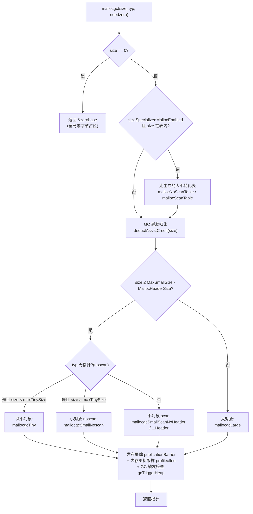
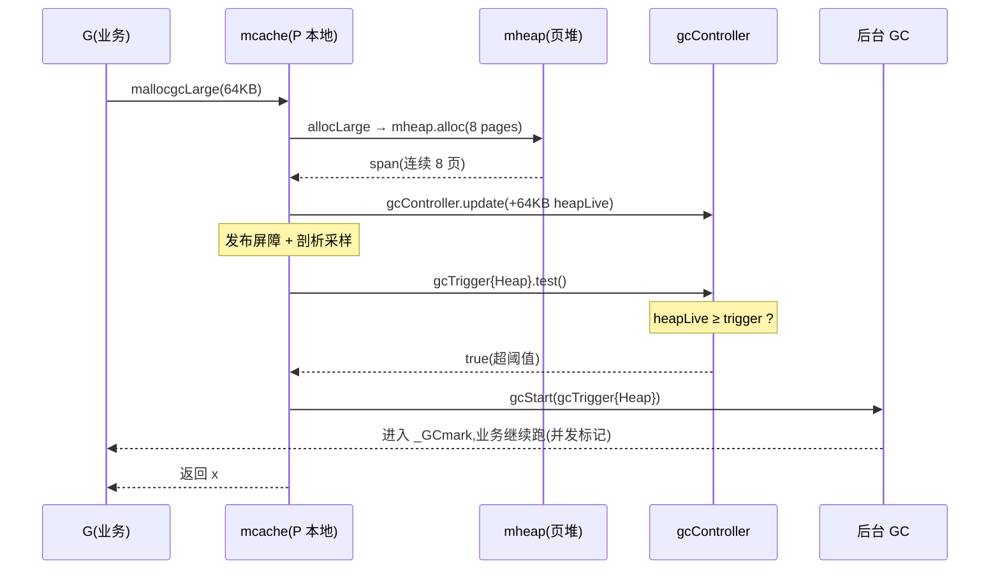

# 第十一章 · 大小对象分配路径

> 篇:第 3 篇 · 内存分配
> 主线呼应:这一章接住第 10 章立起的 mspan/mcache/mcentral/mheap 四级骨架。骨架只是仓库,真正的入口是每一次 `make`/`new` 最终都会落到的那一个函数——[`mallocgc`](../go/src/runtime/malloc.go#L1067)。本章把它一刀切开:微小对象走 tiny allocator 合并、小对象走 mcache + mspan、大对象直接走 mheap,三条路径分得清清楚楚;并且在每条路径的尽头,你会看到同一个动作——检查是否该触发一次 GC。读完本章,你写下的每一个 `make([]byte, 16)` 都不再是一个黑盒。

## 核心问题

**`mallocgc` 这一个函数,怎么把从 1 字节到 32 KB 的小对象、以及更大的对象,分到三条完全不同的路径上?三条路径各自解决什么本质问题,又怎样在尽头把分配和 GC 串起来?**

读完本章你会明白:

1. `mallocgc` 的总流程:零大小短路 → GC 辅助扣账 → 三分支(tiny/small/large)→ 发布屏障 → 内存剖析采样 → 触发 GC 检查。
2. 微小对象的 **tiny allocator**:为什么 Go 要把多个 `< 16 B` 的 noscan 对象塞进同一个 16 字节块,省的是哪两笔开销。
3. 小对象路径:查 size class → `nextFreeFast`(位图)→ `nextFree`/`refill`(回退到 mcentral)的逐级回退。
4. 大对象路径:绕过 mcache/mcentral,直接 `mheap.alloc` 拿连续页。
5. 分配如何成为 GC 的触发点:`gcTrigger{kind: gcTriggerHeap}` 在分配路径上反复被 `.test()`,把"分配太快"和"该回收了"耦合在一起。

> 逃生阀:本章出现 67 个 size class、`spanClass` 的位编码、`allocCache` 位图这些名词时别慌,它们都只是"在快路径上不碰锁"的手段。看不懂某个细节时,回到这一句:三条路径的本质区别是**快路径从哪里取一块内存**(P 本地缓存 / mcentral 全局列表 / 操作系统页堆),其余全是优化。

---

## 11.1 一句话点破

> **`mallocgc` 不是"分配一块内存",而是"按对象大小选三条道":小到不值得单独占一块的(tiny)就合并、正常大小的(small)就从 P 本地的 mspan 里抠一个槽、大到一整页都不够的(large)就绕过所有缓存直接找页堆。三条道在终点都会问同一个问题:堆涨到该 GC 了吗?**

这是结论,不是理由。本章倒过来拆:先看三条道怎么分,再逐道钻进源码,最后看它们如何在终点汇合成同一个 GC 触发检查。

---

## 11.2 `mallocgc` 的总流程:三分天下

让我们从入口函数 [`mallocgc`](../go/src/runtime/malloc.go#L1067-L1206) 的骨架讲起。所有 `new`、所有 `make` 落到堆上的对象、所有栈放不下而逃逸的变量,最终都被编译器翻译成对它的调用。它签名的三个参数交代了分配的全部信息:

```go
// src/runtime/malloc.go —— 分配的总入口(简化,非源码原文)
func mallocgc(size uintptr, typ *_type, needzero bool) unsafe.Pointer
//       size      要分配的字节数
//       typ       对象的类型(决定是否含指针 / 是否需要扫描);nil 表示 noscan
//       needzero  是否必须清零(含指针的对象必须清零,见下文)
```

它的骨架(去掉 sanitizer / debug 钩子)是清晰的几步:



这里有几处设计动机值得单独拎出来,每一处都是"不这样会怎样"。

### (1) 零大小直接短路:`zerobase`

[`mallocgc`](../go/src/runtime/malloc.go#L1074-L1077) 第一件事:

```go
// Short-circuit zero-sized allocation requests.
if size == 0 {
    return unsafe.Pointer(&zerobase)
}
```

`zerobase` 是一个全局的、占 1 字节的地址([`malloc.go:965`](../go/src/runtime/malloc.go#L))。任何 `new(struct{})`、`make([]int, 0)`、`[0]byte` 都会得到**同一个**地址。

> **不这样会怎样**:Go 允许零大小类型,而且用得极多(空结构体当占位符、`chan struct{}` 当信号、`set[T]struct{}` 当集合)。如果每次 `new(struct{})` 真的去分配器拿一块内存,光空结构体的分配就会让堆爆炸,而且每个空结构体还要吃掉一个 size class 的最小块(8 字节)+ 元数据。
>
> **所以这样设计**:把零大小彻底短路,所有零大小对象共享同一个只读地址。它不占堆、不需要 GC、不需要写屏障。
>
> **钉死这件事**:这是"分配器必须为最常见的退化情形留快路径"这条原则的最纯粹范例。后面 tiny/small/large 三条道,本质上是把同样的原则(为常见情形留无锁快路径)用到更大的对象上。

### (2) GC 辅助扣账:分配和回收速率耦合

在真正分配前,如果 GC 正在标记(`gcBlackenEnabled != 0`),要先扣账:

```go
// src/runtime/malloc.go —— L1115 附近
if gcBlackenEnabled != 0 {
    deductAssistCredit(size)
}
```

[`deductAssistCredit`](../go/src/runtime/malloc_stubs.go#L149-L158) 把这次分配的字节数从当前 G 的 `gcAssistBytes` 信用里扣掉;一旦信用为负,就调用 `gcAssistAlloc` 让这个 G **去帮 GC 标记**(mark assist)。

> **不这样会怎样**:如果只靠后台 GC 线程标记,而业务疯狂分配,标记永远跟不上分配,堆会一路涨到 OOM。
>
> **所以这样设计**:谁分配谁出力。分配快的 G 会被强行拽去标记一会儿,把 GC 压力分摊给分配者。这是 Go GC 的招牌反压机制(第 15 章专门拆)。本章只记一句话:**在每条分配路径之前,都有一个扣账点**。

### (3) 三条道:按对象大小分流

真正分配的那一段([`malloc.go:1119-1164`](../go/src/runtime/malloc.go#L1119-L1164))是本章的主角。去掉 sanitizer / debug / 实验 flag 后,逻辑骨架是:

```go
// 简化示意,非源码原文(省去 sizeSpecializedMallocEnabled 双分支)
var x unsafe.Pointer
var elemsize uintptr
if size <= maxSmallSize-gc.MallocHeaderSize {
    // 小对象
    if typ == nil || !typ.Pointers() {
        // noscan(无指针)
        if size < maxTinySize && gp.secret == 0 {
            x, elemsize = mallocgcTiny(size, typ)   // 微小对象:合并
        } else {
            x, elemsize = mallocgcSmallNoscan(size, typ, needzero)
        }
    } else {
        // 含指针
        if heapBitsInSpan(size) {
            x, elemsize = mallocgcSmallScanNoHeader(size, typ)
        } else {
            x, elemsize = mallocgcSmallScanHeader(size, typ)
        }
    }
} else {
    // 大对象
    x, elemsize = mallocgcLarge(size, typ, needzero)
}
```

这里有三个关键的"分水岭常量",全部来自 [`internal/runtime/gc/sizeclasses.go`](../go/src/internal/runtime/gc/sizeclasses.go#L84-L96)(机器生成,`mksizeclasses.go` 产出):

| 常量 | 值 | 含义 |
|---|---|---|
| `TinySize`(`maxTinySize`) | `16` | tiny allocator 的块大小;`size < 16` 才进 tiny |
| `MaxSmallSize` | `32768`(32 KB) | 小对象与大对象的分水岭 |
| `MallocHeaderSize` | `8` | 大对象的类型头(64 位上),见 11.4 |
| `MinSizeForMallocHeader` | `goarch.PtrSize * 64 = 512`(64 位) | 小对象含指针时,"用 span 内 heap bits"与"用每个对象一个 malloc header"的分水岭 |
| `NumSizeClasses` | `68` | size class 总数(含 class 0 = 大对象) |

> **钉死这件事**:Go 1.27 上 tiny 是 16 字节、small 上限是 32 KB、size class 有 67 个(1~67,class 0 留给大对象)。这些数字不是从老资料(8 字节 tiny、65 个 class)抄来的——`mksizeclasses.go` 每个版本会重新算。读 runtime 源码,永远以本地的 `sizeclasses.go` 为准,本章所有数字都核过这份文件。

为什么要把分流做得这么细?因为**不同大小的对象,最优的取块来源完全不同**:

- 微小对象(< 16 B,且不含指针):单独占一个 8 B 或 16 B 的槽,内部碎片 + 对齐开销大得离谱(一个 1 字节对象塞进 8 字节槽 = 87.5% 浪费,见下表)。把它们合并进一个 16 字节块,是 Go 的解法。
- 小对象(16 B ~ 32 KB):走 size class + mspan + mcache,快路径完全无锁。
- 大对象(> 32 KB):一个对象本身就跨多页,塞进 size class 的定长槽没意义,直接向页堆要连续页。

下面三节,逐道钻。

---

## 11.3 微小对象路径:tiny allocator——把几个小对象塞进一个块

### 提出问题:小对象单独分配的浪费

看 [`sizeclasses.go`](../go/src/internal/runtime/gc/sizeclasses.go#L6-L17) 表头那一列 `max waste`:

```
// class  bytes/obj  bytes/span  objects  tail waste  max waste  min align
//     1          8        8192     1024           0     87.50%          8
//     2         16        8192      512           0     43.75%         16
//     3         24        8192      341           8     29.24%          8
```

class 1 的对象是 8 字节,最大浪费 87.50%。这个数字怎么来的?一个 1 字节的对象(比如 `bool`、`int8`、空 `struct{}` 之外的极小逃逸变量)如果走 class 1,实际要占 8 字节——**7 字节是纯浪费**。最坏情况下,你有一堆 1 字节对象,实际堆占用是逻辑占用的 8 倍。

更糟的是,这些小对象往往是**短生命周期的临时字符串、零长切片的底层数组、 escaping 的标量**。它们:

- **不含指针**(纯数据,GC 不用扫描它们)。
- **量极大**(JSON 解析、字符串拼接,一次产生成百上千个)。
- **生命周期错落**(有的马上丢,有的活很久)。

如果每个都独占一个槽,内存浪费 + cache 不友好 + mspan 切换开销,三项叠加。

### 不这样会怎样

> **不这样会怎样**:朴素解法是"小对象按 size class 分"。一个 1 字节对象 → class 1(8 字节槽),一个 5 字节对象 → class 1(8 字节槽)。于是 10 个 1 字节对象要 80 字节,而逻辑上只要 10 字节。JSON benchmark 上,光这些小对象就能让堆膨胀好几倍,`runtime.ReadMemStats` 报出来的 `HeapAlloc` 比实际数据量大一个量级。

### 所以这样设计:tiny allocator

Go 的解法在 [`mallocgcTiny`](../go/src/runtime/malloc.go#L1208-L1362) 顶部的注释里写得清清楚楚:

```go
// src/runtime/malloc.go —— L1224-L1252(注释)
// Tiny allocator.
//
// Tiny allocator combines several tiny allocation requests
// into a single memory block. The resulting memory block
// is freed when all subobjects are unreachable. The subobjects
// must be noscan (don't have pointers), this ensures that
// the amount of potentially wasted memory is bounded.
//
// Size of the memory block used for combining (maxTinySize) is tunable.
// Current setting is 16 bytes, which relates to 2x worst case memory
// wastage (when all but one subobjects are unreachable).
// 8 bytes would result in no wastage at all, but provides less
// opportunities for combining.
// 32 bytes provides more opportunities for combining,
// but can lead to 4x worst case wastage.
//
// Objects obtained from tiny allocator must not be freed explicitly.
//
// The main targets of tiny allocator are small strings and
// standalone escaping variables. On a json benchmark
// the allocator reduces number of allocations by ~12% and
// reduces heap size by ~20%.
```

机制:每个 P 的 `mcache` 里维护一个**当前 tiny 块**(`c.tiny` 指向块基址、`c.tinyoffset` 记录已用偏移)。一次新的 `< 16 B` 的 noscan 分配,先看能否塞进当前块;塞得下就直接用,塞不下就向 mcache 申请一个新的 16 字节块(size class 2,noscan),作为新的 tiny 块。

```go
// src/runtime/malloc.go —— L1253-L1296(简化,非源码原文,保留关键行)
c := getMCache(mp)
off := c.tinyoffset
// 按对象的对齐要求,把 off 向上对齐(8/4/2/1 字节)
if size&7 == 0 {
    off = alignUp(off, 8)
} else if size&3 == 0 {
    off = alignUp(off, 4)
} else if size&1 == 0 {
    off = alignUp(off, 2)
}
if off+size <= maxTinySize && c.tiny != 0 {
    // 塞得进当前 tiny 块:直接用
    x := unsafe.Pointer(c.tiny + off)
    c.tinyoffset = off + size
    c.tinyAllocs++
    return x, 0
}
// 塞不进:申请一个新的 16 字节块
span := c.alloc[tinySpanClass]            // tinySpanClass = spanClass(2<<1 | 1) = 5
v := nextFreeFast(span)
if v == 0 {
    v, span, checkGCTrigger = c.nextFree(tinySpanClass)
}
x := unsafe.Pointer(v)
(*[2]uint64)(x)[0] = 0 // 整块清零
(*[2]uint64)(x)[1] = 0
// 若新块的剩余空间比旧块大,就替换当前 tiny 块
if !raceenabled && (size < c.tinyoffset || c.tiny == 0) {
    c.tiny = uintptr(x)
    c.tinyoffset = size
}
```

注意几个细节,每一个都对应一个"为什么 sound":

1. **`tinySpanClass = spanClass(tinySizeClass<<1 | 1) = 5`**:size class 2(16 字节),最低位 `1` 表示 `noscan`。tiny 块**只收 noscan 对象**——这一条是 sound 的关键(见下)。
2. **整块清零(`(*[2]uint64)(x)[0] = 0; [1] = 0`)**:新块必须清零,因为后续每个子对象占用的字节不会再单独清零。
3. **`c.tinyoffset = off + size`**:下一个子对象从新偏移开始,中间的对齐 padding 是隐式浪费,但被 16 字节块大小封顶。
4. **替换当前 tiny 块的判断 `size < c.tinyoffset`**:如果新块用得更少(剩余空间更大),就把它设为当前块,把旧块留着等 GC 回收。这保证当前 tiny 块总是"剩余空间较大"的那个,提高后续命中率。

### 为什么 tiny 只收 noscan 对象:这是 sound 的关键

这是整章最重要的一个"为什么"。注释里那一句 `The subobjects must be noscan, this ensures that the amount of potentially wasted memory is bounded` 信息量极大,拆开:

- 一个 16 字节的 tiny 块里,可能塞了 **1 个、2 个、3 个** 子对象(比如 1 个 1 字节、1 个 4 字节、1 个 8 字节)。
- 这三个子对象**没有独立的边界**:GC 从堆上扫到这块内存时,它看到的就是"一个 16 字节的对象",它**不知道**里面有几个子对象、各自的边界在哪。
- 如果子对象**含指针**,GC 必须能扫到每个子对象里的指针才能不漏标活对象。但 GC 看不见子对象边界,只能要么全扫(把 padding 当指针,误标)、要么全不扫(漏标活对象,致命)。两条路都走不通。
- 如果子对象**全是 noscan**(纯数据,不含指针),GC 根本不需要扫进这块——它只要在**整个 16 字节块里没有任何子对象被引用**时,才回收整块。GC 的视角里,它就是"一个 16 字节的 noscan 对象,不用扫",完美。

> **钉死这件事**:tiny allocator 的"合并"之所以 sound,前提是被合并的对象**不含指针**。`mallocgcTiny` 的入口 `if typ == nil || !typ.Pointers()`(实际由 `mallocgc` 在分流时保证)钉死了这一点。这就是为什么 tiny 只服务小字符串、独立 escaping 标量这类纯数据——它们没有指针,合并后 GC 视角下只是一个不扫描的块。`mallocgcTiny` 里那句 `if typ != nil && typ.Pointers() { throw("expected noscan for tiny alloc") }`([L1218-L1220](../go/src/runtime/malloc.go#L1218-L1220))就是这条不变式的断言。

代价呢?tiny 块内部的子对象**不能被单独 free**(`Objects obtained from tiny allocator must not be freed explicitly`)。整块要等所有子对象都不可达,才会被 GC 当作一个 16 字节对象回收。最坏情况(16 字节块里只活着一个 1 字节对象),浪费 15 字节——但 16 字节这个选择,正好把最坏浪费钉死在 2 倍以内(注释的 `2x worst case memory wastage`)。如果改成 8 字节块,浪费为 0 但合并机会少;改成 32 字节块,合并机会多但最坏浪费 4 倍。16 是经过 benchmark 调出来的甜点。

下面这张图把一个 16 字节 tiny 块的内部布局画出来:

```
 mcache.tiny ──► ┌─────────────────────────────────────────────────────────────┐
                  │ 一个 16 字节的 tiny 块(来自 size class 2,noscan)         │
                  ├──────┬──────┬───────┬──────────┬──────────────────────────┤
                  │ obj1 │ pad  │ obj2  │  obj3    │       未用(pending)      │
                  │ 1 B  │ 1 B  │ 4 B   │  8 B     │       2 B                │
                  └──────┴──────┴───────┴──────────┴──────────────────────────┘
                  ▲                                                       ▲
                  tiny                                            tinyoffset = 14
                  (块基址)
   GC 视角:整个 16 字节是一个 noscan 对象,不扫描内部,整块回收。
```

下一节讲完小对象路径,你就能完整理解 tiny 块本身是怎么从 mcache 里"抠"出来的(它走的也是 size class 2 + `nextFreeFast`,只不过块大小固定 16 字节)。

---

## 11.4 小对象路径:size class + mcache,无锁快路径

### 提出问题:大量中等对象,如何又快又省锁

介于 16 字节和 32 KB 之间的对象是小对象的主力区。一个 Web 服务每秒分配成千上万个这种对象(请求结构体、响应 buffer、map/slice)。对它们的要求:

- **快**:每次分配是纳秒到百纳秒级,不能进锁。
- **无碎片**:不同大小的对象要各得其所,不能 50 字节对象塞 64 字节槽浪费 14 字节、也不能 80 字节对象塞 64 字节槽失败。
- **GC 友好**:每个对象的边界、类型、指针位置要让 GC 能扫到。

### 不这样会怎样

> **不这样会怎样**:朴素分配器(比如 glibc 的 ptmalloc)用一个或几个全局 free list,所有线程竞争同一把锁。一个 32 核机器上,每秒几十万次分配,锁竞争会成为吞吐瓶颈。另一种朴素解法是"每个 size 一个 free list",但 size 是连续的(从 17 到 32768 有几万种),无法穷举。

### 所以这样设计:size class + mcache(P 本地缓存)

Go 的解法分两层:

1. **把连续的 size 离散化成 67 个 size class**。任何 `size` 都向上取整到最近的 class——比如 17 字节进 class 2(16 字节?不对,17 > 16,进 class 3 = 24 字节)、50 字节进 class 5(48 字节?50 > 48,进 class 6 = 64 字节)。这一步把"几万种大小"压缩成"67 个定长块",内部碎片可控(平均 < 12%,见 size class 表的 `max waste` 列)。
2. **每个 P 有自己的 `mcache`,缓存每个 size class 一个 mspan**。分配时只在 P 本地的 mspan 上找空闲槽,**完全不碰锁**。

这两步的源码就在 [`mallocgcSmallNoscan`](../go/src/runtime/malloc.go#L1364-L1460)(noscan 小对象)和 [`mallocgcSmallScanNoHeader`](../go/src/runtime/malloc.go#L1509-L1598)(含指针小对象)里。两者结构几乎一样,以 noscan 为例:

```go
// src/runtime/malloc.go —— L1380-L1408(简化,非源码原文)
c := getMCache(mp)
// (1) 把 size 映射到 size class
var sizeclass uint8
if size <= gc.SmallSizeMax-8 {           // SmallSizeMax = 1024
    sizeclass = gc.SizeToSizeClass8[divRoundUp(size, gc.SmallSizeDiv)]  // SmallSizeDiv = 8
} else {
    sizeclass = gc.SizeToSizeClass128[divRoundUp(size-gc.SmallSizeMax, gc.LargeSizeDiv)]  // LargeSizeDiv = 128
}
size = uintptr(gc.SizeClassToSize[sizeclass])  // 取整到 class 的对象大小
spc := makeSpanClass(sizeclass, true)           // true = noscan
span := c.alloc[spc]                            // P 本地 mcache 里的那个 mspan

// (2) 快路径:在 mspan 上找一个空闲槽
v := nextFreeFast(span)
if v == 0 {
    // (3) 慢路径:这个 mspan 用完了,回退到 mcentral 拿一个新的
    v, span, checkGCTrigger = c.nextFree(spc)
}
x := unsafe.Pointer(v)
if needzero && span.needzero != 0 {
    memclrNoHeapPointers(x, size)               // 首次使用才清零
}
```

这里有三个技巧,逐个拆。

#### 技巧 A:两段查表,把 size 映射成 size class

`size` 到 `sizeclass` 不是用除法 + 二分,而是**两张预计算的查表**:

```go
var SizeToSizeClass8  = [SmallSizeMax/SmallSizeDiv + 1]uint8{...}    // [0..128],步长 8 字节
var SizeToSizeClass128 = [(MaxSmallSize-SmallSizeMax)/LargeSizeDiv + 1]uint8{...}  // [0..247],步长 128 字节
```

- `SmallSizeMax = 1024`:≤ 1024 字节的小对象用 `SizeToSizeClass8`,索引 = `divRoundUp(size, 8)`,即每 8 字节一个槽,共 129 个槽。
- `> 1024` 字节的用 `SizeToSizeClass128`,索引 = `divRoundUp(size-1024, 128)`,每 128 字节一个槽,共 248 个槽。

> **反面对比**:朴素做法是对 67 个 class 做二分查找,`O(log 67) ≈ 7` 次比较 + 分支预测失败。Go 用两张总大小 < 400 字节的表,一次 `divRoundUp`(编译成乘法 + 移位)+ 一次数组下标,完成映射。两条表都进了 L1 cache,这是 size class 查找的物理基础。
>
> **为什么分两张表**:小对象(≤ 1024)的密度高(每 8 字节一档),用细表 `SizeToSizeClass8`;大对象(> 1024)密度低(每 128 字节一档),用粗表 `SizeToSizeClass128`。一张统一表要么小对象粒度不够、要么表太大。两段切是在"表大小"和"映射精度"之间的工程权衡。

#### 技巧 B:`nextFreeFast`——64 位 allocCache,一次 `TrailingZeros64` 找空闲槽

[`nextFreeFast`](../go/src/runtime/malloc.go#L969-L985) 是小对象路径最热的函数,它做的事让人拍案:

```go
// src/runtime/malloc.go —— L969-L985
func nextFreeFast(s *mspan) gclinkptr {
    theBit := sys.TrailingZeros64(s.allocCache) // allocCache 里有空闲对象吗?
    if theBit < 64 {
        result := s.freeindex + uint16(theBit)
        if result < s.nelems {
            freeidx := result + 1
            if freeidx%64 == 0 && freeidx != s.nelems {
                return 0  // allocCache 用完了,得回退到 nextFree
            }
            s.allocCache >>= uint(theBit + 1)
            s.freeindex = freeidx
            s.allocCount++
            return gclinkptr(uintptr(result)*s.elemsize + s.base())
        }
    }
    return 0
}
```

`allocCache` 是 mspan 的一个 `uint64` 字段,缓存了接下来 64 个槽的分配状态:**bit 为 1 表示空闲,bit 为 0 表示已分配**(从 mspan 的 `allocBits` 位图里 8 字节一 refill 进来,见 [`mspan.refillAllocCache`](../go/src/runtime/mbitmap.go#L1097))。

找下一个空闲槽 = 找 `allocCache` 里**最低位的 1** = 一条 CPU 指令 `BSF` / `TZCNT`(`sys.TrailingZeros64` 编译成它)。然后右移掉用过的位,下次直接复用。

> **反面对比**:朴素做法是遍历 `allocBits` 位图逐 bit 找,或者维护一个 free list 链表(每次 push/pop)。位图遍历是 `O(对象数)`,链表是每次一次解引用 + 缓存未命中。Go 的 64 位 cache + `TrailingZeros64` 是 `O(1)` 一条指令,且 64 个槽的状态在一个寄存器里,cache 完美命中。
>
> **为什么 sound**:`allocCache` 是 mspan 私有的,而 mspan 此刻被某个 P 的 mcache 独占(详见第 10 章 sweepgen 机制),所以对 `allocCache` 的读改写**不需要原子操作**。无锁的物理基础是"这个 mspan 此刻只属于我"。这就是第 10 章讲的 `sweepgen = mheap_.sweepgen + 3`(cache 态)的意义——它不只是个状态标记,更是无锁访问的契约。

#### 技巧 C:`nextFree` / `refill`——快路径失败,回退到 mcentral

当一个 mspan 的 `allocCache` 用光(`nextFreeFast` 返回 0)或整个 mspan 满(`nextFreeIndex() == nelems`),就走 [`nextFree`](../go/src/runtime/malloc.go#L996-L1024):

```go
// src/runtime/malloc.go —— L996-L1024(简化,非源码原文)
func (c *mcache) nextFree(spc spanClass) (v gclinkptr, s *mspan, checkGCTrigger bool) {
    s = c.alloc[spc]
    freeIndex := s.nextFreeIndex()
    if freeIndex == s.nelems {
        // 这个 mspan 用满了
        c.refill(spc)              // 把满 mspan 还给 mcentral,拿一个有空位的来
        checkGCTrigger = true      // 标记:这是一次"重"分配,要检查 GC
        s = c.alloc[spc]
        freeIndex = s.nextFreeIndex()
    }
    v = gclinkptr(uintptr(freeIndex)*s.elemsize + s.base())
    s.allocCount++
    return
}
```

`refill`([`mcache.go:160`](../go/src/runtime/mcache.go#L160))做两件事:把满 mspan 通过 `mheap_.central[spc].mcentral.uncacheSpan(s)` 还给对应的 mcentral,再 `mheap_.central[spc].mcentral.cacheSpan()` 拿一个**有空闲槽的**新 mspan。这一步**才进锁**——mcentral 的锁。但因为它一次拿回一整个 mspan(几十到几百个对象),锁竞争被摊平到"每几十次分配才一次"。

> **钉死这件事**:`nextFreeFast` 是无锁快路径,`nextFree`/`refill` 是有锁慢路径。两者配合,小对象分配 99% 走快路径(纳秒级),偶尔 miss 才进慢路径(微秒级,但一次性补满 cache)。这是 TCMalloc 思想的核心:用分层缓存,把锁竞争挤到罕见路径上。第 10 章立了骨架,本章把"骨架上跑的流量"讲清。

#### 含指针小对象:`ScanNoHeader` 与 `ScanHeader` 的分水岭

含指针的小对象在分配时还要多一步——**写类型信息让 GC 知道指针在哪**。Go 1.27 把这部分按 `heapBitsInSpan(size)` 拆成两条:

```go
// src/runtime/malloc.go —— L1130-L1134
if heapBitsInSpan(size) {
    x, elemsize = mallocgcSmallScanNoHeader(size, typ)
} else {
    x, elemsize = mallocgcSmallScanHeader(size, typ)
}
```

[`heapBitsInSpan`](../go/src/runtime/mbitmap.go#L76-L80) 的定义就一行:`return userSize <= gc.MinSizeForMallocHeader`,而 `MinSizeForMallocHeader = goarch.PtrSize * 64 = 512`(64 位)。也就是说:

- **size ≤ 512**:指针位置存在 **span 级别的 heap bits**(每个 mspan 自带一个位图,128 字节开销,见 [`gc/malloc.go` 的注释](../go/src/internal/runtime/gc/malloc.go#L32-L37))。这条路径(NoHeader)对象本身不带额外开销,适合小对象密集场景。
- **size > 512**:每个对象自己带一个 8 字节的 **malloc header**(`MallocHeaderSize = 8`),header 里存类型指针。这条路径(Header)在 size class ≥ 19(576 字节那一档)启用。

> **为什么这么切**:span heap bits 是定长 128 字节(64 位),均摊到每个对象上是 `128 / 对象数`。对象越大、每个 mspan 的对象数越少,heap bits 的均摊开销越高。到 512 字节(每 mspan 16 个对象)时,heap bits 的均摊开销(128/16 = 8 字节)正好等于一个 malloc header(8 字节)的开销——再大就该换成 per-object header 了。这是个精确的成本交叉点,`mksizeclasses.go` 算出来的。

无论 NoHeader 还是 Header,核心的 `nextFreeFast`/`nextFree` 取槽流程完全一样,区别只在写类型元数据。本章不展开写类型的细节(那是第 13 章写屏障和第 14 章 GC 扫描的地盘),记住一点:**含指针对象必须 `needzero`**,所以 `mallocgc` 里有那条 `if !needzero { throw("objects with pointers must be zeroed") }`([L1086-L1088](../go/src/runtime/malloc.go#L1086-L1088))——含指针对象不清零会让 GC 把垃圾指针当活指针,致命。

---

## 11.5 大对象路径:直接找 mheap,绕过 mcache

### 提出问题:一个对象就跨好几页,塞 size class 没意义

`size > MaxSmallSize - MallocHeaderSize = 32768 - 8 = 32760` 的对象是大对象(实际上分流判断用 `MaxSmallSize - MallocHeaderSize` 作为上界,因为含指针的大对象要留出 8 字节 header 空间)。一个 64 KB 的 buffer、一个 1 MB 的图片数组,都属于这一类。

对大对象:

- 它本身已经跨多页(8 KB / 页),塞进"一个 mspan = 一个 size class 的定长块"这套体系没意义——为它专门建一个 size class 太浪费(用得少)。
- 大对象数量少,但每个都大,对锁竞争不敏感(每个 P 不会有"高频缓存大对象"的需求)。
- 它的内存最好直接从页堆按页分配,简单、连续、好回收。

### 不这样会怎样

> **不这样会怎样**:如果大对象也走 mcache/mcentral,要么为每个大 size 维护一个 mspan 缓存(内存爆炸),要么让多个 P 竞争同一个大对象 mcentral(锁竞争)。两种都不如"直接找页堆要连续页"。

### 所以这样设计:`mallocgcLarge` → `mheap.alloc`

大对象走 [`mallocgcLarge`](../go/src/runtime/malloc.go#L1693-L1793),核心就几行:

```go
// src/runtime/malloc.go —— L1706-L1714(简化,非源码原文)
c := getMCache(mp)
// 大对象:直接向页堆要 npages 个连续页
span := c.allocLarge(size, typ == nil || !typ.Pointers())
span.freeindex = 1
span.allocCount = 1
span.largeType = nil  // 先告诉 GC"别看这个 span 的类型",下面清零后才写
size = span.elemsize  // 实际分配的页对齐大小
x := unsafe.Pointer(span.base())
```

`allocLarge`([`mcache.go:242`](../go/src/runtime/mcache.go#L242))做的事:

```go
// src/runtime/mcache.go —— L242-L287(简化,非源码原文)
func (c *mcache) allocLarge(size uintptr, noscan bool) *mspan {
    npages := size >> gc.PageShift          // PageShift = 13,8 KB/页
    if size&pageMask != 0 {
        npages++                             // 不是整页,向上取整
    }
    deductSweepCredit(npages*pageSize, npages)  // 先还清扫债
    spc := makeSpanClass(0, noscan)          // sizeclass = 0 表示大对象
    s := mheap_.alloc(npages, spc)           // 直接找页堆
    ...
    s.limit = s.base() + size                // 收紧 limit 到对象实际边界
    s.initHeapBits()
    return s
}
```

注意:

- **`makeSpanClass(0, noscan)`**:size class = 0 是大对象的专属标记,GC 一看 size class 0 就知道这是大对象 span,整个 span 就是一个对象。
- **`mheap_.alloc(npages, spc)`**([`mheap.go:997`](../go/src/runtime/mheap.go#L997)):走 `systemstack`(切到系统栈,避免栈增长时再触发堆分配的死锁),再 `allocSpan` 从页堆的 radix tree / free page 找连续 `npages` 页。
- **`s.limit = s.base() + size`**:把 span 的有效边界收紧到对象实际占用,而不是整个 span 的页边界。这样保守扫描(conservative scan)不会越界。
- **清零延迟到大对象路径的尾部**(`memclrNoHeapPointersChunked`,[L1769](../go/src/runtime/malloc.go#L1769)):大对象清零可能很久(1 MB 要清 1 MB),所以放到一个**可抢占的上下文**里做,避免长时间 STW。这是 `// This is a possible preemption point: see #47302` 那条注释的含义。

大对象路径绕过 mcache/mcentral,直接进 mheap 全局锁。但因为大对象分配频率低(一个服务一秒几次到几十次),这把锁的竞争远没有小对象那么剧烈。

---

## 11.6 三条路径的共同终点:发布屏障、剖析采样、触发 GC

三条道不管走哪条,在返回前都要做三件相同的事。这三件事是分配器作为"GC 与分配耦合点"的核心。

### (1) 发布屏障 `publicationBarrier`:让 GC 看到一致的对象状态

每条路径在 `x` 可被业务观察之前,都会调一次 [`publicationBarrier`](../go/src/runtime/malloc.go)(tiny 路径在 [L1304](../go/src/runtime/malloc.go#L1304)、small noscan 在 [L1416](../go/src/runtime/malloc.go#L1416)、small scan 在 [L1556](../go/src/runtime/malloc.go#L1556)、large 在 [L1723](../go/src/runtime/malloc.go#L1723) 和 [L1790](../go/src/runtime/malloc.go#L1790))。它本质是一条内存屏障(弱内存序架构上是 `fence`,强内存序架构上编译成空操作)。

> **不这样会怎样**:在 ARM/POWER 这类弱内存序机器上,业务线程把 `x` 写进某个全局变量、GC 线程同时扫到那个全局变量——如果 `x` 的清零 / 类型写入没有发布屏障,GC 可能**先看到指针、后看到未初始化的内存或过期的 heap bits**,把垃圾当活对象、或把活对象当垃圾。
>
> **所以这样设计**:在 `x` 完全初始化(清零 + 类型信息写好)和 GC 可能观察到它之间,插一道屏障,保证"GC 看到指针 ⟹ GC 看到一致的对象状态"。这是分配和 GC 并发的正确性锚点。

### (2) 写屏障期间"分配为黑":`gcmarknewobject`

如果 GC 正在标记(`writeBarrier.enabled`),新分配的对象会被直接标黑([L1311](../go/src/runtime/malloc.go#L1311) 等):

```go
if writeBarrier.enabled {
    // Allocate black during GC.
    gcmarknewobject(span, uintptr(x))
} else {
    span.freeIndexForScan = span.freeindex  // 记录扫描基准
}
```

> **为什么 sound**:GC 标记期间,业务还在分配。新对象如果默认是白的,GC 可能扫不到它就标记结束,把它当垃圾回收——但业务还在用!解法是:标记期间分配的对象**直接标黑**(等价于"已知是活的"),GC 跳过它。这是三色标记在并发分配下的不变式,第 13/14 章会展开。

### (3) 内存剖析采样:`profilealloc`

每条路径都会递减 `c.nextSample`,到 0 就采样一次([L1333-L1336](../go/src/runtime/malloc.go#L1333-L1336)):

```go
c.nextSample -= int64(span.elemsize)
if c.nextSample < 0 || MemProfileRate != c.memProfRate {
    profilealloc(mp, x, span.elemsize)
}
```

`nextSample` 在 `allocmcache` 时初始化为 [`nextSample()`](../go/src/runtime/malloc.go#L2239-L2249) 的返回值——一个**指数分布**的随机间隔(均值 = `MemProfileRate = 512 KB`,见 [`mprof.go:870`](../go/src/runtime/mprof.go#L))。

> **为什么是指数分布而不是均匀采样**:均匀采样(每 N 次采一次)对小对象不公平(一个 1 KB 对象和一个 64 KB 对象被采样的概率按"次数"算差 64 倍,但按"字节"算应该一样)。指数分布按**字节数**采样,让大小对象被采样的概率和它的字节数成正比,统计上无偏。`pprof` 的堆剖析能正确反映"哪些分配吃掉了最多内存",靠的就是这个。

### (4) 触发 GC 检查:分配是 GC 的主触发点

这是本章标题的后半句——**分配触发 GC**。看每条路径的尾部:

```go
// tiny 路径(L1340-L1344,只在 checkGCTrigger 为真时检查,即 nextFree refill 过)
if checkGCTrigger {
    if t := (gcTrigger{kind: gcTriggerHeap}); t.test() {
        gcStart(t)
    }
}

// small scan 路径(L1592-L1596,同样只在 refill 后检查)
if checkGCTrigger {
    if t := (gcTrigger{kind: gcTriggerHeap}); t.test() {
        gcStart(t)
    }
}

// large 路径(L1759-L1762,每次大对象分配都检查——大对象一次涨很多)
if t := (gcTrigger{kind: gcTriggerHeap}); t.test() {
    gcStart(t)
}
```

[`gcTrigger`](../go/src/runtime/mgc.go#L678-L682) 是一个"该不该启动 GC"的谓词:

```go
// src/runtime/mgc.go —— L678-L701
type gcTrigger struct {
    kind gcTriggerKind
    now  int64  // gcTriggerTime 用
    n    uint32 // gcTriggerCycle 用
}

const (
    gcTriggerHeap gcTriggerKind = iota  // 堆涨到阈值
    gcTriggerTime                        // 距上次 GC 超过 2 分钟
    gcTriggerCycle                       // 手动 runtime.GC()
)
```

本章只看 `gcTriggerHeap`,它的 [`test()`](../go/src/runtime/mgc.go#L706-L725):

```go
// src/runtime/mgc.go —— L706-L713(简化)
func (t gcTrigger) test() bool {
    if !memstats.enablegc || panicking.Load() != 0 || gcphase != _GCoff {
        return false
    }
    switch t.kind {
    case gcTriggerHeap:
        trigger, _ := gcController.trigger()
        return gcController.heapLive.Load() >= trigger
    ...
}
```

逻辑极其朴素:**当前活堆(`heapLive`)≥ pacer 算出来的触发阈值(`trigger`)就启动一次 GC**。`heapLive` 在每次分配(尤其 `refill` 和 `allocLarge`)时通过 [`gcController.update`](../go/src/runtime/mgcpacer.go#L952) 累加;`trigger` 由 pacer 根据 `GOGC`(默认 100,即堆翻倍)和上一轮回收后的 `heapMarked` 算出来(详见第 14 章)。

> **钉死这件事**:GC 不是定时触发的(虽然有 `gcTriggerTime` 兜底,2 分钟没 GC 就强制一次),主触发点是**分配**。具体到代码,是三类位置:
> 1. tiny / small 路径的 `nextFree`/`refill` 之后(因为 refill 会给 `heapLive` 加上整个新 mspan 的预估占用,这是一次"重"分配,可能跨过阈值);
> 2. large 路径每次分配后(大对象一次性涨 `npages * 8KB`,最容易跨阈值);
> 3. 全局 `mallocgc` 入口的 `deductAssistCredit`(分配快时被拽去做 mark assist,见第 15 章)。
>
> 这就是"分配触发 GC"的完整含义:分配器既是内存的供给方,又是 GC 的发起方。这条耦合是 Go runtime 把"快"和"不丢不乱"拧在一起的命脉。

下面这张时序图把一次大对象分配触发 GC 的完整链路画出来:



---

## 11.7 技巧精解:tiny allocator 的合并,以及它必须 sound 的两条铁律

本章最硬核的技巧是 tiny allocator。前面 11.3 讲了它的机制,这里把"它凭什么 sound"再钉死两条铁律,并配反面对比。

### 铁律一:被合并的对象必须 noscan

前面已说过:tiny 块内的子对象没有独立边界,GC 看到的只是"一个 16 字节的 noscan 对象"。如果允许含指针对象进 tiny,GC 要么漏标(把活指针当 padding 不扫)、要么误标(把 padding 当指针追),两种都致命。

这条铁律在源码里被钉了**三层**:

1. **入口分流层**(`mallocgc`):只有 `typ == nil || !typ.Pointers()` 才可能进 tiny([L1080](../go/src/runtime/malloc.go#L1080)、[L1124](../go/src/runtime/malloc.go#L1124))。
2. **函数内部断言层**(`mallocgcTiny`):`if typ != nil && typ.Pointers() { throw("expected noscan for tiny alloc") }`([L1218-L1220](../go/src/runtime/malloc.go#L1218-L1220))。运行时直接 `throw`(不可恢复),任何误调用立即崩溃。
3. **span class 层**:tiny 块来自 `tinySpanClass = spanClass(2<<1 | 1)`,最低位 `1` = noscan。GC 扫到这个 span,看到 `noscan` 位就直接跳过整个 span,不会试图扫内部。

> **反面对比**:如果某个版本为了"让更多小对象享受合并"而放松这条铁律,允许 8 字节指针对象进 tiny——结果就是 GC 偶发漏标活对象,表现为"程序在压力下随机崩溃,栈指向已回收内存"。这种 bug 极难复现,是 GC 分配器最阴险的正确性陷阱。Go 用三层防御把它焊死。

### 铁律二:整块回收,子对象不能单独 free

tiny 块内的子对象没有独立的 free 操作。`mallocgcTiny` 返回的指针,业务用完即丢,**GC 要等整个 16 字节块里所有子对象都不可达**,才把整块当作一个 16 字节对象回收。

这条铁律的代价是**潜在的生命周期捆绑**:一个长寿的小对象和一堆短命的小对象挤在同一个 tiny 块,整块要等长寿的那个死了才能回收——最坏 15 字节的"僵尸空间"被长寿对象拖着不释放。

Go 的应对是:

- **块大小钉死 16 字节**:最坏浪费 = 16 - 1 = 15 字节,绝对值小;相对浪费 ≤ 16 倍(对一个 1 字节对象),但 1 字节对象本身就不该多。注释里那句 `2x worst case memory wastage` 指的是**平均最坏**,不是绝对最坏。
- **替换策略**(`size < c.tinyoffset` 时换当前块):保证当前 tiny 块总是剩余空间较大的那个,降低"新来的小对象塞不进当前块"的概率,间接降低生命周期捆绑的概率。

> **反面对比**:朴素解法是给每个子对象一个 8 字节的 header 记录引用计数,引用计数归零就回收子对象。但 header 本身就 8 字节,比某些子对象(1 字节)还大,完全违背了 tiny 的初衷(省内存)。而且引用计数在并发下要么加锁、要么用原子,都比"整块回收"贵得多。Go 选了"接受最坏 15 字节浪费,换零额外开销 + 无锁"。

### 一张图总结 tiny allocator 的取舍

```
                    ┌────────────────── tiny allocator 的设计取舍 ──────────────────┐
                    │                                                                │
   收益(省的是这两笔)│  1. 内部碎片:1 字节对象不再独占 8 字节槽(省 7 字节/对象)    │
                    │  2. 分配次数:N 个小对象合并成 ⌈N*size/16⌉ 次 alloc(省锁/cache) │
                    │                                                                │
   代价(付的是这两笔)│  1. 子对象不能单独 free(整块回收,最坏 15 字节僵尸空间)       │
                    │  2. 只收 noscan(含指针对象被排除,走 small noscan/scan 路径)  │
                    │                                                                │
   sound 的铁律     │  1. 入口分流 + 函数断言 + span class 三层钉死 noscan           │
                    │  2. 块大小 16 字节,把最坏浪费封顶在 2 倍平均                   │
                    │                                                                │
   实测收益(JSON)  │  分配数 -12%,堆大小 -20%(源码注释 L1251-L1252)              │
                    └────────────────────────────────────────────────────────────────┘
```

---

## 章末小结

这一章把第 10 章立起的 mspan/mcache/mcentral/mheap 骨架,跑上了真实的流量。`mallocgc` 一个函数,按对象大小分到三条道:

1. **微小对象(< 16 B,noscan)**:tiny allocator 合并进 16 字节块,省内部碎片 + 分配次数;代价是子对象不能单独 free、且必须 noscan。
2. **小对象(16 B ~ 32 KB)**:查 size class 表 → mcache 本地 mspan 上 `nextFreeFast`(64 位 allocCache + `TrailingZeros64`,无锁)→ miss 则 `nextFree`/`refill` 回退到 mcentral(进锁,但一次补满)。
3. **大对象(> 32 KB)**:`mallocgcLarge` → `mheap.alloc` 直接拿连续页,绕过 mcache/mcentral。

三条道在终点汇合,做三件相同的事:**发布屏障**(让 GC 看到一致的对象)、**写屏障期间分配为黑**(并发标记不变式)、**剖析采样**(指数分布,字节无偏)。最后,在 tiny/small 的 refill 后和大对象的每次分配后,**检查 `gcTrigger{kind: gcTriggerHeap}.test()`**——堆涨到 pacer 阈值就 `gcStart`。分配器既是内存供给方,又是 GC 发起方,这是"快 vs 不丢不乱"拧在一起的命脉。

本章服务的二分法:**支撑地基(内存)**。`mallocgc` 是 GMP 调度和 GC 之外的第三根基柱——没有它,goroutine 没栈可分、业务对象没处放、GC 也没东西可回收。它和 GC 的耦合(触发 + 辅助 + 标黑),把"内存分配"和"内存回收"变成了同一根循环的两端。

### 五个"为什么"清单

1. **为什么 `mallocgc` 要分三条道?** 不同大小对象的最优取块来源不同:微小对象合并省碎片、小对象走 P 本地无锁缓存、大对象直接拿页堆连续页。一刀切(比如全走 size class)要么碎片爆炸、要么锁竞争剧烈。
2. **为什么 tiny 只收 noscan 对象?** tiny 块内子对象无独立边界,GC 只能看到整块。含指针对象会让 GC 漏标(致命)或误标。入口分流 + 函数 throw + span class 三层钉死这条不变式。
3. **为什么 `nextFreeFast` 能无锁?** 它操作的 `allocCache` 是 mspan 私有,而该 mspan 被 P 的 mcache 独占(由 `sweepgen = sweepgen+3` 的 cache 态契约保证)。无锁的物理基础是"这个 mspan 此刻只属于我"。
4. **为什么含指针的小对象分 NoHeader / Header 两条?** span heap bits 是定长 128 字节,均摊开销随对象变大而升高;到 512 字节时正好等于一个 8 字节 malloc header——这是 `MinSizeForMallocHeader` 的成本交叉点,`mksizeclasses.go` 算出来的。
5. **为什么分配能触发 GC?** `heapLive` 在每次分配(尤其 refill / large)累加;`gcTrigger{Heap}.test()` 比较 `heapLive` 与 pacer 的 `trigger`,超了就 `gcStart`。大对象最容易跨阈值(一次涨几十 KB),所以 large 路径每次都查;tiny/small 只在 refill 后查(refill 是"重"分配)。

### 想继续深入往哪钻

- **size class 怎么算出来的**:读 [`src/internal/runtime/gc/sizeclasses.go`](../go/src/internal/runtime/gc/sizeclasses.go)(机器生成)+ 生成器 `src/runtime/_mkmalloc/mksizeclasses.go`(算 `bytes/obj`、`bytes/span`、`max waste` 的算法,目标是让 max waste 最小)。
- **看自己程序的分配画像**:`go test -run xxx -bench . -benchmem` 看每次分配的 allocs/op 和 B/op;`go tool pprof -alloc_objects` / `-alloc_space` 看堆剖析(配合本章讲的指数采样)。
- **观测 GC 触发**:`GODEBUG=gctrace=1` 跑程序,每行是一次 GC,能看到触发时的 `heapLive` 和 `goal`,对照本章的 `gcTriggerHeap` 逻辑。
- **特化分配表**:`sizeSpecializedMallocEnabled` 这条新路径(Go 1.27,见 [`malloc.go:1035-1039`](../go/src/runtime/malloc.go#L1035-L1039))把每个 size 编译成一个专用函数,进一步消除分支。看 [`malloc_generated.go`](../go/src/runtime/malloc_generated.go) 和 [`malloc_stubs.go`](../go/src/runtime/malloc_stubs.go) 的生成模板。
- **pacer 怎么算 trigger**:[`gcControllerState.trigger`](../go/src/runtime/mgcpacer.go#L1188)(本章只用了它的结果,第 14 章会拆 `heapGoalInternal` 和 `triggerRatio`)。

### 引出下一章

讲完了"对象怎么分配到三条道",自然要问:**什么时候一个变量会落到堆上(走 `mallocgc`),什么时候又能留在栈上(根本不进 GC)?** 这不是 runtime 决定的,而是**编译器**决定的——逃逸分析。下一章,我们离开 `src/runtime`,走进 `cmd/compile/internal/escape`,看编译器凭什么把一个看似局部的变量"逃"到堆上,以及栈分配的对象凭什么能完全免 GC。
