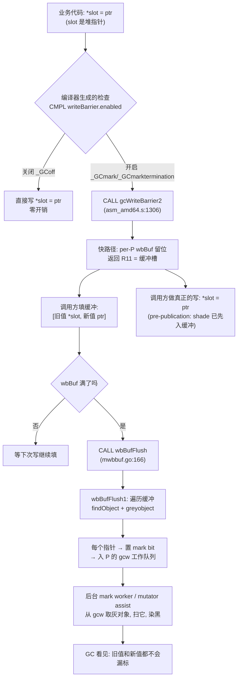

# 第十三讲 · 三色标记与写屏障

> 篇:第 4 篇 · 并发 GC:三色标记(支撑地基)
> 主线呼应:前一篇讲了内存怎么分配出去,这一篇讲内存怎么被收回来。GC 是"支撑地基"里最硬的一块——它要和正在跑的业务(metaphor:成千上万个 G 在疯狂地分配、写指针)同时进行,既要回收掉垃圾、又绝不能误回收活对象。这一讲是第 4 篇的第一块砖:讲清并发标记为什么会"漏标",以及 Go 怎么用一道写屏障把漏洞堵死。

## 核心问题

**为什么"边回收边跑业务"会产生漏标(一个活对象被当成垃圾回收)?Go 的三色标记 + 写屏障凭什么能堵住这个漏洞?**

读完本章你会明白:

1. 三色(白/灰/黑)是什么、并发标记为什么比 STW 标记难——难就难在"标记进行中,业务还在改指针"。
2. 漏标是怎么发生的:经典三步(白→黑路径上丢了灰),以及强/弱三色不变式怎么用一句话描述"什么样的状态不会漏标"。
3. 三种写屏障(Dijkstra 插入 / Yuasa 删除 / Go 1.8 混合屏障)各自堵哪条漏标路径,代价是什么。
4. Go 1.8 混合屏障为什么能把"重扫栈"这笔账也省了,源码里那两行 `shade(*slot)` / `if 栈灰: shade(ptr)` 到底在防什么。

> **逃生阀**:如果只想记住一句话,记住这一句——**写屏障是在每次写堆指针时,顺手把"可能让 GC 看漏"的对象标灰(GC 词汇叫 shade),从而把"业务改指针"这件危险事变成 GC 能看见的事**。三色、强/弱不变式、Dijkstra/Yuasa 都是这句话的不同切面。

---

## 13.1 一句话点破

> **三色标记的本质是"颜色 = GC 对这个对象的处理进度";并发标记的漏洞出在"GC 已经把一个对象标黑(认为扫干净了),而业务却在它身上塞了一个 GC 还没扫到的白对象的指针"——GC 再也看不见这个白对象,就把它当垃圾回收了。写屏障就是在每一次写指针的瞬间,把那条可能被 GC 看漏的链路重新染灰,让 GC 一定能再扫到它。**

这是结论,不是理由。本章倒过来拆:先看三色到底在标记什么、为什么"并发"两个字会引入漏洞,再看 Go 1.8 那道混合屏障是怎么把这个洞堵死的,最后到 `gcWriteBarrier` 那段汇编里逐行看它怎么做到又快又 sound。

---

## 13.2 三色标记:用颜色记录"处理进度"

### 不这样会怎样:STW 标记的痛

最朴素的标记-清除(mark-sweep)GC 是 **STW(stop-the-world)** 的:GC 开始时停掉所有业务线程,然后从一个根集合(栈、全局变量、寄存器)出发,沿着指针把所有可达对象标成"活",没标到的就是垃圾,回收。这种 GC 简单、正确(因为业务停了,指针图静止不变),但代价是**整个堆扫完才放业务继续跑**——堆一大就要停几百毫秒到几秒。

Go 1.5 之前就是这个样子,卡顿肉眼可见。Go 团队的目标是把 GC 停顿压到亚毫秒,而要做到这点,标记必须**和业务并发跑**。并发的麻烦,正是这一讲要解决的全部问题。

### 所以这样设计:三色,把"进度"染在对象上

并发标记的核心难点是:**GC 还没扫完,业务就在改指针图**。为了在并发下还能讲清楚"谁扫过了、谁没扫过",Go(以及大多数并发追踪式 GC)把对象分成三种颜色:

| 颜色 | 含义 | GC 对它做了什么 |
|---|---|---|
| **白(white)** | 还未被 GC 发现 | 还没碰它,可能被回收 |
| **灰(grey)** | 已发现,但**它内部的指针还没扫** | 已入队(work buffer),等待被扫描 |
| **黑(black)** | 已发现,且**它内部的指针都扫过了** | 扫描完成,本周期不会被回收 |

标记算法可以这样描述:

1. 初始,所有对象都是白的。
2. 把所有根(栈、全局)直接指向的对象染灰,入队。
3. 从队里取一个灰对象,扫描它内部的指针:把指向的白对象染灰、入队;然后把自己染黑。
4. 重复 3,直到队空。剩下的白对象就是垃圾,清扫回收。

> **钉死这件事**:颜色不是对象内存里真的有一个"颜色字段",而是 **mark bit + 是否还在灰色工作队列里**的组合。Go 在 mspan 的每个对象槽上有一个 [`markBits`](../go/src/runtime/mgcmark.go#L1644)(`greyobject` 里 `mbits.setMarked()` 把这一位置 1),灰=在 `gcw` 工作队列里、黑=mark bit 已置且已出队。源码里没有"颜色"二字,三色是**讲算法时用的抽象**,实现上靠 mark bit + 工作队列来表达。

并发标记能做到几乎不暂停业务,代价就是:**业务(metaphor:成千上万个 G)在 GC 标记的同时,还在不断 `*slot = ptr` 改指针**。这一改,就可能让 GC 看漏一个活对象。下一节就看漏洞是怎么发生的。

---

## 13.3 漏标:白→黑,丢了灰

这是全章最关键的一张图。考虑下面这个初始状态(灰=A,黑=B,白=C),A 已经被扫过(B 从 A 可达,被染黑;C 还没被发现,是白的):

```
   根
   │
   ▼
   A(灰,在队列里,马上要被扫)──► B(黑,已扫完)
                                   ▲
                                   │ (B 不再指向 C)
   C(白,目前只有 B 指向它,但 B 是黑,GC 不会再扫 B)
```

现在并发地、同时发生这三件事(经典的漏标三步):

| 步骤 | 业务线程(metaphor) | GC 标记线程 |
|---|---|---|
| ① | 把 B → C 的指针删掉(B 不再指向 C) | (在扫别的对象) |
| ② | 在 A 上写一个指针 A → C(把 C 挂到 A 下) | (还在扫别的对象) |
| ③ | | GC 扫到 A,扫 A 的指针——**但 A 已经被改成指向 C 了吗?时序不确定** |

危险在于:**GC 扫 A 时,如果先看到"A 现在指向 C",会把 C 染灰,没问题**;但**如果 GC 扫 A 的那一刻业务已经写完了 A→C、而 GC 这次扫 A 用的是缓存的旧指针图,扫完把 A 染黑后,就再也没有灰对象指向 C 了**——而原来指向 C 的 B(黑)也被业务删掉了指针。结果是:**C 实际上被 A 指着(活对象),但 GC 的视角里没有任何灰对象能再到达 C**,C 被当成垃圾回收掉。这就是漏标。

```
漏标的充要条件(三种表述,等价):

  (1) 存在一条 白→黑 的指针路径,中间断了灰:
        灰对象 ──(被改成)──► 黑对象 ──► 白对象
        黑对象又被删了到白的指针 → 白对象无人可见

  (2) GC 把 A 染黑之后,业务让 A 获得了一个指向白对象 C 的新指针,
      且没有别的灰对象能到达 C。

  (3) 强三色不变式被破坏:存在 黑对象直接指向白对象。
```

> **不这样会怎样**:如果对业务的指针写不管不顾,上面的三步在任何并发 GC 里都会发生,C 这种"实际活着但 GC 看不见"的对象会被回收——程序接下来访问 C 就是 use-after-free,数据损坏、崩溃、诡异的非确定性 bug 全来了。并发 GC 如果不能堵住漏标,根本不能用。

我们需要一个不变式来描述"什么样的状态一定不会漏标",然后想办法在每次写指针时维护这个不变式。这就是三色不变式。

---

## 13.4 三色不变式:把"不漏标"说成一句话

### 强三色不变式

> **不允许 黑对象直接指向 白对象。**

直觉:黑色表示"我扫完了,GC 不会再来看我"。如果我(黑)直接指向一个白对象,而没有任何灰对象也指向它,那这个白对象就成了 GC 的盲区。强不变式直接禁止这种拓扑出现——只要黑→白不存在,任何白对象要么被某个灰对象指向(会被扫到),要么确实不可达(该回收)。

### 弱三色不变式

> **允许 黑对象指向 白对象,但该 白对象 必须有一条从某个 灰对象 出发的路径保护。**

弱不变式更宽松:黑→白可以存在,只要这个白对象"还在某个灰对象的庇护下"——灰对象迟早会被扫,扫到时就会沿着路径把白对象染灰。这样也不会漏标。

> **钉死这件事**:**只要并发标记过程中,任意时刻都满足强或弱三色不变式,就不会漏标活对象**。这是并发追踪式 GC 的核心定理。下面三种写屏障,都是在"业务写指针"的瞬间,做一点额外动作来维护某个不变式。它们的区别,只是维护哪个不变式、以及代价多大。

---

## 13.5 三种写屏障:谁堵哪条漏标路径

写屏障(write barrier)这个名字容易误导——它不是"屏障=锁",而是 **"在每次写堆指针 `*slot = ptr` 的前后,插一小段额外代码,把可能让 GC 看漏的对象染灰"**。Go 源码里它叫 [`shade`](../go/src/runtime/mgcmark.go#L1628),就是把一个对象加进灰色工作队列(`greyobject` → `gcw.putObj`)。下面三种写屏障是学术界经典方案,Go 1.8 的混合屏障是前两种的组合。

### 13.5.1 Dijkstra 插入屏障:shade(ptr)

写指针 `*slot = ptr` 时,**把新指向的对象 ptr 染灰**:

```
writePointer(slot, ptr):
    shade(ptr)        // ← 插入屏障:新指向的对象染灰
    *slot = ptr
```

直觉:不管 slot 原来指向谁、ptr 原来什么颜色,**只要业务"插入"了一条到 ptr 的新指针,就把 ptr 拉进 GC 视野**(染灰)。这样即使 ptr 是白的、被一个黑对象指向,它也立刻变灰,不会漏标。维护的是**强三色不变式**(黑永远不能直接持有白,因为写的同时就把白染灰了)。

**漏洞它能堵**:第 13.3 节里第 ② 步"业务在 A 上写 A→C",插入屏障会把 C 染灰,GC 一定扫得到。

**代价**:Dijkstra 屏障**对栈指针也要生效**。栈上写一个指针都要 shade,代价巨大——栈写太频繁了。所以早期 Go 在标记结束前要 **STW 重扫所有栈**一遍(因为并发标记期间栈没开屏障,栈上可能有黑对象指向白对象)。重扫栈是 Go 1.7 之前 GC 停顿的大头。

### 13.5.2 Yuasa 删除屏障:shade(*slot)

写指针 `*slot = ptr` 时,**把原来被指向的对象 `*slot`(旧值)染灰**:

```
writePointer(slot, ptr):
    shade(*slot)      // ← 删除屏障:被覆盖掉的旧对象染灰
    *slot = ptr
```

直觉:**业务"删除"了一条到旧对象的指针(覆盖掉它)**,旧对象可能因此变成 GC 看不见。所以在删之前,先把旧对象染灰,保住它。维护的是**弱三色不变式**:即使一个白对象原来只被黑对象保护着(弱不变式允许),删除屏障也会把它染灰,不让它失去庇护。

**漏洞它能堵**:第 13.3 节里第 ① 步"业务删掉 B→C 的指针",删除屏障会把 C 染灰。

**代价**:Yuasa 屏障对**被回收精度**有影响——它染灰的旧对象可能本身就是垃圾,导致本轮 GC 回收不掉(下一轮才行),浮点垃圾(float garbage)多一些。但更大的代价和 Dijkstra 一样:**栈上的写也要屏障**,否则栈上删一条指针就可能漏标。

### 13.5.3 Go 1.8 混合屏障:shade(*slot) + 条件 shade(ptr)

Go 1.8 把两种屏障组合,得到一个关键好处:**栈上不再需要写屏障,STW 重扫栈也被省掉**。源码顶部的注释 [`mbarrier.go:24-65`](../go/src/runtime/mbarrier.go#L24-L65) 写得很清楚:

```
writePointer(slot, ptr):
    shade(*slot)              // ① Yuasa 删除屏障:旧对象染灰(无条件)
    if current stack is grey: // ② Dijkstra 插入屏障:仅当当前栈还是灰的
        shade(ptr)            //    新对象也染灰
    *slot = ptr
```

为什么这个组合能省掉栈屏障和重扫栈?分两条看:

1. **`shade(*slot)` 无条件生效(堆上的写)**:这一条是 Yuasa 删除屏障,堵住了"业务从堆里删掉一条到白对象的指针"这条漏标路径。它对所有堆写都生效。

2. **`shade(ptr)` 仅当"当前栈是灰的"才生效**:这一条是 Dijkstra 插入屏障的"打折版"。栈刚被 GC 扫完时染黑,栈上每个指针都已 shade 过;只有栈还是灰(还没扫)时,才需要担心"栈上藏着一个白对象的指针,业务把它写到堆的黑对象里"——所以这时 shade(ptr)。**栈一旦染黑,shade(ptr) 就关掉**,因为栈已扫干净,它指向的对象都已被 shade,不会藏白对象。

> **钉死这件事**:这个组合的妙处在于——**栈本身可以在并发标记期间被自由地读写,不需要屏障**。代价仅仅是:标记开始时,**所有栈初始视为"灰"**(等 GC 扫到它再染黑),扫到某个栈时把它指向的对象都 shade。这样一来:
> - 栈写不需要屏障(性能大胜);
> - 标记结束前**不需要 STW 重扫栈**(因为混合屏障保证:栈上不管藏了什么白指针,要么被堆端的 shade(*slot) 保住,要么栈被扫到时被 shade——两种情况都漏不了)。
>
> Go 1.8 之前 STW 里"重扫栈"经常是停顿的主要来源,混合屏障把它彻底干掉,是 Go GC 停顿降到亚毫秒的关键一跃。设计文档见 `mbarrier.go` 注释里链接的 proposal [17503-eliminate-rescan](https://github.com/golang/proposal/blob/master/design/17503-eliminate-rescan.md)。

**代价**(诚实标注):混合屏障的代价是**实现复杂度高**(条件 shade 要依赖"当前栈颜色"这个全局状态),以及**浮点垃圾**(删除屏障固有的,旧对象可能本就是垃圾却染灰了,留到下一轮)。但相比省下的 STW 重扫栈,这笔账极其划算。

---

## 13.6 写屏障的开与关:gcphase 和 writeBarrier

光知道算法不够,得看 runtime 在什么时机开关屏障。Go 的 GC 有三个阶段常量 [`mgc.go:250-254`](../go/src/runtime/mgc.go#L250-L254):

```go
// src/runtime/mgc.go #L250-L254
const (
    _GCoff             = iota // GC not running; sweeping in background, write barrier disabled
    _GCmark                   // GC marking roots and workbufs: allocate black, write barrier ENABLED
    _GCmarktermination        // GC mark termination: allocate black, P's help GC, write barrier ENABLED
)
```

全局变量 `gcphase` 记录当前阶段 [`mgc.go:223`](../go/src/runtime/mgc.go#L223),`writeBarrier.enabled` 是编译器生成的写屏障快速路径要读的那个开关 [`mgc.go:239-243`](../go/src/runtime/mgc.go#L239-L243):

```go
// src/runtime/mgc.go #L238-L243
//go:linkname writeBarrier
var writeBarrier struct {
    enabled bool    // compiler emits a check of this before calling write barrier
    pad     [3]byte // compiler uses 32-bit load for "enabled" field
    alignme uint64  // guarantee alignment so that compiler can use a 32 or 64-bit load
}
```

注意那行注释:**"compiler emits a check of this before calling write barrier"**。这就是编译器为每次堆指针写生成的那段代码的开关——编译器看到 `*slot = ptr`(slot 是堆指针)时,生成这样的代码:

```
    CMPL    $0, runtime.writeBarrier(SB)   // 读 writeBarrier.enabled
    JEQ     dowrite                         // 关着就直接写
    CALL    runtime.gcWriteBarrier2(SB)     // 开着,走屏障
    MOVQ    AX, (R11)                       // 把新指针 ptr 填进屏障缓冲
    MOVQ    88(CX), DX                      // 读旧值 *slot
    MOVQ    DX, 8(R11)                      // 把旧值也填进缓冲(对应 shade(*slot) 和 shade(ptr))
dowrite:
    MOVQ    AX, 88(CX)                      // 真正写
```

(这是 [`asm_amd64.s:1297-1305`](../go/src/runtime/asm_amd64.s#L1297-L1305) 注释里给的"典型用法"。)

`setGCPhase` [`mgc.go:256-260`](../go/src/runtime/mgc.go#L256-L260) 在阶段切换时打开/关闭屏障:

```go
// src/runtime/mgc.go #L256-L260
//go:nosplit
func setGCPhase(x uint32) {
    atomic.Store(&gcphase, x)
    writeBarrier.enabled = gcphase == _GCmark || gcphase == _GCmarktermination
}
```

也就是说,**只有 `_GCmark` 和 `_GCmarktermination` 两个阶段写屏障才打开**;`_GCoff`(清扫期、无 GC)时屏障是关的,堆写就是普通写,零开销。

> **不这样会怎样**:如果写屏障常年开着,即使没 GC 也在每次堆指针写插一段 shade,业务吞吐会被砍掉一大截。屏障必须和 GC 周期绑定——只在并发标记期间开。`writeBarrier.enabled` 这个全局开关 + 编译器生成的 `CMPL` 检查,就是"只在需要时才付屏障代价"的总开关。

---

## 13.7 gcWriteBarrier 汇编:为什么用缓冲,而不是每次直接 shade

这一节是全章的技巧重头戏。我们要逐行读 [`asm_amd64.s:1306-1330`](../go/src/runtime/asm_amd64.s#L1306-L1330) 的 `gcWriteBarrier`,看清 Go 怎么把"每次堆写都要 shade"这件看起来很贵的事,做得几乎免费。

### 不这样会怎样:朴素写屏障的墙

朴素的写屏障实现是这样:**每次 `*slot = ptr`,当场调用 `shade(*slot)` 和 `shade(ptr)`**。但 `shade` 要做的事很重——它要 `findObject`(在 mspan 里查这个地址属于哪个对象)、`greyobject`(置 mark bit、把对象塞进 GC 工作队列 `gcw.putObj`)。这一串涉及多次内存访问、可能的锁(工作队列)、位运算。

如果每次堆指针写都这么做,业务的每次结构体赋值、map 插入、slice append 都要背上几百纳秒的 shade 代价——并发标记期间(可能持续几十毫秒),吞吐会被严重拖垮。这是朴素 Dijkstra/Yuasa 屏障最大的工程痛点。

### 所以这样设计:每 P 一个 wbBuf,批量 flush

Go 的解法是 **per-P 写屏障缓冲(per-P wbBuf)**:每次堆写,屏障不立刻 shade,而是把 `[slot 旧值, ptr 新值]` 这两个指针塞进当前 P 的 `wbBuf`(一个固定大小的指针数组);等缓冲满了,再一次性 `wbBufFlush` 批量处理。这样**单次写屏障的开销被压到几乎只是一次数组写入**,真正重的 `findObject`/`greyobject` 摊到批量 flush 里,分摊后极便宜。

下面这段就是 `gcWriteBarrier` 的核心(逐行解释)。

```asm
; src/runtime/asm_amd64.s #L1306-L1330  (gcWriteBarrier<> 核心快路径)
TEXT gcWriteBarrier<>(SB),NOSPLIT,$112
    // 保存会被快路径用到的寄存器(R12/R13),留作 scratch。
    MOVQ    R12, 96(SP)
    MOVQ    R13, 104(SP)
retry:
    // R14 在 Go ABI 里恒为当前 g。经 g → m → p,拿到当前 P。
    MOVQ    g_m(R14), R13           // R13 = g.m
    MOVQ    m_p(R13), R13           // R13 = g.m.p  (当前 P)
    // 取 P 的 wbBuf 当前写位置 next。
    MOVQ    (p_wbBuf+wbBuf_next)(R13), R12   // R12 = wbBuf.next(原位置)
    ADDQ    R11, R12                // R12 = next + 需要的字节数(R11 里是 8/16/...)
    // 缓冲满了吗?
    CMPQ    R12, (p_wbBuf+wbBuf_end)(R13)    // 和 end 比
    JA      flush                   // 超了→跳去 flush(满则先清空缓冲)
    // 没满:提交新的 next(预留出空间)。
    MOVQ    R12, (p_wbBuf+wbBuf_next)(R13)   // wbBuf.next = 新位置
    // 返回值 R11 = 原 next(调用方往这里填 [旧值, 新值])。
    SUBQ    R11, R12                // R12 = 新位置 - 字节数 = 原位置
    MOVQ    R12, R11                // R11 = 原 next,作为返回的缓冲指针
    // 恢复寄存器,返回。调用方紧接着执行 MOVQ AX,(R11) 等填缓冲。
    MOVQ    96(SP), R12
    MOVQ    104(SP), R13
    RET
```

逐行讲清它在干什么:

- **`MOVQ R12, 96(SP)` / `R13, 104(SP)`**:快路径会借用 R12、R13 两个寄存器当 scratch(因为不能破坏调用方的寄存器)。NOSPLIT 的 112 字节栈帧里留了位置保存它们。
- **`MOVQ g_m(R14), R13`**:R14 在 Go 的 ABI 里**恒为当前 goroutine 的 g 指针**(由 runtime 维护,作为"当前上下文"寄存器)。`g_m` 是 g 结构体里 `m` 字段的偏移,得到当前 M。
- **`MOVQ m_p(R13), R13`**:再从 M 取它绑定的 P。**关键是拿到 P——因为 wbBuf 是 per-P 的**。
- **`MOVQ (p_wbBuf+wbBuf_next)(R13), R12`**:`p_wbBuf` 是 P 结构体里 wbBuf 字段的偏移,`wbBuf_next` 是 wbBuf 里 next 指针的偏移。这行读出"缓冲下一个可写位置"。
- **`ADDQ R11, R12`**:R11 在入口处由 `gcWriteBarrier2` 设成 16(两个指针,32 字节;`gcWriteBarrier1` 是 8 字节一个指针,见 [`asm_amd64.s:1378-1396`](../go/src/runtime/asm_amd64.s#L1378-L1396))。这行算出"写完后 next 应该到的位置"。
- **`CMPQ R12, (p_wbBuf+wbBuf_end)(R13)` / `JA flush`**:和缓冲尾比,**超出就跳到 flush 段**(下面讲)。
- **没满**:`MOVQ R12, (p_wbBuf+wbBuf_next)(R13)` 把 next 推进(预留空间),`SUBQ R11, R12` / `MOVQ R12, R11` 把**原来的 next**作为返回值放进 R11。调用方拿到 R11,就在那里写 `MOVQ AX, (R11)`(新值 ptr)、`MOVQ 88(CX), DX; MOVQ DX, 8(R11)`(旧值 `*slot`)。**整个过程没有锁、没有 findObject、没有 greyobject——只是一次数组写**。

这就是为什么 Go 的写屏障快:快路径是**几条 MOVQ + 一次比较**,完全 per-P 无锁。

### flush 段:缓冲满了怎么办

缓冲终究会满,满了要走 `flush` [`asm_amd64.s:1332-1376`](../go/src/runtime/asm_amd64.s#L1332-L1376),它做两件事:

1. **保存所有通用寄存器**(DI/AX/BX/CX/DX/SI/BP/R8-R15)到栈上——因为要 call 一个 Go 函数 `wbBufFlush`,而调用方传进来的寄存器状态不能被破坏。
2. **`CALL runtime·wbBufFlush(SB)`**:调用 Go 写的 [`wbBufFlush`](../go/src/runtime/mwbbuf.go#L166),它切到系统栈后调 [`wbBufFlush1`](../go/src/runtime/mwbbuf.go#L195),遍历缓冲里所有指针,对每个做 `findObject` + `greyobject`(真正的 shade),然后清空缓冲。
3. **恢复寄存器,`JMP retry`**:重试一次快路径(这次缓冲空了,一定能成功)。

`wbBufFlush1` 的核心循环 [`mwbbuf.go:228-250`](../go/src/runtime/mwbbuf.go#L228-L250):

```go
// src/runtime/mwbbuf.go #L228-L250(节选)
gcw := &pp.gcw
pos := 0
for _, ptr := range ptrs {
    if ptr < minLegalPointer {
        continue           // 过滤 nil 等非堆指针(旧值常见 nil)
    }
    if tryDeferToSpanScan(ptr, gcw) {
        continue
    }
    obj, span, objIndex := findObject(ptr, 0, 0)
    if obj == 0 {
        continue
    }
    mbits := span.markBitsForIndex(objIndex)
    // ... (见 greyobject 的剩余逻辑:setMarked、noscan 快路径、入队)
}
```

注意它和 [`greyobject`](../go/src/runtime/mgcmark.go#L1644) 共用同一套逻辑(`mwbbuf.go:1641` 注释明说 "See also wbBufFlush1, which partially duplicates this logic")。批量 flush 把缓冲里的指针一次性 shade,摊薄了 `findObject` 的代价。

> **钉死这件事**:**per-P wbBuf + 批量 flush 是 Go 写屏障快的关键工程技巧**。它把"每次写都 shade"的重活,变成"每次写只记一笔,满了再批量处理"。单次屏障 ≈ 几条 MOVQ,重活被摊到 flush 里——而 flush 频率远低于堆写频率(缓冲能容纳几百到上千个指针)。这是"朴素写屏障会被吞吐打爆"那堵墙的解。

### 为什么 sound:per-P 无竞争,缓冲顺序保证不漏

并发正确性要讲清三件事:

1. **wbBuf 是 per-P 的,快路径完全无锁**:每个 P 只在自己的 wbBuf 上写,没有别的 P 来抢,所以快路径的 `next` 推进不需要原子操作。这是"局部性换无锁"的经典手法(和第 10 篇要讲的 mcache 同源)。

2. **缓冲必须 flush 后,`*slot = ptr` 的写才对其他线程可见吗?** 不是。屏障的真实顺序是:**先往缓冲里写 `[旧值, 新值]`,再做真正的 `*slot = ptr`**(见 13.6 的典型用法:`CALL gcWriteBarrier2` → 填缓冲 → `dowrite: MOVQ AX, 88(CX)`)。这是 **pre-publication 屏障**——在指针写"发布"(对其他线程可见)之前,shade 信息已经先入缓冲。`mbarrier.go:114-118` 注释明说:"The write barrier is *pre-publication*, meaning that the write barrier happens prior to the `*slot = ptr` write that may make ptr reachable."

3. **缓冲 flush 的时机和 GC phase 切换的配合**:wbBuf 的 `getX`/flush 路径全程 `//go:nosplit` + `//go:nowritebarrierrec`([`mwbbuf.go:129-166`](../go/src/runtime/mwbbuf.go#L129-L166))。`nosplit` 保证 flush 途中不会被切到别的 P(否则缓冲会乱);`nowritebarrierrec` 保证 flush 本身不会再触发写屏障(否则无限递归)。这两条编译期 pragma 是屏障 sound 的硬约束。

4. **关于内存序**:`mbarrier.go:68-93` 有一段专门讨论——为什么不靠内存屏障(barrier instruction)来保证"slot 颜色和 slot 内容的读序"。理由是:加内存屏障会拖慢所有 mutator,Go 选择**无条件 shade**(不管 slot 什么颜色都 shade ptr),用"多做一点 shade 工作"换"不加内存屏障"。浮点垃圾多一点,但吞吐保住了。这是一个典型的"用精确度换性能"的取舍。

---

## 13.8 栈和全局变量:屏障的两个特例

混合屏障省掉了栈上的写屏障,但**栈本身依然要被 GC 扫一次**(在并发标记期,GC 会逐个 stop 每个 G、扫它的栈、把栈指向的对象 shade,然后把栈染黑)。`mgc.go:46-50` 的注释讲清了这一点:

> "Scanning a stack stops a goroutine, shades any pointers found on its stack, and then resumes the goroutine."

栈扫完后,栈变黑,从此 `shade(ptr)` 那一支对它失效(因为条件 `if current stack is grey` 不成立)——栈上的写就完全自由了。

**全局变量**是另一个特例。`mbarrier.go:104-111` 明确:Go 的 GC **对全局变量的写也插写屏障**(很多 GC 不这么做,而是等到 termination 阶段重扫全局)。Go 这么选是为了**避免 mark termination 阶段重扫全局**,把 termination 的 STW 进一步压短——又是一个"屏障换 STW"的权衡。

还有一个边角:`mbarrier.go:96-101` 讲到——编译器对**当前栈帧**的写不插屏障(它知道这是栈,不是堆);但如果一个栈指针被传到更深的调用里,编译器不知道它到底指堆还是栈,会保守地插屏障。这是"宁可多插也不漏"的安全侧倾斜。

---

## 13.9 技巧精解:混合屏障凭什么省掉重扫栈

正文里已经讲了混合屏障的两条 shade,这里把它和"朴素方案"做正面对比,让妙处显形。

### 反面对比一:Dijkstra 插入屏障(Go 1.5 的方案)为什么要重扫栈

Go 1.5 用的是纯 Dijkstra 插入屏障:**只 shade(ptr),不 shade(\*slot)**。问题是,Dijkstra 屏障**只在堆上生效,栈上不开**(栈写太频繁)。这就留下一个窗口:**栈上的黑对象可能直接指向一个白对象**(因为栈写没屏障,GC 扫栈时把栈染黑,之后业务在栈上写一个新指针指向一个白对象,GC 看不见)。

为了堵这个窗口,Go 1.5 在 **mark termination(STW)阶段要重扫所有栈**:停掉业务,把每个栈上的指针都走一遍,确保没有黑→白。栈多的时候(G 海量),这一步就是 STW 的主要来源——经常是 10ms 以上。

### 反面对比二:Yuasa 删除屏障单独用,浮点垃圾太多

如果单独用 Yuasa 删除屏障(只 shade(\*slot)),栈上同样要屏障,而且每次覆盖写都把旧对象染灰,**旧对象可能是真垃圾**,导致大量浮点垃圾。也不理想。

### Go 1.8 的组合拳:同时要两条,条件放宽第二条

Go 1.8 的混合屏障做了一件聪明事:**第一条 shade(\*slot) 无条件生效(堆写),这一条独立地堵住了"业务从堆删指针"这条路径**;**第二条 shade(ptr) 仅当栈灰时生效**。两条合起来,在数学上等价于"栈上始终开屏障"(因为栈没扫时,堆写会通过 shade(\*slot) + 条件 shade(ptr) 双重保护;栈扫完染黑后,栈本身干净,堆写只需 shade(\*slot))。

**等价效果:并发标记期间,任意时刻所有栈"都像开了屏障一样 sound",但物理上栈写零开销**。STW 重扫栈这笔账就此消失。这是 Go GC 把停顿从"10ms 级"压到"亚毫秒级"的最关键一跃——纯粹的屏障设计改动,没动调度器、没动堆结构。

> **钉死这件事**:混合屏障的精髓不是"加了什么",而是"**用条件 shade(ptr) 模拟出栈屏障的效果,从而物理上不需要栈屏障**"。条件 `if current stack is grey` 是一开关:栈没扫→开(模拟栈屏障);栈扫完→关(栈已干净)。这一开一关,把 Go 1.5 那个"STW 重扫栈"的硬伤彻底治好。

---

## 13.10 一张图串起来:从一次 `*slot = ptr` 到 shade

把全章串成一条调用链,看清一次堆指针写在 GC 期间走过了什么:



这张图覆盖了本章所有关键点:**编译器检查** → **汇编快路径** → **per-P 缓冲** → **批量 flush** → **shade** → **入灰色队列** → **后台扫描染黑**。三色不变式在"shade"那一格被维护,漏标在"findObject + greyobject"那一格被堵死。

---

## 章末小结

这一讲是第 4 篇(GC)的地基。我们没有讲 GC 的完整阶段(那是下一讲 P4-14 的事),只钻进了并发标记最容易出错的那个点:**漏标**,以及 Go 怎么用混合写屏障堵住它。回扣全书二分法:本章服务的是**支撑地基**(并发 GC 是 GMP 调度和阻塞唤醒能跑起来的前提之一——没有 GC 自动回收堆,goroutine 的"便宜"就无从谈起,因为你得手动 free)。

本章立起了四样东西:

1. **三色** = GC 对对象的处理进度(白未发现 / 灰已发现待扫 / 黑已扫完),用 mark bit + 灰色工作队列表达。
2. **漏标** = 并发标记中,黑对象直接持有白对象、且无灰对象保护,导致白对象被误回收;强/弱三色不变式是"不漏标"的形式化。
3. **三种写屏障**:Dijkstra 插入 shade(ptr)、Yuasa 删除 shade(\*slot)、Go 1.8 混合 = 两者组合 + 条件放宽,省掉了栈屏障和 STW 重扫栈。
4. **工程实现**:`writeBarrier.enabled` 全局开关 + 编译器生成 `CMPL` 检查;`gcWriteBarrier` 汇编快路径 per-P wbBuf 无锁缓冲 + 批量 `wbBufFlush` 摊薄 shade 代价;pre-publication 顺序保证 sound。

### 五个"为什么"清单

1. **为什么并发标记会漏标,而 STW 标记不会?** STW 时业务停了,指针图静止,GC 扫一遍就准。并发时业务在改指针,可能出现"GC 把 A 染黑后,业务让 A 指向一个白对象 C,同时删掉原来指向 C 的路径",C 就成了 GC 看不见的活对象。

2. **强/弱三色不变式分别是什么,为什么满足它们就不漏标?** 强:黑不直接指向白(黑→白不存在,任何白要么被灰指着会被扫,要么真不可达)。弱:允许黑→白,但该白必须有灰对象路径保护(灰迟早被扫,扫到就沿路径把白染灰)。两者都保证 GC 视野里没有"看不见的活对象"。

3. **Go 1.8 混合屏障为什么能省掉 STW 重扫栈?** 它用 `shade(*slot)`(无条件)+ `if 栈灰: shade(ptr)`(条件)的组合,数学上等价于"栈始终有屏障",但物理上栈写零开销。栈没扫时堆端双重保护,栈扫完染黑后堆端只需删除屏障——任意时刻都 sound,无需 termination 重扫栈。这一改把 Go GC 停顿从 10ms 级压到亚毫秒。

4. **写屏障快路径为什么这么便宜?** 因为它不当场 shade,而是把 `[旧值, 新值]` 塞进 per-P 的 wbBuf(几条 MOVQ,完全无锁,因为每个 P 只写自己的缓冲),满了才批量 `wbBufFlush`(里面才是重的 findObject/greyobject)。重活被摊到 flush,单次屏障几乎是数组写。

5. **为什么 wbBuf 是 per-P,而不是全局一个?** 无锁。全局缓冲要锁,每次堆写都抢锁,吞吐崩。per-P 缓冲每个 P 只碰自己的,快路径无原子操作。这是"局部性换无锁",和 mcache(第 10 章)、本地 runq(第 4 章)同源——P 这个"工作台"再一次承担了隔离竞争的角色。

### 想继续深入往哪钻

- **源码文件**:本章主战场 [`../go/src/runtime/mbarrier.go`](../go/src/runtime/mbarrier.go)(屏障的 Go 入口 + 顶部那段权威注释,讲清混合屏障的伪代码和为什么不用内存屏障)、[`../go/src/runtime/asm_amd64.s#L1288-L1401`](../go/src/runtime/asm_amd64.s#L1288-L1401)(`gcWriteBarrier` 汇编,快路径 + flush)、[`../go/src/runtime/mwbbuf.go`](../go/src/runtime/mwbbuf.go)(`wbBuf` 结构 + `wbBufFlush`/`wbBufFlush1`)、[`../go/src/runtime/mgcmark.go#L1628-L1697`](../go/src/runtime/mgcmark.go#L1628-L1697)(`shade` / `greyobject`)、[`../go/src/runtime/mgc.go#L238-L260`](../go/src/runtime/mgc.go#L238-L260)(`writeBarrier` 结构 + `setGCPhase`)。把这条链 `gcWriteBarrier → wbBuf → wbBufFlush → shade → greyobject → gcw.putObj` 串起来读,屏障的全貌就通了。
- **设计文档**:`mbarrier.go:64` 注释里链接的 proposal [17503-eliminate-rescan](https://github.com/golang/proposal/blob/master/design/17503-eliminate-rescan.md),是 Go 1.8 混合屏障的原始设计论证,含正确性证明,值得通读。
- **观测屏障**:`GODEBUG=gcpacer=1` 或 `godebug gctrace=1` 能看到每轮 GC 的标记工作量;`go tool trace` 里能看到 mark worker(dedicated/fractional/idle 三种)和 mutator assist 占用的 CPU——这些是屏障"挡下来的工作"在 trace 里的可视化。
- **三色不变式的学术原文**:Dijkstra 等的 "On-the-fly GC"(1976, Dijkstra 屏障原论文)、Yuasa 的 "Real-time GC"(1990, 删除屏障原论文)。两篇都不长,能帮你把强/弱不变式从"口诀"变成"证明"。
- **checkmark 模式**:`useCheckmark` 标志([`mwbbuf.go:205`](../go/src/runtime/mwbbuf.go#L205)、[`mgcmark.go:1651`](../go/src/runtime/mgcmark.go#L1651))是 GC 自检模式,在调试构建下用第二套独立的 checkmark bit 验证主标记没漏标——是 runtime 自己用来保证屏障 sound 的回归网。

### 引出下一章

讲透三色和写屏障之后,我们有了"并发标记不漏标"的保证。但 GC 不是只有标记——它还有一套精密的**阶段机**:什么时候 STW、什么时候开屏障、什么时候并发标记、什么时候清扫。Go 的 GC 凭什么能把两次 STW 都压到亚毫秒?下一讲 P4-14《并发 GC 的阶段》拆 `gcStart` / `gcMarkDone` / `gcSweep` 的完整流程,看 Go 怎么把"标记准备(极短 STW)→ 并发标记(和业务并发)→ 标记终止(极短 STW)→ 并发清扫"四阶段编排得几乎不暂停业务——本章的写屏障,正是并发标记阶段能和业务并跑的基石。

---

> 全书定位:第 13 章 / 第 4 篇 并发 GC(支撑地基)。源码版本 Go 1.27(本地 master @ `6d1bcd10`,`src/internal/goversion/goversion.go` 的 `const Version = 27`)。下一章:P4-14 并发 GC 的阶段。
>
> 源码事实修正:① `writeBarrier` 结构体在本仓位于 [`mgc.go#L238-L243`](../go/src/runtime/mgc.go#L238-L243),**不在 `runtime2.go`**(任务锚点标注有误,本仓已无 `mbw_amd64.s`,屏障汇编在 `asm_amd64.s`)。② `writeBarrier` 结构体只有 3 个字段(`enabled bool` / `pad [3]byte` / `alignme uint64`),不再是旧资料里的 5 字段(`needed`/`cgo` 等已移除)。③ Go 1.8 混合屏障的精确形式是 `shade(*slot)` 无条件 + `if current stack is grey: shade(ptr)`(`mbarrier.go:24-65`),不是网上常说的"无条件双 shade"——条件 shade(ptr) 是省栈屏障的关键。④ 写屏障快路径走的是 **per-P wbBuf 缓冲 + 批量 flush**(汇编 `gcWriteBarrier` + `wbBufFlush`),不是每次直接 shade;`gcWriteBarrierN`(N=1..8)按写入指针数区分,不是单一入口。⑤ `gcmarkwb_m` 这个旧函数在本仓已不存在,堆写的 Go 端入口直接由编译器生成 `gcWriteBarrier2` 调汇编,缓冲 flush 后才进 `shade`/`greyobject`。
