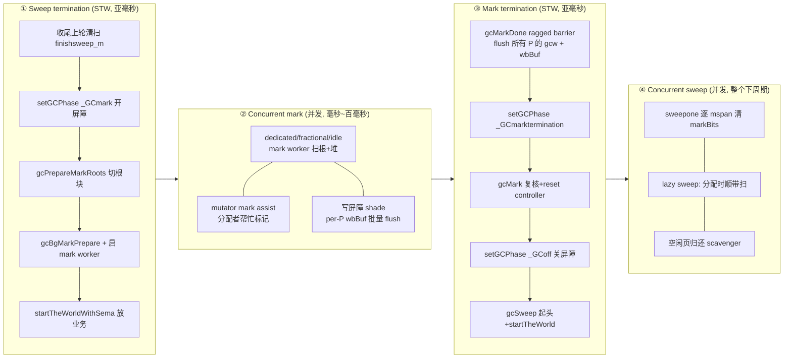

# 第十四讲 · 并发 GC 的阶段

> 篇:第 4 篇 · 并发 GC:三色标记(支撑地基)
> 主线呼应:上一讲我们解决了并发标记"会不会漏标活对象"的正确性问题——靠三色不变式 + 混合写屏障把它堵死了。但"标记正确"只是一半;另一半是工程问题:**一次完整 GC 怎么几乎不暂停业务**。这一讲不碰算法,只讲编排:Go 怎么把一次 GC 切成"标记准备 → 并发标记 → 标记终止 → 并发清扫"四个阶段,把两次 STW 都压到亚毫秒。读完你会理解,Go 团队那句"亚毫秒停顿"不是某个聪明点子,而是几十处"把工作从 STW 里挪出去"的累积。

## 核心问题

**一次完整的 GC 要经过哪些阶段?两次 STW(stop-the-world)凭什么都能压到亚毫秒,而不是像 Go 1.4 那样停几十甚至几百毫秒?**

读完本章你会明白:

1. 一次 GC 的四阶段流水线:sweep termination(标记准备的极短 STW)→ concurrent mark(和业务并发的标记)→ mark termination(标记终止的极短 STW)→ concurrent sweep(并发清扫),以及 `_GCoff` / `_GCmark` / `_GCmarktermination` 三个 phase 常量怎么贯穿其中。
2. STW 到底停了什么(`stopTheWorldWithSema` 怎么把所有 P 推到 `_Pgcstop`)、为什么"批量停 + 让被动 P 自然停"能省时间。
3. 哪些"看起来该在 STW 里"的活,被 Go 用工程手段挪到了并发阶段:扫栈靠 `suspendG`(不是 STW 全停)、根准备靠分块(`gcPrepareMarkRoots` 切 root block)、写屏障缓冲靠 per-P wbBuf 批量 flush。
4. 标记怎么"算完"——`gcMarkDone` 的 ragged barrier(参差屏障)凭什么不漏,为什么有时候还要回到并发标记重跑一轮(issue #27993)。
5. mark worker 为什么分三种模式(dedicated / fractional / idle),这是"既要把活干完又不让 GC 抢占业务过多 CPU"的关键。

> **逃生阀**:如果只想记一句话,记住——**Go 的 GC 把所有"重活"都搬出 STW:标记主体并发跑、扫栈并发跑(逐个 suspend)、清扫并发跑;STW 里只剩"开屏障 + flush 缓冲 + 关屏障"这类轻量且确定的事**。两次 STW 短,不是因为 STW 干得快,而是因为 STW 里几乎不干什么。

---

## 14.1 一句话点破

> **并发 GC 的阶段编排,本质是一场"把工作从 STW 往并发阶段搬"的工程竞赛:STW 越短越好,所以凡是能在业务跑着时干的——扫堆、扫栈、清扫——全搬到并发阶段;STW 里只保留三件"必须全局一致才能干"的轻活:切换 phase、开关写屏障、flush 所有 P 的本地缓冲。**

这是结论,不是理由。本章倒过来拆:先看朴素的全 STW GC 为什么不行,再逐阶段拆 Go 怎么把一次 GC 切成四段,最后看两处最硬的工程——`stopTheWorldWithSema` 怎么快速停住所有 P、`gcMarkDone` 的参差屏障凭什么不漏。

---

## 14.2 朴素方案:为什么全 STW 行不通

最朴素的标记-清除 GC 是 STW 的:GC 开始停掉所有业务线程,从根集合出发扫整个堆把活对象标出来,扫完再清扫,然后放业务继续跑。这种 GC 简单、正确(堆是静止的),但停顿 = 扫整个堆的时间。堆一上 GB,停顿就是几十到几百毫秒;堆上 10 GB,停顿就近秒级。

> **不这样会怎样**:Go 1.4 及更早就是 STW 标记 + STW 清扫,堆稍大 GC 停顿肉眼可见。对延迟敏感的服务(网关、交易、游戏服务器),这种停顿直接不可用。Go 团队从 1.5 开始把 GC 改成并发,目标就是把停顿压到亚毫秒,为此不惜用 CPU(并发标记要和业务抢 CPU)。

并发 GC 的全部工程,就是回答一个问题:**怎么让"标记活对象"和"清扫垃圾"这两件重活,和业务并发跑,却又不破坏正确性?** 上一讲已经回答了正确性那一半(写屏障防漏标),这一讲回答编排那一半。

---

## 14.3 四阶段流水线:一张总图先立起来

Go 的一次 GC 周期(`gcStart` 启动,`gcMarkTermination` 收尾)分成四个阶段,对应三个 phase 常量(第 13 章见过,这里再钉一次):

```go
// src/runtime/mgc.go #L250-L254
const (
    _GCoff             = iota // GC not running; sweeping in background, write barrier disabled
    _GCmark                   // GC marking roots and workbufs: allocate black, write barrier ENABLED
    _GCmarktermination        // GC mark termination: allocate black, P's help GC, write barrier ENABLED
)
```

| 阶段 | phase | 是否 STW | 干什么 | 时长 |
|---|---|---|---|---|
| ① Sweep termination | `_GCoff`→停顿 | **STW(极短)** | 收尾上一轮的清扫、清 mspan 缓冲、reset mark state、`setGCPhase(_GCmark)` 开屏障、准备根、启动后台 mark worker | 亚毫秒 |
| ② Concurrent mark | `_GCmark` | **并发** | 后台 mark worker + mutator assist 并发扫根和堆、染黑;写屏障挡漏标 | 毫秒~百毫秒(取决于堆和 CPU 配额) |
| ③ Mark termination | `_GCmark`→`_GCmarktermination`→`_GCoff` | **STW(极短)** | ragged barrier 之后确认没残留工作、关屏障、`gcMark` 复核、`gcSweep` 起头 | 亚毫秒 |
| ④ Concurrent sweep | `_GCoff` | **并发** | 并发清扫 mspan、lazy sweep(分配时顺带扫)、归还空闲页 | 整个下一周期持续 |



把这张图钉在脑子里,后面四节逐一拆每个阶段里"为什么短 / 为什么并发不漏"。注意一个关键不对称:**sweep termination(STW1)和 mark termination(STW2)虽然都叫 STW,但干的事完全不同**——前者是"为并发标记搭台子",后者是"为并发清扫搭台子"。

> **钉死一件事**:Go 的 GC 没有一个统一的"GC 暂停时间",而是两次分开的 STW(sweep term + mark term),中间夹着一段可能很长的并发标记。`gctrace=1` 打印的那串数字里,`tMark - tSweepTerm` 是并发标记的时钟时间(业务在跑),`(tMarkTerm - tMark)` 和 `(tEnd - tMarkTerm)` 里属于 STW 的部分只有 sweep term 和 mark term 两小段。亚毫秒指的就是这两段,不是整个 GC 周期。

---

## 14.4 阶段①:Sweep termination(STW1,搭标记的台子)

这一节看 `gcStart` 里那段 STW 干了什么。先贴骨架(关键行,省略大量边角):

```go
// src/runtime/mgc.go #L819-L936(骨架,省略边角)
systemstack(gcResetMarkState)        // 重置所有 G 的 gcscandone / gcAssistBytes、清 pageMarks
...
now := nanotime()
work.tSweepTerm = now                // 记录 sweep termination 时刻(gctrace 用)
var stw worldStop
systemstack(func() {
    stw = stopTheWorldWithSema(stwGCSweepTerm)   // ← 第一次 STW 开始
})
...
// 收尾上一轮的清扫(正常情况已扫完,这里兜底)
systemstack(func() {
    finishsweep_m()
})

clearpools()                         // 清 sync.Pool 等,本周期回收

work.cycles.Add(1)
gcController.startCycle(now, int(gomaxprocs), trigger)
gcCPULimiter.startGCTransition(true, now)

// 开写屏障,这是 STW 里最关键的一步
setGCPhase(_GCmark)                  // writeBarrier.enabled = true

gcBgMarkPrepare()                    // work.nproc = ^uint32(0); work.nwait = ^uint32(0)
gcPrepareMarkRoots()                 // 切 root 块:data/bss/span/stack
gcMarkTinyAllocs()                   // 把活跃的 tiny alloc 块标黑

// 开 mutator assist
atomic.Store(&gcBlackenEnabled, 1)

// 放业务
systemstack(func() {
    now = startTheWorldWithSema(0, stw)   // ← STW 结束
    work.pauseNS += now - stw.startedStopping
    work.tMark = now
    gcCPULimiter.finishGCTransition(now)
})
```

这一段 STW 干了五件事,逐一看"为什么必须在 STW 里干 / 为什么这么干能短":

### (1) `stopTheWorldWithSema`:把所有 P 推到 `_Pgcstop`

STW 的物理本质不是"停所有 OS 线程",而是"让所有 P 停止调度用户 G"——P 是工作台(`proc.go` 第 1 章讲过),没了 P,M 即使还在跑也只能跑系统栈上的 runtime 代码。`stopTheWorldWithSema` 的核心 [`proc.go:1641-1765`](../go/src/runtime/proc.go#L1641-L1765):

```go
// src/runtime/proc.go #L1669-L1712(骨架)
lock(&sched.lock)
sched.stopwait = gomaxprocs           // 要等这么多 P 停下
sched.gcwaiting.Store(true)
preemptall()                          // 给所有 _Prunning 的 P 发抢占

// 当前 P 直接置 _Pgcstop
gp.m.p.ptr().status = _Pgcstop
sched.stopwait--

// 正在 syscall 的 P,让它的 M 在退出 syscall 时进 _Pgcstop
for _, pp := range allp {
    if thread, ok := setBlockOnExitSyscall(pp); ok {
        thread.gcstopP()
        thread.resume()
    }
}

// 空闲 P 直接收走
for {
    pp, _ := pidleget(now)
    if pp == nil { break }
    pp.status = _Pgcstop
    sched.stopwait--
}
wait := sched.stopwait > 0
unlock(&sched.lock)

// 还在 _Prunning 的 P,等它们被抢占后自愿停下;100us 醒来重发一次抢占(防 race)
if wait {
    for {
        if notetsleep(&sched.stopnote, 100*1000) {
            noteclear(&sched.stopnote)
            break
        }
        preemptall()
    }
}
```

这里有几个让 STW 快的关键技巧:

- **不是"逐个 M 杀掉",而是"广播抢占 + 等每个 P 自愿到安全点"**。`preemptall` 给每个 `_Prunning` 的 P 上的 G 发一个异步抢占请求(基于 `SIGURG` 信号,第 5 章详讲),G 在下一个安全点(函数序言检查 / 信号处理点)主动让出,P 进入 `_Pgcstop`。这种"协作 + 抢占"混合的停法,避免了"一个 G 死循环导致 STW 永远停不下来"——异步抢占能在任意安全点打断它。

- **idle P 和 syscall P 几乎零成本处理**:idle P 本来就在 `sched.pidle` 链表上睡,直接收走;syscall P 用 `setBlockOnExitSyscall` 让它在退出 syscall 时自然进 `_Pgcstop`,不需要等它 syscall 完成。

- **100us 重试防 race**:`preemptall` 是 best-effort,信号可能丢或被目标线程忽略(如正在 `newstack`)。`notetsleep(&sched.stopnote, 100*1000)` 等 100 微秒还没停全就再发一次,确保最终一致。

> **不这样会怎样**:如果 STW 用"逐个 M 发 SIGSTOP"那种强停,正在写一半指针的 G 会让堆处于不一致状态,GC 会读坏。Go 选择"让 G 走到安全点再停"——安全点的定义是"栈和寄存器里的指针都能被 GC 正确解释"(通常在函数边界或抢占信号处理里),这样停下来的瞬间 GC 能放心扫。

### (2) `finishsweep_m`:收尾上一轮的清扫

```go
// src/runtime/mgcsweep.go #L231-L260(骨架)
func finishsweep_m() {
    assertWorldStopped()
    for sweepone() != ^uintptr(0) { }    // 把上一轮还剩的 mspan 扫完
    if sweep.active.sweepers() != 0 {
        throw("active sweepers found at start of mark phase")
    }
    sg := mheap_.sweepgen
    for i := range mheap_.central {
        c := &mheap_.central[i].mcentral
        c.partialUnswept(sg).reset()
        c.fullUnswept(sg).reset()
    }
    scavenger.wake()
    nextMarkBitArenaEpoch()
}
```

为什么必须在 STW 里干这个?因为**不能让上一轮的清扫和这一轮的标记同时发生**——它们共用 mspan 的 markBits / sweepgen,混跑会乱。正常情况下(`gcBackgroundMode`),上一轮的并发清扫在比例清扫(proportional sweep)机制下应该在 GC 触发前就扫完了,这里只是兜底,所以这段通常很快(没剩几个 span 要扫)。但如果用户用 `runtime.GC()` 强制触发,清扫可能还没完,这里就要真正干一点活。

> **钉死这件事**:`finishsweep_m` 是 STW1 里唯一可能"变长"的环节,但比例清扫的目标就是"在下次 GC 触发前扫完",所以稳态下它接近空跑。如果 gctrace 里 sweep term STW 偶然变长,通常是因为分配速率波动导致清扫没跟上。

### (3) `setGCPhase(_GCmark)`:开写屏障——STW1 的真正主角

```go
// src/runtime/mgc.go #L898
setGCPhase(_GCmark)
```

这行的全部内容(第 13 章讲过):

```go
// src/runtime/mgc.go #L256-L260
func setGCPhase(x uint32) {
    atomic.Store(&gcphase, x)
    writeBarrier.enabled = gcphase == _GCmark || gcphase == _GCmarktermination
}
```

**这一步为什么必须在 STW 里?** 因为"所有 P 都看到屏障已开"是一个全局一致的状态:STW 结束后,任何 P 上的 G 一旦执行堆指针写,都会被编译器生成的 `CMPL runtime.writeBarrier` 检查拦下走屏障。如果在业务还在跑的时候开屏障,有些 G 会看到屏障开了、有些还没看到(因为 `writeBarrier.enabled` 是个普通全局变量,没有强内存序广播),那些没看到的 G 会漏 shade,从而漏标活对象。STW 保证了"开屏障"这个动作对所有 P 是原子可见的。

`gcStart` 的注释把这层意思写得很直白 [`mgc.go:884-898`](../go/src/runtime/mgc.go#L884-L898):

> "Because the world is stopped, all Ps will observe that write barriers are enabled by the time we start the world and begin scanning."

### (4) `gcPrepareMarkRoots`:把根集合切成块

```go
// src/runtime/mgcmark.go #L109-L175(节选)
func gcPrepareMarkRoots() {
    assertWorldStopped()
    nBlocks := func(bytes uintptr) int {
        return int(divRoundUp(bytes, rootBlockBytes))
    }
    // 全局 data / bss 段切成块
    for _, datap := range activeModules() { ... }
    // 堆 span 的 specials(finializer 等)切成 arena 块
    mheap_.markArenas = mheap_.heapArenas[:len(mheap_.heapArenas):len(mheap_.heapArenas)]
    work.nSpanRoots = len(mheap_.markArenas) * (pagesPerArena / pagesPerSpanRoot)
    // 所有 G 的栈快照
    work.stackRoots = allGsSnapshot()
    work.nStackRoots = len(work.stackRoots)
    work.markrootJobs.Store(uint32(fixedRootCount + work.nDataRoots + work.nBSSRoots + work.nSpanRoots + work.nMaybeRunnableStackRoots))
}
```

注意这里**只算块数和快照栈指针,不扫栈本身**。扫栈(逐个 G 沿栈帧找指针、shade 指到的对象)是重活,Go 不在 STW 里干,而是把栈列进根集合(`work.stackRoots`),留给并发标记阶段由 mark worker 用 `suspendG` 逐个扫(见 14.5)。STW 里只是"列清单",这一步无论多少 G,都只是遍历 `allgs` 拷指针,O(G) 但常数极小。

> **不这样会怎样**:如果在 STW 里扫所有栈(G 海量时是几百 MB 栈),STW 就会被栈扫描撑大——这正是 Go 1.5 之前(用纯 Dijkstra 屏障 + STW 重扫栈)停顿 10ms+ 的根因。把栈扫搬到并发阶段(靠混合屏障保证 sound),是 sweep term STW 能短的关键一跃。

### (5) 启动后台 mark worker + 开 mutator assist

```go
gcBgMarkStartWorkers()       // 确保 GOMAXPROCS 个 gcBgMarkWorker G 存在
...
gcBgMarkPrepare()            // work.nproc = ^uint32(0); work.nwait = ^uint32(0)
...
atomic.Store(&gcBlackenEnabled, 1)   // 开 mutator assist
systemstack(func() { now = startTheWorldWithSema(0, stw); ... })
```

`gcBgMarkStartWorkers` [`mgc.go:1688`](../go/src/runtime/mgc.go#L1688) 保证每个 P 都有一个对应的 `gcBgMarkWorker` G(这些 G 在进程生命周期内常驻,通过无锁栈 `gcBgMarkWorkerPool` 复用)。`gcBlackenEnabled` 是 mark assist 的开关(第 15 章详讲):开了之后,任何 G 在分配堆对象时,如果它"欠"GC 的标记债,会被要求先帮忙标记一部分,把 GC 压力反压给分配者。

注意 `gcBgMarkPrepare` 那两行 `work.nproc = ^uint32(0); work.nwait = ^uint32(0)` [`mgc.go:1741-L1742`](../go/src/runtime/mgc.go#L1741-L1742)——它们故意设成一个巨大的"假装"值。因为并发标记期间,真正干活的 worker 数量是动态的(dedicated + fractional + idle + 各种 assist),没法精确数。设成 `^uint32(0)` 之后,`nwait == nproc` 这个"所有 worker 都闲着"的判定就退化成"当前没有 worker 在干活且全局队列空"——这是 mark 完成的信号(见 14.6)。

### 小结:sweep term 为什么短

把上面五件事的"为什么必须在 STW"列一张表:

| STW1 里的活 | 为什么必须在 STW | 为什么这么干能短 |
|---|---|---|
| 停所有 P | 要全局一致开屏障 | 抢占 + 等自愿停,idle/syscall P 零成本 |
| `finishsweep_m` | 防止上轮清扫和本轮标记混跑 | 比例清扫已基本扫完,这里兜底 |
| `setGCPhase(_GCmark)` | 让所有 P 同时看到屏障开 | 一次原子 store |
| `gcPrepareMarkRoots` | 要快照一致的根集合(不漏新 G) | 只列清单不扫栈 |
| 启 worker + 开 assist | 要在业务恢复前就绪 | 启动是 O(GOMAXPROCS) |

每件活都"要么轻量、要么被挪到并发阶段"。这就是 sweep term STW 能压到亚毫秒的全部秘密:不是干得快,而是几乎不干。

---

## 14.5 阶段②:Concurrent mark(和业务并发标记)

STW1 结束,`startTheWorldWithSema` 放业务回来跑。从这一刻起直到 mark termination,业务和 GC 标记**并发**进行。这一节看并发标记怎么组织、靠什么不漏标、怎么知道"标完了"。

### (1) 三种 mark worker:dedicated / fractional / idle

后台标记由 `gcBgMarkWorker` G 干 [`mgc.go:1766`](../go/src/runtime/mgc.go#L1766)。这些 G 平时睡在 `gcBgMarkWorkerPool`(无锁栈)里,被 `gcController.findRunnableGCWorker` [`mgcpacer.go:859`](../go/src/runtime/mgcpacer.go#L859) 调度到某个 P 上时醒来干活。它们有三种模式 [`mgc.go:271-295`](../go/src/runtime/mgc.go#L271-L295),由 pacer 在 [`mgcpacer.go:820-841`](../go/src/runtime/mgcpacer.go#L820-L841) 分配:

| 模式 | 含义 | 何时被调度 | 调用 |
|---|---|---|---|
| `gcMarkWorkerDedicatedMode` | 这整个 P 在本轮标记结束前**专职**标记 | dedicatedMarkWorkersNeeded > 0 | `gcDrainMarkWorkerDedicated` |
| `gcMarkWorkerFractionalMode` | 这整个 P 上标记占用**部分**时间 | 达不到 dedicated 配额,用 fractional 凑 CPU 占比 | `gcDrainMarkWorkerFractional` |
| `gcMarkWorkerIdleMode` | P 本来闲着,顺手干标记 | P 进入 idle 前,如果有标记工作就跑 | `gcDrainMarkWorkerIdle` |

为什么要分三种?这是"既要把活干完、又不能让 GC 抢业务太多 CPU"的精算:

- **dedicated**:pacer 算出"以当前堆增长速率,光靠 fractional 和 idle 标不完,必须有几个 P 全职标记",于是给那几个 P 设 dedicated。
- **fractional**:pacer 的目标是 GC 占 CPU 的 25%(默认 `GOGC=100` 对应约 25% GC CPU)。dedicated 凑不满这个比例时,让一些 P "fractional"地干——它在标记一段时间后会自查 `gcFractionalMarkTime / delta` 是否超过目标占比 [`mgcpacer.go:834`](../go/src/runtime/mgcpacer.go#L834),超了就回去跑业务。这是"按比例切时间片"。
- **idle**:P 反正要进 idle 了(`findRunnable` 找不到用户 G),不如顺手干点标记。这是"白嫖空闲 CPU"。

三种 worker 最终都调 `gcDrain` [`mgcmark.go:1244`](../go/src/runtime/mgcmark.go#L1244),只是传的 flags 不同(`gcDrainUntilPreempt` / `gcDrainFractional` / `gcDrainIdle`),决定它"何时让出 P 回去跑业务"。

> **不这样会怎样**:如果只有一个"全职 worker"模式,要么 GC 占太多 CPU(dedicated 凑满 GOMAXPROCS 个 P 时业务几乎饿死),要么标不完(只让 idle P 干,堆涨太快时 idle 不够)。三种模式 + pacer 精算,是"GC 吞吐"和"业务吞吐"之间的动态平衡器。第 15 章 mark assist 是这个平衡器的另一半(从 mutator 端反压)。

### (2) `gcDrain`:扫根 + 扫灰,染黑

`gcDrain` 是并发标记的核心循环 [`mgcmark.go:1244`](../go/src/runtime/mgcmark.go#L1244)。它干两件事:

1. **扫根**:`markroot(gcw, i)` [`mgcmark.go:221`](../go/src/runtime/mgcmark.go#L221),按 `work.markrootJobs` 的块号依次扫 data / bss / span specials / 栈。栈扫(`markroot` 的 default 分支 [`mgcmark.go:262-`](../go/src/runtime/mgcmark.go#L262-L330))是这一阶段的重头戏,下面单说。
2. **扫灰对象**:`scanblock` 沿着灰对象的指针,把指到的白对象染灰入队(`greyobject`),把自己染黑。这是第 13 章讲的三色标记主循环。

每扫完一块根或一批对象,worker 会把"扫描工作量"记到 `gcw.heapScanWork`,这些数字喂给 pacer 算 assist 配额(第 15 章)。

### (3) 扫栈:不在 STW 里,靠 `suspendG` 逐个停

并发标记期间扫栈是难点——栈正在被业务用,GC 怎么安全地读它?答案是 `suspendG` [`mgcmark.go:298`](../go/src/runtime/mgcmark.go#L298):

```go
// src/runtime/mgcmark.go #L278-L330(骨架)
// scanstack must be done on the system stack in case we're trying to scan our own stack.
systemstack(func() {
    userG := getg().m.curg
    selfScan := gp == userG && readgstatus(userG) == _Grunning
    if selfScan {
        casGToWaitingForSuspendG(userG, _Grunning, waitReasonGarbageCollectionScan)
    }
    stopped := suspendG(gp)        // ← 把目标 G 停在一个安全点
    if stopped.dead { ... }
    // 扫栈,把栈上指针 shade(染灰它们指到的对象)
    scanstack(gp, gcw)
    ...
    gp.gcscandone = true
    resumeG(stopped)
    if selfScan {
        // 自扫:把自己这个 G 的栈标黑(栈扫完,从此栈上写不再触发条件 shade(ptr))
        ...
    }
})
```

`suspendG` 的语义是:**给目标 G 发一个抢占请求,然后 spin 等它停在一个安全点**(状态变成 `_Grunning` + `_Gscan` 复合态,或者它本就在 `_Gwaiting`/`_Gsyscall`)。停下来之后,它的栈和寄存器里的指针都能被 GC 安全解释(因为停在安全点),GC 扫一遍栈,把指到的对象 shade,然后 `resumeG` 放它继续。

> **钉死这件事**:扫栈是**逐个 G 停、逐个扫**,而不是"全部 G 一起停"。这是 Go 把栈扫从 STW 搬到并发阶段的核心手段——上一讲的混合屏障保证"栈没扫时,栈上的白指针要么被堆端 `shade(*slot)` 保住、要么迟早这个栈会被扫到",所以并发逐个扫栈是 sound 的。每个 G 被 suspend 的时间极短(扫它自己的栈),业务整体几乎不感知。

自扫(`selfScan`,mark worker 扫自己的 curg 栈)那条分支要特别处理:worker 把自己的用户 G 切到 `_Gwaiting`(`waitReasonGarbageCollectionScan`),这样它不会再修改自己的栈,扫完再切回 `_Grunning`。注意 `casGToWaitingForSuspendG` 这种特殊转换还会**阻止栈收缩**(`gcMarkTermination` 注释 [`mgc.go:1376-1381`](../go/src/runtime/mgc.go#L1376-L1381) 讲了为什么:栈收缩会让栈地址变,GC 正在引用它)。

### (4) 写屏障在并发标记期间持续 shade

业务在跑,会不断 `*slot = ptr`。因为 `writeBarrier.enabled == true`(sweep term 里开的),编译器生成的检查会把它导向 `gcWriteBarrier` 汇编快路径,把 `[旧值, 新值]` 塞进 per-P wbBuf,满了批量 flush 走 `shade`(第 13 章详讲)。这一路是"业务改指针 → GC 看得见",保证并发标记不漏标。

### (5) mutator mark assist:分配太快就帮忙标

`gcBlackenEnabled == 1` 之后,任何 G 调 `mallocgc` 分配堆对象时,runtime 会算它"欠"多少标记债(基于 `gcAssistBytes`),欠多了就要求它先调 `gcMarkWork` 帮忙标记一部分,再分配。这是反压机制,防止"分配太快、后台标不完"。第 15 章整章讲它,这里只钉一句:**它是并发标记阶段除 mark worker 之外的另一股标记力量**,在堆涨得快时承担大头。

---

## 14.6 标记怎么算"完":`gcMarkDone` 与参差屏障

并发标记没有天然的终点——后台 worker 和 assist 把本地 gcw 榨干了,不代表全局没活了(别的 P 的 gcw 可能还有,wbBuf 可能还没 flush)。`gcMarkDone` [`mgc.go:997`](../go/src/runtime/mgc.go#L997) 就是用来回答"真的标完了吗"的那个函数。它由任意一个 worker 在 `gcEndWork` 返回 `true`(自己是最后一个干活的、且全局没活)时调用 [`mgc.go:1921-1929`](../go/src/runtime/mgc.go#L1921-L1929)。

`gcMarkDone` 的核心是一个叫 **ragged barrier(参差屏障)**的同步原语——它的全部目的,是排掉"本地还有残留工作"这个不确定性:

```go
// src/runtime/mgc.go #L997-L1051(骨架)
func gcMarkDone() {
    semacquire(&work.markDoneSema)
top:
    if !(gcphase == _GCmark && gcIsMarkDone()) {   // 双重检查:全局队列空 + 没 worker 在干
        semrelease(&work.markDoneSema)
        return
    }
    semacquire(&worldsema)
    work.strongFromWeak.block = true                // 防 weak→strong 转换生新活

    // ★ 参差屏障:强制每个 P 跑到安全点,flush 它的 wbBuf 和 gcw
    gcMarkDoneFlushed = 0
    forEachP(waitReasonGCMarkTermination, func(pp *p) {
        wbBufFlush1(pp)            // flush 写屏障缓冲:可能产生新的灰色工作
        pp.gcw.dispose()           // 把本地 gcw 全倒进全局队列
        if pp.gcw.flushedWork {
            atomic.Xadd(&gcMarkDoneFlushed, 1)   // 标记"产生了新工作"
            pp.gcw.flushedWork = false
        }
    })

    if gcMarkDoneFlushed != 0 {
        // 参差屏障期间 flush 出了新灰对象,回并发标记继续干
        semrelease(&worldsema)
        goto top
    }
    // ... 真的没了,进 mark termination(STW2)
}
```

逐段讲为什么这么设计:

### 不这样会怎样:朴素"算完了"会漏

朴素的判定是"所有 worker 的本地 gcw 都空了 + 全局队列空了"。但这有个 race:**worker A 把本地 gcw 排空、准备宣布完成,这一刻 worker B 上的业务刚写了一个堆指针,wbBuf 还没 flush,里面藏着一个 shade 请求**。如果 A 直接进 mark termination,这个 shade 就漏了——它指的对象可能在 termination 之后才被发现是白的,但 termination 已经关屏障了,只能等下一轮,浮点垃圾甚至漏标。

参差屏障的解法是:**让所有 P 都跑到一个安全点,把各自的 wbBuf 和 gcw 全部 flush 出来,再看是不是真的空**。`forEachP` [`proc.go:2129`](../go/src/runtime/proc.go#L2129) 是个"全局 safepoint":它给每个 P 设 `runSafePointFn = 1` + `preemptall`,等每个 P 跑到安全点时执行回调(`wbBufFlush1` + `gcw.dispose`)。注意 `forEachP` **不是 STW**——它只强制每个 P 在某个瞬间执行一次回调,P 执行完回调可以继续跑业务(在 `goto top` 重跑期间)。

### `gcMarkDoneFlushed` 的 goto top 循环

flush 之后,如果 `gcMarkDoneFlushed != 0`(有任何 P 在 flush 时产生了新工作,设了 `flushedWork`),说明刚才那一刻其实还有活——回 `top` 重判。这个循环最终会收敛:业务还在改指针不假,但每改一次都被 wbBuf 接住,下一轮参差屏障会再 flush 一次;混合屏障保证业务改的指针不会真漏(只会被反复 shade),所以循环必然在某一步达到"flush 出来什么都没有"。

> **钉死这件事**:参差屏障是"并发标记收尾"的核心技巧。它不是 STW(业务还在跑),但用一个"全局 safepoint 回调"把所有 P 的本地状态拽到全局可见,排除了"本地还藏着活"的不确定性。`goto top` 循环保证收敛,混合屏障保证收敛过程中不漏标。

### (可能)进 mark termination:issue #27993 的兜底

参差屏障确认没活之后,`gcMarkDone` 才真正 STW:

```go
// src/runtime/mgc.go #L1061-L1120(骨架)
now := nanotime()
work.tMarkTerm = now
getg().m.preemptoff = "gcing"
var stw worldStop
systemstack(func() {
    stw = stopTheWorldWithSema(stwGCMarkTerm)    // ← 第二次 STW
})

// STW 之后还要再 flush 一次,因为参差屏障到 STW 之间业务又写了几笔
restart := false
systemstack(func() {
    for _, p := range allp {
        wbBufFlush1(p)
        if !p.gcw.empty() {
            restart = true
            break
        }
    }
})

// 参差屏障之后业务又产生了工作(issue #27993),回并发标记重跑
if restart || (work.goroutineLeak.enabled && !work.goroutineLeak.done) {
    ...
    startTheWorldWithSema(0, stw)
    semrelease(&worldsema)
    goto top
}
```

注意这个 `restart`:参差屏障"宣布没活"之后、`stopTheWorldWithSema` 真正停住所有 P 之前,有一个时间窗——业务在这窗里可能又触发了写屏障,wbBuf 又攒了点东西。STW 一停,这里再 flush 一遍,如果发现居然还有 gcw 工作,就**放弃这次 termination,重启并发标记**(注释里指的 issue #27993 就是这个 race)。这是 sound 的兜底:宁可贵一点(回并发标记重跑),也不能在没标完的情况下进 termination 关屏障。

---

## 14.7 阶段③:Mark termination(STW2,关屏障 + 起清扫)

确认真没活了之后,`gcMarkDone` 调 `gcMarkTermination(stw)` [`mgc.go:1360`](../go/src/runtime/mgc.go#L1360)。注意此时 STW 已经在 `gcMarkDone` 里完成了,`gcMarkTermination` 在已经停住的世界上干活:

```go
// src/runtime/mgc.go #L1360-L1405(骨架)
func gcMarkTermination(stw worldStop) {
    setGCPhase(_GCmarktermination)          // phase 进 termination(屏障还开着)

    work.heap1 = gcController.heapLive.Load()
    startTime := nanotime()

    mp := acquirem()
    mp.preemptoff = "gcing"
    mp.traceback = 2
    curgp := mp.curg
    casGToWaitingForSuspendG(curgp, _Grunning, waitReasonGarbageCollection)

    // 切到 g0 栈跑 gcMark:这样 curg 栈不再变,根集合更小
    systemstack(func() {
        gcMark(startTime)                    // 复核:确认所有 gcw 空、reset controller
    })

    var stwSwept bool
    systemstack(func() {
        work.heap2 = work.bytesMarked
        // 标记真的完成,关屏障
        setGCPhase(_GCoff)                   // writeBarrier.enabled = false
        stwSwept = gcSweep(work.mode)        // 起头并发清扫
    })
    ...
}
```

这一阶段干的事:

1. **`setGCPhase(_GCmarktermination)`**:phase 切到 termination。注意屏障**还开着**——因为 `gcMark` 里 GC 自己还可能写指针(它要遍历对象),写屏障防的是"GC 写完之后又被业务覆盖",termination 阶段业务还没回来(世界还停着),但 GC 内部仍走屏障以防自乱。

2. **切 g0 栈 + `gcMark`** [`mgc.go:1972`](../go/src/runtime/mgc.go#L1972):切到 g0 栈是为了"当前 curg 的栈不再变"(它停了),减小根集合。`gcMark` 在 termination 阶段不是真的去标记(标记在并发阶段已完成),而是**复核**——检查所有 P 的 gcw 真的空、wbBuf reset、`bytesMarked` 统计、`gcController.resetLive`。注释明说:"if next < jobs { panic }" [`mgc.go:1979-1982`](../go/src/runtime/mgc.go#L1979-L1982)——如果到这里还有没扫的根,直接 panic,因为这说明并发标记漏了(理论不该发生)。

3. **`setGCPhase(_GCoff)` 关屏障** + **`gcSweep(work.mode)`** [`mgc.go:2065`](../go/src/runtime/mgc.go#L2065):这是 termination 的真正主角。关屏障后,业务恢复时堆指针写就是普通写,零开销。`gcSweep` 在 STW 里只做"起头":`mheap_.sweepgen += 2`(推进清扫代)、`sweep.active.reset()`、清 central 索引——**真正的清扫 span 是并发做的,不在 STW 里**。`gcSweep` 返回 `stwSwept` 表示是否在 STW 里一口气扫完(只有 `gcForceBlockMode` 才会,默认 `gcBackgroundMode` 是 false)。

4. **统计 + startTheWorld** [`mgc.go:1431-L1532`](../go/src/runtime/mgc.go#L1431-L1532):更新 `memstats.pause_ns`、`pause_total_ns`、`gc_cpu_fraction`,`gcController.endCycle` 调整下一轮 pacing,然后 `startTheWorldWithSema` 放业务。

> **钉死这件事**:mark termination STW 里干的活也"要么轻、要么搬到并发阶段":关屏障是一次 store,起清扫是推进 sweepgen,统计是几个原子加。真正重的"扫 mspan 把 markBits 清掉、free slot 归还"全在 `gcSweep` 返回后的并发清扫里(下一节)。这就是 mark termination STW 也能压到亚毫秒的原因。

`gctrace=1` 打印的那行,可以对照这里理解:

```
gc 1 @2.456s 0%: 0.023+1.2+0.034 ms clock, 0.18+0.45/2.1/3.4+0.27 ms cpu, 81->82->40 MB, 84 MB goal, ...
                   ↑                ↑
              sweep term        mark term
              (STW1)            (STW2)
                  1.2 ms = 并发标记时钟(业务在跑),里面 0.45 是 assist、2.1 是 dedicated+fractional、3.4 是 idle
```

两次 STW 各 ~0.02-0.03 ms(亚毫秒),并发标记 1.2 ms 期间业务正常跑——这就是 Go GC 的成绩单。

---

## 14.8 阶段④:Concurrent sweep(并发清扫,几乎零成本)

mark termination 起完头(`sweepgen += 2`),`startTheWorldWithSema` 放业务,接下来整个 GC 周期(到下次 GC 触发)都是并发清扫。这一节只讲它和阶段编排的关系,清扫本身的实现细节第 16 章详讲。

并发清扫的核心是 **lazy sweep(惰性清扫)**:不是起一个后台线程专门扫,而是**业务在分配时顺带扫**。具体地,`mallocgc` 从某个 mspan 分配时,如果这个 span 还没扫(span 的 `sweepgen` 落后于全局),先把它扫了(`sweepone`)再分配。这样清扫的成本被摊到了"本来就要分配"的路径上,几乎没有额外开销。

后台清扫线程(`bgsweep`/scavenger)只负责把空闲页归还给 OS(madvise),不负责扫 span。

> **不这样会怎样**:如果在 STW 里扫完所有 mspan(像 Go 1.4 那样 STW 清扫),堆一大 STW 就长。lazy sweep 把清扫搬出 STW,按需清扫——分配触发清扫,不分配就不扫。下一个周期开始前还没扫完?比例清扫(proportional sweep)机制按"分配多少字节就扫多少"的节奏,保证下轮 GC 触发前扫完。

清扫什么时候算完?`gcSweep` 设了 `sweep.active` 屏障,所有 P 在下次 `gcStart` 的 `finishsweep_m` 里会确认清扫已完成(没完成就接着扫)。这样保证下一轮标记开始时,堆上没有上一轮残留的 markBits。

---

## 14.9 技巧精解:STW 最小化的两面——批量停 P + 把活搬走

这一讲最硬的两个技巧,挑出来配源码对比拆透。

### 技巧一:`stopTheWorldWithSema` 怎么"快"——批量 + 自愿 + 兜底重试

朴素的"停所有线程"会撞两堵墙:(a) 不能强杀正在写一半数据的线程(会读到撕裂的指针);(b) 一个死循环的 G 会让 STW 永远停不下来。`stopTheWorldWithSema` 的解法是"**抢占广播 + 等 P 自愿到安全点 + 100us 重试**"三件套:

- **抢占广播** [`proc.go:1673`](../go/src/runtime/proc.go#L1673):`preemptall()` 给每个 `_Prunning` 的 P 上的 G 发异步抢占(信号 `SIGURG`,第 5 章)。G 在下一个安全点让出,P 进 `_Pgcstop`。
- **自愿停的 P 直接收**:`_Pidle` 的 P 在 `pidleget` 里直接置 `_Pgcstop`;`_Psyscall` 的 P 通过 `setBlockOnExitSyscall` 让它 syscall 返回时进 `_Pgcstop`,不阻塞等。
- **100us 重试防丢** [`proc.go:1703-1712`](../go/src/runtime/proc.go#L1703-L1712):`preemptall` 是 best-effort(信号可能丢 / G 在不可抢占段),`notetsleep(&sched.stopnote, 100*1000)` 醒来发现 `stopwait > 0` 就再 `preemptall`,最终一致。

```go
// src/runtime/proc.go #L1699-L1712
wait := sched.stopwait > 0
unlock(&sched.lock)

// Wait for remaining Ps to stop voluntarily.
if wait {
    for {
        // wait for 100us, then try to re-preempt in case of any races
        if notetsleep(&sched.stopnote, 100*1000) {
            noteclear(&sched.stopnote)
            break
        }
        preemptall()
    }
}
```

> **反面对比**:如果用"给每个 M 发 SIGSTOP 强停",正在执行 `*slot = ptr` 中间的 G 会让 `slot` 处于半更新状态,GC 扫到就崩。如果用"纯协作式(只靠函数序言检查)",一个紧凑循环(`for i := 0; i < 1e9; i++ {}` 且没有函数调用)的 G 永远不进检查点,STW 卡死。异步抢占(`SIGURG`)+ 协作 + 重试,把这两个坑都填了。

### 技巧二:把"看起来该在 STW 里"的活,逐项搬到并发阶段

这是 Go GC STW 最小化的总策略。把全 STW GC 的步骤列出来,看 Go 怎么逐项搬走:

| 全 STW GC 的步骤 | Go 把它搬到哪 | 靠什么 sound |
|---|---|---|
| 扫所有栈 | 并发阶段,`suspendG` 逐个停扫 | 混合屏障(第 13 章) |
| 扫堆对象 | 并发阶段,mark worker + assist | 三色不变式 + 写屏障 |
| 开/关写屏障 | 留在 STW | 必须全局一致可见 |
| 扫全局 data/bss | 并发阶段,`markrootBlock` 切块扫 | 切块后可并行 |
| 清扫 mspan | 并发阶段,lazy sweep + 比例清扫 | sweepgen 双缓冲(第 16 章) |
| flush wbBuf / gcw | STW 里只 flush 一次(参差屏障在并发) | per-P 无竞争 |

**唯一留在 STW 里的,是那些"必须全局一致才能干"的轻活**:开关屏障、推进 sweepgen、统计。这些活的特点是"操作极少(几次 store / 原子加)、但要所有 P 同时可见"。把它们留在 STW,把重活搬走——STW 想长都长不起来。

> **钉死这件事**:Go GC 的亚毫秒 STW 不是某一行代码的功劳,而是"逐项排查 STW 里的每一步,能搬的全搬走"的累积。从 Go 1.4 的全 STW,到 1.5 的并发标记(还要重扫栈),到 1.8 混合屏障干掉重扫栈,每一步都在搬。最终 STW 里只剩"开关屏障 + 起头清扫"这种 O(1) 的事。

---

## 章末小结

这一讲是第 4 篇(GC)的骨架章。我们没有再碰算法(第 13 章讲完了三色 + 写屏障),只讲**编排**:一次 GC 怎么被切成四阶段、两次 STW 凭什么短、并发标记怎么收尾。回扣全书二分法:本章服务的是**支撑地基**——GC 是 GMP 调度和阻塞唤醒能持续跑的前提,而"GC 不阻塞业务"是这套地基能用的硬指标。两次亚毫秒 STW,让 GC 对延迟敏感的业务也几乎无感,这是 Go runtime 能撑住高并发延迟敏感场景的根基之一。

本章立起了五样东西:

1. **四阶段流水线**:sweep termination(STW,开屏障 + 起标记)→ concurrent mark(并发标记)→ mark termination(STW,关屏障 + 起清扫)→ concurrent sweep(并发清扫)。三个 phase 常量 `_GCoff`/`_GCmark`/`_GCmarktermination` 贯穿其中。
2. **STW 的物理本质**:不是停 OS 线程,是把所有 P 推到 `_Pgcstop`——靠抢占广播 + 自愿停 + 100us 重试,既不读到撕裂数据也不被死循环 G 卡死。
3. **STW 短的总策略**:把所有重活(扫栈、扫堆、清扫、扫全局)搬到并发阶段,STW 里只留"开关屏障 + 推进 sweepgen + 统计"这类 O(1) 的全局一致操作。
4. **扫栈不在 STW 里**:并发阶段靠 `suspendG` 逐个停 G 扫它的栈,混合屏障保证 sound——这是 Go 1.8 把"STW 重扫栈"那笔账干掉的直接后果。
5. **mark 怎么算完**:`gcMarkDone` 的参差屏障(forEachP 强制每个 P flush wbBuf + gcw)+ `goto top` 收敛循环 + STW 后的 issue #27993 restart 兜底,保证进 termination 时全局真的没活。

### 五个"为什么"清单

1. **为什么 GC 要分两个 STW(sweep term + mark term),而不是一个?** 因为它们干的事不对称且时机不同:sweep term 在并发标记**之前**(开屏障、起标记),mark term 在并发标记**之后**(关屏障、起清扫)。中间夹着可能很长的并发标记,业务在跑。合成一个 STW 就等于全 STW GC,停顿会等于扫整个堆的时间。

2. **`stopTheWorldWithSema` 凭什么不被死循环 G 卡死?** 它用异步抢占(`preemptall` → `SIGURG` 信号,第 5 章),能在任意安全点打断 G,不依赖 G 主动调用函数序言检查。100us 重试防信号丢失。这是 Go 1.14 引入异步抢占后 STW 才真正稳的根本原因。

3. **扫栈为什么不在 STW 里,却还能 sound?** 因为混合屏障(第 13 章):栈没扫时,栈上的白指针要么被堆端 `shade(*slot)` 保住、要么这个栈迟早被 `suspendG` 扫到。逐个 suspend 扫栈,每个 G 被停的时间极短(只扫它自己栈),业务整体几乎无感。Go 1.5 用纯 Dijkstra 屏障,栈扫不 sound,不得不 STW 重扫所有栈,那是当时停顿的大头。

4. **`gcMarkDone` 的参差屏障为什么不是 STW?** 它用 `forEachP`(全局 safepoint 回调),强制每个 P 在某个瞬间执行 `wbBufFlush1` + `gcw.dispose`,但 P 执行完回调可以继续跑业务(`goto top` 重判期间)。它的目的是"把本地状态拽到全局可见",不是"停业务"。只有参差屏障确认没活之后,才真正 `stopTheWorldWithSema` 进 termination。

5. **mark worker 为什么要分 dedicated / fractional / idle 三种?** pacer 的目标是 GC 占 ~25% CPU(默认 `GOGC=100`)。dedicated 是"全职标记"凑不够时用,fractional 是"按时间片比例标记"凑占比,idle 是"P 反正闲着顺手干"。三种 + pacer 精算,在"标完"和"少占业务 CPU"之间动态平衡。第 15 章的 mark assist 是这个平衡器的另一半(从 mutator 端反压)。

### 想继续深入往哪钻

- **源码文件**:本章主战场 [`../go/src/runtime/mgc.go`](../go/src/runtime/mgc.go)(`gcStart` #L733、`gcMarkDone` #L997、`gcMarkTermination` #L1360、`gcBgMarkWorker` #L1766、`gcMark` #L1972、`gcSweep` #L2065)、[`../go/src/runtime/proc.go#L1641-L1830`](../go/src/runtime/proc.go#L1641-L1830)(`stopTheWorldWithSema` / `startTheWorldWithSema` / `forEachP`)、[`../go/src/runtime/mgcmark.go#L109-L330`](../go/src/runtime/mgcmark.go#L109-L330)(`gcPrepareMarkRoots` / `markroot` / 扫栈的 `suspendG` 路径)、[`../go/src/runtime/mgcsweep.go#L231`](../go/src/runtime/mgcsweep.go#L231)(`finishsweep_m`)、[`../go/src/runtime/mgcpacer.go#L820-L845`](../go/src/runtime/mgcpacer.go#L820-L845)(worker 模式分配)。
- **观测阶段**:`GODEBUG=gctrace=1` 打印的每一行就是一次完整周期的四阶段时间分解(sweep term + 并发标记[assist/dedicated/fractional/idle] + mark term),对照本章那张表读。`go tool trace` 里能看到 STW 段、mark worker 的 G(`GC worker (active)` waitreason)、assist 的 G,以及它们和业务 G 的交错——是理解"并发"两个字最直观的方式。
- **issue #27993**:`gcMarkDone` 注释里反复提到的 race,看 [golang/go#27993](https://github.com/golang/go/issues/27993) 能理解为什么 mark termination 里要有 restart 兜底——这是并发 GC 收尾 sound 性的真实工程坑。
- **Go GC 演进史**:Go 1.5 引入并发标记(STW 仍含重扫栈)、1.8 混合屏障(干掉重扫栈)、1.14 异步抢占(防死循环 G 卡 STW)、1.19 比例清扫与 soft memory limit(`GOMEMLIMIT`)。每一步都在"把工作从 STW 搬出去"。`doc/go1.5-gc.md` / [golang/proposal#17503](https://github.com/golang/proposal/blob/master/design/17503-eliminate-rescan.md) 是一手材料。
- **pacer 模型**:`gcController` 怎么算 25% CPU 目标、dedicated/fractional worker 数量、assist 反压,在 [`../go/src/runtime/mgcpacer.go`](../go/src/runtime/mgcpacer.go) 顶部那段长注释里有完整数学推导,值得通读。第 15 章会从 assist 角度再钻一遍。

### 引出下一章

讲完四阶段编排,我们知道了并发标记是 GC 的主体、它要和业务抢 CPU。但还有一个问题没答:**业务分配太快、后台 mark worker 标不过来怎么办?** 答案就是 mark assist——让分配者自己帮忙标记,把 GC 压力反压给分配最快的 G。下一章 P4-15《mark assist:G 协助 GC》拆 `gcAssistAlloc` 的反压机制:谁分配谁协助,GC 速率和分配速率怎么耦合,以及 pacer 怎么用 25% CPU 这条线动态调 assist 配额。

---

> 全书定位:第 14 章 / 第 4 篇 并发 GC(支撑地基)。源码版本 Go 1.27(本地 master @ `6d1bcd10`,`src/internal/govversion/goversion.go` 的 `const Version = 27`)。下一章:P4-15 mark assist。
>
> 源码事实修正:① STW 的真正原语在本仓是 `stopTheWorldWithSema` / `startTheWorldWithSema`(`proc.go:1641` / `proc.go:1773`),`stopTheWorld`/`startTheWorld`(`proc.go:1545`/`1558`)只是它们加 `worldsema` 的薄包装;任务锚点写的 `stopTheWorld/startTheWorld` 是上位概念,实际 gcStart/gcMarkDone 都直接用带 sema 版本。② STW1 在 `gcStart` 里用的是 `stopTheWorldWithSema(stwGCSweepTerm)`,STW2 在 `gcMarkDone` 里用的是 `stopTheWorldWithSema(stwGCMarkTerm)`,**两次 STW 的 reason 不同**,gctrace 里对应不同的停顿统计。③ mark worker 三种模式由 `gcController.findRunnableGCWorker`(`mgcpacer.go:859`)在 P 取 worker 时分配(`mgcpacer.go:820-841`),不是在 `gcBgMarkStartWorkers` 时定死。④ `gcBgMarkPrepare` 把 `work.nproc`/`work.nwait` 都设成 `^uint32(0)`(`mgc.go:1741-1742`),`gcIsMarkDone` 的判定 `work.nwait == work.nproc && !gcMarkWorkAvailable()` 是这个"假装值"下的退化语义,不是真数 worker 数。⑤ 栈扫在并发阶段由 `suspendG`(`mgcmark.go:298`)逐个停 G 扫,**不在 STW 里**;`markroot`(`mgcmark.go:221`)的 default 分支才是栈扫入口,自扫用 `waitReasonGarbageCollectionScan` 而非 termination。⑥ `gcMarkTermination` 里调用 `gcMark`(`mgc.go:1972`)是**复核 + reset**,不是真标记(并发阶段已标完);这里若发现还有未扫根会直接 panic(`mgc.go:1979-1982`)。
