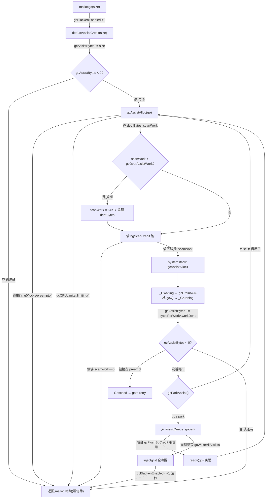

# 第十五讲 · mark assist:G 协助 GC

> 篇:第 4 篇 · 并发 GC:三色标记(支撑地基)
> 主线呼应:上一讲我们拆了并发 GC 的四阶段编排,看到了亚毫秒 STW 是怎么"把重活搬出 STW"换来的。但那一讲留了一个尾巴没答:**并发标记阶段,业务一边跑一边分配,如果分配速率压过后台 mark worker 的扫描速率,堆会一路涨过 heapGoal,甚至逼近 OOM——GC 凭什么不被高速分配者淹没?** 答案就是这一讲的全部:mark assist。runtime 不去拦着业务分配(那会破坏"分配即返回指针"的语义),而是反手把标记工作摊给分配最快的 G——**你分得多,就帮 GC 标得多**。这是一种"用分配者自己的 CPU 时间换 GC 进度"的反压(backpressure),它的设计动机、信用会计、park/retry 收敛,是 Go GC 能在高分配压力下既不 OOM、又几乎不让业务感知的真正功臣。

## 核心问题

**分配太快的 G 会不会拖垮并发 GC?runtime 怎么做到"后台标不过来时,让分配者自己补上",又不破坏 malloc 的快路径?**

读完本章你会明白:

1. mark assist 解决的根本矛盾:并发标记必须和业务抢 CPU,而业务分配又直接产生新的活对象(要标);如果只靠后台 mark worker,分配速率一旦压过扫描速率,堆会无界增长。mark assist 把"分配字节"和"扫描工作"按一个比例(assist ratio)耦合,谁分配谁出力。
2. 信用会计:`gcAssistBytes` 这个 G 上一个 int64 字段,怎么在 malloc 快路径上 O(1) 扣减、欠债(`gcAssistBytes < 0`)就触发 assist,又怎么用"扫描工作换回字节信用"还债——全程无锁、可在热路径上跑。
3. assist ratio 怎么来:pacer(`gcController`)在周期开始算出"剩下多少扫描工作 / 剩下多少堆字节配额",得到 `assistWorkPerByte`;`revise` 在周期中持续微调,使分配者走到 heapGoal 那一刻恰好把活干完。
4. 三条退路:抢后台 mark worker 攒的信用池(`bgScanCredit`)、超额协助(`gcOverAssistWork`)摊销开销、欠债还不起就 `gcParkAssist` park 起来等后台攒够信用再 `gcWakeAllAssists`。
5. 为什么这套机制 sound:assist 干的活和后台 worker 走的是同一条 `gcDrainN`/`scanObject`,染黑对象靠写屏障和三色不变式保证正确;assist 切到系统栈、把 G 置 `_Gwaiting` 再扫,保证自己不会扫到自己正在变的栈。

> **逃生阀**:如果只想记一句话,记住——**mark assist = 在 malloc 路径上做"分配字节 / 扫描工作"的会计,谁欠债谁出力,把 GC 速率和分配速率绑死**。后台 25% CPU 标不过来时,差额由分配者补;后台标得动(分配慢)时,assist 一笔都不发生,malloc 热路径只多一次 `gcBlackenEnabled != 0` 的判断和一次 int64 减法。

---

## 15.1 一句话点破

> **并发 GC 没法预先知道业务会以多快速率分配。后台 mark worker 占 25% CPU 是个静态预算,分配速率却是动态的。Go 的解法不是"调节后台 worker 的 CPU"(那太慢、太粗),而是把 GC 进度和分配进度直接耦合:每个 G 都有一个字节信用账户,分配扣、扫描加,欠债就强制协助。这样,无论分配多快,GC 进度永远咬着分配进度——分配越猛,assist 越多,堆增长被反压住,后台 25% 只是"基线贡献",差额由分配者按需补齐。**

这是结论,不是理由。本章倒过来拆:先看朴素"纯后台标记"会撞什么墙,再看 mark assist 怎么在 malloc 热路径上用一次 int64 减法把会计做掉,然后看 assist ratio 怎么定、欠债怎么还、还不起怎么收场,最后挑两个最硬的技巧(信用会计无锁化、`bgScanCredit` 的偷信用与 park 收敛)单独拆透。

---

## 15.2 朴素方案:纯后台标记为什么会被淹没

并发 GC 的后台标记由三类 mark worker 干(dedicated / fractional / idle,见上一讲 14.5),它们的 CPU 占比被 pacer 钉在大约 **25% GOMAXPROCS**(`gcBackgroundUtilization = 0.25` [`mgcpacer.go:39`](../go/src/runtime/mgcpacer.go#L39))。这是个**静态预算**:不管业务分配多猛,后台 worker 最多吃掉 25% CPU 来扫描。

矛盾在于:**扫描的活有多少,由业务的分配决定**。业务每 `make` 一个含指针的对象,就给堆添了一份未来要扫的扫描工作(`heapScanWork`)。于是:

- 如果业务分配速率 ≤ 后台扫描速率:后台标得过来,堆在到达 heapGoal 之前能标完,皆大欢喜。
- 如果业务分配速率 > 后台扫描速率:后台标不过来,堆里"已分配但没标完"的对象持续累积。GC 周期要结束时还没标完,要么 STW 拖长(标完了再走),要么堆越过 heapGoal 继续涨——后者没人拦,就一直涨到 OOM。

> **不这样会怎样**:设想的"纯后台标记"GC,在突发流量(比如一个 Web 服务瞬时收到一堆请求、每个请求 `make` 一堆 buffer)下会失灵:后台 25% CPU 跟不上,堆越过 heapGoal 还在涨,runtime 只有两个坏选择——(a) 触发 STW 强行标完(违背亚毫秒承诺);(b) 放任堆涨,直到 OOM。两者都不可接受。Java G1 之类的 GC 用"疏散失败(evacuation failure)"硬停来兜底,代价是几百毫秒停顿;Go 不愿意付这个代价。

mark assist 的根本动机就是堵这个洞:**不让"标不过来"这件事发生**。办法不是给后台 worker 加 CPU(静态预算改不动、改了又抢业务),而是**让分配者把自己造成的扫描工作自己标掉**——分配 1 字节就欠 GC 一份扫描债,欠到一定程度就强制停下来标一段再继续分配。这样:

- 分配慢的 G:永远不欠债(或欠得少),assist 一笔不发生或极少发生,malloc 热路径几乎零额外成本。
- 分配猛的 G:频繁欠债,频繁 assist,它的吞吐被"自己造成的扫描成本"反压下来,堆增长被钳制在 heapGoal 附近。
- 全局:无论分配多猛,GC 进度始终咬着分配进度,后台 25% 只是基线,差额按"谁分配谁出力"补齐。

> **钉死这件事**:mark assist 不是"GC 忙不过来时偶尔叫几个 G 帮忙"的应急措施,而是**一条常态化的反压链**:每次堆分配都走一遍"扣信用 → 欠债则协助"的会计。这条链是 Go GC 在高分配压力下不 OOM、不长时间 STW 的核心保险丝。

---

## 15.3 信用会计:一个 int64 字段怎么把会计做进 malloc 热路径

mark assist 的全部精巧,集中在"怎么让会计足够便宜,便宜到能塞进每次堆分配的快路径"。答案是一个挂在每个 G 上的 int64 字段:

```go
// src/runtime/runtime2.go #L584-L591
// gcAssistBytes is this G's GC assist credit in terms of
// bytes allocated. If this is positive, then the G has credit
// to allocate gcAssistBytes bytes without assisting. If this
// is negative, then the G must correct this by performing
// scan work. We track this in bytes to make it fast to update
// and check for debt in the malloc hot path. The assist ratio
// determines how this corresponds to scan work debt.
gcAssistBytes int64
```

注释把设计意图说得很直白:**用字节(而非扫描工作单位)记账,是为了让"更新和检查欠债"在 malloc 热路径上极快**。一次普通的堆分配,在 `mallocgc` 入口附近就做完了这笔账:

```go
// src/runtime/malloc.go #L1113-L1117(主路径)
// Assist the GC if needed. (On the reuse path, we currently compensate for this;
// changes here might require changes there.)
if gcBlackenEnabled != 0 {
    deductAssistCredit(size)
}
```

`deductAssistCredit` 的真实定义在一个"模板"文件里(编译器按 size class 把它特化成一组 `mallocgcSmallXxx`,但逻辑一致) [`malloc_stubs.go:149`](../go/src/runtime/malloc_stubs.go#L149):

```go
// src/runtime/malloc_stubs.go #L149-L158
func deductAssistCredit(size uintptr) {
    assistG := getg()
    if assistG.m.curg != nil {
        assistG = assistG.m.curg   // 总是记在用户 G 上,不是 g0
    }
    assistG.gcAssistBytes -= int64(size)
    if assistG.gcAssistBytes < 0 {
        gcAssistAlloc(assistG)
    }
}
```

这三行就是 mark assist 在 malloc 热路径上的**全部代价**:

1. **拿到当前用户 G**(注意 `assistG.m.curg` 那个判断:在系统栈上跑时 `getg()` 是 g0,真正分配的是它绑定的用户 G `curg`,信用记在 curg 头上)。
2. **`gcAssistBytes -= size`**:分配了 `size` 字节,就从信用账户扣掉 `size`。这是一次普通 int64 减法,**无锁**(字段在 G 自己头上,只有这个 G 在改)。
3. **`gcAssistBytes < 0` 才进 `gcAssistAlloc`**:欠债了才协助;不欠债(信用还够这次分配)就直接返回,malloc 快路径几乎零成本。

> **不这样会怎样**:朴素地实现"分配时算欠债"会撞两堵墙。第一,如果每次分配都进 `gcAssistAlloc`(无论欠不欠债),那是一次函数调用 + 一堆原子读,放在每次 `make([]byte, n)` 上是不可接受的开销——malloc 是 Go 程序里调用最频繁的函数之一。第二,如果用扫描工作单位(而非字节)记账,那每次分配都得查当前 `assistWorkPerByte` 做一次浮点乘法换算,热路径上多一次浮点 + 原子读,同样不可接受。Go 的解法是**账户用字节、欠债判定用 int64 符号位**,把"判断要不要协助"压缩到一次减法 + 一次比较;浮点换算只在做协助时(冷路径 `gcAssistAlloc` 里)才发生。

还有一个细节:`gcBlackenEnabled != 0` 这个判断是 mark assist 的总开关。它是个普通 `uint32` 全局变量 [`mgc.go:245`](../go/src/runtime/mgc.go#L245),在 sweep termination 里被置 1 [`mgc.go:915`](../go/src/runtime/mgc.go#L915)、在 mark termination 里被置 0 [`mgc.go:1126`](../go/src/runtime/mgc.go#L1126)。GC 周期之外(`_GCoff`),它是 0,malloc 热路径上 `if gcBlackenEnabled != 0` 直接跳过,**零开销**。这就是"GC 周期外,assist 完全不存在"的物理基础。

> **钉死这件事**:mark assist 的开销是**条件性**的——GC 周期外零开销(一次 `gcBlackenEnabled` 判断),GC 周期内信用够时只多一次 int64 减法,只有真欠债时才付出协助成本。这种"把昂贵逻辑藏在便宜判断后面"的分层,是 malloc 热路径能扛住 mark assist 的根本。

---

## 15.4 assist ratio:谁分配谁出力,这个"力"按什么比例换算

光有信用账户还不够,得回答一个核心问题:**分配 1 字节,要帮 GC 扫多少工作?** 这个比例就是 `assistWorkPerByte`,由 pacer 在 GC 周期开始时算好,周期中持续微调。

### ratio 的算法:把"剩余扫描工作"摊到"剩余堆配额"

pacer 在 `gcControllerState.revise` 里算 ratio [`mgcpacer.go:492`](../go/src/runtime/mgcpacer.go#L492)(`commit` 之后、周期开始时调一次 [`mgcpacer.go:456`](../go/src/runtime/mgcpacer.go#L456),周期中每次堆/扫描统计变了再调):

```go
// src/runtime/mgcpacer.go #L555-L594(骨架)
// Compute the remaining scan work estimate.
scanWorkRemaining := scanWorkExpected - work
if scanWorkRemaining < 1000 {
    scanWorkRemaining = 1000   // 下限,防除零和抖动
}

// Compute the heap distance remaining.
heapRemaining := heapGoal - int64(live)
if heapRemaining <= 0 {
    heapRemaining = 1          // 防除零
}

// Compute the mutator assist ratio so by the time the mutator
// allocates the remaining heap bytes up to heapGoal, it will
// have done (or stolen) the remaining amount of scan work.
assistWorkPerByte := float64(scanWorkRemaining) / float64(heapRemaining)
assistBytesPerWork := float64(heapRemaining) / float64(scanWorkRemaining)
c.assistWorkPerByte.Store(assistWorkPerByte)
c.assistBytesPerWork.Store(assistBytesPerWork)
```

这段的物理含义是:**让 mutator(分配者)在用完"从当前 heapLive 到 heapGoal 这段剩余字节配额"的过程中,恰好做完"剩余的全部扫描工作"**。换句话说,heapGoal 是一条线,走到这条线时,扫描工作必须恰好干完——否则要么 STW 兜底,要么堆越界。把两个"剩余"相除,ratio 就是"每分配 1 字节要扫多少工作"。

举例:heapLive 离 heapGoal 还有 100 MB,剩余扫描工作估计 25 M 单位,那么 `assistWorkPerByte = 0.25`。一个 G 分配 1 KB,欠的扫描债就是 `0.25 × 1024 = 256` 单位扫描工作。它要去扫够这 256 单位,才能继续分配。

> **不这样会怎样**:如果 ratio 定得太小(比如后台标得快,assist 不出力),分配猛的 G 不被反压,堆会越过 heapGoal。如果 ratio 定得太大(assist 太狠),分配者把大头 CPU 花在标记上,业务吞吐被压垮。pacer 的目标是**让 ratio 恰好填平"后台 25% CPU 标不完的差额"**——后台能标的算进 `scanWorkExpected` 的"已被标"那部分,标不完的差额由 assist 按 ratio 补。这样 assist 总量随分配速率动态变化:分配慢,ratio 在数值上不变但触发少;分配猛,触发频繁,assist 总量上升,反压住堆增长。

### ratio 的两类目标:soft goal 与 hard goal

`revise` 里有两段对 ratio 影响很大的逻辑(上面骨架省略了),值得单独讲——它们决定了"assist ratio 在堆涨得比预期快时怎么变":

```go
// src/runtime/mgcpacer.go #L517-L553(节选)
if work > scanWorkExpected {
    // 已经扫得比预期多 → 堆在涨。把 heapGoal 外推到 worst-case 扫描工作
    extHeapGoal := int64(float64(heapGoal-int64(c.triggered))/float64(scanWorkExpected)*float64(maxScanWork)) + int64(c.triggered)
    scanWorkExpected = maxScanWork
    // hardGoal:外推 goal 不超过 heapGoal 的 (1+GOGC/100) 倍
    hardGoal := int64((1.0 + float64(gcPercent)/100.0) * float64(heapGoal))
    if extHeapGoal > hardGoal {
        extHeapGoal = hardGoal
    }
    heapGoal = extHeapGoal
}
if int64(live) > heapGoal {
    // 已经越过 goal 了,留 10% 余量,别让 ratio 飞天
    const maxOvershoot = 1.1
    heapGoal = int64(float64(heapGoal) * maxOvershoot)
    scanWorkExpected = maxScanWork
}
```

这两段处理的是"堆涨得比 steady-state 假设快"的情形。pacer 默认按"堆在 steady-state 增长"算 ratio,但实际堆可能突然涨快(扫的工作量超预期),这时:

- **soft goal 机制**(`work > scanWorkExpected` 分支):把 heapGoal 从"原配额"外推到"按 worst-case 扫描工作算的更大配额"(`extHeapGoal`),让 ratio 不至于瞬间飞天——意思是"这一轮多用点内存没关系,反正下一轮也要用这么多"。`hardGoal` 给这个外推封顶(不超过 `heapGoal × (1 + GOGC/100)`),防止 ratio 被压得太低、assist 形同虚设。
- **已越过 goal 的兜底**(`live > heapGoal`):堆已经超线了,留 10% 余量(`maxOvershoot = 1.1`)继续算 ratio,避免 `heapRemaining ≤ 0` 导致 ratio 变成负数或除零。

> **钉死这件事**:ratio 不是固定值,是 pacer 在周期中持续 `revise` 的动态值。它的目标永远是"让分配者走到某个 goal 时,恰好把扫描工作干完"。这个 goal 在堆涨得快时会自动外推(soft goal),但永远不超 hardGoal——这是"既不让 assist 飞天压垮业务、又不让堆无界增长"的精算。

### 两个 ratio 字段:为什么是 `WorkPerByte` 和 `BytesPerWork` 一对

注意 pacer 存了**两个**互为倒数的字段:`assistWorkPerByte` 和 `assistBytesPerWork` [`mgcpacer.go:330`](../go/src/runtime/mgcpacer.go#L330) [`mgcpacer.go:337`](../go/src/runtime/mgcpacer.go#L337)。注释里直说这两个值"原子更新但不一起更新,可能略有 skew" [`mgcpacer.go:475-486`](../go/src/runtime/mgcpacer.go#L475-L486),但这是可以接受的。为什么要存一对?

- **`assistWorkPerByte`(字节→工作)**:`gcAssistAlloc` 里算"欠多少扫描工作"用——`scanWork = assistWorkPerByte × debtBytes` [`mgcmark.go:566`](../go/src/runtime/mgcmark.go#L566)。已知欠了多少字节债,换算成要做多少扫描工作。
- **`assistBytesPerWork`(工作→字节)**:`gcAssistAlloc1` 里算"做了这么多工作,还回多少字节信用"用——`gcAssistBytes += assistBytesPerWork × workDone` [`mgcmark.go:756`](../go/src/runtime/mgcmark.go#L756)。已知扫了多少,换算成还了多少字节债。

为什么不只存一个、用的时候算倒数?因为**热路径上做浮点除法比乘法贵**,而 assist 进出热路径(`gcAssistAlloc` 算欠债、`gcAssistAlloc1` 还债)调用频繁,存倒数省一次浮点除法。skew 的代价只是 assist 比理想值偏差一点点,不影响 soundness(assist 多做少做都不漏标,只影响吞吐),所以这个 trade-off 划算。

---

## 15.5 `gcAssistAlloc`:欠债了,怎么还

信用账户扣到负数,`gcAssistAlloc` 登场 [`mgcmark.go:499`](../go/src/runtime/mgcmark.go#L499)。这是 mark assist 的核心函数,我们按它的执行顺序拆,每一段都问"不这样会怎样"。

### 第 0 步:逃生阀——非抢占上下文不协助

```go
// src/runtime/mgcmark.go #L499-L507
func gcAssistAlloc(gp *g) {
    // Don't assist in non-preemptible contexts. These are
    // generally fragile and won't allow the assist to block.
    if getg() == gp.m.g0 {
        return
    }
    if mp := getg().m; mp.locks > 0 || mp.preemptoff != "" {
        return
    }
    ...
```

assist 会切到系统栈、会把 G 置 `_Gwaiting`、可能 park,这些都需要"可被抢占"的上下文。如果当前已经在不可抢占段(`mp.locks > 0`,比如持有 runtime 内部锁;或 `mp.preemptoff != ""`,比如信号处理中),直接 return——**宁可这次分配不协助,也不能在不可抢占段里死循环或死锁**。

> **不这样会怎样**:如果 assist 在 `mp.locks > 0` 的段里 park 了,而唤醒它需要某个持锁的路径,就死锁。这条逃生阀是 sound 的硬要求。

### 第 1 步:CPU limiter 开着就不协助

```go
// src/runtime/mgcmark.go #L533-L558(节选)
retry:
    if gcCPULimiter.limiting() {
        // If the CPU limiter is enabled, intentionally don't
        // assist to reduce the amount of CPU time spent in the GC.
        ...
        return
    }
```

`gcCPULimiter` 是 Go 1.19 加的机制:当 GC 占 CPU 太多(后台 + assist 合起来超标),limiter 会主动让 GC(包括 assist)歇一歇,把 CPU 让给业务。这里 assist 检测到 limiter 在限制,直接不干——**优先保业务吞吐,哪怕堆暂时多涨一点**。这是"assist 反压"的反向保险丝:assist 自己也有上限,不会无节制地把分配者 CPU 全吃光。

### 第 2 步:算欠债、超额协助摊销

```go
// src/runtime/mgcmark.go #L559-L570
    // Compute the amount of scan work we need to do to make the
    // balance positive. When the required amount of work is low,
    // we over-assist to build up credit for future allocations
    // and amortize the cost of assisting.
    assistWorkPerByte := gcController.assistWorkPerByte.Load()
    assistBytesPerWork := gcController.assistBytesPerWork.Load()
    debtBytes := -gp.gcAssistBytes
    scanWork := int64(assistWorkPerByte * float64(debtBytes))
    if scanWork < gcOverAssistWork {
        scanWork = gcOverAssistWork
        debtBytes = int64(assistBytesPerWork * float64(scanWork))
    }
```

- `debtBytes = -gp.gcAssistBytes`:欠了多少字节(`gcAssistBytes` 是负的,取反得正的欠债)。
- `scanWork = assistWorkPerByte × debtBytes`:把字节欠债换算成扫描工作。
- **超额协助**(`gcOverAssistWork = 64 << 10` = 65536 [`mgcpacer.go:56`](../go/src/runtime/mgcpacer.go#L56)):如果算出来的扫描工作太少(< 64 KB 单位),就强行做到 64 KB。这是**摊销 assist 调用本身的开销**——进一次 `gcAssistAlloc`(切系统栈、改状态、记时间)是有固定成本的,如果只做一点点活就退出,下次又得进来,反复横跳。不如一次多做点,把信用攒到正数,后面几次小分配就不用再 assist。

> **钉死这件事**:`gcOverAssistWork` 是 mark assist 的"批量摊销"策略。它和 mcache 的批量分配、wbBuf 的批量 flush 是同一思路——**热路径上的小操作攒成一批再做,摊薄固定开销**。没有它,频繁小分配的 G 会反复进出 `gcAssistAlloc`,assist 本身的开销会反过来吃掉分配者吞吐。

### 第 3 步:偷后台 mark worker 攒的信用池

```go
// src/runtime/mgcmark.go #L572-L617
    // Steal as much credit as we can from the background GC's
    // scan credit. This is racy and may drop the background
    // credit below 0 if two mutators steal at the same time. This
    // will just cause steals to fail until credit is accumulated
    // again, so in the long run it doesn't really matter, but we
    // do have to handle the negative credit case.
    bgScanCredit := gcController.bgScanCredit.Load()
    stolen := int64(0)
    if bgScanCredit > 0 {
        if bgScanCredit < scanWork {
            stolen = bgScanCredit
            gp.gcAssistBytes += 1 + int64(assistBytesPerWork*float64(stolen))
        } else {
            stolen = scanWork
            gp.gcAssistBytes += debtBytes
        }
        gcController.bgScanCredit.Add(-stolen)

        scanWork -= stolen

        if scanWork == 0 {
            // We were able to steal all of the credit we needed.
            ...return
        }
    }
```

这一段是 mark assist 最精妙的一处。后台 mark worker(dedicated/fractional/idle)在干活时,它们扫的工作量会**累积到一个全局信用池** `bgScanCredit` [`mgcpacer.go:259`](../go/src/runtime/mgcpacer.go#L259)。这个池子的语义是:**后台 worker 干的活,可以"借"给分配者抵债**。

逻辑是:assist 算出要干 `scanWork`,先看看后台池子里有没有信用,有就先偷(`stolen = min(bgScanCredit, scanWork)`),偷到的换算成字节信用加到 `gcAssistBytes` 上。偷够了(`scanWork == 0`)就直接返回——**自己一点活都不用干,纯靠后台 worker 的成果抵债**。偷不够才继续往下做剩余的协助工作。

为什么这么设计?因为后台 worker 的 25% CPU 是"基线贡献",它干的活本来就为了帮分配者还债。如果每个 assist 都从头自己扫,后台 worker 的成果就浪费了(它扫的堆和 assist 扫的堆会重复)。让 assist 先偷后台信用池,等于**后台 worker 帮所有分配者摊了一部分债**,分配者只需要补差额。

> **钉死这件事**:`bgScanCredit` 是后台 worker 和 mutator assist 之间的**信用中介**。后台干的活攒成信用,assist 先消费信用、消费不够才自己干。这让"后台 25% + assist 差额"这个分工真正落地:后台标得动的部分,assist 一笔不发生(只偷信用);标不动的部分,assist 补上。

注意注释特意说"this is racy and may drop the background credit below 0":多个 mutator 同时偷,`Load` + `Add` 不是原子的,可能两个都看到 `bgScanCredit = 100`、都偷 100,结果池子变 -100。注释说"long run it doesn't really matter"——因为负池子只是让后续偷失败,后台 worker 还在持续往里加信用,最终一致。这是**有意识地放宽一致性换吞吐**的经典取舍(和 work-stealing runq 的 race 容忍同源)。

### 第 4 步:真干活——切系统栈、置 `_Gwaiting`、`gcDrainN`

偷不够,剩下的 `scanWork` 必须自己扫:

```go
// src/runtime/mgcmark.go #L637-L648
    // Perform assist work
    systemstack(func() {
        gcAssistAlloc1(gp, scanWork)
        // The user stack may have moved, so this can't touch
        // anything on it until it returns from systemstack.
    })

    completed := gp.param != nil
    gp.param = nil
    if completed {
        gcMarkDone()
    }
```

注意两个细节:

1. **切系统栈(`systemstack`)**:assist 的扫描工作在系统栈上做,不在用户 G 的栈上。原因是扫描过程中用户栈可能**移动**(栈收缩/增长,第 17 章),如果在用户栈上跑扫描、扫描到一半栈地址变了,引用栈上变量的代码就崩了。注释那句"The user stack may have moved"就是这个意思——`systemstack` 闭包里**不能捕获用户栈上的变量**,所以 `gcAssistAlloc1` 设计成只接收参数、不碰用户栈 [`mgcmark.go:701-708`](../go/src/runtime/mgcmark.go#L701-L708)。

2. **`completed := gp.param != nil`**:扫描过程中可能恰好把标记工作全干完了(全局队列空、没 worker 在干)。`gcAssistAlloc1` 通过设 `gp.param` 非空来告诉调用方"你触发了标记完成" [`mgcmark.go:760-766`](../go/src/runtime/mgcmark.go#L760-L766),`gcAssistAlloc` 收到信号就调 `gcMarkDone()`(上一讲 14.6 讲的参差屏障收尾)。这是"assist 也能成为标记完成的触发者"——不一定非得后台 worker。

`gcAssistAlloc1` 是真正干活的函数 [`mgcmark.go:711`](../go/src/runtime/mgcmark.go#L711):

```go
// src/runtime/mgcmark.go #L711-L779(骨架)
//go:systemstack
func gcAssistAlloc1(gp *g, scanWork int64) {
    gp.param = nil

    if atomic.Load(&gcBlackenEnabled) == 0 {
        // GC is done, so ignore any remaining debt.
        gp.gcAssistBytes = 0
        return
    }
    ...
    startTime := nanotime()
    trackLimiterEvent := gp.m.p.ptr().limiterEvent.start(limiterEventMarkAssist, startTime)

    gcBeginWork()

    // gcDrainN requires the caller to be preemptible.
    casGToWaitingForSuspendG(gp, _Grunning, waitReasonGCAssistMarking)

    // drain own cached work first in the hopes that it
    // will be more cache friendly.
    gcw := &getg().m.p.ptr().gcw
    workDone := gcDrainN(gcw, scanWork)

    casgstatus(gp, _Gwaiting, _Grunning)

    // Record that we did this much scan work.
    assistBytesPerWork := gcController.assistBytesPerWork.Load()
    gp.gcAssistBytes += 1 + int64(assistBytesPerWork*float64(workDone))

    // If this is the last worker and we ran out of work,
    // signal a completion point.
    if gcEndWork() {
        gp.param = unsafe.Pointer(gp)
    }
    ...
    pp.gcAssistTime += duration
    if pp.gcAssistTime > gcAssistTimeSlack {
        gcController.assistTime.Add(pp.gcAssistTime)
        gcCPULimiter.update(now)
        pp.gcAssistTime = 0
    }
}
```

逐段:

- **`gcBlackenEnabled` 复查**:malloc 里那个 `gcBlackenEnabled != 0` 是普通读(为了快,注释明说 `mgcmark.go:716-719`),和 mark termination 里置 0 的 store 有 race。assist 进到系统栈这个不可抢占段,用原子读复查一次,如果 GC 已经结束,清零 `gcAssistBytes` 直接返回——**周期外不留债**。
- **`casGToWaitingForSuspendG(gp, _Grunning, waitReasonGCAssistMarking)`**:把当前 G 从 `_Grunning` 切到 `_Gwaiting`(原因 `waitReasonGCAssistMarking`)。为什么?因为 `gcDrainN` 扫描堆时可能要扫到别的 G 的栈,如果某个被扫的 G 是自己,会死锁(G 等自己扫自己);把自己置 `_Gwaiting`,GC 扫栈时能正确处理(它知道这个 G 停在安全点)。注释明说"gcDrainN requires the caller to be preemptible" [`mgcmark.go:1391`](../go/src/runtime/mgcmark.go#L1391)。
- **`gcDrainN(gcw, scanWork)`**:干 `scanWork` 单位的扫描工作。注意它用的是**当前 P 的 gcw**(本地工作缓存),注释说"drain own cached work first in the hopes that it will be more cache friendly"——先消费本地缓存,缓存友好。`gcDrainN` 和后台 worker 用的 `gcDrain` 是同一套扫描逻辑(`scanObject`/`scanSpan`/`markroot`),只是 assist 版按工作量退出 [`mgcmark.go:1397`](../go/src/runtime/mgcmark.go#L1397)。
- **还债**:`gp.gcAssistBytes += 1 + assistBytesPerWork × workDone`。注意那个 `1 +`:注释说是"poor man's round-up",保证即使 `assistBytesPerWork` 极小(堆配额远大于扫描工作),做了一点活也能加正信用,不至于因为浮点取整永远还不清债 [`mgcmark.go:750-756`](../go/src/runtime/mgcmark.go#L750-L756)。
- **`gcAssistTime` 批量上报**:`pp.gcAssistTime` 在 P 上累加,攒到超过 `gcAssistTimeSlack`(5000ns [`mgcpacer.go:51`](../go/src/runtime/mgcpacer.go#L51))才原子加到全局 `gcController.assistTime`。又是批量摊销,减少全局原子操作的争用——和 `gcCreditSlack`(2000)、`gcOverAssistWork`(64KB)是同一套思路。

### 第 5 步:还不起就 park,等后台攒信用

```go
// src/runtime/mgcmark.go #L650-L678
    if gp.gcAssistBytes < 0 {
        // We were unable steal enough credit or perform
        // enough work to pay off the assist debt. We need to
        // do one of these before letting the mutator allocate
        // more to prevent over-allocation.
        //
        // If this is because we were preempted, reschedule
        // and try some more.
        if gp.preempt {
            Gosched()
            goto retry
        }

        // Add this G to an assist queue and park. When the GC
        // has more background credit, it will satisfy queued
        // assists before flushing to the global credit pool.
        //
        // Note that this does *not* get woken up when more
        // work is added to the work list. The theory is that
        // there wasn't enough work to do anyway, so we might
        // as well let background marking take care of the
        // work that is available.
        if !gcParkAssist() {
            goto retry
        }

        // At this point either background GC has satisfied
        // this G's assist debt, or the GC cycle is over.
    }
```

这一段处理"扫了一圈还是没还清债"的极端情况。两种成因:

1. **被抢占**(`gp.preempt`):扫到一半被 `SIGURG` 抢占了(第 5 章),没扫够。这种情况 `Gosched()` 主动让出,重新调度回来 `goto retry` 再试——这是"被抢了不 park,重试即可"。
2. **没活可扫**(`gcParkAssist` 返回 false 表示重试,true 表示 park):`gcDrainN` 扫描时发现全局队列空、没活可干了(后台 worker 已经把堆扫遍,没有新灰对象),但 `gcAssistBytes` 还负着。这种情况下"再扫也没用,没东西可扫",于是 `gcParkAssist` 把 G 挂到 `work.assistQueue` 上 park 起来,等后台 worker 攒够信用(`gcFlushBgCredit`)再唤醒。

注意注释那句关键的话:**"this does *not* get woken up when more work is added to the work list. The theory is that there wasn't enough work to do anyway"**——parked 的 assist **不会因为新工作出现而被唤醒**(那意味着有活可扫,但它已经被 park 了,不如让后台 worker 干),只会在**后台攒够字节信用**或 **GC 周期结束**时被唤醒。这是 sound 的:parked assist 欠的是"字节债",而还字节债有两种方式——做扫描工作(没活可扫时无效)或拿后台信用(等后台攒)。

`gcParkAssist` 的实现 [`mgcmark.go:795`](../go/src/runtime/mgcmark.go#L795):

```go
// src/runtime/mgcmark.go #L795-L823(骨架)
func gcParkAssist() bool {
    lock(&work.assistQueue.lock)
    if atomic.Load(&gcBlackenEnabled) == 0 {
        unlock(&work.assistQueue.lock)
        return true   // 周期结束,直接走
    }

    gp := getg()
    oldList := work.assistQueue.q
    work.assistQueue.q.pushBack(gp)

    // Recheck for background credit now that this G is in
    // the queue, but can still back out. This avoids a
    // race in case background marking has flushed more
    // credit since we checked above.
    if gcController.bgScanCredit.Load() > 0 {
        work.assistQueue.q = oldList
        ...
        unlock(&work.assistQueue.lock)
        return false   // 有信用了,回 retry 再偷一次
    }
    // Park.
    goparkunlock(&work.assistQueue.lock, waitReasonGCAssistWait, traceBlockGCMarkAssist, 2)
    return true
}
```

注意入队之后、park 之前**再查一次 `bgScanCredit`**:这是防"入队和后台 flush 信用的 race"——如果刚入队、后台刚好 flush 了信用,park 了就错过了。重查发现有信用,把 G 从队列摘出来(`work.assistQueue.q = oldList`)返回 false,让调用方 `goto retry` 再偷一次。这种"double-check 后再 park"的姿势,和 sync.Mutex 的 sema 路径、channel 的 park 路径同源——**park 前永远再确认一次条件,防 lost wakeup**。

> **钉死这件事**:mark assist 的失败处理是一条**三段式退路**:被抢占→`Gosched` 重试;没活可扫→park 等信用;周期结束→清债返回。每一段都对应一种"欠债还不起"的成因,且都不会让 G 永远卡住(park 了一定会被 `gcFlushBgCredit` 或 `gcWakeAllAssists` 唤醒)。这是反压机制"既能压住分配、又不饿死分配者"的 soundness 保证。

---

## 15.6 后台信用怎么流回 assist:`gcFlushBgCredit` 与 `gcWakeAllAssists`

上一节反复提到"后台攒够信用就唤醒 parked assist"。这一节看信用怎么流。

### 后台 worker 攒信用:`gcFlushBgCredit`

后台 mark worker 在 `gcDrain` 扫描时,每攒到 `gcCreditSlack`(2000 单位)就调 `gcFlushBgCredit` 把信用交出去 [`mgcmark.go:1453`](../go/src/runtime/mgcmark.go#L1453) [`mgcmark.go:1355`](../go/src/runtime/mgcmark.go#L1355)。`gcFlushBgCredit` 的策略是**先喂 parked assist,喂不完再灌全局池** [`mgcmark.go:836`](../go/src/runtime/mgcmark.go#L836):

```go
// src/runtime/mgcmark.go #L836-L885(骨架)
//go:nowritebarrierrec
func gcFlushBgCredit(scanWork int64) {
    if work.assistQueue.q.empty() {
        // Fast path; there are no blocked assists. ...
        gcController.bgScanCredit.Add(scanWork)
        return
    }

    assistBytesPerWork := gcController.assistBytesPerWork.Load()
    scanBytes := int64(float64(scanWork) * assistBytesPerWork)

    lock(&work.assistQueue.lock)
    for !work.assistQueue.q.empty() && scanBytes > 0 {
        gp := work.assistQueue.q.pop()
        // Note that gp.gcAssistBytes is negative because gp
        // is in debt. Think carefully about the signs below.
        if scanBytes+gp.gcAssistBytes >= 0 {
            // Satisfy this entire assist debt.
            scanBytes += gp.gcAssistBytes
            gp.gcAssistBytes = 0
            // It's important that we *not* put gp in
            // runnext. Otherwise, it's possible for user
            // code to exploit the GC worker's high
            // scheduler priority to get itself always run
            // before other goroutines ...
            ready(gp, 0, false)
        } else {
            // Partially satisfy this assist.
            gp.gcAssistBytes += scanBytes
            scanBytes = 0
            // As a heuristic, we move this assist to the
            // back of the queue so that large assists
            // can't clog up the assist queue ...
            work.assistQueue.q.pushBack(gp)
            break
        }
    }

    if scanBytes > 0 {
        // Convert from scan bytes back to work.
        assistWorkPerByte := gcController.assistWorkPerByte.Load()
        scanWork = int64(float64(scanBytes) * assistWorkPerByte)
        gcController.bgScanCredit.Add(scanWork)
    }
    unlock(&work.assistQueue.lock)
}
```

逐段拆:

- **快路径(`assistQueue` 空)**:没有 parked assist,信用直接灌全局池 `bgScanCredit`,给后续 assist 偷。注释说有个小窗口可能 assist 刚入队,但"next flush 会捞到它",可接受。
- **慢路径(有 parked assist)**:信用先换成字节(`scanBytes`),然后挨个喂队首的 assist。注意符号:`gp.gcAssistBytes` 是负的(欠债),`scanBytes + gp.gcAssistBytes >= 0` 表示这点信用够还清这个 G 的债——还清就 `gp.gcAssistBytes = 0`、`ready(gp)` 唤醒它(注意 `ready(gp, 0, false)` 第三个参数 false,不放进 `runnext`,注释解释了原因:防用户代码利用 GC worker 的高调度优先级"插队"饿死别的 G,这是公平性考虑)。不够还清就部分还(`gp.gcAssistBytes += scanBytes`,注意是负数加正数,债变小但仍负),把这个 G 挪到队尾(防止大债 assist 堵塞小债 assist),`break` 退出。
- **喂不完的灌全局池**:循环出来如果 `scanBytes > 0`(还有剩),换回工作单位灌 `bgScanCredit`。

> **不这样会怎样**:如果后台信用只灌全局池、不直接喂 parked assist,那 parked assist 只能等下次自己被唤醒(但没人会主动唤醒它,因为没机制检测全局池变化)。先喂队列再灌池,保证 parked assist 优先拿到信用被唤醒——这是"反压归零"的最短路径:后台一攒到信用,马上放一个欠债 G 回去分配,避免它无谓 park。

注意那个 `//go:nowritebarrierrec` 标注 [`mgcmark.go:835`](../go/src/runtime/mgcmark.go#L835):这个函数在 `gcDrain` 把本地工作排空后调用,如果它触发写屏障(写堆指针),会往已经排空的 gcw 里塞新工作,破坏"排空"这个不变式。编译器指令 `nowritebarrierrec` 会在编译期检查:这个函数及其调用链里不许有写屏障,违例直接编译失败。这是用编译器指令钉死 soundness 的典型手段。

### 周期结束:一把全唤醒

GC 周期结束(mark termination),`gcBlackenEnabled` 置 0 之前,要把所有 parked assist 唤醒——它们的债在周期结束时自动清零,不该再 park [`mgc.go:1131-1133`](../go/src/runtime/mgc.go#L1131-L1133):

```go
// src/runtime/mgc.go #L1126-L1133
atomic.Store(&gcBlackenEnabled, 0)

// Notify the CPU limiter that GC assists will now cease.
gcCPULimiter.startGCTransition(false, now)

// Wake all blocked assists. These will run when we
// start the world again.
gcWakeAllAssists()
```

`gcWakeAllAssists` 极简 [`mgcmark.go:784`](../go/src/runtime/mgcmark.go#L784):

```go
// src/runtime/mgcmark.go #L784-L789
func gcWakeAllAssists() {
    lock(&work.assistQueue.lock)
    list := work.assistQueue.q.popList()
    injectglist(&list)
    unlock(&work.assistQueue.lock)
}
```

把整个 assistQueue 一锅端,`injectglist` 批量塞回全局 runq。这些 G 醒来后回到 `gcAssistAlloc` 的 retry 或返回点,发现 `gcBlackenEnabled == 0`(在 `gcAssistAlloc1` 里复查 [`mgcmark.go:716`](../go/src/runtime/mgcmark.go#L716),或 `gcParkAssist` 里复查 [`mgcmark.go:800`](../go/src/runtime/mgcmark.go#L800)),清债返回,继续分配。注释说"these will run when we start the world again"——它们在 STW 期间被注入 runq,`startTheWorldWithSema` 放业务时一起跑。

---

## 15.7 一张图:mark assist 的完整反压链

把上面所有片段串成一张流程图,钉在脑子里:



这张图里每一条边都是上一节拆过的某段源码。关键的不变量:

- **malloc 热路径上的代价**:`gcBlackenEnabled` 判断 + 一次 int64 减法 + 一次符号位比较。只有欠债才进 `gcAssistAlloc`。
- **assist 的优先级**:偷信用池 > 自己扫 > park。能偷就不扫(省 CPU),扫不够才 park(等后台)。
- **sound 保证**:每条退出路径要么还清债(`gcAssistBytes >= 0`),要么 park(等信用/周期结束),要么清债(周期结束 `gcBlackenEnabled == 0`)。永远不会"欠着债放走 G 去分配"——那是 OOM 的起点。

---

## 15.8 技巧精解:无锁信用会计 + 后台信用池的 race 容忍

这一章最硬的两个技巧,挑出来配源码对比拆透。

### 技巧一:`gcAssistBytes` 无锁化——用"字节单位 + 符号位"把会计压进热路径

mark assist 最反直觉的一点是:**每次堆分配都在改信用账户,为什么 malloc 热路径没被锁拖垮?** 答案在 `gcAssistBytes` 这个字段的三个设计决策叠加:

1. **账户挂在 G 上,不挂在 P 或全局**。`gcAssistBytes` 是 `g` 的字段 [`runtime2.go:591`](../go/src/runtime/runtime2.go#L591),只有这个 G 自己在改(它在某个 P 上跑、占用一条 M,没有别的执行流会碰它的账户)。所以扣减(`gcAssistBytes -= size`)是**天然无竞争的普通写**,不需要原子操作、不需要锁。

2. **用字节单位,不用扫描工作单位**。如果账户记的是"扫描工作单位",每次分配都得查 `assistWorkPerByte` 做浮点乘法——一次原子读 + 一次浮点乘,热路径上贵。改用字节单位后,扣减就是 `gcAssistBytes -= size`(`size` 是这次分配的字节数,常量),**纯整数减法**,极快。浮点换算只在 `gcAssistAlloc`(欠债协助,冷路径)里做。

3. **欠债判定用符号位**。`gcAssistBytes < 0` 一次整数比较,比"和阈值比"或"查 ratio 算"都便宜。CPU 上就是一条 `TEST`/`JS` 指令。

```go
// src/runtime/malloc_stubs.go #L154-L157 —— 整个热路径会计的全部
assistG.gcAssistBytes -= int64(size)
if assistG.gcAssistBytes < 0 {
    gcAssistAlloc(assistG)
}
```

> **反面对比**:朴素的实现会怎么做?可能是——每次分配,锁住一个全局"GC 状态",查当前 ratio,算欠债,如果欠了就协助。这套在每次 `make` 上要付出:一次锁 + 一次全局原子读 + 一次浮点乘 + 可能的协助调用。Go 程序里 `make`/`new` 的频率是每秒百万级,这套开销会让 malloc 慢一个数量级,mark assist 根本不可行。Go 的解法把"判断要不要协助"压缩到两条指令(减法 + 符号判断),把所有昂贵逻辑(`ratio` 查询、浮点换算、协助本身)推到欠债冷路径——这是"**热路径极简,冷路径承担复杂度**"的教科书级分层。

还有一个不那么显眼但同样关键的点:**`assistG.m.curg` 那个判断** [`malloc_stubs.go:150-153`](../go/src/runtime/malloc_stubs.go#L150-L153):

```go
assistG := getg()
if assistG.m.curg != nil {
    assistG = assistG.m.curg
}
```

为什么需要它?因为 `deductAssistCredit` 可能在**系统栈(g0 栈)上被调用**(比如 runtime 自己在 g0 栈上分配)。这时 `getg()` 返回 g0,但真正"逻辑上的分配者"是 g0 绑定的用户 G `curg`。信用必须记在 curg 头上(因为还债时是 curg 去协助,不是 g0)。这个判断把"g0 系统栈分配"和"用户 G 分配"统一到"信用记在用户 G 上"的语义。漏了它,g0 上分配的债会记在 g0 头上,g0 永远不协助(它在系统栈上),债永远不还。

### 技巧二:`bgScanCredit` 的 race 容忍——"宁可偶尔偷超,也不上锁"

上一节提过,`gcAssistAlloc` 里偷后台信用池用的是 `Load` + `Add` 两个分离的原子操作 [`mgcmark.go:578-588`](../go/src/runtime/mgcmark.go#L578-L588),不是 CAS:

```go
bgScanCredit := gcController.bgScanCredit.Load()
stolen := int64(0)
if bgScanCredit > 0 {
    if bgScanCredit < scanWork {
        stolen = bgScanCredit
        gp.gcAssistBytes += 1 + int64(assistBytesPerWork*float64(stolen))
    } else {
        stolen = scanWork
        gp.gcAssistBytes += debtBytes
    }
    gcController.bgScanCredit.Add(-stolen)
    ...
}
```

两个 mutator 同时偷:都 `Load` 到 100,都偷 100,`Add(-100)` 两次,池子变 -100。注释直说"this is racy and may drop the background credit below 0 ... in the long run it doesn't really matter" [`mgcmark.go:572-577`](../go/src/runtime/mgcmark.go#L572-L577)。

为什么不 CAS?两个理由:

1. **CAS 在高度争用下反而更慢**(CAS 失败要重试,重试又抢 cache line)。后台信用池在分配猛时被几十个 mutator 同时偷,CAS 风暴会让这条路径变成 cache line ping-pong 的热点。
2. **负池子的后果可控**。池子负了,后续 `bgScanCredit > 0` 判断失败,偷不到——这部分本该偷的债,mutator 自己扫补上(走第 4 步 `gcDrainN`)。后台 worker 持续往池子加信用(`gcFlushBgCredit`),最终会回到正数。**没有任何正确性问题**:偷超的 mutator 多得了信用(等于少扫了点活),但少扫的活不会漏标(三色不变式靠写屏障保,不靠 assist 干多少活);少扫的活会被后台 worker 或别的 assist 接着扫。最终一致性。

> **反面对比**:如果上 CAS,每次偷信用是一次 `LOCK CMPXCHG` + 失败重试循环。在高分配压力(正是 mark assist 频繁触发的场景)下,几十个 P 上的 mutator 抢一个 cache line, CAS 退避-重试的开销会吃掉偷信用本该省的 CPU。Go 的取舍是:**承认 race、放宽一致性、用最终一致换无锁吞吐**。这和 work-stealing runq 的"偷一半时容忍 race"、`sync/atomic` 计数器的"非 CAS 累加"是同源设计哲学——**热路径上的强一致性,代价常常不值**。

这两个技巧合起来,回答了 mark assist 最核心的工程问题:**怎么在一个调用频率百万/秒的热路径(malloc)上,挂一套"分配即欠债、欠债则协助"的反压机制,却不让热路径变慢?** 答案是——账户挂 G 上(无竞争)、用字节单位(整数减法)、符号位判欠(一条指令)、昂贵逻辑全推冷路径、信用池放宽一致性(无锁)。每一处都是为了"把复杂度推出热路径"。

---

## 15.9 技巧精解补:assist 干的活为什么 sound

mark assist 是 mutator(业务 G)在并发标记阶段直接染黑堆对象,这听起来很危险——业务线程碰 GC 数据结构,会不会破坏三色不变式?这一节专门回答 soundness。

assist 干活的全路径是:`gcAssistAlloc1` → `gcDrainN` → `scanObject`/`scanSpan`/`markroot`。这和后台 mark worker 的 `gcDrain` 走的是**同一套扫描代码** [`mgcmark.go:1397`](../go/src/runtime/mgcmark.go#L1397)。也就是说,assist 并没有"另一套"标记逻辑,它就是又一个 mark worker(只是触发源是分配而非调度器)。所以三色不变式的保证,和后台 worker 完全一样:

1. **写屏障防漏标**(第 13 章):assist 和业务并发跑,业务改指针 `*slot = ptr` 被写屏障 shade,不会因为 assist 正在扫就把新指针漏了。assist 自己写 GC 内部指针走 `nowritebarrierrec`/`nowritebarrier`(编译期检查),不会触发屏障自乱。

2. **`gcWork` 的并发安全**:assist 用的是当前 P 的 `gcw`(本地工作缓存),后台 worker 用各自 P 的 `gcw`。`gcw` 内部是无锁的(单 P 局部),跨 P 交换工作走 `gcw.balance()` 时才上全局锁。assist 和别的 worker 各扫各的本地缓存,不踩对方。

3. **对象染黑的原子性**:`greyobject` 用 `markBits` 的原子位操作(atomic OR)染黑 [`mgcmark.go`](../go/src/runtime/mgcmark.go),多个 assist/worker 同时染同一个对象不会撕裂(位 OR 天然幂等)。

4. **assist 不扫自己栈**:`gcAssistAlloc1` 把 G 置 `_Gwaiting(waitReasonGCAssistMarking)` [`mgcmark.go:740`](../go/src/runtime/mgcmark.go#L740),它的栈静止了。`gcDrainN` 扫别的 G 栈时不会扫到自己(自己不在 `stackRoots` 待扫列表的活跃态)。这避免了"扫自己栈时栈在变"的死锁/撕裂。

5. **切系统栈防栈移动**:`gcAssistAlloc1` 标了 `//go:systemstack` [`mgcmark.go:710`](../go/src/runtime/mgcmark.go#L710),在系统栈上跑扫描。用户栈可能移动(栈收缩,第 17 章),系统栈不会。如果在用户栈上跑、扫到一半用户栈移动了,引用栈上变量的代码崩。系统栈隔离了这个风险。

> **钉死这件事**:mark assist 的 soundness 不靠任何新机制,它复用了并发 GC 已有的全部正确性保证——写屏障防漏标、`gcWork` 无锁局部缓存、原子位染黑、状态机隔离自扫、系统栈防移动。这是"assist 就是又一个 mark worker"设计的副产品:**只要后台 worker 标得 sound,assist 就标得 sound**,因为它们是同一套代码。Go 团队没有为 assist 发明新的并发原语,这是工程上的高明。

---

## 章末小结

这一讲是第 4 篇(GC)反压章。我们没有碰新的 GC 算法(三色 + 写屏障第 13 章讲完了),只讲**反压工程**:并发 GC 怎么不被高速分配者淹没。回扣全书二分法:本章服务的是**支撑地基**——GC 是 GMP 调度和阻塞唤醒能持续跑的前提,而"GC 跟得上分配"是这套地基在压力下不崩的硬指标。mark assist 把分配速率和 GC 速率耦合,让"分配最猛的 G 出最多的力",是 Go GC 能撑住突发流量、既不 OOM 也不长 STW 的核心保险丝。

本章立起了六样东西:

1. **mark assist 的根本动机**:纯后台 25% CPU 是静态预算,分配速率是动态的,标不过来时堆会越过 heapGoal。解法是把 GC 进度和分配进度耦合,谁分配谁出力。
2. **信用会计**:`gcAssistBytes` 这个 G 上 int64 字段,字节单位、符号位判欠,让会计塞进 malloc 热路径只多两条指令。`deductAssistCredit` 扣减,`gcAssistAlloc1` 加回。
3. **assist ratio**:`assistWorkPerByte = 剩余扫描工作 / 剩余堆配额`,pacer 在周期中 `revise` 动态调整,soft/hard goal 防止 ratio 飞天或形同虚设。存互为倒数的两个字段省热路径浮点除法。
4. **三条退路**:偷后台 `bgScanCredit` 池 > 自己 `gcDrainN` 扫 > park 等 `gcFlushBgCredit` 喂信用。被抢占 `Gosched` 重试,周期结束 `gcWakeAllAssists` 全唤醒清债。
5. **超额协助 `gcOverAssistWork`**:小债强行做到 64KB,摊销 assist 调用固定开销,防频繁小分配反复进出 assist。
6. **soundness**:assist 复用后台 worker 同一套扫描代码(`gcDrainN`),靠写屏障、无锁 gcWork、原子染黑、`_Gwaiting` 隔离自扫、系统栈防移动,三色不变式天然成立。

### 五个"为什么"清单

1. **为什么 mark assist 把账户记在 G 上,而不是 P 或全局?** 记在 G 上,扣减是单 G 内操作,无竞争,热路径上是普通 int64 减法。记在 P 上,work-stealing 时 G 跨 P 跑,账户要跟着 G 走或拆分,复杂;记在全局,每次分配上锁,热路径不可接受。G 是"分配者"的天然边界——谁分配谁欠债,债跟着分配者走。

2. **`assistWorkPerByte` 和 `assistBytesPerWork` 为什么要存一对?** 热路径(算欠债、算还债)需要两个方向的换算,存一对省浮点除法(乘法比除法快)。两者原子更新但不一起更新,会有 skew,但 skew 只影响 assist 多做少做一点,不影响 soundness(三色不变式靠写屏障,不靠 assist 干多少)。

3. **`bgScanCredit` 为什么用 `Load`+`Add` 而不是 CAS?** 高分配压力下几十个 mutator 同时偷信用,CAS 会退避-重试风暴,cache line ping-pong 吃掉偷信用省的 CPU。放宽到最终一致(池子可能负),后台持续加信用会拉回正数,负池子只是让后续偷失败(本该偷的债自己扫补),无正确性问题。热路径强一致性代价不值。

4. **assist 扫描时为什么要把 G 置 `_Gwaiting`?** 两个原因:(a) `gcDrainN` 可能扫到别的 G 栈,把自己置 `_Gwaiting` 表示"我停在安全点",GC 扫栈逻辑能正确处理;(b) 防止扫到自己栈(自己不在活跃待扫列表)。这和后台 worker 扫栈、`suspendG` 扫栈是同一套状态机协调机制。

5. **`gcOverAssistWork`(64KB)和 `gcCreditSlack`(2000)、`gcAssistTimeSlack`(5000ns)为什么都是"批量阈值"?** 同一思路——热路径上的小操作攒成一批再做,摊薄固定开销。`gcOverAssistWork` 摊销 assist 调用开销(切系统栈、改状态);`gcCreditSlack` 摊销把本地扫描工作上报全局的开销(减少全局原子操作);`gcAssistTimeSlack` 摊销把 P 上 assist 时间上报全局的开销。这是 Go runtime 在所有高频路径上的一致哲学:**攒批 + 摊销**。

### 想继续深入往哪钻

- **源码文件**:本章主战场 [`../go/src/runtime/mgcmark.go`](../go/src/runtime/mgcmark.go)(`gcAssistAlloc` #L499、`gcAssistAlloc1` #L711、`gcWakeAllAssists` #L784、`gcParkAssist` #L795、`gcFlushBgCredit` #L836、`gcDrainN` #L1397)、[`../go/src/runtime/mgcpacer.go`](../go/src/runtime/mgcpacer.go)(`revise` #L492、`commit` #L1274、`gcBackgroundUtilization` #L39、`bgScanCredit` #L259、`assistWorkPerByte`/`assistBytesPerWork` #L330/#L337、各 slack 常量 #L47/#L51/#L56)、[`../go/src/runtime/malloc_stubs.go#L149`](../go/src/runtime/malloc_stubs.go#L149)(`deductAssistCredit`)、[`../go/src/runtime/malloc.go#L1113`](../go/src/runtime/malloc.go#L1113)(malloc 主路径 assist 入口)、[`../go/src/runtime/runtime2.go#L584`](../go/src/runtime/runtime2.go#L584)(`gcAssistBytes` 字段)。
- **pacer 设计文档**:Go 团队 2021 年重写了 pacer,完整数学模型在 [golang/proposal#44167 GC pacer redesign](https://github.com/golang/proposal/blob/master/design/44167-gc-pacer-redesign.md)。这篇文档把"assist ratio 怎么算、soft/hard goal 怎么定、trigger point 怎么选"讲透了,是理解 `revise`/`commit` 那一堆公式的权威材料。历史背景看 [golang.org/s/go15gcpacing](https://golang.org/s/go15gcpacing)(Go 1.5 并发 GC 引入 pacer 的原始设计)。
- **观测 assist**:`GODEBUG=gctrace=1` 打印的并发标记段里,"assist" 那部分 CPU 时间就是所有 mutator 花在 `gcAssistAlloc1` 里的时间(通过 `pp.gcAssistTime` → `gcController.assistTime` 收集)。分配压力小时 assist ≈ 0,压力大时 assist 占大头——这是判断"程序是否在靠 assist 兜底"的最直接信号。`go tool trace` 里能看到 assist 的 G(`waitReasonGCAssistMarking`/`GCMarkAssistStart`/`Done` 事件)和 park 的 G(`waitReasonGCAssistWait`),以及它们和后台 mark worker、业务 G 的交错。
- **调参**:`GOGC` 调大(如 200)→ heapGoal 变大 → `heapRemaining` 变大 → ratio 变小 → assist 变少(代价是堆涨更多才 GC);调小(如 50)反之。`GOMEMLIMIT`(Go 1.19)设硬内存上限时,pacer 会把 heapGoal 压到满足 memory limit,assist 会变频繁——这是"用 CPU 换内存"的旋钮。`debug.SetGCPercent(-1)` 关掉自动 GC 时,assist 仍会在强制触发的 GC 周期里跑(`gcPercent = 100000` 的兜底 [`mgcpacer.go:494-498`](../go/src/runtime/mgcpacer.go#L494-L498))。
- **CPU limiter**:Go 1.19 引入的 `gcCPULimiter` 是 assist 的反向保险丝(`gcAssistAlloc` 开头那个 `gcCPULimiter.limiting()` 检查 [`mgcmark.go:534`](../go/src/runtime/mgcmark.go#L534))。当后台 + assist 合起来占 CPU 太多,limiter 让 assist 歇一歇保业务。源码在 [`../go/src/runtime/mgclimit.go`](../go/src/runtime/mgclimit.go),设计见 [golang/proposal#46794 GC CPU limit](https://github.com/golang/proposal/blob/master/design/46794-gc-cpu-limit.md)。

### 引出下一章

讲完 mark assist,我们知道了并发标记阶段怎么"标得完"——后台 25% + assist 反压,堆涨多快都能咬住。但标记完只是把活对象认出来,垃圾还在堆上占着内存。下一步是**清扫(sweep)**:怎么把标记结果(markBits)翻译成"哪些 slot 自由了"、怎么把自由 slot 归还、怎么做到这一切几乎零成本(不另起 STW)。下一章 P4-16《sweep:清扫与回收》拆 `gcSweep`/`sweepone` 的 lazy sweep 机制:为什么清扫不在 STW 里、分配时怎么顺带扫、sweepgen 双缓冲怎么让"标"和"扫"两轮 GC 不打架。

---

> 全书定位:第 15 章 / 第 4 篇 并发 GC(支撑地基)。源码版本 Go 1.27(本地 master @ `6d1bcd10`,`src/internal/govversion/govversion.go` 的 `const Version = 27`)。下一章:P4-16 sweep 清扫。
>
> 源码事实修正:① malloc 主路径的 assist 触发在本仓是 `deductAssistCredit(size)`(`malloc.go:1116`),其真实定义在 `malloc_stubs.go:149`——这是个"模板"函数,编译器按 size class 特化成一组 `mallocgcSmallXxx`(逻辑一致,见 `malloc_generated.go:1772/1910/2084`)。任务锚点没提这个间接层,实际入口是 `deductAssistCredit`。② `gcAssistBytes` 字段在 `runtime2.go:591`(任务锚点未标行号),是 G 结构体里的 int64,正=信用负=欠债,字节单位。③ assist ratio 由 `gcControllerState.revise`(`mgcpacer.go:492`)算,周期开始时 `commit` 后调一次(`mgcpacer.go:456`),周期中持续调;存了 `assistWorkPerByte` 和 `assistBytesPerWork` 一对互为倒数的原子 float64(`mgcpacer.go:330`/`337`),故意不一起更新容忍 skew。④ `gcOverAssistWork = 64 << 10`(65536)、`gcCreditSlack = 2000`、`gcAssistTimeSlack = 5000`(ns)、`gcBackgroundUtilization = 0.25` 全在 `mgcpacer.go:39-56`,任务锚点未提常量位置。⑤ assist park 用 `gcParkAssist`(`mgcmark.go:795`),队列是 `work.assistQueue`(lock 是 `lockRankAssistQueue`),park 前有 `bgScanCredit > 0` 的 double-check 防 lost wakeup;后台通过 `gcFlushBgCredit`(`mgcmark.go:836`)先喂 parked assist 再灌全局池,周期结束 `gcWakeAllAssists`(`mgcmark.go:784`)一锅端。⑥ `gcAssistAlloc1` 标了 `//go:systemstack`(`mgcmark.go:710`)在系统栈跑防用户栈移动;干活前 `casGToWaitingForSuspendG(gp, _Grunning, waitReasonGCAssistMarking)`(`mgcmark.go:740`)把自己置 `_Gwaiting`,干完 `casgstatus` 切回 `_Grunning`;还债用 `1 + assistBytesPerWork×workDone`(`mgcmark.go:756`)那个 `1+` 是"poor man's round-up"防浮点取整永远还不清。⑦ `gcFlushBgCredit` 标了 `//go:nowritebarrierrec`(`mgcmark.go:835`),编译期检查调用链不许写屏障,防破坏"gcw 已排空"不变式。⑧ `gcCPULimiter.limiting()` 检查在 `gcAssistAlloc` 开头(`mgcmark.go:534`),limiter 开着就跳过 assist 保业务——这是 Go 1.19 加的反向保险丝,任务锚点未提。
