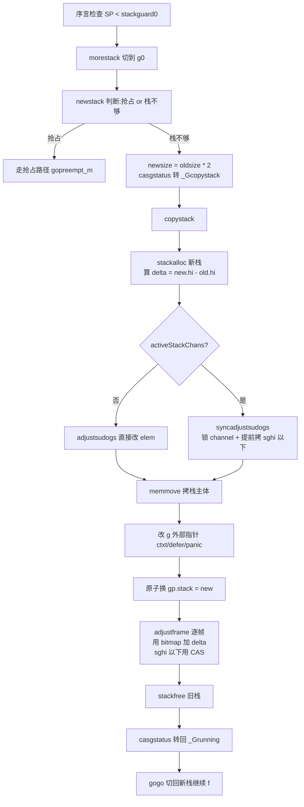

# 第十七章 · 可增长栈与栈拷贝

> 篇:第 5 篇 · 栈管理:让 G 真正轻量(支撑地基)
> 主线呼应:第一章我们立起 goroutine 便宜的三笔账——2KB 初始栈、用户态切换、阻塞不占线程。第二章打开 `g` 结构时,看到 [`stack`](../go/src/runtime/runtime2.go#L460-L463) 不过是 `{lo, hi}` 两个指针圈出的一块内存,以及那个贯穿全书的 [`stackguard0`](../go/src/runtime/runtime2.go#L479-L481) 哨兵。但有个问题一直被搁置:2KB 这么小的栈,递归深一点、函数帧大一点就用完了——goroutine 凭什么不会"栈溢出"?这一章把这件事彻底拆开:Go 的栈是**连续栈(contiguous stack)**,不够用就**翻倍拷贝**到一个新栈上,空闲时还能**缩回来**。栈拷贝是 runtime 里最魔幻的操作之一——你怎么拷贝一个**正在被使用**的栈?栈上到处是指针,指针指向哪都得跟着改。读完这一章,你会看到 Go 用一组精妙的协作(GC 的栈 map、channel 锁同步、CAS 写指针)把这件事做得滴水不漏。

## 核心问题

**G 的栈为什么能按需增长(初始 2KB,不够就翻倍拷贝)?栈拷贝怎么处理栈上指针的调整?栈收缩是怎么做的?连续栈和历史上的分段栈差在哪?**

读完本章你会明白:

1. 函数序言(prologue)怎么靠 `stackguard0` 检测栈不够,触发 [`morestack`](../go/src/runtime/asm_amd64.s#L597)→[`newstack`](../go/src/runtime/stack.go#L1026)→[`copystack`](../go/src/runtime/stack.go#L900) 这条增长链路。
2. **凭什么能拷贝一个正在用的栈**:用编译器产出的栈指针 bitmap(`getStackMap`),逐帧扫描,把指向旧栈的指针全加一个 `delta` 改到新栈上。
3. 栈上可能有 channel 的接收槽,别的 goroutine 正在往里写——靠锁住 channel、用 CAS 改指针来同步。
4. 栈收缩的触发条件(用不到 1/4 时减半)和它为什么"安全"(必须持有 `_Gscan` 位、不能在 syscall/libcall 里做)。
5. 连续栈 vs 1.3 时代的分段栈(split stack):为什么 Go 砍掉了分段栈,改成拷贝。

> 逃生阀:这一章密度很高,读到这里如果觉得"指针调整太复杂",别慌——你只需要记住一句话:**栈拷贝就是"搬一块内存 + 把所有指向它的指针都加上一个偏移"**,剩下的全是"怎么把这个偏移改对、怎么不和并发的 GC/channel 打架"。本章会先讲增长链路的全貌,再钻指针调整,最后讲收缩和分段栈历史。

---

## 17.1 一句话点破

> **goroutine 的栈不是固定大小,而是一块可以整体搬家的内存:不够用就申请一块两倍大的新内存,把旧栈逐字节拷过去,再把所有指向旧栈的指针改到新栈上,最后原子地换 `g.stack`。这件事做起来像在飞行的飞机上换发动机——靠的是"G 状态机锁住栈"、"GC 提供精确的栈指针 map"、"channel 锁同步外部写者"三件协作。**

这是结论,不是理由。本章倒过来拆:先看增长的触发链路,再看为什么连续栈必须拷贝整个栈、拷贝时栈上的指针怎么办,然后看收缩,最后看分段栈为什么被淘汰。

---

## 17.2 增长的触发:函数序言里的栈检查

### 17.2.1 每个函数入口都比一下 `stackguard0`

Go 编译器给**每个普通函数**(除了 `//go:nosplit` 标记的)都在入口插了一段"栈检查"代码,叫 **prologue(序言)**。这段代码的逻辑(注释在 [stack.go#L20-L68](../go/src/runtime/stack.go#L20) 写得很清楚,简化示意):

```
; 帧大小 <= StackSmall(128 字节)
    CMPQ  g_stackguard0, SP
    JHI   3(PC)            ; guard 在 SP 之上,说明栈不够,跳去调 morestack
    ...                    ; 正常执行

; 帧大小 > StackSmall 但 < StackBig(4096)
    LEAQ  (frame-StackSmall)(SP), R0
    CMPQ  g_stackguard0, R0
    JHI   3(PC)
    ...

; 帧大小 >= StackBig:不比较,直接调 morestack
    CALL  morestack(SB)
```

三种情况按帧大小分,只为省一两条指令——小帧直接 `CMPQ SP`,中帧用 `LEAQ` 避免下溢,大帧反正都得调 `morestack` 就不比了。`StackSmall = 128`、`StackBig = 4096` 定义在 [abi/stack.go#L26-L32](../go/src/internal/abi/stack.go#L26)。

关键动作是 **`CMPQ g_stackguard0, SP`**:把当前 SP 和 `g.stackguard0` 比。`stackguard0` 正常等于 [`stack.lo + stackGuard`](../go/src/runtime/proc.go#L5322)(栈底往上留一段 guard 区)。`stackGuard = stackNosplit + stackSystem + abi.StackSmall`,其中 [`stackNosplit = abi.StackNosplitBase * sys.StackGuardMultiplier`](../go/src/runtime/stack.go#L94)、[`StackNosplitBase = 800`](../go/src/internal/abi/stack.go#L14)。也就是说栈底往上留了大约 1KB 左右的"安全垫",给那些 `//go:nosplit` 函数(不能分裂栈的函数,如 `morestack` 自己、`runqget` 等)用。

> **不这样会怎样**:如果不做这个序言检查,一个递归深的 goroutine 一旦 SP 跌过栈底,就会踩到别的内存(栈越界),程序崩溃——而且因为没有 guard page(用户态栈太小、放不起),越界可能静默地写坏数据。序言检查是"用每条函数多花一两条指令"换"栈可以小到 2KB"。

### 17.2.2 `stackguard0` 还是抢占信号

这里有个贯穿前文的精妙设计:[`stackguard0`](../go/src/runtime/stack.go#L133) 还可能被写成特殊值 [`stackPreempt = uintptrMask & -1314`](../go/src/runtime/stack.go#L133)——一个比任何真实 SP 都大的"魔法值"。序言的 `CMPQ` 一比,SP 永远小于这个魔法值,于是**也跳去调 `morestack`**。`morestack` 进去后 [`newstack`](../go/src/runtime/stack.go#L1026) 会先判断:这次到底是"栈不够"还是"抢占请求"(第 5 章详讲抢占)。

> **所以这样设计**:`stackguard0` 把"栈检查"和"抢占检查"合并到**同一条比较指令**——编译器不用为抢占额外插桩,只要沿用序言里已有的比较。一个字段,两个用途。

### 17.2.3 `morestack`:切到 g0,调 `newstack`

栈不够时,序言跳去调 [`morestack`](../go/src/runtime/asm_amd64.s#L597)。这段汇编很关键,我们逐行解释(amd64):

```asm
TEXT runtime·morestack(SB),NOSPLIT|NOFRAME,$0-0
    get_tls(CX)
    MOVQ    g(CX), DI          ; DI = 当前 g
    MOVQ    g_m(DI), BX        ; BX = 当前 m

    ; 把 f(触发 morestack 的那个函数)的上下文存进 g.sched
    MOVQ    0(SP), AX          ; f 的返回地址(被 morestack 调用时压栈的 PC)
    MOVQ    AX, (g_sched+gobuf_pc)(DI)
    LEAQ    8(SP), AX          ; f 的 SP(morestack 的返回地址之上)
    MOVQ    AX, (g_sched+gobuf_sp)(DI)
    MOVQ    BP, (g_sched+gobuf_bp)(DI)
    MOVQ    DX, (g_sched+gobuf_ctxt)(DI)

    MOVQ    m_g0(BX), SI       ; SI = m.g0
    CMPQ    DI, SI
    JNE     3(PC)
    CALL    runtime·badmorestackg0(SB)   ; 不能在 g0 上 morestack,崩
    CALL    runtime·abort(SB)

    ; 把 f 的调用者上下文存进 m.morebuf(给 newstack traceback 用)
    MOVQ    8(SP), AX          ; f 的调用者的返回地址
    MOVQ    AX, (m_morebuf+gobuf_pc)(BX)
    LEAQ    16(SP), AX         ; f 的调用者的 SP
    MOVQ    AX, (m_morebuf+gobuf_sp)(BX)
    MOVQ    DI, (m_morebuf+gobuf_g)(BX)

    ; 切到 m.g0 的栈上,调 newstack
    MOVQ    m_g0(BX), BX
    MOVQ    BX, g(CX)                       ; TLS 里的 g 换成 g0
    MOVQ    (g_sched+gobuf_sp)(BX), SP      ; SP 换成 g0 的栈
    MOVQ    $0, BP                          ; 清 BP(g0 的栈帧没有 caller BP)
    CALL    runtime·newstack(SB)
    CALL    runtime·abort(SB)               ; newstack 不该返回,返回就崩
    RET
```

这段汇编干了三件事:

1. **保存现场**:`f` 的 PC/SP/BP/ctxt 存到 `g.sched`——等会儿栈拷贝完,要靠这些把 `f` "恢复"到新栈上继续跑。
2. **保存调用者现场**:存到 `m.morebuf`,给 `newstack` 里 traceback 用(出错时打印调用栈)。
3. **切到 g0 栈**:`m.g0` 是每条 M 专属的"系统栈"(第 2 章讲过),它大且稳定。`newstack` 要分配新栈、可能触发 GC,这些活不能在用户 G 那个只剩几百字节的小栈上干,得切到 g0。

> **不这样会怎样**:如果直接在用户 G 的栈上调 `newstack`,而 `newstack` 本身要分配内存、做 traceback,可能进一步触发栈增长——`newstack` 调用 `newstack` 死循环。切到 g0 这个稳定大栈,runtime 的活儿就有了地基。这正是第二章说的 g0 的意义。

`morestack` 末尾 `CALL runtime·newstack(SB)` 进入 Go 函数 [`newstack`](../go/src/runtime/stack.go#L1026)——栈增长的真正逻辑在这里。

---

## 17.3 `newstack`:增长还是抢占?

[`newstack`](../go/src/runtime/stack.go#L1026) 一进来先做一堆校验和分流。我们抓主干:

```go
// src/runtime/stack.go#L1079-L1101(节选)
// NOTE: stackguard0 may change underfoot, if another thread
// is about to try to preempt gp. Read it just once and use that same
// value now and below.
stackguard0 := atomic.Loaduintptr(&gp.stackguard0)

// Be conservative about where we preempt.
preempt := stackguard0 == stackPreempt
if preempt {
    if !canPreemptM(thisg.m) {
        // Let the goroutine keep running for now.
        gp.stackguard0 = gp.stack.lo + stackGuard
        gogo(&gp.sched) // never return
    }
}
```

它原子读一次 `stackguard0`——因为别的线程可能在并发把它改成 `stackPreempt`(抢占)。然后判断:是不是抢占(`stackPreempt`)?如果是抢占但当前不能抢占(持有锁、在 malloc 等),就恢复 `stackguard0` 到正常值,`gogo` 回去继续跑,等下次再抢占。

```go
// src/runtime/stack.go#L1122-L1146(节选)
if preempt {
    ...
    if gp.preemptShrink {
        // We're at a synchronous safe point now, so
        // do the pending stack shrink.
        gp.preemptShrink = false
        shrinkstack(gp)
    }
    ...
    if gp.preemptStop {
        preemptPark(gp) // never returns
    }
    // Act like goroutine called runtime.Gosched.
    gopreempt_m(gp) // never return
}
```

如果是真抢占请求,先处理"顺带缩栈"(`preemptShrink`,17.5 节讲),然后要么 `preemptPark`(停在安全点)要么 `gopreempt_m`(让出执行)。**抢占路径不增长栈**,直接走人。

排除了抢占,剩下的就是**真·栈不够**,走增长:

```go
// src/runtime/stack.go#L1148-L1192(节选)
oldsize := gp.stack.hi - gp.stack.lo
newsize := oldsize * 2                        // 翻倍!

// Make sure we grow at least as much as needed to fit the new frame.
if f := findfunc(gp.sched.pc); f.valid() {
    max := uintptr(funcMaxSPDelta(f))
    needed := max + stackGuard
    used := gp.stack.hi - gp.sched.sp
    for newsize-used < needed {
        newsize *= 2                          // 翻倍还不够就继续翻
    }
}

if newsize > maxstacksize || newsize > maxstackceiling {
    ...
    throw("stack overflow")                   // 超过 1GB 默认上限,崩
}

casgstatus(gp, _Grunning, _Gcopystack)        // 状态转 _Gcopystack
copystack(gp, newsize)                        // 真正的拷贝
casgstatus(gp, _Gcopystack, _Grunning)        // 转回
gogo(&gp.sched)                               // 切回用户 G 的新栈
```

几个要点:

- **翻倍增长**(`newsize := oldsize * 2`):这是**乘性增长**,不是加性增长。乘性增长的好处是**摊平成本**——一个栈从 2KB 长到 1MB 要拷贝 $\log_2(512)=9$ 次,总拷贝量约 $2\text{MB}$,均摊到每次分配的代价是常数。如果加性增长(每次加 2KB),长到 1MB 要 500 次拷贝,总拷贝量是 $O(n^2)$。
- **确保装得下当前帧**:光翻倍还不够,还得保证"新栈 - 已用空间"装得下当前函数的帧(`funcMaxSPDelta`)。如果当前函数帧就特别大(比如有个巨型局部数组),就继续翻倍直到装得下。
- **状态机 `_Gcopystack`**:[`casgstatus(gp, _Grunning, _Gcopystack)`](../go/src/runtime/stack.go#L1183) 是关键——这一刻起,这个 G 的状态变成 `_Gcopystack`,**GC 不能扫它的栈**(注释 [stack.go#L1184-L1186](../go/src/runtime/stack.go#L1184) 明说)。这是 17.4 节指针调整能安全进行的保证。
- **`gogo(&gp.sched)` 回去**:`gogo` 是 `morestack` 的逆操作(第 3 章详讲),它根据 `g.sched`(此时 sp/pc 已经被改成指向**新栈**)切回用户 G 继续执行 `f`——`f` 完全不知道自己的栈被换过。

> **钉死这件事**:从用户 G 的角度看,栈增长是**完全透明**的——它在 `morestack` 这条指令之前暂停,在 `f` 的下一条指令恢复,中间发生了什么它不知道。栈被换了一块、指针全被调整,但 `f` 看到的栈布局完全一致。这就是"连续栈"的魔力。

---

## 17.4 `copystack`:拷贝一个正在用的栈

现在进入本章最魔幻的部分。[`copystack`](../go/src/runtime/stack.go#L900) 要拷贝一个**正在被使用**的栈。我们分四步看它怎么做到。

### 17.4.1 第一步:分配新栈,算 delta

```go
// src/runtime/stack.go#L900-L928(节选)
func copystack(gp *g, newsize uintptr) {
    ...
    old := gp.stack
    used := old.hi - gp.sched.sp
    gcController.addScannableStack(getg().m.p.ptr(), int64(newsize)-int64(old.hi-old.lo))

    // allocate new stack
    new := stackalloc(uint32(newsize))
    ...
    // Compute adjustment.
    var adjinfo adjustinfo
    adjinfo.old = old
    adjinfo.delta = new.hi - old.hi
```

新栈用 [`stackalloc`](../go/src/runtime/stack.go#L344) 分配(17.6 节讲它的池化)。然后算一个**核心常量 `delta = new.hi - old.hi`**——这是新栈顶和旧栈顶的地址差。

> **为什么不把 delta 算成 `new.lo - old.lo`?** 注意:新栈和旧栈大小不同(新栈更大),所以 `new.lo - old.lo` 不等于 `new.hi - old.hi`。Go 选择**栈顶对齐**:栈拷贝时,旧栈的"已用部分"(从 `sched.sp` 到 `old.hi`)被拷到新栈的**顶部**([`memmove(unsafe.Pointer(new.hi-ncopy), unsafe.Pointer(old.hi-ncopy), ncopy)`](../go/src/runtime/stack.go#L956))。这样栈顶地址差就是 `delta = new.hi - old.hi`,栈上每个指针要加的就是这个 `delta`。栈顶对齐保证拷贝后"已用部分"在新栈里的相对位置不变(还是紧贴栈顶),`f` 的局部变量布局完全一致。

```
  旧栈(2KB)             新栈(4KB,拷贝后)
  ┌──────────┐ hi=A     ┌──────────┐ hi=A+delta
  │ 已用部分 │          │          │
  │ (f 的帧) │          │          │
  │          │          │ 已用部分 │  ← memmove 到 new.hi-ncopy
  ├──────────┤ sp       │ (f 的帧) │     和旧栈顶对齐
  │ guard 区 │          │          │
  │          │          ├──────────┤ sp = new.hi-used
  └──────────┘ lo       │ guard 区 │
                       │          │
                       └──────────┘ lo
  delta = new.hi - old.hi = (A+delta) - A = delta
```

### 17.4.2 第二步:处理 sudog(channel 等待块)的指针

这里有个最容易翻车的细节。第二章讲过,goroutine 阻塞在 channel 上时,会挂一个 [`sudog`](../go/src/runtime/runtime2.go#L404),sudog 的 `elem` 字段指向**栈上的一个变量**(比如 `ch <- x` 里 `x` 的地址)。别的 goroutine(发送方/接收方)正在通过这个 `elem` 往**这个 G 的栈上**写数据。

栈拷贝时,如果正好有别的 goroutine 在通过 `elem` 写栈——拷贝到一半的数据就被踩了。Go 怎么办?

```go
// src/runtime/stack.go#L930-L953(节选)
ncopy := used
if !gp.activeStackChans {
    if newsize < old.hi-old.lo && gp.parkingOnChan.Load() {
        throw("racy sudog adjustment due to parking on channel")
    }
    adjustsudogs(gp, &adjinfo)
} else {
    // sudogs may be pointing in to the stack and gp has
    // released channel locks, so other goroutines could
    // be writing to gp's stack. Find the highest such
    // pointer so we can handle everything there and below
    // carefully.
    adjinfo.sghi = findsghi(gp, old)

    // Synchronize with channel ops and copy the part of
    // the stack they may interact with.
    ncopy -= syncadjustsudogs(gp, used, &adjinfo)
}
```

分两条路:

- **没有活跃的 channel 指向栈**(`!gp.activeStackChans`):直接 [`adjustsudogs`](../go/src/runtime/stack.go#L820) 把 sudog 的 `elem` 指针改到新栈(加 delta)就行,没人会并发写栈。
- **有活跃的 channel**(`gp.activeStackChans == true`):复杂路径。先 [`findsghi`](../go/src/runtime/stack.go#L835) 找到所有 sudog 指向栈的**最高地址** `sghi`,然后调 [`syncadjustsudogs`](../go/src/runtime/stack.go#L849)。

[`syncadjustsudogs`](../go/src/runtime/stack.go#L849) 干的事:

```go
// src/runtime/stack.go#L849-L895(节选)
func syncadjustsudogs(gp *g, used uintptr, adjinfo *adjustinfo) uintptr {
    if gp.waiting == nil {
        return 0
    }
    // Lock channels to prevent concurrent send/receive.
    var lastc *hchan
    for sg := gp.waiting; sg != nil; sg = sg.waitlink {
        if sg.c.get() != lastc {
            lockWithRank(&sg.c.get().lock, lockRankHchanLeaf)
        }
        lastc = sg.c.get()
    }

    // Adjust sudogs.
    adjustsudogs(gp, adjinfo)

    // Copy the part of the stack the sudogs point in to
    // while holding the lock to prevent races on
    // send/receive slots.
    var sgsize uintptr
    if adjinfo.sghi != 0 {
        oldBot := adjinfo.old.hi - used
        newBot := oldBot + adjinfo.delta
        sgsize = adjinfo.sghi - oldBot
        memmove(unsafe.Pointer(newBot), unsafe.Pointer(oldBot), sgsize)
    }

    // Unlock channels.
    ...
}
```

三步:

1. **锁住所有相关的 channel**:这样别的 goroutine 没法在这期间 send/receive(写栈)。
2. **调整 sudog 的 `elem` 指针**(加 delta)。
3. **把 sudog 可能指向的那段栈(sghi 以下)提前拷贝过去**——这部分栈在锁的保护下拷,保证不会被并发写踩。

锁完之后,这部分"有 channel 指着的栈底段"已经安全搬到新栈,sudog 的 elem 也改好了。剩下的栈主体(`ncopy -= sgsize`,即 sghi 以上的部分)没有 channel 指着,可以无锁拷。

> **钉死这件事**:这是 Go runtime 里"栈拷贝"和"channel"两个子系统协作的精妙之处。第二章我们看到 [`g.activeStackChans`](../go/src/runtime/runtime2.go#L528) 这个 bool 字段——它存在的全部意义就是告诉栈拷贝:"我这个栈上有 channel 指着,拷贝时得拿 channel 锁同步"。一个 bool 字段,串起两个子系统。

### 17.4.3 第三步:拷贝栈主体 + 改 g 字段

```go
// src/runtime/stack.go#L955-L972(节选)
// Copy the stack (or the rest of it) to the new location
memmove(unsafe.Pointer(new.hi-ncopy), unsafe.Pointer(old.hi-ncopy), ncopy)

// Adjust remaining structures that have pointers into stacks.
adjustctxt(gp, &adjinfo)
adjustdefers(gp, &adjinfo)
adjustpanics(gp, &adjinfo)
if adjinfo.sghi != 0 {
    adjinfo.sghi += adjinfo.delta
}

// Swap out old stack for new one
gp.stack = new
gp.stackguard0 = new.lo + stackGuard    // NOTE: might clobber a preempt request
gp.sched.sp = new.hi - used
gp.stktopsp += adjinfo.delta
```

注意顺序:

1. **`memmove` 拷栈主体**:字节级拷贝。此时栈上的指针值还是旧的(指向旧栈),但下一轮 `adjustframe` 会修。
2. **先改 `g` 外部那些指向栈的指针**:`sched.ctxt`、`_defer` 链、`_panic` 链、`sched.bp`——这些不在栈上,但在 `g` 结构体里,得逐个 `adjustpointer`。
3. **原子换栈**:`gp.stack = new`、`gp.stackguard0 = new.lo + stackGuard`、`gp.sched.sp = new.hi - used`。这一刻起,`g` 认的栈就是新栈了。
4. **逐帧调整栈上指针**:`for u.init(gp, 0); u.valid(); u.next() { adjustframe(&u.frame, &adjinfo) }`——从栈顶往下遍历每一帧,把每帧里的指针改到新栈。

> **顺序为什么这样**:必须**先换 `gp.stack`** 再调 `adjustframe`,因为 `adjustframe` 里 traceback 遍历用的是 `gp.stack` 这个新值。而外部指针(`ctxt`/`_defer`/`_panic`)要在 traceback 之前改好,因为 traceback 会用到。

注释里那句 `// NOTE: might clobber a preempt request` 很微妙:写 `stackguard0` 可能覆盖掉一个并发的抢占请求——但没关系,`newstack` 开头已经读了一次 `stackguard0` 处理过抢占,这里覆盖了下次序言检查时会重新触发。

### 17.4.4 第四步:`adjustframe`——逐帧扫指针加 delta

现在看本章的命门:[`adjustframe`](../go/src/runtime/stack.go#L701) 怎么"把栈上指向旧栈的指针全加 delta"。

```go
// src/runtime/stack.go#L701-L774(节选)
func adjustframe(frame *stkframe, adjinfo *adjustinfo) {
    if frame.continpc == 0 {
        return  // 死帧,跳过
    }
    f := frame.fn

    // Adjust saved frame pointer if there is one.
    if ... && frame.argp-frame.varp == 2*goarch.PtrSize {
        adjustpointer(adjinfo, unsafe.Pointer(frame.varp))
    }

    locals, args, objs := frame.getStackMap(true)

    // Adjust local variables if stack frame has been allocated.
    if locals.n > 0 {
        size := uintptr(locals.n) * goarch.PtrSize
        adjustpointers(unsafe.Pointer(frame.varp-size), &locals, adjinfo, f)
    }

    // Adjust arguments.
    if args.n > 0 {
        adjustpointers(unsafe.Pointer(frame.argp), &args, adjinfo, funcInfo{})
    }

    // Adjust pointers in all stack objects (whether they are live or not).
    if frame.varp != 0 {
        for i := range objs {
            ...
        }
    }
}
```

核心是 [`frame.getStackMap(true)`](../go/src/runtime/stkframe.go#L157)——这函数返回**这一帧的指针 bitmap**:`locals`(局部变量区哪些槽是指针)、`args`(参数区哪些槽是指针)、`objs`(栈对象——一些逃逸到栈上的对象,有自己的 gcdata)。

这些 bitmap 是**编译器在编译时生成的**,存在函数的 funcdata 里(和 GC 扫栈用的是同一套 map)。runtime 用它精确知道"这一帧的哪个字是指针"。

然后 [`adjustpointers`](../go/src/runtime/stack.go#L652) 逐字扫:

```go
// src/runtime/stack.go#L652-L698(节选)
func adjustpointers(scanp unsafe.Pointer, bv *bitvector, adjinfo *adjustinfo, f funcInfo) {
    minp := adjinfo.old.lo
    maxp := adjinfo.old.hi
    delta := adjinfo.delta
    num := uintptr(bv.n)
    // If this frame might contain channel receive slots, use CAS
    // to adjust pointers.
    useCAS := uintptr(scanp) < adjinfo.sghi
    for i := uintptr(0); i < num; i += 8 {
        b := *(addb(bv.bytedata, i/8))
        for b != 0 {
            j := uintptr(sys.TrailingZeros8(b))
            b &= b - 1
            pp := (*uintptr)(add(scanp, (i+j)*goarch.PtrSize))
        retry:
            p := *pp
            ...
            if minp <= p && p < maxp {
                if useCAS {
                    ppu := (*unsafe.Pointer)(unsafe.Pointer(pp))
                    if !atomic.Casp1(ppu, unsafe.Pointer(p), unsafe.Pointer(p+delta)) {
                        goto retry
                    }
                } else {
                    *pp = p + delta
                }
            }
        }
    }
}
```

逐字看:

1. **用 bitmap 找出哪些字是指针**:`bv.bytedata` 是个位图,每 bit 对应一个字(8 字节),1 表示是指针。用 `TrailingZeros8` 快速找出字节里最低位的 1,逐个处理——这是位运算加速扫描。
2. **判断指针是否指向旧栈**:`minp <= p && p < maxp`——只有在旧栈范围内的指针才需要调整。这很关键:栈上的指针大部分指向堆(比如 `*bytes.Buffer`),那些不用动;只有指向自己栈的指针(局部变量取地址传给子函数、`&x`)才加 delta。
3. **加 delta**:`*pp = p + delta`——把指向旧栈的指针改成指向新栈的对应位置。

> **不这样会怎样**:如果不用编译器提供的精确 bitmap,而是把栈上所有 8 字节都当指针试着加 delta——那些本不是指针的整数(比如一个计数器 `i`,值恰好落在旧栈地址范围内)会被错误地"修正",程序数据错乱。精确 bitmap 是栈拷贝**正确性**的根基,也是 Go 1.3 后能做连续栈的前提(早期没有精确栈 map,只能用分段栈)。

### 17.4.5 `useCAS`:channel 接收槽的并发写

注意 [`adjustpointers`](../go/src/runtime/stack.go#L652) 里那个 `useCAS := uintptr(scanp) < adjinfo.sghi`——如果这一帧在 sghi(channel 接收槽最高地址)以下,**改指针时用 CAS 而不是直接写**。

为什么?因为这段栈(17.4.2 的 `syncadjustsudogs` 已经提前拷过)在锁的保护下拷贝了,但**锁只保护了拷贝那一瞬**。拷贝完释放锁后,`adjustframe` 调整这部分指针时,别的 goroutine 又可能通过 `elem` 往这个槽写新值(比如一个发送方刚 wake up)。直接写 `*pp = p + delta` 会和并发写竞争——读出 `p`、算出 `p+delta`、写回,这三步之间 `p` 可能被别人改了。

CAS(`atomic.Casp1`)解决:`if *pp == p { *pp = p+delta }` 原子完成,失败了 `goto retry` 重读重试。

> **反面对比**:如果不用 CAS 直接写,会丢更新——发送方写了个新值,这边读到的还是旧 `p`,算出 `p+delta` 覆盖回去,发送方的数据没了。CAS 是这部分栈"和并发 channel 操作共享"的并发安全保障。

### 17.4.6 整体流程图

把四步串起来:



---

## 17.5 栈收缩:空闲时减半

栈能长,也得能缩。一个 goroutine 可能在某个深度递归里把栈长到 64KB,递归返回后实际只用 4KB——那 60KB 就浪费了。所以 GC 时会顺带检查每个 G 的栈,如果"用得很少"就缩。

### 17.5.1 触发条件和阈值

[`shrinkstack`](../go/src/runtime/stack.go#L1257) 是收缩函数。看它的判断:

```go
// src/runtime/stack.go#L1284-L1305(节选)
oldsize := gp.stack.hi - gp.stack.lo
newsize := oldsize / 2                        // 减半
if newsize < fixedStack {                     // 不能小于最小栈
    return
}
avail := gp.stack.hi - gp.stack.lo
if used := gp.stack.hi - gp.sched.sp + stackNosplit; used >= avail/4 {
    return                                    // 用了 1/4 以上,不缩
}
...
copystack(gp, newsize)                        // 复用 copystack,只是 newsize 更小
```

两个阈值:

- **newsize 不能小于 `fixedStack`**(最小栈,约 2KB)。
- **当前用栈量 < 总量的 1/4 才缩**。`used = gp.stack.hi - gp.sched.sp + stackNosplit`,加上 `stackNosplit` 是给 nosplit 函数留余量。

收缩也是调 `copystack`——只是 `newsize` 比 `oldsize` 小,delta 是负数(新栈顶更低),指针调整照样加 delta(往低地址挪)。**收缩和增长共用同一套拷贝机制**,这是连续栈设计的好处。

### 17.5.2 收缩的安全窗口

收缩不是想缩就缩,它有严格的安全条件。[`isShrinkStackSafe`](../go/src/runtime/stack.go#L1216) 列了四条:

```go
// src/runtime/stack.go#L1216-L1251(节选)
func isShrinkStackSafe(gp *g) bool {
    // 不能在 syscall 里拷栈(syscall 可能有指向栈的 uintptr,没精确 map)
    if gp.syscallsp != 0 {
        return false
    }
    // 不能在异步安全点拷栈(某些帧没有精确指针 map)
    if gp.asyncSafePoint {
        return false
    }
    // 不能在 gopark 到 parkOnChan 的窗口里缩
    if gp.parkingOnChan.Load() {
        return false
    }
    // 不能在"为 suspendG 而等待"的 _Gwaiting 里缩
    if readgstatus(gp)&^_Gscan == _Gwaiting && gp.waitreason.isWaitingForSuspendG() {
        return false
    }
    return true
}
```

为什么这么多禁忌?因为**栈拷贝依赖精确的指针 map**(17.4.4)。如果当前 G 处在"没有精确 map"的状态(syscall 里的 C 函数帧、异步安全点、libcall),拷贝时调 `adjustframe` 会漏掉一些指针,改不全——结果是指向旧栈的悬空指针,程序崩溃。

> **不这样会怎样**:在 syscall 里缩栈,syscall 返回时 C 代码可能用栈上保存的指针(它不认识 Go 的栈拷贝)——指向已被释放的旧栈,野指针。`isShrinkStackSafe` 把这些窗口全堵死。

收缩由谁触发?两条路:

1. **GC 时**:`gcStart` → ... → 遍历所有 G,对每个 G 调 `shrinkstack`(持有 `_Gscan` 位,安全)。
2. **异步抢占带 `preemptShrink` 标志时**:`newstack` 里 [`if gp.preemptShrink { shrinkstack(gp) }`](../go/src/runtime/stack.go#L1130-L1135)——sysmon 发现某个 G 用栈很少又正好被抢占,顺带缩一下。

---

## 17.6 栈从哪来:stackalloc 的池化

顺便讲讲 [`stackalloc`](../go/src/runtime/stack.go#L344)/[`stackfree`](../go/src/runtime/stack.go#L463) 怎么管理栈内存。这和第三篇内存分配是同源思想(分层缓存),这里只讲栈特有的部分。

栈必须是**2 的幂大小**(2KB/4KB/8KB/...),因为增长/收缩都是翻倍/减半。Go 把栈按 `order = log2(size/fixedStack)` 分桶:

- **小栈**(`n < fixedStack<<_NumStackOrders`,约 32KB):走 [`stackpool`](../go/src/runtime/stack.go#L153),每个 order 一个 free list。
  - **P 本地缓存**(`mcache.stackcache[order]`):无锁,快路径。
  - **全局 pool**(`stackpool[order]`):本地空了/满了,lock 全局 pool 补/退。`_StackCacheSize = 32KB`(见 [malloc.go#L136](../go/src/runtime/malloc.go#L136))。
- **大栈**(>= 32KB):走 [`stackLarge`](../go/src/runtime/stack.go#L165),按 `log2(npages)` 分桶的 mspan free list。
- **都 miss**:从 mheap 分配(见第三篇)。

栈内存和普通堆对象**混在同一个堆**里(都是 mspan),但用 `spanAllocStack` 标记成"栈 span",状态是 `mSpanManual`(GC 不管它,靠栈拷贝/释放显式管理)。

> **技巧点睛**:`stackalloc` 必须 `//go:systemstack`(在 g0 上跑),因为分配过程不能触发栈增长(否则 `stackalloc` 调用 `stackalloc` 死循环)。注释 [stack.go#L340-L343](../go/src/runtime/stack.go#L340) 明说。

还有个细节:[`stackfree`](../go/src/runtime/stack.go#L463) 在 GC 进行中(`gcphase != _GCoff`)时,不会立即把 span 还给 mheap,而是挂回 `stackLarge.free`——注释 [stack.go#L544-L554](../go/src/runtime/stack.go#L544) 解释:如果 GC 正在扫一个 sudog 的 `elem`,而这时栈 span 被还给 mheap、重新分配成普通堆 span,GC 扫描会混淆"这是栈指针还是堆指针"。所以 GC 期间延后归还,GC 结束再 [`freeStackSpans`](../go/src/runtime/stack.go#L1309)。

---

## 17.7 连续栈 vs 分段栈:历史和为什么换

Go 1.0~1.2 用的是**分段栈(split stack)**。理解它的缺点,才能看懂为什么 Go 1.3 起换成了连续栈。

### 17.7.1 分段栈怎么工作

分段栈里,栈不够用时不拷贝,而是**新申请一段**栈,用一段"跳转代码"把两段串起来——SP 跌破当前段底部时,跳到下一段继续。栈是一段一段的链表。

好处:不需要拷贝(不用指针调整),实现简单。

### 17.7.2 "hot split"问题——为什么被淘汰

分段栈有个致命问题叫 **"hot split"(热分裂)**:

```
场景:一个函数 F 调用时栈几乎用完,触发分裂,分配新段;
     F 返回,新段释放;
     F 又被频繁调用(在循环里)——反复分配/释放新段。
```

如果 F 在一个紧凑循环里被调用,每次都恰好触发分裂又释放,栈段就被反复 malloc/free——性能崩塌。Go 团队实测有些基准因此慢 10%+。

### 17.7.3 连续栈怎么解决

连续栈(拷贝式)没有这个问题:栈一旦增长就**整体变大**,不会"频繁小分配"。下次需要时还是这块连续内存。代价是拷贝——但乘性增长让拷贝次数是 $O(\log n)$,均摊代价极低。

> **所以这样设计**:从分段栈切到连续栈,是用"偶发的拷贝"换"稳定的性能"。这背后依赖一个前提——**精确的栈指针 bitmap**(编译器提供)。没有精确 bitmap,栈拷贝没法正确做(17.4.4),Go 1.3 才具备这个能力。所以连续栈是"编译器 + runtime 协作成熟后"才能做的设计。

---

## 17.8 技巧精解:两个最硬核的技巧

### 技巧一:凭什么能拷贝一个"正在用"的栈

这是本章的灵魂。我们把所有支撑这件事的协作收拢一遍:

1. **G 状态机锁住栈**:`newstack` 进来第一件事 [`casgstatus(gp, _Grunning, _Gcopystack)`](../go/src/runtime/stack.go#L1183)。这一刻起,GC **不能扫这个 G 的栈**(状态不是 `_Grunning`,GC 的 `castogscanstatus` 拿不到 `_Grunning`)。也就是说,**栈拷贝期间,GC 不读栈**——拷贝和 GC 互斥。
2. **切到 g0 执行**:用户 G 的栈此时是"被拷贝的对象",不能在上面执行。`morestack` 切到 g0,runtime 在 g0 这个稳定大栈上跑 `copystack`。
3. **用户 G 此时是"冻结"的**:它的 PC/SP 保存在 `g.sched`(被 `morestack` 存的),没在跑。栈上的数据是静止的——除了 channel 的并发写(下一步处理)。
4. **channel 锁 + CAS 同步**:对有 channel 指着的栈段(`sghi` 以下),`syncadjustsudogs` 锁住 channel 阻止并发写,拷贝那段;后续 `adjustframe` 改这部分指针时用 CAS(`adjustpointers` 的 `useCAS`)和"并发写恢复后又写"的发送方竞争。
5. **精确 bitmap 保证指针改全**:`adjustframe` 用 `getStackMap` 拿到每帧的精确指针位图,只改真指针,不误伤整数。
6. **原子换栈**:`gp.stack = new` 这一瞬间完成切换。换完之后旧栈才 `stackfree`。

> **反面对比**:假设砍掉第 1 条(不转 `_Gcopystack`,GC 能扫栈)。GC 扫栈时,栈正在被拷贝/指针正在被改——GC 读到一个指针,它可能下一刻就被改到新栈了;GC 跟着旧指针去标记,标记的是旧栈的对象,而旧栈马上要释放——漏标、误回收。**`_Gcopystack` 状态是栈拷贝和 GC 并发的互斥锁**,没有它整个体系塌掉。

这是 Go runtime 里"调度器、GC、channel、内存分配"四个子系统**协作**的极致体现:一个栈拷贝,牵动全部。

### 技巧二:乘性增长的摊平代价

看 [`newsize := oldsize * 2`](../go/src/runtime/stack.go#L1150) 这一行。为什么是乘 2,不是加 2KB?

数学上:假设栈最终长到 $N$,每次翻倍。拷贝总字节数 = $2 + 4 + 8 + ... + N = 2N - 2 \approx 2N$。也就是说,**不管栈长到多大,所有拷贝加起来约等于栈最终大小的 2 倍**。均摊到每次"用 1 字节栈"的拷贝代价是 $O(1)$。

如果是加性增长(每次加 fixedStack=2KB),长到 $N$ 要拷贝 $N/(2\text{KB})$ 次,每次拷贝平均 $N/2$ 字节,总拷贝量 $O(N^2 / \text{KB})$——栈越大,代价越爆炸。

> **反面对比**:Linux 的 pthread 栈是固定 8MB,一次性给足——简单但浪费(99% 的线程用不到)。C 的某些协程库用固定小栈(比如 64KB)——省内存但深递归就溢出。Go 的"2KB 起步 + 翻倍拷贝"是**两端兼得**:省内存(平均栈很小)又不溢出(按需长到 GB 级上限)。代价是偶发的拷贝——但乘性增长把代价摊平到常数。

这和 Go 的 slice 增长(`growslice` 也翻倍)是同一套思想:动态数组/栈的扩容都该乘性。

---

## 17.9 ★ 双璧对照《Tokio》

这一章和《Tokio》对照,能看到两种语言处理"自引用/可移动"的两种哲学:

| 维度 | Go 连续栈 | Tokio Future + Pin |
|---|---|---|
| 问题 | goroutine 栈可能自引用(局部变量取地址传给子函数),栈搬家时这些指针要跟着改 | `Future::poll` 编译成状态机,状态机可能自引用(字段存了别的字段的地址),Future 不能移动 |
| Go 的解 | **允许移动,移动时调整所有指针**(靠精确 bitmap) | **禁止移动**(`Pin<&mut T>` 类型保证 poll 期间 Future 不被 move) |
| 代价 | 偶发拷贝(乘性摊平)+ 指针调整的复杂度 | 栈/堆分配的 Future 不能 move,衍生出 `Pin`、`Unpin`、`Pin<Box<T>>` 一套类型系统 |
| 哲学 | 运行时干活,语言简单(GC + 栈拷贝对用户透明) | 编译期保证,运行时零开销,但类型系统复杂 |

一句话:**Go 让栈能搬家(靠运行时调整指针),Tokio 让 Future 不能搬家(靠类型系统禁止)。一个移动+调整,一个禁止移动。** 两种解法都 sound,代价落在不同的地方——Go 的代价是 runtime 复杂,Tokio 的代价是 `Pin` 概念门槛。这正是"语言内置协程 vs 库级异步"两种哲学在"自引用"这个具体问题上的投影。

---

## 章末小结

这一章把"goroutine 为什么轻量"的最后一块地基铺完了:G 的栈不是固定大小,而是**2KB 起步、按需翻倍拷贝、空闲减半**的可增长栈。回到二分法,这一章服务**支撑地基**——它让 G 能保持"小"的同时不怕深递归,是调度执行(第 1 篇)能"海量 G"的物理前提。没有可增长栈,要么每个 G 预留 MB 级栈(回到线程模型),要么深递归就崩——两种都不可接受。

### 五个"为什么"清单

1. **G 的栈为什么能增长,而不像 pthread 栈那样固定?** 每个函数序言比较 SP 和 `stackguard0`,不够就 `morestack`→`newstack`→`copystack` 翻倍拷贝。乘性增长让拷贝均摊代价为 $O(1)$。这让 G 可以从 2KB 起步(省内存)又不怕深递归(按需长到 GB)。

2. **凭什么能拷贝一个正在用的栈?** 六重协作:(a) `_Gcopystack` 状态让 GC 不扫栈,(b) 切到 g0 执行(用户 G 冻结),(c) channel 锁 + CAS 同步并发写,(d) 精确 bitmap 找全指针,(e) 栈顶对齐算 delta,(f) 原子换 `gp.stack`。缺一不可。

3. **栈拷贝时指针怎么改对?** 用编译器生成的栈指针 bitmap(`getStackMap`),逐帧扫描,只把指向旧栈(`old.lo <= p < old.hi`)的指针加 `delta = new.hi - old.hi`。channel 接收槽那段(`sghi` 以下)用 CAS 防并发写竞争。

4. **栈什么时候收缩?** 用量不到总量 1/4 时减半(`shrinkstack`),由 GC 或异步抢占的 `preemptShrink` 触发。收缩必须在安全窗口(`isShrinkStackSafe`:不在 syscall/异步安全点/parkOnChan/suspendG-wait),否则缺精确指针 map 会漏改。

5. **为什么是连续栈而不是分段栈?** 分段栈(Go 1.0~1.2)有"hot split"问题——紧凑循环里反复分配/释放栈段,性能崩塌。连续栈整体搬家,没有这个问题,代价是偶发拷贝(乘性摊平)。前提是 Go 1.3 起有了精确栈指针 bitmap。

### 想继续深入往哪钻

- **源码主战场**:[`../go/src/runtime/stack.go`](../go/src/runtime/stack.go) 全文。重点读 [`newstack`](../go/src/runtime/stack.go#L1026)、[`copystack`](../go/src/runtime/stack.go#L900)、[`adjustpointers`](../go/src/runtime/stack.go#L652)、[`adjustframe`](../go/src/runtime/stack.go#L701)、[`syncadjustsudogs`](../go/src/runtime/stack.go#L849)、[`shrinkstack`](../go/src/runtime/stack.go#L1257)。汇编 [`morestack`](../go/src/runtime/asm_amd64.s#L597) 逐行解释见 17.2.3。
- **栈 map**:[`getStackMap`](../go/src/runtime/stkframe.go#L157) 和编译器的 funcdata,在第 13 章(三色标记)和第 14 章(GC 阶段)会从"GC 扫栈"角度再拆一次。
- **观测**:开 `GODEBUG=allocfreetrace=1` 能看到栈分配/释放;`runtime.Stack` 打印的 `[stack growth]` 等注释也和本章相关。`GODEBUG=schedtrace=1000` 看不到栈,但能看到 G 数。
- **栈上限**:`maxstacksize` 默认 1GB([stack.go#L558](../go/src/runtime/stack.go#L558)),可以用 `debug.SetMaxStack` 调小做内存隔离。
- **延伸**:Go 1.3 的连续栈提案(Dmitry Vyukov)、`startingStackSize` 自适应初始栈([stack.go#L1390](../go/src/runtime/stack.go#L1390),Go 1.x 后期加的,按 GC 扫到的平均栈大小调整新 G 的初始栈,减少早期增长)。

### 引出下一章

第 5 篇只有这一章,讲完栈,支撑地基的"内存/GC/栈"三件套里栈这块就齐了。下一章我们离开支撑地基,进入**第 6 篇 · netpoll:网络不阻塞线程**——讲 Go 怎么把 epoll/kqueue 藏进 runtime,让一个 goroutine 阻塞在网络 I/O 上时不占着 M,数据就绪时被 netpoll 唤醒重新入队。这是二分法里"阻塞唤醒"那一面的核心机制,和本章的栈拷贝一样,都是"让海量 G 高效运转"的关键拼图。

---

> 全书定位:第 17 章 / 第 5 篇 栈管理(支撑地基)。源码版本 Go 1.27(本地 master @ `6d1bcd10`)。上一章:P1-02 GMP 结构(`g.stack`/`stackguard0`)。下一章:P6-18 netpoll 集成 epoll。
