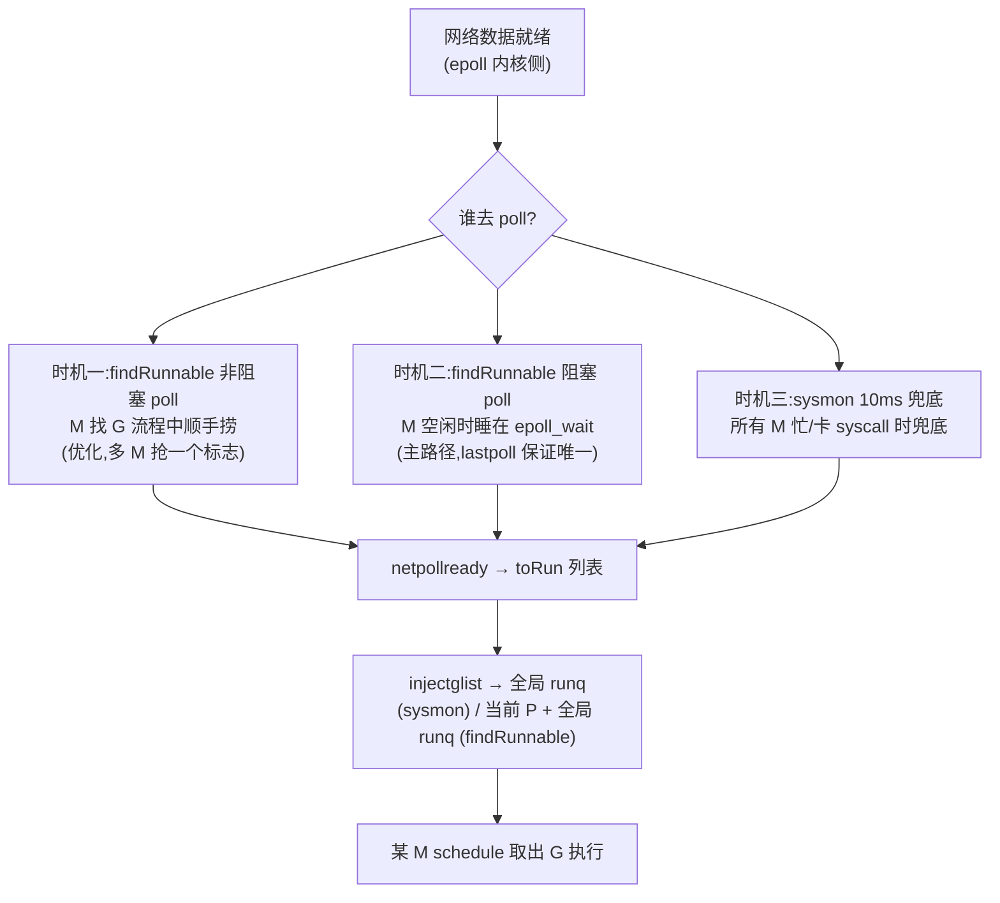

# 第十八章 · netpoll:集成 epoll

> 篇:第 6 篇 · netpoll:网络不阻塞线程(阻塞唤醒)
> 主线呼应:第 7 章 sysmon 里,"定期 poll 网络就绪"是它的职责清单之一,可那时我们说"谁去 poll?怎么 park?怎么唤醒?留给第 18 章"。这一章把那个洞填上。一个 goroutine 写 `conn.Read`,数据没来——它为什么不占着那条 OS 线程干等?答案不在 Go 语法里,而在 runtime 把内核的 **epoll**(Linux)/ **kqueue**(BSD/Darwin)整套事件机制**藏进了自己**:G 遇到 socket 阻塞时被 park(让出 M),fd 注册进 epoll;数据就绪时 epoll_wait 返回,runtime 把对应的 G 重新塞进 runq,等下一个 M 来执行它。netpoll 是"阻塞唤醒"这一面最经典的一块——它让"网络 I/O 阻塞"和"goroutine 不占线程"这两件看似矛盾的事,在 runtime 内部无缝衔接。这一章拆透四件事:**为什么要把 epoll 藏进 runtime(而不是用裸 epoll)、park 的 G 怎么和 fd 绑定(rg/wg 两把二值信号量)、epoll_wait 怎么被 findRunnable/sysmon 在恰当的时机调用、edge-triggered + 一次性消费为什么 sound**。

## 核心问题

**一个 goroutine 阻塞在 `conn.Read`,数据没来,它凭什么不占着那条 OS 线程?runtime 怎么知道"数据来了,该把这个 G 唤醒重跑"?整套机制怎么做到既不漏唤醒(饿死等待的 G)又不重复唤醒(虚惊一场)?**

读完本章你会明白:

1. **为什么 runtime 要把 epoll 封装进自己**——而不是让用户像 C 程序员那样手写 epoll 循环。答案是:`conn.Read` 是**阻塞式 API**(同步语义),但 runtime 在底下偷偷把它变成"park + 等就绪 + 重跑"的异步执行;这个"偷偷"只有 runtime 能做,因为它手里有调度器(park 让出 M)、有 G 的状态机、有 fd→G 的绑定表。这一层封装换来了"写阻塞代码、得异步性能"的最大红利。
2. **pollDesc 是 G 和 fd 之间的桥梁**——每个被 poll 的 fd 对应一个 `pollDesc`,里面有两把二值信号量 `rg`/`wg`(reader/waiter),状态机是 `pdNil/pdWait/G指针/pdReady`。G 在 `netpollblock` 里把自己的指针 CAS 进 `rg`/`wg`,然后 `gopark`;数据就绪时 `netpollready` 把那个 G 指针取出来,push 进待跑列表。**这一套是 netpoll 的心脏**。
3. **netpoll 在三个时机被调用**——findRunnable 的非阻塞 poll(优化,偷空捞一把就绪 G)、findRunnable 的阻塞 poll(M 实在没活干,阻塞在 epoll_wait 等事件)、sysmon 的 10ms 兜底 poll(防"所有 M 都在跑、没人去 poll"的饿死)。三个时机分工不同,共同保证"就绪 G 一定能被捞出来"。
4. **edge-triggered + 单消费者**为什么 sound——epoll 注册时用 `EPOLLET`(边沿触发),同一个 fd 的就绪事件只报一次;一个 fd 的读端同时只能有一个 G 在等(`netpollblock` 的注释明说"Concurrent calls ... are forbidden")。这两条约束叠加,既省了 epoll 的事件量,又保证了 `rg`/`wg` 这套无锁状态机不会撞上并发。

> 逃生阀:这一章涉及三层——**epoll 系统调用层**(`netpoll_epoll.go`,薄封装)、**pollDesc 状态机层**(`netpoll.go`,平台无关的 park/unblock)、**调度器集成层**(`proc.go` 的 findRunnable/sysmon 何时调 netpoll)。如果读到 `rg`/`wg` 那套 CAS 状态机卡住,先抓主干:**`rg`/`wg` 就是一个"要么是 pdReady(数据来了)、要么是某个 G 的指针(G 在等)、要么是 pdNil(没人等也没数据)"的原子槽;G 等 IO 时把自己的指针 CAS 进去然后 park,数据来时把槽改成 pdReady 顺便把里面的 G 取出来 ready**。其余都是这个主干在不同竞态下为什么 sound 的展开。

---

## 18.1 一句话点破

> **netpoll 的全部魔法,是 runtime 在"同步阻塞 API"(`conn.Read`)和"内核异步事件"(epoll)之间当翻译:G 调 `Read` 没数据时,runtime 把它 park(让出 M),把它的 fd 注册进 epoll,把它的指针写进 fd 对应的 `pollDesc.rg`;数据就绪时 epoll_wait 返回,runtime 用 `pollDesc` 找回那个 G,塞回 runq。从 G 的视角看,它就是"阻塞了一下然后醒了";从 M 的视角看,它从来没干等,而是去跑别的 G 了。这套翻译只有 runtime 能做——因为它同时握着调度器、G 状态机、fd→G 绑定表三样东西。**

这是结论,不是理由。本章倒过来拆:先看"如果不用 runtime 集成、裸用 epoll"会怎样(明白封装的必要性);再看 runtime 怎么把 G 和 fd 绑起来(`pollDesc` 的 `rg`/`wg` 状态机);然后看 epoll_wait 在什么时候被谁调用(findRunnable + sysmon 三个时机);最后钻一个最硬的技巧——edge-triggered + taggedPointer + `//go:nowritebarrier` 这套组合凭什么 sound。

---

## 18.2 为什么不能裸用 epoll

最朴素的疑问:epoll 是 Linux 给的现成机制,C 程序员天天手写 `epoll_create` + `epoll_ctl` + `epoll_wait` 循环。Go 干嘛不把 epoll 直接暴露给用户,让用户自己写事件循环?

```c
// 朴素思路(C 程序员的 epoll 循环,不是 Go 的实现)
int epfd = epoll_create1(0);
for (;;) {
    struct epoll_event events[128];
    int n = epoll_wait(epfd, events, 128, -1);
    for (int i = 0; i < n; i++) {
        // 用户自己:根据 events[i].data 找到对应的 handler,调用它
        handle_event(events[i]);
    }
}
```

这条路在 Go 里撞三堵墙,每一堵都对应"runtime 必须集成 epoll"的一个理由。

### 18.2.1 第一堵墙:Go 的 API 是同步阻塞的,不是回调的

Go 的网络 API(`net` 包)是**同步阻塞语义**:`conn.Read(buf)` 在数据没来时,语义上就是"阻塞调用者,直到有数据"。这是 Go 的设计哲学(CSP:通过通信同步,而非通过回调异步)。如果 epoll 直接暴露给用户,用户就得抛弃 `conn.Read`,改写回调——这就把 Go 变成了 Node.js / libuv 那种回调地狱,`go func` 的"写得像同步、跑得像异步"红利全没了。

runtime 集成 epoll 的全部价值,就是**让用户继续写阻塞式 `conn.Read`,而 runtime 在底下偷偷把它变成异步**。这个"偷偷"只有 runtime 能做,因为只有它能在 `Read` 阻塞时把当前 G park(让出 M)、在数据就绪时把这个 G ready(塞回 runq)。用户层完全无感——`Read` 看起来就是"阻塞了一会然后返回了"。

> **不这样会怎样**:假设 Go 把 epoll 暴露给用户,要求用户写回调。那么 `conn.Read` 这个 API 就不存在了,取而代之的是 `conn.OnReadable(handler)`;goroutine 的"用同步代码写高并发"这个最大卖点崩塌,Go 退化成"带 GC 的 Node.js"。runtime 集成 epoll,本质是用一层封装保住了 Go 的同步语义——这是设计哲学层面的必要性。

### 18.2.2 第二堵墙:谁来跑 epoll_wait 循环

裸用 epoll 时,必须有一条线程死循环跑 `epoll_wait`。在 Go 里这条线程是谁?

- **如果是用户的 goroutine**:那它就是回调模型的变体(回到第一堵墙)。
- **如果是 runtime 自己起一条 M**:`epoll_wait` 是阻塞调用,这条 M 大部分时间睡在内核里。但 runtime 希望这条 M **有事干时干活、没事干时也别浪费**——它希望"这条 M 既能在没 G 可跑时去 epoll_wait 等网络事件,又能在有 G 时跑去执行 G"。这两个目标冲突,除非 epoll_wait 和 schedule 共用同一条 M。

Go 的解法正是后者:**不专门起一条 netpoll 线程**,而是让**普通 M 在 `findRunnable` 找不到 G 时,顺手去 epoll_wait 阻塞等网络事件**(见 18.4)。这样 M 不会因为"没 G 跑"而彻底睡死,而是"没 G 跑就去等网络";网络事件来了,它能立刻拿到就绪 G 继续跑。M 的利用率拉满,且不需要专门的 netpoll 线程(除了 sysmon 的兜底 poll)。

> **钉死这件事**:Go 没有像 libuv / Java NIO 那样专门起一条 reactor 线程跑 epoll_wait。它把 epoll_wait **塞进了调度器的空闲路径**——M 找不到 G 时,与其 stopm 睡死,不如 epoll_wait 等网络。这让"调度"和"网络事件"共用同一条 M,省了一条线程,也让"网络就绪 → G 入队 → M 执行"这条链路最短。

### 18.2.3 第三堵墙:fd 生命周期和 G 生命周期要对齐

裸用 epoll 时,用户要自己维护"fd ↔ handler"的映射(通常塞进 `epoll_event.data`)。在 Go 里这个映射更复杂:一个 fd 上可能同时有"等读的 G"和"等写的 G"(两个不同的 goroutine,一个 `Read` 一个 `Write`);fd 可能被复用(close 后再 open,新 fd 号可能相同);G 可能因为 deadline 超时而主动醒来。

这些都要求有一个**runtime 维护的、和 G 生命周期对齐的中间结构**——这就是 `pollDesc`(下一节详讲)。它不能交给用户管(用户管就会出错:fd 复用导致误唤醒、G 结束后 fd 还在 epoll 里报事件),必须 runtime 在 `Open`/`Close` 时自动建/拆。所以 `poll_runtime_pollOpen` 是个 `//go:linkname` 暴露给 `internal/poll` 包的内部函数——用户的 `net.Dial`/`net.Listen` 最终调到这里,runtime 自动建 `pollDesc`、注册 epoll,用户完全无感。

> **所以这样设计**:runtime 集成 epoll 不是"多此一举",是三堵墙逼出来的——同步语义要保住、M 不能浪费、fd↔G 映射要 runtime 管。封装换来了"用户写阻塞代码、runtime 跑异步事件"这个 Go 最核心的红利之一。下一节开始拆这套封装的内部。

---

## 18.3 pollDesc:G 和 fd 之间的桥梁

先认识本章的主角结构体——`pollDesc`。每个被 poll 的 fd 对应一个 `pollDesc`,它**同时**记录:这个 fd 是什么(`fd` 字段)、有没有人在等读(`rg`)、有没有人在等写(`wg`)、有没有超时(`rt`/`wt` 两个 timer)、有没有出错(`atomicInfo`)。

```
pollDesc 结构(平台无关,src/runtime/netpoll.go#L75-L115)

┌─────────────────────────────────────────────────────────┐
│ link  *pollDesc        ← 在 pollCache 空闲链表里的下一个  │
│ fd    uintptr          ← 这个 pollDesc 绑的 fd(常量)    │
│ fdseq atomic.Uintptr   ← 序号,防 fd 复用导致的误唤醒    │
│ atomicInfo atomic.Uint32 ← closing/rd/wd/eventErr 的原子摘要│
│                                                         │
│   ┌──── rg atomic.Uintport ────┐  读端二值信号量         │
│   │ 状态:pdNil/pdWait/G指针/pdReady │                    │
│   └────────────────────────────┘                        │
│   ┌──── wg atomic.Uintport ────┐  写端二值信号量         │
│   │ 状态:pdNil/pdWait/G指针/pdReady │                    │
│   └────────────────────────────┘                        │
│                                                         │
│ lock mutex              ← 保护下面这些非原子字段         │
│   closing bool          ← 是否正在关闭                   │
│   rt/wt timer           ← 读/写 deadline 的 timer        │
│   rd/wd int64           ← 读/写 deadline 时刻            │
│   ...                                                   │
└─────────────────────────────────────────────────────────┘
   No heap pointers(用 sys.NotInHeap 标注,persistentalloc 分配)
```

`rg`/`wg` 是这套结构的心脏。注释开头就说([`netpoll.go#L51-L68`](../go/src/runtime/netpoll.go#L51)):

```go
// pollDesc contains 2 binary semaphores, rg and wg, to park reader and writer
// goroutines respectively. The semaphore can be in the following states:
//   pdReady - io readiness notification is pending;
//             a goroutine consumes the notification by changing the state to pdNil.
//   pdWait  - a goroutine prepares to park on the semaphore, but not yet parked;
//             the goroutine commits to park by changing the state to G pointer,
//             or, alternatively, concurrent io notification changes the state to pdReady,
//             or, alternatively, concurrent timeout/close changes the state to pdNil.
//   G pointer - the goroutine is blocked on the semaphore;
//   pdNil - none of the above.
```

把这段注释翻译成一张状态表:

| 状态 | 含义 | 谁会改成它 |
|---|---|---|
| `pdNil`(0) | 没人等,也没就绪通知 | G 开始等之前 / 消费完就绪之后 |
| `pdWait`(2) | G 准备 park,但还没真正 park | G 在 `netpollblock` 里 CAS 进去 |
| G 指针 | G 已经 park 在这个信号量上 | `netpollblockcommit` 把 `pdWait` CAS 成 `gp` |
| `pdReady`(1) | "数据来了"的通知待消费 | `netpollunblock`(IO 就绪)/ epoll 返回后 |

`rg`/`wg` 是个**四态原子变量**,用 CAS 在这四个状态之间转换。这套状态机的设计目标是:**在 G park 和 IO 就绪这两个事件并发发生时,既不丢通知(就绪了 G 没醒),也不虚唤醒(G 醒了发现没数据)**。下面 18.3.1 拆 park 路径,18.3.2 拆唤醒路径,18.3.3 拆为什么 sound。

### 18.3.1 park 路径:G 怎么把自己挂上去

G 调 `conn.Read` 最终走到 `poll_runtime_pollWait`([`netpoll.go#L342`](../go/src/runtime/netpoll.go#L342)),它的核心是循环调 `netpollblock`:

```go
// src/runtime/netpoll.go#L348-L361(节选)
for !netpollblock(pd, int32(mode), false) {
    errcode = netpollcheckerr(pd, int32(mode))
    if errcode != pollNoError {
        return errcode
    }
    // Can happen if timeout has fired and unblocked us,
    // but before we had a chance to run, timeout has been reset.
    // Pretend it has not happened and retry.
}
```

`netpollblock` 是 park 的核心([`netpoll.go#L548-L583`](../go/src/runtime/netpoll.go#L548)):

```go
// src/runtime/netpoll.go#L548-L583
// Concurrent calls to netpollblock in the same mode are forbidden, as pollDesc
// can hold only a single waiting goroutine for each mode.
func netpollblock(pd *pollDesc, mode int32, waitio bool) bool {
    gpp := &pd.rg
    if mode == 'w' {
        gpp = &pd.wg
    }

    // set the gpp semaphore to pdWait
    for {
        // Consume notification if already ready.
        if gpp.CompareAndSwap(pdReady, pdNil) {   // 快路径:数据已就绪,直接消费
            return true
        }
        if gpp.CompareAndSwap(pdNil, pdWait) {     // 慢路径:挂上"我要 park"的标记
            break
        }
        // Double check that this isn't corrupt; otherwise we'd loop forever.
        if v := gpp.Load(); v != pdReady && v != pdNil {
            throw("runtime: double wait")
        }
    }

    // need to recheck error states after setting gpp to pdWait
    if waitio || netpollcheckerr(pd, mode) == pollNoError {
        gopark(netpollblockcommit, unsafe.Pointer(gpp), waitReasonIOWait, traceBlockNet, 5)
    }
    // be careful to not lose concurrent pdReady notification
    old := gpp.Swap(pdNil)
    if old > pdWait {
        throw("runtime: corrupted polldesc")
    }
    return old == pdReady
}
```

逐段拆:

**第一段(快路径)**:`gpp.CompareAndSwap(pdReady, pdNil)`。如果在我准备 park 之前,数据已经就绪(`pdReady`),我直接消费这个通知(改成 `pdNil`),`return true`——根本不 park。这条快路径很重要:epoll 是 edge-triggered(18.4 详讲),就绪事件可能在我调用 `Read` 之前就到了;如果到了我还傻等,就死锁了。这条 CAS 保证"已经有就绪通知就立刻返回"。

**第二段(挂 pdWait)**:`gpp.CompareAndSwap(pdNil, pdWait)`。把信号量从"空"改成"我要 park 了,但还没真正 park"。这是个**中间态**——为什么需要它?因为 `gopark` 不是原子的:它要先设好"我被谁唤醒"(commit 函数),再真正切走栈。如果直接把 G 指针写进 `gpp`,在"写进去"和"gopark 真正生效"之间有个窗口,这个窗口里如果 IO 就绪了,谁来唤醒 G?所以分两步:先挂 `pdWait`(宣告"我要 park"),再在 `netpollblockcommit` 里把 `pdWait` CAS 成 G 指针(确认"我已 park")。

**第三段(gopark + commit)**:`gopark(netpollblockcommit, unsafe.Pointer(gpp), ...)`。`gopark` 是 runtime 的"把当前 G park 起来"原语(第 3 章详讲),它的第二个参数 `netpollblockcommit` 是个**提交函数**——`gopark` 在真正切走栈之前会调它,它的返回值决定"这次 park 是否生效":

```go
// src/runtime/netpoll.go#L529-L538
func netpollblockcommit(gp *g, gpp unsafe.Pointer) bool {
    r := atomic.Casuintptr((*uintptr)(gpp), pdWait, uintptr(unsafe.Pointer(gp)))
    if r {
        // Bump the count of goroutines waiting for the poller.
        // The scheduler uses this to decide whether to block
        // waiting for the poller if there is nothing else to do.
        netpollAdjustWaiters(1)
    }
    return r
}
```

`netpollblockcommit` 把 `gpp` 从 `pdWait` CAS 成"当前 G 的指针"。如果 CAS 成功,说明在我挂 `pdWait` 和真正 park 之间,没有人改过 `gpp`——我安全地 park 了,等别人把 `gpp` 改回 `pdReady` 唤醒我。如果 CAS 失败(返回 false),说明这期间有人(就绪通知 / 超时 / close)把 `gpp` 改成了别的——`gopark` 会取消这次 park,`netpollblock` 接着 `gpp.Swap(pdNil)` 看看改成了什么,如果是 `pdReady` 就返回 true(数据来了)。

> **钉死这件事**:`pdWait` 这个中间态不是多余的,它把"我要 park"和"我已 park"分成两个原子操作,中间的窗口由 `netpollblockcommit` 的 CAS 兜底。这是无锁 park/unpark 不丢通知的关键——后面 18.5 技巧精解会专门拆它为什么 sound。

### 18.3.2 唤醒路径:数据来了怎么找到 G

数据就绪时,谁去改 `rg`/`wg`?是 `netpollready`([`netpoll.go#L494-L510`](../go/src/runtime/netpoll.go#L494)),它在 `netpoll`(epoll_wait 返回后)里被调用:

```go
// src/runtime/netpoll.go#L494-L510
// This may run while the world is stopped, so write barriers are not allowed.
//
//go:nowritebarrier
func netpollready(toRun *gList, pd *pollDesc, mode int32) int32 {
    delta := int32(0)
    var rg, wg *g
    if mode == 'r' || mode == 'r'+'w' {
        rg = netpollunblock(pd, 'r', true, &delta)
    }
    if mode == 'w' || mode == 'r'+'w' {
        wg = netpollunblock(pd, 'w', true, &delta)
    }
    if rg != nil {
        toRun.push(rg)
    }
    if wg != nil {
        toRun.push(wg)
    }
    return delta
}
```

`netpollready` 调 `netpollunblock` 取出等待的 G,塞进 `toRun` 这个列表(最后由调用者 inject 进 runq)。`netpollunblock`([`netpoll.go#L591-L620`](../go/src/runtime/netpoll.go#L591))是 park 路径的对偶:

```go
// src/runtime/netpoll.go#L591-L620
func netpollunblock(pd *pollDesc, mode int32, ioready bool, delta *int32) *g {
    gpp := &pd.rg
    if mode == 'w' {
        gpp = &pd.wg
    }

    for {
        old := gpp.Load()
        if old == pdReady {
            return nil     // 已经是就绪态,没人需要唤醒(可能是重复通知)
        }
        if old == pdNil && !ioready {
            return nil     // 没人等,且不是 IO 就绪(超时/close 的空通知)
        }
        new := pdNil
        if ioready {
            new = pdReady  // IO 就绪:改成 pdReady,让 park 中的 G 醒来时知道是数据来了
        }
        if gpp.CompareAndSwap(old, new) {
            if old == pdWait {
                old = pdNil  // G 还没真正 park(commit 还没跑),没 G 可返回
            } else if old != pdNil {
                *delta -= 1  // 真的唤醒了一个等待的 G,netpollWaiters 减一
            }
            return (*g)(unsafe.Pointer(old))
        }
    }
}
```

三种情况,对应唤醒时的三种竞态:

1. **`old == pdReady`**:信号量已经是就绪态(上一次就绪还没被消费),这次通知是多余的,返回 nil。**防重复唤醒**。
2. **`old == pdWait`**:G 挂了"我要 park"但 commit 还没跑(还在 `gopark` 内部)。这时把 `pdWait` 改成 `pdReady`,`netpollblockcommit` 的 CAS 会失败(`pdWait → G指针` 撞上 `pdWait → pdReady`),`gopark` 取消 park,G 不会真的睡——返回 nil(没 G 可 ready,G 自己会醒)。
3. **`old == G指针`**:G 已经 park 了。把槽改成 `pdReady`(让 G 醒来时 `netpollblock` 末尾的 `Swap` 能识别"是数据来了"),返回这个 G 指针。调用者把它 push 进 `toRun`,最后 `injectglist` 进 runq。

> **所以这样设计**:`netpollunblock` 用一个 CAS 把"改信号量状态"和"取出等待的 G"打包成原子操作,覆盖了三种竞态(已就绪重复通知 / G 还没真正 park / G 已 park)。无论哪种,都不会丢通知(`pdReady` 总会被设上,G 醒来时能识别),也不会虚唤醒(只有真有 G 在等才返回非 nil)。这套 sound 性是 18.5 技巧精解的重点。

### 18.3.3 pollDesc 分配:为什么用 persistentalloc

`pollDesc` 的分配有个细节值得点一句([`netpoll.go#L688-L716`](../go/src/runtime/netpoll.go#L688))。它不是用普通 `mallocgc`(堆分配),而是用 `pollcache.alloc` → `persistentalloc`——分配在 `memstats.other_sys` 里,且结构体标了 `_ sys.NotInHeap`(注释说"No heap pointers")。

> **不这样会怎样**:`pollDesc` 的指针会被塞进 epoll 的 `epoll_event.data`(内核持有)。如果它是堆对象,GC 可能移动它(虽然 Go 的 GC 不移动对象,但理论上)、或回收它——而内核还持着旧指针,下次 epoll_wait 返回时用的就是野指针。`persistentalloc` 保证 `pollDesc` **永不移动、永不回收**(它在 `other_sys` 里,GC 不碰),内核持有它的指针永远有效。这是"和内核共享的数据不能用 GC 堆"的硬约束,和 Linux 内核里 `kmalloc` vs 用户态 `malloc` 是同一类考量。注释 L700-702 直接写:"Must be in non-GC memory because can be referenced only from epoll/kqueue internals"。

---

## 18.4 epoll 怎么被封装:三个调用时机

讲透 `pollDesc` 之后,看 epoll 的系统调用封装和它的三个调用时机。

### 18.4.1 epoll 的薄封装

`netpoll_epoll.go` 是平台相关层(Linux),把 epoll 三个系统调用包成三个函数。整个文件才 176 行,极薄:

```go
// src/runtime/netpoll_epoll.go#L15-L19
var (
    epfd           int32         = -1 // epoll descriptor
    netpollEventFd uintptr            // eventfd for netpollBreak
    netpollWakeSig atomic.Uint32      // used to avoid duplicate calls of netpollBreak
)
```

三个核心函数:

**初始化 `netpollinit`**([`netpoll_epoll.go#L21-L43`](../go/src/runtime/netpoll_epoll.go#L21)):`epoll_create1` 建 epoll fd(`epfd`),再建一个 `eventfd` 专门给 `netpollBreak` 用(后面讲),把 `eventfd` 注册进 epoll。这个 `eventfd` 是**中断 epoll_wait 的逃生通道**——epoll_wait 可能阻塞很久(传 `-1` 无限等),需要一种方式从外面打断它。

**注册 `netpollopen`**([`netpoll_epoll.go#L49-L55`](../go/src/runtime/netpoll_epoll.go#L49)):

```go
// src/runtime/netpoll_epoll.go#L49-L55
func netpollopen(fd uintptr, pd *pollDesc) uintptr {
    var ev linux.EpollEvent
    ev.Events = linux.EPOLLIN | linux.EPOLLOUT | linux.EPOLLRDHUP | linux.EPOLLET
    tp := taggedPointerPack(unsafe.Pointer(pd), pd.fdseq.Load())
    *(*taggedPointer)(unsafe.Pointer(&ev.Data)) = tp
    return linux.EpollCtl(epfd, linux.EPOLL_CTL_ADD, int32(fd), &ev)
}
```

两件事:(1) 注册的事件是 `EPOLLIN | EPOLLOUT | EPOLLRDHUP | EPOLLET`——读就绪 / 写就绪 / 对端关闭 / **edge-triggered**(边沿触发,18.5 详讲)。(2) `ev.Data` 不是直接塞 `pollDesc` 指针,而是塞了一个 **taggedPointer**(`pollDesc` 指针 + `fdseq` 序号打包成一个 64 位值)。这个 tag 是防 fd 复用导致误唤醒的关键,18.5 技巧精解会拆。

**轮询 `netpoll`**([`netpoll_epoll.go#L99-L176`](../go/src/runtime/netpoll_epoll.go#L99)):

```go
// src/runtime/netpoll_epoll.go#L99-L176(节选)
func netpoll(delay int64) (gList, int32) {
    if epfd == -1 {
        return gList{}, 0
    }
    var waitms int32
    if delay < 0 {
        waitms = -1       // 无限等
    } else if delay == 0 {
        waitms = 0        // 不等,立刻返回
    } else if delay < 1e6 {
        waitms = 1        // 不足 1ms,至少等 1ms(epoll_wait 精度是 ms)
    } else if delay < 1e15 {
        waitms = int32(delay / 1e6)
    } else {
        waitms = 1e9      // 上限 ~11.5 天
    }
    var events [128]linux.EpollEvent
retry:
    n, errno := linux.EpollWait(epfd, events[:], int32(len(events)), waitms)
    // ... 处理 errno ...
    var toRun gList
    delta := int32(0)
    for i := int32(0); i < n; i++ {
        ev := events[i]
        // ... 跳过 eventfd(netpollBreak 用的)...
        var mode int32
        if ev.Events&(linux.EPOLLIN|linux.EPOLLRDHUP|linux.EPOLLHUP|linux.EPOLLERR) != 0 {
            mode += 'r'
        }
        if ev.Events&(linux.EPOLLOUT|linux.EPOLLHUP|linux.EPOLLERR) != 0 {
            mode += 'w'
        }
        if mode != 0 {
            tp := *(*taggedPointer)(unsafe.Pointer(&ev.Data))
            pd := (*pollDesc)(tp.pointer())
            tag := tp.tag()
            if pd.fdseq.Load() == tag {   // 序号匹配,不是过期通知
                pd.setEventErr(ev.Events == linux.EPOLLERR, tag)
                delta += netpollready(&toRun, pd, mode)
            }
        }
    }
    return toRun, delta
}
```

几个关键点:

- **批量取 128 个事件**:`epoll_wait` 一次最多取 128 个就绪事件(L117 那个 `[128]linux.EpollEvent`),`netpollready` 把它们对应的 G 全收集进 `toRun`,最后一次返回。这是批量化——一次 epoll_wait 系统调用换回一堆就绪 G,摊薄系统调用开销。
- **tag 校验**:`tp.tag()` 取出注册时的 `fdseq`,`pd.fdseq.Load()` 取当前的 `fdseq`。如果不等,说明这个 `pollDesc` 已经被 close 复用过(序号变了),这是个过期通知,直接丢弃(`if pd.fdseq.Load() == tag` 这一行)。这是 fd 复用安全的最后一道防线(18.5 详讲)。
- **eventfd 跳过**:如果 `ev.Data` 指向 `netpollEventFd`,说明是 `netpollBreak` 触发的(打断 epoll_wait 用),不是真的网络就绪,跳过(`if delay != 0` 时还会读掉 eventfd 的计数,重置 `netpollWakeSig`)。

`netpollBreak`([`netpoll_epoll.go#L67-L89`](../go/src/runtime/netpoll_epoll.go#L67))是另一条值得拆的路径:

```go
// src/runtime/netpoll_epoll.go#L67-L89
func netpollBreak() {
    // Failing to cas indicates there is an in-flight wakeup, so we're done here.
    if !netpollWakeSig.CompareAndSwap(0, 1) {
        return
    }
    var one uint64 = 1
    oneSize := int32(unsafe.Sizeof(one))
    for {
        n := write(netpollEventFd, noescape(unsafe.Pointer(&one)), oneSize)
        if n == oneSize {
            break
        }
        // ... 错误处理 ...
    }
}
```

往 `eventfd` 写一个 1,正在 `epoll_wait` 的 M 会立刻被唤醒(eventfd 可读)。`netpollWakeSig` 的 CAS 防止重复打断——如果已经有一个 break 在飞(还没被消费),就不再写。谁会调 `netpollBreak`?是 [`wakeNetPoller`](../go/src/runtime/proc.go#L4017)(timer 到点时)和 `findRunnable` 的"发现已有 M 在 poll,但它的超时不对"分支(18.4.3 详讲)。

### 18.4.2 时机一:findRunnable 的非阻塞 poll(优化)

netpoll 在 `findRunnable` 里被调用的**第一处**是非阻塞 poll,作为"找 G 的优先级"里的一级([`proc.go#L3510-L3525`](../go/src/runtime/proc.go#L3510)):

```go
// src/runtime/proc.go#L3501-L3525(节选)
// Poll network.
// This netpoll is only an optimization before we resort to stealing.
// We can safely skip it if there are no waiters or a thread is blocked
// in netpoll already. If there is any kind of logical race with that
// blocked thread (e.g. it has already returned from netpoll, but does
// not set lastpoll yet), this thread will do blocking netpoll below
// anyway.
// We only poll from one thread at a time to avoid kernel contention
// on machines with many cores.
if netpollinited() && netpollAnyWaiters() && sched.lastpoll.Load() != 0 && sched.pollingNet.Swap(1) == 0 {
    list, delta := netpoll(0)   // 非阻塞,delay=0
    sched.pollingNet.Store(0)
    if !list.empty() {
        gp := list.pop()
        injectglist(&list)
        netpollAdjustWaiters(delta)
        // ... trace ...
        return gp, false, false
    }
}
```

这是**优化**,不是必需。注释明说:"This netpoll is only an optimization before we resort to stealing"。M 在找 G 的流程里,本地 runq 空、全局 runq 空,准备去偷别的 P 之前,顺手 poll 一次网络(`netpoll(0)`,delay=0 不阻塞)。如果有就绪 G,直接拿一个跑,剩下的 inject 进全局 runq。

三个守卫条件值得拆:

- **`netpollAnyWaiters()`**:`netpollWaiters` 这个全局计数(每次 G park 进 netpoll 加 1,每次 ready 减 1)大于 0,才值得 poll。如果根本没有 G 在等网络,poll 是浪费。
- **`sched.lastpoll.Load() != 0`**:`lastpoll` 非 0 表示"当前没有 M 阻塞在 epoll_wait 里"(阻塞 poll 会把 lastpoll 设成 0,见时机二)。如果已经有 M 在 epoll_wait 了,这里就不必再 poll(它会 poll 到)。
- **`sched.pollingNet.Swap(1) == 0`**:这是个"只让一个 M 非阻塞 poll"的标志。`Swap(1)` 返回旧值,旧值是 0 才进 poll,并把标志设 1;poll 完设回 0。这保证**同一时刻只有一个 M 做非阻塞 poll**,避免多核上多个 M 同时打 epoll 造成内核 contention(注释 L3508 明说)。

> **钉死这件事**:非阻塞 poll 是优化层,三个守卫把它的开销压到最低——没 G 在等不 poll、有 M 在 epoll_wait 不 poll、有别的 M 在 poll 不重复 poll。它的价值是"在 M 准备去偷工作之前,先看看网络有没有白送的 G",省一次 work-stealing 的开销。

### 18.4.3 时机二:findRunnable 的阻塞 poll(M 彻底空闲)

netpoll 在 `findRunnable` 里的**第二处**是阻塞 poll,作为"M 实在找不到活"的最后一搏([`proc.go#L3746-L3810`](../go/src/runtime/proc.go#L3746)):

```go
// src/runtime/proc.go#L3746-L3810(节选)
// Poll network until next timer.
if netpollinited() && (netpollAnyWaiters() || pollUntil != 0) && sched.lastpoll.Swap(0) != 0 {
    sched.pollUntil.Store(pollUntil)
    // ... 计算 delay = pollUntil - now ...
    list, delta := netpoll(delay) // block until new work is available
    // Refresh now again, after potentially blocking.
    now = nanotime()
    sched.pollUntil.Store(0)
    sched.lastpoll.Store(now)
    // ... 处理 list(取一个跑,其余 inject)...
} else if pollUntil != 0 && netpollinited() {
    pollerPollUntil := sched.pollUntil.Load()
    if pollerPollUntil == 0 || pollerPollUntil > pollUntil {
        netpollBreak()
    }
}
stopm()
goto top
```

这是 netpoll 的**主路径**。M 走到这一步,说明:本地 runq 空、全局 runq 空、非阻塞 poll 没捞到、work-stealing 也没偷到、GC 也没活——它真的没事干了。与其 `stopm` 睡死(还要被 wakep 叫醒,有开销),不如 `netpoll(delay)` 阻塞在 epoll_wait 上,睡到"有网络事件"或"下一个 timer 到点"。

关键设计点:

- **`sched.lastpoll.Swap(0) != 0`**:进入阻塞 poll 前,把 `lastpoll` 设成 0(标记"有 M 在 epoll_wait 了"),返回旧值。旧值非 0 才进——**保证同一时刻只有一条 M 阻塞在 epoll_wait**(否则多条 M 抢同一个 epoll 是浪费)。这就是时机一那个 `sched.lastpoll.Load() != 0` 守卫的对偶:有 M 在阻塞 poll 时,别的 M 不做非阻塞 poll。
- **`delay = pollUntil - now`**:`pollUntil` 是"下一个 timer 到点时刻"(从 `checkTimers` 算出来的)。epoll_wait 的超时设成这个值,保证"既不漏 timer(到点准时醒),又尽量睡久(没事件就睡到 timer)"。这是 timer 和 netpoll 共享同一条 M 的体现——M 阻塞在 epoll_wait,既等网络也等 timer,谁的信号先到醒谁。
- **`netpollBreak` 兜底**(else 分支):如果 `lastpoll.Swap(0) != 0` 失败(已经有 M 在 epoll_wait),但当前 M 算出的 `pollUntil` 比那条 M 的更早(timer 提前了),就 `netpollBreak()` 打断那条 M 的 epoll_wait——让它醒来重新算 delay,别睡过头错过这个更早的 timer。这是 [`wakeNetPoller`](../go/src/runtime/proc.go#L4017) 的同款逻辑,timer 到点时如果发现有 M 在 epoll_wait 但睡得太久,就打断它。

> **所以这样设计**:阻塞 poll 是 netpoll 的主路径,它把"M 空闲睡觉"和"M 等网络事件"合并成同一条路径。`lastpoll` 这个标志是核心——它保证"同一时刻只有一条 M 在 epoll_wait",其余空闲 M 走 `stopm`(轻量睡眠,等被 wakep 叫醒)。这是 Go 不需要专门 reactor 线程的秘诀:epoll_wait 当成 M 的"高级睡眠"用。

### 18.4.4 时机三:sysmon 的 10ms 兜底 poll

netpoll 的**第三个时机**是 sysmon 每 10ms 兜底 poll 一次,这在第 7 章已经讲过([`proc.go#L6618-L6636`](../go/src/runtime/proc.go#L6618))。这里只回顾它为什么必要:

```go
// src/runtime/proc.go#L6618-L6636(节选)
// poll network if not polled for more than 10ms
lastpoll := sched.lastpoll.Load()
if netpollinited() && lastpoll != 0 && lastpoll+10*1000*1000 < now {
    sched.lastpoll.CompareAndSwap(lastpoll, now)
    list, delta := netpoll(0) // non-blocking - returns list of goroutines
    if !list.empty() {
        incidlelocked(-1)
        injectglist(&list)
        incidlelocked(1)
        netpollAdjustWaiters(delta)
    }
}
```

兜底场景:`lastpoll != 0`(没有 M 在 epoll_wait)且 `lastpoll+10ms < now`(距上次 poll 超 10ms)。什么情况下会"没有 M 在 epoll_wait,但网络就绪了没人捞"?

- **所有 M 都在跑 CPU 密集 G**:没人进 `findRunnable` 的阻塞 poll 分支,网络就绪的 G 永远等不到 M 来 poll。sysmon 每 10ms 兜底捞一次。
- **所有 M 都卡在阻塞 syscall**(非网络):同上。

sysmon 是"局外人"(第 7 章讲过它不绑 P、不参与 GC),所以它能在这两种"全员瘫痪"场景里兜底 poll,把就绪 G 注入全局 runq,然后 `wakep` 起新 M 来跑。



这三个时机分工:时机一(非阻塞)覆盖"有 M 即将空闲"的常态;时机二(阻塞)覆盖"M 空闲等事件"的常态;时机三(sysmon)覆盖"所有 M 都忙/卡"的兜底。三者合力保证"网络就绪的 G 一定能被捞出来重跑"——这就是 netpoll 服务"阻塞唤醒"这一面的全部职责。

---

## 18.5 技巧精解:edge-triggered + taggedPointer + 单消费者

这一章最硬的两个技巧:**edge-triggered 为什么 sound**、**taggedPointer 怎么防 fd 复用误唤醒**。两个合起来,是 netpoll 在性能和安全两端的极致权衡。

### 18.5.1 技巧一:edge-triggered 凭什么 sound

`netpollopen` 注册 fd 时用的是 `EPOLLET`(edge-triggered,边沿触发)。什么是 edge-triggered?对比 level-triggered:

- **level-triggered(水平触发)**:只要 fd 还有数据可读(缓冲区非空),每次 `epoll_wait` 都会返回这个 fd。如果不读完,会一直被通知。
- **edge-triggered(边沿触发)**:fd 从"不可读"变成"可读"这个**状态翻转**时,通知一次。之后即使还有数据,也不再通知,直到你把数据读完(再次变成"不可读"),下次再来数据才会再通知。

edge-triggered 的好处:**事件量少**。一个 fd 一次就绪只通知一次,不会因为"没读完"被反复通知,在高并发(几万个 fd)下显著降低 epoll_wait 返回的事件数,降低内核和 runtime 的开销。

但 edge-triggered 有个著名的坑:**如果就绪通知到了,但你没读完(只 Read 了一部分),剩下的数据就"丢失"了**——epoll 不会再通知你。这是 C 程序员用 epoll 必踩的坑,标准解法是"收到通知后循环 Read 直到 `EAGAIN`"。

Go runtime 怎么处理这个坑?**它根本不踩**,因为它的设计让这个坑不存在:

**第一,一个 fd 的读端,同一时刻只有一个 G 在等**。`netpollblock` 的注释明说([`netpoll.go#L546-L547`](../go/src/runtime/netpoll.go#L546)):"Concurrent calls to netpollblock in the same mode are forbidden, as pollDesc can hold only a single waiting goroutine for each mode"。`rg` 只有一个槽,只能放一个 G 指针。如果两个 G 同时 `Read` 同一个 fd,第二个会在 `netpollblock` 里撞上"槽非空",要么快路径消费 `pdReady` 返回(数据来了),要么 `throw("runtime: double wait")` 崩溃。**这是 netpoll 的硬约束:同一个 fd 的同一方向,串行使用**。

**第二,edge-triggered 通知 + G park/ready 的时序天然对齐**。Go 的流程是:G 调 Read → 没数据 → park(rg 设成 G 指针)→ epoll 报"可读"edge → `netpollready` 把 rg 里的 G ready → G 醒来重跑 Read。注意:G park 之后才有可能漏掉 edge 吗?不会,因为 `rg` 这个槽是个**记忆**:G park 时把指针写进 rg,即使 edge 在 G park 之前就到了(快路径消费 pdReady),也不会丢;G park 之后 edge 才到,`netpollready` 通过 rg 找到这个 G ready,也不丢。

**第三,G 醒来后重新 Read,读多少算多少,读不完的下次再 Read**。如果一次没读完(缓冲区还有数据),G 这次 Read 返回了一部分数据给用户;用户下次再 Read 时,如果缓冲区还有数据,Read 直接成功(不用 park);如果缓冲区空了,再次 park 等 edge。但这里有个**edge-triggered 的真坑**:如果 G 读完一部分后 park 了(缓冲区此时非空,但因为 edge-triggered,epoll 不会再报"可读"),它会永远等下去吗?

不会,因为 Go 的约定是:**G park 前会把数据读到 `EAGAIN`(缓冲区空)为止**。Go 的 `net` 包在 nonblocking 模式下循环 Read 直到 `EAGAIN`,然后才 park——这保证 park 时缓冲区是空的,下次有数据来就是真正的 edge(空 → 非空),epoll 会报。这套约定由 `internal/poll` 包实现(`fd_unix.go` 的 `Read` 循环),不在 `netpoll.go` 里,但它是 edge-triggered sound 的前提。

> **反面对比**:假设 Go 用 level-triggered。那么一个 fd 缓冲区非空时,每次 `epoll_wait` 都返回它——如果 G 还没来得及 Read(还在 runq 里排队),epoll_wait 反复返回同一个 fd,`netpollready` 反复调 `netpollunblock`,但 `rg` 里没有 G(已经 ready 过了,槽是 pdNil),返回 nil。这一轮 epoll_wait 白跑,事件量爆炸。edge-triggered 把"fd 就绪"压缩成一次通知,配合"一个 fd 一个 G 等待"的约束,事件量最小。代价是 G 必须"读到 EAGAIN 再 park"——这个约定被 Go 的 net 包内化了,用户无感。

### 18.5.2 技巧二:taggedPointer 防 fd 复用误唤醒

`netpollopen` 把 `pollDesc` 指针塞进 `epoll_event.data` 时,不是直接塞指针,而是塞了一个 **taggedPointer**——指针 + tag 打包成一个 64 位值([`netpoll_epoll.go#L52-L53`](../go/src/runtime/netpoll_epoll.go#L52)):

```go
// src/runtime/netpoll_epoll.go#L52-L53
tp := taggedPointerPack(unsafe.Pointer(pd), pd.fdseq.Load())
*(*taggedPointer)(unsafe.Pointer(&ev.Data)) = tp
```

`taggedPointerPack`([`tagptr_64bit.go#L63-L70`](../go/src/runtime/tagptr_64bit.go#L63))把指针和 tag 打包:利用地址按 `tagAlign`(16 字节)对齐,低位有 4 bit 可用;高位地址空间也不用满(48 bit 地址够用)。两者拼起来,64 位里塞下"指针 + tag"。tag 就是 `fdseq`(fd 序号)。

为什么需要这个?**fd 复用**。Unix 的 fd 是小整数,close 一个 fd 后再 open,新 fd 号可能和旧的一样。场景:

1. fd 5 绑了 `pollDesc A`,注册进 epoll(data = 指向 A)。
2. close fd 5,epoll 里还留着"fd 5 → A"的注册(内核不知道你 close 了,除非显式 `EPOLL_CTL_DEL`)。
3. open 新文件,拿到 fd 5(复用)。
4. 新 fd 5 绑了 `pollDesc B`,注册进 epoll。
5. 现在 epoll 里 fd 5 有两条注册?不,`netpollclose` 在 close 时会 `EPOLL_CTL_DEL`。但有个**竞态窗口**:close 和 DEL 之间,或者 DEL 之后内核还有 in-flight 的事件。

更隐蔽的场景:`pollCache` 是个**池**(`pollDesc` 用完不释放,放回池复用)。close fd 5 后,`pollDesc A` 回到池;open 新 fd 5 时,可能从池里**再次分配出 `pollDesc A`**(`pollCache.alloc` 是 LIFO,刚还回去的先分出来)。这时 `pollDesc A` 的 `fd` 字段被改成新 fd 5,但 epoll 内核侧可能还持着旧的"data → 指向 A"的引用(如果 DEL 没生效,或事件在飞)。

`fdseq` 就是防这个的。每次 `pollDesc` 被复用(`pollcache.free` 时 `fdseq++`,见 [`netpoll.go#L304-L306`](../go/src/runtime/netpoll.go#L304)),seq 变了。epoll_wait 返回事件时,`netpoll` 取出 tag,和 `pd.fdseq` 当前值比([`netpoll_epoll.go#L166-L172`](../go/src/runtime/netpoll_epoll.go#L166)):

```go
// src/runtime/netpoll_epoll.go#L166-L172
tp := *(*taggedPointer)(unsafe.Pointer(&ev.Data))
pd := (*pollDesc)(tp.pointer())
tag := tp.tag()
if pd.fdseq.Load() == tag {   // 序号匹配,是当前有效的通知
    pd.setEventErr(ev.Events == linux.EPOLLERR, tag)
    delta += netpollready(&toRun, pd, mode)
}
```

如果不等,说明这个 `pollDesc` 已经被复用了(seq 变了),这是个**过期通知**,直接丢弃——不调 `netpollready`,不会误唤醒。这就是"fd 复用安全"的最后一道防线。

`setEventErr` 里的 seq 校验([`netpoll.go#L176-L190`](../go/src/runtime/netpoll.go#L176))是同款逻辑,注释引用 issue #59545,防过期通知污染错误状态。

> **反面对比**:假设 `netpollopen` 直接塞裸 `pollDesc` 指针(不带 tag)。fd 5 close 复用后,`pollDesc A` 被分给新 fd 5。内核一个 in-flight 的过期事件返回,data 指向 A——但 A 现在是新 fd 5 的!`netpollready` 会以为"新 fd 5 的读就绪了",唤醒等在新 fd 5 上的 G——但这个就绪是**旧 fd 5 的**,数据可能是脏的或半关闭的。这个 bug 极隐蔽(只在 fd 复用 + in-flight 事件同时发生时出现),但一旦出现就是数据错乱。taggedPointer 用一个 tag 把"这个通知属于哪一代 fd"编码进 64 位,零额外内存(指针和 tag 共用一个字),换来了 fd 复用的绝对安全。这是"用位运算换内存安全"的经典技巧。

### 18.5.3 两个技巧合起来:为什么 netpoll 不需要锁

把上面两个技巧和 `rg`/`wg` 的状态机合起来看,netpoll 的一个惊人事实浮现:**`netpollblock`/`netpollunblock` 操作 `rg`/`wg` 时,全程没有持锁**(它们用 CAS,不用 `pd.lock`)。`pd.lock` 只保护 `closing`/`rt`/`wt` 这些非原子字段。为什么 `rg`/`wg` 这套并发操作不需要锁也能 sound?

- **edge-triggered + 单消费者**:一个 fd 的读端同时只有一个 G 在等(硬约束),所以 `rg` 不会有"两个 G 抢着 park"的竞争。park 的 G 和 unpark 的 netpoll 之间是**单一生产者-单一消费者**关系,用 CAS 协调足够。
- **CAS 状态机覆盖所有竞态**:`netpollblock` 的两步(挂 pdWait → commit G 指针)和 `netpollunblock` 的 CAS,覆盖了"G park 中途 IO 就绪"、"G 已 park 后 IO 就绪"、"重复就绪通知"三种竞态(18.3.2 拆过)。每种竞态下,要么 G 不 park(快路径消费 pdReady),要么 G park 了被正确唤醒(netpollunblock 返回 G 指针),要么通知不丢(pdReady 被设上,G 醒来时识别)。无锁,但 sound。
- **taggedPointer 防 fd 复用**:过期通知被 seq 过滤,不会污染当前 `rg`/`wg` 状态。

> **钉死这件事**:netpoll 的 `rg`/`wg` 是个**无锁四态原子变量**,靠 edge-triggered(单消费者约束)+ CAS 状态机(覆盖竞态)+ taggedPointer(防过期通知)三件套保证 sound。这是 Go runtime 在并发原语上的高水平设计——它没有用一把大锁包住整个 park/unpark(那会成热点),而是用约束(单消费者)+ 原子操作把锁拆掉。性能(无锁)+ 正确性(覆盖竞态)兼得。

---

## 18.6 调用链全景:一次 conn.Read 的完整旅程

把前面拆的串起来,看一个 G 调 `conn.Read` 阻塞到唤醒的完整时序:

```mermaid
sequenceDiagram
    participant G as G (用户 goroutine)
    participant PD as pollDesc (rg/wg)
    participant M as M (调度循环)
    participant EP as epoll (内核)
    participant SM as sysmon / findRunnable

    G->>G: conn.Read(buf) 进入 internal/poll
    G->>PD: poll_runtime_pollWait(pd, 'r')
    G->>PD: netpollblock: CAS rg pdNil→pdWait
    G->>PD: gopark(netpollblockcommit, &rg): commit CAS pdWait→G指针
    Note over G: G 进入 _Gwaiting,park<br/>M 立刻释放去跑别的 G
    M->>M: schedule → findRunnable 找别的 G 跑

    Note over EP: 对端写数据,fd 可读(edge 翻转)
    EP-->>M: epoll_wait 返回就绪事件 (时机一/二/三)
    M->>PD: netpollready → netpollunblock(rg, ioready=true)
    PD->>PD: CAS rg: G指针 → pdReady, 取出 G
    M->>M: toRun.push(G); injectglist → runq
    M->>M: schedule 取出 G,gogo 恢复执行
    G->>G: netpollblockcommit 失败(rg 已是 pdReady)<br/>gopark 取消,G 继续跑
    G->>PD: netpollblock 末尾 Swap(rg) → pdNil<br/>return old==pdReady → true
    G->>G: Read 实际读 fd (nonblocking),拿到数据返回用户
```

这张图把 netpoll 的"翻译"角色画清楚了:**G 视角是同步阻塞(Read 调用、等一会、返回数据),M 视角是异步事件(park G、epoll_wait、ready G),中间靠 `pollDesc.rg` 这个原子槽和 `netpollblock`/`netpollready` 这对函数衔接**。三个时机(findRunnable 非阻塞、findRunnable 阻塞、sysmon 兜底)都可能触发右半边的唤醒流程,殊途同归。

---

## ★ 双璧对照《Tokio》

netpoll 是 Go 的"网络事件驱动",Tokio 那边对应的是 **mio + AsyncFd**。两者解决同一个问题(用少量线程驱动海量网络连接),姿势截然不同:

| 维度 | Go netpoll | Tokio mio + AsyncFd |
|---|---|---|
| 事件循环归属 | runtime 内置,塞进 findRunnable 空闲路径 | 库(mio)独立 reactor 线程,跑 epoll_wait 循环 |
| 用户 API | 同步阻塞 `conn.Read`(runtime 偷偷 park/ready) | 异步 `AsyncFd::readable()` 返回 Future,poll 才推进 |
| fd↔等待者绑定 | `pollDesc` + `rg`/`wg` 二值信号量 | mio Token + waker 链表(一个 fd 可挂多个 waker) |
| 翻译者 | runtime(用户无感) | 用户自己(.await,编译器生成状态机) |

核心对照:**Go 把 epoll 藏进 runtime,换来了"写阻塞代码、跑异步性能"的零成本红利;Tokio 把 epoll 暴露成 Future,换来了"显式异步、零 runtime 开销"的控制力**。Go 的代价是 runtime 复杂(pollDesc 状态机、调度器集成);Tokio 的代价是用户要写 `async/await`(心智成本)。netpoll 是"语言内置"vs"库封装"在 IO 层的最典型对照。

---

## 章末小结

这一章把 netpoll 这套"网络不阻塞线程"的机制拆透了。回到二分法,netpoll 服务**阻塞唤醒**——它是"网络 I/O 阻塞的 G 怎么就绪后被重调度"这一面的头号机制。它的全部工作就是一句话:**G 阻塞在 socket 时 park(让出 M),数据就绪时由 epoll_wait 唤醒、重新入队**。这背后是三层:epoll 系统调用的薄封装(`netpoll_epoll.go`)、`pollDesc` 的 `rg`/`wg` 无锁状态机(`netpoll.go`)、调度器在三个时机调用 netpoll(`proc.go` 的 findRunnable + sysmon)。

和第 7 章 sysmon 的关系:第 7 章把 sysmon 的"定期 poll 网络"职责一笔带过,这一章把它展开——sysmon 的 netpoll 是兜底(时机三),主路径是 findRunnable 的两个时机(非阻塞优化 + 阻塞主路径)。三个时机合力,保证"网络就绪的 G 一定能被捞出来"。

### 五个"为什么"清单

1. **为什么 runtime 要集成 epoll,而不是裸暴露给用户?** 三堵墙:Go 的 API 是同步阻塞语义(裸 epoll 会逼用户写回调,毁掉 `conn.Read`)、epoll_wait 循环需要一条线程(runtime 把它塞进 findRunnable 空闲路径,省一条线程)、fd↔G 映射要 runtime 管(防 fd 复用、对齐生命周期)。集成换来了"写阻塞代码、跑异步性能"的最大红利。

2. **`pollDesc` 的 `rg`/`wg` 为什么是四态原子变量(pdNil/pdWait/G指针/pdReady)?** 这四个状态覆盖了 G park 的全生命周期:pdNil(没人等)→ pdWait(我要 park)→ G 指针(我已 park)→ pdReady(数据来了)。`pdWait` 这个中间态把"我要 park"和"我已 park"分开,中间窗口由 `netpollblockcommit` 的 CAS 兜底,保证 park 和 IO 就绪并发时不丢通知。

3. **netpoll 为什么在三个时机被调用,而不是专门一条 reactor 线程?** Go 不起专门的 reactor 线程,而是把 epoll_wait 塞进调度器:findRunnable 非阻塞 poll(M 找 G 时顺手捞,优化)、findRunnable 阻塞 poll(M 空闲时睡在 epoll_wait,主路径)、sysmon 10ms 兜底 poll(所有 M 忙/卡 syscall 时兜底)。三个时机覆盖所有场景,`lastpoll`/`pollingNet` 标志保证不重复 poll。

4. **edge-triggered 凭什么 sound,不会丢通知?** 三个前提:一个 fd 同一方向同时只有一个 G 等(`rg` 单槽硬约束);G park 前把数据读到 EAGAIN(缓冲区空,下次数据来才是真 edge);`rg` 这个槽记忆了 G 的等待(即使 edge 在 park 前后到达都不丢)。edge-triggered 换来事件量最小,代价是 Go 的 net 包必须"读到 EAGAIN 再 park"——这个约定用户无感。

5. **taggedPointer 凭什么防 fd 复用误唤醒?** fd 是小整数,close 后复用可能拿到同号 fd;`pollDesc` 是池化的,复用时可能分到同一个 `pollDesc`。`fdseq` 每次 close 复用自增,塞进 epoll 的 data(和指针打包成 taggedPointer)。epoll_wait 返回时取 tag 和当前 fdseq 比,不等就是过期通知,丢弃。零额外内存(指针+tag 共用一个字),换 fd 复用绝对安全。

### 想继续深入往哪钻

- **源码文件**:本章主战场 [`../go/src/runtime/netpoll.go`](../go/src/runtime/netpoll.go)(平台无关的 pollDesc 状态机,L75 结构体定义、L348 pollWait、L494 netpollready、L548 netpollblock、L591 netpollunblock)和 [`../go/src/runtime/netpoll_epoll.go`](../go/src/runtime/netpoll_epoll.go)(Linux 的 epoll 薄封装,L21 netpollinit、L49 netpollopen、L67 netpollBreak、L99 netpoll)。调度器集成看 [`proc.go`](../go/src/runtime/proc.go) 的 L3510(非阻塞 poll)、L3747(阻塞 poll)、L6618(sysmon poll)、L4017(wakeNetPoller)。taggedPointer 看 [`tagptr_64bit.go`](../go/src/runtime/tagptr_64bit.go) L58-70。
- **观测 netpoll**:`GODEBUG=netpoll=true`(Go 1.22+ 有的调试标志,看 netpoll 调用统计)。`go tool trace` 里能看 G 的 `BlockNet`(网络阻塞)事件和 `GoUnpark`(被 netpoll 唤醒)。写个 server,用 `strace -e epoll_wait,epoll_ctl` 看 Go 程序的 epoll 系统调用模式(会发现 epoll_wait 由不同 M 调用,印证"没有专门 reactor 线程")。
- **平台差异**:本章以 Linux/epoll 为例,其他平台是 `netpoll_kqueue.go`(BSD/Darwin)、`netpoll_windows.go`(IOCP)、`netpoll_solaris.go`(port)、`netpoll_aix.go`、`netpoll_wasip1.go`、`netpoll_stub.go`(无网络平台)。每个平台实现 `netpollinit/netpollopen/netpollclose/netpoll/netpollBreak/netpollIsPollDescriptor` 这套接口,平台无关的 `pollDesc`/`netpollblock` 共用。读 `netpoll_kqueue.go` 对照,会发现 kqueue 用 EV_CLEAR(类似 edge-triggered),设计思路一致。
- **fd_unix.go 那段**:edge-triggered sound 的"读到 EAGAIN 再 park"约定,在 `src/internal/poll/fd_unix.go` 的 `Read` 实现里。读那段能看到 Go 的 net 包怎么在 nonblocking fd 上循环 Read、怎么在 EAGAIN 时调 `runtime_pollWait` 进 netpoll。这是 18.5.1 那套 edge-triggered 约定的落地。
- **设计文档**:Go runtime 源码 `netpoll.go` 顶部那段注释(L15-L40)定义了平台实现必须提供的 5 个函数接口,是理解 netpoll 跨平台抽象的最权威来源。Dmitry Vyukov 的 Go scheduler 文档里也讨论了 netpoll 和调度的集成。

### 引出下一章

这一章把 netpoll 的"集成 epoll"机制拆透了——`pollDesc` 状态机、epoll 薄封装、三个调用时机。但还有一条链路没讲透:**用户代码 `conn.Read` 怎么一步步走到 `netpollblock`?G 醒来后怎么从 `netpollblock` 返回、拿到数据、回到用户代码?** 这条链路跨 `net` 包、`internal/poll` 包、`runtime` 三层,中间还有 nonblocking fd 设置、`EAGAIN` 处理、`read` 系统调用等细节。下一章(P6-19)拆这条端到端的全流程,把"一次 `conn.Read` 阻塞到唤醒"的每一跳都画出来,完成 netpoll 这一篇。

---

> 全书定位:第 18 章 / 第 6 篇 netpoll(阻塞唤醒)。源码版本 Go 1.27(本地 master @ `6d1bcd10`,`src/internal/goversion/goversion.go` 的 `const Version = 27`)。下一章:P6-19 网络 I/O 阻塞与唤醒全流程。
>
> 源码事实修正:本章任务锚点 `netpoll`/`netpollready`/`netpollblock` 均与本地一致;补充核实的关键锚点——`netpoll(delay)` 实际定义在 `netpoll_epoll.go#L99`(非 `netpoll.go`,`netpoll.go` 只放平台无关部分);epoll 注册用 `EPOLLET`(edge-triggered,`netpoll_epoll.go#L51`);`pollDesc` 用 `persistentalloc` 分配在 `other_sys`(`netpoll.go#L702`,非 GC 堆);`pollDesc` 含 `fdseq atomic.Uintptr` + `atomicInfo atomic.Uint32` + `rt`/`wt` 两个 `timer` 字段(Go 1.27 的 deadline timer 已改用 `timer.modify`,非旧版 `resetTimer`);`netpollblockcommit` 在 `gopark` 提交时调,自增 `netpollWaiters`;findRunnable 调 netpoll 有**两个**位置(非阻塞优化 `proc.go#L3510` + 阻塞主路径 `proc.go#L3747`),`sched.pollingNet`/`sched.lastpoll`/`sched.pollUntil` 三个标志协调"唯一 M 阻塞 poll";taggedPointer 在 64 位平台 `tagBits = 64 - addrBits + tagAlignBits`(amd64 上 addrBits=49,tagBits=25)。
