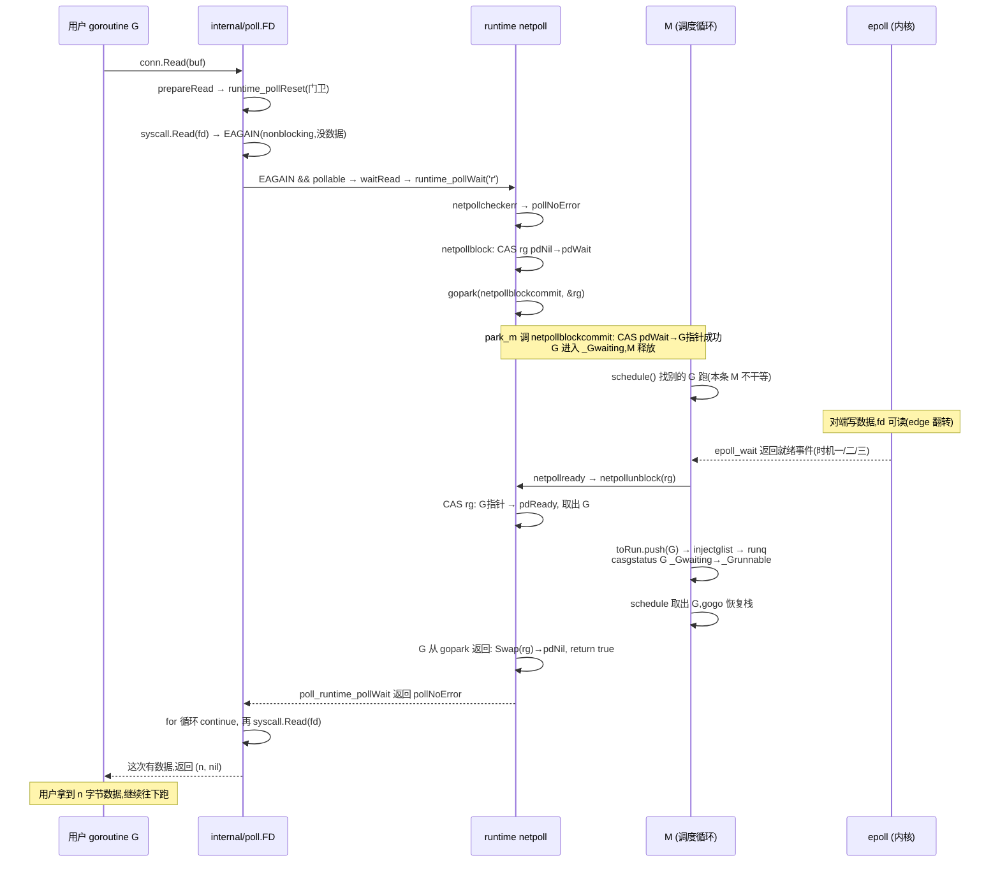

# 第十九章 · 网络 I/O 的阻塞与唤醒全流程

> 篇:第 6 篇 · netpoll:网络不阻塞线程(阻塞唤醒)
> 主线呼应:第 18 章把 netpoll 的"集成 epoll"机制拆透了——`pollDesc` 状态机、epoll 薄封装、三个调用时机。但还差最后一步:用户代码里那行 `n, err := conn.Read(buf)`,是怎么**一步步**走到 `netpollblock` 的?G 被 epoll 唤醒后,又是怎么从 `netpollblock` 返回、拿到内核的数据、回到用户代码继续往下跑?这一跳跨了 `net` 包、`internal/poll` 包、`runtime` 三层,中间还埋着两个关键岔路口——"这个 fd 是不是 pollable"决定了它走 netpoll 还是 handoff P、`syscall.Read` 返回的 `EAGAIN` 是触发 park 的唯一信号。这一章把端到端的每一跳画出来,补全 netpoll 这一篇的最后一块拼图。

## 核心问题

**用户写 `n, err := conn.Read(buf)`,数据没来,这一行代码到 G 被 park、到 epoll_wait 唤醒它、到它重新被调度执行、到它真的从内核读到数据返回——这条链路上的每一跳是什么?为什么普通文件读(`os.File.Read`)和网络读(`conn.Read`)走的是两条完全不同的路径?`EAGAIN` 为什么是整套机制的"发令枪"?**

读完本章你会明白:

1. **从 `conn.Read` 到 `netpollblock` 的完整调用链**——`net.conn.Read` → `internal/poll.FD.Read` → `syscall.Read`(nonblocking)→ 拿到 `EAGAIN` → `fd.pd.waitRead` → `runtime_pollWait`(linkname)→ `poll_runtime_pollWait` → `netpollblock` → `gopark`。这条链路跨三个包,中间每一跳都有职责分工,不能省略任何一跳。
2. **fd 是否 pollable 是整套机制的岔路口**——`FD.Init(net, pollable)` 决定了这个 fd 走 netpoll 还是走 `entersyscall`/`exitsyscall` 的 handoff P 路径。pollable 的 fd(socket,通过 `accept4` 带 `SOCK_NONBLOCK` 建出来)走 netpoll,让"阻塞读"变成 park+等就绪;非 pollable 的 fd(普通文件、`os.Stdin` 在某些平台)走 `entersyscall`,阻塞时 handoff P 给别的 G 跑。这两条路径的反面对比,是理解"netpoll 为什么省钱"的最佳参照系。
3. **nonblocking fd + EAGAIN 循环是 netpoll 能成立的地基**——socket 在 `accept4` 时就被标成 nonblocking,`syscall.Read` 在没数据时**立刻**返回 `EAGAIN`(不睡线程),`internal/poll` 看到 `EAGAIN && pollable()` 才调 `waitRead` 进 netpoll。**EAGAIN 是"该 park 了"的唯一信号**。没有 nonblocking 模式,`syscall.Read` 会直接阻塞整条 M,netpoll 根本插不进来。
4. **`gopark` / `goready` 是阻塞唤醒这一面的通用原语**——netpoll 用它,channel 用它,`time.Sleep` 用它,mutex 用它。`gopark` 把当前 G 设成 `_Gwaiting` 然后切走栈(M 跑别的 G 去了),`goready` 把 G 设回 `_Grunnable` 塞进 runq。netpoll 的特殊性只在于"谁来 goready"——是 epoll_wait 返回后的 `netpollready`,而不是 channel 的 sender 或 timer 的回调。

> 逃生阀:如果读调用链时被三层包绕晕,只抓主干——**用户代码 `Read` → `syscall.Read`(nonblocking)拿到 `EAGAIN` → runtime 的 `netpollblock` 把自己 park → epoll_wait 唤醒后 `goready` 把 G 塞回 runq → M 重新调度它 → 回到 `Read` 循环这次真的读到数据**。其余都是这条主干在边界条件(deadline、close、错误、文件 vs socket)下的展开。本章不讲 epoll 怎么实现的(第 18 章讲过),只讲"用户代码到 netpoll 再回来"这一段。

---

## 19.1 一句话点破

> **`conn.Read` 阻塞到唤醒的全流程,是 Go 把"同步阻塞 API"翻译成"nonblocking syscall + park + epoll 唤醒 + 重跑"的完整脚手架露出来的地方。这套翻译分三层:用户层(`net` 包只管调 `internal/poll.FD.Read`)、中间层(`internal/poll` 在 nonblocking fd 上跑 `syscall.Read`,撞上 `EAGAIN` 才进 runtime)、runtime 层(`netpollblock` 把 G park、epoll 唤醒后 `goready` 把 G 拉回来)。三层各管一段,`EAGAIN` 是中间层往 runtime 层交棒的信号,`pollable` 是中间层决定走 netpoll 还是 handoff P 的开关。**

这是结论,不是理由。本章倒过来拆:先看这条链路的全景(三层调用栈),再钻三个最硬的点——nonblocking fd 怎么建出来(`accept4` + `SOCK_NONBLOCK`)、`internal/poll` 怎么用 `EAGAIN` 循环把阻塞读变成"读不到就 park"、pollable vs 非 pollable 的岔路口(handoff P vs netpoll)凭什么不能合并;最后把唤醒回来这条反向链路也走一遍,完成闭环。

---

## 19.2 全景:三层调用栈

先把整条正向链路(从 `conn.Read` 到 `gopark`)的调用栈一次画清楚,后面几节逐跳展开。

```
用户代码:    n, err := conn.Read(buf)
                  │
net 包:      (*netTCPConn).Read → (*netFD).Read        ← 只是转调 internal/poll
                  │
internal/poll:(*FD).Read (fd_unix.go#L141)
                  │  ┌─ fd.pd.prepareRead   ← 检查 closing/超时(进 netpoll 前的"门卫")
                  └─ for { syscall.Read(fd.Sysfd, p)   ← nonblocking,没数据返回 EAGAIN
                         if EAGAIN && pd.pollable():
                              fd.pd.waitRead → runtime_pollWait(ctx,'r')   ← linkname 进 runtime
                  │
runtime:     poll_runtime_pollWait (netpoll.go#L342)
                  └─ netpollblock (netpoll.go#L548)
                       ├─ CAS rg: pdReady→pdNil   (快路径:数据已就绪)
                       ├─ CAS rg: pdNil→pdWait    (挂"我要 park")
                       └─ gopark(netpollblockcommit, &rg)   ← G 进入 _Gwaiting,M 释放
```

这张图的关键,是看清楚三层各自的边界:

- **`net` 包不碰 fd 的细节**。`(*netTCPConn).Read` 几乎是个空壳,转调 `fd.pfd.Read`(pfd 是 `netFD` 里那个 `poll.FD`)。`net` 包的职责是"tcp 语义"(连接状态、地址),不碰 syscall。
- **`internal/poll` 是 syscall 和 runtime 的桥**。它跑真正的 `syscall.Read`(nonblocking),拿到 `EAGAIN` 后才决定"该交给 runtime 了"。**它是 netpoll 翻译脚手架真正落地的地方**。
- **`runtime` 只在最后一步进场**。`poll_runtime_pollWait` 之后的事(park、epoll_wait、ready)全是 runtime 的活,`internal/poll` 一概不管。

> **钉死这件事**:`net` 包、`internal/poll` 包、`runtime` 包三层,职责严格分层。最关键的边界在 `internal/poll` 和 `runtime` 之间——它们靠 `//go:linkname` 衔接(`runtime_pollWait` 这个符号在 `internal/poll` 里只有声明没有实现,实现是 runtime 里的 `poll_runtime_pollWait`)。`internal/poll` 不知道 runtime 内部怎么 park,runtime 也不知道 `internal/poll` 怎么循环 Read。这种解耦让 netpoll 的实现可以被替换(比如 Windows 是 IOCP,`internal/poll` 那层不变),也让每一层可以独立演进。

---

## 19.3 第一层到第二层:`net.conn.Read` 怎么进 `internal/poll`

从用户视角,`conn.Read(buf)` 是 `net` 包给的接口。但 `net` 包的网络连接对象(`netTCPConn` / `netFD`)在 Read 上几乎不做事,只把调用转给底层那个 `poll.FD`:

```go
// src/net/net.go(netFD.Read 的骨架,实际由 fd_unix.go 里的 (*netFD).Read 实现)
func (fd *netFD) Read(p []byte) (n int, err error) {
    n, err = fd.pfd.Read(p)
    // ... 处理 zero-read / EOF 的网络语义 ...
    return
}
```

`netFD.pfd` 就是 `poll.FD`(结构体在 `internal/poll/fd_unix.go#L29`)。**`net` 包的全部职责是"网络语义"(连接状态、地址、SO_REUSEADDR 之类),IO 的实际执行交给 `poll.FD`**。这一跳看起来是多余的转发,但它有存在价值:`net` 包要做的"zero byte read 视作 EOF 还是合法"、"读出对端关闭信号(EPOLLRDHUP)"这些网络语义,必须在 `poll.FD.Read` 的裸 syscall 之上加一层。这一层就是 `netFD.Read`。

> **不这样会怎样**:假设把 `net` 包砍掉,让用户直接调 `poll.FD.Read`。那么 TCP 半关闭(对端写关闭,本端还能读到 EOF)、UDP 的"zero read"歧义、Unix domain socket 的特殊性,就全部要用户自己处理。`net` 包这一层转发,换来了"用户只管 `conn.Read`,网络语义 runtime 兜底"的简洁。这是分层换抽象的常规操作,但它的存在解释了为什么调用链有三层而不是两层。

---

## 19.4 第二层:`internal/poll.FD.Read` 的 EAGAIN 循环

这是整套翻译脚手架的核心一跳。把 [`fd_unix.go#L141-L173`](../go/src/internal/poll/fd_unix.go#L141) 的 `Read` 完整摆出来:

```go
// src/internal/poll/fd_unix.go#L141-L173
func (fd *FD) Read(p []byte) (int, error) {
    if err := fd.readLock(); err != nil {
        return 0, err
    }
    defer fd.readUnlock()
    if len(p) == 0 {
        return 0, nil
    }
    if err := fd.pd.prepareRead(fd.isFile); err != nil {
        return 0, err
    }
    if fd.IsStream && len(p) > maxRW {
        p = p[:maxRW]
    }
    for {
        n, err := ignoringEINTRIO(syscall.Read, fd.Sysfd, p)
        if err != nil {
            n = 0
            if err == syscall.EAGAIN && fd.pd.pollable() {
                if err = fd.pd.waitRead(fd.isFile); err == nil {
                    continue   // 被唤醒后,回到 for 顶部再 Read 一次
                }
            }
        }
        err = fd.eofError(n, err)
        return n, err
    }
}
```

这个函数看起来短,但每一行都钉死了一件事。逐段拆。

### 19.4.1 门卫:`prepareRead` 检查"进 netpoll 前的错误"

```go
if err := fd.pd.prepareRead(fd.isFile); err != nil {
    return 0, err
}
```

`prepareRead` 调 [`fd_poll_runtime.go#L72`](../go/src/internal/poll/fd_poll_runtime.go#L72) 的 `prepareRead` → `prepare('r')` → `runtime_pollReset(ctx, 'r')` → runtime 里是 [`poll_runtime_pollReset`](../go/src/runtime/netpoll.go#L323):

```go
// src/runtime/netpoll.go#L323-L334
func poll_runtime_pollReset(pd *pollDesc, mode int) int {
    errcode := netpollcheckerr(pd, int32(mode))
    if errcode != pollNoError {
        return errcode
    }
    if mode == 'r' {
        pd.rg.Store(pdNil)
    } else if mode == 'w' {
        pd.wg.Store(pdNil)
    }
    return pollNoError
}
```

`prepareRead` 是"进 netpoll 前的门卫":(1) 检查 fd 是否已 close / deadline 是否已超时(`netpollcheckerr`),是的话直接返回错误,不进 netpoll;(2) 把 `rg`/`wg` 清成 `pdNil`,清掉上一轮残留的 `pdReady` 通知。

> **不这样会怎样**:假设没有 `prepareRead` 这道门。一个 fd 已经 SetReadDeadline 超时了,`netpollcheckerr` 会返回 `pollErrTimeout`;但如果没有这道门,`Read` 会傻乎乎进 `netpollblock` park 起来,等到下次真有数据来才醒——超时语义就失效了。`prepareRead` 把"close/超时"这种"不用等就有答案"的错误,挡在 park 之外。这是 deadline 能 sound 的入口校验。

### 19.4.2 核心循环:nonblocking `syscall.Read` + EAGAIN 触发 waitRead

```go
for {
    n, err := ignoringEINTRIO(syscall.Read, fd.Sysfd, p)
    if err != nil {
        n = 0
        if err == syscall.EAGAIN && fd.pd.pollable() {
            if err = fd.pd.waitRead(fd.isFile); err == nil {
                continue   // 醒来重 Read
            }
        }
    }
    err = fd.eofError(n, err)
    return n, err
}
```

这是整套脚手架的心脏。逐条件拆:

**`syscall.Read(fd.Sysfd, p)` 是 nonblocking 的**——这是下面 19.5 要展开的事(socket 在 `accept4` 时就标了 `SOCK_NONBLOCK`,普通文件由 `Init(pollable=false)` 设成 blocking)。nonblocking 的语义是:**没数据时立刻返回 `EAGAIN`,不睡线程**。这是 netpoll 能插进来的前提——如果 `syscall.Read` 自己会阻塞整条 M,runtime 根本没有机会在它后面 park G。

**`ignoringEINTRIO` 包装**:自动重试被信号打断的 `EINTR`(Linux 的 `read` 被信号打断返回 `EINTR`,Go 的策略是无脑重试,不让用户感知信号)。这是 Unix IO 的常规套路。

**`err == syscall.EAGAIN && fd.pd.pollable()` 是发令枪**。这里两个条件缺一不可:

- `EAGAIN`:nonblocking fd 在"没数据"时的返回。这是"该 park 了"的信号。
- `fd.pd.pollable()`:`runtimeCtx != 0`,即这个 fd 成功 `runtime_pollOpen` 过(注册进了 epoll)。普通文件的 `runtimeCtx == 0`([`fd_poll_runtime.go#L103`](../go/src/internal/poll/fd_poll_runtime.go#L103)),`pollable()` 返回 false,这一行就走不进去。

两个条件都满足,才调 `fd.pd.waitRead(fd.isFile)`——这一跳进入 `runtime_pollWait`(linkname 进 runtime),G 在里面 park。`waitRead` 返回 nil(被正常唤醒)时 `continue`,回到 `for` 顶部再 `syscall.Read` 一次——这次大概率能读到数据(因为 epoll 说就绪了)。

**`fd.eofError(n, err)`**:把 `n==0 && err==nil` 翻译成 `io.EOF`。这是 stream 连接"对端关闭"的标准信号。

> **钉死这件事**:这个 `for` 循环是 netpoll 翻译脚手架的核心。它的形态是经典的"nonblocking IO loop"——C 程序员手写 epoll 时也写一模一样的循环(`read` 拿 EAGAIN → `epoll_wait` → 重 `read`)。区别在于:C 程序员在 `epoll_wait` 那一步是**自己**调,Go 程序员在 `waitRead` 那一步是 **runtime 偷偷**调(把当前 G park 起来,把活儿转给 epoll_wait 在 runtime 内部跑)。**Go 的"同步阻塞 API",底下就是这种 nonblocking + EAGAIN 循环,只是循环里"等就绪"那一跳从"用户主动 epoll_wait"换成了"G 被 park + runtime 自动 epoll_wait"。这是 netpoll 翻译的本质。**

### 19.4.3 为什么是 EAGAIN 而不是阻塞

很多人第一次知道 Go 的 `conn.Read` 底下是 nonblocking fd 都会愣一下:用户明明写的是"阻塞读",怎么底层 fd 是 nonblocking?

答案是:**fd 的 nonblocking 是给 `syscall.Read` 用的,让它在没数据时立刻返回;用户感受到的"阻塞",是 `waitRead` 里 G 被 park 的那段时间**。这两件事是分离的——fd 层面 nonblocking(让 syscall 不睡线程),G 层面"阻塞"(让调用 Read 的 goroutine park)。netpoll 的全部魔法,就是把这两个层面接起来:fd nonblocking 保证 syscall 不睡,runtime park 保证 G 等数据时也不睡线程(让 M 去跑别的 G)。

> **反面对比**:假设 fd 是 blocking 的(普通 `os.File` 就是)。那么 `syscall.Read` 在没数据时会**直接阻塞整条 M**——`internal/poll` 根本没机会调 `waitRead`(因为 `syscall.Read` 不会返回,`EAGAIN` 不会发生)。这时 G 确实"阻塞"了,但代价是 M 也跟着睡了,不能跑别的 G。这就是普通文件读为什么不走 netpoll(下一节详讲),也是 netpoll 必须建立在 nonblocking fd 之上的硬约束。

---

## 19.5 nonblocking fd 怎么建出来:accept4 + SOCK_NONBLOCK

上一节反复强调"`syscall.Read` 是 nonblocking 的"。这个 nonblocking 是怎么来的?是 `accept4` 系统调用建 socket 时就标好的。看 [`sock_cloexec.go#L16-L22`](../go/src/internal/poll/sock_cloexec.go#L16):

```go
// src/internal/poll/sock_cloexec.go#L16-L22
func accept(s int) (int, syscall.Sockaddr, string, error) {
    ns, sa, err := Accept4Func(s, syscall.SOCK_NONBLOCK|syscall.SOCK_CLOEXEC)
    if err != nil {
        return -1, nil, "accept4", err
    }
    return ns, "", nil
}
```

`accept4` 是 Linux 的系统调用,在 `accept` 的基础上多一个 flags 参数。这里传 `SOCK_NONBLOCK|SOCK_CLOEXEC`:

- **`SOCK_NONBLOCK`**:新 accept 出来的 socket fd **一出生就是 nonblocking**。等价于在普通 `accept` 后再调一次 `fcntl(F_SETFL, O_NONBLOCK)`,但合并在一个系统调用里,且**原子**(避免 accept 后、fcntl 前这个窗口里 fd 是 blocking 的,如果有别的线程抢先 read 会阻塞)。
- **`SOCK_CLOEXEC`**:exec 时自动 close 这个 fd,避免泄漏给子进程。

> **不这样会怎样**:假设用裸 `accept`(不带 SOCK_NONBLOCK),然后在用户态调 `fcntl` 设 nonblocking。两个问题:(1) 多一次系统调用(性能);(2) `accept` 返回后、`fcntl` 调用前这个窗口,fd 是 blocking 的——如果另一个 goroutine 抢先调 Read(多 goroutine 共享 conn 的场景,虽然不推荐但合法),那次 Read 会真阻塞整条 M,直到 `fcntl` 把它改成 nonblocking。`accept4` + SOCK_NONBLOCK 把这件事原子化,堵住这个窗口。这是 Linux 给的"原子建 nonblocking fd"原语,Go 直接用上。

`Dial`(主动建连)走的路径不同,但结果一样:`netSocket`(平台相关)建 socket 时也带 `SOCK_NONBLOCK|SOCK_CLOEXEC`,然后 connect(对 nonblocking socket 是异步的,返回 `EINPROGRESS`,Go 在 `waitWrite` 里等连接完成)。**所有从 Go 的 `net` 包出去的 socket,一出生就是 nonblocking 的**——这是 netpoll 能成立的物理前提。

普通文件(`os.Open`)走的路径完全不同:`FD.Init("file", pollable=false)` 直接把 `fd.isBlocking = 1`([`fd_unix.go#L62-L64`](../go/src/internal/poll/fd_unix.go#L62)),不进 netpoll。下面 19.7 详讲这个岔路口。

---

## 19.6 第三层:从 `runtime_pollWait` 到 `netpollblock` 到 `gopark`

回到正向链路。`internal/poll` 撞上 `EAGAIN && pollable()` 后调 `waitRead`,跨过 `//go:linkname` 边界进 runtime。这一节拆 runtime 这一层。

### 19.6.1 linkname 边界:声明 vs 实现

[`internal/poll/fd_poll_runtime.go#L22-L29`](../go/src/internal/poll/fd_poll_runtime.go#L22) 有一组只有声明、没有实现的函数:

```go
// src/internal/poll/fd_poll_runtime.go#L22-L29
func runtime_pollServerInit()
func runtime_pollOpen(fd uintptr) (uintptr, int)
func runtime_pollClose(ctx uintptr)
func runtime_pollWait(ctx uintptr, mode int) int
func runtime_pollWaitCanceled(ctx uintptr, mode int)
func runtime_pollReset(ctx uintptr, mode int) int
func runtime_pollSetDeadline(ctx uintptr, d int64, mode int)
func runtime_pollUnblock(ctx uintptr)
```

这些函数的实现,在 runtime 里以 `poll_runtime_xxx` 的名字存在,通过 `//go:linkname` 把名字缝起来:

```go
// src/runtime/netpoll.go#L341-L342
//go:linkname poll_runtime_pollWait internal/poll.runtime_pollWait
func poll_runtime_pollWait(pd *pollDesc, mode int) int {
```

`//go:linkname` 是 Go 的"内部链接"机制,绕过包可见性,把一个包里的符号直接指向另一个包的实现。**这是 `internal/poll` 和 `runtime` 之间的唯一通道**。它的存在让 `internal/poll` 可以完全不导入 `runtime` 包(它甚至不能导入,`runtime` 是特殊的不能被普通包依赖),却能用上 runtime 的 netpoll 实现。

> **钉死这件事**:`runtime_pollWait` 这个名字在用户代码里看不到,但它把 `internal/poll` 和 `runtime` 缝起来。这种 linkname 解耦是 Go runtime 的招牌——`internal/poll`、`sync`、`time` 这些底层包都靠 linkname 调 runtime 的内部函数。它换来的好处是:`internal/poll` 这一层可以独立编译测试,runtime 的 netpoll 实现可以替换(Windows 的 IOCP 就是另一套 `netpoll_*.go`,但 `internal/poll` 的 `runtime_pollWait` 接口不变)。**接口稳定,实现可换,这是分层抽象的红利。**

### 19.6.2 `poll_runtime_pollWait`:`netpollblock` 的循环包装

进 runtime 的第一跳是 [`poll_runtime_pollWait`](../go/src/runtime/netpoll.go#L342):

```go
// src/runtime/netpoll.go#L342-L361
func poll_runtime_pollWait(pd *pollDesc, mode int) int {
    errcode := netpollcheckerr(pd, int32(mode))
    if errcode != pollNoError {
        return errcode
    }
    // As for now only Solaris, illumos, AIX and wasip1 use level-triggered IO.
    if GOOS == "solaris" || GOOS == "illumos" || GOOS == "aix" || GOOS == "wasip1" {
        netpollarm(pd, mode)
    }
    for !netpollblock(pd, int32(mode), false) {
        errcode = netpollcheckerr(pd, int32(mode))
        if errcode != pollNoError {
            return errcode
        }
        // Can happen if timeout has fired and unblocked us,
        // but before we had a chance to run, timeout has been reset.
        // Pretend it has not happened and retry.
    }
    return pollNoError
}
```

它做了三件事:

1. **再过一遍 `netpollcheckerr`**:虽然 `internal/poll` 那边 `prepareRead` 已经查过一次,但跨过 linkname 进 runtime 后再查一次是必要的——这中间时间虽短,但 deadline 可能正好在这段时间内到期。runtime 不信任 `internal/poll` 的快照,自己再查一次,确保 park 时状态是对的。
2. **level-triggered 平台才 arm**:`netpollarm` 是 Solaris/illumos/AIX/wasip1 这些 level-triggered 平台用的(L347 的注释明说)。Linux 的 epoll 是 edge-triggered,在 `netpollopen` 时已经一次性 arm 好,这里不重 arm。这是平台差异在调用链上的体现。
3. **`for !netpollblock(...)`**:这是核心。`netpollblock` 返回 true 表示"IO 真就绪了"(可以回去 Read 了),返回 false 表示"醒了但不是因为 IO 就绪"(可能是 timeout / close / 虚惊)。循环体里再查一次 `netpollcheckerr`,如果有真错误(timeout 到了、fd 关了)就返回错误码;如果没错误(注释说的"timeout 已 fire 但又被 reset"的边角竞态),retry。

> **钉死这件事**:`poll_runtime_pollWait` 的循环是为了覆盖"醒了但不是真 IO 就绪"的边角竞态。netpollblock 的一次 park/醒,可能因为 deadline 到了(应该返回 timeout)、fd 关了(应该返回 closing)、或者纯粹的 race(timeout fire 了但还没跑到用户代码又被 reset 了,这时该重试)。这个循环把这些边角竞态吸收掉,保证"返回给 `internal/poll` 的要么是真就绪、要么是真错误"。

### 19.6.3 `netpollblock`:park 的核心四态机

第 18 章已经拆过 `netpollblock` 的状态机细节(快路径消费 `pdReady`、挂 `pdWait`、`netpollblockcommit` commit G 指针、`gopark` 切走)。这里只回顾它在这条调用链里的角色:**它是 `poll_runtime_pollWait` 的循环体,每次循环要么立刻返回 true(快路径消费就绪),要么 park 自己等被唤醒**。

```go
// src/runtime/netpoll.go#L548-L583(节选,完整见第 18 章)
func netpollblock(pd *pollDesc, mode int32, waitio bool) bool {
    gpp := &pd.rg
    if mode == 'w' {
        gpp = &pd.wg
    }
    for {
        if gpp.CompareAndSwap(pdReady, pdNil) {   // 快路径:已就绪
            return true
        }
        if gpp.CompareAndSwap(pdNil, pdWait) {    // 挂"我要 park"
            break
        }
        // ... throw double wait ...
    }
    if waitio || netpollcheckerr(pd, mode) == pollNoError {
        gopark(netpollblockcommit, unsafe.Pointer(gpp), waitReasonIOWait, traceBlockNet, 5)
    }
    old := gpp.Swap(pdNil)                         // 醒来,看 rg 变成了什么
    if old > pdWait {
        throw("runtime: corrupted polldesc")
    }
    return old == pdReady                          // true=数据就绪,false=虚惊
}
```

`netpollblock` 返回后,`poll_runtime_pollWait` 的循环根据返回值决定继续 retry 还是返回。整个 park 路径在此闭环——G 进入 `_Gwaiting` 状态,M 释放去跑别的 G(下一节 19.8 详讲 park 在 `gopark` 里到底发生了什么)。

### 19.6.4 一张表:`internal/poll` ↔ `runtime` 接口对照

把跨边界的几对函数列出来,方便对照:

| `internal/poll` 侧(声明) | `runtime` 侧(实现,linkname) | 干什么 |
|---|---|---|
| `runtime_pollServerInit()` | `poll_runtime_pollServerInit` ([netpoll.go#L214](../go/src/runtime/netpoll.go#L214)) | 初始化 netpoll(惰性,首次 Open 时) |
| `runtime_pollOpen(fd)` | `poll_runtime_pollOpen` ([netpoll.go#L244](../go/src/runtime/netpoll.go#L244)) | 建 pollDesc、注册 epoll |
| `runtime_pollReset(ctx,mode)` | `poll_runtime_pollReset` ([netpoll.go#L323](../go/src/runtime/netpoll.go#L323)) | 进 park 前的门卫,清 rg/wg |
| `runtime_pollWait(ctx,mode)` | `poll_runtime_pollWait` ([netpoll.go#L342](../go/src/runtime/netpoll.go#L342)) | **阻塞等就绪**(本章主线) |
| `runtime_pollClose(ctx)` | `poll_runtime_pollClose` ([netpoll.go#L281](../go/src/runtime/netpoll.go#L281)) | close 时从 epoll 注销 |
| `runtime_pollSetDeadline(ctx,d,mode)` | `poll_runtime_pollSetDeadline` ([netpoll.go#L372](../go/src/runtime/netpoll.go#L372)) | 设读/写 deadline |
| `runtime_pollUnblock(ctx)` | `poll_runtime_pollUnblock` ([netpoll.go#L452](../go/src/runtime/netpoll.go#L452)) | Close 时把等着的 G 全赶走 |

`runtime_pollOpen` 返回的 `ctx` 是 `pollDesc` 的指针(被 `uintptr` 伪装过),`internal/poll` 存在 `pd.runtimeCtx` 里,之后所有调用都拿这个 `ctx` 进 runtime。**`runtimeCtx == 0` 就是 "pollable" 的判定**([`fd_poll_runtime.go#L103-L105`](../go/src/internal/poll/fd_poll_runtime.go#L103))。

---

## 19.7 岔路口:pollable vs 非 pollable,netpoll vs handoff P

现在拆这一章最硬的对比点:**为什么有的 fd 走 netpoll,有的 fd 走 handoff P?这两条路径有什么本质区别?**

### 19.7.1 决定因素:`FD.Init(pollable)`

岔路口在 fd 创建时就已经定下。看 [`fd_unix.go#L55-L73`](../go/src/internal/poll/fd_unix.go#L55):

```go
// src/internal/poll/fd_unix.go#L55-L73
func (fd *FD) Init(net string, pollable bool) error {
    fd.SysFile.init()
    if net == "file" {
        fd.isFile = true
    }
    if !pollable {
        fd.isBlocking = 1   // 非 pollable:标记成 blocking
        return nil
    }
    err := fd.pd.init(fd)   // pollable:进 netpoll
    if err != nil {
        fd.isBlocking = 1   // netpoll 初始化失败,降级成 blocking
    }
    return err
}
```

`pollable` 参数是谁传进来的?是 `net` 包的 `newFD` 之类——socket 传 `true`,普通文件传 `false`。`Init` 的逻辑:

- **`pollable == true`(socket)**:调 `fd.pd.init(fd)` → `runtime_pollOpen` → 注册进 epoll。`fd.isBlocking` 保持 0(后面 Read 依赖 socket 自己的 `SOCK_NONBLOCK`,而不是这个标志)。
- **`pollable == false`(普通文件)**:`fd.isBlocking = 1`,**不**调 `runtime_pollOpen`,`pd.runtimeCtx == 0`。后面 Read 时 `pd.pollable()` 返回 false,撞 EAGAIN 也不会进 `waitRead`(下一节拆这条路径)。

> **为什么普通文件不 pollable**:**Linux 的普通文件 fd,`read` 永远不会返回 `EAGAIN`**——普通文件总是"就绪"的(数据在 page cache 或磁盘上,read 顶多慢,不会"没数据")。epoll 对普通文件也不支持(`EPOLL_CTL_ADD` 普通文件会报 `EPERM`)。所以 Go 的设计是:**socket 走 netpoll(park + 等就绪),普通文件走 `entersyscall`(直接进 blocking syscall,阻塞时 handoff P)**。这是 fd 类型决定调度路径的根本原因,不是性能优化,是"普通文件压根不能 poll"的硬约束。

### 19.7.2 非 pollable 路径:`syscall.Read` 阻塞 + handoff P

非 pollable 的 fd(普通文件)在 Read 时走完全不同的路径。看 `fd_unix.go#L160-L172` 那个 `for` 循环对它的处理:`syscall.Read` 是 blocking 的(普通文件就是 blocking),没数据时**直接阻塞整条 M**(对磁盘 read,内核会睡在 IO 等队列上)。`EAGAIN` 不会发生(普通文件不返 EAGAIN),所以 `if err == EAGAIN && pollable()` 这个分支进不去,`waitRead` 不调,netpoll 全程不参与。

那这条 M 阻塞了,别的 G 怎么办?答案在 `syscall.Read` 之上的封装——Go 的 `syscall` 包里,所有可能阻塞的 syscall 都被 `entersyscall` / `exitsyscall` 包起来(汇编实现的,见 `src/runtime/asm_amd64.s` 的 `·Syscall` 系列)。`entersyscall` 在进 syscall 前做一件事:**把当前 P 标成 `_Psyscall`,让别的 M 能偷走这个 P 去跑别的 G**(`handoffp`)。这就是"非 pollable 阻塞 IO"的解法——M 阻塞在 syscall 里没关系,只要把 P 让出去,调度器还能继续转。

`entersyscall` 的核心逻辑([`proc.go#L4776`](../go/src/runtime/proc.go#L4776) → `reentersyscall`)是:保存 G 的上下文,把 `mp.p` 的 status 设成 `_Psyscall`,然后才进 syscall。sysmon 检测到有 M 在 `_Psyscall` 状态超过 20ms,就 handoff 这个 P 给新 M(第 7 章讲过 sysmon 的这个职责)。

### 19.7.3 两条路径的对比表

| 维度 | pollable(socket,走 netpoll) | 非 pollable(普通文件,走 handoff P) |
|---|---|---|
| fd 模式 | nonblocking(`SOCK_NONBLOCK`) | blocking |
| `syscall.Read` 行为 | 没数据立刻返回 `EAGAIN` | 没数据直接阻塞 M |
| 阻塞时谁让出 | G 被 park,M 释放(`gopark`) | M 在 syscall 里睡,**P 被 handoff** |
| 唤醒方式 | epoll_wait → `netpollready` → `goready` | syscall 返回 → `exitsyscall` 抢回 P |
| 调度开销 | 轻(G 状态切换 + 入 runq) | 重(sysmon 检测 + 可能起新 M + handoff) |
| 支持的并发量 | 海量(10 万 socket 不在话下) | 受限于线程数(每阻塞一个文件 IO 占一条 M) |

这张表是理解"netpoll 为什么这么重要"的钥匙。**socket 走 netpoll 的全部价值,就是把"一个阻塞占一条 M"降级成"一个阻塞只占一个 G"**。10 万个 socket 阻塞,只需要少量 M(靠 epoll 一个 M 服务全部);10 万个普通文件阻塞,就要 10 万条 M(每条 M 卡在一个 read 里)——这就是为什么 Go 的 `net` 包能轻松扛 C10M,而 `os.File` 大量并发读会爆线程。

> **反面对比**:假设 socket 也走 handoff P 路径(不用 netpoll)。那么每个 `conn.Read` 阻塞都会占一条 M 卡在 syscall 里。一个 HTTP server 10 万连接,就需要 10 万条 OS 线程——线程本身占内存(每条栈 8MB 默认,10 万条就是 800GB),线程切换也是内核开销灾难。Go 的 netpoll 把这个数字降到"少量 M"(GOMAXPROCS + 一些 sysmon 兜底),靠的就是 socket 走 netpoll 而不是 handoff P。**netpoll 的本质红利,是把"网络 IO 阻塞"从"占线程"降级成"占 goroutine"。** 这是 Go 高并发的命脉之一。

### 19.7.4 pollable 但 EAGAIN 不进 netpoll 的边角:`RawRead`

`FD` 还有个 [`RawRead`](../go/src/internal/poll/fd_unix.go#L698),它**故意绕过** pollDesc,直接调用户给的回调在 fd 上做 syscall。注释里明说"RawRead is for findExecutable / getdirentries 这种需要在 fd 上跑任意 syscall 的场景,不能 park"。这种边角路径本章不展开,但提一句:**pollable 不是绝对的**,runtime 允许上层"我知道我在干什么,别给我 park"地绕过 netpoll。

---

## 19.8 `gopark` 到底做了什么:G 怎么被切走

回到 pollable 的正向链路。`netpollblock` 末尾调 `gopark(netpollblockcommit, &rg, ...)`,G 就此"消失"。这一节拆 `gopark` 内部,把"G 怎么从 `_Grunning` 变成 `_Gwaiting`、M 怎么释放"这一跳讲透。看 [`proc.go#L457-L475`](../go/src/runtime/proc.go#L457):

```go
// src/runtime/proc.go#L457-L475
func gopark(unlockf func(*g, unsafe.Pointer) bool, lock unsafe.Pointer, reason waitReason, traceReason traceBlockReason, traceskip int) {
    if reason != waitReasonSleep {
        checkTimeouts()
    }
    mp := acquirem()
    gp := mp.curg
    status := readgstatus(gp)
    if status != _Grunning && status != _Gscanrunning {
        throw("gopark: bad g status")
    }
    mp.waitlock = lock
    mp.waitunlockf = unlockf
    gp.waitreason = reason
    mp.waitTraceBlockReason = traceReason
    mp.waitTraceSkip = traceskip
    releasem(mp)
    // can't do anything that might move the G between Ms here.
    mcall(park_m)
}
```

`gopark` 是个"准备工作 + 切栈"的两段式:

**第一段(准备工作)**:把 commit 函数和 lock 存进 `mp.waitunlockf` / `mp.waitlock`(给 `park_m` 用),记 `waitreason`(给 trace 用),确认 G 当前是 `_Grunning`(park 一个非 running 的 G 是 bug)。注意这里**不直接改 G 的状态**,也不直接调 commit——这些事留给 `park_m`。

**第二段(`mcall(park_m)`)**:`mcall` 是汇编(`asm_amd64.s` 的 `·mcall`),它**切到 g0 栈**,然后在 g0 栈上调 `park_m`。`park_m`([`proc.go`](../go/src/runtime/proc.go) 里)做的事:调 `mp.waitunlockf(gp, mp.waitlock)`(对 netpoll 就是 `netpollblockcommit`),如果返回 true 就把 G 状态设成 `_Gwaiting`(正式 park),然后 `schedule()`——**M 立刻去找别的 G 跑**。如果返回 false(commit 失败,比如 rg 在窗口期被改成 pdReady),`park_m` 把 G 设回 `_Grunnable`,重新入队——G 不会真睡,直接重跑。

> **钉死这件事**:`gopark` 的精髓是"先备好 commit,再切栈,commit 在切栈后由 `park_m` 调"。commit 返回值决定"park 是否真生效"。这种"两阶段 + commit 函数"的设计,是为了让 commit 能在 park 的最后时刻检查"我准备 park 期间有没有人来唤醒我"——netpoll 的 `netpollblockcommit` 就是利用这个窗口,检查 rg 还是不是 `pdWait`(是的话才真 park,不是的话说明 IO 已就绪,取消 park)。这是 netpoll 不丢通知的关键(第 18 章详讲过)。

`gopark` 是阻塞唤醒这一面的通用原语——不止 netpoll 用它,channel 收发(`chanrecv`/`chansend`)、`time.Sleep`、`sync.Mutex`(竞争失败时)、`select` 都用它。**它把"G 让出 M 去等某个条件"这件事标准化了**,netpoll 只是众多用户之一。netpoll 的特殊性在于"谁来 goready"——是 epoll_wait 的回调(`netpollready`),不是 channel 的对端。

---

## 19.9 反向链路:epoll 唤醒 → goready → 回到 Read 循环

正向链路(park)讲完了,现在走反向链路(唤醒)。数据从对端来了,内核 epoll 触发,runtime 把 park 中的 G 拉回来,它怎么回到 `for` 循环顶部再 Read 一次?

### 19.9.1 epoll_wait 返回 → netpollready → goready

第 18 章讲过三个调用时机(findRunnable 非阻塞 / findRunnable 阻塞 / sysmon 兜底)。无论哪个时机,`netpoll` 函数内部都会遍历 epoll_wait 返回的事件,对每个事件调 `netpollready`([`netpoll.go#L494`](../go/src/runtime/netpoll.go#L494))。`netpollready` 调 `netpollunblock` 从 `rg`/`wg` 取出等待的 G 指针,push 进 `toRun` 列表。`netpoll` 返回后,调用者(findRunnable 或 sysmon)把 `toRun` 通过 `injectglist` 塞进 runq。

`injectglist`([`proc.go#L4060`](../go/src/runtime/proc.go#L4060))的关键操作:把每个 G 的状态从 `_Gwaiting` CAS 成 `_Grunnable`(`casgstatus(gp, _Gwaiting, _Grunnable)`,L4071),然后塞进 runq(本地或全局)。**这一步把 G 从"等 IO"的状态拉回到"可运行"的状态**。

> **钉死这件事**:`netpollready` → `netpollunblock` 取出 G,`injectglist` 把 G 状态改回 `_Grunnable` 入队。这两步之间,G 的状态是"已从 rg 取出,但还在 toRun 链表里没入 runq"。这个中间态由调用者(findRunnable / sysmon)负责收敛——它会在 `injectglist` 之后立刻 `wakep` 起新 M(或自己直接跑一个)。G 不会"卡在 toRun 里",因为调用 netpoll 的 M 必然紧跟一个调度动作。

### 19.9.2 G 被重新调度:从 park 点继续跑

G 被 `injectglist` 塞进 runq 后,某个 M 的 `schedule()` 会拿到它,`gogo` 恢复它的栈,它从 `mcall(park_m)` 之后的下一条指令继续执行——也就是回到 `gopark` 的调用者(`netpollblock`)。看 `netpollblock` 在 `gopark` 返回后做什么:

```go
// src/runtime/netpoll.go#L577-L582
    // be careful to not lose concurrent pdReady notification
    old := gpp.Swap(pdNil)
    if old > pdWait {
        throw("runtime: corrupted polldesc")
    }
    return old == pdReady
}
```

G 醒来后,把 rg `Swap(pdNil)`(消费掉这次就绪通知),看 rg 醒来前是什么值:

- **`pdReady`**:正常路径——epoll 说就绪了,`netpollunblock` 把 rg 从 G 指针改成 `pdReady`。`return true`。
- **`pdWait`**:边角路径——commit 还没真正跑完(rg 还停在 `pdWait`),就被别人改回了 `pdNil`(timeout/close)。`return false`,外层 `poll_runtime_pollWait` 的循环会重查错误。

`netpollblock` 返回 true 后,`poll_runtime_pollWait` 也返回 `pollNoError`,跨过 linkname 回到 `internal/poll` 的 `waitRead`,返回 nil。回到 `FD.Read` 的 `for` 循环:

```go
// src/internal/poll/fd_unix.go#L160-L172(回到这里)
    for {
        n, err := ignoringEINTRIO(syscall.Read, fd.Sysfd, p)   // 这次有数据了
        ...
    }
```

`continue` 回到 `for` 顶部,**再 `syscall.Read` 一次**。这次 epoll 说就绪了,内核缓冲区有数据,`syscall.Read` 立刻返回数据(不再 EAGAIN)。`FD.Read` 拿着 n 和 nil 返回给 `netFD.Read`,再返回给用户的 `conn.Read`,用户拿到数据继续往下跑。

> **钉死这件事**:唤醒路径的关键,是 G 从 park 点精确恢复——它停在 `gopark` 调用处,醒来后从 `gopark` 返回,接着执行 `gpp.Swap(pdNil)` 和 `return`。这是 Go 调度器的"栈恢复"能力(park 时存了完整上下文,醒来原样恢复)。G 不需要知道"我为什么醒了",它只看 rg 的值——`pdReady` 就是"数据来了",`pdWait` 就是"虚惊一场"。这种"靠状态值而不是回调"的唤醒,让 netpoll 的 park/ready 路径极简。

---

## 19.10 完整时序:一次 conn.Read 阻塞到唤醒的端到端

把正向和反向串起来,画一张端到端时序图:



这张图把三层(`net`、`internal/poll`、`runtime`)和两个外部角色(M、epoll 内核)的交互一次画清楚。**关键观察**:

1. **用户视角**:就是"Read 调进去、等了一会、拿到数据返回"。中间的 park/epoll/ready 完全无感。
2. **M 视角**:park 之后立刻 `schedule()` 去跑别的 G,从来没干等——G 阻塞 ≠ M 阻塞,这是 netpoll 的核心红利。
3. **数据流**:数据真正被读到,是在唤醒后的第二次 `syscall.Read`(正向那次返了 EAGAIN)。epoll 只负责"通知就绪",不负责"搬数据"——搬数据还是 `syscall.Read` 自己干。这是 edge-triggered 模型的标准姿势。

---

## 19.11 技巧精解:EAGAIN 循环 + pollable 分流

这一章最硬的两个技巧:**nonblocking fd + EAGAIN 触发 park 的循环凭什么 sound**,以及**pollable 标志凭什么能干净地分流两条路径**。

### 19.11.1 技巧一:EAGAIN 循环为什么不会"丢数据"或"虚唤醒"

`FD.Read` 的 `for` 循环形态是:`syscall.Read` → EAGAIN → `waitRead`(park)→ 醒来 → `continue` → 再 `syscall.Read`。这个循环的 sound 性要回答两个问题:

**问题 A:醒来后再 Read,会不会漏数据?**

不会,因为 epoll 的 edge 已经发生过(不然不会唤醒)。`netpollunblock` 把 rg 改成 `pdReady` 是因为 epoll_wait 真的返回了这个 fd 的就绪事件——内核缓冲区确实有数据。醒来后再 Read,要么立刻拿到数据,要么拿到 EAGAIN(数据被别的读者抢走了,或者 edge 是 EPOLLRDHUP 这种"假就绪")。后者由 `for` 循环吸收——再 park 一次等下一个 edge。**循环保证"没数据就一直等到有",不会因为一次虚唤醒就退出**。

**问题 B:会不会"有数据但 G 永远不醒"?**

不会,因为 edge-triggered + park 的时序对齐(第 18 章 18.5.1 详讲)。G park 前 rg 记录了它的指针(记忆);park 后 edge 到达,`netpollready` 通过 rg 找到这个 G。即使 edge 在 G park 之前就到了(快路径消费 `pdReady`),也不会丢。`for` 循环 + netpoll 状态机合起来,覆盖了所有时序。

> **反面对比**:假设把这个循环写成"读一次,EAGAIN 就直接返回错误给用户"。那么用户每次 Read 都要自己处理 EAGAIN 重试,Go 的"同步阻塞 API"红利没了。这个循环是 Go 把"nonblocking + EAGAIN 重试"这个 Unix IO 套路**内化**进 runtime 的地方——用户看不到 EAGAIN,只看到"阻塞一会然后拿到数据"。这就是 netpoll 翻译脚手架的终极目的。

### 19.11.2 技巧二:pollable 标志凭什么能干净分流

`pollable` 这个 bool 标志(其实是 `pd.runtimeCtx != 0`)是 netpoll 和 handoff P 两条路径的分水岭。它凭什么能干净分流,不会两条路径互相踩?

**关键在 `Init` 时一次性决定**。`FD.Init` 在 fd 创建时被调一次,要么 `runtime_pollOpen`(pollable,注册 epoll),要么不调(非 pollable)。之后这个 fd 的 `runtimeCtx` 不变,Read 时 `pd.pollable()` 返回值稳定。**分流决策在 fd 生命周期起点就钉死,后面 Read 循环只查这个标志**,不会在中间状态切换。

**两条路径互不干扰**:

- pollable fd 的 `syscall.Read` 是 nonblocking(只返 EAGAIN 不睡线程),所以即便它走 handoff P 的 `entersyscall` 也没意义(根本不会阻塞),它走 netpoll 是正解。
- 非 pollable fd 的 `syscall.Read` 是 blocking,会睡 M,所以它**必须**走 handoff P(否则整条 M 睡死,没机会 park G)。它不能走 netpoll,因为 epoll 不支持普通文件。

这两条路径的"必须性"是 fd 类型(底层 syscall 行为)决定的,不是 Go 的选择。Go 的 `pollable` 标志只是把"fd 类型 → 路径"这个映射显式化。**这个标志之所以能干净分流,是因为它背后的物理事实(socket 必 nonblocking 必 pollable、普通文件必 blocking 必不 pollable)是确定性的,没有灰色地带**。

> **钉死这件事**:`pollable` 不是"性能优化开关",是"fd 物理特性的诚实记录"。socket 在 `accept4` 带 SOCK_NONBLOCK 时就是 nonblocking、epoll 也支持它,所以它 pollable;普通文件 read 不返 EAGAIN、epoll 也不支持它,所以它不 pollable。Go 的 `Init(pollable)` 只是把这件事告诉 `internal/poll`,让它在 Read 循环里走对分支。这个分流的 sound 性来自 fd 类型的确定性,不是 runtime 的精心协调。

---

## 19.12 边角情况:deadline、close、错误

主路径讲完了,这一节快速过一下边角情况,让闭环完整。

### 19.12.1 deadline 到期:不进 netpoll,直接返回 timeout

`conn.SetReadDeadline(t)` 设的 deadline,在 `internal/poll` 这层进 runtime 是 `runtime_pollSetDeadline`([`netpoll.go#L372`](../go/src/runtime/netpoll.go#L372))。它会在 `pollDesc` 里挂一个 `timer`(读端 `rt`、写端 `wt`),到点时 timer 回调 `netpolldeadlineimpl`([`netpoll.go#L622`](../go/src/runtime/netpoll.go#L622))把 rg/wg 改成 `pdNil` 并 ready 等着的 G——这等于"强行唤醒"。G 醒来后 `netpollblockcommit` 的 Swap 看到 rg 不是 `pdReady`,返回 false,`poll_runtime_pollWait` 的循环再查 `netpollcheckerr` 这次返回 `pollErrTimeout`,层层返回到 `FD.Read` 拿到 `ErrDeadlineExceeded`。

更常见的是 deadline 在 G 还没 park 时就到期(比如 deadline 已过,新调 Read):`prepareRead` 的 `runtime_pollReset` → `netpollcheckerr` 直接返回 `pollErrTimeout`,`FD.Read` 第一次 `syscall.Read` 前就拿到错误,根本不进 netpoll。这是 19.4.1 那个"门卫"的价值。

### 19.12.2 close:evict 把等着的 G 全赶走

`conn.Close()` → `FD.Close` → `fd.pd.evict()`([`fd_poll_runtime.go#L57`](../go/src/internal/poll/fd_poll_runtime.go#L57)) → `runtime_pollUnblock` → `poll_runtime_pollUnblock`([`netpoll.go#L452`](../go/src/runtime/netpoll.go#L452))。它把 pollDesc 的 closing 标志设上,`netpollcheckerr` 之后会返回 `pollErrClosing`,所有 park 在这个 fd 上的 G 被唤醒并拿到 `errClosing` 错误。这保证"close 一个 fd 后,等在它上面的 Read 不会无限阻塞"。

### 19.12.3 读到 EOF:不是错误,是 n=0

`syscall.Read` 在 stream socket 上对端关闭时返回 `(0, nil)`(不是 EAGAIN,不是错误)。`FD.Read` 的 `eofError`([`fd_unix.go#L170`](../go/src/internal/poll/fd_unix.go#L170))把 `n==0 && err==nil` 翻译成 `io.EOF`,正常返回给用户。这条路径**不进 netpoll**——EOF 是 syscall 直接给的信号,不用等。

---

## 章末小结

这一章把 netpoll 这一篇的最后一块拼图补全了:**用户代码 `conn.Read` 到 G 被唤醒重跑的端到端全流程**。回到二分法,这条链路服务**阻塞唤醒**这一面——它是"网络 IO 阻塞的 G 怎么 park、怎么被 epoll 唤醒、怎么重跑"的完整脚本。

和第 18 章的衔接:第 18 章讲 netpoll 的内部(epoll 怎么集成、pollDesc 状态机、三个调用时机),这一章讲 netpoll 的"接口侧"——上层(`internal/poll`)怎么调进 netpoll、下层(用户)怎么无感地用。两章合起来,netpoll 这一篇完整闭环。

### 五个"为什么"清单

1. **为什么 `conn.Read` 看起来阻塞,底下却是 nonblocking fd?** 因为 fd 的 nonblocking 是给 `syscall.Read` 用的(让它没数据时立刻返回 EAGAIN,不睡线程);用户感受到的"阻塞"是 G 被 park 的那段时间。netpoll 把这两层接起来:fd nonblocking 保证 syscall 不睡 M,runtime park 保证 G 等数据时也不睡 M(让 M 去跑别的 G)。这是"同步阻塞 API 跑异步性能"的实现细节。

2. **`internal/poll.FD.Read` 的 `for` 循环凭什么 sound,不会丢数据或虚唤醒?** 三件事保证:nonblocking fd 的 `syscall.Read` 撞 EAGAIN 时立刻返回(不睡线程,有 park 机会);EAGAIN && pollable 才进 `waitRead`(park),非 pollable 的 EAGAIN(理论上不发生)不进;醒来后 `continue` 回到 for 顶部再 Read,循环吸收"虚唤醒"。epoll 的 edge + rg 状态机(第 18 章)保证不丢通知。

3. **pollable vs 非 pollable 为什么是两条完全不同的路径?** 物理事实决定:socket 在 `accept4` 带 SOCK_NONBLOCK 出厂就是 nonblocking,epoll 也支持它,所以走 netpoll(park+等就绪);普通文件 `read` 不返 EAGAIN、epoll 也不支持它,所以走 handoff P(阻塞 M 但让出 P)。`FD.Init(pollable)` 在 fd 创建时一次性钉死这个分流,后面 Read 循环只查 `pd.pollable()` 标志。netpoll 的红利是把"网络阻塞占线程"降级成"占 goroutine"。

4. **`runtime_pollWait` 这个 linkname 边界为什么必要?** `internal/poll` 不能导入 `runtime`(runtime 是特殊的,不能被普通包依赖),但又要用 runtime 的 netpoll 实现。`//go:linkname` 把 `internal/poll.runtime_pollWait`(只有声明)缝到 `runtime.poll_runtime_pollWait`(实现)上。这个解耦让 `internal/poll` 这一层稳定(接口不变),runtime 的 netpoll 实现可换(Windows IOCP、BSD kqueue 都换底层不换接口)。是 Go runtime 招牌的内部链接模式。

5. **`gopark` 为什么是阻塞唤醒的通用原语,netpoll 只是用它之一?** `gopark` 把"G 让出 M 去等条件"标准化:存 commit 函数,切到 g0 栈,`park_m` 调 commit 决定是否真 park,然后 `schedule()` 让 M 跑别的 G。netpoll 的 commit 是 `netpollblockcommit`(检查 rg 状态决定是否真 park),channel 的 commit 是 `sudog` 相关,time.Sleep 的 commit 是 timer 相关。netpoll 的特殊性只在"谁来 goready"——是 epoll_wait 的 `netpollready`,而不是别的。`gopark` 是阻塞唤醒这一面的基础设施。

### 想继续深入往哪钻

- **源码文件**:本章主战场 [`../go/src/internal/poll/fd_unix.go`](../go/src/internal/poll/fd_unix.go)(`FD.Read` 的 EAGAIN 循环 L141、`Init` 的 pollable 分流 L55、所有 Read/Write/Accept 系列的同款循环)和 [`../go/src/internal/poll/fd_poll_runtime.go`](../go/src/internal/poll/fd_poll_runtime.go)(pollDesc 包装、linkname 声明、`pollable()` 判定 L103)。runtime 侧 [`netpoll.go`](../go/src/runtime/netpoll.go)(`poll_runtime_pollWait` L342、`netpollblock` L548、`netpollblockcommit` L529、`netpollready`/`netpollunblock` L494/L591)。socket nonblocking 看 [`sock_cloexec.go`](../go/src/internal/poll/sock_cloexec.go) L16 和 `sys_cloexec.go`。handoff P 路径看 `proc.go` 的 `entersyscall` L4776 / `exitsyscall` L4922 / `handoffp` L3146。`gopark`/`goready`/`injectglist` 看 `proc.go` L457/L493/L4060。
- **观测端到端链路**:写个最简单的 TCP echo server(`net.Listen` + `go handle(conn)` + `conn.Read`),用 `go tool trace` 跑一次,看 trace 里 G 的 `BlockNet`(进 netpoll park)和 `GoUnblock`(被 netpoll ready)事件,时间戳能对上"客户端发数据"的时刻。再用 `strace -e read,epoll_wait,epoll_ctl,accept4 -p <pid>` 看系统调用,会发现:accept4 带 SOCK_NONBLOCK(标志位 2048),read 在没数据时返回 -1 EAGAIN,epoll_wait 由不同线程(M)调用印证"没有专门 reactor 线程"。
- **deadline 路径**:在 echo server 上调 `conn.SetReadDeadline(time.Now().Add(100*time.Millisecond))`,读 trace 能看到 timer 到点后 G 被 ready,Read 返回 `ErrDeadlineExceeded`。源码看 `netpoll.go#L372` 的 `poll_runtime_pollSetDeadline` 和 L622 的 `netpolldeadlineimpl`,理解 timer 怎么和 netpoll 协作。
- **对照 channel 阻塞**:写个 `ch := make(chan int); <-ch`(无 sender),用 `go tool trace` 看这个 G 也是 `BlockNet`/`BlockSync`/`BlockChanRecv` 之类(实际是 `BlockChanRecv`),park 路径也是 `gopark`,只是 commit 函数不同(`chansend`/`chanrecv` 的 sudog 逻辑)。这印证"`gopark` 是阻塞唤醒通用原语"——netpoll 和 channel 共用同一个 park 机制,只是唤醒源不同。
- **平台差异**:本章以 Linux/epoll 为例。Windows 走 IOCP(`netpoll_windows.go`),`internal/poll` 那层接口不变,但底层 `runtime_pollWait` 的实现完全不同(IOCP 异步完成端口,不是 epoll_wait)。读 `netpoll_windows.go` 对照,会发现"`poll_runtime_pollWait` 接口相同、实现两套"——这就是 linkname 分层抽象的红利落地。

### 引出下一章

这一章把 netpoll 的端到端全流程拆透了。从用户代码 `conn.Read` 到 G 被唤醒重跑,三层(`net` / `internal/poll` / `runtime`)的职责、两个岔路(pollable / deadline)、一个循环(EAGAIN + waitRead)全部讲清。netpoll 这一篇到此完整闭环。

下一篇(第 7 篇)进入 Go runtime 的另一块招牌:**并发 GC**(三色标记 + 写屏障 + 并发标记清除)。GC 是"不打断业务"这一面的核心——它要在用户 goroutine 还在跑的同时,标记活对象、清扫死对象,靠的是三色不变性 + 写屏障的精巧配合。下一篇会从"为什么要并发 GC(而不是 STW)"和"三色标记凭什么 sound"讲起,接续"少量 M 驱动海量 G + GC 不打断业务"这条主线。

---

> 全书定位:第 19 章 / 第 6 篇 netpoll(阻塞唤醒)。源码版本 Go 1.27(本地 master @ `6d1bcd10`,`src/internal/goversion/goversion.go` 的 `const Version = 27`)。下一篇:第 7 篇 并发 GC。
>
> 源码事实修正:本章任务锚点 `runtime_netpollblock` / `pollRuntimePoll` 在本地 Go 1.27 实际命名为 `netpollblock`(无 `runtime_` 前缀,见 `netpoll.go#L548`)和 `poll_runtime_pollWait`(`netpoll.go#L342`,通过 `//go:linkname` 暴露为 `internal/poll.runtime_pollWait`);`internal/poll` 侧通过 `runtimeCtx != 0` 判定 `pollable()`(`fd_poll_runtime.go#L103-L105`),非 `fd.isBlocking` 标志——`isBlocking` 仅在 `Init` 时对非 pollable fd 置 1(`fd_unix.go#L62-L64`),pollable fd 的 nonblocking 来自 socket 自身的 `SOCK_NONBLOCK`(`sock_cloexec.go#L17` 的 `accept4`);`FD.Read` 的 EAGAIN 循环在 `fd_unix.go#L160-L172`,门卫 `prepareRead` → `runtime_pollReset` 在 `fd_poll_runtime.go#L72`;非 pollable 路径走 `entersyscall`(`proc.go#L4776`)/`exitsyscall`(`proc.go#L4922`)handoff P,sysmon 检测 `_Psyscall` 超 20ms handoff。
