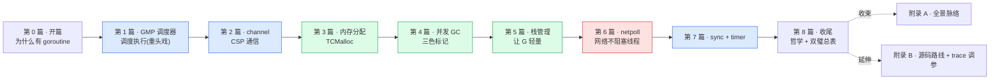

# 《Go runtime 设计与实现深入浅出:为什么 goroutine 这么便宜》—— 目录与导读

> 一本写给"天天写 Go、用满 goroutine/channel,甚至翻过 `src/runtime`,却总觉得一知半解"的人的小书。
>
> **一句话主旨**:Go 怎么让"开一个 goroutine 像开一个函数一样便宜",又怎么用少量 OS 线程高效驱动成千上万个 goroutine——GMP 调度 + 阻塞自动让出 + work-stealing + 并发 GC + TCMalloc 内存,全是 runtime 替你干的。
>
> **二分法**(迷路时回到它):**调度执行**(GMP:让就绪的 G 跑起来、work-stealing 偷工作) vs **阻塞唤醒**(netpoll/sysmon/timer/channel:让阻塞的 G 就绪后被重新调度)。
>
> **★ 双璧对照《Tokio》**:本书独有特色——语言内置协程 vs 库级异步,两套顶级调度器跨语言对读。标 ★ 的章末有对照栏。
>
> **基调**:直球讲透为主,比喻只在反直觉处点睛——延续《LevelDB》。

每章一行:**一句话钩子** —— 技巧标签 —— 二分法归属(`调度` / `唤醒` / `支撑` / `收束`)。

---

## 全书结构总览

旅程:从"OS 线程为什么贵、goroutine 为什么便宜",到"GMP 怎么调度、怎么偷工作、怎么抢占",到"channel 怎么通信、GC 怎么并发回收、栈怎么增长、网络怎么不阻塞"。每篇都是这条路上的一个驿站——读完你能在脑子里放映出一个 goroutine 的全过程 + 一次 GC 的全过程。

---

## 第 0 篇 · 开篇:为什么有 goroutine

- [P0-01 · 第一性原理:为什么 goroutine 这么便宜](P0-01-第一性原理-为什么goroutine这么便宜.md) —— OS 线程贵(创建/切换/内存),协程便宜(用户态栈切换、按需增长);Go runtime 替你干了三件事(调度+GC+内存);`go func` 一行背后发生了什么。 —— runtime 三件事 —— `调度`

## 第 1 篇 · GMP 调度器:调度执行 ⚠️ 重头戏

> 源码在 `src/runtime/runtime2.go`(结构)、`proc.go`(逻辑)、`asm_amd64.s`(切换)。**建议顺序读**(结构→调度→偷→抢占→阻塞→监控)。

- [P1-02 · G、M、P 结构与全局状态](P1-02-GMP结构与全局状态.md) —— G(任务)、M(OS 线程)、P(工作台:本地队列+缓存)各是什么、字段为什么这么排。 —— G/M/P 结构布局 —— `调度`
- [P1-03 · 调度循环:schedule 与 findRunnable](P1-03-调度循环schedule与findRunnable.md) —— M 怎么不断找下一个可跑的 G;找 G 的优先级(本地→全局→GC→netpoll→偷→park)。 —— findRunnable 多级回退 —— `调度`
- [P1-04 · work-stealing:偷工作的艺术](P1-04-work-stealing偷工作的艺术.md) ★ —— 空闲 P 从别的 P 偷一半 runq;无锁环形 runq 的实现。 —— 无锁 runq + 偷一半 —— `调度`
- [P1-05 · 异步抢占:基于信号](P1-05-异步抢占-基于信号.md) —— 为什么要有抢占(死循环不让出会饿死别人);Go 1.14 后靠 `SIGURG` 在任意安全点打断 G。 —— 信号抢占 + 安全点 —— `调度`
- [P1-06 · 系统调用阻塞:handoff P](P1-06-系统调用阻塞-handoff-P.md) —— G 阻塞在系统调用时,M 把 P 让给别的 M 干活;不让阻塞系统调用卡住整个 P。 —— entersyscall/exitsyscall + handoffp —— `调度`
- [P1-07 · sysmon:监控线程](P1-07-sysmon监控线程.md) —— 独立的不受 GC/调度约束的后台线程:检测长跑 G 触发抢占、长阻塞 syscall 触发 handoff、触发 netpoll 和 GC。 —— 独立观察者 —— `调度`

## 第 2 篇 · channel:CSP 通信

- [P2-08 · channel 结构与发送/接收](P2-08-channel结构与发送接收.md) ★ —— hchan(环形 buf + sendq/recvq + 锁);发送/接收的快路径与慢路径(阻塞入队、被唤醒)。 —— 快路径省 buf —— `调度`
- [P2-09 · select 的实现](P2-09-select的实现.md) —— select 怎么在多个 channel 上就绪一个就返回;乱序选 case、锁顺序。 —— 公平性 + 锁顺序 —— `调度`

## 第 3 篇 · 内存分配:TCMalloc 思想(支撑地基)

- [P3-10 · mspan/mcache/mcentral/mheap 层级](P3-10-mspan-mcache-mcentral-mheap层级.md) —— 仿 TCMalloc 的三级缓存:P 本地无锁、central 加锁、heap 全局。 —— 三级缓存锁粒度递进 —— `支撑`
- [P3-11 · 大小对象分配路径](P3-11-大小对象分配路径.md) —— 微小对象(tiny 合并)、小对象(mspan)、大对象(直接 mheap)三条路径。 —— tiny allocator —— `支撑`
- [P3-12 · 逃逸分析:堆还是栈](P3-12-逃逸分析-堆还是栈.md) —— 哪些变量分配在堆(逃逸)、哪些在栈(省 GC);编译器怎么决定。 —— 逃逸规则 —— `支撑`

## 第 4 篇 · 并发 GC:三色标记(支撑地基)

- [P4-13 · 三色标记与写屏障](P4-13-三色标记与写屏障.md) —— 并发标记为什么会漏标;三色不变式;写屏障怎么堵漏标。 —— 写屏障防漏标 —— `支撑`
- [P4-14 · 并发 GC 的阶段](P4-14-并发GC的阶段.md) —— 怎么几乎不暂停业务:标记准备(STW)+ 并发标记 + 标记终止(STW)+ 并发清扫;两次 STW 亚毫秒。 —— STW 最小化 —— `支撑`
- [P4-15 · mark assist:G 协助 GC](P4-15-mark-assist-G协助GC.md) —— 分配太快的 G 被要求帮忙标记,把 GC 压力分摊给分配者。 —— mark assist 反压 —— `支撑`
- [P4-16 · sweep:清扫与回收](P4-16-sweep清扫与回收.md) —— 标记完怎么回收:并发清扫、lazy sweep、空闲页归还。 —— lazy sweep —— `支撑`

## 第 5 篇 · 栈管理:让 G 真正轻量

- [P5-17 · 可增长栈与栈拷贝](P5-17-可增长栈与栈拷贝.md) ★ —— G 栈按需增长(初始 2KB→翻倍拷贝);栈拷贝怎么调整栈上指针;栈收缩。 —— 连续栈拷贝 —— `支撑`

## 第 6 篇 · netpoll:网络不阻塞线程(阻塞唤醒)

- [P6-18 · netpoll:集成 epoll](P6-18-netpoll-集成epoll.md) ★ —— 网络 I/O 阻塞的 G 不占 M:epoll 被 runtime 集成,G 阻塞时 park,就绪由 netpoll 唤醒。 —— epoll 藏进 runtime —— `唤醒`
- [P6-19 · 网络 I/O 的阻塞与唤醒全流程](P6-19-网络IO的阻塞与唤醒全流程.md) —— 一次 `conn.Read` 阻塞到唤醒的完整路径:park → epoll_wait → 唤醒 → 入 runq。 —— 系统调用到 netpoll 衔接 —— `唤醒`

## 第 7 篇 · sync 原语与 timer

- [P7-20 · Mutex 自旋+信号量、timer 四叉堆](P7-20-Mutex自旋信号量-timer四叉堆.md) ★ —— Mutex 先自旋再加锁(normal/starvation 模式);底层信号量;timer 用四叉堆。 —— Mutex 双模式 + 四叉堆 —— `调度`

## 第 8 篇 · 收尾:哲学与双璧总表

- [P8-21 · Go runtime 的哲学 + 双璧对照总表](P8-21-Go-runtime的哲学-双璧对照总表.md) —— 语言内置 vs 库级、协作+抢占混合、有 GC 的取舍、分层缓存换无锁快路径、STW 最小化;双璧对照总表把本书和《Tokio》钉在一起。 —— 双璧对照总表 —— `收束`

## 附录

- **附录 A · 全景脉络** —— 调度/阻塞唤醒/支撑三层全景图 + 一个 goroutine 端到端时序总图。
- **附录 B · 源码阅读路线与延伸** —— `src/runtime` 阅读地图、`GODEBUG`/`go tool trace` 怎么观测、`GOMAXPROCS`/`GOGC` 调参、与 JVM/Erlang VM 对照。

---

## 推荐阅读路线

**主线(推荐)**:P0-01 → 第 1 篇全(P1-02~07,顺序读)→ 第 2 篇(P2-08~09)→ 第 3 篇(P3-10~12)→ 第 4 篇(P4-13~16)→ 第 5 篇(P5-17)→ 第 6 篇(P6-18~19)→ 第 7 篇(P7-20)→ 第 8 篇(P8-21)→ 附录 A。

按目标速查:

| 你的目标 | 读这几章 |
|------|------|
| 只想懂"goroutine 怎么被调度" | P0-01 → P1-02 → P1-03 → P1-04 |
| 只想懂"阻塞为什么不卡线程" | P1-06 → P1-07 → P6-18 → P6-19 |
| 只想懂 channel | P1-02 → P2-08 → P2-09 |
| 只想懂 GC | P4-13 → P4-14 → P4-15 → P4-16 |
| 只想懂内存分配 | P3-10 → P3-11 → P3-12 |
| 和 Tokio 对照(双璧) | 标 ★ 的章:P1-04、P2-08、P5-17、P6-18、P7-20 → 收尾 P8-21 总表 |
| 想读 runtime 源码 | 附录 B(阅读地图)+ 跟着本书章节啃源码 |

> 一个提醒:第 1 篇七章(结构→调度→偷→抢占→阻塞→监控)有强顺序依赖,**不要跳着读这一篇**;第 3/4 篇(内存/GC)互相支撑(分配触发 GC、GC 回收释放),也建议按序。

---

## 配套文件

- [全书规划-总纲](全书规划-总纲.md) —— 主线、二分法、分篇分章、Go 源码策略、写作约定、Go runtime 技巧侧重、双璧对照特色。
- [_章节写作提示词](_章节写作提示词.md) —— 写作执行手册(铁律、四段式、技巧精解、双璧对照栏、自检清单、附 21 章清单与并行分组)。
- 源码(本地 clone):`../go/`(golang/go master)。本书所有源码引用均经 Grep/Read 核实行号,钉死在对应 commit。

---

> 这本书讲的不是"go 怎么用",而是"runtime 凭什么这么设计、`src/runtime` 里那些 G/M/P 结构、`mcall`/`gogo` 汇编、work-stealing、写屏障、栈拷贝到底在干什么"。读完,你该能在脑子里放映出一个 goroutine 从 `go func` 到被调度、阻塞、唤醒、被 GC 回收的全过程——并,顺手看清它和 Tokio 这"另一套顶级调度器"的同与不同。
