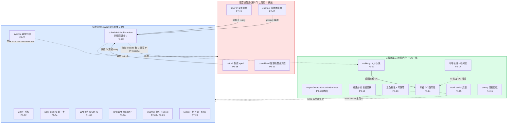
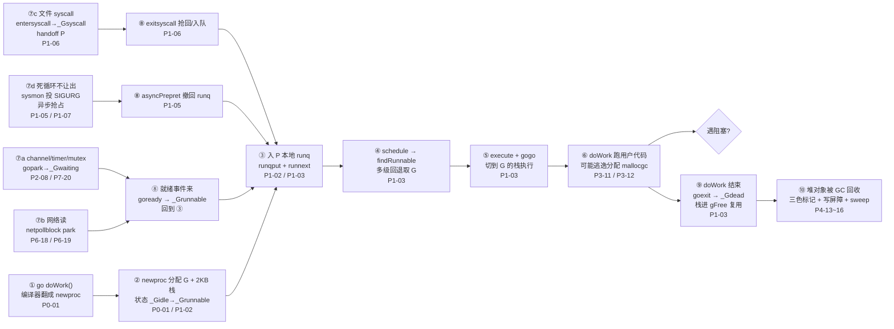

# 附录 A · 全景脉络:把全书钉成一张可放映的图

> 篇:附录(全书收束)
> 主线呼应:前面 21 章,我们把 Go runtime 拆成调度执行、阻塞唤醒、支撑地基三大块,一块一块钻了进去。这种"逐章钻"的写法换来深度,代价是读者容易"只见树木,不见森林"——读到最后,反而讲不清一个 goroutine 从 `go func` 到被 GC 回收的**端到端旅程**,也讲不清一次 GC 从触发到清扫的**完整周期**。这个附录就是全书合上之后的那张"可放映的全景图":把 21 章钉在两条时间线上(一条 goroutine 的一生,一条一次 GC 的全过程),再把贯穿全书的五条哲学收束成五句话。读完这一篇,你该能在脑子里放映出 Go runtime。

## 核心问题

**把全书 21 章收束成一张图,让读者合上书能在脑子里放映出"一个 goroutine 从 `go func` 到被 GC 回收"的端到端旅程,以及"一次 GC 的全过程"。三层(调度执行 / 阻塞唤醒 / 支撑地基)如何咬合成一个整体?五条贯穿哲学如何回扣到具体章节?**

读完本附录你会明白:

1. 全书的三层结构怎么咬合:**调度执行**(GMP 让就绪 G 跑)和**阻塞唤醒**(netpoll/sysmon/timer/channel 让阻塞 G 就绪)是两条腿,**支撑地基**(malloc/GC/栈)是这两条腿踩的地。
2. 一个 goroutine 从 `go func` 到被 GC 回收,完整经历哪些驿站,每个驿站钉在全书哪一章。
3. 一次 GC 从触发到清扫的全过程,四阶段流水线 + 两次亚毫秒 STW + mark assist 反压 + lazy sweep,各钉在哪一章。
4. 五条贯穿哲学(少量 M 驱动海量 G / 阻塞不阻塞线程 / 分层缓存换无锁快路径 / STW 最小化的执念 / 双璧——语言内置 vs 库级)分别回扣哪些章节,以及它们为什么是"取舍"而非"免费午餐"。

> 逃生阀:这是收束章,不引入新源码细节。如果某条哲学你想看它的源码展开,附录每条都标了回扣的具体章节,翻回去重读即可。本附录的全部价值,在于把散落的 21 章钉成一个整体——读它之前最好已经读过主干章节,否则它会变成一张"看不懂的地图"。

---

## A.1 一句话点破

> **Go runtime 不是一堆独立机制的拼盘,而是一台精密咬合的机器:GMP 调度器是发动机,netpoll/sysmon 是把阻塞 G 喂回发动机的进料口,malloc/GC/栈是发动机踩的地基。这台机器的全部设计,都在回答同一个问题——"怎么用极少的 OS 线程,高效驱动海量 goroutine,并让阻塞不阻塞线程、让 GC 不打断业务"。21 章是这个问题的 21 个切面,这个附录把它们钉回原位。**

这是结论,不是理由。本附录倒过来拆:先把三层结构咬合的全景图画出来,再沿着"一个 goroutine 的一生"这条时间线把各章钉上去,然后沿"一次 GC 的全过程"再钉一遍,最后把五条哲学收束成五句话。

---

## A.2 三层全景图:发动机、进料口、地基

全书第一性原理是:**少量 M 驱动海量 G,阻塞不阻塞线程,GC 不打断业务**。这句话拆成三层,正好对应全书的三大块。下面这张图把三层和它们的咬合关系一次画清。

三层的咬合关系,有五条主线最值得记住:

1. **sysmon 是跨层的中介**:它在调度执行层(L1),却同时往 L2(触发 netpoll)、L3(force GC)发号施令。它是唯一一条不绑 P 的线程,因此能脱离 GC/调度独立兜底(第 7 章)。
2. **阻塞唤醒层是调度执行层的"进料口"**:netpoll/timer/channel 把阻塞 G 变成就绪 G,通过 `goready`/`injectglist` 灌回 runq;调度执行层的 `findRunnable` 把它们取出来跑。两层靠"runq"这个共享数据结构咬合。
3. **malloc 是 GC 的触发器**:每次堆分配都检查 `gcTriggerHeap`,分配到一定量就启动 GC(第 11 章)。这条线把 L3 的内存分配和 L3 的 GC 直接耦合——你分得多,就 GC 得多。
4. **GC 用 STW 冻结 L1**:并发 GC 的两次极短 STW,本质是"把所有 P 推到 `_Pgcstop`,让 L1 的调度循环暂停"(第 14 章)。L1 和 L3 靠"phase 切换"这个全局屏障点协调。
5. **L1 每次 `execute` 都要 L3 的 mcache**:调度循环取一个 G 跑,前提是 P 的 mcache 可用(给 G 分配小对象用)。P 这个结构同时是 L1 的"本地 runq 持有者"和 L3 的"mcache 持有者"——P 是连接 L1 和 L3 的物理钉子(第 2 章)。

> **钉死这件事**:这三层不是平行模块,而是咬合的齿轮。任何一层的机制,都能问出三个问题——它服务于"让就绪 G 跑"(L1),还是"让阻塞 G 就绪"(L2),还是"支撑这两件事"(L3)?全书 21 章每一章都落在这三个答案之一,任何机制迷路了,回到这张图问这三个问题。

---

## A.3 一个 goroutine 的端到端旅程:把各章钉在时间线上

第一性原理说,Go runtime 让"开一个 goroutine 像开一个函数一样便宜"。这一节把这句话拆成一条**端到端时间线**:`go func` → 创建 G → 入 runq → 被调度 → 切栈执行 → 遇阻塞让出 → 被唤醒重跑 → 结束 → 被 GC 回收。把全书各章钉在这条线上。

逐站解读这条时间线,每站回扣对应章节的核心机制:

**① `go doWork()`**:这是用户写的一行。编译器把它翻成对 [`newproc`](../go/src/runtime/proc.go#L5334) 的调用,不是创建 OS 线程(第 1 章 P0-01)。

**② `newproc` 创建 G**:`newproc` 分配一个 G 结构 + 一个 2KB 初始栈(第 17 章 P5-17 详讲这块栈怎么按需增长),把入口设成 `doWork`,状态从 `_Gidle` 翻到 `_Grunnable`(第 2 章 P1-02 讲 G 的状态机)。

**③ 入 P 本地 runq**:新 G 通过 [`runqput`](../go/src/runtime/proc.go#L7529) 塞进当前 P 的本地 runq(无锁环形数组,256 槽),或塞进 `runnext` 插队槽(第 2 章 P1-02 技巧一、第 3 章 P1-03 的 runqget)。

**④ `schedule` → `findRunnable`**:某条 M 的调度循环 [`schedule`](../go/src/runtime/proc.go#L4150) 调 [`findRunnable`](../go/src/runtime/proc.go#L3404),按"本地 runq → 全局 runq → netpoll(非阻塞)→ 偷别的 P → GC idle → park M"的多级回退找一个就绪 G(第 3 章 P1-03)。

**⑤ `execute` + `gogo` 切栈执行**:[`execute`](../go/src/runtime/proc.go#L3346) 把 G 状态 CAS 成 `_Grunning`,调汇编 [`gogo`](../go/src/runtime/asm_amd64.s#L402) 切到 G 的栈上,`doWork` 开始跑用户代码(第 3 章 P1-03 的栈切换汇编)。

**⑥ `doWork` 跑用户代码**:这一段是 G 真正干活。它可能 `make`/`new` 对象,走 [`mallocgc`](../go/src/runtime/malloc.go#L1067) 的三条道(tiny/small/large,第 11 章 P3-11),其中有些变量逃逸到堆、有些留在栈(第 12 章 P3-12 逃逸分析)。

**⑦ 遇阻塞**:这是分叉路口,G 阻塞的方式决定了它走哪条路(第 6 章 P1-06 把这四条路画成一张分叉图):

- **⑦a channel / timer / mutex 阻塞**:G 走 [`gopark`](../go/src/runtime/proc.go) 翻成 `_Gwaiting`,从 M 上摘下来,M 立刻去 `schedule` 取下一个 G。G 在内存里"睡觉",等就绪事件(第 8 章 P2-08 channel、第 20 章 P7-20 mutex/timer)。
- **⑦b 网络读阻塞**:G 调 `conn.Read` 没数据,经 `internal/poll` 拿到 `EAGAIN`,进 `runtime_pollWait`→`netpollblock`→`gopark`,fd 注册进 epoll(第 18 章 P6-18、第 19 章 P6-19)。
- **⑦c 文件 syscall 阻塞**:G 进 [`entersyscall`](../go/src/runtime/proc.go#L4776) 翻成 `_Gsyscall`,M 跟着 G 一起躺进内核,但 P 可以被 sysmon 抽走(`handoffp`)交给别的 M(第 6 章 P1-06)。
- **⑦d 死循环不让出**:G 既不阻塞也不结束,runtime 靠 sysmon 检测到它跑超过 10ms,给它那条线程投 `SIGURG`,在几乎任意安全点打断它(第 5 章 P1-05、第 7 章 P1-07)。

**⑧ 就绪后重入 runq**:四种阻塞方式对应四种唤醒源,但都汇到同一个动作——把 G 翻回 `_Grunnable`,塞回 runq:

- channel/timer/mutex:别的 G 主动"完成"操作时调 [`goready`](../go/src/runtime/proc.go) 唤醒等待者(第 8 章 P2-08、第 20 章 P7-20)。
- 网络读:epoll_wait 返回就绪 fd,`netpollready` 把对应的 G 取出 `ready`(第 18 章 P6-18)。
- 文件 syscall 返回:[`exitsyscall`](../go/src/runtime/proc.go#L4856) 三级回退抢回 P 或入队(第 6 章 P1-06)。
- 被异步抢占:`asyncPreempt` 汇编保存所有寄存器,把 G 撤回 runq(第 5 章 P1-05)。

然后回到 ③,`schedule` 再取它跑。一个 G 可能在这条"调度 → 阻塞 → 唤醒 → 调度"的环上转很多圈。

**⑨ `doWork` 结束**:G 跑完用户代码,调 [`goexit1`](../go/src/runtime/proc.go#L4490) → `mcall(goexit0)`,在 g0 上把 G 状态翻成 `_Gdead`,它的栈进 `gFree` 复用(下一个 `newproc` 可能领它),但 G 结构留在 `allgs`(第 3 章 P1-03 讲 goexit0,第 2 章 P1-02 讲 allgs 只增不减)。

**⑩ 堆对象被 GC 回收**:G 死了,但它运行时分配在堆上的对象(逃逸的那些)还活着,等 GC 来收。这引出下一条时间线——一次 GC 的全过程。

> **钉死这件事**:这条时间线就是全书主线的物化。任何一个 Go 程序,任何一个 goroutine,都在这条线上反复走。读这本书的回报,就是从此你能"看见"这条线:写一行 `go func` 时知道 ①②③ 在发生,写 `ch <- x` 时知道 ⑦a 在发生,调 `conn.Read` 时知道 ⑦b 在发生。runtime 不再是黑盒。

---

## A.4 一次 GC 的全过程:四阶段流水线

第一性原理的第三句是"GC 不打断业务"。这一节把这句拆成一条**一次 GC 的完整周期**:触发 → 标记准备(STW)→ 并发标记 → 标记终止(STW)→ 并发清扫。把第 4 篇(P4-13~16)四章钉在这条线上。

```mermaid
flowchart LR
    T["触发<br/>gcTriggerHeap / gcTriggerTime / gcTriggerCycle<br/>P4-14"]
    subgraph STW1["① Sweep termination(STW 亚毫秒)"]
        S1["收尾上轮清扫<br/>finishsweep_m"]
        S2["setGCPhase _GCmark<br/>开写屏障"]
        S3["gcPrepareMarkRoots<br/>切根块"]
        S4["起后台 mark worker<br/>dedicated/fractional/idle"]
    end
    subgraph MARK["② Concurrent mark(并发, 毫秒~百毫秒)"]
        M1["后台 mark worker<br/>25% CPU 扫根和堆<br/>P4-14"]
        M2["mark assist 反压<br/>分配者欠债协助<br/>P4-15"]
        M3["写屏障挡漏标<br/>wbBuf 批量 flush<br/>P4-13"]
        M4["ragged barrier<br/>参差屏障确认标完"]
    end
    subgraph STW2["③ Mark termination(STW 亚毫秒)"]
        E1["确认无残留工作"]
        E2["关写屏障<br/>setGCPhase _GCoff"]
        E3["gcMark 复核统计"]
    end
    subgraph SWEEP["④ Concurrent sweep(并发, 整下一周期)"]
        W1["翻代纪<br/>mheap_.sweepgen += 2<br/>P4-16"]
        W2["bgsweep 后台悠扫"]
        W3["lazy sweep<br/>分配时按需扫"]
        W4["归还空闲页"]
    end

    T --> STW1 --> MARK --> STW2 --> SWEEP
    SWEEP -.下一轮触发.-> T
```

逐阶段解读,每阶段钉章节:

**触发**(第 14 章 P4-14):GC 不是定时启动,而是由三种触发器 [`gcTrigger`](../go/src/runtime/mgc.go) 决定——`gcTriggerHeap`(堆涨到下次目标,由 `mallocgc` 检查,第 11 章 P3-11)、`gcTriggerTime`(距上次 GC 超过 2 分钟,由 sysmon 检查,第 7 章 P1-07)、`gcTriggerCycle`(强制每 N 个周期跑一次)。最常见的触发源是 `gcTriggerHeap`——这把"分配"和"GC"耦合,分得快就 GC 得快。

**① Sweep termination(标记准备 STW)**:这是第一次 STW,亚毫秒级。它干四件**轻量但必须全局一致**的活:收尾上一轮没扫完的清扫([`finishsweep_m`](../go/src/runtime/mgc.go))、`setGCPhase(_GCmark)` 开启写屏障、`gcPrepareMarkRoots` 把根(栈、全局变量、寄存器)切成可并发扫的块、启动后台 mark worker。STW 短不是因为干得快,而是因为这些活**本来就很轻**(第 14 章 P4-14)。

**② Concurrent mark(并发标记)**:这是 GC 的主战场,和业务并发跑,持续毫秒到百毫秒。三个机制合力把"标完"这件事做 sound:

- **后台 mark worker**:占约 25% GOMAXPROCS 的 CPU,分三种模式(dedicated 全程跑 / fractional 按比例跑 / idle 仅空闲时跑)扫根和堆(第 14 章 P4-14)。
- **mark assist 反压**:分配太快的 G 被强制协助标记,把扫描工作摊给分配者,防止后台标不过来堆涨到 OOM(第 15 章 P4-15)。
- **写屏障挡漏标**:业务在标记期间改指针,写屏障把"可能被 GC 看漏"的对象染灰,堵住并发标记的漏标漏洞(第 13 章 P4-13)。Go 1.8 起用混合屏障(Dijkstra + Yuasa),只需在 STW 里扫一次栈,后续栈变化靠写屏障追踪。

**③ Mark termination(标记终止 STW)**:这是第二次 STW,亚毫秒级。它干三件事:`gcMarkDone` 的 ragged barrier(参差屏障)确认所有 mark worker 都没残留工作、关掉写屏障 `setGCPhase(_GCoff)`、`gcMark` 复核统计本轮存活字节数(用于算下一轮的 heapGoal)。这两次 STW 都亚毫秒,是 Go 团队"把工作从 STW 往并发阶段搬"的工程竞赛的成果(第 14 章 P4-14)。

**④ Concurrent sweep(并发清扫)**:翻代纪 `mheap_.sweepgen += 2`(这是 STW 里唯一和清扫相关的动作,极快),真正的清扫在业务恢复运行后慢慢做——后台 `bgsweep` 悠着扫 + 分配路径 `cacheSpan` 按需扫(lazy sweep)。`allocBits`/`gcmarkBits` 交接,没人占的 slot 还给分配器,整页没人用的 mspan 还给 mheap(第 16 章 P4-16)。

> **钉死这件事**:一次 GC 的全过程,本质是"两次极短 STW 夹一次长并发标记 + 一次长并发清扫"。短 STW 不是因为 GC 干得快,而是因为 STW 里几乎不干什么——所有重活(扫堆、扫栈、清扫)都搬到并发阶段了。这条线是 Go "亚毫秒 GC"承诺的物理实现。

---

## A.5 五条贯穿哲学:回扣全书

全书 21 章,每个机制都是一个具体问题的解。但如果你退后一步看,这些机制背后共享五条哲学——它们是 Go runtime 设计取舍的"宪法"。这一节把五条哲学收束,每条回扣具体章节,并说清它**牺牲了什么换来了什么**。

### 哲学一:少量 M 驱动海量 G——P 这个"工作台"的发明

**回扣章节**:P0-01(为什么 goroutine 便宜)、P1-02(G/M/P 结构)、P1-03(schedule)、P1-04(work-stealing)。

**这条哲学**:OS 线程太贵(创建毫秒级、切换微秒级、每条 MB 级栈),不能"一个并发单元配一条线程"。Go 的解法是发明 **P(processor)** 这个介于 G 和 M 之间的角色:P 数量 = GOMAXPROCS(锁死),M 可以比 P 多(阻塞溢出时新 M 接 P)。P 持有本地 runq 和 mcache,让正常调度路径几乎无锁。

**牺牲了什么**:多了一个角色 P,概念上比"只有线程和任务"复杂;`GOMAXPROCS` 是个手动调的参数,默认是核数但极端场景要调。

**换来了什么**:海量 G 可以在少量 M 上跑,内存开销从"每 G 一条 MB 级栈"降到"每 G 一个 2KB 栈 + 一个 G 结构"。work-stealing 在 P 之间做负载均衡,无锁环形 runq 让多核扩展性接近线性。这是 Go 能扛百万并发的物理基础。

### 哲学二:阻塞不阻塞线程——park 和 handoff 两套机制

**回扣章节**:P1-06(syscall handoff)、P2-08(channel)、P6-18/P6-19(netpoll)、P7-20(mutex/timer)、P1-07(sysmon)。

**这条哲学**:goroutine 会阻塞(channel 等、网络读、文件读、sleep、mutex),但 runtime 不能让那条 OS 线程跟着干等——否则阻塞的 G 一多,线程数爆炸。Go 的解法分两套,分界线是"runtime 能不能插手":

- **能插手的阻塞**(channel/timer/mutex/网络):走 `gopark`,G 翻 `_Gwaiting` 从 M 摘下来,M 立刻去跑别的 G;就绪事件来了 `goready` 把 G 灌回 runq。
- **不能插手的阻塞**(文件 syscall/futex/cgo):走 `handoff P`,G 翻 `_Gsyscall`,M 跟着 G 躺进内核,但 P 被 sysmon 抽走给别的 M。

**牺牲了什么**:实现复杂度爆炸——两套机制(park 和 handoff)、`_Gscan` 位协议、netpoll 集成 epoll、sysmon 兜底。runtime 源码里大量篇幅在处理这两套机制的边界和竞态。

**换来了什么**:"写同步阻塞代码、得异步性能"——用户写 `conn.Read` 像写阻塞调用,但 runtime 在底下把它变成 park + epoll 唤醒。这是 Go 区别于 Node.js 回调地狱、Java Future 链式调用的最大卖点。阻塞不再是性能杀手。

### 哲学三:分层缓存换无锁快路径——TCMalloc 思想

**回扣章节**:P3-10(mspan/mcache/mcentral/mheap,待补)、P3-11(mallocgc)、P3-12(逃逸分析)、P2-08(channel 的 P 本地 sudogcache)。

**这条哲学**:多核并发下,共享数据结构加锁是性能杀手。Go 仿 TCMalloc,把分配器做成**三级缓存**:P 本地 mcache(无锁)→ mcentral(按 size class 加锁)→ mheap(全局锁)。绝大多数分配命中 P 本地,不碰任何锁。

这条哲学不止用于内存分配,它贯穿整个 runtime:

- **本地 runq**(P 持有,无锁)vs **全局 runq**(加 `sched.lock`),第 2、3 章。
- **P 的 `sudogcache`**(channel 的 sudog 对象池,P 本地无锁),第 2、8 章。
- **P 的 `goidcache`**(goroutine ID 本地缓存),第 2 章。
- **P 的 `wbBuf`**(写屏障缓冲,批量 flush),第 13、14 章。

**牺牲了什么**:分层带来复杂度——`runqputslow` 在本地满时要搬一半去全局,`cacheSpan` 在本地空时要去 central 拿,sweepgen 双缓冲让"上一轮扫"和"下一轮标"不打架。每一层都有它的回退路径。

**换来了什么**:正常路径几乎无锁,P 之间互不踩脚。64 核机器上分配和调度都能线性扩展,锁竞争不再是瓶颈。这是 Go 在多核时代保持高性能的命脉。

### 哲学四:STW 最小化的执念——把工作从 STW 往并发搬

**回扣章节**:P4-13(三色+写屏障)、P4-14(并发 GC 阶段)、P4-15(mark assist)、P4-16(sweep)、P5-17(栈拷贝靠 `_Gscan` 并发扫)、P1-05(异步抢占让 GC 能停 world)。

**这条哲学**:Go 团队把 GC 停顿压到亚毫秒,不是靠某个聪明点子,而是靠几十处"把工作从 STW 挪出去"的累积。标记主体并发跑、扫栈靠 `suspendG` 并发跑、清扫并发跑;STW 里只剩"切 phase、开关屏障、flush 缓冲"这类轻量且确定的事。

这条哲学还延伸到 GC 的反压机制:

- **mark assist**(第 15 章)把"标不过来"的风险从"STW 拖长"转移到"分配者协助",保住亚毫秒承诺。
- **异步抢占**(第 5 章)保证任意 G 都能被推进到安全点,GC 的 STW 不会被死循环 G 卡死——没有异步抢占,STW 可能从亚毫秒飙到秒级。

**牺牲了什么**:并发 GC 要和业务抢 CPU(后台 mark worker 占 25%);写屏障在标记阶段给每次堆指针写加开销;mark assist 让分配猛的 G 吞吐下降;扫栈的 `_Gscan` 协议让 G 状态机复杂化。这些都是"用 CPU 换低延迟"的代价。

**换来了什么**:亚毫秒级 GC 停顿。Go 程序在大堆下依然响应迅速,延迟敏感的服务(网关、交易、游戏)可用。这是 Go 相对 Java 早期 GC 的关键优势之一。

### 哲学五:双璧——语言内置协程 vs 库级异步

**回扣章节**:全书标 ★ 的章(P1-04 work-stealing、P2-08 channel、P5-17 栈拷贝、P6-18 netpoll、P7-20 Mutex)以及 P8-21(双璧对照总表,待补)。

**这条哲学**:Go runtime 和 Tokio 是"调度问题"在两种语言里的顶级解——一个是**语言内置协程**(Go:编译器 + runtime 协作,`go func` 是关键字,阻塞式 API + runtime 让出),一个是**库级异步**(Tokio:纯库 + 类型系统,`tokio::spawn` 是函数,`async/await` + `Future::poll` 显式)。两者目标相同(少量线程驱动海量并发),姿势截然不同。

几个关键对照点(贯穿各标 ★ 章):

| 维度 | Go runtime | Tokio | 对照章节 |
|---|---|---|---|
| 并发单元怎么造 | `go func`(关键字,创建 G) | `tokio::spawn`(函数,创建 Task) | P0-01 |
| work-stealing | 256 槽固定环形数组,偷一半 | Chase-Lev 双端队列,偷一半 | P1-04 |
| channel | 同步阻塞 + 环形 buf + 等待队列 | 异步 Future + mpsc/oneshot/broadcast | P2-08 |
| 阻塞不占线程 | runtime 自动 park + netpoll | `Future::poll` 返回 Pending + reactor | P6-18 |
| 栈与自引用 | 连续栈拷贝(运行时调整指针) | `Pin` 禁止移动(编译期保证) | P5-17 |
| 内存安全 | 并发 GC(运行时回收) | ownership + 编译期 + `Pin` | P4 篇 |
| 锁 | Mutex 自旋 + 信号量 + runtime | `tokio::sync::Mutex` 异步 + 优先级 | P7-20 |

**牺牲了什么**:Go 的代价是 runtime 庞大(GC、调度器、栈管理都塞进语言),启动开销、二进制体积都比 Tokio 大;阻塞式 API 在表达"复杂异步编排"(超时 + 重试 + 取消)时不如 `async/await` 直观。Tokio 的代价是 `async fn` 的传染性(函数签名要标 async)、`Pin` 的心智负担、无 GC 要手动管理生命周期。

**换来了什么**:Go 换来"写得像同步、跑得像异步"的最大红利——开发者心智最轻,适合写网络服务、CLI、并发胶水。Tokio 换来零开销抽象 + 编译期内存安全——适合写底层系统、高性能网络栈。两者没有绝对优劣,是两种哲学的极致,互为注脚。

> **钉死这件事**:这五条哲学不是孤立的,它们互相支撑。P 这个工作台(哲学一)既支撑了无锁快路径(哲学三,本地 runq/mcache),又支撑了阻塞不占线程(哲学二,P 可被 handoff)。并发 GC 的亚毫秒 STW(哲学四)依赖异步抢占(哲学五对照栏的 Go 特性)保证 STW 不被死循环卡死。读这本书的最终回报,是能在脑子里把这五条哲学和它们的互相支撑关系放映出来——那时 runtime 就不再是黑盒。

---

## 章末小结

这个附录把全书 21 章收束成一张可放映的图。我们做了三件事:画出三层全景图(调度执行 / 阻塞唤醒 / 支撑地基的咬合),把各章钉在两条时间线上(一个 goroutine 的一生 + 一次 GC 的全过程),把五条贯穿哲学收束成五句话并回扣章节。

回到全书的二分法:**调度执行(GMP 让就绪 G 跑)vs 阻塞唤醒(netpoll/sysmon/timer/channel 让阻塞 G 就绪)**,加上**支撑地基(malloc/GC/栈)**。全书 21 章每一章都落在这三个答案之一,任何机制迷路了,回到这个二分法问"它在让就绪 G 跑、让阻塞 G 就绪、还是支撑这两件事"。

### 五个"为什么"清单(全书收束版)

1. **为什么是 G/M/P 三层而不是两层?** P 这个"工作台"把本地 runq 和 mcache 私有化,让正常调度和分配路径几乎无锁(哲学一 + 哲学三)。只有 G/M 两层时所有 M 抢一个全局 runq,锁竞争吃掉性能。回扣 P1-02、P1-03、P3-10。

2. **为什么阻塞不阻塞线程?** runtime 分两套机制:能插手的阻塞(channel/timer/网络)走 `gopark` 把 G 从 M 摘下来,不能插手的阻塞(文件 syscall)走 handoff 把 P 从 M 抽走(哲学二)。回扣 P1-06、P2-08、P6-18、P6-19。

3. **为什么 GC 能做到亚毫秒 STW?** 不是某个聪明点子,而是几十处"把工作从 STW 搬到并发阶段"的累积:标记并发、扫栈并发、清扫并发,STW 里只剩切 phase 和开关屏障(哲学四)。回扣 P4-13~16。

4. **为什么分层缓存如此重要?** 多核并发下共享锁是性能杀手,P 本地缓存(mcache/runq/sudogcache/goidcache/wbBuf)让正常路径无锁,只有溢出和边界情况才碰全局锁(哲学三)。回扣 P1-02、P3-10、P3-11。

5. **为什么 Go 选语言内置协程而非库级异步?** 换"写得像同步、跑得像异步"的最大红利,开发者心智最轻(哲学五)。代价是 runtime 庞大。Tokio 选库级异步换零开销 + 编译期安全,代价是 async 传染性和 Pin 心智负担。两者是双璧。回扣标 ★ 章 + P8-21。

### 想继续深入往哪钻

- **源码地图**:全书的源码主战场是 [`../go/src/runtime/`](../go/src/runtime/) 这一个目录。按篇分:调度执行看 `runtime2.go`(结构)+ `proc.go`(逻辑)+ `asm_amd64.s`(切换汇编);channel 看 `chan.go`/`select.go`;内存看 `malloc.go`/`mcache.go`/`mcentral.go`/`mheap.go`/`mspan.go`;GC 看 `mgc.go`/`mgcmark.go`/`mgcsweep.go`/`mgcpacer.go`/`mbw_amd64.s`;栈看 `stack.go`;netpoll 看 `netpoll.go`/`netpoll_epoll.go`;timer 看 `time.go`;锁看 `src/sync/mutex.go` 和 `runtime/sema.go`。详细的阅读路线见附录 B。
- **观测 runtime**:`GODEBUG=schedtrace=1000` 打印调度状态(对应 A.3 的 runq/schedtick/nmspinning);`GODEBUG=gctrace=1` 打印每次 GC 的阶段耗时(对应 A.4 的四阶段);`go tool trace` 可视化每个 G 的时间线、GC 的 STW 片段、work-stealing 事件。这三个工具是"看见 runtime"的窗口,附录 B 详讲。
- **调参**:`GOMAXPROCS`(P 数量,哲学一)、`GOGC`/`GOMEMLIMIT`(GC 触发策略,哲学四)、`GODEBUG=asyncpreemptoff`(关异步抢占,看 P1-05)。调之前先懂机制,否则是盲调。
- **延伸对照**:把本书和《Tokio》对读(哲学五),能看清"调度"问题的本质和两种设计的取舍;附录 B 还给与 Java JVM(G1/ZGC)、Erlang VM(抢占式调度)的对照,理解 runtime 设计的多元宇宙。

### 引出下一章

这个附录把全书钉成了一张全景图。下一个附录(附录 B)换个角度:不再讲机制,而是讲**怎么读 `src/runtime` 源码、怎么用 `go tool trace` 观测 runtime、怎么调 `GOMAXPROCS`/`GOGC` 这些参数**,以及 Go runtime 和 Java JVM、Erlang VM 的对照。如果说附录 A 是"合上书放映全景",附录 B 就是"打开书自己往里钻"的地图。两本附录合起来,构成读这本书的"工具包"。

---

> 全书定位:附录 A(全景脉络,全书收束)。源码版本 Go 1.27(本地 master @ `6d1bcd10`,Version 常量见 `src/internal/goversion/goversion.go`)。本附录不引入新源码细节,所有锚点回扣全书 21 章。下一个附录:附录 B 源码阅读路线与延伸。
