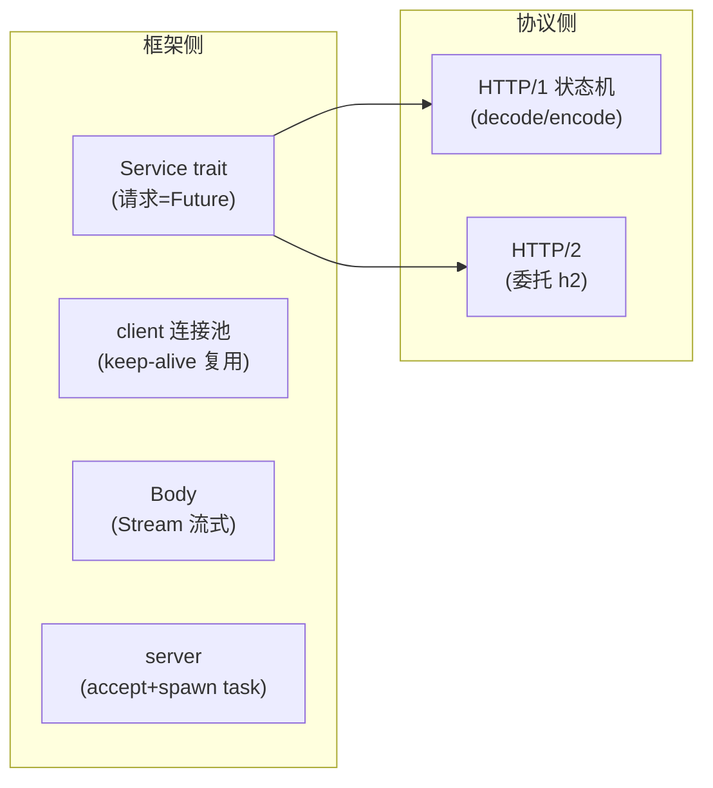
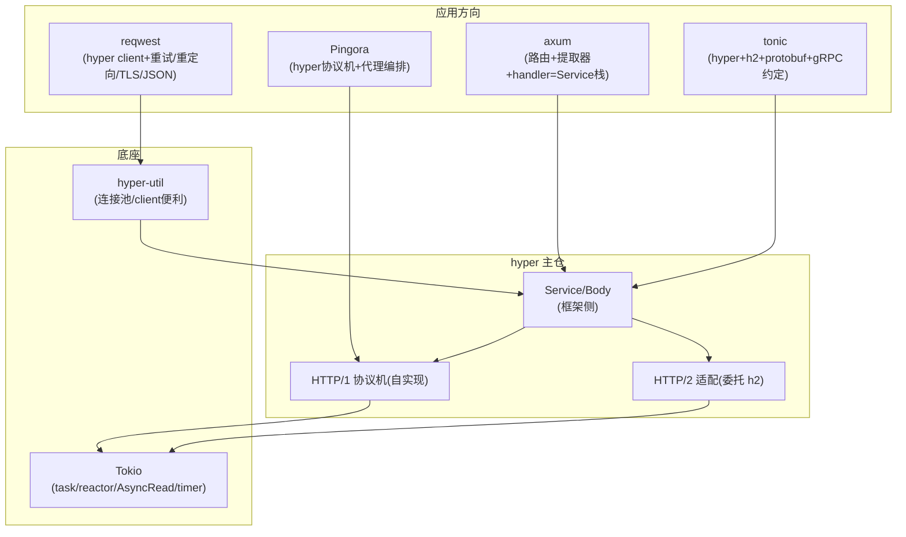

# 第 0 篇 · 第 1 章 · 第一性原理:为什么 Tokio 之上需要 hyper

> **核心问题**:你写 Rust 异步,底层是 Tokio。可 Tokio 给的是"异步运行时"(reactor + scheduler + task + timer),它**不懂 HTTP**——你拿 `tokio::net::TcpListener` 能 accept 一条 TCP 连接,但读进来的是一堆 HTTP 字节,Tokio 不会帮你把它们切成请求行、头部、body。那么,谁来把"HTTP 这道工序"装到 Tokio 这个运行时上?这就是 hyper 干的事。它凭什么成了 axum、reqwest、tonic、Pingora 的共同地基?它和《gRPC》那本的 chttp2(C++ 自实现 HTTP/2)又是什么关系?

> **读完本章你会明白**:
> 1. Tokio 给了什么(异步运行时)、缺了什么(HTTP 协议),以及为什么"运行时"和"协议库"必须分开两层。
> 2. hyper 干的事,本质是**把 HTTP 协议机(HTTP/1 状态机 + HTTP/2 多路复用)无缝建在 Tokio 之上**——这句话是全书一切设计的总开关。
> 3. 为什么"每个连接一个 Tokio task"是 hyper 的地基,以及它怎么承接《Tokio》那本讲透的运行时机制。
> 4. 为什么 hyper 用 `Service = Fn(Request) -> Future<Response>` 这个 trait 把"处理一个请求"抽象成一个 Future。
> 5. 全书为什么用"**协议侧 vs 框架侧**"二分法当骨架,20 章都是这两面的驿站。
> 6. hyper 在 Rust 异步栈的位置(Tokio 之上、axum/tonic 之下),以及它和 gRPC chttp2、Envoy HCM 的对照关系。

> **如果一读觉得太难**:先只记住三件事——① Tokio 给运行时不给 HTTP,hyper 把 HTTP 装上去;② 每个连接一个 Tokio task,协议机在 task 里跑,Service 把请求抽象成 Future;③ 全书一句话主线:**把 HTTP 协议机无缝建在 Tokio 异步运行时之上**,分协议侧(HTTP 怎么解析编码)和框架侧(Service/连接池/body)两面。

---

## 〇、一句话点破

> **Tokio 是一个异步运行时——它能高效地调度成千上万个 task、监听海量 IO,但它不懂任何应用层协议。hyper 干的事,就是用 Tokio 提供的"task + AsyncRead/AsyncWrite + Future + Stream",把 HTTP/1 状态机和 HTTP/2 多路复用装上去,让"处理一个 HTTP 请求"变成一个 Future。**

这是结论,不是理由。本章倒过来拆:先讲 Tokio 给了什么、缺了什么,再讲 hyper 怎么把协议机装上去,然后讲它怎么承接 Tokio,最后讲它和 gRPC/Envoy 的对照。

---

## 一、Tokio 给了什么、缺了什么

### 运行时 vs 协议:两层必须分开

要讲清为什么需要 hyper,先得看清 Tokio 这一层**管什么、不管什么**。

Tokio(《Tokio 设计与实现》那本已拆透)给的是一个**异步运行时**:它管"怎么调度成千上万个 task"(scheduler + work-stealing)、"怎么监听海量 IO 就绪"(reactor + mio,底层 epoll/kqueue)、"怎么管理时间"(timer 时间轮)、"怎么让 task 协作别霸占线程"(budget 让出)。有了它,你能写出 `async fn`、`tokio::spawn`、`tokio::net::TcpListener`。

但 Tokio **故意不碰应用层协议**。你用 `TcpListener::accept` 拿到一条连接,`tokio::io::AsyncRead` 能帮你把字节读进 buffer——可读进来的是 **HTTP 的原始字节流**(`GET / HTTP/1.1\r\nHost: ...\r\n\r\n...`),Tokio 不会告诉你"这是一个 GET 请求、path 是 /、header 有哪些、body 从哪到哪"。把字节切成结构化的 HTTP 请求,是**协议层**的事,不是运行时的事。

> **钉死这件事**:这是一个有意的分层。运行时(Tokio)只管"异步原语"(task/IO/timer/Future/Stream),协议层(hyper)只管"把某种协议的字节流变成结构化消息"。两层分开,运行时可以被任何协议复用(HTTP、gRPC、Redis、自定义协议都建在同一个 Tokio 上),协议库也可以在别的运行时上跑(虽然 hyper 实践上紧贴 Tokio)。这是 Unix "机制与策略分离"在异步栈上的体现。

### 不分层会怎样:把协议焊死进运行时

如果不分层,会怎样?想象一个"大一统运行时",既管调度又内置 HTTP——那它就只适合 HTTP 一个协议,换 gRPC/Redis 又得重写一个运行时。或者反过来,运行时啥都不管,每个应用自己从 TCP 字节开始写 HTTP 解析——那每个 Rust Web 服务都得重造一遍 HTTP 协议机的轮子,而且大概率写错(HTTP/1 的边界、chunked、keep-alive、HTTP/2 的流控,全是坑)。

这两个反例不是空想,它们在真实系统里都出现过。**焊死派**的典型是某些语言"自带 HTTP server"的早期运行时:运行时和 HTTP 实现绑在一起,当你想做 gRPC、想做自定义 RPC、想换一个更快的 HTTP 实现,都卡死在"运行时自己那套 HTTP"上,只能 fork 整个运行时改。**重造派**的典型是任何一门新语言诞生初期的 Web 生态:每写一个 Web 框架,作者都要从 socket 字节开始重新啃一遍 `Content-Length` 和 `Transfer-Encoding: chunked` 的边界、啃一遍 HTTP/2 的 HPACK,然后一遍遍地犯别人犯过的错(连接没复用、半包读错、`Expect: 100-continue` 处理错)。两条路的共同病根只有一个:**没有把"机制"(怎么把等待从线程里解放)和"策略"(HTTP 协议怎么解析编码)切开**。

> **机制与策略分离,在别的系统长什么样**:这套分层直觉不是 Tokio 发明的,它贯穿整个系统设计。Linux 内核把"调度器机制"(调度类、运行队列、负载均衡)和"调度策略"(CFS/EEVDF 怎么算时间片)分开,所以同一套调度框架能挂 RT/deadline/EEVDF 多种策略——《Linux 调度器》那本拆的就是这件事。数据库把"存取机制"(B+ 树页、buffer pool、WAL)和"查询策略"(优化器怎么选执行计划)分开,所以同一个存储引擎能喂 OLTP 也能喂 OLAP——《MySQL·InnoDB》拆的就是这条缝。网络协议栈自己更是这门分层的祖师爷:TCP 不关心你跑 HTTP 还是 SMTP,IP 不关心你跑 TCP 还是 UDP,每一层只管自己的"机制",把"上面跑什么策略"留给上一层。Tokio 之于 hyper,就是这条七层模型的"传输层 → 应用层"切线在异步 Rust 里的重演:Tokio 是机制层(怎么不阻塞地等待),hyper 是策略层(HTTP 这套规则怎么解析编码)。理解了这一层,你就能把"为什么 hyper 不能合并进 Tokio"当成一个系统设计的常识问题,而不是某个 Rust 工程师的个人偏好。

> **不这样会怎样**:运行时和协议不分开,要么运行时被焊死成一个协议专用(不可复用),要么每个应用重造协议轮子(重复且易错)。hyper 的存在,就是让"HTTP 协议机"被实现**一次**,然后所有 Rust HTTP 应用(axum/reqwest/tonic/Pingora)都站在它肩膀上。

---

## 二、hyper 做的事:把协议机装在运行时上

那么 hyper 具体怎么"装"?答案是三件事,对应它源码的三大块:

### 第一件:HTTP/1 协议机(自己实现)

HTTP/1 不复杂但细节多。hyper 在 `src/proto/h1/` 下**自己用 Rust 实现了一套 HTTP/1 协议机**:从 `tokio::io::AsyncRead` 读字节进来,用状态机(`decode.rs`)逐字节推进,把字节切成"请求行 / 头部 / body";响应再用状态机(`encode.rs`)编回字节写出去。一条连接上可以连续处理多个请求(keep-alive),由 `dispatch.rs` 循环驱动。

这一块是 hyper 的**协议侧招牌**——HTTP/1 不依赖外部,纯 Rust 自己啃,讲得透。

### 第二件:HTTP/2(委托 h2 crate)

HTTP/2 复杂得多(帧/流/HPACK/流控)。hyper 不自己重造,而是**委托 `h2` crate**——h2 是 Rust 生态另一个专门实现 HTTP/2 的库。hyper 在 `src/proto/h2/` 下做**适配层**,把"一个 hyper 请求"映射成"一条 HTTP/2 stream",把 h2 的 `SendRequest`/`RequestStream` 桥接成 hyper 的 API。

> **对照《gRPC》**:gRPC 的 C++ core 自己用 C 实现了 HTTP/2(叫 chttp2,是《gRPC》第 2 篇的招牌);hyper 委托 h2 crate。两种语言、两种取舍:C++ core 选择"自己实现全套协议栈"(为了在任何语言里都能用、协议层讲得透);hyper 选择"委托成熟的 h2"(Rust 生态分工)。本书第 3 篇对照讲,你会同时深化两本。

### 第三件:框架(Service/连接池/body)

有了协议机,还得把它组织成**能用的 client/server**。hyper 在 `src/service/`、`src/client/`、`src/server/`、`src/body/` 下做了这一层:Service trait 把"处理一个请求"抽象成 Future、client 做连接池复用 keep-alive 连接、body 基于 Stream 流式。这是 hyper 的**框架侧**。

> **钉死这件事**:hyper = HTTP/1 协议机(自实现)+ HTTP/2(h2 委托)+ 框架(Service/连接池/body)。这三块全建在 Tokio 的 task/AsyncRead/Future/Stream 上。全书 20 章,就是这三块的展开:第 2 篇拆 HTTP/1 协议机、第 3 篇拆 HTTP/2、第 1/4/5 篇拆框架。

---

## 三、每个连接一个 task:hyper 怎么用 Tokio(承接)

hyper 最核心的工程决策,是**每条连接跑在一个 Tokio task 里**。这句话承接了《Tokio》那本的主线("把等待从占用线程里解放"),值得单独钉死。

### 一连接一 task

当 hyper 的 server `accept` 到一条 TCP 连接(或 client 建立一条连接),它就 `tokio::spawn` 一个 task,这个 task 的整个生命周期就是"在这条连接上跑协议机循环":读字节 → 解析请求 → 交给 Service → 写响应 → 再读下一条(keep-alive)。

这个 task 里的"读字节""等响应"全是 `await`——当连接没数据时,task 就**挂起**(返回 `Poll::Pending`),让出线程给别的 task;数据来了,Tokio 的 reactor(epoll/kqueue)唤醒它继续。一条连接独占一个线程?不——成千上万个连接的 task 共享一小撮线程,靠 Tokio 的 M:N 调度。

### 量感:一小撮线程扛十万连接

这种"一连接一 task + M:N 调度"的真实效果是什么样?给个量感:一台普通服务器,你把 Tokio runtime 配成 8 个 worker 线程(对应 8 个 CPU 核心),就能轻松扛住**十万级别的长连接**。怎么做到的?不是 8 个线程里有 10 万条线程在跑(那内核调度早就爆炸了),而是 10 万个 task 各自挂在 `AsyncRead::poll_read` 上返回 `Pending`,8 个 worker 线程大部分时间都在 epoll_wait 等待少量真正有数据的连接,被唤醒后才去 poll 对应的 task。10 万条连接里,大多数时间处于空闲,真正同时在跑协议机的可能就几百上千个——这正是 M:N 调度的红利:**不是每个连接都要占一个内核线程,而是把"占着线程等"变成"挂起 task 让出线程"**。

> **承接《Tokio》**:这一段全用《Tokio》讲透的机制。task 的 spawn 与 work-stealing 调度,看《Tokio》讲调度器的章节;reactor 监听 IO 就绪(mio edge-triggered epoll),看《Tokio》讲 reactor 的章节;`await` 的挂起与唤醒(`Poll`/`Waker`,标准库 `core::task`),看《Tokio》讲 Future 的章节;budget 让出(=128,防一个 task 在循环里霸占线程不交接调度),看《Tokio》讲 budget 的章节。这些在《Tokio》已拆到源码级,本书**一句带过 + 指路**,篇幅全留 hyper 怎么在这些原语上搭协议机。换句话说,《Tokio》讲的是"运行时这台发动机怎么造",本书讲的是"把 HTTP 协议机这台机器装上发动机、让它真正拉货"。

### 不这样会怎样:一连接一线程

如果像老式同步服务器那样"一连接一线程",10 万并发就要 10 万线程,内核调度爆炸、栈内存爆炸(默认 8MB 栈 × 10 万 = 800GB 虚拟内存,光栈就把地址空间撑爆)。hyper 靠"一连接一 task + Tokio M:N 调度",用一小撮线程扛海量连接——这正是 Tokio 的价值,hyper 是它的最佳例证。**写 hyper,等于看"Tokio 这套运行时,撑起了一个什么样的真实高性能网络库"。**

---

## 四、Service:把"处理一个请求"抽象成一个 Future

hyper 最漂亮的抽象,是 `Service` trait:

```rust
// 简化示意,对齐 hyper 1.x 源码(src/service/service.rs)
trait Service<Request> {
    type Response;
    type Error;
    type Future: Future<Output = Result<Self::Response, Self::Error>>;
    fn call(&self, req: Request) -> Self::Future; // 注意:&self,且无 poll_ready
}
```

一个 Service 就是一个"能处理 Request、返回一个产出 Response 的 Future"的东西。你写的 axum handler、reqwest 的请求逻辑、tonic 的 gRPC 方法,最后都变成一个 Service。

为什么这么设计?因为"处理一个 HTTP 请求"**天然是异步的**——你可能要去查数据库、调下游、等 IO。把请求处理建模成 `Future<Output=Response>`,就能用 Rust 的 async/await 写,就能被 Tokio 调度。Service 把"业务逻辑"和"协议机"解耦:协议机负责把字节变成 Request、把 Response 变成字节,Service 负责在中间"算出 Response"。

> **钉死这件事**:Service 是 hyper 的"框架侧总开关"——它把"处理请求"抽象成一个 Future,让协议机和业务逻辑各管一段。注意 `call(&self)` 且**没有 `poll_ready`**(这是 hyper 1.0 删掉的,背压改走连接池/`in_flight` 槽/body Sender,不污染用户 trait)。这条签名的全部理由,P1-02 单开一章拆透,这里只钉死"它就是这么个 trait"。

> **承接《Tokio》**:Service 返回的 Future,就是《Tokio》讲透的 `core::future::Future`(poll-based + Waker)。本书讲 Service 怎么用 Future 解耦,不重讲 Future 机制。

---

## 五、协议侧 vs 框架侧:全书骨架

讲清了"装协议机"和"Service",全书骨架就出来了——**协议侧 vs 框架侧**。

hyper 的一切机制,要么在**协议侧**(HTTP 怎么解析编码),要么在**框架侧**(怎么组织成 client/server)。



- **协议侧**:HTTP/1 状态机(第 2 篇)、HTTP/2 via h2(第 3 篇)——决定"HTTP 字节怎么切、怎么编"。
- **框架侧**:Service(第 1 篇)、client 连接池(第 4 篇)、server(第 5 篇)、body/buffered IO(第 1/6 篇)——决定"怎么把协议机组织成可用的 client/server"。

> **钉死这件事**:**全书一句话主线——把 HTTP 协议机无缝建在 Tokio 异步运行时之上。** 任何一处看不懂 hyper 的某个机制,回到这两面问:"这是协议侧的(HTTP 解析/编码)、还是框架侧的(Service/连接池/body)?它怎么承接 Tokio?"这就是本书的**二分法**。

---

## 六、承接成网:hyper 不是孤岛

这本书和《Tokio》《gRPC》《Envoy》《内存分配器》是一张网。hyper 是 Rust 异步栈的**咽喉节点**。

### 承接《Tokio》(最紧密)

hyper 直接长在 Tokio 上。每连接一 task、IO 用 AsyncRead/AsyncWrite、body 是 Stream、Service 返回 Future、timer 用 tokio::time——hyper 的几乎每一行都用到 Tokio。读本书 = 复习深化《Tokio》,看"运行时怎么被一个真实高性能库用起来"。承接铁律:Tokio 讲透的一句带过,篇幅留 hyper 独有。

### 承接《gRPC》(HTTP/2 对照)

gRPC C++ core 自实现 HTTP/2(chttp2),hyper 委托 h2。本书第 3 篇对照"HTTP/2 在真实库里怎么落地",HTTP/2 协议机制(帧/流/HPACK/流控)在《gRPC》第 2 篇已拆透,一句带过,篇幅留"hyper 怎么用 h2 把请求映射成 stream"。

### 横连《Envoy》《内存分配器》

- HTTP/1 状态机对照 Envoy HCM(HTTP Connection Manager,你已立项的《Envoy》第 P3 篇)——两种语言实现 HTTP/1 解析的对照。
- `bytes::Bytes` 引用计数零拷贝,对照《内存分配器》和 gRPC slice。

### 托底整个 Rust 异步 Web 栈

这是本节要展开的核心:hyper 不是"被某个框架依赖",而是**被整个 Rust 异步 Web 生态同时依赖**——axum、reqwest、tonic、Pingora 四个最主流的方向,全都建在 hyper 上。这四个不是简单"调 hyper 的 API",它们各自把 hyper 当成地基,在上面盖了不同形状的房子。把它讲细,"hyper 是地基"才从口号变成可验证的映射:

- **axum(Web 服务框架)**:axum 的核心是"路由 + 提取器 + handler"。它没自己写 HTTP 协议机,而是直接用 hyper 的 server 接受连接、用 hyper 的协议机解析请求,然后把"把 `Request` 交给谁处理"这件事用一个 **Service**(具体说是 `tower::Service`,经 hyper-util 桥接到 hyper 的 `Service`)表达——axum 的路由表本身就是一个 Service,它根据 path 把请求分发给对应的 handler,handler 的返回值再被 hyper 的协议机编回字节。axum 的中间件(tower 的 `Layer`/`Service` 链)就是给这个 Service 套圈,鉴权、日志、压缩每一层都是一个 Service 包装另一层 Service。**所以 axum = hyper server + 一个会路由的 Service 栈**。
- **reqwest(HTTP client)**:reqwest 是"人肉友好的 HTTP client"。它底层就是 hyper 的 client 连接池(实际在 `hyper-util` 里),但 hyper 的 client 只懂"给一个 `http::Request`、拿一个 `http::Response`",reqwest 在上面加了:URL 解析、重试策略、重定向跟随、cookie store、超时、TLS 配置、JSON 反序列化这些"用起来顺手"的东西。**所以 reqwest = hyper client + 连接池 + 一堆上层便利逻辑**。
- **tonic(gRPC over Rust)**:tonic 把 gRPC 建在 hyper + h2 上。gRPC 本身就是 HTTP/2 协议(《gRPC》拆透:POST 一个 path,body 是 protobuf 帧,响应也是 protobuf流),tonic 拿 hyper 当传输层,在 hyper 的 HTTP/2 连接上跑 gRPC 的 path 约定 + protobuf 序列化/反序列化 + 流式 RPC。**所以 tonic = hyper + h2 + protobuf 编解码 + gRPC 协议约定**。
- **Pingora(高性能代理)**:Pingora 是 Cloudflare 开源的 Rust 代理框架,它没有完整依赖 hyper 的 server,但**重做了 hyper 那套"连接管理 + HTTP 协议机"逻辑的代理侧**——具体说,它大量复用 hyper 的协议解析能力和 `bytes` 零拷贝,把代理的"收一个请求、转发、收一个响应、转发"循环建在这上面。**所以 Pingora = hyper 协议机 + 代理编排**。

这四个例子合起来证明一件事:**hyper 把 HTTP 协议机建在 Tokio 上之后,上面所有 Rust Web/gRPC/代理的需求,都能"复用同一套协议机 + 自己加特定逻辑"。** 没有这层地基,Rust 生态不会有今天这么整齐的 Web 栈。

下面这张图把"咽喉位置"可视化:hyper 卡在 Tokio 和上层框架之间,左边是协议机自实现/委托两条腿,右边是上层四个方向各自加的逻辑。



(注:hyper 1.0 把 client 连接池/便利封装拆到了独立的 `hyper-util` crate,这是 1.0 的"三分重构"——主仓只留协议机 + Service + 单连接 client/server,P6-19 单开一章拆这次重构的 why 和 how。这里先有个位置感就行。)

> **钉死这件事**:hyper 是 Rust 异步栈的咽喉——上承 axum/tonic/reqwest/Pingora,下接 Tokio,左右对照 gRPC/Envoy。读本书,等于把《Tokio》《gRPC》一起复习深化,并给整个 Rust 异步 Web 栈铺了底。

---

## 七、技巧精解:两个第一性洞察

本章是概念定调章。有两个最硬核的第一性洞察值得单独钉死。

### 洞察一:协议机 × 运行时——为什么 hyper 既是协议库又是 Tokio 的"最佳应用"

很多人把 hyper 当成"HTTP 库"——对,但只对了一半。hyper 的精髓在于它把**协议机**(有状态的、逐字节的 HTTP/1 解析)和**异步运行时**(Tokio 的 task/IO/Future)**无缝拼合**:协议机的每一步"读字节"都是 `AsyncRead::poll_read`(可能 Pending 挂起),协议机本身被写成一个 `Future`,由 Tokio 调度。

这种"把有状态协议机表达成 Future/State machine"的写法,是 Rust 异步的招牌技巧(把状态机编码进 Future 的 poll 循环)。hyper 是这种写法在大规模网络协议上的最佳范例——它让一个"逐字节解析 HTTP"的复杂状态机,既能写得不阻塞(挂起让出线程),又能被 Tokio 高效调度。

为什么这是 Rust 异步的招牌?要害在"协议机天然有状态"。HTTP/1 的解析不是"读完所有字节一次性返回请求",而是"读到哪算哪,可能读到半个请求头就得等下一段数据"——这就要求解析逻辑必须**能暂停、能续上**。Rust 的 async/await 把这件事做成了语言级的能力:你写 `async fn`,编译器在幕后把它编译成一个状态机(每个 `await` 是一个可能的暂停/恢复点),这个状态机的状态被存在堆上的 Future 里,`poll` 一次推进一段。于是 hyper 的协议机可以写得**像同步代码一样线性可读**(`let line = read_until_newline().await?;`),又能在线程被让出时不丢任何上下文——下一次 `poll` 从上次挂起的地方接着跑,buffer 里多出来的字节自动续上。这种"线性写法 + 不阻塞 + 状态自动持久化"三者同时成立,正是 Rust async 给网络协议库的最大红利,而 callback 风格(把每一段解析写成嵌套回调)或线程阻塞风格(读不到就 `recv` 阻塞)都拿不到这红利。hyper 把这个红利吃透了,所以才配叫"Tokio 之上第一层网络库"。

> **不这么写会怎样**:如果把 HTTP 解析写成同步阻塞(读不到数据就阻塞线程),那一连接一线程,扛不住并发;如果用回调(callback hell),每个"读一段"都得包一层闭包,代码层层嵌套、错误处理分散、状态在闭包间传来传去,维护噩梦。用"协议机 = Future"的写法,既不阻塞、又线性可读,状态还能跨 `await` 自动保存——这是 Rust async 给网络协议库的红利,hyper 吃透了它。

### 洞察二:gRPC chttp2 vs hyper+h2——HTTP/2 的两种实现哲学

gRPC 的 C++ core 选择**自己用 C 实现全套 HTTP/2**(chttp2):帧、HPACK、流控,全在 gRPC 自己源码里。原因:gRPC 要在任何语言里都能用(Python/PHP/Ruby 的 grpcio 都包 C++ core),所以它**必须自带协议栈**,不能依赖任何特定语言的 HTTP/2 库。

hyper 选择**委托 h2 crate**:Rust 生态有成熟的 h2,hyper 不重造,只做适配层。原因:Rust 生态分工细,h2 专精 HTTP/2、hyper 专精"把协议机组织成 client/server",各司其职。

这两种取舍背后的根本差异,是**生态形态**决定的。gRPC 是 Google 的跨语言 RPC,它的"生态"横跨十几种语言,这些语言里有的根本没有像样的 HTTP/2 库,有的语言运行时性能不行,所以 gRPC 必须把协议栈焊死在 C 里,再用 FFI 把 C core 包成各语言的绑定——这是"跨语言可移植"用"自带协议栈"换来的代价(C core 维护成本高、各语言绑定各异、调协议层 bug 要进 C 源码)。Rust 不一样:Rust 生态是单语言的、crate 之间靠 trait 契约组合,所以 hyper 可以放心地把 HTTP/2 这个庞大且独立的子问题**外包给 h2**,自己只做 h2 和上层框架之间的薄适配——代价是 hyper 在协议层多了一个外部依赖,但收益是 h2 团队能专精 HTTP/2、hyper 团队能专精连接组织和 Service 抽象,两边各自演进。**这不是谁对谁错,是"跨语言生态"和"单语言 crate 分工生态"这两种生态形态逼出的不同最优解。** 你在《gRPC》那本看到的是前一种,在本书看到的是后一种,两本一起读,你就同时理解了"协议栈要不要自实现"这道工程选择题的两个标准答案。

> **对照**:这不是谁对谁错,是生态取舍——gRPC 走"自带协议栈换跨语言可移植"(C++ core 被各语言包),hyper 走"生态分工换各自精专"(h2+hyper 各管一段)。本书第 3 篇对照讲,你会同时深化《gRPC》第 2 篇。

---

## 八、章末小结

### 回扣主线

本章是全书唯一的"纯概念章"。它立起了全书最重要的三个东西:

1. **分层**:运行时(Tokio,异步原语)与协议库(hyper,HTTP 协议机)必须分开两层——这套"机制与策略分离"在 Linux 调度器、数据库引擎、TCP/IP 协议栈里反复重演,Tokio 和 hyper 是它在异步 Rust 里的那一刀。
2. **总开关**:hyper 把 HTTP 协议机(自实现 HTTP/1 + 委托 h2 的 HTTP/2)无缝建在 Tokio 的 task/AsyncRead/Future/Stream 上。
3. **骨架**:全书用"**协议侧 vs 框架侧**"二分法,20 章都是这两面的驿站。

后续 19 章,都是这三个东西的展开。

### 五个为什么

1. **为什么 Tokio 之上需要 hyper?**——Tokio 给异步运行时(task/IO/timer)但不懂 HTTP;需要有人把 HTTP 协议机装上去,hyper 干这件事。
2. **为什么运行时和协议要分层?**——运行时可被任何协议复用,协议库被实现一次供所有应用用;不分层要么运行时焊死、要么应用重造轮子。机制与策略分离是系统设计的常识。
3. **为什么每连接一个 Tokio task?**——让"等数据"的连接挂起让出线程,成千上万连接共享一小撮线程(M:N 调度,8 worker 扛十万连接),扛海量并发。承《Tokio》。
4. **为什么用 Service trait 把请求抽象成 Future?**——处理请求天然异步(查库/调下游/等 IO),建模成 Future 就能用 async/await 写、被 Tokio 调度,且解耦协议机与业务。
5. **为什么 hyper 委托 h2 而 gRPC 自实现 chttp2?**——生态取舍:hyper 走 Rust 单语言 crate 分工(h2+hyper 各管一段),gRPC 走"自带协议栈换跨语言可移植"(C++ core 被各语言包)。两种生态形态逼出的不同最优解。

### 想继续深入往哪钻

- 想看 Tokio 运行时机制:读《Tokio 设计与实现》,或 [[tokio-source-facts]]。
- 想看 HTTP/2 在 C++ 里怎么自实现:读《gRPC》第 2 篇(chttp2)。
- 想看 HTTP/1 状态机对照:本书第 2 篇 + 《Envoy》HCM 篇(立项中)。
- 想动手感受:用 hyper 直接写一个 echo server(不经 axum),抓包看一条连接上 keep-alive 的多个请求。
- 想看 hyper 源码:本书《附录 A》(全书成稿后)。

### 引出下一章

我们搞清楚了"为什么 Tokio 之上需要 hyper"和"它把协议机装在运行时上",也明白了全书用协议侧/框架侧二分法当骨架。那么,框架侧的第一个抽象是什么?hyper 怎么把"处理一个 HTTP 请求"抽象成一个 Future、怎么用它解耦协议机与业务?下一章 P1-02,我们从框架地基的第一站——**Service trait:一个请求一个 Future**——开始,拆 hyper 最漂亮的那个抽象。

> **下一章**:[P1-02 · Service trait:一个请求一个 Future](P1-02-Service-trait-一个请求一个Future.md)
