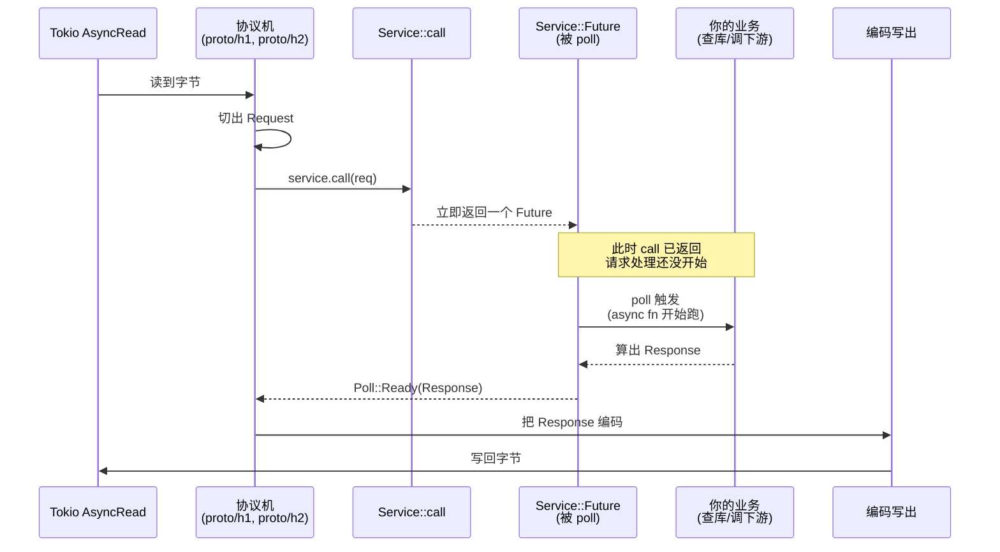

# 第 1 篇 · 第 2 章 · Service trait:一个请求一个 Future

> **核心问题**:hyper 怎么把"处理一个 HTTP 请求"这件事,抽象成一个 `Service` trait?为什么 `call` 返回的是一个 `Future`,而不是直接返回 `Response`?为什么 `call` 拿的是 `&self` 而不是 `&mut self`?又为什么 hyper 1.x 的 `Service` trait **根本没有 `poll_ready` 方法**——而隔壁 Tower 的 `Service` 却有?这一章拆的是 hyper 整个框架侧的"地基第一块砖",讲不清它,后面中间件、连接池、server 全是空中楼阁。

> **读完本章你会明白**:
> 1. `Service` trait 为什么长这样:`fn call(&self, req: Request) -> Self::Future`,其中 `Self::Future: Future<Output = Result<Response, Error>>`——每一处签名都是被"请求处理天然异步 + 一个 Service 要能并发处理多个请求"这两件事逼出来的。
> 2. 为什么 hyper 1.x 删掉了 Tower 的 `poll_ready`:这是 hyper 1.0 重构最锋利的一刀,把"用户写的业务 Service"和"hyper 内部的连接/分发"彻底解耦,背压改成走"连接池 + in-flight 槽位 + body Sender"——而不是污染用户的 trait。
> 3. `service_fn` 怎么用 Rust 的泛型 + 闭包,把"一个 `async fn`"零成本包成一个 `Service`,让你不用手写 struct + impl。
> 4. hyper 的 `Service` 和 `tower::Service`(在外部 crate)是什么关系,为什么 hyper 不直接 `re-export` Tower——以及你用 `axum`/`tonic` 时那个 `Service` 到底是哪一层的。
> 5. 一个请求从 TCP 字节进来,到被 `Service::call` 调用,到 `Future` 被 `poll` 出 `Response` 的全链路时序。

> **如果一读觉得太难**:先只记三件事——① `Service` 就是 `async fn(Request) -> Result<Response, Error>` 的 trait 化;② hyper 1.x 的 `Service` **没有 `poll_ready`**(这是和 Tower 最大的区别),背压用别的方式做;③ `call` 拿 `&self` 是为了让一个 `Service` 能被并发调用(同一连接多请求、或被 clone 到多连接)。这三件事先钉死,细节再慢慢拆。

---

## 〇、一句话点破

> **`Service` trait 把"处理一个 HTTP 请求"抽象成"一个返回 `Future<Output = Result<Response, Error>>` 的函数调用"——`call` 不直接给 `Response`,因为处理请求天然异步(查库、调下游、等 IO);`call` 拿 `&self` 而非 `&mut self`,因为一个 `Service` 要能被并发调用;hyper 1.x 干掉了 Tower 的 `poll_ready`,把背压挪到"连接池 + in-flight 槽位",让用户的业务 trait 干净得只剩一个 `call`。**

这是结论,不是理由。本章倒过来拆:先讲"请求处理"这件事为什么天然是个 `Future`,再讲为什么签名非得是 `&self` + 关联类型 `Future`,再讲 `poll_ready` 这场旷日持久的争论为什么在 hyper 1.0 以"删掉它"收场,最后讲 `service_fn` 和 `HttpService` 这两个把 trait 落地的工具。

---

## 一、接住上一章:框架地基的第一块砖

上一章末尾我们留下一个问题:

> 框架侧的第一个抽象是什么?hyper 怎么把"处理一个 HTTP 请求"抽象成一个 Future,怎么用它解耦协议机与业务?

这一章就答这个问题。先回到第一性原理,看清 hyper 在哪一层需要抽象。

### 协议机给你一个 `Request`,然后呢

不管 HTTP/1 还是 HTTP/2,协议机干完它那一摊活(`proto/h1/decode.rs` 切字节、`proto/h2/server.rs` 收 stream),最终产出的都是一个**结构化的 `http::Request<RequestBody>`**:方法、URI、headers、一个流式的 body。协议机把"字节"变成了"消息"。

但协议机**不知道**这个请求该怎么回。`GET /users/42` 该返回什么?协议机不知道,这是**业务**的事。所以协议机需要一个"出口":它拿到 `Request` 之后,把它交给**别人**,那个人算出 `Response`,协议机再把 `Response` 编成字节写回去(`proto/h1/encode.rs`、`proto/h2` 的 `respond.send_response`)。

这个"别人",就是 `Service`。`Service` 是协议机和业务之间的**那一道缝**。



> **钉死这件事**:`Service` 是协议机和业务的**接缝**。协议机管"字节 ↔ 消息",`Service` 管"消息 ↔ 业务",两边各管一段,中间靠 `Request`/`Response` 这两个 `http` crate 的标准类型对接。这一刀,把 hyper 的协议侧(第 2、3 篇)和框架侧(第 1、4、5 篇)切得干干净净。

那么问题来了:这道缝该怎么定义?它该是个**函数**?一个** trait**?一个 **Fn 类型**?

---

## 二、为什么是 trait,为什么是 `call` 返回 `Future`

### 朴素方案一:同步函数

最直觉的写法,把"处理请求"定义成一个普通函数:

```rust
// 简化示意,非源码原文
fn handle(req: Request) -> Response { ... }
```

协议机拿到 `Request`,调一下 `handle`,拿到 `Response`,编出去。简单。

> **不这样会怎样**:HTTP 请求处理**天然异步**。一个 `GET /users/42` 背后可能要去查数据库(网络 IO)、调下游服务(又一次 HTTP)、读个文件(磁盘 IO)。如果 `handle` 是同步函数,那它要么阻塞线程等 IO(一连接一线程的老路,10 万并发就废),要么压根没法表达"等"。**把请求处理写成同步函数,等于把 Rust 异步生态的全部红利让出去。** 这条路直接 pass。

### 朴素方案二:`async fn`

那就写成 `async fn`:

```rust
// 简化示意,非源码原文
async fn handle(req: Request) -> Response { ... }
```

看起来对。但 Rust 的 `async fn` 是语法糖,它**返回的是一个匿名 Future**,每个 `async fn` 的 Future 是一个**不同的、匿名的类型**。这意味着你没法写出一个统一的 trait 方法签名 `fn handle(...) -> ???`——那个 `???` 没法填,因为每个实现返回的 Future 类型都不一样。

这正是 Rust 异步里著名的"`async fn in trait`"难题(在 Rust 1.75 之前根本写不出来,1.75 之后有了原生支持但仍有 lifetime/`dyn` 限制)。hyper 的 `Service` trait 设计于 1.0 之前,它的解法是:**用一个关联类型把 Future 的具体类型暴露出来**。

### 所以 hyper 这么设计:`call` 返回关联类型的 `Future`

看真实源码 [`hyper/src/service/service.rs#L32-L57`](../hyper/src/service/service.rs#L32-L57):

```rust
pub trait Service<Request> {
    /// Responses given by the service.
    type Response;

    /// Errors produced by the service.
    type Error;

    /// The future response value.
    type Future: Future<Output = Result<Self::Response, Self::Error>>;

    fn call(&self, req: Request) -> Self::Future;
}
```

四件东西:

- `type Response`:成功时给什么(通常是 `http::Response<SomeBody>`)。
- `type Error`:失败时给什么(`Result` 的 E)。
- `type Future`:一个**关联类型**,约束成 `Future<Output = Result<Self::Response, Self::Error>>`——这就是"我这个 Service 处理请求时,返回的那个 Future 的具体类型"。
- `fn call(&self, req: Request) -> Self::Future`:拿一个请求,**立即**返回一个 Future。

这就是"`Service = Fn(Request) -> Future<Output = Result<Response, Error>>`"的精确含义。注意它甚至比"`async fn`"还灵活:`call` 本身是**同步函数**,它**立刻**返回一个 Future 对象,真正的请求处理发生在你 `poll` 这个 Future 的时候。

> **钉死这件事**:`type Future` 这个关联类型,是 hyper 在"`async fn` 还不能写进 trait"年代给出的标准解法。它把"每个 Service 实现自己的 Future 类型"这件事显式化,让 trait 既能装下"返回 Future 的函数",又能在 `dyn Service` 之外的所有场景零成本抽象。今天 Rust 1.75+ 有了 `async fn in trait`,hyper 的写法看着啰嗦,但它**精确控制了 Future 的类型**,在需要给 Future 命名、缓存、放进 `Box<Option<S::Future>>` 的场景里(下面会看到 server 就是这么干的),关联类型比 `async fn` 更好用。

### 为什么 `call` 是同步返回,而不是 `async`

这是个容易绕晕的点。`call` **不是 async**,它不 `await` 任何东西。它做的事只有一件:**构造并返回一个 Future**。Future 里才装着真正的 `async` 逻辑。

为什么要分这两步?因为协议机**不能阻塞**。协议机跑在一个 Tokio task 里,它必须**立刻**把"请求处理的活儿"打包成一个 Future,丢出去,然后自己继续干别的(读下一个请求头、写上一个响应、收 body)。如果 `call` 自己就 `await` 了,协议机就卡在 `call` 里,整条连接就停了——这跟同步方案一样糟。

所以 `call` 的语义是:**"我承诺会处理这个请求,这是我的 Future,你慢慢 poll 它,我先撤了。"** 这个"立刻返回 Future"的设计,是协议机能做 keep-alive 循环、HTTP/2 能做并发多路复用的前提。

> **承接《Tokio》**:这里的 `Future`、`Poll`、`poll`,就是《Tokio》讲透的标准库 `core::future::Future`(`fn poll(self: Pin<&mut Self>, cx: &mut Context) -> Poll<Output>`)+ `Waker` 唤醒机制。本书不再重讲 Future 怎么 poll、Waker 怎么唤醒、Tokio 怎么调度这些 Future——这些是承接《Tokio》的内容。篇幅全留"hyper 怎么把请求处理抽象成一个 Future、怎么把它和协议机拼起来"。

---

## 三、为什么 `call` 拿 `&self`,而不是 `&mut self`

这是 hyper 1.0 重构里**最锋利的一刀**,也是它和 Tower 的 `Service` 最大的区别之一。源码注释把动机写得很清楚,见 [`hyper/src/service/service.rs#L47-L56`](../hyper/src/service/service.rs#L47-L56):

```rust
    /// Process the request and return the response asynchronously.
    /// `call` takes `&self` instead of `mut &self` because:
    /// - It prepares the way for async fn,
    ///   since then the future only borrows `&self`, and thus a Service can concurrently handle
    ///   multiple outstanding requests at once.
    /// - It's clearer that Services can likely be cloned.
    /// - To share state across clones, you generally need `Arc<Mutex<_>>`
    ///   That means you're not really using the `&mut self` and could do with a `&self`.
    ///   The discussion on this is here: <https://github.com/hyperium/hyper/issues/3040>
    fn call(&self, req: Request) -> Self::Future;
```

这一段注释本身就是一份设计文档。三件事:

### 动机一:一个 Service 要能并发处理多个请求

HTTP/2 一条连接上可以并发跑几百个请求。如果 `call` 拿 `&mut self`,那么"同一个 Service 实例"在任一时刻只能有一个 `call` 在进行——因为 `&mut self` 是独占借用,Rust 的借用检查器不允许两个 `&mut` 同时存在。

那 HTTP/2 的并发怎么实现?要么每来一个请求就 `clone()` 一个新 Service(开销 + 状态怎么同步?),要么协议机自己绕开借用检查(unsafe + 自己保证)。两条路都丑。

`&self` 把这件事彻底解开:**`call` 只借 `&self`,所以同一个 Service 可以同时有任意多个 `call` 在飞**,每个 `call` 返回的 Future 各自独立 poll,互不阻塞。这正是 HTTP/2 多路复用、HTTP/1.1 pipelining 在 trait 层面需要的能力。

> **承接《Tokio》**:这里"同时多个 Future 在飞"靠的是 Tokio 的 task 调度——每个 in-flight 的 Future 或者跑在自己的 task 里(HTTP/2,`exec.execute_h2stream(fut)`,见下面源码),或者挂在一个 task 的 `Option<S::Future>` 槽里(HTTP/1,同一时刻只有一个)。无论哪种,Future 的并发由 Tokio 的 M:N 调度支撑,本书不重讲。

### 动机二:Future 只借 `&self`,对 `async fn` 友好

当你用 `async fn` 写 Service 时,`async fn(&self, req)` 生成的 Future 内部捕获了 `&self`。如果 trait 签名是 `&mut self`,那 Future 就得捕获 `&mut self`——但 `&mut` 是独占的,Future 还在飞的时候,Service 就没法被再次调用了。`&self` 让 Future 只持有共享借用,Service 可以继续被调用,Future 之间互不干涉。

### 动机三:状态共享用 `Arc<Mutex<_>>`,本来就不需要 `&mut`

hyper 在注释里点破:Service 要在多个连接之间共享状态(比如一个连接池、一个限流器),标准做法就是 `Arc<Mutex<State>>` 或 `Arc<AtomicUsize>`。这时候"状态"已经藏在 `Arc` 里了,`&self` 足够解引用进去拿锁。`&mut self` 反而给不出任何额外能力,只会徒增借用冲突。

### 不这样会怎样

> **不这样会怎样**:如果 `call` 是 `&mut self`,HTTP/2 并发就成了 Borrow Checker 的噩梦——hyper 要么 unsafe 绕开,要么每请求 clone。Tower 的 `Service` 长期就是 `&mut self`(后面会讲为什么 Tower 那么做),这也是 hyper 1.0 决定**自己单开一个干净的 trait** 而不是直接用 `tower::Service` 的核心原因之一。

> **所以这样设计**:`&self` 是把"Service 可并发调用"这件事,在签名层面就钉死、就 sound。它不需要 unsafe,不需要每请求 clone,Future 之间天然互不干涉。这是 hyper 1.0 给 Rust 异步生态贡献的一个**漂亮的 trait 设计范本**。

---

## 四、为什么没有 `poll_ready`:hyper 1.0 删掉 Tower 的那把刀

如果你看过 Tower,你会记得 Tower 的 `Service` 长这样(在外部 crate,简化示意):

```rust
// 简化示意,非 hyper 源码。这是 Tower 的 Service。
pub trait Service<Request> {
    type Response;
    type Error;
    type Future: Future<Output = Result<Self::Response, Self::Error>>;

    /// Yields until the service is ready to process a request.
    fn poll_ready(&mut self, cx: &mut Context<'_>) -> Poll<Result<(), Self::Error>>;

    fn call(&mut self, req: Request) -> Self::Future;
}
```

注意 Tower 有 `poll_ready`,而且 `call` 是 `&mut self`。Tower 的 `poll_ready` 语义是**背压**:在调用 `call` 之前,先 `poll_ready`,如果 `Pending`,说明这个 Service(或它下游)暂时没能力接活,你别 `call` 它。这主要用于限流、熔断、连接池耗尽这种"我满了,别再给我塞活"的场景。

**hyper 1.0 把 `poll_ready` 删了。** 这是重大设计决策,不是疏忽。理由如下。

### 理由一:`poll_ready` 让用户的 Service trait 变复杂,而且大多数人用不上

Tower 的 `poll_ready` 是个**协议**:它要求每个实现 Service 的人,都得想清楚"我什么时候 ready,什么时候 not ready"。对于 99% 的业务代码——一个 `async fn` 处理请求,查个库、调个下游——根本没有"not ready"这个概念:你给我请求我就处理,我不需要事先告诉协议机"等等,我还没准备好"。

但 Tower 强制每个 Service 都实现 `poll_ready`,哪怕只是 `Poll::Ready(Ok(()))`。这是**税**。hyper 1.0 的取舍是:把这道税免了,用户的 Service 只剩一个 `call`,写起来跟 `async fn` 几乎一样(配合 `service_fn`)。

### 理由二:背压不一定要塞进 trait,可以走别的路

`poll_ready` 想解决的是"背压"(backpressure)——下游满了,通知上游别再塞。hyper 1.0 的判断是:**背压不一定非得污染用户的 Service trait**,可以放在 hyper 自己的内部结构里:

- **服务端 H1**:每个连接同一时刻只处理一个请求,靠 `Dispatcher` 里的 `in_flight: Option<S::Future>` 槽位天然背压——槽位满着就不再 `poll_read_head`,自然不读下一个请求(详见下面源码)。这跟"用户 Service 是否 ready"无关,是协议机自己管的。
- **服务端 H2**:每个 stream 跑在自己的 task 里,但 h2 的**流控**(window)天然背压——下游慢了,window 不释放,h2 自动不收新数据。这是协议层的事,承《gRPC》第 2 篇。
- **客户端**:`SendRequest` 自带一个 `poll_ready`(注意:这是 `hyper::client::conn::SendRequest` 的方法,**不是** `Service` trait 的方法,见 [`hyper/src/client/conn/http1.rs#L156`](../hyper/src/client/conn/http1.rs#L156)),它在"连接关闭了"或"在途请求超上限"时返回 `Pending`,让上层(连接池)暂时别往这条连接塞请求。这个背压是**连接级**的,跟用户的业务 Service 无关。

### 理由三:`&self` + 无 `poll_ready` = 一个干净的、面向未来的 trait

`&mut self` + `poll_ready` 这两个加起来,意味着同一个 Service 实例"理论上可以有状态机式的 ready/not-ready 切换"。这在 Tower 里被用来做限流、熔断(那些中间件**有状态**,状态在 `poll_ready` 里推进)。但 hyper 1.0 的判断是:**这些有状态的横切,应该用独立的中间件层(Tower,外部 crate)做,而不是焊进 hyper 的核心 trait**。hyper 自己的核心 trait 要尽量干净,只描述"请求 → Future"这一个核心抽象。

> **钉死这件事**:hyper 1.0 删掉 `poll_ready`,是基于"用户的业务 Service 几乎都不需要它"和"背压可以走更专门的路"这两个判断。结果是一个**极简的 trait**:一个关联类型 `Future`,一个方法 `call(&self)`。这是 hyper 1.0 给"怎么设计一个面向异步的 Rust trait"交的一份答卷,和 Tower 形成有意思的对照。

### 那 Tower 的中间件怎么办:hyper-util 来桥接

有人会问:那我要给 hyper 加 Tower 中间件(限流、重试、超时)怎么办?这些可都依赖 Tower 的 `poll_ready`。

答案是:**hyper 的核心 `Service` 不变(干净),用 `hyper-util` crate(外部,不在 hyper 仓)做桥接**。`hyper-util::service` 提供了把 Tower 的 `Service` 适配成 hyper 的 `Service` 的 adapter。这样,核心 trait 保持极简,中间件生态通过适配层接入,各司其职。源码注释也指明了这一点,见 [`hyper/src/service/service.rs#L21-L31`](../hyper/src/service/service.rs#L21-L31):

```rust
/// The [`hyper-util`][util] crate provides facilities to bridge this trait to
/// other libraries, such as [`tower`][tower], which might provide their
/// own `Service` variants.
```

> **对照《gRPC》**:gRPC 的核心抽象是 `Call` + filter stack(C++ core),filter 之间用回调串联,没有 `poll_ready` 这种"先问 ready 再 call"的协议——C++ 那边用线程 + 队列做背压。hyper 用 Future 做抽象,Tower 用 `poll_ready` 做背压,这是 Rust 异步生态里两代 trait 设计的对照。第 3 章(P1-03)讲 Tower 中间件时,会把这套对照拆透。

---

## 五、Service trait 的 ASCII 全景:签名与类型关系

把上面几节拼起来,`Service` trait 的结构是这样:

```
┌─────────────────────────────────────────────────────────────────┐
│  trait Service<Request>                          // service.rs:32 │
├─────────────────────────────────────────────────────────────────┤
│  type Response;          // 成功给什么 (通常 http::Response<B>)   │
│  type Error;             // 失败给什么                            │
│  type Future: Future<Output = Result<Self::Response, Self::Error>>│
│  │                                                              │
│  │  ┌──────────────────────────────────────────────────────┐    │
│  │  │  Self::Future 必须实现 core::future::Future          │    │
│  │  │  (承《Tokio》: poll + Waker, 本书不重讲)             │    │
│  │  └──────────────────────────────────────────────────────┘    │
│                                                                 │
│  fn call(&self, req: Request) -> Self::Future;                  │
│     ▲    ▲                                                      │
│     │    └── 共享借用, 不独占 → 同一 Service 可被并发调用       │
│     └── 立即返回 Future, 不 await, 不阻塞协议机                 │
└─────────────────────────────────────────────────────────────────┘

        call 调用链 (server 侧):
        ┌────────────┐  call   ┌────────────┐  poll   ┌──────────┐
        │ Dispatcher │ ──────> │  Service   │ ──────> │ Response │
        │ (proto/h1) │         │  ::Future  │         │          │
        └────────────┘         └────────────┘         └──────────┘
           协议机                用户写的              业务算出来
         读字节切 Request       Future (async)       后的 Response

        关联类型 vs 泛型参数:
        trait Service<Request>   ← Request 是泛型 (一个 Service 可以
                                   处理多种 Request 类型, 比如 client
                                   和 server 用不同 body)
        type Response/Future     ← Response/Future 是关联类型 (由
                                   Service 实现本身决定, 跟具体 Request
                                   一一对应)
```

> **钉死这件事**:`Request` 是泛型参数(同一个 Service 类型可以处理多种 Request,比如不同 body 类型),`Response`/`Error`/`Future` 是关联类型(由具体实现决定)。这个"`Request` 泛型、`Response` 关联"的混合,是 `Service` trait 能同时描述 client 和 server 两端的关键——下一节展开。

---

## 六、为什么 `Request` 是泛型:同一个 trait 描述 client 和 server

`Service` trait 写成 `trait Service<Request>`(泛型),而不是 `trait Service`(固定 `Request` 类型)。这看着啰嗦,但它是 hyper 用**一个 trait** 同时描述"服务端处理请求"和"客户端发请求"的关键。

### 服务端侧

服务端的 Service 接收 `http::Request<IncomingBody>`(协议机刚切出来的、body 是流式的请求),返回 `http::Response<SomeBody>`。这是"被调"那一端。

### 客户端侧

客户端也可以建模成 Service:你给它一个 `http::Request<B>`(你要发的请求),它返回一个 Future,产出 `http::Response<IncomingBody>`(服务器回的响应)。这是"主动调"那一端。

两端用的是**同一个 `Service` trait**,只是 `Request` 的具体类型不同。这让 `tower` 的中间件(`timeout`、`retry`、`concurrency-limit`)可以**同时用在 client 和 server**,因为它们都 build on `Service<Request>`。

> **不这样会怎样**:如果 `Service` 固定一个 `Request` 类型,那 client 和 server 就得各开一个 trait,中间件也得各写一遍。Tower 生态之所以能"写一次中间件,client/server 通用",根就在于 `Service<Request>` 这个泛型 trait。hyper 继承了这个设计。

### `HttpService`:为 HTTP 收窄的"trait 别名"

但泛型 `Service<Request>` 在 hyper 内部用起来有点啰嗦:hyper 大部分时候只关心"HTTP 的 Service",也就是 `Request` 是 `http::Request<某 Body>`、`Response` 是 `http::Response<某 Body>`。为了减少这种 bound 噪声,hyper 在 [`hyper/src/service/http.rs`](../hyper/src/service/http.rs) 里定义了一个**收窄的 trait `HttpService`**:

```rust
// hyper/src/service/http.rs:20-38(简化展示)
pub trait HttpService<ReqBody>: sealed::Sealed<ReqBody> {
    type ResBody: Body;
    type Error: Into<Box<dyn StdError + Send + Sync>>;
    type Future: Future<Output = Result<Response<Self::ResBody>, Self::Error>>;

    fn call(&mut self, req: Request<ReqBody>) -> Self::Future;
}
```

它是一个 **sealed trait**(sealed,在外部不能实现),并且**对所有满足 `Service<Request<B1>, Response = Response<B2>>` 的类型 blanket impl**,见 [`hyper/src/service/http.rs#L40-L54`](../hyper/src/service/http.rs#L40-L54):

```rust
impl<T, B1, B2> HttpService<B1> for T
where
    T: Service<Request<B1>, Response = Response<B2>>,
    B2: Body,
    T::Error: Into<Box<dyn StdError + Send + Sync>>,
{
    type ResBody = B2;
    type Error = T::Error;
    type Future = T::Future;

    fn call(&mut self, req: Request<B1>) -> Self::Future {
        Service::call(self, req)
    }
}
```

这是个 Rust trait 设计的精妙技巧——**trait 别名 + blanket impl**:

- 对外,`HttpService` 只暴露 `ReqBody` 这一个泛型(比 `Service<Request<B1>>` 干净)。
- 对内,hyper 的 dispatcher 只需要写 `S: HttpService<IncomingBody>`,不用啰嗦地写一堆 `where Service<Request<...>, Response = Response<...>, Error: ...>`。
- sealed 让外部用户**不能**自己 impl `HttpService`,只能通过 impl `Service` 间接获得——这就保证了 `HttpService` 永远等价于"HTTP 语义的 Service",没有"野"实现。

> **钉死这件事**:`HttpService` 不是给用户实现的,它是 hyper 内部用的"trait 别名"。你写 hyper 服务时实现的是 `Service`(或用 `service_fn`),`HttpService` 是自动 blanket impl 上去的。这是 Rust 把"通用 trait + 收窄别名"组合起来降低 bound 噪声的范本。

---

## 七、`service_fn`:把闭包变成 Service

`Service` trait 写出来之后,hyper 发现:99% 的用户不想手写一个 struct + `impl Service for ...`,只想丢一个 `async fn` 或闭包进去。于是有了 `service_fn`,在 [`hyper/src/service/util.rs#L30-L39`](../hyper/src/service/util.rs#L30-L39):

```rust
pub fn service_fn<F, R, S>(f: F) -> ServiceFn<F, R>
where
    F: Fn(Request<R>) -> S,
    S: Future,
{
    ServiceFn {
        f,
        _req: PhantomData,
    }
}
```

它返回一个 `ServiceFn<F, R>`,然后 `ServiceFn` 对所有合适的 `F` 实现 `Service`,见 [`hyper/src/service/util.rs#L47-L62`](../hyper/src/service/util.rs#L47-L62):

```rust
impl<F, ReqBody, Ret, ResBody, E> Service<Request<ReqBody>> for ServiceFn<F, ReqBody>
where
    F: Fn(Request<ReqBody>) -> Ret,
    ReqBody: Body,
    Ret: Future<Output = Result<Response<ResBody>, E>>,
    E: Into<Box<dyn StdError + Send + Sync>>,
    ResBody: Body,
{
    type Response = crate::Response<ResBody>;
    type Error = E;
    type Future = Ret;

    fn call(&self, req: Request<ReqBody>) -> Self::Future {
        (self.f)(req)
    }
}
```

用法(源码 doc 示例,[`hyper/src/service/util.rs#L13-L29`](../hyper/src/service/util.rs#L13-L29)):

```rust
let service = service_fn(|req: Request<body::Incoming>| async move {
    if req.version() == Version::HTTP_11 {
        Ok(Response::new(Full::<Bytes>::from("Hello World")))
    } else {
        Err("not HTTP/1.1, abort connection")
    }
});
```

几个值得拆的点:

### 技巧一:把 `F: Fn(Request) -> Future` 自动"提升"成 `Service`

`service_fn` 的签名 `F: Fn(Request<R>) -> S, S: Future` 就是说:"给我一个从 `Request` 到 `Future` 的普通函数"。然后它包一层 `ServiceFn` struct,对这层 struct impl `Service`,把 `call` 委托给内部的 `f`。这样,**任何一个符合形状的闭包/函数,都自动成为 `Service`**。

`call` 内部就一行 `(self.f)(req)`——把请求丢给闭包,拿到 Future,返回。零开销。

### 技巧二:`PhantomData<fn(R)>` 而不是 `PhantomData<R>`

注意 `ServiceFn` 里的 `_req: PhantomData<fn(R)>`,而不是 `PhantomData<R>`。这俩看着差不多,实际差很多。

```rust
pub struct ServiceFn<F, R> {
    f: F,
    _req: PhantomData<fn(R)>,  // ← fn(R), 不是 R
}
```

- `PhantomData<R>`:告诉编译器"struct 拥有一个 `R`",于是 `ServiceFn<F, R>` 的 variance(协变/逆变)和 drop 行为会按"它真的装了个 R"来算。如果 `R` 不 Send/Sync,整个 struct 可能跟着不 Send/Sync。
- `PhantomData<fn(R)>`:`fn(R)` 是一个**函数指针类型**,它"接收 R"但不"拥有 R"。这告诉编译器:"我只**用到** R 这个类型,我不拥有它"——variance 更宽松(逆变而非协变),也不会引入额外的 drop 检查。

这是个 Rust 高频技巧:**当你只需要在类型层面"记住"一个泛型参数 `R`,但实际不持有它的值时,用 `PhantomData<fn(R) -> ...>` 而不是 `PhantomData<R>`**,能得到更宽松的 Send/Sync/variance,减少无谓的约束。

> **不这么写会怎样**:如果用 `PhantomData<R>`,而 `R`(请求 body 类型)恰好不 `Send`/`Sync`(或 variance 跟你想的不一样),`ServiceFn` 可能会莫名其妙地不 `Send`,把你卡在"为什么我的 service 不能跨线程"。`fn(R)` 写法从根本上避开了这个坑。

### 技巧三:`&self` + `Fn`(不是 `FnMut`)完美咬合

回忆 `Service::call` 是 `&self`,所以 `service_fn` 里的 `f` 也只需要 `Fn`(最低要求,共享借用即可)。这正好对上:你的闭包可能被并发调用(HTTP/2 多请求),`Fn` 闭包可以共享借用。如果你闭包内部需要可变状态,你得自己用 `Arc<Mutex<_>>`——这呼应了 `service.rs` 注释里"to share state across clones, you generally need `Arc<Mutex<_>>`"那句。

---

## 八、Service 在协议机里怎么被调起来:server 侧的真链路

trait 定义得再漂亮,关键看它怎么被调起来。看 hyper 服务端 H1 的真链路。

### H1:`Dispatcher` + `Server<S, B>` + `in_flight` 槽位

`proto/h1/dispatch.rs` 里有一个内部 trait `Dispatch`,和一个服务端的实现 `Server<S, B>`,见 [`hyper/src/proto/h1/dispatch.rs#L48-L52`](../hyper/src/proto/h1/dispatch.rs#L48-L52):

```rust
pub(crate) struct Server<S: HttpService<B>, B> {
    in_flight: Pin<Box<Option<S::Future>>>,
    pub(crate) service: S,
}
```

注意 `in_flight: Pin<Box<Option<S::Future>>>`——**一个连接同一时刻只装一个 in-flight 的 Future**。这是 HTTP/1.1 的语义:一条连接上,请求是串行处理的(keep-alive 复用连接,但不并发请求)。

`recv_msg` 是协议机切出一个完整请求头后调用的,见 [`hyper/src/proto/h1/dispatch.rs#L613-L624`](../hyper/src/proto/h1/dispatch.rs#L613-L624):

```rust
fn recv_msg(&mut self, msg: crate::Result<(Self::RecvItem, IncomingBody)>) -> crate::Result<()> {
    let (msg, body) = msg?;
    let mut req = Request::new(body);
    *req.method_mut() = msg.subject.0;
    *req.uri_mut() = msg.subject.1;
    *req.headers_mut() = msg.headers;
    *req.version_mut() = msg.version;
    *req.extensions_mut() = msg.extensions;
    let fut = self.service.call(req);   // ← 这里调用你的 Service
    self.in_flight.set(Some(fut));
    Ok(())
}
```

`recv_msg` 干两件事:① 把协议机切出来的 head 拼成一个 `http::Request`;② 调用 `self.service.call(req)`,拿到 Future,塞进 `in_flight` 槽。**注意 `call` 立即返回,没有任何 `await`**——这呼应我们前面讲的"`call` 是同步返回 Future"。

然后 `poll_msg`(见 [`dispatch.rs#L589-L611`](../hyper/src/proto/h1/dispatch.rs#L589-L611))负责 poll 这个 `in_flight` Future,等它产出 `Response`,把 Response 拆成 head + body 交给协议机去编码:

```rust
fn poll_msg(...) -> Poll<Option<Result<(Self::PollItem, Self::PollBody), Self::PollError>>> {
    let ret = if let Some(ref mut fut) = this.in_flight.as_mut().as_pin_mut() {
        let resp = ready!(fut.as_mut().poll(cx)?);   // ← poll 用户的 Future
        let (parts, body) = resp.into_parts();
        // ... 拼成 MessageHead ...
        Poll::Ready(Some(Ok((head, body))))
    } else {
        unreachable!("poll_msg shouldn't be called if no inflight")
    };
    this.in_flight.set(None);   // ← 处理完, 清掉槽位, 让下一个请求能进来
    ret
}
```

`poll_ready`(这个是 hyper **内部 Dispatch trait 的方法**,不是用户 Service 的)见 [`dispatch.rs#L626-L632`](../hyper/src/proto/h1/dispatch.rs#L626-L632):

```rust
fn poll_ready(&mut self, _cx: &mut Context<'_>) -> Poll<Result<(), ()>> {
    if self.in_flight.is_some() {
        Poll::Pending           // ← 槽位满, 别再读新请求
    } else {
        Poll::Ready(Ok(()))     // ← 槽位空, 可以接下一个
    }
}
```

**这就是 H1 的背压**:`in_flight` 槽满着,`poll_ready` 返回 `Pending`,dispatcher 就不读下一个请求头(见 [`dispatch.rs#L294`](../hyper/src/proto/h1/dispatch.rs#L294) 的 `poll_read_head` 入口检查)。注意:这个背压完全在 hyper 内部,你的业务 Service **完全感知不到**,它的 `call` 该被调就调、Future 该 poll 就 poll。这就是"删掉用户 trait 的 `poll_ready` 但背压不丢"的真相——背压挪到了 dispatcher 层。

> **钉死这件事(背压的真相)**:hyper 1.0 没有把背压从 trait 删掉之后扔掉,而是把它**搬到了 dispatcher**。服务端 H1 用 `in_flight: Option<S::Future>` 单槽,服务端 H2 用每 stream 一个 task + h2 流控,客户端用 `SendRequest::poll_ready`(连接级)。用户 Service 干干净净只有一个 `call`。这是 hyper 1.0 设计的高明之处:**把复杂性挪到该挪的地方,而不是摊给所有用户**。

### H2:每 stream 一个 task

HTTP/2 不一样——一条连接并发跑多个 stream,所以不能用单槽。看 `proto/h2/server.rs`,见 [`hyper/src/proto/h2/server.rs#L312-L320`](../hyper/src/proto/h2/server.rs#L312-L320):

```rust
let fut = H2Stream::new(
    service.call(req),
    connect_parts,
    respond,
    self.date_header,
    exec.clone(),
);

exec.execute_h2stream(fut);
```

每个 HTTP/2 请求,`service.call(req)` 返回一个 Future,被包成 `H2Stream`,然后 `exec.execute_h2stream(fut)`——**丢给执行器,各跑各的**。这里 `&self` 的威力彻底显形:同一个 `service` 被并发调用了 N 次(HTTP/2 并发 stream),每次返回的 Future 在自己的 task 里 poll,互不干扰。如果 `call` 是 `&mut self`,这一行根本写不出来。

> **承接《Tokio》**:这里的 `exec.execute_h2stream(fut)` 底层就是 `tokio::spawn`(hyper 的 `Exec` 是对 Tokio executor 的薄封装)。每个 H2 stream 跑在一个 Tokio task 里,task 的调度、让出、唤醒承《Tokio》。本书只看"hyper 怎么把 Future 交给 Tokio 跑",不重讲 Tokio 调度。

---

## 九、Service trait 的设计:hyper vs Tower(对照)

把 hyper 的 `Service` 和 Tower 的 `Service`(外部 crate)并排放,差异最显形:

| 维度 | hyper `Service` | Tower `Service`(外部 crate) |
|---|---|---|
| `call` 接收者 | `&self` | `&mut self` |
| `poll_ready` | **没有** | 有,`poll_ready(&mut self, cx)` |
| Future Output | `Result<Response, Error>` | `Result<Response, Error>` |
| Request | 泛型 `<Request>` | 泛型 `<Request>` |
| 设计目标 | 描述"请求 → Future"这一件事 | 描述"有状态的、可背压的服务"(为中间件设计) |
| 谁实现它 | 用户的业务(用 `service_fn` 或手写) | 中间件 + 业务 |
| 适合的场景 | 干净的核心抽象,能并发调用 | 限流/熔断/重试这类有状态横切 |

### 为什么 Tower 是 `&mut self` + `poll_ready`

Tower 是为**中间件链**设计的。一个限流中间件,内部有一个 token bucket;`poll_ready` 推进 bucket 的状态(等 token),`call` 真正发请求。`&mut self` 是因为状态机要可变。这套设计是为"有状态、需要背压协商"的中间件量身定做的。

### 为什么 hyper 不直接用 Tower

hyper 1.0 之前(0.14),hyper 直接 re-export Tower 的 `Service`(带 `poll_ready`、`&mut self`)。结果是:① 用户写个最简单的 echo server,也得想"我的 `poll_ready` 该返回什么";② server 端要做并发(HTTP/2),得跟 `&mut self` 搏斗;③ trait 被中间件的需求污染。

1.0 的取舍:**核心 trait 极简,中间件靠 hyper-util 桥接 Tower**。hyper 自己的 `Service` 只描述"请求 → Future",干净到能被并发调用、能装进 `dyn`、能让 `async fn` 用户无痛上手。需要 Tower 中间件的人,用 `hyper-util` 的 adapter 接入,各取所需。

> **对照《gRPC》**:gRPC 的 filter stack(C++ core)用回调 + 异步队列串联 filter,没有"`poll_ready` 协商"这一层——背压靠队列长度和 HTTP/2 流控。Tower 的 `poll_ready` 是 Rust 异步生态特有的"在 trait 层显式表达背压"。hyper 1.0 的取舍是"不要这种显式表达,把背压藏进协议机"——更像 gRPC 那种"背压是基础设施的事,不是业务的事"。这是个有意思的趋同演化。

---

## 十、技巧精解:两个最硬核的 Rust 手段

本章有两个最硬核的 Rust 设计技巧,值得单独拆透。

### 技巧一:关联类型 `Future` + 泛型 `Request` 的"混合 trait"

`Service` trait 把 `Request` 设为**泛型参数**,把 `Response`/`Error`/`Future` 设为**关联类型**。这不是随便选的,是被两件事逼出来的:

1. **同一个 Service 类型要能处理多种 Request**:比如 client 和 server 都实现 `Service`,但 `Request` 的 body 类型不同。如果 `Request` 是关联类型,一个具体 Service 就只能处理一种 Request——但 client/server 复用同一个 Service 类型时,Request 类型不同,这就卡住了。把 `Request` 设为泛型,`MyService` 可以同时 `impl Service<Request<A>>` 和 `impl Service<Request<B>>`(虽然实践中很少这么用,但 trait 给了这个能力)。
2. **Response/Future 必须由 Service 实现本身决定,且和 Request 一一对应**:`Response`/`Future` 是关联类型,意味着"给定一个 `S: Service<Request<A>>`,编译器能唯一推出 `S::Response`/`S::Future`"。这是 dispatcher 写 `S::Future` 时必须的——它要能把 Future 存进 `in_flight: Pin<Box<Option<S::Future>>>`,必须知道"`S` 的 Future 是哪个具体类型"。如果 Future 也是泛型,dispatcher 就没法存了(类型不唯一)。

> **对照:全泛型 vs 全关联**:
> - 全泛型(`trait Service<R, Res, Err, Fut>`):impl 时要写一长串类型参数,bound 爆炸,而且 dispatcher 推不出唯一 Future。
> - 全关联(`trait Service { type Req; ... }`):一个具体 Service 只能对应一种 Request,client/server 复用受限。
> - **混合(Request 泛型,Response 关联)**:既能"一个 Service 处理多种 Request"(client/server 复用),又能"给定 Service+Request 唯一推出 Future"(dispatcher 能存)。这是 `Service` trait 设计的**最小充分集**。

这是 Rust trait 设计里"泛型 vs 关联类型"抉择的经典案例:`Service` trait 把它展示得淋漓尽致。Rust 生态里很多 trait(`Iterator`、`Future`、`Stream`)都是全关联,因为它们"一对一";`Service` 是少有的"一对多"(一个 Service 类型,多种 Request)所以走混合。

### 技巧二:`&self` + blanket impl 给"标准库所有引用/智能指针"自动实现 Service

hyper 给 `&S`、`&mut S`、`Box<S>`、`Rc<S>`、`Arc<S>` 都 blanket impl 了 `Service`,见 [`hyper/src/service/service.rs#L59-L112`](../hyper/src/service/service.rs#L59-L112):

```rust
impl<Request, S: Service<Request> + ?Sized> Service<Request> for &'_ S {
    type Response = S::Response;
    type Error = S::Error;
    type Future = S::Future;

    #[inline]
    fn call(&self, req: Request) -> Self::Future {
        (**self).call(req)
    }
}

// ... 同样给 &mut S, Box<S>, Rc<S>, Arc<S> ...
```

效果:**任何 `Service` 的引用或智能指针,自动也是 `Service`**。这意味着 dispatcher 可以持有 `Arc<MyService>` 或 `&MyService`,直接 `.call(req)`,不用解引用、不用包一层 adapter。

为什么这对 hyper 至关重要?因为 hyper 的 server 经常需要**在多个 Tokio task 之间共享同一个 Service**(每条连接一个 task,共享同一个 handler)。共享靠 `Arc<S>`。如果 `Arc<S>` 不是 `Service`,dispatcher 就得写成 `(*self.service).call(req)`,而且一旦 Service 内部还想被 clone/引用,类型签名会爆炸。blanket impl 让 `Arc<S>` 直接就是 `Service`,dispatcher 写 `S: Service<...>` 就行,`S` 可以是 `Arc<MyHandler>`/`&MyHandler>`/`Box<MyHandler>`,全都 work。

> **不这么写会怎样**:如果没有这套 blanket impl,hyper 得为 `Arc<S>`/`Box<S>`/`&S>` 各写一个 newtype wrapper + delegate,API 表面就多了一堆 `ArcService<S>`/`BoxedService<S>` 这种噪声类型。blanket impl 把这件事在 trait 层一次解决,这是 Rust "blanket impl 当 adapter"的典型用法。

这两个技巧加起来,让 `Service` trait 既灵活(能装各种引用/智能指针/闭包/手写 struct),又精确(关联类型让 dispatcher 能存 Future),还干净(只有 `call` 一个方法)。这是 hyper 1.0 trait 设计的全部精华。

---

## 十一、章末小结

### 回扣主线

本章是**框架侧地基的第一块砖**。它立的不是协议(协议在第 2、3 篇),而是"协议机和业务之间的那道缝"——`Service` trait。一句话回扣:**`Service` 把"处理一个 HTTP 请求"抽象成"返回 `Future<Output = Result<Response, Error>>` 的 `call(&self)`",让协议机和业务各管一段,让同一个 Service 能被并发调用,让 hyper 1.0 把"用户 trait 的复杂性"降到最低。**

回到全书的二分法:`Service` 在**框架侧**(第 1 篇),它把协议机(协议侧)算出来的 `Request` 接过来,产出 `Response` 交回去。后续第 3 章(Tower 中间件)、第 4 章(Body as Stream)、第 4 篇(client 连接池)、第 5 篇(server)全都建在它上。

### 五个为什么

1. **为什么 `Service::call` 返回 Future 而不是直接 Response?**——请求处理天然异步(查库/调下游/等 IO);`call` 立即返回 Future,让协议机能继续循环(读下一个请求、写上一个响应),不阻塞。
2. **为什么 `call` 拿 `&self` 而不是 `&mut self`?**——让同一个 Service 能被并发调用(HTTP/2 多 stream 同时飞),Future 只借共享借用,互不阻塞。这是 hyper 1.0 和 Tower 最大的签名区别。
3. **为什么 hyper 1.x 的 Service 没有 `poll_ready`?**——99% 的业务用不上它,背压可以走更专门的路(H1 的 `in_flight` 单槽、H2 的流控、client 的 `SendRequest::poll_ready`)。删掉它让用户 trait 干净到只剩 `call`。Tower 的 `poll_ready` 通过 hyper-util 桥接。
4. **为什么 `Request` 是泛型而 `Response`/`Future` 是关联类型?**——`Request` 泛型让一个 Service 类型能处理多种 Request(client/server 复用);`Response`/`Future` 关联让"给定 Service+Request 唯一推出 Future 类型",dispatcher 才能把 Future 存进 `in_flight` 槽。
5. **为什么 hyper 不直接 re-export Tower 的 Service?**——Tower 的 `&mut self` + `poll_ready` 是为有状态中间件设计的;hyper 想要一个干净的、面向并发的、零噪声的核心 trait,中间件通过 hyper-util 适配层接入。这是 1.0 重构最锋利的一刀。

### 想继续深入往哪钻

- 想看 Tower 的 `Service`(带 `poll_ready`)怎么用于中间件:本书第 3 章(P1-03, Tower 与中间件)。
- 想看 Body 怎么以 Stream 形式流:本书第 4 章(P1-04, Body as Stream)。
- 想看 server 怎么 accept 连接、每条连接怎么跑 Service:本书第 5 篇(尤其是第 15 章)。
- 想看 client 侧怎么用 `SendRequest::poll_ready` 做连接级背压:本书第 13 章(P4-13)。
- 想动手:用 `hyper::service::service_fn` 写一个最简单的 echo server,在 `call` 里 `println!` 一行,看一条 keep-alive 连接上多个请求怎么串行触发 `call`。

### 引出下一章

我们拆透了 `Service` trait 这块地基——为什么是 `call(&self) -> Future`、为什么没有 `poll_ready`、`service_fn` 怎么把闭包变 Service。但真实业务里,处理一个请求往往不止"业务逻辑"一件事:还要鉴权、记日志、加超时、限流、重试。这些横切怎么不污染业务?hyper 的答案是:**靠中间件链(基于 Tower,外部 crate),把 Service 一层层包起来**。下一章 P1-03,我们拆 Tower 中间件——Service 怎么被套娃、`poll_ready` 在中间件链里怎么协商背压、hyper-util 怎么把 Tower 接到 hyper 的核心 trait 上。

> **下一章**:[P1-03 · Tower 与中间件](P1-03-Tower与中间件.md)
