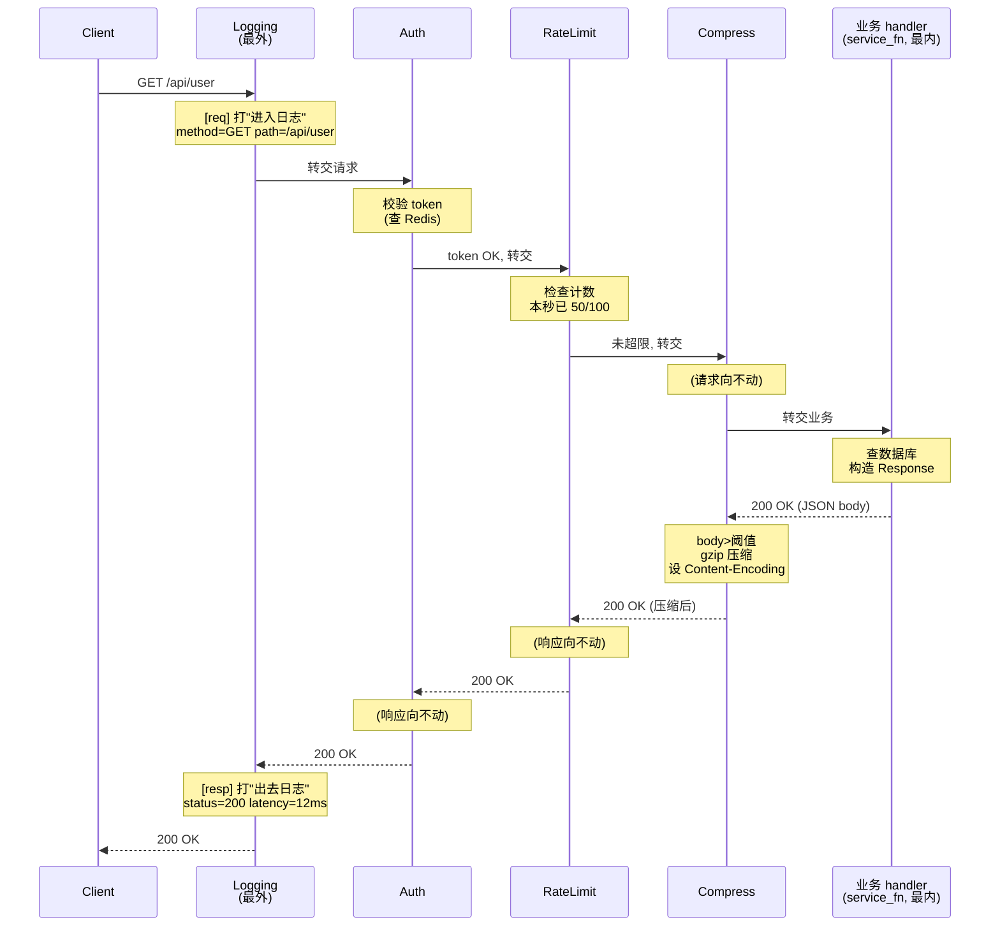
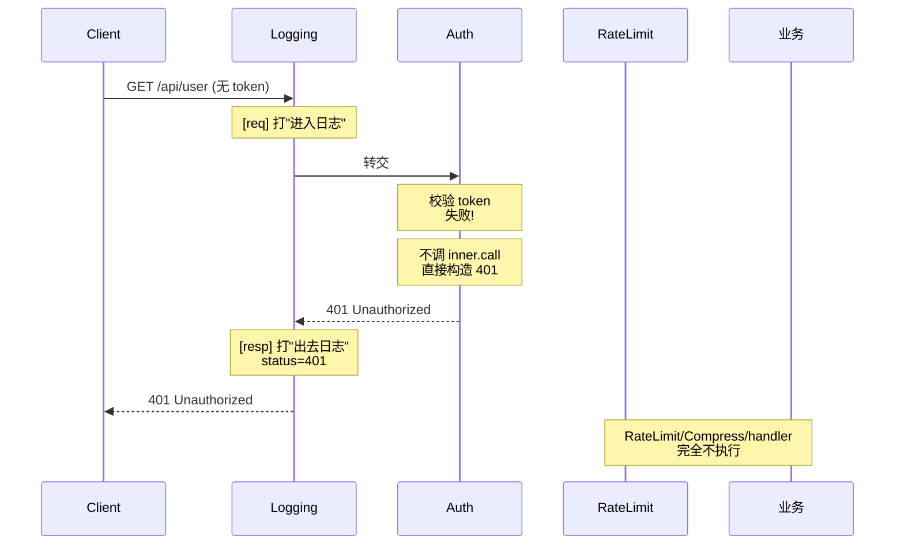

# 第 1 篇 · 第 3 章 · Tower 与中间件

> **核心问题**:你写 axum handler 时,中间件(middleware)长这样——`Router::new().route("/", get(handler)).layer(TraceLayer::new()).layer(AddAuthorizationLayer)`,鉴权、日志、压缩、限流一层层套上去,业务代码(`async fn handler`)里**一个字都不用写**鉴权/日志的逻辑。这怎么做到的?更根本的问题:为什么这套机制能让"横切关注点(cross-cutting concerns)"完全不侵入业务?为什么是"Service 套 Service"的洋葱模型(每个中间件自己也是一个 Service,外层持有内层),而不是回调函数列表、不是继承、不是事件总线?

这一章,我们要把"中间件"这层抽象**彻底**拆透。它不只是 axum/tower 生态的小技巧,而是整个 Rust 异步 Web 栈的**架构根基**——axum、tonic、reqwest、Pingora 全靠它把横切逻辑解耦出来。我们还要诚实讲清一件很多人混淆的事:**hyper 1.0 自己其实已经不再依赖 Tower**——hyper 只留了一个极简的 `Service` trait(`fn call(&self, req) -> Future`,**没有 `poll_ready`**),中间件的主战场被搬到了 Tower/axum 那一层。这个分工**为什么是对的**,是本章压轴的一问。

> **读完本章你会明白**:
> 1. 为什么"横切关注点"是一个普遍问题——以及解决它有哪几条路(回调列表、继承、AOP、责任链/洋葱),各自的代价,为什么责任链(洋葱)在异步 Rust 里最自然。
> 2. 洋葱模型的本质:**中间件本身就是一个 Service**——它持有内层 Service 的所有权,在 `call` 里"先做事、再把请求交给内层、再处理结果",层层嵌套就像洋葱。为什么"持有所有权"是 Rust 的关键技巧(对照 gRPC 的指针 filter stack)。
> 3. `Layer` trait 的角色:它是**Service 的工厂的工厂**(给一个内层 Service,产出一个包装后的新 Service)——`ServiceBuilder::layer(A).layer(B).service(S)` 把 `S` 一层层包成 `A(B(S))`。为什么需要"工厂"这层间接。
> 4. **诚实边界**:hyper 1.0 把 Tower 依赖**拆走了**——hyper 自己的 `Service` trait 用 `&self` 且**没有 `poll_ready`**(背压丢给上层/连接层处理),中间件链的生态在 Tower/hyper-util/axum。这个"瘦身"决策为什么对(可组合性 vs 协议层最小化)。
> 5. 三套"请求处理管线"的横向对照:hyper 自己的 `service_fn` + `HttpService`(极简)、gRPC C++ core 的 filter stack + filter fusion(《gRPC》P3-11 招牌,指针链 + 编译期 promise 合并)、Envoy HCM 的 L7 filter chain(C++ 滤镜链)。同样是"请求要穿过一串层",三种生态的取舍在哪。
> 6. 为什么 `Service::call` 用 `&self` 而不是 `&mut self`(hyper 1.0 的关键改动),这跟"无 `poll_ready`"、"一个 Service 能被并发调用多次"、"实现 `Clone` 就能跨 task 共享"是怎么咬在一起的。

> **如果一读觉得太难**:先抓三件事——① 中间件本身是 Service,外层持有内层(`A(B(C(handler)))`),`call` 里"先做事再转交";② `Layer` 是"产 Service 的 Service 工厂",`ServiceBuilder` 把多个 Layer 串起来包出洋葱;③ hyper 1.0 自己**不依赖 Tower**,中间件生态在 Tower/axum,hyper 只留极简 `Service`(`&self`,无 `poll_ready`)——这是有意的分层。其余细节是这三个点展开。

---

## 〇、一句话点破

> **中间件不是一个新机制——它就是"Service 套 Service"。一个鉴权中间件本身是一个 Service,它内部持有一个"下一个 Service"(内层);调用它时,它先做鉴权(检查 token)、再调内层的 `call` 把请求转交下去、内层返回响应后还能再处理(打日志、改 header)。层层套娃就长成洋葱:外层先入后出,内层后入先出。`Layer` 是"包装工厂"——给一个内层 Service,产出一个包好的新 Service;`ServiceBuilder` 把一串 Layer 倒序包出一个洋葱。这套机制让横切逻辑和业务代码完全解耦,业务 handler 一个字都不用知道有日志/鉴权/压缩。这是 axum/tower/tonic/Pingora 整个生态的架构根基。**

这是结论,不是理由。本章倒过来拆:先讲横切关注点为什么是个普遍问题、有哪几条解法,再讲洋葱模型在异步 Rust 里为什么最自然,然后讲 `Layer` 的角色和 `ServiceBuilder` 怎么把洋葱搭起来,接着诚实讲清 hyper 与 Tower 的边界(这是大多数人混淆的),再横比三套管线(hyper/gRPC/Envoy),最后把 hyper 的 `&self` + 无 `poll_ready` 这个关键设计钉死。

---

## 一、横切关注点:一个普遍问题

### 1.1 问题本身:鉴权/日志/压缩/限流,不是某一个请求的事

写 Web 服务的人,迟早会发现一件事:有些逻辑**不属于任何一个 handler**,但**几乎每个 handler 都需要**。

- **鉴权(auth)**:几乎所有接口都要先验 token、看权限。只有 `/login` 不要。
- **日志(trace)**:每个请求进来,要记 method/path/status/latency,出错了要记 stack。
- **压缩(compression)**:响应 body 大于阈值就 gzip/brotli 压缩,设置 `Content-Encoding`。
- **限流(rate limit)**:每个 IP/用户每秒最多打 100 次,超了返 429。
- **CORS**:加 `Access-Control-Allow-Origin` 等头。
- **请求 ID**:给每个请求生成 `X-Request-Id`,贯穿日志和下游调用。
- **超时(timeout)**:每个请求最多 30 秒,超了返 504。

这些逻辑有一个共同特征:**横切(cross-cutting)**——它们垂直地切过所有 handler,跟"这个 handler 具体处理什么业务"无关。它们不是某一个接口的事,是几乎所有接口的事。

如果你把每个横切逻辑都写进每个 handler,代码会变成这样(伪代码):

```rust
// 反面:横切逻辑侵入业务,每个 handler 都要重复一遍
async fn get_user(req: Request) -> Response {
    let _span = start_span("get_user");           // 日志
    let req_id = generate_request_id(&req);        // 请求 ID
    if !check_auth(&req) { return unauthorized(); } // 鉴权
    if rate_limited(&req) { return too_many(); }   // 限流
    let result = tokio::time::timeout(             // 超时
        Duration::from_secs(30), do_get_user(&req)
    ).await;
    let resp = pack(result);
    compress_if_needed(&mut resp);                 // 压缩
    add_cors_headers(&mut resp);                   // CORS
    _span.end();
    resp
}

async fn get_order(req: Request) -> Response {
    // 上面那一坨,几乎一模一样再来一遍……
}
```

每个 handler 都重复一大坨样板代码。要改一个细节(比如限流阈值从 100 调到 200),你要改几十个 handler。这是**软件工程不能容忍的耦合**:横切逻辑和业务逻辑焊死,复用性、可维护性全毁。

> **钉死这件事**:横切关注点的根本矛盾是——它们**不是某一个业务的事**,但**几乎每个业务都要用**。所以它们必须从业务里**抽出来**,以一种"声明式、可组合"的方式挂上去。怎么挂?这就是"中间件"要解决的问题。

### 1.2 解法有几条路:从最朴素到最优雅

横切逻辑要抽出来,历史上软件工业试过很多路。我们逐个看,为什么它们在"异步 Rust + HTTP"这个场景里都不如洋葱。

**路 1:复制粘贴 / 抽公共函数**——就是上面那段反例。把横切抽成 `fn check_auth(req)`、`fn compress(resp)` 之类,在每个 handler 里调一遍。问题:还是要每个 handler 手动调,业务代码里仍然要写一串"鉴权→限流→日志→..."的调用链。改一个全局顺序(比如把鉴权挪到限流前面)要改几十个 handler。**这是反模式,pass。**

**路 2:回调列表(callback list)**——把横切逻辑做成一串 `Vec<Box<dyn Fn>>`,每个请求进来时按顺序调一遍。问题:回调只能"前置处理"(请求进来时调),**做不到"后置处理"**(响应出去前再处理,比如压缩响应、给响应加 header)。而且回调里要异步(查数据库验 token),回调签名得是 `async fn`,但你又拿不到"内层处理完的响应"回来再处理——回调是"广播",不是"管线"。**对 HTTP 横切不合适。**

**路 3:继承 / 模板方法(面向对象)**——写一个基类 `BaseHandler`,里面 `process_request()` 钩子 `before()`、`handle()`、`after()`,子类重写。问题:① Rust 没有"继承"(trait object 不能 `super`),这套要靠运行时多态 + 一堆样板;② 继承是**静态**的——一个 handler 的"中间件组合"在编译期就定死了,不能按路由动态配(有的接口要鉴权、有的不要);③ 继承层级一深,`super::after()` 调用顺序混乱。**Rust 不走这条。**

**路 4:面向切面编程(AOP)/ 注解(Java Spring 的 `@Transactional`)**——用注解标记方法,运行时字节码增强,把横切"织入(weaving)"进去。问题:① Rust 没有运行时反射/字节码增强(Rust 是 AOT 编译);② AOP 是"魔法",织入逻辑不可见、不可组合,debug 困难。**Rust 不走这条。**

**路 5:事件总线(event bus)**——请求进来时发 `RequestReceived` 事件,各模块订阅。问题:事件总线是"一对多广播 + 解耦订阅者",但**中间件需要严格的顺序**(鉴权必须在限流前、日志必须在最外层)、**需要修改请求/响应**(鉴权失败要短路返 401)、**需要串行链式传递**(一个中间件改完请求交给下一个)。事件总线做不到顺序保证和短路。**不适合。**

**路 6:责任链 / 洋葱(Chain of Responsibility / onion)**——把每个中间件做成一个"处理者",它持有"下一个处理者"的引用;请求进来,第一个处理者做事、调下一个、下一个再调下一个……形成一条链。如果每个处理者还能拿到"下一个返回的结果"再处理,就变成洋葱(外层先入后出)。这条路:

- **支持前置和后置**:中间件既能改请求(前置)又能改响应(后置)。
- **支持异步**:每个中间件就是一个异步函数,可以 `await` 下一个中间件。
- **支持短路**:鉴权失败直接返 401,不调下一个。
- **可组合**:中间件是独立的、可任意拼装,顺序由"怎么套"决定。
- **顺序明确**:谁先谁后由链的搭建顺序决定,代码里一目了然。

> **钉死这件事**:在"异步 Rust + HTTP"这个场景里,洋葱模型是**最自然**的解法——它同时满足"前置+后置处理"、"异步"、"短路"、"可组合"、"顺序明确"五个要求。回调/继承/AOP/事件总线都缺一项或多项。所以 axum/tower 走洋葱,gRPC 走 filter stack(洋葱的 C++ 变种),Envoy 走 filter chain(洋葱的代理变种)。**三种生态不约而同选了责任链的变种,不是巧合,是这个问题的本质决定的。**

---

## 二、洋葱模型:中间件本身就是一个 Service

### 2.1 从 P1-02 接过来:Service 是什么

上一章 P1-02 我们把 hyper 的 `Service` trait 拆透了。一句话回顾:

> **Service 是"处理一个 Request、返回一个产出 Response 的 Future"的东西。** hyper 自己的 `Service` trait(`src/service/service.rs` L32)长这样:

```rust
// hyper/src/service/service.rs:32(逐字摘录)
pub trait Service<Request> {
    type Response;
    type Error;
    type Future: Future<Output = Result<Self::Response, Self::Error>>;

    fn call(&self, req: Request) -> Self::Future;
}
```

注意三个细节(后面要反复用到):

1. `call(&self, ...)`——**不是 `&mut self`**(这是 hyper 1.0 的关键改动,后面专门讲)。
2. **没有 `poll_ready`**(对比 Tower 的 `Service` 有,这是 hyper 1.0 删的)。
3. 返回的是 `Self::Future`,关联类型,不是 `Box<dyn Future>`(零开销)。

> **承接 P1-02**:Service trait 的 Future/Poll 机制承《Tokio》(poll-based + Waker,标准库 `core::future`),这里一句带过,篇幅全留中间件怎么建在 Service 上。

业务 handler 怎么变成 Service?用 `service_fn`(`src/service/util.rs:30`)把一个闭包包成 Service:

```rust
// hyper/src/service/util.rs:30(简化示意)
pub fn service_fn<F, R, S>(f: F) -> ServiceFn<F, R>
where F: Fn(Request<R>) -> S, S: Future { ... }

// 用法(来自 examples/echo.rs:103)
http1::Builder::new().serve_connection(io, service_fn(echo))
```

`service_fn(echo)` 把 `async fn echo(req)` 包成一个 `Service`。这就是"最内层"的 Service——业务本身。中间件呢?**中间件也是一个 Service**,只是它内部还**持有另一个 Service**。

### 2.2 中间件的本质:一个持有内层 Service 的 Service

我们写一个"日志中间件"看看。假设业务 Service 是 `S: Service<Request>`(就是上面的 `service_fn(echo)`),日志中间件要做的:

1. 收到请求时,**打一条进入日志**(method/path/time)。
2. **把请求交给内层 Service `S`** 处理。
3. 拿到响应后,**打一条出去日志**(status/latency)。
4. 把响应返回给调用方。

抽象成代码,就是:

```rust
// 简化示意,非源码原文(原理演示)
struct Logging<S> {
    inner: S,   // 持有内层 Service 的所有权
}

impl<S, ReqBody> Service<Request<ReqBody>> for Logging<S>
where
    S: Service<Request<ReqBody>>,
{
    type Response = S::Response;
    type Error = S::Error;
    type Future = Pin<Box<dyn Future<Output = Result<S::Response, S::Error>>>>;

    fn call(&self, req: Request<ReqBody>) -> Self::Future {
        let method = req.method().clone();
        let path = req.uri().path().to_owned();
        let start = Instant::now();
        let inner = self.inner.clone();          // 拿到内层的引用(下面讲为什么 clone)
        Box::pin(async move {
            println!("[req] {} {}", method, path);       // 前置:进入日志
            let resp = inner.call(req).await?;            // 转交内层处理
            let elapsed = start.elapsed();
            println!("[resp] {} {:?} {:?}", path, resp.status(), elapsed); // 后置:出去日志
            Ok(resp)
        })
    }
}
```

**注意三个关键点**:

- **`Logging<S>` 自己也是一个 `Service`**——它实现了 `Service<Request>` trait,所以从外面看,它跟 `service_fn(echo)` 没区别,都是 Service。
- **它持有内层 `S` 的所有权**(`inner: S`),不是引用(`&S`)、不是 `Box<dyn Service>`(trait object 也能用,但所有权更好)。**为什么是所有权**?后面专门讲。
- **`call` 里 `await` 内层的 `call`**——前置打日志、转交内层、后置打日志。`async move` 块 + `Box::pin` 把它变成 `Future`。这就是"前置 + 转交 + 后置"的洋葱式处理。

> **钉死这件事**:**中间件不是别的,它就是一个 `Service`——区别只是它的 `call` 里,在调"内层 Service 的 `call`"前后,各做了一点事。** 把多个这样的中间件套起来,外层持有内层、内层持有更内层……最里层是业务 `service_fn`,就长成了洋葱。

### 2.3 套娃:层层嵌套的洋葱结构

只有一个日志中间件还不够。真实服务通常要套好几个:最外层日志、往里鉴权、再往里限流、再往里压缩、最里层业务。**套娃式组合**长这样:

```
最外层                  最内层
Logging → Auth → RateLimit → Compress → 业务(service_fn)
```

每层都是一个 Service,外层持有内层的所有权。从"类型"上看,这个组合的类型是嵌套的:

```rust
// 简化示意,非源码原文
type Stack<S> =
    Logging<Auth<RateLimit<Compress<S>>>>;
//             ↑       ↑          ↑       ↑
//           最外    第二       第三    第四(包业务 S)
```

`Logging<Auth<...>>` 这个**泛型嵌套类型**,就是洋葱在 Rust 类型系统里的直接表达。Rust 编译器在编译期就能算出整个洋葱的类型(零成本静态分发,没有虚函数),同时把"日志→鉴权→限流→压缩→业务"的调用链固化在代码里。

调用时怎么走?一个请求进来,调用最外层 `Logging::call(req)`:

```
请求 → Logging::call
       │ 打"进入日志"
       │ Auth::call
       │  │ 校验 token
       │  │ RateLimit::call
       │  │  │ 检查计数
       │  │  │ Compress::call
       │  │  │  │ 业务 handler
       │  │  │  ↓
       │  │  │ 拿到响应 → (可选)压缩
       │  │  ↓
       │  ↓ 拿到响应 → (鉴权层一般不动响应)
       ↓ 拿到响应 → 打"出去日志"
响应 ← Logging::call 返回
```

外层先进入,内层后进入;内层先返回,外层后返回。**这就是洋葱:先入后出。** 这种结构在三种生态里都出现:

- **hyper / axum / Tower**(本章):`Logging<Auth<...>>` 泛型嵌套 Service。
- **gRPC C++ core**(《gRPC》P3-11):filter stack,一次调用穿过滤器链,filter fusion 把多个 filter 的 promise 编译期合并。
- **Envoy HCM**(《Envoy》P3):L7 filter chain,decoder filter(请求向) + encoder filter(响应向),双向过滤器。

> **钉死这件事**:洋葱模型在三种生态里是**同一思想的不同实现**——外层先入后出、内层后入先出。区别在语言和工程:Rust 用泛型嵌套(编译期静态链),gRPC 用 C++ 指针链 + fusion,C++ Envoy 用虚函数 + 双向链。后两种下一节对照讲透。

### 2.4 为什么"持有所有权"而不是引用/trait object

回到 `Logging<S> { inner: S }` 这个设计。为什么不写 `inner: &S`(引用)或 `inner: Box<dyn Service<...>>`(trait object)?这个问题很关键,直接关系到"为什么洋葱在 Rust 里这么自然"。

**理由 1:所有权 = 生命周期简单**。引用要带生命周期参数 `Logging<'a, S>` 还要绑 `'a`,而且最外层的 `&S` 必须有个地方"拥有" `S`(否则悬垂)。中间件栈是**长期存在的对象**(整个 server 生命周期都活着),它的内层 Service 也得长期活着——最干净的方式就是**栈本身拥有所有层**:`Logging` 拥有 `Auth`,`Auth` 拥有 `RateLimit`……最外层 `Logging` drop 时,整个栈递归 drop,没有生命周期纠葛。

**理由 2:静态分发 = 零开销**。`Logging<S>` 的 `inner: S` 是具体类型,编译器能内联整个调用链。一次 `Logging::call(req).await`,编译后的机器码是"打日志→鉴权→限流→业务"的直接顺序指令,没有虚函数表查找、没有间接跳转。对比 `Box<dyn Service>`——每次 `call` 都要查 vtable,异步 `Future` 还要堆分配(`Pin<Box<dyn Future>>`)。在每秒百万 QPS 的 HTTP 服务里,这是实打实的开销。

**理由 3:类型嵌套 = 编译期可检查**。`Logging<Auth<RateLimit<...>>>` 这个类型在编译期就是确定的——编译器能检查"鉴权的 Response 类型跟业务的 Response 类型一致"、"日志中间件不改变 Response 类型"(只读不改),全部在编译期捕获。运行时不会出类型不匹配。

**理由 4:`Clone` + 每连接一份**。后面会讲,hyper 是"每连接一个 task",每条连接要一个独立的 Service 实例(因为 `call` 是 `&self` 共享、但中间件可能有 per-连接状态)。所以每个 Service 都实现 `Clone`,中间件 clone 时把内层也 clone——`Logging::clone()` 调 `Auth::clone()` 调 `RateLimit::clone()`……整套栈递归 clone。所有权模型让这套递归 clone 干净利落。

> **不这样会怎样**:如果用 `&S` 引用,栈生命周期复杂,且最外层还得有个"所有者"持有内层——多此一举;如果用 `Box<dyn Service>`,虚函数 + 堆分配,性能损失,QPS 掉一截。Rust 的所有权模型恰好让"泛型嵌套持有所有权"既安全又零开销——这是 Rust 给中间件生态的红利。**对照《gRPC》**:gRPC C++ 用 `std::shared_ptr<Filter>` 链(filter 之间是智能指针),因为 C++ 没有所有权模型只能靠引用计数——也是合理的 C++ 取舍,但不如 Rust 干净。

---

## 三、Layer:Service 的工厂的工厂

### 3.1 一个看似多余的问题:为什么需要"工厂"

到目前为止,洋葱结构 `Logging<Auth<RateLimit<Compress<S>>>>` 看起来很美——但有个现实问题:**怎么把这个类型构造出来?**

直接构造是噩梦。`Logging::new(Auth::new(RateLimit::new(Compress::new(service_fn(echo)))))`——一层层嵌套,而且每加一个中间件要改构造代码。更糟的是,`Auth::new()` 可能需要参数(token 公钥)、`RateLimit::new()` 也需要参数(每秒 100 次)——这些参数散落在嵌套构造里,改起来痛苦。

更本质的问题:**业务 Service `S` 是后来才有的**。你写 axum 时,`Router::new().layer(A)`——此时还没有 handler(业务 Service),`A` 只是个"待应用的中间件配置"。它得等到最后(handler 接进来)才真正被实例化。**所以需要一个"工厂"——它先记住"我要包一层 Logging",等业务 Service 出现时,再产出一个 `Logging<S>`。**

这就是 `Layer` 的角色。

### 3.2 Layer trait:给一个内层 Service,产出一个包好的新 Service

`Layer` 是 Tower 生态的核心 trait(在 `tower-service` crate 里,外部 crate,我们引用其定义,**不编 hyper 行号**):

```rust
// 在 tower-service crate(非 hyper 源码),引用说明
pub trait Layer<S> {
    type Service;
    fn layer(&self, inner: S) -> Self::Service;
}
```

一个 `Layer<S>` 是这样工作的:**给它一个内层 Service `S`**,它的 `layer()` 方法产出一个**包装后的新 Service**(通常是 `SomeMiddleware<S>`)。

> **钉死这件事**:`Layer` 是"Service 的工厂"——但跟普通工厂不同,它不是从零生产,而是**在已有 Service 外面再包一层**。它输入是"内层 Service",输出是"包好的更外层 Service"。所以叫它"Service 的工厂的工厂"更准:工厂生产 Service,Layer 把 Service 变成新 Service。

把日志中间件写成 Layer:

```rust
// 简化示意,非源码原文
#[derive(Clone)]
struct LoggingLayer;

impl<S> Layer<S> for LoggingLayer {
    type Service = Logging<S>;
    fn layer(&self, inner: S) -> Self::Service {
        Logging { inner }
    }
}
```

`LoggingLayer` 本身不带状态(也可以带,比如配置日志格式),`layer(&self, inner)` 就是把 `inner` 包进 `Logging { inner }` 返回。

### 3.3 ServiceBuilder:把一串 Layer 串成洋葱

`Layer` 单个用价值不大,价值在**串起来**。Tower 提供 `ServiceBuilder`(在 `tower` crate,外部 crate):

```rust
// 在 tower crate(非 hyper 源码),引用说明
let service = ServiceBuilder::new()
    .layer(LoggingLayer)
    .layer(AuthLayer::new(public_key))
    .layer(RateLimitLayer::new(100, Duration::from_secs(1)))
    .service(echo_handler);
```

注意 `.layer(A).layer(B).service(S)` 的**顺序**——这是洋葱搭建的关键:

- 你写的顺序是 `LoggingLayer → AuthLayer → RateLimitLayer`,但从外到内的洋葱是 `Logging<Auth<RateLimit<echo>>>`。
- 也就是**先写的 `.layer()` 是最外层,后写的 `.layer()` 是更内层,`.service(S)` 是最内层业务**。

为什么这样?因为 `ServiceBuilder::layer(A)` 内部做的事是"把 A 记下来,等会儿 `.service(S)` 时,按**倒序**应用"——最后一个 `.service(S)` 触发构造:`A.layer(B.layer(RateLimit.layer(S)))`,层层往外包,最外层就是 `Logging`。

> **钉死这件事**:`ServiceBuilder` 是洋葱的"组装器"——`.layer(A).layer(B).layer(C).service(S)` 在内部把 `S` 包装成 `A(B(C(S)))`。你写的顺序(从上到下)对应洋葱从外到内,这是 axum `Router::layer()`、tonic `Server::layer()` 的同一套机制。**它让"配置中间件链"从噩梦般的嵌套构造,变成线性的链式调用。**

### 3.4 为什么 `Layer` 这层间接是必要的

回头看,`Layer` 这层间接看似多余——为什么不直接 `Logging::new(Auth::new(...))`?三个理由:

1. **业务 Service 后到**:axum/tonic 写框架时,`Router::layer(A)` 这一行还没有 handler。需要先存"待应用的 A",等 handler 绑定时再应用。Layer 是这个"待应用"的载体。
2. **配置与实例分离**:`AuthLayer::new(public_key)` 是配置(公钥),`Auth::new(inner, public_key)` 是实例(包了内层 + 配置)。Layer 让"配置一个中间件"和"实例化一个中间件"分开,后者要等内层 Service 出现。
3. **可组合**:`ServiceBuilder` 把多个 Layer 串起来,产出一个"复合 Layer",可以再被别人组合。如果只有 `Service::new`,组合是手写的噩梦。

> **对照《gRPC》P3-11**:gRPC 的 filter stack 没有"Layer"这层抽象——它的 filter 直接是"在 channel 上按顺序注册",配置和实例是混在一起的。Tower 的 `Layer` 这层间接,是 Rust 类型系统的红利(把"工厂"做成一等公民),让中间件链的组装干净、可组合、可复用。

---

## 四、hyper 与 Tower 的边界:1.0 把依赖拆走了(诚实)

到这里你可能会问:hyper 1.x 自己的 `Service` trait,和 Tower 的 `Service` trait,是什么关系?**这是很多人混淆的地方,我们诚实讲清。**

### 4.1 历史:hyper 0.x 依赖 `tower-service`,1.0 拆走

回到 hyper 1.0 之前(0.14 及更早)。那时 hyper **依赖** `tower-service` crate,hyper 自己没有 `Service` trait——它直接 re-export Tower 的:

> CHANGELOG 里 hyper 1.0 的 breaking change(原文):
> > Change any manual `impl tower::Service` to implement `hyper::service::Service` instead. **The `poll_ready` method has been removed.**
> > Tower `Service` utilities will exist in `hyper-util`.

意思是:**hyper 1.0 把 `tower-service` 依赖去掉了**,自己定义了一个新的、更简的 `Service` trait(`src/service/service.rs`),和 Tower 的区别有两条:

- **没有 `poll_ready`**:hyper 1.0 的 `Service` 只有一个方法 `call(&self, req) -> Future`(对比 Tower 的 `Service` 有 `poll_ready(&mut self, cx) -> Poll<()>` + `call(&mut self, req)` 两个方法)。
- **`call` 用 `&self`**:对比 Tower 的 `call(&mut self, req)`。

而 Tower 桥接(把 hyper 的 `Service` 适配成 Tower 的 `Service`,这样能在 axum/Tower 生态里用)被搬到了 **`hyper-util` crate**(`hyper-util::service` 模块),不在 hyper 主仓里。

> **钉死这件事**:hyper 1.0 = **不依赖 tower**。hyper 主仓的 `Cargo.toml` 里**没有 `tower`、没有 `tower-service`** 依赖。hyper 自己只有 `src/service/service.rs` 那个简化的 `Service` trait(`&self`,无 `poll_ready`)。中间件链(`Layer` / `ServiceBuilder` / 各种现成中间件如 `TraceLayer`、`CompressionLayer`、`TimeoutLayer`)的**生态在 Tower + tower-http + axum + hyper-util** 那一层。这个分工是**有意为之**,不是疏漏。

### 4.2 为什么这么拆:协议层最小化 vs 框架层可组合

为什么 hyper 1.0 要把 Tower 拆走?这是 hyper 1.0 三分重构(client/server/service 拆开)的一部分,核心理由是**可组合性 + 协议层最小化**。

**理由 1:协议库要瘦**。hyper 是"把 HTTP 协议机装在 Tokio 上"的**协议库**,它的核心职责是 HTTP/1 状态机、HTTP/2 多路复用、连接管理、body 流式——**不是**中间件编排。`poll_ready`、`Layer`、`ServiceBuilder` 这些是"框架层"的抽象,跟"HTTP 怎么解析"无关。把它们留在协议库里,会让 hyper 依赖一个"中间件生态"——而这个生态还在演进(Tower 的 `poll_ready` 语义本身就在 hyper 1.0 时期被讨论)。**协议层不该背框架层的包袱**。

**理由 2:`poll_ready` 在 HTTP 协议层不必要**。Tower 的 `poll_ready` 是为了**背压(backpressure)**——Service 在 `poll_ready` 返回 `Ready` 之前不接受 `call`,防止被淹。但 HTTP 协议层有**自己的背压机制**:

- **HTTP/1**:一条连接一次处理一个请求(串行),`serve_connection` 自然不会"超前 call"。背压由"串行"天然保证。
- **HTTP/2**:多路复用有**流控(window)**(承《gRPC》P2-09,一句带过),`h2` crate 会在 window 不够时挂起读。背压由流控保证。

所以协议层**不需要再叠一个 `poll_ready`**——它会和已有背压机制重复或冲突。hyper 1.0 删 `poll_ready`,把背压问题**完全交给协议层**和**上层(连接层、连接池)**处理。这是 hyper 团队在 ROADMAP-1.0 里明确讨论过的(`docs/ROADMAP-1.0.md` 第 361 行附近原文:"It's not clear that the backpressure is something needed at the `Server` boundary, thus meaning we should remove `poll_ready` from hyper.")。

**理由 3:`&self` 让 Service 能并发**。hyper 1.0 把 `call(&mut self)` 改成 `call(&self)`——这是个**关键**改动。`&self` 意味着同一个 Service 实例可以**被并发调用多次**(多个连接共享同一个 `&Service`,各自 `call` 返回独立的 Future)。这对 HTTP/2 单连接多 stream 尤其重要——一个连接里同时跑 100 个请求,这 100 个请求的 `call` 要并发,如果 `call` 是 `&mut self` 就没法做(要么 `Mutex` 锁住串行化,要么每个 stream 一个 clone)。改 `&self` 后,需要 per-请求状态的中间件自己用 `Arc<Mutex<_>>` 或 `AtomicUsize` 管理(`service.rs` 第 48-55 行的文档注释专门解释了为什么用 `&self`:`&self` 让 future 只借 `&self`,从而一个 Service 能并发处理多个在途请求;状态共享用 `Arc<Mutex<_>>`,这时 `&mut self` 本来也没必要)。

**理由 4:Tower 桥接在 hyper-util 仍可打通**。需要用 Tower 中间件的人,从 `hyper-util` 拿桥接——把 hyper 的 `Service` 适配成 Tower 的 `Service`,就能用 `tower::ServiceBuilder`、`tower-http` 的所有现成中间件。axum 内部就是这么做的。**协议库瘦 + 框架层自由组合**,各得其所。

> **不这样会怎样**:如果 hyper 1.0 不拆 Tower、保留 `poll_ready` + `&mut self`——① 协议层背压会和 HTTP/1 串行、HTTP/2 流控重复/冲突;② HTTP/2 多 stream 并发要 per-stream clone + 锁,性能掉;③ hyper 主仓要跟 Tower 的演进绑定(Tower 的 `poll_ready` 语义在变)。拆开后:协议层只管 HTTP,框架层(axum/tower)只管编排,hyper-util 做桥。这是 Unix "机制与策略分离"在 hyper 1.0 的体现。

### 4.3 那 hyper 自己有没有"中间件能力"?

严格说,hyper 自己**没有** `Layer` / `ServiceBuilder` 这些(它们在 Tower)。但 hyper 的 `Service` trait 设计**允许**你手写洋葱——只要你愿意手写 `Logging<S>` 这种泛型结构 + 手动嵌套构造。hyper 提供了 `service_fn`(把闭包包成 Service),也支持你**自己实现 Service trait**(见 `examples/service_struct_impl.rs:47`,直接 `impl Service<Request<Incoming>> for Svc`)。

但 hyper **不提供**现成的中间件链组装工具。这是有意的——hyper 想做"最小协议库",把中间件编排留给 Tower/axum。所以:

- 想用现成中间件(`TraceLayer`、`CompressionLayer`、`TimeoutLayer`、`CorsLayer`)?用 `tower-http` + `tower::ServiceBuilder` + `hyper-util` 桥接。
- 想自己写中间件?手写 `struct MyMiddleware<S> { inner: S }` + `impl Service`,自己组装。
- 想用 axum?axum 内部用 Tower,`Router::layer()` 就是 `ServiceBuilder::layer()` 的封装。

> **钉死这件事**:hyper 是**协议库**,不是**中间件框架**。中间件生态在 Tower/tower-http/axum,hyper 只提供**最小可组合的 `Service` trait**(`&self`,无 `poll_ready`),让上层能自由组装。这个分工是 hyper 1.0 三分重构的核心决策之一——可组合性换来了 axum/tonic/reqwest 都能站在 hyper 上、各自选自己的中间件生态。

---

## 五、三套"请求处理管线"的横向对照

讲清了 hyper + Tower,我们横向对照三种生态——同样是"请求要穿过一串中间件层",它们怎么实现、取舍在哪。这一节帮你把"洋葱模型"放进更广的工程视野。

### 5.1 hyper + Tower(Rust,本章):泛型嵌套静态链

- **结构**:`Logging<Auth<RateLimit<Compress<S>>>>`,泛型嵌套,编译期静态。
- **持有方式**:外层 Service 用**所有权**持有内层(`inner: S`),不是引用、不是 trait object。
- **分发**:全静态分发,编译器内联整条链。零虚函数、零堆分配(关联类型 `Future`)。
- **组装**:`ServiceBuilder::layer().layer().service()` 链式 API。
- **顺序**:先写的 layer 最外层,后写的更内层,`.service(S)` 最里。
- **背压**:hyper 自己**没有** `poll_ready`(协议层用 HTTP/1 串行 + HTTP/2 流控);Tower 的 `Service` 有 `poll_ready`(在 axum/tower 层)。
- **并发**:`call(&self)`(hyper)/ `call(&mut self)`(Tower),hyper 的 `&self` 让一个 Service 实例能被并发 call 多次(HTTP/2 多 stream 友好)。

**优势**:零开销、类型安全、编译期检查整条链。**代价**:类型签名巨长(`Logging<Auth<RateLimit<...>>>`),编译时间长(泛型单态化);链的组合在编译期定死,运行时不能动态增减(可加 trait object 变动态,但损失性能)。

### 5.2 gRPC C++ core(C++,《gRPC》P3-11):指针 filter stack + filter fusion

- **结构**:channel 上注册一串 `Filter`(`std::shared_ptr<Filter>` 链),一次调用穿过整条链。
- **持有方式**:`shared_ptr` 智能指针(filter 之间是引用计数,不是所有权嵌套——C++ 没有所有权模型)。
- **分发**:虚函数(`Call::Filter` 是基类,各 filter 重写 `StartTransportStreamOp` 等钩子),动态分发。
- **组装**:channel 初始化时按顺序注册 filter,filter 可以由插件贡献。
- **顺序**:filter 顺序由 channel 配置决定,通常是 `http_filter → rbac → logging → fault_injection → message_size → census → ...`。
- **招牌技巧——filter fusion**(《gRPC》招牌):新版 gRPC 用 promise 架构,把多个 filter 的 promise 在**编译期合并**成一条流水线(TrySeq 组合子),省掉层层回调的运行时开销。这是 gRPC 应对"虚函数 + promise 链开销"的工程武器。
- **背压**:gRPC 靠 HTTP/2 流控(chttp2 transport 层的 window,承《gRPC》P2-09),不靠 filter 层。

> **对照**:gRPC filter stack 是洋葱的 C++ 变种——思想一样(请求穿一串层,每层前置+后置),实现是**虚函数 + 指针链 + filter fusion 编译期合并**。Rust hyper 是**泛型嵌套 + 静态分发**,编译期就把整条链内联。两种语言两种取舍:C++ 靠 fusion 弥补虚函数开销,Rust 靠所有权+泛型天然零开销。**这一对照承接《gRPC》第 3 篇,一句带过指路。**

### 5.3 Envoy HCM(C++,《Envoy》P3):双向 filter chain

- **结构**:HTTP Connection Manager(HCM)配一个 L7 filter chain,每个请求穿一遍。
- **招牌——双向 filter**:Envoy 的 filter 分 `DecoderFilter`(请求向,处理下游→上游的请求)和 `EncoderFilter`(响应向,处理上游→下游的响应)。filter 可以只实现一个方向,或两个都实现。
- **持有方式**:filter chain 是 `std::vector<std::shared_ptr<StreamFilter>>`,顺序遍历。
- **分发**:虚函数(`decodeHeaders`、`encodeHeaders` 等),动态分发。
- **顺序**:配置文件里 `http_filters: [...]` 的顺序决定,decoder 方向按列表顺序,encoder 方向按列表逆序(因为响应往回流)。
- **招牌 filter**:`router`(必选,最后)、`ratelimit`、`ext_authz`(外部鉴权)、`compressor`、`fault`、`router`。
- **背压**:Envoy 靠 HTTP/2 流控 + buffer 限制(`envoy.reloadable_features.no_extension_lookup_by_name` 之类)。

> **对照**:Envoy filter chain 是洋葱的"代理变种"——它特别强调**双向**(decoder 处理请求、encoder 处理响应),因为代理既要改请求又要改响应,而且很多时候只关心一个方向。Tower 的洋葱也支持双向(中间件在 `call` 里 await 内层前是请求向、await 后是响应向),但 Rust 用同一个 `async` 块表达,Envoy 用两个独立 trait(`DecoderFilter` / `EncoderFilter`)分开表达。**这一对照横连《Envoy》P3。**

### 5.4 三者对照表

| 维度 | hyper + Tower(Rust) | gRPC filter stack(C++) | Envoy HCM filter chain(C++) |
|------|----------------------|------------------------|------------------------------|
| 抽象单位 | Service trait(`call → Future`) | Filter 类(vtable) | DecoderFilter + EncoderFilter |
| 持有方式 | 泛型嵌套,**所有权** | `shared_ptr` 链,引用计数 | `vector<shared_ptr>`,顺序遍历 |
| 分发 | 静态(泛型单态化,内联) | 动态(虚函数)+ fusion 编译期合并 | 动态(虚函数) |
| 双向 | 一个 `async` 块,await 前请求向、await 后响应向 | filter 钩子在请求/响应两侧都调 | 两个独立 trait,分开实现 |
| 组装 | `ServiceBuilder::layer()` 链式 | channel 初始化注册 | YAML `http_filters` 配置 |
| 背压 | hyper 无 `poll_ready`(HTTP/1 串行 + HTTP/2 流控);Tower 有 `poll_ready` | HTTP/2 流控(chttp2 window) | HTTP/2 流控 + buffer 限制 |
| 招牌技巧 | 关联类型 `Future` 零堆分配 | filter fusion(promise 编译期合并) | 双向 filter + per-route 配置 |
| 适用 | Rust 异步 Web/gRPC 库 | 跨语言 RPC 框架 | L7 代理/服务网格 |

> **钉死这件事**:三种生态不约而同选了"洋葱"(或其变种),因为这个问题的本质(横切、前置+后置、异步、短路、可组合、顺序)决定了**责任链是最优解**。区别只在语言和工程取舍:Rust 用所有权+泛型换零开销,C++ gRPC 用 fusion 弥补虚函数,C++ Envoy 用双向 filter 适配代理场景。读完这张表,你应该能"在脑子里放映"出"一次请求穿过洋葱"在三种生态里的不同实现路径。

---

## 六、配图:请求穿过中间件链

### 6.1 时序图:一个请求穿过 日志→鉴权→限流→压缩→业务



注意三个点:① 外层 Logging **先**打进入日志、**最后**打出去日志(先入后出);② 业务 handler 在最里层,它只管查数据库,一个字都不写鉴权/限流/压缩;③ 短路场景(比如鉴权失败)时,Auth 不调 `inner.call`,直接返 401——日志层仍会拿到 401 打出去日志,但 RateLimit/Compress/handler 完全不执行。

### 6.2 ASCII 内存图:中间件嵌套结构

```
                       栈上(每个连接一份 clone)
   ┌─────────────────────────────────────────────────────────┐
   │  Logging<Auth<RateLimit<Compress<EchoHandler>>>>        │
   │  ┌───────────────────────────────────────────────────┐  │
   │  │ inner: Auth<RateLimit<Compress<EchoHandler>>>     │  │
   │  │ ┌─────────────────────────────────────────────┐   │  │
   │  │ │ inner: RateLimit<Compress<EchoHandler>>     │   │  │
   │  │ │ ┌───────────────────────────────────────┐   │   │  │
   │  │ │ │ inner: Compress<EchoHandler>          │   │   │  │
   │  │ │ │ ┌─────────────────────────────────┐   │   │   │  │
   │  │ │ │ │ inner: EchoHandler              │   │   │   │  │
   │  │ │ │ │ (业务, 最内层)                  │   │   │   │  │
   │  │ │ │ └─────────────────────────────────┘   │   │   │  │
   │  │ │ └───────────────────────────────────────┘   │   │  │
   │  │ └─────────────────────────────────────────────┘   │  │
   │  └───────────────────────────────────────────────────┘  │
   └─────────────────────────────────────────────────────────┘
            ↑ 每层都是一个 Service, 外层持有内层的所有权
            ↑ 调用: Logging.call(req) → 内层 Auth.call → ... → EchoHandler.call
            ↑ 返回: 内层先返, 外层后返 (洋葱: 先入后出)
```

每连接一个 task(承《Tokio》M:N 调度),每个 task 持有一个 Service 栈的 clone(`Service: Clone`)。10000 个连接就有 10000 个栈 clone——每个 clone 独立的状态(比如 RateLimit 的计数器是 per-clone 的,要做全局限流得共享 `Arc<AtomicUsize>`)。

### 6.3 短路场景:鉴权失败时不调内层



短路是洋葱模型的关键能力——鉴权中间件在 `call` 里 `await inner.call(req)` 之前检查权限,不通过就**不 await**、直接构造 401 返回。这要求中间件能"控制是否继续往下传",回调列表/事件总线都做不到这点。**这就是为什么鉴权、限流这种"可能拒绝"的横切,必须用洋葱而不是别的。**

---

## 七、源码佐证:hyper 的 Service 与 service_fn

讲了一路理论,我们落回 hyper 源码,看几个关键的真实代码点。

### 7.1 hyper 自己的 Service trait(`src/service/service.rs:32`)

```rust
// hyper/src/service/service.rs:32(逐字摘录)
pub trait Service<Request> {
    type Response;
    type Error;
    type Future: Future<Output = Result<Self::Response, Self::Error>>;

    fn call(&self, req: Request) -> Self::Future;
}
```

三个钉死:

1. **`call(&self, ...)`**——不是 `&mut self`。文档注释(第 48-55 行)明确解释为什么用 `&self`:"为 async fn 铺路"(future 只借 `&self`,从而一个 Service 能并发处理多个在途请求)、"Service 通常可 Clone"、"跨 clone 共享状态用 `Arc<Mutex<_>>`"。
2. **没有 `poll_ready`**——对比 Tower。背压靠 HTTP 协议层(HTTP/1 串行 + HTTP/2 流控)。
3. **`type Future: Future<...>`** 关联类型——零堆分配(future 是具体类型,编译器内联)。

### 7.2 service_fn:把闭包包成 Service(`src/service/util.rs:30`)

```rust
// hyper/src/service/util.rs:30(简化示意)
pub fn service_fn<F, R, S>(f: F) -> ServiceFn<F, R>
where F: Fn(Request<R>) -> S, S: Future { ... }

impl<F, ReqBody, Ret, ResBody, E> Service<Request<ReqBody>> for ServiceFn<F, ReqBody>
where F: Fn(Request<ReqBody>) -> Ret, Ret: Future<Output = Result<Response<ResBody>, E>> {
    type Response = crate::Response<ResBody>;
    type Error = E;
    type Future = Ret;
    fn call(&self, req: Request<ReqBody>) -> Self::Future {
        (self.f)(req)
    }
}
```

`service_fn` 是 hyper 提供的"把 `Fn(Request) -> Future` 包成 Service"的工具——这就是**最内层业务 Service** 的标准构造方式。中间件呢?hyper **不提供** `Layer`/`ServiceBuilder`,你要么手写 `struct MyMiddleware<S> { inner: S }` + `impl Service`,要么用 Tower。

### 7.3 真实例子:手写 Service(`examples/service_struct_impl.rs:47`)

```rust
// hyper/examples/service_struct_impl.rs:47(逐字摘录)
impl Service<Request<IncomingBody>> for Svc {
    type Response = Response<Full<Bytes>>;
    type Error = hyper::Error;
    type Future = Pin<Box<dyn Future<Output = Result<Self::Response, Self::Error>> + Send>>;

    fn call(&self, req: Request<IncomingBody>) -> Self::Future {
        // ... 根据 path 返回不同响应
        Box::pin(async { res })
    }
}
```

这是 hyper 官方示例——直接 `impl Service for Svc`(一个 struct)。注意:

- `&self`(不是 `&mut self`),跟 trait 一致。
- `type Future = Pin<Box<dyn Future ...>>`——这里**用了** trait object,因为业务 handler 要返回不同分支的 future。生产中间件用关联类型 `type Future = MyFut<S::Future>` 零堆分配,示例图省事用 `Pin<Box<dyn>>`。
- 这个 `Svc` 就是"最内层业务"。要加中间件,你得手写 `Logging<Svc>` 之类——或用 Tower。

### 7.4 serve_connection:Service 绑到连接上(`src/server/conn/http1.rs:452`)

```rust
// hyper/src/server/conn/http1.rs:452(简化示意)
pub fn serve_connection<I, S>(&self, io: I, service: S) -> Connection<I, S>
where S: HttpService<IncomingBody> { ... }
```

`serve_connection(io, service)` 把一个 `S: HttpService`(Service 的 HTTP 别名,`src/service/http.rs:20`)绑到一条连接上跑。`HttpService` 是个 sealed trait alias(第 10 行注释:"This is a *sealed* trait, meaning that it can not be implemented directly. Rather, it is an alias for `Service`s that accept a `Request` and return a `Future` that resolves to a `Response`"),意思是:你实现 `Service<Request<B1>, Response=Response<B2>>` 就自动得到 `HttpService`——`serve_connection` 接收任何实现了 `Service` 的东西(包括套了中间件的)。

> **钉死这件事**:`serve_connection(io, service)` 的 `service` 参数,既可以是裸的 `service_fn(echo)`,也可以是套了中间件的 `Logging<Auth<...<Echo>>>`(只要它实现 `Service`)。hyper 的协议层(HTTP/1 状态机)拿到这个 Service,在 dispatch 循环里每解析出一个请求就调 `service.call(req).await`——业务/中间件层完全透明。这就是"协议侧 vs 框架侧"的清晰分界:协议侧调 `Service::call`,框架侧(Service/中间件)提供 `Service::call` 的实现。

---

## 八、技巧精解:两个最硬核的工程洞察

本章有两个最硬核的洞察,单独拆透。

### 技巧一:为什么 `call(&self)` 而不是 `call(&mut self)`(hyper 1.0 的关键改动)

hyper 1.0 把 `call(&mut self)` 改成 `call(&self)`,这不是小修小补,是**深思熟虑的设计决策**。`service.rs` 第 48-55 行的文档注释把理由写得很清楚:

> `call` takes `&self` instead of `&mut self` because:
> - It prepares the way for async fn, since then the future only borrows `&self`, and thus a Service can concurrently handle multiple outstanding requests at once.
> - It's clearer that Services can likely be cloned.
> - To share state across clones, you generally need `Arc<Mutex<_>>`. That means you're not really using the `&mut self` and could do with a `&self`.

翻译拆解:

**洞察核心**:`&mut self` 意味着"调用 `call` 时独占 Service"——而 `call` 返回的 Future 在 `await` 期间还要持有这个 `&mut self`(因为 future 内部可能引用 self 的状态)。这导致**一个 Service 实例同一时刻只能处理一个在途请求**——上一个请求的 Future 没 ready,`&mut self` 借不出去,下一个请求就得等。

这对 HTTP/2 是灾难。HTTP/2 一条连接能并发跑 100 个 stream,这 100 个 stream 的请求要并发调 `call`——如果 `call` 是 `&mut self`,要么:

- 每条 stream clone 一个 Service(`Service: Clone`,100 个 clone 各自独立),但 100 个 clone 之间共享状态(比如计数器)又得 `Arc<Mutex>`,等价于自己手写 `&self` 该有的东西;
- 用 `Mutex` 把 Service 锁住串行化 call,那 HTTP/2 多路复用的并发优势全废。

改成 `&self`:一个 Service 实例可以被**多个 Future 同时持有 `&self`**(`&self` 是共享引用,允许多读者),每个 `call` 返回的 Future 各自独立、各自 `await`。HTTP/2 的 100 个 stream 同时 `service.call(req)` 完全没问题。

> **不这样会怎样**:如果保留 `&mut self`,HTTP/2 多 stream 并发就要 per-stream clone + 锁,性能和代码复杂度都崩。改 `&self` 后,需要 per-请求可变状态的中间件自己用 `Arc<Mutex<_>>`(或 `AtomicUsize` 之类),不需要的状态就是天然共享。**这是把"并发友好"刻进 trait 签名的设计**——Rust 的借用规则在这里被用来"强制"正确的并发模式。

> **对照 gRPC / Tower**:Tower 的 `Service` 还是 `call(&mut self)` + `poll_ready(&mut self)`——这是 Tower 的设计(它要保留 `poll_ready` 做背压)。hyper 1.0 **故意偏离 Tower**,因为协议层不需要 `poll_ready`,且 HTTP/2 多 stream 并发要求 `&self`。这个偏离就是 hyper 1.0 拆 Tower 的根本动机之一。

### 技巧二:为什么关联类型 `type Future` 而不是 `Box<dyn Future>`(零堆分配)

hyper 的 `Service` trait 用 `type Future: Future<Output=...>` **关联类型**,而不是 `-> Pin<Box<dyn Future>>`。这个选择直接决定中间件链的性能。

**洞察核心**:关联类型意味着"每个 Service 类型有一个**具体**的 Future 类型,编译期就定死"。`Logging<S>` 的 Future 是某个具体类型 `LoggingFut<S::Future>`,它内部持有 `S::Future`(内层的 Future)。编译器看到 `Logging<Auth<...>>`,就能算出整个链的 Future 类型是 `LoggingFut<AuthFut<RateLimitFut<...>>>`——一个**嵌套的具体类型**,编译后是一个连续的内存布局,没有 vtable、没有堆分配。

对比 `-> Pin<Box<dyn Future>>`:每次 `call` 都要在堆上分配一个 Future 对象,每次 `poll` 都查 vtable 间接跳转。在每秒百万 QPS 的服务里,这是实打实的开销(分配器 + 间接跳转 + 缓存不友好)。

**为什么这能 work**:Rust 的 async/await 生成的 Future 是 `impl Future` 的**匿名具体类型》(compiler-generated state machine),它的 size 在编译期已知。把它作为关联类型 `type Future = SomeConcreteFut`,就能让整条中间件链的 Future 都是具体类型,编译器内联整个 poll 链。

> **不这样会怎样**:如果用 `Box<dyn Future>`,中间件链每 `call` 一次就堆分配一次,每层 `await` 都 vtable 跳转——10 层中间件 = 10 次堆分配 + 10 次 vtable 查找 per request。hyper 用关联类型,把这个开销**降到零**。这是 Rust 给异步中间件生态的红利——**零成本抽象**(zero-cost abstraction)在中间件链上的最佳体现。

> **反例对照**:官方示例 `examples/service_struct_impl.rs:50` 里用 `type Future = Pin<Box<dyn Future ... + Send>>`——这是图省事(业务 handler 有多个分支返回不同 future,用 trait object 省得为每个分支定义具体类型)。生产中间件**不应该**这么写,应该用关联类型。tower-http 里的 `TraceLayer`、`CompressionLayer` 都用关联类型,就是这个原因。

---

## 九、章末小结

### 回扣主线

本章服务**框架侧**。hyper 的框架地基(P1 篇)有两块:Service(P1-02,一个请求一个 Future)和中间件(本章,Service 套 Service 的洋葱)。中间件把"横切关注点"(鉴权/日志/压缩/限流)从业务里彻底抽出来,让业务 handler 一个字都不用写横切逻辑——这是 axum/tower/tonic/Pingora 整个 Rust 异步 Web 栈的架构根基。

但本章最重要的一条,是**诚实边界**:hyper 1.0 把 Tower 依赖**拆走了**。hyper 自己只留极简 `Service` trait(`&self`,无 `poll_ready`),中间件生态(`Layer` / `ServiceBuilder` / `tower-http` 现成中间件)在 Tower/axum/hyper-util。这个分工是协议层最小化 vs 框架层可组合性的工程权衡——hyper 想做"最小协议库",让上层自由选中间件生态。

所以本章的"协议侧 vs 框架侧"分界是:**协议侧(HTTP/1 状态机 / HTTP/2 h2)调 `Service::call`,框架侧(Service / 中间件)提供 `Service::call` 的实现**。中间件链全部在框架侧,协议层对它完全透明。

### 五个为什么

1. **为什么横切关注点必须从业务抽出来?**——它们不是某个业务的事但几乎所有业务都要用,焊死会复用性可维护性全毁;抽出来才能声明式可组合地挂上去。
2. **为什么洋葱模型(责任链)是最优解?**——它同时满足"前置+后置处理"、"异步"、"短路"、"可组合"、"顺序明确"五个要求;回调/继承/AOP/事件总线都缺一项或多项。
3. **为什么中间件"持有内层所有权"而不是引用/trait object?**——所有权让生命周期简单(栈整体递归 drop)、静态分发零开销、编译期类型检查、`Clone` + 每连接一份干净;对照 gRPC 用 `shared_ptr` 是 C++ 没有所有权的取舍。
4. **为什么 hyper 1.0 把 Tower 拆走、删 `poll_ready`、改 `&self`?**——协议层要瘦(中间件是框架层的事)、`poll_ready` 在 HTTP 协议层多余(HTTP/1 串行 + HTTP/2 流控已背压)、`&self` 让一个 Service 能并发 call 多次(HTTP/2 多 stream 友好)。这是可组合性 + 协议层最小化的工程权衡。
5. **为什么用关联类型 `type Future` 而不是 `Box<dyn Future>`?**——编译期定死具体类型,整条中间件链的 Future 是嵌套具体类型,零堆分配零 vtable;`Box<dyn>` 每层 call 一次堆分配一次,在百万 QPS 下是实打实开销。零成本抽象在中间件链的最佳体现。

### 想继续深入往哪钻

- **想看 Tower 的 `Layer` / `ServiceBuilder` 完整 API**:读 `tower` crate 文档(`docs.rs/tower`),或 `tower-http` 的 `TraceLayer` / `CompressionLayer` 源码(在 tower crate,本书不编行号)。
- **想看 axum 怎么用 Tower**:`axum::Router::layer()` 内部就是 `ServiceBuilder`,axum 把 Tower 中间件链编进路由。
- **想看 gRPC 的 filter stack + filter fusion**:读《gRPC》P3-11(filter stack 招牌章),对照本章的泛型嵌套 vs C++ 虚函数 + 编译期 fusion。
- **想看 Envoy HCM 的双向 filter chain**:读《Envoy》P3(HTTP Connection Manager,L7 filter chain),对照本章的"一个 async 块表达双向"vs Envoy 的"DecoderFilter + EncoderFilter 分开"。
- **想动手感受**:用 `tower::ServiceBuilder` + `tower-http::TraceLayer` + hyper 写一个带日志中间件的 server,看请求/响应怎么穿层。
- **想看 hyper 1.0 三分重构全貌**:本书 P6-19(hyper 1.0 演进,client/server/service 拆开)。

### 引出下一章

讲完了 Service(P1-02)和中间件(本章),框架地基还差最后一块——**Body**。HTTP 请求/响应的 body 不是一次性拿全的(大文件上传/流式响应/chunked),hyper 怎么把 body 抽象成 `Stream`、怎么承接 Tokio 的 Stream 模型、长度已知 vs chunked 怎么处理?下一章 P1-04,我们从框架地基的最后一站——**Body as Stream**——收束第 1 篇。

> **下一章**:[P1-04 · Body as Stream](P1-04-Body-as-Stream.md)
