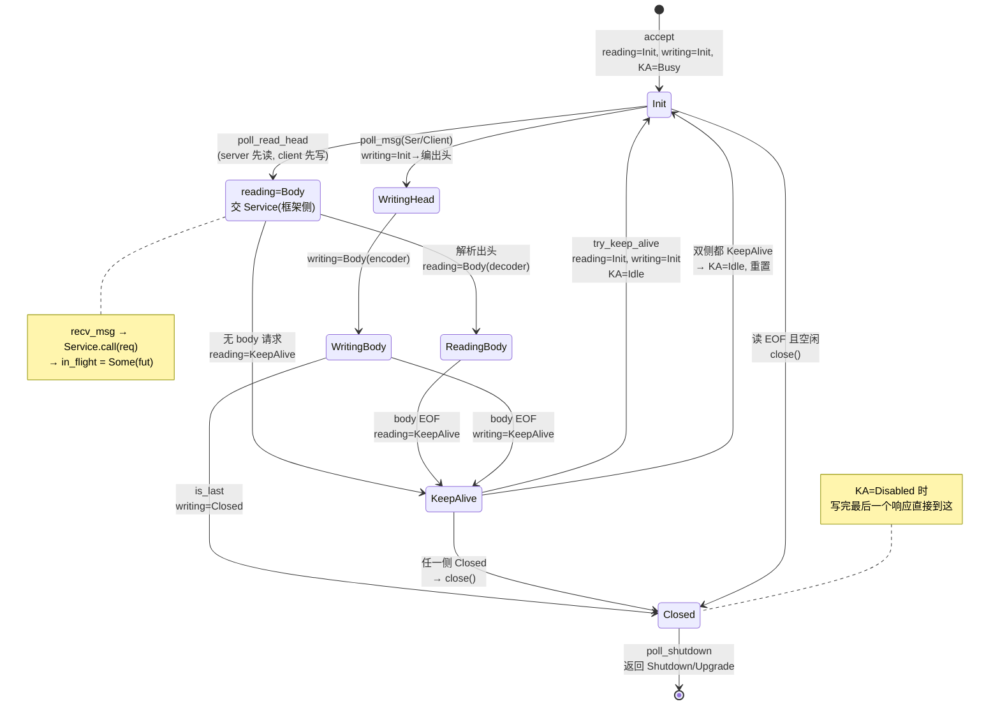
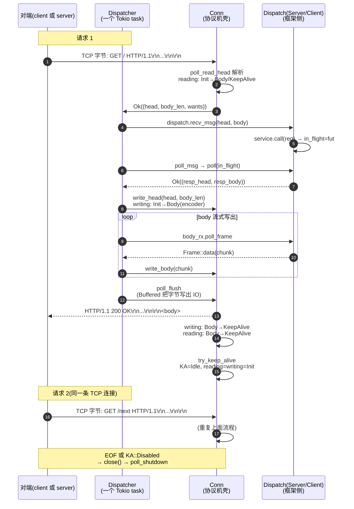
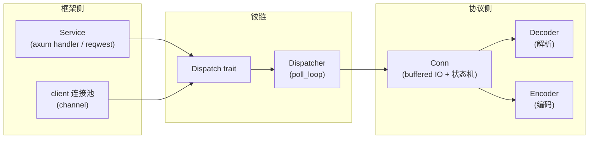

# 第 2 篇 · 第 5 章 · HTTP/1 连接与 keep-alive

> **核心问题**:第 1 篇我们拆完了框架地基——Service 把"处理一个请求"抽象成一个 Future、Body 把请求/响应体抽象成 Stream。从本章起,钻进协议侧的第一站:HTTP/1 协议机。可一条 TCP 连接 accept 进来,读到一个 HTTP 请求、把响应写出去之后,然后呢?连接是关掉、还是留着?如果留着,怎么在**同一条**连接上接着读下一条请求、再写下一条响应?谁在驱动这个"读 → 处理 → 写 → 再读"的循环?连接什么时候才算真正结束、它的生命周期有几个状态?为什么 client 和 server 共用同一套连接逻辑?这一章就把这条"在 Tokio 之上循环跑请求的 HTTP/1 连接"讲到读者脑子里能放映。

> **读完本章你会明白**:
> 1. 一条 HTTP/1 连接怎么**循环**处理多个请求(keep-alive):`dispatch.rs` 里 `poll_loop` 那个 `for _ in 0..16` 在干什么、为什么这么写。
> 2. keep-alive 为什么 HTTP/1.1 默认开、它省了什么、又埋了什么坑(怎么不泄漏连接、怎么不死锁)。
> 3. `Conn` 这个结构(`proto/h1/conn.rs`)是"一条 HTTP/1 连接的协议机壳",它内部装了什么(buffered IO + 解码器 + 编码器 + Role 状态)、它的 `Reading`/`Writing` 两个状态机怎么推进、`KA`(keep-alive 计数器)三态 `Idle`/`Busy`/`Disabled` 怎么迁移。
> 4. 为什么说 `Dispatcher` 是"协议侧与框架侧的铰链":它一边连着 `Conn`(协议机解码/编码),一边连着 `Dispatch` trait(框架侧的 `Server`/`Client`,后者又接到 `Service`)。
> 5. `Http1Transaction` 这个 trait 怎么用一个 `Server`/`Client` 的 enum、一个 `should_read_first()`、一个 `is_client()`/`is_server()`,让 client 和 server 共用同一套连接逻辑(谁先发、谁先收,就靠这几个方法分流)。

> **如果一读觉得太难**:先只记三件事——① 一条 HTTP/1 连接在一个 Tokio task 里跑一个 `Dispatcher` Future,Future 的 `poll` 就是"读一点、写一点、再循环";② keep-alive 就是"响应写完不关连接,留着读下一条请求",由 `Reading`/`Writing` 两个状态机在 `KeepAlive`/`Init`/`Closed` 之间迁移管理;③ client 和 server 用同一个 `Conn`/`Dispatcher`,差别只在 `Http1Transaction` 这个 trait 上的 `should_read_first()`(server 先读请求,client 先写请求)。这三条抓住了,后面看 `decode.rs`/`encode.rs` 就有了挂靠点。

---

## 〇、一句话点破

> **一条 HTTP/1 连接,在 hyper 里就是一个跑在 Tokio task 里的 `Dispatcher` Future。这个 Future 的 `poll` 干一件事:在一条 buffered IO 上反复跑"读请求头 → 读请求体 → 交 Service → 写响应头 → 写响应体 → flush → 看能不能 keep-alive,能就回到读下一条"这个循环。整个循环靠 `Conn` 内部的 `Reading` 和 `Writing` 两个状态机推进、靠 `KA` 三态决定"留不留连接",client 和 server 共用一套,差别只在 `Http1Transaction` 的 `should_read_first()`。**

这是结论。本章倒过来拆:先看一条连接的"宏观生命周期",再钻进 `Dispatcher::poll_loop` 看它一圈一圈在干什么,然后拆 `Conn` 这个壳的内部结构(`State` + `Buffered` + 解码器/编码器),接着拆 keep-alive 三态怎么迁移、怎么不泄漏,再拆 `Http1Transaction` 怎么让 client/server 共用一套,最后回到"铰链"这个比喻,把 dispatch 站在协议与框架之间的位置钉死。

> **承接《Tokio》**:这条连接的"等数据""等 Service""flush 字节"全是 `Poll::Pending`,task 挂起由 Tokio 调度;每个连接 spawn 一个 task、用 `AsyncRead/AsyncWrite`、靠 budget=128 让出、靠 timer 时间轮控超时——这些《Tokio》拆透的机制一句带过。本章篇幅全留 hyper 独有:**怎么在这条 Tokio 给的连接上,搭起一个 HTTP/1 协议循环,并让它 sound**(不丢请求、不泄漏连接、不饿死、不热循环)。

---

## 一、宏观:一条连接的完整生命周期

### 1.1 从 accept 到关闭:这条连接都经历了什么

先把"一条 HTTP/1 连接从生到死"的画面定下来,再钻源码。

一条 TCP 连接被 `tokio::net::TcpListener::accept` 拿到(这步在 `server/conn/`,第 5 篇拆)。hyper 把这条连接(`TokioIo` 包装的 `TcpStream`)交给 `Http::serve_connection`,后者内部:

1. 包一个 `Conn`(协议机壳,`proto/h1/conn.rs:50` 的 `Conn::new(io)`)——它把裸 IO 包成 buffered,并初始化状态机 `State { reading: Reading::Init, writing: Writing::Init, keep_alive: KA::Busy, .. }`。
2. 再包一个 `Dispatcher`(连接循环驱动器,`proto/h1/dispatch.rs:80` 的 `Dispatcher::new(dispatch, conn)`)——它持有 `Conn`,再加一个 `dispatch`(server 侧是 `Server { service, in_flight }`,client 侧是 `Client { rx, callback }`)、一个 body 收发的 drop guard、一个 `is_closing` 标志。
3. 这个 `Dispatcher` **本身实现了 `Future`**(`proto/h1/dispatch.rs:479` 的 `impl Future for Dispatcher`,`Output = crate::Result<Dispatched>`)。把它 `tokio::spawn` 出去,就**等于把"这条连接的协议循环"交给 Tokio 调度**。

> **钉死这件事**:hyper 的"每连接一个 task",落到 HTTP/1,就是"每连接一个 `Dispatcher` Future"。这个 Future 的 `poll`(`dispatch.rs:495`)就是这条连接的协议循环。task 的生命周期 = `Dispatcher` Future 的生命周期 = 这条连接跑协议机的生命周期。三者一一对应。

连接的"死法"有三种:

- **正常关闭**:读到 EOF 且没有在途请求(`Reading::Init` 且空闲,`should_error_on_parse_eof()` 返回 `false`),或 client 主动关写、server 处理完最后一个请求。`Dispatcher::poll_inner` 检测到 `is_done()`(`dispatch.rs:461`),调 `conn.poll_shutdown`(`conn.rs:835`)关底层 IO,Future 返回 `Ok(Dispatched::Shutdown)`。
- **错误关闭**:解析错、IO 错、协议错——`poll_catch`(`dispatch.rs:123`)用 `or_else` 兜住,把错误交给 `dispatch.recv_msg(Err(e))`,然后 `Ok(Dispatched::Shutdown)`。
- **协议升级**:websocket/h2c——`poll_inner` 检测到 `conn.pending_upgrade()`(`conn.rs:163`),返回 `Ok(Dispatched::Upgrade(pending))`,连接的 IO 被"偷走"交给升级后的协议(第 P2-07/P3-09 章)。

### 1.2 Conn 生命周期状态图

把上面的"生到死"抽象成状态,就是 `Conn` 的 `Reading`/`Writing`/`KA` 三个维度的状态机。其中 `Reading`(`conn.rs:964`)和 `Writing`(`conn.rs:972`)是"这条连接在读什么/写什么"的进度,`KA`(`conn.rs:1022`)是"这条连接还能不能 keep-alive"的计数器。三者合起来描述一条连接的完整生命周期。

下面这张状态图只画"读写进度 + KA 计数"的核心迁移(简化,非源码全分支):



> **钉死这张图**:`Reading` 和 `Writing` 是**两条独立**的状态机(一条连接可以"读在 Body、写在 Body",也可以"读已 KeepAlive、写还在 Body"——这正是 server 处理一个有 body 的请求时、响应边算边写的常态)。`try_keep_alive`(`conn.rs:568`/`1072`)是"双侧都到了 `KeepAlive` 就重置成 `Init`、`KA` 置 `Idle`"的唯一收口。`KA::Disabled` 是个"一旦置上、写完就关"的不可逆开关。

### 1.3 keep-alive 连接上的循环时序

把上面那个状态机"摊开成时间",就是一条 keep-alive 连接上请求 1 → 响应 1 → 请求 2 → 响应 2 的时序:



这张时序图就是本章的"主旋律"。后面每一节,都是在拆这张图里某个箭头在源码里怎么落地的。

> **对照《Tokio》**:图里每一条"等"——等字节、等 Service、等 flush——都是 `Poll::Pending`,task 挂起,让出 worker 线程;每一个"等"被唤醒,都是 Tokio 的 reactor(epoll/kqueue 边沿触发)或 `Waker` 把 task 重新塞回调度队列。这套机制《Tokio》拆到源码级,本章不重讲,只看"hyper 怎么在这套机制上搭协议循环"。

---

## 二、dispatch 循环:这条连接的心脏

上一节是宏观画面。现在钻进源码,看那条循环在 hyper 里**到底是怎么写的**。入口是 `Dispatcher::poll`。

### 2.1 Dispatcher 是个 Future

`Dispatcher` 实现了 `Future`(`proto/h1/dispatch.rs:479`):

```rust
// hyper/src/proto/h1/dispatch.rs:479-498
impl<D, Bs, I, T> Future for Dispatcher<D, Bs, I, T>
where
    D: Dispatch< /* ... */ > + Unpin,
    I: Read + Write + Unpin,
    T: Http1Transaction + Unpin,
    Bs: Body + 'static,
{
    type Output = crate::Result<Dispatched>;

    #[inline]
    fn poll(mut self: Pin<&mut Self>, cx: &mut Context<'_>) -> Poll<Self::Output> {
        self.poll_catch(cx, true)
    }
}
```

一个 `Dispatcher` Future 的产出是 `Dispatched`(`Shutdown` 或 `Upgrade(pending)`)。这个 Future 被 `tokio::spawn`(server 在 `service::http::Http::serve_connection` 里,client 在 `client::conn` 的 `Connection` Future 里)——task 跑起来,Tokio 就一遍遍调它的 `poll`。

`poll` 直接调 `poll_catch(cx, true)`(`dispatch.rs:495`)。`poll_catch`(`dispatch.rs:123`)做两件事:

1. 调 `poll_inner(cx, should_shutdown)`(`dispatch.rs:143`),它先 `poll_loop` 跑循环,再判 `is_done()` 决定收尾。
2. 如果 `poll_inner` 返回 `Err`,兜住:给在途的 body 发错误、把错误交给 `dispatch.recv_msg`,然后返回 `Ok(Dispatched::Shutdown)`(把"协议错"转成"正常关连接",因为错误已经给用户了)。

> **所以这样设计**:把"循环驱动"和"错误兜底"分成 `poll_inner` 和 `poll_catch` 两层,是为了让循环逻辑(`poll_loop`/`poll_read`/`poll_write`)只管"做了能做的、没数据就 `Pending`",错误**统一**在最外层兜——body 的 sender 不会因为循环半路出错而漏掉通知(`poll_catch` 显式 `body.send_error`),`Dispatch::recv_msg(Err(e))` 也保证用户能看到错误。这就是为什么 hyper 即使在中途崩溃,也不会让上层看到一个"神秘地静默结束"的 body 流。

### 2.2 poll_loop:一圈一圈跑,但最多 16 圈

真正的循环在 `poll_loop`(`proto/h1/dispatch.rs:166`):

```rust
// hyper/src/proto/h1/dispatch.rs:166-214 (摘录, 省略部分注释)
fn poll_loop(&mut self, cx: &mut Context<'_>) -> Poll<crate::Result<()>> {
    // Limit the looping on this connection, in case it is ready far too
    // often, so that other futures don't starve.
    //
    // 16 was chosen arbitrarily, as that is number of pipelined requests
    // benchmarks often use. Perhaps it should be a config option instead.
    for _ in 0..16 {
        let _ = self.poll_read(cx)?;
        let write_ready = self.poll_write(cx)?.is_ready();
        let flush_ready = self.poll_flush(cx)?.is_ready();

        let wants_write_again = self.can_write_again() && (write_ready || flush_ready);
        let wants_read_again = self.conn.wants_read_again();

        if !(wants_write_again || wants_read_again) {
            return Poll::Ready(Ok(()));
        }

        if !wants_read_again && wants_write_again {
            if self.poll_write(cx)?.is_pending() {
                return Poll::Ready(Ok(()));
            }
        }
    }
    trace!("poll_loop yielding (self = {:p})", self);
    task::yield_now(cx).map(|never| match never {})
}
```

这一段是整章最该逐句嚼的地方。它回答了三个关键问题。

**问题一:为什么是 `for _ in 0..16`?** ——防饿死。一个 task 的 `poll` 如果无限循环下去(比如 keep-alive 连接上请求源源不断、解析又快),它就一直占着 worker 线程,别的 task 饿死。hyper 用"最多连续转 16 圈,16 圈后主动 `yield_now` 让出"做协作式让出。注释直说 16 是拍脑袋的——取流水线 benchmark 常用的请求数。这一招和 Tokio 的 budget=128(让一个 task 在 async 调用点上累计让出)是同一个思路的不同粒度:Tokio budget 在每次 `await` 上扣,budget 到了让出;hyper 的 16 圈是连接级的"批量让出",一次 `poll` 内部能连发 16 个请求响应再让出。

> **承接《Tokio》**:budget=128 让出机制在《Tokio》已拆透(每连接 task 内部,深递归 `await` 累计 budget,到 128 返回 `Pending`)。hyper 这里的 `for _ in 0..16` 是**连接级**的额外让出——它防的是"这条连接太能干了,自己一直 Ready,把别的连接的 task 饿死"。两者叠加,既防"单 task 内部某个 `await` 链路太深"(budget),又防"单 task 的整个 poll 循环太忙"(16 圈)。

**问题二:为什么是 `poll_read` → `poll_write` → `poll_flush` 这个顺序,而不是别的?** ——因为 HTTP/1 是**半双工偏请求-响应**:server 侧,先有请求才能有响应;client 侧,先把请求写出去才有响应回来。把"读"放最前,优先把 socket 里堆积的字节吃进来解析(尤其是流水线场景,client 一次发多个请求,server 要连读带解析);写和 flush 跟在后面,把上一次 poll 算好的响应吐出去。注意它**不是**"读完一个请求再写响应",而是"能读就读一点、能写就写一点、能 flush 就 flush"——三个轮子独立转,合起来推进整个连接。

**问题三:`wants_write_again` 和 `wants_read_again` 那两行在防什么?** ——防**死锁**和**热循环**。

- `wants_write_again = can_write_again() && (write_ready || flush_ready)`:如果 body 还没写完、而且刚写或刚 flush 成功了,那"很可能还能再写一点"(比如又攒了一个 chunk),应该再转一圈。注释点明:如果这里不主动再写,直接 `return Pending`,**没有任何东西会来唤醒这条连接**(write 侧不会自己 Wake),就死锁了。
- `wants_read_again = conn.wants_read_again()`(`conn.rs:429`):这是一个"刚被写的进度反推回来,得回头再读一次"的信号。典型场景——server 解析到一个 body 为空的请求,`reading` 直接进了 `KeepAlive`,`poll_read` 看到 `can_read_head()` 是 false 就不会再读了;但紧接着写完响应后 `try_keep_alive` 把 `reading`/`writing` 重置成 `Init`,此时 socket 里**可能还堆着下一个请求的字节**(流水线),不回头再读一次就永远 `Pending`,没人唤醒。`notify_read` 标志(`conn.rs:948`/`1104`)就是这个"得回头再读"的信号,`idle()` 里置 true,`wants_read_again()` 取走它(`conn.rs:429-433`)。

> **钉死这件事**:这个 `poll_loop` 不是简单的"读-写-flush"顺序循环,而是一个**精心设计的、防饿死+防死锁+防热循环的三轮联动**。每一圈都问"还能再转吗":能转就转(直到 16 圈或没东西可转),转不动了 `return Ready(Ok(()))` 让 `poll_inner` 判 `is_done`——如果连接没关,Future 就 `Pending`,等 Tokio 下次唤醒;如果关了,返回 `Shutdown`/`Upgrade`。

### 2.3 三轮:poll_read / poll_write / poll_flush 各管什么

`poll_loop` 一圈转下来,要调三个 `poll_xxx`。它们各自的职责分工清楚,合起来才是一个完整的"读请求 → 交 Service → 写响应 → flush"。

**(1) `poll_read`(`dispatch.rs:216`)**:负责"从连接读进来"。

它是一个 `loop`,按优先级问三个问题:

```rust
// hyper/src/proto/h1/dispatch.rs:216-290 (简化示意, 非源码原文)
fn poll_read(&mut self, cx) -> Poll<crate::Result<()>> {
    loop {
        if self.is_closing { return Ready(Ok(())); }
        else if self.conn.can_read_head() {
            // 1. 能读请求头吗? 能就读
            ready!(self.poll_read_head(cx))?;
        } else if let Some(mut body) = self.body_tx.take() {
            // 2. 有请求体要往下传吗?
            if self.conn.can_read_body() {
                // 从 Conn 读一帧 body, 经 body_tx 推给上层 Service
                match self.conn.poll_read_body(cx) { /* ... */ }
            }
        } else {
            // 3. 都不用, 就看看 keep-alive 等不等
            return self.conn.poll_read_keep_alive(cx);
        }
    }
}
```

注意它**先判 `can_read_head`、再判 body_tx、最后判 keep-alive**,优先级明确:有头先读头,有 body 在途就传 body,都没有就守着 keep-alive(检测 EOF)。这个优先级,决定了"流水线下一个请求的字节到了"也能被及时读到——因为读完上一个 body 后 `reading` 进 `KeepAlive` → `try_keep_alive` 重置成 `Init` → 下一圈 `can_read_head` 又是 true,继续读下一个头。

`poll_read_head`(`dispatch.rs:292`)是这个分支的核心:先问 `dispatch.poll_ready`(框架侧 ready 吗?server 侧是"in_flight 为空,Service 能接下一个请求"吗?见 `dispatch.rs:626`),ready 了才调 `conn.poll_read_head`(`conn.rs:211`)真正解析字节。**这一步"先 ready 再读"是关键**——它实现"Service 没准备好就不读请求"的背压,防止 socket 字节被读进来却没有 Service 可交(请求堆在 Dispatcher 里撑爆内存)。

> **钉死这件事**:背压在这里发生——`poll_read_head` 第一行就是 `ready!(self.dispatch.poll_ready(cx))`(`dispatch.rs:294`)。server 侧 `Server::poll_ready`(`dispatch.rs:626`)返回"in_flight 为空就 Ready,否则 Pending"。也就是说,**Service 还在处理上一个请求时,Dispatcher 根本不会去读下一个请求的字节**,只会让它们留在 socket/`read_buf` 里。这就是 hyper 不靠"请求队列"承压、而靠"Service ready 才读"做背压的根本机制。

**(2) `poll_write`(`dispatch.rs:347`)**:负责"把响应写出去"。

也是个 `loop`,四个分支:

- `is_closing` → 直接返回。
- `body_rx` 没东西、但 `can_write_head` 且 `dispatch.should_poll()` → 调 `dispatch.poll_msg`(server 侧:poll 那个 `in_flight` Future 拿响应;client 侧:从 channel 收一个请求)拿到 `(head, body)`,写头(`conn.write_head`,`conn.rs:595`)。
- `!can_buffer_body`(写缓冲满了)→ 先 `poll_flush` 腾地方。
- 否则 → `body_rx.poll_frame` 取一帧 body,是 data 就 `write_body`/`write_body_and_end`,是 trailers 就 `write_trailers`,取空了就 `end_body`。

这里有一个特别巧妙的 `OptGuard`(`dispatch.rs:504-522`),用来"可变借用 `body_rx` 的同时,允许中途决定要不要清空它"。`poll_frame` 出错、或 body 结束(`is_end_stream`)、或拿到 trailers,都要把 `body_rx` 清成 `None`——但 `poll_frame` 是 `Pin<&mut Bs>` 的调用,这个 `&mut` 还没释放,不能直接 `self.body_rx = None`。`OptGuard` 用 RAII:借的时候带一个 `clear: bool`,要清就在 `Drop` 时把 `Option` 置 `None`。

> **不这样会怎样**:如果朴素地写"先 match `poll_frame` 结果再决定清不清",会陷入"清空时借用还没释放"的编译错误——Rust 的借用检查器不让你在持有 `&mut body` 的同时写 `self.body_rx = None`。`OptGuard` 用一个延迟到 `Drop` 的 `clear` 标志,优雅地绕开了"在借用中途修改 Option 自身"的难题。这是 hyper 里 Rust 借用检查逼出的小巧设计之一。

**(3) `poll_flush`(`dispatch.rs:442`)**:把写缓冲的字节真正推到 IO。

```rust
// hyper/src/proto/h1/dispatch.rs:442-447
fn poll_flush(&mut self, cx: &mut Context<'_>) -> Poll<crate::Result<()>> {
    self.conn.poll_flush(cx).map_err(|err| {
        debug!("error writing: {}", err);
        crate::Error::new_body_write(err)
    })
}
```

它就一行,转发到 `Conn::poll_flush`(`conn.rs:828`),后者又转发到 `Buffered::poll_flush`(`io.rs:266`)。`Buffered` 的 flush 真正在干"把 `write_buf` 里的字节用 `poll_write`/`poll_write_vectored` 写到 socket"——这是第 6 章(buffered IO)的主菜,这里只要知道"flush 把写缓冲清空到 OS"。

> **所以这样设计**:三个 `poll_xxx` 各管一段——`poll_read` 管"字节进来变请求",`poll_write` 管"响应变字节写进缓冲",`poll_flush` 管"缓冲的字节推到 socket"。三者**独立**`Pending`/`Ready`,合起来推进整个请求-响应周期。这种"读/写/flush 三轮独立 poll"的写法,是 hyper 在异步连接管理上的招牌结构,后面 client/server/h2 都沿用同一思路。

---

## 三、Conn:一条 HTTP/1 连接的协议机壳

上一节讲了"驱动器"`Dispatcher`,它持有 `Conn`。现在拆 `Conn` 本身——它是"一条 HTTP/1 连接的协议机壳"。

### 3.1 Conn 的结构:buffered IO + State(解码器+编码器+Role 状态)

`Conn` 的定义极其简洁(`proto/h1/conn.rs:38`):

```rust
// hyper/src/proto/h1/conn.rs:38-42
pub(crate) struct Conn<I, B, T> {
    io: Buffered<I, EncodedBuf<B>>,
    state: State,
    _marker: PhantomData<fn(T)>,
}
```

三个字段:

- `io: Buffered<I, EncodedBuf<B>>`——把底层 IO(`I: Read + Write`,如 `TokioIo<TcpStream>`)包成 buffered。`Buffered`(`proto/h1/io.rs:32`)内部有 `read_buf: BytesMut`(读缓冲)和 `write_buf: WriteBuf<B>`(写缓冲,可以是 Flattened 单 buf 或 Queue 多 buf 的 BufList)。`EncodedBuf<B>` 是写缓冲里 buf 的类型,带编码信息(chunked 边界等)。
- `state: State`——这条连接的全部协议状态(下面单拆)。
- `_marker: PhantomData<fn(T)>`——把泛型 `T: Http1Transaction`(Server 还是 Client)挂上。注意是 `PhantomData<fn(T)>` 不是 `PhantomData<T>`——前者不持有 T、不要求 T 的 variance,只用来让编译器知道"这个结构的行为依赖 T"。这是 Rust 里"类型参数只用于编译期分流"的标准写法。

`State`(`conn.rs:912`)字段很多,但分三组就清楚:

**A. 解码进度组(管"读")**:`reading: Reading`(`conn.rs:964`,五态 `Init`/`Continue(Decoder)`/`Body(Decoder)`/`KeepAlive`/`Closed`)、`cached_headers: Option<HeaderMap>`(复用 HeaderMap 减分配)、`method: Option<Method>`(在途请求的 method,用来判断"能不能有 body")、`h1_parser_config`/`h1_max_headers`(解析器配置)、`allow_trailer_fields`(要不要接受 trailer)。

**B. 编码进度组(管"写")**:`writing: Writing`(`conn.rs:972`,四态 `Init`/`Body(Encoder)`/`KeepAlive`/`Closed`)、`title_case_headers`/`preserve_header_case`(头大小写策略)、`date_header`(server 是否自动加 Date)、`timer: Time`(server 的 timer 句柄)。

**C. keep-alive 与连接级组**:`keep_alive: KA`(`conn.rs:1022`,三态 `Idle`/`Busy`/`Disabled`)、`error: Option<crate::Error>`(延迟错误)、`upgrade: Option<Pending>`(协议升级占位)、`version: Version`(`HTTP_10`/`HTTP_11`,决定 keep-alive 默认行为)、`allow_half_close`(server 是否允许只关读不关写)、`h1_header_read_timeout` + `h1_header_read_timeout_fut` + `h1_header_read_timeout_running`(server 读头超时三件套)、`notify_read`(回头再读信号)、`on_informational`(client 收到 1xx 的回调)。

下面这张 ASCII 图把 `Conn` 的内部结构摆出来:

```
┌─────────────────────────── Conn<I, B, T> ───────────────────────────┐
│                                                                       │
│  ┌──────────── io: Buffered<I, EncodedBuf<B>> ──────────────┐        │
│  │                                                            │        │
│  │  read_buf: BytesMut ◄──● poll_read_from_io 读 socket 进来  │        │
│  │     ▲                      (io.rs:219)                     │        │
│  │     │                      ● parse (io.rs:169) 在这上面切头│        │
│  │                                                            │        │
│  │  write_buf: WriteBuf<EncodedBuf<B>>                        │        │
│  │     ● headers_buf (io.rs:139): 头写到这里                  │        │
│  │     ● buffer() (io.rs): body chunk 写到这里                 │        │
│  │     ▼                                                      │        │
│  │  poll_flush (io.rs:266): 用 poll_write(vectored) 推 socket │        │
│  │                                                            │        │
│  │  io: I ◄── 底层 Read + Write (TokioIo<TcpStream>)          │        │
│  └────────────────────────────────────────────────────────────┘        │
│                                                                       │
│  ┌──────────────────── state: State ─────────────────────────┐        │
│  │                                                            │        │
│  │  解码进度:                                                  │        │
│  │    reading: Reading                                        │        │
│  │       Init → Continue(dec) → Body(dec) → KeepAlive → Init │        │
│  │                                              ↘ Closed     │        │
│  │    cached_headers: Option<HeaderMap>  (复用)              │        │
│  │    method: Option<Method>                                  │        │
│  │                                                            │        │
│  │  编码进度:                                                  │        │
│  │    writing: Writing                                        │        │
│  │       Init → Body(enc) → KeepAlive → Init                  │        │
│  │                          ↘ Closed                          │        │
│  │                                                            │        │
│  │  keep-alive:                                               │        │
│  │    keep_alive: KA   Idle ⇄ Busy   Disabled(不可逆)         │        │
│  │    version: HTTP_10 | HTTP_11                              │        │
│  │    notify_read: bool  (回头再读信号)                        │        │
│  │    upgrade: Option<Pending>  (协议升级占位)                 │        │
│  │    error: Option<Error>     (延迟错误)                      │        │
│  │    [server] timer, h1_header_read_timeout*                  │        │
│  │    [client] on_informational                                │        │
│  └────────────────────────────────────────────────────────────┘        │
│                                                                       │
│  _marker: PhantomData<fn(T)>   (T = Server | Client, 编译期分流)      │
└───────────────────────────────────────────────────────────────────────┘
```

> **钉死这张图**:`Conn` = "buffered IO(`io` 字段)" + "协议状态(`state` 字段)" + "编译期 Role(`_marker` 字段)"。 buffered IO 负责字节的进出(第 6 章拆),State 负责把"字节"解读成"HTTP 进度",`PhantomData<fn(T)>` 让同一份代码服务 Server 和 Client。三个字段合起来,就是"一条 HTTP/1 连接的协议机壳"。

### 3.2 Reading 状态机:从 Init 到 KeepAlive 再回 Init

`Reading`(`conn.rs:964`)五态的迁移,本质是"读请求的过程"。

```rust
// hyper/src/proto/h1/conn.rs:963-970
#[derive(Debug)]
enum Reading {
    Init,
    Continue(Decoder),
    Body(Decoder),
    KeepAlive,
    Closed,
}
```

- `Init`:刚 accept 或刚 keep-alive 重置,等着读下一个请求的头。
- `Continue(Decoder)`:请求头解析出来了,但带 `Expect: 100-continue`,server 要先发 `100 Continue` 再读 body(第 P2-07 章拆)。`poll_read_body`(`conn.rs:409`)在这个状态会先把 `HTTP/1.1 100 Continue\r\n\r\n` 写进 headers_buf,然后 clone decoder 转成 `Body` 状态递归一次。
- `Body(Decoder)`:正在读 body。`poll_read_body`(`conn.rs:363`)调 `decoder.decode` 一帧帧解。
- `KeepAlive`:body 读到 EOF,等"写也到 KeepAlive 了"就重置。`poll_read_body` 解到 `decoder.is_eof()` 就 `reading = Reading::KeepAlive`(`conn.rs:378`)。
- `Closed`:读关闭。EOF(且不在 mid-message)、解析错、或主动关。

`try_keep_alive`(`conn.rs:1072`)是 Reading 和 Writing **同时**进 `KeepAlive` 时的收口:

```rust
// hyper/src/proto/h1/conn.rs:1072-1091 (摘录)
fn try_keep_alive<T: Http1Transaction>(&mut self) {
    match (&self.reading, &self.writing) {
        (&Reading::KeepAlive, &Writing::KeepAlive) => {
            if let KA::Busy = self.keep_alive.status() {
                self.idle::<T>();       // → KA::Idle, reading=Init, writing=Init
            } else {
                // KA 已被 Disabled, 直接关
                self.close();
            }
        }
        (&Reading::Closed, &Writing::KeepAlive) | (&Reading::KeepAlive, &Writing::Closed) => {
            self.close();   // 一侧关了, 另一侧也别撑着
        }
        _ => (),  // 还在 Body, 什么都不做
    }
}
```

注意它要求**双侧都 KeepAlive** 才能重置——这是 sound 的关键:server 不能"读完了 body 就立刻进 Init",因为此时响应可能还没写完(`writing` 还在 `Body`)。只有读写双侧都完成了一个完整消息,才算"这一轮请求-响应真的结束了",才能进 idle 等下一个。

> **不这样会怎样**:如果只看 Reading 不看 Writing 就重置,会出现"读完了上一个请求 body,立刻开始读下一个请求,但响应还没写完"的混乱——状态机分不清"现在读的字节属于哪个请求"。HTTP/1 是严格的请求-响应顺序协议,Reading 和 Writing 必须协同迁移,`try_keep_alive` 的双侧检查就是这个协议不变量的守护者。

### 3.3 Writing 状态机:写响应的进度

`Writing`(`conn.rs:972`)四态,和 Reading 对称:

```rust
// hyper/src/proto/h1/conn.rs:972-977
enum Writing {
    Init,
    Body(Encoder),
    KeepAlive,
    Closed,
}
```

- `Init`:刚重置,等写响应头。
- `Body(Encoder)`:头写完了,正在写 body。`write_body`(`conn.rs:704`)往 `Encoder` 编码后塞进 `io.buffer`;`write_body_and_end`(`conn.rs:754`)是一次性写完并结束;`end_body`(`conn.rs:774`)是显式结束(写 chunked 终止符 `0\r\n\r\n` 之类)。
- `KeepAlive`:body 写到 EOF,等读侧也 KeepAlive。`write_body` 里 `encoder.is_eof()` 且非 `is_last()` 时进 `Writing::KeepAlive`(`conn.rs:720`)。
- `Closed`:写关闭。`is_last()`(Connection: close)或 EOF 错。

`Encoder`(在 `encode.rs`,第 P2-08 章拆)负责把"响应 body 的 chunk"编码成字节——可能是 Content-Length 定长、可能是 chunked、可能是 eof-delimited(靠关连接标结束)。`encoder.is_eof()`/`is_last()`/`is_close_delimited()` 几个标志,决定写完后进 `KeepAlive` 还是 `Closed`。

### 3.4 KA:keep-alive 的三态计数器

`KA`(`conn.rs:1022`)是 keep-alive 的状态机:

```rust
// hyper/src/proto/h1/conn.rs:1022-1028
#[derive(Clone, Copy, Debug, Default)]
enum KA {
    Idle,
    #[default]
    Busy,
    Disabled,
}
```

三个状态的语义:

- `Busy`(**默认值**,见 `#[default]`):连接正在处理请求。新建 `Conn`(`conn.rs:57`)就置 `Busy`,因为刚 accept 进来"马上要处理第一个请求"。
- `Idle`:连接空闲,等下一个请求。`try_keep_alive` → `idle()`(`conn.rs:1104`)置 `Idle`,同时把 `reading`/`writing` 重置成 `Init`。
- `Disabled`:keep-alive 被永久关闭,不可逆。一旦 `disable()`(`conn.rs:1039`),`try_keep_alive` 会走 `self.close()` 分支——`KA::Disabled` 是"写完这个就关连接"的意思。

`KA` 还有几个迁移函数(`conn.rs:1030-1045`):`idle()`/`busy()`/`disable()`/`status()`。还有个特殊的 `BitAndAssign<bool>`(`conn.rs:1013`):

```rust
// hyper/src/proto/h1/conn.rs:1013-1020
impl std::ops::BitAndAssign<bool> for KA {
    fn bitand_assign(&mut self, enabled: bool) {
        if !enabled {
            trace!("remote disabling keep-alive");
            *self = KA::Disabled;
        }
    }
}
```

这个 `&=` 操作符重载,用在 `poll_read_head` 解析出头后(`conn.rs:294`):

```rust
self.state.busy();
self.state.keep_alive &= msg.keep_alive;   // msg.keep_alive 是 false 就 disable
```

`msg.keep_alive` 来自请求头解析——`Connection: close` 就 false,`Connection: keep-alive`(HTTP/1.0 显式)或默认(HTTP/1.1)就 true。`&=` 写法让"对端说不要 keep-alive"用一行简洁表达,而且语义清晰(`a &= false` → 关掉)。

> **钉死这件事**:`KA` 是一个三态计数器,默认 Busy(刚连上就要处理)。读到对端 `Connection: close`(`&=` 那行)或本端要关(`disable_keep_alive`),就转 Disabled——一旦 Disabled 不可逆,后续所有 `try_keep_alive` 都走 `close()`。这个"不可逆"是关键:它保证 keep-alive 一旦被任一方否决,连接**必然**在当前消息结束后关掉,不会出现"我说要关、你又复用"的协议错乱。

---

## 四、keep-alive:为什么 HTTP/1.1 默认开,怎么不泄漏、不死锁

现在专门拆 keep-alive——它是本章标题的一半,也是"sound"问题的核心。

### 4.1 为什么 HTTP/1.1 默认开 keep-alive

先讲动机。一条 TCP 连接的成本,大头是**握手**(三次握手 + TLS 如果有的话)。HTTP/1.0 默认每个请求开一条连接、用完关掉,client 发 100 个请求就握 100 次手——握手是网络往返(RTT),在高延迟链路上尤其贵。

keep-alive 的本质是:**用完一条连接不关,留着读下一个请求**。100 个请求如果都打到同一个 host,就握 1 次手,省 99 次 RTT。

HTTP/1.1 把 keep-alive 设成**默认**(`Connection` 头不写就是 keep-alive),HTTP/1.0 要显式 `Connection: keep-alive`。hyper 在 `Conn::new` 把 `KA` 置 `Busy`(`conn.rs:57`,注释明说"假设现代世界,远端是 1.1",行 82-83),并在 `fix_keep_alive`(`conn.rs:656`)处理版本差异:

```rust
// hyper/src/proto/h1/conn.rs:656-678 (摘录)
fn fix_keep_alive(&mut self, head: &mut MessageHead<T::Outgoing>) {
    let outgoing_is_keep_alive = head
        .headers
        .get(CONNECTION)
        .map_or(false, headers::connection_keep_alive);

    if !outgoing_is_keep_alive {
        match head.version {
            // If response is version 1.0 and keep-alive is not present in the response,
            // disable keep-alive so the server closes the connection
            Version::HTTP_10 => self.state.disable_keep_alive(),
            // If response is version 1.1 and keep-alive is wanted, add
            // Connection: keep-alive header when not present
            Version::HTTP_11 => {
                if self.state.wants_keep_alive() {
                    head.headers
                        .insert(CONNECTION, HeaderValue::from_static("keep-alive"));
                }
            }
            _ => (),
        }
    }
}
```

这段处理的场景:HTTP/1.0 的响应默认不 keep-alive(没 `Connection: keep-alive` 就关);HTTP/1.1 的响应默认 keep-alive(没 `Connection: close` 就留)。`enforce_version`(`conn.rs:682`)还做一件事:如果 `KA::Disabled`,响应头强制加 `Connection: close`(`conn.rs:692-695`),让对端知道"这个用完就关"。

> **对照《gRPC》**:gRPC 长在 HTTP/2 之上,HTTP/2 一条连接天然多路复用(一个 TCP 跑上百个并发 stream),根本不需要"keep-alive"这个概念——它默认就是一条连接跑一辈子。HTTP/1 的 keep-alive 是"用串行复用(一个请求一个响应、再一个)换连接复用"的折中,这是 HTTP/1 协议本身的限制(详见第 P2-06 章流水线为什么没救起来)。hyper 的 keep-alive 实现就是在这个限制下做到最好。

### 4.2 怎么不泄漏连接:idle 检测 + 超时关闭

keep-alive 的反面就是"泄漏"。如果一条 keep-alive 连接留着不用、又永远不关,它就占着一个 fd、一个 task、一份内存,泄漏。

hyper 防泄漏的机制有两层(server 侧,client 侧第 P4-14 章拆):

**第一层:`h1_header_read_timeout`**(`conn.rs:929`/`145`)。server 可以配"读头超时"——一个请求读着头的时间超过阈值,就报 `header_timeout` 错误关连接(`conn.rs:264`)。这防的是"client 发了半个请求头就卡住"的连接。

**第二层:EOF 检测**。`poll_read` 走到 `poll_read_keep_alive`(`conn.rs:435`)分支时,server 侧走 `mid_message_detect_eof`、client 侧走 `require_empty_read`(`conn.rs:458`)。这两个函数会主动 `force_io_read`(`conn.rs:510`)试读一次——读到 0 字节就是 EOF,说明对端关了连接,`close_read()` 让连接收尾。

`require_empty_read`(`conn.rs:458`)是 client 侧的特殊检查:client idle 时(等用户发下一个请求),如果 socket 突然来字节,那是"server 不经请求就发数据",直接报 `unexpected_message` 错(`conn.rs:465`)。这防的是协议错乱。

> **钉死这件事**:hyper 不靠"定时器扫一遍连接池回收 idle 连接"(那是 client 侧连接池的事,第 P4-14 章),server 侧靠"读到 EOF 就关"做被动回收。`force_io_read` 在 idle 状态主动试读,就是为了"对端关了我立刻知道"——异步 IO 里 EOF 和正常可读是一样的事件(都让 `poll_read` 返回 Ready),所以这个检测是零成本的(就是常规的 `poll_read` 返回 0)。

### 4.3 怎么不死锁:Service 没返回响应时,连接在等什么

第二个 sound 问题是死锁。考虑这个场景:

- server 读到一个请求,交给 `Service`,`Service` 要查数据库,10 秒才返回。
- 这 10 秒里,这条连接(它的 `Dispatcher` task)在干什么?

答案:**它在 `Pending`,被 Tokio 挂起**。具体说,`poll_loop` 转一圈:`poll_read` 里读完头、`recv_msg` 把请求塞给 `in_flight`(`dispatch.rs:622`);下一圈 `poll_write` 里 `dispatch.should_poll()` 是 true(`in_flight.is_some()`,`dispatch.rs:635`),`poll_msg` 去 `poll(in_flight)`,Service 还没好 → `Pending`。整个 `poll_loop` 返回 `Pending`,`Dispatcher` Future 挂起,task 让出线程。

10 秒后 Service 的 Future Ready(它的 `Waker` 把 `Dispatcher` task 唤醒),Tokio 重新 poll `Dispatcher`,这回 `poll_msg` 拿到响应,`write_head` → `poll_write` body → `poll_flush`,响应出去。

> **承接《Tokio》**:这个"Service 没好就 `Pending`、好了被 `Waker` 唤醒"就是《Tokio》拆透的 Future/Poll/Waker 模型。hyper 的贡献是**把 HTTP 协议循环表达成一个 Future**,让"等 Service"这个"等"天然变成 `Pending`,不阻塞线程。如果是同步阻塞模型,这 10 秒就占着线程;在 hyper+Tokio,这 10 秒线程去服务别的连接了。这就是"一连接一 task + M:N 调度"在 HTTP server 上的红利。

但还有一个更微妙的死锁:流水线。HTTP/1.1 允许流水线——client 一次性发请求 1、2、3,server 要按顺序响应 1、2、3。如果 hyper 把请求 1 还没写完响应就开始读请求 2 的 body,会不会乱?不会,因为 `poll_read_head` 第一行 `ready!(self.dispatch.poll_ready(cx))`(`dispatch.rs:294`)做背压:server 侧 `Server::poll_ready`(`dispatch.rs:626`)是"in_flight 为空才 Ready"——也就是说,**上一个响应没写完(`in_flight` 还在),根本不会去读下一个请求的头**。流水线的字节会堆在 `read_buf` 里等,不会乱序。

`poll_loop` 里的 `wants_read_again`(`dispatch.rs:191`)就是处理"上一个响应刚写完、`in_flight` 清空、`reading` 重置成 Init、`read_buf` 里还堆着下一个请求"的情况——回头再读一次,把堆着的请求读出来。

> **钉死这件事**:防死锁的三个机制——① Service 没好 → `poll_msg` `Pending` → task 挂起,不阻塞线程(承 Tokio);② 上一个响应没写完 → `poll_ready` Pending → 不读下一个请求(防流水线乱序);③ 写侧主动 wake 自己 → `wants_write_again`(`dispatch.rs:181`)防止"写完直接 Pending 没人唤醒"。三个加起来,hyper 的 HTTP/1 连接在任意负载下都不死锁、不丢请求、不乱序。

---

## 五、Http1Transaction:为什么 client 和 server 共用一套连接逻辑

`Conn<I, B, T>` 和 `Dispatcher<D, Bs, I, T>` 都是泛型 `T`。这个 `T: Http1Transaction` 就是 client/server 共用一套的钥匙。

### 5.1 Role trait:Server vs Client 的全部差异

`Http1Transaction`(`proto/h1/mod.rs:30`)定义了 client 和 server 在 HTTP/1 协议层的**全部差异**:

```rust
// hyper/src/proto/h1/mod.rs:30-57 (摘录)
pub(crate) trait Http1Transaction {
    type Incoming;
    type Outgoing: Default;
    const LOG: &'static str;
    fn parse(bytes: &mut BytesMut, ctx: ParseContext<'_>) -> ParseResult<Self::Incoming>;
    fn encode(enc: Encode<'_, Self::Outgoing>, dst: &mut Vec<u8>) -> crate::Result<Encoder>;

    fn on_error(err: &crate::Error) -> Option<MessageHead<Self::Outgoing>>;

    fn is_client() -> bool { !Self::is_server() }
    fn is_server() -> bool { !Self::is_client() }

    fn should_error_on_parse_eof() -> bool { Self::is_client() }
    fn should_read_first() -> bool { Self::is_server() }

    fn update_date() {}
}
```

`type Incoming`/`type Outgoing` 决定"这条连接进来的是什么、出去的是什么":Server 进来 `RequestLine`(method+uri)、出去 `StatusCode`;Client 反过来,进来 `StatusCode`、出去 `RequestLine`。

`parse`/`encode` 是真正的协议解析/编码逻辑,Server 和 Client 各自实现(role.rs:143 和 role.rs:1016 是 parse,role.rs:370 和 role.rs:1186 是 encode)。这是第 P2-06/P2-08 章的主菜。

**关键的是后面那几个默认方法**——它们把 client 和 server 的差异浓缩成几个 bool:

- `is_server()`/`is_client()`:互相取反。Server 实现成 `true`(`role.rs:492`),Client 实现成 `true`(`role.rs:1240`)。
- `should_read_first()`:**默认 `Self::is_server()`**(`mod.rs:53`)。这一行是 client/server 共用一套连接逻辑的命脉。
- `should_error_on_parse_eof()`:默认 `Self::is_client()`(`mod.rs:49`)。client 读到 EOF 是错(请求还没回响应就断了),server 读到 EOF 在 idle 时是正常的(对端关了)。

### 5.2 should_read_first:谁先开口

`should_read_first()` 决定"连接刚建立,谁先动作"。Server 是 true——server accept 一条连接,第一件事就是读请求(client 先发);Client 是 false——client 建一条连接,第一件事是写请求(server 等着)。

这个分流体现在 `can_read_head`(`conn.rs:175`):

```rust
// hyper/src/proto/h1/conn.rs:175-185
pub(crate) fn can_read_head(&self) -> bool {
    if !matches!(self.state.reading, Reading::Init) {
        return false;
    }

    if T::should_read_first() {
        true          // server: 直接可以读头
    } else {
        // client: 只有写过(请求)了, 才能读(响应)头
        !matches!(self.state.writing, Writing::Init)
    }
}
```

Server 侧:只要 `reading` 是 Init 就能读头(`T::should_read_first()` 为 true)。Client 侧:`reading` 是 Init 还不够,还得 `writing` 不是 Init(已经写过请求了)——client 不会"没发请求就去读响应"。

`poll_write` 里的 `can_write_head`(`conn.rs:573`)是对称的:

```rust
// hyper/src/proto/h1/conn.rs:573-582
pub(crate) fn can_write_head(&self) -> bool {
    if !T::should_read_first() && matches!(self.state.reading, Reading::Closed) {
        return false;   // client 读关了, 别再写
    }
    match self.state.writing {
        Writing::Init => self.io.can_headers_buf(),
        _ => false,
    }
}
```

这两个 `can_read_head`/`can_write_head` 用 `should_read_first()` 做条件分支,**让 `Dispatcher` 的 `poll_loop` 完全不知道自己是 server 还是 client**——它只是机械地问"能读头吗、能写头吗",`Conn` 用 `T::should_read_first()` 回答,差别就消解在类型参数里了。

> **钉死这件事**:client 和 server **共用一份** `Conn`/`Dispatcher`/`poll_loop`/`poll_read`/`poll_write` 源码——`grep` 一下你会发现这些函数里没有任何 `if server`/`if client` 的硬编码分支(除了 `#[cfg(feature=...)]` 的编译期配置)。所有运行时差异,都通过 `T::should_read_first()`/`T::is_server()` 这几个 trait 方法分流。这是 Rust 泛型 + trait 在"协议复用"上的教科书级应用——同一份连接循环逻辑,服务两种角色,差异完全静态分发(零运行时开销)。

### 5.3 Server 和 Client 的 Dispatch 实现:框架侧的差异

`Dispatcher` 还持有 `dispatch: D: Dispatch`(`dispatch.rs:22`)。这个 `Dispatch` trait(`dispatch.rs:30`)是"框架侧怎么和协议侧对接"的抽象:

```rust
// hyper/src/proto/h1/dispatch.rs:30-43
pub(crate) trait Dispatch {
    type PollItem;
    type PollBody;
    type PollError;
    type RecvItem;
    fn poll_msg(self: Pin<&mut Self>, cx) -> Poll<Option<Result<(Self::PollItem, Self::PollBody), Self::PollError>>>;
    fn recv_msg(&mut self, msg: crate::Result<(Self::RecvItem, IncomingBody)>) -> crate::Result<()>;
    fn poll_ready(&mut self, cx) -> Poll<Result<(), ()>>;
    fn should_poll(&self) -> bool;
}
```

四个方法,对应"协议侧 ↔ 框架侧"的四个交互:

- `poll_ready`:协议侧问"框架侧准备好接下一个请求了吗"。(背压)
- `recv_msg`:协议侧告诉框架侧"我解析出一个请求了,给你"。
- `should_poll`:协议侧问"框架侧有要写的东西吗"。
- `poll_msg`:协议侧从框架侧拿"要写出去的响应/请求"。

Server 和 Client 各自实现 `Dispatch`(都在 dispatch.rs,`Server` 在 558-638,`Client` 在 642-760):

**Server 侧**(`dispatch.rs:578`):

- `recv_msg`:把 `(RequestHead, IncomingBody)` 拼成 `Request`,调 `self.service.call(req)`(承 P1-02 Service trait),把返回的 Future 存进 `in_flight`(`dispatch.rs:622`)。
- `poll_msg`:poll `in_flight`,Ready 就把 Response 拆成 `(MessageHead, Body)`(`dispatch.rs:594`)。
- `poll_ready`:`in_flight` 为空才 Ready(`dispatch.rs:626`)——一个连接同时只处理一个请求(HTTP/1 限制)。
- `should_poll`:`in_flight.is_some()`(`dispatch.rs:634`)——有 Future 在跑才去 poll 响应。

**Client 侧**(`dispatch.rs:655`):

- `poll_msg`:从 `rx: ClientRx`(一个 mpsc channel 的接收端)收用户发来的 `Request<B>`(`dispatch.rs:670`)。channel 在 client 连接池和这条连接之间(第 P4-12/P4-13 章拆)。
- `recv_msg`:把 server 返回的 `(ResponseHead, IncomingBody)` 拼成 `Response`,通过 `callback`(`dispatch.rs:704`)发给等响应的那个 Future。
- `poll_ready`:`callback` 在不在 + 有没有被 cancel(`dispatch.rs:743`)。
- `should_poll`:`callback.is_none()`(`dispatch.rs:756`)——没有在途请求才去收新请求。

> **钉死这件事**:`Dispatch` trait 是"协议侧与框架侧的接口"。Server 侧它接到 `Service`(承 P1-02),Client 侧它接到 channel(承 P4-13)。同一份 `Dispatcher` 协议循环,通过这个 trait,**对 server 服务于 Service、对 client 服务于连接池**。这就是为什么本章标题把 `Dispatcher` 称为"铰链"——它一边连着协议机(`Conn`),一边连着框架(`Dispatch`),是协议侧和框架侧的接合点。

---

## 六、铰链:dispatch 为什么是协议侧与框架侧的接合点

把前面五节合起来,就能看清 `Dispatcher` 在 hyper 架构里的位置——它是**协议侧与框架侧的铰链**。



`Dispatcher` 左手 `Dispatch`(框架侧),右手 `Conn`(协议侧)。它的 `poll_loop` 一圈圈转,把两边的"进度"对齐:

- 协议侧有字节 → `Conn::poll_read_head` 解出请求头 → `Dispatch::recv_msg` 塞给框架侧。
- 框架侧有响应 → `Dispatch::poll_msg` 取出 → `Conn::write_head`/`write_body` 编码写出去。
- 双侧都完成一个消息 → `try_keep_alive` 决定继续还是关。

**为什么是铰链,不是简单的"调用"**:因为协议侧和框架侧是**异步**对齐的——协议侧读出一个请求,框架侧不一定立刻能处理(`poll_ready` Pending);框架侧算出响应,协议侧不一定能立刻写(`write_buf` 满)。`Dispatcher` 用 `poll_loop` 把两边的异步进度**反复对齐**,这就是"铰链"的含义:它不生产请求、不生产响应,它只让两边"步调一致"地往前走。

> **对照《gRPC》filter stack**:gRPC 用 filter chain(C++ core 的 `grpc_call` 一层层 filter)把协议和业务接起来;hyper 用 `Dispatcher + Dispatch` trait。两者本质都是"协议层与业务层之间的调度层",只是 hyper 借助 Rust 的 Future/Poll 模型,把"调度"写成一个 Future 的 `poll`,而 gRPC 用 C 的回调链。第 P1-03 章会对照 Tower middleware 和 gRPC filter。

---

## 七、技巧精解:两个最硬核的技巧

本章正文后,挑两个最硬核的技巧单独拆透。

### 技巧一:`for _ in 0..16` + `yield_now`:连接级的协作式让出

`poll_loop`(`dispatch.rs:166`)那个 `for _ in 0..16` 不是随手写的,它是 hyper 在 Tokio budget 之外、加的**连接级**协作式让出机制。

**动机**:一条 keep-alive 连接,如果对端是流水线狂魔(一直发请求),或响应是流式 body 一直 Ready,这条连接的 `Dispatcher` task 就可能在自己的 `poll` 里无限循环——因为每转一圈都有事干(读到了、写得出、flush 得了)。结果:这个 task 一直占着 worker 线程,worker 上别的 task(别的连接)饿死。

**Tokio 怎么做(参照)**:Tokio 的 budget=128 机制是在**每个 `await` 点**扣 budget,深递归的 async 调用链累计扣到 128 就 `Pending`。但它防的是"单 task 内部某个深 `await` 链",防不了"单 task 的整个 `poll` 循环"(因为这个循环不在 `await` 上,是个同步 for)。

**hyper 怎么实现**:

```rust
// hyper/src/proto/h1/dispatch.rs:172-213 (摘录, 简化)
for _ in 0..16 {
    let _ = self.poll_read(cx)?;
    let write_ready = self.poll_write(cx)?.is_ready();
    let flush_ready = self.poll_flush(cx)?.is_ready();
    // ... 判断 wants_write_again / wants_read_again
    if !(wants_write_again || wants_read_again) {
        return Poll::Ready(Ok(()));   // 没东西可转, 提前结束
    }
    // ...
}
// 16 圈还没转够, 主动让出
task::yield_now(cx).map(|never| match never {})
```

转够 16 圈还想继续?调 `task::yield_now(cx)`——这是 hyper 的 `common::task::yield_now`(`common/task.rs`),内部实现是把当前 task 通过 `Waker` 重新调度一次(返回 `Pending` 但立刻 wake 自己),让 Tokio 调度器有机会把别的 task 拉上来跑。

**反面对比:不这样会怎样**:

- 去掉 16 圈上限、直接 `loop`:这条连接在流水线/流式响应场景下,**单次 `poll` 就把 worker 线程霸占到天荒地老**,别的连接饿死,整个 server 表现得像"卡住了"。
- 去掉 `yield_now`、直接 `return Poll::Pending`:那 16 圈后想继续转的时候,没有任何唤醒源(`poll_read` 可能 `Pending`、`poll_write` 也 `Pending`),连接**真的挂起了**,要等下一次外部事件(socket 来字节、Service 完成)才被唤醒——这会**严重拖慢吞吐**(明明本地还能干活,却要等外部事件)。
- 把 16 改成 1:每次 `poll` 只转一圈就 `yield_now`,**调度开销爆炸**(每次 poll 都要 wake 一次),吞吐下降。

16 是 hyper 在 benchmark 里拍的经验值(注释明说"或许该是 config option"),它是个权衡:足够大让"流水线 + 流式 body"的常见场景在一个 poll 里干完(不频繁 yield),又足够小防"霸占线程"。这是连接级协作式调度的招牌技巧。

> **钉死这件事**:这是 hyper 在 Tokio budget 之外的**额外**让出层。两者分工:budget 防"单 task 内深 await 链",16 圈防"单 task 整个 poll 循环太忙"。组合起来,hyper 在"高并发 keep-alive 连接"场景下既能扛吞吐(批量处理 16 圈),又不饿死别的 task(到 16 圈必让)。读 hyper 看到 `for _ in 0..16`,要知道它不是为了"少 poll 几次省 CPU",而是为了"协作式让出防饿死"。

### 技巧二:`OptGuard` + `SenderDropGuard`:用 RAII 解决借用检查与崩溃安全

`Dispatcher` 里有两个不起眼的 drop guard,是 Rust 借用检查和崩溃安全逼出来的精彩设计。

**`OptGuard`**(`dispatch.rs:504`):解决"在持有 `&mut body` 的同时,决定要不要清空 `body_rx`"。

```rust
// hyper/src/proto/h1/dispatch.rs:504-522
struct OptGuard<'a, T>(Pin<&'a mut Option<T>>, bool);

impl<'a, T> OptGuard<'a, T> {
    fn new(pin: Pin<&'a mut Option<T>>) -> Self {
        OptGuard(pin, false)
    }
    fn guard_mut(&mut self) -> (Option<Pin<&mut T>>, &mut bool) {
        (self.0.as_mut().as_pin_mut(), &mut self.1)
    }
}

impl<T> Drop for OptGuard<'_, T> {
    fn drop(&mut self) {
        if self.1 {
            self.0.set(None);
        }
    }
}
```

**动机**:`poll_write`(`dispatch.rs:379`)里,要从 `self.body_rx: Pin<Box<Option<Bs>>>` 借出 body 来 `poll_frame`。`poll_frame` 出错、或 body end stream、或拿到 trailers,都要把 `body_rx` 清成 `None`。但 `poll_frame` 持有 `Pin<&mut Bs>`,这个 `&mut` 还没 drop,你不能写 `self.body_rx = None`(借用检查器报"borrowed as mutable")。

**hyper 怎么实现**:用一个临时 guard 借走 `body_rx`,带一个 `clear: bool`。借出 body 的同时拿到 `&mut clear`,在 `poll_frame` 的 match 里要清就 `*clear_body = true`。等 `OptGuard` 出作用域 drop,这时 `&mut body` 早就释放了,`Drop` 里安全地 `self.0.set(None)`。

**反面对比:不这样会怎样**:要么把 `poll_frame` 的结果先存起来、`&mut body` 释放后再 match 决定清不清——但这要额外的局部变量和重组逻辑,代码啰嗦;要么用 `unsafe` 绕开借用检查——hyper 选了 RAII 的安全写法。这是 Rust 借用检查器逼出来的优雅模式,在 `tokio`/`futures` 里也常见。

---

**`SenderDropGuard`**(`dispatch.rs:532`):解决"Dispatcher Future 被 drop 时,body sender 给个干净错误"。

```rust
// hyper/src/proto/h1/dispatch.rs:532-554 (摘录)
struct SenderDropGuard(Option<crate::body::Sender>);

impl Drop for SenderDropGuard {
    fn drop(&mut self) {
        if let Some(mut sender) = self.0.take() {
            sender.send_error(crate::Error::new_incomplete());
        }
    }
}
```

**动机**:Dispatcher 持有 `body_tx: SenderDropGuard`,这是请求 body 的发送端(传给上层 Service 的 `IncomingBody` 的对端)。如果 Dispatcher Future 被 drop(比如运行时关闭、或连接 task 被 cancel),`body_tx` 也跟着 drop——但**不能让接收端(IncomingBody)看到"静默 EOF"**,因为那会让上层 Service 以为"请求 body 正常结束",用一个不完整的 body 去处理,产生错误结果。

**hyper 怎么实现**:`SenderDropGuard` 的 `Drop` 显式 `send_error(Error::new_incomplete())`。接收端看到错误,知道"body 中断了",可以正确报错而不是误处理。

**反面对比:不这样会怎样**:如果 `body_tx` 普通 drop(不发错误),接收端的 channel 会看到"发送端没了 + 没有更多数据"——很多 channel 实现把这当成正常 EOF。上层 Service 拿到一个"看起来完整但实际被截断"的 body,可能写出半截数据到数据库,或返回一个基于不完整输入的错误响应。这种 bug 极难排查(只在运行时关闭时偶发)。`SenderDropGuard` 是崩溃安全的保命栓。

> **钉死这件事**:这两个 guard 是 hyper 在"异步 + Rust 借用 + 崩溃安全"三角下的招牌技巧。`OptGuard` 用 RAII 解决借用检查的"边借边改"难题,`SenderDropGuard` 用 RAII 保证"无论怎么 drop,body 流都不会静默 EOF"。它们都不引入运行时开销(零成本抽象),只是把"逻辑"绑到 `Drop` trait 上。读 hyper 源码,会看到很多这样的 guard——它们是 Rust 系统编程的标志。

---

## 八、章末小结

### 回扣主线

本章是第 2 篇(协议侧)的入口,把"一条 HTTP/1 连接怎么循环跑多个请求"讲到底。回到全书的二分法:

- **协议侧**:`Conn`(协议机壳,buffered IO + Reading/Writing/KA 三套状态机)、`Decoder`/`Encoder`(解码编码,下两章拆)、`Http1Transaction`(client/server 的协议差异)——这些决定"HTTP 字节怎么切、怎么编、连接怎么循环"。
- **框架侧的接合点**:`Dispatcher` + `Dispatch` trait——它把协议侧(Conn)和框架侧(Service/channel)对齐,是**铰链**。
- **承接 Tokio**:每连接一个 task = 一个 `Dispatcher` Future;`Poll::Pending` 让出、`Waker` 唤醒、budget 让出——全承《Tokio》;hyper 独有的是"在这条连接上跑 HTTP/1 协议循环"的 `poll_loop`、Reading/Writing/KA 三状态机、keep-alive 的 sound 保证。

本章没碰协议机的字节级解析(`decode.rs`,P2-06)和编码(`encode.rs`,P2-08),也没碰 chunked/100-continue/upgrade(P2-07)。本章只回答:**这条连接的循环骨架长什么样、连接怎么活下去、client 和 server 怎么共用一套**。

### 五个为什么

1. **为什么一条 HTTP/1 连接跑在一个 Tokio task 里?**——一连接一 task,让"等数据""等 Service"都变成 `Pending`,task 让出线程,成千上万连接共享一小撮线程(承 Tokio M:N 调度)。`Dispatcher` 实现成 Future,task 生命周期 = 连接生命周期。
2. **为什么 HTTP/1.1 默认开 keep-alive?**——TCP 握手贵(RTT),复用一条连接跑多个请求省 N-1 次握手。hyper 用 `KA` 三态管理(`Idle`/`Busy`/`Disabled`),`Connection: close` 或本端要关就 `Disabled`,一旦 Disabled 不可逆,保证协议一致。
3. **为什么 `poll_loop` 要 `for _ in 0..16` + `yield_now`?**——防饿死。连接级协作式让出:16 圈内能干就干完(吞吐),16 圈后主动 `yield_now` 给别的 task(公平)。这是 Tokio budget 之外的额外让出层。
4. **为什么 client 和 server 能共用一份 `Conn`/`Dispatcher`?**——所有运行时差异浓缩在 `Http1Transaction` trait 的 `should_read_first()`/`is_server()` 上,`can_read_head`/`can_write_head` 用它分流。一份源码、静态分发、零运行时开销。
5. **为什么 keep-alive 连接不泄漏、不死锁?**——不泄漏:idle 时主动 `force_io_read` 检测 EOF(server),读头超时关闭;不死锁:Service 没好就 Pending(承 Tokio Future/Waker),`poll_ready` 做背压防流水线乱序,`wants_write_again`/`wants_read_again` 防自挂起。

### 想继续深入往哪钻

- **想看 HTTP/1 字节怎么切成请求行/头/body**:下一章 P2-06,拆 `decode.rs` 状态机 + buffered IO 的 `parse`。
- **想看响应怎么编成字节写出去**:P2-08,拆 `encode.rs` + `Transfer-Encoding` 选择。
- **想看 chunked/100-continue/upgrade**:P2-07,边角协议特性。
- **想看 client 侧连接池怎么复用 keep-alive 连接**:P4-12/P4-14,第 4 篇招牌。
- **想看 hyper 怎么 accept 连接、spawn task**:P5-15,server 侧的 accept 循环。
- **想自己感受**:用 hyper 直接写一个 echo server(不经 axum),`curl --http1.1 -v` 连上,开 keep-alive,连续发两个请求,抓包看一条 TCP 上请求 1 → 响应 1 → 请求 2 → 响应 2。再 `strace` 看 server 进程,确认"只有一个 task 在跑这条连接"。

### 引出下一章

本章把"一条 HTTP/1 连接怎么循环"的**骨架**拆透了——`Dispatcher` 的 `poll_loop`、`Conn` 的三套状态机、keep-alive 的 sound、client/server 共用一套。但有个东西一直被我们当黑盒:`Conn::poll_read_head` 到底**怎么**把 `GET / HTTP/1.1\r\nHost: ...\r\n\r\n` 这串字节切成请求行和头的?`Buffered::parse` 那个循环在干什么?HTTP/1 的"逐字节状态机"在 hyper 源码里长什么样?为什么 buffered IO 要先读再解析、解析失败要回退?这就是下一章 P2-06 · **HTTP/1 请求/响应解析状态机**的主菜——钻进 `decode.rs` 和 `io.rs::parse`,把 HTTP/1 协议机的字节级实现拆开,这是第 2 篇的招牌章。

> **下一章**:[P2-06 · 请求/响应解析状态机](P2-06-请求响应解析状态机.md)
