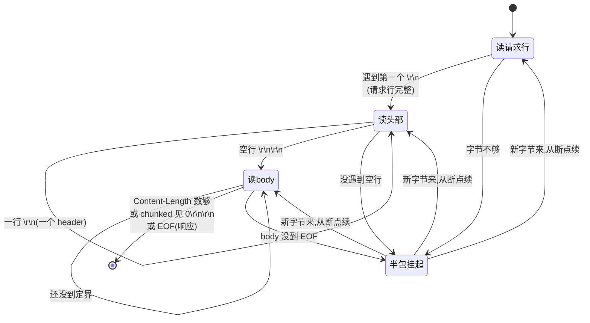
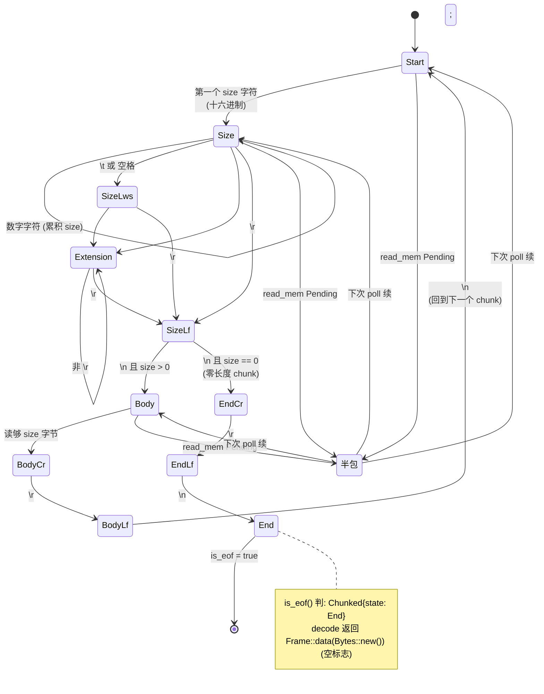
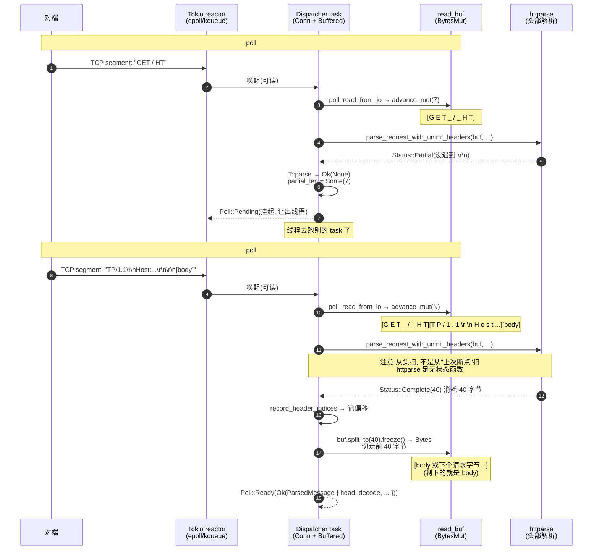

# 第 2 篇 · 第 6 章 · 请求/响应解析状态机

> **核心问题**:第 5 章我们把"一条 HTTP/1 连接怎么循环"的骨架拆透了——`Dispatcher::poll_loop` 一圈圈转,`poll_read_head` 是其中读请求的第一站。可它到底**怎么**把 `GET / HTTP/1.1\r\nHost: example.com\r\n\r\n...` 这串 TCP 字节,切成"请求行 / 头部 / body"三段的?TCP 是字节流,不保证一次 `poll_read` 拿到的是完整请求,可能你只读到 `GET / HT`(请求行没完),也可能一次读到了"请求 1 + 请求 2 的前半"——这种"半包"和"粘连"怎么处理不丢字节、不读越界?为什么 HTTP/1 解析必须是状态机(而不是 Rust 字符串的 `split("\r\n")`)?请求行、头部、body 三段的解析各有什么坑,为什么 hyper 对它们用了**两套不同的实现**(请求行+头部委托给 `httparse` crate,body 分帧自己手写状态机)?读到一半 task 挂起了,字节留在哪、下次续上从哪儿接着算?

> **读完本章你会明白**:
> 1. 为什么 HTTP/1 解析**必须**是状态机:RFC 定义的请求行/头部/body 三段、`Content-Length` 与 `Transfer-Encoding: chunked` 两种定界、流水线上多个请求粘连在一坨字节里——这些场景在 Rust 里没法用 `split` 解决,只能用"逐字节推进、随时能暂停"的状态机。
> 2. hyper 的 HTTP/1 解析是**分层混合**的:请求行 + 头部(请求头/响应头)委托 `httparse` crate(零拷贝 push parser),**消息体分帧**(chunked 13 态 / content-length / eof-delimited)是 hyper 在 `proto/h1/decode.rs` 自己手写的逐字节状态机——为什么这么分层,以及各自解决什么本质问题。
> 3. 半包怎么 sound 不丢字节:`io.rs::parse` 那个 `loop`(先试解析 → 不够再去 IO 读 → 再试)是怎么写的,`read_buf: BytesMut` 的"已解析 / 未解析"边界靠什么管理(答案:`split_to` 切走前缀,没有显式游标,只记一个 `partial_len` 当预筛提示),头部解析"无断点记忆、每次从头扫"为什么不丢、不慢。
> 4. body 边界怎么 sound 不越界读下一个请求:`Decoder` 的三个变体(`Length` / `Chunked` / `Eof`)分别怎么定界,为什么 `Length` 用 `read_mem(cx, remaining)` 精确只读剩余字节数,流水线下"请求 2 的头"残留在 `read_buf` 里是怎么被下一个 `poll_read_head` 接住的。
> 5. 三个实现的横评:hyper(httparse 解析头 + 手写 chunked 状态机)vs Envoy HCM 的 BalsaParser(逐字节 push 解析器,自研替换第三方 `http-parser`)vs gRPC(只走 HTTP/2,不解析 HTTP/1)——三种取舍背后的工程动机。

> **如果一读觉得太难**:先记四件事——① HTTP/1 是文本协议,但 TCP 是字节流,一次读到的可能是半包也可能粘连好几个请求,所以解析必须能"随时暂停、随时续上",这只能用状态机;② hyper 的解析分两层——头部用现成的 `httparse` crate,body 分帧自己手写(`decode.rs` 里的 `ChunkedState` 13 态);③ 半包的字节**永远留在 `read_buf` 里不被切走**,只有解析成功才 `split_to(len)` 切走前缀,所以"下次续读"自然从字节开头接上;④ body 用 `Content-Length` 精确只读那么多字节,多出的字节自动留给下一个请求——这就是流水线不越界的根本保证。这四条抓住了,后面看源码就有了挂靠点。

---

## 〇、一句话点破

> **HTTP/1 解析的本质,是在 TCP 字节流上做"边界的重构":TCP 给你一坨连续字节,你要把它切成"一个请求 = 请求行 + 头部 + body"的离散消息。这活儿必须是状态机,因为字节可能分批到(半包)、也可能一次到好几个(粘连),解析器要"随时能停、随时能续"。hyper 把它拆成两层——请求行和头部委托 `httparse`(现成的、零拷贝的、push 模式的解析器),body 分帧(content-length / chunked / eof-delimited)自己在 `decode.rs` 里手写状态机。两层之间靠"`split_to(len)` 切走已解析前缀"衔接,半包时字节不动、只记一个 `partial_len` 当预筛提示,下次续读把新字节追加到 `read_buf` 尾部、再从头扫一遍——这就是"不丢字节、不越界"的全部 sound。**

这是结论。本章倒过来拆:先讲"为什么 HTTP/1 解析必须是状态机"这个动机,再讲 hyper 的两层设计(头部委托 httparse、body 手写)为什么这么分,然后钻进 `io.rs::parse` 看那个"先试解析 → 不够就读 IO"的循环,接着拆头部解析(`httparse` 在 role.rs 里怎么用、`HeaderIndices` 索引表怎么零拷贝),再拆 body 解析(`Decoder` 三变体 + `ChunkedState` 13 态),最后把"半包不丢字节"和"流水线不越界"两个 sound 问题钉死,并对照 Envoy Balsa / gRPC。

> **承接《Tokio》**:`Buffered::parse` 里"字节不够就 `Poll::Pending`"那个动作,就是《Tokio》拆透的 `Poll` / `Waker` / `Future` 模型在协议解析上的直接落地——`ready!` 宏把 `poll_read_from_io` 返回的 `Pending` 直接抛给上层,task 挂起让出线程,字节来了 reactor 唤醒 task 重新进 `parse`。这套机制本章不重讲,只看"hyper 怎么把一个逐字节的 HTTP/1 状态机,表达成一个能被 Tokio 反复 poll、随时 Pending 的 Future"。
>
> **承接《gRPC》**:HTTP/2 的帧解析(9 字节帧头 + payload、流的多路复用、HPACK 头部压缩、流控)在《gRPC》第 2 篇已拆透,本章**完全不碰**——HTTP/1 和 HTTP/2 是两种协议:HTTP/1 是文本协议(请求行 `GET / HTTP/1.1\r\n`),HTTP/2 是二进制协议(帧头 `0x00 0x00 0x00 length type flags ...`)。本章篇幅全留"hyper 怎么在 HTTP/1 字节流上做边界重构"。第 3 篇会一句带过地对照 h2 crate 怎么解析 HTTP/2 帧。

---

## 一、为什么 HTTP/1 解析必须是状态机(而不是 `split`)

第 5 章结尾我们留了一个钩子:`Conn::poll_read_head` 把字节变成请求头,但**怎么**变的没讲。这一章从那个钩子接。

先把核心问题钉死:为什么 HTTP/1 解析**不能**用 Rust 字符串的 `split("\r\n")` 来做?这是初学者最容易踩的坑——以为 HTTP/1 文本协议嘛,直接 `String::from_utf8(bytes).split("\r\n")` 不就行了?不行,原因有三层,每一层都是协议本质。

### 1.1 第一层:TCP 是字节流,不保证一次读到的是"完整请求"

这是最根本的一层。HTTP/1 在应用层是"一个请求一个响应"的离散消息,但底下 TCP 给你的是**连续的字节流**——它不分"消息边界",只有"按顺序到达的字节"。一次 `poll_read` 读到的字节数,完全取决于 TCP 当时的缓冲状态、网卡 MTU、内核 socket buffer 里堆了多少——和 HTTP 消息的边界**毫无关系**。

举个最简单的场景:client 发一个 `GET / HTTP/1.1\r\nHost: example.com\r\n\r\n`,这 40 个字节到了 server 的 TCP 栈。server 第一次 `poll_read`,可能只读到前 7 个字节 `GET / H`——因为 TCP 把它们切成了一个 segment;剩下 33 个字节还在路上或者还在内核 buffer 里。这时候你的 `split("\r\n")` 拿什么 split?**根本没有完整的 `\r\n` 可 split**。

反过来,client 也可能在同一条 keep-alive 连接上连续发请求 1、请求 2,server 一次 `poll_read` 读到的是 `GET /1 ... HTTP/1.1\r\n\r\nGET /2 HTTP/1.1\r\nHost: ...`——两个请求粘在一坨字节里。`split("\r\n\r\n")` 会把请求 1 切出来,但请求 2 的头还没完,你怎么知道"这个 `\r\n\r\n` 是请求 1 的结束、后面那个是请求 2 的开始"?

> **钉死这件事**:**TCP 字节流和 HTTP 消息边界是两个正交的概念**。TCP 不告诉你"消息从哪开始、到哪结束",这是应用层协议(HTTP)自己的事。把字节切成消息,叫"消息定界"(message framing),是 HTTP/1 解析的全部核心。HTTP/2 用 9 字节定长帧头自定界(length + type),HTTP/1 是文本协议没有这种便利,只能靠 `\r\n` 和 `Content-Length` / chunked 等约定来定界。这一节就是讲 hyper 怎么在 HTTP/1 上做定界。

### 1.2 第二层:`split` 是"一次性吃完整字符串"的模型,而异步世界里字节是分批到的

就算你能假设"字节总是完整到达",`split` 模型在异步世界还有个致命问题——它是**同步阻塞**的:`String::from_utf8(bytes)` 要求 `bytes` 是一个完整的、所有字节都在手的 `String`。但 hyper 跑在 Tokio 上,`poll_read` 是**异步**的,它可能返回 `Poll::Pending`(当前没字节,task 挂起)。你不能"等所有字节到齐再 split",因为:

- 你不知道"所有字节"是多久——HTTP/1 keep-alive 连接上,你永远不知道 client 下一个请求什么时候发完。
- 即使等到了请求头结束(`\r\n\r\n`),body 可能还在 streaming——POST 一个大文件,头部先到、body 一块一块到。你不可能"等 body 全到齐再 split",那是阻塞,占着线程。
- 即使是头部,client 发了 `GET / HT` 卡住了(网络抖动、或恶意慢速攻击 Slowloris),你 `await` 等 `\r\n` 永远等不到——如果是"等齐再 split"模型,这条连接的 task 就一直挂着占内存,什么都不做。

异步世界需要的解析模型是:**给我几个字节我能往前推进一点,字节不够我就 Pending 挂起,字节来了我接着往前推进**。这就是状态机——它**不要求所有字节在手**,只要求"当前状态 + 一个新字节 → 下一个状态"。

> **承接《Tokio》**:这就是为什么 hyper 的 `Conn` 是个 `Future`,`Buffered::parse` 是个 `poll` 函数——每次被 Tokio poll,就"能推进多少推进多少",推进不动了 `Poll::Pending` 返回,让出线程。这是《Tokio》拆透的 `Future` / `Poll` / `Waker` 模型在协议解析上的直接落地。`split` 模型和这个模型根本不兼容——`split` 是"一次性、同步、阻塞",而 Tokio 是"分批、异步、可暂停"。状态机天生就是为异步设计的。

### 1.3 第三层:HTTP/1 消息有三段,定界规则各不相同

第三层是协议细节。一个 HTTP/1 请求/响应,在字节层面分**三段**,每段的定界规则**不同**:

| 段 | 内容举例 | 定界规则 |
|---|---|---|
| 请求行 / 状态行 | `GET /path HTTP/1.1\r\n` / `HTTP/1.1 200 OK\r\n` | 一个 `\r\n` 结束,三个空格分隔 token |
| 头部 | `Host: example.com\r\nUser-Agent: ...\r\n` | 每行一个 `\r\n`,**空行 `\r\n\r\n`** 标志头部结束 |
| body | 任意字节(可以是二进制) | **三种**定界:`Content-Length: N`(精确 N 字节)/ `Transfer-Encoding: chunked`(分块,`0\r\n\r\n` 结束)/ 既没有 CL 也没有 chunked 时,Response 靠连接关闭定界,Request 非法 |

第三段最复杂,有**三种**定界规则:

1. **`Content-Length: 1024`**:body 精确 1024 字节,数够就停。
2. **`Transfer-Encoding: chunked`**:body 是一连串"chunk",每个 chunk 是 `十六进制长度\r\n + 长度那么多字节 + \r\n`,以 `0\r\n\r\n`(零长度 chunk)结束。这种编码**不需要预先知道总长度**,适合 streaming 生成 body 的场景。
3. **既无 CL 也无 chunked**:Response 可以靠"连接关闭"定界(server 写完响应直接 close 连接,client 看到 EOF 就知道 body 结束);Request 不允许这样(RFC 7230 要求 Request 必须有 CL 或 chunked,否则是非法)。

`split("\r\n")` 模型连第一段(请求行)和第二段(头部)都勉强——它确实能 split `\r\n`,但 split 完了你怎么知道"哪些是头部、哪个空行是头部结束"?更要命的是第三段:body 可能是**任意二进制字节**(上传一个 PNG,里面有 `\r\n` 序列再正常不过),你 `split("\r\n")` 会把 body 内的 `\r\n` 也切了,完全乱套。

> **钉死这件事**:HTTP/1 的三段定界,用 `split` 根本做不到 sound——① 半包/粘连场景 `split` 没东西可 split 或 split 错边界;② `split` 要求所有字节在手,异步世界做不到;③ body 是二进制定界(CL/chunked/EOF),不是文本 `split` 能处理的。这三条逼着 HTTP/1 解析必须是状态机:**一个能在任意字节处暂停、能在任意字节处续上、知道"我现在在第几段、这段的定界规则是什么"的有状态推进器**。

### 1.4 状态机:为字节流和异步量身定做的模型

把上面三层抽象出来,就是"状态机"这个抽象。一个 HTTP/1 解析状态机有三要素:

1. **状态(state)**:当前解析到哪了——"正在读请求行的 method"、"正在读某个 header 的 value"、"正在读 body 的第 N 个字节"、"chunked 模式下正在读 chunk size 的十六进制字符"……
2. **输入(input)**:一个或几个新字节。
3. **转移(transition)**:当前状态 + 输入字节 → 下一个状态(可能输出"已解析出一段")。

关键性质:**这个状态机能在任意输入处暂停,把当前状态记下来,下次新字节来了从暂停处继续**。这正是异步世界需要的——`poll` 推进一步就更新状态机内部、返回"还需要更多字节"或"解析出一段了";字节不够就 `Pending`,状态机原地不动,下次 `poll` 接着推进。



这张图是 HTTP/1 解析的宏观状态机。注意"半包挂起"不是真的一个状态(状态机内部状态不变,只是 task 被 Tokio 挂起了),但它体现了"随时能停、随时能续"的核心性质。

> **不这样会怎样**:如果不用状态机,而是用"等所有字节到齐再一次性解析"的模型,会出现——① body streaming 做不了(必须等整个 body 到齐才能开始解析,而 POST 大文件时这是不可接受的延迟);② 慢速攻击(Slowloris)挡不住(攻击者慢慢发字节,你的"等齐"模型一直挂着占内存);③ keep-alive 连接做不了(你不知道"这个请求什么时候结束、下一个请求什么时候开始")。状态机把"消息定界"从"等齐"变成"边到边切",这三件事才能 sound。

---

## 二、hyper 的两层设计:头部委托 httparse,body 自己手写

讲清了"为什么必须是状态机",现在看 hyper 怎么实现。这里有个**很多人不知道的事实**(包括很多自诩"读过 hyper 源码"的人):**hyper 的 HTTP/1 解析不是纯手写的,它分两层**——

- **请求行 + 头部(请求头 / 响应头)**:委托 `httparse` crate。`httparse` 是 hyper 作者 Sean McArthur 自己写的另一个独立 crate(crates.io 上的 `httparse`,自述"tiny, safe, speedy, zero-copy HTTP/1.x parser"),它负责"找 `\r\n`、切 token、把字节解析成请求行/头部数组"。hyper 在 `proto/h1/role.rs` 里调用它。
- **body 分帧(content-length / chunked / eof-delimited)**:hyper 在 `proto/h1/decode.rs` 里**自己手写**了一套逐字节状态机(`ChunkedState` 13 态、`Length` 计数器、`Eof` 标志)。

为什么这么分?这一节就回答这个问题。

### 2.1 为什么头部委托 httparse,不自己写

先看动机。HTTP/1 的头部解析,说难不难(找 `\r\n`、按 `:` 切 name/value、找空行结束),但有大量**协议细节坑**,自己写容易踩:

- **obs-fold(过时折行)**:老 RFC 允许 header value 跨行(`Header: value\r\n  continuation`),现代 RFC 7230 deprecated 但还要兼容。
- **header name 字符集**:`token` 字符集是有严格定义的,非法字符要拒绝。
- **value 里的空格**:`Host :example.com`(`:` 前后空格)和 `Host: example.com` 哪个合法?RFC 有细致规定。
- **大小写不敏感**:header name 大小写不敏感,`Content-Length` 和 `content-length` 等价。
- **性能**:`\r\n` 的扫描、`:` 的定位,朴素实现慢;zero-copy 难——你要么 copy 字节,要么记偏移。

这些坑,业界早就趟过了——`httparse` 就是它们的结晶。它是一个**push parser**:你喂它字节,它返回 `Status::Complete(len)`(解析完整,消耗了 len 字节)或 `Status::Partial`(还没完整,要更多字节)。它**零拷贝**——返回的 `Header { name: &str, value: &[u8] }` 是对**原始字节**的借用切片,不复制字节。它**安全**——`unsafe` 仅用在 `MaybeUninit` 优化(见第 4 节),核心解析路径全是 safe Rust。

hyper 选择"复用 `httparse`",而不是自己重造——这是 Rust 生态分工的体现:`httparse` 专精"头部解析"这一个点,做到极致(zero-copy、bench 优化、协议细节齐全),hyper 专精"把协议机组织成 client/server"。一个普通的"找 `\r\n`"自己写 100 行也能跑,但要做到 httparse 那种程度(0 拷贝、各种边界、性能),要写好几千行 + 大量测试——不如复用。

> **对照《gRPC》**:gRPC 的 C++ core 自己用 C 实现了 HTTP/2 的全部(包括 HPACK 头部压缩),不依赖任何外部库——因为它要"在任何语言里都能用"(Python/PHP/Ruby 的 grpcio 都包 C++ core),所以必须**自带协议栈**。hyper 走 Rust 生态分工:头部解析这种成熟的、纯算法性的、和 IO 无关的事,委托 `httparse`;自己只管"协议机怎么和 Tokio 异步 IO 衔接"。这是两种生态取舍,没有对错。**注意**:这条修正了一个常见误解——很多人以为 hyper 全自写 HTTP/1,其实头部是 httparse 干的。本书后面的章节遇到"hyper 解析 HTTP/1"都要带着这个分层视角看。

### 2.2 为什么 body 分帧自己手写,不复用

那 body 分帧为什么不也委托?动机有几个:

**第一,chunked 编码的状态机和 IO 强耦合**。chunked 的解析不是"给字节返回 token",而是"逐字节推进状态机、随时可能因为字节不够而 Pending"——它需要从 `MemRead`(hyper 的 IO 抽象)一个字节一个字节地拉,拉不到就 `Pending`。`httparse` 是 push parser(你给它字节,它一次性消费),不适合"逐字节拉、随时 Pending"的模型。chunked 解析天然要和 hyper 的 buffered IO 紧密配合,所以自己写更顺手。

**第二,body 分帧简单得多**。chunked 的状态机只有 13 个状态(见第 5 节),content-length 就是个计数器,eof 就是个标志——这些 hyper 自己写也就几百行,而且和 hyper 的 `Frame<Bytes>` 流式模型直接对接(httparse 不产出 `Frame`)。

**第三,控制力**。body 分帧涉及"读到什么时候算 EOF"、"body 边界怎么不越界读下一个请求"、"chunked trailers 怎么处理"这些和 hyper 连接循环紧密相关的事,自己写能精确控制。

> **钉死这件事**:hyper 的 HTTP/1 解析**两层**——头部(httparse,push parser,zero-copy)+ body 分帧(自写,逐字节 pull 状态机)。这个分层不是随意的,是"头部是纯算法、可以独立成 crate"+"body 分帧和 IO 紧耦合、必须自己写"的工程取舍。后续章节遇到 hyper 协议源码,要分清"这段是 httparse 在干活"还是"这段是 hyper 自己的 Decoder 在干活"。这是读 hyper 协议源码的关键导航图。

### 2.3 解析在 hyper 源码里的整体位置

把这两层映射到 hyper 源码文件,大致是这样:

```
┌──────────────── Conn::poll_read_head (conn.rs:237) ─────────────────┐
│                                                                       │
│   调 io.parse::<T>(cx, ctx)   ← Buffered::parse (io.rs:169)          │
│                                                                       │
│   ┌──────────────── Buffered::parse: loop ─────────────────┐         │
│   │                                                          │        │
│   │  1. role::parse_headers::<T>(read_buf, partial_len,ctx) │        │
│   │     └─ T::parse (role.rs:143 Server / 1016 Client)      │        │
│   │          └─ httparse::parse_request_with_uninit_headers │ ← 头部 │
│   │             (role.rs:177 / 1036)                        │   层   │
│   │                                                          │        │
│   │  2. 若 None(半包) → poll_read_from_io 读 IO           │        │
│   │     再回到 1                                             │        │
│   └──────────────────────────────────────────────────────────┘        │
│                                                                       │
│   解出 (head, DecodedLength) 后:                                      │
│   Decoder::new(msg.decode, ...)  (conn.rs:313/321)                   │
│                                                                       │
│   ┌──────────────── Decoder (decode.rs) ────────────────┐           │
│   │  Length(u64): read_mem(remaining)                    │ ← body   │
│   │  Chunked { state: ChunkedState, ... }: 逐字节状态机  │   分帧   │
│   │  Eof(bool): 读到空字节 = 连接关                       │   层     │
│   └─────────────────────────────────────────────────────┘            │
│                                                                       │
└───────────────────────────────────────────────────────────────────────┘
```

这张图就是本章的导航图。`Conn::poll_read_head` 是入口,它调 `Buffered::parse` 解头部,解出来后再用 `Decoder` 解 body。`Buffered::parse` 是"读字节 + 头部解析"的循环,`Decoder` 是"body 分帧"的状态机。本章第 3 节拆 `Buffered::parse`、第 4 节拆头部解析(role.rs + httparse)、第 5 节拆 body 分帧(decode.rs)。

> **承接 P2-05**:第 5 章 2.3 节我们说 `poll_read_head`(`dispatch.rs:292`)是"`can_read_head` 分支的核心,先 `ready!(dispatch.poll_ready)` 做背压,再调 `conn.poll_read_head`"。`conn.poll_read_head`(`conn.rs:211`)就是它真正调 `io.parse` 解头部的地方——本章就把这个 `io.parse` 拆透。第 5 章讲的"`poll_read_head` 先 `poll_ready` 再读"那个**背压**机制,本章不重讲;本章只讲"`poll_read_head` 拿到字节后怎么变成 head"。

---

## 三、Buffered::parse:那个"先试解析 → 不够就读 IO"的循环

现在钻进 `io.rs::parse`——它是半包处理的心脏。

### 3.1 parse 方法的真实结构

`Buffered::parse` 在 `proto/h1/io.rs:169`,签名是:

```rust
// hyper/src/proto/h1/io.rs:169-217 (摘录)
pub(super) fn parse<S>(
    &mut self,
    cx: &mut Context<'_>,
    parse_ctx: ParseContext<'_>,
) -> Poll<crate::Result<ParsedMessage<S::Incoming>>>
where
    S: Http1Transaction,
{
    loop {
        if let Some(msg) = super::role::parse_headers::<S>(
            &mut self.read_buf,
            self.partial_len,
            ParseContext { /* 透传 ctx */ },
        )? {
            debug!("parsed {} headers", msg.head.headers.len());
            self.partial_len = None;            // 成功,清断点提示
            return Poll::Ready(Ok(msg));
        } else {
            // 解析返回 None = 半包,还没完整
            let max = self.read_buf_strategy.max();
            let curr_len = self.read_buf.len();
            if curr_len >= max {
                return Poll::Ready(Err(crate::Error::new_too_large()));  // 超 max_buf_size
            }
            if curr_len > 0 {
                self.partial_len = Some(curr_len);   // 记录"已攒到多少"
            } else {
                self.partial_len = None;             // 1xx 把字节吃光了
            }
        }
        // read_buf 不够,去 IO 读;读到 0 = EOF
        if ready!(self.poll_read_from_io(cx)).map_err(crate::Error::new_io)? == 0 {
            return Poll::Ready(Err(crate::Error::new_incomplete()));
        }
    }
}
```

整个方法就一个 `loop`,循环体分两段:

**第一段(178-211)**:试解析。调 `role::parse_headers::<S>(read_buf, partial_len, ctx)`——它内部会调 `S::parse`(Server 或 Client 的实现),后者再调 `httparse`。返回值有三种:

- `Ok(Some(msg))`:解析出一个完整的 head(请求行 + 头部),返回 `Poll::Ready(Ok(msg))`。
- `Ok(None)`:半包,字节不够(`httparse` 返回 `Status::Partial`)。这时**字节留在 `read_buf` 不动**,记 `partial_len = Some(curr_len)`(只当优化提示,下面 3.3 详述)。还要检查"是不是超过 `max_buf_size` 了"——超过直接报 `too_large`(防慢速攻击把 buffer 撑爆)。
- `Err(Parse)`:真错误(method 不合法、uri 不合法等),用 `?` 直接抛上去。

**第二段(212-215)**:读 IO。第一段返回 None(半包),就调 `self.poll_read_from_io(cx)` 去底层 socket 读字节。`ready!` 宏是关键——`poll_read_from_io` 可能返回 `Poll::Pending`(当前 socket 没字节),`ready!` 把这个 `Pending` **直接抛给上层**,整个 `parse` 也 Pending,task 挂起。读到 0 字节是 EOF(对端关连接),但 head 还没解析完整,报 `new_incomplete`(不完整)。读到 N 字节(N > 0),`advance_mut(N)` 把字节追加到 `read_buf` 尾部(`poll_read_from_io` 内部,`io.rs:244`),循环回到第一段,再试解析。

### 3.2 这个 loop 的 sound:半包续读不丢字节

这个 `loop` 是整个 hyper HTTP/1 解析最精巧的地方。它的 sound 体现在三个不变量:

**不变量一:半包时字节永远留在 `read_buf` 不动**。注意第一段返回 `Ok(None)` 的分支——它**不调用 `split_to` / `advance` / `clear`**,只更新 `partial_len`。这意味着已读到的字节(比如 `GET / HT` 那 7 个字节)**原封不动**留在 `read_buf` 里。下次循环(新字节到了之后)`parse_headers` 拿到的还是这一份 `read_buf`,前 7 个字节 + 新字节拼接在尾部,`httparse` 从头扫,自然把这 7 个字节当成请求行的开头。

**不变量二:成功解析才切走前缀**。第一段 `Ok(Some(msg))` 分支,`role::parse` 内部(`role.rs:217` Server / `role.rs:1074` Client)会调 `buf.split_to(len).freeze()`——把"请求行 + 头部"那 `len` 字节从 `read_buf` 头部**切走**(从 `BytesMut` 移除前 len 字节),变成 `Bytes`(引用计数)。`read_buf` 剩下的就是 body 的第一个字节(或流水线下下一个请求的字节)。**只有解析成功才切,半包不切**——这就是"不丢字节"和"切干净已解析部分"的统一保证。

**不变量三:`partial_len` 只是优化提示,不是断点游标**。这是个特别容易误解的点。很多人以为 `partial_len: Option<usize>`(`io.rs:35`)是个"游标",记录"上次解析到第几个字节了,下次从这续"。**不是**。它只是个**优化提示**——告诉 `parse_headers`"上次我已经攒了 N 个字节、扫过一遍了",让 `is_complete_fast`(`role.rs:100`)做个快速预筛:如果"上次扫过的旧字节 + 新字节"里都没有 `\r\n\r\n`,就快速返回 None 不进 `httparse`(省一次完整扫描);如果有,才进 `httparse` 完整解析。

> **钉死这件事**:`partial_len` **不是断点游标,是优化提示**。hyper 的 HTTP/1 头部解析**没有断点续传**——每次 `parse_headers` 都是从 `read_buf` 开头**从头扫一遍**喂给 `httparse`。这是因为 `httparse` 本身是个**无状态**函数(给它字节返回 Complete/Partial),它内部不记"上次扫到哪"。hyper 也没记——它只记"上次攒了 N 字节"这个数,让 `is_complete_fast` 先扫一遍"新到的字节附近有没有 `\r\n\r\n`",没有就快速跳过完整解析(省 CPU),有才进 `httparse`。这种"无断点记忆 + 优化预筛"的设计,简单粗暴但 sound——不丢字节的根本保证是"字节永远在 `read_buf` 里、不切就不丢",而不是"记着上次扫到哪"。这一点很多讲 hyper 解析的文章讲错了(说成断点续传),本章钉死。

### 3.3 read_buf:一个 BytesMut 怎么管"已解析 vs 未解析"

讲清了 `parse` 的循环,现在看 `read_buf` 的内部布局。`read_buf` 是 `BytesMut`(`io.rs:37`)——`bytes` crate 的可变字节缓冲。它**没有**显式的"已解析指针 / 未解析指针"两个游标,而是用更简单的模型:

```
read_buf: BytesMut 的物理布局(单段连续字节)
┌─────────────────────────────────────────────────────────────────┐
│ 已读但未解析的头部字节        │  body 字节(已切走头部后)       │
│ (半包时全部都是这种)         │  (或下一个请求的起始字节)       │
└─────────────────────────────────────────────────────────────────┘
   ← BytesMut 的逻辑内容(self.read_buf.len() 这么多字节)

关键操作:
● poll_read_from_io: 新字节 advance_mut(n) 追加到尾部 (io.rs:244)
● parse_headers:    从开头扫 (无游标)
● T::parse 成功:    buf.split_to(len) 切走前 len 字节 (role.rs:217/1074)
                    剩下的自动成为"未解析"(可能是 body 或下个请求)
```

这个设计的精妙之处在于**用 `BytesMut` 的"前缀切除"操作当游标**:

- "已解析"的字节,通过 `split_to(len)` 从 `BytesMut` 头部移除,移到别处(变成 `Bytes` 给 HeaderMap 用)。它们**物理上**不在 `read_buf` 里了。
- "未解析"的字节,就是 `read_buf` 当前剩下的全部内容。
- "新字节进来的位置",永远是 `read_buf` 的尾部(`advance_mut`)。

所以**不存在"两个游标之间的夹缝"问题**——不像有些解析器设计成 `[parsed_cursor .. unparsed_cursor .. buf_end]` 三段(已解析 / 未解析 / 空闲),要维护两个游标。hyper 直接把"已解析"那部分**扔出去**(`split_to`),`read_buf` 里只剩"未解析"。这个简化让代码特别清楚:任何时候 `read_buf.len()` 就是"未解析字节数",`read_buf` 开头就是"下一个要解析的字节"。

```
半包场景的字节演进(同一个 read_buf,跨多次 poll):

poll #1: read_buf = [G E T   /   H T]
                            ↑ httparse 返回 Partial, 半包
                            partial_len = Some(7)
                            字节全部留下, 不 split

[task Pending, Tokio 挂起; socket 又来字节, reactor 唤醒]

poll #2: read_buf = [G E T   /   H T][T P   /   H T T P   /   1   .   1 \r \n H o s t ...]
                            ↑                                  ↑
                            旧字节                              新字节 advance_mut 追加
                            (依然在)
                   httparse 再扫, 这次返回 Complete(40)
                   role.rs:217: buf.split_to(40).freeze() → head 的 Bytes

poll #2 之后: read_buf = [body 或下个请求字节...]
                                  ↑ 切走 40 字节头部后剩下的
```

> **不这样会怎样**:如果用"两个游标夹中间未解析"的设计,要处理"已解析游标追上未解析游标时怎么办"、"两个游标之间的内存要不要回收"、"split 时两个游标怎么动"这些边界。hyper 的"split_to 扔前缀"设计一次性回避了所有这些边界——已解析直接扔出去,留下的全是未解析,简单 sound。代价是 `BytesMut::split_to` 会改 `BytesMut` 的内部指针(bytes crate 的实现是 atomic ref count 切片,开销很小),但相比"维护两个游标 + 边界处理"的复杂度,这个代价值。

### 3.4 为什么不一次性把 socket 字节全读进来:Adaptive ReadStrategy

`parse` 里调 `poll_read_from_io` 读 IO,但**不是想读多少读多少**。看 `poll_read_from_io`(`io.rs:219-256`):

```rust
// hyper/src/proto/h1/io.rs:219-256 (摘录)
pub(crate) fn poll_read_from_io(&mut self, cx: &mut Context<'_>) -> Poll<io::Result<usize>> {
    self.read_blocked = false;
    let next = cmp::min(self.read_buf_strategy.next(),
                        self.read_buf_strategy.max().saturating_sub(self.read_buf.len()));
    if self.read_buf_remaining_mut() < next { self.read_buf.reserve(next); }
    let dst = unsafe { self.read_buf.chunk_mut().as_uninit_slice_mut() };
    let mut buf = ReadBuf::uninit(dst);
    match Pin::new(&mut self.io).poll_read(cx, buf.unfilled()) {
        Poll::Ready(Ok(_)) => {
            let n = buf.filled().len();
            unsafe { self.read_buf.advance_mut(n); }
            self.read_buf_strategy.record(n);
            Poll::Ready(Ok(n))
        }
        Poll::Pending => { self.read_blocked = true; Poll::Pending }
        Poll::Ready(Err(e)) => Poll::Ready(Err(e)),
    }
}
```

关键在 `next = min(strategy.next(), strategy.max() - curr_len)`——这次最多读多少字节,由 `ReadStrategy` 决定。`ReadStrategy`(`io.rs:360-446`)默认是 `Adaptive`:

- **初始容量** `INIT_BUFFER_SIZE = 8192`(`io.rs:15`)——8KB,约 2 个常见 TCP segment。
- **上限** `DEFAULT_MAX_BUFFER_SIZE = 8192 + 4096*100`(`io.rs:23`)——约 400KB。
- **自适应**:`Adaptive` 会根据"上次读到的字节数"动态调整 `next`(`io.rs:391-401`)——读到很多(大请求)就扩容、读到少(小请求)就缩。`record(n)` 记录这次读了多少,下次 `next()` 据此调整。

**动机**:为什么要 adaptive,不一次性读 1MB?因为——① 大请求少、小请求多(典型 HTTP 请求 < 1KB),固定大 buffer 浪费内存;② 缓冲太大,慢速攻击能撑爆内存(所以 `max_buf_size` 上限是防御);③ 缓冲太小,大请求要多次 `poll_read`,IO 系统调用开销大。adaptive 是这三者的权衡。

> **承接《Tokio》**:`poll_read_from_io` 内部的 `Pin::new(&mut self.io).poll_read(cx, buf.unfilled())`——这就是《Tokio》拆透的 `AsyncRead::poll_read`。底层 `TokioIo<TcpStream>` 适配 tokio 的 `AsyncRead`,tokio 的 reactor(epoll/kqueue,edge-triggered)监听 socket 可读,可读了就唤醒 task,task 的 `poll` 进 `parse` → `poll_read_from_io` → `poll_read` 真正读 socket。这一整条 IO 链路本章一句带过,重点在"读到的字节怎么变 head"。

### 3.5 max_buf_size:防慢速攻击的硬上限

回到 `parse` 第一段的 `if curr_len >= max` 分支——这是防慢速攻击(Slowloris)的关键。

**慢速攻击**:攻击者发一个请求,头部慢慢发(每秒发一个字节),让你的 server 为这条连接保持一个巨大的 `read_buf`,占着内存。一千条这样的连接,就能把 server 内存撑爆——这是 DoS。

**hyper 的防御**:`max_buf_size`(`DEFAULT_MAX_BUFFER_SIZE = 8192 + 4096*100 ≈ 400KB`,`io.rs:23`)是个硬上限。`parse` 每次循环都检查"已攒了 `curr_len` 字节了,超过 max 没",超过就报 `too_large` 错(`io.rs:200-202`),关连接。这就把"单连接能消耗的缓冲内存"封顶在 ~400KB。配合 server 侧的 `h1_header_read_timeout`(读头超时,第 5 章 4.2 节拆过),双层防御:既防"慢慢发撑爆内存"(max_buf_size),又防"慢慢发挂着连接"(超时)。

> **钉死这件事**:`max_buf_size` 是个常被忽视但关键的 sound 机制。它不是"HTTP 协议要求"——HTTP/1 没规定头部多大算太大——而是 hyper 自己加的**资源保护**。读到这看到 `if curr_len >= max { return too_large }`,要知道它防的是"慢速攻击把内存撑爆",不是协议正确性。状态码层面,`Server::on_error`(`role.rs:472`)把 `Parse::TooLarge` 映射成 `431 Request Header Fields Too Large`(见 4.5 节)。

---

## 四、头部解析:role.rs + httparse 的协奏

`Buffered::parse` 调的是 `role::parse_headers::<S>`——这就是头部解析的入口。这一节拆它。

### 4.1 parse_headers:一个轻封装

`role::parse_headers` 在 `proto/h1/role.rs:73`,本身只是个薄封装:

```rust
// hyper/src/proto/h1/role.rs:73-95 (摘录)
pub(super) fn parse_headers<T: Http1Transaction>(
    bytes: &mut BytesMut,
    prev_len: Option<usize>,
    ctx: ParseContext<'_>,
) -> ParseResult<T::Incoming> {
    if bytes.is_empty() {
        return Ok(None);
    }
    let _entered = trace_span!("parse_headers");
    if let Some(prev_len) = prev_len {
        if !is_complete_fast(bytes, prev_len) {
            return Ok(None);       // 预筛: 上次攒的字节里没 \r\n\r\n, 快速跳过完整解析
        }
    }
    T::parse(bytes, ctx)           // 真正解析: Server 在 role.rs:143, Client 在 role.rs:1016
}
```

它做两件事:

1. **空检查**:`bytes.is_empty()` 直接返回 None(没字节,等 IO)。
2. **预筛优化**:`is_complete_fast(bytes, prev_len)`——上次攒了 `prev_len` 字节扫过一遍没找到 `\r\n\r\n`,这次新追加了一些字节,先快速扫一遍"新字节附近有没有 `\r\n\r\n`",没有就快速返回 None,不进 `T::parse`。这是性能优化,不影响 sound(下面 4.2 详述)。
3. **真正解析**:`T::parse(bytes, ctx)`——Server 或 Client 的实现。

### 4.2 is_complete_fast:预筛优化

`is_complete_fast` 在 `role.rs:100`,本质是"快速判断 `bytes` 里有没有头部终结符 `\r\n\r\n`(或历史遗留的 `\n\n`)"。注意它**不是权威判断**——它说"有"不一定真有(可能匹配的是 body 里的 `\r\n\r\n`,但我们还在解析头部,body 字节还没进来,所以这种情况不会发生),它说"没有"一定没有(扫过没找到)。所以它可以安全地做"否定式预筛":

```rust
// hyper/src/proto/h1/role.rs:100-115 (摘录)
fn is_complete_fast(bytes: &[u8], prev_len: usize) -> bool {
    let start = prev_len.saturating_sub(3);     // 从上次断点-3 处往后扫(防止 \r\n\r\n 跨界)
    let bytes = &bytes[start..];
    for (i, b) in bytes.iter().copied().enumerate() {
        if b == b'\r' {
            if bytes[i + 1..].chunks(3).next() == Some(&b"\n\r\n"[..]) {
                return true;
            }
        } else if b == b'\n' && bytes.get(i + 1) == Some(&b'\n') {
            return true;
        }
    }
    false
}
```

`start = prev_len.saturating_sub(3)` 那个 `-3` 是关键——上次扫到 `prev_len`,新字节从 `prev_len` 开始,但 `\r\n\r\n` 可能**跨界**(前两个字节在旧区,后两个在新区)。`-3` 让扫描窗口回到"距上次断点 3 字节前",确保跨界情形不漏。

> **钉死这件事**:`is_complete_fast` 是个**纯优化**,不影响 sound。即使去掉它(直接每次都进 `T::parse`),正确性不变,只是 CPU 多花一些(每次半包都进 `httparse` 完整扫一遍)。它的存在是为了"半包高频场景"省 CPU——典型的 Slowloris 攻击下,连接每秒来 1 字节,如果每次都进 `httparse` 扫整个 `read_buf`,CPU 飙升;`is_complete_fast` 只扫"新字节附近 4 字节窗口",O(1) 快速返回 false。这是个防御慢速攻击的 CPU 优化,和 `max_buf_size` 的内存防御互补。

### 4.3 Server::parse:请求行 + 头部怎么解

`Server::parse` 在 `role.rs:143`(`impl Http1Transaction for Server` 在 `role.rs:137`)。核心结构(摘录):

```rust
// hyper/src/proto/h1/role.rs:171-217 (摘录, 简化)
let mut req = httparse::Request::new(&mut []);
match ctx.h1_parser_config.parse_request_with_uninit_headers(&mut req, bytes, &mut headers) {
    Ok(httparse::Status::Complete(parsed_len)) => {
        len = parsed_len;
        method = Method::from_bytes(req.method.expect("httparse completed").as_bytes())?;
        let uri = req.path.expect("httparse completed");
        // ... uri 长度检查、Uri 解析
        version = if req.version.expect("httparse completed") == 1 { HTTP_11 } else { HTTP_10 };
    }
    Ok(httparse::Status::Partial) => return Ok(None),     // 半包
    Err(httparse::Error::Token) => {
        return Err(Parse::Method);   // 或 Uri / Version, 看具体位置
    }
    // ... 其它错误
}

record_header_indices(bytes, req.headers, &mut headers_indices)?;  // 记偏移
let slice = buf.split_to(len).freeze();                            // 切走前 len 字节 → Bytes
// ... 用 slice + headers_indices 构造 HeaderMap
```

注意几个关键点:

**第一,`httparse::Request::new(&mut [])`**——传一个**空 headers slice**进去。这是 httparse 的"两阶段"用法:第一阶段先让它定位请求行 + 数 header 个数;第二阶段(`parse_request_with_uninit_headers`)真正解析。`&mut []` 是个 placeholder。

**第二,`parse_request_with_uninit_headers`**——`MaybeUninit` 优化。`headers: SmallVec<[MaybeUninit<httparse::Header>; N]>`(`role.rs:165`),不初始化(避免 memset 开销)。注释(`role.rs:155-158`)明说:

> "Both headers_indices and headers are using uninitialized memory, but we *never* read any of it until after httparse has assigned values into it. By not zeroing out the stack memory, this saves a good ~5% on pipeline benchmarks."

这是 `unsafe` 在 hyper 协议层最显眼的应用——5% 流水线性能提升换一点 `unsafe`(只在 httparse 写入后读,安全保证靠 httparse)。

**第三,`Status::Complete(parsed_len)` / `Status::Partial`**——httparse 的核心 API。Complete 给出"消耗了多少字节",Partial 表示"字节不够"。Server 的 `Partial` 分支直接 `return Ok(None)`,字节留给 `parse` 循环续读。

**第四,`Status::Complete(parsed_len)` 之后**:`record_header_indices`(`role.rs:1546`)记偏移,`buf.split_to(len).freeze()`(`role.rs:217`)切走前 `len` 字节成 `Bytes`。这两步下面 4.4 / 4.6 详述。

### 4.4 Client::parse:状态行 + 头部 + 1xx 跳过

`Client::parse` 在 `role.rs:1016`,和 Server 对称,但多一个"跳过 1xx 信息响应"的逻辑:

```rust
// hyper/src/proto/h1/role.rs:1016-1184 (摘录, 简化)
fn parse(buf: &mut BytesMut, ctx: ParseContext<'_>) -> ParseResult<StatusCode> {
    'ctx: loop {                                              // 外层 loop 用于跳过 1xx
        let mut res = httparse::Response::new(&mut []);
        match ctx.h1_parser_config.parse_response_with_uninit_headers(&mut res, bytes, &mut headers) {
            Ok(httparse::Status::Complete(len)) => {
                let status = StatusCode::from_u16(res.code.expect("httparse completed"))?;
                // ... version, record_header_indices, buf.split_to(len).freeze()
                let decoder = Client::decoder(&head, method)?;   // 算 body 长度
                if status.is_informational() {                    // 1xx
                    if let Some(cb) = ctx.on_informational { cb(head)?; }
                    if buf.is_empty() { return Ok(None); }        // 字节用光, 等更多
                    continue 'ctx;                                 // 继续读下一个响应
                }
                return Ok(Some(ParsedMessage { head, decode: decoder, ... }));
            }
            Ok(httparse::Status::Partial) => return Ok(None),
            Err(httparse::Error::Version) if ctx.h09_responses => { /* HTTP/0.9 兼容 */ }
            // ... 其它错误
        }
    }
}
```

**关键差异**:Client 收到 1xx(100 Continue / 101 Switching Protocols)是**信息性响应**,不是最终响应——client 要跳过它继续读真正的响应。所以 Client::parse 外层套了 `'ctx: loop`,遇到 1xx 就回调 `on_informational`(让上层知道),然后 `continue` 继续解析。这就是为什么 `Buffered::parse` 半包分支里有句注释"1xx gobbled some bytes"(`io.rs:208`)——1xx 可能把字节吃光了(`buf` 空),要再读 IO。

> **承接 P2-05**:第 5 章 5.1 节提到的 `on_informational`(`conn.rs` 的 State 字段),它在这里被调用——client 收到 1xx 时,`Client::parse` 回调它,把 1xx 响应头交给上层(典型的 100 Continue 场景,见 P2-07 章)。这是 client/server 解析差异的一个体现:Server 永远只解一个请求,Client 可能要跳过若干 1xx 才拿到最终响应。

### 4.5 错误处理:Parse 枚举与状态码映射

头部解析的错误,在 hyper 里是 `crate::error::Parse` 枚举(`error.rs`),Server 把它映射成 HTTP 状态码(`role.rs:472`):

```rust
// hyper/src/proto/h1/role.rs:472-489 (摘录)
fn on_error(err: &crate::Error) -> Option<MessageHead<Self::Outgoing>> {
    use crate::error::Kind;
    let status = match *err.kind() {
        Kind::Parse(Parse::Method)
        | Kind::Parse(Parse::Header(_))
        | Kind::Parse(Parse::Uri)
        | Kind::Parse(Parse::Version) => StatusCode::BAD_REQUEST,                     // 400
        Kind::Parse(Parse::TooLarge) => StatusCode::REQUEST_HEADER_FIELDS_TOO_LARGE,  // 431
        Kind::Parse(Parse::UriTooLong) => StatusCode::URI_TOO_LONG,                   // 414
        _ => return None,
    };
    // ... 构造一个对应状态码的错误响应 head, 让框架写回去
}
```

- **400 Bad Request**:method/uri/version/header token 不合法——请求格式错。
- **414 URI Too Long**:`MAX_URI_LEN = u16::MAX - 1`(`role.rs:34`)——URI 超 ~65KB。
- **431 Request Header Fields Too Large**:`Parse::TooLarge`——单个 header 名 > 64KB(`role.rs:1554`),或整个 `read_buf` 超 `max_buf_size`(`io.rs:200`)。

> **钉死这件事**:这些状态码是 hyper 自己决定怎么映射的——HTTP RFC 只规定"4xx 是 client 错误",具体哪个 4xx 是 hyper 的选择。Server 的 `on_error` 在 `conn.rs` 解析失败时被调用(构造一个错误响应写回去再关连接)。Client 的 `on_error`(`role.rs:1235`)返回 `None`——客户端不发"自动错误响应",它把错误直接抛给上层 reqwest。

### 4.6 头部解析的零拷贝:HeaderIndices + slice

最后一个关键点:头部解析出来的 name/value,怎么零拷贝进 `HeaderMap`。

`record_header_indices`(`role.rs:1546`)把 httparse 返回的 `&[httparse::Header<'_>]`(每个 Header 的 name/value 是对原始字节的 `&[u8]` 借用)转成**偏移**:

```rust
// hyper/src/proto/h1/role.rs:1540-1570 (摘录)
#[derive(Clone, Copy)]
struct HeaderIndices {
    name: (usize, usize),
    value: (usize, usize),
}

fn record_header_indices(
    bytes: &[u8],
    headers: &[httparse::Header<'_>],
    indices: &mut [MaybeUninit<HeaderIndices>],
) -> Result<(), Parse> {
    let bytes_ptr = bytes.as_ptr() as usize;
    for (header, indices) in headers.iter().zip(indices.iter_mut()) {
        if header.name.len() >= (1 << 16) { return Err(Parse::TooLarge); }   // 名字 >64KB
        let name_start = header.name.as_ptr() as usize - bytes_ptr;
        let name_end = name_start + header.name.len();
        let value_start = header.value.as_ptr() as usize - bytes_ptr;
        let value_end = value_start + header.value.len();
        indices.write(HeaderIndices {
            name: (name_start, name_end),
            value: (value_start, value_end),
        });
    }
    Ok(())
}
```

**关键**:`header.name.as_ptr() as usize - bytes_ptr`——用**指针差**算偏移。httparse 返回的 `&[u8]` 指向 `bytes`(也就是 `read_buf`)内部,减去 `bytes` 起始指针,就是偏移。这一步**不复制字节**,只记偏移。

然后在 Server::parse 后半段(`role.rs:258-336`),用 `slice`(切走的前 `len` 字节 `Bytes`)+ `headers_indices` 构造 `HeaderMap`:

```rust
// hyper/src/proto/h1/role.rs:258-336 (摘录, 简化)
let slice = buf.split_to(len).freeze();          // head 整段切成 Bytes(引用计数, 零拷贝)
// ...
for header in &headers_indices[..headers_len] {
    let header = unsafe { header.assume_init_ref() };
    let name = header_name!(&slice[header.name.0..header.name.1]);
    let value = header_value!(slice.slice(header.value.0..header.value.1));   // slice → Bytes 子切片
    // ... 各种 header 处理 (TE/CL/Conn/Expect/Upgrade 提取)
    headers.append(name, value);
}
```

`header_value!` 宏(`role.rs:47-59`)内部用 `unsafe HeaderValue::from_maybe_shared_unchecked($bytes)`,而 `$bytes = slice.slice(...)` 是 `Bytes` 的引用计数子切片——**不复制字节**。`slice` 本身是 `buf.split_to(len).freeze()`,对 `BytesMut` 而言也是引用计数提升而非拷贝(切的是已解析前缀)。

整个链路:`read_buf: BytesMut` → `split_to(len).freeze(): Bytes`(ref count +1,不拷贝)→ `slice.slice(range): Bytes`(ref count +1,不拷贝)→ `HeaderValue::from_maybe_shared_unchecked(Bytes)`(直接包 Bytes,不拷贝)→ `HeaderMap`。**从 socket 字节到 HeaderMap,零拷贝**(只复制引用计数指针)。

> **对照《内存分配器》+《gRPC》**:这种"引用计数 + 切片"的零拷贝是 `bytes::Bytes` 的招牌——它和 gRPC 的 `Slice`(C++ core 的引用计数字节切片)是同一个思路在不同语言的实现。读本书看到 `Bytes` / `BytesMut` / `split_to` / `freeze` / `slice`,要知道它本质是 `Arc<[u8]>` 的智能切片,代价是原子引用计数操作,远比 memcpy 字节便宜。

---

## 五、body 分帧:decode.rs 的状态机

头部解析完,`Conn::poll_read_head`(`conn.rs:303-326`)根据解析出的 `msg.decode: DecodedLength` 决定 body 用哪种 decoder:

- `DecodedLength::CHUNKED` → `Decoder::chunked(...)`(Transfer-Encoding: chunked)
- `DecodedLength::CLOSE_DELIMITED` → `Decoder::eof()`(响应靠连接关闭定界)
- 其它 length → `Decoder::length(N)`(Content-Length: N)
- `DecodedLength::ZERO` → 没 body(GET 请求、204/304 响应等)

`Decoder` 在 `proto/h1/decode.rs:31`,外层是个薄包装:

```rust
// hyper/src/proto/h1/decode.rs:31-34
#[derive(Clone, PartialEq)]
pub(crate) struct Decoder {
    kind: Kind,
}
```

`Kind` 三个变体(`decode.rs:36-67`):

```rust
// hyper/src/proto/h1/decode.rs:36-67 (摘录)
enum Kind {
    /// Content-Length 头为正整数时
    Length(u64),
    /// Transfer-Encoding: chunked 时
    Chunked {
        state: ChunkedState,
        chunk_len: u64,
        extensions_cnt: u64,
        trailers_buf: Option<BytesMut>,
        trailers_cnt: usize,
        h1_max_headers: Option<usize>,
        h1_max_header_size: Option<usize>,
    },
    /// 响应既无长度也无 chunked,读到连接关闭
    Eof(bool),   // bool 记录是否已见到 EOF
}
```

三种 decoder 的 `decode` 逻辑各不同,下面分别拆。

### 5.1 Length:精确只读 N 字节

`Length(u64)` 最简单——计数器。`Decoder::decode`(`decode.rs:150-170`):

```rust
// hyper/src/proto/h1/decode.rs:150-170 (摘录)
Length(ref mut remaining) => {
    if *remaining == 0 {
        Poll::Ready(Ok(Frame::data(Bytes::new())))   // 立即 EOF(空 frame 标志结束)
    } else {
        let to_read = usize::try_from(*remaining).unwrap_or(usize::MAX);
        let buf = ready!(body.read_mem(cx, to_read))?;   // 只读 remaining 字节
        let num = buf.as_ref().len() as u64;
        if num > *remaining { *remaining = 0; }
        else if num == 0 {
            return Err(UnexpectedEof + IncompleteBody);   // 早期 EOF
        } else { *remaining -= num; }
        Poll::Ready(Ok(Frame::data(buf)))
    }
}
```

**关键 sound 点**:`read_mem(cx, to_read)` 传的就是 `remaining`——剩余字节数。`MemRead for Buffered`(`io.rs:344-358`)的实现:

```rust
// hyper/src/proto/h1/io.rs:344-358 (摘录)
impl<T, B> MemRead for Buffered<T, B>
where T: Read + Write + Unpin, B: Buf,
{
    fn read_mem(&mut self, cx: &mut Context<'_>, len: usize) -> Poll<io::Result<Bytes>> {
        if !self.read_buf.is_empty() {
            let n = std::cmp::min(len, self.read_buf.len());
            Poll::Ready(Ok(self.read_buf.split_to(n).freeze()))   // 从缓冲取 min(len, 可用)
        } else {
            let n = ready!(self.poll_read_from_io(cx))?;          // 缓冲空, 去 socket 读
            Poll::Ready(Ok(self.read_buf.split_to(::std::cmp::min(len, n)).freeze()))
        }
    }
}
```

`split_to(min(len, ...))`——**精确只切 `min(len, 可用)` 字节**。如果 `read_buf` 里有 100 字节、`remaining` 只剩 30 字节,`split_to(30)` 只切 30 字节,剩下 70 字节留在 `read_buf`。这 70 字节是**下一个请求的起始字节**(流水线场景),它会被下一个 `poll_read_head` 接住——这就是 body 不越界读下一个请求的根本保证。

```
流水线场景: read_buf 里 "请求1 body 尾巴 + 请求2 头部" 粘连

Content-Length: 10 的情况下, body 已经读了 8 字节, remaining=2
read_buf: [请求1 body 剩余2字节][请求2头部: G E T   / 2 ...]

Decoder::decode Length(2):
  read_mem(cx, 2)
    → split_to(min(2, 实际长度)) → 切走前 2 字节 (请求1 body 完成)
    → read_buf 剩: [G E T   / 2 ...]  (请求2 的头部完整留着)

decoder.is_eof() → true (remaining==0)
conn.reading: Body → KeepAlive
try_keep_alive (双侧都 KeepAlive) → Init
poll_read_head → parse → httparse 从 read_buf 头扫 → 解出请求2 ✓
                                                       ↑ 完美接住, 不读 IO
```

> **钉死这件事**:`read_mem` 的 `split_to(min(len, 可用))` 是 body 边界 sound 的核心。它保证:① Content-Length 数够就停,不会多读一个字节;② 多出的字节自然留在 `read_buf`,被下一个请求的头解析接住;③ 不需要"为下一个请求单独 read",因为字节本来就在缓冲里。这个简单的"min 切片",解决了 HTTP/1 流水线最棘手的"消息边界"问题。

### 5.2 Chunked:13 态逐字节状态机

`Chunked` 是 hyper 自己手写最重的一块。状态机 `ChunkedState`(`decode.rs:69-84`)13 态:

```rust
// hyper/src/proto/h1/decode.rs:69-84
#[derive(Debug, PartialEq, Clone, Copy)]
enum ChunkedState {
    Start, Size, SizeLws, Extension, SizeLf,
    Body, BodyCr, BodyLf,
    Trailer, TrailerLf, EndCr, EndLf, End,
}
```

状态分派(`decode.rs:303-340`)是个大 `match`,每态对应一个 `read_xxx` 函数:

```rust
// hyper/src/proto/h1/decode.rs:303-340 (摘录)
match *self {
    Start => read_start(rdr, cx, size),
    Size => read_size(rdr, cx, size),
    SizeLws => read_size_lws(rdr, cx),
    Extension => read_extension(rdr, cx, extensions_cnt),
    SizeLf => read_size_lf(rdr, cx),
    Body => read_body(rdr, cx, size),
    BodyCr => read_body_cr(rdr, cx),
    BodyLf => read_body_lf(rdr, cx),
    Trailer => read_trailer(rdr, cx, trailers_buf, trailers_cnt),
    TrailerLf => read_trailer_lf(rdr, cx),
    EndCr => read_end_cr(rdr, cx),
    EndLf => read_end_lf(rdr, cx),
    End => Poll::Ready(Ok(End)),
}
```

`ChunkedState::step`(`decode.rs:303`)是核心——它接受一个 `MemRead`(从 `read_buf` 一个字节一个字节拉)和一个状态,返回"下一态"或"Pending"(字节不够)。整个 chunked body 的 `Decoder::decode`(`decode.rs:182-222`)是个 `loop`,反复 `state.step(...)`,直到 `state == End`(EOF)或 `read_mem` Pending。

逐字节拉字节靠 `byte!` 宏(`decode.rs:252`):

```rust
// hyper/src/proto/h1/decode.rs:252-262
macro_rules! byte (
    ($rdr:ident, $cx:expr) => ({
        let buf = ready!($rdr.read_mem($cx, 1))?;       // 拉 1 字节, 不够 Pending
        if !buf.is_empty() {
            buf[0]
        } else {
            return Poll::Ready(Err(io::Error::new(io::ErrorKind::UnexpectedEof,
                                      "unexpected EOF during chunk size line")));
        }
    })
);
```

`byte!(rdr, cx)` 拉 1 字节,字节不够就走 `ready!` 的 Pending 链(整个 `decode` Pending,task 挂起);拉到空(`read_mem` 返回 0 字节,EOF)就报 `UnexpectedEof`。整个 chunked 解析就是"调 `byte!` 拉一字节、根据状态机分支推进、必要时调 `read_body` 一次性拉 chunk_len 字节"。

#### 5.2.1 chunk size 的十六进制解析

`read_start`(`decode.rs:342-372`)和 `read_size`(`decode.rs:374-406`)解析 chunk size 行(`1a\r\n` 表示 26 字节的 chunk)。`read_size` 关键分支:

```rust
// hyper/src/proto/h1/decode.rs:382-404 (摘录)
match byte!(rdr, cx) {
    b @ b'0'..=b'9' => { *size = size.checked_mul(16).or_overflow()?; *size = size.checked_add((b - b'0') as u64).or_overflow()?; }
    b @ b'a'..=b'f' => { *size = size.checked_mul(16).or_overflow()?; *size = size.checked_add((b + 10 - b'a') as u64).or_overflow()?; }
    b @ b'A'..=b'F' => { *size = size.checked_mul(16).or_overflow()?; *size = size.checked_add((b + 10 - b'A') as u64).or_overflow()?; }
    b'\t' | b' ' => return SizeLws,        // size 后的空白(过时)
    b';' => return Extension,              // chunk extension(;xxx)
    b'\r' => return SizeLf,                 // size 行结束, 等 \n
    _ => return Error(io::Error::new(io::ErrorKind::InvalidInput, "Invalid chunk size line")),
}
```

`checked_mul` / `checked_add` + `or_overflow!` 宏(`decode.rs:264`)——**防整数溢出**。chunk size 是 u64,十六进制解析时如果攻击者发"fffffffffffffff..."想溢出,`checked_mul(16)` 返回 `None`,`or_overflow!` 转 `InvalidData` 错。这是个常被忽视的安全点——整数溢出在协议解析里能导致"小 chunk 被读成巨大 chunk"的越界。

`b'\r'` → `SizeLf`(等 `\n`);`b';'` → `Extension`(chunk extension,`1a;foo=bar\r\n`,现代很少用但要兼容);`b'\t'|b' '` → `SizeLws`(size 后空白)。

#### 5.2.2 何时进 End:零长度 chunk

`SizeLf` 后(`decode.rs:462-463`)判断 `*size == 0`:

- `size == 0`:这是"零长度 chunk",标志 chunked body 结束。进 `EndCr`(读 `\r`),再 `EndLf`(读 `\n`),最后 `End`(`is_eof() == true`)。
- `size > 0`:有 body chunk。进 `Body`(`read_body` 一次性读 `chunk_len` 字节),`BodyCr`(`\r`),`BodyLf`(`\n`),回 `Start`(读下一个 chunk size)。

#### 5.2.3 trailers:body 后的元数据

零长度 chunk 后,可能有"trailers"(`Trailer` / `TrailerLf` 态)——和 header 一样的格式,但出现在 body 后。trailers 用 `trailers_buf: Option<BytesMut>`(`decode.rs:55-56`)累积字节,积累够了调 `decode_trailers`(`decode.rs:1228+`)用 `httparse::parse_headers` 解析(和头部一样的逻辑,零拷贝)。trailers 现代用得少(主要 gRPC over HTTP/1.5、chunked + 元数据场景),但 hyper 完整支持。

#### 5.2.4 chunked 状态机的全貌



> **钉死这张图**:这是 hyper 自己手写的状态机全貌。注意几个关键迁移:① `Size → SizeLf`(size 行的 `\r`)→ `Body` 或 `EndCr`(看 size 是否 0);② `Body → BodyCr → BodyLf → Start`(一个 chunk 完,回 Start 读下一个);③ `SizeLf → EndCr`(零长度 chunk,标志结束)。13 个状态覆盖了"size 行 + chunked extension + body + body 后 CRLF + trailers + 结束 CRLF"的完整 RFC 7230 chunked 编码语义。这套手写状态机的存在,就是第 2 节说的"body 分帧和 IO 紧耦合,hyper 自己写"的体现。

### 5.3 Eof:响应靠连接关闭定界

`Eof(bool)` 最简单——读到 0 字节就是连接关闭,就是 body EOF。`decode.rs:224-237`:

```rust
// hyper/src/proto/h1/decode.rs:224-237
Eof(ref mut is_eof) => {
    if *is_eof {
        Poll::Ready(Ok(Frame::data(Bytes::new())))
    } else {
        body.read_mem(cx, 8192).map_ok(|slice| {
            *is_eof = slice.is_empty();   // 读到空 = 连接关闭 = EOF
            Frame::data(slice)
        })
    }
}
```

`8192 chosen because its about 2 packets`(注释 `decode.rs:228-230`)——每次读 8KB(约两个 TCP segment),读到空切片就是连接关。**只用于 Response**——Request 缺 TE/CL 是非法的(`decode.rs:53-66` 注释引用 RFC 7230:Request 必须有 CL 或 chunked,否则 reject)。典型场景是 HTTP/1.0 响应(没 Content-Length 也没 chunked,server 写完直接 close,client 看到 EOF 知道 body 结束)。

> **钉死这件事**:三种 body 定界各有适用场景——① `Length` 最常用(Content-Length 请求/响应);② `Chunked` 用于 streaming body 不预知长度;③ `Eof` 只用于 HTTP/1.0 响应或对端不规范(无 CL 无 chunked 的响应)。`Decoder::new`(`decode.rs:118-128`)根据 `role.rs` 提取出的 `DecodedLength` 三态(`CHUNKED`/`CLOSE_DELIMITED`/具体数字)分发到三种 decoder,这一步发生在 `Conn::poll_read_head` 解出头之后(`conn.rs:313/321`)。

---

## 六、半包 sound:为什么字节不会丢

到这里,我们已经把头部和 body 解析都拆透了。现在专门回答本章的核心 sound 问题之一:**半包怎么不丢字节**。

### 6.1 三层保证

"不丢字节"靠三层保证,每一层都在前面的章节拆过,这里汇总:

**第一层:`read_buf` 是单缓冲,半包时不切**。`Buffered::parse` 半包分支(`io.rs:204-210`)只更新 `partial_len`,**不调用 `split_to` / `clear` / `advance`**。已读到的字节(比如 `GET / HT` 那 7 字节)原封不动留在 `read_buf`。

**第二层:新字节追加到尾部,不是覆盖**。`poll_read_from_io`(`io.rs:244`)用 `advance_mut(n)` 推进 `BytesMut` 的写指针,新字节在旧字节**之后**追加,不覆盖。

**第三层:成功解析才切前缀**。`role::parse` 在 `httparse::Status::Complete(len)` 分支(`role.rs:217` Server / `role.rs:1074` Client)调 `buf.split_to(len).freeze()`——只切"请求行 + 头部"那 `len` 字节,没解析完整(`Partial`)不切。

这三层合起来,就是"半包时字节全留、续读时拼接在尾、解成功才切走"——一个字节都不会丢。

### 6.2 半包场景的完整时序



这张时序图把"半包续读不丢字节"的全部动作摊开了。关键点:

- **步骤 3-7**:第一次 poll,字节不够,`httparse` 返回 `Partial`,task Pending 挂起。**字节留在 `read_buf`,什么都没切**。
- **步骤 8-10**:线程让出去跑别的 task;`reactor` 监听 socket,新字节来了唤醒这个 task。
- **步骤 11-12**:第二次 poll,新字节 `advance_mut` 追加到 `read_buf` 尾部(不覆盖)。
- **步骤 13-14**:`httparse` **从头扫**(不是从断点),这次扫到完整请求行 + 头部 + 空行,返回 `Complete(40)`。
- **步骤 15-16**:记偏移、切走前 40 字节,`read_buf` 剩 body。

> **钉死这张时序图**:`httparse` 是**无状态**的——它不记"上次扫到哪",每次都从头扫。sound 不靠"httparse 续传",靠的是"字节永远在 `read_buf` 里 + 每次扫都能扫到上次没扫完的部分"。这种"无状态解析器 + 完整字节缓冲 + 每次从头扫"的设计,简单粗暴但 sound——开销是每次半包都要 O(n) 重扫,但 `is_complete_fast` 预筛(只扫新字节附近)把这个开销降到 O(1) 平均。这是个经典的工程权衡:sound 优先,性能靠预筛补。

### 6.3 反例:不 sound 会怎样

来几个反例,看清"不 sound"会出什么事:

**反例 A:半包时切走字节**。假设 `parse` 在 `Partial` 分支错误地 `buf.split_to(parsed_so_far)`(切走"已扫过的字节")。那下次续读,新字节追加到尾部,`read_buf` 变成 `[新字节...]`——`GET / HT` 那 7 字节丢了!`httparse` 从头扫只看到 `TP/1.1\r\n...`,把它当请求行,解析失败 → 400 Bad Request。这就是"丢字节"。

**反例 B:新字节覆盖旧字节**。假设 `poll_read_from_io` 用 `copy_from_slice` 写到 `read_buf` 开头(而不是 `advance_mut` 追加)。那旧字节被新字节覆盖,`read_buf` 变成 `[新字节 N 个] + [旧字节残留]`——同样丢字节。`BytesMut::advance_mut` 是"推进写指针",语义就是"在现有内容之后追加",这是正确的。

**反例 C:用游标但不更新**。假设有个 `parsed_cursor` 字段,半包时应该更新到"已扫位置",但代码 bug 没更新——下次扫描从头开始,看起来 sound(不丢),但如果 `httparse` 依赖"从游标续传"那就错。hyper 没 `parsed_cursor`,所以这种 bug 不会发生。

> **不这样会怎样**:这三个反例都是真实的"半包 bug 模式"。hyper 通过"无游标 + 半包不切 + 追加写"三件套回避了所有这些模式——它的设计**天然不能丢字节**,因为字节永远在 `read_buf` 里,要么没解析(全部留着)、要么解析成功(切走前缀),没有"半解析切一半"这种中间态。这是简单设计带来的 sound 红利。

---

## 七、流水线 sound:为什么 body 不会越界读下一个请求

第二个核心 sound 问题:**流水线下,body 怎么不会越界读下一个请求**。第 5 章 4.3 节提到"流水线靠 `poll_ready` 做背压防乱序",但那是"读头"的背压;这里讲的是"读 body"的边界。

### 7.1 流水线场景

HTTP/1.1 流水线:client 在同一条 keep-alive 连接上,**不等响应**,连续发请求 1、2、3。server 按顺序响应 1、2、3。如果 server 在读请求 1 的 body 时,把请求 2 的头部也读进来了(它们粘在 `read_buf` 里),怎么保证不乱?

### 7.2 三道防线

hyper 用三道防线保证 body 不越界:

**第一道:`Decoder` 的 `read_mem` 精确切片**。第 5.1 节拆过——`Length(N)` 用 `read_mem(cx, N)` 传的就是剩余字节数,`MemRead::read_mem` 用 `split_to(min(len, 可用))` 精确切走 `min(N, 可用)` 字节。即使 `read_buf` 里有 1MB 字节(请求 1 body 尾巴 + 请求 2 完整 + 请求 3 头部),`read_mem(cx, 2)` 也只切 2 字节,剩下全留。

**第二道:`is_eof()` 后状态机切到 KeepAlive**。`Decoder::is_eof()`(`decode.rs:132-142`):

```rust
// hyper/src/proto/h1/decode.rs:132-142
pub(crate) fn is_eof(&self) -> bool {
    matches!(
        self.kind,
        Length(0)
            | Chunked { state: ChunkedState::End, .. }
            | Eof(true)
    )
}
```

`Length(0)`(数够)/ `Chunked{state: End}`(零长度 chunk)/ `Eof(true)`(读到 EOF)——任一满足,body EOF。`poll_read_body`(`conn.rs:363-427`)检测到 `decoder.is_eof()`,把 `reading` 从 `Body` 切到 `KeepAlive`(`conn.rs:375-384`)。从此不再读 body,等写侧也 KeepAlive,然后 `try_keep_alive` 重置成 Init 读下一个请求。

**第三道:下一个请求的头解析接住残留字节**。`reading` 切到 Init 后,`poll_read_head` → `Buffered::parse` → `parse_headers` 从 `read_buf` 头扫——而 `read_buf` 头部正是请求 2 的起始字节(请求 1 的 body 已经被 `split_to` 切走了)。`httparse` 把它当请求行解析,完美接住。**整个过程不需要再读 IO**,因为字节本来就在 `read_buf`。

```
流水线 read_buf 演进(Content-Length: 10, 实际 body 10 字节):

初始(read 完一堆字节):
read_buf: [请求1完整][请求1body 10字节][请求2头 G E T /2 ...][请求2body...]
           ↓ poll_read_head 解出请求1 head, split_to(len1)
read_buf: [请求1body 10字节][请求2头 G E T /2 ...][请求2body...]
           ↓ Decoder::new(Length(10)), reading: Init → Body
           ↓ poll_read_body 多次: read_mem(cx, remaining)
              split_to(10) → body 10 字节, remaining=0
read_buf: [请求2头 G E T /2 ...][请求2body...]
           ↑ is_eof, reading: Body → KeepAlive
           ↑ try_keep_alive (写侧也 KeepAlive), reading: Init
           ↓ poll_read_head → parse → httparse 扫 → 解出请求2 ✓
                                       ↑ 不读 IO, 字节本来就在
```

> **钉死这件事**:这三道防线合起来,就是流水线 body 不越界的 sound 保证。第 5 章 4.3 节讲的"`poll_ready` 防止上一个响应没写完就读下一个请求头"(防乱序)是**背压**层的 sound;本章讲的"`read_mem` 精确切片 + `is_eof` 切状态 + 残留字节接住"(防越界)是**解析**层的 sound。两层 sound 加起来,hyper 的 HTTP/1 流水线才能在协议层正确——虽然生产环境几乎没人开流水线(浏览器默认关,见 P2-09),但 hyper 在协议层把它做对了。

### 7.3 反例:不 sound 会怎样

**反例 A:`read_mem` 读多了**。假设 `Length(N)` 错误地 `read_mem(cx, big_number)`(读一个大数,远超 N)。那 `split_to(big_number)` 会切走"请求 1 body + 请求 2 头部"——请求 2 的头部字节被当 body 吃掉,下一个 `poll_read_head` 找不到请求 2,等 IO(可能永远等不到,client 以为发了)。这是"读越界"。

**反例 B:`is_eof` 没切状态**。假设 body 读完了但 `reading` 没切到 KeepAlive,继续在 Body 状态。那 `poll_read_body` 会继续调 `decoder.decode`——`Length(0)` 返回空 frame,看起来 EOF,但状态没推进,死循环或读到下一个请求字节当 body。这是"状态机不前进"。

**反例 C:残留字节被 clear**。假设 `try_keep_alive` 错误地 `read_buf.clear()`(清空缓冲)。那请求 2 的头部字节被清掉,下一个请求要重新等 IO(client 已经发过了不会重发),连接挂起。这是"清缓冲丢字节"。

hyper 通过"`read_mem` 精确切片 + `is_eof` 切 KeepAlive + 残留字节不 clear 留给下个解析"三件套回避了这些——它的设计**天然不能越界**,因为 body 切片精确到字节、状态机切到 KeepAlive 就不再读、残留字节自然留给下个请求。

---

## 八、对照 Envoy Balsa / gRPC

讲完了 hyper,现在横评三个实现,看清"HTTP/1 解析"这件事在不同项目里的不同取舍。

### 8.1 Envoy HCM 的 BalsaParser:逐字节 push 解析器,自研替换 http-parser

Envoy(《Envoy 设计与实现深入浅出》那本的服务网格招牌)的 HTTP/1 解析器叫 **BalsaParser**,属于 Balsa 框架。它的演进故事很有讲头:

**早期(2016-2022)**:Envoy 用第三方 `http-parser`(joyent/node 的 C 库,很多项目都用过——nginx 早期、Python 的 http-parser 等)。但 `http-parser` 有性能问题、维护停滞,Envoy 在 issue #21245/#29203/#36433 推动**自研 Balsa 替换**。

**Balsa 框架**:在 `source/common/http/`(`balsa_parser.h` / `balsa_frame.h` / `balsa_header_key_list.h` 等)。它是个**逐字节(byte-by-byte)的渐进式 push 解析器**,有个 `requested_read_bytes_` 字段动态增长,表示"还需多少字节才能完成判定"。

**对照 hyper**:

| 维度 | hyper | Envoy Balsa |
|---|---|---|
| 头部解析 | 委托 `httparse` crate(独立、zero-copy、push) | 自研 Balsa(逐字节 push) |
| body 分帧 | 手写(`decode.rs` 的 `ChunkedState` 13 态) | 自研 Balsa(同框架内) |
| 语言 | Rust(safe 为主,少量 `unsafe` 在 MaybeUninit) | C++(性能导向,大量指针) |
| 演进 | 一直用 httparse(从未自研头部解析) | 从第三方 http-parser 迁到自研 Balsa |
| 抽象层次 | 分层(头部 = httparse / body = 自写) | 统一(一个 Balsa 框架管全部) |

**取舍**:hyper 走 Rust 生态分工(httparse 专精头部、hyper 专精协议机组织),Envoy 走"统一自研"(一个 Balsa 框架,性能可控、协议细节齐全,但代码量大)。两种取舍都 sound,差异在生态——Rust 生态鼓励"小而专的 crate 组合",C++ 生态倾向"大而全的框架"。

> **钉死这件事**:这个对照不是"谁更好",而是"两种生态逼出的两种设计"。hyper 复用 httparse 是 Rust 生态红利(成熟 crate 直接用),Envoy 自研 Balsa 是 C++ 生态现实(没有现成的、足够好的 HTTP/1 解析库)。读本书看 hyper 用 httparse,要知道这是"Rust 生态让 hyper 不必重造头部解析轮子"的红利;读《Envoy》看 Balsa,要知道这是"Envoy 团队觉得第三方不够好,自研了一套"的工程投入。两个决策都对,动机不同。

### 8.2 gRPC:不解析 HTTP/1(走 HTTP/2)

gRPC 在协议层**只走 HTTP/2**,根本不解析 HTTP/1。所以"gRPC 的 HTTP/1 解析"作为对照**不成立**——它没有。

但有个相关的点:gRPC over HTTP/1.5(chunked + trailers)是个边缘场景,某些代理(Envoy 的 grpc_http1_bridge filter)会做 HTTP/1 ↔ HTTP/2 的桥接,但那不是 gRPC core 自己解析 HTTP/1,而是 Envoy 在中间转换。

**对照启示**:gRPC 选择 HTTP/2 是因为它需要多路复用(一个 client 调多个方法不串行)、二进制效率、流控。HTTP/1 的串行请求-响应模型不适合 gRPC 的高频 RPC 场景。所以 gRPC 协议层从一开始就跳过 HTTP/1,直接 HTTP/2。hyper 同时支持 HTTP/1 和 HTTP/2(后者委托 h2 crate),所以它必须做 HTTP/1 解析;gRPC 不需要。

> **承接《gRPC》**:本书第 3 篇会对照讲 hyper 怎么用 h2 crate 处理 HTTP/2,而 gRPC C++ core 自己用 C 实现了 HTTP/2(chttp2)。HTTP/2 的帧解析(9 字节定长帧头、HPACK、流控)在《gRPC》第 2 篇拆透,本书第 3 篇一句带过。本章的 HTTP/1 解析是 hyper **独有**的(gRPC 不碰),所以本章篇幅全留 HTTP/1。

### 8.3 三个实现的横向对照表

把三个实现横向摆出来,看清"HTTP/1 解析"这件事的全景:

| 维度 | hyper | Envoy HCM(Balsa) | gRPC core |
|---|---|---|---|
| 是否解析 HTTP/1 | 是(招牌功能) | 是(HCM 的基础) | 否(只走 HTTP/2) |
| 头部解析实现 | `httparse` crate(独立、zero-copy) | 自研 Balsa(逐字节 push) | N/A |
| body 分帧实现 | 手写(`decode.rs` ChunkedState 13 态) | 自研 Balsa(同框架) | N/A |
| 异步模型 | `Future` / `Poll` / `Waker`(Tokio) | 回调 + 协程(Envoy 自己的事件循环) | N/A(HTTP/2 用回调) |
| 半包处理 | 字节留 `read_buf`,无游标,从头扫 | `requested_read_bytes_` 动态增长 | N/A |
| 性能优化 | `MaybeUninit`(省 memset 5%)+ `is_complete_fast` 预筛 | 逐字节 push,C++ 指针操作 | N/A |

> **钉死这张表**:这是"HTTP/1 解析"在三个顶级项目里的实现对照。读本书后续章节遇到任何协议解析,回到这张表问:"这个项目是委托还是自研?用 push 还是 pull?异步模型是什么?"——这三个问题的答案,决定了一个协议解析器的全部形态。hyper 的答案是"httparse push 头部 + 自写 pull body + Tokio Future 异步",这是 Rust 生态逼出的独特组合。

---

## 九、技巧精解:两个最硬核的技巧

本章正文后,挑两个最硬核的技巧单独拆透。

### 技巧一:`bytes::BytesMut::split_to().freeze()` 零拷贝切前缀

`role.rs:217`(Server)和 `role.rs:1074`(Client)都有这一行:

```rust
let slice = buf.split_to(len).freeze();   // head 整段切成 Bytes(引用计数, 零拷贝)
```

这是整个 hyper HTTP/1 解析的"边界管理"核心,值得单独钉死。

**动机**:解析完一个请求的头部(请求行 + headers,共 `len` 字节),要把这 `len` 字节"从 `read_buf` 移出去",变成一个**独立的、不可变的、引用计数的** `Bytes`,后面用它构造 `HeaderMap`(header name/value 都指向这片字节)。同时 `read_buf` 剩下的字节(body 或下一个请求)要保留,等下次解析。

**朴素做法的代价**:如果朴素地写——

```rust
// 朴素做法(有拷贝)
let head_bytes: Vec<u8> = buf[..len].to_vec();   // 拷贝 len 字节
buf.drain(..len);                                 // 移除前 len 字节(O(n) 内存搬迁)
let slice: Bytes = head_bytes.into();             // Vec → Bytes
```

这有**两次拷贝**:① `to_vec()` 拷贝 `len` 字节;② `drain(..len)` 把后面字节往前搬(O(n) memmove)。两个加起来,大请求(几十 KB headers)每次解析都要 O(n) 拷贝,流水线场景下性能崩溃。

**hyper 怎么实现**:`BytesMut::split_to(len)`(bytes crate 实现)做的是——

1. 把 `BytesMut` 的"前 len 字节"切成一个**新的 `BytesMut`**,通过原子引用计数共享底层分配(不拷贝字节)。
2. 原 `BytesMut` 的指针推进到 `len` 之后(也不 memmove 后面字节)。

然后 `.freeze()` 把新的 `BytesMut` 转成 `Bytes`(不可变),还是引用计数共享,不拷贝。

**结果**:`split_to(len).freeze()` 整个操作是 **O(1)**(只动几个指针 + 原子引用计数),不拷贝字节、不 memmove。`slice` 持有头部字节的引用,`read_buf` 持有剩余字节的引用,两者共享同一个底层分配(直到任意一方 drop 释放自己的引用)。

**反面对比:不这样会怎样**:

- 用 `to_vec() + drain`:每次解析 O(n) 拷贝,大请求性能崩溃,流水线下 CPU 100%。
- 用"两个游标夹中间"的设计:已解析游标 + 未解析游标 + 空闲区,要维护游标、要处理"游标追上"的边界、要 GC 用过的内存——复杂度爆炸,bug 多。
- 用 `bytes::Bytes::slice(range)`(不 split_to):slice 是 `Bytes` 的不可变视图,但 `read_buf` 还是 `BytesMut`,你要"前 len 给 head、后面给 read_buf"就得 split。

`split_to().freeze()` 是 `bytes` crate 专门为"切前缀当独立 Bytes"设计的零拷贝原语。hyper 把它用在"已解析头部切出去"这个高频场景,把 O(n) 拷贝降到 O(1)。这是 Rust 异步网络库性能的招牌技巧——`bytes` crate 存在的全部理由就是这种"引用计数零拷贝切片"。

> **钉死这件事**:在 hyper 协议源码里看到 `split_to(...).freeze()`,要知道它是"O(1) 切前缀成独立 Bytes"。这个操作的零拷贝性质,是 hyper 能扛高吞吐 HTTP 的根本之一——每个请求解析都走这条路,如果这条路 O(n),整个协议层就 O(n) 了。`bytes` crate 是 Rust 异步生态的基石,hyper 把它用到了极致。

### 技巧二:`MaybeUninit<httparse::Header>` 省 memset(5% 流水线提升)

`role.rs:165`(Server)和 `role.rs:1028`(Client)都有:

```rust
let mut headers: SmallVec<[MaybeUninit<httparse::Header<'_>>; DEFAULT_MAX_HEADERS]> = ...;
```

`MaybeUninit`——这是个"危险但快"的优化,值得拆透。

**动机**:每次解析一个请求,都要分配一个 `headers` 数组(放 httparse 的中间结果),典型大小 `DEFAULT_MAX_HEADERS` 个元素(几十到上百)。如果用普通 `[httparse::Header; N]` 或 `Vec`,Rust 会**自动初始化**(memset 为 0)——但 httparse 会**立刻写入**这些元素,初始化的 0 马上被覆盖,memset 是纯浪费。

注释(`role.rs:155-158`)直说:

> "Both headers_indices and headers are using uninitialized memory, but we *never* read any of it until after httparse has assigned values into it. By not zeroing out the stack memory, this saves a good ~5% on pipeline benchmarks."

5% 流水线性能提升——这不是小数。

**朴素做法的代价**:

```rust
// 朴素做法(会 memset)
let mut headers = vec![httparse::Header { name: "", value: &[] }; DEFAULT_MAX_HEADERS];
// 或
let mut headers = [httparse::Header { name: "", value: &[] }; DEFAULT_MAX_HEADERS];
```

`vec![x; n]` 或 `[x; n]` 都会**先 memset 整个数组,再填 x**——memset 一遍、再覆盖一遍,双倍开销。在流水线 benchmark 下(每秒几万请求),这个 memset 累加成 5% 性能损失。

**hyper 怎么实现**:用 `MaybeUninit<httparse::Header>`——`MaybeUninit<T>` 是 Rust 标准库的"可能未初始化"包装器,它**跳过 drop / 跳过 memset**,只占内存不初始化。`SmallVec<[MaybeUninit<...>; N]>` 在栈上分配 N 个未初始化槽位(避免堆分配,又一个优化)。然后 httparse 直接写入这些槽位(`unsafe`,因为 httparse 拿到 `&mut [MaybeUninit<Header>]`)。读的时候用 `unsafe header.assume_init_ref()`(`role.rs:262`),把 `&MaybeUninit<Header>` 转成 `&Header`——这要求 httparse **确实写过**这个槽位(否则 UB)。

**安全保证**:谁保证"只读 httparse 写过的槽位"?——httparse 返回 `Status::Complete(n)`,n 是它**实际写入**的 header 数量。hyper 只遍历 `headers_indices[..n]`(`role.rs:261`),不碰 `[n..]`(那些未初始化的槽位)。所以安全保证的链条是:`MaybeUninit` 跳过 memset → httparse 写入前 N 个 → httparse 返回 N → hyper 只读前 N 个 → 不读未初始化内存。

**反面对比:不这样会怎样**:

- 去掉 `MaybeUninit`,用普通 `Vec<Header>`:每次解析 memset,流水线性能掉 5%。在高 QPS 场景(每秒十万请求),5% 就是每秒 5000 个请求的吞吐损失。
- 用 `unsafe` 裸指针:更危险,没有 `MaybeUninit` 的类型层保护。`MaybeUninit` 是 Rust 标准库提供的"安全地操作未初始化内存"的抽象——它把"未初始化"编码进类型系统,只有 `assume_init` 才能读,逼你显式承认"我知道这初始化了"。

> **钉死这件事**:`MaybeUninit` 是 hyper 在"协议层 hot path"用 `unsafe` 换性能的招牌案例。它不是随手 `unsafe`,而是——① 动机明确(省 5% memset);② 安全保证有据(httparse 返回 N,只读前 N);③ 隔离在 `MaybeUninit` 抽象里(类型系统强制显式 `assume_init`)。这是 Rust 系统编程的标志:在"性能关键 + 能证明 sound"的窄场景,用 `unsafe` 换性能,但用类型抽象把 `unsafe` 圈起来。读 hyper 看到 `MaybeUninit`,要知道它是"经过深思熟虑的 5% 性能优化",不是随手糊的 `unsafe`。

---

## 十、章末小结

### 回扣主线

本章是第 2 篇(协议侧)的招牌章,把"HTTP/1 字节怎么切成请求行 / 头部 / body"讲到源码级。回到全书的二分法:

- **协议侧**:`Buffered::parse`(`io.rs`)的"先试解析 → 不够读 IO"循环、`role.rs` 的 `parse_headers` + `httparse`(头部解析)、`decode.rs` 的 `Decoder`(body 分帧,三变体 `Length`/`Chunked`/`Eof`)、`ChunkedState`(13 态手写状态机)——这些决定"HTTP/1 字节怎么变 head + body"。
- **承接 P2-05**:第 5 章的 `Conn::poll_read_head` 调 `Buffered::parse`,本章把 `parse` 拆透。第 5 章的 `Reading::Body(Decoder)` 持有 `Decoder`,本章把 `Decoder` 拆透。第 5 章的"半包挂起 → 续读",本章把"为什么 sound 不丢字节"钉死。
- **承接 Tokio / gRPC**:`Poll::Pending` 让出、`Waker` 唤醒、`AsyncRead::poll_read` 读 socket——全承《Tokio》一句带过;HTTP/2 帧解析承《gRPC》第 2 篇,本章不碰。hyper 独有的是"在 HTTP/1 字节流上做边界重构"的两层设计(httparse + 手写)。

本章没碰响应编码(`encode.rs`,P2-08)、chunked 的 `Expect: 100-continue` 与协议升级(P2-07)、HTTP/2 帧解析(P3)。本章只回答:**TCP 字节流怎么被切成结构化的请求/响应,半包怎么不丢字节,流水线怎么不越界**。

### 五个为什么

1. **为什么 HTTP/1 解析必须是状态机,而不是 `split("\r\n")`?**——三层原因:① TCP 字节流和 HTTP 消息边界正交,半包/粘连场景 `split` 没东西可 split 或 split 错边界;② `split` 要求所有字节在手,异步世界做不到(字节分批到);③ body 是二进制定界(CL/chunked/EOF),`split("\r\n")` 会把 body 内的 `\r\n` 也切了。状态机天生为"分批字节 + 随时暂停"设计。
2. **为什么 hyper 头部委托 `httparse`,body 自己手写?**——头部是纯算法(找 `\r\n`、切 token、协议细节多),独立成 crate 复用成熟实现;body 分帧和 IO 紧耦合(逐字节拉、随时 Pending),必须和 hyper 的 `MemRead`/`Frame` 衔接,自己写更顺手。这是"算法独立成 crate"+"IO 耦合自己写"的工程分层。
3. **为什么半包不丢字节?**——三层保证:① 半包时 `read_buf` 不切(`parse` 半包分支不调 `split_to`),字节全留;② 新字节 `advance_mut` 追加到尾部,不覆盖;③ 成功解析才 `split_to(len)` 切走前缀。三件套合起来,字节永远在 `read_buf` 里,一个都不丢。
4. **为什么流水线 body 不越界读下一个请求?**——三道防线:① `Length(N)` 用 `read_mem(cx, N)`,`MemRead` 用 `split_to(min(N, 可用))` 精确只切 N 字节;② `decoder.is_eof()`(`Length(0)`/`Chunked End`/`Eof(true)`)把 `reading` 切 KeepAlive,不再读 body;③ 残留字节(请求 2 头)留给下一个 `poll_read_head` 接住,不 clear。
5. **为什么 hyper 用 `MaybeUninit` 牺牲一点安全换 5% 性能?**——头部解析是 hot path(每请求一次),`Vec`/数组的 memset 是纯浪费(httparse 立刻覆盖),省掉 memset 流水线提升 5%。安全靠"httparse 返回 N,hyper 只读前 N 个槽位"保证,`MaybeUninit` 把 `unsafe` 圈在类型抽象里。这是 Rust 系统编程"性能关键 + 能证明 sound 才用 unsafe"的招牌。

### 想继续深入往哪钻

- **想看 HTTP/1 响应怎么编成字节写出去**:下一章 P2-08,拆 `encode.rs` + `Encoder` + Transfer-Encoding 选择(chunked vs CL vs eof)。
- **想看 `Expect: 100-continue` / 协议升级(websocket/h2c)**:P2-07,边角协议特性。
- **想看 chunked trailers 在 gRPC over HTTP/1.5 怎么用**:P3 HTTP/2 篇会带过,gRPC 用 trailers 传 status/message。
- **想自己重写一个 HTTP/1 解析器**:本章源码 + `httparse` 文档,自己用 Rust 写个 minimal HTTP/1 server,解析 GET 请求、返回固定响应。然后逐步加 keep-alive、chunked、流水线,体会每一步的 sound 难点。
- **想看 hyper HTTP/2 怎么解析帧**:P3 第 3 篇,对照《gRPC》chttp2。
- **想看 `bytes` crate 内部**:`bytes::BytesMut` 的 `split_to`/`freeze`/`advance_mut` 实现,看 `Arc` 引用计数切片怎么做到 O(1)。对照《内存分配器》的小对象分配。

### 引出下一章

本章把"HTTP/1 请求/响应**解析**"拆透了——`Buffered::parse` 的循环、`httparse` 的头部解析、`Decoder` 的 body 分帧、半包不丢字节、流水线不越界。但解析只是协议机的一半——另一半是**编码**:server 算出一个 `Response`,怎么把它变成 `HTTP/1.1 200 OK\r\n...\r\n\r\n<body>` 这串字节写出去?Content-Length vs chunked 怎么选?chunked 的 `0\r\n\r\n` 终止符怎么写?写缓冲满了怎么 backpressure?这就是下一章 P2-08 · **HTTP/1 响应编码状态机**的主菜——钻进 `encode.rs` 和 `Encoder`,把 HTTP/1 协议机的"写出"这一面拆开,和本章的"读入"对称合围。

> **下一章**:[P2-08 · 响应编码与 Transfer-Encoding](P2-08-响应编码与Transfer-Encoding.md)
