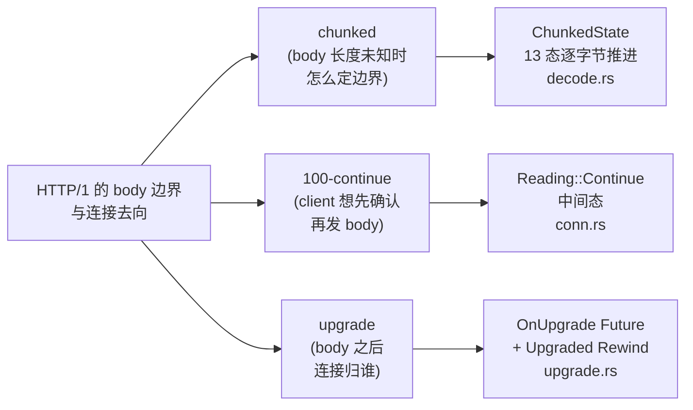
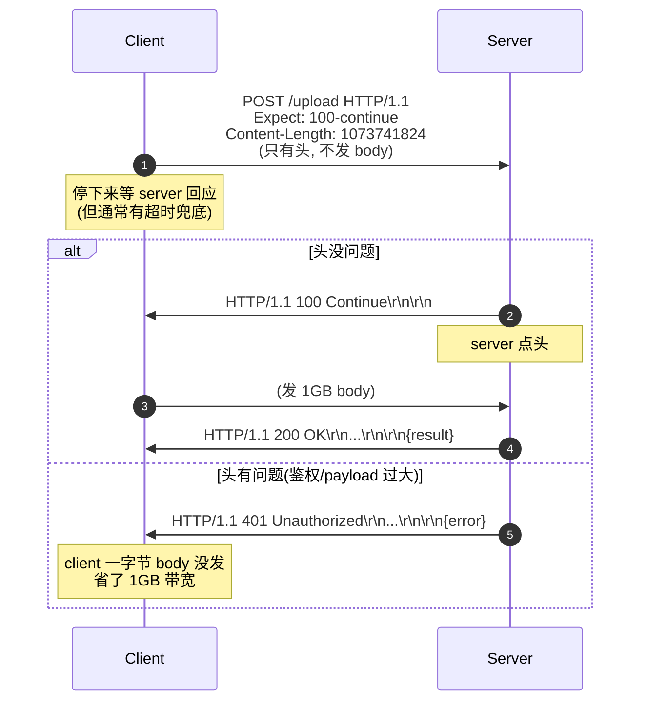
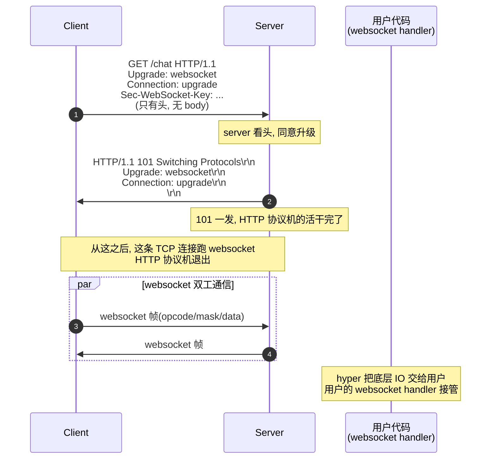

# 第 2 篇 · 第 7 章 · chunked、100-continue 与升级

> **核心问题**:上一章拆了 HTTP/1 的头部解析状态机,但只讲到最规整的一种 body——"靠 `Content-Length` 知道有几字节,读到数够了就停"。可真实的 HTTP/1 远不止这一种。① 服务端在生成响应时常常**不知道 body 一共多长**(流式产出、压缩管道、chunk 边到来边算),没有 `Content-Length`,client 怎么知道 body 在哪里结束?② client 想发一个**大 body**,又怕 server 一看头就拒(比如鉴权不过、payload 太大),先发过去等于白浪费带宽,能不能"我先问一句要不要发,你点头我再发"?③ 当双方约定好要把这条 HTTP/1 连接**改造成另一个协议**(websocket、HTTP/2 的 h2c、自定义协议),`101 Switching Protocols` 一旦发出,这条连接的协议机还要不要继续驱动?字节交给谁?这三个问题,对应 HTTP/1 的三个边角协议特性——`Transfer-Encoding: chunked`、`Expect: 100-continue`、协议升级(upgrade)。它们看着散,却共享同一个根问题:**HTTP/1 body 的边界怎么定**、**HTTP/1 连接的去向怎么定**。这一章把这三件事在 hyper 源码里讲到读者脑子里能放映。

> **读完本章你会明白**:
> 1. `Transfer-Encoding: chunked` 怎么在没有 `Content-Length` 的情况下给 body 划边界:`decode.rs` 里 `ChunkedState` 那 13 个状态怎么逐字节推进,为什么是逐字节而不是逐块,为什么这样写**保证不会把下一个请求的字节读进当前 body**。
> 2. `Expect: 100-continue` 怎么协商:为什么需要这个机制(client 怕白传大 body),hyper 在什么时机**自动**回 `100 Continue`、什么时候把决定权**交给 Service**,以及 `Reading::Continue(Decoder)` 这个中间态是怎么把"先回 100、再读 body"塞进现有 Reading 状态机的。
> 3. 协议升级(upgrade)怎么把一条 HTTP/1 连接**改造成别的协议**:`101 Switching Protocols` 之后,hyper 怎么把底层 IO **干净地交还**给用户(`upgrade::on` 拿 `OnUpgrade` Future → resolve 成 `Upgraded`),旧协议机怎么退出**不泄漏连接**。
> 4. 为什么升级是 HTTP/1 的特权、HTTP/2 不能这么升级(HTTP/2 一条连接并发多个 stream,连接不归单个请求,所以升级在 HTTP/2 走的是 extended CONNECT 而不是 `Upgrade` 头)。
> 5. 三个机制合起来回答的那个统一问题:**HTTP/1 的 body 边界**和**连接去向**,不是协议机外加的两个补丁,而是协议机本身的不变量——"每个请求的 body 在哪儿结束""这条连接归谁"始终有一个 sound 的答案。

> **如果一读觉得太难**:先只记三件事——① 没有 `Content-Length` 就用 chunked:每个 chunk 前面写 `十六进制长度\r\n`、数据、`\r\n`,最后一个 `0\r\n\r\n` 表示结束,hyper 用一个 13 态的 `ChunkedState` 逐字节解;② `Expect: 100-continue` 是 client 的"先问要不要发 body",server 在确认请求头后自动回 `HTTP/1.1 100 Continue\r\n\r\n` 再读 body,hyper 把这个"先回 100 再读"做成 `Reading::Continue` 中间态;③ 协议升级是 `101` 之后把底层 IO 从协议机手里"拿走",hyper 用一个 `OnUpgrade` Future(底层是 `oneshot` channel)+ `Upgraded`(用 `Rewind` 把 read_buf 里多读的字节还给用户)完成交接,旧 `Dispatcher` task 干净退出。三条抓住了,后面看状态机和源码就有挂靠点。

---

## 〇、一句话点破

> **chunked 解决"body 长度未知怎么定边界"(每个 chunk 自带长度,最后一个 `0\r\n\r\n` 收尾);100-continue 解决"client 想先确认再发 body"(先回 100 才读 body);upgrade 解决"这条 HTTP/1 连接改协议了,连接归谁"(101 后协议机把底层 IO 交还给用户)。三件事共享一个根问题——HTTP/1 的 body 边界与连接去向——而 hyper 的答案是一个逐字节推进、状态机驱动的协议机,它在每种情况下都给一个 sound 的、不串字节、不泄漏连接的答案。**

这是结论。本章倒过来拆:先看为什么会有这三个需求(动机层),再看 HTTP 协议本身怎么规定它们(RFC 层),然后对照一下别的协议怎么做(gRPC 在 HTTP/2 上根本不需要 chunked、Envoy HCM 怎么处理 upgrade),最后钻进 hyper 源码看这三件事**到底怎么写、为什么 sound**。

> **承接《Tokio》**:本章三件事底下的"等字节""等用户决定""交接 IO"全是 `Poll::Pending`/`Waker` 模型,task 挂起由 Tokio 调度;底层 IO 的 `AsyncRead`/`AsyncWrite`、buffered 读、`bytes::Bytes` 零拷贝切片——这些《Tokio》拆透的机制一句带过。本章篇幅全留 hyper 协议机独有:**chunked 解码状态机、100-continue 协商、upgrade 交接**这三个 HTTP/1 协议机为"边界与去向"专门设计的机制。

> **承接上一章(P2-06)**:上一章拆了头部解析状态机和 `Content-Length` 定长的 body。本章接三个边界——"没有 Content-Length 怎么办"(chunked)、"client 想推迟发 body 怎么办"(100-continue)、"body 之后连接不归 HTTP 了怎么办"(upgrade)。上一章的"逐字节状态机"在本章继续是主角,但用在一个全新的地方——`ChunkedState`。

---

## 一、三个需求:HTTP/1 的 body 边界与连接去向

先把"为什么要这三个机制"讲清。HTTP/1 是一个**面向字节流**的协议:TCP 给你一条无边界的字节流,HTTP 自己得想办法说清"这个请求到哪儿结束"。HTTP/1.1 给了三种 body 边界方式,每种对应一种现实需求。

### 1.1 为什么需要 chunked:body 长度常常事先不知道

最直观的边界是 `Content-Length`——"这个 body 一共 1234 字节"。它适合**事先知道全长**的场景:静态文件、内存里拼好的字符串、数据库查出来的结果集。

但有一大类场景**事先不知道全长**:

- **流式生成**:服务端边算边吐,比如大 JSON 序列化、模板渲染、视频转码实时输出。算完一帧吐一帧,等全部算完再发就丧失了流式的好处(延迟变高、内存爆)。
- **压缩管道**:body 经过 gzip/br 压缩,压缩后的长度在压完之前不知道。如果要等压缩完再发,就得全缓冲进内存。
- **动态内容**:CMS 渲染、SSR、聚合多个下游的响应,总长在所有下游回来之前定不下来。

如果硬要用 `Content-Length`,这些场景就只能"先全部算出来存内存,再发"——内存爆炸、延迟爆炸。HTTP/1.1 给了第二条路:**分块传输**(`Transfer-Encoding: chunked`)。把 body 切成一连串 chunk,每个 chunk 前面写**这个 chunk 的十六进制长度**(`size\r\n`),数据,再 `\r\n`;最后一个 chunk 长度是 0(`0\r\n\r\n`),表示 body 结束。这样**接收端不需要事先知道全长**,每收到一个 size 行就知道这一块几字节、读到几字节就停、等下一个 size 行,直到 `0\r\n\r\n` 收尾。

> **钉死这件事**:chunked 不是"把 body 切块"这么简单的事——它本质上是一种**自定界**(self-delimiting)的编码,每个 chunk 自带"我有多长"的元数据,接收端**纯靠字节流本身**就能切出边界,不依赖事先约定。这一点和 HTTP/2 用帧(frame)的 `Length` 字段定界是同一种思想,只是 HTTP/1 把它做在字节层面(文本化的十六进制长度行)。hyper 的 `ChunkedState` 就是这个"字节流自定界"在 Rust 里的实现。

### 1.2 为什么需要 100-continue:client 怕发大 body 被拒

考虑这个场景:client 想上传一个 1GB 的文件,先发请求头(`POST /upload HTTP/1.1`, `Content-Length: 1073741824`, 鉴权头等),然后准备发 body。可 server 一看头就发现**鉴权不过**(token 过期),或者**payload 太大**(超过 server 限制),或者**这个 path 根本不接受 POST**——正常情况下 server 会直接回 `401`/`413`/`405`。但**此时 client 可能已经开始往 TCP 里灌那 1GB body 了**。

如果 client 灌完 body 才收到 `401`,那 1GB 就白传了——尤其在高延迟、按流量计费的网络(移动网络、跨境)上,这是巨大的浪费。

`Expect: 100-continue` 就是为此设计的:client 发请求时**只先发头**,带 `Expect: 100-continue`,然后**停下来等**。server 看完头:

- 如果头没问题(鉴权过、payload 大小可接受),回 `HTTP/1.1 100 Continue\r\n\r\n`,client 收到这个,再发 body。
- 如果头有问题,直接回 `401`/`413`/`405`,**client 一字节 body 都没发**,白浪费零带宽。

> **钉死这件事**:100-continue 是 HTTP/1 的一个**协商机制**——client 主动推迟发 body,等 server 一个"绿灯"。它解决的是"大 body 在请求被拒时白传"的浪费。注意它**不是强制的**:RFC 7231 说 server 即使没收到 `Expect: 100-continue`,也可以主动回 100;client 即使发了 `Expect`,也应该有超时兜底(server 不回 100 就当默认同意发)。hyper 的实现要处理好"自动回 100""交给用户决定""超时兜底"三个分支。

### 1.3 为什么需要 upgrade:把 HTTP/1 连接改造成别的协议

HTTP/1.1 一开始是个文本协议,可互联网上跑的不只是 HTTP——websocket(全双工长连接,聊天/推送)、HTTP/2(二进制多路复用,在 h2c 模式下可以走 HTTP/1 升级)、各种自定义协议。开两条连接(HTTP 一条、websocket 一条)要两次握手,慢且复杂。

HTTP/1.1 的 **upgrade** 机制允许:**先用 HTTP/1 协商,协商成功后这条 TCP 连接直接转交给另一个协议**。流程是:

- client 发请求,带 `Upgrade: websocket`(和 `Connection: upgrade`),问 server "能不能升级到 websocket"。
- server 看完头,如果同意,回 `HTTP/1.1 101 Switching Protocols\r\nUpgrade: websocket\r\nConnection: upgrade\r\n\r\n`。
- **从这之后,这条 TCP 连接上跑的就不再是 HTTP,而是 websocket**。HTTP 协议机退出,字节交给 websocket 协议机。

> **钉死这件事**:upgrade 是 HTTP/1 的**协议交接**机制——`101` 是协议机之间的"钥匙交接"。HTTP 协议机干完一件事(发完 `101` 响应),就把底层 IO 交给新协议,自己退出。hyper 在这里要做的事情特别微妙:**怎么把"还在驱动这条连接的 Dispatcher Future"和"底层 IO"干净地拆开**,把 IO 交给用户(用户的 websocket handler),让 Dispatcher 退出而不泄漏连接。这是 hyper 最巧妙的机制之一,本章技巧精解会重点拆。

### 1.4 三件事的统一根:body 边界与连接去向

这三个机制看着散,其实共享一个根问题——**HTTP/1 的 body 边界**和**连接去向**:

- chunked 回答:**body 在哪儿结束**(每个 chunk 自带长度,`0\r\n\r\n` 收尾)。
- 100-continue 回答:**body 什么时候开始发**(server 点头之后)。
- upgrade 回答:**body 之后这条连接归谁**(101 后归新协议)。

这三件事都是 HTTP/1 协议机的**不变量守护**——协议机必须在每种情况下都给一个 sound 的答案,否则就会串字节(把下一个请求的字节读进当前 body)、泄漏连接(升级后协议机没干净退出、连接占着不放)、误传 body(100-continue 协商错)。hyper 的源码,就是这三件事的不变量守护在 Rust 里的实现。



下面三节,逐一拆这三个机制。

---

## 二、chunked:body 长度未知时怎么定边界

先拆 chunked,它是三个里**协议层最重**的——一个 13 态的逐字节状态机。

### 2.1 chunked 的字节格式(对照 RFC 7230)

先把 chunked 的字节格式钉死,后面看状态机才有参照。RFC 7230 §4.1 规定 chunked body 的格式:

```
chunked-body   = *chunk
                 last-chunk
                 trailer-part
                 CRLF

chunk          = chunk-size [ chunk-ext ] CRLF
                 chunk-data CRLF
chunk-size     = 1*HEXDIG           ; 十六进制
last-chunk     = 1*("0") [ chunk-ext ] CRLF
chunk-data     = 1*OCTET            ; chunk-size 字节
```

翻译成大白话,一个 chunk 长这样(以一个 11 字节的 chunk 为例):

```
b\r\n            ← chunk-size 行: 十六进制 b = 11
hello world      ← chunk-data: 11 字节
\r\n             ← chunk-data 后的 CRLF
```

最后一个 chunk 是 `0\r\n`,后面跟一个**空的 trailer 部分**(没有 trailer 就是直接的 CRLF):

```
0\r\n            ← last-chunk: size=0
\r\n             ← 结束的 CRLF(trailer-part 为空时就是一个 CRLF)
```

合在一起,一个完整的 chunked body("hello world" 11 字节):

```
b\r\n
hello world\r\n
0\r\n
\r\n
```

每个 chunk 还可以带 **chunk-ext**(扩展,`chunk-size;name=value\r\n`),hyper 不解释它,但必须**正确地跳过**(扫到 `\r\n` 为止)。chunk 后面还可以有 **trailer**(一组 header 字段,在 `0\r\n` 之后、最后的 `\r\n` 之前),hyper 会解析出来交给上层。

> **钉死这件事**:chunked 的格式有两个关键不变量——① **每个 chunk 的 size 行用十六进制**(不是十进制),`b` 是 11 不是 b 字符;② **最后一个 chunk size 是 0,后面跟 `CRLF CRLF`**(两个 CRLF,一个属于 last-chunk,一个属于结束)。这两个不变量,是 `ChunkedState` 状态机要守护的核心。

### 2.2 为什么不能"读一行解析"——逐字节状态机的动机

看到 chunked 的格式,第一反应可能是"按行解析":读一行拿到 size、读 size 字节的 data、读一个 CRLF、循环。这有什么难?

难在**异步 + 字节流 + 边界 sound**。考虑这些情况:

- **TCP 把一个 chunk 切在 size 行中间**:`b\r\n` 这 4 字节,可能第一次 read 只来了 `b`,第二次才来 `\r\n`。逐行解析要么阻塞(违反异步),要么缓存半行(增加状态)。
- **size 行 + data + CRLF 可能一次 read 全来了**,下一个 chunk 的 size 行也跟着来了。如果"读一行"读多了,就把下一个 chunk 的字节也吃进来了——**串字节**。
- **chunk-data 可能远大于一次 read 的量**:1MB 的 chunk,一次 read 可能只来 4KB。要边读边数,读到 chunk-size 字节就停,等下一个 size 行。

一个"逐行解析器"在异步字节流上要做对这些,本身就要维护"读到 size 行的哪个字符""chunk-data 还差几字节""下一个 CRLF 读没读完"这些状态——**这就是状态机**。hyper 没有回避,直接写了一个 13 态的状态机 `ChunkedState`,**逐字节**推进。

为什么是逐字节而不是逐块?因为 chunked 格式里**每个字节的角色都不一样**——size 行里的字符是十六进制数字、`;` 是扩展开始、`\r` 是 size 行快结束了、`\n` 是 size 行结束、chunk-data 是纯数据(任意字节)、data 后的 `\r\n` 又是结构字符。逐字节读、根据当前状态决定"这个字节该解释成什么",是最直接、最 sound 的做法。

> **承接上一章(P2-06)**:上一章拆头部解析时,hyper 用 `httparse` 一次性把整个 header block 切出来(因为 header 是按行结构化的,`httparse` 优化过)。但 body 的 chunked 编码不一样——它是**字节级**的自定界,size 行和 data 混在一起,`httparse` 帮不上忙。所以 hyper 自己写了 `ChunkedState` 逐字节解。这两种解析策略的分工,是 hyper 在协议解析上的一个清晰分界:**header 用现成解析器、body 的 chunked 自己写状态机**。

### 2.3 ChunkedState:13 态逐字节状态机

`ChunkedState` 定义在 `src/proto/h1/decode.rs:70`:

```rust
// hyper/src/proto/h1/decode.rs:69-84
#[derive(Debug, PartialEq, Clone, Copy)]
enum ChunkedState {
    Start,
    Size,
    SizeLws,
    Extension,
    SizeLf,
    Body,
    BodyCr,
    BodyLf,
    Trailer,
    TrailerLf,
    EndCr,
    EndLf,
    End,
}
```

13 个状态。先用一张状态图把它们的关系钉死,再逐个拆。

```mermaid
stateDiagram-v2
    [*] --> Start

    Start --> Size: 读第一个十六进制数字<br/>累加到 chunk_len

    Size --> Size: 继续读十六进制数字
    Size --> SizeLws: 读到 空格/Tab
    Size --> Extension: 读到 ;
    Size --> SizeLf: 读到 \\r

    SizeLws --> SizeLws: 继续 空格/Tab
    SizeLws --> Extension: 读到 ;
    SizeLws --> SizeLf: 读到 \\r

    Extension --> Extension: 跳过扩展字节(计数防溢出)
    Extension --> SizeLf: 读到 \\r

    SizeLf --> Body: 读到 \\n 且 chunk_len > 0
    SizeLf --> EndCr: 读到 \\n 且 chunk_len == 0

    Body --> Body: 读 chunk_len 字节(可能多次 read)
    Body --> BodyCr: chunk_len 读够

    BodyCr --> BodyLf: 读到 \\r
    BodyLf --> Start: 读到 \\n (回到下一 chunk 起点)

    EndCr --> EndCr: 收集 trailer 字节(遇到非 \\r)
    EndCr --> Trailer: 第一个非 \\r 字节进 trailer
    EndCr --> EndLf: 读到 \\r
    EndCr --> TrailerLf: 读到 \\r 后等 \\n(trailer 结束)

    Trailer --> Trailer: 收集 trailer 字节
    Trailer --> TrailerLf: 读到 \\r

    TrailerLf --> EndCr: 读到 \\n (一个 trailer 结束, 看下一个)
    TrailerLf --> EndCr: 可能还有更多 trailer

    EndLf --> End: 读到 \\n

    End --> [*]: body 结束, 返回 Frame::trailers<br/>或 Frame::data(空)

    note right of SizeLf
        chunk_len == 0 的 SizeLf 分支
        是关键分岔: 这是 last-chunk
    end note
```

这张图是本章最重要的图。下面逐个状态拆,配源码行号。

### 2.4 拆每个状态:逐字节推进的逻辑

`ChunkedState` 的推进入口是 `step`(`decode.rs:303`),它根据当前状态分发到对应的 `read_xxx` 函数:

```rust
// hyper/src/proto/h1/decode.rs:303-340 (摘录)
fn step<R: MemRead>(
    &self,
    cx: &mut Context<'_>,
    body: &mut R,
    StepArgs { chunk_size, chunk_buf, extensions_cnt,
               trailers_buf, trailers_cnt,
               max_headers_cnt, max_headers_bytes }: StepArgs<'_>,
) -> Poll<Result<ChunkedState, io::Error>> {
    use self::ChunkedState::*;
    match *self {
        Start => ChunkedState::read_start(cx, body, chunk_size),
        Size => ChunkedState::read_size(cx, body, chunk_size),
        SizeLws => ChunkedState::read_size_lws(cx, body),
        Extension => ChunkedState::read_extension(cx, body, extensions_cnt),
        SizeLf => ChunkedState::read_size_lf(cx, body, *chunk_size),
        Body => ChunkedState::read_body(cx, body, chunk_size, chunk_buf),
        BodyCr => ChunkedState::read_body_cr(cx, body),
        BodyLf => ChunkedState::read_body_lf(cx, body),
        Trailer => ChunkedState::read_trailer(cx, body, trailers_buf, max_headers_bytes),
        TrailerLf => ChunkedState::read_trailer_lf(/* ... */),
        EndCr => ChunkedState::read_end_cr(/* ... */),
        EndLf => ChunkedState::read_end_lf(/* ... */),
        End => Poll::Ready(Ok(ChunkedState::End)),
    }
}
```

每个 `read_xxx` 读**一个字节**(用 `byte!` 宏),根据字节决定下一个状态。`byte!` 宏(`decode.rs:252`)是逐字节读的核心:

```rust
// hyper/src/proto/h1/decode.rs:252-262 (摘录)
macro_rules! byte (
    ($rdr:ident, $cx:expr) => ({
        let buf = ready!($rdr.read_mem($cx, 1))?;
        if !buf.is_empty() {
            buf[0]
        } else {
            return Poll::Ready(Err(io::Error::new(io::ErrorKind::UnexpectedEof,
                                      "unexpected EOF during chunk size line")));
        }
    })
);
```

它调 `rdr.read_mem(cx, 1)` 读 1 字节。`read_mem` 是 `MemRead` trait(`io.rs:339`)的方法,底层是 `Buffered` 的读缓冲——如果缓冲里还有字节,直接切 1 字节返回(`io.rs:349-352`);缓冲空了,才去 socket 读。所以"逐字节"在缓冲有数据时是**纯内存切片**(零额外系统调用),只在缓冲空时才真的读 socket。这一点很关键——逐字节状态机的开销没有想象中大。

现在逐个状态拆。

**`Start`(`read_start`, `decode.rs:342`)**:chunk 的起点。读第一个字节,必须是十六进制数字(`0-9`/`a-f`/`A-F`),否则报错。把数字累加进 `chunk_size`(十六进制:`size = size * 16 + digit`)。转到 `Size`。

```rust
// hyper/src/proto/h1/decode.rs:342-372 (摘录)
fn read_start<R: MemRead>(cx, rdr, size: &mut u64) -> Poll<Result<ChunkedState, io::Error>> {
    let radix = 16;
    match byte!(rdr, cx) {
        b @ b'0'..=b'9' => {
            *size = or_overflow!(size.checked_mul(radix));
            *size = or_overflow!(size.checked_add(u64::from(b - b'0')));
        }
        b @ b'a'..=b'f' => { /* ... 十六进制 a-f ... */ }
        b @ b'A'..=b'F' => { /* ... 十六进制 A-F ... */ }
        _ => return Poll::Ready(Err(io::Error::new(
            io::ErrorKind::InvalidInput,
            "Invalid chunk size line: missing size digit",
        ))),
    }
    Poll::Ready(Ok(ChunkedState::Size))
}
```

注意 `Start` 必须至少读到**一个**数字——如果第一个字节就不是数字(比如 `\r\n`),直接报 "missing size digit"。这防的是格式错误的 chunked body(比如 size 行空)。`or_overflow!` 宏(`decode.rs:264`)防 `chunk_size` 溢出——十六进制 `f0000000000000003\r\n` 这种超 `u64` 的恶意 size 行会被拒绝(测试 `test_read_chunk_size` 验证,`decode.rs:852`)。

**`Size`(`read_size`, `decode.rs:374`)**:继续读 size 行的后续字节。还是十六进制数字就累加;读到空格/Tab 转 `SizeLws`(linear whitespace);读到 `;` 转 `Extension`(chunk 扩展开始);读到 `\r` 转 `SizeLf`(size 行快结束)。这一步的核心是"**十六进制 size 可以是任意多位**",hyper 不限位数,靠 `checked_mul`/`checked_add` 防溢出。

**`SizeLws`(`read_size_lws`, `decode.rs:407`)**:size 和扩展之间的空白。RFC 允许 size 后面跟 linear whitespace(空格/Tab),再跟扩展或 CRLF。继续读空白;读到 `;` 转 Extension;读到 `\r` 转 SizeLf。

**`Extension`(`read_extension`, `decode.rs:423`)**:chunk 扩展(`;name=value`)。hyper 不解释扩展,但要**正确跳过**——一直读字节直到 `\r`,转 SizeLf。这里有一个**防溢出计数**:`extensions_cnt` 每读一个扩展字节就加 1,超过 `CHUNKED_EXTENSIONS_LIMIT`(16KB,`decode.rs:20`)就报错。这防的是恶意 client 发一个超大扩展把 server 内存撑爆。注释(`decode.rs:429`)说"我们不关心扩展,忽略它们",但**必须正确跳过**——否则会把扩展的字节当成下一个 chunk 的 size。

> **不这样会怎样**:如果不计 `extensions_cnt`,恶意 client 可以发 `1;` 加几十兆垃圾字节再 `\r\n`,server 一边跳过一边内存/CPU 爆。`CHUNKED_EXTENSIONS_LIMIT = 16KB` 是个保守上限——正常 chunk-ext(比如 `;foo=bar`)就几十字节。这个**限制是对整个 body 累计**的(注释 `decode.rs:18` 明说"currently applied for the entire body, not per chunk"),所以一个 body 里所有 chunk 的扩展总和不能超 16KB。

**`SizeLf`(`read_size_lf`, `decode.rs:454`)**:size 行的 `\n`。读到 `\n` 就 size 行结束。**这里是关键分岔**:`size == 0` 转 `EndCr`(这是 last-chunk,后面是 trailer);`size > 0` 转 `Body`(开始读 chunk 数据)。这个分岔是"**是不是最后一个 chunk**"的判定点。

```rust
// hyper/src/proto/h1/decode.rs:454-474 (摘录)
fn read_size_lf<R: MemRead>(cx, rdr, size: u64) -> Poll<Result<ChunkedState, io::Error>> {
    match byte!(rdr, cx) {
        b'\n' => {
            if size == 0 {
                Poll::Ready(Ok(ChunkedState::EndCr))   // last-chunk
            } else {
                debug!("incoming chunked header: {0:#X} ({0} bytes)", size);
                Poll::Ready(Ok(ChunkedState::Body))
            }
        }
        _ => Poll::Ready(Err(io::Error::new(
            io::ErrorKind::InvalidInput,
            "Invalid chunk size LF",
        ))),
    }
}
```

**`Body`(`read_body`, `decode.rs:476`)**:读 chunk 数据。这是**唯一一个不是"读 1 字节"的状态**——它调 `rdr.read_mem(cx, to_read)` 一次读**最多 `chunk_len` 字节**(`to_read = min(chunk_len, 缓冲里有的)`)。读到的数据存进 `chunk_buf`(返回给上层),`chunk_len -= 读到的字节数`。如果 `chunk_len > 0` 继续 Body(还要读);`chunk_len == 0` 转 BodyCr(这一 chunk 的 data 读完了,等结束的 CRLF)。

```rust
// hyper/src/proto/h1/decode.rs:476-504 (摘录)
fn read_body<R: MemRead>(cx, rdr, rem: &mut u64, buf: &mut Option<Bytes>)
    -> Poll<Result<ChunkedState, io::Error>> {
    let to_read = usize::try_from(*rem).unwrap_or(usize::MAX);
    let slice = ready!(rdr.read_mem(cx, to_read))?;
    let count = slice.len();
    if count == 0 {
        *rem = 0;
        return Poll::Ready(Err(io::Error::new(
            io::ErrorKind::UnexpectedEof,
            IncompleteBody,
        )));
    }
    *buf = Some(slice);
    *rem -= count as u64;
    if *rem > 0 { Poll::Ready(Ok(ChunkedState::Body)) }
    else { Poll::Ready(Ok(ChunkedState::BodyCr)) }
}
```

注意 `count == 0`(EOF 但 chunk 没读完)报 `IncompleteBody`——这防的是"chunk 声明 100 字节但 socket 提前关闭"。还有 `*rem -= count as u64`——`Body` 状态用**剩余字节数**驱动,读到够为止。这是 chunked 解码里**唯一**用"剩余计数"而不是"看字节内容"推进的状态,因为 chunk-data 是纯数据(任意字节,不看内容)。

**`BodyCr`/`BodyLf`(`read_body_cr`/`read_body_lf`, `decode.rs:505`/`517`)**:chunk-data 后的 CRLF。读 `\r` 转 BodyLf;读 `\n` 转 **Start**(下一 chunk 的起点)。注意回到 `Start` 不是 `End`——只要不是 last-chunk,就回到起点读下一个 chunk。

**`EndCr`/`EndLf`/`Trailer`/`TrailerLf`(`decode.rs:585` 等)**:last-chunk(`0\r\n`)之后的 trailer 部分。如果**没有 trailer**,就是 `\r\n`(EndCr 读到 `\r` 转 EndLf,EndLf 读到 `\n` 转 End)。如果有 trailer,先读 trailer 字段(收集进 `trailers_buf: BytesMut`),每个 trailer 用 CRLF 结束,所有 trailer 之后一个空 CRLF 结束。这一段用 `BytesMut` 缓冲 trailer 的原始字节,最后用 `decode_trailers`(`decode.rs:639`,内部调 `httparse::parse_headers`)解析成 `HeaderMap`。

> **钉死这件事**:`EndCr` 是 last-chunk 之后的状态,它**同时**处理"没有 trailer 直接结束"和"开始读第一个 trailer 字节"两种情况——看第一个字节是不是 `\r`:`\r` 转 EndLf(没有 trailer),非 `\r` 就把字节存进 `trailers_buf` 转 Trailer(有 trailer)。这个分支让 trailer 部分可以**为空**(常见的 `0\r\n\r\n`)也可以**有内容**(`0\r\nExpires: ...\r\n\r\n`)。`decode.rs:585-615` 的 `read_end_cr` 就是这个分支逻辑。

**`End`**:body 完全结束。`decode` 函数(`decode.rs:198`)看到 `state == End`,如果 `trailers_buf` 有内容就返回 `Frame::trailers(headers)`(http-body crate 的 trailer 帧);否则返回 `Frame::data(Bytes::new())`(空 data 帧,表示 EOF)。

### 2.5 为什么 sound:不会串字节的保证

chunked 解码最怕两件事:① 把下一个请求的字节读进当前 body(串字节);② 把 chunk-size 行的字符当成 data 读。hyper 的状态机怎么保证不串?

**保证 1:每个 chunk 的 data 字节数严格等于 size 行声明的数。** `Body` 状态用 `*rem` 精确计数,读到 `rem == 0` 立刻转 `BodyCr`,**绝对不会多读一字节**。下一个字节(CRLF 的 `\r`)留给 `BodyCr` 处理。所以 chunk-data 和结构字符(CRLF)严格分开,不会混淆。

**保证 2:结构字符和数据字符靠状态机区分。** 同一个 `\r` 字节,在 `Size` 状态里是"size 行快结束了"(转 SizeLf),在 `BodyCr` 状态里是"chunk-data 的 CRLF 的前半"(转 BodyLf),在 `EndCr` 状态里是"trailer 部分快结束了"(转 EndLf)。**字节的角色由当前状态决定**,不是由字节内容决定——这就是状态机的本质。

**保证 3:last-chunk(`0\r\n`)之后严格按 trailer 格式读,读完空 CRLF 就 End。** 不会"读到 `0\r\n` 就立刻返回"——必须读到最后的 `\r\n`(EndLf 读到 `\n` 转 End),否则会把 trailer 字节或下一个请求的字节漏读。`End` 状态一旦到达,`decode` 返回 EOF,上层(`poll_read_body` in conn.rs)看到 EOF 把 `reading` 置 `KeepAlive`,然后 `try_keep_alive` 重置——下一个请求的字节干净地留给下一轮。

> **钉死这件事**:chunked 的 sound 靠**状态机 + 精确计数**。状态机让"字节的角色"明确(结构字符 vs data),计数让"data 字节数严格匹配 size"。两者合起来,保证 chunked body 读到 `End` 时,**read_buf 里剩下的字节一定是属于下一个请求的**,不会串。这是为什么 hyper 在 keep-alive 连接上跑 chunked body 不会乱——状态机守护了边界。

### 2.6 对照:gRPC/HTTP/2 为什么不需要 chunked

讲完 hyper 的 chunked 实现,值得对照一下 HTTP/2——为什么 HTTP/2 根本不需要 chunked?

HTTP/2 用**帧(frame)**作为传输单位,每个帧有一个 9 字节的 frame header,其中前 3 字节就是**这个帧的 payload 长度**。一个 HTTP/2 请求/响应的 body,被切成多个 DATA 帧传输,每个 DATA 帧自带长度。最后一个 DATA 帧带 `END_STREAM` 标志位,表示 body 结束。

这和 chunked 的思想**完全一样**——都是"每个传输单元自带长度,最后一个单元带结束标志"。区别只在:

- HTTP/1 chunked:长度是**文本化的十六进制 size 行**(人可读、字节层面)。
- HTTP/2 frame:长度是**二进制的 3 字节整数**(紧凑、帧层面)。

所以 HTTP/2 把"body 边界"这件事做在**帧层**,chunked 的所有状态机逻辑都不需要——HTTP/2 实现只要读 frame header 拿长度,读 payload,看 END_STREAM 标志。这就是为什么 hyper 在 HTTP/2 路径上(委托给 h2 crate)**完全不走 `ChunkedState`**——h2 crate 内部用帧解析,自带长度。

> **承接《gRPC》**:gRPC 长在 HTTP/2 上,gRPC 的消息流(message stream)对应 HTTP/2 的 DATA 帧流。gRPC 的"消息长度"靠每个 message 前面的 5 字节长度前缀(1 字节 compressed flag + 4 字节大端 message length),靠 HTTP/2 帧传输。整个链路里**没有 chunked**——HTTP/2 帧自带长度,gRPC message 自带长度。chunked 是 HTTP/1 的"补偿机制",在 HTTP/2 里被帧层取代了。所以讲 hyper 的 HTTP/1 chunked,本质是讲"HTTP/1 在没有帧层的情况下怎么自定界",这是 HTTP/1 协议机的独有负担。

---

## 三、100-continue:client 想先确认再发 body

chunked 解决"server 不知道 body 多长",100-continue 解决"client 怕发 body 被拒"。两者都是 HTTP/1 body 边界的协商,但方向相反——chunked 是 server 解 client 的 body,100-continue 是 server 决定要不要 client 的 body。

### 3.1 协议层:Expect 头的协商流程

RFC 7231 §5.1.1 定义 `Expect` 头,目前唯一的合法值是 `100-continue`。流程:



关键点:client 发了 `Expect: 100-continue` 后,**不应该立即发 body**,要等 server 的 100 响应。但 RFC 也说,如果 server 不回 100(client 等超时了),client **应该当作默认同意发 body**(否则死锁)——这是 RFC 的务实设计:100-continue 是优化不是强制。

### 3.2 hyper 怎么检测 Expect:wants 中加 EXPECT 标志

hyper 检测 `Expect: 100-continue` 在头部解析阶段(`role.rs:312`):

```rust
// hyper/src/proto/h1/role.rs:312-317
header::EXPECT => {
    // According to https://datatracker.ietf.org/doc/html/rfc2616#section-14.20
    // Comparison of expectation values is case-insensitive for unquoted tokens
    // (including the 100-continue token)
    expect_continue = value.as_bytes().eq_ignore_ascii_case(b"100-continue");
}
```

`eq_ignore_ascii_case` 做大小写不敏感比较(`100-Continue`、`100-CONTINUE` 都算)。这个 `expect_continue` 标志随后进入 `ParsedMessage`(`role.rs:356-367`),被 `Conn::poll_read_head` 拿到。

`poll_read_head`(`conn.rs:211` 起,关键在 `conn.rs:297-326`)根据 `expect_continue` 决定 `reading` 状态:

```rust
// hyper/src/proto/h1/conn.rs:297-326 (摘录, 简化)
let mut wants = if msg.wants_upgrade {
    Wants::UPGRADE
} else {
    Wants::EMPTY
};

if msg.decode == DecodedLength::ZERO {
    // 请求没 body, expect_continue 无意义, 忽略
    if msg.expect_continue {
        debug!("ignoring expect-continue since body is empty");
    }
    self.state.reading = Reading::KeepAlive;
    // ...
} else if msg.expect_continue && msg.head.version.gt(&Version::HTTP_10) {
    // 有 body + Expect + HTTP/1.1+: 进入 Continue 中间态
    self.state.reading = Reading::Continue(Decoder::new(
        msg.decode,
        self.state.h1_max_headers,
        h1_max_header_size,
    ));
    wants = wants.add(Wants::EXPECT);
} else {
    // 普通 body, 直接进 Body 状态
    self.state.reading = Reading::Body(Decoder::new(
        msg.decode,
        self.state.h1_max_headers,
        h1_max_header_size,
    ));
}
```

三个分支:

1. **body 为空**:`expect_continue` 无意义(没 body 发什么发),直接进 `KeepAlive`(等下一个请求)。
2. **有 body + Expect + HTTP/1.1+**:进 `Reading::Continue(Decoder)`——**这就是 100-continue 的中间态**。同时 `wants.add(Wants::EXPECT)` 标记这个请求需要 100 协商。
3. **普通 body**:进 `Reading::Body(Decoder)`,直接读。

注意第 2 个分支要求 `version.gt(&Version::HTTP_10)`——HTTP/1.0 不支持 100-continue(`Expect` 是 HTTP/1.1 加的),所以 HTTP/1.0 的请求带 `Expect` 也当普通 body 处理。这是协议版本守卫。

`wants` 是个 bitset(`Wants::UPGRADE`/`Wants::EXPECT`),它随 `(head, body_len, wants)` 一起返回给 `Dispatcher::poll_read_head`(`dispatch.rs:302`)。Dispatcher 看到 `wants.contains(Wants::EXPECT)` 会把 `EXPECT` 信息传给 `IncomingBody::new_channel`(`dispatch.rs:308`):

```rust
// hyper/src/proto/h1/dispatch.rs:304-312 (摘录)
let body = match body_len {
    DecodedLength::ZERO => IncomingBody::empty(),
    other => {
        let (tx, rx) =
            IncomingBody::new_channel(other, wants.contains(Wants::EXPECT));
        self.body_tx.set(tx);
        rx
    }
};
```

`IncomingBody::new_channel` 的第二个参数 `expect_continue: bool` 决定了:**这个 body channel 在被 poll 之前,要不要等一个 100 信号**。这是上层 Service 拿到的 body 的"延迟激活"机制——只要 hyper 还没回 100,body channel 就不交付数据。

### 3.3 Reading::Continue:先回 100 再读 body 的中间态

现在看 hyper 怎么"先回 100、再读 body"。核心是 `Reading::Continue(Decoder)` 这个状态。它在 `poll_read_body`(`conn.rs:363`)里被处理:

```rust
// hyper/src/proto/h1/conn.rs:409-420
Reading::Continue(ref decoder) => {
    // Write the 100 Continue if not already responded...
    if let Writing::Init = self.state.writing {
        trace!("automatically sending 100 Continue");
        let cont = b"HTTP/1.1 100 Continue\r\n\r\n";
        self.io.headers_buf().extend_from_slice(cont);
    }

    // And now recurse once in the Reading::Body state...
    self.state.reading = Reading::Body(decoder.clone());
    return self.poll_read_body(cx);
}
```

这段代码是 100-continue 实现的精华。逐句拆:

1. **`if let Writing::Init = self.state.writing`**:只有在 `writing` 还是 `Init`(还没开始写响应)时才自动发 100。如果 `writing` 已经不是 Init(比如 Service 已经开始写响应了,可能是个错误响应),就**不再自动发 100**——因为响应已经发了,100 没意义。这是个 sound 检查:**避免"已经回了 401、又冒出一个 100"的协议错乱**。
2. **`let cont = b"HTTP/1.1 100 Continue\r\n\r\n"`**:100 响应是固定的字节串——状态行 `HTTP/1.1 100 Continue` + 一个空行结束(`\r\n\r\n`)。100 是 1xx informational response,**没有 body**,所以就是状态行加空行。
3. **`self.io.headers_buf().extend_from_slice(cont)`**:把这个 100 响应写进 `headers_buf`(写缓冲里专门给 header/控制响应用的部分)。注意是**写进缓冲,不是立刻 flush**——它会和后续的真正响应一起被 flush 出去(或者 100 先被 flush,取决于 poll_flush 时机)。
4. **`self.state.reading = Reading::Body(decoder.clone())`**:状态从 `Continue` 转成 `Body`——decoder 克隆一份(decoder 是 `Clone` 的,`decode.rs:31`),开始正常读 body。
5. **`return self.poll_read_body(cx)`**:**递归一次**。转成 `Body` 状态后立刻再调一次 `poll_read_body`,这次走 `Reading::Body` 分支真正读 body。

> **钉死这件事**:`Reading::Continue` 是一个**自转换中间态**——它的存在不是为了"停留",而是为了"在转成 Body 之前,先做一件事:把 100 写进缓冲"。一旦做完,立刻 clone decoder 转 Body 并递归。这个设计的精妙在于:**100 响应是 server 主动发的,但它的触发点是"poll 请求 body 时"**——也就是说,只有当上层 Service 真的去 poll 请求 body 时(说明它接受了这个请求、愿意处理 body),hyper 才自动回 100。如果 Service 直接回 401(根本不 poll body),hyper 永远不会进 `Continue` 分支,**也不会发 100**——完美符合 100-continue 的语义("server 接受请求才点头")。

### 3.4 为什么这样设计:延迟激活的语义

值得展开讲为什么 hyper 选择"**poll body 时才发 100**"而不是"**收到 Expect 头立刻发 100**"。

考虑这两种实现的区别:

- **收到 Expect 头立刻发 100**:协议机解析完头,看到 Expect,马上回 100,然后开始读 body。
- **poll body 时才发 100**(hyper 的选择):协议机解析完头,看到 Expect,**不立刻回 100**,而是把请求(包括 body channel)交给 Service。Service 决定要不要这个 body:如果要(它去 poll body),body channel 的 poll 触发 hyper 回 100;如果不要(Service 直接回 401,从不 poll body),100 永远不发。

第二种(hyper 的)选择**把"要不要 body"的决定权交给 Service**。这是更 sound 的设计:

- 如果 server 配置了 "payload 超过 1GB 就拒",Service 在看到 `Content-Length: 1073741824` 时可以直接回 413,**根本不 poll body**,hyper 也就不发 100——client 收到 413,一字节 body 不发。完美。
- 如果 server 想接收,Service 开始 poll body channel,hyper 自动回 100,client 收到 100 发 body。

而第一种(立刻发 100)就做不到——它在 Service 还没决定时就发了 100,client 已经开始灌 body 了,Service 这时才决定拒就晚了。

> **不这样会怎样**:如果收到 Expect 头立刻发 100,Service 就失去了"先看头再决定"的能力。hyper 把 100 的触发点放在"poll body 时",本质是把"100 Continue"这个协议信号**绑定到 Service 的 body 消费行为**上——Service 消费 body 等于同意,不消费等于拒绝。这是 hyper 把协议语义和框架语义对齐的精彩一例。

### 3.5 client 侧:on_informational 回调

上面讲的都是 server 侧(收 Expect、回 100)。client 侧呢?client 发了 `Expect: 100-continue` 后,要等 server 的 100 响应才能发 body。

hyper 的 client 侧处理 100 在 `Client::parse`(`role.rs:1172`):收到 1xx informational response(包括 100),如果有 `on_informational` 回调(`conn.rs:947`),就调用它。这个回调是 client 在发请求时设置的,用来"收到 100 就唤醒等 body 的逻辑"。

```rust
// hyper/src/proto/h1/role.rs:1172-1176
if head.subject.is_informational() {
    if let Some(callback) = ctx.on_informational {
        callback.call(head.into_response(()));
    }
}
```

`is_informational()` 判断状态码是 100-199。100 触发回调,client 收到信号后开始发 body。注意 1xx 响应**不结束请求**——`role.rs:1180` 检查 buffer 是否空,空了返回 `None`(继续等真正的响应),不空继续解析。所以 100 之后 client 还要等真正的 `200 OK`/`401` 等。

> **钉死这件事**:client 侧的 100 处理是"被动等"——发完请求头(带 Expect)就等,收到 100 才发 body。这个"等"在异步模型里就是 task 挂起(`Poll::Pending`),靠 Tokio 调度唤醒。hyper 在这里只做"识别 1xx + 触发回调",真正的"等"和"发 body"是 client 连接 Future 的状态机驱动。这又是一个"协议语义靠 Future/Poll 自然表达"的例子。

### 3.6 hyper 不强制用户处理 Expect:auto vs manual

hyper 在 100-continue 上给用户两层 API:

- **自动模式**(默认):如上所述,Service poll body 时 hyper 自动回 100。用户什么都不用做。
- **手动模式**:如果用户想自己控制(比如自定义协议、想在回 100 前做额外检查),hyper 允许 Service 在 poll body 前自己写一个 100 响应。一旦 `writing` 不是 Init(hyper 的 `Continue` 分支检查),hyper 就不会再自动发 100。

这种"默认自动、可手动覆盖"的设计,是 hyper API 的一个一贯风格——给合理默认,但保留 escape hatch。`conn.rs:850` 还有一个细节:在连接关闭时如果还在 `Continue` 状态,会"跳过发送 100-continue":

```rust
// hyper/src/proto/h1/conn.rs:850-852
if let Reading::Continue(ref decoder) = self.state.reading {
    // skip sending the 100-continue
}
```

这是 sound 收尾——连接要关了就别再发 100(发了 client 也会因为连接关闭而失败),干净退出。

---

## 四、upgrade:把 HTTP/1 连接改造成别的协议

第三个机制是 upgrade——它最复杂,因为涉及**协议机的退出和 IO 的交接**。

### 4.1 协议层:Upgrade 头和 101 响应

RFC 7230 §6.1 定义 HTTP/1.1 的 upgrade 机制。流程:



关键点:

- client 请求带 `Upgrade: <protocol>` 和 `Connection: upgrade`。
- server 同意就回 `101 Switching Protocols`,同样带 `Upgrade` 和 `Connection: upgrade`。
- **`101` 之后,这条连接上的字节不再是 HTTP**——是升级后的协议(websocket 等)。HTTP 协议机的任务结束。

还有一类升级走 **`CONNECT` 方法**(HTTP 隧道,比如 HTTPS 代理):client 发 `CONNECT host:port HTTP/1.1`,server 回 `200`(或 `101`),之后连接就是透明的 TCP 隧道。hyper 把 `CONNECT` 也归到 upgrade 机制里(`role.rs:239`: `wants_upgrade = subject.0 == Method::CONNECT`)。

### 4.2 hyper 怎么检测 upgrade:wants 中加 UPGRADE 标志

upgrade 检测也在头部解析阶段(`role.rs:318`):

```rust
// hyper/src/proto/h1/role.rs:239 (CONNECT 方法也算升级)
let mut wants_upgrade = subject.0 == Method::CONNECT;

// ...
// hyper/src/proto/h1/role.rs:318-321
header::UPGRADE => {
    // Upgrades are only allowed with HTTP/1.1
    wants_upgrade = is_http_11;
}
```

两个触发点:① 方法是 `CONNECT`(隧道);② 有 `Upgrade` 头且 HTTP/1.1。`wants_upgrade` 进入 `ParsedMessage`(`role.rs:366`),被 `Conn::poll_read_head` 拿到——`conn.rs:297`:

```rust
// hyper/src/proto/h1/conn.rs:297-301
let mut wants = if msg.wants_upgrade {
    Wants::UPGRADE
} else {
    Wants::EMPTY
};
```

`wants` 带 `UPGRADE` 标志返回给 Dispatcher。Dispatcher(`dispatch.rs:313`)看到 `UPGRADE` 就**准备一个 `OnUpgrade` Future 塞进请求的 extensions**:

```rust
// hyper/src/proto/h1/dispatch.rs:313-321
if wants.contains(Wants::UPGRADE) {
    let upgrade = self.conn.on_upgrade();
    debug_assert!(!upgrade.is_none(), "empty upgrade");
    debug_assert!(
        head.extensions.get::<OnUpgrade>().is_none(),
        "OnUpgrade already set"
    );
    head.extensions.insert(upgrade);
}
```

`self.conn.on_upgrade()`(`conn.rs:894`)调 `state.prepare_upgrade()`(`conn.rs:1148`):

```rust
// hyper/src/proto/h1/conn.rs:1148-1152
fn prepare_upgrade(&mut self) -> crate::upgrade::OnUpgrade {
    let (tx, rx) = crate::upgrade::pending();
    self.upgrade = Some(tx);
    rx
}
```

`crate::upgrade::pending()`(`upgrade.rs:122`)返回一个 `(Pending, OnUpgrade)` 对——`Pending` 持有 `oneshot::Sender`,`OnUpgrade` 持有 `oneshot::Receiver`(包在 `Arc<Mutex>` 里,允许 Clone)。`Pending`(sender)存进 `state.upgrade` 字段,`OnUpgrade`(receiver)塞进请求 extensions 给 Service。

> **钉死这件事**:upgrade 的交接核心是一个 **oneshot channel**——`Pending`(协议机这端,持有 sender)和 `OnUpgrade`(用户那端,持有 receiver,塞进 Request extensions)。当协议机决定"该升级了",它通过 `Pending::fulfill(upgraded)` 把 `Upgraded` 对象发过去,用户的 `OnUpgrade` Future 就 resolve。这就是"协议机把 IO 交给用户"的通信管道。下面拆 fulfill 在哪触发、Upgraded 怎么构造。

### 4.3 OnUpgrade:用户侧的 Future API

用户侧的 `OnUpgrade` 是一个 `Future`(`upgrade.rs:225`):

```rust
// hyper/src/upgrade.rs:225-242
impl Future for OnUpgrade {
    type Output = Result<Upgraded, crate::Error>;

    fn poll(self: Pin<&mut Self>, cx: &mut Context<'_>) -> Poll<Self::Output> {
        match self.rx {
            Some(ref rx) => Pin::new(&mut *rx.lock().panic_if_poisoned())
                .poll(cx)
                .map(|res| match res {
                    Ok(Ok(upgraded)) => Ok(upgraded),
                    Ok(Err(err)) => Err(err),
                    Err(_oneshot_canceled) => {
                        Err(crate::Error::new_canceled().with(UpgradeExpected))
                    }
                }),
            None => Poll::Ready(Err(crate::Error::new_user_no_upgrade())),
        }
    }
}
```

用户用 `hyper::upgrade::on(&request)`(`upgrade.rs:106`)从 Request extensions 里拿出这个 Future(它实现了 `CanUpgrade` sealed trait,`upgrade.rs:331`),然后 `await` 它。三种结果:

- `Ok(Upgraded)`:协议机完成了交接,拿到 `Upgraded`(底层 IO 包了一层)。
- `Err(...)`:协议机出错了,升级失败。
- `Err(new_canceled)`:协议机 task 被 drop 了(比如运行时关闭),oneshot sender 没了,`UpgradeExpected` 错误。

用户拿到 `Upgraded` 后,可以:

- 直接当 `Read`/`Write` 用(`upgrade.rs:166`/`176` 实现了 `Read`/`Write` trait),读写新协议的字节。
- `downcast::<T>()`(`upgrade.rs:152`)解构出原始 IO 类型(比如 `TokioIo<TcpStream>`),拿到 `Parts { io, read_buf }`——原始 IO 加一个 read_buf(read_buf 里可能有协议机多读的字节,见 4.5)。

### 4.4 Upgraded:为什么底层是 Rewind<Box<dyn Io>>

`Upgraded` 的定义(`upgrade.rs:66`):

```rust
// hyper/src/upgrade.rs:66-68
pub struct Upgraded {
    io: Rewind<Box<dyn Io + Send>>,
}
```

两个关键设计:

**① `Box<dyn Io + Send>`——类型擦除**。底层 IO 可能是 `TokioIo<TcpStream>`、也可能是 `TokioIo<UnixStream>`、甚至测试用的 mock。hyper 的 upgrade API 要能统一处理这些,所以用 trait object `Box<dyn Io>` 擦除类型。`Io` trait(`upgrade.rs:291`)是 `Read + Write + Unpin + 'static` 的 supertrait,加了 `__hyper_type_id` 支持 downcast。`downcast`(`upgrade.rs:152`/`306`)用 `TypeId` 做运行时类型检查,downcast 成功就还原原始类型——这是 `std::error::Error::downcast` 的同款技术(`upgrade.rs:308` 的 SAFETY 注释说明了指针转换的安全性)。

**② `Rewind<...>`——多读字节回放**。这是最巧妙的部分。`Rewind`(`common/io/rewind.rs:11`)是一个"带前置缓冲的 IO 包装器":

```rust
// hyper/src/common/io/rewind.rs:11-14
pub(crate) struct Rewind<T> {
    pre: Option<Bytes>,
    inner: T,
}
```

它的 `poll_read`(`rewind.rs:59`)逻辑:如果有 `pre` 缓冲(协议机多读的字节),**先从 pre 读**;pre 读完了,再从 `inner`(底层 IO)读。

> **为什么需要 Rewind**:HTTP/1 协议机是**批量读**的——`Buffered::poll_read_from_io`(`io.rs:219`)一次从 socket 读一大块进 `read_buf`(可能是 8KB),然后状态机在 `read_buf` 上切。问题是:协议机可能**多读了不属于 HTTP 的字节**——比如 websocket 升级,client 发完升级请求后,可能**紧接着就把 websocket 的第一帧发过来了**,而 server 的 HTTP 协议机读请求头时把这一帧的字节也读进了 `read_buf`。升级后,这些字节属于 websocket,不属于 HTTP。如果不把它们"还给"用户,用户的 websocket handler 会丢掉连接开头的数据。

`Rewind` 就是解决这个问题的:升级时,把 `read_buf` 里**剩余的字节**(`into_inner` 返回的 `Bytes`,`io.rs:258`)作为 `pre` 缓冲塞进 `Rewind`。用户的 `Upgraded.poll_read` 会先读 pre(那些多读的字节),再读底层 IO——**字节不丢**。

```rust
// hyper/src/common/io/rewind.rs:59-81 (摘录)
fn poll_read(mut self: Pin<&mut Self>, cx, mut buf: ReadBufCursor<'_>) -> Poll<io::Result<()>> {
    if let Some(mut prefix) = self.pre.take() {
        if !prefix.is_empty() {
            let copy_len = cmp::min(prefix.len(), buf.remaining());
            buf.put_slice(&prefix[..copy_len]);
            prefix.advance(copy_len);
            if !prefix.is_empty() {
                self.pre = Some(prefix);   // 没读完, 放回去下次再读
            }
            return Poll::Ready(Ok(()));
        }
    }
    Pin::new(&mut self.inner).poll_read(cx, buf)
}
```

注意 `prefix.advance(copy_len)`——pre 缓冲是 `Bytes`(引用计数),advance 不拷贝,只是移动指针。如果一次没读完(用户的 buf 比 pre 小),剩余的放回 `self.pre` 下次再读。这是 `bytes::Bytes` 零拷贝的体现。

### 4.5 协议机怎么干净退出:Dispatched::Upgrade + fulfill

现在看协议机怎么"干完最后一件活(发 101)、把 IO 交给用户、自己退出"。流程在 `Dispatcher::poll_inner`(`dispatch.rs:143`):

```rust
// hyper/src/proto/h1/dispatch.rs:143-164
fn poll_inner(&mut self, cx, should_shutdown: bool) -> Poll<crate::Result<Dispatched>> {
    T::update_date();
    ready!(self.poll_loop(cx))?;

    if self.is_done() {
        if let Some(pending) = self.conn.pending_upgrade() {
            self.conn.take_error()?;
            return Poll::Ready(Ok(Dispatched::Upgrade(pending)));
        } else if should_shutdown {
            ready!(self.conn.poll_shutdown(cx)).map_err(crate::Error::new_shutdown)?;
        }
        self.conn.take_error()?;
        Poll::Ready(Ok(Dispatched::Shutdown))
    } else {
        Poll::Pending
    }
}
```

关键路径:① `poll_loop` 跑循环(处理请求/响应);② `is_done()` 判断连接是否"协议机该结束了"(读写都到了终态);③ 如果有 `pending_upgrade`(`conn.rs:163`,从 `state.upgrade` take 出来),返回 `Dispatched::Upgrade(pending)` 而不是 `Shutdown`。

`Dispatched` 枚举(`proto/mod.rs:55`)就两个变体:`Shutdown`(正常关)和 `Upgrade(Pending)`(有待交接的升级)。

`Dispatched::Upgrade(pending)` 返回给**上层 Future**(server 的 `UpgradeableConnection::poll`,`server/conn/http1.rs:551`;client 的对称结构,`client/conn/http1.rs:625`)。server 侧:

```rust
// hyper/src/server/conn/http1.rs:551-571 (摘录)
fn poll(mut self: Pin<&mut Self>, cx) -> Poll<Self::Output> {
    if let Some(conn) = self.inner.as_mut() {
        match ready!(Pin::new(&mut conn.conn).poll(cx)) {
            Ok(proto::Dispatched::Shutdown) => Poll::Ready(Ok(())),
            Ok(proto::Dispatched::Upgrade(pending)) => {
                let (io, buf, _) = self
                    .inner.take().expect("...").conn.into_inner();
                pending.fulfill(Upgraded::new(io, buf));
                Poll::Ready(Ok(()))
            }
            Err(e) => Poll::Ready(Err(e)),
        }
    } else {
        // inner 是 None, 说明已升级, 直接 Ready
        Poll::Ready(Ok(()))
    }
}
```

精华在 `Dispatched::Upgrade(pending)` 分支:

1. **`self.inner.take()`**:把 `Conn`(协议机壳)从 `Option` 里 take 出来(变成 `None`,这样 Future 下次 poll 直接 Ready,见 else 分支)。
2. **`conn.into_inner()`**:这是 `Buffered::into_inner`(`io.rs:258`),返回 `(io, read_buf.freeze())`——底层 IO 加 read_buf 里剩余的字节。
3. **`Upgraded::new(io, buf)`**(`upgrade.rs:139`):用 `Rewind::new_buffered(io, read_buf)` 把 read_buf 作为 pre 缓冲包进去,得到 `Upgraded`。
4. **`pending.fulfill(upgraded)`**(`upgrade.rs:257`):通过 oneshot sender 把 `Upgraded` 发给等着的 `OnUpgrade` Future。

**从这一刻起**:

- `Dispatcher` Future 返回 `Poll::Ready(Ok(()))`——**协议机 task 结束**,Tokio 回收这个 task。
- `Conn` 被 `take` 成 `None`,它的 buffered IO、状态机、read_buf 都被 `into_inner` 消费,IO 拿出来了,壳丢掉了。
- 用户的 `OnUpgrade` Future 被 oneshot 唤醒,poll 返回 `Ok(Upgraded)`,用户拿到 `Upgraded`,开始读写新协议。

> **钉死这件事**:upgrade 的交接是**所有权的彻底转移**。`Conn` 持有底层 IO 的所有权(`io: Buffered<I, ...>`),升级时 `into_inner` 消费 `Conn`、把 IO 拿出来、包成 `Upgraded`、通过 oneshot 交给用户。协议机 task(`Dispatcher` Future)返回 Ready 退出,不再持有 IO。Rust 的所有权模型在这里是 sound 的根本保证——**编译器保证"IO 的所有权只能在一处"**,协议机交出去后就真的没了,不可能再误用。这是 Rust 在协议交接这种"易错"场景上的杀手锏(C/C++ 实现里,连接指针在协议机和用户代码之间传来传去,极易 use-after-free 或 double-free)。

### 4.6 不泄漏连接的保证:manual 模式和 drop 兜底

upgrade 还有一个 sound 细节:**如果用户不调 `on()` 拿 OnUpgrade,会怎样?**

考虑:server 收到一个 upgrade 请求,Dispatcher 把 `OnUpgrade` 塞进 Request extensions 交给 Service。Service 是用户写的,可能:

- **正确处理**:Service 知道是 websocket 请求,回 101,然后 `let upgraded = hyper::upgrade::on(&req).await`,拿到 `Upgraded`,spawn 一个 task 跑 websocket handler。
- **忽略**:Service 根本不知道这是 upgrade 请求,或者忘了调 `on()`,正常回个 200。

第二种情况下,`OnUpgrade` 在 Request drop 时一起 drop。它的 `oneshot::Receiver` 被 drop,而 `Pending`(sender)还在 `state.upgrade` 里。协议机的 `is_done` 检查会触发 `pending_upgrade()`,但用户没消费。

hyper 的处理是 `poll_without_shutdown`(`dispatch.rs:112`)——某些集成(比如 axum)用这个 API,它不调用真正的 shutdown,而是把 upgrade 标记为"手动处理":

```rust
// hyper/src/proto/h1/dispatch.rs:112-121
pub(crate) fn poll_without_shutdown(&mut self, cx) -> Poll<crate::Result<()>> {
    Pin::new(self).poll_catch(cx, false).map_ok(|ds| {
        if let Dispatched::Upgrade(pending) = ds {
            pending.manual();
        }
    })
}

// hyper/src/upgrade.rs:265-269
pub(super) fn manual(self) {
    trace!("pending upgrade handled manually");
    let _ = self.tx.send(Err(crate::Error::new_user_manual_upgrade()));
}
```

`pending.manual()` 给 oneshot 发一个 `Err(new_user_manual_upgrade())`。即使没人接(因为 receiver 已 drop),`let _ =` 忽略发送结果——至少 sender 不会泄漏(它被消费了)。

更一般的兜底:`Pending` 自己是个 struct 持有 `oneshot::Sender`。如果 `Pending` 从来没被 `fulfill` 或 `manual`,它 drop 时 oneshot sender 也 drop,receiver 端会得到 `Err(_oneshot_canceled)`,`OnUpgrade::poll` 返回 `Err(new_canceled().with(UpgradeExpected))`(`upgrade.rs:235`)——用户拿到一个明确的错误,而不是 hang 住。这是 oneshot channel 的天然兜底:sender drop = receiver 收到 cancel。

> **不这样会怎样**:如果没有这个兜底,用户忘了拿 OnUpgrade,协议机 task 又已经返回 Ready 退出了,底层 IO 就**泄漏**了——没人持有它,它不会被关,fd 占着,连接占着。hyper 的设计保证:**无论用户怎么写,IO 的所有权一定有去处**——要么用户拿走(`fulfill`),要么明确标记手动(`manual`),要么 sender drop 触发 receiver 错误(用户看到 `UpgradeExpected` 错,知道哪里漏了)。三种情况都不会静默泄漏。

### 4.7 为什么 HTTP/2 不能这么升级:extended CONNECT

最后讲一个对照——为什么 upgrade 是 HTTP/1 的特权,HTTP/2 不能用 `Upgrade` 头升级。

根本原因:**HTTP/2 一条连接并发多个 stream,连接不归单个请求**。HTTP/1 一条连接同时只处理一个请求,`101` 之后整条连接交给新协议没问题——反正没别的请求在用。但 HTTP/2 一条连接上可能同时跑 100 个 stream,如果其中一个 stream 想升级到 websocket,把整条连接交出去,其他 99 个 stream 怎么办?

所以 HTTP/2 的"升级"走的是 **extended CONNECT**(`:method: CONNECT` + `:protocol: websocket`,RFC 8441):在一个**单独的 stream** 上协商升级,这个 stream 交给新协议,其他 stream 不受影响,连接继续跑 HTTP/2。这本质上是"stream 级别"的升级,不是"连接级别"。

> **承接《gRPC》**:gRPC 长在 HTTP/2 上,gRPC 自己的流就是 HTTP/2 stream。gRPC 不需要 upgrade——它的每个 RPC 就是一个 stream,流完了 stream 关掉,连接继续。websocket-over-HTTP/2(extended CONNECT)是另一回事,和 gRPC 无关。hyper 在 HTTP/2 路径上(`proto/h2/`)对 upgrade 的处理是"不可达"——`client/conn/http2.rs:284` 直接 `unreachable!("http2 cannot upgrade")`。HTTP/2 的升级(如果需要)走 h2 crate 的 extended CONNECT 支持,不在本章范围。本章讲的 upgrade 是**纯 HTTP/1 的连接级升级**。

### 4.8 h2c:HTTP/1 升级到 HTTP/2 的特殊场景

有一种特殊的 upgrade 值得一提:**h2c**(HTTP/2 cleartext,即不带 TLS 的 HTTP/2)。client 发 `Upgrade: h2c` + `HTTP2-Settings` 头,server 同意回 `101 Switching Protocols`,然后双方在这条连接上切到 HTTP/2 帧格式。

hyper 对 h2c 的处理也是走本章的 upgrade 机制——`101` 之后 IO 交给 h2 crate(或用户自己启 h2)。这是 upgrade 机制"协议交接"本质的一个好例子:交接的不是某个具体协议,而是**底层 IO 的所有权**,新协议可以是 websocket、h2c、或任何自定义协议。hyper 的 upgrade API 是协议无关的——它只管"把 IO 干净交出去",新协议怎么跑是用户的事。

---

## 五、技巧精解:两个最硬核的技巧

本章正文后,挑两个最硬核的技巧单独拆透。

### 技巧一:ChunkedState 逐字节状态机——为什么"逐字节"不慢

chunked 解码用 13 态的 `ChunkedState` **逐字节**推进。直觉上"逐字节"听起来很慢——每个字节一次状态转移,一个 1MB 的 chunk 要 100 万次转移?实际上不慢,关键在 `MemRead` trait 和 `Buffered` 的协作。

**动机**:chunked 格式是字节级的自定界,size 行和 data 混在一起,size 行的每个字节角色不同(数字/分号/CRLF)。要 sound 解析,必须逐字节判断角色。但"逐字节"如果每次都系统调用 `read(1)`,开销爆炸(系统调用比内存拷贝贵 100 倍)。

**hyper 怎么实现**:`MemRead` trait(`io.rs:339`):

```rust
// hyper/src/proto/h1/io.rs:339-356 (摘录)
pub(crate) trait MemRead {
    fn read_mem(&mut self, cx: &mut Context<'_>, len: usize) -> Poll<io::Result<Bytes>>;
}

impl<T: Read> MemRead for Buffered<T, *> {
    fn read_mem(&mut self, _cx: &mut Context<'_>, len: usize) -> Poll<io::Result<Bytes>> {
        if !self.read_buf.is_empty() {
            // 缓冲有数据: 直接切片, 不走 IO
            let n = std::cmp::min(len, self.read_buf.len());
            Poll::Ready(Ok(self.read_buf.split_to(n).freeze()))
        } else {
            // 缓冲空: 走一次 socket read, 填充缓冲
            // ... (poll_read_from_io)
        }
    }
}
```

`byte!` 宏(`decode.rs:252`)调 `read_mem(cx, 1)`。当 `read_buf` 有数据时,`read_mem` 是**纯内存操作**——`split_to(1)` 从 `BytesMut` 切 1 字节(指针移动,不拷贝),`freeze()` 转成 `Bytes`(引用计数,不拷贝)。所以"逐字节"在缓冲有数据时,**每个字节的开销就是一次指针移动 + 一次 match**,纳秒级,比系统调用快 3 个数量级。

只有当 `read_buf` 空了,`read_mem` 才触发 `poll_read_from_io`(`io.rs:219`)——一次从 socket 读一大块(默认策略下可能 8KB)进 `read_buf`。然后接下来的几千个字节又是纯内存切片。

**反面对比:不这样会怎样**:

- **朴素逐字节**:每次都 `poll_read(buf, 1)` 真的读 socket 1 字节。一个 1MB chunk = 100 万次系统调用,每次系统调用约 1μs,总共 1 秒——慢到不可用。
- **按行读取**:用 `BufRead::read_line` 之类,虽然内部也缓冲,但要分配 String、处理 UTF-8、处理半行缓存——比 `BytesMut` 切片重得多,而且 chunk-data 不是文本(任意字节,可能破坏 UTF-8),按行根本不对。

hyper 的 `MemRead` + `Buffered` 让"逐字节状态机"和"批量 IO"完美分工——状态机逐字节保证 sound,`Buffered` 批量读保证性能。`Body` 状态(读 chunk-data)更是直接 `read_mem(cx, chunk_len)` 一次读一大块(不逐字节),只在 size 行和结构字符处逐字节。这种"**结构字符逐字节、数据字节批量**"的混合策略,是 chunked 解码的性能最优解。

> **钉死这件事**:读 hyper 的 `ChunkedState` 看到 `byte!(rdr, cx)` 不要觉得"逐字节慢"——底下 `MemRead` 把它优化成"缓冲切片"。这是 hyper 在"协议 sound"和"IO 性能"之间的精妙平衡:状态机层面逐字节(易写、sound),IO 层面批量(高效)。`bytes::Bytes` 的引用计数零拷贝让这一切几乎零成本(`split_to`/`freeze`/`advance` 都是指针操作)。这是 `bytes` crate 在协议解析里的价值体现——承《内存分配器》,`Bytes` 的 split-on-drop 语义天生适合"字节流自定界"。

### 技巧二:Rewind——协议交接时"多读字节"的零拷贝回放

upgrade 交接里,`Rewind` 解决"协议机多读了不属于 HTTP 的字节,怎么还给用户"。这是个看似简单实则精妙的设计。

**动机**:协议机批量读(`Buffered::poll_read_from_io` 一次读一大块),升级时 `read_buf` 里可能还有剩余字节——这些字节属于新协议(websocket 第一帧),不属于 HTTP。如果不还给用户,用户丢数据;如果拷贝一份,浪费内存。

**hyper 怎么实现**:`Rewind<T>`(`rewind.rs:11`)就两个字段:`pre: Option<Bytes>`(前置缓冲)和 `inner: T`(底层 IO)。

```rust
// hyper/src/common/io/rewind.rs:11-14
pub(crate) struct Rewind<T> {
    pre: Option<Bytes>,
    inner: T,
}
```

构造时(`Upgraded::new`,`upgrade.rs:139`):

```rust
// hyper/src/upgrade.rs:139-146
pub(super) fn new<T>(io: T, read_buf: Bytes) -> Self
where T: Read + Write + Unpin + Send + 'static {
    Upgraded {
        io: Rewind::new_buffered(Box::new(io), read_buf),
    }
}
```

`Rewind::new_buffered(io, read_buf)`(`rewind.rs:29`)把 `read_buf` 作为 `pre`。用户的 `Upgraded::poll_read` 先读 pre,pre 空了读 inner。`Bytes` 的 `advance`(`rewind.rs:70`)是引用计数的指针移动——pre 读完不拷贝、不分配,只是指针前移。

**精妙之处**:`Rewind` 是**协议无关**的。它不知道"pre 里是 websocket 帧还是自定义协议字节",它只负责"先把 pre 吐干净,再透传 inner"。这意味着 hyper 的 upgrade API 可以交接**任何**协议——websocket、h2c、自定义,用户拿到的 `Upgraded` 行为一致(先读 pre、再读 IO)。

**反面对比:不这样会怎样**:

- **不回放 pre**:用户的 websocket handler 第一帧丢失,连接错乱。这是不可接受的 bug。
- **拷贝 pre**:把 read_buf 拷贝一份给用户。浪费内存(可能 8KB),而且 `Bytes` 已经支持零拷贝,拷贝是多余的。
- **把 pre 作为单独参数传给用户**:`Upgraded` API 变成 `(io, leading_bytes)` 两个字段,用户要自己处理"先读 leading_bytes 再读 IO",容易写错(忘读、读漏)。`Rewind` 把这个复杂性**封装在 Read trait 实现里**,用户用 `Upgraded` 就像用普通 IO,leading bytes 透明地先被读出来。

> **钉死这件事**:`Rewind` 是 hyper 在协议交接上的招牌技巧——用 `bytes::Bytes` 的引用计数零拷贝,把"协议机多读的字节"透明地回放给新协议。它的存在让 upgrade 的交接 **sound**(字节不丢)且**零拷贝**(不复制 read_buf)。读 hyper 看到 `Rewind`,要知道它不是"缓冲装饰",而是"协议边界字节归属"的守护者。这个设计承《内存分配器》的 `bytes::Bytes` 语义——`Bytes` 的 split-on-drop 让"把缓冲的一段交给别人而不拷贝"成为可能。

---

## 六、章末小结

### 回扣主线

本章是第 2 篇(协议侧)的第三站,把 HTTP/1 协议机的三个边角机制——chunked、100-continue、upgrade——讲到源码级。回到全书的二分法:

- **协议侧**:这三件事全是协议机内部的逻辑。chunked 是 body 解码的一种模式(`Decoder::Kind::Chunked` + `ChunkedState`),100-continue 是 Reading 状态机的一个中间态(`Reading::Continue`),upgrade 是连接状态机的一个终态(`Dispatched::Upgrade`)。它们决定"HTTP 字节怎么切、body 边界在哪、连接归谁"。
- **框架侧的接合**:100-continue 的"自动回 100"绑在 Service poll body 的行为上(框架侧 Service 决定要不要 body),upgrade 的 OnUpgrade 塞进 Request extensions 由 Service 消费。三件事都通过 `Dispatch` trait 和框架侧对接,但**协议不变量的守护在协议机内部**。
- **承接 Tokio**:逐字节状态机的"等字节"是 `Poll::Pending`(承 Tokio Future/Waker),`MemRead` 底层是 `AsyncRead`(承 Tokio IO),oneshot channel(`OnUpgrade`)是 Tokio 的同步原语(承 Tokio sync),`bytes::Bytes` 的零拷贝(承《内存分配器》)。这些机制本章一句带过,篇幅全留 hyper 协议机独有:chunked 状态机、Continue 中间态、upgrade 交接。

本章统一回答的那个根问题——**HTTP/1 body 的边界与连接的去向**——是协议机最怕出错的三个地方。hyper 用状态机(逐字节、自转换中间态、终态交接)给每个地方一个 sound 的答案。

### 五个为什么

1. **为什么没有 Content-Length 时用 chunked?**——body 边界靠每个 chunk 自带的十六进制 size 行自定界,最后一个 `0\r\n\r\n` 收尾。hyper 用 13 态的 `ChunkedState` 逐字节推进,结构字符逐字节(状态机判断角色)、data 字节批量(`read_mem(chunk_len)`)。sound 保证:`Body` 状态精确计数,不多读一字节,下一个请求的字节干净留给下一轮。
2. **为什么有 100-continue?**——client 怕发大 body 被 server 拒,先发头带 `Expect: 100-continue`,等 server 回 100 再发 body。hyper 把"回 100"的触发点放在 Service **poll body 时**(不是收到 Expect 头时),把"要不要 body"的决定权交给 Service——Service 接受就 poll body 触发 100,拒绝就直接回错不发 100。
3. **为什么 upgrade 后协议机能干净退出不泄漏?**——所有权转移。`Conn::into_inner` 消费协议机壳,拿出底层 IO 和 read_buf,包成 `Upgraded`(用 `Rewind` 把 read_buf 作为 pre 缓冲),通过 oneshot `fulfill` 交给用户的 `OnUpgrade` Future。`Dispatcher` Future 返回 Ready 退出,不再持有 IO。Rust 所有权模型保证"IO 只在一处"。
4. **为什么升级不能在 HTTP/2 用 `Upgrade` 头?**——HTTP/2 一条连接并发多个 stream,连接不归单个请求。HTTP/2 的"升级"走 extended CONNECT(stream 级),不是 `Upgrade` 头(连接级)。hyper 在 HTTP/2 路径上 `unreachable!("http2 cannot upgrade")`。
5. **为什么 `Rewind` 是 upgrade 交接的关键?**——协议机批量读可能多读新协议的字节进 read_buf,`Rewind` 把 read_buf 作为 pre 缓冲,用户的 `Upgraded::poll_read` 先读 pre 再读底层 IO,字节不丢且零拷贝(`Bytes::advance` 是指针移动)。这让 upgrade API 协议无关,交接任何协议都 sound。

### 想继续深入往哪钻

- **想看响应怎么编成 chunked 字节写出去**:下一章 P2-08,拆 `encode.rs` 的 `Encoder::Kind::Chunked`——`ChunkSize::new(len).chain(msg).chain(b"\r\n")` 怎么把每个 chunk 编成 `size\r\ndata\r\n`,end 怎么编成 `0\r\n\r\n`。
- **想看 HTTP/2 怎么处理"body 边界"**:第 3 篇 P3-09,HTTP/2 用帧的 `Length` 字段 + `END_STREAM` 标志自定界,根本不用 chunked。
- **想看 websocket 完整握手**:hyper 不实现 websocket 协议(只做 HTTP upgrade 交接),用户拿到 `Upgraded` 后通常交给 `tungstenite` 等 websocket 库。可以看 `examples/upgrades.rs` 的完整例子。
- **想自己感受**:用 hyper 写一个 server,收到带 `Upgrade: websocket` 的请求时回 101,然后 `hyper::upgrade::on(&req).await` 拿 `Upgraded`,直接 echo 读到的字节。用 `websocat ws://localhost:port/` 连上,发消息看回显。再 `strace` 看 server,确认升级后 HTTP task 退出、新 task 接管 IO。
- **想看 chunked trailer**:发一个带 trailer 的 chunked 响应(`0\r\nExpires: ...\r\n\r\n`),用 `curl --raw -v` 看 hyper 怎么解出 trailer。

### 引出下一章

本章把 HTTP/1 协议机的**读侧**三个机制拆透了——chunked 解码、100-continue 协商、upgrade 交接。但有个东西一直当黑盒:`Encoder`——响应(或 client 的请求)怎么被**编**成字节写出去?`encode.rs` 里 `Encoder::Kind::Chunked` 怎么把每个 chunk 编成 `size\r\ndata\r\n`?`Content-Length` vs `chunked` vs close-delimited 三种编码模式怎么选?flush 策略怎么和 body 的 Stream 配合?这就是下一章 P2-08 · **HTTP/1 编码与写出**的主菜——钻进 `encode.rs` 和 `role.rs` 的 encode 逻辑,把 HTTP/1 协议机的**写侧**拆开,和本章的读侧合起来,就是一个完整的 HTTP/1 协议机。

> **下一章**:[P2-08 · HTTP/1 编码与写出](P2-08-HTTP1编码与写出.md)
