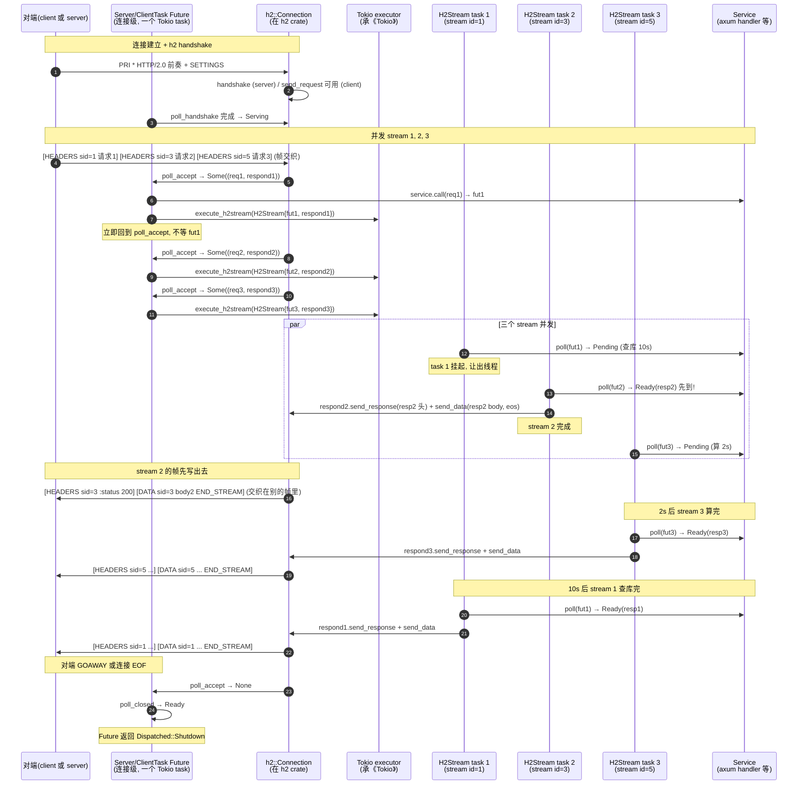

# 第 3 篇 · 第 9 章 · HTTP/2 帧与多路复用

> **核心问题**:第 2 篇我们钻透了 HTTP/1——一条 TCP 连接上,`Dispatcher` 的 `poll_loop` 一圈圈跑,但每条连接**同时只能处理一个请求-响应**(keep-alive 是"用完不关、下一轮再来",不是并发)。client 想并发发 100 个请求到同一个 host?那只能开 100 条 TCP 连接,各自握手、各自占 fd。这个限制是 HTTP/1 协议本身的死结(详见 P2-05 流水线为什么没救起来),hyper 在协议侧再怎么优化也绕不过去。HTTP/2 把这个结剪开了:同一条 TCP 连接上可以并发跑多个请求,每个请求是连接里一条独立的"流"(stream),靠帧(frame)头里一个 stream id 区分彼此。可 HTTP/2 的帧/流/HPACK/流控是个大工程——hyper 自己**不实现**,而是委托给 Rust 生态的 `h2` crate。这一章回答:为什么一条 HTTP/2 连接能并发跑多个请求?hyper 为什么不自己写 HTTP/2 而委托 h2(对照 gRPC 自己用 C 写了 chttp2)?hyper 又是怎么把 h2 这个外部库,缝进 Tokio 之上的连接循环、缝成 axum/reqwest 能用的 client/server?

> **读完本章你会明白**:
> 1. 为什么 HTTP/1 一条连接只能串行处理请求-响应、HTTP/2 一条连接能并发跑 N 个 stream——多路复用的本质不是"hyper 多开了什么",而是"协议给每个请求-响应编了个号,字节流按编号交织"。
> 2. hyper 为什么**不自己实现** HTTP/2 而委托 `h2` crate,以及这个取舍的代价和收益(对照 gRPC C++ core 自实现 chttp2 的哲学反差)。
> 3. hyper 在 `src/proto/h2/` 这一层做了什么——它不是协议机,是**适配层**:把 h2 的 `Connection`/`SendRequest`/`RecvStream`/`SendStream` 桥接成 hyper 的 `Request`/`Response`/`Body`,把 h2 的"一个连接"缝进 hyper 的"每连接一个 Tokio task"模型。
> 4. 为什么 HTTP/2 不需要 HTTP/1 那套 `poll_loop` 的"读-写-flush 三轮循环 + in_flight 单槽背压"——多 stream 各跑各的 Future,每 stream 独立 spawn,背压由 h2 的流控(window)兜底。
> 5. ALPN 协商(h2 over TLS)和 h2c(明文 HTTP/2)怎么让两端知道"该用 HTTP/2 了",以及 hyper 在 server 侧怎么把这些入口接进 `proto::h2::Server`。

> **如果一读觉得太难**:先抓三件事——① HTTP/2 把"一个请求-响应"叫一个 stream,一条 TCP 连接上可有上百个并发 stream,字节帧里带 stream id 区分(协议细节承《gRPC》第 2 篇);② hyper 不写 HTTP/2,委托 `h2` crate,自己只做一层适配,把 h2 的流接成 hyper 的 `Body`、把 h2 的连接循环包成一个 `Server`/`ClientTask` Future 跑在 Tokio task 上;③ HTTP/2 不用 HTTP/1 那套"in_flight 单槽 + poll_loop 三轮",而是"每个 stream 一个独立 Future,spawn 出去各跑各的",连接级只有一个接受新 stream 的循环。这三条钉住,后面 P3-10(请求映射成 stream 的细节)、P3-11(ping/流控)就有挂靠点。

---

## 〇、一句话点破

> **HTTP/2 多路复用不是 hyper 多干了什么,而是协议替 hyper 干了一件 HTTP/1 死活干不了的事——给同一个 TCP 连接上的每个请求-响应编个号(stream id),让它们的字节帧可以交织着收发。hyper 在这一层做的事不是"实现 HTTP/2 的帧/流/HPACK/流控",而是"把 Rust 生态里已经实现好这套的 `h2` crate,缝进 Tokio 之上的连接循环,并适配成 hyper 自己的 Request/Response/Body 抽象"。一行字:协议承 gRPC,适配在 hyper,运行时承 Tokio,hyper 在中间做的是"工程拼合"。**

这是结论。本章倒过来拆:先把 HTTP/1 为什么"一条连接一个请求"的死结讲清(承 P2-05),再看 HTTP/2 怎么用一个 stream id 把这个结剪开(协议一句带过指路《gRPC》);然后回答 hyper 的真问题——为什么委托 h2 而不自实现、对照 gRPC chttp2 是什么取舍;接着钻进 `src/proto/h2/` 看 hyper 到底缝了什么(`Server`/`ClientTask` Future、`H2Stream` per-stream spawn、`PipeToSendStream` body 桥、`Compat` IO 适配);再讲多 stream 并发为什么不需要 HTTP/1 的 in_flight 单槽背压;最后讲 ALPN/h2c 入口和 hyper 对 h2 的依赖边界。

> **承接《gRPC》(本章最重的承接)**:HTTP/2 的帧结构(9 字节帧头 + payload)、流的状态机(idle/open/half-closed/closed)、HPACK 头压缩(静态表 + 动态表 + 哈夫曼)、流控(WINDOW_UPDATE、connection-level 和 stream-level 两层 window)、SETTINGS 协商、PRI * HTTP/2.0 前奏、RST_STREAM、PING——这些协议机制在《gRPC》第 2 篇(chttp2)已经拆到字节级,本章**一句带过 + 指路**,不重讲。本章只回答"hyper 怎么把这些机制用 h2 跑起来、怎么接进 Tokio"。读到这里如果对 HTTP/2 协议本身陌生,强烈建议先翻《gRPC》第 2 篇补一下帧/流/HPACK/流控,再回来读本章——否则"为什么 stream id 奇偶""为什么 window 要分两层"这些问题会一直悬着。

> **承接《Tokio》**:本章每个 Future(`Server`、`ClientTask`、`H2Stream`、`PipeToSendStream`、`ConnTask`)都跑在 Tokio task 里;每个 `poll` 返回 `Pending` 都是 Tokio 的 reactor/mio 唤醒;每个 `spawn`/`execute` 都用 Tokio 的 executor——这些《Tokio》拆透的机制一句带过,篇幅留 hyper 独有。

---

## 一、HTTP/1 的死结:为什么一条连接只能串行

### 1.1 HTTP/1 的请求-响应是一次"独占"

第 2 篇拆 HTTP/1 时,我们反复强调一个事实(P2-05 第 2 节):hyper 的 HTTP/1 `Dispatcher` 用 `Server::poll_ready`(`dispatch.rs:626`)做了一个**硬约束**——`in_flight` 为空才 Ready,才去读下一个请求的头。一句话:**Service 还在处理上一个请求时,Dispatcher 根本不会去读下一个请求的字节**。

这个约束不是 hyper 偷懒,是 HTTP/1 协议本身逼出来的。HTTP/1 的字节流长这样:

```
GET /a HTTP/1.1\r\nHost: x\r\n\r\n        ← 请求 1 的字节
GET /b HTTP/1.1\r\nHost: x\r\n\r\n        ← 请求 2 的字节, 紧接着
```

这些字节**在 TCP 上是无边界的流**——TCP 不懂 HTTP,TCP 只懂"按顺序交付字节"。client 把请求 1 和请求 2 的字节连着发过来,server 在 TCP 层看到的就是一串连续字节。要分清"哪段是请求 1、哪段是请求 2",只能靠 HTTP/1 自己的边界规则(请求行 + 头 + 空行 `\r\n\r\n`,body 靠 Content-Length 或 chunked 标结束)。

问题来了:server 解析完请求 1、把请求 1 的响应写出去之前,**它没法把请求 2 的响应也写出去**。为什么?因为 HTTP/1 的响应字节流也是无编号的:

```
HTTP/1.1 200 OK\r\n...(响应 1 的头和体)\r\n\r\n
HTTP/1.1 200 OK\r\n...(响应 2 的头和体)\r\n\r\n
```

client 收到这串字节,怎么知道哪段是请求 1 的响应、哪段是请求 2 的响应?**只能靠顺序**——第一个响应是给最早那个未完成请求的,第二个响应是给下一个的。这就是 HTTP/1 的"请求-响应严格按序"(strict request-response ordering)。

> **钉死这件事**:HTTP/1 的"一条连接同时只能一个请求-响应",不是性能问题,是**协议不变量**。响应字节流没有编号,client 只能靠"响应按请求顺序到达"来配对。一旦 server 并发处理请求 1 和请求 2、谁先完成就先写谁的响应,client 就乱了——它会把请求 2 的响应当成请求 1 的。这就是为什么 HTTP/1 的流水线(pipelining)实际上几乎没人用:它要求 client 按序发、server 按序回,server 即使先算完请求 2 也得堵着等请求 1,得不偿失。

### 1.2 client 想并发?只能开多条连接

那么 client 想并发发 100 个请求到同一个 host,HTTP/1 怎么办?**只能开 100 条 TCP 连接**,每条连接上各跑一个请求-响应。浏览器一般对同一个 host 开 6 条连接(老资料常说的"6 个并发"),就是 HTTP/1 这个限制的妥协产物。

100 条连接的代价:

- **100 次 TCP 握手**(三次握手,高延迟链路每次 1 RTT 起步)。
- **100 次 TLS 握手**(如果是 HTTPS,每次还要几 RTT 的密钥协商,除非用 session resumption)。
- **100 个 fd**——server 端每条连接占一个 fd、一个 Tokio task、一份 read/write buffer。fd 上限是真实的(sysctl `ulimit -n`),task 内存也是真实的(每个 task 几 KB 起)。
- **100 次 TCP 拥塞控制冷启动**——每条新连接的 cwnd 都从初始值(几个 MSS)开始爬,慢启动阶段吞吐低。100 条连接都冷启动,比一条已经爬热了的连接差得多。

> **不这样会怎样**:HTTP/1.1 的 keep-alive(P2-05)缓解了一部分——一条连接可以串行跑多个请求,省后续握手。但它**没解决并发**:同一条 keep-alive 连接上,请求 2 还是得等请求 1 的响应写完才能发。所以 keep-alive 是"复用"换"省握手",不是"并发"换"省连接数"。要真并发,还是得开多条连接。

这个死结,在 HTTP/1 的协议框架里**无解**。要解开,得改协议——给响应字节流编号,让 client 知道"这个响应对应哪个请求"。这就是 HTTP/2 的 stream。

### 1.3 HTTP/2 的剪法:给每个请求-响应编个号

HTTP/2 的核心创新,一句话:**把"一个请求-响应"叫一个 stream,每个 stream 有一个唯一的 stream id,这条 TCP 连接上所有 stream 的字节帧都带着自己的 stream id 交织传输**。

```
┌─────────────── 一条 TCP 连接 (HTTP/2) ───────────────┐
│                                                        │
│  [HEADERS, sid=1, "GET /a"]  ← stream 1 (请求 1) 开启  │
│  [HEADERS, sid=3, "GET /b"]  ← stream 3 (请求 2) 开启  │
│  [HEADERS, sid=1, ":status 200"] ← stream 1 响应头     │
│  [DATA,     sid=5, "POST /c body"] ← stream 3 同时发请求│
│  [DATA,     sid=1, "响应 1 的 body 片段"]               │
│  [HEADERS, sid=3, ":status 200"] ← stream 3 响应头     │
│  [DATA,     sid=1, "响应 1 的 body 结束, END_STREAM"]   │
│  [DATA,     sid=3, "响应 3 的 body"]                    │
│   ...                                                   │
└────────────────────────────────────────────────────────┘
```

注意几个关键点(协议细节承《gRPC》第 2 篇,这里只点出"为什么这么设计"):

- **stream id 唯一标识一个请求-响应**。client 开的 stream 用奇数 id(1, 3, 5, ...),server 开的(push)用偶数 id(2, 4, 6, ...)。server 接受的请求 stream id 都是奇数。
- **帧(frame)是 HTTP/2 的最小传输单位**,每个帧有一个 9 字节的帧头(承《gRPC》P2),帧头里就有 stream id。HEADERS 帧(请求行/状态行 + 头,经 HPACK 压缩)、DATA 帧(body 片段)、RST_STREAM 帧(重置一个 stream)、PING 帧(连接级保活)、SETTINGS 帧(协议参数协商)、WINDOW_UPDATE 帧(流控)等,十来种帧类型,每种带 stream id(连接级的如 PING/SETTINGS stream id 为 0)。
- **同一个 stream 的帧按序到达**(TCP 保证),**不同 stream 的帧可以任意交织**。client 收到 `[DATA, sid=1]` 知道这是请求 1 的响应 body,收到 `[HEADERS, sid=3]` 知道这是请求 2 的响应头——不会乱。

> **钉死这件事**:HTTP/2 多路复用的本质,是**用 stream id 把"无编号的请求-响应字节流"变成"有编号的、可交织的多个独立 stream"**。这一改,server 可以并发处理 stream 1 和 stream 3、谁先完成就先写谁的帧,client 靠 stream id 对号入座,绝不会乱。一条连接就能并发跑上百个请求(默认 max_concurrent_streams 限制),握手/TLS/拥塞控制冷启动的开销分摊到所有请求上。

> **对照《gRPC》第 2 篇**:HTTP/2 的帧格式(9 字节帧头:length 24 位 + type 8 位 + flags 8 位 + stream id 31 位)、流的 7 个状态(idle/open/half-closed (local/remote)/closed/reserved)、HPACK 的静态表(61 项)+ 动态表 + 哈夫曼编码、连接级和 stream 级两层流控的 WINDOW_UPDATE 机制——这些协议级细节,《gRPC》用 chttp2 的 C 代码拆到字节了。本章不再重讲,只看 hyper 怎么用 h2 把这套跑起来。如果对 stream 状态机、HPACK 编码、WINDOW_UPDATE 的具体语义不熟,强烈建议先翻《gRPC》第 2 篇 P2-05~P2-09 几章,再回来。

---

## 二、为什么 hyper 委托 h2 而不自实现

HTTP/2 的帧/流/HPACK/流控是个大工程——这是事实。问题是:hyper 自己写不写?答案是**不写,委托 `h2` crate**。这一节拆这个取舍的动机。

### 2.1 自实现 HTTP/2 的代价

要自实现 HTTP/2,hyper 得自己啃下这些:

- **HPACK**——静态表(61 项预定义头)+ 动态表(运行时学习)+ 哈夫曼编码,光是这个头压缩算法就有 RFC 7541 整整一篇。实现错了,要么头解不开,要么被恶意 peer 用"哈夫曼炸弹"撑爆 CPU。
- **帧的解析与生成**——十来种帧类型,每种帧头的 flag 位、payload 格式都不一样。比如 DATA 帧有 PADDED 和 END_STREAM 两个 flag,HEADERS 帧有 END_STREAM/END_HEADERS/PADDED/PRIORITY 四个 flag。
- **stream 状态机**——每个 stream 走 idle → open → half-closed → closed 七态迁移,得守住"不能在 closed stream 上发帧""不能给奇数 stream 发 push"等一堆协议不变量。
- **流控**——连接级和 stream 级两层 sliding window,每收/发 DATA 帧都要扣 window、window 满了要阻塞或缓冲、对端发 WINDOW_UPDATE 才能继续。这是为了防"快发端淹慢收端",实现错了要么死锁要么内存爆。
- **SETTINGS 协商**——连接刚建立双方互发 SETTINGS,告诉对方"我接受多大的 frame、最多多少并发 stream、初始 window 多大",得等对方 ACK。
- **PRI * HTTP/2.0 前奏**——明文 HTTP/2(h2c)的 client 得先发一串魔法字节 `PRI * HTTP/2.0\r\n\r\nSM\r\n\r\n`,server 据此切换协议。
- **GOAWAY、RST_STREAM、PING、PRIORITY**(PRIORITY 在 RFC 9113 已弃用,但得兼容)、**CONNECT 扩展**(connect-udp 等)……

> **不这样会怎样**:如果 hyper 自己实现这套,源码体积至少翻倍(HPACK 一项就够写一章),而且容易出协议正确性 bug——HPACK 的边界、stream 状态机的非法迁移、流控的死锁,每一个都是潜在 CVE。Rust 生态已经有 `h2` crate 专精这件事,hyper 重造一遍没有额外价值,反而分散精力。

### 2.2 h2 crate:Rust 生态的分工

`h2` 是 Rust 生态里专门实现 HTTP/2 的 crate(hyperium 自己出的姊妹库,和 hyper 同一个组织)。它在 `Cargo.toml` 里是 optional 依赖(`h2 = { version = "0.4.14", optional = true }`,`hyper/Cargo.toml:34`),只在开 `http2` feature 时拉进来:

```toml
# hyper/Cargo.toml:34
h2 = { version = "0.4.14", optional = true }
# hyper/Cargo.toml:85
http2 = ["dep:atomic-waker", "dep:futures-channel", "dep:futures-core", "dep:h2"]
```

`h2` 提供"连接级"的 HTTP/2 抽象——一个 `Connection` future(驱动整个连接的帧收发循环)、一个 `SendRequest`(client 侧,用来发请求开 stream)、一对 `SendStream`/`RecvStream`(每条 stream 的发送/接收端)。hyper 在 `src/proto/h2/` 下做的事,是**把这些 h2 的连接级抽象,适配成 hyper 自己的 `Request`/`Response`/`Body`/连接循环抽象**。

> **钉死这件事**:这是一个典型的 **Rust 生态分工**——h2 专精 HTTP/2 协议(帧/流/HPACK/流控),hyper 专精"把协议机组织成可用的 client/server"(Service/连接池/body/与 Tokio 的拼合)。两个 crate 各管一段,接口是 h2 的连接级 API(`Connection`/`SendRequest`/`SendStream`/`RecvStream`)。hyper 的源码里**没有一行**在解析 HPACK 或生成 DATA 帧的字节——这些全在 h2 里。读 `src/proto/h2/`,看到的是"怎么调 h2 的 API、怎么把 h2 的 Future 缝进 hyper 的 Future 树"。

### 2.3 对照:gRPC chttp2——另一种哲学

hyper 委托 h2,不是唯一的路。《gRPC》那本拆的是另一条路——**gRPC 自己用 C 写了 HTTP/2,叫 chttp2**。这是两种截然不同的工程哲学,值得对照。

**gRPC 自实现 chttp2 的动机**:

- **跨语言可移植**。gRPC 要在 Python、PHP、Ruby、Go、Java、Node、C# 等十几种语言里都能用,每个语言的 grpcio 客户端都包同一份 C++ core。如果 gRPC 依赖"各语言自己的 HTTP/2 库",那 Python 的 http2 库 buggy 一改 gRPC 就跟着挂,质量不可控。**自带协议栈,是 gRPC 保证跨语言行为一致的唯一办法**。
- **协议层讲得透**。gRPC 想在协议层做深度优化(比如 BDP 估算、自定义流控策略、HTTP/2 之上的 cleartext 优化),自己写就有完全的控制权。
- **历史包袱**。gRPC 2015 年起步时,各语言的 HTTP/2 库都不成熟(C/Rust 都还没有生产级的 h2),只能自己写。

**hyper 委托 h2 的动机**:

- **Rust 生态分工细**。Rust 的 crate 生态强调"小而精、组合用",h2 专精 HTTP/2、hyper 专精"把协议机组织成 Web 框架地基"、tokio 专精运行时——三个 crate 各管一段,接口清晰。重造 h2 没有额外价值。
- **hyper 只服务 Rust**。hyper 不需要跨语言,它就是 Rust 的 HTTP 库,没必要自带协议栈。
- **代码精简**。hyper 自己实现 HTTP/1(因为 HTTP/1 简单),HTTP/2 委托 h2,核心源码几万行就能撑起 axum/reqwest/tonic/Pingora。如果再自实现 HTTP/2,源码体积和维护成本都会显著上升。

> **对照**:这不是谁对谁错,是**生态取舍**。gRPC 走"自带协议栈换跨语言可移植"(C++ core 被各语言包),hyper 走"生态分工换各自精专"(h2+hyper 各管一段)。读到这里,你能看到同一个协议(HTTP/2)在不同语言的生态里,落地方式截然不同——这正是真实工程的美感。本书第 3 篇对照《gRPC》第 2 篇读,你会同时深化两本。

### 2.4 hyper 对 h2 的依赖边界(诚实讲清)

既然 hyper 委托 h2,那 hyper 和 h2 的**边界**在哪?这个问题读源码时特别重要,否则容易把 h2 的东西误当 hyper 的。钉死以下几点:

- **帧的解析与生成在 h2**。`h2::RecvStream::poll_data`、`h2::SendStream::send_data`、`h2::server::Connection::poll_accept`、`h2::client::SendRequest::send_request`——这些是 h2 的 API。hyper 调它们,不实现它们。本章引用这些 API,一律标"在 h2 crate,引用其用法,不编 h2 行号"。
- **stream 状态机在 h2**。`h2::SendStream` 是发送端,`h2::RecvStream` 是接收端,stream 的 idle/open/closed 迁移由 h2 管。hyper 拿到的就是一个"已经 ready 的 stream"。
- **流控在 h2**。WINDOW_UPDATE、连接级和 stream 级 window 的扣减与恢复,全在 h2。hyper 通过 `SendStream::reserve_capacity`/`poll_capacity`/`RecvStream::flow_control().release_capacity` 这些 h2 API 间接驱动流控(P3-11 详拆)。
- **HPACK 在 h2**。头压缩和解压完全黑盒,hyper 拿到的就是 `http::HeaderMap`。
- **hyper 自己做的**:① 连接级 Future 的壳(`Server`/`ClientTask`,把 h2 的 `Connection` 包成一个 hyper 风格的 Future);② per-stream 的 spawn(`H2Stream`,每接受一个 stream 就 spawn 一个 Future 处理它);③ body 的双向桥(`PipeToSendStream` 把 hyper 的 `Body` 流推到 h2 的 `SendStream`,把 h2 的 `RecvStream` 包成 hyper 的 `Incoming` body);④ 头清理(`strip_connection_headers`,把 HTTP/2 不允许的 Connection 系列头剥掉);⑤ ping/keepalive 的策略层(`proto/h2/ping.rs`,P3-11 拆);⑥ IO 适配(`Compat`,把 hyper 的 `rt::Read`/`rt::Write` 适配成 tokio 的 `AsyncRead`/`AsyncWrite`,因为 h2 要 tokio IO);⑦ ALPN/h2c 入口(怎么知道用 HTTP/2,把连接交给 `proto::h2::Server`/`ClientTask`)。

下面这张 ASCII 图把这条边界摆出来——hyper 在中间,h2 在右边,Tokio 在底下:

```
            ┌─────────── 业务层(axum handler / reqwest) ───────────┐
            │                                                         │
            │              hyper Service trait (P1-02)                │
            │              hyper Body / Frame (P1-04)                 │
            └────────────────────────┬────────────────────────────────┘
                                     │ Request<Body> / Response<Body>
            ┌────────────────────────▼────────────────────────────────┐
            │     hyper 框架侧:  client 连接池 / server accept         │
            │     (P4 / P5)                                            │
            └────────────────────────┬────────────────────────────────┘
                                     │ 把"这条连接是 HTTP/2"分流进来
            ┌────────────────────────▼────────────────────────────────┐
            │  ★ hyper proto/h2 适配层 (本章 + P3-10/P3-11)  ★         │
            │  ┌──────────────────────────────────────────────────┐   │
            │  │ Server/ClientTask Future (连接级壳)               │   │
            │  │ H2Stream (per-stream spawn)                       │   │
            │  │ PipeToSendStream (Body → h2 SendStream)           │   │
            │  │ Incoming::h2 (h2 RecvStream → hyper Body)         │   │
            │  │ strip_connection_headers / ping 策略              │   │
            │  │ Compat (hyper rt IO → tokio AsyncRead/Write)      │   │
            │  └───────────────────────┬──────────────────────────┘   │
            └──────────────────────────┼──────────────────────────────┘
                                       │ h2 连接级 API
                                       │ SendRequest / SendStream / RecvStream
                                       │ Connection::poll_accept / poll_closed
            ┌──────────────────────────▼──────────────────────────────┐
            │  h2 crate (外部, 不在 hyper 仓)                          │
            │  帧解析/生成 / stream 状态机 / HPACK / 流控 / SETTINGS   │
            │  handshake (server/client)                              │
            └──────────────────────────┬──────────────────────────────┘
                                       │ tokio::io::AsyncRead / AsyncWrite
            ┌──────────────────────────▼──────────────────────────────┐
            │  Tokio (reactor mio + scheduler + timer)  承《Tokio》    │
            │  TcpStream / TLS (rustls/native-tls) / 阻塞唤醒          │
            └─────────────────────────────────────────────────────────┘
```

> **钉死这张图**:这是本章的"地图"。`proto/h2` 这一层在中间,左边接 hyper 的框架(Service/Body/连接池),右边接 h2(协议),底下接 Tokio(IO/运行时)。读本章时,每讲一个机制,先问"这是 hyper 做的、还是 h2 做的、还是 Tokio 做的",边界就清了。后续 P3-10(请求映射)、P3-11(ping/流控)都在这张图里。

---

## 三、proto/h2 的连接级壳:Server 与 ClientTask

知道了边界,钻进 hyper 自己写的部分。入口有两个——server 侧的 `proto::h2::Server`、client 侧的 `proto::h2::client::ClientTask`。它们都是 Future,被 spawn 到 Tokio task 里跑。

### 3.1 Server:一个 HTTP/2 连接的 Future

server 侧,`accept` 到一条 TCP 连接、知道它是 HTTP/2(怎么知道下一节讲),就把 IO 和 Service 交给 `proto::h2::Server::new`,后者返回一个 `Server` 结构(`src/proto/h2/server.rs:83`),它本身是个 Future:

```rust
// hyper/src/proto/h2/server.rs:82-95 (摘录)
pin_project! {
    pub(crate) struct Server<T, S, B, E>
    where
        S: HttpService<IncomingBody>,
        B: Body,
    {
        exec: E,
        timer: Time,
        service: S,
        state: State<T, B>,
        date_header: bool,
        close_pending: bool
    }
}
```

注意泛型:`T: Read + Write`(底层 IO,是 hyper 自己的 `rt::Read`/`rt::Write` trait,不是 tokio 的,后面讲 Compat 怎么转),`S: HttpService<IncomingBody>`(承 P1-02 Service trait,`HttpService` 是 hyper 内部对"Service<Request<IncomingBody>, Response=Response<B>>"的便利别名),`B: Body`(响应 body 类型),`E: Http2ServerConnExec`(执行器,用来 spawn per-stream Future)。

`state` 是这条连接的协议进度,两态(`server.rs:99`):

```rust
// hyper/src/proto/h2/server.rs:99-108
enum State<T, B>
where
    B: Body,
{
    Handshaking {
        ping_config: ping::Config,
        hs: Handshake<Compat<T>, SendBuf<B::Data>>,
    },
    Serving(Serving<T, B>),
}
```

- `Handshaking`:刚建好 `Server`,正在跑 h2 的 server handshake(h2 crate 的 `h2::server::Handshake` future)。HTTP/2 连接刚建立,双方要先读 PRI 前奏、交换 SETTINGS,handshake 完了才能收发请求帧。`Handshake<Compat<T>, SendBuf<B::Data>>` 是 h2 提供的 future,`Compat<T>` 是 hyper 把自己的 IO 适配成 tokio IO(下面 3.4 详讲)。
- `Serving`:handshake 完成,拿到 h2 的 `Connection`,进入正式服务循环。

`Serving`(`server.rs:110`)持有:

```rust
// hyper/src/proto/h2/server.rs:110-118
struct Serving<T, B>
where
    B: Body,
{
    ping: Option<(ping::Recorder, ping::Ponger)>,
    conn: Connection<Compat<T>, SendBuf<B::Data>>,
    closing: Option<crate::Error>,
    date_header: bool,
}
```

`conn: Connection<Compat<T>, SendBuf<B::Data>>` 是 **h2 crate 的 `h2::server::Connection`**——这就是"一个 HTTP/2 连接"在 h2 里的化身,它自己是个 Future,驱动整个连接的帧收发(读 socket、解帧、分发到对应 stream、写 socket)。`ping` 是 hyper 自己的 ping 策略层(P3-11 拆),`closing` 是 graceful shutdown 的标志。

> **钉死这件事**:`Server` 这个 Future 的状态机就两态——Handshaking → Serving,前者跑 h2 的 handshake,后者跑接受新 stream 的循环。**真正的 HTTP/2 协议循环(帧的收发、stream 状态机)在 h2 的 `Connection` 里,不在 hyper**。hyper 的 `Server` Future 只做"驱动 handshake + 驱动 accept 循环 + spawn per-stream"。

### 3.2 Server::poll:从 handshake 到 accept 循环

`Server` 实现 `Future`,`Output = crate::Result<Dispatched>`(`server.rs:200`)。`poll` 干两件事(`server.rs:210`):

```rust
// hyper/src/proto/h2/server.rs:210-244 (摘录, 简化)
fn poll(mut self: Pin<&mut Self>, cx: &mut Context<'_>) -> Poll<Self::Output> {
    let me = &mut *self;
    loop {
        let next = match me.state {
            State::Handshaking { ref mut hs, ref ping_config } => {
                // 1. 跑 h2 handshake
                let mut conn = ready!(Pin::new(hs).poll(cx).map_err(crate::Error::new_h2))?;
                let ping = if ping_config.is_enabled() {
                    let pp = conn.ping_pong().expect("conn.ping_pong");
                    Some(ping::channel(pp, ping_config.clone(), me.timer.clone()))
                } else { None };
                State::Serving(Serving { ping, conn, closing: None, date_header: me.date_header })
            }
            State::Serving(ref mut srv) => {
                // 2. handshake 完了, 进入 accept 循环
                if me.close_pending && srv.closing.is_none() {
                    srv.conn.graceful_shutdown();   // graceful_shutdown 在 handshake 前被调用
                }
                ready!(srv.poll_server(cx, &mut me.service, &mut me.exec))?;
                return Poll::Ready(Ok(Dispatched::Shutdown));
            }
        };
        me.state = next;
    }
}
```

这里有一个细节值得点出:**`State::Handshaking` 到 `State::Serving` 的迁移是 h2 handshake 完成时**。h2 handshake 是异步的——它要先读对端的 PRI 前奏、发自己的 SETTINGS、等对端 ACK,这一串在 h2 的 `Handshake` future 里。hyper 用 `ready!(Pin::new(hs).poll(cx))` 等它完成(承 Tokio Future/Poll),没完成就 `Pending`,Tokio 把这个 `Server` task 挂起,等 h2 的 reactor 唤醒。

handshake 完成后,如果开了 ping(P3-11),从 `conn.ping_pong()` 拿到 h2 的 ping-pong 通道,用 hyper 自己的 `ping::channel` 包一层策略(BDP 估算、keepalive)。然后进 `State::Serving`。

> **承接《Tokio》**:这段 `ready!` + `Pending` 就是《Tokio》讲透的 Future/Poll/Waker 模型。hyper 的贡献是把 h2 的 handshake Future 包进自己的 `Server` Future,让"等 h2 handshake"这个"等"天然变成 task 的挂起,不阻塞 worker 线程。如果是同步实现,handshake 期间这个线程就卡住了。

### 3.3 poll_server:接受新 stream 的循环

进 `Serving` 后,核心是 `Serving::poll_server`(`server.rs:251`)。这是 server 侧 HTTP/2 的"主循环",但和 HTTP/1 的 `poll_loop`(`dispatch.rs:166`)长得**完全不一样**——它不是"读-写-flush 三轮循环",而是"接受新 stream 的循环":

```rust
// hyper/src/proto/h2/server.rs:262-335 (摘录, 简化)
fn poll_server<S, E>(&mut self, cx, service: &mut S, exec: &mut E) -> Poll<crate::Result<()>>
where
    S: HttpService<IncomingBody, ResBody = B>,
    E: Http2ServerConnExec<S::Future, B>,
{
    if self.closing.is_none() {
        loop {
            self.poll_ping(cx);    // 驱动 ping 策略 (P3-11)

            match ready!(self.conn.poll_accept(cx)) {       // ★ h2 的 accept
                Some(Ok((req, mut respond))) => {
                    trace!("incoming request");
                    let content_length = headers::content_length_parse_all(req.headers());
                    let ping = self.ping.as_ref().map(|p| p.0.clone()).unwrap_or_else(ping::disabled);
                    ping.record_non_data();

                    let is_connect = req.method() == Method::CONNECT;
                    let (mut parts, stream) = req.into_parts();
                    // ... 把 h2 的 (Request<RecvStream>, SendResponse) 拼成 hyper 的 Request<IncomingBody>
                    let (mut req, connect_parts) = if !is_connect {
                        (
                            Request::from_parts(parts, IncomingBody::h2(stream, content_length.into(), ping)),
                            None,
                        )
                    } else {
                        // CONNECT 特殊处理 (升级, P3-10 / P2-07)
                        // ...
                    };

                    let fut = H2Stream::new(
                        service.call(req),     // ★ Service.call, 拿到一个 Future
                        connect_parts,
                        respond,                // h2 的 SendResponse
                        self.date_header,
                        exec.clone(),
                    );
                    exec.execute_h2stream(fut);   // ★ spawn 出去, 独立跑
                }
                Some(Err(e)) => return Poll::Ready(Err(crate::Error::new_h2(e))),
                None => {
                    // 对端发 GOAWAY 或者连接结束, 没有更多 stream 了
                    if let Some((ref ping, _)) = self.ping {
                        ping.ensure_not_timed_out()?;
                    }
                    return Poll::Ready(Ok(()));
                }
            }
        }
    }
    // closing 中, 等 conn.poll_closed
    ready!(self.conn.poll_closed(cx).map_err(crate::Error::new_h2))?;
    Poll::Ready(Err(self.closing.take().expect("polled after error")))
}
```

这一段是 server HTTP/2 的招牌。把它和 HTTP/1 的 `poll_loop` 对照,差异立刻显形:

- **HTTP/1 的 `poll_loop`**:一圈圈转,每圈干"读一点、写一点、flush 一点",`for _ in 0..16` 防饿死,`in_flight` 单槽做背压(同时只能一个请求)。这是协议逼的——HTTP/1 一条连接一个请求,所有读写都在一个循环里。
- **HTTP/2 的 `poll_server`**:只是个"接受新 stream"的循环。`self.conn.poll_accept(cx)` 是 **h2 的 API**——它返回"下一个准备好处理的 stream"(h2 内部已经把帧分发到对应 stream 了),返回的是 `(h2::Request<RecvStream>, SendResponse)` 一对。hyper 拿到这一对,把它拼成 hyper 自己的 `Request<IncomingBody>`(把 h2 的 `RecvStream` 包成 `IncomingBody::h2`,见 3.5),然后 `service.call(req)` 拿到响应 Future,再包成一个 `H2Stream` Future,**`exec.execute_h2stream(fut)` spawn 出去**。

> **钉死这件事**:HTTP/2 的 server 主循环**不直接处理请求**。它只做两件事:① 从 h2 接受新 stream;② 每个 stream spawn 一个 `H2Stream` Future 独立处理。真正的请求-响应生命周期在 `H2Stream` 里(下一节拆),不在 `poll_server` 里。`poll_server` 自己只关心"还有没有新 stream 来"。

这里 `exec.execute_h2stream(fut)` 是关键——它把 per-stream 的处理 Future spawn 到运行时。`exec` 是 `E: Http2ServerConnExec`,本质是 `tokio::runtime::Handle`(或用户提供的 executor),承《Tokio》的 spawn 机制。这就是为什么 HTTP/2 一条连接上**几百个 stream 可以并发**——每个 stream 是独立的 Tokio task,在 Tokio scheduler 上和别的 task 一起被 M:N 调度。

> **承接《Tokio》**:`exec.execute_h2stream(fut)` 等价于 `tokio::spawn(fut)`。Tokio 的 scheduler(work-stealing)会让几百个 stream task 共享几个 worker 线程,哪个 stream 的 Service Ready 了就 poll 哪个,哪个在等 IO 就 `Pending` 让出。这是 HTTP/2 多路复用在 hyper 里的工程落地——**并发不是"一个 task 多线程",是"一个连接多个 task,共享线程池"**。

### 3.4 Compat:为什么 hyper 要把 IO 适配给 h2

注意 `Server::new`(`server.rs:155`)这行:`let handshake = builder.handshake(Compat::new(io));`。`Compat::new(io)` 把 hyper 自己的 `T: Read + Write`(hyper 在 `rt/` 里定义的 IO trait)适配成 tokio 的 `AsyncRead + AsyncWrite`。为什么?

因为 **h2 crate 要求 IO 实现 `tokio::io::AsyncRead + AsyncWrite`**(h2 是紧贴 tokio 写的)。但 hyper 1.0 为了"不绑死 tokio"(可以接别的运行时,虽然实践上 99% 用 tokio),定义了自己的 `rt::Read`/`rt::Write` trait(`src/rt/mod.rs`)。hyper 的 server 接受的 `T: Read + Write` 是 hyper trait,得转成 tokio trait 才能交给 h2。

`Compat`(`src/common/io/compat.rs:8`)就是这层适配:

```rust
// hyper/src/common/io/compat.rs:7-20 (摘录)
/// This adapts from `hyper` IO traits to the ones in Tokio.
///
/// This is currently used by `h2`, and by hyper internal unit tests.
#[derive(Debug)]
pub(crate) struct Compat<T>(pub(crate) T);

impl<T> tokio::io::AsyncRead for Compat<T>
where
    T: crate::rt::Read,
{
    fn poll_read(...) { /* 把 tokio ReadBuf 转成 hyper ReadBufCursor, 调 hyper 的 poll_read */ }
}

impl<T> tokio::io::AsyncWrite for Compat<T>
where
    T: crate::rt::Write,
{
    fn poll_write(...) { crate::rt::Write::poll_write(self.p(), cx, buf) }
    // ...
}
```

`Compat<T>` 实现 tokio 的 `AsyncRead`/`AsyncWrite`,内部转发给 `T` 的 hyper `Read`/`Write`。这样 h2 拿到的 `Compat<T>` 看起来就是个 tokio IO,可以无缝用。

> **不这样会怎样**:如果 hyper 不做这层适配,h2 就得直接接受 hyper 的 `rt::Read`/`rt::Write`,但 h2 不依赖 hyper(反而是 hyper 依赖 h2),它只认 tokio IO。所以**适配只能在 hyper 这边做**。这是"被依赖者(h2)给依赖者(hyper)定接口"的典型场景——hyper 想用 h2,就得按 h2 的接口(要求 tokio IO)说话。`Compat` 就是这个"翻译官"。

> **钉死这件事**:这个 `Compat` 是 hyper 1.0"运行时中立"设计的代价。hyper 想让自己不焊死在 tokio 上(理论上可以接别的运行时,或被嵌入到不用 tokio 的环境),所以定义了自己的 `rt::Read`/`rt::Write`。但 h2 是紧贴 tokio 的,hyper 只能在边界上做一层 Compat 适配。实践中这层适配开销极小(就是 trait 方法的转发,零成本抽象),但它存在,是 hyper 工程上的一个真实取舍。

### 3.5 Incoming::h2:把 h2 的 RecvStream 包成 hyper Body

server 接受一个 stream 时,拿到 h2 的 `req: h2::Request<RecvStream>` 和 `respond: SendResponse`。`req.into_parts()` 拆成 `Parts` 和 `RecvStream`。hyper 把这个 `RecvStream` 包成自己的 `Incoming` body(`src/body/incoming.rs:154`):

```rust
// hyper/src/body/incoming.rs:153-171 (摘录)
#[cfg(all(feature = "http2", any(feature = "client", feature = "server")))]
pub(crate) fn h2(
    recv: h2::RecvStream,
    mut content_length: DecodedLength,
    ping: ping::Recorder,
) -> Self {
    // If the stream is already EOS, then the "unknown length" is clearly
    // actually ZERO.
    if !content_length.is_exact() && recv.is_end_stream() {
        content_length = DecodedLength::ZERO;
    }

    Incoming::new(Kind::H2 {
        data_done: false,
        ping,
        content_length,
        recv,
    })
}
```

`Kind::H2` 持有 `recv: h2::RecvStream`(请求 body 的接收端,在 h2 crate)、`content_length`(从 Content-Length 头解出来的,可未知)、`ping`(hyper 的 ping recorder,记 body 字节用于 BDP,见 P3-11)、`data_done`(是否数据已读完,准备读 trailers)。

这个 `Incoming` body 实现 hyper 的 `Body` trait,`poll_frame`(`incoming.rs:193`)的 H2 分支(`incoming.rs:236`)长这样:

```rust
// hyper/src/body/incoming.rs:235-284 (摘录, 简化)
Kind::H2 { ref mut data_done, ref ping, recv: ref mut h2, content_length: ref mut len } => {
    if !*data_done {
        match ready!(h2.poll_data(cx)) {                    // ★ h2 的 poll_data
            Some(Ok(bytes)) => {
                let _ = h2.flow_control().release_capacity(bytes.len());  // ★ 流控: 告诉 h2 "我读过了"
                len.sub_if(bytes.len() as u64);
                ping.record_data(bytes.len());              // BDP 估算用
                return Poll::Ready(Some(Ok(Frame::data(bytes))));
            }
            Some(Err(e)) => {
                if let Some(h2::Reason::NO_ERROR) = e.reason() {
                    return Poll::Ready(None);   // RST_STREAM NO_ERROR 当正常结束
                } else {
                    return Poll::Ready(Some(Err(crate::Error::new_body(e))));
                }
            }
            None => { *data_done = true; /* fall through 到 trailers */ }
        }
    }
    match ready!(h2.poll_trailers(cx)) { /* trailers */ }
}
```

这里几个点:

- `h2.poll_data(cx)` 是 h2 的 API(在 h2 crate),返回下一帧 body 数据。hyper 调它,不实现它。
- `h2.flow_control().release_capacity(bytes.len())` 是关键——**流控**。h2 的 stream 级 window 会被 `poll_data` 消费(每读 N 字节,window 减 N),`release_capacity` 告诉 h2"我已经处理完这 N 字节了,可以发 WINDOW_UPDATE 给对端补 window"。如果不 release,window 会一直减,减到 0 对端就发不出更多 body——这是流控的反压机制(承《gRPC》第 2 篇 P2-09 流控)。hyper 把 release 的时机交给上层 Service(读 body 时自动 release),让"读多快"由用户代码决定。
- `h2::Reason::NO_ERROR` 的 RST_STREAM 当正常 EOF——这是协议上"早响应"(server 先发了响应就 RST_STREAM 终止请求 body)的处理。
- `data_done` 标志确保"先读完所有 data,再读 trailers"——HTTP/2 的 trailers 在 DATA 帧之后单独的 HEADERS 帧里。

> **钉死这件事**:hyper 把 h2 的 `RecvStream` 包成 `Incoming` body,做的事情就三件:① 调 h2 的 `poll_data`/`poll_trailers` 拿数据;② 调 h2 的 `release_capacity` 驱动流控;③ 把 h2 的 error 翻译成 hyper 的 `crate::Error`。**body 的字节级读取、帧的拆分、stream 级流控的 window 维护,全在 h2**。hyper 的 `Incoming` 只是个"适配器",让 h2 的流式 API 看起来像 hyper 的 `Body` trait,这样上层 Service 拿到的就是统一的 `Request<IncomingBody>`,不区分 HTTP/1 还是 HTTP/2。

### 3.6 ClientTask:client 侧的连接 Future

client 侧的对应物是 `proto::h2::client::ClientTask`(`src/proto/h2/client.rs:425`)。client 侧和 server 侧的对称性值得看清:

- **server 侧**:`conn.poll_accept(cx)` 接受**对端发来的** stream(对端是 client,发请求)。每个 stream 一个 `H2Stream` Future,处理完写响应。
- **client 侧**:连接不"接受"stream,而是**主动开 stream 发请求**。`ClientTask` 持有 `h2_tx: SendRequest<SendBuf<B::Data>>`(`client.rs:434`),这是 h2 的 client API——`h2_tx.send_request(req, end_stream)` 开一个新 stream 发请求,返回 `(ResponseFuture, SendStream)`。client 把上层(连接池)通过 channel 发来的 `Request<B>`,用 `h2_tx.send_request` 发出去。

`ClientTask::poll`(`client.rs:678`)的主循环:

```rust
// hyper/src/proto/h2/client.rs:678-795 (摘录, 简化)
fn poll(mut self: Pin<&mut Self>, cx: &mut Context<'_>) -> Poll<Self::Output> {
    loop {
        // 1. h2 的 SendRequest ready 了吗? (开新 stream 的能力)
        match ready!(self.h2_tx.poll_ready(cx)) {
            Ok(()) => (),
            Err(err) => { /* 连接出错或 graceful shutdown */ }
        }

        // 2. 有上个循环没发完的请求吗? (pending_open)
        if let Some(f) = self.fut_ctx.take() {
            self.poll_pipe(f, cx);
            continue;
        }

        // 3. 从 channel 收用户(连接池)发来的新请求
        match self.req_rx.poll_recv(cx) {
            Poll::Ready(Some((req, cb))) => {
                // ... 清理 HTTP/2 不允许的头, 设 Content-Length
                let (fut, body_tx) = self.h2_tx.send_request(req, !is_connect && eos)?;  // ★ h2 send_request
                let f = FutCtx { is_connect, eos, fut, body_tx, body, cb };
                // 检查 send_request 后是否还能开新 stream
                match self.h2_tx.poll_ready(cx) {
                    Poll::Pending => { self.fut_ctx = Some(f); return Poll::Pending; }  // pending_open, 等下次
                    Poll::Ready(Ok(())) => (),
                    // ...
                }
                self.poll_pipe(f, cx);
                continue;
            }
            Poll::Ready(None) => return Poll::Ready(Ok(Dispatched::Shutdown)),  // channel 关了
            Poll::Pending => match ready!(Pin::new(&mut self.conn_eof).poll(cx)) { /* 连接 task 结束 */ },
        }
    }
}
```

几个关键点:

- `self.h2_tx.poll_ready(cx)` 是 **h2 的 API**——它返回"现在能不能开新 stream"(max_concurrent_streams 没满、连接没出错)。这是 client 侧的"流控背压"——hyper 用它实现"开不了新 stream 就别从 channel 拉请求"。
- `self.req_rx.poll_recv(cx)` 收的是 channel——`req_rx: ClientRx<B>`(`client.rs:35`),定义是 `crate::client::dispatch::Receiver<Request<B>, Response<IncomingBody>>`。这个 channel 是 client 连接池和这条连接之间的桥梁(承 P4-12 连接池):用户调 `client.get(url)`,连接池挑一条可用连接,把 `Request<B>` 通过 channel 发给这条连接的 `ClientTask`,`ClientTask` 用 `h2_tx.send_request` 把它发出去。响应回来通过 `cb: Callback` 传给等响应的 Future。
- `h2_tx.send_response`... 不,client 是 `send_request`(`client.rs:735`)。返回 `ResponseFuture`(等响应头的 future)和 `SendStream`(发请求 body 的端)。hyper 把它们存进 `FutCtx`,再 spawn `PipeMap`/`ResponseFutMap`(P3-10 详拆)。
- `pending_open` 场景:`send_request` 后再 `poll_ready` 返回 `Pending`,说明新开的 stream 进了"pending open"状态(max_concurrent_streams 到上限了,等对端发 SETTINGS 或者别的 stream 关闭)。这时 hyper 把 `FutCtx` 存起来(`self.fut_ctx = Some(f)`),下次 poll 接着发。这是 client 侧的并发上限管理。

> **对照 server**:server 是"被动接受 stream",每个 stream 一个 `H2Stream` Future,spawn 出去;client 是"主动开 stream",把请求通过 `h2_tx.send_request` 发出去,每开一个 stream spawn 一个 `PipeMap`(发请求 body)+ `ResponseFutMap`(收响应)的 Future。两边都是"每 stream 独立 Future、独立 spawn",这是 HTTP/2 多路复用在 hyper 里的**对称结构**。

> **钉死这件事**:server 和 client 在 h2 这一层**不共用**同一个结构(不像 HTTP/1 共用 `Conn`/`Dispatcher`,靠 `Http1Transaction` 分流)。原因是 HTTP/2 server/client 的协议角色差异比 HTTP/1 大——server 被动接受 stream、client 主动开 stream,且 client 还要管"开 stream 的并发上限"。所以 hyper 在 h2 这层分了 `Server`/`ClientTask` 两个独立结构。但它们的**抽象骨架一样**:都是"连接级 Future + per-stream Future 独立 spawn"。

---

## 四、多 stream 并发:为什么不需要 HTTP/1 的 in_flight 单槽

上一节反复强调"每 stream 独立 spawn",但没讲清"为什么这样就不需要 HTTP/1 的 in_flight 单槽"。这一节专门拆这个对照——它是理解 HTTP/2 多路复用在 hyper 里**和 HTTP/1 本质不同**的钥匙。

### 4.1 HTTP/1 的 in_flight 单槽:协议串行的产物

回 P2-05。HTTP/1 的 server `Dispatch` 实现(`dispatch.rs:578`)有一个硬约束:

```rust
// (HTTP/1, 承 P2-05) hyper/src/proto/h1/dispatch.rs:626
fn poll_ready(...) -> ... {
    if self.in_flight.is_none() { Poll::Ready(Ok(())) }
    else { Poll::Pending }   // ★ 上一个请求没写完响应, 不读下一个
}
```

这个 `in_flight: Option<Future<Output=Response>>` 是个**单槽**——同时只能存一个"正在处理的请求"。`poll_ready` 是"单槽空了才 Ready"。这是协议串行的直接产物:**HTTP/1 一条连接同时只能一个请求-响应**(本章 1.1 钉死的协议不变量),hyper 用 `in_flight` 单槽把这个不变量在源码里守住。

它的副作用是**背压**——`poll_read_head` 第一行 `ready!(self.dispatch.poll_ready(cx))`(`dispatch.rs:294`),意味着"Service 还在处理上一个请求时,Dispatcher 根本不会去读下一个请求的字节",字节堆在 socket/read_buf 里。这防了"读进来没 Service 处理、堆爆内存",是 HTTP/1 的背压机制。

### 4.2 HTTP/2 的多 stream:并发是天然的

HTTP/2 打破了这个不变量。一条连接上可以有上百个并发 stream,每个 stream 是一个独立的请求-响应。hyper 在 h2 这层怎么实现这个并发?

答案是 **per-stream spawn**——`poll_server`(`server.rs:266`)每接受一个新 stream,就 `exec.execute_h2stream(fut)` 把它的处理 Future spawn 出去,然后回到 `conn.poll_accept` 等下一个。每个 `H2Stream` Future 独立跑在自己的 task 里(或共享 executor),互不阻塞。

这意味着:

- **stream 1 的 Service 还在查数据库(10 秒)**——它的 `H2Stream` Future 在 `Pending`,task 让出线程。但这**不影响** stream 2/stream 3 的处理——它们的 `H2Stream` Future 各跑各的,谁的 Service Ready 就先写谁的响应帧。
- **stream 2 先算完响应**——它的 `H2Stream` 写 HEADERS 帧 + DATA 帧到 h2 的 `SendResponse`,h2 把这些帧和别的 stream 的帧交织着写到 socket。client 靠 stream id 对号入座。
- **stream 1 的 10 秒查库**——Tokio scheduler 把 stream 1 的 task 挂起,worker 线程去服务别的 stream/连接。10 秒后数据库回包,`Waker` 唤醒 stream 1 的 task,继续写响应。

> **钉死这件事**:HTTP/2 的并发**不需要** hyper 在协议层做任何特殊机制——它就是"每 stream 一个 task + Tokio M:N 调度"的自然产物。这是 HTTP/2 多路复用在工程上的最大红利:hyper 不用写"并发调度器",Tokio 的 scheduler 就是。hyper 做的只是"接受 stream → spawn Future",就这么简单。

### 4.3 HTTP/2 的背压:从 in_flight 单槽到 h2 流控

那么 HTTP/2 怎么做背压?HTTP/1 靠 `in_flight` 单槽——"Service 没准备好不读下一个请求"。HTTP/2 不行——一条连接几百个 stream,不能"一个 stream 慢了就把整条连接堵住"(那就退化成 HTTP/1 了)。

HTTP/2 的背压是**分两层**:

**第一层:per-stream 背压**。每个 stream 的 `H2Stream` Future 跑自己的 Service,Service 慢就 `Pending`。这是 Future/Poll/Waker 的天然背压(承 Tokio)——Service 没好,响应 Future 就 Pending,task 让出。但这只是"我自己慢",不影响别的 stream。

**第二层:连接级流控(h2 的 window)**。如果 stream 太多、或某个 stream 的 body 太大,h2 的流控接管——stream 级 window 满了,h2 会让 `SendStream::poll_capacity` 返回 `Pending`,body 发不出去;连接级 window 满了,整条连接的所有 stream 都受影响。这是协议层的流控,防"快 server 淹死慢 client"或反过来(承《gRPC》第 2 篇 P2-09)。

hyper 在这里做的是**把 h2 的流控 API 暴露给上层**——`PipeToSendStream`(下面 4.5 拆)用 `SendStream::reserve_capacity`/`poll_capacity` 驱动流控,`Incoming::h2` 的 `release_capacity` 告诉 h2"我读过了"。hyper 自己**不实现**流控算法,只调 h2 的 API。

> **对照《gRPC》**:gRPC 的 chttp2 自己实现了完整的流控(window 维护、BDP 估算、WINDOW_UPDATE 时机),《gRPC》第 2 篇 P2-09 拆到 C 代码。hyper 这一层不实现流控,只做策略(ping-based BDP 估算在 `proto/h2/ping.rs`,P3-11 拆),底层的 window 维护在 h2。这是 hyper 委托 h2 的另一个面向——连流控算法都委托了。

### 4.4 一个连接几百个 stream 的资源账

stream 这么便宜(spawn 一个 task),那是不是一条连接可以无限开 stream?不行,有几道闸:

- **`SETTINGS_MAX_CONCURRENT_STREAMS`**(协议级,在 h2 SETTINGS 协商):hyper server 默认 `max_concurrent_streams: Some(200)`(`server.rs:69`),client 默认不限(`max_concurrent_streams: None`,`client.rs:100`),但有 `initial_max_send_streams: 100`(`client.rs:61`)防"在收到对端 SETTINGS 前开太多被拒"。这是协议级的硬上限。
- **`Http2ServerConnExec` 的 spawn 能力**:每 stream 一个 task,task 占内存(几 KB 起)。1000 个 stream 就是几 MB 到几十 MB。Tokio scheduler 调度几千个 task 没问题,但极端情况下也会有压力。
- **连接级 window**:如果对端的连接级 window 太小(默认 65535,hyper 配 1MB),所有 stream 共享这个 window,大 body 会堵。

> **钉死这件事**:HTTP/2 的 stream "便宜但不是免费"。一个 stream = 一个 Tokio task + h2 内部一份 stream 状态(发送/接收 buffer、window)。hyper 默认 200 并发 stream(server)是经验值,够大多数 Web 服务。如果要扛超高并发(比如 10 万 QPS 到同一连接),得调大 `max_concurrent_streams`,同时确保 Tokio runtime 有足够的 worker 线程和内存。

### 4.5 PipeToSendStream:响应 body 怎么流到 h2

server 侧处理一个 stream,最终要把响应 body 写出去。这个"写"不是 hyper 直接写 socket,是 hyper 把 body 流到 h2 的 `SendStream`,h2 把它编成 DATA 帧写到 socket。这个桥是 `PipeToSendStream`(`src/proto/h2/mod.rs:95`):

```rust
// hyper/src/proto/h2/mod.rs:94-109 (摘录)
pin_project! {
    pub(crate) struct PipeToSendStream<S>
    where
        S: Body,
    {
        body_tx: SendStream<SendBuf<S::Data>>,
        data_done: bool,
        buffered_data: Option<Peeked<S::Data>>,
        #[pin]
        stream: S,
    }
}
```

`body_tx: SendStream<SendBuf<S::Data>>` 是 h2 的发送端(在 h2 crate),`stream: S` 是 hyper 的 `Body`(响应体,用户的 Service 返回的)。`PipeToSendStream` 实现Future,`Output = crate::Result<()>`,它的 `poll`(`mod.rs:142`)是个 loop,干这几件事:

1. **先查 RST_STREAM**(`mod.rs:148`):`body_tx.poll_reset(cx)`——对端重置了这条 stream 吗?如果是,提前终止 body 发送(否则继续发也是浪费)。这是为崩溃安全加的。
2. **如果上一帧 body 还在等流控容量**(`mod.rs:160`):`buffered_data.is_some()` 时,先驱动 `body_tx.poll_capacity` 等容量到齐,再 `send_data` 把这帧发出去。`buffered_data` 这个字段存在,就是为了让"已经 poll 出来的 body chunk"在 `poll_capacity` 返回 `Pending` 时不被丢掉(否则每次重 poll 都要重新从 body 流取,语义不对)。
3. **否则,从 body 流取下一帧**(`mod.rs:195`):`ready!(me.stream.as_mut().poll_frame(cx))`,拿到 `Frame::data(chunk)` 或 `Frame::trailers(t)`。
4. **data 帧**:`body_tx.reserve_capacity(len)`(预留流控容量)+ 存进 `buffered_data`,下一圈循环走第 2 步发出去。注意这里有个**精妙的顺序**——`reserve_capacity` **在** poll 出 chunk **之后**才调,不是预先 reserve。注释(`mod.rs:189-194`)明说原因:**预留容量(speculative reserve)会卡住别的 stream**——某些 peer 只在 window 完全耗尽时才发 WINDOW_UPDATE,如果你预留了容量但没用,别的 stream 用不了这些容量,会死锁。hyper 的写法是"poll 出 chunk → reserve 恰好 chunk 大小 → 用掉",不留 speculative 余量。这是 hyper 在流控上的一个 sound 保证(承 #4003 issue)。
5. **trailers 帧**:`body_tx.send_trailers(t)` 发出去,返回 Ready(Ok)。
6. **body 结束(None)**:`send_eos_frame`——发一个空 + END_STREAM 的 DATA 帧,标记 body 结束。

> **钉死这件事**:`PipeToSendStream` 是"hyper Body → h2 SendStream"的单向桥。它干三件事:① 从 hyper Body `poll_frame` 取帧;② 通过 h2 的 `reserve_capacity`/`poll_capacity`/`send_data` 驱动流控 + 发帧;③ 监听 `poll_reset` 处理对端重置。这里最精彩的是"poll chunk 后才 reserve 容量"的顺序——它防了流控死锁,是 hyper 在 h2 之上的一个 sound 微调。读源码看到 `buffered_data` 这个字段,要知道它不是"性能优化",是"在 poll_capacity Pending 时保住 chunk 不丢"的正确性保证。

> **承接《Tokio》**:`PipeToSendStream` 是个 Future,被 spawn 到 Tokio task(在 `H2Stream` 的 Body 状态里)。它 `Pending` 时 task 挂起,等 h2 的 window 有容量(对端发 WINDOW_UPDATE)或者 body 流有新 chunk,被 Waker 唤醒。这是"流式 body 写出"在 hyper+Tokio+h2 三方拼合下的落地。

---

## 五、ALPN 与 h2c:怎么知道该用 HTTP/2

讲完了 hyper 怎么用 h2 跑 HTTP/2,还有一个入口问题:hyper 怎么知道"这条连接该用 HTTP/2"?

答案是两种协商机制——**ALPN**(TLS 上)和 **h2c**(明文)。

### 5.1 ALPN:TLS 握手时协商协议

**ALPN**(Application-Layer Protocol Negotiation,RFC 7301)是 TLS 的一个扩展。在 TLS 握手的 ClientHello/ServerHello 里,client 和 server 互报自己支持的协议列表(`h2`、`http/1.1`),TLS 握手结束时双方就商定好用哪个协议。

典型的 HTTPS 部署:client 在 ClientHello 的 ALPN 扩展里带 `[h2, http/1.1]`,server 看自己支持哪些,在 ServerHello 里返回 `h2`(如果支持)或 `http/1.1`。握手完,双方都知道"这条 TLS 连接用 HTTP/2"。

hyper 自己**不做 TLS**(TLS 在更下层,通常用 `rustls` 或 `native-tls`,承《Tokio》),所以 ALPN 协商也是 TLS 库的事。hyper 接到的是**已经协商好的 TLS 连接**——TLS 库告诉 hyper"这条连接 ALPN 选了 h2",hyper 据此把连接交给 `proto::h2::Server`(用 `server::conn::http2::Builder::serve_connection`,`server/conn/http2.rs:306`)还是 HTTP/1 的 `Http::serve_connection`(`server/conn/http1.rs:452`)。

> **钉死这件事**:ALPN 是 TLS 层的协议协商,hyper 不直接参与。hyper 的角色是"TLS 库告诉我选了 h2,我就把连接交给 `proto::h2::Server`"。所以典型的 HTTPS server 代码(axum/reqwest 底层)长这样:`listener.accept() → TLS handshake(带 ALPN) → 根据 ALPN 结果分流到 http1/http2`。这个分流逻辑在 axum/hyper-util 里,不在 hyper 核心。hyper 核心提供的是 `http1::Builder` 和 `http2::Builder` 两个入口(分别在 `server/conn/http1.rs` 和 `server/conn/http2.rs`),由上层根据 ALPN 选。

### 5.2 h2c:明文 HTTP/2

不是所有 HTTP/2 都跑在 TLS 上。**h2c**(HTTP/2 cleartext)是明文 HTTP/2——直接在 TCP 上跑 HTTP/2,不经 TLS。h2c 有两种启动方式:

**一是"先知 h2c"(prior knowledge)**:client 知道 server 支持 HTTP/2(比如配置好了、或之前连过),直接发 HTTP/2 的 PRI 前奏(`PRI * HTTP/2.0\r\n\r\nSM\r\n\r\n`)+ SETTINGS 帧,不走 HTTP/1 探测。server 收到这串魔法字节,知道是 HTTP/2,直接进 h2 handshake。gRPC 内部默认用 h2c prior knowledge(gRPC 不强制 TLS)。

**二是"升级 h2c"(upgrade)**:client 先发一个 HTTP/1.1 请求,带 `Upgrade: h2c` 头 + `HTTP2-Settings` 头(把 SETTINGS 帧 base64 进去),server 同意就回 `101 Switching Protocols`,然后连接变成 HTTP/2。这种用得少,主要为了兼容"先 HTTP/1 探测、能升级就升级"的部署。

hyper 对 h2c 的支持:

- **prior knowledge**:直接用 `server::conn::http2::Builder::serve_connection`(或 `client::conn::http2::Builder::handshake`),跳过 HTTP/1。这就是"我已经知道是 HTTP/2"的入口。
- **upgrade h2c**:HTTP/1 的连接先跑,收到 `Upgrade: h2c` 时走 HTTP/1 的 upgrade 机制(承 P2-07),升级后把 IO 交给 `proto::h2::Server`。hyper 的 `proto/h2/upgrade.rs` 处理 HTTP/2 的 connect 升级(websocket over h2 等)。

> **对照《gRPC》**:gRPC 内部默认 h2c prior knowledge(gRPC over HTTP/2,但不强制 TLS,内部服务间通信常用)。hyper 的 h2c 也是 prior knowledge 为主——`http2::Builder::serve_connection` 直接进 h2,不走 HTTP/1 探测。这个差异体现了用途:gRPC 偏内部 RPC(明文 prior knowledge 够用),hyper 偏通用 Web(主要走 TLS+ALPN)。

### 5.3 hyper 的两个入口:server::conn::http1 / http2

hyper 1.0 把 HTTP/1 和 HTTP/2 的入口**显式分开了**——`server::conn::http1::Builder` 和 `server::conn::http2::Builder` 两个独立 Builder。这是个有意思的设计,值得点出:

```rust
// hyper/src/server/conn/http2.rs:302-323 (摘录)
/// Bind a connection together with a [`Service`](crate::service::Service).
///
/// This returns a Future that must be polled in order for HTTP to be
/// driven on the connection.
pub fn serve_connection<S, I, Bd>(&self, io: I, service: S) -> Connection<I, S, E>
where
    S: HttpService<IncomingBody, ResBody = Bd>,
    // ...
{
    let proto = proto::h2::Server::new(
        io,
        service,
        &self.h2_builder,
        self.exec.clone(),
        self.timer.clone(),
    );
    Connection { conn: proto }
}
```

用户(或 axum/hyper-util)自己决定"这条连接用 HTTP/1 还是 HTTP/2"——如果是 prior knowledge h2c,直接用 `http2::Builder`;如果是 TLS+ALPN,TLS 库告诉结果,据此选 Builder;如果是 HTTP/1,用 `http1::Builder`。**hyper 核心不做协议探测**(那个逻辑在 hyper-util 的 `auto::Server` 之类上层),只提供两个独立入口。

> **钉死这件事**:hyper 1.0 把 HTTP/1 和 HTTP/2 入口分开,是 1.0 重构的一个面向(承 P6-19)——0.x 版本曾经有"auto 探测协议"的 `Http` 类型,1.0 砍掉了,让协议选择显式化。好处:零成本(不探测就省了探测开销)、清晰(用户知道自己在用什么);代价:用户(或上层 hyper-util)得多写几行分流逻辑。这是 hyper 1.0"可组合性优先"的体现。

---

## 六、一个 HTTP/2 连接的并发时序

把前面几节合起来,用一张时序图把"一条 HTTP/2 连接上多个 stream 并发"的全过程摆出来。这是本章的"主旋律图":



这张图的核心信息:**三个 stream 并发处理,响应可以乱序回到对端,client 靠 stream id 对号入座**。这正是 HTTP/1 做不到的——HTTP/1 的响应必须按请求顺序,stream 1 慢了 stream 2 就得堵着;HTTP/2 各 stream 独立,谁先好谁先发。

> **钉死这张图**:和 P2-05 的 HTTP/1 时序图对照——HTTP/1 是"读请求 → 交 Service → 写响应 → 再读下一条"的严格串行循环(`poll_loop`),HTTP/2 是"接受 stream → spawn 处理 Future → 立即接受下一个"的并发分发。这个差异就是 HTTP/2 多路复用在 hyper 工程上的全部体现——**没有黑魔法,就是每 stream 一个 task**。

---

## 七、技巧精解:两个最硬核的技巧

本章正文后,挑两个最硬核的技巧单独拆透。

### 技巧一:per-stream spawn——HTTP/2 并发的工程命脉

**动机**:HTTP/2 一条连接要并发跑几百个 stream。如果用"一个 task 顺序处理所有 stream"(像 HTTP/1 那样),一个慢 stream 会堵死整条连接,退化成 HTTP/1。必须让每个 stream 独立调度。

**Tokio 怎么支撑(参照)**:Tokio 的 task 是 M:N 调度的——几千个 task 共享几个 worker 线程,谁 Ready 谁跑,谁 Pending 谁让出。spawn 一个 task 几乎免费(几 KB 内存 + 入队开销)。这正是 HTTP/2 多 stream 并发的天然基础——**一个 stream 一个 task,共享线程池**。

**hyper 怎么实现**:server 侧的 `poll_server`(`server.rs:266`)每接受一个 stream,立刻 `exec.execute_h2stream(fut)`(`server.rs:320`)spawn 出去:

```rust
// hyper/src/proto/h2/server.rs:266-321 (摘录, 简化)
match ready!(self.conn.poll_accept(cx)) {
    Some(Ok((req, mut respond))) => {
        // ... 把 h2 的 req 拼成 hyper 的 Request<IncomingBody>
        let fut = H2Stream::new(
            service.call(req),    // Service.call 拿到响应 Future
            connect_parts,
            respond,               // h2 的 SendResponse
            self.date_header,
            exec.clone(),
        );
        exec.execute_h2stream(fut);   // ★ spawn 出去
    }
    // ...
}
```

`H2Stream`(`server.rs:367`)是个 Future,内部状态机两态:`Service`(poll Service Future 拿响应)、`Body`(用 `PipeToSendStream` 把响应 body 流到 h2)。它被 spawn 后,跑在自己的 task 里,和别的 stream 的 task 互不影响。

`exec` 是 `Http2ServerConnExec`(`rt/bounds.rs:109`),本质是 `Executor<H2Stream<F, B, E>>`——任何实现 `Executor` 的类型(默认是 `tokio::runtime::Handle`)都能用。这个 trait bound 看起来复杂,实际就是"能 spawn H2Stream Future 的东西"。

**反面对比:不这样会怎样**:

- **如果不 spawn,在 `poll_server` 里直接 `await` Service**:`poll_server` 是个同步 `poll` 函数(在 `Future::poll` 里调),不能 `await`。要把 Service 的 Future 跑完,只能 spawn。所以 per-stream spawn **不是优化,是必需**——HTTP/2 的多 stream 模型根本跑不起来。
- **如果用一个 task + 手写"多 stream 轮询"**:得自己维护"哪些 stream Ready、哪些 Pending、按什么顺序 poll"的调度逻辑——这是手写一个 mini scheduler,复杂度爆炸,而且大概率不如 Tokio scheduler 高效。hyper 选择"直接用 Tokio 的 spawn",把调度全委托给 Tokio,自己只做"接受 + spawn"。这是**正确的工程取舍**——用运行时的能力,不重造。
- **如果连接级 Future 自己 poll 所有 stream**(不 spawn):连接级 task 的 `poll` 会变巨大(几百个 stream 各 poll 一遍),budget 让出很难做,且一个 stream 的慢 Service 会拖累整个连接的 `poll`。spawn 后,每个 stream 独立 budget,公平性更好。

> **钉死这件事**:per-stream spawn 是 HTTP/2 多路复用在 hyper 里的**工程命脉**。它把"协议级多路复用"(stream id 区分)和"运行时级并发"(Tokio task 调度)对齐——每个协议 stream 对应一个运行时 task,协议的并发能力直接映射成运行时的并发能力。这是 hyper 委托 h2(协议)+ 委托 Tokio(运行时)后,自己要做的关键一拼:把 h2 的 stream 接成 Tokio 的 task。读 `proto/h2/server.rs` 看到 `exec.execute_h2stream`,要知道这一行就是"HTTP/2 并发"的全部魔法。

### 技巧二:poll_capacity 之前不 reserve——流控死锁的规避

**动机**:`PipeToSendStream`(`mod.rs:95`)要把 hyper 的 Body 流到 h2 的 `SendStream`。h2 的 stream 有流控——发 DATA 帧前要 `reserve_capacity(len)` 预留 window 容量,容量到了才能 `send_data`。问题是:**什么时候 reserve**?

**朴素的(错误)做法**:在 poll 一开始就 `reserve_capacity(预估大小)`,然后 poll body 取 chunk,容量到了就发。看起来"提前预约、到就用",很顺。

**为什么错**:某些 peer(注释明说 #4003 issue)**只在 window 完全耗尽时才发 WINDOW_UPDATE**。如果你预留了容量但没用(等 body chunk),这些容量卡在"已预留但未使用"状态,对端的 window 没耗尽(因为你没用),不会发 WINDOW_UPDATE;而别的 stream 想用这些容量也用不了(被你预留了)——**死锁**。一个 stream 的 speculative reserve 卡死了别的 stream。

**hyper 怎么实现**:`mod.rs:189-228` 的顺序是:**先 poll chunk,再 reserve 恰好 chunk 大小**:

```rust
// hyper/src/proto/h2/mod.rs:189-228 (摘录, 简化)
// Poll for the next body frame *before* reserving any connection
// flow-control capacity. Reserving capacity speculatively (even a
// single byte) pins that capacity on the connection-level window,
// which can deadlock a second stream when talking to peers that
// only emit WINDOW_UPDATE once their receive window is fully
// exhausted. See #4003.
match ready!(me.stream.as_mut().poll_frame(cx)) {
    Some(Ok(frame)) => {
        if frame.is_data() {
            let chunk = frame.into_data().unwrap();
            let is_eos = me.stream.is_end_stream();
            let len = chunk.remaining();
            // ... (len==0 的零长度帧特殊处理, 直接发)
            // Reserve exactly the chunk size so we never pin more
            // connection-level flow-control window than we are
            // about to consume.
            me.body_tx.reserve_capacity(len);                  // ★ poll chunk 后才 reserve
            *me.buffered_data = Some(Peeked { data: chunk, is_eos });
        }
        // ...
    }
}
```

而 `buffered_data` 字段(`mod.rs:105`)的存在,是为了让"已经 poll 出来的 chunk"在 `poll_capacity` 返回 `Pending` 时**不被丢掉**——下一次 `poll` 进来时,从 `buffered_data` 取回这个 chunk,继续等容量(而不是重新 `poll_frame` 取下一个 chunk,那样语义错了)。

**反面对比:不这样会怎样**:

- **speculative reserve(预 reserve)**:如上所述,会和"只在 window 耗尽发 WINDOW_UPDATE 的 peer"死锁。#4003 就是这个 bug。
- **reserve 之后不立刻用、留着 buffer**:同上,容量卡死。
- **每次 poll 都重新 poll_frame**:如果 `poll_capacity` Pending 了,下一次 poll 不能重新 poll_frame(会丢上次的 chunk 或重复 poll),必须把 chunk 存起来。`buffered_data` 就是这个存储。

> **钉死这件事**:这个"poll chunk 后才 reserve 恰好大小"的顺序,是 hyper 在 h2 之上的一个**流控 sound 微调**。它不是性能优化,是**正确性保证**——防流控死锁。注释里直接引用了 issue 号(#4003),说明这是真实踩过的坑。读源码看到 `buffered_data`、看到 `reserve_capacity` 在 `poll_frame` 之后,要知道这是"流控不死锁"的关键设计,不是随手写的。这也说明 hyper 委托 h2 不等于"什么都不管"——h2 提供原语(reserve/poll_capacity/send_data),hyper 负责用对顺序调它们,而用错顺序会死锁。这是"适配层"真实的工作量。

---

## 八、章末小结

### 回扣主线

本章是第 3 篇(HTTP/2)的首章,把"为什么 HTTP/2 一条连接能并发、hyper 怎么用 h2 把它跑在 Tokio 上"的骨架立起来。回到全书的二分法:

- **协议侧**:HTTP/2 的帧/流/HPACK/流控全在 h2 crate(承《gRPC》第 2 篇,一句带过)。hyper 在 `proto/h2/` 做的是**适配**——`Server`/`ClientTask` 连接级 Future、`H2Stream` per-stream Future、`PipeToSendStream` body 桥、`Incoming::h2` body 适配、`Compat` IO 适配、`strip_connection_headers` 头清理。
- **框架侧的接合**:HTTP/2 的多 stream 并发,工程上落地为"每 stream 一个 Tokio task + Tokio scheduler 调度",这是承接《Tokio》的 spawn/M:N 调度。hyper 的贡献是"接受 stream → spawn Future"这一拼。
- **承接 Tokio**:每个 Future(`Server`/`ClientTask`/`H2Stream`/`PipeToSendStream`)跑在 Tokio task 里,Pending/Waker/spawn 全承《Tokio》。hyper 独有的是"把 h2 的连接级 API 缝进 hyper 的 Future 树"。
- **承接 gRPC**:HTTP/2 协议(帧/流/HPACK/流控)全承《gRPC》第 2 篇(chttp2 拆到字节级)。本章只讲"hyper 怎么用 h2 跑这套"。

本章没拆 P3-10(请求映射成 stream 的细节,client/server 两侧的桥)、P3-11(ping/keepalive/BDP 流控策略)。本章只回答:**为什么委托 h2、连接级壳长什么样、多 stream 怎么并发、ALPN/h2c 怎么进来**。

### 五个为什么

1. **为什么 HTTP/1 一条连接只能串行、HTTP/2 能并发?**——HTTP/1 的响应字节流无编号,client 靠"响应按请求顺序"配对,所以 server 不能并发处理;HTTP/2 给每个请求-响应编 stream id,字节帧带 id 交织传输,server 谁先算完先发谁的,client 靠 id 对号入座。这是协议级的本质差异。
2. **为什么 hyper 委托 h2 而不自实现 HTTP/2?**——Rust 生态分工:h2 专精协议,hyper 专精"把协议组织成 client/server"。重造 h2 没有额外价值(对照 gRPC 自实现 chttp2 是为了跨语言可移植,hyper 不需要)。
3. **为什么 HTTP/2 不需要 HTTP/1 的 `in_flight` 单槽背压?**——多 stream 各跑各的 Future,一个 stream 慢不影响别的;背压分两层:per-stream 的 Future Pending(承 Tokio)+ 连接级 h2 流控(window)。in_flight 单槽是 HTTP/1 串行协议的产物,HTTP/2 不串行就不用。
4. **为什么 HTTP/2 的 server 主循环不"读-写-flush 三轮"?**——HTTP/1 三轮循环是因为"一条连接一个请求、读写都在一个循环里";HTTP/2 主循环只"接受新 stream → spawn",每 stream 独立 Future 各自处理读写。这是协议结构差异在源码上的直接体现。
5. **为什么 `PipeToSendStream` 要"poll chunk 后才 reserve_capacity"?**——防流控死锁。speculative reserve 会卡住"只在 window 耗尽才发 WINDOW_UPDATE 的 peer"(#4003)。poll chunk 后 reserve 恰好大小,不留余量,就不会卡别的 stream。这是 hyper 在 h2 之上的 sound 微调。

### 想继续深入往哪钻

- **想看 HTTP/2 协议字节级细节(帧/HPACK/流控)**:翻《gRPC》第 2 篇 P2-05~P2-09,chttp2 拆到字节。本章只是"用 h2 跑起来"。
- **想看 h2 crate 内部怎么实现帧解析、HPACK、流控**:h2 是外部 crate,源码在 hyperium/h2(另一个仓)。本书不深入 h2 内部,引用其 API 用法。
- **想看请求怎么映射成 stream(client/server 两侧的桥细节)**:下一章 P3-10,拆 `proto/h2/server.rs`/`client.rs` 的 `H2Stream`/`PipeMap`/`ResponseFutMap`,以及 CONNECT 升级。
- **想看 ping/keepalive/BDP 流控策略**:P3-11,拆 `proto/h2/ping.rs`,hyper 怎么用 h2 的 ping-pong 做 BDP 估算和 keepalive。
- **想看 hyper 1.0 为什么把 http1/http2 入口分开**:P6-19,1.0 重构。
- **想自己感受**:用 hyper 直接写一个 HTTP/2 server(`http2::Builder`),`curl --http2-prior-knowledge -v` 连上,并发发 3 个请求,抓包看一条 TCP 上 3 个 stream 的帧交织。再用 `tokio-console` 看 server 进程,确认"每 stream 一个 task"。

### 引出下一章

本章把 HTTP/2 在 hyper 里的**骨架**立起来了——委托 h2、`Server`/`ClientTask` 连接级壳、per-stream spawn、多 stream 并发、ALPN/h2c 入口。但有个东西一直被当黑盒:`H2Stream`(`server.rs:367`)这个 per-stream Future **内部**长什么样?它怎么把 Service 的 Future(`service.call(req)`)和 h2 的 `SendResponse` 对接?响应 body 怎么从 Service 流到 h2 的 `SendStream`?client 侧的 `PipeMap`/`ResponseFutMap` 又是怎么把请求 body 发出去、把响应收回来?CONNECT 升级(websocket over h2)怎么处理?这就是下一章 P3-10 · **h2 集成:请求映射成 stream** 的主菜——钻进 `H2Stream`/`PipeMap`/`ResponseFutMap`,把 hyper ↔ h2 的适配层拆透,这是第 3 篇的招牌章。

> **下一章**:[P3-10 · h2 集成:请求映射成 stream](P3-10-h2集成-请求映射成stream.md)
