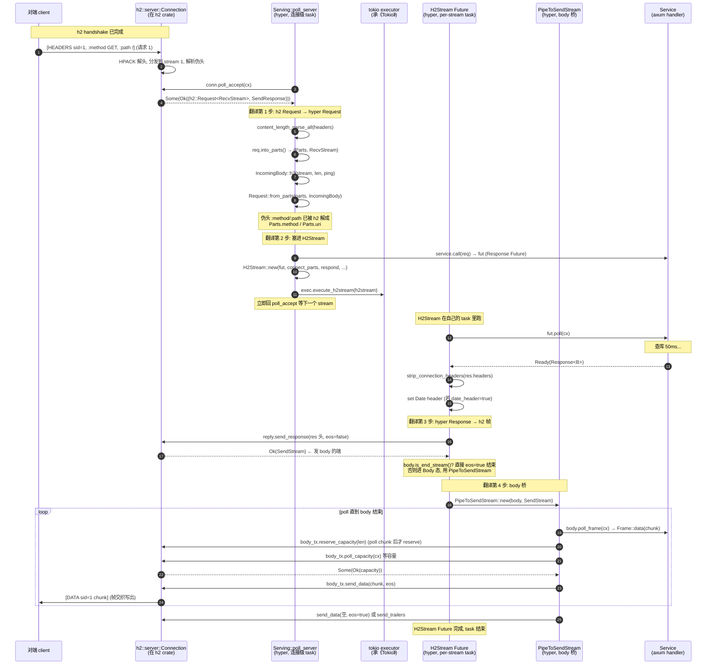
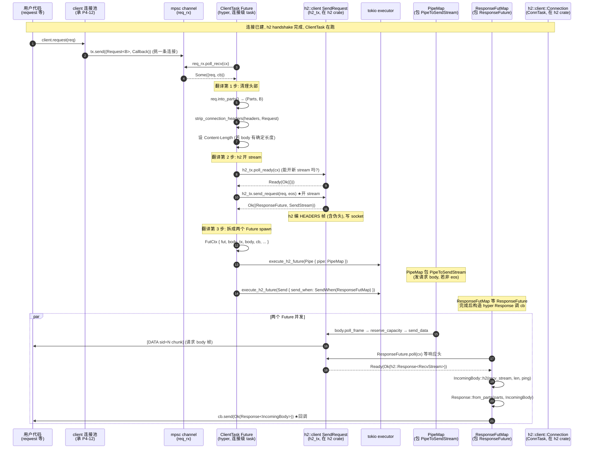

# 第 3 篇 · 第 10 章 · h2 集成:请求映射成 stream

> **核心问题**:上一章(P3-09)我们立起了 HTTP/2 在 hyper 里的骨架——为什么委托 h2、`Server`/`ClientTask` 两个连接级 Future、每 stream 独立 spawn、多 stream 并发、ALPN/h2c 入口。但有个东西一直被当黑盒:hyper 怎么把"一个 hyper `Request`"真正变成"一条 HTTP/2 stream",又怎么把 h2 收回来的 stream 变回"一个 hyper `Response`"?具体说——server 侧 `poll_server` 从 `conn.poll_accept` 拿到的是 `h2::server::SendResponse` 和 `h2::Request<RecvStream>` 这两个 **h2 crate** 的类型,axum handler 拿到的却是 `Request<hyper::body::Incoming>`,这一层"翻译"在哪做、怎么做?client 侧用户调 `client.request(req)` 传进来的是 `Request<B>`,真正发到 TCP 上的是 h2 编码的 HEADERS+DATA 帧,中间这层"把 `Request<B>` 拆成头和 body、分别喂给 h2 的 `send_request` 和 `SendStream`"的逻辑长什么样?为什么 server 和 client 这两个方向的桥**不对称**(server 是被动 accept、client 是主动 open + 管并发上限)?body 在两个方向上怎么"双向桥"(hyper 的 `Frame` 流 ↔ h2 的 data 帧)?连接突然关闭时,在途的 stream 怎么收场?这一章是第 3 篇的招牌章,把"请求↔stream 的双向映射"讲到你能闭着眼睛画出数据流。

> **读完本章你会明白**:
> 1. server 侧的适配链:`conn.poll_accept` → h2 的 `(Request<RecvStream>, SendResponse)` → hyper 的 `Request<IncomingBody>` + h2 的 `SendResponse` 一起塞进 `H2Stream` Future → spawn 出去 → Service 跑完 → 响应 body 通过 `PipeToSendStream` 流回 h2 的 `SendStream`。每一步"翻译"在哪一行源码。
> 2. client 侧的适配链:用户 `Request<B>` 进 channel → `ClientTask` 从 channel 拉出来 → `strip_connection_headers` 清理 → `h2_tx.send_request` 开 stream 拿 `(ResponseFuture, SendStream)` → 拆成 `H2ClientFuture::Pipe`(发请求 body)和 `H2ClientFuture::Send`(等响应 + 回调)两个 Future 各自 spawn → 响应回来构造 `Response<IncomingBody>` 回调给用户。为什么是"两个 Future 拆开 spawn"而不是一个。
> 3. 为什么 server 和 client 的桥**不对称**:server 被动接受 stream(对端开,自己只 `poll_accept`)、每 stream 一个 `H2Stream` Future;client 主动开 stream(自己 `send_request`)、每请求拆成"发 body"和"等响应"两个 spawn、还要管 `pending_open`(并发上限)。这个不对称是 HTTP/2 协议角色(server 是 responder、client 是 initiator)的直接映射。
> 4. body 的双向桥怎么 sound:`PipeToSendStream`(hyper `Body` → h2 `SendStream`,server 响应 body / client 请求 body 都用它)和 `Incoming::h2`(h2 `RecvStream` → hyper `Incoming`,server 请求 body / client 响应 body 都用它)。为什么流控不会死锁(poll chunk 后才 reserve)、为什么 chunk 不会丢(`buffered_data` 跨 Pending 存活)、为什么 stream 不会串(每 stream 独立 id + 独立 task)。
> 5. 连接关闭时在途 stream 怎么收场:GOAWAY 让 `poll_accept` 返回 `None`、新 stream 不再接受;在途 stream 靠 h2 的 `poll_reset` 收到 RST_STREAM 提前终止 body;`ClientTask` 靠 `conn_eof` oneshot 感知连接 task 结束;`PipeMap` 靠 `cancel_rx` 感知用户取消(比如超时)发 RST_STREAM。

> **如果一读觉得太难**:先抓三件事——① server 侧:`poll_accept` 拿到 h2 的 stream → 包成 hyper 的 `Request` → `service.call(req)` 拿响应 Future → 和 h2 的 `SendResponse` 一起塞进 `H2Stream` spawn 出去,响应 body 用 `PipeToSendStream` 流回 h2;② client 侧:`ClientTask` 从 channel 拉用户请求 → `h2_tx.send_request` 开 stream → 拆成"发请求 body"(`PipeMap`/`PipeToSendStream`)和"等响应"(`ResponseFutMap`)两个 Future spawn;③ 两个方向共用两块砖——`PipeToSendStream`(hyper Body → h2 SendStream)和 `Incoming::h2`(h2 RecvStream → hyper Incoming),body 桥是双向对称的,只是接的两头不同。这三条钉住,后面所有细节都是它们的展开。

---

## 〇、一句话点破

> **hyper 在 `proto/h2/` 这一层做的事,本质是两道"翻译":server 侧把"h2 接受到的 stream"翻译成"hyper 的 Request 喂给 Service、再把 Service 吐的 Response 翻译回 h2 的帧",client 侧把"用户要发的 Request"翻译成"h2 的 send_request 开 stream、再把这个 stream 收到的响应翻译回 hyper 的 Response"。两道翻译共用两块砖——`PipeToSendStream`(hyper Body → h2 SendStream)和 `Incoming::h2`(h2 RecvStream → hyper Incoming)。一行字:hyper 不写 HTTP/2 协议,hyper 写的是"协议两端(h2)和业务两端(Service/用户)之间的翻译官",这个翻译官的 sound,就是本章全部的硬骨头。**

这是结论。本章倒过来拆:先把"映射"这件事拆成 server 侧和 client 侧两条独立链(它们不对称),各走一遍完整的数据流;再把 body 的双向桥(`PipeToSendStream` 和 `Incoming::h2`)单独拧出来拆透——这是 sound 的关键;接着讲连接级 headers 的清理(`strip_connection_headers`,为什么 HTTP/2 禁止 Connection 系列);然后讲 CONNECT 升级(websocket/connect-udp over h2)这条特殊的"不走 body 桥"的路径;再讲连接关闭/取消时在途 stream 的收场;最后两个技巧精解。

> **承接《gRPC》(本章继续强承接)**:HTTP/2 的 stream id 奇偶规则、HEADERS/DATA 帧格式、HPACK 伪头(`:method`/`:path`/`:authority`/`:scheme`/`:status`)、END_STREAM flag、RST_STREAM 的 reason code、GOAWAY 的 last_stream_id——这些协议级细节在《gRPC》第 2 篇(chttp2)已拆到字节,本章**一句带过 + 指路**。本章只回答"hyper 怎么把 h2 这些协议原语,翻译成 hyper 自己的 `Request`/`Response`/`Body` 抽象,且翻译过程 sound"。

> **承接《Tokio》**:本章每个 Future(`H2Stream`、`H2ClientFuture::Pipe`、`H2ClientFuture::Send`、`ConnTask`)都跑在 Tokio task 里,每个 `spawn`/`execute` 都用 Tokio 的 executor,每个 `Pending`/`Waker` 都是 Tokio reactor 唤醒——这些《Tokio》拆透的机制一句带过,篇幅留"hyper 怎么把这些 Future 缝起来"。

---

## 一、server 侧的映射链:从 h2 stream 到 hyper Response

先把 server 侧的完整数据流摆出来,然后逐段拆。

### 1.1 一张全景时序图

server 侧"接受一个 HTTP/2 请求 stream、跑 Service、写响应"的全过程:



这张图把 server 侧的四步翻译全摆出来了。下面逐段拆源码。

### 1.2 第 1 步:h2 stream → hyper Request(伪头怎么变成 method/uri)

入口在 `poll_server`(`src/proto/h2/server.rs:251`)。`conn.poll_accept(cx)` 返回 `Option<Result<(h2::server::Request<RecvStream>, SendResponse<...>), h2::Error>>`。注意 `conn` 是 `h2::server::Connection`(`server.rs:115`),`poll_accept` 是 **h2 crate** 的 API——它返回的 `req: h2::server::Request<RecvStream>` 实际上就是 `http::Request<RecvStream>`(h2 用了 `http` crate 的类型),只不过头部里还带着 HTTP/2 的伪头(`:method`/`:path`/`:authority`/`:scheme`)。

> **承接《gRPC》**:HTTP/2 的伪头(`:method`/`:path`/`:authority`/`:scheme`/`:status`)是 HPACK 静态表的前几项,请求侧 4 个、响应侧 1 个(`:status`),它们用 `:` 开头区别于普通头。h2 在解 HPACK 时已经把伪头**展开成 `http::Request` 的 `method`/`uri` 字段**——这是 h2 干的,不是 hyper 干的。hyper 拿到的 `req: http::Request<RecvStream>` 已经是 `method=GET, uri=/foo, headers={host, user-agent, ...}` 的结构化形态,伪头不在 `headers()` 里。

所以 hyper 的"翻译第 1 步"主要是:**把 `RecvStream`(h2 的 body 接收端)包成 hyper 的 `IncomingBody`**。看 `server.rs:267-288`:

```rust
// hyper/src/proto/h2/server.rs:266-306 (摘录, 简化)
match ready!(self.conn.poll_accept(cx)) {
    Some(Ok((req, mut respond))) => {
        trace!("incoming request");
        let content_length = headers::content_length_parse_all(req.headers());
        let ping = self
            .ping
            .as_ref()
            .map(|ping| ping.0.clone())
            .unwrap_or_else(ping::disabled);
        ping.record_non_data();                    // 记一次"非 data"事件, BDP 用 (P3-11)

        let is_connect = req.method() == Method::CONNECT;
        let (mut parts, stream) = req.into_parts();   // ★ 拆成 Parts 和 RecvStream
        let (mut req, connect_parts) = if !is_connect {
            (
                Request::from_parts(
                    parts,
                    IncomingBody::h2(stream, content_length.into(), ping),  // ★ body 桥
                ),
                None,
            )
        } else {
            // CONNECT 走升级路径, 见 §4
            // ...
        };

        if let Some(protocol) = req.extensions_mut().remove::<h2::ext::Protocol>() {
            req.extensions_mut().insert(Protocol::from_inner(protocol));   // connect-udp 协议头
        }

        let fut = H2Stream::new(
            service.call(req),       // ★ 翻译第 2 步: call Service
            connect_parts,
            respond,                  // h2 的 SendResponse 留给后面写响应
            self.date_header,
            exec.clone(),
        );
        exec.execute_h2stream(fut);  // ★ spawn 出去
    }
    // ...
}
```

这一段有两个翻译动作:

**动作 A:把 `RecvStream` 包成 `IncomingBody::h2`**。`req.into_parts()` 把 `http::Request<RecvStream>` 拆成 `http::request::Parts`(持有 method/uri/version/headers/extensions)和 `RecvStream`(h2 的 body 接收端)。`IncomingBody::h2(stream, content_length.into(), ping)`(`body/incoming.rs:153`)把 `RecvStream` 包成 hyper 的 `Incoming` body:

```rust
// hyper/src/body/incoming.rs:153-171 (摘录)
pub(crate) fn h2(
    recv: h2::RecvStream,
    mut content_length: DecodedLength,
    ping: ping::Recorder,
) -> Self {
    // 如果 stream 已经 EOS, "未知长度"实际是 0
    if !content_length.is_exact() && recv.is_end_stream() {
        content_length = DecodedLength::ZERO;
    }
    Incoming::new(Kind::H2 {
        data_done: false,
        ping,
        content_length,
        recv,
    })
}
```

包进去的就四样东西:`recv: h2::RecvStream`(body 数据源,在 h2 crate)、`content_length`(从 Content-Length 头解出来的,可未知)、`ping`(hyper 的 ping recorder,记 body 字节用于 BDP,见 P3-11)、`data_done`(是否 data 已读完准备读 trailers)。这个 `Incoming` body 实现 hyper 的 `Body` trait,上层 Service 拿到的就是统一的 `Request<IncomingBody>`,**不区分 HTTP/1 还是 HTTP/2**——这是适配层的核心价值(下面 §3 详拆这个 body 桥的 `poll_frame`)。

**动作 B:把 `h2::ext::Protocol` 翻译成 hyper 的 `Protocol`**(`server.rs:308-310`)。这是 connect-udp 等扩展协议用的(`:protocol` 伪头),h2 把它存在 `extensions` 里,hyper 把它取出来换成自己的 `Protocol` 类型。这是个细节,但对"翻译完整性"重要——业务层(axum)能通过 `req.extensions().get::<Protocol>()` 拿到。

> **钉死这件事**:server 侧的"翻译第 1 步"几乎不费力——因为 h2 已经把伪头展开成了 `http::Request` 的 method/uri,hyper 只需要把 `RecvStream`(h2 的 body 端)包成自己的 `IncomingBody::h2`,再加上几个细节(content_length 解析、ping recorder、Protocol 扩展)。**伪头到 method/uri 的翻译在 h2,不在 hyper**。这是 hyper 委托 h2 的红利之一——结构化请求的"重活"被 h2 干了。

### 1.3 第 2 步:塞进 H2Stream,call Service,spawn 出去

翻译完 Request,紧接着 `service.call(req)`(`server.rs:313`)拿到响应 Future(承 P1-02 Service trait),和 h2 的 `respond: SendResponse` 一起塞进 `H2Stream::new(...)`(`server.rs:312-318`),然后 `exec.execute_h2stream(fut)`(`server.rs:320`)spawn 出去。

`H2Stream`(`server.rs:367`)是 per-stream 的 Future,它的结构值得单独看:

```rust
// hyper/src/proto/h2/server.rs:365-395 (摘录)
pin_project! {
    pub struct H2Stream<F, B, E>
    where
        B: Body,
    {
        reply: SendResponse<SendBuf<B::Data>>,   // ★ h2 的 SendResponse, 留着写响应
        #[pin]
        state: H2StreamState<F, B>,                // ★ 两态状态机
        date_header: bool,
        exec: E,
    }
}

pin_project! {
    #[project = H2StreamStateProj]
    enum H2StreamState<F, B>
    where
        B: Body,
    {
        Service {
            #[pin]
            fut: F,                                 // ★ Service 返回的响应 Future
            connect_parts: Option<ConnectParts>,
        },
        Body {
            #[pin]
            pipe: PipeToSendStream<B>,              // ★ body 桥, 见 §3
        },
    }
}
```

`H2Stream` 内部是个两态状态机:**`Service` 态**(等 Service 算出响应)→ **`Body` 态**(把响应 body 流到 h2)。`reply: SendResponse` 是 h2 的"写响应"端(在 h2 crate),贯穿两个状态都持有——`Service` 态用它发响应头,`Body` 态用它发的 `SendStream` 流 body。

> **钉死这件事**:`H2Stream` 这个两态状态机就是 server 侧一个 HTTP/2 stream 的完整生命周期。`Service` 态是"业务在算",`Body` 态是"业务算完了、body 在流"。这个状态机被 spawn 成独立 task(`execute_h2stream`),所以几百个 stream 各自跑自己的 `H2Stream`,互不阻塞。承 P3-09 的 per-stream spawn。

`execute_h2stream` 的真身在 `rt/bounds.rs:113`:

```rust
// hyper/src/rt/bounds.rs:109-128 (摘录)
pub trait Http2ServerConnExec<F, B: Body>:
    super::Http2UpgradedExec<B::Data> + sealed::Sealed<(F, B)> + Clone
{
    fn execute_h2stream(&mut self, fut: H2Stream<F, B, Self>);
}

impl<E, F, B> Http2ServerConnExec<F, B> for E
where
    E: Clone,
    E: Executor<H2Stream<F, B, E>>,
    E: super::Http2UpgradedExec<B::Data>,
    H2Stream<F, B, E>: Future<Output = ()>,
    B: Body,
{
    fn execute_h2stream(&mut self, fut: H2Stream<F, B, E>) {
        self.execute(fut);    // ★ 委托给 Executor trait
    }
}
```

这是个 blanket impl——任何实现了 `Executor<H2Stream<...>>` 的类型都自动满足 `Http2ServerConnExec`。默认的 `Executor` 就是 `tokio::runtime::Handle`(承《Tokio》),所以 `execute_h2stream` 等价于 `tokio::spawn(fut)`。这个 trait bound 看起来复杂,实际就是"能 spawn `H2Stream` Future 的东西"。

> **承接《Tokio》**:`self.execute(fut)` 落到 tokio 的 `Handle::spawn`,把 Future 丢进 Tokio scheduler。后续这个 `H2Stream` task 的调度、挂起、唤醒,全由 Tokio 接管——和别的 task 一起共享 worker 线程。hyper 只负责"造出这个 Future 然后 spawn",调度零成本复用 Tokio。

### 1.4 第 3 步:Service 出响应 → hyper Response → h2 帧

`H2Stream` 跑起来后,`poll2`(`server.rs:445`)驱动它的状态机。`Service` 态的核心逻辑(`server.rs:449-531`):

```rust
// hyper/src/proto/h2/server.rs:448-531 (摘录, 简化)
let next = match me.state.as_mut().project() {
    H2StreamStateProj::Service { fut: h, connect_parts } => {
        let res = match h.poll(cx) {                  // ★ 等 Service 算完
            Poll::Ready(Ok(r)) => r,
            Poll::Pending => {
                // Service 还没好, 顺便检查对端有没有 RST_STREAM 取消
                if let Poll::Ready(reason) =
                    me.reply.poll_reset(cx).map_err(crate::Error::new_h2)?
                {
                    debug!("stream received RST_STREAM: {:?}", reason);
                    return Poll::Ready(Err(crate::Error::new_h2(reason.into())));
                }
                return Poll::Pending;
            }
            Poll::Ready(Err(e)) => {
                let err = crate::Error::new_user_service(e);
                me.reply.send_reset(err.h2_reason());   // Service 出错, RST_STREAM
                return Poll::Ready(Err(err));
            }
        };

        // Service 出响应了, 翻译: hyper Response → h2 帧
        let (head, body) = res.into_parts();
        let mut res = ::http::Response::from_parts(head, ());
        super::strip_connection_headers(res.headers_mut(), super::MessageKind::Response);  // ★ 清理 Connection 头
        if *me.date_header {
            res.headers_mut()
                .entry(::http::header::DATE)
                .or_insert_with(date::update_and_header_value);   // 补 Date 头
        }

        // CONNECT 成功响应走升级路径, 见 §4
        // ...

        if !body.is_end_stream() {
            // body 非空, 自动补 Content-Length (若能确定)
            if let Some(len) = body.size_hint().exact() {
                headers::set_content_length_if_missing(res.headers_mut(), len);
            }
            let body_tx = reply!(me, res, false);    // ★ h2 发响应头 (eos=false)
            H2StreamState::Body {
                pipe: PipeToSendStream::new(body, body_tx),    // ★ 进 Body 态
            }
        } else {
            reply!(me, res, true);     // ★ body 为空, 直接 eos=true 结束 stream
            return Poll::Ready(Ok(()));
        }
    }
    H2StreamStateProj::Body { pipe } => {
        return pipe.poll(cx);    // ★ Body 态: 驱动 PipeToSendStream
    }
};
me.state.set(next);
```

这一段是 server 侧翻译的"主战场"。逐句拆:

**`h.poll(cx)` 等 Service**。Service 是用户写的(承 P1-02,axum handler 最后是个 Service),它的 Future 可能要查库、调下游、算东西。这里 `poll` 它,Ready 就拿到 `Response<B>`,Pending 就返回——但**返回前做了一件关键的事**:`me.reply.poll_reset(cx)`(`server.rs:458-464`)检查对端有没有发 RST_STREAM 取消这个 stream。

> **钉死这件事**:这个"Service Pending 时顺手 poll_reset"是 server 侧的**取消传播**。HTTP/2 的 client 可以随时发 RST_STREAM 取消一个请求(比如用户关了浏览器、或者超时)。如果 server 的 Service 还在查库(10 秒),没有这个 poll_reset,server 会傻等 Service 算完才去写响应——结果写的时候发现 stream 已经被 RST 了,白算 10 秒。有了 poll_reset,Service Pending 期间一旦收到 RST_STREAM,`H2Stream` 立刻返回 Err,task 结束,**Service 的 Future 被 drop**(future drop = 取消传播到 Service 内部的所有子 future,比如数据库查询的 future),释放资源。这是 hyper 把"h2 的取消信号"传播到"Service 的 Future 树"的关键一拼。

**`strip_connection_headers`**(`mod.rs:50`,见 §5 详拆)。HTTP/2 禁止 Connection/Keep-Alive/Transfer-Encoding/Upgrade 这些"逐跳"头(它们的功能被 HTTP/2 的帧类型替代了)。如果用户的 Service 不小心在响应里设了这些头,hyper 会把它们删掉并打 warn。

**`reply!(me, res, eos)` 宏**(`server.rs:423-434`):

```rust
// hyper/src/proto/h2/server.rs:423-434
macro_rules! reply {
    ($me:expr, $res:expr, $eos:expr) => {{
        match $me.reply.send_response($res, $eos) {
            Ok(tx) => tx,
            Err(e) => {
                debug!("send response error: {}", e);
                $me.reply.send_reset(Reason::INTERNAL_ERROR);
                return Poll::Ready(Err(crate::Error::new_h2(e)));
            }
        }
    }};
}
```

它调 h2 的 `SendResponse::send_response(res, eos)`(在 h2 crate),把响应头(状态行 + headers)编成 HEADERS 帧写出去。`eos` 参数控制是否在这帧就 END_STREAM(如果 body 为空,直接 eos=true 结束 stream)。返回一个 `SendStream<SendBuf<B::Data>>`——这是发 body 的端,进 `Body` 态后交给 `PipeToSendStream`。

> **钉死这件事**:`send_response` 是 h2 的 API,hyper 调它不实现它。HPACK 编码(`:status` 伪头 + 普通头压缩)、帧的拼装、流控的 window 检查,全在 h2 里。hyper 只负责"把 hyper 的 `Response` 头部清理干净(去掉 Connection 系列)+ 补上 Date/Content-Length,然后交给 h2 编码"。

**`H2StreamState::Body { pipe: PipeToSendStream::new(body, body_tx) }`**。响应头发出去了,如果 body 非空(`!body.is_end_stream()`),进 `Body` 态,把"hyper 的 body `B`"和"h2 的 `SendStream`"一起塞进 `PipeToSendStream`(`mod.rs:95`)。下一圈循环 `pipe.poll(cx)` 驱动 body 桥(见 §3)。

> **钉死这一节**:server 侧一个 stream 的完整生命周期,在 `H2Stream::poll2` 里就两态——`Service`(等业务算响应,顺手 poll_reset 监听取消)→ `Body`(响应头已发,body 在流)。响应头的"翻译"是 `strip_connection_headers` + 补 Date/Content-Length,然后交给 h2 的 `send_response`。body 的"翻译"是 `PipeToSendStream`。**整个 `H2Stream` 不碰一个字节 HTTP/2 协议,全是"调 h2 API + 清理头部 + 驱动 body 桥"**。这是适配层的全部含义。

---

## 二、client 侧的映射链:从 hyper Request 到 h2 stream

client 侧的映射链和 server 侧**不对称**。先把全景时序图摆出来,再讲为什么不对称。

### 2.1 一张全景时序图

client 侧"用户发一个 Request、收到 Response"的全过程:



这张图和 server 侧那张对照,差异立刻显形。

### 2.2 为什么 client 和 server 不对称

在拆源码前,先讲清楚"为什么不对称"——这是理解 client 侧所有设计的关键。

**server 侧的协议角色是"responder"**:它**被动**接受对端发来的 stream。对端(client)开 stream、发请求,server 只需要"接受 or 拒绝"。所以 server 侧的入口是 `conn.poll_accept`(h2 crate),它返回"下一个准备好的 stream"。每个 stream 的生命周期是"收请求 → 跑 Service → 写响应",天然是一个完整的 Future(`H2Stream`),spawn 出去就行。

**client 侧的协议角色是"initiator"**:它**主动**开 stream 发请求。没有"接受"这个动作,只有"我决定开一个 stream"。所以 client 侧的入口是 `h2_tx.send_request`(h2 crate),它**主动**开一个新 stream,返回 `(ResponseFuture, SendStream)`——前者等响应头,后者发请求 body。

这个角色差异带来了 client 侧的两个独特问题:

**问题 A:请求 body 和响应头是并发的**。client 发一个有 body 的 POST 请求,要做两件事:① 把请求 body 流到 h2(发 DATA 帧);② 等响应头回来(收 HEADERS 帧)。这两件事**可以同时进行**——server 可能边收 body 边算响应(比如流式处理),client 也得边发 body 边等响应。如果在同一个 Future 里串行(先发完 body 再等响应),就丧失了 HTTP/2 的并发优势——server 想提前响应(100-continue、早响应)都收不到。

> **钉死这件事**:这就是为什么 client 侧把一个请求**拆成两个 Future spawn**——`H2ClientFuture::Pipe`(发请求 body)和 `H2ClientFuture::Send`(等响应 + 回调)。它们跑在各自的 task 里,**真正并发**:body 在一个 task 里流,响应在另一个 task 里等。server 侧不存在这个问题——server 收完请求头就能 call Service,响应是 Service 算完才发的,响应 body 在 `H2Stream` 的 `Body` 态里流,和"收请求 body"不并发(请求 body 在 Service 之前就被 `IncomingBody` 接住了)。

**问题 B:client 要管"开 stream 的并发上限"**。HTTP/2 有 `SETTINGS_MAX_CONCURRENT_STREAMS`,client 不能开超过这个数的并发 stream。server 侧不用管——它只接受,接受多少由 server 自己的 `max_concurrent_streams` 配置控制(h2 在 SETTINGS 里告诉对端)。client 侧得自己管:开一个 stream 前先 `h2_tx.poll_ready` 看能不能开,开完再 `poll_ready` 看是不是进了"pending open"(对端的 max_concurrent_streams 满了),满了就得等。

这两个问题就是 client 侧 `ClientTask`(`client.rs:425`)和 server 侧 `Server` 设计差异的根源。

### 2.3 第 1 步:从 channel 拉请求,清理头部

`ClientTask::poll`(`client.rs:678`)的主循环,先看前半段(`client.rs:678-745`):

```rust
// hyper/src/proto/h2/client.rs:678-745 (摘录, 简化)
fn poll(mut self: Pin<&mut Self>, cx: &mut Context<'_>) -> Poll<Self::Output> {
    loop {
        // 1. h2 的 SendRequest ready 吗? (能开新 stream 吗)
        match ready!(self.h2_tx.poll_ready(cx)) {
            Ok(()) => (),
            Err(err) => {
                self.ping.ensure_not_timed_out()?;
                return if err.reason() == Some(::h2::Reason::NO_ERROR) {
                    trace!("connection gracefully shutdown");
                    Poll::Ready(Ok(Dispatched::Shutdown))
                } else {
                    Poll::Ready(Err(crate::Error::new_h2(err)))
                };
            }
        }

        // 2. 上次 pending_open 的请求接着发
        if let Some(f) = self.fut_ctx.take() {
            self.poll_pipe(f, cx);
            continue;
        }

        // 3. 从 channel 收用户(连接池)发来的新请求
        match self.req_rx.poll_recv(cx) {
            Poll::Ready(Some((req, cb))) => {
                if cb.is_canceled() { continue; }    // 请求已被取消(比如超时)
                let (head, body) = req.into_parts();
                let mut req = ::http::Request::from_parts(head, ());
                super::strip_connection_headers(req.headers_mut(), super::MessageKind::Request);
                if let Some(len) = body.size_hint().exact() {
                    if len != 0 || headers::method_has_defined_payload_semantics(req.method()) {
                        headers::set_content_length_if_missing(req.headers_mut(), len);
                    }
                }
                // ... CONNECT / 协议头处理
                let (fut, body_tx) = match self.h2_tx.send_request(req, !is_connect && eos) {  // ★ 开 stream
                    Ok(ok) => ok,
                    Err(err) => { /* ... 回调报错 */ continue; }
                };
                let f = FutCtx { is_connect, eos, fut, body_tx, body, cb };
                // ... 检查 pending_open, 见下
            }
            // ...
        }
    }
}
```

这一段对应翻译的"第 1 步 + 第 2 步"。几个要点:

**`self.h2_tx.poll_ready(cx)` 是 h2 的 API**(`client.rs:680`),返回"现在能不能开新 stream"。这是 client 侧的并发上限管理——如果对端的 `max_concurrent_streams` 满了,`poll_ready` 返回 Pending,`ready!` 宏让 `ClientTask` 整个 task 挂起,等对端有 stream 关闭(发 WINDOW_UPDATE 或别的 stream 结束)再唤醒。这就是"client 不能无脑开 stream"的工程落地。

**`self.req_rx.poll_recv(cx)`**(`client.rs:700`)从 channel 收请求。这个 channel 是 `ClientRx<B>`(`client.rs:35`):

```rust
// hyper/src/proto/h2/client.rs:35
type ClientRx<B> = crate::client::dispatch::Receiver<Request<B>, Response<IncomingBody>>;
```

它连接的是 client 连接池(承 P4-12)和这条 `ClientTask`。用户调 `client.request(req)`,连接池挑一条可用的 HTTP/2 连接(到同一 host),把 `(Request<B>, Callback)` 通过 channel发给这条连接的 `ClientTask`。`Callback` 是个 oneshot 回调,等响应回来通过它把 `Response<IncomingBody>` 传给用户。

**`strip_connection_headers(req.headers_mut(), MessageKind::Request)`**(`client.rs:709`)。和 server 侧对应(§5 详拆)。注意 `MessageKind::Request` 分支会特殊处理 `TE` 头——Request 里 `TE: trailers` 是允许的(HTTP/2 的 trailers 机制),其他 `TE` 值才删。

**`set_content_length_if_missing`**(`client.rs:711-713`)。这里有个细节:只有当 `len != 0` 或者 method 有"定义的 payload 语义"(POST/PUT/PATCH 等)才补 Content-Length。为什么?因为 HTTP/2 里 GET/DELETE/HEAD 这些 method 默认没有 body,即使 `len == 0` 也不该发 Content-Length 头(避免歧义);而 POST 即使 body 为空,也该有 `Content-Length: 0` 表明"我有意发空 body"。这是 hyper 替用户守的一个协议细节。

### 2.4 第 2 步:h2 开 stream,拿 (ResponseFuture, SendStream)

`self.h2_tx.send_request(req, !is_connect && eos)`(`client.rs:735`)是 **h2 crate** 的 API,这是 client 侧"开 stream"的核心。它干两件事:

1. **编一个 HEADERS 帧**:把 `req` 的 method/uri 编成伪头(`:method`/`:path`/`:authority`/`:scheme`),把 headers 编成 HPACK,拼成 HEADERS 帧,写进发送队列。`!is_connect && eos` 是第二个参数 `end_stream`——如果请求没有 body(eos=true),这一帧就 END_STREAM;如果有 body,eos=false,后续用 `SendStream` 发 DATA 帧。
2. **返回 `(ResponseFuture, SendStream)`**:`ResponseFuture` 是等响应头的 future(在 h2 crate),`SendStream` 是发请求 body 的端(在 h2 crate)。

> **承接《gRPC》**:h2 的 `send_request` 内部做的事——分配 stream id(client 开的 stream 用奇数 1/3/5/...)、HPACK 编码、检查 stream 状态机(idle → open)、检查流控 window——这些协议级细节在《gRPC》第 2 篇 chttp2 已拆到字节。hyper 只调这个 API,不实现它。

注意:**h2 的 `send_request` 本身**不开销,它只是把 HEADERS 帧塞进发送队列。真正写 socket 是 h2 的 `Connection` future(在 `ConnTask` 里,见下)驱动的。所以 `send_request` 返回很快,真正"把字节发出去"是异步的。

### 2.5 第 3 步:拆成两个 Future spawn(poll_pipe)

拿到 `(ResponseFuture, SendStream)` 后,`ClientTask` 不直接处理它们,而是塞进 `FutCtx`(`client.rs:411`),然后调 `poll_pipe`(`client.rs:526`)。这个 `poll_pipe` 是 client 侧翻译的"第 3 步"——**把一个请求拆成两个 Future spawn 出去**:

```rust
// hyper/src/proto/h2/client.rs:526-578 (摘录, 简化)
fn poll_pipe(&mut self, f: FutCtx<B>, cx: &mut Context<'_>) {
    let ping = self.ping.clone();
    let (cancel_tx, cancel_rx) = oneshot::channel::<()>();   // ★ 用户取消通道

    let send_stream = if !f.is_connect {
        if !f.eos {
            // 有 body, 造 PipeToSendStream
            let mut pipe = PipeToSendStream::new(f.body, f.body_tx);
            // 先 eagerly poll 一次, 看能不能立刻完成(body 空)
            match Pin::new(&mut pipe).poll(cx) {
                Poll::Ready(_) => (),
                Poll::Pending => {
                    let conn_drop_ref = self.conn_drop_ref.clone();
                    let ping = ping.clone();
                    let pipe = PipeMap {
                        pipe,
                        conn_drop_ref: Some(conn_drop_ref),
                        ping: Some(ping),
                        cancel_rx: Some(cancel_rx),
                    };
                    self.executor.execute_h2_future(H2ClientFuture::Pipe { pipe });  // ★ spawn 发 body
                }
            }
        }
        None
    } else {
        Some(f.body_tx)   // CONNECT 请求, body_tx 留给升级路径
    };

    self.executor.execute_h2_future(H2ClientFuture::Send {
        send_when: SendWhen {
            when: ResponseFutMap {
                fut: f.fut,
                ping: Some(ping),
                send_stream: Some(send_stream),
                exec: self.executor.clone(),
                cancel_tx: Some(cancel_tx),
            },
            call_back: Some(f.cb),
        },
    });    // ★ spawn 等响应 + 回调
}
```

这一段是 client 侧的招牌,逐句拆:

**`oneshot::channel::<()>()`**(`client.rs:531`)造一个取消通道。`cancel_tx` 给 `ResponseFutMap`(等响应的 Future),`cancel_rx` 给 `PipeMap`(发 body 的 Future)。如果用户取消了请求(比如 `reqwest` 超时 drop 了响应 Future),`ResponseFutMap::cancel`(`client.rs:599`)会 `cancel_tx.send(())`,`PipeMap` 收到后立刻 `send_reset(h2::Reason::CANCEL)`(`client.rs:490`)发 RST_STREAM 取消 body 发送,释放流控容量。这是 client 侧的**取消传播**——和 server 侧的 `poll_reset` 对称,但方向相反。

> **钉死这件事**:这个 `cancel_rx`/`cancel_tx` 机制是 client 侧 body 桥的 sound 关键。考虑这个场景:用户发了一个大 POST(body 100MB),发了一半超时 drop 了响应 Future。如果没有取消传播,`PipeMap` 会傻傻把剩下 100MB 全发完——浪费带宽、占流控 window、server 也在白收。有了 `cancel_rx`,`PipeMap` 在每次 poll 时检查(`client.rs:486-501`),收到取消立刻 `send_reset(CANCEL)` 终止 body,h2 发 RST_STREAM,server 收到后也会停。这是 hyper 把"用户层取消(drop Future)→ h2 层终止(RST_STREAM)"打通的关键设计。

**eagerly poll**(`client.rs:539-541`):`PipeToSendStream` 造出来后先 `poll` 一次。如果 body 是空的或立刻就 Ready(比如 `Body::empty()`),就不用 spawn 一个新 task——省一次 spawn 开销。这是个性能优化,对"无 body 的 GET"特别有用(那种请求 `f.eos=true`,根本不进这个分支)。

**`H2ClientFuture::Pipe { pipe: PipeMap { ... } }`**(`client.rs:548-556`),spawn 出去。`PipeMap`(`client.rs:459`)包了四样东西:`pipe: PipeToSendStream`(真正的 body 桥,见 §3)、`conn_drop_ref`(连接存活引用,见 §6)、`ping`(BDP recorder)、`cancel_rx`(取消通道)。

**`H2ClientFuture::Send { send_when: SendWhen<ResponseFutMap> }`**(`client.rs:566-577`),spawn 出去。`ResponseFutMap`(`client.rs:582`)包了:`fut: ResponseFuture`(h2 的等响应 future)、`ping`、`send_stream`(给 CONNECT 用)、`exec`、`cancel_tx`。`SendWhen`(`client.rs:583` 的 `send_when` 字段)是个工具,把 `ResponseFutMap` 的结果通过 `call_back: Callback` 回调给用户。

> **钉死这一段**:client 侧把一个请求拆成两个 Future spawn,是**协议角色决定的**——client 主动开 stream,请求 body 和响应头是两个并发的方向(一个出、一个入)。server 侧不存在这个拆分,因为 server 收完请求头才开始算响应,body 桥只有一个方向(响应 body 出)。这是 server/client 在 h2 这层不共用结构的根本原因(承 P3-09 §3.6)。

### 2.6 第 4 步:响应回来,构造 hyper Response

`ResponseFutMap::poll`(`client.rs:613`)等 h2 的 `ResponseFuture` 完成,然后构造 hyper 的 `Response<IncomingBody>` 回调:

```rust
// hyper/src/proto/h2/client.rs:613-665 (摘录, 简化)
fn poll(mut self: Pin<&mut Self>, cx: &mut Context<'_>) -> Poll<Self::Output> {
    let mut this = self.as_mut().project();
    let result = ready!(this.fut.poll(cx));    // ★ h2 的 ResponseFuture

    let ping = this.ping.take().expect("Future polled twice");
    let send_stream = this.send_stream.take().expect("Future polled twice");

    match result {
        Ok(res) => {
            ping.record_non_data();    // 记响应头到达, BDP 用
            let content_length = headers::content_length_parse_all(res.headers());

            if let (Some(mut send_stream), StatusCode::OK) = (send_stream, res.status()) {
                // CONNECT 200 响应走升级路径, 见 §4
                // ...
            } else {
                let res = res.map(|stream| {
                    let ping = ping.for_stream(&stream);
                    IncomingBody::h2(stream, content_length.into(), ping)   // ★ body 桥(同 server)
                });
                Poll::Ready(Ok(res))
            }
        }
        Err(err) => {
            ping.ensure_not_timed_out().map_err(|e| (e, None))?;
            Poll::Ready(Err((crate::Error::new_h2(err), None::<Request<B>>)))
        }
    }
}
```

注意 `res.map(|stream| IncomingBody::h2(stream, content_length.into(), ping))`——**这和 server 侧用的是同一个 `IncomingBody::h2`**(`body/incoming.rs:153`)。client 侧收响应 body 和 server 侧收请求 body,**body 桥完全一样**——都是从 h2 的 `RecvStream` 包成 hyper 的 `Incoming`。这就是为什么 §0 说"两块砖共用"——`PipeToSendStream`(出方向)和 `Incoming::h2`(入方向)在 server/client 两侧都是同一份代码,只是接的两头不同。

构造完 `Response<IncomingBody>`,通过 `SendWhen` 的 `call_back: Callback` 回调给用户(承 P4-12 连接池,用户调 `client.request(req).await` 拿到的就是回调塞回来的 Response)。

> **钉死这一节**:client 侧的完整翻译链——`Request<B>` 进 channel → 清理头部 → `h2_tx.send_request` 开 stream 拿 `(ResponseFuture, SendStream)` → 拆成 `Pipe`(发 body)和 `Send`(等响应+回调)两个 Future spawn → 响应回来用 `IncomingBody::h2` 包成 `Response<IncomingBody>` 回调。和 server 侧对照,翻译的"砖"一样(`IncomingBody::h2`、`PipeToSendStream`),但**组装方式不同**——server 是"一个 H2Stream Future 串行两态",client 是"两个 Future 并发 spawn"。这个差异是 HTTP/2 协议角色(responder vs initiator)的直接映射。

---

## 三、body 的双向桥:PipeToSendStream 和 Incoming::h2

server 侧和 client 侧的翻译链都指向同一个核心:**body 怎么在 hyper 的 `Frame` 流和 h2 的 data 帧之间双向桥接**。这一节把这两块砖单独拧出来拆透——这是整个适配层 sound 的关键。

### 3.1 出方向:PipeToSendStream(hyper Body → h2 SendStream)

`PipeToSendStream`(`src/proto/h2/mod.rs:95`)是"把 hyper 的 `Body` 流推到 h2 的 `SendStream`"的单向桥。server 用它发响应 body(`H2StreamState::Body`),client 用它发请求 body(`H2ClientFuture::Pipe`)。结构:

```rust
// hyper/src/proto/h2/mod.rs:94-114 (摘录)
pin_project! {
    pub(crate) struct PipeToSendStream<S>
    where
        S: Body,
    {
        body_tx: SendStream<SendBuf<S::Data>>,    // ★ h2 的发送端 (在 h2 crate)
        data_done: bool,
        // 一个已经 poll 出来、但还在等 stream 级容量的 chunk。
        // 存这里让它跨 poll_capacity 的 Pending 存活, 不被丢。
        buffered_data: Option<Peeked<S::Data>>,
        #[pin]
        stream: S,                                  // ★ hyper 的 Body
    }
}

struct Peeked<D> {
    data: D,
    is_eos: bool,
}
```

四个字段:`body_tx`(h2 的 `SendStream`,协议端)、`stream`(hyper 的 `Body`,业务端)、`data_done`(data 读完了准备读 trailers 吗——注意这个字段实际没怎么用,主要靠 `poll_frame` 返回 `None` 判断)、`buffered_data`(关键正确性字段,下面详讲)。

`PipeToSendStream` 实现 `Future<Output = crate::Result<()>>`,它的 `poll`(`mod.rs:142`)是个 loop,干五件事:

**第 1 件:先查 RST_STREAM**(`mod.rs:148-155`):

```rust
// hyper/src/proto/h2/mod.rs:144-155 (摘录)
loop {
    // 注册 RST_STREAM 通知, 这样等下等 body chunk 或容量时, 对端 reset 能唤醒 task
    if let Poll::Ready(reason) = me
        .body_tx
        .poll_reset(cx)
        .map_err(crate::Error::new_body_write)?
    {
        debug!("stream received RST_STREAM: {:?}", reason);
        return Poll::Ready(Err(crate::Error::new_body_write(::h2::Error::from(reason))));
    }
    // ...
}
```

每次进 loop 先 `poll_reset`。如果对端已经 RST_STREAM(比如 client 不想收响应了),立刻返回 Err,终止 body 发送。这个 `poll_reset` 还有个副作用——**注册了 Waker**,所以后续等 body chunk 或等容量时,对端发 RST_STREAM 能唤醒这个 task。这是 body 桥的取消监听。

**第 2 件:如果有 buffered_data,先把它发出去**(`mod.rs:160-187`):

```rust
// hyper/src/proto/h2/mod.rs:157-187 (摘录, 简化)
if me.buffered_data.is_some() {
    while me.body_tx.capacity() == 0 {
        match ready!(me.body_tx.poll_capacity(cx)) {
            Some(Ok(0)) => {}              // 容量还是 0, 继续等
            Some(Ok(_)) => break,          // 有容量了, 出 while
            Some(Err(e)) => return Poll::Ready(Err(crate::Error::new_body_write(e))),
            None => {
                // stream 不在流态了(已完成或被 reset)
                return Poll::Ready(Err(crate::Error::new_body_write(
                    "send stream capacity unexpectedly closed",
                )));
            }
        }
    }
    let peeked = me.buffered_data.take().expect("checked is_some above");
    let buf = SendBuf::Buf(peeked.data);
    me.body_tx.send_data(buf, peeked.is_eos).map_err(crate::Error::new_body_write)?;
    if peeked.is_eos {
        return Poll::Ready(Ok(()));
    }
    continue;
}
```

这段处理"上一圈 poll 出来但没发出去的 chunk"。`body_tx.capacity() == 0` 说明 h2 的 stream 级 window 没容量了(对端 window 满了或者还没 WINDOW_UPDATE),得 `poll_capacity` 等容量。容量到了(`break` 出 while),把 buffered chunk 用 `send_data` 发出去。如果是 end-of-stream chunk,发完返回 Ready。

> **钉死这件事**:`buffered_data` 这个字段的存在,是为了让"已经 poll 出来的 chunk"**跨 `Pending` 存活**。考虑这个场景:body poll 出一个 100KB chunk,`reserve_capacity(100KB)` 了,但 `poll_capacity` 返回 Pending(对端 window 只有 16KB,得发完才能再 WINDOW_UPDATE)。这时如果 chunk 存在 local 变量里,`poll` 一返回 Pending,local 就被 drop——下次 poll 进来,chunk 没了,但 body 流已经前进了一帧,再 `poll_frame` 拿到的是下一帧,**这个 100KB chunk 就丢了**。把 chunk 存进 `self.buffered_data`,它就和 Future 同生命周期,跨 Pending 不会丢。这是 body 桥 sound 的关键之一——`buffered_data` 不是性能优化,是**正确性保证**。

**第 3 件:从 body 流 poll 下一帧**(`mod.rs:189-228`)。这是最精彩的一段(承 P3-09 技巧二,这里完整拆):

```rust
// hyper/src/proto/h2/mod.rs:189-228 (摘录, 简化)
// ★ 先 poll body chunk, 再 reserve 容量。speculative reserve 会死锁 (#4003)
match ready!(me.stream.as_mut().poll_frame(cx)) {
    Some(Ok(frame)) => {
        if frame.is_data() {
            let chunk = frame.into_data().unwrap_or_else(|_| unreachable!());
            let is_eos = me.stream.is_end_stream();
            let len = chunk.remaining();

            if len == 0 {
                // 零长 data 帧不需要容量, 直接发
                let buf = SendBuf::Buf(chunk);
                me.body_tx.send_data(buf, is_eos).map_err(crate::Error::new_body_write)?;
                if is_eos { return Poll::Ready(Ok(())); }
                continue;
            }

            // ★ reserve 恰好 chunk 大小, 不留 speculative 余量
            me.body_tx.reserve_capacity(len);
            *me.buffered_data = Some(Peeked { data: chunk, is_eos });
        } else if frame.is_trailers() {
            me.body_tx.reserve_capacity(0);   // trailers 不需要容量
            me.body_tx.send_trailers(frame.into_trailers().unwrap()).map_err(...)?;
            return Poll::Ready(Ok(()));
        } else {
            trace!("discarding unknown frame");    // 未知帧类型, 丢
        }
    }
    Some(Err(e)) => return Poll::Ready(Err(me.body_tx.on_user_err(e))),
    None => {
        // body 流结束, 没发过 eos/trailers, 发个空 eos DATA
        return Poll::Ready(me.body_tx.send_eos_frame());
    }
}
```

这段的顺序是 **poll chunk → reserve 恰好大小 → 存进 buffered_data**,下一圈循环走第 2 件发出去。注释(`mod.rs:189-194`)明说原因——**speculative reserve 会死锁**:

> 某些 peer 只在 receive window **完全耗尽**时才发 WINDOW_UPDATE(这是合规的,虽然激进)。如果你预先 reserve 了 N 字节(比如预估 body 还有 1MB),这 N 字节就"钉"在 connection-level window 上——但你的 chunk 还没 poll 出来,没用这些容量。对端的 window 没耗尽(因为你没用),不发 WINDOW_UPDATE;别的 stream 想用这些 capacity 也用不了(被你预留了)——**死锁**。一个 stream 的 speculative reserve 卡死了别的 stream,甚至卡死整条连接。

hyper 的解法:**poll 出 chunk 后才 reserve 恰好 chunk 大小**,不留 speculative 余量。这样每次 reserve 都立刻被 consume(下一圈循环 send_data 用掉),connection-level window 不会"被钉住"。这个 sound 微调对应 issue #4003,是真实踩过的坑。

> **钉死这件事**:这个"poll chunk 后才 reserve 恰好大小"的顺序,是 hyper 在 h2 之上的**流控 sound 微调**。它不是性能优化(甚至可能多一次 poll_frame),是**防死锁**。读源码看到 `reserve_capacity` 在 `poll_frame` 之后,要知道这不是随手写的顺序,是踩过坑后定的。这也说明 hyper 委托 h2 ≠ "什么都不管"——h2 提供 reserve/poll_capacity/send_data 原语,hyper 负责用对顺序调它们,**用错顺序会死锁**。这是适配层真实的工作量。

**第 4 件:trailers 帧**(`mod.rs:229-235`)。`frame.is_trailers()` 时,先 `reserve_capacity(0)`(释放之前可能 reserve 的容量),再 `send_trailers`。trailers 是 HTTP/2 的一个独立 HEADERS 帧带 END_STREAM,不需要 data 容量。

**第 5 件:body 结束(None)**(`mod.rs:242-247`)。`poll_frame` 返回 `None` 说明 body 流彻底结束,但之前没发过 eos DATA 或 trailers,得补一个空的 eos DATA:

```rust
// hyper/src/proto/h2/mod.rs:271-276 (SendStreamExt impl)
fn send_eos_frame(&mut self) -> crate::Result<()> {
    trace!("send body eos");
    self.send_data(SendBuf::None, true).map_err(crate::Error::new_body_write)
}
```

`SendBuf::None` 是个零长 buf,`send_data(None, true)` 发一个空 DATA 帧带 END_STREAM,告诉对端"body 结束"。这是 HTTP/2 协议要求的——每个 stream 必须以 END_STREAM 结束(要么 DATA+ES,要么 HEADERS+ES trailers)。

> **钉死这一节**:`PipeToSendStream` 是出方向的 body 桥。它干五件事:① 监听 RST_STREAM;② 发 buffered_data(跨 Pending 存活的 chunk);③ poll body chunk 后才 reserve 恰好大小(防死锁);④ trailers 帧;⑤ body 结束补 eos DATA。最精彩的是第 ③ 的顺序——poll chunk 后 reserve,不留 speculative。整个桥**不碰一个字节 HTTP/2 协议**(HPACK/DATA 帧格式在 h2),只调 h2 的 reserve/poll_capacity/send_data/send_trailers API,但**调的顺序是 sound 的关键**。

### 3.2 入方向:Incoming::h2(h2 RecvStream → hyper Incoming)

入方向的桥简单得多——`Incoming` body 的 H2 分支(`body/incoming.rs:236-284`)。它实现 hyper 的 `Body` trait 的 `poll_frame`:

```rust
// hyper/src/body/incoming.rs:235-284 (摘录, 简化)
Kind::H2 {
    ref mut data_done,
    ref ping,
    recv: ref mut h2,
    content_length: ref mut len,
} => {
    if !*data_done {
        match ready!(h2.poll_data(cx)) {                    // ★ h2 的 poll_data
            Some(Ok(bytes)) => {
                let _ = h2.flow_control().release_capacity(bytes.len());  // ★ 流控: 我读过了
                len.sub_if(bytes.len() as u64);
                ping.record_data(bytes.len());              // BDP 估算
                return Poll::Ready(Some(Ok(Frame::data(bytes))));
            }
            Some(Err(e)) => {
                if let Some(h2::Reason::NO_ERROR) = e.reason() {
                    // RST_STREAM NO_ERROR = 早响应, 当正常 EOF
                    return Poll::Ready(None);
                } else {
                    return Poll::Ready(Some(Err(crate::Error::new_body(e))));
                }
            }
            None => { *data_done = true; /* fall through 到 trailers */ }
        }
    }
    match ready!(h2.poll_trailers(cx)) {
        Ok(t) => {
            ping.record_non_data();
            Poll::Ready(Ok(t.map(Frame::trailers)).transpose())
        }
        Err(e) => {
            if let Some(h2::Reason::NO_ERROR) = e.reason() {
                Poll::Ready(None)
            } else {
                Poll::Ready(Some(Err(crate::Error::new_h2(e))))
            }
        }
    }
}
```

入方向做的事比出方向少——因为入方向是"被动收",不需要管 reserve 顺序。三件事:

**① `h2.poll_data(cx)` 拿一帧 data**(h2 的 API)。h2 内部已经按 stream 收好帧、按顺序排好,`poll_data` 返回下一块 body 字节(`Bytes`)。hyper 拿到直接包成 `Frame::data(bytes)` 返回给上层 Service。

**② `release_capacity(bytes.len())` 驱动流控**(h2 的 API)。这是入方向唯一的流控动作——每读 N 字节,告诉 h2"我处理完了这 N 字节",h2 据此发 WINDOW_UPDATE 给对端,补充 stream 级和连接级 window。如果不 release,window 会一直减,减到 0 对端发不出更多 body——这是 HTTP/2 流控的反压机制(承《gRPC》P2-09)。

> **钉死这件事**:hyper 把 `release_capacity` 的时机交给上层——`poll_frame` 读一次就 release 一次。这意味着"读 body 多快"完全由用户 Service 决定。如果 Service 慢(`poll_frame` 调得稀),window 减得慢、release 得稀疏,对端被反压;如果 Service 快,window 及时补充,对端能全速发。这是流控把"反压权"交给业务的工程落地——业务读得动才 release,读不动就堆在 h2 的 window 里,自然反压对端。

**③ NO_ERROR 当正常 EOF**(`incoming.rs:251-255`)。RST_STREAM 的 reason 是 `NO_ERROR` 时,表示"对端早响应"(server 先发了响应就 RST_STREAM 终止请求 body,这是 RFC 7540 §8.1 允许的),hyper 当正常 EOF 处理——返回 `None`,body 流结束但不报错。这个细节对"server 想提前结束请求 body"很重要(比如 server 拒绝了大上传)。

**④ trailers**(`incoming.rs:268-283`)。data 读完后(`data_done = true`),`poll_trailers` 读 trailers HEADERS 帧。同样 NO_ERROR 当正常 EOF。注意先 data 后 trailers 的顺序——HTTP/2 的 trailers 在所有 DATA 帧之后的独立 HEADERS 帧里,`data_done` 标志守住这个顺序。

> **钉死这一节**:入方向桥 `Incoming::h2` 比出方向简单——被动收,只需 `poll_data` + `release_capacity` + `poll_trailers`,加上 NO_ERROR 的特殊处理。**整个入桥不维护任何状态**(除了 `data_done` 标志),h2 的 RecvStream 内部维护了所有帧的缓冲和顺序。hyper 的角色就是个"适配器",把 h2 的 `poll_data` API 翻译成 hyper 的 `Body::poll_frame` API,让上层 Service 拿到统一的 `Frame<Data>` 流。

### 3.3 双向桥的全景:一张 ASCII 图

把出/入两个方向合起来,看 body 怎么在 hyper 和 h2 之间流:

```
        server 侧                         client 侧
        ─────────                         ─────────

   Service 算响应                       用户发请求
   Response<B>                          Request<B>
       │                                    │
       ▼                                    ▼
   ┌────────────┐  Body::poll_frame    ┌────────────┐  Body::poll_frame
   │ hyper Body │ ◄──────────────────  │ hyper Body │ ◄────────────────── 用户造的 body
   │ (响应体)   │                      │ (请求体)   │
   └─────┬──────┘                      └─────┬──────┘
         │ poll_frame 出 Frame::data          │ poll_frame 出 Frame::data
         ▼                                    ▼
   ╔══════════════════════════════════════════════════════════╗
   ║          PipeToSendStream  (出方向桥, mod.rs:95)          ║
   ║                                                          ║
   ║   poll_frame → reserve_capacity(恰好) → poll_capacity    ║
   ║            → send_data / send_trailers                   ║
   ║                                                          ║
   ║   监听: poll_reset (RST_STREAM)                          ║
   ║   正确性: buffered_data 跨 Pending 存活                  ║
   ║   sound: poll chunk 后才 reserve (#4003 防死锁)         ║
   ╚══════════════════════════════════════════════════════════╝
         │ SendStream::send_data                    │ SendStream::send_data
         ▼                                          ▼
   ┌─────────────┐                          ┌─────────────┐
   │ h2 SendStr  │ (server 写响应 body)    │ h2 SendStr  │ (client 写请求 body)
   │ SendStream  │                          │ SendStream  │
   └─────┬───────┘                          └─────┬───────┘
         │ h2 编 DATA 帧                          │ h2 编 DATA 帧
         ▼                                          ▼
   ┌─────────────────────────────────────────────────────┐
   │            h2::Connection  (h2 crate)                │
   │   帧交织 → tokio AsyncWrite → socket                 │
   └─────────────────────────────────────────────────────┘


        server 侧收请求 body              client 侧收响应 body
        ──────────────────                ──────────────────

   h2 收 DATA 帧                       h2 收 DATA 帧
       │                                    │
       ▼                                    ▼
   ┌─────────────┐                  ┌─────────────┐
   │ h2 RecvStr  │                  │ h2 RecvStr  │
   │ RecvStream  │                  │ RecvStream  │
   └─────┬───────┘                  └─────┬───────┘
         │ poll_data                          │ poll_data
         ▼                                    ▼
   ╔══════════════════════════════════════════════════════════╗
   ║            Incoming::h2  (入方向桥, incoming.rs:153)      ║
   ║                                                          ║
   ║   h2.poll_data → release_capacity → Frame::data          ║
   ║   h2.poll_trailers (data_done 后) → Frame::trailers      ║
   ║                                                          ║
   ║   特殊: RST_STREAM NO_ERROR 当正常 EOF (早响应)          ║
   ║   BDP: ping.record_data(len) 记字节 (P3-11)              ║
   ╚══════════════════════════════════════════════════════════╝
         │ Frame::data                          │ Frame::data
         ▼                                    ▼
   ┌────────────┐  Body::poll_frame     ┌────────────┐  Body::poll_frame
   │ hyper Incom│ ──────────────────►   │ hyper Incom│ ──────────────────► 用户读响应
   │ (请求体)   │  Service 读           │ (响应体)   │
   └────────────┘                       └────────────┘
```

这张图的核心信息:**出方向(`PipeToSendStream`)和入方向(`Incoming::h2`)是两块独立的砖,在 server/client 两侧被复用**。server 用出方向发响应、入方向收请求;client 用出方向发请求、入方向收响应。砖一样,接的头不同。

> **钉死这张图**:这是本章的"主旋律图"。出方向桥复杂(poll_reset + buffered_data + reserve 顺序 + trailers + eos),入方向桥简单(poll_data + release + poll_trailers)。两个桥都不碰 HTTP/2 协议字节,只调 h2 API。`PipeToSendStream` 的 sound 关键是"poll chunk 后才 reserve",`Incoming::h2` 的 sound 关键是"读一次 release 一次"(流控反压)。

---

## 四、CONNECT 升级:不走 body 桥的特殊路径

前面三节讲的都是"普通请求/响应",body 走 `PipeToSendStream`/`Incoming::h2` 桥。但 HTTP/2 有一种特殊请求——CONNECT(以及扩展的 connect-udp、websocket over h2),它**不走 body 桥**,而是走"协议升级"路径。这一节拆它。

### 4.1 CONNECT 在 HTTP/2 里的特殊性

HTTP/2 的 CONNECT 方法语义和 HTTP/1 不太一样。HTTP/1 的 CONNECT 是"建立 TCP 隧道"(HTTPS 代理用),HTTP/2 的 CONNECT 是"在 HTTP/2 stream 上建一个双向字节流隧道"(RFC 8441)。典型场景:websocket over HTTP/2、connect-udp。

CONNECT 的特点是:**CONNECT 请求的 body 和响应的 body,不再是"请求体/响应体",而是"隧道的双向字节流"**。server 收到 CONNECT 请求,如果同意建隧道,回 `200 OK`,然后这条 stream 就变成了一条双向隧道——client 和 server 在这条 stream 上互相 `send_data`/`poll_data`,直到任一方关闭。

这意味着 `PipeToSendStream`/`Incoming::h2` 这套"请求-响应 body"模型不适用了——隧道是双向的、没有"请求体"和"响应体"之分。hyper 的处理是:**把这条 stream 升级成一个实现 `rt::Read + rt::Write` 的 IO**,交给 hyper 的 upgrade 机制(承 P2-07),让上层(比如 websocket 库)直接读写。

### 4.2 server 侧的 CONNECT 处理

server 侧在 `poll_server` 里特殊处理 CONNECT(`server.rs:279-306`):

```rust
// hyper/src/proto/h2/server.rs:279-306 (摘录, 简化)
let is_connect = req.method() == Method::CONNECT;
let (mut parts, stream) = req.into_parts();
let (mut req, connect_parts) = if !is_connect {
    (
        Request::from_parts(parts, IncomingBody::h2(stream, content_length.into(), ping)),
        None,
    )
} else {
    // CONNECT 请求不能有 body
    if content_length.map_or(false, |len| len != 0) {
        warn!("h2 connect request with non-zero body not supported");
        respond.send_reset(h2::Reason::INTERNAL_ERROR);
        return Poll::Ready(Ok(()));
    }
    let (pending, upgrade) = crate::upgrade::pending();   // ★ 造一个升级 pending
    debug_assert!(parts.extensions.get::<OnUpgrade>().is_none());
    parts.extensions.insert(upgrade);                      // ★ 把 OnUpgrade 塞进 extensions
    (
        Request::from_parts(parts, IncomingBody::empty()), // body 空
        Some(ConnectParts {
            pending,
            ping,
            recv_stream: stream,                            // ★ 留着给升级后的隧道用
        }),
    )
};
```

CONNECT 请求的处理:不包 `IncomingBody::h2`(因为不是请求体语义),而是造一个 `upgrade::pending()`——这是个 `(Pending, OnUpgrade)` 对,`Pending` 留给 server 自己(待会 fulfill),`OnUpgrade` 塞进 `req.extensions`,这样 axum handler 能通过 `req.extensions().get::<OnUpgrade>()` 拿到。`ConnectParts` 持有 `Pending`、`ping`、`recv_stream`(h2 的接收端,留着给隧道)。

然后 `H2Stream` 跑 Service,Service 返回响应。如果响应是 2xx(同意建隧道),走升级路径(`server.rs:488-516`):

```rust
// hyper/src/proto/h2/server.rs:488-516 (摘录, 简化)
if let Some(connect_parts) = connect_parts.take() {
    if res.status().is_success() {
        // 检查响应不能有 body
        if headers::content_length_parse_all(res.headers())
            .map_or(false, |len| len != 0)
        {
            warn!("h2 successful response to CONNECT request with body not supported");
            me.reply.send_reset(h2::Reason::INTERNAL_ERROR);
            return Poll::Ready(Err(crate::Error::new_user_header()));
        }
        // 删 Content-Length (CONNECT 200 不能有)
        if res.headers_mut().remove(::http::header::CONTENT_LENGTH).is_some() {
            warn!("successful response to CONNECT request disallows content-length header");
        }
        let send_stream = reply!(me, res, false);   // ★ 发 200 响应头, eos=false
        // 造升级对: H2Upgraded (Read+Write) + UpgradedSendStreamTask
        let (h2_up, up_task) = super::upgrade::pair(
            send_stream,           // h2 发送端
            connect_parts.recv_stream,   // h2 接收端
            connect_parts.ping,
        );
        // fulfill pending, 让 handler 拿到的 OnUpgrade 变 Ready
        connect_parts.pending.fulfill(Upgraded::new(h2_up, Bytes::new()));
        self.exec.execute_upgrade(up_task);    // ★ spawn 隧道发送 task
        return Poll::Ready(Ok(()));
    }
}
```

升级的核心是 `super::upgrade::pair(send_stream, recv_stream, ping)`(`upgrade.rs:19`)——它返回 `(H2Upgraded, UpgradedSendStreamTask<B>)`。`H2Upgraded` 是个实现了 `rt::Read + rt::Write` 的 IO(`upgrade.rs:48`),内部持有 h2 的 `RecvStream`(读)+ 一个 mpsc channel(写给 `UpgradedSendStreamTask`)。`UpgradedSendStreamTask` 是个 Future,跑在自己的 task 里,从 channel 收字节写进 h2 的 `SendStream`。

> **钉死这件事**:为什么用 mpsc channel 隔离读写,而不是直接让 `H2Upgraded` 同时持有 `SendStream` 和 `RecvStream`?因为 `rt::Read` 和 `rt::Write` 的 `poll_read`/`poll_write` 要求 `&mut self`,但 h2 的 `SendStream` 和 `RecvStream` 是独立的 handle,如果在同一个 `H2Upgraded` 里同时持有,`poll_write` 要 `&mut self` 会阻塞 `poll_read`——丧失并发。用 mpsc channel 把"写"委托给独立的 `UpgradedSendStreamTask` task,`H2Upgraded::poll_write` 只是把字节塞 channel(快),真正的 `send_data` 在另一个 task 里异步做,读写不阻塞。这是升级路径的并发设计。

`connect_parts.pending.fulfill(Upgraded::new(h2_up, Bytes::new()))`(`server.rs:511-512`)——`fulfill` 让 handler 拿到的 `OnUpgrade` future 变 Ready,返回这个 `Upgraded` IO。handler(比如 websocket 库)拿到 `Upgraded`,就能像读写普通 IO 一样读写这条 h2 stream 隧道。

`UpgradedSendStreamTask`(`upgrade.rs:102`)的 `tick`(`upgrade.rs:118`)是个手动的 select:reserve 1 字节探容量 + poll_reset + 从 mpsc 收字节 send_data。它和 `PipeToSendStream` 长得像(都是"把字节流推到 h2 SendStream"),但来源不同——`PipeToSendStream` 来自 hyper `Body`(帧),`UpgradedSendStreamTask` 来自 mpsc(裸字节)。注意它 `reserve_capacity(1)`(`upgrade.rs:129`)而不是按 chunk 大小 reserve——因为隧道的字节是"裸字节",没有"chunk"概念,reserve 1 字节探出"有容量",然后 h2 会按实际 send_data 自动管理容量。

### 4.3 client 侧的 CONNECT 处理

client 侧的 CONNECT 对称——`poll_pipe` 里 CONNECT 请求不造 `PipeToSendStream`,而是把 `body_tx: SendStream` 留给 `ResponseFutMap`(`client.rs:562-564`):

```rust
// hyper/src/proto/h2/client.rs:533-564 (摘录, 简化)
let send_stream = if !f.is_connect {
    if !f.eos {
        // 非 CONNECT 有 body: 造 PipeToSendStream spawn
        // ...
    }
    None
} else {
    Some(f.body_tx)   // ★ CONNECT: body_tx 留给 ResponseFutMap
};
```

`ResponseFutMap::poll` 等响应,如果响应是 200(`client.rs:627-649`),走升级路径——和 server 侧对称,用 `upgrade::pair` 造 `(H2Upgraded, UpgradedSendStreamTask)`,fulfill pending,spawn 隧道 task:

```rust
// hyper/src/proto/h2/client.rs:627-649 (摘录, 简化)
if let (Some(mut send_stream), StatusCode::OK) = (send_stream, res.status()) {
    // ... 检查不能有 body
    let (parts, recv_stream) = res.into_parts();
    let mut res = Response::from_parts(parts, IncomingBody::empty());
    let (pending, on_upgrade) = crate::upgrade::pending();
    let (h2_up, up_task) = super::upgrade::pair(send_stream, recv_stream, ping);
    self.exec.execute_upgrade(up_task);
    let upgraded = Upgraded::new(h2_up, Bytes::new());
    pending.fulfill(upgraded);
    res.extensions_mut().insert(on_upgrade);    // ★ 用户通过 res.extensions 拿 OnUpgrade
    Poll::Ready(Ok(res))
}
```

注意 client 侧是 `res.extensions_mut().insert(on_upgrade)`——用户(reqwest 等)通过响应的 extensions 拿到 `OnUpgrade`,await 它变 Ready 拿到 `Upgraded` IO。

> **钉死这一节**:CONNECT 是 h2 集成里唯一不走 body 桥的路径。server 和 client 各自有一套对称的处理——`upgrade::pair` 把 h2 的 `SendStream`+`RecvStream` 包成 `H2Upgraded`(实现 `rt::Read+Write`),fulfill `Pending` upgrade,spawn `UpgradedSendStreamTask`(异步写)。这让 websocket over h2、connect-udp 等扩展协议能在 hyper 上跑——本质是把"h2 stream 的双向字节流"暴露成"hyper 的 IO 抽象",让上层像用普通 TCP 一样用 h2 stream。

---

## 五、strip_connection_headers:为什么 HTTP/2 禁止 Connection 系列

server 侧和 client 侧的翻译链都有一步 `strip_connection_headers`(server: `server.rs:476`,client: `client.rs:709`)。这一节单独拆它,因为它体现了一个协议演进的细节。

### 5.1 HTTP/2 禁止逐跳头的原因

HTTP/1 有一组"逐跳"(hop-by-hop)头:`Connection`、`Keep-Alive`、`Proxy-Connection`、`Transfer-Encoding`、`Upgrade`、`TE`(部分)。这些头的特点是:**它们只在相邻两个节点(client↔proxy、proxy↔server)之间有效,不被转发**。比如 `Connection: keep-alive` 是 client 告诉 proxy"我想和你保持连接",proxy 转发给 server 时会删掉这个头。

为什么要有逐跳头?因为 HTTP/1 是个"被代理多次"的协议——client → proxy1 → proxy2 → server,每一跳的连接特性不同(client 到 proxy1 可能 keep-alive,proxy1 到 proxy2 可能短连接),需要逐跳头表达"这一跳"的语义。

HTTP/2 改了这个模型。HTTP/2 的连接特性由**帧类型和 SETTINGS 协商**表达——keep-alive 不需要头(HTTP/2 默认长连接)、流控由 WINDOW_UPDATE 表达、协议升级由 CONNECT 扩展表达。所以 HTTP/2 **禁止**这些逐跳头(RFC 9113 §8.2.2):如果 HTTP/2 请求/响应带了 `Connection`/`Keep-Alive` 等,必须当作错误处理。

### 5.2 hyper 的清理逻辑

hyper 的 `strip_connection_headers`(`mod.rs:50`)做的是"防御性清理"——如果用户的 Service 不小心设了这些头(比如从 HTTP/1 转发过来的、或者代码写错),hyper 删掉它们并打 warn,而不是直接报错(那样太严格):

```rust
// hyper/src/proto/h2/mod.rs:32-89 (摘录, 简化)
// RFC 9110 §7.6.1 的 connection headers 列表
// TE 头在请求里允许 "trailers", 单独处理
static CONNECTION_HEADERS: [HeaderName; 4] = [
    HeaderName::from_static("keep-alive"),
    HeaderName::from_static("proxy-connection"),
    TRANSFER_ENCODING,
    UPGRADE,
];

fn strip_connection_headers(headers: &mut HeaderMap, kind: MessageKind) {
    for header in &CONNECTION_HEADERS {
        if headers.remove(header).is_some() {
            warn!("Connection header illegal in HTTP/2: {}", header.as_str());
        }
    }

    // TE: 请求里 "trailers" 允许, 其他值删; 响应里全删
    if matches!(kind, MessageKind::Request) {
        if headers
            .get(http::header::TE)
            .map_or(false, |te_header| te_header != "trailers")
        {
            warn!("TE headers not set to \"trailers\" are illegal in HTTP/2 requests");
            headers.remove(http::header::TE);
        }
    } else if headers.remove(http::header::TE).is_some() {
        warn!("TE headers illegal in HTTP/2 responses");
    }

    // Connection 头特殊: 它的值可能是逗号分隔的"其他逐跳头名"列表
    if let Some(header) = headers.remove(CONNECTION) {
        warn!("Connection header illegal in HTTP/2: {}", CONNECTION.as_str());
        // Connection 头的值可能是 "foo, bar" 这样的列表, 表示 foo/bar 也是逐跳头
        if let Ok(header_contents) = header.to_str() {
            for name in header_contents.split(',') {
                let name = name.trim();
                headers.remove(name);    // ★ 连带删除列表里的头
            }
        }
    }
}
```

几个细节:

**① TE 头的特殊处理**。HTTP/2 允许请求里带 `TE: trailers`(表示 client 想收 trailers),其他 `TE` 值禁止。所以 `strip_connection_headers` 在 Request 分支检查 `TE != "trailers"` 才删,Response 分支全删(响应不该有 TE)。

**② Connection 头的连带删除**。HTTP/1 的 `Connection` 头语法是 `Connection: foo, bar`,意思是"foo 和 bar 这两个头也是这一跳的,别转发"。hyper 解析这个逗号分隔列表,把列表里的头也连带删掉。这是个容易被忽略的协议细节——如果只删 `Connection` 本身不删列表里的头,那些头会被 HPACK 编码进 HEADERS 帧,可能让对端困惑。

> **钉死这件事**:`strip_connection_headers` 是 hyper 替用户守的协议不变量。HTTP/2 禁止逐跳头,但用户的 Service 可能不小心设了(尤其是从 HTTP/1 代理转发的场景)。hyper 选择"删掉 + warn"而不是"报错",是工程上的宽容——大多数情况用户不是故意的,删掉就完事,但 warn 让用户能发现。这个清理在 server 写响应(`MessageKind::Response`)和 client 发请求(`MessageKind::Request`)两个方向都做,对称。

---

## 六、连接关闭与取消:在途 stream 怎么收场

讲完了正常路径,这一节讲"异常路径"——连接关闭、用户取消时,在途的 stream 怎么收场。这是 sound 的另一个面向。

### 6.1 server 侧:GOAWAY 与 RST_STREAM

server 侧的关闭有两种:

**优雅关闭(GOAWAY)**。server 的 `graceful_shutdown`(`server.rs:185`)调 `conn.graceful_shutdown()`(h2 crate),h2 发 GOAWAY 帧告诉 client"别再开新 stream 了"。client 收到 GOAWAY 后不再开新 stream,在途 stream 继续跑完。server 侧 `poll_server` 的 `conn.poll_accept` 会返回 `None`(`server.rs:325`)——表示"没有更多新 stream 了",hyper 此时 return `Poll::Ready(Ok(()))`(`server.rs:332`),`poll_server` 结束。但**在途的 `H2Stream` task 继续跑**(它们已经被 spawn 出去了,和 `Server` Future 独立),直到各自的 body 流完或出错。

> **钉死这件事**:HTTP/2 的 graceful shutdown 是"半关闭"——GOAWAY 只停止新 stream,在途 stream 不受影响。hyper 的 `Server` Future 在 GOAWAY 后结束(`poll_server` 返回),但 spawn 出去的 `H2Stream` task 各自继续。这是 per-stream spawn 设计的红利——连接级 Future 结束不强制终结 stream task,让在途请求能跑完。如果要强制终结,得 `abrupt_shutdown`(P3-11 ping 超时会调)。

**异常关闭 / 用户取消(RST_STREAM)**。如果 client 对某个 stream 发 RST_STREAM(比如用户关了浏览器、超时),h2 会把这个 reset 通知到对应 stream 的 `SendResponse`/`SendStream`/`RecvStream`。`H2Stream` 在 `Service` 态通过 `reply.poll_reset`(`server.rs:458`)感知,在 `Body` 态通过 `PipeToSendStream` 的 `body_tx.poll_reset`(`mod.rs:148`)感知——两者都返回 Err,task 结束。

### 6.2 client 侧:conn_eof、cancel_rx、ConnTask

client 侧的关闭比 server 复杂,因为 client 侧有"连接 task"和"分发 task"分离的设计。先看 `ConnTask`(`client.rs:304`):

```rust
// hyper/src/proto/h2/client.rs:303-363 (摘录, 简化)
pin_project! {
    pub struct ConnTask<T, B> {
        #[pin] drop_rx: Receiver<Infallible>,
        #[pin] cancel_tx: Option<oneshot::Sender<Infallible>>,
        #[pin] conn: ConnMapErr<T, B>,    // 包 h2::client::Connection
    }
}

impl<T, B> Future for ConnTask<T, B> {
    type Output = ();

    fn poll(self: Pin<&mut Self>, cx: &mut Context<'_>) -> Poll<Self::Output> {
        let mut this = self.project();
        // poll h2 Connection (驱动整个连接的帧收发)
        if !this.conn.is_terminated() && Pin::new(&mut this.conn).poll(cx).is_ready() {
            return Poll::Ready(());    // 连接结束
        }
        // 检查 ClientTask 是否被 drop (所有 SendRequest 都没了)
        if !this.drop_rx.is_terminated() && Pin::new(&mut this.drop_rx).poll_next(cx).is_ready() {
            trace!("send_request dropped, starting conn shutdown");
            drop(this.cancel_tx.take().expect("polled twice"));    // ★ 通知 ClientTask 连接要关了
        }
        Poll::Pending
    }
}
```

`ConnTask` 是个独立的 task,跑 h2 的 `Connection` future(驱动整个连接的帧收发)。它有两个职责:① poll h2 连接;② 监听 `drop_rx`——这是个 `Receiver<Infallible>`,永远收不到值,但当所有 `SendRequest` 句柄被 drop 时(即 `ClientTask` 没了),channel 关闭,`drop_rx.poll_next` 返回 Ready,`ConnTask` 知道"该关连接了",drop `cancel_tx` 通知 `ClientTask`(通过 `conn_eof` oneshot)。

`ClientTask` 主循环里有对应处理(`client.rs:783-792`):

```rust
// hyper/src/proto/h2/client.rs:783-792 (摘录)
Poll::Pending => match ready!(Pin::new(&mut self.conn_eof).poll(cx)) {
    Ok(never) => match never {},    // Infallible 永不到这
    Err(_conn_is_eof) => {
        trace!("connection task is closed, closing dispatch task");
        return Poll::Ready(Ok(Dispatched::Shutdown));
    }
},
```

`conn_eof: ConnEof`(`client.rs:43`)是 `oneshot::Receiver<Infallible>`,当 `ConnTask` drop `cancel_tx` 时,这个 receiver 收到 Err(通道关闭),`ClientTask` 知道连接已关,返回 `Dispatched::Shutdown`。

> **钉死这件事**:client 侧的"连接 task 和分发 task 分离"是为了解决 h2 的一个 bug——h2 的 `Connection` future 在所有 `SendRequest` drop 后**不会自动唤醒**(parked Connection 不被通知)。hyper 用 `ConnTask` + `drop_rx` mpsc + `conn_eof` oneshot 绕开这个 bug:当 `ClientTask` 被用户 drop(连接池淘汰这条连接),`conn_drop_ref` mpsc 关闭,`ConnTask` 感知到,drop `cancel_tx`,`ClientTask` 的 `conn_eof` 收到信号,优雅退出。这套机制是 hyper 在 h2 之上的又一个 sound 补丁——h2 的边界 case,hyper 自己兜底。

### 6.3 client 侧的请求取消:cancel_rx/cancel_tx

单个请求的取消(不是整条连接)走 `cancel_rx`/`cancel_tx`(`client.rs:531`)。场景:用户发了个 POST,等响应的过程中超时 drop 了响应 Future。`ResponseFutMap::cancel`(`client.rs:599`)被调(`Drop` 里或者其他路径),`cancel_tx.send(())`,`PipeMap` 的 `poll`(`client.rs:486-501`)收到 cancel:

```rust
// hyper/src/proto/h2/client.rs:486-501 (摘录)
let cancel_result = this.cancel_rx.as_mut().map(|rx| Pin::new(rx).poll(cx));
match cancel_result {
    Some(Poll::Ready(Ok(()))) => {
        debug!("client request body send cancelled, resetting stream");
        this.pipe.as_mut().send_reset(h2::Reason::CANCEL);    // ★ RST_STREAM CANCEL
        drop(this.conn_drop_ref.take().expect("Future polled twice"));
        drop(this.ping.take().expect("Future polled twice"));
        return Poll::Ready(());
    }
    Some(Poll::Ready(Err(_))) => {
        // Sender drop 没取消(正常完成或出错), 停止 poll receiver
        *this.cancel_rx = None;
    }
    Some(Poll::Pending) | None => {}
}
```

收到 cancel 后,`send_reset(h2::Reason::CANCEL)` 发 RST_STREAM,终止 body 发送,释放流控容量。这是 client 侧把"用户取消"传播到 h2 的机制——和 server 侧的 `poll_reset`(感知对端 reset)对称,方向相反。

> **钉死这一节**:连接关闭/取消的收场,sound 体现在三个方向:① server 侧 GOAWAY 让 `poll_accept` 返回 None,在途 stream 各自跑完;② client 侧 `ConnTask` + `drop_rx` + `conn_eof` 三件套兜底 h2 的"SendRequest drop 不通知 Connection"bug;③ client 侧单个请求的取消走 `cancel_rx`/`cancel_tx`,触发 RST_STREAM CANCEL。三个机制都是 hyper 在 h2 之上的 sound 补丁——h2 提供原语(reset/close/GOAWAY),hyper 负责在正确的时机调它们。

---

## 七、技巧精解

本章正文后,挑两个最硬核的技巧单独拆透。

### 技巧一:poll chunk 后才 reserve_capacity——流控死锁的规避

**动机**:`PipeToSendStream`(`mod.rs:95`)要把 hyper 的 Body 流推到 h2 的 `SendStream`。h2 的流控要求:发 DATA 帧前 `reserve_capacity(len)` 预留 window,容量到了才能 `send_data`。问题:**什么时候 reserve**?

**朴素的(错误)做法**:在 poll 一开始就 `reserve_capacity(预估大小)`,然后 poll body 取 chunk,容量到了就发。看起来"提前预约、到就用",很顺。

**为什么错**(注释 `mod.rs:189-194` 明说,#4003 issue):某些 peer **只在 receive window 完全耗尽时才发 WINDOW_UPDATE**(这是合规的,虽然激进)。如果你预留了容量但没用(等 body chunk),这些容量卡在"已预留但未使用"状态:

- 对端的 window 没耗尽(因为你没用),不发 WINDOW_UPDATE;
- 别的 stream 想用这些容量也用不了(被你预留了)——**死锁**。

一个 stream 的 speculative reserve 卡死了别的 stream,甚至卡死整条连接。

**hyper 怎么实现**(`mod.rs:189-228`):**先 poll chunk,再 reserve 恰好 chunk 大小**:

```rust
// hyper/src/proto/h2/mod.rs:189-228 (摘录)
// Poll for the next body frame *before* reserving any connection
// flow-control capacity. Reserving capacity speculatively (even a
// single byte) pins that capacity on the connection-level window,
// which can deadlock a second stream when talking to peers that
// only emit WINDOW_UPDATE once their receive window is fully
// exhausted. See #4003.
match ready!(me.stream.as_mut().poll_frame(cx)) {
    Some(Ok(frame)) => {
        if frame.is_data() {
            let chunk = frame.into_data().unwrap();
            let is_eos = me.stream.is_end_stream();
            let len = chunk.remaining();
            // ... (len==0 的零长帧直接发, 不 reserve)
            // Reserve exactly the chunk size so we never pin more
            // connection-level flow-control window than we are
            // about to consume.
            me.body_tx.reserve_capacity(len);                  // ★ poll chunk 后才 reserve 恰好大小
            *me.buffered_data = Some(Peeked { data: chunk, is_eos });
        }
        // ...
    }
}
```

而 `buffered_data`(`mod.rs:105`)的存在,是为了让"已经 poll 出来的 chunk"在 `poll_capacity` 返回 `Pending` 时**不被丢掉**(`mod.rs:101-104` 注释明说):

```rust
// hyper/src/proto/h2/mod.rs:101-105 (摘录)
// A data chunk that has been polled from the body but is still waiting
// for stream-level capacity before it can be shipped. Stored here so
// it survives across `Poll::Pending` returns from `poll_capacity`; if
// we left the chunk in a local, it would be dropped on every repoll.
buffered_data: Option<Peeked<S::Data>>,
```

**反面对比:不这样会怎样**:

- **speculative reserve(预 reserve)**:和"只在 window 耗尽发 WINDOW_UPDATE 的 peer"死锁。#4003 就是这个 bug。
- **每次 poll 都重新 poll_frame**:如果 `poll_capacity` Pending 了,下一次 poll 不能重新 poll_frame(会丢上次的 chunk 或重复 poll,语义错),必须把 chunk 存起来。`buffered_data` 就是这个存储——**不是性能优化,是正确性保证**。
- **预留大于 chunk 的容量**:同上,多预留的部分卡死连接级 window。

> **钉死这件事**:这个"poll chunk 后才 reserve 恰好大小"的顺序,是 hyper 在 h2 之上的**流控 sound 微调**。它不是性能优化(甚至多一次 poll_frame 的开销),是**正确性保证**——防流控死锁。注释里直接引用 issue 号(#4003),说明这是真实踩过的坑。这也说明 hyper 委托 h2 ≠ "什么都不管"——h2 提供 reserve/poll_capacity/send_data 原语,hyper 负责用对顺序调,而**用错顺序会死锁**。这是适配层真实的工作量,也是 hyper 在 h2 之上"加值"的地方。

### 技巧二:client 侧一个请求拆成两个 Future spawn——并发的协议根源

**动机**:client 发一个有 body 的 POST 请求,要做两件事——① 把请求 body 流到 h2;② 等响应头回来。这两件事**可以同时进行**(server 边收 body 边算响应)。如果在同一个 Future 里串行(先发完 body 再等响应),就丧失了 HTTP/2 的并发优势——server 想提前响应(100-continue、早响应)都收不到。

**Tokio 怎么支撑(参照)**:Tokio 的 task 是独立调度的单元,两个 task 可以真正并发(在不同 worker 线程,或同线程交替 poll)。spawn 一个 task 几乎免费。所以"拆成两个 spawn"在 Tokio 上是自然的并发模型。

**hyper 怎么实现**(`client.rs:526-578` 的 `poll_pipe`):把一个请求拆成 `H2ClientFuture::Pipe`(发 body)和 `H2ClientFuture::Send`(等响应 + 回调)两个 Future,各自 `execute_h2_future` spawn:

```rust
// hyper/src/proto/h2/client.rs:526-578 (摘录, 简化)
fn poll_pipe(&mut self, f: FutCtx<B>, cx: &mut Context<'_>) {
    let (cancel_tx, cancel_rx) = oneshot::channel::<()>();   // 取消通道

    let send_stream = if !f.is_connect {
        if !f.eos {
            let mut pipe = PipeToSendStream::new(f.body, f.body_tx);
            match Pin::new(&mut pipe).poll(cx) {
                Poll::Ready(_) => (),    // eagerly 完成(空 body)
                Poll::Pending => {
                    let pipe = PipeMap {
                        pipe,
                        conn_drop_ref: Some(self.conn_drop_ref.clone()),
                        ping: Some(ping.clone()),
                        cancel_rx: Some(cancel_rx),
                    };
                    self.executor.execute_h2_future(H2ClientFuture::Pipe { pipe });  // ★ spawn 发 body
                }
            }
        }
        None
    } else {
        Some(f.body_tx)   // CONNECT 走升级
    };

    self.executor.execute_h2_future(H2ClientFuture::Send {
        send_when: SendWhen {
            when: ResponseFutMap {
                fut: f.fut,
                ping: Some(ping),
                send_stream: Some(send_stream),
                exec: self.executor.clone(),
                cancel_tx: Some(cancel_tx),
            },
            call_back: Some(f.cb),
        },
    });    // ★ spawn 等响应 + 回调
}
```

注意 `cancel_tx`/`cancel_rx`——`cancel_tx` 给 `ResponseFutMap`(等响应),`cancel_rx` 给 `PipeMap`(发 body)。如果用户取消了请求(drop 响应 Future),`ResponseFutMap::cancel` 发 `cancel_tx.send(())`,`PipeMap` 收到后立刻 `send_reset(CANCEL)`。

**反面对比:不这样会怎样**:

- **一个 Future 串行(先发 body 后等响应)**:丧失并发。server 想提前响应(比如 100-continue、或者 server 检测到 body 太大直接 413 拒绝)都得等 client 把 body 发完——client 傻等 server 处理完 body,server 傻等 client 发完 body,**死锁式的延迟**。HTTP/2 的并发红利没了。
- **一个 Future 内手写"select 发 body / 等响应"**:能做,但 Rust 的 async select 写起来繁琐,且要在同一个 `poll` 里手动维护两个分支的状态机。拆成两个独立 Future,每个 Future 内部状态机简单(一个只管 body,一个只管响应),且 Tokio scheduler 自然处理"哪个 Ready 跑哪个"。
- **不 spawn,在 `ClientTask` 里直接 poll**:那 `ClientTask` 的 `poll` 会变巨大(每个在途请求都 poll一遍发 body 和等响应),budget 让出难做,一个慢请求拖累所有请求。spawn 出去后,每个请求独立 budget,公平。

> **钉死这件事**:client 侧"一个请求拆两个 spawn"是 HTTP/2 协议角色(initiator)决定的。client 主动开 stream,请求 body 和响应头是两个并发的方向,必须拆。server 侧不存在这个拆分(responder 串行:收完请求头才 call Service,响应 body 在 Service 之后),所以 server 用一个 `H2Stream` 两态状态机就够。这个差异是 server/client 在 h2 这层**不共用结构**的协议根源——不是工程口味,是协议逼的。

**对照 gRPC**:`gRPC` 的 C++ core(chttp2)在 client 侧也是类似设计——一个 stream 上有两个并发的"读"和"写"状态机(grpc_chttp2_stream 里有 read_closure 和 write_flow)。只不过 chttp2 是手写的 C 状态机,hyper 是用 Rust 的 Future + Tokio spawn 表达。两种实现,同一个并发根源。

---

## 八、章末小结

### 回扣主线

本章是第 3 篇(HTTP/2)的招牌章,把"hyper 怎么把请求映射成 stream、双向桥怎么 sound"拆透了。回到全书的二分法:

- **协议侧**:本章继续拆 `proto/h2/` 这一层。但和 P3-09 不同,P3-09 讲"连接级壳"(`Server`/`ClientTask` Future 的骨架),本章钻进"per-stream 的映射细节"——`H2Stream` 的两态状态机、`poll_pipe` 的拆分 spawn、`PipeToSendStream`/`Incoming::h2` 的双向 body 桥、`strip_connection_headers` 的头清理、`upgrade::pair` 的 CONNECT 升级。这些都是 **hyper 在 h2 协议原语之上做的"翻译"工作**——h2 提供帧/流/HPACK/流控,hyper 负责把它们翻译成 hyper 的 `Request`/`Response`/`Body`/IO 抽象,且翻译过程 sound。
- **框架侧的接合**:本章的 `H2Stream`、`H2ClientFuture` 都是 per-stream 的 Future,被 spawn 成独立 task 跑在 Tokio 上(承《Tokio》spawn/M:N 调度)。hyper 的贡献是"造这些 Future + 用对的顺序调 h2 API + sound 地处理边界(取消/关闭/死锁)"。
- **承接 Tokio**:每个 Future(`H2Stream`、`H2ClientFuture::Pipe`、`H2ClientFuture::Send`、`ConnTask`、`PipeMap`、`ResponseFutMap`、`UpgradedSendStreamTask`)都跑在 Tokio task 里,每个 `execute_h2stream`/`execute_h2_future` 都是 `tokio::spawn`,每个 `Pending`/`Waker` 都是 Tokio reactor——这些《Tokio》拆透的机制一句带过,篇幅留"hyper 怎么把这些 Future 缝起来"。
- **承接 gRPC**:HTTP/2 的 stream id 奇偶、伪头、HEADERS/DATA 帧格式、RST_STREAM reason、GOAWAY last_stream_id、流控 window——这些协议级细节全承《gRPC》第 2 篇(chttp2 拆到字节)。本章只回答"hyper 怎么用 h2 这些原语,翻译成自己的抽象"。

本章没拆 P3-11(ping/keepalive/BDP 流控策略)。本章只回答:**server/client 两条映射链长什么样、body 双向桥怎么 sound、CONNECT 升级怎么走、连接关闭怎么收场**。

### 五个为什么

1. **为什么 server 侧和 client 侧的桥不对称?**——HTTP/2 协议角色不同:server 是 responder(被动接受 stream)、client 是 initiator(主动开 stream)。server 收完请求头才 call Service,响应 body 在 Service 之后,所以一个 `H2Stream` 两态状态机够用;client 主动开 stream,请求 body 和响应头是两个并发方向,必须拆成 `Pipe`(发 body)和 `Send`(等响应)两个 Future spawn。这个不对称是协议逼的,不是工程口味。
2. **为什么 `PipeToSendStream` 要"poll chunk 后才 reserve_capacity"?**——防流控死锁。speculative reserve 会和"只在 window 耗尽才发 WINDOW_UPDATE 的 peer"死锁(#4003)。poll chunk 后 reserve 恰好大小,不留 speculative 余量,就不会卡别的 stream。`buffered_data` 字段让 chunk 跨 `poll_capacity` 的 Pending 存活,是正确性保证,不是性能优化。
3. **为什么 client 侧一个请求要拆成两个 Future spawn?**——请求 body 和响应头是并发的(两个方向),如果在同一个 Future 串行会丧失 HTTP/2 并发红利(server 早响应收不到)。拆成 `PipeMap`(发 body)和 `ResponseFutMap`(等响应)两个 spawn,各自独立 task,Tokio scheduler 自然处理并发。
4. **为什么 `strip_connection_headers` 要连带删 Connection 头列表里的头?**——HTTP/1 的 `Connection: foo, bar` 语法表示 foo/bar 也是逐跳头。HTTP/2 禁止逐跳头(功能被帧类型替代),如果只删 `Connection` 本身不删列表里的头,那些头会被 HPACK 编码进 HEADERS 帧,让对端困惑。hyper 解析逗号分隔列表,连带删,守协议不变量。
5. **为什么 CONNECT 不走 body 桥?**——CONNECT 的语义不是"请求-响应体",而是"建一条双向字节流隧道"(websocket over h2、connect-udp)。body 桥(`PipeToSendStream`/`Incoming::h2`)是"请求体/响应体"模型,不适合双向隧道。hyper 用 `upgrade::pair` 把 h2 的 `SendStream`+`RecvStream` 包成实现 `rt::Read+Write` 的 `H2Upgraded` IO,走 upgrade 机制,让上层像用普通 IO 一样用 h2 stream 隧道。

### 想继续深入往哪钻

- **想看 HTTP/2 协议字节级(stream id/伪头/RST_STREAM/GOAWAY)**:翻《gRPC》第 2 篇 P2-05~P2-09,chttp2 拆到字节。本章只是"用 h2 跑起来"。
- **想看 h2 crate 内部的 `send_request`/`poll_accept`/`poll_data`/`send_data` 怎么实现**:h2 是外部 crate,源码在 hyperium/h2(另一个仓)。本书不深入 h2 内部,引用其 API 用法。
- **想看 ping/keepalive/BDP 流控策略**:下一章 P3-11,拆 `proto/h2/ping.rs`,hyper 怎么用 h2 的 ping-pong 做 BDP 估算和 keepalive。
- **想看 HTTP/1 的 upgrade 机制(对照本章 CONNECT)**:翻 P2-07,HTTP/1 的 websocket upgrade 是"101 Switching Protocols",和 HTTP/2 的 CONNECT 升级机制不同(协议层 vs 帧层),但 hyper 用统一的 `OnUpgrade` 抽象接。
- **想看 client 连接池怎么把请求发给 `ClientTask`**:P4-12,连接池挑一条可用连接,通过 channel(`req_rx`)发 `(Request<B>, Callback)`,这是本章 `ClientTask::poll` 里 `req_rx.poll_recv` 的上游。
- **想自己感受**:用 hyper 直接写一个 HTTP/2 server,handler 里 `req.collect().await` 收请求 body、`Response::new(full_body)` 发响应;再用 `tokio-console` 看 server 进程,确认"每 stream 一个 task"(主连接 task + N 个 `H2Stream` task)。发一个带大 body 的 POST,中途 kill client,观察 server 侧 `H2Stream` 是否通过 `poll_reset` 立刻结束。

### 引出下一章

本章把 hyper ↔ h2 的**适配层**拆透了——server/client 两条映射链、body 双向桥、CONNECT 升级、连接关闭收场。但有个东西一直作为黑盒在用:`ping`(`ping::Recorder`/`ping::Ponger`/`ping::channel`)。它在 server 的 `poll_server` 里被 `poll_ping` 驱动(`server.rs:264`),在 body 桥里被 `record_data`/`record_non_data` 喂数据(`mod.rs`、`incoming.rs`),在 `ClientTask` 里被 `ensure_not_timed_out` 检查(`client.rs:683`)。它到底在干什么?这就是下一章 P3-11 · **HTTP/2 ping 与流控** 的主菜——拆 `proto/h2/ping.rs`,讲 hyper 怎么用 h2 的 ping-pong 机制做 BDP 估算(动态调 window 大小)和 keepalive(探连接死活),把第 3 篇的"协议适配"补上最后一块。

> **下一章**:[P3-11 · HTTP/2 ping 与流控](P3-11-HTTP2-ping与流控.md)
